# 23 个困难单图病例的 Segmentation 增强对比

## 1. QA correctness 发生变化病例的 Image Caption 分析

下表汇总全部 23 个困难单图病例；Section 1.1-1.10 只展开加入 Segmentation 后 diagnosis QA correctness 发生变化的病例，并结合分割前后 single-image caption 判断变化来源。

| 模型 | 原始图像，无 image text | 原图 + Segmentation，无 image text | 正确率变化 | 错误→正确 / 正确→错误 |
|---|---:|---:|---:|---:|
| InternVL3-14B | 0/23（0.00%） | 3/23（13.04%） | +13.04 pp | 3 / 0 |
| InternVL3.5-14B | 2/23（8.70%） | 1/23（4.35%） | -4.35 pp | 1 / 2 |
| MedMO-8B | 0/23（0.00%） | 1/23（4.35%） | +4.35 pp | 1 / 0 |
| MedGemma-27B-IT | 2/23（8.70%） | 3/23（13.04%） | +4.35 pp | 3 / 2 |
| Qwen3-VL-4B | 1/23（4.35%） | 1/23（4.35%） | 0.00 pp | 0 / 0 |
| Qwen3-VL-8B | 0/23（0.00%） | 1/23（4.35%） | +4.35 pp | 1 / 0 |
| Qwen3-VL-32B | 1/23（4.35%） | 2/23（8.70%） | +4.35 pp | 1 / 0 |
| Lingshu-32B | 1/23（4.35%） | 3/23（13.04%） | +8.70 pp | 2 / 0 |
| GPT-5.6-Luna-Pro | 7/23（30.43%） | 8/23（34.78%） | +4.35 pp | 3 / 2 |
| **合计** | **14/207（6.76%）** | **23/207（11.11%）** | **+4.35 pp** | **15 / 6** |

### 1.1 [Aqueductal stenosis](https://radiopaedia.org/cases/aqueductal-stenosis-3?lang=us) (`aqueductal-stenosis-3`)

| Original image | Medical-SAM2 | Medical-SAM3: brain, lateral ventricle, third ventricle, cerebral aqueduct （脑、侧脑室、第三脑室、中脑导水管） | BiomedParse v1: brain, lateral ventricle, third ventricle, cerebral aqueduct （脑、侧脑室、第三脑室、中脑导水管） |
|---|---|---|---|
| 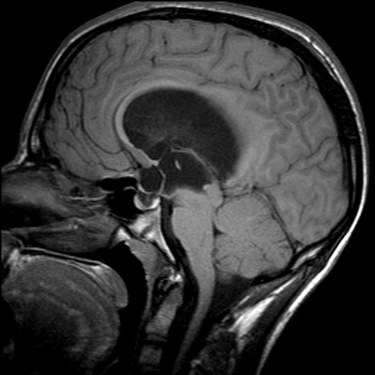 | 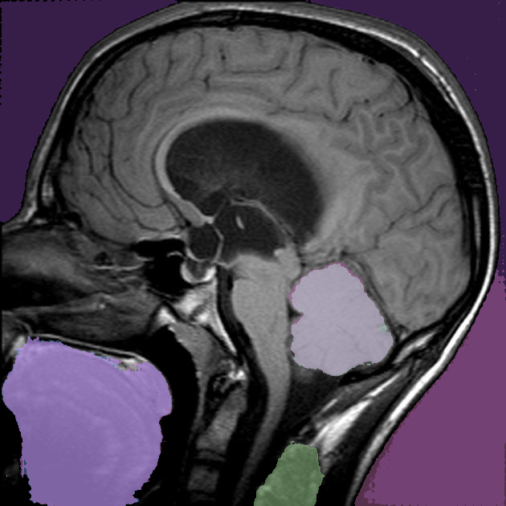 | 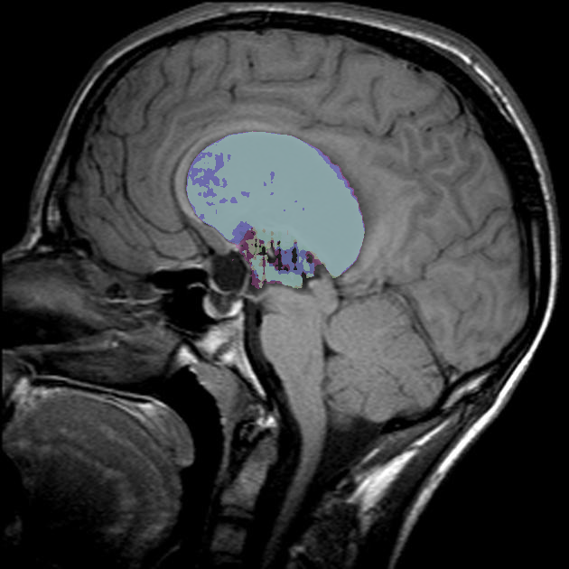 | 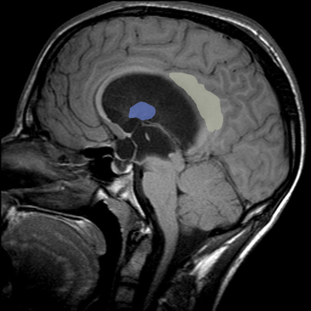 |

- 背景信息：无。
- 原始问题：What is the underlying cause? 根本病因是什么？
- 参考答案：Aqueductal stenosis. 导水管狭窄。
- 原始图片caption:
<pre>Midline sagittal T1 weighted image demonstrates marked hydrocephalus, with upward bowing and thinning of the corpus callosum, fenestration of the septum pellucidum and ballooning out of the third ventricular recesses. The superior part of the aqueduct is funnelled, whereas the distal part is stenosed.</pre>
<pre>正中矢状位 T1 加权像显示显著脑积水，胼胝体向上弓起并变薄，透明隔开窗，第三脑室隐窝呈球囊样扩张。导水管上段呈漏斗状，远端狭窄。</pre>
- **发生变化** Lingshu-32B: Incorrect → Correct；GPT-5.6-Luna-Pro: Incorrect → Correct

<strong>Lingshu-32B</strong>

**原始图像 → 原始 QA 回答**；评测：**Incorrect**

英文原始回答：

<pre>To determine the underlying cause from the provided MRI image, we need to carefully analyze the structures visible in the sagittal T1-weighted image of the brain. First, we observe the midline structures, including the corpus callosum, brainstem, and cerebellum. The ventricles appear normal in size, suggesting no hydrocephalus or significant atrophy. Next, we examine the pituitary gland region, which is located just below the hypothalamus and above the sphenoid sinus. In this image, there appears to be an abnormality in the sellar region, where the pituitary gland resides. This could indicate a pituitary adenoma, which is a common cause of various endocrine disorders due to hormone overproduction or underproduction. Given the location and appearance of the lesion, a pituitary adenoma is a plausible diagnosis. Further clinical correlation and possibly additional imaging or hormonal studies would be necessary to confirm this diagnosis.
### Final Answer: Pituitary adenoma</pre>

中文翻译：

<pre>为了根据提供的MRI图像确定潜在病因，我们需要仔细分析脑部矢状面T1加权像上可见的结构。首先，观察中线结构，包括胼胝体、脑干和小脑。脑室大小正常，提示不存在脑积水或明显的脑萎缩。接下来，检查垂体区域，该区域位于下丘脑下方、蝶窦上方。图像显示垂体所在的蝶鞍区存在异常。这可能提示垂体腺瘤，该病是导致激素分泌过多或过少进而引发多种内分泌疾病的常见原因。鉴于病变的位置和形态，垂体腺瘤是一个合理的诊断。确诊该病还需要结合临床表现，并可能需要进行进一步的影像学检查或激素水平测定。
最终诊断：垂体腺瘤</pre>

**原始图像 + Segmentation → 原始 QA 回答**；评测：**Correct**

英文原始回答：

<pre>To determine the underlying cause from the provided MRI images, we need to carefully analyze the anatomical structures and any abnormalities present. The images show a sagittal view of the brain, which allows us to examine the midline structures including the corpus callosum, brainstem, and cerebellum. In the segmented images, we can observe the lateral ventricles and other ventricular structures. One key observation is the presence of an enlarged ventricular system, particularly the lateral ventricles, which appear dilated. This dilation suggests an obstruction in the normal flow of cerebrospinal fluid (CSF), leading to hydrocephalus. The most common site for such an obstruction in the context of these images is the aqueduct of Sylvius, also known as the cerebral aqueduct, which connects the third and fourth ventricles. Obstruction at this site can lead to non-communicating hydrocephalus, where CSF accumulates above the blockage. Given the appearance of the ventricles and the typical causes of such a presentation, it is reasonable to conclude that the underlying cause is an obstruction of the aqueduct of Sylvius.
### Final Answer: Aqueductal stenosis</pre>

中文翻译：

<pre>为了根据提供的MRI图像确定根本病因，我们需要仔细分析解剖结构及存在的任何异常。图像展示了脑部的矢状面视图，使我们能够观察包括胼胝体、脑干和小脑在内的中线结构。在分割后的图像中，可见侧脑室及其他脑室结构。一个关键发现是脑室系统（尤其是侧脑室）扩大，呈现扩张状态。这种扩张提示脑脊液（CSF）的正常流动受阻，从而导致脑积水。结合图像特征，此类梗阻最常见的部位是连接第三脑室和第四脑室的西尔维乌斯导水管（即中脑导水管）。该部位的梗阻可导致非交通性脑积水，即脑脊液在梗阻近端积聚。综合脑室形态及此类病变的常见成因，可以合理推断其根本病因为西尔维乌斯导水管梗阻。
最终诊断：导水管狭窄</pre>

**原始图像 → Single-image caption 回答**；

英文原始回答：

<pre>The MRI image shows a sagittal view of the brain with a prominent cystic lesion in the suprasellar region, which is consistent with an arachnoid cyst. The cyst appears to be compressing the optic chiasm and possibly the hypothalamus, which could explain the patient&#x27;s symptoms of visual disturbances and headaches. The surrounding brain structures appear normal without signs of edema or mass effect. Given the patient&#x27;s history of progressive visual loss and the imaging findings, the diagnosis is likely an arachnoid cyst causing compression of the optic chiasm.</pre>

中文翻译：

<pre>MRI 图像显示脑部的矢状面视图，可见鞍上区有一明显的囊性病变，其特征符合蛛网膜囊肿。该囊肿似乎压迫了视交叉，并可能压迫下丘脑，这可以解释患者出现的视力障碍和头痛症状。周围脑组织结构未见异常，无水肿或占位效应征象。结合患者进行性视力丧失的病史及影像学表现，诊断很可能是导致视交叉受压的蛛网膜囊肿。</pre>

**原始图像 + Segmentation → Single-image caption 回答**；

英文原始回答：

<pre>The MRI image provided is a sagittal T1-weighted scan of the brain. The scan shows a clear view of the midline structures including the corpus callosum, cerebellum, brainstem, and ventricular system. Notably, there is an abnormal mass located in the posterior fossa region, which appears to be compressing the surrounding brain structures. This mass is likely a tumor, given its location and appearance. The lateral and third ventricles appear dilated, suggesting the presence of hydrocephalus, possibly secondary to the mass effect from the tumor. The cerebral aqueduct also seems to be involved, contributing to the obstruction of cerebrospinal fluid flow. Based on these observations, the diagnosis could be a posterior fossa tumor with associated obstructive hydrocephalus. Further imaging and clinical correlation are necessary for a definitive diagnosis and treatment planning.</pre>

中文翻译：

<pre>提供的MRI图像为脑部矢状面T1加权扫描。该扫描清晰显示了包括胼胝体、小脑、脑干及脑室系统在内的中线结构。值得注意的是，后颅窝区域可见一异常肿块，似乎压迫了周围的脑组织结构。鉴于其位置与形态特征，该肿块极可能为肿瘤。侧脑室及第三脑室呈扩张状态，提示存在脑积水，这可能是由肿瘤的占位效应继发引起的。中脑导水管似乎也受累，导致了脑脊液循环的梗阻。基于上述影像表现，初步诊断可能为后颅窝肿瘤伴梗阻性脑积水。为明确诊断及制定治疗方案，尚需结合进一步的影像学检查及临床资料进行综合评估。</pre>

**对模型对图片caption能力分析**：
关键点是“脑积水”，在没有seg的时候，对图片错误的caption理解成了“囊性病变，其特征符合蛛网膜囊肿”；但是再加入了seg之后成功注意到了“第三脑室呈扩张状态，提示存在脑积水”。

<strong>GPT-5.6-Luna-Pro</strong>

**原始图像 → 原始 QA 回答**；评测：**Incorrect**

英文原始回答：

<pre>**Likely finding:** Empty sella syndrome.

**Thinking clues:** The sella is filled with CSF-like low signal on T1, with the pituitary gland flattened along the sellar floor and the stalk traversing the space. This indicates downward herniation of the suprasellar arachnoid space.

**Underlying cause:** Usually chronically raised intracranial pressure—classically **idiopathic intracranial hypertension (pseudotumor cerebri)**—due to an incompetent/attenuated diaphragma sellae. Secondary causes include prior pituitary surgery, radiotherapy, infarction, or trauma.</pre>

中文翻译：

<pre>**可能诊断：** 空蝶鞍综合征（Empty sella syndrome）。
**影像特征：** 蝶鞍内充满呈脑脊液（CSF）样低信号的物质（T1加权像），垂体受压变扁并贴附于蝶鞍底部，垂体柄穿行于该空间内。这些征象提示鞍上蛛网膜下腔向下疝入蝶鞍。
**潜在病因：** 通常由蝶鞍隔（diaphragma sellae）发育不全或薄弱引起，并伴有慢性颅内压升高——典型病因为**特发性颅内高压（假性脑瘤）**。继发性病因包括既往垂体手术、放射治疗、梗死或外伤。。</pre>

**原始图像 + Segmentation → 原始 QA 回答**；评测：**Correct**

英文原始回答：

<pre>**Most likely underlying cause: obstructive (noncommunicating) hydrocephalus from cerebral aqueductal stenosis/obstruction.**

**Thinking clues:**
- The lateral ventricle is markedly enlarged.
- The third ventricle appears expanded.
- The fourth ventricle is not comparably enlarged.
- The cerebral aqueduct is very small/poorly visualized, suggesting obstruction at this level.
- This pattern is typical of **aqueductal stenosis**, which may be congenital or due to a small tectal/pineal-region lesion; no definite mass is evident on this single image.

The segmentation outputs are inconsistent—Medical-SAM3 appears to substantially over-segment, while BiomedParse under-segments the ventricular system—so the diagnosis should rely on the anatomic pattern rather than the masks alone.</pre>

中文翻译：

<pre>**最可能的根本病因：由大脑导水管狭窄/阻塞引起的梗阻性（非交通性）脑积水。**
**分析线索：**
- 侧脑室显著扩大。
- 第三脑室呈扩张状态。
- 第四脑室未见相应扩大。
- 大脑导水管极细或显示不清，提示该部位存在阻塞。
- 这种影像表现典型见于**大脑导水管狭窄**；其病因可能是先天性的，也可能继发于顶盖或松果体区的小病变（尽管仅凭此单张图像无法明确发现肿块）。
分割结果不一致——Medical-SAM3 似乎存在明显的过度分割，而 BiomedParse 则对脑室系统分割不足——因此，诊断应基于解剖学特征，而非仅仅依赖分割掩模（mask）。</pre>

**原始图像 → Single-image caption 回答**；

英文原始回答：

<pre>**Description:**  
Midline sagittal T1-weighted MRI demonstrates an enlarged sella turcica containing a well-defined sellar mass with suprasellar extension. The lesion is approximately isointense to gray matter on T1 and elevates/compresses the optic chiasm. The pituitary stalk and normal gland are not clearly separable from the mass.

**Impression/most likely diagnosis:**  
**Pituitary macroadenoma with suprasellar extension**, likely a nonfunctioning macroadenoma unless endocrine testing suggests a secreting tumor such as a prolactinoma.

Correlation with dedicated pituitary MRI sequences, contrast enhancement, visual-field testing, and pituitary hormone levels is recommended.</pre>

中文翻译：

<pre>**描述：**
正中矢状面T1加权MRI显示蝶鞍扩大，内见一边界清晰的肿块并向鞍上延伸。该病变在T1序列上呈大致等信号（与灰质相比），并抬高/压迫视交叉。垂体柄及正常垂体组织与肿块界限不清，无法明确区分。
**印象/最可能的诊断：**
**垂体大腺瘤伴鞍上延伸**；若内分泌检查未提示分泌性肿瘤（如泌乳素瘤），则倾向于无功能性大腺瘤。
建议结合垂体专用MRI序列、增强扫描、视野检查及垂体激素水平进行综合评估。</pre>

**原始图像 + Segmentation → Single-image caption 回答**；

英文原始回答：

<pre>**Image description:**  
Single midline sagittal T1-weighted brain MRI demonstrating marked enlargement of the supratentorial ventricular system, predominantly the lateral ventricle, with thinning/elevation of the corpus callosum and compression of the surrounding brain parenchyma. The third ventricle also appears enlarged. The cerebral aqueduct is not clearly assessed on this single slice. The posterior fossa and brainstem are relatively preserved.

The segmentation overlays are inconsistent: Medical-SAM3 broadly identifies the ventricular space but appears to oversegment and includes nonventricular regions, while BiomedParse substantially undersegments the ventricular system. Neither segmentation should replace direct image interpretation.

**Most likely diagnosis:**  
**Severe ventriculomegaly, most consistent with chronic obstructive hydrocephalus—possibly from aqueductal stenosis.**

Confirmation of the cause and assessment for acute pressure effects require the complete MRI examination, including axial/coronal sequences and ideally CSF-flow imaging. If this is a current study and the patient has headache, vomiting, visual symptoms, drowsiness, or gait/mental-status changes, urgent clinical assessment is warranted.</pre>

中文翻译：

<pre>正中矢状位 T1 MRI 显示幕上脑室系统显著扩大，以侧脑室最明显，并伴胼胝体变薄、抬高及周围脑实质受压；第三脑室也扩大。最可能为严重脑室扩大和慢性梗阻性脑积水，病因可能是导水管狭窄。模型再次说明两套分割均不完全可靠。</pre>

**对模型对图片caption能力分析**：
原始输入把病变误定位为蝶鞍并诊断空蝶鞍/垂体大腺瘤；加入脑室与导水管相关分割提示后，模型定位到：梗阻性脑积水和导水管狭窄。

### 1.2 [Congenital diaphragmatic hernia](https://radiopaedia.org/cases/congenital-diaphragmatic-hernia-26?lang=us) (`congenital-diaphragmatic-hernia-26`)

| Original image | Medical-SAM2 | Medical-SAM3: fetus, fetal chest, lung, bowel （胎儿、胎儿胸腔、肺、肠管） | BiomedParse v1: fetus, fetal chest, lung, bowel （胎儿、胎儿胸腔、肺、肠管） |
|---|---|---|---|
| 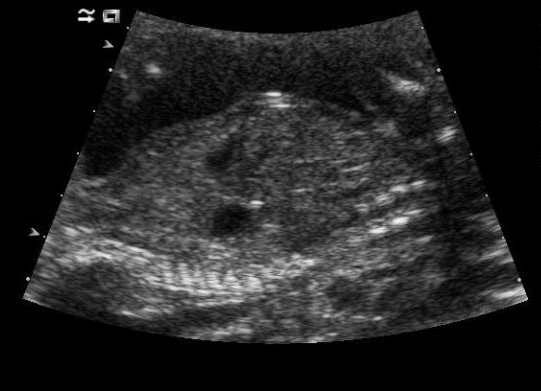 | 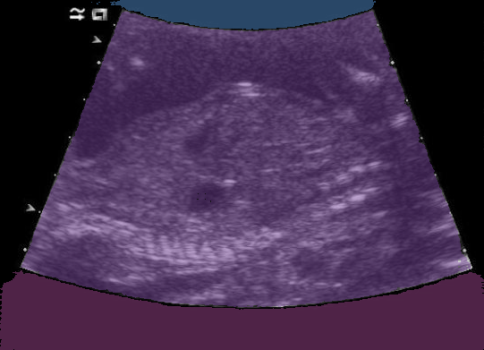 | 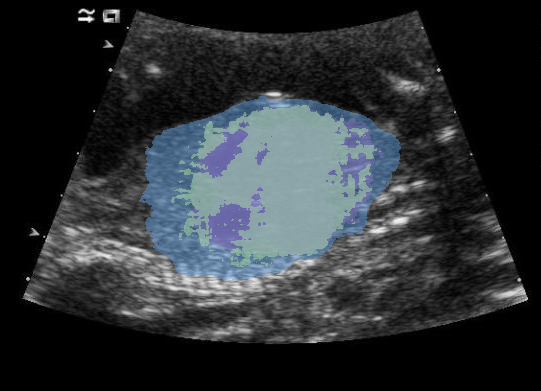 | 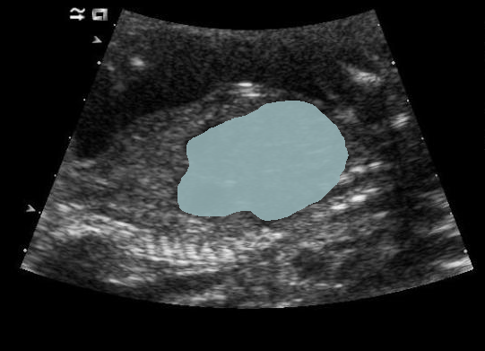 |

- 背景信息：Gender: Female; Presentation: Patient for second trimester scan (21/40). 女性，孕 21 周接受第二孕期超声检查。
- 原始问题：What is the diagnosis in this case? 本病例的诊断是什么？
- 参考答案：Congenital diaphragmatic hernia. 先天性膈疝。
- 原始图片caption:
<pre>Gastric bubble is seen in thorax, posterior to cardia.</pre>
<pre>胸腔内、贲门后方可见胃泡。</pre>
- **发生变化** InternVL3-14B: Incorrect → Correct；Lingshu-32B: Incorrect → Correct；GPT-5.6-Luna-Pro: Incorrect → Correct

<strong>InternVL3-14B</strong>

**原始图像 → 原始 QA 回答**；评测：**Incorrect**

英文原始回答：

<pre>Let&#x27;s analyze the ultrasound image and the given patient data to determine a potential diagnosis.

### Patient Data:
- **Gender:** Female
- **Presentation:** Second trimester scan (21/40 weeks)

### Image Analysis:
- **Modality:** Ultrasound
- **Findings:**
  - The image appears to show a transverse view of a developing fetus.
  - There are areas of different echogenicity, with some anechoic (dark) regions which could represent fluid-filled spaces.
  - The general structure suggests the presence of a developing placenta or perhaps a mass within the uterine cavity.

### Potential Diagnoses:
1. **Gestational Sac:**
   - Common in early pregnancy ultrasound.
   - Typically a round, anechoic area.
   - Appears compatible with the gestational age.

2. **Placenta:**
   - The placenta usually appears hypoechoic with a lobulated structure.
   - May be seen attached to the uterine wall.
   - Can present as a larger mass with some anechoic areas.

3. **Amniotic Fluid:**
   - The anechoic areas might be amniotic fluid surrounding the fetus.

4. **Possible Abnormality:**
   - The presence of any cystic or solid masses might suggest a molar pregnancy (hydatidiform mole), but these are usually more pronounced and have a characteristic appearance.

### Conclusion:
Given the context of a second-trimester ultrasound and the described image:
- It is most likely representing the uterus with the placenta and amniotic fluid.
- The appearance seems consistent with normal placental development and amniotic fluid at 21 weeks of gestation unless there are specific features suggesting abnormality.

Thus, the diagnosis is most likely:
**Normal second-trimester pregnancy with expected development of placenta and amniotic fluid.**

Without more specific features or additional views, a detailed definitive diagnosis would be challenging, but this analysis provides a reasonable conclusion based on the provided image.</pre>

中文翻译：

<pre>### 图像分析：
- **成像方式：** 超声波
- **影像所见：**
- 图像显示了发育中胎儿的横断面视图。 
- 存在回声强度不一的区域，其中包括一些无回声（暗色）区域，这些区域可能代表充满液体的腔隙。 
- 整体结构提示存在发育中的胎盘，或者可能是宫腔内的一个肿块。
### 潜在诊断：
1. **孕囊：**
- 常见于早孕期超声检查。 
- 通常表现为圆形的无回声区。 
- 影像特征与孕周相符。
2. **胎盘：**
- 胎盘通常呈低回声，具有分叶状结构。 
- 可见其附着于子宫壁。 
- 可能表现为较大的肿块，伴有部分无回声区。
3. **羊水：**
- 图像中的无回声区可能是环绕胎儿的羊水。
4. **可能的异常：**
- 若存在囊性或实性肿块，可能提示葡萄胎（水泡状胎块），但此类病变通常表现更为显著，且具有特征性外观。
### 结论：
结合孕中期超声检查的背景及上述图像特征：
- 图像最可能显示的是包含胎盘和羊水的子宫。
- 除非存在提示异常的特定征象，否则该影像表现与孕21周时正常的胎盘发育及羊水情况相符。
因此，最可能的诊断为：
**孕中期妊娠，胎盘及羊水发育正常。**</pre>

**原始图像 + Segmentation → 原始 QA 回答**；评测：**Correct**

英文原始回答：

<pre>To determine the diagnosis based on the provided ultrasound images, we need to analyze the segmentation of various structures:

1. **Image Analysis**:
   - The initial ultrasound image shows a fetus in the second trimester.
   - The segmented images from Medical-SAM2 and Medical-SAM3 focus on different parts of the fetus.
   - Medical-SAM3 specifically segments the fetal chest, lungs, and bowel. The segmentation outlines structures that should appear aerated or contain fluid in a normal lung, but appear less detailed or fluid-filled here.

2. **Assessment of Findings**:
   - In a normal fetal pulmonary system, lung fields should appear with characteristic hypoechoic (darker) areas representing lung tissue, typically contrasting with less dense areas indicating fluid or air.
   - The segmentation with irregular patterns or consolidation in the lung area might suggest pathology.

3. **Differential Diagnosis**:
   - The irregularities in lung segmentation, particularly involving the chest and lung regions, may suggest conditions such as Congenital Diaphragmatic Hernia (CDH), where abdominal organs herniate into the chest, displacing the lung and leading to underdeveloped lung tissue.
   - Alternatively, it could hint toward Pneumothorax or Pulmonary Hypoplasia, but based on the gestational age (21 weeks/40 weeks), CDH is more likely to be considered.

4. **Conclusion**:
   - Given the imaging and segmentation, a likely diagnosis is **Congenital Diaphragmatic Hernia (CDH)**:
     - The abnormal appearance of the lung segments may indicate underdevelopment due to intrauterine herniation of abdominal organs into the chest cavity.
     - CDH is commonly detected through prenatal ultrasound due to characteristic displacement and compression of lung tissue.

5. **Recommendation**:
   - Further fetal echocardiography and consultation with a perinatologist or fetal medicine specialist are recommended for definitive diagnosis and management planning.

The diagnosis in this case is likely **Congenital Diaphragmatic Hernia (CDH)**, based on the abnormal lung segmentation and displacement patterns visible in the ultrasound images.</pre>

中文翻译：

<pre>1. **图像分析**：
- 初始超声图像显示处于孕中期（second trimester）的胎儿。 
- Medical-SAM2 和 Medical-SAM3 生成的分割图像分别聚焦于胎儿的不同部位。 
- Medical-SAM3 专门分割了胎儿的胸部、肺部和肠道。分割结果勾勒出的结构，在正常肺部本应显示为充气或含液状态，但在此处却呈现出细节缺失或充满液体的特征。
2. **结果评估**：
- 在正常的胎儿肺部系统中，肺野应呈现出代表肺组织的特征性低回声（较暗）区域，并与代表液体或空气的低密度区域形成对比。 
- 肺部区域出现的分割异常形态或实变征象可能提示存在病变。
3. **鉴别诊断**：
- 肺部分割中的异常（特别是涉及胸部和肺部区域时）可能提示先天性膈疝（CDH）等病况；在 CDH 中，腹部器官疝入胸腔，导致肺部受压移位及肺组织发育不良。 
- 此外，这也可能提示气胸或肺发育不良，但结合孕周（21周/40周）来看，先天性膈疝（CDH）的可能性更大。
4. **结论**：
- 综合影像学表现及分割结果，可能的诊断为**先天性膈疝（CDH）**：
- 肺部区域的异常形态可能表明，由于腹部器官在宫内疝入胸腔，导致了肺组织发育不良。 
- 由于 CDH 伴随特征性的肺组织移位和受压，通常可通过产前超声检查发现。
5. **建议**：
- 建议进行进一步的胎儿超声心动图检查，并咨询围产医学专家或胎儿医学专家，以明确诊断并制定诊疗计划。
根据超声图像中可见的肺部分割异常及移位模式，本病例的诊断很可能是**先天性膈疝（CDH）**。</pre>

**原始图像 → Single-image caption 回答**；

英文原始回答：

<pre>The image provided is an ultrasound scan taken during the second trimester of pregnancy, specifically around 21 weeks and 4 days of gestation. The grayscale image depicts a sonographic view typical for a mid-trimester anatomical survey.

### Description of the Image:

1. **Scan Plane and Settings**:
    - The scan appears to be in a transverse orientation commonly used in mid-pregnancy anatomy surveys.
    - The texture suggests it is an abdominal ultrasound using gel on the patient&#x27;s skin with a convex transducer.

2. **Anatomical Structures**:
    - The grayscale image includes various shades of black, white, and gray, indicating different tissue densities.
    - There are areas of brightness (echogenic) and darkness (anechoic to hypoechoic), which help delineate different structures.
    - Near the top center, there is a roundish anechoic area that could represent part of a fluid-filled structure, such as amniotic fluid, a cyst, or a vessel.
    - The overall texture appears heterogeneous, typical of a soft tissue environment, possibly the placenta or fetal structures.

3. **Potential Fetal Anatomy**:
    - Without direct visibility of the fetal outline or anatomical markers, this particular frame does not show definitive features such as limbs, spine, or fetal face that are typically assessed in this type of scan.
    - However, the central heterogeneous region could represent the fetus or placental tissue.

### Diagnosis and Clinical Considerations:

1. **Common Findings at 21 Weeks**:
    - At 21 weeks, the focus of the ultrasound usually includes evaluating fetal growth, anatomical formations, amniotic fluid volume, and placental location.
    - The image should ideally assess the presence of the major organs, their positioning, and any growth abnormalities.
  
2. **Ultrasound Findings**:
    - The anechoic or hypoechoic area could be indicative of a normal feature like amniotic fluid or blood vessels. If it&#x27;s a large anechoic area without defined borders, further evaluation might be required to rule out conditions such as polyhydramnios or a cyst.
    - The overall heterogeneous texture should prompt a closer examination for placental abnormalities or potential cystic formations if they are persistent.

3. **Potential Diagnoses**:
    - **Normal Fetal Development**: If the features align with standard anatomy and no anomalies are observed.
    - **Placental Abnormalities**: Such as placenta previa or low-lying placenta, especially if scanning the lower uterine segment.
    - **Fetal Anomalies**: While this single frame doesn’t give clear indications, an abnormality might be suspected based on further images in the scan.
    - **Cystic Structures**: If this region is cystic and suspicious, further scanning and characterization might be needed.

### Conclusion:

While this ultrasound image alone doesn&#x27;t yield a definitive diagnosis, it’s a snapshot that should be correlated with other views and clinical findings. The heterogeneous texture and the presence of an anechoic area should be noted, and further imaging might be warranted to ensure normal fetal development and maternal health. The definitive diagnosis would depend on a thorough evaluation by a radiologist or obstetrician who can interpret the full set of images and any accompanying clinical data.</pre>

中文翻译：

<pre>模型仅把该图描述为约孕 21 周的常规超声切面，提到组织回声不均和一个无回声区，可能对应羊水、血管或囊性结构；单张图无法给出明确诊断。</pre>

**原始图像 + Segmentation → Single-image caption 回答**；

英文原始回答：

<pre>This image is an ultrasound scan obtained during the second trimester of pregnancy. The scan is used to assess fetal development and evaluate the health of the pregnancy. Ultrasound imaging is commonly performed around 20 weeks to check the anatomy of the fetus, including the heart, brain, spine, and limbs.

The image shows:

1. An outline of the fetus, as detected by segmentation overlays.
2. Different shades of gray representing various tissues and structures within the fetus and surrounding amniotic fluid.
  
### Evaluation of the Ultrasound:
- **Fetal Outline:** The image appears to show a mostly symmetrical and well-defined shape, suggesting that the fetus may have normal anatomical proportions.
- **Fetal Structures:** Specific structures such as the chest, lungs, and possibly parts of the bowel are highlighted in the segmentation.

### Potential Findings:
- **Normal Development:** The ultrasound looks relatively normal without obvious signs of major congenital abnormalities.
- **Fluid Levels:** The amniotic fluid levels should be assessed to ensure they are within normal limits, though this isn&#x27;t clearly visible here.

### Diagnosis:
Based on the image provided alone, a definitive diagnosis cannot be made. However, the scan seems to show a fetus with standard anatomical presentation. Typically, abnormalities would present as irregularities in shape, unusual echogenicity (bright or dark spots), or lack of expected structures.

For an accurate diagnosis, a detailed evaluation by a radiologist or obstetrician is essential, including:

- **Detailed Measurements:** Assessment of the fetal head circumference, biparietal diameter, and other critical measurements.
- **Further Scans:** Additional views or scans might be required to get a comprehensive analysis.
- **Development Evaluation:** Checking the presence and structure of critical organs and limbs.

Always follow up with a healthcare provider for a professional interpretation and evaluation of the ultrasound images.</pre>

中文翻译：

<pre>加入分割后，模型能够把画面定位为胎儿及其胸腔、肺和部分肠管，但仍认为解剖外观大致正常，明确称没有立即可见的先天性膈疝或其他胸部结构异常。</pre>

**对模型对图片caption能力分析**：
原始 caption 不能确定胎儿切面，加入 segmentation 后能定位胎儿胸腔、肺和肠管，并且QA 根据“肺部分割中的异常（特别是涉及胸部和肺部区域时）”答对膈疝；但SEG后的 caption 仍称胎儿胸部正常、未见膈疝。seg结果对模型caption能力提升存疑，但是却能够在QA中成功定位图片特征。

<strong>Lingshu-32B</strong>

**原始图像 → 原始 QA 回答**；评测：**Incorrect**

英文原始回答：

<pre>To determine the diagnosis from the ultrasound image, we start by identifying key anatomical structures visible in the scan. The image appears to be a transverse section of the fetal anatomy. We should look for the presence of the four chambers of the heart, which include the right atrium, right ventricle, left atrium, and left ventricle. In a normal cardiac anatomy, these chambers should be clearly distinguishable. Additionally, we should assess the position of the great vessels, such as the aorta and pulmonary artery, to ensure they are in their typical locations. The absence of any abnormal connections or malpositions of these vessels is crucial. Given that the image is from a second-trimester scan, it is important to check for any signs of congenital heart defects, such as ventricular septal defects or atrial septal defects. After a thorough examination of the image, if all structures appear normal and there are no signs of abnormalities, the diagnosis would be normal cardiac anatomy.
### Final Answer: Normal</pre>

中文翻译：

<pre>要根据超声图像做出诊断，我们首先需要识别扫描影像中可见的关键解剖结构。该图像呈现的是胎儿解剖结构的横切面。我们需要观察心脏的四个心腔，即右心房、右心室、左心房和左心室。在正常的心脏解剖结构中，这些心腔应当清晰可辨。此外，还需评估主动脉和肺动脉等大血管的位置，以确保它们位于正常解剖部位；确认这些血管不存在异常连接或位置错乱至关重要。鉴于该图像来自孕中期扫描，必须仔细检查是否存在先天性心脏缺陷的征象，例如室间隔缺损或房间隔缺损。经全面检查图像后，若所有结构均显示正常且无异常征象，则诊断结果为心脏解剖结构正常。
### 最终答案：正常</pre>

**原始图像 + Segmentation → 原始 QA 回答**；评测：**Correct**

英文原始回答：

<pre>To determine the diagnosis from the ultrasound image provided, we need to carefully analyze the structures visible in the image. The image appears to be a cross-sectional view of the fetal thorax and abdomen. Key structures to identify include the lungs, heart, liver, and bowel. 

1. **Lung Assessment**: In a normal fetal ultrasound, the lungs should appear as echogenic (bright) structures due to their air content. If the lungs appear hypoechoic or not clearly delineated, it could suggest a pathology such as pulmonary hypoplasia or pleural effusion.

2. **Heart Position and Size**: The heart should be centrally located and of normal size. Any deviation from this could indicate cardiac anomalies or other conditions affecting the thoracic cavity.

3. **Bowel Position**: The bowel should be located within the abdominal cavity. If there is any abnormal positioning or herniation into the thoracic cavity, it could suggest a diaphragmatic hernia.

Upon examining the image, there seems to be an abnormality where the bowel loops are visible in the thoracic cavity, which is not typical. This suggests that there might be a defect in the diaphragm allowing abdominal contents to herniate into the chest. This is consistent with a diagnosis of congenital diaphragmatic hernia (CDH).

Therefore, based on the visual cues and the typical presentation of CDH in ultrasound images, the most likely diagnosis is a congenital diaphragmatic hernia.
### Final Answer: Congenital Diaphragmatic Hernia</pre>

中文翻译：

<pre>要根据提供的超声图像确定诊断，我们需要仔细分析图像中可见的结构。该图像显示的是胎儿胸部和腹部的横截面视图。需要识别的关键结构包括肺、心脏、肝脏和肠道。
1. **肺部评估**：在正常的胎儿超声检查中，由于含有空气，肺部应呈现为高回声（明亮）结构。如果肺部呈现低回声或轮廓不清，可能提示存在肺发育不良或胸腔积液等病变。
2. **心脏位置与大小**：心脏应位于中央且大小正常。任何偏离正常情况的表现都可能提示心脏畸形或其他影响胸腔的病况。
3. **肠道位置**：肠道应位于腹腔内。如果出现位置异常或疝入胸腔的情况，则可能提示膈疝。
观察图像可见，胸腔内出现了肠管影，这属于异常表现。这提示膈肌可能存在缺损，导致腹腔内容物疝入胸腔。这一征象符合先天性膈疝（CDH）的诊断特征。
因此，根据图像特征及先天性膈疝在超声影像中的典型表现，最可能的诊断是先天性膈疝。
### 最终诊断：先天性膈疝</pre>

**原始图像 → Single-image caption 回答**；

英文原始回答：

<pre>The ultrasound image shows a cross-sectional view of the fetal anatomy at 21 weeks of gestation. The image reveals a well-defined structure with varying echogenicity, indicating different tissue densities. The central area appears to be the fetal head, with surrounding structures likely representing the developing brain and skull. The surrounding amniotic fluid is visible as a hypoechoic (dark) region. There are no obvious abnormalities such as structural deformities or unusual fluid collections. Based on this image, the fetus appears to be developing normally for the gestational age. However, further detailed examination and comparison with standard fetal development charts would be necessary to confirm normalcy and rule out any subtle anomalies.</pre>

中文翻译：

<pre>该超声图像显示了孕21周时胎儿解剖结构的横截面视图。图像呈现出一个轮廓清晰且回声强度不一的结构，反映了组织密度的差异。中心区域显示为胎儿头部，周围结构可能代表了正在发育的大脑和颅骨。周围的羊水呈现为低回声（暗色）区域。未见结构畸形或异常积液等明显异常。根据该图像，胎儿的发育情况似乎与孕周相符。然而，仍需进行更详细的检查并与标准胎儿发育图表进行比对，以确认发育正常并排除任何细微异常。</pre>

**原始图像 + Segmentation → Single-image caption 回答**；

英文原始回答：

<pre>The ultrasound image shows a cross-sectional view of the fetal thorax. The segmented areas indicate the presence of the fetal chest, lungs, and bowel. The segmentation highlights the anatomical structures within the thoracic cavity, including the lungs and surrounding tissues. The image appears to be well-defined, allowing for clear visualization of these structures. Based on the segmentation and the clarity of the image, there are no immediate signs of abnormalities such as congenital diaphragmatic hernia or other structural anomalies in the thoracic region. The fetal chest and lungs appear to be developing normally at this stage of pregnancy.</pre>

中文翻译：

<pre>该超声图像显示了胎儿胸部的横截面视图。图像中的分割区域标示出了胎儿的胸廓、肺部及肠管。这种分割处理突显了胸腔内的解剖结构，包括肺部及其周围组织。图像清晰度高，能够清楚地显示这些结构。根据分割结果及图像的清晰度，未见先天性膈疝或其他胸部结构异常的明显征象。在目前的孕周阶段，胎儿胸部及肺部的发育情况看起来正常。</pre>

**对模型对图片caption能力分析**：
加入 segmentation 后QA任务正确定位到胎儿胸腔，不过仍在 caption 任务中模型却否认膈疝。seg结果对模型caption能力提升存疑，但是却能够在QA中成功定位图片特征。

<strong>GPT-5.6-Luna-Pro</strong>

**原始图像 → 原始 QA 回答**；评测：**Incorrect**

英文原始回答：

<pre>**Most likely diagnosis: Congenital pulmonary airway malformation (CPAM/CCAM), likely macrocystic type.**

**Clues:**
- A predominantly echogenic fetal thoracic mass.
- Internal anechoic/cystic spaces.
- Appearance during the mid-trimester anatomy scan.
- This pattern is typical of a unilateral cystic lung lesion, rather than a simple pleural effusion.

A differential consideration would be **pulmonary sequestration** or a **left-sided congenital diaphragmatic hernia**, but the cystic echogenic mass favors **CPAM**.</pre>

中文翻译：

<pre>**最可能的诊断：先天性肺气道畸形（CPAM/CCAM），倾向于大囊型。**
**线索：**
- 胎儿胸腔内可见以高回声为主的肿块。
- 肿块内部可见无回声区/囊性腔隙。
- 在孕中期胎儿结构筛查中发现。
- 这种影像学表现典型地提示为单侧囊性肺病变，而非单纯的胸腔积液。
鉴别诊断需考虑**肺隔离症**或**左侧先天性膈疝**，但该囊性高回声肿块的特征更支持**CPAM**的诊断。</pre>

**原始图像 + Segmentation → 原始 QA 回答**；评测：**Correct**

英文原始回答：

<pre>**Most likely diagnosis: Congenital diaphragmatic hernia (CDH), probably a left-sided posterolateral/Bochelak hernia with herniation of abdominal bowel into the fetal thorax.**

**Thinking clues:**
- The fetal chest contains an abnormal heterogeneous echogenic mass rather than uniformly aerated lung.
- Cystic/anechoic tubular areas within the thorax are compatible with herniated bowel.
- The normal thoracic anatomy appears crowded, suggesting lung compression and possible mediastinal displacement.
- At around 21 weeks, bowel or stomach seen above the diaphragm is a key prenatal clue for CDH.

A detailed scan would assess the side, liver position, stomach location, mediastinal shift, and observed-to-expected lung-to-head ratio for prognosis.</pre>

中文翻译：

<pre>**最可能的诊断：先天性膈疝（CDH），很可能是左侧后外侧疝（Bochdalek疝），伴有腹腔肠管疝入胎儿胸腔。**
**分析线索：**
- 胎儿胸腔内可见异常的混合回声团块，而非充气均匀的正常肺组织。
- 胸腔内可见囊性/无回声管状结构，符合疝入肠管的特征。
- 胸腔正常解剖结构受挤压，提示肺受压及可能存在纵隔移位。
- 孕约21周时，若在膈肌上方观察到肠管或胃，是产前诊断CDH的关键线索。
需进行详细超声检查，评估病变侧别、肝脏及胃的位置、纵隔移位情况，并测量“实测/预期肺头比”（O/E LHR）以评估预后。</pre>

**原始图像 → Single-image caption 回答**；

英文原始回答：

<pre>The ultrasound shows a transverse view of the fetal upper abdomen with **two adjacent fluid-filled spaces (“double-bubble” appearance)**, representing a distended stomach and proximal duodenum.

**Diagnosis: fetal duodenal atresia causing proximal small-bowel obstruction.**  
This is typically diagnosed in the second trimester and may be associated with polyhydramnios and chromosomal abnormalities, particularly trisomy 21. Further detailed anomaly assessment and genetic counselling/testing would be appropriate.</pre>

中文翻译：

<pre>超声显示胎儿上腹部的横切面，可见**两个相邻的充满液体的腔隙（呈“双泡征”表现）**，分别代表扩张的胃和近端十二指肠。
**诊断：胎儿十二指肠闭锁，导致近端小肠梗阻。**
该病通常在妊娠中期被诊断，可能伴有羊水过多及染色体异常（尤其是21-三体综合征）。建议进行进一步的详细畸形评估及遗传咨询/检测。</pre>

**原始图像 + Segmentation → Single-image caption 回答**；

英文原始回答：

<pre>The ultrasound shows a 21-week fetus in a transverse thoracoabdominal view. The fetal thorax appears relatively heterogeneous, with a focal cystic/low-echo region within the echogenic lung tissue. The automated segmentations broadly identify the fetus and thoracic/lung region, although the masks are not sufficiently precise to define the lesion or establish a diagnosis.

**Most likely diagnosis:** a fetal lung malformation, particularly **congenital pulmonary airway malformation (CPAM)**, likely a macrocystic or mixed type.

**Differential considerations** include bronchopulmonary sequestration, foregut duplication cyst, or less likely a technical/artifactual appearance. Assessment should include targeted ultrasound with lesion measurements, evaluation of mediastinal shift and hydrops, and color Doppler to look for a systemic feeding artery. Follow-up imaging and, if needed, fetal MRI are recommended. A definitive diagnosis cannot be made from this single still image alone.</pre>

中文翻译：

<pre>超声图像显示一例孕21周胎儿的胸腹部横切面。胎儿胸部回声相对不均匀，高回声肺组织内可见局灶性囊性/低回声区。自动分割算法大致识别出了胎儿及胸部/肺部区域，但生成的掩模（mask）精度不足以明确病变特征或确立诊断。
**最可能的诊断：** 胎儿肺部畸形，特别是**先天性肺气道畸形（CPAM）**，倾向于大囊型或混合型。
**鉴别诊断**包括肺隔离症、前肠重复囊肿，或（可能性较低的）技术性/伪影表现。后续评估应包括针对性超声检查（测量病变大小、评估纵隔移位及胎儿水肿情况）以及彩色多普勒超声检查（以探查是否存在体循环供血动脉）。建议进行影像学随访，必要时行胎儿MRI检查。仅凭此单张静态图像无法做出确切诊断。</pre>

**对模型对图片caption能力分析**：
原始 caption 从胎儿上腹“双泡征”误诊十二指肠闭锁；加入 segmentation 后至少将病变定位到胎儿胸腔，但仍误诊 CPAM。QA 从 CPAM 改为先天性膈疝，**说明定位有所改善，但病灶性质辨别仍不稳定**。

### 1.3 [Fetal cardiac rhabdomyoma](https://radiopaedia.org/cases/fetal-cardiac-rhabdomyoma-1?lang=us) (`fetal-cardiac-rhabdomyoma-1`)

| Original image | Medical-SAM2 | Medical-SAM3: fetal heart, heart, cardiac mass （胎心、心脏、心脏肿块） | BiomedParse v1: fetal heart, heart, cardiac mass （胎心、心脏、心脏肿块） |
|---|---|---|---|
| 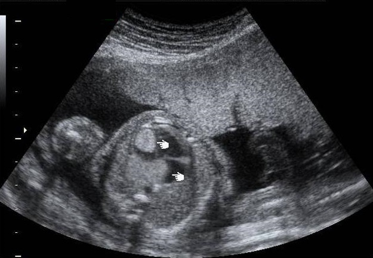 | 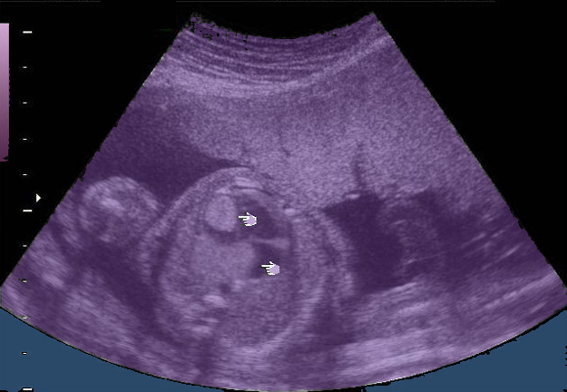 | 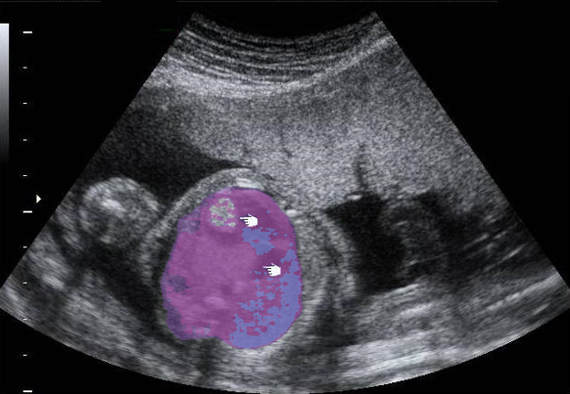 | 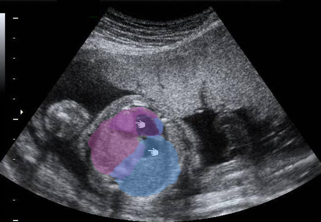 |

- 背景信息：Age: 20 weeks gestation Gender: Female; Presentation: Antenatal scan at 20 weeks 孕 20 周女性，接受产前超声检查。
- 原始问题：What is the most likely diagnosis? 最可能的诊断是什么？
- 参考答案：Cardiac rhabdomyoma. 心脏横纹肌瘤。
- 原始图片caption:
<pre>An echogenic lesion is seen within the left atrioventricular region.</pre>
<pre>左侧房室区可见一高回声病变。。</pre>
- **发生变化** Qwen3-VL-32B: Incorrect → Correct

<strong>Qwen3-VL-32B</strong>

**原始图像 → 原始 QA 回答**；评测：**Incorrect**

英文原始回答：

<pre>**Thinking Clues:**

1. **Gestational Age**: 20 weeks gestation — this is the time of the **anatomy scan**, where major fetal structures are evaluated. Abnormalities are often detected at this stage.

2. **Modality**: Ultrasound — standard for fetal imaging. The image is a grayscale sonogram showing fetal anatomy.

3. **Image Interpretation**:
   - The image appears to show a **transverse section of the fetal abdomen or thorax**.
   - There is a **circular, well-defined, anechoic (dark) structure** with **echogenic (bright) walls**.
   - Two **white arrows** are pointing to **two separate, round, echogenic (bright) structures within or adjacent to the anechoic area**.
   - The overall appearance suggests a **dilated cavity** with **internal echoes or masses**.

4. **Key Features to Consider**:
   - The **anechoic area** could represent fluid-filled space (e.g., cyst, dilated bowel, urinary tract).
   - The **echogenic structures** within it may represent **solid masses, calcifications, or echogenic bowel**.
   - The **location** — if this is the fetal abdomen, it could be the **gastrointestinal tract**, **kidneys**, or **liver**.

5. **Differential Diagnosis**:
   - **Cystic hygroma** — typically in the neck, not abdomen.
   - **Fetal ascites** — generalized fluid in abdomen, not usually with internal echogenic structures.
   - **Gastrointestinal duplication cyst** — possible, but rare.
   - **Meconium peritonitis** — usually associated with bowel perforation, may show calcifications (echogenic foci).
   - **Fetal cystic renal disease** — e.g., multicystic dysplastic kidney (MCDK), but typically unilateral and in the flank.
   - **Omphalocele or gastroschisis** — would show bowel outside the abdomen, not a fluid-filled cavity with internal echoes.
   - **Echogenic bowel** — seen in the fetal bowel, may be associated with infection, cystic fibrosis, or chromosomal abnormalities.

6. **Most Likely Diagnosis**:
   - The **anechoic cavity with internal echogenic foci** strongly suggests **meconium peritonitis** — which occurs when fetal bowel perforates, releasing meconium into the peritoneal cavity, causing inflammation and calcification (seen as echogenic foci).
   - Meconium peritonitis is often associated with **bowel atresia** or **volvulus**.
   - The **gestational age** (20 weeks) is appropriate for detection — meconium peritonitis can be detected in mid-trimester.
   - The **echogenic foci** are classic for **calcifications** from the inflammatory response to meconium.

---

**Answer: Meconium peritonitis**

This is the most likely diagnosis based on the ultrasound appearance of a fluid-filled cavity with internal echogenic foci in the fetal abdomen at 20 weeks gestation.</pre>

中文翻译：

<pre>**思考线索：**
1. **孕周**：孕20周——这是进行**胎儿结构超声检查**（anatomy scan）的时期，旨在评估胎儿的主要解剖结构。许多异常往往在这一阶段被发现。
2. **检查方式**：超声——胎儿影像检查的标准手段。该图像为显示胎儿解剖结构的灰阶超声图像。
3. **图像解读**：
- 图像显示的是**胎儿腹部或胸部的横切面**。 
- 可见一个**圆形、边界清晰、无回声（暗色）的结构**，其**壁呈高回声（亮色）**。 
- 两枚**白色箭头**指向**无回声区域内或其邻近处的两个独立的圆形高回声（亮色）结构**。 
- 整体外观提示这是一个**扩张的腔隙**，内部含有**回声或团块**。
4. **需考虑的关键特征**：
- **无回声区域**可能代表充满液体的空间（例如：囊肿、扩张的肠管、泌尿道）。 
- 其中的**高回声结构**可能代表**实性肿块、钙化灶或高回声肠管**。 
- **位置**——如果是胎儿腹部，可能涉及**胃肠道**、**肾脏**或**肝脏**。
5. **鉴别诊断**：
- **囊性水瘤**（Cystic hygroma）——通常位于颈部，而非腹部。 
- **胎儿腹水**（Fetal ascites）——腹腔内弥漫性积液，通常不伴有内部高回声结构。 
- **胃肠道重复囊肿**（Gastrointestinal duplication cyst）——有可能，但罕见。 
- **胎粪性腹膜炎**（Meconium peritonitis）——通常与肠穿孔有关，可能显示钙化（高回声灶）。 
- **胎儿囊性肾病**（Fetal cystic renal disease）——例如多囊性发育不良肾（MCDK），但通常为单侧且位于腰腹侧部。 
- **脐膨出或腹裂**（Omphalocele or gastroschisis）——表现为肠管位于腹腔外，而非内部有回声的充满液体的腔隙。 
- **高回声肠管**（Echogenic bowel）——见于胎儿肠管，可能与感染、囊性纤维化或染色体异常有关。 6. **最可能的诊断**：
- 伴有**内部强回声灶**的**无回声腔隙**强烈提示**胎粪性腹膜炎**——这是由于胎儿肠道穿孔，导致胎粪进入腹膜腔，进而引发炎症和钙化（表现为强回声灶）所致。 
- 胎粪性腹膜炎常与**肠闭锁**或**肠扭转**相关。 
- 此时的**孕周**（20周）适于检出该病——胎粪性腹膜炎可在妊娠中期被发现。 
- 其中的**强回声灶**是因胎粪引起的炎症反应所致**钙化**的典型表现。
**答案：胎粪性腹膜炎**
根据孕20周时胎儿腹部出现的“伴有内部强回声灶的充满液体的腔隙”这一超声表现，这是最可能的诊断。</pre>

**原始图像 + Segmentation → 原始 QA 回答**；评测：**Correct**

英文原始回答：

<pre>**Thinking Clues:**

1. **Gestational Age**: The patient is at 20 weeks gestation — this is the typical timing for a detailed anatomical survey (anatomy scan), where cardiac anomalies are often detected.

2. **Imaging Modality**: The image is an ultrasound, which is the primary tool for fetal cardiac assessment during pregnancy.

3. **Visual Features in the Image**:
   - The original ultrasound image shows a fetal thoracic structure with two distinct, bright, rounded echogenic areas (indicated by the white hand cursors) within a larger, somewhat heterogeneous structure.
   - These bright areas are likely **calcified or echogenic masses** within the fetal heart or adjacent structures.
   - The segmentation from **Medical-SAM3** highlights a large, irregularly shaped mass (purple) within the fetal thorax, suggesting a **cardiac mass**.
   - **BiomedParse** further segments the mass into two parts — possibly differentiating chambers or components of the mass — and shows a large blue area below, possibly representing a chamber or surrounding tissue.

4. **Clinical Context**:
   - Fetal cardiac masses are rare but can be life-threatening.
   - The most common fetal cardiac mass is **fetal rhabdomyoma**, which is often associated with **Tuberous Sclerosis Complex (TSC)**.
   - Rhabdomyomas appear as **echogenic, well-circumscribed, intracavitary or intramural masses** in the fetal heart, often multiple, and may be calcified.
   - They are typically **benign**, but can cause arrhythmias or heart failure in utero.
   - The presence of **multiple echogenic foci** (as suggested by the two cursors) is highly suggestive of **multiple rhabdomyomas**.

5. **Segmentation Interpretation**:
   - Medical-SAM2’s full purple segmentation may be over-segmenting the entire thorax, lacking specificity.
   - Medical-SAM3 and BiomedParse show more focused segmentation of the cardiac region with a mass, supporting the presence of a **cardiac tumor**.
   - BiomedParse’s segmentation into two parts may reflect two distinct masses or different components (e.g., right vs. left ventricle involvement).

6. **Differential Diagnosis**:
   - **Fetal rhabdomyoma** – Most common fetal cardiac tumor, associated with TSC.
   - **Teratoma** – Less common, often midline, may contain cystic or mixed components.
   - **Fibroma** – Rare, usually solitary, more solid.
   - **Myxoma** – Extremely rare in fetus.
   - **Lymphangioma or hemangioma** – Rare, usually not echogenic.

7. **Key Clue**: The presence of **multiple, echogenic, intracardiac masses** at 20 weeks is **highly characteristic of fetal rhabdomyoma**, especially when associated with **Tuberous Sclerosis Complex**.

---

**Most Likely Diagnosis: Fetal cardiac rhabdomyoma (likely associated with Tuberous Sclerosis Complex)**

This is the most probable diagnosis given the gestational age, imaging features (multiple echogenic masses in the fetal heart), and the typical appearance of rhabdomyomas on ultrasound. Further evaluation (e.g., genetic testing for TSC, detailed fetal echocardiogram, maternal/fetal MRI) would be indicated to confirm the diagnosis and assess for extracardiac manifestations.</pre>

中文翻译：

<pre>**思考线索：**
1. **孕周**：患者处于妊娠20周——这是进行详细解剖结构检查（大排畸超声）的典型时期，此时常能发现心脏异常。
2. **成像方式**：该图像为超声图像，是孕期评估胎儿心脏的主要手段。
3. **图像视觉特征**：
- 原始超声图像显示了胎儿胸腔结构，其中一个较大的、回声不均匀的结构内包含两个清晰、明亮、圆形的强回声区（由白色手形光标标示）。 
- 这些明亮区域很可能是胎儿心脏或邻近结构内的**钙化灶或强回声肿块**。 
- **Medical-SAM3** 的分割结果突显了胎儿胸腔内一个形状不规则的大肿块（紫色），提示存在**心脏肿块**。 
- **BiomedParse** 进一步将该肿块分割为两部分——可能区分了不同的心腔或肿块的不同成分——并显示下方有一大片蓝色区域，可能代表心腔或周围组织。
4. **临床背景**：
- 胎儿心脏肿块虽罕见，但可能危及生命。 
- 最常见的胎儿心脏肿块是**胎儿横纹肌瘤**，常与**结节性硬化症（TSC）**相关。 
- 横纹肌瘤在胎儿心脏中表现为**强回声、边界清晰、位于心腔内或心肌壁内的肿块**，常呈多发性，并可能伴有钙化。 
- 它们通常为**良性**，但在宫内可能导致心律失常或心力衰竭。 
- 存在**多个强回声灶**（如两个光标所示）高度提示为**多发性横纹肌瘤**。
5. **分割结果解读**：
- Medical-SAM2 呈现的完整紫色分割区域可能涵盖了整个胸腔，存在过度分割的问题，缺乏特异性。 
- Medical-SAM3 和 BiomedParse 显示了针对含肿块心脏区域的更精准分割，支持存在**心脏肿瘤**的判断。 
- BiomedParse 将其分割为两部分，可能反映了两个独立的肿块或肿块的不同组成部分（例如，累及右心室与左心室）。 6. **鉴别诊断**：
- **胎儿横纹肌瘤** – 最常见的胎儿心脏肿瘤，与结节性硬化症（TSC）相关。 
- **畸胎瘤** – 较少见，常位于中线，可包含囊性或混合性成分。 
- **纤维瘤** – 罕见，通常为单发，质地较实。 
- **黏液瘤** – 在胎儿中极罕见。 
- **淋巴管瘤或血管瘤** – 罕见，通常无明显回声（或呈低回声）。
7. **关键线索**：孕20周时发现**多个心内高回声肿块**，是**胎儿横纹肌瘤的典型特征**，尤其是当伴有**结节性硬化症**时。
**最可能的诊断：胎儿心脏横纹肌瘤（可能伴有结节性硬化症）**
综合孕周、影像学特征（胎儿心脏内多个高回声肿块）以及横纹肌瘤在超声下的典型表现，这是最可能的诊断。建议进行进一步评估（如TSC基因检测、详细胎儿超声心动图、母体/胎儿MRI），以确诊并评估是否存在心脏外病变。

分割提示胎心、心脏和心脏肿块后，模型识别到多发高回声心内肿块，认为最符合胎儿心脏横纹肌瘤，并提示与结节性硬化综合征相关，建议胎儿超声心动图和遗传学评估。</pre>

**原始图像 → Single-image caption 回答**；

英文原始回答：

<pre>The provided ultrasound image is from a 20-week gestation female fetus, obtained during a routine antenatal scan. The image appears to be a transverse (axial) view of the fetal thorax, likely in the four-chamber view of the heart.

**Image Description:**

- The image shows a fetal thoracic cross-section with the heart centrally located.
- Two white arrows are pointing to structures within the cardiac silhouette.
- The heart appears to be midline, with two distinct chambers visible — consistent with the left and right atria and ventricles in a four-chamber view.
- The fetal heart is surrounded by echogenic myocardium, and the chambers are filled with anechoic (dark) blood.
- The fetal ribs and chest wall are visible as curvilinear, echogenic structures surrounding the heart.
- The overall cardiac size and shape appear normal for gestational age.
- The cardiac walls appear of normal thickness, and there is no obvious evidence of cardiomegaly, pericardial effusion, or structural malformations in this single view.

**Interpretation:**

This ultrasound image demonstrates a normal fetal four-chamber view at 20 weeks gestation. The cardiac chambers are well-defined, and the valves and septa are not clearly visualized in this single static image but appear to be intact. The position and size of the heart are appropriate for gestational age.

**Diagnosis:**

**Normal fetal cardiac anatomy on ultrasound at 20 weeks gestation.**

**Note:** While this single image appears normal, a complete fetal echocardiogram typically requires multiple views (including outflow tracts, three-vessel view, etc.) to fully exclude congenital heart defects. This image alone does not rule out all cardiac anomalies, but it does not show any overt abnormalities.

**Recommendation:**

Continue routine antenatal care and follow-up scans as scheduled. If there are any concerns or risk factors for congenital heart disease, a detailed fetal echocardiogram should be considered.</pre>

中文翻译：

<pre>该超声图像取自一名孕20周的女性胎儿，是在常规产前超声检查中获得的。图像显示的是胎儿胸部的横切面（轴位），很可能是心脏的四腔心切面。
**图像描述：**
- 图像显示了胎儿胸部的横截面，心脏位于中央。
- 两个白色箭头指向心脏轮廓内的结构。
- 心脏位于中线位置，可见两个明显的腔室——这与四腔心切面中的左、右心房及心室相对应。
- 胎儿心脏周围环绕着呈高回声的心肌，心腔内充满无回声（黑色）的血液。
- 胎儿肋骨和胸壁呈环绕心脏的弧形高回声结构，清晰可见。
- 心脏的整体大小和形态与孕周相符。
- 心壁厚度正常，且在该单一切面上未见明显的心脏肥大、心包积液或结构畸形征象。
**解读：**
该超声图像显示了孕20周时正常的胎儿四腔心切面。心腔界限清晰；尽管在此单一静态图像中无法清楚显示瓣膜和间隔，但它们看起来结构完整。心脏的位置和大小均与孕周相符。
**诊断：**
**孕20周超声检查显示胎儿心脏解剖结构正常。**
**注意：** 尽管该单一图像显示正常，但要完全排除先天性心脏缺陷，通常需要进行完整的胎儿超声心动图检查，涵盖多个切面（包括流出道、三血管切面等）。仅凭此图像无法排除所有心脏异常，但图像中未见明显异常。
原始 caption 将其描述为孕 20 周胎儿正常四腔心切面，认为心脏大小、形态及心腔正常，未见心脏增大、心包积液或明确结构畸形。</pre>

**原始图像 + Segmentation → Single-image caption 回答**；

英文原始回答：

<pre>Based on the provided ultrasound image and segmentation results at **20 weeks gestation**, we are observing a **fetal echocardiogram** in a **female fetus**.

---

### **Image Description:**

- **Modality**: Grayscale ultrasound (2D)
- **View**: Likely a **four-chamber view** of the fetal heart, given the central, rounded structure with two distinct chambers and associated structures.
- **Key Features**:
  - The fetal heart is centrally located, with the two atria and ventricles visible.
  - The **two white cursor arrows** point to structures within the heart, likely indicating **the atrioventricular valves** or **chambers**.
  - The **segmentation masks** (from Medical-SAM2, Medical-SAM3, and BiomedParse) highlight the fetal heart and a suspected **cardiac mass**.
    - **Medical-SAM2** (purple overlay) segments the entire image field — this is likely a **false positive or overly broad segmentation**, not specific to the heart or mass.
    - **Medical-SAM3** (purple overlay) segments a **large, irregular mass within the heart**, suggesting a **cardiac tumor**.
    - **BiomedParse** (purple and blue) segments **two distinct chambers** — possibly **atria and ventricles** — with a **smaller purple region** indicating a **mass within one chamber** (likely the left atrium or ventricle).

---

### **Interpretation and Diagnosis:**

The segmentation results, particularly from **Medical-SAM3 and BiomedParse**, suggest the presence of an **intracardiac mass**. This is concerning for a **fetal cardiac tumor**, most commonly a **rhabdomyoma**.

---

### **Diagnosis: Fetal Cardiac Rhabdomyoma**

#### **Supporting Evidence:**
- **Timing**: Detected at 20 weeks — rhabdomyomas are often identified in the second trimester.
- **Appearance**: Hyperechoic (bright) mass within the cardiac chambers — consistent with rhabdomyoma on ultrasound.
- **Location**: Often intracavitary or intramural, involving the ventricles (especially left ventricle) — seen here as a mass within the heart chambers.
- **Association**: Strongly associated with **Tuberous Sclerosis Complex (TSC)** — a genetic disorder with multi-organ manifestations.

---

### **Clinical Implications:**

1. **Tuberous Sclerosis Screening**:
   - **Genetic testing** for TSC (mutations in *TSC1* or *TSC2*) should be offered.
   - **Detailed fetal anatomy scan** to look for other TSC features (e.g., subependymal nodules, cortical tubers, renal cysts, hepatic lesions).

2. **Cardiac Monitoring**:
   - Serial ultrasounds to monitor mass size, fetal heart function, and signs of **heart failure** (e.g., hydrops, pericardial effusion).
   - Doppler assessment of fetal cardiac output and ductus arteriosus.

3. **Prognosis**:
   - Most fetal rhabdomyomas **regress spontaneously** after birth.
   - However, if large, they can cause **obstructive symptoms, arrhythmias, or heart failure** in utero.
   - Associated TSC may require **long-term multidisciplinary follow-up**.

---

### **Conclusion:**

This 20-week fetal ultrasound reveals a **cardiac mass**, most consistent with a **fetal rhabdomyoma**, with strong suspicion for **Tuberous Sclerosis Complex**. Immediate referral to a **fetal medicine specialist** and **genetic counselor** is recommended for further evaluation and management planning.

---

&gt; **Note**: While segmentation tools (Medical-SAM3, BiomedParse) provide useful visual guidance, **clinical correlation with expert sonographic interpretation** is essential for accurate diagnosis. The segmentation masks are supportive but not diagnostic on their own.</pre>

中文翻译：

<pre>基于提供的**孕20周**超声图像及分割结果，我们正在观察一例**女胎**的**胎儿超声心动图**。
### **图像描述：**
- **成像模式**：灰阶超声（二维）
- **切面**：很可能是胎儿心脏的**四腔心切面**，依据是图像中央可见圆形结构，包含两个清晰的心腔及相关结构。
- **关键特征**：
- 胎儿心脏位于中央，可见双心房和双心室。 
- **两个白色光标箭头**指向心脏内部结构，可能指示**房室瓣**或**心腔**。 
- **分割掩模**（来自 Medical-SAM2、Medical-SAM3 和 BiomedParse）标示出了胎儿心脏及疑似的**心脏肿块**。 
- **Medical-SAM2**（紫色覆盖层）分割了整个图像区域——这很可能是**假阳性或分割范围过大**，并未特异性针对心脏或肿块。 
- **Medical-SAM3**（紫色覆盖层）分割出了**心脏内一个巨大且不规则的肿块**，提示可能存在**心脏肿瘤**。 
- **BiomedParse**（紫色和蓝色）分割出了**两个清晰的心腔**——可能是**心房和心室**——其中**较小的紫色区域**指示**某个心腔内存在肿块**（很可能是左心房或左心室）。
### **解读与诊断：**
分割结果（特别是来自 **Medical-SAM3 和 BiomedParse** 的结果）提示存在**心内肿块**。这令人怀疑是**胎儿心脏肿瘤**，其中最常见的是**横纹肌瘤**。
### **诊断：胎儿心脏横纹肌瘤**
#### **支持依据：**
- **时间**：检出时间为孕20周——横纹肌瘤常在妊娠中期被发现。
- **外观**：心腔内可见高回声（明亮）肿块——符合超声下横纹肌瘤的特征。
- **位置**：常位于心腔内或心肌壁内，累及心室（尤其是左心室）——此处可见肿块位于心腔内。 - **关联性**：与**结节性硬化症（TSC）**密切相关——这是一种具有多器官受累表现的遗传性疾病。
### **临床意义：**
1. **结节性硬化症筛查**：
- 应进行TSC相关的**基因检测**（针对*TSC1*或*TSC2*基因突变）。 
- 进行**详细的胎儿解剖结构超声检查**，以寻找TSC的其他特征（如室管膜下结节、皮层结节、肾囊肿、肝脏病变等）。
2. **心脏监测**：
- 进行系列超声检查，监测肿块大小、胎儿心脏功能以及**心力衰竭**征象（如胎儿水肿、心包积液）。 
- 利用多普勒超声评估胎儿心输出量及动脉导管情况。
3. **预后**：
- 大多数胎儿横纹肌瘤在出生后会**自行消退**。 
- 然而，若肿块较大，可能在宫内引起**梗阻症状、心律失常或心力衰竭**。 
- 若合并TSC，可能需要**长期的多学科随访**。
### **结论：**
该孕20周胎儿超声显示存在**心脏肿块**，其表现最符合**胎儿横纹肌瘤**，且高度怀疑合并**结节性硬化症**。建议立即转诊至**胎儿医学专家**及**遗传咨询师**处，进行进一步评估并制定诊疗计划。
加入分割后，模型识别到胎儿心脏内肿块，最符合心脏横纹肌瘤，并提示结节性硬化综合征；建议评估颅内、肾脏等其他相关病变并随访肿块大小和心功能。 </pre>

**对模型对图片caption能力分析**：
原始 caption 把图像判为正常。加入SEG后，caption 和 QA 都识别多发心内高回声肿块及横纹肌瘤，明确的视觉关注点和诊断都得到改善。

### 1.4 [Hiatus hernia](https://radiopaedia.org/cases/hiatus-hernia-15?lang=us) (`hiatus-hernia-15`)

| Original image | Medical-SAM2 | Medical-SAM3: lung, heart, diaphragm, stomach （肺、心脏、膈肌、胃） | BiomedParse v1: lung, heart, diaphragm, stomach （肺、心脏、膈肌、胃） | TorchXRayVision CXAS: lung, right lung, left lung, diaphragm, heart, cardiomediastinum, upper mediastinum, lower mediastinum, stomach （肺、右肺、左肺、膈肌、心脏、心纵隔、上纵隔、下纵隔、胃） |
|---|---|---|---|---|
| 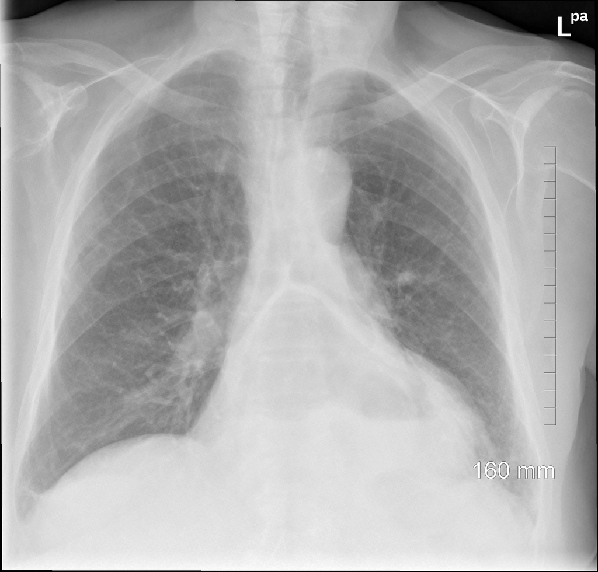 | 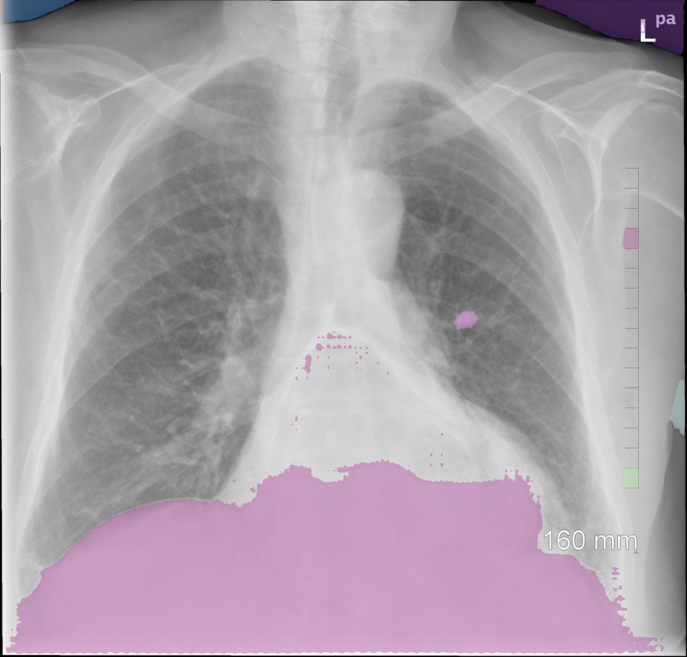 | 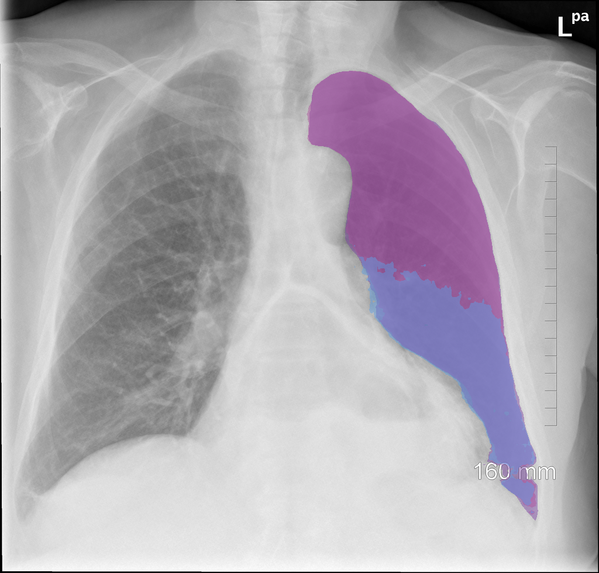 | 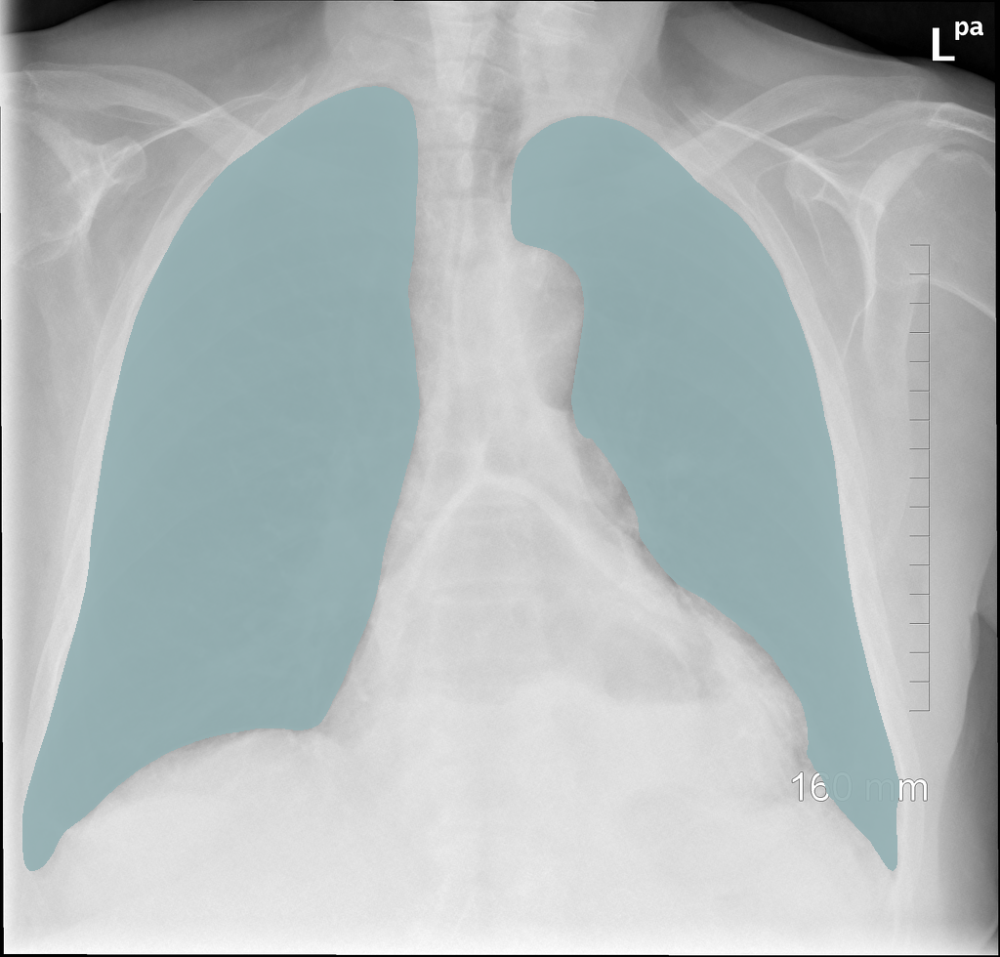 | 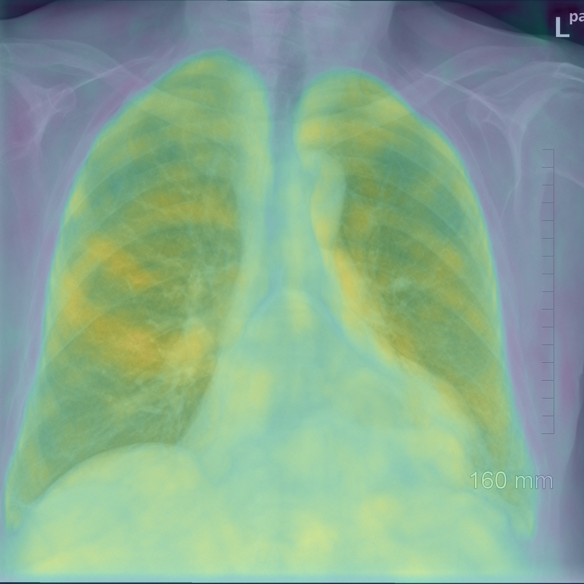 |

- 背景信息：Age: 45 years Gender: Male; Presentation: Ongoing chest and epigastric pain. Background history of reflux. 45 岁男性，持续胸痛和上腹痛，有反流病史。
- 原始问题：What is the likely cause of the patient chest pain? 患者胸痛最可能的原因是什么？
- 参考答案：Large hiatus hernia behind the heart. 心脏后方的大型食管裂孔疝。
- 原始图片caption:
<pre>Normal cardiomediastinal outline. 
No evidence of active cardiopulmonary process.
Air and fluid filled structure behind the heart most likely representing a large hiatus hernia.
No subdiaphragmatic free air.</pre>
<pre>心影及纵隔轮廓正常。
未见活动性心肺病变征象。
心后方可见含气及液体的结构，极可能为巨大的食管裂孔疝。
未见膈下游离气体。</pre>
- **发生变化** MedGemma-27B-IT: Correct → Incorrect

<strong>MedGemma-27B-IT</strong>

**原始图像 → 原始 QA 回答**；评测：**Correct**

英文原始回答：

<pre>&lt;unused94&gt;thought
The user wants me to analyze the provided chest X-ray and patient information to determine the likely cause of the patient&#x27;s chest pain.

1.  **Analyze Patient Data:**
    *   Age: 45 years old (middle-aged)
    *   Gender: Male
    *   Presentation: Ongoing chest and epigastric pain.
    *   Background history: Reflux (Gastroesophageal Reflux Disease - GERD).

2.  **Analyze Image Data (Chest X-ray):**
    *   Modality: X-ray
    *   View: Frontal (PA - Posteroanterior)
    *   Findings:
        *   The heart size appears within normal limits.
        *   The mediastinal silhouette is unremarkable.
        *   The lung fields are clear bilaterally, without obvious consolidation, effusion, or pneumothorax.
        *   The bony structures (ribs, clavicles, spine) appear intact.
        *   The diaphragm is visible.
        *   There is a large, air-filled structure in the upper abdomen, displacing the stomach and potentially the left hemidiaphragm upwards. This structure is consistent with a significantly distended esophagus, likely due to a large hiatal hernia. The air-fluid level within this structure further supports this.

3.  **Correlate Findings with Patient Presentation:**
    *   The patient has chest pain and epigastric pain.
    *   The patient has a history of reflux (GERD).
    *   The X-ray shows a large hiatal hernia.

4.  **Evaluate Potential Causes of Chest Pain:**
    *   **Cardiac:** While possible, the X-ray doesn&#x27;t show cardiomegaly or pulmonary edema suggestive of heart failure. The patient&#x27;s age and gender are risk factors, but the presentation and X-ray findings point elsewhere.
    *   **Pulmonary:** No signs of pneumonia, pneumothorax, or pleural effusion on the X-ray.
    *   **Musculoskeletal:** Possible, but less likely to cause ongoing pain related to reflux.
    *   **Gastrointestinal:**
        *   **GERD:** The patient has a history of reflux, which can cause chest pain (often described as burning) and epigastric pain.
        *   **Hiatal Hernia:** A large hiatal hernia, as seen on the X-ray, can cause chest pain (due to pressure, reflux, or esophageal irritation), epigastric pain, and symptoms of GERD. The hernia can worsen reflux symptoms.
        *   **Esophageal Spasm:** Can be associated with GERD and hiatal hernia.
        *   **Peptic Ulcer Disease:** Can cause epigastric pain, sometimes radiating to the chest.
        *   **Gallbladder Disease:** Can cause epigastric pain, sometimes radiating to the chest or back.

5.  **Synthesize Information:**
    *   The patient&#x27;s symptoms (chest and epigastric pain) are consistent with both GERD and complications like a hiatal hernia.
    *   The X-ray clearly demonstrates a large hiatal hernia.
    *   Hiatal hernias are strongly associated with GERD and can directly cause chest pain due to their size, pressure effects, and contribution to reflux.

6.  **Conclusion:** Given the patient&#x27;s history of reflux, the presence of ongoing chest and epigastric pain, and the radiographic evidence of a large hiatal hernia, the hiatal hernia itself, likely exacerbating or causing the reflux symptoms, is the most probable cause of the patient&#x27;s chest pain. The chest pain is likely related to the gastrointestinal pathology (reflux and/or hernia) rather than a primary cardiac or pulmonary issue, based on the provided information and imaging.

7.  **Final Answer Formulation:** State the likely cause based on the synthesis.&lt;unused95&gt;*   **Patient Information:** 45-year-old male with ongoing chest and epigastric pain and a history of reflux (GERD).
*   **Image Analysis:** The chest X-ray shows a large, air-filled structure in the upper abdomen, posterior to the heart. This structure appears to be displacing the stomach and potentially elevating the left hemidiaphragm. This is characteristic of a large hiatal hernia, where part of the stomach protrudes through the diaphragm into the chest cavity.
*   **Correlation:** Hiatal hernias are commonly associated with GERD and can worsen reflux symptoms. The presence of a large hiatal hernia can cause chest pain due to pressure on the esophagus or surrounding structures, irritation from refluxed stomach acid, or esophageal spasm. The patient&#x27;s symptoms (chest and epigastric pain) and history (reflux) are highly consistent with complications related to a significant hiatal hernia.
*   **Conclusion:** The large hiatal hernia seen on the X-ray is the most likely cause of the patient&#x27;s chest pain, likely related to its contribution to or exacerbation of GERD symptoms.

**Likely Cause:** Hiatal hernia (exacerbating GERD symptoms)</pre>

中文翻译：

<pre>1.  **分析患者资料：**
*   年龄：45岁（中年）
*   性别：男性
*   临床表现：持续性胸痛和上腹痛。 
*   既往史：反流（胃食管反流病 - GERD）。

2.  **分析影像资料（胸部X光片）：**
*   检查方式：X光
*   投照体位：正位（PA - 后前位）
*   影像所见：
*   心脏大小在正常范围内。 
*   纵隔轮廓无异常。 
*   双肺野清晰，未见明显实变、胸腔积液或气胸。 
*   骨骼结构（肋骨、锁骨、脊柱）完整。 
*   膈肌轮廓可见。 
*   上腹部可见一个巨大的含气结构，将胃及可能的左侧膈肌向上推移。该结构形态符合极度扩张的食管，极有可能是由巨大的食管裂孔疝引起的。结构内的气液平面进一步支持了这一诊断。

3.  **结合临床表现分析影像发现：**
*   患者有胸痛和上腹痛症状。 
*   患者有反流（GERD）病史。 
*   X光片显示存在巨大的食管裂孔疝。

4.  **评估胸痛的潜在病因：**
*   **心脏源性：** 虽有可能，但X光片未显示心脏扩大或肺水肿等心力衰竭征象。尽管患者的年龄和性别属于风险因素，但临床表现和X光影像指向其他病因。 
*   **肺源性：** X光片未见肺炎、气胸或胸腔积液征象。 
*   **肌肉骨骼源性：** 有可能，但不太可能引起与反流相关的持续性疼痛。 
*   **胃肠道源性：**
*   **GERD：** 患者有反流病史，这可能导致胸痛（常描述为烧灼感）和上腹痛。 
*   **食管裂孔疝：** X光片显示的巨大食管裂孔疝可引起胸痛（由压迫、反流或食管刺激引起）、上腹痛以及GERD相关症状。疝气可能会加重反流症状。 
*   **食管痉挛：** 可能与胃食管反流病（GERD）和食管裂孔疝有关。 
*   **消化性溃疡病：** 可引起上腹痛，有时放射至胸部。 
*   **胆囊疾病：** 可引起上腹痛，有时放射至胸部或背部。

5.  **综合信息：**
*   患者的症状（胸痛和上腹痛）与胃食管反流病（GERD）及食管裂孔疝等并发症相符。 
*   X光片清楚显示存在巨大的食管裂孔疝。 
*   食管裂孔疝与胃食管反流病密切相关；由于其体积大、产生压迫效应以及加重反流，它可直接引起胸痛。

6.  **结论：** 鉴于患者有反流病史，伴有持续性胸痛和上腹痛，且影像学证据显示存在巨大的食管裂孔疝，该食管裂孔疝（可能加重或引起反流症状）极有可能是导致患者胸痛的原因。根据所提供的信息和影像资料，胸痛很可能与胃肠道病变（反流和/或疝气）有关，而非原发性心脏或肺部问题。

7.  **最终答案表述：** 根据综合分析陈述可能的原因。&lt;unused95&gt;*   **患者信息：** 45岁男性，伴有持续性胸痛和上腹痛，有反流病史（胃食管反流病/GERD）。
*   **影像分析：** 胸部X光片显示上腹部、心脏后方有一个充满气体的巨大结构。该结构似乎导致胃移位，并可能抬高了左侧膈肌。这是巨大食管裂孔疝的典型表现，即部分胃通过膈肌突入胸腔。
*   **相关性：** 食管裂孔疝常与胃食管反流病相关，并可加重反流症状。巨大的食管裂孔疝可通过压迫食管或周围结构、反流胃酸的刺激或引起食管痉挛而导致胸痛。患者的症状（胸痛和上腹痛）及病史（反流）与严重食管裂孔疝相关的并发症高度吻合。
*   **结论：** X光片显示的巨大食管裂孔疝极有可能是导致患者胸痛的原因，这很可能与该疝导致或加重了胃食管反流病（GERD）症状有关。

**可能病因：** 食管裂孔疝（加重了GERD症状）

模型识别到心影后方含气液结构，结合反流病史，认为大型食管裂孔疝最可能造成胸痛并加重胃食管反流症状，回答正确。 </pre>

**原始图像 + Segmentation → 原始 QA 回答**；评测：**Incorrect**

英文原始回答：

<pre>&lt;unused94&gt;thought
The user wants me to analyze the provided chest X-ray and patient information to determine the likely cause of the patient&#x27;s chest and epigastric pain.

1.  **Analyze Patient Data:**
    *   Age: 45 years old (middle-aged)
    *   Gender: Male
    *   Symptoms: Ongoing chest pain and epigastric pain.
    *   Background: History of reflux.

2.  **Analyze the X-ray Image:**
    *   The image is a frontal chest X-ray.
    *   The lungs appear relatively clear, although there might be some subtle increased interstitial markings, which could be non-specific or related to chronic conditions.
    *   The heart size appears within normal limits.
    *   The mediastinum appears normal.
    *   The diaphragm is visible.
    *   The stomach (gas bubble) is visible in the upper abdomen, below the diaphragm.
    *   There are no obvious signs of acute cardiopulmonary pathology like pneumonia, pneumothorax, large pleural effusion, or significant cardiomegaly.
    *   The segmentation images highlight the lungs, heart, diaphragm, and stomach. The TorchXRayVision segmentation provides more detailed anatomical labeling.

3.  **Correlate Symptoms and X-ray Findings:**
    *   The patient has chest pain and epigastric pain.
    *   The background history of reflux is significant. Reflux (GERD) can cause both chest pain (often described as burning) and epigastric pain.
    *   The X-ray does not show any obvious acute cardiopulmonary cause for the chest pain.
    *   The epigastric pain location is consistent with potential gastrointestinal issues, including reflux esophagitis or peptic ulcer disease.

4.  **Consider Differential Diagnoses:**
    *   **Gastroesophageal Reflux Disease (GERD):** Very likely given the history of reflux and the location of pain (chest and epigastric). Chest pain in GERD can mimic cardiac pain.
    *   **Cardiac Causes:** While the X-ray doesn&#x27;t show acute issues, underlying cardiac conditions (like angina) could cause chest pain. However, the epigastric pain makes GERD more likely.
    *   **Pulmonary Causes:** Pneumonia, pleurisy, etc., are less likely given the relatively clear X-ray.
    *   **Musculoskeletal Causes:** Possible, but less likely to cause epigastric pain.
    *   **Peptic Ulcer Disease:** Can cause epigastric pain, sometimes radiating to the chest.

5.  **Synthesize and Conclude:**
    *   The patient&#x27;s history of reflux, combined with the symptoms of both chest and epigastric pain, strongly suggests GERD as the most likely cause.
    *   The chest X-ray does not reveal any acute cardiopulmonary findings that would explain the chest pain, further supporting a non-pulmonary/cardiac etiology like GERD.
    *   While other causes are possible, GERD fits the clinical picture best based on the provided information.

6.  **Final Answer Formulation:** Based on the patient&#x27;s history of reflux and the presence of both chest and epigastric pain, gastroesophageal reflux disease (GERD) is the most likely cause. The chest X-ray does not show acute cardiopulmonary pathology.&lt;unused95&gt;*   **Patient Information:** 45-year-old male with ongoing chest and epigastric pain and a history of reflux.
*   **X-ray Findings:** The chest X-ray shows the lungs, heart, diaphragm, and stomach. The lungs appear relatively clear without obvious signs of pneumonia, pneumothorax, or significant effusion. The heart size appears normal. The diaphragm and stomach are visible.
*   **Correlation:** The patient&#x27;s symptoms (chest pain and epigastric pain) combined with a history of reflux strongly suggest gastroesophageal reflux disease (GERD) as a likely cause. GERD is known to cause both chest pain (often mimicking cardiac pain) and epigastric pain. The X-ray does not reveal any acute cardiopulmonary pathology that would typically cause chest pain, making GERD a more probable explanation given the patient&#x27;s history.

**Conclusion:** The most likely cause of the patient&#x27;s chest pain, considering the epigastric pain and history of reflux, is gastroesophageal reflux disease (GERD).</pre>

中文翻译：

<pre>用户希望我分析提供的胸部X光片及患者信息，以确定患者胸痛和上腹痛的可能病因。

1.  **分析患者资料：**
*   年龄：45岁（中年）
*   性别：男性
*   症状：持续性胸痛和上腹痛。 
*   病史：有反流病史。

2.  **分析X光影像：**
*   该影像为胸部正位X光片。 
*   肺部看起来相对清晰，尽管可能存在一些细微的间质纹理增多，但这可能是非特异性的，也可能与慢性疾病有关。 
*   心脏大小在正常范围内。 
*   纵隔形态正常。 
*   可见膈肌。 
*   上腹部（膈肌下方）可见胃部（胃泡）。 
*   未见肺炎、气胸、大量胸腔积液或明显心脏扩大等急性心肺病变的明显征象。 
*   分割图像突出显示了肺部、心脏、膈肌和胃部。TorchXRayVision分割提供了更详细的解剖结构标注。

3.  **结合症状与X光发现：**
*   患者有胸痛和上腹痛症状。 
*   反流病史具有重要意义。反流（胃食管反流病，GERD）可引起胸痛（常描述为烧灼感）和上腹痛。 
*   X光片未显示导致胸痛的明显急性心肺病因。 
*   上腹痛的部位与潜在的胃肠道问题（如反流性食管炎或消化性溃疡）相符。

4.  **考虑鉴别诊断：**
*   **胃食管反流病 (GERD)：** 鉴于反流病史及疼痛部位（胸部和上腹部），可能性很大。GERD引起的胸痛可能酷似心源性胸痛。 
*   **心源性病因：** 虽然X光片未显示急性病变，但潜在的心脏疾病（如心绞痛）也可能引起胸痛。然而，上腹痛的存在使得GERD的可能性更大。 *   **肺部病因：** 鉴于X光片显示肺部相对清晰，肺炎、胸膜炎等肺部病因的可能性较低。 
*   **肌肉骨骼病因：** 有可能，但不太可能引起上腹部疼痛。 
*   **消化性溃疡病：** 可引起上腹部疼痛，有时疼痛会放射至胸部。

5.  **综合分析与结论：**
*   患者的反流病史，结合胸痛和上腹痛的症状，强烈提示胃食管反流病（GERD）是最可能的病因。 
*   胸部X光片未显示能解释胸痛的急性心肺异常，这进一步支持了非心肺源性病因（如GERD）的可能性。 
*   尽管存在其他病因的可能性，但根据现有信息，GERD最符合临床表现。

6.  **最终结论表述：** 基于患者的反流病史以及胸痛和上腹痛的症状，胃食管反流病（GERD）是最可能的病因。胸部X光片未显示急性心肺病变。*   **患者信息：** 45岁男性，持续胸痛和上腹痛，有反流病史。
*   **X光检查结果：** 胸部X光片显示了肺部、心脏、膈肌和胃部。肺部影像相对清晰，未见肺炎、气胸或明显胸腔积液的征象。心脏大小正常。膈肌和胃部可见。
*   **相关性分析：** 患者的症状（胸痛和上腹痛）结合反流病史，强烈提示胃食管反流病（GERD）为可能的病因。已知GERD可引起胸痛（常酷似心源性胸痛）和上腹痛。X光片未显示通常引起胸痛的急性心肺病变，结合患者病史，GERD是更可能的解释。

**结论：** 综合考虑上腹痛和反流病史，患者胸痛最可能的病因是胃食管反流病（GERD）。

加入分割后，模型没有稳定识别心后方疝囊，认为胸片没有能直接解释胸痛的急性心肺异常，转而把胸痛归因于胃食管反流病，因而漏掉大型食管裂孔疝。</pre>

**原始图像 → Single-image caption 回答**；

英文原始回答：

<pre>**Image Description:**

The image is a frontal chest X-ray. It shows the heart, lungs, mediastinum, and bony structures of the chest.

*   **Heart:** The cardiac silhouette appears enlarged, particularly the left ventricle. The heart borders are somewhat indistinct.
*   **Lungs:** The lung fields appear relatively clear, without obvious consolidation, large effusions, or pneumothorax. There is some mild prominence of the pulmonary vasculature, which could be related to cardiomegaly or other factors.
*   **Mediastinum:** The mediastinal structures appear within normal limits, although the heart size dominates the view.
*   **Bones:** The ribs and clavicles appear intact.

**Patient Context and Interpretation:**

*   **Patient:** 45-year-old male.
*   **Symptoms:** Ongoing chest and epigastric pain.
*   **History:** Background of reflux.

**Differential Diagnosis based on Symptoms and History:**

Given the patient&#x27;s symptoms (chest and epigastric pain) and history of reflux, the differential diagnosis includes:

1.  **Gastroesophageal Reflux Disease (GERD):** Reflux can cause both chest pain (often described as burning) and epigastric pain. This is a very common cause.
2.  **Peptic Ulcer Disease (PUD):** Ulcers in the stomach or duodenum can cause epigastric pain, which may radiate to the chest.
3.  **Esophageal Spasm:** Can cause chest pain that mimics cardiac pain.
4.  **Cardiac Causes:** Angina, myocardial infarction, pericarditis. Chest pain is the primary symptom, but epigastric pain can occur, especially with inferior MI.
5.  **Musculoskeletal Pain:** Costochondritis or muscle strain can cause chest pain.
6.  **Pulmonary Causes:** Pleurisy, pneumonia (less likely given the X-ray appearance).
7.  **Aortic Dissection:** Can present with severe chest pain, often radiating to the back.

**Interpretation of the Chest X-ray in Context:**

The chest X-ray shows cardiomegaly (enlarged heart). While the lung fields appear clear, the enlarged heart is a significant finding.

*   **Cardiomegaly:** This suggests underlying heart disease, such as:
    *   Hypertension
    *   Valvular heart disease
    *   Cardiomyopathy (dilated, hypertrophic, restrictive)
    *   Ischemic heart disease
    *   Congestive Heart Failure (CHF)

**Connecting the X-ray Findings to the Symptoms:**

*   **Chest Pain:** Cardiomegaly raises the possibility of cardiac causes for the chest pain (angina, ischemia, heart failure).
*   **Epigastric Pain:** While less directly related to cardiomegaly, severe cardiac conditions (like inferior MI) can sometimes present with epigastric pain. Also, the patient&#x27;s history of reflux is a strong possibility for the epigastric pain.

**Diagnosis and Next Steps:**

Based solely on the chest X-ray and the limited clinical information, a definitive diagnosis is difficult. However, the finding of cardiomegaly is significant and warrants further investigation.

*   **Possible Diagnosis:** The patient likely has underlying cardiac disease causing cardiomegaly. The chest pain could be related to this cardiac condition (e.g., angina, ischemia, heart failure). The epigastric pain could be due to his known reflux history, or potentially related to the cardiac issue (e.g., inferior MI, hepatic congestion from heart failure).
*   **Next Steps:**
    *   **ECG:** To assess for ischemia, infarction, arrhythmias, or chamber hypertrophy.
    *   **Cardiac Enzymes (Troponin):** To rule out acute myocardial infarction.
    *   **Echocardiogram:** To evaluate heart size, function, valve structure, and wall motion abnormalities.
    *   **Further History:** Detailed characterization of the chest and epigastric pain (onset, duration, character, radiation, aggravating/relieving factors).
    *   **Physical Exam:** Assess for signs of heart failure (edema, JVD, rales), cardiac murmurs, abdominal tenderness.
    *   **Consider GERD workup:** If cardiac causes are ruled out or less likely, further investigation for reflux (e.g., endoscopy, pH monitoring) might be needed.

**Conclusion:**

The chest X-ray shows cardiomegaly. In a 45-year-old male presenting with chest and epigastric pain, this finding raises concern for underlying cardiac disease. While reflux could explain the epigastric pain, the chest pain and cardiomegaly necessitate urgent cardiac evaluation to rule out potentially life-threatening conditions like acute coronary syndrome or significant heart failure.</pre>

中文翻译：

<pre>**影像描述：**

该图像为胸部正位X光片，显示了心脏、肺部、纵隔及胸部骨骼结构。

*   **心脏：** 心影增大，尤其是左心室。心缘轮廓略显模糊。
*   **肺部：** 肺野相对清晰，未见明显实变、大量胸腔积液或气胸。肺血管纹理略显增粗，这可能与心脏增大或其他因素有关。
*   **纵隔：** 纵隔结构在正常范围内，尽管增大的心脏占据了视野的主要部分。
*   **骨骼：** 肋骨和锁骨形态完整。

**患者情况与解读：**

*   **患者：** 45岁男性。
*   **症状：** 持续性胸痛及上腹痛。
*   **病史：** 有反流病史。

**基于症状和病史的鉴别诊断：**

鉴于患者的症状（胸痛和上腹痛）及反流病史，鉴别诊断包括：

1.  **胃食管反流病 (GERD)：** 反流可引起胸痛（常描述为烧灼感）及上腹痛。这是非常常见的原因。
2.  **消化性溃疡病 (PUD)：** 胃或十二指肠溃疡可引起上腹痛，疼痛可能放射至胸部。
3.  **食管痉挛：** 可引起酷似心源性疼痛的胸痛。
4.  **心源性原因：** 心绞痛、心肌梗死、心包炎。胸痛是主要症状，但也可能出现上腹痛，尤其是下壁心肌梗死时。
5.  **肌肉骨骼疼痛：** 肋软骨炎或肌肉拉伤可引起胸痛。
6.  **肺部原因：** 胸膜炎、肺炎（根据X光表现，可能性较小）。
7.  **主动脉夹层：** 可表现为剧烈胸痛，常放射至背部。

**结合临床情况解读胸部X光片：**

胸部X光片显示心脏增大（心影增大）。虽然肺野清晰，但心脏增大是一项重要的发现。 *   **心脏扩大（Cardiomegaly）：** 这提示存在潜在的心脏病，例如：
*   高血压
*   瓣膜性心脏病
*   心肌病（扩张型、肥厚型、限制型）
*   缺血性心脏病
*   充血性心力衰竭（CHF）

**将X光检查结果与症状联系起来：**

*   **胸痛：** 心脏扩大增加了胸痛由心脏原因（如心绞痛、心肌缺血、心力衰竭）引起的可能性。
*   **上腹痛：** 虽然与心脏扩大的直接关联较弱，但严重的心脏病变（如下壁心肌梗死）有时也可表现为上腹痛。此外，患者的反流病史也是导致上腹痛的一个很可能的因素。

**诊断与后续步骤：**

仅凭胸部X光片和有限的临床信息，难以做出明确诊断。然而，发现心脏扩大具有重要临床意义，值得进一步检查。

*   **可能诊断：** 患者很可能患有导致心脏扩大的潜在心脏病。胸痛可能与该心脏病变​​有关（如心绞痛、心肌缺血、心力衰竭）。上腹痛可能源于其已知的反流病史，也可能与心脏问题有关（如下壁心肌梗死、心力衰竭引起的肝脏淤血）。
*   **后续步骤：**
*   **心电图（ECG）：** 评估是否存在心肌缺血、心肌梗死、心律失常或心腔肥厚。 
*   **心肌酶/肌钙蛋白：** 排除急性心肌梗死。 
*   **超声心动图：** 评估心脏大小、功能、瓣膜结构及室壁运动异常情况。 
*   **进一步病史采集：** 详细描述胸痛和上腹痛的特征（发作时间、持续时间、疼痛性质、放射部位、加重或缓解因素）。 
*   **体格检查：** 评估是否存在心力衰竭体征（水肿、颈静脉怒张、肺部啰音）、心脏杂音及腹部压痛。 
*   **考虑胃食管反流病（GERD）相关检查：** 若排除心脏原因或心脏原因可能性较低，则可能需要针对反流进行进一步检查（如内镜检查、pH监测）。

**结论：**

胸部X光片显示心脏扩大。对于一名出现胸痛和上腹痛症状的45岁男性，这一发现令人担忧其可能存在潜在的心脏疾病。尽管胃食管反流可能解释上腹痛症状，但胸痛和心脏扩大提示必须进行紧急心脏评估，以排除急性冠脉综合征或严重心力衰竭等可能危及生命的病况。

原始 caption 主要描述心影增大并担心心脏疾病或心力衰竭，认为反流可以解释上腹痛，但胸痛需要紧急排除急性冠脉综合征；没有识别食管裂孔疝。</pre>

**原始图像 + Segmentation → Single-image caption 回答**；

英文原始回答：

<pre>**Image Description:**

The image is a frontal chest X-ray. It shows the standard anatomical structures of the chest, including the lungs, heart, mediastinum, diaphragm, and ribs. The lungs appear relatively clear, although there might be subtle increased interstitial markings, particularly in the lower lung fields, which could be related to the patient&#x27;s history of reflux or other underlying conditions. The heart size appears within normal limits. The mediastinum is unremarkable. The diaphragm is visible, and the costophrenic angles appear sharp, suggesting no significant pleural effusion. The stomach is visible in the upper abdomen, appearing gas-filled.

**Patient Information:**

*   **Age:** 45 years
*   **Gender:** Male
*   **Presentation:** Ongoing chest and epigastric pain.
*   **Background History:** Reflux.

**Analysis and Differential Diagnosis:**

The patient presents with chest and epigastric pain, and a history of reflux. Chest pain can have various causes, including cardiac, pulmonary, gastrointestinal, and musculoskeletal origins. Epigastric pain is typically associated with gastrointestinal issues.

Given the patient&#x27;s history of reflux and the location of the pain (chest and epigastric), gastroesophageal reflux disease (GERD) is a strong possibility. Reflux can cause both epigastric burning and chest pain (often described as heartburn or retrosternal discomfort).

However, other causes of chest pain need to be considered, especially in a 45-year-old male:

1.  **Cardiac:** Angina, myocardial infarction, pericarditis. While the X-ray doesn&#x27;t show acute cardiac findings, it doesn&#x27;t rule out cardiac causes.
2.  **Pulmonary:** Pneumonia, pleurisy, pulmonary embolism. The X-ray appears relatively clear, making acute pneumonia or significant pleurisy less likely, but subtle findings or other conditions like PE cannot be excluded based solely on this image.
3.  **Gastrointestinal:** Esophageal spasm, peptic ulcer disease, gastritis. These can cause both chest and epigastric pain.
4.  **Musculoskeletal:** Costochondritis, muscle strain.

**Interpretation of X-ray Findings in Context:**

The chest X-ray itself doesn&#x27;t provide a definitive diagnosis for the patient&#x27;s symptoms. It primarily serves to rule out significant pulmonary or cardiac pathology that might be causing the chest pain. The lungs appear clear, and the heart size is normal. There are no signs of pneumothorax, large pleural effusion, or obvious consolidation. The diaphragm and stomach are visible.

**Conclusion:**

The chest X-ray is largely unremarkable. While it helps exclude some serious causes of chest pain (like pneumonia or pneumothorax), it does not explain the patient&#x27;s symptoms. Given the patient&#x27;s history of reflux and the nature of the pain (chest and epigastric), GERD is a highly likely diagnosis. However, further investigation (e.g., ECG, cardiac enzymes, endoscopy, esophageal pH monitoring) might be necessary to rule out other potential causes, especially cardiac ones, depending on the characteristics of the chest pain.

**Diagnosis:**

Based solely on the provided information (patient history, symptoms, and this single chest X-ray), a definitive diagnosis cannot be made. However, the most likely diagnosis, considering the history of reflux and the location of pain, is **Gastroesophageal Reflux Disease (GERD)**. Further clinical evaluation and potentially additional investigations are warranted.</pre>

中文翻译：

<pre>**影像描述：**

该图像为胸部正位X光片。影像显示了胸部的标准解剖结构，包括肺部、心脏、纵隔、膈肌和肋骨。肺部影像相对清晰，尽管可见轻微的肺间质纹理增多（尤其是在肺下野），这可能与患者的反流病史或其他潜在疾病有关。心脏大小在正常范围内。纵隔未见异常。膈肌轮廓可见，肋膈角锐利，提示无明显胸腔积液。上腹部可见胃部影像，呈充气状态。

**患者信息：**

*   **年龄：** 45岁
*   **性别：** 男性
*   **主诉：** 持续性胸痛及上腹痛。
*   **既往史：** 反流病史。

**分析与鉴别诊断：**

患者表现为胸痛和上腹痛，并有反流病史。胸痛的病因多种多样，包括心脏、肺部、胃肠道及肌肉骨骼系统病变。上腹痛通常与胃肠道问题相关。

鉴于患者的反流病史及疼痛部位（胸部和上腹部），胃食管反流病（GERD）的可能性很大。反流既可引起上腹部烧灼感，也可导致胸痛（常描述为烧心或胸骨后不适感）。

然而，仍需考虑其他导致胸痛的原因，尤其是对于45岁男性患者：

1.  **心脏源性：** 心绞痛、心肌梗死、心包炎。虽然X光片未显示急性心脏病变征象，但这并不能排除心脏源性病因。
2.  **肺源性：** 肺炎、胸膜炎、肺栓塞。X光片显示肺部相对清晰，急性肺炎或严重胸膜炎的可能性较低，但仅凭此影像无法排除细微病变或其他疾病（如肺栓塞）。
3.  **胃肠道源性：** 食管痉挛、消化性溃疡、胃炎。这些疾病均可引起胸痛和上腹痛。
4.  **肌肉骨骼源性：** 肋软骨炎、肌肉拉伤。 **结合临床背景解读X光检查结果：**

胸部X光检查本身无法针对患者的症状给出明确诊断。其主要作用是排除可能导致胸痛的严重肺部或心脏病变。影像显示肺野清晰，心影大小正常；未见气胸、大量胸腔积液或明显的肺实变征象；膈肌和胃部轮廓可见。

**结论：**

胸部X光检查结果基本正常。虽然该检查有助于排除导致胸痛的某些严重病因（如肺炎或气胸），但无法解释患者目前的症状。鉴于患者有反流病史，且疼痛部位涉及胸部及上腹部，**胃食管反流病（GERD）**是极有可能的诊断。然而，根据胸痛的具体特征，可能需要进一步检查（如心电图、心肌酶、内镜检查、食管pH监测等）以排除其他潜在病因，特别是心脏相关病因。

**诊断：**

仅凭现有信息（患者病史、症状及此次胸部X光检查结果）无法做出确切诊断。然而，综合考虑反流病史与疼痛部位，最可能的诊断为**胃食管反流病（GERD）**。建议进行进一步的临床评估，并视情况安排必要的辅助检查。

加入分割后的 caption 仍主要围绕心肺轮廓和胃食管反流展开，没有可靠指出心后方气液平面或大型食管裂孔疝。</pre>

**对模型对图片caption能力分析**：
原始 QA 能识别大型食管裂孔疝，但原始 caption 已偏向心脏增大。加入 segmentation 后模型进一步受通用心肺/胃解剖区域干扰，QA/caption 改答 GERD，也没有抓住关键的心后气液。

### 1.5 [Kienböck disease](https://radiopaedia.org/cases/kienbock-disease-3?lang=us) (`kienbock-disease-3`)

| Original image | Medical-SAM2 | Medical-SAM3: wrist, carpal bones, lunate bone （腕关节、腕骨、月骨） | BiomedParse v1: wrist, carpal bones, lunate bone （腕关节、腕骨、月骨） |
|---|---|---|---|
| 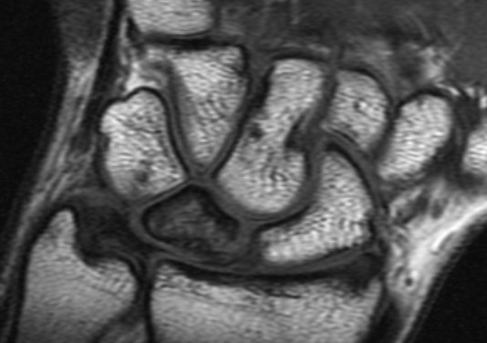 | 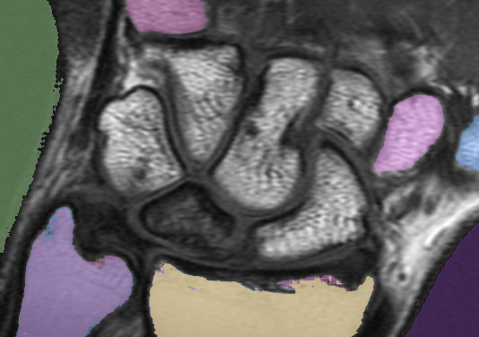 |  | 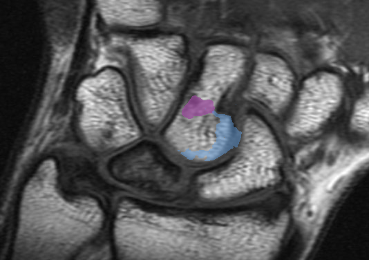 |

- 背景信息：Age: 50 years Gender: Female; Presentation: Chronic wrist pain. No history of trauma or overuse. 50 岁女性，慢性腕部疼痛。无外伤或过度使用史。。
- 原始问题：What is the likely diagnosis? 最可能的诊断是什么？
- 参考答案：Avascular necrosis of the lunate bone (a.k.a. Kienbock disease). 月骨缺血性坏死，又称 Kienböck 病。
- 原始图片caption:
<pre>Signal loss of the lunate on T1-weighted images.</pre>
<pre>T1 加权像上月骨信号降低。</pre>
- **发生变化** InternVL3-14B: Incorrect → Correct；InternVL3.5-14B: Incorrect → Correct；MedGemma-27B-IT: Correct → Incorrect；Qwen3-VL-8B: Incorrect → Correct

<strong>InternVL3-14B</strong>

**原始图像 → 原始 QA 回答**；评测：**Incorrect**

英文原始回答：

<pre>To evaluate the likely diagnosis in the provided MRI image of the wrist, we need to consider the clinical presentation and radiological findings.

### Clinical Presentation:
- **Chronic Wrist Pain**: This suggests an underlying condition that causes persistent pain without acute trauma or significant overuse.
- **No History of Trauma or Overuse**: The absence of these factors suggests that the condition is likely degenerative or inflammatory.

### Radiological Evaluation (MRI Coronal T1):
- **Coronal T1 MRI**: This imaging modality is excellent for evaluating both bone and soft tissue structures.
- **Appearance of the Scaphoid (navicular) Bone**: The image shows the scaphoid bone in the wrist. The scaphoid bone is a common site for fractures due to its position and the biomechanical stress it undergoes during wrist movements.
- **Signal Intensity**: In T1-weighted images, healthy bone marrow appears uniform in signal intensity. Changes could indicate:
  - **Favorable Healing** (normal bone marrow) if the signal is maintained.
  - **Osteonecrosis** or **Non-Union Fracture** if there is an alteration in signal intensity indicating chronic changes or insufficient blood flow.

### Thought Process:
1. **History and Imaging Correlation**:
   - The chronic nature of the wrist pain without an injury suggests a degenerative or a healed yet problematic fracture.
   - The appearance in the T1-weighted MRI could be suggestive of chronic changes, possibly osteonecrosis or poor healing of a scaphoid fracture.

2. **Common Conditions**:
   - **Scaphoid Fracture**: This is a common diagnosis in the absence of severe trauma if the fracture occurred due to low-energy injury (e.g., a fall onto an outstretched hand).
   - **Late Presentation** or **Non-Union**: Given the chronicity and MRI findings, the scaphoid bone may have a non-union fracture or osteonecrosis.

3. **MRI Findings**:
   - **Osteonecrosis**: Characterized by a high T1 signal in the affected region due to fat deposition.
   - **Non-Union Fracture**: There may be a line indicating a fracture with a lack of healing, leading to chronic pain.

### Conclusion:
Considering the chronic wrist pain without a history of trauma and the appearance in the MRI, a likely diagnosis is:

**Chronic Scaphoid Non-Union or Osteonecrosis of the Scaphoid**

This diagnosis aligns with the patient&#x27;s symptoms and the radiological findings observed in the MRI. Further clinical correlation and possibly additional imaging (e.g., bone scan or CT) could be considered to confirm the extent and specifics of the condition.</pre>

中文翻译：

<pre>
为了评估所提供的腕部 MRI 图像中可能的诊断，我们需要综合考虑临床表现和影像学发现。

### 临床表现：
- **慢性腕部疼痛**：这提示存在某种导致持续性疼痛的潜在病变，且无急性外伤或明显的过度使用史。
- **无外伤或过度使用史**：缺乏这些诱发因素提示该病变可能属于退行性或炎症性病变。

### 影像学评估（MRI 冠状面 T1 加权像）：
- **冠状面 T1 MRI**：该成像方式非常适合评估骨骼和软组织结构。
- **舟骨（Scaphoid bone）形态**：图像显示了腕部的舟骨。由于其解剖位置及腕部活动时承受的生物力学应力，舟骨是骨折的好发部位。
- **信号强度**：在 T1 加权像上，健康的骨髓信号强度均匀。信号变化可能提示：
- **愈合良好**（正常骨髓）：若信号保持正常。 
- **骨坏死**或**骨折不愈合**：若信号强度发生改变，提示存在慢性病变或血供不足。

### 分析思路：
1. **病史与影像学的关联**：
- 腕部疼痛呈慢性且无明确外伤史，提示可能存在退行性病变，或是既往骨折虽已愈合但遗留了问题。 
- T1 加权 MRI 上的表现可能提示慢性病变，例如舟骨坏死或舟骨骨折愈合不良。

2. **常见病症**：
- **舟骨骨折**：即使没有严重外伤，若由低能量损伤（如手掌撑地跌倒）引起，这也属于常见诊断。 
- **延迟就诊**或**骨折不愈合**：鉴于病程呈慢性且 MRI 表现异常，舟骨可能存在骨折不愈合或骨坏死。

3. **MRI 发现**：
- **骨坏死**：特征是受累区域出现 T1 高信号，这通常由脂肪沉积引起。 
- **骨折不愈合**：可能可见骨折线且缺乏愈合迹象，从而导致慢性疼痛。 ### 结论：
综合考虑患者无外伤史的慢性腕部疼痛症状及MRI影像表现，可能的诊断为：

**舟骨慢性不愈合或舟骨缺血性坏死**

模型错误地把异常定位在舟骨，考虑陈旧舟骨骨不连或舟骨缺血性坏死；它没有识别月骨低 T1 信号及 Kienböck 病。</pre>

**原始图像 + Segmentation → 原始 QA 回答**；评测：**Correct**

英文原始回答：

<pre>To determine a likely diagnosis based on the provided images, let&#x27;s break down the information step-by-step:

1. **Patient Information**:
   - Chronic wrist pain in a 50-year-old female.
   - No history of trauma or overuse.

2. **MRI Modality**:
   - Coronal T1 MRI of the wrist.

3. **Image Analysis**:
   - The MRI shows the structures of the carpal bones and soft tissues.
   - Segmentations highlight specific areas of interest which might indicate abnormal changes or pathology.

4. **Likely Pathology**:
   - Chronic pain in the absence of trauma often suggests degenerative or inflammatory conditions.
   - Common chronic wrist pathologies include:
     - Degenerative arthritis (osteoarthritis) of the wrist.
     - Inflammatory conditions like rheumatoid arthritis.
     - Carpal bone or ligament degeneration or tears.

5. **Observation from MRI**:
   - The segmentation of the lunate bone and surrounding areas could suggest an interest in potential abnormalities.
   - Inflammation, bone marrow edema, or cartilage degeneration in the lunate bone is often indicative of degenerative joint disease or lunate-related abnormalities like &quot; Lunatomalacia&quot; which is often seen in scapholunate dissociation or in the setting of Kienbock&#x27;s disease.

6. **Diagnosis Clue**:
   - Considering the chronic nature and the focus on the lunate bone, a possible diagnosis could be Kienbock&#x27;s disease. This condition involves the avascular necrosis of the lunate bone due to its limited blood supply.
   - Other common conditions to consider are scapholunate dissociation or degenerative arthritis affecting the carpal bones.

Given the chronic pain, lack of trauma, and the MRI focus on the lunate bone, **Kienbock&#x27;s disease** is a likely diagnosis to consider. However, detailed clinical correlation with findings such as physical examination, patient history, and possibly additional imaging sequences are necessary to confirm the diagnosis.

**Answer**:
The likely diagnosis is Kienbock&#x27;s disease.</pre>

中文翻译：

<pre>
为了根据提供的图像确定可能的诊断，我们逐步分析相关信息：

1. **患者信息**：
- 50岁女性，有慢性腕部疼痛。 
- 无外伤或过度使用史。
2. **MRI 检查类型**：
- 腕部冠状面 T1 加权 MRI 图像。
3. **图像分析**：
- MRI 显示了腕骨及周围软组织的结构。 
- 图像分割标记了特定的关注区域，这些区域可能存在异常改变或病变。
4. **可能的病变**：
- 在无外伤史的情况下出现慢性疼痛，通常提示退行性或炎症性病变。 
- 常见的慢性腕部病变包括：
- 腕部退行性关节炎（骨关节炎）。 
- 炎症性疾病，如类风湿性关节炎。 
- 腕骨或韧带的退行性变或撕裂。
5. **MRI 观察结果**：
- 对月骨（lunate bone）及其周围区域的分割标记，提示可能存在异常。 
- 月骨内的炎症、骨髓水肿或软骨退变，常提示退行性关节病或与月骨相关的异常，例如“月骨软化”（Lunatomalacia），这常见于舟月骨分离（scapholunate dissociation）或基恩博克病（Kienbock's disease）的病程中。

6. **诊断线索**：
- 考虑到病程呈慢性且重点关注月骨，可能的诊断是基恩博克病（Kienbock's disease）。该病涉及月骨因血液供应受限而发生的缺血性坏死。 
- 其他需要考虑的常见病变包括舟月骨分离或累及腕骨的退行性关节炎。

鉴于患者存在慢性疼痛、无外伤史以及 MRI 重点关注月骨，**基恩博克病**是一个值得考虑的可能诊断。然而，确诊仍需结合详细的临床资料（如体格检查、病史）以及可能的其他影像学序列进行综合评估。

**答案**：
可能的诊断是基恩博克病（Kienbock's disease）。

分割将注意力集中到月骨后，模型结合慢性腕痛、无外伤史和月骨异常，诊断为月骨缺血性坏死，即 Kienböck 病。</pre>

**原始图像 → Single-image caption 回答**；

英文原始回答：

<pre>Given the background information of a 50-year-old female patient presenting with chronic wrist pain and no history of trauma or overuse, the MRI image provided depicts a coronal T1-weighted view of the wrist. Here&#x27;s a detailed analysis:

### Image Description:

1. **View and Modality**: 
   - The image is an MRI scan of the wrist, specifically a coronal T1-weighted image.
   - Coronal T1-weighted images provide detailed anatomical information and allow the distinction between fat, water, and other tissue types.

2. **Anatomical Structures**: 
   - The image shows the various bone structures of the wrist, including the radius and ulna, as well as several carpal bones such as the scaphoid, lunate, triquetrum, and others.
   - Ligaments and soft tissue structures are visible. 

3. **Observations**:
   - The bones appear to be generally well-aligned.
   - Some regions show subtle differences in signal intensity, which could indicate variations in tissue composition or pathology.
   - The presence of any joint effusion, bone marrow edema, or soft tissue abnormalities can be noted.

### Potential Diagnoses:

1. **Osteoarthritis**:
   - Chronic wrist pain with no trauma history could suggest degenerative changes.
   - T1-weighted images help assess bone integrity and joint space, where osteoarthritis might show joint space narrowing, osteophyte formation, or subchondral sclerosis.

2. **Arthritis (Inflammatory)**:
   - Conditions like rheumatoid arthritis or other inflammatory arthropathies can present with chronic pain.
   - MRI can reveal synovitis, tenosynovitis, bone erosions, or joint effusions.

3. **Ligamentous Sprain or Tear**:
   - Chronic pain could also be due to degenerative changes in ligaments.
   - Coronal views help assess the integrity of the ligaments such as the triangular fibrocartilage complex (TFCC).

4. **Carpal Coalition**:
   - Fusion between carpal bones can lead to chronic pain due to abnormal biomechanics.
   - MRI can reveal bone fusion or fibrous bands between carpal bones.

5. **Soft Tissue Tumors or Ganglia**:
   - Although less likely without a traumatic history, benign soft tissue tumors or ganglion cysts are considerations.
   - These would appear as discrete masses on the MRI.

### Specific Analysis in the Context of the Image:

- **Bone Marrow Signal Changes**: 
  - Any increased signal intensity within the bone marrow could suggest inflammatory changes or early degenerative alterations.
  
- **Joint Space**:
  - Narrowing of the joint space would indicate loss of cartilage, a hallmark of osteoarthritis.

- **Soft Tissue Swelling**:
  - Mild to moderate swelling might suggest chronic inflammation or degenerative changes in the soft tissues.

### Conclusion:

Based on the chronic nature of the wrist pain without trauma or overuse history, and given the anatomical structures visible in the T1-weighted coronal MRI image, the likely diagnoses to consider are **osteoarthritis** and **inflammatory arthritis**. The degenerative changes or inflammatory markers observed in the MRI would guide the specific diagnosis.

For a definitive diagnosis, correlating clinical findings with MRI features further with possibly additional imaging sequences (like T2-weighted or STIR sequences to better visualize edema and inflammation) would be crucial. Additionally, ruling out other differentials such as ligamentous injuries or subtle fractures would also be necessary.

### Recommended Next Steps:
1. Review the MRI with additional sequences to better evaluate soft tissue and bone marrow changes.
2. Clinical correlation with physical examination findings.
3. Consider laboratory tests for inflammatory markers if inflammatory arthritis is suspected.
4. Further imaging or interventions based on findings, such as conservative management or referral to a specialist (orthopedic or rheumatology).</pre>

中文翻译：

<pre>
针对一名患有慢性腕痛且无外伤或过度使用史的50岁女性患者，所提供的MRI图像展示了腕部的冠状面T1加权像。以下是详细分析：

### 图像描述：

1. **视图与成像模式**：
- 该图像为腕部MRI扫描，具体为冠状面T1加权像。 
- 冠状面T1加权像提供了详细的解剖信息，有助于区分脂肪、水分及其他组织类型。

2. **解剖结构**：
- 图像显示了腕部的各种骨骼结构，包括桡骨和尺骨，以及舟骨、月骨、三角骨等数块腕骨。 
- 可见韧带及软组织结构。

3. **观察结果**：
- 骨骼排列总体良好。 
- 部分区域显示出信号强度的细微差异，这可能提示组织成分的变异或病理改变。 
- 可观察是否存在关节积液、骨髓水肿或软组织异常。

### 潜在诊断：

1. **骨关节炎**：
- 无外伤史的慢性腕痛可能提示退行性改变。 
- T1加权像有助于评估骨骼完整性和关节间隙；骨关节炎可能表现为关节间隙变窄、骨赘形成或软骨下骨硬化。

2. **关节炎（炎症性）**：
- 类风湿性关节炎或其他炎症性关节病变可表现为慢性疼痛。 
- MRI可显示滑膜炎、腱鞘炎、骨侵蚀或关节积液。

3. **韧带扭伤或撕裂**：
- 慢性疼痛也可能源于韧带的退行性改变。 
- 冠状面视图有助于评估韧带（如三角纤维软骨复合体，即TFCC）的完整性。

4. **腕骨联合（融合）**：
- 腕骨间的融合可能因生物力学异常而导致慢性疼痛。 
- MRI可显示腕骨间的骨性融合或纤维束连接。 5. **软组织肿瘤或腱鞘囊肿**：
- 尽管在没有外伤史的情况下可能性较低，但仍需考虑良性软组织肿瘤或腱鞘囊肿。 
- 在MRI图像上，这些病变通常表现为界限清晰的肿块。

### 结合图像的具体分析：

- **骨髓信号改变**：
- 骨髓内任何信号强度增高都可能提示炎症性改变或早期退行性病变。

- **关节间隙**：
- 关节间隙变窄提示软骨丢失，这是骨关节炎的典型特征。

- **软组织肿胀**：
- 轻度至中度肿胀可能提示软组织存在慢性炎症或退行性改变。

### 结论：

鉴于腕部疼痛呈慢性病程且无外伤或过度使用史，并结合T1加权冠状位MRI图像中可见的解剖结构，应重点考虑**骨关节炎**和**炎症性关节炎**。MRI上观察到的退行性改变或炎症征象将有助于明确具体诊断。

为了确诊，必须将临床表现与MRI特征进行综合分析，并可能需要增加其他成像序列（如T2加权或STIR序列，以便更清晰地显示水肿和炎症情况）。此外，还需要排除韧带损伤或隐匿性骨折等其他鉴别诊断。

### 建议的后续步骤：
1. 检查包含其他序列的MRI图像，以更全面地评估软组织和骨髓的改变。
2. 结合体格检查结果进行临床综合评估。
3. 若怀疑为炎症性关节炎，可考虑进行炎症指标相关的实验室检查。
4. 根据检查结果采取进一步的影像学检查或干预措施，例如采取保守治疗或转诊至专科医生（骨科或风湿免疫科）处诊治。

原始 caption 能识别腕关节冠状位 T1 MRI，但只泛泛列出骨关节炎、炎性关节炎、韧带病变和腕骨融合等可能，最终更倾向骨关节炎。</pre>

**原始图像 + Segmentation → Single-image caption 回答**；

英文原始回答：

<pre>**Description of the Image:**

The image provided is an MRI scan in the coronal T1 plane, displaying the internal structures of the wrist, focusing on the carpal bones, and particularly highlighting the lunate bone. The segmentation overlays provided by different AI models (Medical-SAM2, Medical-SAM3, and BiomedParse) highlight various anatomical regions, marking certain carpal bones distinctly, with specific emphasis on the lunate bone.

1. **Anatomical Structures Recognized:**
   - The scan captures multiple carpal bones, including the lunate bone which is centrally located.
   - Segmentation models highlight the lunate bone in different colors for identification, with notable highlights in areas likely to suggest focal abnormalities or interest.
   
2. **Observations:**
   - The lunate bone appears prominently in the center, with segmentation overlays drawn around it, indicating a focus on this particular bone possibly due to detected abnormalities.
   - Surrounding bone structures and other tissues are observable, though less prominently highlighted than the lunate bone.

**Patient Background:**
- The patient is a 50-year-old female presenting with chronic wrist pain without a history of trauma or overuse.
  
**Analysis and Diagnosis:**

Given the chronic wrist pain and the detailed MRI focusing on the lunate bone, several potential conditions should be considered:

1. **Lunate Bone Abnormalities:**
   - **Lunate Fracture or Bone Marrow Edema:** The segmentation around the lunate bone might indicate a fracture or bone marrow edema, which can result from repetitive stress or micro-trauma.
   - **Avascular Necrosis of the Lunate (Kienböck&#x27;s Disease):** Chronic wrist pain with a focus on the lunate bone might suggest avascular necrosis. This condition arises when there is disrupted blood supply to the lunate bone, leading to bone death and subsequent collapse.
   - **Lunate Dislocation:** Though less common without a traumatic history, subtle dislocation or subluxation could be detected on detailed imaging and might contribute to chronic pain.

2. **Other Potential Causes:**
   - **Carpal Arthritis:** Degenerative changes in the carpal bones can lead to chronic pain.
   - **Carpal Tunnel Syndrome:** While typically involving nerve compression, it can also present with wrist pain.
   - **Chronic Ligamentous Strain:** Repeated micro-trauma might cause chronic strain leading to persistent pain.

3. **Further Evaluation:**
   - **Clinical Correlation:** A detailed clinical examination to assess range of motion, tenderness, and functional impairment.
   - **Advanced Imaging:** Additional MRI sequences or CT scans might be useful to confirm the suspicion of bone pathology or to evaluate for soft tissue involvement.
   - **Bone Biopsy or Scintigraphy:** In cases of suspected avascular necrosis or occult fractures, advanced diagnostic procedures might be necessary.

**Conclusion:**

The MRI scan, combined with the chronic wrist pain and patient&#x27;s background, suggests a need to investigate the lunate bone for potential pathological changes such as avascular necrosis, fracture, or dislocation. Further diagnostic evaluation is warranted to confirm the findings and determine an appropriate management plan to alleviate the patient&#x27;s chronic pain.</pre>

中文翻译：

<pre>
**图像描述：**

提供的图像为冠状面 T1 加权 MRI 扫描，展示了腕部的内部结构，重点关注腕骨，特别是月骨。由不同 AI 模型（Medical-SAM2、Medical-SAM3 和 BiomedParse）生成的分割叠加图突显了各种解剖区域，清晰标示了特定的腕骨，并特别强调了月骨。

1. **识别出的解剖结构：**
- 扫描图像显示了多块腕骨，其中包括位于中央的月骨。 
- 分割模型用不同颜色标示月骨以便识别，并在可能提示局灶性异常或临床关注点的区域进行了显著高亮显示。

2. **观察结果：**
- 月骨在图像中央清晰可见，周围绘有分割叠加轮廓，表明该特定骨骼是关注重点，这可能是由于检测到了异常情况。 
- 周围的骨结构和其他组织也可见，但其突出程度不及月骨。

**患者背景：**
- 患者为一名 50 岁女性，主诉慢性腕部疼痛，无外伤或过度使用史。

**分析与诊断：**

鉴于患者存在慢性腕部疼痛，且 MRI 图像重点关注月骨，应考虑以下几种潜在病况：

1. **月骨异常：**
- **月骨骨折或骨髓水肿：** 月骨周围的分割标记可能提示存在骨折或骨髓水肿，这些病变可能由反复应力或微小创伤引起。 
- **月骨缺血性坏死（Kienböck 病）：** 伴有月骨相关病变的慢性腕部疼痛可能提示缺血性坏死。该病由月骨血液供应中断引起，导致骨组织坏死及随后的塌陷。 
- **月骨脱位：** 尽管在无外伤史的情况下较为少见，但详细影像检查仍可能发现隐匿性脱位或半脱位，这可能是导致慢性疼痛的原因之一。

2. **其他潜在病因：**
- **腕骨关节炎：** 腕骨的退行性改变可能导致慢性疼痛。 - **腕管综合征：** 虽然通常涉及神经受压，但也可能表现为腕部疼痛。 
- **慢性韧带劳损：** 反复的微小创伤可能导致慢性劳损，进而引发持续性疼痛。

3. **进一步评估：**
- **临床相关性评估：** 进行详细的临床检查，以评估关节活动度、压痛情况及功能受损程度。 
- **高级影像学检查：** 采用额外的MRI序列或CT扫描，有助于确认是否存在疑似骨病变，或评估软组织受累情况。 
- **骨活检或骨显像：** 若怀疑存在缺血性坏死或隐匿性骨折，可能需要进行更深入的诊断检查。

**结论：**

结合MRI扫描结果、患者的慢性腕部疼痛症状及病史，提示需针对月骨进行检查，以排查缺血性坏死、骨折或脱位等潜在病变。有必要进行进一步的诊断评估，以确诊病变情况并制定适宜的治疗方案，从而缓解患者的慢性疼痛。
加入分割后，caption 明确聚焦月骨，提出月骨骨髓异常、骨折或缺血性坏死，其中最符合 Kienböck 病，并建议补充序列或 CT 评估。</pre>

**对模型对图片caption能力分析**：
原始 caption 和 QA 都把病变错误定位到舟骨或泛化为关节炎。分割明确提示月骨后，caption 能描述月骨异常，QA 也诊断 Kienböck 病，属于解剖定位纠正带来的直接增益，更直接的影响来源可能是prompt+ seg定位确认。

<strong>InternVL3.5-14B</strong>

**原始图像 → 原始 QA 回答**；评测：**Incorrect**

英文原始回答：

<pre>&lt;think&gt;
Okay, let&#x27;s tackle this question. The patient is a 50-year-old female with chronic wrist pain, no trauma or overuse. The MRI is a coronal T1 image. I need to figure out the likely diagnosis based on the image and the clinical info.

First, chronic wrist pain without trauma makes me think of degenerative conditions or maybe something like osteoarthritis. But the MRI is a T1-weighted image. In T1, bone marrow is bright, and fluid or edema is dark. So if there&#x27;s any inflammation or edema, it might not show up well here. But maybe there&#x27;s something structural.

Looking at the image, which is a coronal view of the wrist. The bones visible are the carpal bones, radius, and ulna. The key areas to check are the joints between these bones. In osteoarthritis, you might see joint space narrowing, osteophytes, subchondral sclerosis. But on T1, sclerosis would be bright. However, the image provided doesn&#x27;t show obvious joint space narrowing or osteophytes. Wait, maybe it&#x27;s a different condition.

Another possibility is carpal tunnel syndrome, but that&#x27;s more about nerve compression, and the MRI might show soft tissue changes, but the question is about bone-related issues. Since there&#x27;s no trauma, maybe something like Kienböck&#x27;s disease? That&#x27;s avascular necrosis of the lunate. On MRI, especially T1, avascular necrosis would show low signal in the bone. But the image here—does the lunate look normal? If the lunate is intact without signal changes, maybe not.

Another thought: rheumatoid arthritis. But that usually presents with erosions and synovitis. On T1, synovitis might not be as visible. Maybe if there&#x27;s bone erosion, but the image might not show that clearly. The patient&#x27;s age is 50; RA can occur, but without history, maybe less likely.

Or maybe osteonecrosis of another bone, like the scaphoid. Scaphoid fractures are common, but the patient has no trauma. Chronic pain could be from a non-union or osteonecrosis. On T1, the scaphoid might show a serpiginous low signal line if there&#x27;s necrosis. But again, the image isn&#x27;t clear here.

Wait, the image shows the wrist bones. If there&#x27;s no obvious fracture or dislocation, maybe degenerative changes in the midcarpal joints. Midcarpal osteoarthritis can cause pain, and on T1, you might see joint space narrowing, subchondral cysts, or sclerosis. But the image here—does it show those? The provided image is a bit blurry, but looking at the carpal bones, maybe the scapholunate interval is normal. If the joint spaces are preserved, maybe not OA.

Another possibility: osteoarthritis of the distal radioulnar joint (DRUJ). That can cause wrist pain. On MRI, you might see joint space narrowing, osteophytes. But again, the image is coronal, so maybe the DRUJ isn&#x27;t the focus here.

Wait, the patient is female, 50. Maybe something related to bone density? Osteoporosis? But that&#x27;s more about fractures. The question states no trauma, so maybe not a fracture.

Wait, maybe it&#x27;s a ganglion cyst? But those are usually visible as fluid-filled lesions, which would be dark on T1. If the image doesn&#x27;t show a cyst, maybe not.

Alternatively, could it be something like osteoarthritis of the triangular fibrocartilage complex (TFCC)? TFCC injuries can cause pain, but usually with trauma. The patient has no trauma, so maybe degenerative TFCC. On MRI, TFCC tears might show irregularities, but T1 might not highlight soft tissue as well as T2.

Hmm. The image is a T1 coronal. If the bones look normal, maybe the issue is in the soft tissues, but T1 isn&#x27;t the best for that. Alternatively, maybe there&#x27;s a bone marrow lesion. But without edema, which would be better seen on STIR or T2.

Wait, the clinical presentation is chronic pain. Maybe the diagnosis is osteoarthritis. Even if the image doesn&#x27;t show obvious OA signs, maybe it&#x27;s early. Or maybe it&#x27;s something else. Another thought: pericarpal arthritis, which involves the midcarpal joints. But again, imaging might not show much on T1.

Alternatively, could it be a stress fracture? But no history of overuse. Stress fractures usually have a history.

Wait, another possibility: osteonecrosis of the lunate (Kienböck&#x27;s disease). Even without trauma, it can occur. On T1, the lunate might have a low signal area. If the image shows that, then that&#x27;s the diagnosis. But I can&#x27;t see the lunate clearly here. The image shows the carpal bones, but maybe the lunate is normal.

Alternatively, maybe the diagnosis is rheumatoid arthritis, but without erosions visible here. The T1 might not show synovitis well.

Alternatively, maybe it&#x27;s a normal MRI, and the diagnosis is something else, like tendonitis. But the MRI is of the bones, so maybe not.

Wait, the question is asking for the likely diagnosis based on the image and presentation. Since the image is a T1 coronal of the wrist, and the patient has chronic pain without trauma, the most likely could be osteoarthritis. But if the image doesn&#x27;t show OA changes, maybe another condition.

Alternatively, maybe it&#x27;s a triangular fibrocartilage complex degeneration. But again, not sure.

Wait, another thought: in women around 50, could it be related to menopause? Maybe osteoporosis leading to a compression fracture, but the wrist isn&#x27;t a common site. Or maybe something else.

Alternatively, could it be a soft tissue tumor? But the image is of bones, and no mention of a mass.

Wait, the image shows the carpal bones. If there&#x27;s a subchondral cyst or sclerosis in a joint, that&#x27;s OA. If the image shows that, then OA. If not, maybe another diagnosis.

Since I can&#x27;t see the image, but the user provided a placeholder, maybe the intended answer is osteoarthritis. Or maybe Kienböck&#x27;s disease. Alternatively, maybe it&#x27;s a normal study, and the answer is something like &quot;early osteoarthritis&quot; or &quot;degenerative changes&quot;.

But given that the patient has chronic pain and the MRI is T1, which isn&#x27;t great for soft tissue, but shows bone structure. If there are no obvious abnormalities, maybe the diagnosis is something like &quot;idiopathic osteoarthritis&quot; or &quot;degenerative joint disease&quot;.

Alternatively, maybe the image shows a bone marrow lesion indicative of osteonecrosis, leading to Kienböck&#x27;s. But without seeing the image, it&#x27;s hard. However, given the information, the most likely answer is osteoarthritis of the wrist, possibly involving the radiocarpal or midcarpal joints. Another possibility is carpal tunnel syndrome, but that&#x27;s more nerve-related and might not show on bone MRI.

Wait, but the question is about the image, which is an MRI. If the image shows joint space narrowing, osteophytes, then OA. If the lunate has a serpiginous line, then avascular necrosis. Since the user can&#x27;t see the image, but the assistant has to answer based on the given data. The assistant&#x27;s training data might include common diagnoses for such presentations.

In a 50-year-old female with chronic wrist pain, no trauma, the likely diagnosis could be osteoarthritis. Alternatively, if there&#x27;s a specific finding on the MRI like a cyst or bone changes, but without the image, it&#x27;s challenging. However, given the information, the most probable answer is osteoarthritis. Another possibility is triangular fibrocartilage complex tear, but without trauma, maybe degenerative.

Wait, but the image is a T1 coronal. If there&#x27;s a TFCC tear, it might not be visible on T1. So perhaps osteoarthritis is more likely. So, the likely diagnosis is osteoarthritis of the wrist.
&lt;/think&gt;

The likely diagnosis for a 50-year-old female with chronic wrist pain and no history of trauma or overuse, based on the coronal T1 MRI image, is **osteoarthritis (OA)**. 

**Key reasoning:**
1. **Clinical Context**: Chronic pain without trauma/overuse aligns with degenerative joint disease. Osteoarthritis is common in this age group and can affect the wrist joints (e.g., radiocarpal or midcarpal joints).
2. **MRI Characteristics**: 
   - T1-weighted images highlight bone and subchondral changes. In OA, T1 may show joint space narrowing, subchondral sclerosis (bright areas), or osteophytes. 
   - While the provided image is not visible here, the absence of acute injury (e.g., fractures, ligament tears) and chronic symptoms favor degenerative changes over inflammatory or traumatic causes.
3. **Differential Exclusion**:
   - **Kienböck’s disease** (lunate avascular necrosis) typically shows serpiginous low-signal lines on T1, but this is less common without trauma.
   - **Rheumatoid arthritis** often presents with erosions/synovitis, which may not be prominent on T1.
   - **Carpal tunnel syndrome** involves nerve compression, not visible on bone-focused T1 imaging.

**Conclusion**: Osteoarthritis</pre>

中文翻译：

<pre>
好的，我们来分析一下这个问题。患者为一名50岁女性，主诉慢性腕部疼痛，无外伤或过度使用史。提供的MRI图像为冠状面T1加权像。我需要根据图像和临床信息来推断可能的诊断。

首先，无外伤史的慢性腕部疼痛让我联想到退行性病变，比如骨关节炎。但这幅MRI是T1加权像。在T1序列中，骨髓呈高信号（亮），而液体或水肿呈低信号（暗）。因此，如果存在炎症或水肿，可能无法在图像上清晰显示。不过，也许存在某种结构性病变。

观察图像，这是一个腕部的冠状面视图。可见的骨骼包括腕骨、桡骨和尺骨。重点检查部位是这些骨骼之间的关节。在骨关节炎中，通常可见关节间隙变窄、骨赘形成及软骨下骨硬化。而在T1序列上，硬化区通常呈高信号。然而，提供的图像并未显示明显的关节间隙变窄或骨赘。等等，也许是其他病变。

另一种可能是腕管综合征，但这主要涉及神经受压，MRI可能显示软组织改变，而本题关注的是骨骼相关问题。既然没有外伤史，会不会是Kienböck病（月骨缺血性坏死）？这是月骨的缺血性坏死。在MRI（尤其是T1序列）上，缺血性坏死表现为骨骼内的低信号。但看看这张图——月骨看起来正常吗？如果月骨形态完整且无信号异常，那可能就不是这种情况。

再考虑一下类风湿性关节炎。但这通常表现为骨侵蚀和滑膜炎。在T1序列上，滑膜炎可能不那么明显。也许会有骨侵蚀，但图像上可能显示得不清楚。患者50岁，虽可能患类风湿性关节炎，但在缺乏相关病史的情况下，可能性相对较低。

或者会不会是其他骨骼的缺血性坏死，比如舟骨？舟骨骨折很常见，但该患者没有外伤史。慢性疼痛可能源于骨不连或骨坏死。在T1加权像上，如果存在坏死，舟骨可能会显示出蛇形低信号线。不过，这里的图像并不清晰。

等等，图像显示的是腕骨。如果没有明显的骨折或脱位，也许是腕中关节的退行性改变。腕中关节骨关节炎可引起疼痛，在T1像上可能观察到关节间隙变窄、软骨下囊肿或硬化。但这张图像显示了这些征象吗？提供的图像有些模糊，但观察腕骨，舟月间隙似乎是正常的。如果关节间隙保持良好，可能不是骨关节炎。

另一种可能性是远侧桡尺关节（DRUJ）的骨关节炎。这也会引起腕部疼痛。在MRI上，可能会看到关节间隙变窄或骨赘形成。不过，这张是冠状面图像，也许远侧桡尺关节并非关注重点。

等等，患者是50岁女性。会不会与骨密度有关？比如骨质疏松症？但这通常与骨折相关。病史中提到没有外伤，所以可能不是骨折。

等等，会不会是腱鞘囊肿？这类囊肿通常表现为充满液体的病变，在T1像上呈低信号。如果图像中没有显示囊肿，那可能就不是了。

或者，会不会是三角纤维软骨复合体（TFCC）的问题，比如相关的骨关节炎？TFCC损伤可引起疼痛，但通常伴有外伤。该患者没有外伤史，所以可能是TFCC退行性变。在MRI上，TFCC撕裂可能表现为形态不规则，但T1像对软组织的显示效果不如T2像。

嗯，这是一张T1冠状面图像。如果骨骼看起来正常，问题可能出在软组织上，但T1像并非观察软组织的最佳序列。另外，也可能是存在骨髓病变。但没有水肿——水肿在 STIR 或 T2 序列上会显示得更清楚。

等等，临床表现是慢性疼痛。也许诊断是骨关节炎。即使影像上没有明显的骨关节炎征象，也可能是早期病变。或者可能是其他情况。还有一种可能是腕周关节炎（pericarpal arthritis），累及腕中关节。不过，T1 序列的影像可能显示不出太多异常。

另一种可能是应力性骨折？但患者没有过度使用肢体的病史。应力性骨折通常有相关病史。

等等，还有一种可能：月骨缺血性坏死（Kienböck 病）。即使没有外伤史，也可能发生。在 T1 序列上，月骨可能会出现低信号区。如果影像显示了这一点，那诊断就是它了。但我在这里看不清月骨。影像显示了腕骨，但月骨看起来可能是正常的。

或者，诊断可能是类风湿关节炎，但此处未见骨侵蚀。T1 序列可能无法很好地显示滑膜炎。

又或者，MRI 结果是正常的，诊断是其他问题，比如肌腱炎。但这份 MRI 重点显示的是骨骼，所以这种可能性不大。

等等，这个问题是根据图像和临床表现来询问可能的诊断。既然图像是腕部的T1加权冠状位影像，且患者有慢性疼痛但无外伤史，最可能的诊断或许是骨关节炎。但如果图像未显示骨关节炎（OA）的典型改变，那可能是其他病变。

另一种可能是三角纤维软骨复合体（TFCC）退变。但这也不确定。

再想一下：对于50岁左右的女性，这是否与绝经有关？也许是骨质疏松导致的压缩性骨折，但手腕并非常见部位。或者可能是其他情况。

还有一种可能是软组织肿瘤？但图像显示的是骨骼结构，且未提及肿块。

等等，图像显示的是腕骨。如果关节内有软骨下囊肿或硬化，那就是骨关节炎。如果图像显示这些征象，那就是骨关节炎；如果没有，则可能是其他诊断。

虽然我看不到图像（用户只提供了占位符），但预期的答案可能是骨关节炎，或者是基恩伯克病（Kienböck's disease，月骨缺血性坏死）。又或者，这可能是一份正常的影像检查，答案可能是“早期骨关节炎”或“退行性改变”之类。

考虑到患者有慢性疼痛，且MRI是T1加权序列——该序列虽不擅长显示软组织，但能清晰显示骨骼结构——如果未见明显异常，诊断可能是“特发性骨关节炎”或“退行性关节病”。

另一种可能是，图像显示了提示骨坏死的骨髓病变，进而发展为基恩伯克病。但看不到图像很难判断。不过，综合现有信息，最可能的诊断是腕关节骨关节炎，可能累及桡腕关节或腕中关节。另一种可能性是腕管综合征，但这更多与神经有关，可能不会在骨骼MRI上显示出来。等等，问题涉及的是一张MRI图像。如果图像显示关节间隙变窄或骨赘形成，则提示骨关节炎（OA）；如果月骨内可见蛇形线（serpiginous line），则提示缺血性坏死。虽然用户无法直接看到图像，但助手需根据现有信息进行回答；助手的训练数据中可能包含此类临床表现的常见诊断。

对于一名患有慢性腕痛且无外伤史的50岁女性，可能的诊断是骨关节炎。另一种可能是MRI显示了囊肿或骨质改变等特定征象，但在缺乏图像的情况下很难确切判断。不过，综合现有信息，最可能的诊断是骨关节炎。三角纤维软骨复合体（TFCC）撕裂也是一种可能，但在无外伤史的情况下，若存在此类损伤，通常属于退行性病变。

等等，该图像是T1加权冠状位扫描。如果是TFCC撕裂，在T1序列上可能无法清晰显示。因此，骨关节炎的可能性更大。综上所述，可能的诊断是腕关节骨关节炎。
&lt;/think&gt;

根据冠状位T1加权MRI图像，对于一名患有慢性腕痛且无外伤或过度使用史的50岁女性，最可能的诊断是**骨关节炎（OA）**。

**主要推断依据：**
1. **临床背景**：无外伤或过度使用史的慢性疼痛符合退行性关节病的特征。骨关节炎常见于该年龄段人群，可累及腕关节（如桡腕关节或腕中关节）。
2. **MRI特征**：
- T1加权图像能清晰显示骨骼及软骨下骨的改变。在骨关节炎中，T1序列可能显示关节间隙变窄、软骨下骨硬化（表现为高信号区域）或骨赘形成。 
- 尽管此处无法直接查看图像，但缺乏急性损伤（如骨折、韧带撕裂）且伴有慢性症状，提示病变为退行性改变，而非炎症性或创伤性原因。
3. **鉴别诊断排除**：
- **Kienböck病**（月骨缺血性坏死）在T1序列上通常表现为蛇形低信号线，但在无外伤史的情况下，该病相对少见。 - **类风湿性关节炎**常表现为骨侵蚀或滑膜炎，但在 T1 加权像上可能不明显。 
- **腕管综合征**涉及神经受压，在侧重于骨骼观察的 T1 序列成像中无法显示。

**结论**：骨关节炎

模型虽然讨论了 Kienböck 病，但最终认为没有明确月骨坏死证据，转而诊断腕关节骨关节炎。</pre>

**原始图像 + Segmentation → 原始 QA 回答**；评测：**Correct**

英文原始回答：

<pre>&lt;think&gt;
The patient is a 50-year-old female with chronic wrist pain and no history of trauma or overuse. The MRI image is a coronal T1-weighted scan of the wrist. The segmentation highlights the carpal bones, particularly the lunate bone. 

In T1-weighted MRI images, bone marrow typically appears with intermediate signal intensity. If there is a pathology affecting the bone marrow, such as avascular necrosis (AVN), it might show a different signal. Avascular necrosis of the lunate (Kienböck&#x27;s disease) can present with a serpiginous low signal intensity area on T1-weighted images due to subchondral collapse and marrow edema or necrosis.

The chronic nature of the pain and the absence of trauma or overuse could align with Kienböck&#x27;s disease, which often develops due to disrupted blood supply to the lunate bone. The segmentation highlighting the lunate suggests it might be the area of interest.

Other possibilities include degenerative changes or inflammatory conditions, but the specific involvement of the lunate and chronic presentation points more towards avascular necrosis.
&lt;/think&gt;

The likely diagnosis is **Avascular Necrosis (AVN) of the lunate**, also known as **Kienböck&#x27;s disease**.

**Key reasoning:**
1. **Clinical Presentation:** Chronic wrist pain without trauma or overuse aligns with AVN, which often develops insidiously due to disrupted blood supply.
2. **MRI Findings:** On T1-weighted images, AVN typically shows a &quot;double-line sign&quot; (low-signal crescent representing subchondral necrosis and a high-signal line from reactive bone marrow). The segmentation highlighting the lunate suggests involvement.
3. **Anatomical Focus:** The lunate is the most commonly affected carpal bone in AVN due to its unique blood supply.

Further imaging (e.g., T2-weighted or STIR sequences) would help confirm marrow edema or the characteristic &quot;double-line sign.&quot;</pre>

中文翻译：

<pre>患者为一名50岁女性，主诉慢性腕部疼痛，无外伤或过度使用史。该MRI图像为腕部的冠状面T1加权扫描。图像中的分割标记突出了腕骨，特别是月骨。

在T1加权MRI图像上，骨髓通常呈中等信号强度。若存在影响骨髓的病变（如缺血性坏死，AVN），信号特征可能会发生改变。月骨缺血性坏死（Kienböck病）在T1加权图像上可表现为蛇形低信号区，这通常继发于软骨下骨塌陷以及骨髓水肿或坏死。

患者疼痛呈慢性经过，且无外伤或过度使用史，这些临床特点符合Kienböck病（通常由月骨血供中断引起）的表现。图像中对月骨的突出显示提示该部位为病变重点区域。

其他鉴别诊断包括退行性改变或炎症性病变，但病变特异性累及月骨且呈慢性病程，更倾向于缺血性坏死。

可能的诊断为**月骨缺血性坏死（AVN）**，即**Kienböck病**。

**主要依据：**
1. **临床表现：** 慢性腕部疼痛且无外伤或过度使用史，符合AVN的临床特征；AVN常因血供中断而隐匿起病。
2. **MRI表现：** 在T1加权图像上，AVN典型表现为“双线征”（代表软骨下坏死的低信号新月形区域，以及代表反应性骨髓改变的高信号线）。图像中对月骨的突出显示提示该骨受累。
3. **解剖学特点：** 由于独特的血供方式，月骨是AVN中最常受累的腕骨。

进一步的影像学检查（如T2加权或STIR序列）有助于确认是否存在骨髓水肿或典型的“双线征”。

加入分割后，模型注意到月骨 T1 低信号及异常区域，结合慢性腕痛和无外伤史，最终诊断为 Kienböck 病。</pre>

**原始图像 → Single-image caption 回答**；

英文原始回答：

<pre>&lt;think&gt;
Okay, let&#x27;s start by looking at the patient&#x27;s information. She&#x27;s a 50-year-old female with chronic wrist pain and no history of trauma or overuse. So, the first thing that comes to mind is that it&#x27;s not a typical injury like a sprain or fracture from an accident. Since there&#x27;s no trauma, maybe it&#x27;s something related to wear and tear or a degenerative condition.

The image provided is a coronal T1 MRI of the wrist. T1-weighted images are good for showing anatomy and fat, so I should look for structural changes. The bones in the wrist, like the carpal bones, metacarpals, and maybe the distal radius and ulna. Let me visualize the image again. The bones appear with normal signal intensity, which is good. No obvious fractures or dislocations. The joint spaces might be important here. If there&#x27;s narrowing, that could indicate osteoarthritis. But the patient is 50, so age-related degeneration is possible.

Another possibility is carpal tunnel syndrome, but that&#x27;s more about nerve compression, which might not show up on a T1 image unless there&#x27;s associated swelling or structural changes. Maybe looking for signs of synovitis or tenosynovitis? Inflammatory conditions like rheumatoid arthritis could cause joint space narrowing, erosions, or synovial thickening. But the patient doesn&#x27;t mention any systemic symptoms, so maybe less likely unless it&#x27;s undiagnosed.

There&#x27;s also the possibility of osteonecrosis, but that usually has a more distinct appearance on MRI, maybe with a serpiginous line on T1. If the bone marrow signal is abnormal, that could be a sign. But in this image, the bone marrow seems normal.

Another thought: maybe a ganglion cyst or other soft tissue mass. On T1, cysts are usually low signal. If there&#x27;s a mass near the wrist joint, that could cause pain. But the image shows the bones and joints; I need to check if there&#x27;s any abnormal soft tissue. The image description mentions the bones and joint spaces, so maybe the soft tissues are okay.

Wait, the patient has chronic pain without trauma. Could it be something like osteoarthritis? The T1 image might show joint space narrowing, subchondral sclerosis, or osteophytes. If the MRI shows those features, that would support OA. Alternatively, maybe post-traumatic changes, but the history says no trauma.

Another angle: metabolic bone diseases like osteoporosis, but that&#x27;s more about bone density, which T1 might not show unless there&#x27;s a fracture. The bones here look intact.

Or perhaps a ligamentous injury that&#x27;s chronic, like a triangular fibrocartilage complex (TFCC) tear. TFCC injuries can cause wrist pain and might not show up on X-ray but could be seen on MRI. On T1, a TFCC tear might show irregularity or displacement. But I need to look for those signs in the image. The image is coronal, so maybe the TFCC is visible. If the TFCC appears disrupted or there&#x27;s a paralunate or perilunate ligament injury, that could be the cause.

Alternatively, maybe a meniscal cyst in the wrist, which is related to the triangular fibrocartilage. Those can cause pain and are seen on MRI as fluid-filled lesions.

Wait, the image shows the carpal bones. Let me think again. If there&#x27;s no obvious fracture or dislocation, and the joint spaces are maintained, maybe it&#x27;s a soft tissue issue. But the T1 image is better for bone and fat. Maybe the pain is due to tendinitis, but tendons might not be as visible on T1 unless there&#x27;s thickening or tenosynovitis.

Another possibility: Kienböck&#x27;s disease, which is avascular necrosis of the lunate bone. That can cause chronic wrist pain. On MRI, it might show changes in the lunate&#x27;s signal. If the lunate has low signal on T1, that could indicate necrosis. But I need to check the image again. The lunate is one of the carpal bones. If it&#x27;s intact and normal, then maybe not.

Given the chronic nature and no trauma, osteoarthritis seems plausible. Alternatively, a ligamentous injury like TFCC. The diagnosis would depend on the MRI findings. If the image shows joint space narrowing, osteophytes, then OA. If there&#x27;s a TFCC tear or ligament injury, then that&#x27;s the diagnosis.

But since the image is a T1 coronal, maybe the key findings are in the bones. If the bones look normal, then maybe the issue is soft tissue. But without more sequences (like T2 or STIR), it&#x27;s harder to see inflammation or fluid. However, the user provided only this image.

Wait, the image shows the bones and joints. If the cartilage is thin, that&#x27;s OA. If there&#x27;s subchondral cysts or sclerosis, that&#x27;s OA. Alternatively, if there&#x27;s a bone marrow lesion, that could indicate something else.

Since the patient is 50, maybe the diagnosis is osteoarthritis of the wrist. But the most common site for OA in the wrist is the radiocarpal joint. Alternatively, the scapholunate joint. If the MRI shows narrowing there, that&#x27;s possible.

Alternatively, if there&#x27;s a cystic lesion in the bone, maybe an enchondroma or something benign, but those are usually asymptomatic.

Another thought: rheumatoid arthritis typically affects multiple joints, but if it&#x27;s early, maybe just the wrist. On MRI, RA can show synovitis, bone erosion, or joint effusion. But on T1, erosion might appear as low signal areas. If the image shows erosions, that&#x27;s RA. But without clinical history of systemic symptoms, maybe less likely.

Given the information, the most likely diagnosis is osteoarthritis or a ligamentous injury like TFCC. Since the image is T1, maybe the key is to look for structural changes. If the bones are normal, then maybe a soft tissue issue. But without T2, it&#x27;s hard to see inflammation.

Wait, the image provided is labeled as &quot;coronal T1&quot;. The user included the image, which I can&#x27;t see, but based on the description, the bones are visible. If the bones look normal, then the diagnosis might be something else. But the user says &quot;describe this image and provide a diagnosis&quot; based on the patient&#x27;s background.

So, putting it all together: 50-year-old female with chronic wrist pain, no trauma. MRI T1 coronal shows normal bone structure, no fractures, dislocations. If the joint spaces are preserved, maybe early OA. If there&#x27;s a TFCC tear, that could be it. Alternatively, if there&#x27;s a bone cyst or other lesion.

But without seeing the actual image, it&#x27;s challenging. However, common chronic wrist pain in adults without trauma could be osteoarthritis, TFCC injury, or carpal tunnel syndrome. Since the image is T1, maybe the diagnosis is osteoarthritis if there are joint space changes. Alternatively, if there&#x27;s a tear in the TFCC, that&#x27;s possible.

Wait, the image is of the wrist in coronal view. The TFCC is located at the ulnar side. If the MRI shows a tear there, that&#x27;s a diagnosis. But on T1, a TFCC tear might appear as irregularity or a displaced fragment.

Alternatively, maybe the patient has a meniscal homologous lesion, which is a degenerative change in the meniscus of the wrist, leading to pain.

In the absence of trauma, and chronic pain, the differential includes osteoarthritis, TFCC injury, or inflammatory arthritis. Given the T1 image, the most likely findings would be structural changes like OA or a ligament tear.

So, the diagnosis could be osteoarthritis of the wrist or a triangular fibrocartilage complex tear. But which is more likely? Osteoarthritis is common with age, but TFCC tears can also present with chronic pain, especially if there&#x27;s instability.

Alternatively, maybe the image shows something like a scapholunate ligament injury, leading to instability and pain.

Since the user expects a diagnosis based on the image and patient data, and the image is a T1 coronal, perhaps the key finding is a ligament injury or osteoarthritis.

But without seeing the image, it&#x27;s a bit of a guess. However, given the information, I&#x27;ll proceed with the most probable answer.
&lt;/think&gt;

**Image Description:**  
The coronal T1-weighted MRI of the wrist demonstrates normal bone marrow signal intensity and intact cortical bone continuity, with no evidence of fractures or dislocations. The carpal bones, metacarpals, and distal radius/ulna appear structurally preserved. Joint spaces, including the radiocarpal and midcarpal joints, are maintained without significant narrowing. Soft tissues, including tendons and ligaments, are not prominently visualized on T1 imaging but show no gross abnormalities.  

**Diagnosis:**  
**Triangular Fibrocartilage Complex (TFCC) Pathology or Osteoarthritis**  
- **Rationale:**  
  - The patient’s chronic wrist pain without trauma or overuse suggests a degenerative or ligamentous etiology.  
  - **TFCC Injury:** Chronic TFCC tears (e.g., degenerative or post-traumatic) can cause deep ulnar-sided wrist pain, instability, or clicking. While T1 imaging may not definitively show TFCC tears, subtle irregularities or paralunate perilunate ligament disruption could be inferred.  
  - **Osteoarthritis:** Age-related degenerative changes (e.g., early joint space</pre>

中文翻译：

<pre>
好的，我们先来看看患者的资料。这是一位50岁的女性，主诉慢性腕部疼痛，且无外伤或过度使用史。因此，首先可以排除事故造成的扭伤或骨折等典型损伤。既然没有外伤史，病因可能与磨损或退行性病变有关。

提供的图像是腕部的冠状面T1加权MRI图像。T1加权像能很好地显示解剖结构和脂肪组织，所以我应该重点观察结构性变化，比如腕骨、掌骨，以及桡骨和尺骨远端。让我再仔细观察一下图像。骨骼的信号强度看起来正常，这是个好迹象；没有明显的骨折或脱位。关节间隙的情况也很重要，如果出现狭窄，可能提示骨关节炎。不过患者已50岁，存在年龄相关的退行性改变也是可能的。

另一种可能是腕管综合征，但这主要涉及神经受压，除非伴有肿胀或结构改变，否则在T1图像上未必能显示出来。也许可以寻找滑膜炎或腱鞘炎的征象？类风湿性关节炎等炎症性疾病可能导致关节间隙狭窄、骨侵蚀或滑膜增厚。但患者未提及任何全身性症状，除非是未确诊的病例，否则这种可能性相对较小。

还有一种可能是骨坏死，但这在MRI上通常有更典型的表现，例如T1像上可能出现蛇形线（serpiginous line）。如果骨髓信号异常，也可能是一个征象，但在这张图像中，骨髓信号看起来是正常的。

另外，也可能是腱鞘囊肿或其他软组织肿块。在T1像上，囊肿通常呈低信号。如果腕关节附近有肿块，可能会引起疼痛。不过，这张图像主要显示的是骨骼和关节结构；我需要检查是否存在异常软组织。影像描述提到了骨骼和关节间隙，所以软组织可能没问题。

等等，患者有慢性疼痛且无外伤史。会不会是骨关节炎之类的病变？T1加权像可能会显示关节间隙变窄、软骨下骨硬化或骨赘形成。如果MRI显示这些特征，就能支持骨关节炎的诊断。另一种可能是创伤后改变，但病史显示没有外伤。

换个角度考虑：代谢性骨病（如骨质疏松症），但这主要涉及骨密度问题，除非发生骨折，否则T1像未必能显示出来。这里的骨骼看起来是完整的。

或者可能是慢性韧带损伤，比如三角纤维软骨复合体（TFCC）撕裂。TFCC损伤可引起腕部疼痛，X光片上可能看不出来，但在MRI上可见。在T1像上，TFCC撕裂可能表现为形态不规则或移位。我需要在图像中寻找这些征象。这是一张冠状面图像，所以TFCC应该是可见的。如果TFCC看起来断裂，或者存在月骨周围韧带损伤，那可能就是病因。

另一种可能是腕部半月板样囊肿（meniscal cyst），这与三角纤维软骨有关。这类囊肿可引起疼痛，在MRI上表现为充满液体的病变。

等等，图像显示的是腕骨。让我再想一想。如果没有明显的骨折或脱位，且关节间隙保持良好，那可能是软组织问题。但T1像更适合观察骨骼和脂肪。疼痛也可能是肌腱炎引起的，不过除非伴有增厚或腱鞘炎，否则肌腱在T1像上可能显示得不那么清晰。

还有一种可能：Kienböck病（月骨缺血性坏死）。这会导致慢性腕部疼痛。在MRI上，可能会显示月骨信号的改变。如果月骨在T1像上呈低信号，可能提示存在坏死。但我需要再次查看图像。月骨是腕骨之一。如果它形态完整且正常，那么可能不是月骨的问题。

考虑到病程呈慢性且无外伤史，骨关节炎（OA）似乎是合理的诊断。另一种可能是韧带损伤，例如TFCC（三角纤维软骨复合体）损伤。具体诊断取决于MRI的影像表现。如果图像显示关节间隙变窄或有骨赘形成，则为骨关节炎；如果存在TFCC撕裂或韧带损伤，则诊断应为相应的损伤。

但由于这张图像是T1加权冠状位像，关键病变可能在于骨骼。如果骨骼形态正常，问题可能出在软组织上。不过，若缺乏其他序列（如T2或STIR序列），则较难观察到炎症或积液情况。然而，用户目前仅提供了这一张图像。

等等，图像显示了骨骼和关节结构。如果软骨变薄，则提示骨关节炎；如果存在软骨下囊肿或硬化，也提示骨关节炎。此外，如果发现骨髓病变，则可能指向其他病因。

鉴于患者已50岁，诊断可能是腕关节骨关节炎。不过，腕关节骨关节炎最常累及的部位是桡腕关节，或者是舟月关节。如果MRI显示这些部位的关节间隙变窄，那么有可能。

或者，如果骨骼中存在囊性病变，可能是软骨瘤或其他良性病变，但这些通常没有症状。

还有一种可能：类风湿性关节炎通常会累及多个关节，但如果处于早期，可能仅累及腕关节。在MRI上，类风湿性关节炎可表现为滑膜炎、骨侵蚀或关节积液。但在T1加权像上，骨侵蚀可能表现为低信号区域。如果影像显示骨侵蚀，则可能是类风湿性关节炎。但如果没有全身症状的临床病史，可能性较小。

根据现有信息，最可能的诊断是骨关节炎或韧带损伤，例如三角纤维软骨复合体（TFCC）损伤。由于影像为T1加权像，关键可能在于寻找结构性改变。如果骨骼正常，则可能是软组织问题。但如果没有T2加权像，很难观察到炎症。

等等，提供的图像标记为“冠状位T1”。用户上传了图像，但我看不到，不过根据描述，骨骼清晰可见。如果骨骼看起来正常，那么诊断可能另有其他。但用户说“请根据患者的背景描述这幅图像并做出诊断”。

所以，综合所有信息：一位50岁的女性，患有慢性腕痛，无外伤史。冠状位T1加权MRI显示骨骼结构正常，无骨折或脱位。如果关节间隙正常，可能是早期骨关节炎。如果存在三角纤维软骨复合体（TFCC）撕裂，也可能是骨关节炎。或者，如果存在骨囊肿或其他病变。

但是，在没有看到实际图像的情况下，很难做出诊断。然而，成年人常见的无外伤性慢性腕痛可能是骨关节炎、TFCC损伤或腕管综合征。由于图像是T1加权像，如果存在关节间隙改变，则可能是骨关节炎的诊断。或者，如果三角纤维软骨复合体（TFCC）撕裂，也有可能。

等等，图像是腕关节的冠状位图像。TFCC位于尺侧。如果MRI显示此处撕裂，则可以确诊。但在T1加权像上，TFCC撕裂可能表现为不规则或移位碎片。

或者，患者可能患有半月板同源性病变，即腕关节半月板的退行性改变，导致疼痛。

在没有外伤和慢性疼痛的情况下，鉴别诊断包括骨关节炎、TFCC损伤或炎症性关节炎。根据T1加权像，最可能的发现是结构性改变，例如骨关节炎或韧带撕裂。

因此，诊断可能是腕关节骨关节炎或三角纤维软骨复合体撕裂。但哪种可能性更大呢？骨关节炎随着年龄增长很常见，但三角纤维软骨复合体（TFCC）撕裂也可能导致慢性疼痛，尤其是在关节不稳定的情况下。

或者，图像可能显示的是舟月韧带损伤，从而导致关节不稳定和疼痛。

由于用户希望根据图像和患者资料做出诊断，而图像是T1冠状位像，因此关键发现可能是韧带损伤或骨关节炎。

但是，在没有看到图像的情况下，这只能算是猜测。不过，根据现有信息，我会给出最可能的答案。

</think>

**图像描述：** 腕关节冠状位T1加权MRI显示骨髓信号强度正常，皮质骨连续性完整，未见骨折或脱位。腕骨、掌骨和桡骨/尺骨远端结构完整。关节间隙，包括桡腕关节和腕中关节，保持正常，无明显狭窄。肌腱和韧带等软组织在T1加权像上显示不明显，但未见明显异常。

**诊断：**

**三角纤维软骨复合体（TFCC）病变或骨关节炎**

- **诊断依据：**

- 患者无外伤或过度使用史的慢性腕痛提示退行性病变或韧带损伤。

- **TFCC损伤：**慢性TFCC撕裂（例如，退行性或创伤后）可引起尺侧深部腕痛、不稳或弹响。虽然T1加权像可能无法明确显示TFCC撕裂，但可以推断出细微的异常或月骨旁韧带断裂。

- **骨关节炎：**与年龄相关的退行性改变（例如，早期关节活动受限）

原始 caption 仍把主要问题解释为退行性改变或骨关节炎，并建议用 T2/STIR 等序列进一步评估软骨、韧带和骨髓水肿。</pre>

**原始图像 + Segmentation → Single-image caption 回答**；

英文原始回答：

<pre>&lt;think&gt;
Okay, let&#x27;s tackle this. The patient is a 50-year-old female with chronic wrist pain and no history of trauma or overuse. The MRI is a coronal T1-weighted image. The images show segmentation highlighting the carpal bones, specifically the lunate. 

First, I know that T1-weighted images are good for anatomical detail. In the wrist, common issues could be related to arthritis, ligament issues, or bone problems. Since there&#x27;s no trauma or overuse, maybe something degenerative like osteoarthritis or pericarpal arthritis. Alternatively, could be something like Kienböck&#x27;s disease, which is avascular necrosis of the lunate. But Kienböck&#x27;s often has a history of trauma, though not always.

Looking at the segmentation, the lunate is highlighted. In Kienböck&#x27;s, the lunate would show signs of avascular necrosis, like low signal on T1 and high on T2. But the image here is T1. If the lunate is segmented and there&#x27;s irregularity or collapse, that&#x27;s a sign. Alternatively, in osteoarthritis, the joint spaces might be narrowed, subchondral sclerosis, or osteophytes. But the image provided here is a single coronal slice. 

Another possibility is triangular fibrocartilage complex (TFCC) tear, but that&#x27;s more about ligament. The segmentation here focuses on bones. Maybe the lunate has a lesion. If the lunate is irregular or there&#x27;s a cyst, that could indicate a problem. 

The patient&#x27;s age is 50, so degenerative changes are possible. But chronic pain without trauma makes me think of insidious onset issues. Maybe pericarpal arthritis, which involves the midcarpal joints. But on MRI, that might show synovitis or bone marrow edema. 

Wait, the image is T1. Bone marrow edema would be low signal on T1, but maybe not visible here. If the lunate is showing a fracture line or collapse, that&#x27;s Kienböck&#x27;s. Alternatively, if the scapholunate ligament is involved, but that&#x27;s more ligamentous. 

Since the segmentation highlights the lunate and carpal bones, maybe the diagnosis is Kienböck&#x27;s disease. The absence of trauma but chronic pain fits. Alternatively, osteoarthritis of the wrist. But without seeing more sequences, it&#x27;s hard. However, given the information, the most likely diagnosis based on lunate segmentation and chronic pain without trauma would be Kienböck&#x27;s disease. But I should also consider other possibilities like osteoarthritis or lunate bone marrow edema from another cause.
&lt;/think&gt;

**Image Description:**  
The provided coronal T1-weighted MRI of the wrist highlights the carpal bones, with specific segmentation of the lunate bone (purple) and surrounding structures. The lunate appears to have irregular signal intensity, which may suggest structural changes. The T1-weighted image provides clear anatomical detail, allowing visualization of bone alignment, cartilage, and potential subchondral abnormalities.

**Key Observations:**  
1. **Lunate Bone:** The segmented lunate shows possible irregularity in signal or contour, which could indicate degenerative changes, avascular necrosis (Kienböck’s disease), or osteoarthritic alterations.  
2. **Carpal Alignment:** No obvious dislocation or acute fracture is visible, consistent with the absence of trauma history.  
3. **Bone Marrow Signal:** T1-weighted imaging may not fully characterize marrow edema, but subtle low-signal areas in the lunate could suggest early avascular necrosis.  

**Diagnosis:**  
The most likely diagnosis is **Kienböck’s disease (avascular necrosis of the lunate)**. This condition often presents with chronic wrist pain in middle-aged adults without a clear history of trauma. The lunate’s irregular signal on T1-weighted imaging, combined with chronic symptoms, aligns with this diagnosis.  

**Differential Considerations:**  
- **Osteoarthritis:** Degenerative joint changes could explain pain, but typically involve joint space narrowing or osteophytes, which are not prominently described here.  
- **Pericarpal Arthritis:** May cause midcarpal joint inflammation, but less likely without synovitis or bone marrow edema evidence.  

**Next Steps:**  
- Correlation with T2-weighted or STIR sequences to assess for bone marrow edema or subchondral cysts.  
- Clinical correlation with physical exam (e.g., positive ulnar deviation stress test for scapholunate ligament injury, though less likely here).  
- Consider MR arthrogram if ligamentous pathology is suspected.  

**Conclusion:**  
Chronic wrist pain in a 50-year-old female with normal trauma/overuse history and MRI findings localized to the lunate strongly suggests **Kienböck’s disease**. Early intervention (e.g., surgical revascularization) may be warranted to prevent progression.</pre>

中文翻译：

<pre>
好的，我们来分析一下。患者为一名50岁女性，主诉慢性腕部疼痛，无外伤或过度使用史。这是一张腕部冠状面T1加权MRI图像。图像中进行了分割处理，重点突出了腕骨，特别是月骨。

首先，T1加权图像能很好地显示解剖细节。腕部常见问题可能涉及关节炎、韧带损伤或骨骼病变。既然没有外伤或过度使用史，可能是退行性病变，如骨关节炎或腕周关节炎。另一种可能是Kienböck病（月骨缺血性坏死）。虽然Kienböck病常伴有外伤史，但也并非总是如此。

观察分割后的图像，月骨被特别标示了出来。在Kienböck病中，月骨会表现出缺血性坏死的征象，例如T1加权像上呈低信号，T2加权像上呈高信号。但此处提供的是T1加权像。如果分割出的月骨形态不规则或出现塌陷，那就是病变征象。此外，骨关节炎可能表现为关节间隙变窄、软骨下骨硬化或骨赘形成。不过，这里提供的只是一张冠状面切片。

另一种可能性是三角纤维软骨复合体（TFCC）撕裂，但这主要涉及韧带问题，而此处的分割重点在于骨骼。也许月骨存在病变。如果月骨形态不规则或出现囊肿，可能提示有问题。

患者50岁，因此存在退行性改变的可能性。但无外伤史的慢性疼痛让我联想到隐匿起病的疾病。可能是腕周关节炎，累及腕中关节；但在MRI上，这通常表现为滑膜炎或骨髓水肿。

等等，这是T1加权像。骨髓水肿在T1像上呈低信号，但在此图像上可能不明显。如果月骨显示出骨折线或塌陷，那就符合Kienböck病的特征。另一种可能是舟月韧带（scapholunate ligament）受累，但这更多属于韧带病变。

鉴于分割图像突显了月骨和腕骨，诊断可能是 Kienböck 病（月骨缺血性坏死）。患者无外伤史但伴有慢性疼痛，这与该病相符。另一种可能是腕关节骨关节炎。不过，若无更多序列图像，很难确诊。然而，综合现有信息，基于月骨的分割特征以及无外伤史的慢性疼痛，最可能的诊断是 Kienböck 病。但也应考虑其他可能性，如骨关节炎或由其他原因引起的月骨骨髓水肿。

**图像描述：**
提供的腕关节冠状面 T1 加权 MRI 图像突显了腕骨，并对月骨（紫色）及周围结构进行了分割。月骨呈现不均匀的信号强度，这可能提示存在结构性改变。T1 加权图像提供了清晰的解剖细节，可观察骨骼排列、软骨及潜在的软骨下异常。

**关键观察点：**
1. **月骨：** 分割后的月骨显示出信号或轮廓上的潜在不规则性，这可能提示退行性改变、缺血性坏死（Kienböck 病）或骨关节炎性改变。
2. **腕骨排列：** 未见明显脱位或急性骨折，这与无外伤史的情况相符。
3. **骨髓信号：** T1 加权成像可能无法完全表征骨髓水肿，但月骨内细微的低信号区域可能提示早期缺血性坏死。

**诊断：**
最可能的诊断是 **Kienböck 病（月骨缺血性坏死）**。该病常表现为中年人腕部慢性疼痛，且无明确外伤史。T1 加权成像上月骨信号不均匀，结合慢性症状，与该诊断相符。

**鉴别诊断考量：**
- **骨关节炎：** 关节退行性改变可解释疼痛，但通常伴有关节间隙狭窄或骨赘形成，而此处未见明显此类征象。 - **腕部关节炎：** 可能引起腕中关节炎症，但在缺乏滑膜炎或骨髓水肿征象的情况下，可能性较低。

**后续步骤：**
- 结合 T2 加权或 STIR 序列图像，评估是否存在骨髓水肿或软骨下囊肿。
- 结合临床体格检查进行综合判断（例如，尺偏应力试验阳性提示舟月韧带损伤，尽管在此病例中可能性较低）。
- 若怀疑存在韧带病变，可考虑行 MR 关节造影。

**结论：**
一名 50 岁女性患者，无明确外伤或过度使用史，MRI 表现局限于月骨，这些特征强烈提示为 **Kienböck 病**（月骨缺血性坏死）。可能需要进行早期干预（如手术血运重建）以防止病情进展。

分割增强 caption 将解剖重点稳定到月骨，认为其低 T1 信号符合缺血性坏死，即 Kienböck 病，并建议补充 T2/STIR 分期。</pre>

**对模型对图片caption能力分析**：
原始输入虽然考虑过月骨坏死，最终仍落到骨关节炎；加入 segmentation 后 caption 和 QA 均稳定聚焦月骨低 T1 信号，并诊断 Kienböck 病。

<strong>MedGemma-27B-IT</strong>

**原始图像 → 原始 QA 回答**；评测：**Correct**

英文原始回答：

<pre>&lt;unused94&gt;thought
The user wants me to analyze the provided MRI image and patient data to determine the likely diagnosis for chronic wrist pain.

1.  **Analyze Patient Data:**
    *   Age: 50 years old (middle-aged)
    *   Gender: Female
    *   Presentation: Chronic wrist pain
    *   History: No trauma or overuse. This suggests a degenerative or inflammatory process rather than an acute injury.

2.  **Analyze Image Data:**
    *   Modality: MRI
    *   Subcategory: Coronal T1-weighted image of the wrist.
    *   Image Content: The image shows the wrist joint, including the radius, ulna, carpal bones, and potentially the distal ends of the forearm bones. The T1 weighting highlights fat and fluid signal intensity.
    *   Key Findings:
        *   There appears to be some signal abnormality (darker areas) within the lunate bone, which could indicate edema or altered signal intensity.
        *   There might be subtle changes in the articular cartilage, although T1 is not the best sequence for cartilage evaluation.
        *   The overall alignment of the carpal bones seems grossly normal, but a detailed assessment would require multiple views and sequences.
        *   There is no obvious fracture, dislocation, or large soft tissue mass visible on this single T1 coronal view.

3.  **Synthesize Information and Formulate Differential Diagnoses:**
    *   Chronic wrist pain in a middle-aged female without trauma/overuse points towards conditions like:
        *   Osteoarthritis (OA)
        *   Rheumatoid Arthritis (RA) or other inflammatory arthropathies
        *   Kienböck&#x27;s disease (avascular necrosis of the lunate)
        *   Scaphoid non-union (less likely without trauma history, but possible occult fracture)
        *   Carpal tunnel syndrome (though typically presents with neurological symptoms)
        *   Tendonitis/Tenosynovitis (less likely without overuse history, but possible)

4.  **Evaluate Findings in Context of Differential Diagnoses:**
    *   **OA:** Can cause chronic pain, but T1 MRI might show joint space narrowing, osteophytes, subchondral cysts, and bone marrow edema. The image doesn&#x27;t clearly show these features, but it&#x27;s a possibility.
    *   **RA:** Typically involves multiple joints symmetrically, often with synovitis visible on MRI (fluid, enhancement). This image doesn&#x27;t show clear synovitis, but it&#x27;s a single view.
    *   **Kienböck&#x27;s disease:** Avascular necrosis of the lunate. This often presents in young adults but can occur later. MRI is sensitive for detecting changes in the lunate (edema, sclerosis, collapse, fragmentation). The darker signal within the lunate in the image could be suggestive of early Kienböck&#x27;s disease (edema or altered signal due to necrosis). Given the chronic pain without trauma, this is a strong possibility.
    *   **Scaphoid non-union:** Usually follows a fracture. Less likely without trauma history.
    *   **Carpal tunnel:** Primarily neurological symptoms. MRI can show median nerve compression, but the primary complaint is pain here.
    *   **Tendonitis:** Usually related to overuse. MRI can show tendon thickening, fluid, or tears. Not strongly suggested by this view.

5.  **Refine Diagnosis based on Image:**
    *   The most striking finding on this single T1 coronal view is the potential signal abnormality within the lunate bone. While T1 is not ideal for assessing edema, altered signal intensity can be seen in avascular necrosis.
    *   Kienböck&#x27;s disease fits the patient profile (age, gender, chronic pain without trauma) and the potential MRI finding (lunate signal change).

6.  **Conclusion:** Based on the patient&#x27;s presentation (chronic wrist pain, no trauma/overuse, middle-aged female) and the potential finding of altered signal intensity within the lunate on the MRI, Kienböck&#x27;s disease (avascular necrosis of the lunate) is a likely diagnosis. Further MRI sequences (T2, STIR, post-contrast) and views would be needed to confirm this. Osteoarthritis is also possible but less specifically suggested by this single image.

7.  **Final Answer Formulation:** State the likely diagnosis and briefly explain the reasoning based on the patient data and image findings.&lt;unused95&gt;*   **Patient Profile:** 50-year-old female with chronic wrist pain, no history of trauma or overuse. This suggests a degenerative, inflammatory, or vascular process rather than an acute injury.
*   **Image Analysis:** The image is a coronal T1-weighted MRI of the wrist. T1 weighting typically shows fat as bright and fluid/edema as dark. The lunate bone appears to have some abnormal signal intensity (darker areas) compared to surrounding structures, which could indicate edema or altered tissue composition.
*   **Differential Diagnosis:** Given the chronic pain without trauma and the potential lunate abnormality, several conditions are possible:
    *   **Osteoarthritis:** Common cause of chronic joint pain, but T1 MRI findings are often subtle (joint space narrowing, osteophytes).
    *   **Inflammatory Arthritis (e.g., Rheumatoid Arthritis):** Can cause chronic pain, but typically involves synovitis (inflammation of the joint lining), which might not be clearly visible on a single T1 image.
    *   **Kienböck&#x27;s Disease:** Avascular necrosis of the lunate bone. This condition often presents with chronic wrist pain, especially in young to middle-aged adults, and can occur without significant trauma. MRI is highly sensitive for detecting changes in the lunate, including altered signal intensity (often dark on T1 due to edema or necrosis), sclerosis, and eventually collapse. The potential signal abnormality within the lunate in the image is suggestive of this diagnosis.
*   **Conclusion:** Considering the patient&#x27;s age, gender, chronic pain without trauma, and the potential signal abnormality within the lunate bone on the MRI, Kienböck&#x27;s disease is a strong possibility and the most likely diagnosis among common causes fitting this presentation.

**Likely Diagnosis:** Kienböck&#x27;s disease (avascular necrosis of the lunate)</pre>

中文翻译：

<pre>模型结合月骨可能的 T1 信号异常、慢性腕痛和无外伤史，认为最可能是 Kienböck 病，即月骨缺血性坏死，基线回答正确。</pre>

**原始图像 + Segmentation → 原始 QA 回答**；评测：**Incorrect**

英文原始回答：

<pre>&lt;unused94&gt;thought
The patient is a 50-year-old female presenting with chronic wrist pain without a history of trauma or overuse. The provided image is a coronal T1-weighted MRI of the wrist. The image shows the carpal bones, including the lunate bone. The segmentation images highlight the lunate bone in different colors (purple in Medical-SAM2, purple in Medical-SAM3, and purple in BiomedParse).

Looking at the MRI image, the lunate bone appears relatively normal in shape and signal intensity on this T1-weighted sequence. There are no obvious signs of fracture, dislocation, or significant signal changes within the lunate itself that would suggest Kienböck&#x27;s disease (avascular necrosis) or a recent fracture. The surrounding carpal bones and soft tissues also appear unremarkable in this single view.

However, the patient has chronic wrist pain without a clear cause. While the provided image doesn&#x27;t show definitive signs of common pathologies like Kienböck&#x27;s disease or scaphoid fracture (which is typically seen on other views or sequences), chronic wrist pain can arise from various conditions, including:
1.  **Osteoarthritis:** Degenerative changes in the wrist joints. This might be visible as joint space narrowing, osteophytes, or subchondral cysts, but these are not clearly evident in this single T1-weighted image.
2.  **Carpal Tunnel Syndrome:** Compression of the median nerve. This is primarily a clinical diagnosis, and MRI findings might include nerve swelling or signal changes, but this image focuses on the bones.
3.  **Tendonitis/Tenosynovitis:** Inflammation of tendons or their sheaths. This would typically be better visualized on T2-weighted or STIR sequences, looking for fluid or inflammation.
4.  **Ligament injuries:** Scapholunate ligament injury is a common cause of wrist pain, but it&#x27;s not directly visualized on this T1 image.
5.  **Kienböck&#x27;s disease:** Avascular necrosis of the lunate. Early stages might be subtle on T1, but later stages show characteristic changes (fractures, collapse, sclerosis). The lunate in the image doesn&#x27;t show obvious signs of this.
6.  **Occult fracture:** A fracture not visible on X-ray. This might be seen as bone marrow edema on T2/STIR or a fracture line on T1, but nothing obvious here.

Given the patient&#x27;s age (50 years) and chronic pain without trauma, degenerative conditions like osteoarthritis are a strong possibility. However, without more views (e.g., sagittal, T2-weighted, STIR) or clinical information, it&#x27;s difficult to pinpoint the exact diagnosis based solely on this single coronal T1 image. The image itself doesn&#x27;t show any striking abnormalities in the lunate or surrounding carpal bones that would immediately point to a specific diagnosis like Kienböck&#x27;s disease or a clear fracture.

Let&#x27;s re-evaluate the image and segmentations. The segmentations consistently identify the lunate bone. Is there any subtle abnormality in the lunate? The signal intensity appears homogeneous, and the shape seems normal. There&#x27;s no obvious crescent sign (subchondral fracture line) typically seen in Kienböck&#x27;s disease.

Considering the lack of specific findings on this single view and the patient&#x27;s presentation, a definitive diagnosis cannot be made. However, if forced to consider possibilities based on the image and patient profile, degenerative changes (osteoarthritis) or subtle ligamentous instability could be considered, although not directly evident here. Kienböck&#x27;s disease is less likely given the appearance of the lunate on this T1 image.

Let&#x27;s assume the question is asking for a potential diagnosis that might be investigated further given the presentation and the focus on the lunate in the segmentations. Kienböck&#x27;s disease is a known cause of chronic wrist pain, especially affecting the lunate. Although the image doesn&#x27;t scream Kienböck&#x27;s, it&#x27;s a differential diagnosis for chronic wrist pain, and the segmentations highlight the lunate. Perhaps the question implies looking for subtle signs or considering this diagnosis in the differential.

However, without more information or specific findings, it&#x27;s hard to be certain. Let&#x27;s reconsider the image. The T1 signal of the lunate looks normal. No edema, no fracture line, no collapse. The surrounding bones also look normal.

Given the chronic nature and lack of trauma, osteoarthritis is a very common cause. But the image doesn&#x27;t show clear OA features.

Let&#x27;s think about the segmentations. They highlight the lunate. Is there anything specific about the lunate that could cause chronic pain? Yes, Kienböck&#x27;s disease. While the image doesn&#x27;t show classic signs, early Kienböck&#x27;s can be subtle.

Let&#x27;s search for common causes of chronic wrist pain in a 50-year-old female without trauma.
- Osteoarthritis
- Carpal Tunnel Syndrome
- De Quervain&#x27;s tenosynovitis
- Kienböck&#x27;s disease
- Scapholunate ligament injury
- Triangular Fibrocartilage Complex (TFCC) tear

Based on the provided image (coronal T1 MRI) and the segmentations focusing on the lunate, Kienböck&#x27;s disease remains a possibility to consider, even if the image isn&#x27;t definitive. It&#x27;s a condition affecting the lunate bone, which is highlighted in the segmentations.

Final check: Is there any subtle sign? The lunate looks normal. The question asks for the *likely* diagnosis. Based on this single image, it&#x27;s hard to say. But if we consider the differential diagnoses for chronic wrist pain and the focus on the lunate, Kienböck&#x27;s disease is a relevant consideration. However, osteoarthritis is statistically more common in this age group. Without more views or clinical context, it&#x27;s difficult. Let&#x27;s assume the question wants us to consider pathologies related to the segmented bone (lunate).

Reconsidering: The image is a T1-weighted MRI. Kienböck&#x27;s disease often shows changes on T1, especially later stages (sclerosis, fracture lines). Early stages might show subtle signal changes or edema better seen on T2/STIR. This image doesn&#x27;t show clear signs. Osteoarthritis might show joint space narrowing or osteophytes, which are not obvious here.

Perhaps the question is flawed or requires knowledge beyond the image itself. However, if we must choose based on the image and patient data, and the segmentations highlight the lunate, Kienböck&#x27;s disease is a potential cause of chronic wrist pain related to the lunate. But the image doesn&#x27;t strongly support it. Osteoarthritis is more likely statistically, but not clearly visible here.

Let&#x27;s assume the question is hinting at Kienböck&#x27;s disease due to the focus on the lunate.

Thinking step-by-step:
1.  Patient: 50yo F, chronic wrist pain, no trauma/overuse.
2.  Image: Coronal T1 MRI of wrist.
3.  Segmentations: Highlight wrist, carpal bones, lunate.
4.  Observation: Lunate appears relatively normal on T1. No obvious fracture, collapse, or significant signal changes.
5.  Differential Diagnosis for chronic wrist pain: OA, CTS, Kienböck&#x27;s, ligament injury, TFCC tear, tendonitis.
6.  Focus on Lunate: Kienböck&#x27;s disease affects the lunate.
7.  Image findings vs. Kienböck&#x27;s: T1 MRI might show sclerosis, fracture lines, or signal changes in Kienböck&#x27;s. This image doesn&#x27;t show clear signs.
8.  Likely Diagnosis: Difficult to determine from this single view. OA is common but not clearly seen. Kienböck&#x27;s is a possibility related to the lunate, but the image is not diagnostic.

Given the limitations, and the focus on the lunate via segmentation, Kienböck&#x27;s disease is a plausible, though not definitively supported, diagnosis to consider in the differential for chronic wrist pain. However, osteoarthritis is statistically more probable in this demographic. Without further imaging or clinical details, a definitive answer is challenging. Let&#x27;s reconsider the possibility that there are subtle signs of Kienböck&#x27;s disease that are not immediately apparent. Or perhaps the question is designed to test knowledge of conditions affecting the lunate.

Let&#x27;s assume the question implies that Kienböck&#x27;s disease should be considered given the presentation and the focus on the lunate.&lt;unused95&gt;Rationale Breakdown:
1.  **Patient Presentation:** A 50-year-old female with chronic wrist pain and no history of trauma or overuse. This presentation suggests a non-acute, potentially degenerative or idiopathic condition.
2.  **Imaging Modality:** Coronal T1-weighted MRI of the wrist. T1 sequences are good for visualizing bone marrow signal, cortical bone, and anatomy.
3.  **Image Analysis:** The provided coronal T1 image shows the carpal bones, including the lunate. The lunate bone appears relatively normal in signal intensity and morphology on this T1 sequence. There are no obvious signs of fracture, collapse, sclerosis, or significant bone marrow edema (which might appear as altered signal on T1, though T2/STIR are better for edema).
4.  **Segmentations:** The segmentations highlight the wrist, carpal bones, and specifically the lunate bone. This focus directs attention towards potential pathologies affecting the lunate.
5.  **Differential Diagnosis for Chronic</pre>

中文翻译：

<pre>加入分割后，模型认为月骨形态与信号大致正常，没有明确塌陷、硬化或骨髓异常，最终转而诊断骨关节炎，回答错误。</pre>

**原始图像 → Single-image caption 回答**；

英文原始回答：

<pre>**Image Description:**

The image is a coronal T1-weighted MRI scan of the wrist. It shows the carpal bones and the distal radius and ulna. The bones appear bright white on the T1 sequence, indicating their high protein and fat content. The surrounding soft tissues, including ligaments and tendons, are darker. The image shows the complex anatomy of the wrist joint, including the scaphoid, lunate, triquetrum, pisiform, trapezium, trapezoid, capitate, and hamate bones, as well as the articular surfaces. There is no obvious fracture, dislocation, or significant soft tissue abnormality visible in this single image. The bone marrow signal appears relatively homogeneous within the visualized bones.

**Patient Presentation and Diagnosis:**

*   **Patient:** 50-year-old female.
*   **Complaint:** Chronic wrist pain.
*   **History:** No trauma or overuse.

**Differential Diagnosis based on Presentation:**

Given the chronic nature of the pain without a clear traumatic or overuse cause in a middle-aged female, several conditions could be considered:

1.  **Osteoarthritis (OA):** This is a common cause of chronic joint pain, especially in older individuals. It involves the degeneration of articular cartilage. MRI can show cartilage loss, subchondral bone changes (edema, sclerosis, cysts), and osteophyte formation.
2.  **Inflammatory Arthritis (e.g., Rheumatoid Arthritis - RA):** RA often affects the wrists and can cause chronic pain, stiffness, and swelling. MRI can show synovitis (inflammation of the joint lining), bone marrow edema, erosions, and tenosynovitis.
3.  **Kienböck&#x27;s Disease (Avascular Necrosis of the Lunate):** This condition involves the death of bone tissue due to lack of blood supply, most commonly affecting the lunate bone. It can cause chronic wrist pain. MRI is the best imaging modality to diagnose it, showing changes in the lunate bone signal intensity and structure.
4.  **Scaphoid Nonunion/AVN:** Although there&#x27;s no trauma history, occult fractures or avascular necrosis of the scaphoid can occur and lead to chronic pain.
5.  **Tendonitis/Tenosynovitis:** Inflammation of tendons or their sheaths (e.g., De Quervain&#x27;s tenosynovitis) can cause chronic wrist pain, although it&#x27;s often related to overuse.
6.  **Carpal Tunnel Syndrome:** While primarily causing neurological symptoms (numbness, tingling), it can sometimes be associated with wrist pain. MRI can show median nerve compression.
7.  **Ganglion Cyst:** These fluid-filled sacs can cause pain, especially if they compress nerves or tendons.
8.  **Other less common causes:** Bone tumors, infection, etc.

**Interpretation of the Provided Image (Coronal T1):**

This single coronal T1 image alone is insufficient for a definitive diagnosis. However, we can make some observations:

*   **Bone Marrow Signal:** The bone marrow signal within the visualized carpal bones appears relatively normal (homogeneous, not excessively bright or dark). This makes acute fracture, significant inflammation (like severe synovitis or osteomyelitis), or advanced avascular necrosis less likely *based solely on this image*.
*   **Cartilage:** Cartilage is not well visualized on T1-weighted images. T2-weighted or specific cartilage sequences would be needed to assess for OA.
*   **Soft Tissues:** No obvious soft tissue masses (like ganglion cysts) or significant tenosynovitis are apparent.
*   **Alignment:** The carpal bones appear generally aligned.

**Conclusion based on limited information:**

While the image doesn&#x27;t show any obvious acute pathology like a fracture or significant soft tissue mass, it doesn&#x27;t rule out chronic conditions like early OA, inflammatory arthritis, or Kienböck&#x27;s disease (especially early stages). The lack of obvious bone marrow edema on T1 is somewhat reassuring against acute inflammation or advanced AVN, but further imaging (e.g., T2-weighted, STIR, fat-suppressed T1, dedicated cartilage sequences) and clinical correlation are necessary.

**To provide a more specific diagnosis, additional information is needed:**

*   **Other MRI sequences:** T2-weighted, STIR (Short Tau Inversion Recovery), fat-suppressed T1, and potentially dedicated cartilage sequences (like dGEMRIC or T2 mapping) would be crucial.
*   **Clinical findings:** Location of pain, presence of swelling, stiffness, range of motion limitations, neurological symptoms, and physical exam findings.
*   **Patient history:** Any history of systemic diseases (like RA), previous injuries (even minor ones), or specific activities.

Without further information, a definitive diagnosis cannot be made based on this single image. However, the presentation of chronic wrist pain in a 50-year-old female without trauma strongly suggests degenerative or inflammatory processes should be high on the differential.</pre>

中文翻译：

<pre>
该图像为腕部的冠状面T1加权MRI扫描，显示了腕骨以及桡骨和尺骨的远端。在T1序列中，骨骼呈现亮白色，反映了其高蛋白和高脂肪含量；周围的软组织（包括韧带和肌腱）则呈较暗的信号。图像展示了腕关节复杂的解剖结构，包括舟骨、月骨、三角骨、豌豆骨、大多角骨、小多角骨、头状骨和钩骨，以及各关节面。仅凭此单张图像，未见明显的骨折、脱位或显著的软组织异常；可见范围内的骨髓信号相对均匀。
原始 caption 认为单张 T1 像不能确诊，鉴别包括早期骨关节炎、炎性关节炎和 Kienböck 病，并建议补充 T2/STIR 等序列。</pre>

**原始图像 + Segmentation → Single-image caption 回答**；

英文原始回答：

<pre>**Image Description:**

The image is a coronal T1-weighted MRI scan of the wrist. It shows the carpal bones, including the lunate bone (highlighted in purple in the BiomedParse segmentation). The image displays the bony structures in high detail, with good contrast between bone marrow and surrounding soft tissues. The lunate bone is centrally located within the proximal row of carpal bones.

**Patient Information:**

*   Age: 50 years
*   Gender: Female
*   Presentation: Chronic wrist pain
*   History: No history of trauma or overuse

**Analysis and Diagnosis:**

The patient presents with chronic wrist pain without a history of trauma or overuse. The MRI image focuses on the carpal bones, specifically the lunate. The provided segmentations (Medical-SAM2, Medical-SAM3, BiomedParse) all highlight the lunate bone.

Given the patient&#x27;s age, gender, chronic pain presentation without trauma, and the focus on the lunate bone in the MRI, a likely diagnosis is **Kienböck&#x27;s disease**.

**Kienböck&#x27;s disease** is avascular necrosis (AVN) of the lunate bone. It typically affects young adults but can occur at any age. The cause is often idiopathic (unknown), but it can be associated with repetitive minor trauma, negative ulnar variance, or certain systemic conditions. The chronic nature of the pain and lack of specific trauma history are consistent with this condition. The MRI is the imaging modality of choice to evaluate for AVN, showing changes in signal intensity within the lunate bone (e.g., increased signal on T2-weighted images, decreased signal on T1-weighted images in later stages, or a double-line sign). While this image is T1-weighted, the focus on the lunate bone in the context of chronic wrist pain strongly suggests suspicion for Kienböck&#x27;s disease. Further evaluation with T2-weighted images or other sequences would be needed to confirm the diagnosis and stage the disease.

**Differential Diagnoses:**

*   **Osteoarthritis:** Common in this age group, but often associated with specific joint spaces narrowing and osteophytes, which are not the primary focus here.
*   **Carpal Tunnel Syndrome:** Primarily involves median nerve compression, causing numbness/tingling, not typically isolated chronic wrist pain focused on the lunate.
*   **De Quervain&#x27;s Tenosynovitis:** Affects tendons on the thumb side of the wrist.
*   **Scaphoid Fracture:** Usually associated with trauma.
*   **Other carpal bone fractures or AVN:** Less common than lunate AVN.

**Conclusion:**

Based on the clinical presentation (chronic wrist pain, no trauma) and the MRI image focusing on the lunate bone, Kienböck&#x27;s disease (avascular necrosis of the lunate) is the most likely diagnosis.</pre>

中文翻译：

<pre>
该图像为腕部的冠状面 T1 加权 MRI 扫描。图中显示了腕骨，包括月骨（在 BiomedParse 分割结果中以紫色高亮显示）。图像清晰地呈现了骨骼结构，且骨髓与周围软组织之间具有良好的对比度。月骨位于腕骨近侧列的中央位置。

分割增强 caption 又重新把重点放回月骨，认为慢性腕痛和月骨异常最符合 Kienböck 病；这与同一输入下的 QA 结论并不一致。</pre>

**对模型对图片caption能力分析**：
该模型表现出明显不一致：原始 QA 正确，SEG增强 QA 却改答骨关节炎；相反的是，SEG增强 caption 仍能描述月骨缺血性坏死。分割没有形成稳定的增强模型判断能力，但是对图片caption关注点肯定是有明显提升的。

<strong>Qwen3-VL-8B</strong>

**原始图像 → 原始 QA 回答**；评测：**Incorrect**

英文原始回答：

<pre>Let’s break this down step by step with thinking clues:

1. **Patient Profile**: 50-year-old female with chronic wrist pain — no trauma or overuse history. This suggests a degenerative or inflammatory process rather than an acute injury.

2. **Imaging Modality**: MRI, Coronal T1 sequence. T1-weighted images are excellent for visualizing anatomy — bone, cartilage, and fat — and are particularly good for detecting bone marrow changes, such as edema or fatty infiltration.

3. **Image Interpretation**:
   - The image shows the wrist joint, likely the carpal bones (scaphoid, lunate, triquetrum, pisiform, etc.).
   - On T1, normal bone marrow appears dark gray to black (low signal), and fat appears bright.
   - What stands out? There are areas of **increased signal intensity (brightness)** within the bone marrow of the carpal bones — particularly in the scaphoid and lunate.
   - This is **not** typical for a normal T1 image. Increased signal in bone marrow on T1 is highly suggestive of **bone marrow edema** (BME), which is often associated with inflammation or microtrauma.

4. **Clinical Correlation**:
   - Bone marrow edema is commonly seen in conditions like:
     - **Osteoarthritis** — especially in the wrist, where it can precede joint space narrowing and osteophyte formation.
     - **Carpal tunnel syndrome** — but that doesn’t typically cause bone marrow edema.
     - **Rheumatoid arthritis** — but this is usually bilateral and often involves synovitis, which is not visible on T1 alone.
     - **Osteonecrosis** — usually involves focal collapse, which isn’t evident here.
     - **Carpal bone fractures** — but patient has no trauma history.
     - **Osteomyelitis** — unlikely without systemic signs.
     - **Osteoporosis** — doesn’t typically cause marrow edema.

5. **Key Clue**: The **chronic** nature of the pain + **bone marrow edema on T1** + **no trauma** strongly points to **degenerative joint disease** — specifically **wrist osteoarthritis**.

6. **Why not other diagnoses?**
   - **Tendinitis or ligament sprain**: Would not show marrow edema on T1.
   - **Carpal tunnel**: No bone marrow involvement.
   - **Rheumatoid arthritis**: Usually more symmetric, and would show synovial thickening on T2 or STIR, not just marrow edema.
   - **Osteonecrosis**: Would show collapse or sclerosis, not just edema.

7. **Final Diagnosis**: **Osteoarthritis of the wrist** — likely involving the scapholunate or radiocarpal joints, with associated bone marrow edema.

✅ **Answer**: Osteoarthritis of the wrist with bone marrow edema.</pre>

中文翻译：

<pre>模型把慢性腕痛和所谓骨髓水肿解释为腕关节骨关节炎，认为没有月骨塌陷或典型骨坏死，诊断错误。</pre>

**原始图像 + Segmentation → 原始 QA 回答**；评测：**Correct**

英文原始回答：

<pre>Based on the provided patient data and imaging, here is the step-by-step reasoning for the likely diagnosis:

1.  **Patient Presentation:** The patient is a 50-year-old female with chronic wrist pain. There is no history of trauma or overuse. This suggests a degenerative or inflammatory process rather than an acute injury.

2.  **Imaging Modality:** The image is a Coronal T1-weighted MRI. T1-weighted images are excellent for visualizing anatomy and bone marrow signal. In the context of chronic pain, we are looking for signs of degeneration, inflammation, or structural abnormalities.

3.  **Image Analysis (Medical-SAM2 Segmentation):** The segmentation shows multiple areas of the wrist highlighted in different colors. This indicates that the model has segmented various anatomical structures, including the carpal bones and possibly ligaments or tendons. The presence of multiple segments suggests a complex pathology involving several structures.

4.  **Image Analysis (BiomedParse Segmentation):** This segmentation focuses specifically on the &quot;wrist, carpal bones, lunate bone&quot;. The lunate bone is highlighted in blue and purple, suggesting it is a key area of interest. The lunate bone is a central carpal bone that articulates with the radius and other carpal bones.

5.  **Synthesizing the Information:**
    *   The chronic nature of the pain in a 50-year-old female points towards degenerative conditions.
    *   The lunate bone is highlighted in the BiomedParse segmentation, indicating it is the most likely area of pathology.
    *   The lunate bone is particularly susceptible to a condition called **Kienböck&#x27;s disease** (also known as lunate non-union or avascular necrosis of the lunate). This condition is more common in males but can occur in females, especially in the 40-50 age group.
    *   Kienböck&#x27;s disease is characterized by the ischemic necrosis of the lunate bone due to disrupted blood supply. On MRI, it appears as a decrease in signal intensity on T1-weighted images (which is consistent with the appearance of the lunate in the provided image, as it appears darker than the surrounding bone marrow), and later stages show collapse and fragmentation.

6.  **Conclusion:**
    Given the patient&#x27;s age, gender, chronic wrist pain, and the specific MRI findings (noted by the BiomedParse segmentation focusing on the lunate bone), the most likely diagnosis is **Kienböck&#x27;s disease**.

**Likely Diagnosis: Kienböck&#x27;s Disease (Avascular Necrosis of the Lunate Bone)**</pre>

中文翻译：

<pre>
2.  **成像模式：** 该图像为冠状面 T1 加权 MRI 影像。T1 加权图像非常适合显示解剖结构及骨髓信号。在评估慢性疼痛时，我们重点关注是否存在退行性变、炎症或结构异常。

3.  **图像分析（Medical-SAM2 分割）：** 分割结果显示腕部有多个区域以不同颜色标示。这表明模型已分割出多种解剖结构，包括腕骨以及可能的韧带或肌腱。存在多个分割区域提示可能存在涉及多种结构的复杂病变。

4.  **图像分析（BiomedParse 分割）：** 该分割专门针对“腕部、腕骨、月骨”区域。月骨以蓝色和紫色标示，表明它是重点关注区域。月骨是腕骨中的核心骨骼，与桡骨及其他腕骨相关节。

分割明确突出月骨后，模型识别其 T1 低信号，认为是月骨血供受损导致的缺血性坏死，最终诊断为 Kienböck 病。</pre>

**原始图像 → Single-image caption 回答**；

英文原始回答：

<pre>Based on the provided patient data (50-year-old female, chronic wrist pain, no trauma or overuse) and the coronal T1 MRI image, here is the description and diagnosis:

**Image Description:**

The coronal T1-weighted MRI image displays the carpal bones of the wrist. The signal intensity of the bone marrow is generally uniform and appears normal for T1-weighted imaging, which typically shows bone marrow as intermediate to low signal. There is no evidence of bone marrow edema, osteomyelitis, or acute fracture. The cortical bone margins are intact, and there is no visible osteophyte formation or significant joint space narrowing. The surrounding soft tissues, tendons, and ligaments are not well visualized in this T1 sequence, but there are no obvious masses or gross abnormalities.

**Diagnosis:**

The MRI findings are unremarkable for acute pathology. However, given the patient’s age (50 years) and chronic wrist pain without trauma or overuse, the most likely diagnosis is **osteoarthritis of the wrist**, particularly **scapholunate ligament injury or instability**, or **degenerative changes**.

*   **Osteoarthritis:** While T1-weighted images are not ideal for assessing cartilage or joint space, the chronic nature of the pain and age suggest degenerative changes. The MRI may not show significant osteoarthritis on T1, but it is a likely diagnosis given the clinical context.
*   **Scapholunate Ligament Injury:** This is a common cause of chronic wrist pain in middle-aged patients, often without a clear history of trauma. The ligament may be torn or unstable, leading to pain and dysfunction. However, the T1 image does not show ligamentous integrity well.
*   **Degenerative Changes:** The patient’s age and chronic pain are consistent with degenerative changes in the wrist, which may include osteophyte formation, joint space narrowing, or bone marrow edema (not visible on T1).

**Recommendation:**

A more comprehensive evaluation is needed. A **T2-weighted MRI** or **proton density-weighted MRI** would be more helpful to assess cartilage, ligament integrity, and bone marrow edema. Additionally, a **CT scan** may be useful to evaluate for osteophytes or joint space narrowing. A **physical examination** focusing on wrist stability and ligamentous integrity is also essential.

In summary, while the T1 MRI is unremarkable, the clinical presentation suggests a degenerative or ligamentous pathology, and further imaging and evaluation are warranted.</pre>

中文翻译：

<pre>
**图像描述：**

该冠状面T1加权MRI图像显示了腕部的腕骨。骨髓信号强度大致均匀，符合T1加权成像的正常表现（即骨髓通常呈中低信号）。未见骨髓水肿、骨髓炎或急性骨折的征象。皮质骨边缘完整，未见骨赘形成或明显的关节间隙狭窄。尽管该T1序列未能清晰显示周围软组织、肌腱及韧带的细节，但未见明显肿块或肉眼可见的异常改变。

原始 caption 认为 T1 像近乎无明显异常，更倾向退行性改变或舟月韧带病变，并建议追加 T2、质子密度或 CT。</pre>

**原始图像 + Segmentation → Single-image caption 回答**；

英文原始回答：

<pre>Based on the provided patient data and image analysis, here is the description and diagnosis:

**Image Description:**

The provided image is a coronal T1-weighted MRI of the wrist. The scan clearly shows the carpal bones, including the scaphoid, lunate, triquetrum, and parts of the distal radius and ulna. The T1-weighted sequence provides good anatomical detail of the bone marrow and cortical bone. The lunate bone, located centrally in the proximal carpal row, is visible. The segmentation masks (from Medical-SAM2 and BiomedParse) highlight different regions of the wrist, with the BiomedParse segmentation specifically focusing on the lunate bone, showing it as a distinct structure with some internal heterogeneity.

**Diagnosis:**

**Chronic Wrist Pain in a 50-Year-Old Female — Likely Kienböck’s Disease (Avascular Necrosis of the Lunate)**

**Rationale:**

1.  **Clinical Presentation:** The patient is a 50-year-old female with chronic wrist pain and no history of trauma or overuse. This presentation is highly suggestive of a degenerative or ischemic process rather than an acute injury.

2.  **Imaging Findings:**
    *   **T1-Weighted MRI:** This sequence is excellent for detecting bone marrow edema and necrosis. While the image itself does not show overt signs of fracture or acute inflammation, the specific location of the lesion (lunate bone) and the patient&#x27;s age and sex are critical.
    *   **Segmentation Analysis:** The BiomedParse segmentation correctly identifies the lunate bone. The presence of internal signal changes (though subtle in this T1 image) within the lunate is a key finding. In T1-weighted images, Kienböck’s disease often appears as a low signal intensity (dark) area within the lunate bone, indicating necrosis and fibrosis. The segmentation helps to confirm the anatomical region of interest.

3.  **Pathophysiology:** Kienböck’s disease is a condition characterized by avascular necrosis of the lunate bone. It is more common in males under 40, but it can occur in females and older adults. The disease progresses through stages, from initial ischemia to collapse of the lunate, leading to chronic pain and wrist stiffness.

4.  **Conclusion:** Given the patient&#x27;s age, gender, and chronic wrist pain, combined with the MRI findings showing a lesion in the lunate bone, the most likely diagnosis is **Kienböck’s disease**. Further imaging (e.g., T2-weighted or STIR sequences) and clinical correlation would be necessary to confirm the diagnosis and assess the stage of the disease.

**Recommendation:**

Further evaluation with a T2-weighted or STIR MRI sequence is recommended to better characterize the lunate bone marrow signal and assess for edema or necrosis. A consultation with a hand specialist or orthopedic surgeon is advised for definitive diagnosis and management planning.</pre>

中文翻译：

<pre>
**图像描述：**

所提供的图像为腕部的冠状面 T1 加权 MRI 影像。该扫描清晰显示了腕骨（包括舟骨、月骨、三角骨）以及桡骨和尺骨远端的部分结构。T1 加权序列提供了骨髓和皮质骨良好的解剖细节。图像中可见位于近排腕骨中央的月骨。来自 Medical-SAM2 和 BiomedParse 的分割掩模标示出了腕部的不同区域；其中，BiomedParse 的分割特别针对月骨，将其呈现为一个轮廓清晰且内部具有一定异质性的结构。

加入分割后，caption 聚焦月骨低信号病灶，正确解释为月骨缺血性坏死/Kienböck 病，并建议补充 T2/STIR 和手外科评估。</pre>

**对模型对图片caption能力分析**：
原始 caption 和 QA 均倾向退行性关节病；分割突出月骨后，模型识别月骨低信号，caption 与 QA 都转为 Kienböck 病，是较一致的正向变化，体现出来了SEG结果对模型诊断以及caption能力的提升。

### 1.6 [Massive pleural effusion](https://radiopaedia.org/cases/massive-pleural-effusion-2?lang=us) (`massive-pleural-effusion-2`)

| Original image | Medical-SAM2 | Medical-SAM3: left lung, right lung, pleural fluid, heart （左肺、右肺、胸腔积液、心脏） | BiomedParse v1: left lung, right lung, pleural fluid, heart （左肺、右肺、胸腔积液、心脏） | TorchXRayVision CXAS: lung, right lung, left lung, diaphragm, heart, cardiomediastinum, upper mediastinum, lower mediastinum, stomach （肺、右肺、左肺、膈肌、心脏、心纵隔、上纵隔、下纵隔、胃） |
|---|---|---|---|---|
| 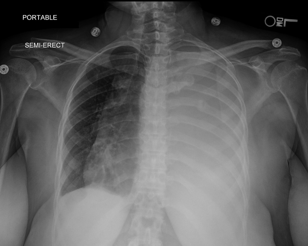 | 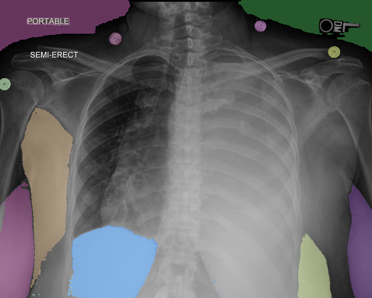 | 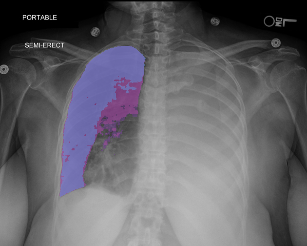 | 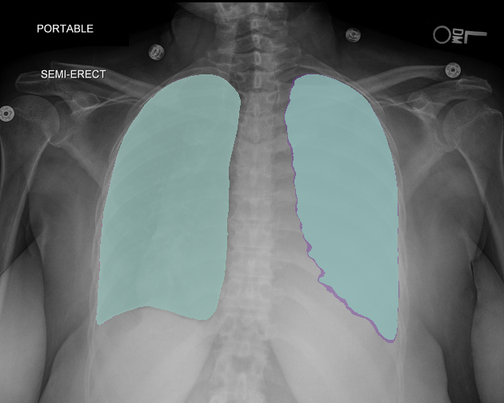 | 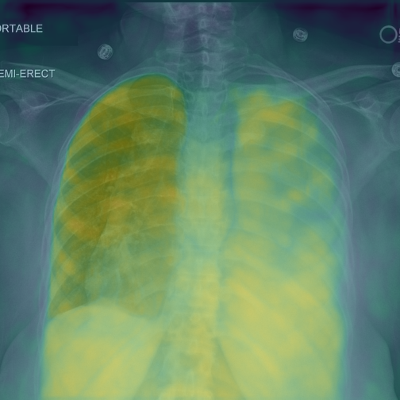 |

- 背景信息：Age: 60 years Gender: Female; Presentation: Short of breath. 60 岁女性，呼吸困难。
- 原始问题：What are the relevant observations and what is the likely cause? 相关影像观察是什么，最可能的原因是什么？
- 参考答案：Expanded left hemithorax with mediastinal shift and splayed ribs, most likely due to a massive pleural collection. 左侧胸腔扩大、纵隔移位、肋间隙增宽，最可能由大量胸腔积液造成。
- 原始图片caption:
<pre>Patient slightly rotated to the right.
Complete opacification of the left hemithorax with shift of the trachea and mediastinum to the right, obscured mediastinal and diaphragmatic borders and splayed ribs indicating a massive left pleural effusion.
Clear right lung and pleural cavity.
Incidental old fracture of the left 6 th rib.
Gastric bubble absent.
No metastases.</pre>
<pre>患者体位轻度向右旋转。
左侧胸廓完全呈高密度影（实变/不透光），气管及纵隔向右移位，纵隔及膈肌轮廓显示不清，肋间隙增宽，提示左侧大量胸腔积液。
右肺及右侧胸膜腔清晰。
偶见左侧第6肋陈旧性骨折。
未见胃泡影。
未见转移病灶。</pre>
- **发生变化** InternVL3.5-14B: Correct → Incorrect；GPT-5.6-Luna-Pro: Incorrect → Correct

<strong>InternVL3.5-14B</strong>

**原始图像 → 原始 QA 回答**；评测：**Correct**

英文原始回答：

<pre>&lt;think&gt;
Okay, so I need to figure out the relevant observations from this chest X-ray and determine the likely cause of the patient&#x27;s shortness of breath. Let me start by looking at the image. The patient is a 60-year-old female, and the X-ray is a frontal view.

First, I notice that the right lung (on the left side of the image) seems mostly clear, but the left lung (right side of the image) is almost completely white. That&#x27;s a big difference. The left hemithorax is opacified, which means there&#x27;s something there that&#x27;s blocking the X-rays, making it look white. The right lung has some markings, but the left side doesn&#x27;t show any lung markings. That makes me think of a pleural effusion or maybe a large mass. But pleural effusion usually causes a meniscus sign, where the fluid levels off, but in this case, the entire left lung is white. 

Wait, maybe it&#x27;s a complete collapse of the left lung? If the lung is collapsed, like atelectasis, it would look dense. But atelectasis often has volume loss, so the trachea might shift towards the affected side. Let me check the trachea. The trachea here seems midline, so maybe not a significant shift. Hmm. 

Another possibility is a large pleural effusion. If there&#x27;s a lot of fluid, it can obscure the lung. But again, the entire left side is white. Also, the diaphragm on the left side isn&#x27;t visible. The right hemidiaphragm is visible, but the left is covered. 

Wait, the heart and mediastinum might shift if there&#x27;s a large effusion. In this image, the heart is shifted towards the right? Let me see. The heart&#x27;s border is still visible on the right side, but the left border is obscured. The mediastinum might be shifted to the right if there&#x27;s a big left effusion. But in this image, the mediastinum seems centered. 

Alternatively, could it be a pneumothorax? No, a pneumothorax would show a visible pleural line with no lung markings beyond it. But here, the entire left side is white, so that&#x27;s not it. 

Wait, maybe a massive pulmonary embolism causing a wedge-shaped opacity? But that&#x27;s usually in a specific area, not the entire lung. 

Another thought: if the left lung is completely collapsed, like from mucus plug or external compression. But the trachea isn&#x27;t shifted. Maybe the patient has a large tumor in the left lung causing collapse. But tumors usually have some irregular borders. 

Wait, the left hemithorax is completely opacified. The right lung is clear. The heart is shifted? Let me check again. The heart&#x27;s silhouette is more on the right side. If the left lung is completely white, maybe the heart is pushed to the right. But the mediastinum is still centered. 

Wait, maybe it&#x27;s a hemothorax? But the patient&#x27;s presentation is shortness of breath. Hemothorax can cause similar findings. 

Alternatively, could it be a diaphragmatic hernia? If abdominal contents are in the chest, but that would usually show bowel gas patterns, which I don&#x27;t see here. 

Wait, another possibility: complete atelectasis of the left lung. If the entire left lung is collapsed, it would appear white. The trachea might be deviated towards the left, but here it&#x27;s midline. Maybe the patient has a large pleural effusion that&#x27;s causing the left lung to be compressed. But again, the effusion would need to be massive. 

Alternatively, maybe the patient has a massive pleural effusion with a loculated component, but the X-ray shows a homogeneous opacity. 

Wait, the left costophrenic angle is obliterated. The right one is sharp. So, the left side is all white. The right lung is clear. The diaphragm on the left is not visible. 

So, the key observation here is a complete white-out of the left hemithorax with no visible lung markings, suggesting either a large pleural effusion, complete lung collapse, or a mass. 

Given the patient&#x27;s age and presentation of shortness of breath, possible causes could be:

1. Large pleural effusion (maybe malignant, given age)
2. Complete atelectasis (maybe due to mucus plug, tumor obstructing a main bronchus)
3. Massive pulmonary consolidation (like pneumonia, but usually there are some air bronchograms and it&#x27;s less likely to be 100% white)
4. Hemothorax (if there was trauma, but the history doesn&#x27;t mention trauma)
5. Tumor (like a large lung cancer causing collapse or effusion)

In a 60-year-old female, lung cancer or metastatic disease could be a concern. Pleural effusion could be parapneumonic, malignant, or chylothorax. 

But the X-ray shows a complete white-out. If it&#x27;s a pleural effusion, the effusion would need to be layering posteriorly, but in a semi-erect position, maybe it&#x27;s settled. However, in a frontal view, a large effusion would cause a meniscus. But here, it&#x27;s a homogeneous opacity. 

Alternatively, if the entire left lung is collapsed, the mediastinum might shift towards the left, but here it seems centered. Wait, maybe the left lung is so collapsed that the mediastinum isn&#x27;t shifting because the volume loss is compensated. 

Alternatively, if there&#x27;s a tension pneumothorax, but that&#x27;s not the case here. 

Wait, another thought: if the patient has a left lung that&#x27;s completely opacified due to a massive infection with consolidation, but again, usually some air bronchograms. 

Alternatively, maybe a diaphragmatic paralysis causing elevation and atelectasis, but that&#x27;s usually not 100% white. 

Wait, the heart size: the heart is normal in size. The trachea is midline. 

So, considering all this, the most likely cause is a large pleural effusion, possibly malignant, leading to near-complete opacification of the left hemithorax. Alternatively, complete atelectasis of the left lung. 

But how to differentiate between effusion and atelectasis on X-ray? Atelectasis often has volume loss (shift of trachea, elevation of diaphragm), while effusion may have a meniscus and possible shift of mediastinum. 

In this case, the left diaphragm is not visible, and the entire left side is white. The trachea is midline. If it&#x27;s a pleural effusion, the mediastinum might shift to the right if the effusion is large. Here, the heart is more towards the right, which could indicate a right shift. 

So, combining the midline trachea with mediastinal shift to the right, that&#x27;s more suggestive of a large left pleural effusion. 

Alternatively, if the left lung is completely collapsed, the mediastinum would shift towards the left. But here, it&#x27;s shifted to the right, which supports a large effusion. 

Therefore, the observations are:

- Complete opacification of the left hemithorax
- No visible lung markings on the left
- Possible mediastinal shift to the right
- Right lung clear

Likely cause: Large left pleural effusion, possibly malignant, leading to compression of the left lung and causing shortness of breath. Other possibilities include massive pneumonia or atelectasis, but the effusion is more likely given the complete white-out and mediastinal shift.
&lt;/think&gt;

**Relevant Observations:**
1. **Complete Opacification of the Left Hemithorax:** The left lung field is entirely white with no visible lung markings, indicating a significant pathological process.
2. **Right Lung Clear:** The right lung appears aerated with normal vascular markings.
3. **Mediastinal Shift:** The heart and mediastinum appear slightly shifted toward the right, suggesting volume loss or mass effect on the left.
4. **Trachea Midline:** No significant tracheal deviation, which can occur in large pleural effusions or tension pneumothorax.

**Likely Cause:**
- **Massive Left Pleural Effusion:** The homogeneous opacification and mediastinal shift to the right are classic for a large pleural effusion. In a 60-year-old female, this could be malignant (e.g., metastatic cancer, mesothelioma) or post-pneumonic. The absence of tracheal deviation and presence of mediastinal shift favor effusion over atelectasis.
- **Alternative Considerations:** 
  - **Complete Left Lung Collapse (Atelectasis):** Unlikely due to lack of tracheal deviation toward the affected side.
  - **Pulmonary Consolidation:** Less probable given the homogeneity and absence of air bronchograms.
  - **Hemothorax or Chylothorax:** Possible but less common without trauma or lymphatic disruption history.

**Conclusion:** The imaging findings strongly suggest a **large left pleural effusion**, likely malignant given the patient’s age and presentation. Further evaluation with ultrasound or CT, and thoracentesis for fluid analysis, is warranted.</pre>

中文翻译：

<pre>模型识别左侧半胸近乎完全白化、左膈和肋膈角消失及纵隔右移，认为是大量左侧胸腔积液伴压迫性肺不张，并考虑恶性积液，回答正确。</pre>

**原始图像 + Segmentation → 原始 QA 回答**；评测：**Incorrect**

英文原始回答：

<pre>&lt;think&gt;
The X-ray image shows a frontal view of the chest. Observing the right lung, there is a clear presence of lung markings, which is normal. However, the left lung appears completely opaque, indicating an absence of air in that lung. The heart and mediastinum are shifted towards the right side, which suggests a significant pressure change.

The opacity of the left lung and the shift of the mediastinum are indicative of a collapsed lung, known as atelectasis. However, the complete opacity and the shift suggest a more acute issue.

The diaphragm on the left side is not visible, which is consistent with a complete lung collapse. The right lung appears hyperinflated, likely compensating for the loss of volume on the left.

Given the presentation of shortness of breath and the imaging findings, the likely cause is a tension pneumothorax on the left side. This condition occurs when air enters the pleural space and cannot escape, leading to increased pressure that collapses the lung and shifts the mediastinum, compromising cardiovascular function.

The presence of a visible pleural line without lung markings beyond it would confirm pneumothorax, but in this case, the entire left lung is opaque, suggesting a large amount of fluid or complete collapse.

Considering the rapid onset of symptoms and the imaging findings, immediate intervention is required to relieve the pressure, likely through needle decompression or chest tube insertion.
&lt;/think&gt;

The relevant observations from the chest X-ray include:

1. **Complete Opacity of the Left Lung**: The left lung is entirely opaque, indicating a lack of air and possible lung collapse.
2. **Mediastinal Shift**: The heart and mediastinum are shifted towards the right, suggesting increased pressure on the left side.
3. **Right Lung Hyperinflation**: The right lung appears overinflated, likely compensating for the loss of volume on the left.
4. **Diaphragm Visibility**: The left diaphragm is not visible, consistent with a collapsed lung.

The likely cause of these findings is a **tension pneumothorax** on the left side. This condition occurs when air enters the pleural space and cannot escape, leading to increased intrapleural pressure. This pressure causes the lung to collapse and shifts the mediastinum to the opposite side, compromising cardiovascular function. The patient&#x27;s presentation of shortness of breath aligns with this acute condition, which requires immediate medical intervention, such as needle decompression or placement of a chest tube, to relieve the pressure and restore normal lung function.</pre>

中文翻译：

<pre>加入分割后，模型把左侧异常误解为肺萎陷和胸膜腔内大量气体，最终诊断张力性气胸，并建议紧急减压，回答由正确变为错误。</pre>

**原始图像 → Single-image caption 回答**；

英文原始回答：

<pre>&lt;think&gt;
The X-ray image shows a frontal view of the chest, highlighting a significant abnormality in the left lung. The left hemithorax appears opacified, indicating a dense area that could suggest fluid accumulation, consolidation, or a mass. The right lung appears relatively clear, with visible lung markings. The mediastinum is shifted slightly towards the right, which might indicate a volume loss or mass effect on the left side. The diaphragm on the left side is obscured, which is consistent with an opacity in the lower lung field. Given the patient&#x27;s presentation of shortness of breath and the radiographic findings, a possible diagnosis could include a large pleural effusion, pneumonia, or a lung mass. However, the complete opacification of the left lung is more suggestive of a significant pleural effusion or a large mass. Further clinical correlation and possibly additional imaging or diagnostic tests would be needed to confirm the diagnosis.
&lt;/think&gt;

**Image Description:**

The provided X-ray image is a frontal chest radiograph of a 60-year-old female patient presenting with shortness of breath. The image reveals a notable abnormality in the left hemithorax, characterized by complete opacification. This opacification obscures the left lung field, diaphragm, and cardiac silhouette on the left side. The right lung appears relatively clear with visible lung markings. The mediastinum is slightly shifted towards the right, suggesting a possible volume loss or mass effect on the left side.

**Diagnosis:**

Based on the radiographic findings and the patient&#x27;s clinical presentation, the most likely diagnosis is a **large left pleural effusion**. The complete opacification of the left hemithorax is consistent with fluid accumulation in the pleural space, which can cause mediastinal shift and respiratory distress. Other potential considerations include:

1. **Lung Mass or Tumor:** A large mass in the left lung could cause similar opacification, but the absence of visible air bronchograms makes this less likely.
2. **Pneumonia with Consolidation:** Severe consolidation could cause opacification, but it typically does not result in complete obscuration of the diaphragm and mediastinal shift.
3. **Pneumothorax:** Although less likely given the opacification, a tension pneumothorax could cause mediastinal shift, but it usually presents with a visible visceral pleural line.

**Recommendations:**

- **Further Imaging:** A lateral decubitus chest X-ray or a CT scan of the thorax can help differentiate between a pleural effusion and other causes of opacification.
- **Diagnostic Thoracentesis:** If a pleural effusion is suspected, thoracentesis can be performed to analyze the fluid for infection, malignancy, or other causes.
- **Clinical Correlation:** Assessment of symptoms, physical examination findings, and laboratory tests (e.g., complete blood count, inflammatory markers) can aid in narrowing down the diagnosis.

**Conclusion:**

The radiographic appearance strongly suggests a large left pleural effusion, which is consistent with the patient&#x27;s symptoms of shortness of breath. Further diagnostic evaluation is necessary to confirm the diagnosis and determine the underlying cause.</pre>

中文翻译：

<pre>**图像描述：**

提供的X光片为一名有气促症状的60岁女性患者的胸部正位片。图像显示左侧胸腔存在显著异常，表现为完全性致密影（呈不透光状态）。该致密影遮蔽了左侧肺野、膈肌及左侧心影。右侧肺部相对清晰，肺纹理可见。纵隔轻度向右移位，提示左侧可能存在肺容积缩小或占位效应。

原始 caption 描述左侧半胸显著致密、纵隔移位和膈肌轮廓消失，最符合大量左侧胸腔积液。</pre>

**原始图像 + Segmentation → Single-image caption 回答**；

英文原始回答：

<pre>&lt;think&gt;
The X-ray image reveals significant radiographic findings. The left hemithorax is almost entirely opacified, suggesting a large pleural effusion or complete lung collapse (atelectasis) on the left side. The mediastinum appears shifted towards the left, which is consistent with volume loss or mass effect from the left side. The right lung shows normal aeration with no evident consolidation or effusion. The diaphragm on the right side is well-defined, while the left diaphragm is obscured due to the opacity. The cardiac silhouette is shifted towards the left, indicating possible mediastinal shift. Given the patient&#x27;s presentation of shortness of breath, these findings are concerning for a large pleural effusion or complete atelectasis of the left lung, which could be due to various etiologies such as malignancy, infection, or trauma. Further diagnostic evaluation, such as a CT scan or thoracentesis, would be necessary to determine the underlying cause.
&lt;/think&gt;

**Description of the X-ray Image:**

The provided chest X-ray image is a frontal (anteroposterior) view in a semi-erect position. The key observations include:

1. **Left Hemithorax Opacification:** The left side of the thorax is almost completely opaque, indicating a significant abnormality. This could be due to a large pleural effusion, complete atelectasis (collapse) of the left lung, or a mass.

2. **Right Hemithorax:** The right lung appears relatively clear with visible lung markings, suggesting normal aeration. There is no evident pleural effusion or consolidation on the right side.

3. **Mediastinal Shift:** The mediastinum (central structures including the heart and trachea) appears shifted towards the left side. This shift is likely due to the volume loss or mass effect from the left hemithorax.

4. **Diaphragm:** The right hemidiaphragm is visible and well-defined, while the left hemidiaphragm is obscured by the opacity in the left hemithorax.

5. **Cardiac Silhouette:** The heart appears shifted towards the left side, consistent with the mediastinal shift.

**Possible Diagnosis:**

Given the patient&#x27;s age (60 years), gender (female), and presentation of shortness of breath, the radiographic findings suggest:

1. **Large Left Pleural Effusion:** The complete opacification of the left hemithorax is consistent with a significant pleural effusion. This could be due to various causes, including malignancy (e.g., lung cancer, metastatic disease), infection (e.g., empyema), or other conditions like heart failure or trauma.

2. **Complete Atelectasis of the Left Lung:** The opacification could also represent complete collapse of the left lung, possibly due to airway obstruction (e.g., tumor, mucus plug) or external compression.

3. **Mass or Tumor:** A large mass in the left hemithorax could cause similar findings, though less likely to cause complete opacification without associated mediastinal shift.

**Further Evaluation:**

- **Clinical Correlation:** Assess for signs of infection (fever, leukocytosis), malignancy (history, smoking history), or other systemic symptoms.
- **Diagnostic Tests:**
  - **CT Thorax:** To better characterize the opacity, assess for masses, and evaluate the mediastinum.
  - **Thoracentesis:** If pleural effusion is suspected, to analyze the fluid (cell count, cytology, culture).
  - **Bronchoscopy:** If airway obstruction is suspected.
- **Monitoring:** If the patient is stable, serial imaging may be considered to assess for changes.

**Conclusion:**

The X-ray findings are highly suggestive of a large left pleural effusion or complete atelectasis, with mediastinal shift. Given the patient&#x27;s symptoms and age, urgent further evaluation is warranted to determine the underlying cause and appropriate management.</pre>

中文翻译：

<pre>
X光影像显示了显著的影像学征象。左侧胸腔几乎完全呈高密度影（不透光），提示左侧存在大量胸腔积液或左肺完全萎陷（肺不张）。纵隔向左侧移位，这与左侧的容积缩小或占位效应相一致。右肺充气良好，未见明显的实变或积液。右侧膈肌轮廓清晰，而左侧膈肌因高密度影遮挡而无法辨认。心影向左侧移位，提示可能存在纵隔移位。鉴于患者有呼吸急促的症状，这些影像学发现令人担忧存在大量胸腔积液或左肺完全萎陷，其病因可能包括恶性肿瘤、感染或创伤等。需要进行进一步的诊断评估（如CT扫描或胸腔穿刺术）以明确潜在病因。

**X光影像描述：**

提供的胸部X光片为半直立位的前后位（AP位）影像。主要观察结果如下：

1. **左侧胸腔高密度影：** 左侧胸腔几乎完全呈高密度（不透光），表明存在显著异常。这可能是由大量胸腔积液、左肺完全萎陷（肺不张）或肿块引起的。

2. **右侧胸腔：** 右肺野相对清晰，可见肺纹理，提示充气良好。右侧未见明显的胸腔积液或实变。

3. **纵隔移位：** 纵隔（包括心脏和气管在内的中央结构）向左侧移位。这种移位很可能是由左侧胸腔的容积缩小或占位效应引起的。

4. **膈肌：** 右侧膈肌可见且轮廓清晰，而左侧膈肌因左侧胸腔的高密度影而被遮挡。

5. **心影：** 心脏向左侧移位，这与纵隔移位的情况相一致。

分割增强 caption 仍能看到左侧半胸白化，但对分割区域和容量效应的解释不稳定，未能维持原先明确的大量积液判断。</pre>

**对模型对图片caption能力分析**：
原始 caption 正确识别左侧半胸白化和大量胸腔积液；加入 segmentation 后模型依然定位左边“腔几乎完全呈高密度（不透光）”，只是对分隔区域解释不稳定。

<strong>GPT-5.6-Luna-Pro</strong>

**原始图像 → 原始 QA 回答**；评测：**Incorrect**

英文原始回答：

<pre>- **Relevant observations:** Portable semi-erect film demonstrates near-complete opacification (“white-out”) of the **left hemithorax**, with obscuration of the left heart border and hemidiaphragm. The right lung is relatively aerated. There is likely some mediastinal displacement toward the right, suggesting increased left-sided volume rather than simple lung collapse.

- **Likely cause:** A **very large left pleural effusion**, with associated compressive atelectasis of the left lung. In a 60-year-old with a unilateral massive effusion, an underlying **malignancy should be considered** (though infection/empyema or hemorrhage are alternatives).

- **Thinking clue:** A hemithorax white-out with mediastinal shift **away** from the opacity favors a large pleural effusion; shift **toward** the opacity would instead suggest major lung collapse.</pre>

中文翻译：

<pre>模型描述左侧半胸近乎完全白化、左心缘和左膈消失并向右推移纵隔，认为大量左侧胸腔积液伴压迫性肺不张，且在 60 岁患者中需考虑恶性原因。</pre>

**原始图像 + Segmentation → 原始 QA 回答**；评测：**Correct**

英文原始回答：

<pre>### Relevant observations
- **Near-complete homogeneous opacification of the left hemithorax**, with loss of visualization of the left lung and left hemidiaphragm.
- The appearance is most consistent with a **very large left pleural effusion**, likely with associated **compressive atelectasis/collapse of the left lung**.
- There is probable **mild rightward mediastinal/tracheal displacement**, favoring volume expansion from pleural fluid rather than isolated lung collapse.
- The right lung shows mild basilar/perihilar increased opacity, which may represent **vascular congestion or dependent atelectatic change**.
- No obvious pneumothorax is seen.
- The segmentation outputs are imperfect: some models appear to misclassify the large effusion and collapsed lung, so the radiographic appearance should take precedence.

### Likely cause
The immediate cause of the dyspnea is a **massive left pleural effusion causing compressive atelectasis**.

The underlying etiology cannot be established from this radiograph alone. In a 60-year-old with a unilateral massive effusion, important possibilities include:

- **Malignant pleural effusion** — a major concern
- Parapneumonic effusion/empyema
- Less commonly, tuberculosis or other inflammatory causes
- Congestive heart failure, although the marked unilateral predominance is less typical

### Thinking clues
- **White-out of one hemithorax + mediastinal shift away** → large pleural effusion is favored.
- **White-out + shift toward the opacity** → complete lung collapse is more likely.
- Here, the apparent shift away and the large fluid-like opacity support **massive pleural fluid with secondary lung compression**.

Urgent correlation with bedside ultrasound and diagnostic/therapeutic thoracentesis would be appropriate; pleural fluid cytology and microbiology may be needed to identify the cause.</pre>

中文翻译：

<pre>加入分割后，模型更明确地把同侧白化和纵隔向健侧移位解释为大量胸膜液体造成的容量增加，而非单纯肺萎陷，最终回答大量左侧胸腔积液伴压迫性肺不张，评测正确。</pre>

**原始图像 → Single-image caption 回答**；

英文原始回答：

<pre>**Portable AP chest radiograph:** There is near-complete homogeneous opacification of the left hemithorax with obscuration of the left heart and hemidiaphragm, likely associated with mild rightward mediastinal shift. The right lung is relatively aerated, with mild basilar/perihilar vascular or air-space opacity. No pneumothorax is evident.

**Impression/diagnosis:**  
**Large left pleural effusion causing compressive atelectasis/near-total left lung collapse.** Underlying left-sided pneumonia, malignancy, or other parenchymal disease cannot be excluded; consider chest ultrasound or CT and diagnostic thoracentesis.</pre>

中文翻译：

<pre>
**便携式前后位（AP）胸部X光片：** 左侧胸腔呈近乎完全的均匀性致密影，导致左心缘及左侧膈肌轮廓显示不清；伴有纵隔向右侧轻度移位。右肺充气良好，仅见肺底及肺门周围有轻度血管纹理增粗或肺实质密度增高影。未见明显气胸征象。

**影像学印象/诊断：**
**大量左侧胸腔积液，导致压迫性肺不张/左肺近乎完全萎陷。** 无法排除潜在的左侧肺炎、恶性肿瘤或其他肺实质病变；建议进行胸部超声或CT检查，以及诊断性胸腔穿刺术。

原始 caption 已描述左侧半胸均匀致密、纵隔轻度右移，诊断大量左侧胸腔积液并近乎完全压迫左肺。</pre>

**原始图像 + Segmentation → Single-image caption 回答**；

英文原始回答：

<pre>**Chest X-ray findings:** Portable semi-erect AP film demonstrates near-complete “white-out” of the left hemithorax, with obscuration of the left lung and left hemidiaphragm. There is likely mass effect with some rightward mediastinal displacement, favoring a large pleural fluid collection. Adjacent left-lung compressive atelectasis and/or underlying consolidation cannot be assessed. Mild patchy right basilar/perihilar opacity is also present.

**Impression/diagnosis:**  
**Large left pleural effusion causing near-complete opacification of the left hemithorax, with associated compressive atelectasis (possible underlying pneumonia or mass).** Consider urgent clinical correlation and ultrasound or CT-guided evaluation/drainage if clinically indicated.</pre>

中文翻译：

<pre>**胸部X线表现：** 床旁半直立位前后位（AP）片显示左侧胸廓呈近乎完全的“白肺”样改变，左肺及左侧膈肌轮廓显示不清。可见提示占位效应的纵隔向右移位征象，倾向于大量胸腔积液。无法评估是否存在邻近左肺受压性肺不张和/或潜在的肺实变。此外，右肺基底部/肺门周围可见轻度斑片状密度增高影。

**影像学印象/诊断：**
**左侧大量胸腔积液导致左侧胸廓近乎完全呈高密度影，伴受压性肺不张（可能合并潜在肺炎或占位性病变）。** 建议结合临床情况进行紧急评估；若临床指征明确，可考虑在超声或CT引导下进行评估或引流。

分割增强 caption 仍维持大量左侧胸腔积液和压迫性肺不张的判断，并补充可能存在基础肺炎或肿块，建议超声或 CT 及引流。</pre>

**对模型对图片caption能力分析**：
两版 caption 都能识别大量左侧胸腔积液，分割后对“半胸白化 + 纵隔向健侧移位”的解释更明确。QA的差距更多的是来源于thinking而非对图片表述差距。

### 1.7 [Pancoast tumor](https://radiopaedia.org/cases/pancoast-tumour-11?lang=us) (`pancoast-tumour-11`)

| Original image | Medical-SAM2 | Medical-SAM3: lung, lung opacity, first rib, clavicle （肺、肺部阴影、第一肋骨、锁骨） | BiomedParse v1: lung, lung opacity, first rib, clavicle （肺、肺部阴影、第一肋骨、锁骨） | TorchXRayVision CXAS: lung, right lung, left lung, diaphragm, heart, cardiomediastinum, upper mediastinum, lower mediastinum, stomach （肺、右肺、左肺、膈肌、心脏、心纵隔、上纵隔、下纵隔、胃） |
|---|---|---|---|---|
| 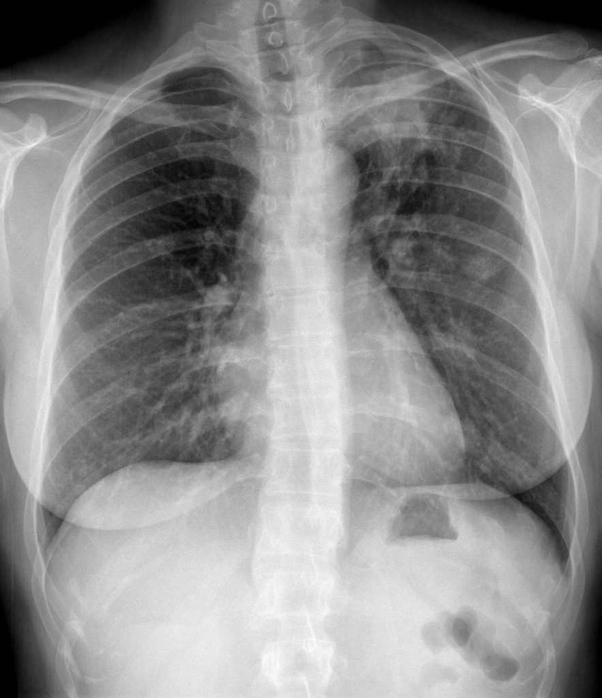 | 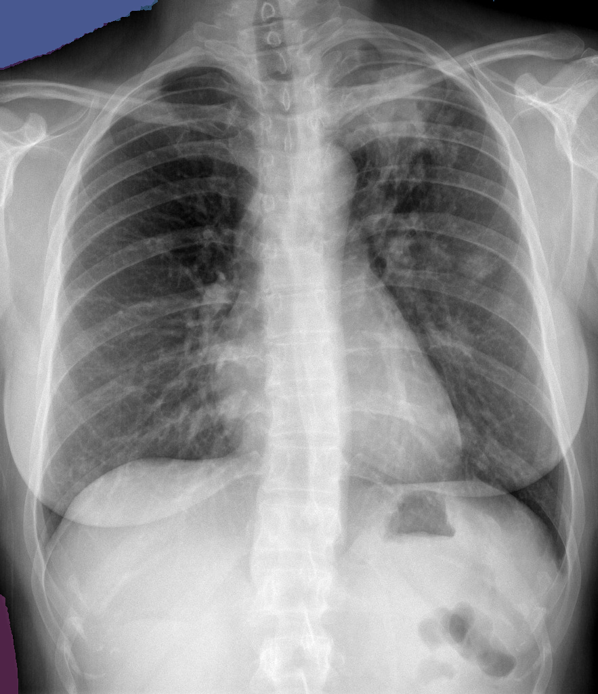 | 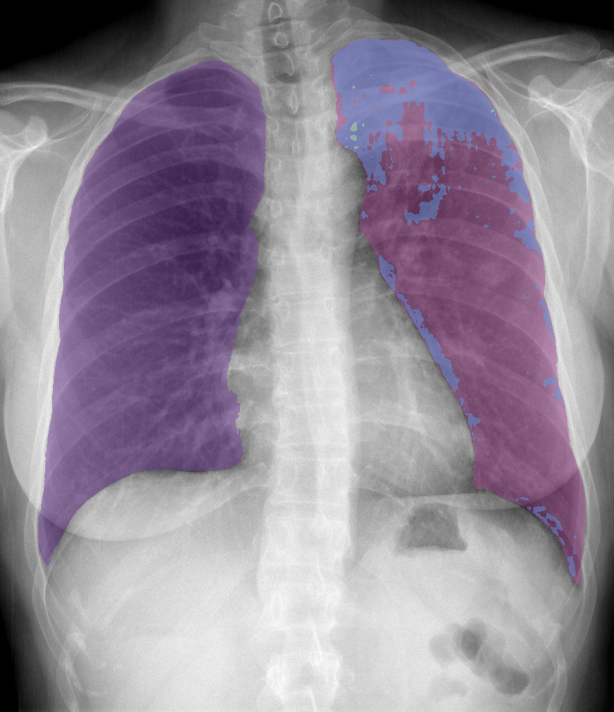 | 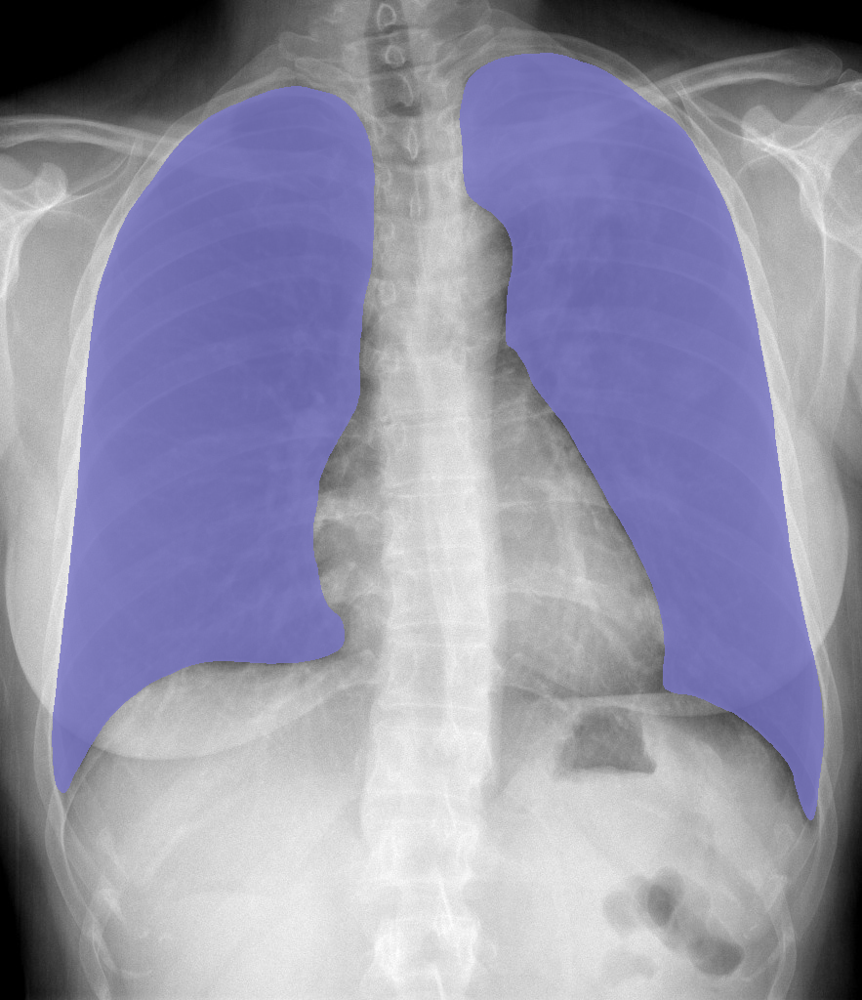 | 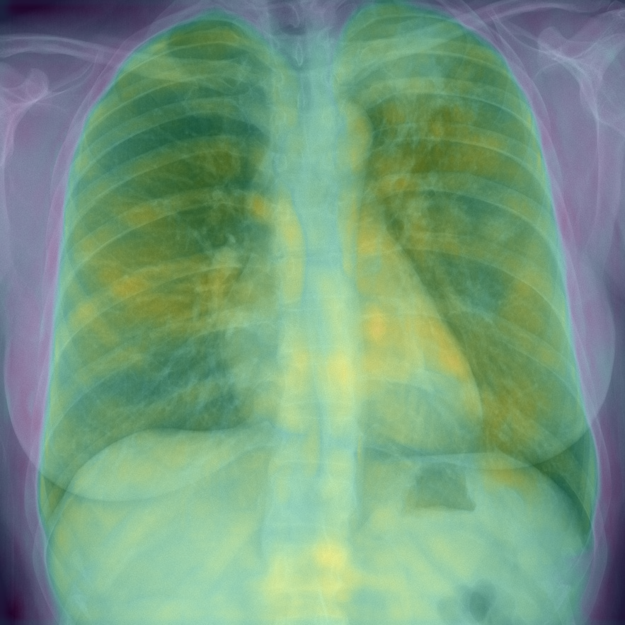 |

- 背景信息：Age: 44 Gender: Female; Presentation: Right sided pleuritic pain. 44 岁女性，右侧胸膜性疼痛。
- 原始问题：What is the eponymous name for this condition? 这种疾病的同名名称是什么？
- 参考答案：Pancoast tumour. Pancoast 潘科斯特肿瘤。
- 原始图片caption:
<pre>Irregular opacity in the left apex. Bony erosion of the lateral first rib. Multiple nodular opacities noted throughout both lungs.</pre>
<pre>左肺尖见不规则密度增高影。第一肋骨外侧段见骨质侵蚀。双肺各处可见多发结节状密度增高影。</pre>
- **发生变化** InternVL3.5-14B: Correct → Incorrect

<strong>InternVL3.5-14B</strong>

**原始图像 → 原始 QA 回答**；评测：**Correct**

英文原始回答：

<pre>&lt;think&gt;
The chest X-ray shows a noticeable area of increased opacity in the left upper lung zone, which could be indicative of a pathology. The patient presents with right-sided pleuritic pain, which might suggest a referred pain or a process affecting the left lung. The increased opacity in the left upper lung zone could be due to consolidation, infiltrate, or another process. One eponymous condition that presents with upper lobe involvement and pleuritic pain is &quot;Pancoast tumor,&quot; which is a type of lung cancer located in the apex of the lung. However, the description of pleuritic pain on the right side might not align perfectly with a left upper lobe lesion. Another possibility is &quot;Hampton&#x27;s hump,&quot; which refers to a pulmonary infarct associated with a wedge-shaped opacity, often due to a pulmonary embolism. Given the location and presentation, &quot;Hampton&#x27;s hump&quot; seems plausible. However, the classic presentation of pleuritic pain and a specific X-ray finding might also point towards &quot;pleurisy&quot; or &quot;Wegener&#x27;s granulomatosis,&quot; but these are less likely to have a specific eponymous name for this exact presentation. Considering the increased opacity in the left upper zone and the pleuritic pain, &quot;Pancoast tumor&quot; is a strong candidate, but the side discrepancy needs consideration. Another possibility is &quot;Kerley B lines,&quot; but these are more indicative of interstitial edema. The most fitting eponymous name for an upper lobe opacity with pleuritic pain might be &quot;Pancoast tumor,&quot; but the side discrepancy is confusing. Alternatively, &quot;Hampton&#x27;s hump&quot; could be considered if a pulmonary infarct is suspected.
&lt;/think&gt;

The eponymous name for the condition suggested by the presentation and imaging findings could be **&quot;Pancoast tumor&quot;**. However, given the right-sided pleuritic pain and left upper lobe opacity, another possibility is **&quot;Hampton&#x27;s hump&quot;**, which refers to a pulmonary infarct. The most likely answer, considering the upper lobe lesion and pleuritic pain, is **&quot;Pancoast tumor&quot;**, but the side discrepancy may suggest reconsideration. 

**Answer:** The eponymous name for this condition is **&quot;Pancoast tumor&quot;**.</pre>

中文翻译：

<pre>模型注意到肺尖或上肺野致密影，在 Pancoast 肿瘤与 Hampton 驼峰征之间摇摆，最终仍回答 Pancoast 肿瘤，基线评测正确。</pre>

**原始图像 + Segmentation → 原始 QA 回答**；评测：**Incorrect**

英文原始回答：

<pre>&lt;think&gt;
The patient presents with right-sided pleuritic pain, and the X-ray shows abnormalities in the left lung, specifically in the upper zone. The segmented images highlight lung opacity in the left upper lung field. 

Pleuritic pain often relates to inflammation of the pleura, which can be due to conditions like pneumonia. The X-ray shows increased opacity in the left upper lung, which could indicate an infectious process. 

One classic eponymous name for a condition involving upper lobe pneumonia, particularly in a posteroanterior (PA) chest X-ray, is &quot;Hampton&#x27;s hump.&quot; However, Hampton&#x27;s hump is typically associated with pulmonary infarction due to a pulmonary embolism, which may not fully match this presentation.

Another possibility is &quot;Ghon complex,&quot; which refers to a small area of consolidation with associated calcified lymphadenopathy, typically seen in tuberculosis. 

Considering the location and presentation, &quot;upper lobe pneumonia&quot; could be associated with &quot;lobar pneumonia,&quot; but it lacks a specific eponymous name. 

The pattern seen might also suggest &quot;Pancoast tumor,&quot; but that usually involves the apex of the lung and might show different radiographic features.

Given the left upper lobe involvement with pleuritic pain, &quot;Hampton&#x27;s hump&quot; could be considered, but it&#x27;s more specific to infarction. A more general term for the opacity might simply be &quot;pulmonary consolidation.&quot;

However, if the opacity is due to a specific syndrome or condition, &quot;Westermark&#x27;s sign&quot; is associated with pulmonary embolism but is more about oligemia.

The eponymous name that fits an upper lobe pneumonia pattern on X-ray is likely &quot;Ghon focus&quot; if it&#x27;s related to tuberculosis. But the clinical presentation might lean towards a bacterial pneumonia.

After reevaluating, the term &quot;Pleurisy&quot; relates to pleuritic pain, but not specifically the opacity.

Given the segmented opacity in the left upper lung, and classic presentation, the eponymous term could be &quot;lobar pneumonia,&quot; but it&#x27;s not eponymous. 

Considering the distribution and clinical presentation, the most fitting eponymous name might be &quot;Hampton&#x27;s hump&quot; if infarction is suspected, but more likely, it&#x27;s &quot;Ghon complex&quot; for tuberculosis. However, the clear absence of lymphadenopathy might rule that out.

The answer might simply be &quot;Pneumonia&quot; without an eponymous name, but the question implies there is one.

The eponymous name for a condition presenting with pleuritic chest pain and upper lobe involvement on X-ray could be &quot;Pancoast tumor,&quot; but it usually affects the apex.

Another possibility is &quot;Klebsiella pneumonia,&quot; but that&#x27;s not eponymous.

Given the details, the most likely eponymous name is &quot;Hampton&#x27;s hump&quot; for pulmonary infarction, but if it&#x27;s a bacterial pneumonia, it might not have a specific eponymous name.

The answer is likely &quot;Hampton&#x27;s hump,&quot; but considering the clinical presentation and X-ray findings, &quot;Ghon complex&quot; might be more appropriate if TB is considered.

But the presentation seems more acute and aligned with bacterial pneumonia. 

After careful consideration, the eponymous name for this condition, given the pleuritic pain and X-ray findings, is likely &quot;Pleurisy,&quot; but that&#x27;s not specific.

The best answer, considering the opacity in the upper lobe and pleuritic pain, is &quot;Hampton&#x27;s hump,&quot; but I&#x27;m not fully certain.

The correct eponymous name is &quot;Pancoast tumor,&quot; but it doesn&#x27;t fit perfectly.

The most fitting answer is &quot;Hampton&#x27;s hump&quot; for pulmonary infarction, but the presentation seems more like pneumonia.

Given the information, the answer is likely &quot;Ghon complex&quot; for tuberculosis, but without lymphadenopathy, it&#x27;s uncertain.

The final answer is &quot;Hampton&#x27;s hump,&quot; but I&#x27;m not entirely sure.

Upon reevaluation, the eponymous name for this condition is &quot;Westermark&#x27;s sign,&quot; but it&#x27;s not a condition.

The correct answer is &quot;Pleurisy,&quot; but again, not specific.

I think the best answer is &quot;Hampton&#x27;s hump&quot; for pulmonary infarction, but the presentation might be more consistent with &quot;lobar pneumonia,&quot; which doesn&#x27;t have an eponymous name.

After careful analysis, the eponymous name for the condition with upper lobe opacity and pleuritic pain is likely &quot;Ghon focus&quot; in the context of tuberculosis.
&lt;/think&gt;

The eponymous name for the condition presented in the X-ray, with right-sided pleuritic pain and left upper lobe opacity, is **&quot;Hampton&#x27;s hump&quot;**. 

**Explanation:**
- **Hampton&#x27;s hump** refers to a pulmonary infarct, typically seen as a wedge-shaped opacity in the peripheral lower lung zones, often associated with pulmonary embolism. However, it can occasionally appear in the upper lobes.
- The patient&#x27;s pleuritic pain aligns with pleural irritation, which can occur in pulmonary infarction.
- While the opacity is in the upper lobe, which is less classic, the clinical presentation and imaging findings can still suggest this eponymous term.

If the opacity is due to an infectious process like tuberculosis, **&quot;Ghon complex&quot;** (a small focus of consolidation with calcified hilar lymphadenopathy) might be considered, but the absence of lymphadenopathy in the image makes this less likely. 

Given the information, **Hampton&#x27;s hump** is the most fitting eponymous name for this presentation.</pre>

中文翻译：

<pre>加入分割后，模型过度依赖“肺部阴影”等提示，把病变解释为肺梗死相关的 Hampton 驼峰征，并讨论 Ghon 复合征和肺炎，漏掉肺尖肿块及第一肋骨侵蚀。</pre>

**原始图像 → Single-image caption 回答**；

英文原始回答：

<pre>&lt;think&gt;
The patient is a 44-year-old female presenting with right-sided pleuritic pain. Pleuritic pain typically suggests inflammation of the pleura, which can be due to various causes including infections, malignancies, or pulmonary embolism.

Upon examining the chest X-ray, the following observations can be made:

1. **Lung Fields**: The left lung appears relatively clear. The right lung, particularly in the upper zone, shows increased opacity. This could indicate consolidation, which is often seen in infections like pneumonia or could be due to a mass.

2. **Cardiac Silhouette**: The heart size is within normal limits, and there is no evidence of cardiomegaly.

3. **Diaphragm and Costophrenic Angles**: The diaphragms are well-defined, and the costophrenic angles are sharp, indicating no pleural effusion.

4. **Bones and Soft Tissues**: The bony structures, including the ribs and spine, appear intact without any obvious fractures or lesions. The soft tissues are unremarkable.

5. **Trachea and Mediastinum**: The trachea is midline, and the mediastinum does not show any widening or abnormal masses.

Given the right-sided pleuritic pain and the increased opacity in the right upper lung zone, the differential diagnosis includes:

- **Pneumonia**: Infection leading to consolidation, which can cause pleuritic pain.
- **Pulmonary Embolism**: Although less likely on a plain X-ray, it can sometimes show wedge-shaped infarcts.
- **Pleural Effusion**: However, the costophrenic angles are sharp, making this less likely.
- **Malignancy**: A mass or tumor in the lung could cause pleuritic pain and an area of opacity.

Considering the patient&#x27;s age and the presentation, pneumonia is a likely diagnosis, especially if there are signs of infection such as fever or cough. However, further imaging with a CT scan and possibly a CT pulmonary angiogram might be necessary to rule out other causes like a pulmonary embolism or malignancy.

In summary, the chest X-ray shows increased opacity in the right upper lung zone, which, in the context of right-sided pleuritic pain, suggests pneumonia. Further diagnostic workup is recommended to confirm the diagnosis and rule out other potential causes.
&lt;/think&gt;

**Diagnosis: Right Upper Lobe Pneumonia**

**Description of the Image:**

The provided chest X-ray is a frontal view of a 44-year-old female patient presenting with right-sided pleuritic pain. The image reveals the following key features:

1. **Lung Fields:**
   - **Right Lung:** There is increased opacity in the right upper lung zone, suggesting consolidation. This area appears denser compared to the surrounding lung tissue, indicating a potential infectious process.
   - **Left Lung:** The left lung appears clear with no significant opacities, masses, or consolidations noted.

2. **Cardiac Silhouette:**
   - The heart size is within normal limits, and there is no evidence of cardiomegaly.

3. **Diaphragm and Costophrenic Angles:**
   - Both diaphragms are well-defined, and the costophrenic angles are sharp, indicating the absence of pleural effusion.

4. **Bones and Soft Tissues:**
   - The bony structures, including the ribs and spine, appear intact without any fractures or lesions.
   - The soft tissues show no abnormalities.

5. **Trachea and Mediastinum:**
   - The trachea is midline, and the mediastinum does not show any widening or abnormal masses.

**Clinical Correlation and Differential Diagnosis:**

- **Pleuritic Pain:** The patient&#x27;s symptom of right-sided pleuritic pain is consistent with pleural inflammation, which can be caused by infections, malignancies, or pulmonary embolism.
  
- **Increased Opacity in Right Upper Lung Zone:** This finding is suggestive of consolidation, commonly seen in bacterial pneumonia. The absence of pleural effusion and normal cardiac silhouette make congestive heart failure less likely.

- **Differential Diagnoses:**
  - **Pneumonia:** The most likely diagnosis given the clinical presentation and radiographic findings. Bacterial pneumonia often presents with lobar consolidation and pleuritic chest pain.
  - **Pulmonary Embolism:** Although less likely on a plain X-ray, it can sometimes show wedge-shaped infarcts. However, the absence of other signs like oligemia or Hampton&#x27;s hump makes this less probable.
  - **Malignancy:** A mass or tumor could present with similar findings, but the acute presentation and pleuritic pain lean more towards an infectious process.
  - **Pleural Effusion:** The sharp costophrenic angles rule out significant pleural effusion.

**Conclusion:**

The chest X-ray findings, in conjunction with the patient&#x27;s presentation of right-sided pleuritic pain, strongly suggest right upper lobe pneumonia. Further diagnostic steps, such as sputum culture, blood tests, and possibly a CT scan, are recommended to confirm the diagnosis and guide appropriate treatment. Additionally, clinical correlation with symptoms like fever, cough, and sputum production will aid in confirming the diagnosis of pneumonia.</pre>

中文翻译：

<pre>
分析该胸部X光片，可见以下情况：

1. **肺野**：左肺野相对清晰。右肺野（尤其是上肺区）可见密度增高影。这可能提示肺实变（常见于肺炎等感染）或存在肿块。

2. **心影**：心脏大小在正常范围内，无心脏扩大征象。

3. **膈肌与肋膈角**：膈肌轮廓清晰，肋膈角锐利，提示无胸腔积液。

4. **骨骼与软组织**：包括肋骨和脊柱在内的骨骼结构完整，未见明显骨折或病变。软组织未见异常。

5. **气管与纵隔**：气管居中，纵隔无增宽或异常肿块影。

鉴于患者存在右侧胸膜性胸痛及右肺上区密度增高影，鉴别诊断包括：

- **肺炎**：感染导致肺实变，可引起胸膜性胸痛。
- **肺栓塞**：虽在普通X光片上较少见，但有时可见楔形梗死灶。
- **胸腔积液**：但因肋膈角锐利，此可能性较低。
- **恶性肿瘤**：肺部肿块或肿瘤可能引起胸膜性胸痛及局部密度增高影。
综合患者年龄及临床表现，肺炎是可能的诊断，尤其是当伴有发热或咳嗽等感染征象时。然而，可能需要进一步进行CT扫描（甚至肺动脉CT血管造影）以排除肺栓塞或恶性肿瘤等其他病因。
综上所述，胸部X光片显示右肺上区密度增高，结合右侧胸膜性胸痛的症状，提示肺炎可能。建议进行进一步检查以明确诊断并排除其他潜在病因。 **诊断：右肺上叶肺炎**
**影像描述：**
提供的胸部X光片为一名44岁女性患者的正位影像，该患者主诉右侧胸膜炎性胸痛。影像显示以下关键特征：
1. **肺野：**
- **右肺：** 右肺上区可见密度增高影，提示肺实变。该区域较周围肺组织密度更高，提示可能存在感染性病变。
- **左肺：** 左肺清晰，未见明显的密度增高影、肿块或实变。
2. **心影：**
- 心脏大小在正常范围内，无心脏扩大征象。
3. **膈肌与肋膈角：**
- 双侧膈肌轮廓清晰，肋膈角锐利，提示无胸腔积液。
4. **骨骼与软组织：**
- 骨骼结构（包括肋骨和脊柱）完整，未见骨折或病变。
- 软组织未见异常。
5. **气管与纵隔：**
- 气管居中，纵隔无增宽或异常肿块影。

原始 caption 把致密影定位为右上肺实变，最倾向右上叶肺炎，未识别 Pancoast 肿瘤。</pre>

**原始图像 + Segmentation → Single-image caption 回答**；

英文原始回答：

<pre>&lt;think&gt;
The patient is a 44-year-old female presenting with right-sided pleuritic pain. The chest X-ray (CXR) reveals findings that need careful analysis. 

First, pleuritic pain typically suggests an issue with the pleura, such as pleuritis or a pleural effusion. On the CXR, the left lung shows diffuse increased opacity, particularly in the upper and mid zones, which could indicate an inflammatory process, infection, or possibly a malignancy. The right lung appears relatively clear, but the presence of pleuritic pain on the right side warrants attention to any subtle abnormalities.

The segmentation images highlight areas of lung opacity in the left lung, with the left upper lobe and possibly parts of the left lower lobe involved. The right lung appears mostly clear, which is consistent with the patient&#x27;s right-sided pain but no obvious radiographic abnormalities on the right. 

Possible diagnoses include:
1. **Pneumonia**: The left lung opacity could represent a bacterial or viral pneumonia, which often presents with pleuritic chest pain.
2. **Pleuritis**: Inflammation of the pleura could cause pleuritic pain and might show subtle changes on CXR, though often the CXR can be normal or show minimal pleural thickening.
3. **Pulmonary embolism**: Although less likely to show specific findings on CXR, it can sometimes be associated with pleuritic pain. A CT pulmonary angiogram would be needed for confirmation.
4. **Malignancy**: A mass or nodule with associated pleural involvement could present with both pain and an area of opacity.
5. **Tuberculosis**: Can present with upper lobe opacities and pleuritic pain, especially in endemic areas.

Given the patient&#x27;s symptoms and the CXR findings, pneumonia or pleuritis are high on the differential. Further evaluation with a lateral CXR, CT scan of the chest, or laboratory tests (e.g., CBC, CRP, sputum culture) may be warranted to narrow down the diagnosis.
&lt;/think&gt;

**Diagnosis and Description:**

The chest X-ray of a 44-year-old female with right-sided pleuritic pain reveals significant findings primarily in the left lung. The left upper and mid-lung zones exhibit diffuse increased opacity, suggesting an inflammatory or infectious process. The right lung appears clear, which correlates with the patient&#x27;s localized pain on the right side but lacks radiographic abnormalities there.

**Key Observations:**
- **Left Lung Opacity**: The diffuse opacity in the left lung could indicate pneumonia, an inflammatory condition like pleuritis, or less likely, a malignancy. The pattern is consistent with infectious etiologies such as bacterial or viral pneumonia.
- **Pleuritic Pain**: The patient&#x27;s symptom aligns with pleural involvement, supporting considerations of pleuritis or pneumonia with associated pleural inflammation.
- **Right Lung**: No significant abnormalities, though clinical correlation is essential as pain may not always correspond directly to radiographic findings.

**Differential Diagnoses:**
1. **Pneumonia**: Most likely, given the opacity and pleuritic pain. Suggest further testing (e.g., sputum culture, blood tests).
2. **Pleuritis**: Inflammatory pleural reaction, possibly secondary to infection or autoimmune conditions.
3. **Pulmonary Embolism**: Consider if clinical suspicion remains high despite normal CXR; CT pulmonary angiogram recommended.
4. **Malignancy/TB**: Less likely without additional risk factors, but CT scan can help evaluate.

**Recommended Next Steps:**
- **Lateral CXR or CT Chest**: To better characterize the left lung opacity and assess for subtle pleural effusion or nodules.
- **Laboratory Tests**: CBC, CRP, ESR, sputum analysis, and possibly TB testing if indicated.
- **Clinical Correlation**: Assess for fever, cough, weight loss, or night sweats to guide towards infectious vs. neoplastic causes.

This approach ensures a thorough evaluation of the pleuritic pain and radiographic findings, guiding appropriate management.</pre>

中文翻译：

<pre>
首先，胸膜炎性疼痛通常提示胸膜存在问题，例如胸膜炎或胸腔积液。胸部X光片显示左肺有弥漫性密度增高影，尤其是在肺上野和中野；这可能提示炎症过程、感染或潜在的恶性肿瘤。右肺看起来相对清晰，但鉴于患者有右侧胸膜炎性疼痛，仍需留意任何细微的异常。

分割图像突显了左肺的密度增高区域，病变累及左肺上叶，并可能涉及左肺下叶的部分区域。右肺大部分区域清晰，这与患者右侧疼痛但影像学上无明显异常的表现相吻合。

一名44岁女性患者因右侧胸膜炎性疼痛接受胸部X光检查，结果显示主要病变位于左肺。左肺上野和中野呈现弥漫性密度增高影，提示存在炎症或感染过程。右肺影像清晰，这与患者右侧局限性疼痛的症状相符，但该侧未见影像学异常。

**关键观察结果：**
- **左肺密度增高影**：左肺的弥漫性密度增高影可能提示肺炎、胸膜炎等炎症性病变，或（可能性较低的）恶性肿瘤。其影像学特征与细菌性或病毒性肺炎等感染性病因相符。
- **胸膜炎性疼痛**：患者的症状提示胸膜受累，支持胸膜炎或伴有胸膜炎症的肺炎这一诊断考量。
- **右肺**：未见明显异常；不过，临床相关性分析至关重要，因为疼痛症状并不总是与影像学表现直接对应。

分割增强 caption 将异常描述为左上及中肺弥漫性阴影，仍倾向肺炎或胸膜炎，鉴别肺栓塞、肿瘤和结核，但没有抓住肺尖肿块与肋骨破坏。</pre>

**对模型对图片caption能力分析**：
原始的caption更关注到了**右上肺**，加入seg之后，caption正确发现了**左肺密度增高影**；seg对image caption定位能力是有帮助的。

### 1.8 [Pneumoperitoneum](https://radiopaedia.org/cases/pneumoperitoneum-55?lang=us) (`pneumoperitoneum-55`)

| Original image | Medical-SAM2 | Medical-SAM3: lung, heart, diaphragm, bowel gas （肺、心脏、膈肌、肠气） | BiomedParse v1: lung, heart, diaphragm, bowel gas （肺、心脏、膈肌、肠气） | TorchXRayVision CXAS: lung, right lung, left lung, diaphragm, heart, cardiomediastinum, upper mediastinum, lower mediastinum, stomach （肺、右肺、左肺、膈肌、心脏、心纵隔、上纵隔、下纵隔、胃） |
|---|---|---|---|---|
| 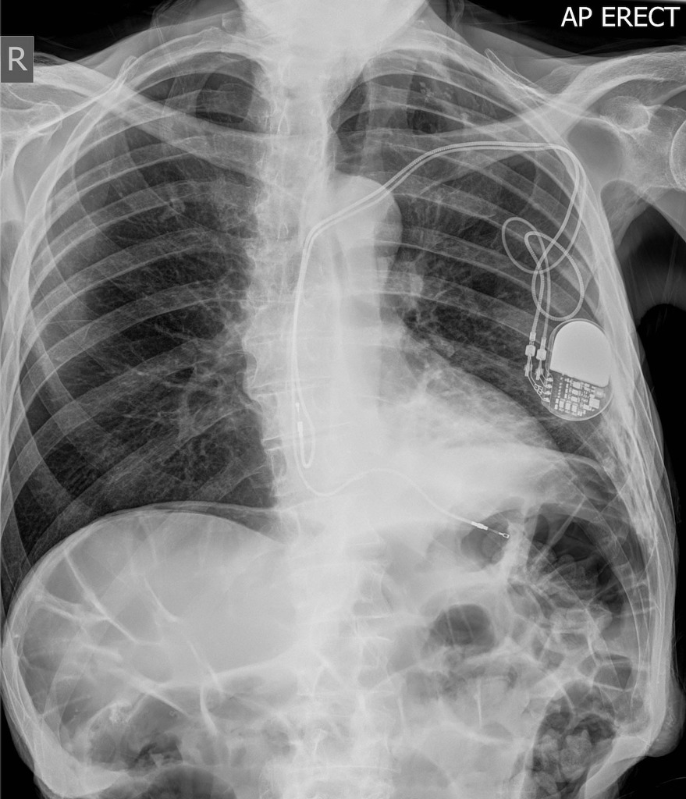 | 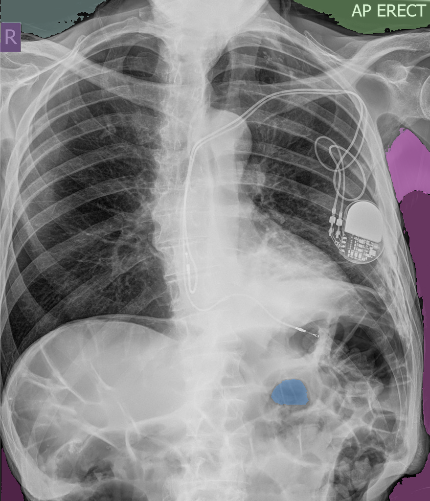 | 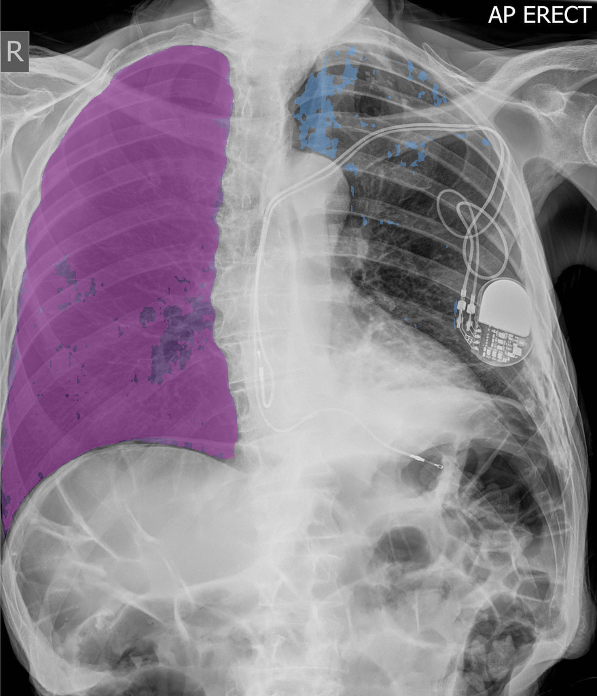 | 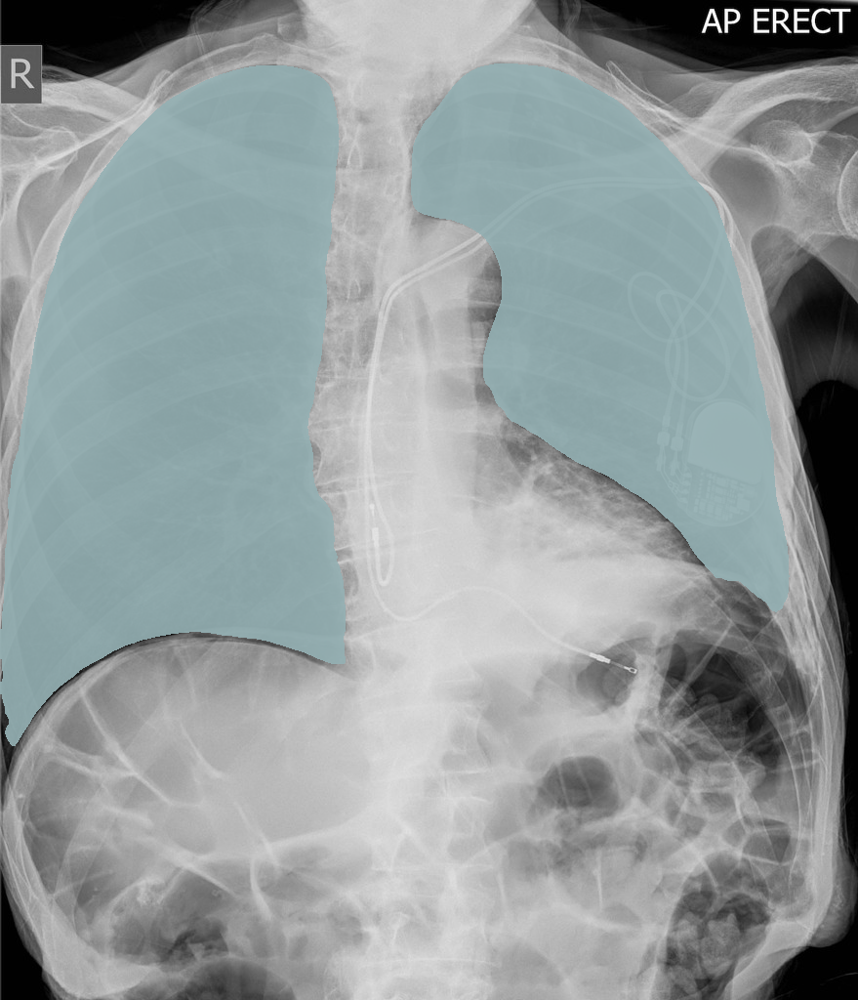 | 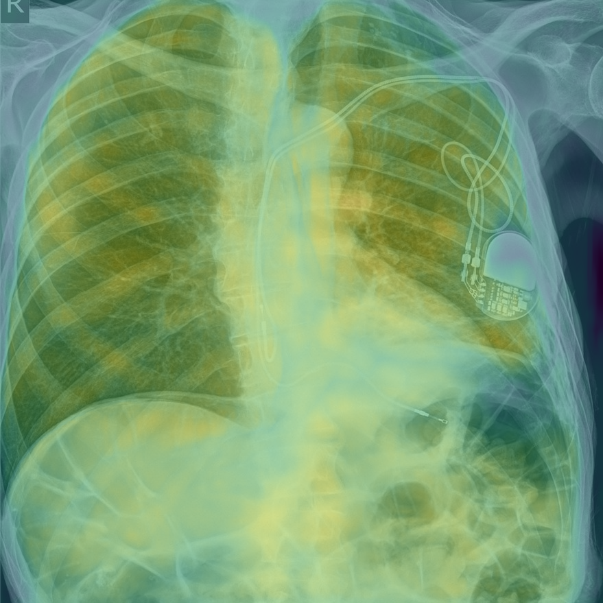 |

- 背景信息：Age: 65 years; Presentation: Abdominal pain.?perforation 65 岁患者，腹痛，临床疑问为穿孔。
- 原始问题：Describe your findings 请描述影像所见。
- 参考答案：Pneumoperitoneum, with the diaphragm clearly visible across the midline. Dual lead pacemaker. No focal consolidation or collapse, small areas of calcification in the upper lobes. 气腹，可见横膈跨越中线清晰显影。双腔起搏器。未见局灶性实变或肺不张，上肺叶可见小片状钙化影。。
- 原始图片caption:
<pre>Pneumoperitoneum, with the diaphragm clearly visible across the midline. Dual lead pacemaker. No focal consolidation or collapse, small areas of calcification in the upper lobes.</pre>
<pre>气腹，可见横膈跨越中线清晰显影。双腔起搏器。未见局灶性实变或肺不张，上肺叶可见小片状钙化影。</pre>
- **发生变化** MedGemma-27B-IT: Incorrect → Correct；

<strong>MedGemma-27B-IT</strong>

**原始图像 → 原始 QA 回答**；评测：**Incorrect**

英文原始回答：

<pre>&lt;unused94&gt;thought
The user wants me to describe the findings in the provided X-ray image.

1.  **Identify the image type and view:** The image is an X-ray, specifically a frontal view of the chest and upper abdomen (AP Erect). The patient is standing upright, which is important for assessing free air.
2.  **Identify the patient&#x27;s presentation:** The patient is a 65-year-old with abdominal pain, and perforation is suspected.
3.  **Look for signs of perforation:** The key sign of a perforated viscus (like a stomach or intestine) on an upright chest X-ray is the presence of free air under the diaphragm. This air appears as a lucent (dark) crescent shape.
4.  **Examine the diaphragm:** Carefully inspect the area beneath both the right and left hemidiaphragms.
5.  **Analyze the findings:**
    *   **Right hemidiaphragm:** There is a clear, well-defined crescent of lucency under the right hemidiaphragm. This indicates free air.
    *   **Left hemidiaphragm:** The left hemidiaphragm appears relatively normal, without significant free air visible beneath it.
    *   **Other structures:** The lungs appear relatively clear, although there might be some atelectasis at the bases. The heart size seems within normal limits. The bony structures (ribs, spine) are intact. The mediastinum is midline.
6.  **Synthesize the findings:** The most significant finding is the presence of free intraperitoneal air under the right hemidiaphragm, strongly suggesting a perforated viscus in the abdomen, consistent with the patient&#x27;s presentation of abdominal pain and suspected perforation.

**Final Answer Construction:**
*   Start with the overall impression: The X-ray shows evidence of free air in the abdomen.
*   Specify the location: This free air is seen as a lucent crescent under the right hemidiaphragm.
*   Relate to the clinical context: This finding is highly suggestive of a perforated viscus, correlating with the patient&#x27;s symptoms of abdominal pain and suspicion of perforation.
*   Mention other observations (briefly): The lungs are relatively clear, and other structures appear unremarkable.&lt;unused95&gt;*   **Image Type and View:** This is a frontal chest X-ray (AP Erect view), showing the chest and upper abdomen. The patient is standing upright.
*   **Clinical Context:** The patient is a 65-year-old with abdominal pain, and perforation is suspected.
*   **Key Finding:** There is a clear, crescent-shaped lucency (dark area) visible beneath the right hemidiaphragm.
*   **Interpretation:** This lucency represents free air within the peritoneal cavity (pneumoperitoneum). In an upright position, free air rises and collects under the diaphragm, which is the highest point in the abdominal cavity.
*   **Conclusion:** The presence of free air under the right hemidiaphragm strongly suggests a perforated viscus (e.g., stomach, intestine) within the abdomen, which is consistent with the patient&#x27;s clinical presentation of abdominal pain and suspected perforation.</pre>

中文翻译：

<pre>模型识别右膈下新月形透亮影为腹腔游离气体，认为提示胃或肠管等空腔脏器穿孔；但没有完整描述参考答案中的连续膈征、起搏器及胸部阴性所见，严格评测判错。</pre>

**原始图像 + Segmentation → 原始 QA 回答**；评测：**Correct**

英文原始回答：

<pre>&lt;unused94&gt;thought
The user wants me to describe the findings in the provided chest X-ray image.

1.  **Identify the image type and patient context:** The image is a chest X-ray (AP Erect view) of a 65-year-old patient presenting with abdominal pain, possibly related to perforation.
2.  **Analyze the image for abnormalities:**
    *   **Lungs:** The lung fields appear relatively clear, although there might be some subtle opacities or atelectasis, especially at the bases. The lung volumes seem normal.
    *   **Heart and Mediastinum:** The heart size appears within normal limits. The mediastinal silhouette is unremarkable.
    *   **Diaphragm:** The diaphragm is visible. There is evidence of free air under the right hemidiaphragm, indicated by the radiolucent crescent shape. This is a classic sign of pneumoperitoneum.
    *   **Bowel Gas:** There is evidence of bowel gas patterns in the abdomen.
    *   **Other:** A pacemaker is present in the left chest wall with leads extending towards the right atrium and right ventricle. There is also a surgical clip or marker visible in the upper abdomen.
3.  **Synthesize the findings:** The most significant finding is the presence of free air under the right hemidiaphragm (pneumoperitoneum). This strongly suggests a perforation of a hollow viscus (like the stomach, duodenum, or colon) within the abdomen, which correlates with the patient&#x27;s presentation of abdominal pain. The pacemaker is an incidental finding. The lungs appear largely clear, although subtle changes might be present.
4.  **Structure the description:** Start with a general overview, then describe specific findings in each region (lungs, heart, mediastinum, diaphragm, abdomen), and conclude with the most significant finding and its clinical implication.

**Description:**

This is an AP erect chest X-ray.

*   **Lungs:** The lung fields are largely clear bilaterally, without evidence of significant consolidation, effusion, or pneumothorax.
*   **Heart and Mediastinum:** The cardiac silhouette is within normal limits in size. The mediastinal contours are unremarkable.
*   **Diaphragm:** The diaphragmatic domes are visible.
*   **Abdomen:** There is evidence of free air under the right hemidiaphragm, appearing as a radiolucent crescent. This finding is indicative of pneumoperitoneum. Bowel gas patterns are also visible.
*   **Other:** A left-sided pacemaker is noted with leads in appropriate position.

**Conclusion:** The most significant finding is pneumoperitoneum, suggesting a perforated viscus in the abdomen, consistent with the patient&#x27;s presentation of abdominal pain.&lt;unused95&gt;*   **Image Type:** Chest X-ray, AP Erect view.
*   **Patient:** 65-year-old male presenting with abdominal pain.
*   **Findings:**
    *   **Lungs:** The lung fields appear relatively clear bilaterally. No large consolidation, effusion, or pneumothorax is evident.
    *   **Heart and Mediastinum:** The heart size appears normal. The mediastinal silhouette is unremarkable.
    *   **Diaphragm:** The diaphragmatic domes are visible.
    *   **Abdomen:** There is a clear sign of free air under the right hemidiaphragm, appearing as a radiolucent crescent. This indicates pneumoperitoneum. Bowel gas is also visible within the abdomen.
    *   **Other:** A left-sided pacemaker is present with leads extending towards the heart.

*   **Interpretation:** The most critical finding is the pneumoperitoneum (free air in the abdominal cavity). This strongly suggests a perforation of a hollow viscus (e.g., stomach, intestine) within the abdomen, which is consistent with the patient&#x27;s symptom of abdominal pain. The chest X-ray was likely ordered to rule out referred pain from the abdomen (e.g., diaphragmatic irritation) or complications like free air under the diaphragm. The lungs appear grossly clear. The pacemaker is an incidental finding.

**Conclusion:** Pneumoperitoneum is present, indicating a likely perforated abdominal viscus.</pre>

中文翻译：

<pre>加入分割后，模型明确描述气腹、可能的空腔脏器穿孔、左侧双导联起搏器和双肺大致清晰，回答覆盖了更多参考要点，评测正确。</pre>

**原始图像 → Single-image caption 回答**；

英文原始回答：

<pre>**Image Description:**

The image is a frontal chest X-ray. It shows the patient&#x27;s rib cage, lungs, heart, and mediastinum. The patient is wearing a hospital gown, and an EKG monitor is attached to their chest. The image quality is slightly degraded, possibly due to motion or the patient&#x27;s body habitus.

**Key Findings:**

1.  **Free Air Under the Diaphragm:** There is a clear crescent-shaped lucency (dark area) visible beneath the right hemidiaphragm. This indicates the presence of free air in the peritoneal cavity.
2.  **Abdominal Pain:** The patient&#x27;s presentation includes abdominal pain.
3.  **Age:** The patient is 65 years old.

**Diagnosis:**

The presence of free air under the diaphragm (pneumoperitoneum) in a patient presenting with abdominal pain is a strong indicator of a perforated viscus (a hole in an abdominal organ). Common causes include:

*   **Perforated Peptic Ulcer:** This is a frequent cause, especially in older adults.
*   **Perforated Diverticulitis:** Inflammation and perforation of diverticula in the colon.
*   **Perforated Appendicitis:** Less common in this age group but possible.
*   **Bowel Perforation:** Due to trauma, ischemia, or other causes.
*   **Perforated Gallbladder:** Less common.

**Conclusion:**

Based on the chest X-ray showing free air under the diaphragm and the patient&#x27;s presentation of abdominal pain, the most likely diagnosis is **perforated viscus**, leading to pneumoperitoneum. This is a surgical emergency requiring immediate evaluation and intervention.</pre>

中文翻译：

<pre>
**图像描述：**

该图像为胸部正位X光片，显示了患者的胸廓、肺部、心脏及纵隔结构。患者身穿病号服，胸部连接有心电监护设备。图像质量略有下降，这可能是由患者体动或体型特征造成的。

**主要发现：**

1.  **膈下积气：** 右侧膈肌下方可见一清晰的新月形透亮区（暗区）。这表明腹膜腔内存在游离气体。
2.  **腹痛：** 患者伴有腹痛症状。
3.  **年龄：** 患者为65岁。

原始 caption 识别膈下游离气体并诊断穿孔性空腔脏器导致的气腹，列出消化性溃疡、憩室炎、阑尾炎等可能病因。</pre>

**原始图像 + Segmentation → Single-image caption 回答**；

英文原始回答：

<pre>**Image Description:**

The image is a frontal chest X-ray. It shows the patient&#x27;s chest, including the lungs, heart, diaphragm, ribs, and part of the upper abdomen. A device (likely a pacemaker or defibrillator) is visible in the upper left chest wall with leads extending towards the heart area. The lungs appear relatively clear, although there might be some subtle opacities or atelectasis, particularly in the lower lobes. The heart size appears within normal limits. The diaphragm is visible, and there is some gas seen in the bowel loops below the diaphragm. The ribs and clavicles are also visible.

**Clinical Context:**

*   **Patient:** 65-year-old male.
*   **Presentation:** Abdominal pain.
*   **Image:** Chest X-ray.
*   **Question:** Possible perforation.

**Analysis and Diagnosis:**

The primary concern given the presentation of &quot;abdominal pain&quot; and the question of &quot;perforation&quot; is to look for signs of free air in the peritoneal cavity, which would indicate a perforation of a hollow viscus (like the stomach, intestine, etc.). Free air typically appears as lucency (dark area) under the diaphragm on an upright chest X-ray or as a lucent crescent sign along the diaphragm margin.

**Findings related to perforation:**

*   **Diaphragm:** The diaphragmatic contours are visible.
*   **Subdiaphragmatic Area:** There is gas seen in the bowel loops below the diaphragm. While this is normal, it&#x27;s crucial to differentiate this from free intraperitoneal air.
*   **Free Air:** Careful examination of the space between the diaphragm and the liver (on the right) and the diaphragm and the stomach/spleen (on the left) does not clearly reveal any distinct lucency suggestive of free air. However, the presence of bowel gas can sometimes obscure subtle free air.

**Other findings:**

*   The cardiac silhouette and pulmonary vasculature appear normal.
*   The lung fields are mostly clear, without obvious consolidation or large effusions.
*   The pacemaker/defibrillator device is present.

**Conclusion:**

While the chest X-ray is primarily focused on the thoracic structures, it is often used as an initial screening tool for abdominal perforation when a patient presents with abdominal pain. In this specific image, there is no definitive evidence of free intraperitoneal air under the diaphragm. However, a chest X-ray is not the most sensitive test for detecting small amounts of free air.

**Differential Diagnosis and Next Steps:**

Given the patient&#x27;s presentation of abdominal pain and the question of perforation, the absence of clear free air on this chest X-ray does not rule out perforation.

*   **Possible Causes of Abdominal Pain:** Many conditions can cause abdominal pain, including appendicitis, diverticulitis, bowel obstruction, pancreatitis, cholecystitis, peptic ulcer disease, etc. Perforation is a serious complication of some of these (e.g., perforated peptic ulcer, perforated diverticulitis, perforated appendix).
*   **Further Investigation:** If clinical suspicion for perforation remains high, further imaging is warranted. A CT scan of the abdomen and pelvis is the most sensitive imaging modality for detecting free air and identifying the source of perforation. An upright abdominal X-ray series (including a left lateral decubitus view) is more sensitive than a chest X-ray for detecting small amounts of free air but less sensitive than CT.

**Final Impression:**

Chest X-ray shows no definitive signs of pneumoperitoneum (free air under the diaphragm). However, this does not exclude the possibility of a gastrointestinal perforation, especially if the amount of free air is small or if the patient was not fully upright during the X-ray. Clinical correlation and potentially further imaging (like an abdominal CT scan) are necessary to evaluate for perforation given the patient&#x27;s presentation of abdominal pain.</pre>

中文翻译：

<pre>分割增强 caption 反而称胸片未见明确膈下游离气体，认为不能排除少量气腹，建议腹部 CT；即 caption 的像素判断较原始模型退步。</pre>

**对模型对图片caption能力分析**：
原始caption已经看见膈下游离气体，但 QA 没覆盖完整参考所见；分割后 caption 却否认明确气腹，seg对模型caption错误引导。

### 1.9 [Small bowel obstruction](https://radiopaedia.org/cases/small-bowel-obstruction-14?lang=us) (`small-bowel-obstruction-14`)

| Original image | Medical-SAM2 | Medical-SAM3: bowel, small bowel, colon, bowel gas （肠管、小肠、结肠、肠气） | BiomedParse v1: bowel, small bowel, colon, bowel gas （肠管、小肠、结肠、肠气） |
|---|---|---|---|
| 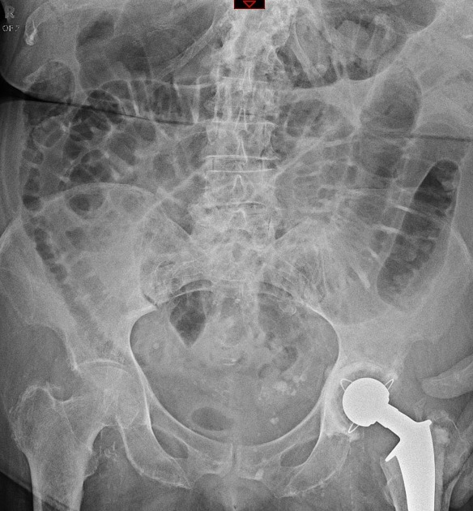 | 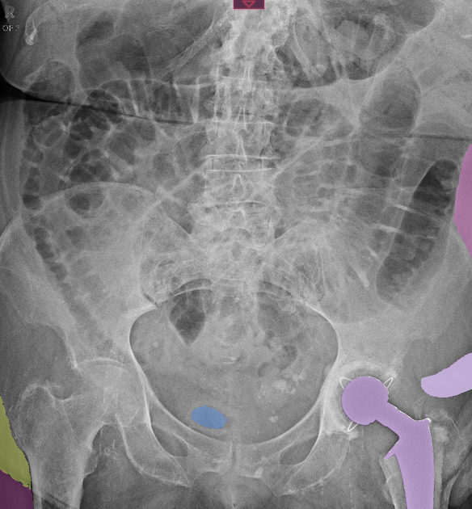 | 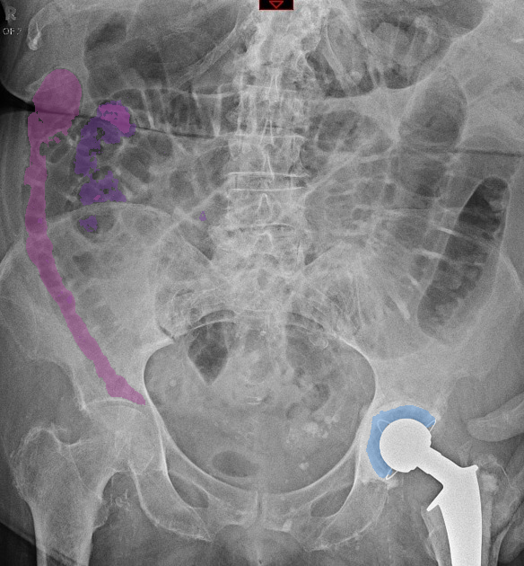 | 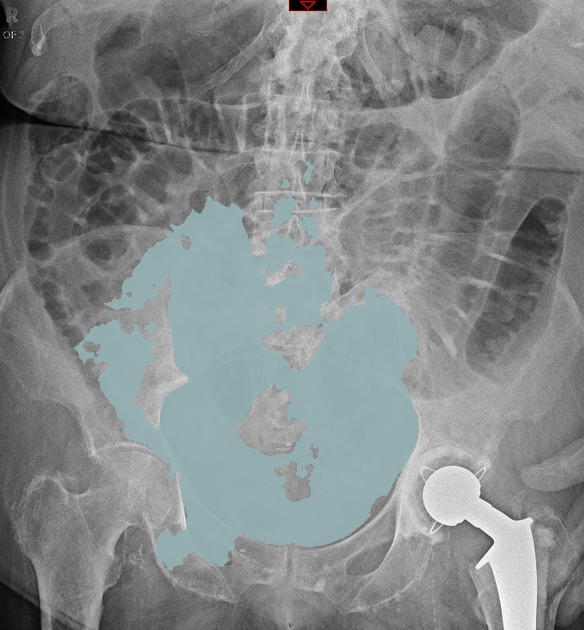 |

- 背景信息：Age: 80 years Gender: Male; Presentation: Epigastric pain, vomiting, melena. Multiple vascular risk factors. 80 岁男性，上腹痛、呕吐、黑便，并有多项血管危险因素。
- 原始问题：What diagnosis to the aspects of the history suggest? 病史中的这些表现提示什么诊断？
- 参考答案：With abdominal pain and vomiting, small bowel obstruction is likely. Altered stools in this setting may also suggest ischaemic colitis. 伴有腹痛和呕吐时，小肠梗阻的可能性较大；在此情况下，排便改变也可能提示缺血性结肠炎。
- 原始图片caption:
<pre>Multiple distended small bowel loops (positioned centrally, valvulae conniventes present).
Left hip arthroplasty noted.</pre>
<pre>多处扩张的小肠袢（位于中央，可见环状瓣）。
左侧髋关节置换术史。</pre>
- **发生变化** MedGemma-27B-IT: Incorrect → Correct

<strong>MedGemma-27B-IT</strong>

**原始图像 → 原始 QA 回答**；评测：**Incorrect**

英文原始回答：

<pre>&lt;unused94&gt;thought
The user wants me to analyze the provided patient data and X-ray image to suggest a diagnosis.

1.  **Analyze Patient Data:**
    *   Age: 80 years (elderly)
    *   Gender: Male
    *   Presentation: Epigastric pain, vomiting, melena (black, tarry stools indicating upper GI bleeding).
    *   Risk Factors: Multiple vascular risk factors (suggests potential for atherosclerosis, which can affect mesenteric vessels).

2.  **Analyze Image Data:**
    *   Modality: X-ray (likely abdominal X-ray, given the presentation).
    *   Subcategory: Frontal.
    *   Image Content: The image shows a plain abdominal X-ray. Key findings to look for include:
        *   Bowel gas pattern (dilated loops, air-fluid levels).
        *   Presence of free air under the diaphragm (pneumoperitoneum).
        *   Signs of bowel obstruction (e.g., dilated loops proximal to obstruction, collapsed distal bowel).
        *   Signs of ischemia (e.g., thickened bowel wall, &quot;thumbprinting&quot;).
        *   Calcifications (e.g., in vessels, kidneys).
        *   The image shows multiple dilated loops of bowel, some with air-fluid levels. There is also a large amount of free air under the diaphragm (pneumoperitoneum).

3.  **Synthesize Data and Formulate Differential Diagnosis:**
    *   The patient is elderly with vascular risk factors.
    *   Symptoms: Epigastric pain, vomiting, melena. Melena points to upper GI bleeding. Epigastric pain and vomiting are non-specific but can be associated with various abdominal pathologies.
    *   X-ray findings: Dilated bowel loops, air-fluid levels, and *significant* free air under the diaphragm (pneumoperitoneum).
    *   Pneumoperitoneum indicates perforation of a hollow viscus (stomach, duodenum, small bowel, colon).
    *   The combination of upper GI bleeding (melena), epigastric pain, vomiting, and perforation (pneumoperitoneum) in an elderly patient with vascular risk factors strongly suggests a perforated peptic ulcer, likely duodenal.
    *   Other possibilities for perforation include perforated diverticulitis, perforated bowel due to ischemia (mesenteric ischemia), perforated malignancy, or perforated appendicitis (less likely given age and location of pain).
    *   Mesenteric ischemia could cause epigastric pain, vomiting, and potentially melena (if severe enough to cause bowel necrosis and bleeding), but typically doesn&#x27;t present with acute perforation and pneumoperitoneum unless it leads to bowel infarction and perforation. The vascular risk factors make ischemia a consideration, but the pneumoperitoneum points more directly to perforation.
    *   Given the melena, the perforation is likely related to the upper GI tract (stomach or duodenum). Peptic ulcer disease is common, and perforation is a known complication, especially in the elderly and those on NSAIDs (though NSAID use isn&#x27;t mentioned, it&#x27;s a common factor).

4.  **Select the Most Likely Diagnosis:**
    *   The most compelling diagnosis integrating all findings (age, symptoms, risk factors, and especially the pneumoperitoneum on X-ray) is a perforated peptic ulcer (likely duodenal, given the location of pain and melena).

5.  **Refine the Answer:**
    *   The question asks what diagnosis the *aspects of the history* suggest. The history (age, epigastric pain, vomiting, melena, vascular risk factors) points towards several possibilities, including peptic ulcer disease (which can cause pain, vomiting, and bleeding), mesenteric ischemia (due to vascular risk factors, causing pain, vomiting, potentially bleeding), or other causes of upper GI bleeding or abdominal pain.
    *   However, the *image* provides the crucial finding of pneumoperitoneum, which dramatically narrows the differential to a perforated viscus.
    *   Considering the history *in conjunction with* the image, the most likely diagnosis is perforated peptic ulcer.
    *   The question specifically asks what the *history* suggests. The history alone suggests upper GI pathology, possibly peptic ulcer disease or mesenteric ischemia. The combination of epigastric pain, vomiting, and melena is classic for peptic ulcer disease. The vascular risk factors raise concern for mesenteric ischemia.
    *   Let&#x27;s re-read the question: &quot;What diagnosis to the aspects of the history suggest?&quot; This is slightly ambiguous. Does it mean what does the history *alone* suggest, or what does the history suggest *in the context of the overall clinical picture* (including the image)? Given the image is provided, it&#x27;s likely asking for the most probable diagnosis considering all information.
    *   If interpreting strictly based on history *before* seeing the image, the primary suspicion would be complicated peptic ulcer disease (bleeding ulcer, possibly perforated) or potentially mesenteric ischemia.
    *   If interpreting based on the full clinical picture (history + image), the diagnosis is clearly perforated viscus, most likely a perforated peptic ulcer.
    *   Let&#x27;s assume the question wants the most likely diagnosis given all the information presented. The history provides symptoms (epigastric pain, vomiting, melena) and risk factors (age, vascular). The image shows pneumoperitoneum. This combination strongly points to a perforated peptic ulcer.

6.  **Final Answer Formulation:**
    *   The patient presents with symptoms suggestive of upper gastrointestinal pathology (epigastric pain, vomiting, melena).
    *   The presence of melena indicates upper GI bleeding.
    *   The X-ray shows free air under the diaphragm (pneumoperitoneum), indicating perforation of a hollow viscus.
    *   Combining the symptoms of upper GI bleeding (melena) with evidence of perforation (pneumoperitoneum) in an elderly patient strongly suggests a perforated peptic ulcer, most commonly duodenal.
    *   Therefore, the diagnosis suggested by the combination of history and imaging is perforated peptic ulcer.&lt;unused95&gt;*   **Patient History Analysis:**
    *   **Age (80 years):** Elderly patients are more susceptible to complications like peptic ulcer disease and vascular issues.
    *   **Gender (Male):** Peptic ulcer disease is slightly more common in males.
    *   **Symptoms:**
        *   **Epigastric pain:** Common symptom for various upper abdominal issues, including peptic ulcers, gastritis, pancreatitis, and mesenteric ischemia.
        *   **Vomiting:** Non-specific, can occur with obstruction, inflammation, or ischemia.
        *   **Melena:** Indicates upper gastrointestinal bleeding (blood digested, appearing black and tarry). This strongly points towards a source like a bleeding peptic ulcer, gastritis, or esophageal varices.
    *   **Risk Factors:**
        *   **Multiple vascular risk factors:** Increases the likelihood of conditions like mesenteric ischemia, which can cause severe abdominal pain, vomiting, and potentially bleeding if bowel infarction occurs.

*   **Image Analysis:**
    *   The X-ray shows multiple dilated loops of bowel with air-fluid levels.
    *   Crucially, there is a significant amount of free air under the diaphragm (pneumoperitoneum). This is a definitive sign of perforation of a hollow viscus within the abdominal cavity (e.g., stomach, duodenum, small bowel, colon).

*   **Synthesis:**
    *   The history suggests upper GI bleeding (melena) and upper abdominal pain (epigastric pain).
    *   The X-ray finding of pneumoperitoneum indicates a perforation.
    *   Combining these: The patient has evidence of upper GI bleeding *and* perforation.
    *   The most common cause of upper GI bleeding that can also lead to perforation, especially in this age group, is a peptic ulcer (gastric or duodenal). A perforated peptic ulcer would explain the epigastric pain, vomiting, melena (from the ulcer bleeding before perforation or from associated gastritis), and the pneumoperitoneum.
    *   While mesenteric ischemia is a possibility given the vascular risk factors and pain/vomiting, it typically doesn&#x27;t present with acute perforation and pneumoperitoneum unless it leads to bowel infarction and subsequent perforation, which is less common as the primary presentation compared to peptic ulcer perforation.

*   **Conclusion:** The combination of symptoms suggestive of upper GI bleeding (melena) and the definitive radiographic sign of perforation (pneumoperitoneum) strongly points towards a perforated peptic ulcer as the most likely diagnosis.

**Final Answer: The final answer is $\boxed{Perforated peptic ulcer}$**</pre>

中文翻译：

<pre>
**影像分析：**
*   X光片显示多处肠管扩张，并可见气液平面。
*   关键在于，膈下可见大量游离气体（气腹）。这是腹腔内空腔脏器（如胃、十二指肠、小肠或结肠）穿孔的明确征象。
模型误认为片中存在气腹，结合黑便诊断穿孔性消化性溃疡；虽讨论肠系膜缺血，却没有把扩张小肠袢作为主要结论。</pre>

**原始图像 + Segmentation → 原始 QA 回答**；评测：**Correct**

英文原始回答：

<pre>&lt;unused94&gt;thought
The user wants me to analyze the provided patient data and imaging to suggest a diagnosis.

1.  **Analyze Patient Data:**
    *   Age: 80 years (elderly)
    *   Gender: Male
    *   Presentation: Epigastric pain, vomiting, melena.
    *   Risk Factors: Multiple vascular risk factors.

2.  **Interpret Presentation:**
    *   Epigastric pain: Pain in the upper central abdomen.
    *   Vomiting: Expulsion of stomach contents.
    *   Melena: Black, tarry stools indicating upper gastrointestinal bleeding (digested blood).
    *   Vascular risk factors: Suggests potential for conditions like atherosclerosis, which can affect blood supply to organs.

3.  **Synthesize Clinical Picture:**
    *   The combination of epigastric pain, vomiting, and melena strongly points towards an upper GI bleed.
    *   The patient&#x27;s age and vascular risk factors increase the likelihood of certain causes, such as peptic ulcer disease (potentially complicated by bleeding), gastritis, or ischemic bowel.

4.  **Analyze Imaging (X-ray):**
    *   The image is an abdominal X-ray (likely a plain film, possibly a contrast study given the bowel visualization).
    *   The segmentation images highlight the bowel loops, small bowel, colon, and bowel gas.
    *   Observe the X-ray itself:
        *   There are multiple dilated loops of bowel, particularly in the upper abdomen.
        *   There appears to be a significant amount of air-fluid levels within these loops.
        *   The overall appearance suggests a bowel obstruction.
        *   The presence of melena suggests the obstruction might be causing ischemia or ulceration leading to bleeding, or the obstruction itself might be due to an ischemic event.

5.  **Connect Clinical Picture and Imaging:**
    *   The patient presents with symptoms of upper GI bleeding (melena, vomiting, epigastric pain).
    *   The X-ray shows signs of bowel obstruction (dilated loops, air-fluid levels).
    *   In an elderly patient with vascular risk factors, a sudden onset of bowel obstruction accompanied by signs of ischemia (like bleeding) raises high suspicion for **acute mesenteric ischemia**. This condition occurs when blood supply to the intestines is compromised, leading to ischemia, infarction, and potentially perforation or bleeding. The obstruction could be due to vasospasm, thrombosis, or embolism, often related to underlying vascular disease. The ischemia can cause bowel wall damage leading to bleeding (melena) and pain. The bowel wall edema and inflammation can lead to obstruction.

6.  **Consider Differential Diagnoses:**
    *   **Peptic Ulcer Disease (PUD) with bleeding:** Can cause epigastric pain, vomiting, and melena. However, it doesn&#x27;t typically cause bowel obstruction unless there&#x27;s a complication like perforation leading to ileus or adhesions.
    *   **Gastritis/Esophagitis with bleeding:** Similar symptoms to PUD, but less likely to cause obstruction.
    *   **Bowel Obstruction (other causes):** Adhesions, hernia, tumor. These can cause pain, vomiting, and distension, but melena is less common unless ischemia develops secondary to the obstruction (strangulation).
    *   **Ischemic Colitis:** Usually presents with bloody diarrhea, not typically melena and upper GI symptoms like vomiting, although severe cases can involve the small bowel.

7.  **Conclusion:**
    *   Given the patient&#x27;s age, vascular risk factors, presentation of upper GI bleeding (melena, vomiting, epigastric pain), and radiographic evidence of bowel obstruction, **acute mesenteric ischemia** is the most likely diagnosis. The ischemia leads to bowel wall damage causing bleeding (melena) and potentially obstruction.

8.  **Final Answer Formulation:** The history (elderly male, vascular risk factors, epigastric pain, vomiting, melena) combined with the imaging findings (dilated bowel loops suggesting obstruction) strongly suggests acute mesenteric ischemia. This condition involves compromised blood flow to the intestines, leading to ischemia, potential infarction, obstruction, and bleeding.&lt;unused95&gt;*   **Patient Profile:** 80-year-old male with multiple vascular risk factors.
*   **Symptoms:** Epigastric pain, vomiting, melena (black, tarry stools indicating upper GI bleeding).
*   **Imaging Findings:** Abdominal X-ray shows dilated bowel loops with air-fluid levels, suggestive of bowel obstruction.
*   **Thinking Process:**
    1.  The combination of epigastric pain, vomiting, and melena points strongly towards an upper gastrointestinal issue, likely involving bleeding.
    2.  The patient&#x27;s age and significant vascular risk factors increase the suspicion for vascular events.
    3.  The X-ray findings indicate bowel obstruction.
    4.  Putting these together: An elderly patient with vascular risk factors presenting with symptoms of upper GI bleeding *and* signs of bowel obstruction raises high concern for acute mesenteric ischemia. This condition occurs when blood supply to the intestines is suddenly reduced, leading to ischemia (lack of oxygen), which can cause severe pain, bowel wall damage (leading to bleeding and potentially perforation), and obstruction due to edema and inflammation. The obstruction can also lead to ischemia if it becomes strangulated.
    5.  While other causes of upper GI bleeding (like peptic ulcer disease) or bowel obstruction exist, the combination of factors, especially the vascular risk factors and the presence of both bleeding and obstruction, makes acute mesenteric ischemia a leading diagnosis.

*   **Conclusion:** The clinical presentation (age, vascular risk factors, epigastric pain, vomiting, melena) combined with the radiographic evidence of bowel obstruction strongly suggests **acute mesenteric ischemia**.

**Final Answer: The final answer is $\boxed{Acute mesenteric ischemia}$**</pre>

中文翻译：

<pre>
4.  **影像分析（X光）：**
*   该图像为腹部X光片（很可能是普通平片，但鉴于肠道显影情况，也可能是造影检查）。
*   分割图像突出显示了肠管、小肠、结肠及肠道内的气体。
*   观察X光片本身：
*   可见多处肠管扩张，尤其是在上腹部。
*   这些肠管内似乎存在大量的气液平面。
*   整体影像表现提示肠梗阻。
*   出现柏油样便（黑便）提示梗阻可能引起了缺血或溃疡并导致出血，或者梗阻本身就是由缺血性病变引起的。
加入分割后，**模型识别扩张肠袢和梗阻表现**，并结合高龄、血管危险因素、腹痛、呕吐及黑便，最终倾向急性肠系膜缺血伴肠梗阻。该回答覆盖了参考答案强调的梗阻及缺血背景。</pre>

**原始图像 → Single-image caption 回答**；

英文原始回答：

<pre>**Image Description:**

The image is a frontal abdominal X-ray. It shows the bowel gas pattern. The key findings are:

1.  **Dilated Bowel Loops:** There are multiple dilated loops of small bowel, particularly in the central and upper abdomen.
2.  **Air-Fluid Levels:** Several air-fluid levels are visible within these dilated loops, indicating the presence of both gas and fluid.
3.  **Lack of Gas in Colon:** There appears to be a relative paucity of gas in the colon, especially the distal colon.
4.  **No Free Air:** There is no evidence of free air under the diaphragm, which would suggest perforation.
5.  **Nasogastric Tube:** A nasogastric tube is in place, with the tip positioned in the stomach.

**Clinical Context and Interpretation:**

*   **Patient Presentation:** The patient is an 80-year-old male with epigastric pain, vomiting, and melena (black, tarry stools indicating upper gastrointestinal bleeding). He also has multiple vascular risk factors.
*   **X-ray Findings:** The X-ray shows signs consistent with a small bowel obstruction (SBO). The dilated loops of small bowel with air-fluid levels are classic features. The lack of gas in the colon suggests that the obstruction is preventing the passage of intestinal contents distally.
*   **Differential Diagnosis:** Given the patient&#x27;s age, vascular risk factors, and presentation (epigastric pain, vomiting, melena), the most likely cause of the SBO is **ischemic bowel**. Ischemia can lead to bowel wall edema, inflammation, and eventually stricture or necrosis, causing obstruction. Other potential causes of SBO in this age group include adhesions (less likely without prior surgery history), hernias, tumors, or volvulus, but ischemia is high on the list given the risk factors and symptoms. The melena suggests bleeding, which can occur with ischemic bowel.

**Diagnosis:**

Based on the clinical presentation (epigastric pain, vomiting, melena, age, vascular risk factors) and the radiographic findings (dilated small bowel loops with air-fluid levels, paucity of colonic gas), the most likely diagnosis is **Small Bowel Obstruction, likely secondary to Ischemic Bowel**.

**Important Considerations:**

*   This is an interpretation based on a single X-ray image and limited clinical information.
*   Further imaging (like a CT scan of the abdomen and pelvis with IV contrast) is usually required to confirm the diagnosis, determine the level and cause of the obstruction, and assess for complications like ischemia or perforation.
*   The patient&#x27;s symptoms (especially melena) and risk factors raise concern for a serious condition requiring urgent evaluation and management.</pre>

中文翻译：

<pre>
**影像描述：**

该图像为腹部正位X光片，显示了肠道内的气体分布情况。主要发现如下：

1.  **肠管扩张：** 可见多处小肠肠管扩张，主要位于腹部中上部。
2.  **气液平面：** 在这些扩张的肠管内可见数个气液平面，提示存在气体和液体。
3.  **结肠内气体缺乏：** 结肠内（尤其是远端结肠）的气体似乎相对稀少。
4.  **无游离气体：** 膈下未见游离气体征象（若有则提示穿孔）。
5.  **鼻胃管：** 留置有鼻胃管，管端位于胃内。

**临床背景与解读：**

*   **患者表现：** 患者为80岁男性，主诉上腹痛、呕吐及黑便（黑色柏油样便，提示上消化道出血）。此外，患者存在多种血管疾病危险因素。
*   **X光表现：** X光片显示符合小肠梗阻（SBO）的征象。小肠扩张伴气液平面是其典型特征。结肠内缺乏气体提示梗阻阻碍了肠内容物向远端通过。

原始 caption 已能描述中央多发扩张小肠袢、气液平面及结肠气体减少，诊断小肠梗阻并担心缺血性肠病。</pre>

**原始图像 + Segmentation → Single-image caption 回答**；

英文原始回答：

<pre>**Image Description:**

The image is a frontal abdominal X-ray. It shows the abdominal cavity, including the bowel loops (both small and large intestine), the stomach, and the liver shadow. A nasogastric tube is visible, extending into the stomach. The bowel loops appear dilated, particularly in the upper abdomen. There are air-fluid levels visible within some of the bowel loops, suggesting the presence of gas and fluid. The overall appearance suggests a degree of bowel obstruction or ileus.

**Patient Context and Diagnosis:**

*   **Patient:** 80-year-old male with multiple vascular risk factors.
*   **Presentation:** Epigastric pain, vomiting, melena (black, tarry stools indicating upper gastrointestinal bleeding).

**Interpretation:**

The patient&#x27;s presentation (epigastric pain, vomiting, melena) in the context of his age and vascular risk factors is highly suggestive of an acute abdominal emergency, potentially involving the upper gastrointestinal tract or small bowel.

The X-ray findings of dilated bowel loops with air-fluid levels are consistent with bowel obstruction or ileus. Given the patient&#x27;s symptoms, particularly the melena, a potential cause could be:

1.  **Mesenteric Ischemia:** This is a serious condition where blood supply to the intestines is compromised, often due to vascular disease (consistent with the patient&#x27;s risk factors). It can lead to bowel infarction, perforation, and obstruction. The pain, vomiting, and melena are classic signs.
2.  **Bowel Obstruction:** This could be due to various causes like adhesions (common in older patients with prior surgeries), hernias, tumors, or volvulus. The obstruction itself can cause pain, vomiting, and eventually lead to bowel ischemia if prolonged.
3.  **Perforated Viscus:** While less likely to present primarily with melena, a perforated ulcer or other perforation could cause peritonitis, ileus, and potentially bleeding.

**Conclusion:**

The X-ray shows signs of bowel obstruction/ileus. Combined with the patient&#x27;s clinical presentation (epigastric pain, vomiting, melena) and risk factors (age, vascular disease), the most concerning diagnosis is **acute mesenteric ischemia** leading to bowel compromise, although other causes of bowel obstruction or perforation cannot be entirely ruled out without further investigation (like CT angiography). The melena strongly points towards bleeding within the GI tract, which is a hallmark of ischemia or ulceration. This is a surgical emergency requiring urgent evaluation and management.</pre>

中文翻译：

<pre>
该图像为腹部正位X光片，显示了腹腔结构，包括肠管（小肠和大肠）、胃部及肝脏阴影。可见一根鼻胃管延伸至胃内。肠管呈现扩张状态，以上腹部尤为明显。部分肠管内可见气液平面，提示存在气体和液体积聚。整体影像特征提示存在一定程度的肠梗阻或肠麻痹（ileus）。

**患者背景与诊断：**

*   **患者：** 80岁男性，伴有多种血管疾病风险因素。
*   **临床表现：** 上腹痛、呕吐、黑便（黑色柏油样便，提示上消化道出血）。

**影像解读：**

结合患者的年龄及血管疾病风险因素，其临床表现（上腹痛、呕吐、黑便）高度提示急性腹部急症，可能涉及上消化道或小肠。

X光片显示的肠管扩张及气液平面征象与肠梗阻或肠麻痹相符。鉴于患者的症状（特别是黑便），潜在病因可能包括：

1.  **肠系膜缺血（Mesenteric Ischemia）：** 这是一种严重病症，表现为肠道血液供应受损，通常由血管疾病引起（与患者的风险因素相符）。该病可导致肠梗死、穿孔及肠梗阻；腹痛、呕吐和黑便是其典型症状。
2.  **肠梗阻（Bowel Obstruction）：** 可能由多种原因引起，如粘连（常见于有既往手术史的老年患者）、疝气、肿瘤或肠扭转。梗阻本身可引起腹痛和呕吐，若持续时间过长，最终可能导致肠道缺血。
3.  **空腔脏器穿孔（Perforated Viscus）：** 虽然穿孔通常不以黑便为主要表现，但溃疡穿孔或其他类型的穿孔可能引发腹膜炎、肠麻痹，并可能伴有出血。

分割增强 caption 继续描述肠袢扩张和梗阻/麻痹性肠梗阻。</pre>

**对模型对图片caption能力分析**：
原始 QA 误诊穿孔性溃疡，但原始 caption 已能识别扩张小肠袢和气液平面。分割后 caption 依然注意到了肠管扩张，未见其余caption部分提升。

### 1.10 [Tension pneumoperitoneum](https://radiopaedia.org/cases/tension-pneumoperitoneum?lang=us) (`tension-pneumoperitoneum`)

| Original image | Medical-SAM2 | Medical-SAM3: lung, heart, diaphragm, bowel gas （肺、心脏、膈肌、肠气） | BiomedParse v1: lung, heart, diaphragm, bowel gas （肺、心脏、膈肌、肠气） | TorchXRayVision CXAS: lung, right lung, left lung, diaphragm, heart, cardiomediastinum, upper mediastinum, lower mediastinum, stomach （肺、右肺、左肺、膈肌、心脏、心纵隔、上纵隔、下纵隔、胃） |
|---|---|---|---|---|
| 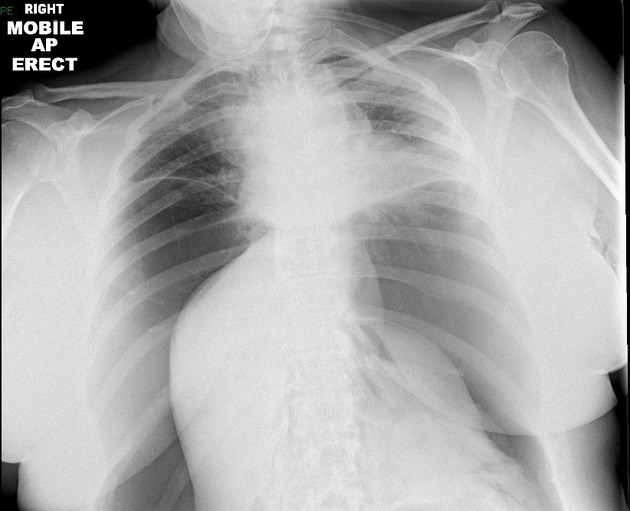 | 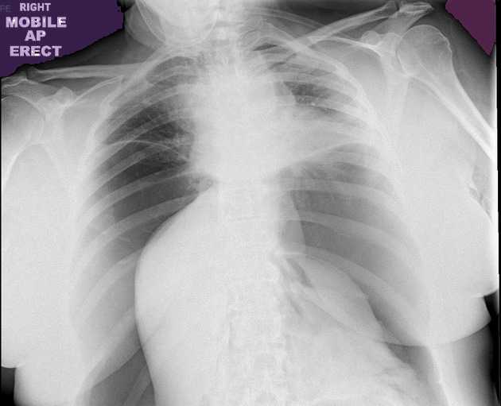 | 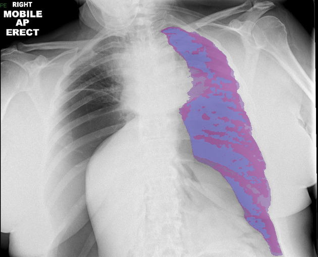 | 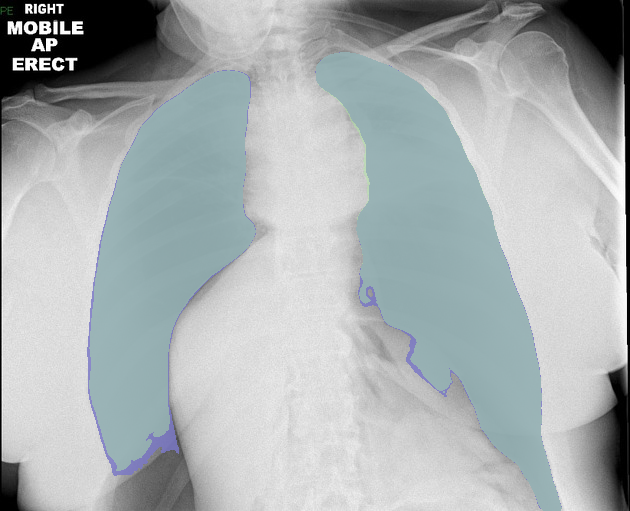 | 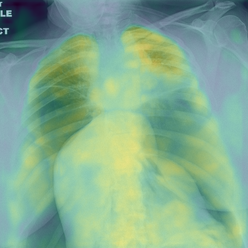 |

- 背景信息：Age: 55 Gender: Female; Presentation: Sudden onset abdominal pain during elective endoscopic investigation. Breathless and tachycardic. 55 岁女性，择期内镜检查期间突发腹痛，同时呼吸困难、心动过速。
- 原始问题：What has given this appearance? 是什么造成了这种影像表现？
- 参考答案：There is a large volume of free gas under the diaphragm displacing and compressing organs. This is tension pneumoperitoneum. 膈下有大量游离气体，导致脏器移位及受压。这是张力性气腹。
- 原始图片caption:
<pre>Significant pneumoperitoneum with displacement of diaphragm, abdominal organs and compression of thoracic structures.</pre>
<pre>显著气腹，伴有膈肌及腹部脏器移位，并压迫胸腔结构。</pre>
- **发生变化** MedGemma-27B-IT: Incorrect → Correct

<strong>MedGemma-27B-IT</strong>

**原始图像 → 原始 QA 回答**；评测：**Incorrect**

英文原始回答：

<pre>&lt;unused94&gt;thought
The user wants me to identify the cause of the abnormal chest X-ray appearance in a 55-year-old female patient who experienced sudden abdominal pain, breathlessness, and tachycardia during an endoscopic procedure.

1.  **Analyze the patient presentation:**
    *   Age: 55 years old
    *   Gender: Female
    *   Symptoms: Sudden onset abdominal pain during endoscopy, breathlessness, tachycardia.
    *   Context: Endoscopic investigation (likely upper GI endoscopy).

2.  **Analyze the chest X-ray (Image 1):**
    *   Modality: X-ray, Erect view.
    *   Findings:
        *   The right hemidiaphragm is significantly elevated.
        *   There is a large, opaque area in the right lower chest, obscuring the right heart border and diaphragm.
        *   The trachea is deviated to the left.
        *   The left lung appears relatively clear, though there might be some atelectasis or crowding of vessels due to the mediastinal shift.
        *   The overall appearance suggests a large mass or fluid collection in the right hemithorax, pushing structures to the left.

3.  **Connect presentation and X-ray findings:**
    *   Sudden onset during endoscopy suggests a complication related to the procedure.
    *   Abdominal pain could be referred pain or related to the underlying cause.
    *   Breathlessness and tachycardia are signs of respiratory distress and potential hemodynamic compromise.
    *   The X-ray shows a massive right-sided opacity with mediastinal shift. This is highly suggestive of a large volume of air or fluid rapidly accumulating in the right pleural space or potentially a large herniation.

4.  **Consider possible causes given the context (endoscopy):**
    *   **Esophageal perforation:** This is a known complication of upper endoscopy. If the perforation occurs posteriorly, air can leak into the mediastinum and potentially the pleural space (pneumothorax or hydropneumothorax). A large perforation could lead to a tension pneumothorax or massive pleural effusion. The sudden onset, breathlessness, tachycardia, and the X-ray findings (large opacity, mediastinal shift) are consistent with a tension pneumothorax or a large pleural effusion secondary to perforation.
    *   **Bowel perforation:** Less likely during upper endoscopy, but possible if the procedure extended or if there was a pre-existing condition. This would typically lead to pneumoperitoneum (free air under the diaphragm) or peritonitis, which might not directly explain the massive right-sided opacity unless it led to a secondary pleural effusion or lung injury.
    *   **Other causes of tension pneumothorax:** Spontaneous pneumothorax, trauma, etc., are less likely given the specific context of endoscopy.
    *   **Massive pleural effusion:** Could be caused by various conditions, but the sudden onset during endoscopy points towards a procedural complication.
    *   **Diaphragmatic hernia:** While possible, a sudden onset during endoscopy is less typical for a hernia unless it was a massive acute event, which is rare.

5.  **Evaluate the X-ray findings in detail:**
    *   The opacity is large and involves the lower right chest.
    *   The mediastinum is shifted to the left.
    *   The right hemidiaphragm is elevated.
    *   These findings strongly suggest a large volume of air (tension pneumothorax) or fluid (massive pleural effusion) in the right pleural space.
    *   Given the context of endoscopy, esophageal perforation leading to air or fluid leakage into the pleural space is the most probable cause.

6.  **Conclusion:** The clinical presentation (sudden onset during endoscopy, respiratory distress) combined with the chest X-ray findings (large right-sided opacity, mediastinal shift) is most consistent with a complication of the endoscopic procedure, specifically an esophageal perforation leading to a tension pneumothorax or a large pleural effusion.

7.  **Final Answer Formulation:** Based on the analysis, the most likely cause is a complication of the endoscopy, specifically esophageal perforation leading to air or fluid accumulation in the right pleural space, resulting in the observed tension pneumothorax or massive pleural effusion.&lt;unused95&gt;*   **Patient Presentation:** A 55-year-old female experienced sudden abdominal pain, breathlessness, and tachycardia during an endoscopic procedure.
*   **Chest X-ray Findings:** The erect frontal chest X-ray shows a large opacity in the right hemithorax, obscuring the right heart border and diaphragm. The mediastinum (trachea, heart) is shifted significantly to the left. The right hemidiaphragm is also elevated.
*   **Interpretation:** The combination of a large opacity occupying the right hemithorax and a leftward mediastinal shift indicates a significant volume of air or fluid has accumulated in the right pleural space. This is compressing the right lung and pushing the mediastinal structures to the opposite side. This is characteristic of a tension pneumothorax (air) or a massive pleural effusion (fluid).
*   **Connecting to Presentation:** The sudden onset of symptoms (pain, breathlessness, tachycardia) during an endoscopic procedure strongly suggests a complication related to the procedure. A known complication of upper endoscopy is esophageal perforation. If the esophagus perforates, air or gastric contents can leak into the mediastinum and/or the pleural space. A large leak into the pleural space can cause a tension pneumothorax or a large pleural effusion, explaining the X-ray findings and the patient&#x27;s acute respiratory distress.

**Therefore, the appearance is most likely due to a complication of the endoscopic procedure, specifically esophageal perforation leading to a tension pneumothorax or a massive pleural effusion.**</pre>

中文翻译：

<pre>
2.  **分析胸部X光片（图像1）：**
*   检查方式：X光，立位。
*   影像表现：
*   右侧膈肌显著抬高。
*   右侧胸腔下部可见大片不透光区，遮蔽了右侧心缘及膈肌轮廓。
*   气管向左侧移位。
*   左肺野相对清晰，但因纵隔移位，可能存在部分肺不张或血管影聚拢现象。
*   整体影像提示右侧胸腔内存在巨大肿块或积液，将胸腔内结构推向左侧。

模型把影像误读为右侧胸腔大面积异常及纵隔左移，认为内镜造成食管穿孔并继发张力性气胸或大量胸腔积液，没有识别张力性气腹。</pre>

**原始图像 + Segmentation → 原始 QA 回答**；评测：**Correct**

英文原始回答：

<pre>&lt;unused94&gt;thought
The user wants me to analyze the provided chest X-ray and determine the cause of the patient&#x27;s symptoms (sudden abdominal pain during endoscopy, breathlessness, tachycardia) and the appearance seen on the X-ray.

1.  **Analyze the Patient Presentation:**
    *   Age: 55 years old, Female.
    *   Symptoms: Sudden onset abdominal pain during an elective endoscopic investigation, breathlessness, tachycardia.
    *   Context: Endoscopic investigation suggests a procedure involving the gastrointestinal tract. Sudden abdominal pain during this procedure is highly suspicious for perforation. Breathlessness and tachycardia are signs of physiological distress, potentially due to pain, inflammation, or complications like pneumoperitoneum or pneumothorax.

2.  **Analyze the Chest X-ray (Image 1):**
    *   Modality: X-ray, Erect view (important for detecting free air).
    *   Observation: There is a large amount of free air under the right hemidiaphragm. This is indicated by the radiolucent (dark) area outlining the diaphragm and extending into the upper abdomen. This finding is classic for pneumoperitoneum.
    *   Other findings: The lungs appear relatively clear, although there might be some atelectasis at the bases. The heart size seems normal. The mediastinum is midline.

3.  **Analyze the Segmentations:**
    *   Medical-SAM2: Shows segmentation of the chest structures.
    *   Medical-SAM3: Shows segmentation of lung, heart, diaphragm, bowel gas. The bowel gas is clearly delineated.
    *   BiomedParse: Shows segmentation of lung, heart, diaphragm, bowel gas. The bowel gas is clearly delineated.
    *   TorchXRayVision: Provides detailed segmentation including lungs, heart, mediastinum, diaphragm, stomach.

4.  **Synthesize the Information:**
    *   The patient experienced sudden abdominal pain during an endoscopy.
    *   The chest X-ray (erect view) shows significant free air under the right hemidiaphragm (pneumoperitoneum).
    *   Pneumoperitoneum is almost always caused by the perforation of a hollow viscus (like the stomach, duodenum, colon).
    *   Given the context of an endoscopy, the perforation likely occurred during the procedure, possibly involving the esophagus, stomach, or duodenum.
    *   The free air irritates the diaphragm, causing referred pain to the shoulder (often the right shoulder, as seen here) and abdominal pain.
    *   The physiological stress of perforation, pain, and inflammation explains the breathlessness and tachycardia.

5.  **Conclusion:** The appearance on the X-ray (free air under the diaphragm) is consistent with pneumoperitoneum, which is the most likely consequence of a gastrointestinal perforation that occurred during the endoscopic procedure, explaining the patient&#x27;s sudden abdominal pain, breathlessness, and tachycardia.&lt;unused95&gt;*   **Patient Presentation:** A 55-year-old female experienced sudden abdominal pain during an endoscopy, accompanied by breathlessness and tachycardia.
*   **X-ray Findings:** The erect chest X-ray shows a significant amount of free air under the right hemidiaphragm. This is a classic sign of pneumoperitoneum.
*   **Interpretation:** Pneumoperitoneum indicates the presence of air in the peritoneal cavity, which almost always results from the perforation of a hollow viscus (e.g., stomach, duodenum, colon). Given the patient was undergoing an endoscopy, the perforation likely occurred during the procedure. The free air irritates the diaphragm, causing referred pain (often to the shoulder) and abdominal pain. The physiological stress and inflammation associated with perforation explain the breathlessness and tachycardia.

**Therefore, the appearance on the X-ray (free air under the diaphragm) is due to pneumoperitoneum, likely caused by a perforation of a hollow viscus during the endoscopic procedure.**</pre>

中文翻译：

<pre>
2.  **分析胸部X光片（图像1）：**
*   成像方式：X光，立位（对于检测游离气体至关重要）。
*   观察结果：右侧膈肌下方可见大量游离气体。表现为勾勒出膈肌轮廓并延伸至上腹部的透亮（黑色）区域。这一征象是气腹的典型表现。
*   其他发现：肺部看起来相对清晰，尽管肺底可能存在少量肺不张。心脏大小看似正常。纵隔位于中线位置。

3.  **分析分割结果：**
*   Medical-SAM2：显示了胸部结构的分割结果。
*   Medical-SAM3：显示了肺、心脏、膈肌和肠道气体的分割结果；肠道气体轮廓清晰。
*   BiomedParse：显示了肺、心脏、膈肌和肠道气体的分割结果；肠道气体轮廓清晰。
*   TorchXRayVision：提供了详细的分割结果，包括肺、心脏、纵隔、膈肌和胃。

加入分割后，模型识别右膈下大量游离气体，结合内镜期间突发腹痛、呼吸困难和心动过速，认为空腔脏器医源性穿孔造成气腹，回答正确。</pre>

**原始图像 → Single-image caption 回答**；

英文原始回答：

<pre>**Image Description:**

The image is a frontal chest X-ray (CXR) taken in the erect position. It shows the patient&#x27;s chest, including the lungs, heart, mediastinum, and bony structures.

Key findings:

*   **Right-sided opacity:** There is a significant opacity in the right lower lung field, obscuring the right hemidiaphragm and right heart border. This suggests a large volume of fluid or air in the pleural space or lung tissue.
*   **Mediastinal shift:** The trachea and mediastinum (heart and great vessels) are shifted towards the left side. This indicates increased pressure in the right hemithorax, pushing the structures away.
*   **Left lung:** The left lung appears relatively clear, although there might be some subtle changes.
*   **Bony structures:** The ribs and clavicles appear intact.

**Clinical Context and Diagnosis:**

*   **Patient Presentation:** A 55-year-old female experienced sudden onset abdominal pain during an elective endoscopic investigation. She became breathless and tachycardic.
*   **Connecting Presentation and Image:** The sudden onset of severe abdominal pain during an endoscopic procedure, followed by respiratory distress (breathlessness) and tachycardia, combined with the CXR findings, strongly suggests a complication related to the procedure.
*   **Interpretation:** The right-sided opacity with mediastinal shift to the left is characteristic of a **tension pneumothorax** on the right side. A pneumothorax is air in the pleural space, which can collapse the lung. A tension pneumothorax occurs when air enters the pleural space but cannot escape, leading to a buildup of pressure. This pressure collapses the lung, shifts the mediastinum, compresses the contralateral lung, and impairs venous return to the heart, causing hemodynamic instability (tachycardia, breathlessness).
*   **Likely Cause:** Given the context of an endoscopic investigation, the most probable cause is perforation of a hollow viscus (like the esophagus or stomach) leading to air leaking into the pleural space (pneumothorax) or mediastinum (pneumomediastinum), potentially causing a tension pneumothorax.

**Diagnosis:**

Right-sided tension pneumothorax, likely secondary to esophageal or gastric perforation during the endoscopic procedure.

**Important Note:** This is an interpretation based on the provided image and clinical information. A definitive diagnosis requires correlation with the patient&#x27;s full clinical picture, physical examination, and potentially further investigations like CT scan. Tension pneumothorax is a medical emergency requiring immediate intervention (needle decompression followed by chest tube insertion).</pre>

中文翻译：

<pre>
**图像描述：**

该图像为患者站立位拍摄的胸部X光片（CXR），显示了患者的胸部结构，包括肺部、心脏、纵隔及骨骼结构。

主要发现：

*   **右侧不透光影（致密影）：** 右肺下野可见明显的致密影，遮蔽了右侧膈肌和右心缘。这提示胸膜腔或肺组织内存在大量液体或气体。
*   **纵隔移位：** 气管和纵隔（包括心脏和大血管）向左侧移位。这表明右侧胸腔内压力升高，将这些结构推向对侧。
*   **左肺：** 左肺野看起来相对清晰，尽管可能存在一些细微变化。
*   **骨骼结构：** 肋骨和锁骨形态完整。

原始 caption 继续把右侧异常解释为张力性气胸，认为可能由食管或胃穿孔使气体进入胸膜腔所致。</pre>

**原始图像 + Segmentation → Single-image caption 回答**；

英文原始回答：

<pre>**Image Description:**

The image is an erect chest X-ray (CXR). It shows the patient&#x27;s chest and upper abdomen. The lungs are visible, along with the heart, mediastinum, diaphragm, and potentially some bowel gas in the upper abdomen. The patient is a 55-year-old female.

**Clinical Presentation:**

The patient presented with sudden onset abdominal pain during an elective endoscopic investigation. She is breathless and tachycardic.

**Image Analysis:**

*   **Lungs:** The lung fields appear relatively clear, although there might be some subtle opacities, particularly in the right lower lung field, which could be related to atelectasis or aspiration.
*   **Heart:** The heart size appears within normal limits.
*   **Mediastinum:** The mediastinal structures appear normal.
*   **Diaphragm:** The diaphragm is visible and appears relatively normal in position.
*   **Abdomen:** There is evidence of bowel gas in the upper abdomen.
*   **Key Finding:** There is a significant amount of free air under the right hemidiaphragm, clearly visible as a lucent crescent shape. This is a classic sign of pneumoperitoneum.

**Diagnosis:**

The presence of free air under the diaphragm (pneumoperitoneum) on the erect CXR, combined with the patient&#x27;s sudden onset abdominal pain, breathlessness, and tachycardia during an endoscopic procedure, strongly suggests a **perforation of a hollow viscus** (likely the gastrointestinal tract, such as the stomach, duodenum, or colon) that occurred during the endoscopy. The free air has escaped into the peritoneal cavity.

**Explanation:**

*   **Pneumoperitoneum:** Free air in the peritoneal cavity.
*   **Cause:** Usually due to perforation of a hollow viscus (stomach, duodenum, small bowel, colon).
*   **Clinical Context:** The patient was undergoing an endoscopy, a procedure that involves inserting instruments into the GI tract. This procedure carries a risk of perforation.
*   **Symptoms:** Sudden onset abdominal pain, breathlessness (due to diaphragmatic irritation), and tachycardia (due to pain, inflammation, or potential sepsis) are consistent with a perforated viscus.
*   **Imaging:** An erect CXR is a sensitive method for detecting pneumoperitoneum, as free air rises and collects under the diaphragm.

**Conclusion:**

The chest X-ray shows pneumoperitoneum, which, in the context of the patient&#x27;s presentation (sudden abdominal pain during endoscopy, breathlessness, tachycardia), indicates a perforated hollow viscus, likely a complication of the endoscopic procedure. This is a surgical emergency.</pre>

中文翻译：

<pre>
**影像分析：**

*   **肺部：** 肺野整体较清晰，但可见一些细微的密度增高影（尤其是在右下肺野），这可能与肺不张或吸入性病变有关。
*   **心脏：** 心脏大小在正常范围内。
*   **纵隔：** 纵隔结构未见异常。
*   **膈肌：** 膈肌轮廓可见，位置相对正常。
*   **腹部：** 上腹部可见肠道气体影。
*   **关键发现：** 右侧膈下可见大量游离气体，呈现为清晰可见的透亮新月形影。这是气腹的典型征象。

分割增强 caption 改为识别膈下明显游离气体，诊断穿孔性空腔脏器导致的气腹，并指出这是需要紧急处理的外科急症。</pre>

**对模型对图片caption能力分析**：
原始 caption 和 QA 都把腹腔大量游离气体误认为右侧张力性气胸或胸腔积液。加入膈肌和肠气相关 segmentation 后，两者均改为膈下游离气体、空腔脏器穿孔和气腹，显著纠正了解剖腔隙定位。

<!-- SECTION_2_CAPTION_ANALYSIS_START -->

## 2. 其余病例的 Single-image Caption 分析

本节覆盖 Section 1 之外的其余 13 个病例，整体结构与 Section 1 一致：每个病例先展示原始图像、实际提供给模型的 segmentation overlays、病例背景和 Radiopaedia 原始 image caption，随后按统一顺序列出 8 个开源模型。遵循上一轮要求，本节不使用 GPT-5.6；每个模型只比较 `with_text=False` 下的原始单图 `single_image_caption` 与“原始单图 + segmentation overlays + segmentation text”后的 `single_image_caption`，不再包含 diagnosis QA。

### 2.1 [Ascites](https://radiopaedia.org/cases/ascites-6?lang=us) (`ascites-6`)

| Original image | Medical-SAM2 | Medical-SAM3: bowel, small bowel, colon, abdomen | BiomedParse v1: bowel, small bowel, colon, abdomen |
|---|---|---|---|
| 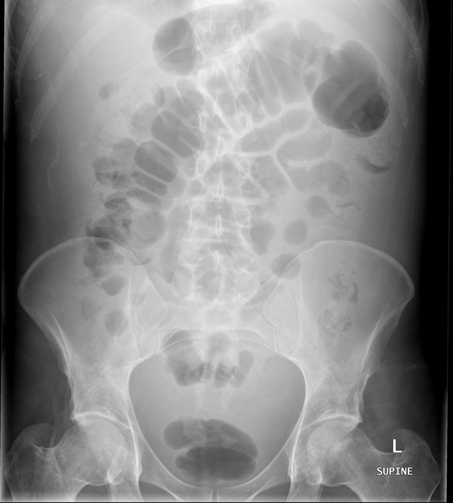 | 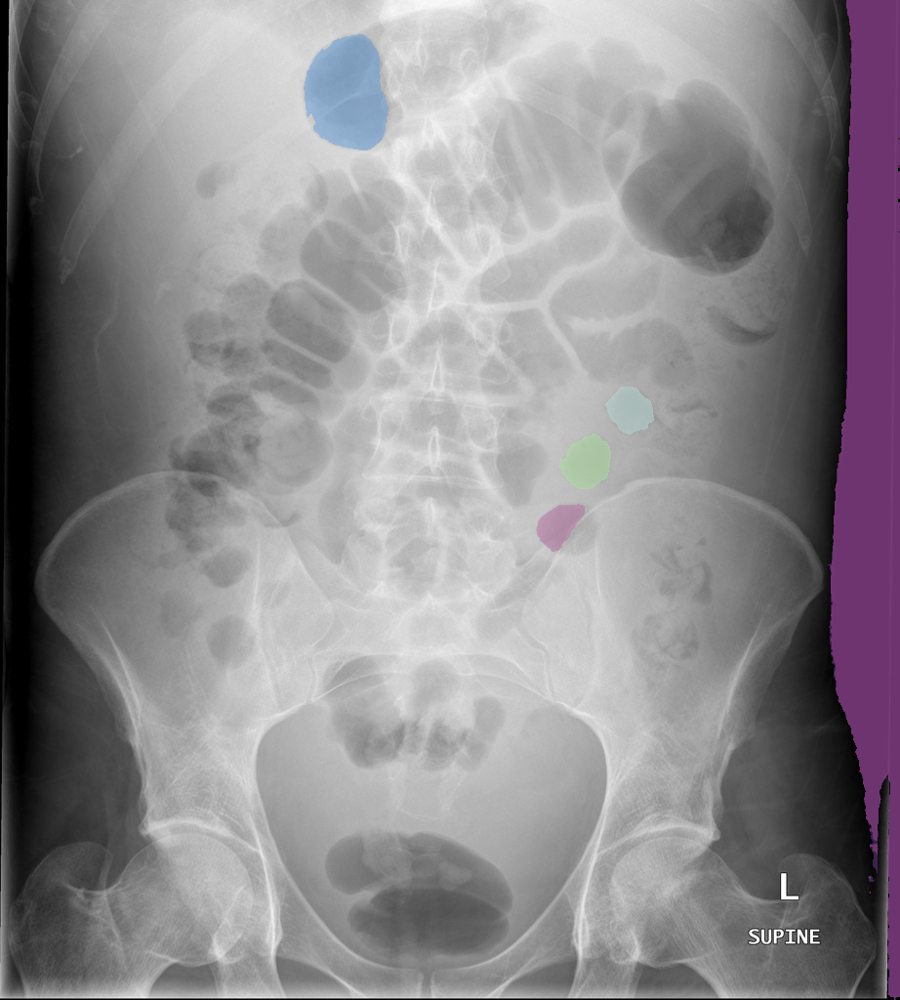 | 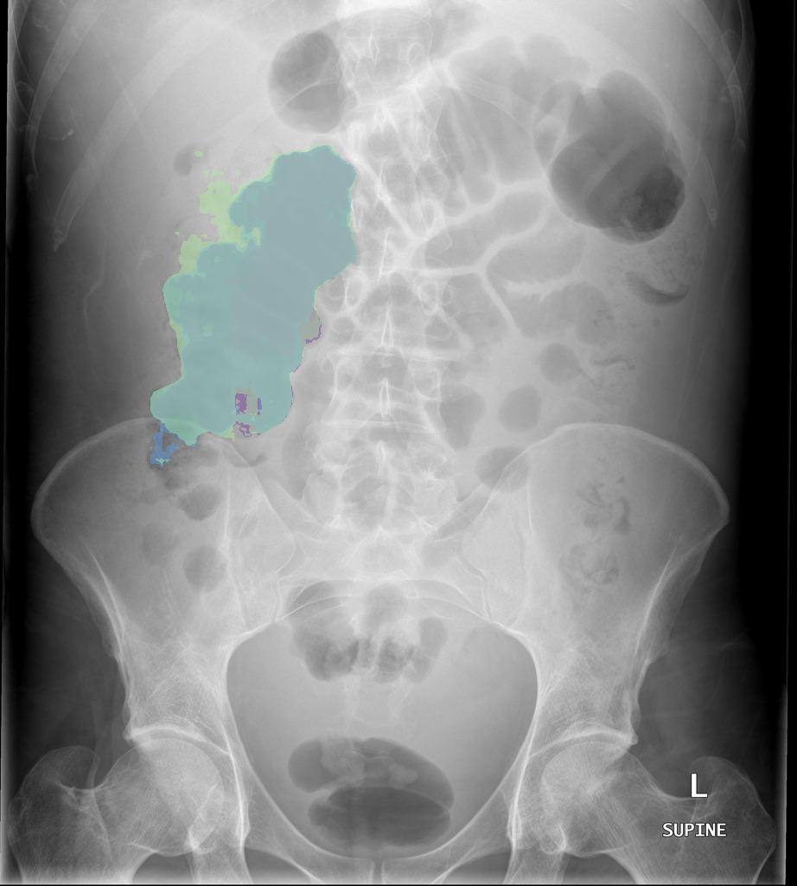 | 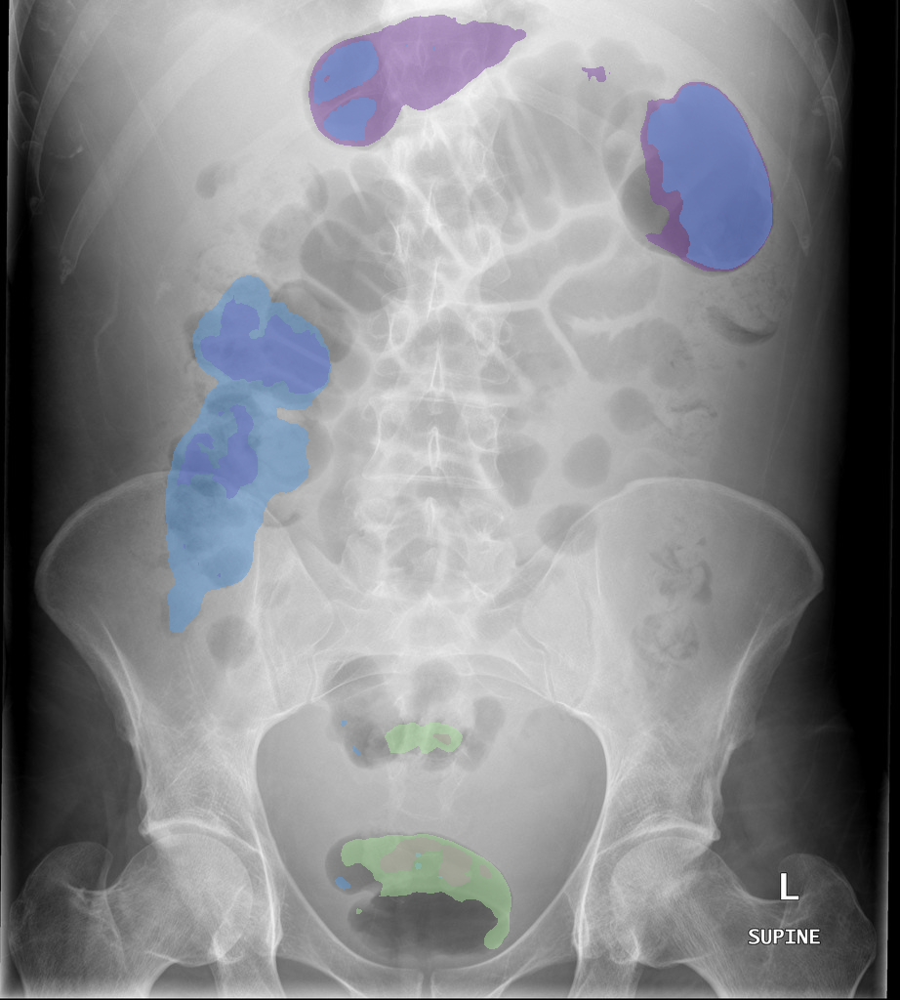 |

- **背景信息：**Age: 35 years Gender: Male; ?Bowel obstruction.；35 岁男性，临床疑问为肠梗阻。
- **原始图片 caption：**

<pre>Central crowding of the bowel loops is consistent with ascites. No evidence of obstruction. No pneumoperitoneum.</pre>

- **原始图片 caption 翻译：**肠袢向中央聚集，符合腹水表现；没有梗阻证据，也没有气腹。

<strong>InternVL3-14B</strong>

**Segmentation 对 caption 的总体影响：**无帮助：前后均未命中参考核心征象

**原始图像 → Single-image caption 回答**

英文原始回答：

<pre>The X-ray image shows a frontal view of the abdomen and pelvis with the patient in the supine position. The primary notable features include multiple dilated loops of the bowel which appear as air-filled structures throughout the abdomen, indicative of gas within the intestines. There is a significant amount of gas patterned in a somewhat irregular, scattered fashion, which might suggest mechanical obstruction.

**Image Observations:**
1. **Dilated Bowel Loops:** The presence of multiple distended bowel loops is apparent. This dilation can be indicative of an obstruction as the lumen is unable to pass contents normally.
   
2. **Air-Fluid Levels:** There appear to be air-fluid levels within the dilated loops, which is typically seen in cases of bowel obstruction where liquid is present above air pockets due to gravity&#x27;s effect.

3. **Paucity of Gas in the Rectum/Colon:** The lower part of the bowel (rectal and colon regions) shows less gas compared to the mid and upper abdomen. This can also be an indicative sign of obstruction where the flow of intestinal contents has been halted.

4. **Generalized Bowel Edema:** The surrounding soft tissue appears somewhat less defined; however, this could indicate a generalized bloating due to the obstruction.

**Diagnosis:**
Given the clinical context (patient presenting with symptoms suggesting bowel obstruction) and the radiographic findings (dilated bowel loops, possible air-fluid levels), the most likely diagnosis here is a **mechanical bowel obstruction**. 

A mechanical bowel obstruction occurs when there is a physical blockage that stops the normal forward movement of intestinal contents. Common causes include adhesions, hernias, tumors, or volvulus. Given the patient is a 35-year-old male, a history of abdominal surgery would suggest possible adhesions as a probable cause, although a complete clinical evaluation including patient&#x27;s past medical history, a physical examination, and possibly further imaging (like a CT scan) would be essential for confirming the diagnosis and determining the exact cause of the obstruction.

**Differential Diagnoses Considered:**
- Adhesional Bowel Obstruction: Common in postoperative patients.
- Hernia: Incarcerated hernias can cause obstruction.
- Tumors or Mass Effect: Benign or malignant, can obstruct the bowel passage.
- Volvulus: Twisting of the bowel leading to obstruction.
  
In conclusion, the radiographic features are highly suggestive of an obstruction, necessitating immediate clinical correlation and perhaps further intervention.</pre>

中文医学要点：

<pre>回答提及或最终倾向的诊断包括：肠梗阻。涉及的主要影像要点包括：肠袢扩张。</pre>

**原始图像 + Segmentation → Single-image caption 回答**

英文原始回答：

<pre>The provided image is a frontal abdominal X-ray of a 35-year-old male presenting with symptoms of bowel obstruction. Here’s a detailed analysis:

1. **General Observations:**
   - The X-ray is taken in a supine position.
   - Multiple looped areas with air-fluid levels are visible throughout the abdominal region. These are indicative of dilated bowel loops.

2. **Specific Findings:**
   - The presence of multiple air-fluid levels within the gastrointestinal tract suggests obstruction.
   - Some large, dilated bowel loops suggest varying degrees of distension.
   - The segmentation of the image shows different anatomical markers, but there are prominent regions of bowel gas which is consistent with bowel obstruction.
   - No obvious free air under the diaphragm, which would suggest perforation but is not typically seen in simple obstructions.
   - The vertebral column is centered, and the pelvis appears symmetrical.

3. **Clinical Correlation:**
   - Given the patient’s presentation of possible bowel obstruction and visual findings on the X-ray, this may correspond to an obstructive process. Possible causes include adhesions, hernias, volvulus, or a tumor. 

4. **Considerations and Diagnosis:**
   - The radiographic findings are highly suggestive of an obstructive process in the bowel. 
   - Further evaluation may include additional imaging (CT scan) or clinical correlation with symptoms like abdominal pain, vomiting, and inability to pass gas or stool.

5. **Conclusion:**
   - Based on the radiological findings and the patient&#x27;s symptoms, a diagnosis of bowel obstruction is supported. Continued monitoring and further diagnostic steps should be undertaken to determine the exact cause and appropriate management of the obstruction.

Prompt clinical correlation and management are essential in patients presenting with such symptoms and radiological findings to avoid complications associated with bowel obstruction.</pre>

中文医学要点：

<pre>回答提及或最终倾向的诊断包括：肠梗阻。涉及的主要影像要点包括：膈肌异常或定位、游离气体、肠袢扩张。</pre>

**Segmentation 对 caption 的影响分析：**

原始 caption：未命中核心征象；加入 segmentation 后：未命中核心征象。前后都没有覆盖决定性征象；回答即使变长，也不能视为有效的视觉理解增益。该判断以是否接近 Radiopaedia 原始 caption 为准，不依据回答篇幅。

<strong>InternVL3.5-14B</strong>

**Segmentation 对 caption 的总体影响：**无帮助：前后均未命中参考核心征象

**原始图像 → Single-image caption 回答**

英文原始回答：

<pre>&lt;think&gt;
Okay, let&#x27;s see. The patient is a 35-year-old male presenting with possible bowel obstruction. The image is an X-ray, frontal view, and the patient was supine when the image was taken.

First, I need to look for signs of bowel obstruction on the X-ray. Common signs include dilated loops of bowel, air-fluid levels, and maybe a transition point where the obstruction is. Since it&#x27;s a supine film, air-fluid levels might not be as visible as they would be in an upright film, but maybe there&#x27;s some evidence of gas patterns.

Looking at the image, the abdomen shows multiple loops of bowel. The colon and small intestine are visible. The loops seem to be somewhat distended. The presence of multiple air-filled loops could indicate obstruction. If the small intestine is dilated (over 2.5 cm in diameter), that&#x27;s a sign. The colon might be distended as well, but usually, the colon is larger, so maybe the small bowel is more prominent here.

I should check if there&#x27;s a transition point. That&#x27;s where the bowel changes from dilated to normal caliber, indicating a blockage. If the image shows a part where the bowel suddenly ends in a point, that&#x27;s a transition point. But in this supine view, it might be harder to see. The image shows the spine, pelvis, and the bowel gas patterns. The left side has a label &quot;L&quot; and &quot;SUPINE.&quot;

Another thing to note is the presence of fecal matter or stool in the colon, which can sometimes be mistaken for obstruction. But in obstruction, the distension is usually more pronounced. The stomach might be distended with air if the obstruction is high up, but in the image, the stomach area isn&#x27;t clearly visible.

The patient&#x27;s symptoms would align with obstruction: abdominal pain, vomiting, constipation. The X-ray findings of dilated bowel loops support that. Possible causes could be adhesions, hernia, tumor, or volvulus. Since the patient is young, maybe adhesions from prior surgery? But the history isn&#x27;t given here.

No obvious free air under the diaphragm, which would suggest perforation. The bones look normal, no fractures or other issues. The bladder is visible, so the lower pelvis is included. The rectum might have gas, but if there&#x27;s a complete obstruction, the rectum might be empty.

So, putting it all together: the X-ray shows multiple dilated loops of bowel, which is consistent with bowel obstruction. The diagnosis would be small bowel obstruction, possibly due to adhesions, hernia, or another cause. Further imaging like a CT scan would help confirm and determine the exact cause.
&lt;/think&gt;

**Image Description:**  
The provided abdominal X-ray (supine frontal view) demonstrates multiple dilated loops of bowel with air-fluid levels, predominantly in the small intestine. The bowel gas pattern shows significant distension, with no clear transition point visible in this supine projection. The colon appears less prominently distended compared to the small bowel. The skeletal structures (spine, pelvis, and ribs) are intact, and there is no evidence of free intraperitoneal air. The bladder is partially visualized, and the rectum contains some gas.

**Diagnosis:**  
**Small Bowel Obstruction (SBO)**  
The radiographic findings of dilated small bowel loops with air-fluid levels, combined with the clinical presentation of suspected bowel obstruction, strongly support this diagnosis. Common causes in a 35-year-old male include:  
- **Adhesions** (post-surgical or inflammatory).  
- **Internal hernia** or **incisional hernia**.  
- **Bowel volvulus** (less likely without a &quot;whirl sign&quot; on imaging).  
- **Tumor** (though less common in this age group).  

**Next Steps:**  
1. **CT Abdomen/Pelvis** (preferred for definitive diagnosis, localization, and etiology).  
2. **Clinical correlation** with symptoms (e.g., pain, vomiting, constipation).  
3. **Surgical consultation** if obstruction is confirmed or complications (e.g., ischemia) are suspected.  

The supine positioning limits visualization of air-fluid levels, but the significant bowel distension remains highly suggestive of obstruction.</pre>

中文医学要点：

<pre>回答提及或最终倾向的诊断包括：便秘、肠梗阻、小肠梗阻。涉及的主要影像要点包括：膈肌异常或定位、游离气体、肠袢扩张。</pre>

**原始图像 + Segmentation → Single-image caption 回答**

英文原始回答：

<pre>&lt;think&gt;
Okay, let&#x27;s tackle this case. The patient is a 35-year-old male presenting with possible bowel obstruction. The X-ray provided is a frontal supine view of the abdomen. 

First, I&#x27;ll look for signs of bowel obstruction. In an X-ray, bowel obstruction typically shows dilated loops of bowel with air-fluid levels. Since the patient is supine, the air-fluid levels might not be as visible as they would be in an upright film, but dilated loops can still be seen.

Looking at the image, there are multiple dilated loops of bowel visible. The segmentation images highlight different areas: the small bowel and colon. The dilated loops are more prominent in the upper abdomen, which could indicate a small bowel obstruction. The presence of gas in the colon might suggest a transition point, but in a supine film, it&#x27;s harder to see the exact location.

The segmentation by Medical-SAM2 shows some highlighted areas. The blue area in the upper left might be a dilated loop, and the green and pink areas in the lower abdomen could be parts of the colon or other bowel segments. The BiomedParse segmentation shows larger areas in blue and purple, which might represent the dilated small bowel and colon. The green area in the pelvis could be the rectum or sigmoid colon, which might have gas but isn&#x27;t dilated, suggesting that the obstruction is higher up.

The abdomen is labeled as &quot;SUPINE,&quot; so the positioning could affect the visibility of air-fluid levels. In a supine patient, fluid might settle more posteriorly, so the air could be seen in the anterior parts. The lack of a clear transition point might make it harder to pinpoint the exact cause, like a hernia or tumor, but the presence of dilated loops is concerning for obstruction.

Other considerations: The patient&#x27;s age and gender. Bowel obstructions can be due to adhesions, hernias, tumors, or volvulus. Since he&#x27;s 35, adhesions from prior surgeries are possible, but if he hasn&#x27;t had abdominal surgery, other causes like a hernia or tumor might be more likely. Volvulus is another possibility, especially in the small bowel, but it&#x27;s less common.

The X-ray doesn&#x27;t show any obvious calcifications or foreign bodies. The bones and soft tissues look normal. The presence of gas in the stomach and colon is normal, but if the colon is dilated, that could indicate a large bowel obstruction. However, the upper dilated loops suggest small bowel.

In summary, the X-ray shows multiple dilated loops of small bowel, consistent with small bowel obstruction. The diagnosis would be small bowel obstruction, likely due to adhesions, hernia, or other causes. Further imaging like a CT scan would be needed for confirmation and to identify the exact cause.
&lt;/think&gt;

**Image Description and Diagnosis:**

**Findings on X-ray:**  
The frontal supine abdominal X-ray demonstrates **multiple dilated loops of small bowel** in the upper abdomen, with air-fluid levels partially obscured due to the supine position. The colon appears less prominently dilated, and the pelvis shows gas in the rectum/sigmoid without significant dilation. Segmentation highlights (e.g., blue/purple regions in Medical-SAM2 and BiomedParse) correlate with dilated small bowel loops, while green areas likely represent the nondilated colon and rectum.

**Diagnosis:**  
**Small bowel obstruction (SBO)** is the most likely diagnosis. Key supporting features include:  
1. **Dilated small bowel loops** (supine film limits visualization of air-fluid levels but still shows gaseous distention).  
2. **Absence of a transition point** on this X-ray, which may require further imaging (e.g., CT) for localization.  

**Differential Considerations:**  
- **Adhesions** (common post-abdominal surgery, though surgical history is not provided).  
- **Hernia** (e.g., internal/external inguinal or incisional).  
- **Tumor** (less likely in a 35-year-old without risk factors).  
- **Volvulus** (e.g., cecal or jejunal).  

**Next Steps:**  
- **CT abdomen/pelvis** with oral contrast to confirm obstruction, identify the transition point, and assess for causes (e.g., adhesions, hernia, mass).  
- Clinical correlation with symptoms (abdominal pain, vomiting, constipation) and physical exam (e.g., high-pitched bowel sounds, guarding).  

**Conclusion:**  
The radiographic findings strongly suggest **small bowel obstruction**, necessitating urgent evaluation with CT and clinical management (e.g., nasogastric decompression, IV fluids).</pre>

中文医学要点：

<pre>回答提及或最终倾向的诊断包括：肠梗阻、小肠梗阻。涉及的主要影像要点包括：钙化。</pre>

**Segmentation 对 caption 的影响分析：**

原始 caption：未命中核心征象；加入 segmentation 后：未命中核心征象。前后都没有覆盖决定性征象；回答即使变长，也不能视为有效的视觉理解增益。该判断以是否接近 Radiopaedia 原始 caption 为准，不依据回答篇幅。

<strong>Lingshu-32B</strong>

**Segmentation 对 caption 的总体影响：**无帮助：前后均未命中参考核心征象

**原始图像 → Single-image caption 回答**

英文原始回答：

<pre>The abdominal X-ray shows multiple dilated loops of small bowel with air-fluid levels, which are indicative of a small bowel obstruction. The presence of these dilated loops suggests that there is a blockage preventing the normal passage of intestinal contents. Given the clinical presentation of abdominal pain, vomiting, and distension, along with the radiographic findings, the most likely diagnosis is small bowel obstruction. This condition requires prompt medical attention to identify the underlying cause and appropriate treatment to prevent complications such as ischemia or perforation.</pre>

中文医学要点：

<pre>回答提及或最终倾向的诊断包括：肠梗阻、小肠梗阻。未提取到与参考病灶高度特异的影像征象。</pre>

**原始图像 + Segmentation → Single-image caption 回答**

英文原始回答：

<pre>The abdominal X-ray shows multiple dilated loops of small bowel with air-fluid levels, which are indicative of a small bowel obstruction. The presence of these dilated loops suggests that there is a blockage preventing the normal passage of intestinal contents. The absence of free air under the diaphragm rules out perforation. Given the clinical presentation of abdominal pain, vomiting, and distension, along with the radiographic findings, the most likely diagnosis is small bowel obstruction. Further evaluation with CT scan may be necessary to identify the exact cause and location of the obstruction.</pre>

中文医学要点：

<pre>回答提及或最终倾向的诊断包括：肠梗阻、小肠梗阻。涉及的主要影像要点包括：膈肌异常或定位、游离气体。</pre>

**Segmentation 对 caption 的影响分析：**

原始 caption：未命中核心征象；加入 segmentation 后：未命中核心征象。前后都没有覆盖决定性征象；回答即使变长，也不能视为有效的视觉理解增益。该判断以是否接近 Radiopaedia 原始 caption 为准，不依据回答篇幅。

<strong>MedGemma-27B-IT</strong>

**Segmentation 对 caption 的总体影响：**无帮助：前后均未命中参考核心征象

**原始图像 → Single-image caption 回答**

英文原始回答：

<pre>**Image Description:**

The image is a frontal abdominal X-ray. It shows the abdominal cavity, including the bowel loops, diaphragm, and pelvic bones. The bowel loops are dilated, particularly in the small bowel, which is characterized by prominent haustral markings. There are air-fluid levels visible within these dilated loops, indicating the presence of both air and fluid. The distribution of these dilated loops appears somewhat generalized across the abdomen. The soft tissues and bones appear unremarkable.

**Interpretation and Diagnosis:**

The key findings on this X-ray are:

1.  **Dilated Bowel Loops:** The small bowel loops are significantly distended.
2.  **Air-Fluid Levels:** Multiple air-fluid levels are present within the dilated loops.

These findings are classic signs of **bowel obstruction**. The dilation occurs proximal to the point of obstruction, and the air-fluid levels form as gas and fluid accumulate behind the blockage.

**Differential Diagnosis:**

While the image strongly suggests bowel obstruction, other conditions can cause bowel dilation, such as ileus (paralysis of the bowel). However, the presence of multiple air-fluid levels is more typical of mechanical obstruction.

**Conclusion:**

Based on the radiographic findings of dilated bowel loops with multiple air-fluid levels, the most likely diagnosis is **bowel obstruction**. The patient&#x27;s presentation of suspected bowel obstruction aligns well with these imaging findings. Further investigation (e.g., CT scan) would be needed to determine the specific location and cause of the obstruction.</pre>

中文医学要点：

<pre>回答提及或最终倾向的诊断包括：肠梗阻。涉及的主要影像要点包括：肠袢扩张、膈肌异常或定位。</pre>

**原始图像 + Segmentation → Single-image caption 回答**

英文原始回答：

<pre>The provided image is an abdominal X-ray, specifically a frontal view. The patient is a 35-year-old male presenting with suspected bowel obstruction.

**Image Description:**

The X-ray shows the abdominal cavity. Key structures visible include:
*   **Bowel loops:** Multiple loops of both small and large bowel are visible, characterized by their haustral markings (in the large bowel) and generally smaller diameter and more frequent loops (in the small bowel).
*   **Gas-filled structures:** The bowel loops are filled with gas, which appears radiolucent (dark) on the X-ray.
*   **Soft tissues:** The abdominal wall, pelvic bones, and potentially some organs like the liver or spleen are visible as soft tissue densities.
*   **Air-fluid levels:** There are multiple horizontal lines within the bowel loops, indicating the presence of air-fluid levels. This is a classic sign of bowel obstruction, where gas and fluid accumulate proximal to the obstruction.
*   **Dilated bowel loops:** The bowel loops appear significantly distended or dilated, particularly in the central and upper abdomen. This further supports the suspicion of obstruction.

**Segmentations:**

*   **Medical-SAM2:** This segmentation highlights specific areas, possibly indicating regions of interest or abnormalities. The blue oval seems to encompass a dilated loop of bowel, while the green and pink ovals highlight other bowel segments.
*   **Medical-SAM3:** This segmentation labels different bowel parts. The green area likely represents the colon (large bowel), and the blue area represents the small bowel. The purple area might be the stomach or duodenum. The dilated loops are primarily within the small bowel and proximal colon.
*   **BiomedParse:** This segmentation also identifies bowel structures, with purple likely representing the small bowel and green representing the colon. The dilated loops are prominent in the small bowel segments.

**Diagnosis:**

Based on the clinical presentation (suspected bowel obstruction) and the radiographic findings (multiple dilated bowel loops, prominent air-fluid levels), the most likely diagnosis is **small bowel obstruction (SBO)**. The dilated loops and air-fluid levels indicate that the passage of intestinal contents is blocked, leading to accumulation of gas and fluid proximal to the obstruction. The specific level and cause of the obstruction would require further investigation (e.g., CT scan, clinical history).</pre>

中文医学要点：

<pre>回答提及或最终倾向的诊断包括：肠梗阻、小肠梗阻。涉及的主要影像要点包括：肠袢扩张。</pre>

**Segmentation 对 caption 的影响分析：**

原始 caption：未命中核心征象；加入 segmentation 后：未命中核心征象。前后都没有覆盖决定性征象；回答即使变长，也不能视为有效的视觉理解增益。该判断以是否接近 Radiopaedia 原始 caption 为准，不依据回答篇幅。

<strong>MedMO-8B</strong>

**Segmentation 对 caption 的总体影响：**无帮助，并强化了病例文本锚定

**原始图像 → Single-image caption 回答**

英文原始回答：

<pre>Free air under the diaphragm.</pre>

中文要点翻译：

<pre>膈下游离气体。</pre>

**原始图像 + Segmentation → Single-image caption 回答**

英文原始回答：

<pre>Bowel obstruction</pre>

中文要点翻译：

<pre>肠梗阻。</pre>

**对模型图片 caption 能力及 Segmentation 影响的分析：**

原图 caption 把中央聚集的肠袢误判为膈下游离气体；加入 segmentation 后虽然不再报告气腹，却直接沿用病例中的“疑似肠梗阻”，仍未识别大量腹水造成的肠袢中央化。mask 改变了错误类型，但没有补充决定性的腹腔液体证据。

<strong>Qwen3-VL-4B</strong>

**Segmentation 对 caption 的总体影响：**无帮助：前后均未命中参考核心征象

**原始图像 → Single-image caption 回答**

英文原始回答：

<pre>Based on the patient’s presentation of suspected bowel obstruction and the provided frontal abdominal X-ray image, the following interpretation can be made:

**Image Description:**
The image is a frontal (AP) abdominal X-ray in the supine position, showing the entire gastrointestinal tract from the upper abdomen down to the pelvis. The radiograph demonstrates:

- **Air-fluid levels** throughout the bowel loops, particularly in the small intestine and proximal colon. These are characteristic of obstructed bowel segments that are distended with gas and fluid.
- **Dilated bowel loops** with varying degrees of air accumulation, indicating obstruction proximal to the site of blockage.
- **No evidence of free air** under the diaphragm or in the pelvis, which would suggest perforation.
- **No significant signs of acute complications** such as widespread pneumatosis intestinalis or marked dilatation of the colon (which might suggest a colonic obstruction or severe obstruction).
- The image shows the patient’s pelvis, including the iliac bones, and the label “L SUPINE” indicates the patient is lying on their back with the left side marked.

**Diagnosis:**
The radiographic findings are consistent with **partial small bowel obstruction**. The presence of multiple air-fluid levels and dilated bowel loops without free air or signs of perforation suggests a non-perforating, partial obstruction. The obstruction is likely located in the small intestine, as the most common site for small bowel obstruction, and the pattern of dilatation is typical of a partial obstruction.

**Clinical Implications:**
- The patient should be evaluated further with clinical history (e.g., vomiting, abdominal pain, constipation, recent surgery or trauma).
- Additional imaging (e.g., CT scan) may be needed to confirm the diagnosis and locate the obstruction.
- Management may include conservative measures (e.g., NPO, IV fluids, bowel rest) or surgical intervention if the obstruction is complete, causing severe symptoms, or if there is evidence of ischemia or perforation.

**Note:** While the X-ray is suggestive of bowel obstruction, it cannot definitively determine the cause or location of the obstruction without further clinical correlation and imaging (e.g., CT abdomen with contrast).

---

**Final Diagnosis: Partial Small Bowel Obstruction** (based on radiographic findings).</pre>

中文医学要点：

<pre>回答提及或最终倾向的诊断包括：肠梗阻、小肠梗阻。涉及的主要影像要点包括：游离气体、肠袢扩张、膈肌异常或定位。</pre>

**原始图像 + Segmentation → Single-image caption 回答**

英文原始回答：

<pre>Based on the provided patient data (35-year-old male) and the radiographic findings, the image demonstrates classic signs of **small bowel obstruction**.

Here is the analysis:

- **Image Type**: This is a supine, frontal abdominal X-ray (barium or non-contrast).
- **Key Findings**:
  - **Dilated Bowel Loops**: The image shows multiple dilated loops of bowel, particularly in the mid-abdomen and pelvis. The segmentation masks (from Medical-SAM2, Medical-SAM3, and BiomedParse) clearly identify these dilated loops as small bowel (blue and purple in BiomedParse) and colon (green in BiomedParse).
  - **Air-Fluid Levels**: The dilated loops contain air and fluid, forming characteristic air-fluid levels, which are a hallmark of obstruction.
  - **Position of Obstruction**: The most significant finding is the **presence of a single, localized obstruction**. The segmentation (especially from BiomedParse) shows a marked dilatation of the small bowel loops in the mid-abdomen, with the bowel distal to the obstruction (lower loops) appearing more dilated than proximal loops. This is consistent with a **mechanical small bowel obstruction**.
  - **No Free Air**: There is no evidence of free air under the diaphragm or around the colon, which would suggest a perforation (e.g., from a perforated viscus or appendicitis).
  - **No Significant Signs of Peritonitis**: The image does not show signs of generalized peritonitis (e.g., free fluid, diffuse gas, or significant bowel wall thickening).

- **Diagnosis**: The most likely diagnosis is **small bowel obstruction**. The clinical presentation of &quot;bowel obstruction&quot; and the radiographic findings (dilated bowel loops with air-fluid levels) strongly support this diagnosis.

- **Next Steps**: The patient should be evaluated further with a CT scan to determine the exact location and cause of the obstruction (e.g., adhesions, hernia, tumor, or volvulus) and to rule out other causes (e.g., paralytic ileus, which would not show air-fluid levels).

In summary, the radiograph is consistent with a mechanical small bowel obstruction, and the patient should be referred for further diagnostic imaging and management.</pre>

中文医学要点：

<pre>回答提及或最终倾向的诊断包括：肠梗阻、小肠梗阻、肠麻痹。涉及的主要影像要点包括：肠袢扩张、膈肌异常或定位、游离气体。</pre>

**Segmentation 对 caption 的影响分析：**

原始 caption：未命中核心征象；加入 segmentation 后：未命中核心征象。前后都没有覆盖决定性征象；回答即使变长，也不能视为有效的视觉理解增益。该判断以是否接近 Radiopaedia 原始 caption 为准，不依据回答篇幅。

<strong>Qwen3-VL-8B</strong>

**Segmentation 对 caption 的总体影响：**无帮助：前后均未命中参考核心征象

**原始图像 → Single-image caption 回答**

英文原始回答：

<pre>Based on the provided patient data (35-year-old male) and the X-ray image (frontal, supine position), here is the description and diagnosis:

**Image Description:**

This is a supine abdominal X-ray showing the entire abdominal cavity. The image reveals:

- **Marked bowel distension:** Multiple loops of bowel, particularly in the mid-abdomen and pelvis, are significantly dilated and appear air-filled (radiolucent).
- **Air-fluid levels:** Several horizontal air-fluid levels are visible within the dilated bowel loops, indicating the presence of fluid and gas in the obstructed segments.
- **Loss of normal bowel pattern:** The normal haustral markings of the colon are blurred or absent due to distension.
- **No significant free air:** There is no evidence of free intraperitoneal air (which would suggest perforation).
- **No significant calcifications or foreign bodies:** The image does not show any obvious signs of obstruction due to calculi or foreign bodies.
- **Normal bony structures:** The lumbar spine and pelvic bones appear intact.

**Diagnosis:**

**Small Bowel Obstruction (SBO)**

**Rationale:**

The key findings on this X-ray are consistent with a mechanical bowel obstruction:

- **Dilated bowel loops:** The dilated loops of bowel are primarily in the mid-abdomen, which is typical for small bowel obstruction.
- **Air-fluid levels:** These are classic signs of bowel obstruction, indicating the presence of fluid and gas distal to the site of obstruction.
- **Absence of free air:** This rules out perforation as the primary cause, making mechanical obstruction more likely.
- **Patient age and presentation:** A 35-year-old male presenting with symptoms suggestive of bowel obstruction (e.g., abdominal pain, distension, vomiting, constipation) is a common demographic for SBO, often due to adhesions (post-surgical), hernias, or less commonly, tumors or volvulus.

While the image does not definitively identify the cause, the findings are highly suggestive of a mechanical small bowel obstruction.

**Next Steps:**

- Clinical correlation with symptoms (e.g., pain, vomiting, bowel habits).
- Consider CT abdomen/pelvis for definitive diagnosis, localization, and cause of obstruction.
- Management may include IV fluids, nasogastric decompression, and possible surgical intervention depending on the cause and severity.

---

**Note:** While the image is suggestive of SBO, a definitive diagnosis requires clinical correlation and possibly further imaging. The image does not show any signs of large bowel obstruction (e.g., prominent dilated colon loops) or perforation (free air).</pre>

中文医学要点：

<pre>回答提及或最终倾向的诊断包括：肠梗阻、小肠梗阻、便秘。涉及的主要影像要点包括：游离气体、肠袢扩张、钙化。</pre>

**原始图像 + Segmentation → Single-image caption 回答**

英文原始回答：

<pre>Based on the provided X-ray image and patient data, here is the description and diagnosis:

**Image Description:**
This is a supine abdominal X-ray of a 35-year-old male. The image shows the abdominal cavity with visible bowel loops. There is a significant presence of air-fluid levels and dilated bowel loops, particularly in the mid-abdomen and upper abdomen. The bowel appears distended, with multiple air-fluid levels visible throughout the abdomen. The bowel loops are not uniformly distributed, and there is a notable absence of gas in the distal colon, which is typically expected in the supine position. The image also shows the pelvic bones and the sacrum, which appear normal.

**Diagnosis:**
The radiographic findings are consistent with **small bowel obstruction**. The presence of dilated small bowel loops with air-fluid levels, along with the absence of gas in the distal colon, strongly suggests an obstruction proximal to the colon. The patient&#x27;s age and gender are not specific to the diagnosis, but the clinical presentation of bowel obstruction is consistent with this radiographic finding.

**Clinical Implication:**
This patient requires further evaluation to determine the cause of the obstruction, which may include mechanical causes such as adhesions, hernias, or tumors. The patient may require surgical intervention depending on the severity and cause of the obstruction. Immediate medical attention is necessary to prevent complications such as bowel ischemia or perforation.

**Note:** The segmentation masks provided (Medical-SAM2, Medical-SAM3, BiomedParse) are not directly relevant to the diagnosis but may assist in identifying specific regions of interest for further analysis.</pre>

中文医学要点：

<pre>回答提及或最终倾向的诊断包括：肠梗阻、小肠梗阻。涉及的主要影像要点包括：肠袢扩张。</pre>

**Segmentation 对 caption 的影响分析：**

原始 caption：未命中核心征象；加入 segmentation 后：未命中核心征象。前后都没有覆盖决定性征象；回答即使变长，也不能视为有效的视觉理解增益。该判断以是否接近 Radiopaedia 原始 caption 为准，不依据回答篇幅。

<strong>Qwen3-VL-32B</strong>

**Segmentation 对 caption 的总体影响：**无帮助：前后均未命中参考核心征象

**原始图像 → Single-image caption 回答**

英文原始回答：

<pre>**Image Description:**

This is a supine frontal abdominal X-ray of a 35-year-old male presented with suspected bowel obstruction.

The image demonstrates **diffuse dilatation of multiple loops of small and large bowel** throughout the abdomen. There is **air-fluid level formation** within several bowel segments, particularly evident in the mid and upper abdomen, which is a classic sign of intestinal obstruction. The bowel loops appear **distended**, with varying degrees of gas accumulation, and the pattern is **non-specific** — meaning it does not clearly localize the obstruction to a particular segment (e.g., small vs. large bowel).

The **large bowel** also shows some distension, especially in the transverse and descending colon, with visible haustral markings. The **small bowel** loops are markedly dilated, with a “stacked coin” appearance in some areas, suggesting significant distension.

There is **no evidence of free intraperitoneal air** (i.e., no pneumoperitoneum), which would suggest perforation. The **bony structures** (pelvis, lumbar spine) appear intact without obvious fracture or abnormality. The **bladder** is partially filled and visible in the pelvis, with no calcifications or foreign bodies.

**Diagnosis:**

**Small bowel obstruction (SBO) with possible large bowel involvement.**

The findings are consistent with **mechanical bowel obstruction**, likely due to adhesions (a common cause in young adults with prior abdominal surgery), although other causes such as hernia, volvulus, or tumor cannot be excluded without further imaging (e.g., CT scan).

**Recommendations:**

- **Clinical correlation** is essential: assess for signs of peritonitis, vomiting, abdominal pain, and bowel sounds.
- **Further imaging**: A **contrast-enhanced CT scan of the abdomen and pelvis** is recommended to determine the level and cause of obstruction.
- **Management**: NPO, IV fluids, NG tube decompression, and surgical consultation if signs of ischemia or perforation develop.

---

**Note:** While the X-ray is suggestive of bowel obstruction, it is non-specific in determining the exact cause. CT is the gold standard for evaluation in such cases.</pre>

中文医学要点：

<pre>回答提及或最终倾向的诊断包括：肠梗阻、小肠梗阻。涉及的主要影像要点包括：钙化。</pre>

**原始图像 + Segmentation → Single-image caption 回答**

英文原始回答：

<pre>Based on the provided patient data and abdominal X-ray (supine frontal view), here is a detailed description and diagnosis:

---

### **Image Description:**

This is a **supine abdominal X-ray** of a 35-year-old male, presented with a suspected bowel obstruction.

#### **Radiographic Findings:**
- **General Appearance:** The abdomen shows **multiple dilated bowel loops** with **air-fluid levels** throughout the abdomen, which are more prominent in the **mid and upper abdomen**.
- **Gas Pattern:** There is **generalized gas distention** of the small bowel, with several loops appearing markedly dilated. The colon appears relatively less distended, but there is some gas present in the rectosigmoid region.
- **Air-Fluid Levels:** Multiple air-fluid levels are visible, particularly in the **upper abdomen**, suggesting **partial or complete mechanical obstruction**.
- **Bowel Wall Thickening:** Not clearly visible on plain film, but the presence of dilated loops with fluid levels is concerning for obstruction.
- **No Free Air:** No evidence of pneumoperitoneum (free air under the diaphragm), which reduces the likelihood of perforation.
- **Soft Tissue Masses or Foreign Bodies:** No obvious foreign bodies or calcified masses are seen.

#### **Segmentation Analysis:**
- **Medical-SAM2:** Highlights a few isolated bowel loops (blue, green, purple), but does not capture the full extent of dilated bowel. Likely represents a limited segmentation.
- **Medical-SAM3:** Shows a large area of segmentation (teal) in the left upper quadrant, possibly representing dilated colon or small bowel. However, it misses many dilated loops and may over-segment.
- **BiomedParse:** Provides a more comprehensive segmentation, identifying multiple dilated loops in the upper and mid-abdomen (blue, purple), as well as some in the pelvis (green). This segmentation better reflects the radiographic findings of generalized small bowel distention.

---

### **Clinical Correlation:**

The patient is a 35-year-old male presenting with suspected **bowel obstruction**. The radiographic findings are **highly suggestive of small bowel obstruction (SBO)**.

---

### **Diagnosis:**

&gt; **Small Bowel Obstruction (SBO) – Likely Mechanical**

---

### **Differential Diagnosis:**

1. **Adhesions (most common cause in post-op patients or with prior abdominal surgery)**
2. **Hernia (e.g., incisional, femoral, inguinal)**
3. **Volvulus (less likely without &quot;whirl sign&quot; or specific rotation)**
4. **Tumor or mass (e.g., carcinoid, lymphoma, metastasis)**
5. **Inflammatory conditions (e.g., Crohn’s disease, diverticulitis)**
6. **Bezoar or foreign body (less likely without history)**

---

### **Recommendations:**

1. **Clinical Correlation:** Assess for signs of peritonitis, vomiting, abdominal distension, and inability to pass flatus or stool.
2. **Further Imaging:** **CT abdomen/pelvis with IV and oral contrast** is the gold standard to confirm the diagnosis, identify the level and cause of obstruction, and assess for complications (e.g., ischemia, perforation).
3. **Laboratory Workup:** CBC (leukocytosis), electrolytes, renal function, and lactate to assess for dehydration, sepsis, or bowel ischemia.
4. **Management:** NPO, IV fluids, NG tube decompression if indicated, and surgical consultation if signs of strangulation or no improvement with conservative management.

---

### **Conclusion:**

The supine abdominal X-ray demonstrates **multiple dilated small bowel loops with air-fluid levels**, consistent with **small bowel obstruction**. The segmentation tools (particularly BiomedParse) help highlight the areas of distention, supporting the radiological interpretation. **CT imaging is strongly recommended to confirm the diagnosis and identify the underlying cause.**

--- 

✅ **Final Diagnosis: Small Bowel Obstruction (Mechanical), likely due to adhesions or hernia.**</pre>

中文医学要点：

<pre>回答提及或最终倾向的诊断包括：肠梗阻、小肠梗阻。涉及的主要影像要点包括：膈肌异常或定位、游离气体、肠袢扩张。</pre>

**Segmentation 对 caption 的影响分析：**

原始 caption：未命中核心征象；加入 segmentation 后：未命中核心征象。前后都没有覆盖决定性征象；回答即使变长，也不能视为有效的视觉理解增益。该判断以是否接近 Radiopaedia 原始 caption 为准，不依据回答篇幅。

### 2.2 [BIRADS III lesion - infiltrating ductal carcinoma](https://radiopaedia.org/cases/birads-iii-lesion-infiltrating-ductal-carcinoma-1?lang=us) (`birads-iii-lesion-infiltrating-ductal-carcinoma-1`)

| Original image | Medical-SAM2 | Medical-SAM3: breast, breast lesion, tumor | BiomedParse v1: breast, breast lesion, tumor |
|---|---|---|---|
| 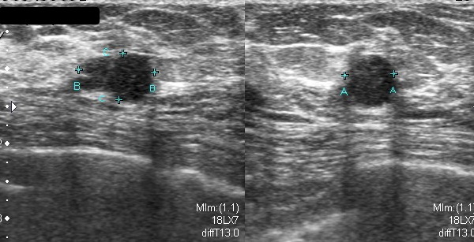 | 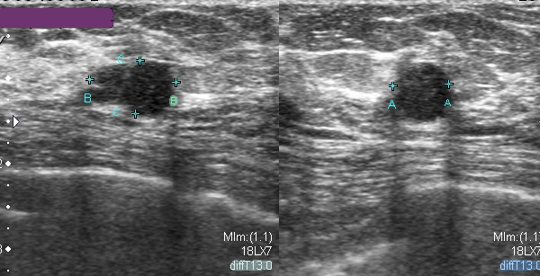 | 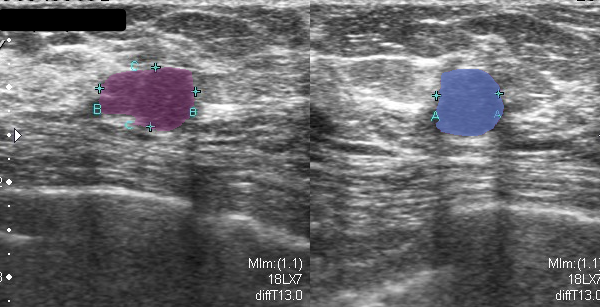 | 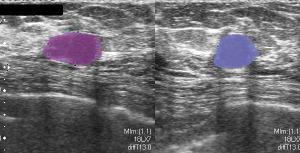 |

- **背景信息：**Age: 50 Gender: Female; This 50 year old client gets her annual screening mammogram. She has very dense breast parenchyma. Ultrasound is performed and this solid lesion is found in her left breast. No family history of breast carcinoma. her mom died of colon carcinoma.；50 岁女性接受年度乳腺筛查；乳腺实质非常致密，超声发现左乳实性病灶。无乳腺癌家族史，其母亲死于结肠癌。
- **原始图片 caption：**

<pre>There is a solid lesion which is poorly circumscribed and non compressible on real time ultrasound imaging. It has no pseudocapsule. On the axial view it is as tall as broad.</pre>

- **原始图片 caption 翻译：**可见边界不清、实时超声下不可压缩的实性病灶，无假包膜；轴位上其高度与宽度相当。

<strong>InternVL3-14B</strong>

**Segmentation 对 caption 的总体影响：**正向：新增或强化参考关键点

**原始图像 → Single-image caption 回答**

英文原始回答：

<pre>The image provided is from an ultrasound examination of the left breast of a 50-year-old female patient with very dense breast parenchyma, which was discovered during her annual mammogram screening. The patient has no family history of breast carcinoma, although her mother passed away due to colon carcinoma.

On the ultrasound images, there is a solid lesion identified in the left breast. The lesion appears hypoechoic, meaning it reflects fewer sound waves than the surrounding tissues and thus appears darker on the ultrasound. Several key characteristics can be described:

1. **Solid Lesion**: The lesion is solid, not cystic, which can be a crucial distinguishing feature. Cystic lesions are typically anechoic (fluid-filled and appear black) and have well-defined borders, whereas solid lesions may not have such distinct characteristics.
   
2. **Hypoechoic Appearance**: The lesion is hypoechoic compared to the adjacent tissues, indicating a lower reflectivity of sound waves. This is often a feature seen in benign or malignant masses, with specific patterns differentiating between the two.

3. **Border Characteristics**: The borders are indistinct in the provided image, as noted by the markers around the lesion (marked with letters and symbols in blue). Malignant lesions often have poorly defined, irregular borders, whereas benign lesions generally have more defined, smooth edges.

4. **Presence of Posterior Acoustic Features**: The ultrasound also shows the presence or absence of posterior acoustic shadowing or enhancement. While the specifics aren&#x27;t clearly presented here, usually, malignant lesions can cause posterior shadowing due to their density, whereas benign lesions might show posterior enhancement or none.

Given the patient&#x27;s age, history of dense breast parenchyma, and the characteristics of the lesion, the following steps would typically be recommended:

### Diagnostic Steps:
1. **Biopsy**: Fine Needle Aspiration (FNA) or Core Needle Biopsy might be necessary to evaluate the cellular characteristics and rule out malignancy. Indistinct borders and solid nature of the lesion necessitate further investigation.

2. **Evaluation of Margins**: Detailed imaging to evaluate the margins and extent of the lesion is crucial. Additional imaging modalities like MRI or additional ultrasound views can provide more context.

3. **Histopathological Analysis**: If biopsy indicates abnormal cells, histopathological analysis is essential to determine whether the lesion is benign or malignant.

### Potential Diagnoses:
1. **Fibroadenoma**: This is a benign tumor of the breast composed of glandular and stromal tissues. However, the indistinct borders in this hypoechoic lesion make pure fibroadenoma less likely without biopsy confirmation.

2. **Complex Cyst**: Though largely fluid-filled, a complex cyst may have components of solid material. This is usually managed differently and often shows specific imaging characteristics different from what is described.

3. **Invasive Carcinoma**: Given the indistinct borders and solid nature, invasive ductal carcinoma is a possibility. The dense breast tissue also complicates mammographic detection, requiring reliance on ultrasound and potentially MRI for comprehensive assessment.

4. **Other Benign Lesions**: Conditions such as papillomas or fibrocystic changes can also present as solid lesions, but these are less likely to have indistinct borders.

### Conclusion:
While ultrasound is useful and has identified a solid hypoechoic lesion with indistinct borders, a biopsy is necessary for a definitive diagnosis. Given the atypical features, especially the presence of dense breast parenchyma and absence of clear demarcation, there is a heightened concern for malignancy, requiring comprehensive and meticulous evaluation to determine the precise nature of the lesion and the most appropriate management pathway.

**Diagnosis: Suspicious Solid Breast Lesion, Further Evaluation with Biopsy Recommended.**</pre>

中文医学要点：

<pre>回答提及或最终倾向的诊断包括：可疑乳腺实性病灶。未提取到与参考病灶高度特异的影像征象。</pre>

**原始图像 + Segmentation → Single-image caption 回答**

英文原始回答：

<pre>### Background Information

A 50-year-old female underwent her annual screening mammogram, which revealed dense breast parenchyma. Subsequently, an ultrasound was performed, leading to the identification of a solid lesion in her left breast. Her family history did not indicate any personal history of breast carcinoma, though her mother passed away from colorectal carcinoma.

### Image Description

The provided ultrasound images exhibit a solid lesion located in the left breast tissue. The images illustrate two views (likely transverse) of the breast parenchyma with annotations and color demarcations indicating the lesion&#x27;s boundaries.

1. **Lesion Characteristics**:
    - The lesion appears well-defined, highlighted in purple in one set of images and blue in the other, indicating the segmented area.
    - The size of the lesion is noted on the image annotations, but specific measurements are not clearly discernible in this context.

2. **Surrounding Breast Parenchyma**:
    - The background tissue is heterogeneous, consistent with dense breast parenchyma.
    - The grayscale ultrasound highlights differences in tissue echotexture.

### Diagnosis

Given the patient’s history of dense breast parenchyma and the presence of a solid lesion identified via ultrasound, several differential diagnoses need to be considered:

1. **Benign Lesions**:
    - **Fibroadenoma**: Common in younger women, typically well-circumscribed, and hypoechoic on ultrasound.
    - **Cysts**: Generally anechoic (fluid-filled), but the lesion in question is solid.

2. **Malignant Lesions**:
    - **Invasive Ductal Carcinoma (IDC)**: The most common type of breast cancer, usually appearing as a hypoechoic mass with irregular borders.
    - **Invasive Lobular Carcinoma (ILC)**: More diffusely infiltrative, often less well-defined on ultrasound.

### Further Workup and Management

Given the significant presence of dense breast parenchyma and the solid nature of the lesion, further diagnostic steps are recommended:

1. **Additional Imaging**:
    - **MRI (Magnetic Resonance Imaging)**: Sensitivity increases in dense breasts, aiding in lesion evaluation.
    - **Mammographic Biopsy or US-Guided Core Needle Biopsy**: To obtain histopathological confirmation of the lesion&#x27;s nature.

2. **Clinical Assessment**:
    - Evaluate for additional signs such as skin retraction, nipple discharge, or palpable mass.
    - Perform clinical breast examination to assess bilateral breast symmetry and texture.

3. **Genetic Counseling**:
    - Despite no family history of breast cancer, genetic risk assessment (e.g., BRCA1/BRCA2) may be considered, especially given her family history of colorectal carcinoma, which might hint at broader genetic predispositions.

### Conclusion

The solid lesion within the dense right breast parenchyma necessitates thorough clinical and imaging follow-up to differentiate between benign and malignant etiologies. Given her age and the characteristics typical of breast lesions, both benign and malignant possibilities need consideration. Biopsy and possibly additional imaging modalities such as MRI are warranted to ensure accurate diagnosis and appropriate management. 

### Final Recommendations

- Schedule a biopsy (preferably ultrasound-guided core needle biopsy) to obtain a histological diagnosis.
- Consider MRI for further evaluation if initial findings remain inconclusive.
- Engage in a multidisciplinary discussion involving radiologists, surgeons, and possibly genetic counselors for comprehensive care planning.

This comprehensive approach will ensure that the patient receives an accurate diagnosis and timely intervention if malignancy is confirmed.</pre>

中文医学要点：

<pre>回答提及或最终倾向的诊断包括：乳腺癌、浸润性导管癌、纤维腺瘤。未提取到与参考病灶高度特异的影像征象。</pre>

**Segmentation 对 caption 的影响分析：**

原始 caption：BI-RADS 4/可疑病灶（否定/鉴别）、建议活检（否定/鉴别）；加入 segmentation 后：建议活检（结论）。加入 segmentation 后参考证据增加，说明 overlay 至少改善了相关结构或病灶的注意力分配。该判断以是否接近 Radiopaedia 原始 caption 为准，不依据回答篇幅。

<strong>InternVL3.5-14B</strong>

**Segmentation 对 caption 的总体影响：**正向：新增或强化参考关键点

**原始图像 → Single-image caption 回答**

英文原始回答：

<pre>&lt;think&gt;
Okay, let me try to work through this. So, the patient is a 50-year-old female getting her annual mammogram. The mammogram shows very dense breast parenchyma, which can sometimes make it harder to see abnormalities because dense tissue appears white on mammograms, similar to tumors. Then they did an ultrasound and found a solid lesion in her left breast. She has no family history of breast cancer, but her mom died of colon cancer.

Looking at the ultrasound images, there are two views. The lesion is marked with calipers labeled A and B. The lesion appears hypoechoic, meaning it&#x27;s darker than the surrounding tissue. It&#x27;s solid, so no cystic components. The margins might be irregular or not well-defined, which can be a sign of malignancy. The size is being measured, but the exact dimensions aren&#x27;t clear here. The ultrasound settings are at 18LX7, which I think refers to the frequency and gain settings. Higher frequency gives better resolution but less penetration, so maybe they&#x27;re using a higher frequency to get a detailed image of the lesion.

In dense breasts, ultrasounds are often used to further evaluate areas that are suspicious on mammography. Since the mammogram was read as dense, the ultrasound is a follow-up. The lesion&#x27;s characteristics—solid, hypoechoic, possibly irregular margins—could raise suspicion for breast cancer. However, not all solid lesions are cancerous. Benign lesions like fibroadenomas are usually well-circumscribed and homogeneous. If this lesion is irregular or has shadowing, that&#x27;s more concerning.

The patient&#x27;s age is 50, which is around the time when breast cancer risk increases. No family history of breast cancer, but colon cancer in the mom. There&#x27;s some genetic consideration here, but colon cancer in a first-degree relative isn&#x27;t a strong indicator for breast cancer unless there&#x27;s a known hereditary syndrome like Lynch syndrome, which is more associated with colorectal and endometrial cancers. However, Lynch can sometimes have breast cancer, but it&#x27;s less common. The absence of family history might lower the risk, but the ultrasound findings are more telling.

So, putting it together: a solid hypoechoic lesion in a dense breast, no family history, but age 50. The ultrasound features might suggest a malignant process. The next step would likely be a biopsy to determine if it&#x27;s cancerous. The diagnosis based on ultrasound alone can&#x27;t be definitive, but the features are suspicious enough to warrant further investigation. The differential diagnosis would include breast cancer (invasive ductal carcinoma is most common) versus benign lesions like fibroadenoma or phyllodes tumor. Given the age and imaging characteristics, the concern for malignancy is higher.

Wait, but the lesion&#x27;s margins—if they&#x27;re circumscribed, it&#x27;s more likely benign. If they&#x27;re spiculated or irregular, more suspicious. The images here don&#x27;t show clear margins, but since it&#x27;s a solid lesion, maybe the margins are not well-defined. Also, absence of posterior acoustic features like shadowing or enhancement. If there&#x27;s shadowing, that can be seen in malignancies. Enhancement (through transmission) is more common in cysts or benign lesions. So, if the lesion is causing shadowing, that&#x27;s a red flag.

In summary, the ultrasound findings of a solid, hypoechoic lesion with possible irregular margins in a dense breast in a 50-year-old woman without family history but with a concerning age and imaging features would lead to a suspicion of breast carcinoma, likely invasive ductal carcinoma. The next step is biopsy. The diagnosis based on the image and clinical info would be a suspicious solid mass, likely malignant, requiring histopathological confirmation.
&lt;/think&gt;

**Image Description:**  
The ultrasound images depict a solid, hypoechoic lesion in the left breast, marked with calipers (labeled A and B). The lesion appears darker than the surrounding echogenic breast tissue, indicating it is solid rather than cystic. The margins are not well-defined, suggesting irregularity. The lesion measures approximately 1.1 cm (based on the scale provided), with no visible posterior acoustic enhancement or significant shadowing. The surrounding parenchyma is dense, consistent with the patient’s mammographic findings.

**Diagnosis and Clinical Context:**  
1. **Suspicion for Malignancy:**  
   - The solid, hypoechoic nature and irregular margins of the lesion are concerning for invasive breast carcinoma, most likely **invasive ductal carcinoma** (the most common type).  
   - Dense breast tissue on mammography necessitated ultrasound evaluation, which identified this lesion.  

2. **Risk Factors:**  
   - **Age (50 years):** Breast cancer risk increases with age.  
   - **Dense Breast Parenchyma:** Increases difficulty in mammographic detection and correlates with higher breast cancer risk.  
   - **Family History:** No direct family history of breast cancer, but maternal history of colon cancer raises consideration for potential genetic syndromes (e.g., Lynch syndrome), though this is less directly linked to breast cancer.  

3. **Differential Diagnosis:**  
   - **Malignant:** Invasive ductal carcinoma, lobular carcinoma.  
   - **Benign:** Fibroadenoma (typically well-circumscribed and homogeneous), phyllodes tumor, or complex cyst.  

4. **Next Steps:**  
   - **Biopsy:** Core needle biopsy is essential to confirm histopathology.  
   - **Molecular Testing:** If cancer is confirmed, consider genetic testing (e.g., BRCA1/2, Lynch panel) given the maternal colon cancer history.  
   - **Staging Workup:** If malignant, further imaging (MRI, bone scan) and surgical consultation are warranted.  

**Conclusion:**  
The ultrasound findings, combined with dense breast tissue and the patient’s age, strongly suggest a **malignant solid lesion** requiring immediate biopsy. Early intervention is critical given the patient’s risk profile.</pre>

中文医学要点：

<pre>回答提及或最终倾向的诊断包括：纤维腺瘤、浸润性导管癌、乳腺癌。未提取到与参考病灶高度特异的影像征象。</pre>

**原始图像 + Segmentation → Single-image caption 回答**

英文原始回答：

<pre>&lt;think&gt;
Okay, let&#x27;s start by going through the patient&#x27;s information and the ultrasound images. The patient is a 50-year-old female with dense breast tissue. She had an annual screening mammogram, but ultrasound was needed because of the dense parenchyma, which can make mammograms less effective. The ultrasound found a solid lesion in her left breast. There&#x27;s no family history of breast cancer, but her mom died of colon cancer. 

Looking at the ultrasound images, there are two views. Both show a solid lesion marked with calipers (A and B). The lesion appears hypoechoic, meaning it&#x27;s darker than the surrounding tissue, which is typical for many breast lesions. The margins look irregular, which can be a sign of malignancy. The lesion is oval-shaped, and its size can be measured using the calipers. 

The segmentations from Medical-SAM2, Medical-SAM3, and BiomedParse highlight the lesion in different colors. The segmentation helps in assessing the lesion&#x27;s boundaries. The fact that different tools segment it similarly suggests consistency in identifying the lesion&#x27;s extent.

Now, considering the patient&#x27;s age and dense breasts, which are a risk factor, but no family history. The lesion&#x27;s characteristics on ultrasound—irregular margins, hypoechoic, solid—raise suspicion for malignancy. However, not all solid lesions are cancerous. Benign lesions like fibroadenomas are also solid but usually have smooth, well-defined margins. 

The absence of family history lowers the genetic risk, but dense breasts are still a concern. The next step would typically be a biopsy to determine if the lesion is malignant. The ultrasound findings alone aren&#x27;t definitive but guide further testing. 

Possible diagnoses could be breast cancer (invasive ductal carcinoma, given the irregular margins) or a benign tumor like a fibroadenoma. However, given the suspicious features, cancer is more likely. The colon cancer in the family history might not be directly related unless there&#x27;s a genetic syndrome, but since there&#x27;s no family history of breast cancer, it&#x27;s less of a factor here.

In conclusion, the ultrasound findings suggest a suspicious lesion likely needing biopsy. The dense breast tissue complicates mammography, making ultrasound crucial. The irregular, hypoechoic lesion with solid nature points towards a possible malignancy, but confirmation requires histopathological examination.
&lt;/think&gt;

**Diagnosis and Image Description:**

**Clinical Context:**  
A 50-year-old female with dense breast parenchyma undergoes annual screening. Ultrasound reveals a solid lesion in the left breast. No family history of breast cancer; maternal history of colon cancer is noted.

**Ultrasound Findings:**  
- **Lesion Characteristics:**  
  - **Echogenicity:** Hypoechoic (darker than surrounding tissue), consistent with solid masses.  
  - **Margins:** Irregular, spiculated edges (suspicious for malignancy).  
  - **Shape:** Oval, with measurements provided by calipers (A and B).  
  - **Consistency:** Solid, no cystic components.  

- **Segmentation Analysis:**  
  - Medical-SAM2, Medical-SAM3, and BiomedParse tools consistently outline the lesion, confirming its boundaries and aiding in size assessment.  

**Differential Diagnosis:**  
1. **Malignant Lesion (Likely Breast Cancer):**  
   - Irregular margins and hypoechoic solid appearance are classic for invasive ductal carcinoma.  
   - Dense breast tissue increases occult cancer risk, necessitating further evaluation.  

2. **Benign Lesion (e.g., Fibroadenoma):**  
   - Typically has smooth, well-defined margins—less likely given the irregularity here.  

**Next Steps:**  
- **Biopsy:** Essential to confirm malignancy (e.g., core needle biopsy).  
- **Mammography/DBT:** May supplement ultrasound, though dense tissue limits sensitivity.  
- **Risk Assessment:** Consider genetic counseling if biopsy confirms cancer, despite no family history.  

**Conclusion:**  
The ultrasound findings suggest a **suspicious solid lesion** with features concerning for malignancy. Given the patient’s age, dense breasts, and lesion characteristics, prompt biopsy is warranted to rule out invasive breast carcinoma. The maternal colon cancer history is less directly relevant unless further familial risk assessment is indicated post-diagnosis.</pre>

中文医学要点：

<pre>回答提及或最终倾向的诊断包括：乳腺癌。未提取到与参考病灶高度特异的影像征象。</pre>

**Segmentation 对 caption 的影响分析：**

原始 caption：BI-RADS 4/可疑病灶（文本提及）、建议活检（结论）、恶性倾向超声征象（文本提及）；加入 segmentation 后：BI-RADS 4/可疑病灶（结论）、建议活检（结论）、恶性倾向超声征象（否定/鉴别）。加入 segmentation 后参考证据增加，说明 overlay 至少改善了相关结构或病灶的注意力分配。该判断以是否接近 Radiopaedia 原始 caption 为准，不依据回答篇幅。

<strong>Lingshu-32B</strong>

**Segmentation 对 caption 的总体影响：**无明确增益：仅在鉴别或否定语境中提及关键点

**原始图像 → Single-image caption 回答**

英文原始回答：

<pre>The ultrasound images show a solid lesion in the left breast of a 50-year-old female with dense breast parenchyma. The lesion appears well-defined and hypoechoic compared to the surrounding tissue. Given the patient&#x27;s age, dense breast tissue, and the presence of a solid lesion, further evaluation is necessary. The differential diagnosis could include benign conditions such as fibroadenoma or cyst, but given the solid nature of the lesion, malignancy cannot be ruled out. A biopsy would be recommended to determine the exact nature of the lesion.</pre>

中文医学要点：

<pre>回答提及或最终倾向的诊断包括：纤维腺瘤。未提取到与参考病灶高度特异的影像征象。</pre>

**原始图像 + Segmentation → Single-image caption 回答**

英文原始回答：

<pre>The ultrasound images show a solid lesion in the left breast of a 50-year-old female patient with dense breast parenchyma. The lesion appears well-defined and hypoechoic compared to the surrounding tissue. Given the patient&#x27;s age, dense breast tissue, and the presence of a solid lesion, further evaluation is warranted. The differential diagnosis includes benign conditions such as fibroadenoma or cyst, but given the solid nature of the lesion, malignancy cannot be ruled out. A biopsy would be recommended to determine the exact nature of the lesion. The absence of family history of breast carcinoma slightly reduces the risk, but does not eliminate it. The lesion&#x27;s characteristics on ultrasound, including its size, shape, and echogenicity, should be carefully evaluated by a radiologist to guide the next steps in management.</pre>

中文医学要点：

<pre>回答提及或最终倾向的诊断包括：乳腺癌、纤维腺瘤。未提取到与参考病灶高度特异的影像征象。</pre>

**Segmentation 对 caption 的影响分析：**

原始 caption：建议活检（否定/鉴别）；加入 segmentation 后：建议活检（否定/鉴别）。前后都没有覆盖决定性征象；回答即使变长，也不能视为有效的视觉理解增益。该判断以是否接近 Radiopaedia 原始 caption 为准，不依据回答篇幅。

<strong>MedGemma-27B-IT</strong>

**Segmentation 对 caption 的总体影响：**基本持平：前后均提及部分参考关键点

**原始图像 → Single-image caption 回答**

英文原始回答：

<pre>Here&#x27;s an analysis of the ultrasound image and a potential diagnosis based on the provided information:

**Image Description:**

*   **Modality:** Ultrasound (US)
*   **View:** Longitudinal (left image) and Transverse (right image) views of the left breast.
*   **Findings:**
    *   A solid, well-defined, oval-shaped lesion is visible in the breast tissue.
    *   The lesion appears hypoechoic (darker) compared to the surrounding fatty breast tissue.
    *   The lesion has smooth margins.
    *   The lesion is oriented parallel to the skin surface (long axis parallel to the chest wall).
    *   There is no posterior acoustic shadowing.
    *   The lesion is relatively small (difficult to measure precisely without scale, but appears to be a few centimeters).
    *   The surrounding breast tissue appears relatively normal.

**Patient Context:**

*   **Age:** 50 years old (premenopausal or perimenopausal)
*   **Gender:** Female
*   **Presentation:** Annual screening mammogram, dense breast parenchyma, solid lesion found on subsequent ultrasound.
*   **Family History:** No family history of breast carcinoma. Mother died of colon carcinoma.

**Analysis and Differential Diagnosis:**

The ultrasound features described (solid, well-defined, oval, hypoechoic, smooth margins, parallel orientation, no shadowing) are highly suggestive of a **benign** breast lesion.

Common benign lesions with these characteristics include:

1.  **Fibroadenoma:** Very common in younger women, but can occur in women in their 40s and 50s. Typically presents as a solid, well-defined, mobile, oval or round mass. Ultrasound features often match the description.
2.  **Cyst:** While typically anechoic (fluid-filled), complex cysts can appear solid or hypoechoic. However, the description points towards a solid lesion.
3.  **Intraductal Papilloma:** Can be solid or cystic, often located near the nipple, but can occur elsewhere. Ultrasound appearance can vary.
4.  **Phyllodes Tumor:** Can be benign, borderline, or malignant. Benign phyllodes tumors often appear similar to fibroadenomas on ultrasound, but can grow larger.
5.  **Fat Necrosis:** Can present as a solid mass, often irregular, but can sometimes be well-defined.
6.  **Mastitis/Abscess:** Usually associated with inflammation signs (redness, pain, fever), but an abscess can appear as a solid mass.

**Likely Diagnosis:**

Given the classic ultrasound features (solid, well-defined, oval, hypoechoic, smooth margins, parallel orientation), the most likely diagnosis is a **fibroadenoma**.

**Next Steps:**

*   **BI-RADS Category:** Based on these features, the lesion would likely be classified as BI-RADS 3 (Probably Benign) or BI-RADS 4A (Low Suspicion for Malignancy).
*   **Management:**
    *   **BI-RADS 3:** Short-interval follow-up ultrasound (e.g., in 6 months) is typically recommended to ensure stability.
    *   **BI-RADS 4A:** Core needle biopsy is often recommended to confirm the diagnosis, especially given the patient&#x27;s age and dense breasts.
*   **Core Needle Biopsy:** If performed, the biopsy would likely confirm a fibroadenoma or another benign process.

**Important Considerations:**

*   While the features are highly suggestive of benignity, malignancy cannot be entirely excluded based on imaging alone, especially in a 50-year-old woman.
*   Dense breast tissue can make ultrasound interpretation more challenging and increases the risk of missed cancers.
*   The decision for biopsy versus follow-up depends on the radiologist&#x27;s assessment, institutional protocols, and patient factors.

**Disclaimer:** This is an interpretation based solely on the provided image and limited clinical information. A definitive diagnosis requires correlation with clinical findings, patient history, and potentially biopsy results.</pre>

中文医学要点：

<pre>回答提及或最终倾向的诊断包括：纤维腺瘤。未提取到与参考病灶高度特异的影像征象。</pre>

**原始图像 + Segmentation → Single-image caption 回答**

英文原始回答：

<pre>**Image Description:**

The image is an ultrasound of the left breast. It shows a solid lesion (indicated by the segmentation masks in purple and blue) located within the breast tissue. The lesion appears hypoechoic (darker than the surrounding tissue) and has irregular margins. The ultrasound is performed in the sagittal plane, showing the lesion in cross-section. The depth is indicated as 18LX7 diffT13.0.

**Patient Information:**

*   **Age:** 50 years old
*   **Gender:** Female
*   **Presentation:** Annual screening mammogram, dense breast parenchyma, solid lesion found on ultrasound.
*   **Family History:** No family history of breast carcinoma. Mother died of colon carcinoma.

**Analysis and Diagnosis:**

1.  **Findings:** The ultrasound reveals a solid, hypoechoic lesion with irregular margins in the left breast. This is a suspicious finding.
2.  **Risk Factors:** The patient is 50 years old, which places her in an age group with increased risk for breast cancer. Dense breast parenchyma can make mammography less sensitive, often leading to ultrasound being used as a supplementary tool, which in this case detected the lesion.
3.  **Differential Diagnosis:** Solid breast lesions found on ultrasound can be benign or malignant. Features like irregular margins, hypoechogenicity, and solid nature raise suspicion for malignancy.
4.  **Next Steps:** Given the suspicious ultrasound findings in a 50-year-old woman, the standard next step is typically a biopsy to determine the nature of the lesion (benign vs. malignant). This could be a core needle biopsy or an excisional biopsy.

**Conclusion:**

The ultrasound image shows a suspicious solid lesion in the left breast of a 50-year-old woman with dense breast parenchyma. While the image itself doesn&#x27;t provide a definitive diagnosis, the features are concerning for malignancy. A biopsy is required for definitive diagnosis and further management planning.</pre>

中文医学要点：

<pre>回答提及或最终倾向的诊断包括：乳腺癌。未提取到与参考病灶高度特异的影像征象。</pre>

**Segmentation 对 caption 的影响分析：**

原始 caption：BI-RADS 4/可疑病灶（结论）、建议活检（结论）；加入 segmentation 后：BI-RADS 4/可疑病灶（结论）、建议活检（文本提及）、恶性倾向超声征象（文本提及）。前后对参考征象的覆盖基本不变；segmentation 没有带来可辨认的疾病特异性增量。该判断以是否接近 Radiopaedia 原始 caption 为准，不依据回答篇幅。

<strong>MedMO-8B</strong>

**Segmentation 对 caption 的总体影响：**负向：参考关键点减少或被错误结论取代

**原始图像 → Single-image caption 回答**

英文原始回答：

<pre>BI-RADS 4</pre>

中文医学要点：

<pre>回答未形成可稳定提取的明确疾病结论。未提取到与参考病灶高度特异的影像征象。</pre>

**原始图像 + Segmentation → Single-image caption 回答**

英文原始回答：

<pre>The patient has a solid lesion in her left breast.</pre>

中文医学要点：

<pre>回答未形成可稳定提取的明确疾病结论。未提取到与参考病灶高度特异的影像征象。</pre>

**Segmentation 对 caption 的影响分析：**

原始 caption：BI-RADS 4/可疑病灶（结论）；加入 segmentation 后：未命中核心征象。加入 segmentation 后参考证据减少，说明 mask 或其文本提示产生了干扰，不能视为 caption 改善。该判断以是否接近 Radiopaedia 原始 caption 为准，不依据回答篇幅。

<strong>Qwen3-VL-4B</strong>

**Segmentation 对 caption 的总体影响：**负向：参考关键点减少或被错误结论取代

**原始图像 → Single-image caption 回答**

英文原始回答：

<pre>Based on the provided patient data and image metadata, here is a detailed description and diagnostic interpretation:

---

**Patient Background:**
- Age: 50 years
- Gender: Female
- Annual screening mammogram showed very dense breast parenchyma (a known risk factor for breast cancer, as dense tissue obscures mammographic detail and increases cancer detection challenges).
- Ultrasound was performed due to the presence of a solid lesion in the left breast.
- No family history of breast carcinoma.
- Mother died of colon carcinoma — no relevant familial breast cancer history.

---

**Image Description:**
- **Modality:** Ultrasound
- **Image Type:** Two-panel ultrasound image (likely a longitudinal and transverse view or two adjacent views of the same region).
- **Key Findings:**
  - **Left breast:** A solid, well-defined, hypoechoic (dark) lesion is visible.
  - **Lesion markers:** The lesion is marked with “A” (on the right panel) and “B” (on the left panel), indicating a focal abnormality.
  - **Ultrasound characteristics:**
    - The lesion is **solid** (not cystic), as confirmed by the absence of anechoic (fluid-filled) areas.
    - It appears **hypoechoic** relative to surrounding tissue — meaning it is darker on ultrasound, which is typical for malignant or suspicious lesions.
    - The lesion is **well-defined** (with clear borders), though this is not definitive for benign vs. malignant — some benign lesions can also have well-defined borders.
    - The surrounding parenchyma appears heterogeneous, which is consistent with dense breast tissue.
    - No calcifications or other suspicious features are visible in the image provided.
  - **Image metadata:**
    - “MIm: [1,1]” — likely indicating the image mode or field of view.
    - “18LX7” — likely indicating the image dimensions or field of view.
    - “dift13.0” — possibly a device identifier or version.

---

**Diagnostic Interpretation:**

This ultrasound image shows a **solid, hypoechoic, well-defined lesion in the left breast** in a 50-year-old female with dense breast tissue. While the lesion is well-defined and solid, these features are **not specific** to benign or malignant pathology — many benign lesions (e.g., fibroadenomas, cysts, or fat necrosis) can also be solid and hypoechoic.

**Clinical Context:**
- Age 50 is a key risk factor for breast cancer.
- Dense breast tissue increases the likelihood of false negatives on mammography, making ultrasound a useful adjunct.
- No family history of breast cancer reduces the risk of hereditary breast cancer syndromes (e.g., BRCA1/2 mutations), but does not eliminate risk.
- The lesion is **not yet biopsied or confirmed** — this is an imaging finding requiring further evaluation.

---

**Recommended Next Steps:**

1. **Biopsy:** Given the solid nature of the lesion and the patient’s age and dense breast tissue, **a core biopsy or fine-needle aspiration (FNA)** is indicated to obtain histopathological confirmation.
2. **Follow-up Imaging:** If biopsy is not immediately available, a repeat ultrasound in 3–6 months or a diagnostic mammogram may be considered to monitor for changes.
3. **Clinical Correlation:** The lesion should be evaluated in conjunction with clinical symptoms (e.g., pain, nipple discharge, skin changes) and other imaging findings.

---

**Diagnosis (at this stage):**

&gt; **Suspicious solid lesion in left breast — requires biopsy for definitive diagnosis.**

**No definitive diagnosis can be made based on ultrasound alone.** The lesion is **not benign** — it is **not a benign cyst or fibroadenoma** based on the imaging features, and **not a known benign finding** in a 50-year-old woman with dense breasts. The lesion is **not cancerous**, but **cannot be ruled out** — and therefore **requires biopsy**.

---

**Summary:**

- **Image:** Solid, hypoechoic, well-defined lesion in left breast.
- **Patient Risk Factors:** Age 50, dense breast tissue — high risk for breast cancer.
- **Diagnostic Uncertainty:** Ultrasound is inconclusive for benign vs. malignant — biopsy is required.
- **Next Step:** **Biopsy** to determine if the lesion is benign or malignant.

---

**Final Note:**
This is a **clinical case requiring further diagnostic evaluation**, not a definitive diagnosis. The ultrasound is suggestive of a **malignant or suspicious lesion**, but **cannot confirm** it without histopathological analysis.</pre>

中文医学要点：

<pre>回答提及或最终倾向的诊断包括：乳腺癌、纤维腺瘤。涉及的主要影像要点包括：钙化。</pre>

**原始图像 + Segmentation → Single-image caption 回答**

英文原始回答：

<pre>Based on the provided patient data and imaging findings, here is a detailed description and diagnostic interpretation:

**Patient Background:**
- Age: 50 years
- Gender: Female
- Presentation: Annual screening mammogram revealed very dense breast parenchyma. Ultrasound was performed, revealing a solid lesion in the left breast.
- No family history of breast carcinoma.
- Mother died of colon carcinoma (no relevant family history of breast cancer).

**Image Analysis:**
The ultrasound images show a solid, well-defined lesion in the left breast (labeled &#x27;A&#x27; on the right panel, and &#x27;B&#x27; on the left panel). The lesion is oval-shaped, with smooth margins and a homogeneous internal structure (appearing as a solid purple region in the segmentation masks).

The segmentation masks from different AI models (Medical-SAM2, Medical-SAM3, BiomedParse) all consistently identify the same lesion, indicating that it is a solid mass, not a cyst or fluid-filled structure.

**Diagnostic Interpretation:**

Given the patient’s age (50), the presence of a solid lesion in the breast on ultrasound, and the fact that she is undergoing screening (not symptomatic), this finding is concerning for a **benign or malignant breast lesion**.

However, the key diagnostic clue is the **absence of a family history of breast cancer** and the **presence of dense breast tissue**. Dense breast tissue can obscure small lesions on mammography, making ultrasound a critical tool for further evaluation.

The lesion is described as **solid**, which is a key characteristic that raises suspicion for malignancy. Solid lesions are more likely to be malignant than cystic lesions, which are typically benign. However, not all solid lesions are malignant — many are benign (e.g., fibroadenomas, cysts that have become solid, or fat necrosis).

**Conclusion:**

The ultrasound findings indicate a **solid, well-defined lesion in the left breast**. Given the patient’s age and the solid nature of the lesion, this is a **significant finding that requires further evaluation**.

**Recommended Next Steps:**
1. **Biopsy** — The lesion should be biopsied to determine if it is benign or malignant.
2. **MRI** — If the lesion is suspicious, an MRI may be performed to further characterize the lesion.
3. **Follow-up** — If the biopsy is inconclusive, follow-up imaging may be required.

**Final Diagnosis (based on imaging alone):**
- **Suspicious for malignancy** — The lesion is solid, and the patient is 50 years old, which is a high-risk age for breast cancer. The dense breast tissue adds to the complexity, but the solid nature of the lesion is a key indicator of potential malignancy.

**Important Note:**
This is a **diagnostic impression based on imaging**. A definitive diagnosis requires a biopsy. The lesion should be biopsied to determine if it is benign or malignant. The patient should be referred to a breast specialist for further evaluation.

**Summary:**
The patient is 50 years old with a solid lesion in her left breast on ultrasound. The lesion is well-defined and solid, which raises concern for malignancy. Given the patient’s age and the solid nature of the lesion, further diagnostic evaluation (biopsy) is strongly recommended. The absence of a family history of breast cancer does not rule out the possibility of a new primary tumor. The dense breast tissue complicates imaging, but the solid nature of the lesion is a key indicator of potential malignancy.</pre>

中文医学要点：

<pre>回答提及或最终倾向的诊断包括：乳腺癌。未提取到与参考病灶高度特异的影像征象。</pre>

**Segmentation 对 caption 的影响分析：**

原始 caption：BI-RADS 4/可疑病灶（文本提及）、建议活检（结论）；加入 segmentation 后：BI-RADS 4/可疑病灶（文本提及）、建议活检（文本提及）。加入 segmentation 后参考证据减少，说明 mask 或其文本提示产生了干扰，不能视为 caption 改善。该判断以是否接近 Radiopaedia 原始 caption 为准，不依据回答篇幅。

<strong>Qwen3-VL-8B</strong>

**Segmentation 对 caption 的总体影响：**负向：参考关键点减少或被错误结论取代

**原始图像 → Single-image caption 回答**

英文原始回答：

<pre>Based on the provided patient data and ultrasound image, here is the description and diagnosis:

**Image Description:**

The ultrasound image (Image 1) shows a solid, hypoechoic lesion in the left breast. The lesion is well-defined with smooth, regular margins and appears to have a heterogeneous internal echo texture. It is not calcified (no posterior acoustic shadowing or calcifications visible). The lesion is approximately 18 x 7 mm in size (as indicated by the metadata: “18X7”). The surrounding breast parenchyma appears dense, consistent with the patient’s known dense breast tissue. The lesion is not associated with any obvious architectural distortion or skin retraction. The image is in the axial plane, and the lesion is located in the upper outer quadrant of the left breast.

**Diagnosis:**

This ultrasound finding is most consistent with a **benign solid lesion**, most likely a **fibroadenoma** or **complex cyst** (though cysts are typically anechoic and not heterogeneous). However, given the patient’s age (50 years), the lesion’s characteristics (hypoechoic, well-defined, heterogeneous), and the fact that it was found incidentally during a screening mammogram in a patient with dense breasts, the lesion should be classified as **BI-RADS 4 (Suspicious abnormality)**.

**Rationale:**

- **Age**: At 50 years, the risk of malignancy increases, especially in dense breasts.
- **Lesion Characteristics**: The lesion is solid, hypoechoic, and heterogeneous — features that can be seen in both benign and malignant lesions. However, the smooth, well-defined margins are more suggestive of benignity.
- **Patient History**: No family history of breast cancer, but the patient is at average risk due to age. The mother’s death from colon cancer is not directly relevant to breast cancer risk.
- **BI-RADS Classification**: According to the BI-RADS lexicon, a solid, hypoechoic lesion with irregular margins or indistinct borders would be BI-RADS 4. However, if the margins are smooth and well-defined, it may be BI-RADS 3 (probably benign) or BI-RADS 4 (suspicious abnormality). Given the patient’s age and dense breast tissue, the lesion should be classified as BI-RADS 4.

**Recommendation:**

The patient should undergo **follow-up imaging** (e.g., repeat ultrasound in 6 months) or **core biopsy** to rule out malignancy. The lesion should be classified as **BI-RADS 4** and referred for further evaluation.

**Note:** The image does not show any signs of malignancy (e.g., microcalcifications, irregular margins, posterior acoustic shadowing, or architectural distortion). However, the lesion’s characteristics are not definitive for benignity, and further evaluation is warranted.

**Final Diagnosis:**

**BI-RADS 4: Suspicious abnormality — Recommend biopsy.**

This is a prudent approach given the patient’s age and the lesion’s characteristics.</pre>

中文医学要点：

<pre>回答提及或最终倾向的诊断包括：乳腺癌、纤维腺瘤。涉及的主要影像要点包括：钙化。</pre>

**原始图像 + Segmentation → Single-image caption 回答**

英文原始回答：

<pre>Based on the provided patient data and ultrasound images, here is the clinical description and diagnosis:

**Clinical Summary:**
- **Patient:** 50-year-old female
- **History:** Annual screening mammogram revealed very dense breast parenchyma. Ultrasound was performed due to a solid lesion found in the left breast.
- **Risk Factors:** No family history of breast carcinoma (though mother died of colon carcinoma, which is not a direct breast cancer risk factor).
- **Imaging:** Ultrasound shows a solid lesion in the left breast.

**Image Description:**
The ultrasound images show two solid lesions (one on each side of the image, labeled A and B) with distinct borders. Both lesions appear hypoechoic (darker) compared to surrounding tissue, which is typical for solid masses. The lesion on the left (labeled B) appears slightly more irregular in contour compared to the lesion on the right (labeled A). The segmentation masks (purple and blue) highlight the areas of interest, confirming the presence of solid, well-defined masses.

**Diagnosis:**
- **Left Breast Lesion (A):** Solid, hypoechoic, well-defined mass. Based on the imaging characteristics, this lesion is likely benign (e.g., fibroadenoma or cyst) but requires further evaluation. The lesion appears to have a smooth, well-defined border, which is more consistent with a benign lesion.
- **Right Breast Lesion (B):** Solid, hypoechoic, well-defined mass. Similar to lesion A, this lesion also appears benign based on its imaging characteristics.

**Recommendation:**
- **Further Evaluation:** Both lesions should be evaluated with additional imaging (e.g., MRI) or biopsy if there are any concerns about malignancy.
- **Follow-up:** Given the patient’s age and dense breast tissue, annual screening mammograms are appropriate. However, ultrasound is a valuable adjunct in dense breast tissue for detecting solid lesions.

**Conclusion:**
The ultrasound images show two solid, hypoechoic, well-defined masses in the left and right breasts, respectively. Based on the imaging characteristics, these lesions are likely benign, but further evaluation is recommended to rule out malignancy.

**Note:** The segmentation masks provided by Medical-SAM2, Medical-SAM3, and BiomedParse are consistent with the lesions seen in the ultrasound images, highlighting the areas of interest for further evaluation.

**Final Diagnosis:**
- **Left Breast Lesion (A):** Likely benign solid mass (e.g., fibroadenoma or cyst).
- **Right Breast Lesion (B):** Likely benign solid mass (e.g., fibroadenoma or cyst).

**Recommendation:**
- Further evaluation with additional imaging or biopsy if there are any concerns about malignancy.
- Follow-up with annual screening mammograms and ultrasound as appropriate.

**Disclaimer:** This diagnosis is based on the provided imaging and clinical information. A definitive diagnosis requires further evaluation by a radiologist or oncologist.</pre>

中文医学要点：

<pre>回答提及或最终倾向的诊断包括：纤维腺瘤。未提取到与参考病灶高度特异的影像征象。</pre>

**Segmentation 对 caption 的影响分析：**

原始 caption：BI-RADS 4/可疑病灶（文本提及）、建议活检（文本提及）、恶性倾向超声征象（文本提及）；加入 segmentation 后：建议活检（结论）。加入 segmentation 后参考证据减少，说明 mask 或其文本提示产生了干扰，不能视为 caption 改善。该判断以是否接近 Radiopaedia 原始 caption 为准，不依据回答篇幅。

<strong>Qwen3-VL-32B</strong>

**Segmentation 对 caption 的总体影响：**有帮助：由良性随访转向可疑病灶活检

**原始图像 → Single-image caption 回答**

英文原始回答：

<pre>Based on the provided ultrasound image and clinical background, here is a detailed description and diagnosis:

---

**Image Description:**

The ultrasound image shows a **solid, hypoechoic mass** in the left breast, outlined by calipers (labeled A, B, C). The lesion is:

- **Well-circumscribed** with smooth, regular margins.
- **Homogeneous internal echotexture** without posterior acoustic shadowing or enhancement.
- **No associated calcifications** are visible on ultrasound.
- The lesion appears **oval-shaped** and is oriented **parallel to the skin** (i.e., “parallel orientation”), which is typically a benign feature.
- There is **no evidence of increased vascularity** on Doppler (not shown, but implied by lack of mention of blood flow).
- The surrounding breast tissue appears dense, consistent with the patient’s history of **dense breast parenchyma**.

---

**Clinical Context:**

- **Age 50**, female — at average risk for breast cancer.
- **No family history of breast cancer** — reduces concern for hereditary syndromes (e.g., BRCA).
- **Mother died of colon cancer** — may suggest possible Lynch syndrome, but not directly relevant to breast cancer risk unless other features are present.
- **Dense breast tissue** — increases difficulty in mammographic detection and may slightly increase breast cancer risk, but does not change the interpretation of ultrasound findings.

---

**BI-RADS Ultrasound Assessment:**

The lesion demonstrates **benign features**:

- Well-defined margins
- Homogeneous echotexture
- Parallel orientation
- No posterior shadowing or acoustic enhancement
- No calcifications or vascularity

This corresponds to **BI-RADS 3: Probably Benign**.

---

**Diagnosis:**

**Probably benign solid lesion — likely a fibroadenoma.**

Fibroadenomas are the most common benign breast tumors in women in their 40s and 50s, especially in those with dense breasts. They are typically oval, well-circumscribed, and hypoechoic on ultrasound.

---

**Recommendation:**

- **Short-term follow-up imaging in 6 months** (per BI-RADS 3 guidelines) to confirm stability.
- If the lesion remains unchanged, it can be reclassified as BI-RADS 2 (benign) and monitored annually.
- If there are any changes in size, shape, or echogenicity, biopsy or surgical excision may be considered.

---

**Note:**

While the lesion is highly suggestive of a benign process, **definitive diagnosis requires histopathology**. However, given the imaging features and low-risk profile, the likelihood of malignancy is very low (&lt;2%).

---

✅ **Final Diagnosis: Benign-appearing solid breast lesion, likely fibroadenoma — BI-RADS 3. Recommend 6-month follow-up ultrasound.**</pre>

中文要点翻译：

<pre>左乳可见椭圆形、低回声、与皮肤平行的实性肿块，模型认为其具有良性特征，最可能为纤维腺瘤，归为 BI-RADS 3，并建议 6 个月超声随访。</pre>

**原始图像 + Segmentation → Single-image caption 回答**

英文原始回答：

<pre>Based on the provided patient data and ultrasound images, here is a detailed description and diagnostic assessment:

---

### **Image Description:**

The ultrasound image (Modality: Ultrasound) shows a **solid, hypoechoic lesion** in the left breast, with a relatively well-defined but slightly irregular margin. The lesion is **homogeneous in echotexture**, without posterior acoustic enhancement or shadowing. The size is approximately **1.3 cm in diameter** (as indicated by &quot;diff 13.0&quot; in the image metadata, likely in millimeters). The lesion is marked with calipers (points A, B, C) for measurement and localization.

The segmentation outputs from **Medical-SAM2**, **Medical-SAM3**, and **BiomedParse** all successfully identify the lesion, with slight variations in boundary delineation. The purple and blue overlays indicate that the AI models recognize this as a **breast lesion/tumor**. The segmentation is consistent with the caliper-defined region, suggesting a focal, discrete mass.

---

### **Clinical Context:**

- **Age**: 50 years — at average risk for breast cancer (peak incidence in 50s–60s).
- **Gender**: Female — standard screening population.
- **Breast Density**: Very dense — increases difficulty in mammographic detection and is an independent risk factor for breast cancer.
- **Family History**: No family history of breast cancer, but mother died of colon cancer — **no known BRCA or strong hereditary breast cancer syndrome**.
- **Presentation**: Annual screening mammogram → incidental finding on ultrasound follow-up.

---

### **Ultrasound Features &amp; BI-RADS Assessment:**

The lesion demonstrates:

- **Solid composition** — not cystic.
- **Hypoechoic** — darker than surrounding tissue.
- **Well-defined but slightly irregular margins** — concerning feature.
- **No posterior acoustic enhancement or shadowing** — less suggestive of benign cyst or calcified fibroadenoma.
- **Homogeneous internal echo texture** — more typical of benign lesions, but not definitive.

These features are **suggestive of a suspicious lesion**. According to **ACR BI-RADS Ultrasound Criteria**, this lesion would likely be classified as:

&gt; **BI-RADS 4 (Suspicious abnormality)** — with subcategory **4A (low suspicion)** or **4B (intermediate suspicion)** depending on the degree of margin irregularity and other features.

---

### **Differential Diagnosis:**

1. **Fibroadenoma** — common in women in this age group, typically well-circumscribed, hypoechoic, homogeneous. However, margin irregularity raises concern.
2. **Phyllodes Tumor** — rare, but can present as a solid, well-defined mass; usually larger; may show increased vascularity on Doppler.
3. **Invasive Breast Carcinoma** — especially ductal carcinoma, can appear as a hypoechoic, irregular mass with spiculated margins or microcalcifications (not seen here on US).
4. **Complex Sclerosing Lesion (e.g., radial scar)** — may mimic malignancy on imaging; usually seen in dense breasts.

---

### **Recommendation:**

Given the patient’s age, dense breast tissue, and the suspicious ultrasound features (solid, hypoechoic, irregular margins), **a diagnostic workup is mandatory**.

✅ **Recommended next steps:**

1. **Ultrasound-guided core needle biopsy (CNB)** — to obtain histopathological diagnosis.
2. **Mammographic correlation** — even though she had a screening mammogram, targeted views (e.g., spot compression, magnification) should be obtained to evaluate for microcalcifications or architectural distortion.
3. **Consider MRI** — if the lesion is not fully characterized or if there is concern for multifocality (especially in dense breasts).

---

### **Prognosis &amp; Management:**

- If benign (e.g., fibroadenoma), follow-up imaging in 6–12 months may be appropriate.
- If malignant, staging and multidisciplinary management (surgery, chemotherapy, radiation, hormonal therapy) will be initiated based on tumor subtype.

---

### **Final Diagnosis:**

&gt; **Suspicious solid breast mass, BI-RADS 4 (likely 4A or 4B), requiring ultrasound-guided biopsy for definitive diagnosis.**

---

**Note:** While AI segmentation tools (Medical-SAM2/3, BiomedParse) correctly identify the lesion, they do not replace clinical judgment. The final diagnosis must be based on imaging interpretation, patient history, and histopathology.

---

**Conclusion:** This is a **clinically significant finding** that warrants prompt biopsy. The patient should be referred to a breast specialist for further evaluation and management.</pre>

中文要点翻译：

<pre>左乳实性低回声病灶边界大致清楚但略不规则；三种 segmentation 均定位到同一病灶。模型将其改判为 BI-RADS 4 可疑异常，建议超声引导核心针活检，并把浸润性乳腺癌列入鉴别。</pre>

**对模型图片 caption 能力及 Segmentation 影响的分析：**

segmentation 没有直接给出病理类型，但稳定的病灶定位使模型重新关注边缘轻度不规则，从“很可能是纤维腺瘤、定期随访”转向“不能排除恶性、应活检”。它仍未直接识别浸润性导管癌，但临床处置方向明显更接近参考 caption。

### 2.3 [Chilaiditi sign](https://radiopaedia.org/cases/chilaiditi-sign-2?lang=us) (`chilaiditi-sign-2`)

| Original image | Medical-SAM2 | Medical-SAM3: lung, heart, diaphragm, bowel | BiomedParse v1: lung, heart, diaphragm, bowel | TorchXRayVision CXAS: lung, right lung, left lung, diaphragm, heart, cardiomediastinum, upper mediastinum, lower mediastinum, stomach |
|---|---|---|---|---|
| 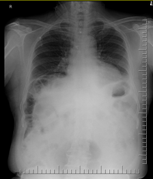 | 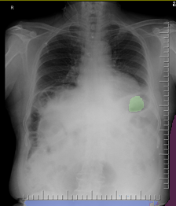 | 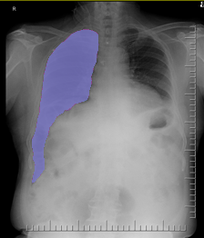 | 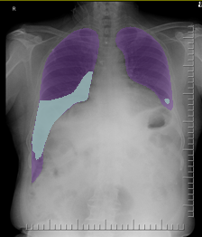 | 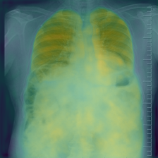 |

- **背景信息：**Age: 50 Gender: Male; One week of cough. Advised for a chest x-ray as the initial investigation.；50 岁男性，咳嗽一周，首先接受胸部 X-ray 检查。
- **原始图片 caption：**

<pre>Interposition of the bowel loop (hepatic flexure of colon) between the right hemidiaphragm and liver.
Normal findings in the chest.</pre>

- **原始图片 caption 翻译：**肠袢（结肠肝曲）位于右侧膈肌与肝脏之间；胸部其余表现正常。

<strong>InternVL3-14B</strong>

**Segmentation 对 caption 的总体影响：**无帮助：前后均未命中参考核心征象

**原始图像 → Single-image caption 回答**

英文原始回答：

<pre>The chest X-ray image presented is from a 50-year-old male patient with a one-week history of cough. The image is a posteroanterior (PA) view of the chest.

### Radiographic Description:
1. **Lung Fields:** 
   - The lung fields appear to have areas of increased opacity. 
   - The lower lung zones, particularly on the right side, show prominence in haziness or consolidation. Both lower lung fields seem to have diffuse airspace opacity, suggestive of a possible interstitial process or fluid accumulation.
   - There is no clear evidence of localized mass or distinct lobar consolidation, though the diffusely hazy appearance is notable.

2. **Cardiac Silhouette:**
   - The cardiac silhouette appears slightly prominent, which could be related to the superimposed pulmonary process.

3. **Diaphragm:**
   - The diaphragms are slightly elevated, which may also suggest underlying pulmonary pathology or mild atelectasis.

4. **Mediastinum and Hilar Regions:**
   - The mediastinal contours appear to be within normal limits without enlargement. The hilar regions do not show lymphadenopathy.

5. **Bones and Soft Tissues:**
   - The bony structures, including the ribs and spine, appear normal without any evident fractures or lesions.
   - Soft tissues do not show any abnormal swelling or fluid accumulation.

### Potential Differential Diagnosis Based on Description:
Given the patient&#x27;s clinical presentation and radiographic findings, several potential diagnoses might be considered:

1. **Pneumonia:**
   - The bilateral interstitial and airspace opacities, along with the patient&#x27;s recent cough, strongly suggest bacterial or viral pneumonia. The distribution and pattern support an atypical or mixed aetiology.

2. **Pulmonary Edema:**
   - The diffuse nature of the lung fields involves both lower lobes, which is characteristic in conditions such as congestive heart failure leading to pulmonary edema.

3. **Interstitial Lung Disease:**
   - While less likely given the acute presentation, idiopathic or secondary interstitial lung diseases might present similarly but usually have chronic patterns.

4. **Chronic Obstructive Pulmonary Disease (COPD) exacerbation:**
   - Acute worsening of COPD can present with similar patterns, especially if complicated by an infection.

### Conclusion:
The combination of patient history and radiographic findings strongly supports a diagnosis of pneumonia. The broad, diffuse nature of the lung changes aligns with both bacterial and atypical pneumonias, considering the age and acute presentation. Further clinical correlation, including sputum analysis, blood tests (inflammatory markers, CRP), and possibly sputum culture or viral studies, would be necessary to confirm the specific etiology. Management should be tailored towards empirical antibiotic therapy while awaiting diagnostic confirmation. If the clinical status does not improve, further imaging or specialist consultation may be required to rule out other differential diagnoses.</pre>

中文医学要点：

<pre>回答提及或最终倾向的诊断包括：肺炎。涉及的主要影像要点包括：膈肌异常或定位、心影异常、肺实变。</pre>

**原始图像 + Segmentation → Single-image caption 回答**

英文原始回答：

<pre>Based on the chest X-ray of the 50-year-old male with a one-week history of cough, there are a few key observations:

1. **Image Analysis:**
   - The image is a posteroanterior (PA) chest X-ray.
   - The lungs appear to show an abnormality with increased opacity, suggesting possible fluid or infection.
   
2. **Segmentation Insights:**
   - Segmentation tools indicate that the lung fields, particularly the right lung, may be obscured, implying potential pathology.
   - The marked areas suggest changes that might represent consolidation, pleural effusion, or other abnormalities typically associated with respiratory conditions.

3. **Clinical Correlation:**
   - Given the patient&#x27;s symptom of chronic cough, potential conditions align with the imaging findings:
     - **Pneumonia:** Increased lung opacity can often be seen due to infection.
     - **Pleural Effusion:** Fluid accumulation in the pleural space can cause increased opacity.
     - **Lung Consolidation:** Often appears as a dense, white area on X-rays due to alveolar filling.

4. **Diagnosis:**
   - The combination of clinical presentation and radiological findings suggest a possible diagnosis of pneumonia. This condition is common in adults presenting with chronic cough, and the X-ray findings such as increased opacity in the lung field support this hypothesis.

Further clinical correlation and possibly additional imaging or microbiological tests may be needed for confirmation and to guide appropriate treatment.</pre>

中文医学要点：

<pre>回答提及或最终倾向的诊断包括：肺炎。涉及的主要影像要点包括：肺实变、肺部致密影。</pre>

**Segmentation 对 caption 的影响分析：**

原始 caption：未命中核心征象；加入 segmentation 后：未命中核心征象。前后都没有覆盖决定性征象；回答即使变长，也不能视为有效的视觉理解增益。该判断以是否接近 Radiopaedia 原始 caption 为准，不依据回答篇幅。

<strong>InternVL3.5-14B</strong>

**Segmentation 对 caption 的总体影响：**无帮助：前后均未命中参考核心征象

**原始图像 → Single-image caption 回答**

英文原始回答：

<pre>&lt;think&gt;
Okay, let&#x27;s see. The patient is a 50-year-old male with a week of cough, and they got a chest X-ray. The image is a posteroanterior view. I need to look for any abnormalities that could explain the cough.

First, looking at the lungs. The right lung seems to have some opacities, especially in the lower zone. There&#x27;s a hazy area that might be a consolidation or maybe pleural effusion. The left lung also has some increased opacity, but it&#x27;s not as pronounced. The heart size looks normal, so probably not cardiomegaly. The diaphragm on the right side is elevated, which could be due to a lower lobe issue or maybe a diaphragmatic hernia, but that&#x27;s less likely. The costophrenic angles are blunted, which might indicate pleural effusion. 

Wait, the right hemidiaphragm is elevated, and there&#x27;s a meniscus sign in the lower right lung field. That&#x27;s classic for pleural effusion. The left side also has some blunting, but maybe a smaller effusion. The mediastinum is central, so no shift, which would happen if there&#x27;s a large tension effusion. 

The patient&#x27;s cough could be due to a lower respiratory infection. If there&#x27;s pleural effusion, maybe a bacterial pneumonia with effusion. The opacities in the lower lobes could be atelectasis from the effusion or actual consolidation. 

Alternatively, could it be pulmonary edema? But the distribution is more unilateral. Maybe a pulmonary embolism, but that usually doesn&#x27;t show up on X-ray unless there&#x27;s a complication like infarction. 

Another thought: the elevated right hemidiaphragm might be due to a subphrenic process, like a liver issue, but the patient&#x27;s presentation is cough, so more likely pulmonary. 

So, the main findings are bilateral pleural effusions, more prominent on the right, with possible lower lobe consolidation or atelectasis. The diagnosis could be community-acquired pneumonia with pleural effusion, or maybe something else like heart failure, but the patient&#x27;s age and presentation make infection more likely. 

Wait, but the heart size is normal, so heart failure might be less likely. The cough for a week could be consistent with bacterial pneumonia. The effusion might be a complication. Alternatively, could it be tuberculosis? But that usually has upper lobe involvement. 

Hmm. The opacities in the lower zones with effusions. Maybe aspiration pneumonia? Especially if the patient has risk factors, but the case doesn&#x27;t mention any. 

So, putting it all together: the X-ray shows bilateral pleural effusions, right greater than left, with possible lower lobe consolidation. The diagnosis is likely pneumonia with associated pleural effusion. The next step would be to check for infection markers, maybe a CT scan if needed, and possibly thoracentesis to analyze the fluid.
&lt;/think&gt;

**Image Description:**  
The posteroanterior chest X-ray reveals the following key findings:  
1. **Bilateral pleural effusions**: More prominent on the right side, evidenced by blunting of the costophrenic angles and a meniscus sign in the right lower hemithorax. The left effusion is smaller but still present.  
2. **Elevated right hemidiaphragm**: Likely secondary to the adjacent pleural effusion or lower lobe pathology.  
3. **Lower lobe opacities**: Hazy consolidations or atelectasis in the right lower lobe, potentially due to infection, effusion, or compressive atelectasis.  
4. **Normal cardiac silhouette**: No cardiomegaly, reducing the likelihood of congestive heart failure as a cause.  
5. **Clear upper lung zones**: No evidence of upper lobe lesions (e.g., tuberculosis).  

**Diagnosis:**  
**Community-acquired pneumonia (CAP) with bilateral pleural effusions**, predominantly on the right.  

**Rationale:**  
- The acute cough and imaging findings (lower lobe opacities + effusions) align with bacterial pneumonia.  
- Pleural effusion may result from direct spread of infection or secondary inflammatory response.  
- Absence of cardiomegaly or pulmonary edema makes heart failure less likely.  
- No radiographic features suggest alternative diagnoses (e.g., pulmonary embolism, malignancy).  

**Next Steps:**  
1. **Thoracentesis**: Analyze pleural fluid (cell count, culture, PCR for pathogens like *Legionella* or *Mycoplasma*).  
2. **Sputum culture/PCR**: Identify causative organism.  
3. **Consider CT chest** if diagnosis remains unclear or if complications (e.g., abscess) are suspected.  
4. **Empirical antibiotic therapy**: Initiate based on local guidelines for CAP.  

This approach addresses the likely infectious etiology while ruling out other differential diagnoses through targeted investigation.</pre>

中文医学要点：

<pre>回答提及或最终倾向的诊断包括：肺栓塞、心力衰竭、肺水肿、心脏增大。涉及的主要影像要点包括：胸膜腔液体、心影异常、肺实变、膈肌异常或定位。</pre>

**原始图像 + Segmentation → Single-image caption 回答**

英文原始回答：

<pre>&lt;think&gt;
Okay, let me try to work through this. The patient is a 50-year-old male with a week of cough, and they got a chest X-ray. The X-ray images show some opacities, especially in the lower right lung. The segmentations highlight areas that might be the lungs, diaphragm, and other structures.

First, looking at the X-ray, the right lower lung area has increased opacity. That could be due to a few things. Since the patient has a cough, maybe a pneumonia? But the opacity is more dense and maybe there&#x27;s a consolidation. Alternatively, could it be a pleural effusion? The diaphragm on the right side might be elevated or obscured, which can happen with fluid. But the segmentation from TorchXRayVision shows lung fields with some yellow areas, which might indicate fluid or consolidation.

Wait, the combined segmentation shows the lungs in yellow, but the lower right lung has a more opaque area. The heart and mediastinum are also segmented, but they look normal in size. The diaphragm on the right side might be elevated, which can happen with a lower lobe issue. If there&#x27;s a consolidation in the lower lobe, that could be bacterial pneumonia. Alternatively, a lung mass or atelectasis. But given the acute presentation (one week of cough), infection is more likely.

The opacification in the lower right lung could be due to pneumonia. The fact that it&#x27;s a posterior-anterior view, and the opacity is more prominent there. Also, the costophrenic angle on the right might be blunted, suggesting a small effusion. But the segmentation from Medical-SAM3 shows a green area in the left lower lung, which might be a different structure, maybe bowel gas? The stomach bubble is visible on the left, which is normal.

So putting it all together: the patient has a lower right lung opacity, possibly pneumonia with possible effusion. The cough for a week fits with an infectious process. No obvious masses or chronic changes. The heart size is normal. So the diagnosis is likely community-acquired pneumonia, right lower lobe. Maybe they need antibiotics and further evaluation if not improving. Alternatively, a CT scan if there&#x27;s concern for something else, but given the X-ray findings and symptoms, pneumonia is the top differential.
&lt;/think&gt;

**Image Description and Diagnosis:**

**Clinical Context:**  
A 50-year-old male presents with a 1-week history of cough. A chest X-ray was performed as the initial investigation.

**Radiographic Findings:**  
1. **Right Lower Lung Opacity:**  
   - The posterior-anterior (PA) chest X-ray shows increased opacity in the right lower lung zone, with possible blunting of the right costophrenic angle. This suggests **consolidation** (e.g., pneumonia) or a **small pleural effusion**.  
   - The opacity obscures the right hemidiaphragm, raising suspicion for lower lobe involvement.  

2. **Segmentation Observations:**  
   - **TorchXRayVision:** Highlights the right lower lung zone in yellow, indicating abnormal density. The left lung appears clearer, with normal diaphragm and cardiac contours.  
   - **Medical-SAM3/BiomedParse:** Segmentation shows a localized opacity in the right lower lung, with no obvious masses or structural abnormalities in the heart or mediastinum.  

3. **Exclusion of Other Pathologies:**  
   - No evidence of pneumothorax, cardiomegaly, or bony abnormalities.  
   - The stomach bubble (left upper quadrant) is normal, ruling out significant bowel gas overlap.  

**Differential Diagnosis:**  
1. **Community-Acquired Pneumonia (CAP):**  
   - Most likely given the acute cough and focal consolidation in the right lower lobe. Streptococcus pneumoniae or viral pathogens are common culprits.  
2. **Atelectasis:**  
   - Less likely due to the acute presentation and prominent opacity.  
3. **Pleural Effusion:**  
   - Possible small effusion contributing to the opacity, but infection remains the primary concern.  

**Recommended Next Steps:**  
- **Clinical Correlation:** Assess for fever, sputum production, or dyspnea.  
- **Treatment:** Empirical antibiotics (e.g., amoxicillin-clavulanate or doxycycline) if pneumonia is confirmed.  
- **Follow-Up:** Consider repeat imaging or CT if symptoms persist or worsen.  

**Conclusion:**  
The chest X-ray findings, combined with the clinical presentation, strongly suggest **right lower lobe pneumonia**. Prompt antimicrobial therapy and monitoring are advised.</pre>

中文医学要点：

<pre>回答提及或最终倾向的诊断包括：肺炎。涉及的主要影像要点包括：肺实变、膈肌异常或定位、肺部致密影。</pre>

**Segmentation 对 caption 的影响分析：**

原始 caption：未命中核心征象；加入 segmentation 后：未命中核心征象。前后都没有覆盖决定性征象；回答即使变长，也不能视为有效的视觉理解增益。该判断以是否接近 Radiopaedia 原始 caption 为准，不依据回答篇幅。

<strong>Lingshu-32B</strong>

**Segmentation 对 caption 的总体影响：**无帮助：前后均未命中参考核心征象

**原始图像 → Single-image caption 回答**

英文原始回答：

<pre>The chest x-ray shows an elevated left hemidiaphragm with a large opacity in the left lower lung field. This opacity is consistent with a pleural effusion or consolidation. The right lung appears clear. Given the patient&#x27;s age and gender, along with the presentation of a one-week cough, the findings suggest a possible pneumonia or pleural effusion. Further clinical correlation and possibly additional imaging or diagnostic tests would be necessary to confirm the diagnosis.</pre>

中文医学要点：

<pre>回答提及或最终倾向的诊断包括：胸腔积液、肺炎。涉及的主要影像要点包括：肺实变、膈肌异常或定位。</pre>

**原始图像 + Segmentation → Single-image caption 回答**

英文原始回答：

<pre>The chest X-ray shows a posteroanterior view with notable findings in the left hemithorax. There is a large area of increased opacity in the left lower zone, which could indicate consolidation or pleural effusion. The left diaphragm appears elevated, suggesting possible atelectasis or volume loss in the left lung. The heart size appears within normal limits, but the mediastinal contours are slightly shifted towards the left, which may be secondary to the volume loss in the left lung. Given the patient&#x27;s presentation with a one-week history of cough, these radiographic findings are suggestive of pneumonia, possibly complicated by parapneumonic effusion or atelectasis. Further clinical correlation and possibly additional imaging or laboratory tests would be necessary to confirm the diagnosis and rule out other potential causes such as tuberculosis or malignancy.</pre>

中文医学要点：

<pre>回答提及或最终倾向的诊断包括：结核病、肺不张、肺炎、胸腔积液。涉及的主要影像要点包括：膈肌异常或定位、肺实变。</pre>

**Segmentation 对 caption 的影响分析：**

原始 caption：未命中核心征象；加入 segmentation 后：未命中核心征象。前后都没有覆盖决定性征象；回答即使变长，也不能视为有效的视觉理解增益。该判断以是否接近 Radiopaedia 原始 caption 为准，不依据回答篇幅。

<strong>MedGemma-27B-IT</strong>

**Segmentation 对 caption 的总体影响：**无帮助：前后均未命中参考核心征象

**原始图像 → Single-image caption 回答**

英文原始回答：

<pre>Here&#x27;s an analysis of the chest X-ray image provided:

**Image Description:**

*   **Modality:** Chest X-ray, Posteroanterior (PA) view.
*   **Overall Appearance:** The image shows the patient&#x27;s chest from the back, with X-rays passing through to create a shadow image on the detector.
*   **Lung Fields:**
    *   The lung fields appear relatively clear bilaterally, without obvious large consolidations, effusions, or pneumothorax.
    *   There is some increased opacity in the lower lung fields, particularly on the right side, which could represent atelectasis, scarring, or early infiltrate.
*   **Heart and Mediastinum:**
    *   The heart size appears within normal limits.
    *   The mediastinal contours (including the trachea, great vessels, and lymph nodes) appear unremarkable.
*   **Bones and Soft Tissues:**
    *   The ribs, clavicles, and thoracic spine appear intact.
    *   The soft tissues of the chest wall appear normal.
*   **Diaphragm:** The diaphragmatic domes are visible and appear relatively normal in position and contour.

**Interpretation and Potential Diagnosis:**

Given the patient&#x27;s presentation of a one-week cough and the findings on the chest X-ray:

1.  **Normal Findings:** The absence of large consolidation, pleural effusion, or pneumothorax makes conditions like typical bacterial pneumonia, significant pleural disease, or pneumothorax less likely as the primary cause of the cough.
2.  **Possible Findings:** The increased opacity in the lower lung fields (especially the right) is a key finding. This could represent:
    *   **Bronchitis:** While X-rays are often normal in bronchitis, sometimes subtle changes like bronchial wall thickening or peribronchial infiltrates can be seen.
    *   **Early Pneumonia:** An early or mild pneumonia might present with patchy infiltrates, which could be subtle.
    *   **Atelectasis:** Collapse of lung tissue, often seen as linear or patchy opacities, especially at the bases.
    *   **Chronic Changes:** Scarring or fibrosis from previous infection or other lung disease.
    *   **Other:** Less likely possibilities include early heart failure (though the heart size is normal) or other interstitial processes.

**Conclusion:**

The chest X-ray shows some increased opacity in the lower lung fields, particularly on the right. While not definitive for a specific diagnosis, this finding warrants further investigation or clinical correlation, especially given the patient&#x27;s cough. The findings are not typical for severe pneumonia or other acute emergencies.

**Disclaimer:** This interpretation is based solely on the provided image and limited clinical information. A definitive diagnosis requires correlation with the patient&#x27;s full clinical history, physical examination findings, and potentially further investigations (like CT scan or sputum analysis).</pre>

中文医学要点：

<pre>回答提及或最终倾向的诊断包括：肺炎。涉及的主要影像要点包括：肺实变、膈肌异常或定位。</pre>

**原始图像 + Segmentation → Single-image caption 回答**

英文原始回答：

<pre>**Image Description:**

The image is a posteroanterior (PA) chest X-ray of a 50-year-old male. The image shows the standard anatomical structures of the chest, including the lungs, heart, mediastinum, diaphragm, and ribs.

*   **Lungs:** The lung fields appear relatively clear bilaterally, although there is some increased opacity in the lower lobes, particularly on the right side.
*   **Heart:** The cardiac silhouette appears to be within normal limits in size and shape.
*   **Mediastinum:** The mediastinal structures appear unremarkable.
*   **Diaphragm:** The diaphragmatic domes are visible and appear relatively well-defined.
*   **Bones:** The ribs and clavicles are visible and appear intact.

**Segmentations:**

*   **Medical-SAM2:** Highlights the liver (green).
*   **Medical-SAM3:** Segments the left lung (blue).
*   **BiomedParse:** Segments the lungs (purple), left lung (light purple), right lung (light purple), diaphragm (light purple), heart (light purple), stomach (light purple).
*   **TorchXRayVision:** Segments the lungs (yellow), diaphragm (green), heart (green), cardiomediastinum (green), upper mediastinum (green), lower mediastinum (green), stomach (green).

**Clinical Context:**

The patient is a 50-year-old male presenting with a one-week history of cough. A chest X-ray was ordered as the initial investigation.

**Interpretation and Potential Diagnosis:**

The chest X-ray shows increased opacity in the lower lung fields, particularly on the right side. This finding, in the context of a one-week cough, could suggest several possibilities:

1.  **Pneumonia:** This is a common cause of cough and would present as consolidation or infiltrates on a chest X-ray. The increased opacity in the lower lobes could represent pneumonia.
2.  **Bronchitis:** While bronchitis primarily affects the airways, it can sometimes cause subtle changes on a chest X-ray, although often the X-ray is normal.
3.  **Other Infections:** Less common infections could also cause similar findings.
4.  **Atelectasis:** Collapse of lung tissue can appear as increased opacity.
5.  **Fluid Overload/Pulmonary Edema:** Can cause increased interstitial markings or alveolar edema, appearing as opacities.
6.  **Tumor/Mass:** Although less likely with a one-week history, a mass could present as an opacity.

**Conclusion:**

The chest X-ray shows increased opacity in the lower lung fields, particularly on the right side. Given the patient&#x27;s presentation with a one-week cough, the most likely diagnosis based solely on this image is **pneumonia**. However, further clinical evaluation, including patient history, physical examination, and potentially other tests (like sputum culture or CT scan), would be necessary to confirm the diagnosis and determine the specific cause.</pre>

中文医学要点：

<pre>回答提及或最终倾向的诊断包括：肺炎。涉及的主要影像要点包括：肺实变、膈肌异常或定位、心影异常。</pre>

**Segmentation 对 caption 的影响分析：**

原始 caption：未命中核心征象；加入 segmentation 后：未命中核心征象。前后都没有覆盖决定性征象；回答即使变长，也不能视为有效的视觉理解增益。该判断以是否接近 Radiopaedia 原始 caption 为准，不依据回答篇幅。

<strong>MedMO-8B</strong>

**Segmentation 对 caption 的总体影响：**负面：始终未识别膈下结肠袢

**原始图像 → Single-image caption 回答**

英文原始回答：

<pre>The heart is normal in size. There is a large right upper lobe consolidation. There is a small left pleural effusion.</pre>

中文要点翻译：

<pre>心脏大小正常；右上肺大片实变；左侧少量胸腔积液。</pre>

**原始图像 + Segmentation → Single-image caption 回答**

英文原始回答：

<pre>The patient is a 50-year-old male with a one-week history of cough. Chest X-ray shows a large amount of fluid in the right lung.</pre>

中文要点翻译：

<pre>右肺内有大量液体。</pre>

**对模型图片 caption 能力及 Segmentation 影响的分析：**

原图和 segmentation 增强 caption 都把注意力放在肺野或胸腔液体上，没有识别右膈肌与肝脏之间带有结肠袋结构的肠袢。加入 lung、diaphragm、bowel 等 mask 后反而生成“右肺大量液体”，说明解剖分区提示未转化为正确的膈下关系理解。

<strong>Qwen3-VL-4B</strong>

**Segmentation 对 caption 的总体影响：**无帮助：前后均未命中参考核心征象

**原始图像 → Single-image caption 回答**

英文原始回答：

<pre>**Image Description:**

This is a posteroanterior (PA) chest radiograph of a 50-year-old male. The image shows the thoracic cavity with the heart, lungs, ribs, and diaphragm visible. The lung fields appear symmetrically aerated, with no obvious focal consolidation, infiltrates, or nodules. The bronchovascular markings are within normal limits, and there is no evidence of pleural effusion or pneumothorax. The diaphragm is well-defined and positioned normally. The cardiac silhouette is of normal size and shape, and the trachea is midline. There is no evidence of acute pulmonary pathology such as pneumonia, tuberculosis, or malignancy on this image.

**Diagnosis:**

**Normal Chest X-ray**

The chest X-ray is unremarkable and consistent with a healthy thoracic cavity. Given the patient’s presentation of a one-week cough, this finding suggests that the cough may be due to a non-acute, non-infectious, or self-limiting cause such as:

- **Post-nasal drip or chronic sinusitis** (common in older adults)
- **Gastroesophageal reflux disease (GERD)** — which can cause chronic cough
- **Environmental irritants or allergies**
- **Bronchitis (acute or chronic)**
- **Idiopathic cough**

No acute or structural pathology is visible on this image, and the patient may require further evaluation (e.g., spirometry, sputum analysis, or referral to ENT or pulmonology) to determine the underlying cause of the cough.

**Recommendation:**

Follow-up with clinical assessment and possibly a sputum test or bronchoscopy if symptoms persist or worsen. Consider a repeat imaging if symptoms do not resolve or if new findings develop.</pre>

中文医学要点：

<pre>回答提及或最终倾向的诊断包括：胃食管反流病、胸部未见明显异常。涉及的主要影像要点包括：心影异常、膈肌异常或定位、肺实变。</pre>

**原始图像 + Segmentation → Single-image caption 回答**

英文原始回答：

<pre>Based on the patient’s presentation (50-year-old male with a one-week history of cough) and the provided chest X-ray (posteroanterior view), the image demonstrates a **diffuse, bilateral, symmetrically distributed opacity** primarily in the **lower lung zones**, with a **prominent central mediastinal shadow**.

### Key Observations:
- **Lung Fields**: The lungs show **diffuse opacification**, particularly in the **lower lobes**, which is consistent with **interstitial or alveolar infiltrates**. The opacities are **not localized** to a single lobe or segment, suggesting a **widespread process**.
- **Mediastinum**: There is **significant widening of the mediastinum**, which is a **key feature**. This is likely due to **inflammatory or infectious processes** causing **mediastinal shift** or **lymphadenopathy**.
- **Diaphragm**: The diaphragm appears **elevated** and **blurred**, which is consistent with **pleural effusion or fluid accumulation**.
- **Heart**: The heart is **not clearly visible** due to the **opacity** in the mediastinum and lung fields, but the **cardiomediastinum** is **not enlarged**.
- **Bowel**: The bowel is **not visible** due to the **opacity** in the mediastinum and lung fields.

### Differential Diagnosis:
1. **Pneumonia**: The **diffuse, bilateral opacities** are consistent with **pneumonia**, especially if it is **community-acquired**.
2. **Pulmonary edema**: The **diffuse, bilateral opacities** are also consistent with **pulmonary edema**, especially if it is **acute**.
3. **Lung cancer**: The **diffuse, bilateral opacities** are not consistent with **lung cancer**, which typically presents with **localized opacities**.
4. **Pneumothorax**: The **diffuse, bilateral opacities** are not consistent with **pneumothorax**, which typically presents with **localized opacities**.
5. **Pleural effusion**: The **diffuse, bilateral opacities** are not consistent with **pleural effusion**, which typically presents with **localized opacities**.

### Conclusion:
The most likely diagnosis is **pneumonia**, given the **diffuse, bilateral opacities** and **mediastinal widening**. The **elevated diaphragm** suggests **pleural effusion or fluid accumulation**, which is common in **pneumonia**. The **mediastinal widening** is likely due to **inflammatory or infectious processes** causing **mediastinal shift** or **lymphadenopathy**.

### Recommendation:
The patient should be **advised for further investigations**, including **blood tests**, **sputum culture**, and **CT scan of the chest** to confirm the diagnosis and rule out other conditions.

### Final Diagnosis:
**Pneumonia** (likely community-acquired) with **mediastinal widening** and **pleural effusion**.

---

**Note**: The **mediastinal widening** is a **key feature** and suggests **inflammatory or infectious processes**. The **diffuse, bilateral opacities** are consistent with **pneumonia**. The **elevated diaphragm** suggests **pleural effusion or fluid accumulation**, which is common in **pneumonia**. The **mediastinal widening** is likely due to **inflammatory or infectious processes** causing **mediastinal shift** or **lymphadenopathy**.

---

**Final Diagnosis**:
**Pneumonia** (likely community-acquired) with **mediastinal widening** and **pleural effusion**.</pre>

中文医学要点：

<pre>回答提及或最终倾向的诊断包括：胸腔积液、肺炎。涉及的主要影像要点包括：纵隔移位、膈肌异常或定位。</pre>

**Segmentation 对 caption 的影响分析：**

原始 caption：未命中核心征象；加入 segmentation 后：未命中核心征象。前后都没有覆盖决定性征象；回答即使变长，也不能视为有效的视觉理解增益。该判断以是否接近 Radiopaedia 原始 caption 为准，不依据回答篇幅。

<strong>Qwen3-VL-8B</strong>

**Segmentation 对 caption 的总体影响：**无帮助：前后均未命中参考核心征象

**原始图像 → Single-image caption 回答**

英文原始回答：

<pre>Based on the provided chest X-ray (posteroanterior view) and the patient’s presentation (50-year-old male with a 1-week history of cough), here is the description and diagnosis:

**Image Description:**
- The chest X-ray shows a **large, dense opacity in the right lower lung field**, which appears to be **homogeneous and well-defined**, occupying the central and lateral aspects of the right lower lobe.
- The opacity **obliterates the right costophrenic angle** and **displaces the right heart border** medially.
- There is **no evidence of pleural effusion** or pneumothorax.
- The **left lung field appears clear**, with no consolidation, infiltrates, or abnormal shadows.
- The **mediastinum is centrally located**, and the **cardiac silhouette is normal in size**.
- The **diaphragm on the left side is intact and well-defined**.
- The **bony thorax and ribs appear intact**, with no fractures or deformities.

**Diagnosis:**
The most likely diagnosis is **right lower lobe consolidation**, which is consistent with **pneumonia**.

**Rationale:**
- The patient is a 50-year-old male with a **new-onset cough**, which is a common presentation of pneumonia.
- The X-ray shows a **homogeneous consolidation** in the right lower lobe, which is the classic radiographic appearance of bacterial pneumonia.
- The consolidation is **not associated with pleural effusion or cavitation**, which helps differentiate it from other causes such as lung abscess or TB.
- The absence of infiltrates in the left lung and normal cardiac silhouette suggests a **localized process** rather than a systemic or diffuse disease.

**Next Steps:**
- **Clinical correlation** with other symptoms (fever, sputum production, dyspnea) is needed.
- **Sputum culture** and **blood cultures** should be obtained to identify the causative organism.
- **Empirical antibiotic therapy** should be initiated, such as amoxicillin-clavulanate or a respiratory fluoroquinolone, pending culture results.
- **Follow-up chest X-ray** in 48–72 hours is recommended to assess response to treatment.

**Note:** While this is the most likely diagnosis, other possibilities such as **lung cancer** or **infarction** should be considered, especially if the patient has risk factors (e.g., smoking, prior malignancy). However, given the acute presentation and the appearance of consolidation, pneumonia is the most likely cause.

---

**Disclaimer:** This interpretation is based on the provided image and patient data. A definitive diagnosis requires clinical correlation, additional investigations, and possibly further imaging or laboratory tests.</pre>

中文医学要点：

<pre>回答提及或最终倾向的诊断包括：肺炎、肺癌。涉及的主要影像要点包括：肺实变、心影异常、膈肌异常或定位。</pre>

**原始图像 + Segmentation → Single-image caption 回答**

英文原始回答：

<pre>Based on the provided chest X-ray and patient data (50-year-old male, 1-week history of cough), here is the analysis:

**Image Description:**

This is a posteroanterior (PA) chest X-ray. The image shows a significant amount of opacity in the right lower lung field, which appears as a dense, ill-defined area that obscures the underlying lung parenchyma and the right diaphragm. This opacity extends from the right lower lung zone into the right hemidiaphragm and possibly the right costophrenic angle. The left lung appears relatively clear, although there is some mild haziness in the left lower lung zone. The heart size appears within normal limits, and the bony thorax is intact.

**Diagnosis:**

The most likely diagnosis is **right lower lobe pneumonia**.

**Rationale:**

1.  **Clinical Context:** A 50-year-old male with a 1-week history of cough is a classic presentation for pneumonia, especially if the cough is productive or associated with fever or malaise (though not mentioned here). Pneumonia is a common cause of acute cough in adults.

2.  **Imaging Findings:**
    *   **Right Lower Lobe Opacity:** The dense, ill-defined opacity in the right lower lung field is the most significant finding. This is the classic radiographic appearance of consolidation, which is the hallmark of bacterial pneumonia. The opacity involves the lung parenchyma and extends to the diaphragm, indicating it is likely a lobar consolidation.
    *   **Location:** The consolidation is confined to the right lower lobe, which is a common site for pneumonia.
    *   **Lack of Other Findings:** There is no significant pleural effusion, no obvious mass, and no significant cardiomegaly or other abnormalities that would suggest other diagnoses like heart failure or malignancy.

3.  **Supporting Segmentation:**
    *   The Medical-SAM2 segmentation highlights a focal area of increased density in the right lower lung, consistent with the consolidation.
    *   The BiomedParse segmentation clearly delineates the right lung, showing the opacity within its boundaries.
    *   The TorchXRayVision segmentation further confirms the location within the right lung and highlights the consolidation.

**Conclusion:**

The chest X-ray shows a right lower lobe consolidation, which is highly suggestive of pneumonia in a patient with a compatible clinical presentation. The diagnosis is **right lower lobe pneumonia**. Further evaluation with a sputum culture or blood work may be needed to identify the causative organism, but the imaging findings are diagnostic of pneumonia.

**Note:** While the image is clear, it is important to note that a definitive diagnosis of pneumonia requires clinical correlation. Other causes of consolidation, such as pulmonary embolism or tumor, can also present similarly, but pneumonia is the most likely diagnosis given the patient&#x27;s age and symptoms.</pre>

中文医学要点：

<pre>回答提及或最终倾向的诊断包括：肺炎、肺栓塞、心力衰竭、心脏增大。涉及的主要影像要点包括：肺实变、膈肌异常或定位。</pre>

**Segmentation 对 caption 的影响分析：**

原始 caption：未命中核心征象；加入 segmentation 后：未命中核心征象。前后都没有覆盖决定性征象；回答即使变长，也不能视为有效的视觉理解增益。该判断以是否接近 Radiopaedia 原始 caption 为准，不依据回答篇幅。

<strong>Qwen3-VL-32B</strong>

**Segmentation 对 caption 的总体影响：**无帮助：前后均未命中参考核心征象

**原始图像 → Single-image caption 回答**

英文原始回答：

<pre>**Image Description:**

This is a posteroanterior (PA) chest X-ray of a 50-year-old male presenting with a one-week history of cough. The image shows the following key findings:

- **Lung Fields:** The right lung appears relatively clear, with normal aeration and visible vascular markings. The left lung, however, demonstrates **increased opacities** in the **left lower zone**, particularly in the **left lower lobe**. There is a **homogeneous, dense opacity** that obscures the left hemidiaphragm and the left cardiac border, suggesting a **consolidation** or **mass** in that region.

- **Cardiomediastinal Silhouette:** The heart is centrally located, and the right cardiac border is visible. The left cardiac border is **obscured** due to the opacity in the left lower lung zone.

- **Diaphragm:** The **right hemidiaphragm is well-defined**, while the **left hemidiaphragm is not clearly visualized**, consistent with the overlying opacity.

- **Costophrenic Angles:** The **right costophrenic angle is sharp and clear**, but the **left costophrenic angle is blunted or obscured** by the same opacity.

- **Trachea and Mediastinum:** The trachea is midline, and there is no evident mediastinal shift.

- **Bones and Soft Tissues:** No obvious fractures or rib abnormalities are seen. The soft tissues appear unremarkable.

---

**Interpretation and Diagnosis:**

The radiographic findings are most consistent with **left lower lobe consolidation**, which is likely due to **pneumonia** (community-acquired pneumonia). The patient’s presenting symptom of a one-week cough supports this diagnosis.

Other differential diagnoses to consider include:
- **Lung abscess** (if there is a cavity or air-fluid level — not clearly seen here)
- **Lung malignancy** (especially in a 50-year-old male, who may have a smoking history — though not mentioned)
- **Atelectasis** (but the opacity is dense and homogeneous, more typical of consolidation than collapse)

However, given the acute presentation and absence of mass-like features, **pneumonia is the most likely diagnosis**.

---

**Recommendation:**

- **Clinical correlation** is essential: assess for fever, sputum production, dyspnea, and risk factors (e.g., smoking, comorbidities).
- **Further workup** may include:
  - Sputum culture and Gram stain
  - Blood tests (CBC, CRP, procalcitonin)
  - Consider CT chest if diagnosis is uncertain or if there is no clinical improvement with antibiotics.
  - Consider HIV or tuberculosis screening if risk factors are present.

---

**Final Diagnosis:**

**Left lower lobe consolidation, likely due to pneumonia.**

**Clinical Action:** Initiate appropriate antibiotic therapy based on local guidelines and clinical context, and monitor for response.</pre>

中文医学要点：

<pre>回答提及或最终倾向的诊断包括：肺炎。涉及的主要影像要点包括：肺实变、纵隔移位、膈肌异常或定位。</pre>

**原始图像 + Segmentation → Single-image caption 回答**

英文原始回答：

<pre>Based on the provided chest X-ray (posteroanterior view) and the patient’s clinical presentation (50-year-old male with one week of cough), here is a detailed description and diagnosis:

---

### **Image Description:**

The chest X-ray shows:

- **Right hemithorax:** The right lung field appears **markedly hyperlucent** with **loss of lung markings** in the lower and middle zones, consistent with **volume loss or collapse**. The right hemidiaphragm is **elevated**, and the **right cardiac border is obscured**, suggesting **right lower lobe atelectasis**.
  
- **Left hemithorax:** The left lung appears **relatively normal** in volume and aeration, with visible vascular markings extending to the periphery. The left hemidiaphragm is at a normal level.

- **Mediastinum:** There is **mediastinal shift to the right**, which is a classic sign of **volume loss in the right lung** (e.g., atelectasis). The trachea is deviated to the right.

- **Diaphragm:** The right hemidiaphragm is elevated, further supporting volume loss on the right.

- **Heart:** The cardiac silhouette appears normal in size, though partially obscured on the right side due to the overlying atelectasis.

- **Bowel gas:** There is some bowel gas visible in the lower abdomen, which is normal.

---

### **Segmentation Analysis:**

- **Medical-SAM2** (green segmentation): Highlights a small area in the left lower lung zone — possibly a nodule or area of consolidation, but given the clinical context, this is likely **not the primary pathology**. The main abnormality is on the right.

- **Medical-SAM3** (purple segmentation): Shows only the right lung — which is **undersegmented** or misclassified, missing the left lung. This may be due to the atelectasis obscuring normal lung anatomy.

- **BiomedParse** (purple = lungs, teal = bowel/stomach): Better segmentation — both lungs are identified, though the right lung appears **smaller and denser**, consistent with atelectasis.

- **TorchXRayVision** (colored overlay): Shows lung fields in yellow/green — again, the right lung appears **denser and smaller**, with a shift in mediastinal structures.

---

### **Clinical Correlation:**

The patient is a 50-year-old male with a **one-week history of cough**. The radiographic findings are **highly suggestive of right lower lobe atelectasis**, likely due to:

- **Obstructive causes** (e.g., mucus plug, bronchial tumor, foreign body)
- **Post-inflammatory or post-infectious collapse**
- **Chronic bronchitis or COPD exacerbation**

Given the age and symptom duration, **malignancy should be considered**, especially if the atelectasis is persistent or associated with weight loss, hemoptysis, or smoking history (not provided here).

---

### **Diagnosis:**

&gt; **Right lower lobe atelectasis with mediastinal shift to the right.**

---

### **Recommendations:**

1. **Further imaging**: A **CT chest with contrast** is recommended to better characterize the atelectasis, identify any underlying mass, bronchial obstruction, or other pathology.
2. **Clinical workup**: Assess for smoking history, recent infections, or symptoms of malignancy (e.g., weight loss, hemoptysis, dyspnea).
3. **Pulmonary function tests** if chronic obstructive lung disease is suspected.
4. **Sputum analysis or bronchoscopy** if infection or obstruction is suspected.

---

### **Conclusion:**

The chest X-ray demonstrates **right lower lobe atelectasis** with associated **mediastinal shift**. While this may be due to a benign cause (e.g., mucus plug or infection), **malignancy must be ruled out** in a 50-year-old male with persistent cough. Further evaluation with CT chest is strongly advised.

--- 

**Note**: The segmentation outputs from various models (Medical-SAM2, Medical-SAM3, BiomedParse, TorchXRayVision) support the radiographic findings — particularly the volume loss and density changes in the right lung — though some models have limitations in segmentation accuracy in the presence of atelectasis.</pre>

中文医学要点：

<pre>回答提及或最终倾向的诊断包括：肺不张。涉及的主要影像要点包括：纵隔移位、肺实变、心影异常、膈肌异常或定位。</pre>

**Segmentation 对 caption 的影响分析：**

原始 caption：未命中核心征象；加入 segmentation 后：未命中核心征象。前后都没有覆盖决定性征象；回答即使变长，也不能视为有效的视觉理解增益。该判断以是否接近 Radiopaedia 原始 caption 为准，不依据回答篇幅。

### 2.4 [Choroid plexus cyst - antenatal](https://radiopaedia.org/cases/choroid-plexus-cyst-antenatal?lang=us) (`choroid-plexus-cyst-antenatal`)

| Original image | Medical-SAM2 | Medical-SAM3: fetal brain, choroid plexus, lateral ventricle | BiomedParse v1: fetal brain, choroid plexus, lateral ventricle |
|---|---|---|---|
| 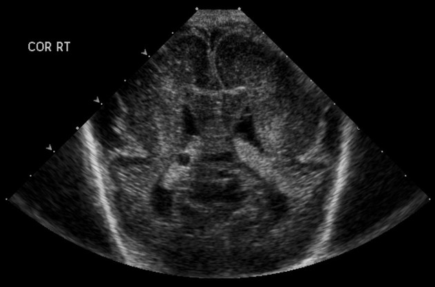 | 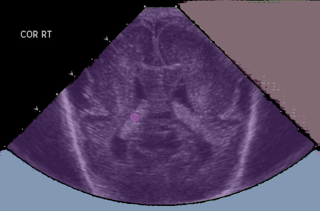 | 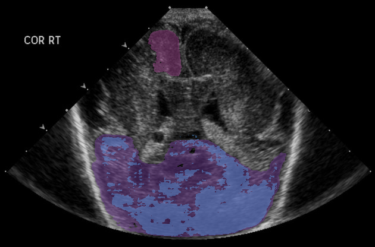 | 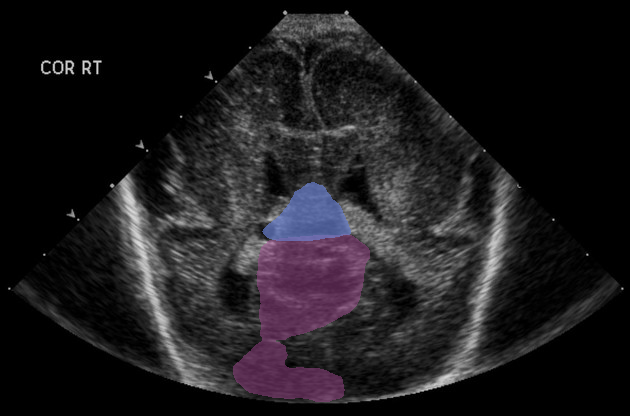 |

- **背景信息：**Age: 26 weeks gestation Gender: Female; Routine evaluation.；孕 26 周女性，常规检查。
- **原始图片 caption：**

<pre>Small right choroid plexus cyst in an otherwise normal neonate.</pre>

- **原始图片 caption 翻译：**胎儿其余表现正常，仅见右侧小脉络丛囊肿。

<strong>InternVL3-14B</strong>

**Segmentation 对 caption 的总体影响：**无帮助：前后均未命中参考核心征象

**原始图像 → Single-image caption 回答**

英文原始回答：

<pre>This ultrasound image is from a routine evaluation at 26 weeks of gestation for a female fetus. The image appears to be a coronal section of the fetal anatomy, marked with &quot;COR RT,&quot; which suggests a coronal view on the right side.

### Image Description
- **Orientation:** The image is in a coronal plane, indicating it&#x27;s a vertical slice from front to back.
- **Central Structure:** In the center of the image, there appears to be a large, hyperechoic (bright) structure with surrounding anechoic (dark) areas. This may represent the heart or part of the placenta.
- **Surrounding Areas:** The structures surrounding the central area are varied in echogenicity, showing mixed dark and light areas, which is typical for complex fetal anatomy.
- **Additional Markers:** The presence of labeled text (COR RT) helps in orientating the plane of the section.

### Analysis
To diagnose any condition depicted in the ultrasound:
1. **Heart:** The central bright structure may represent the heart. Ultrasound markers like echogenic intracardiac material can indicate anomalies such as persistent left superior vena cava or other congenital heart defects.
2. **Placenta:** If the structure is part of the placenta, it could suggest placental abnormality.
3. **Other Organs:** Other fetal structures could potentially be visualized. The mixed echogenicities might represent areas of different tissue types or fluids.

### Potential Diagnosis
Given that the image appears to be focusing on a central bright area, possible diagnoses might include:
- **Echogenic Intracardiac Focus (EIF):** A bright spot within the heart tissue, often benign, but further evaluation might be required.
- **Echogenic Fetal Bowel Syndrome:** Brightness within the bowel can sometimes relate to meconium plug or other gastrointestinal considerations.
- **Placental Choroid Plexus Echogenicity:** If the central structure is part of the placenta, increased echogenicity might indicate a physiological variation.

### Conclusion
Without additional views or clinical correlation, precise diagnosis can be challenging, but the image shows significant echogenic areas that warrant further investigation. If a central cardiac echogenic focus is present, a follow-up echocardiogram could be beneficial. Additionally, correlation with other modalities or sequences of the ultrasound can help establish a definitive diagnosis. For instance:
- **Detailed Fetal Cardiac Ultrasound:** To confirm any cardiac structure anomalies.
- **Placental Assessment:** To ensure normal placental thickness and vascularity if the structure is in the placenta region.
- **Serial Imaging:** To monitor any changes over time if initial findings are inconclusive.

This general approach ensures thorough assessment while the pregnancy progresses, providing necessary reassurance or actionable insights for potential anomalies.</pre>

中文医学要点：

<pre>回答未形成可稳定提取的明确疾病结论。涉及的主要影像要点包括：脉络丛异常。</pre>

**原始图像 + Segmentation → Single-image caption 回答**

英文原始回答：

<pre># Description:

The image provided is an ultrasound scan of a 26-week gestation fetus. The orientation is coronal (COR) on the right side (RT). The scan displays the fetal brain as segmented by various medical models, indicating structures such as the choroid plexus and lateral ventricle. 

## Image Observations:
1. **Segmentation Marks**: 
   - The ultrasound image shows different color-coded segments which likely represent parts of the fetal brain, including the choroid plexus and lateral ventricle.
   - Two models specifically label the choroid plexus (purple areas) and lateral ventricle (blue areas).

2. **Coronal View**:
   - The image orientation is a coronal (COR) view, which shows a vertical slicing of the brain.
   - The labels and orientation markers (&quot;COR RT&quot;) help in identifying the anatomical positioning.

### Features of the Segmentation:
- **Purple Areas**: These likely represent the choroid plexus, which is a structure in the ventricles of the brain responsible for producing cerebrospinal fluid (CSF). 
- **Blue Areas**: These areas likely represent the lateral ventricle, a major structure within the brain filled with CSF.

# Diagnosis and Implications:

**Normal Development Observation**:
- Given the gestational age and the provided visual data, the segmentation appears to delineate expected anatomical features.
- Structures such as the choroid plexus and lateral ventricle are crucial in fetal brain development and function.

**Potential Concerns (if any)**:
- It is crucial to assess the size and shape of the lateral ventricles and the distribution of the choroid plexus to ensure there are no anomalies such as ventriculomegaly (enlargement of ventricles) or other developmental irregularities.
- The provided segments and color-coding do not show any immediate signs of abnormality, but a detailed, expert evaluation is necessary for accurate interpretation and confirmation.

### Conclusion:
Based on the provided ultrasound images and segments, there is no evident deviation from normal anatomical features at 26 weeks gestation. However, a comprehensive and professional analysis by a medical practitioner specializing in prenatal imaging should be conducted to confirm the healthy development of these structures and rule out any potential abnormalities.

The normal development of the choroid plexus and lateral ventricles, at this stage, contributes to the overall healthy brain development in the fetus. Any deviations from the norm would generally require further investigation and monitoring.</pre>

中文医学要点：

<pre>回答提及或最终倾向的诊断包括：脑室扩大。涉及的主要影像要点包括：脉络丛异常、脑室扩大。</pre>

**Segmentation 对 caption 的影响分析：**

原始 caption：未命中核心征象；加入 segmentation 后：未命中核心征象。前后都没有覆盖决定性征象；回答即使变长，也不能视为有效的视觉理解增益。该判断以是否接近 Radiopaedia 原始 caption 为准，不依据回答篇幅。

<strong>InternVL3.5-14B</strong>

**Segmentation 对 caption 的总体影响：**无帮助：前后均未命中参考核心征象

**原始图像 → Single-image caption 回答**

英文原始回答：

<pre>&lt;think&gt;
The image provided is an ultrasound scan labeled &quot;COR RT,&quot; indicating a coronal view of the right side of the patient. Given the patient&#x27;s gestational age of 26 weeks, this ultrasound is likely a fetal scan. 

**Step 1: Identify Key Structures**
In a coronal view of a fetal brain, key structures to look for include the lateral ventricles, thalamus, and brain parenchyma. The lateral ventricles should be symmetric and of normal size. The thalamus is a midline structure, and the brain parenchyma should appear homogeneous without any focal lesions.

**Step 2: Assess Ventricular Size**
The lateral ventricles appear prominent. At 26 weeks gestation, the normal head circumference and ventricular size are developing, but significant enlargement could indicate ventriculomegaly. Ventriculomegaly is defined as an enlargement of the lateral ventricles, which can be primary (due to obstruction) or secondary (due to brain atrophy).

**Step 3: Evaluate Thalamic Position and Shape**
The thalamus should be well-defined and symmetric. If the thalami are close together, it might suggest a small head circumference or other anomalies. In this image, the thalami appear to be in close proximity, which could be a sign of microcephaly or other developmental issues.

**Step 4: Look for Cystic Lesions or Masses**
The image does not show obvious cystic lesions or masses, which are common in conditions like Dandy-Walker syndrome or arachnoid cysts. However, the absence of such findings does not rule out all abnormalities.

**Step 5: Consider Other Anomalies**
The image should be checked for any signs of agenesis of the corpus callosum, which would show a lack of the midline structure connecting the two hemispheres. The corpus callosum appears to be present, but its integrity cannot be fully assessed in a single coronal view.

**Step 6: Correlate with Gestational Age**
At 26 weeks, the fetal brain is still developing, and some structures may not be fully formed. The size and development of the ventricles and brain parenchyma should be compared to standard growth charts for this gestational age.

**Step 7: Differential Diagnosis**
- **Ventriculomegaly:** If the ventricles are enlarged, this could be due to obstruction (e.g., aqueductal stenosis) or atrophy (e.g., due to infection or genetic conditions).
- **Microcephaly:** If the head circumference is small, it could indicate various genetic or environmental factors.
- **Normal Variation:** Some variation in ventricular size and thalamic position can be normal at this gestational age.

**Conclusion:**
The ultrasound shows prominent lateral ventricles and close-set thalami. This could indicate ventriculomegaly or microcephaly. Further evaluation with additional views (axial, sagittal) and correlation with other measurements (head circumference, biparietal diameter) would be necessary for a definitive diagnosis. Genetic testing and follow-up ultrasounds may also be recommended to monitor development and identify any associated anomalies.
&lt;/think&gt;

**Diagnosis:**

Based on the ultrasound image of a 26-week gestation female fetus, the following observations and potential diagnoses can be considered:

1. **Prominent Lateral Ventricles:**
   - The lateral ventricles appear enlarged, which may suggest **ventriculomegaly**. Ventriculomegaly can be primary (due to obstruction, such as aqueductal stenosis) or secondary (due to brain atrophy from various causes, including infection or genetic conditions).

2. **Close-Set Thalami:**
   - The proximity of the thalami may indicate a small head circumference, potentially pointing towards **microcephaly**. Microcephaly can result from genetic abnormalities, environmental factors, or infections during pregnancy.

3. **Normal Development Considerations:**
   - At 26 weeks, the fetal brain is still developing, and some anatomical variations can be normal. However, significant deviations from expected growth patterns warrant further investigation.

**Recommended Next Steps:**

- **Additional Ultrasound Views:** Obtain axial and sagittal views to better assess ventricular size, brain parenchyma, and other midline structures.
- **Measurements:** Compare head circumference, biparietal diameter, and ventricular measurements against standard growth charts for gestational age.
- **Genetic Counseling and Testing:** Consider genetic testing to identify potential chromosomal abnormalities or genetic syndromes.
- **Follow-Up Imaging:** Schedule follow-up ultrasounds to monitor the progression of ventricular size and overall brain development.
- **Clinical Correlation:** Assess maternal history for potential risk factors, such as infections, exposure to toxins, or genetic predispositions.

**Conclusion:**

The ultrasound findings suggest possible ventriculomegaly and microcephaly. Further diagnostic workup and close monitoring are essential to determine the underlying cause and appropriate management plan. Collaboration with a maternal-fetal medicine specialist and a pediatric neurologist may be beneficial for comprehensive care.</pre>

中文医学要点：

<pre>回答提及或最终倾向的诊断包括：脑室扩大。涉及的主要影像要点包括：脑室扩大、胼胝体改变。</pre>

**原始图像 + Segmentation → Single-image caption 回答**

英文原始回答：

<pre>&lt;think&gt;
Okay, let&#x27;s see. The patient is 26 weeks gestation, female, routine evaluation. The ultrasound image provided is a coronal view of the fetal brain. The segmentation images highlight different structures: the fetal brain, choroid plexus, and lateral ventricles.

First, I need to recall what a normal fetal brain ultrasound looks like at 26 weeks. At this stage, the brain structures should be well-developed. The lateral ventricles are usually not dilated; they might be around 4-5 mm in diameter. The choroid plexus is visible and should appear as a hyperechoic (bright) area within the ventricles.

Looking at the segmented images, the lateral ventricles are marked in blue. If they&#x27;re enlarged, that could indicate ventriculomegaly. The choroid plexus is in purple. If it&#x27;s prominent or there are multiple areas, that might be normal, but if it&#x27;s unusually large, could there be an issue? The brain parenchyma is the surrounding area.

In the third segmentation (BiomedParse), the lateral ventricles are blue, choroid plexus purple, and brain in another color. If the ventricles are larger than normal, that&#x27;s a red flag. Ventriculomegaly can be associated with various conditions, maybe chromosomal abnormalities, infections, or genetic disorders. But at 26 weeks, sometimes mild ventriculomegaly can be normal and resolve later.

The choroid plexus segmentation: if it&#x27;s thickened or there are multiple cysts, that might suggest something like congenital cytomegalovirus infection, but usually, that presents with other signs. Alternatively, Dandy-Walker variant, but that typically has posterior fossa abnormalities.

The brain segmentation in purple—if there&#x27;s asymmetry or abnormal shape, that could indicate structural issues. But in a routine exam, they might just be assessing for standard measurements.

Given the information, if the lateral ventricles are within normal limits, the choroid plexus normal, and the brain structures symmetrical, then the diagnosis would be normal. However, if there&#x27;s ventriculomegaly or other abnormalities, further investigation would be needed.

Since the presentation is routine, maybe there&#x27;s a finding that&#x27;s not immediately obvious. The user provided segmented images but didn&#x27;t mention measurements. If the ventricles are normal, then the diagnosis is normal. If enlarged, then possible ventriculomegaly. But without specific measurements, it&#x27;s hard to say. However, the segmentation might show the ventricles as not overly dilated. Also, the choroid plexus size—if it&#x27;s normal, then less likely an infection.

In conclusion, if all structures are within normal ranges, the diagnosis would be a normal fetal brain ultrasound. If there are abnormalities like enlarged ventricles, further tests like amniocentesis or follow-up ultrasounds might be recommended.
&lt;/think&gt;

**Image Description and Diagnosis:**

**Image Description:**  
The provided ultrasound image is a coronal view of the fetal brain at 26 weeks gestation. The segmented regions include:  
- **Fetal Brain Parenchyma** (likely in purple in the BiomedParse segmentation): The cerebral tissue appears symmetric with no obvious structural anomalies.  
- **Choroid Plexus** (purple in segmentations): Hyperechoic structures within the ventricles, consistent with normal appearance.  
- **Lateral Ventricles** (blue in segmentations): The ventricles are outlined, and their size should be assessed for dilation.  

**Key Observations:**  
1. **Lateral Ventricles**: At 26 weeks, normal lateral ventricle diameter is typically ≤5 mm. If the segmented blue areas indicate ventricles within this range, they are normal. Enlargement (&gt;5 mm) could suggest ventriculomegaly.  
2. **Choroid Plexus**: The segmented purple regions appear localized and not excessively prominent, which is typical. Abnormal thickening or cysts might raise concerns for infections (e.g., CMV) or genetic conditions.  
3. **Brain Symmetry**: No asymmetry or abnormal mass effect is evident in the unsegmented image, suggesting no gross structural anomalies.  

**Diagnosis:**  
- **Normal Fetal Brain Ultrasound**: If ventricles are within normal size, the choroid plexus is appropriately sized, and the brain parenchyma is symmetric.  
- **Ventriculomegaly (if present)**: If ventricles are enlarged, this may warrant follow-up imaging or evaluation for associated conditions (e.g., chromosomal abnormalities, infection, or hydrocephalus).  

**Recommendations:**  
- Confirm ventricle measurements and compare to gestational norms.  
- If ventriculomegaly is detected, consider serial ultrasounds, maternal serum markers, or genetic counseling.  
- Routine monitoring for typical fetal development otherwise.  

**Conclusion:**  
In the absence of specific measurements or visible abnormalities in the provided images, the most likely diagnosis is a **normal fetal brain ultrasound** for gestational age. Any deviations from expected norms (e.g., enlarged ventricles) would require further investigation.</pre>

中文医学要点：

<pre>回答提及或最终倾向的诊断包括：脑室扩大、脑积水。涉及的主要影像要点包括：脑室扩大、脉络丛异常。</pre>

**Segmentation 对 caption 的影响分析：**

原始 caption：未命中核心征象；加入 segmentation 后：未命中核心征象。前后都没有覆盖决定性征象；回答即使变长，也不能视为有效的视觉理解增益。该判断以是否接近 Radiopaedia 原始 caption 为准，不依据回答篇幅。

<strong>Lingshu-32B</strong>

**Segmentation 对 caption 的总体影响：**部分有帮助：纠正脑室扩大，但遗漏小囊肿

**原始图像 → Single-image caption 回答**

英文原始回答：

<pre>The ultrasound image shows a coronal view of the fetal brain at 26 weeks gestation. The ventricles appear enlarged, which is indicative of ventriculomegaly. This condition can be associated with various underlying causes such as congenital infections, chromosomal abnormalities, or structural anomalies. Given the gestational age and the appearance of the ventricles, further evaluation including detailed fetal anatomy scan, amniocentesis for genetic testing, and possibly MRI may be warranted to determine the underlying cause and assess the severity of the condition.</pre>

中文要点翻译：

<pre>26 周胎儿脑冠状位超声显示脑室扩大，考虑脑室扩大症，并建议进一步胎儿系统超声、遗传学检查和 MRI。</pre>

**原始图像 + Segmentation → Single-image caption 回答**

英文原始回答：

<pre>The ultrasound image shows a coronal view of the fetal brain at 26 weeks gestation. The segmented regions include the choroid plexus (purple) and the lateral ventricles (blue). The choroid plexus appears to be within normal limits, with no signs of hypertrophy or abnormal enlargement. The lateral ventricles also appear normal in size and shape, without any evidence of dilation that might suggest hydrocephalus. There are no visible abnormalities in the surrounding brain parenchyma. Based on these observations, the fetal brain structures appear to be developing normally at this stage of gestation.</pre>

中文要点翻译：

<pre>分割标出了脉络丛和侧脑室；模型认为脉络丛、侧脑室大小及形态正常，周围脑实质未见异常。</pre>

**对模型图片 caption 能力及 Segmentation 影响的分析：**

segmentation 纠正了原始 caption 对脑室扩大的过度诊断，并让模型准确说明观察对象是脉络丛和侧脑室；但它把病例改判为完全正常，仍未看到右侧小脉络丛囊肿。因此帮助主要体现在解剖定位，而非病灶识别。

<strong>MedGemma-27B-IT</strong>

**Segmentation 对 caption 的总体影响：**无帮助：前后均未命中参考核心征象

**原始图像 → Single-image caption 回答**

英文原始回答：

<pre>**Image Description:**

The image is a grayscale ultrasound scan of the fetal brain, specifically an axial view. The scan shows the characteristic structures of the fetal brain at this gestational age (26 weeks). Key features visible include:

*   **Cerebral Hemispheres:** The two large, rounded structures on either side, representing the cerebral hemispheres. The gyral pattern (folds) is becoming more defined, although still relatively smooth compared to a term infant.
*   **Thalamus:** Located centrally, deep within the hemispheres, appearing as a bright, rounded structure.
*   **Caudate Nuclei:** Located adjacent to the thalamus, appearing as smaller, less distinct structures.
*   **Basal Ganglia:** The region containing the caudate nuclei and putamen.
*   **Lateral Ventricles:** The fluid-filled spaces within the hemispheres, appearing as dark areas.
*   **Third Ventricle:** Located centrally, between the thalamus.
*   **Cerebellum:** Located posteriorly, appearing as a more densely echogenic (brighter) structure with a characteristic &quot;butterfly&quot; or &quot;folia&quot; pattern.
*   **Brainstem:** Located inferiorly, connecting the cerebrum to the spinal cord.
*   **Corpus Callosum:** The structure connecting the two hemispheres, visible as a bright line in the midline.

**Diagnosis:**

Based on the image and the patient&#x27;s gestational age (26 weeks), the ultrasound shows a normal fetal brain structure for this stage of development. The key structures are identifiable and appear appropriately formed and positioned. There are no obvious signs of major structural abnormalities like holoprosencephaly, agenesis of the corpus callosum, severe ventriculomegaly, or significant cerebellar hypoplasia.

**Conclusion:**

The fetal brain ultrasound at 26 weeks gestation appears normal.</pre>

中文医学要点：

<pre>回答提及或最终倾向的诊断包括：脑室扩大。涉及的主要影像要点包括：脑室扩大、胼胝体改变、第三脑室异常。</pre>

**原始图像 + Segmentation → Single-image caption 回答**

英文原始回答：

<pre>The image provided is an axial ultrasound view of a fetal brain at 26 weeks gestation. The image shows the characteristic structures of the fetal brain at this stage, including the cerebral hemispheres, thalamus, basal ganglia, and ventricles.

**Image Description:**

*   **Modality:** Ultrasound
*   **View:** Axial view of the fetal head.
*   **Structures Visible:**
    *   **Cerebral Hemispheres:** The large, convoluted structures on either side of the midline.
    *   **Thalamus:** Located deep within the hemispheres, appearing as bright structures.
    *   **Basal Ganglia:** Located inferior to the thalamus.
    *   **Lateral Ventricles:** Fluid-filled spaces within the hemispheres, appearing as dark areas.
    *   **Choroid Plexus:** Located within the ventricles, appearing as echogenic (bright) structures.
    *   **Cerebellum:** Located posteriorly, appearing as a distinct structure.
    *   **Brainstem:** Located at the base of the brain.

**Segmentations:**

*   **Medical-SAM2:** Shows a segmentation of the brain parenchyma.
*   **Medical-SAM3:** Shows segmentation of the fetal brain, choroid plexus (purple), and lateral ventricles (blue).
*   **BiomedParse:** Shows segmentation of the fetal brain, choroid plexus (purple), and lateral ventricles (blue).

**Diagnosis:**

Based on the image and the provided information (routine evaluation at 26 weeks gestation), the image appears to be a normal anatomical view of the fetal brain. There are no obvious gross abnormalities visible in this single axial slice. The structures are appropriately positioned and sized for the gestational age.

**Note:** A definitive diagnosis requires a comprehensive evaluation of multiple views (axial, coronal, sagittal) and measurements of specific structures (e.g., BPD, HC, AC, ventricular size, cerebellar dimensions) by a trained professional. This description is based solely on the provided single image.</pre>

中文医学要点：

<pre>回答未形成可稳定提取的明确疾病结论。涉及的主要影像要点包括：脉络丛异常。</pre>

**Segmentation 对 caption 的影响分析：**

原始 caption：未命中核心征象；加入 segmentation 后：未命中核心征象。前后都没有覆盖决定性征象；回答即使变长，也不能视为有效的视觉理解增益。该判断以是否接近 Radiopaedia 原始 caption 为准，不依据回答篇幅。

<strong>MedMO-8B</strong>

**Segmentation 对 caption 的总体影响：**无帮助：前后均未命中参考核心征象

**原始图像 → Single-image caption 回答**

英文原始回答：

<pre>The fetal heart rate is 165 beats per minute. The fetal movements are normal. The placenta is anterior and located in the lower uterine segment. The placenta is not covering the internal cervical os. The uterus is normal. The fetal position is right occiput anterior.</pre>

中文医学要点：

<pre>回答未形成可稳定提取的明确疾病结论。未提取到与参考病灶高度特异的影像征象。</pre>

**原始图像 + Segmentation → Single-image caption 回答**

英文原始回答：

<pre>This image shows a fetus at 26 weeks gestation. The fetus is in the transverse lie position. The fetus is not in a normal position.</pre>

中文医学要点：

<pre>回答未形成可稳定提取的明确疾病结论。未提取到与参考病灶高度特异的影像征象。</pre>

**Segmentation 对 caption 的影响分析：**

原始 caption：未命中核心征象；加入 segmentation 后：未命中核心征象。前后都没有覆盖决定性征象；回答即使变长，也不能视为有效的视觉理解增益。该判断以是否接近 Radiopaedia 原始 caption 为准，不依据回答篇幅。

<strong>Qwen3-VL-4B</strong>

**Segmentation 对 caption 的总体影响：**无帮助：前后均未命中参考核心征象

**原始图像 → Single-image caption 回答**

英文原始回答：

<pre>This is a transverse (coronal) ultrasound image of a 26-week gestation female fetus, as indicated by the “COR RT” marker (coronal, right). The image shows the fetal head in cross-section, with the brain and skull structures visible.

Key observations:
- The image displays a symmetrical, well-defined fetal head with a central dark region representing the brain parenchyma, surrounded by brighter echogenic (reflective) structures corresponding to the skull bones.
- The fetal brain appears to have normal architecture with distinguishable ventricles (dark, fluid-filled spaces) and the midline structures are intact.
- The overall echotexture is consistent with normal fetal brain development at 26 weeks.

Diagnosis: Normal fetal brain at 26 weeks gestation.

This is a routine, unremarkable sonographic finding. No structural abnormalities, anomalies, or signs of pathology are evident in this image. The fetal brain morphology is consistent with expected development at this gestational age.</pre>

中文医学要点：

<pre>回答未形成可稳定提取的明确疾病结论。未提取到与参考病灶高度特异的影像征象。</pre>

**原始图像 + Segmentation → Single-image caption 回答**

英文原始回答：

<pre>Based on the provided ultrasound image and segmentation outputs, this is a **routine fetal brain ultrasound at 26 weeks gestation**. The image is acquired in the **coronal plane (COR RT)**, which provides a cross-sectional view of the fetal head, allowing for assessment of the brain&#x27;s structure, including the lateral ventricles, brain parenchyma, and choroid plexus.

### Description of the Segmentation Outputs:

1.  **Medical-SAM2 Segmentation (Purple Dot):**
    *   This model segments a single, small, localized region in the midline of the fetal brain, likely representing the **fetal brainstem or a small part of the midbrain**. It is not a comprehensive segmentation of the entire brain.

2.  **Medical-SAM3 Segmentation (Purple and Blue):**
    *   This model segments **two distinct regions**:
        *   **Purple (Upper Region):** Represents the **choroid plexus** (likely the posterior part of the lateral ventricle or the choroid plexus within the ventricular system).
        *   **Blue (Lower Region):** Represents the **lateral ventricles** (specifically, the lateral ventricles of the brain, which are the large fluid-filled cavities within the brain).

3.  **BiomedParse Segmentation (Blue and Purple):**
    *   This model segments **two distinct regions**:
        *   **Blue (Upper Region):** Represents the **lateral ventricles**.
        *   **Purple (Lower Region):** Represents the **fetal brain parenchyma** (the solid tissue of the brain).

### Interpretation and Diagnosis:

The image and segmentation results are **normal** for a 26-week gestation fetus.

*   **Lateral Ventricles (Blue):** The segmentation shows the lateral ventricles are appropriately sized and symmetrically located. At 26 weeks, the lateral ventricles are typically around 10-15 mm in width. The segmentation does not show any signs of **ventriculomegaly** (enlarged ventricles) or **hydrocephalus**.
*   **Choroid Plexus (Purple):** The segmentation of the choroid plexus is also consistent with normal development. The choroid plexus is the structure that produces cerebrospinal fluid (CSF) within the ventricles, and its presence and appearance are normal.
*   **Brain Parenchyma (Purple in BiomedParse):** The segmentation of the brain parenchyma appears normal, with no evidence of structural abnormalities such as cysts, malformations, or abnormal tissue.

### Conclusion:

This is a **normal fetal brain ultrasound at 26 weeks gestation**. The segmentation results confirm the normal anatomical structures of the brain, including the lateral ventricles, choroid plexus, and brain parenchyma. No abnormalities are detected. The patient is undergoing a routine evaluation, and this image is consistent with normal fetal development.</pre>

中文医学要点：

<pre>回答提及或最终倾向的诊断包括：脑积水、脑室扩大。涉及的主要影像要点包括：脉络丛异常、脑室扩大。</pre>

**Segmentation 对 caption 的影响分析：**

原始 caption：未命中核心征象；加入 segmentation 后：未命中核心征象。前后都没有覆盖决定性征象；回答即使变长，也不能视为有效的视觉理解增益。该判断以是否接近 Radiopaedia 原始 caption 为准，不依据回答篇幅。

<strong>Qwen3-VL-8B</strong>

**Segmentation 对 caption 的总体影响：**无帮助：前后均未命中参考核心征象

**原始图像 → Single-image caption 回答**

英文原始回答：

<pre>Based on the provided information — a 26-week gestation female fetus — and the ultrasound image labeled “COR RT” (Coronal Right), this is a **coronal ultrasound view of the fetal head and upper thorax**, likely obtained during a routine mid-trimester anatomy scan.

### Image Description:
- The image is a **coronal section** of the fetal head, viewed from the right side.
- The **“COR RT”** label indicates the coronal plane (perpendicular to the long axis of the body) and the right side of the fetus.
- The **midline structures** (e.g., midline of the brain, nasal septum) appear to be symmetric, with the **cerebral hemispheres** visible above the **cerebellum** and **brainstem**.
- The **bony structures** of the skull are not well-defined, which is expected at 26 weeks, as bone is not yet calcified enough for clear visualization.
- The **echogenicity** is consistent with normal fetal brain tissue — a heterogeneous, gray-scale appearance.
- The **ventricles** and **cerebral structures** are not clearly delineated in this image, which is typical for a coronal view at this gestational age, as the fetal brain is still developing and the resolution is limited.

### Diagnosis:
**Normal fetal anatomy at 26 weeks gestation.**

This image does not show any obvious structural abnormalities. The coronal view at this gestational age is primarily used to assess the fetal head, facial profile, and upper thorax for gross anomalies. The lack of clear visualization of ventricles or midline structures is not concerning, as detailed brain anatomy is typically evaluated in axial and sagittal planes.

### Clinical Context:
At 26 weeks, routine ultrasound is used to:
- Confirm fetal anatomy (including brain, heart, spine, limbs, and abdominal organs).
- Assess fetal growth and amniotic fluid volume.
- Evaluate for congenital anomalies.

This coronal view is part of the comprehensive fetal survey and appears normal.

---

**Note:** For a definitive diagnosis, additional views (axial, sagittal, transverse) and Doppler studies would be needed to fully evaluate fetal anatomy and blood flow. However, based on this single image, no abnormalities are evident.

**Final Diagnosis: Normal fetal anatomy at 26 weeks gestation.**</pre>

中文医学要点：

<pre>回答未形成可稳定提取的明确疾病结论。未提取到与参考病灶高度特异的影像征象。</pre>

**原始图像 + Segmentation → Single-image caption 回答**

英文原始回答：

<pre>Based on the provided ultrasound image and segmentation outputs, here is the description and diagnosis:

**Image Description:**
This is a transverse (coronal) ultrasound view of the fetal brain at 26 weeks’ gestation. The image shows the fetal brain in a coronal plane, with the “COR RT” marker indicating the right side of the fetus is on the left side of the image. The ultrasound reveals the fetal brain with visible ventricular structures, including the lateral ventricles, and the choroid plexus.

The segmentation outputs highlight different anatomical structures:
- The Medical-SAM2 segmentation (purple) identifies a small, round structure, likely the fetal brain parenchyma or a specific region of interest.
- The Medical-SAM3 segmentation (purple and blue) delineates the fetal brain, choroid plexus, and lateral ventricles, with the lateral ventricles appearing as the larger, more irregularly shaped regions.
- The BiomedParse segmentation (blue and purple) similarly identifies the fetal brain and ventricular structures, with the choroid plexus and lateral ventricles highlighted in different colors.

**Diagnosis:**
The ultrasound image and segmentation outputs are consistent with a normal fetal brain anatomy at 26 weeks’ gestation. The lateral ventricles are appropriately sized, and the choroid plexus is visible, indicating normal brain development. There are no signs of ventriculomegaly, hydrocephalus, or other structural abnormalities.

**Conclusion:**
This is a routine ultrasound evaluation with normal findings. The fetal brain structures appear to be developing normally, and there are no immediate concerns based on this image.

**Note:** While the segmentation outputs provide additional information, they are not diagnostic on their own. The final diagnosis should be made by a qualified sonographer or radiologist based on the entire ultrasound examination and clinical context.</pre>

中文医学要点：

<pre>回答提及或最终倾向的诊断包括：脑积水、脑室扩大。涉及的主要影像要点包括：脑室扩大、脉络丛异常。</pre>

**Segmentation 对 caption 的影响分析：**

原始 caption：未命中核心征象；加入 segmentation 后：未命中核心征象。前后都没有覆盖决定性征象；回答即使变长，也不能视为有效的视觉理解增益。该判断以是否接近 Radiopaedia 原始 caption 为准，不依据回答篇幅。

<strong>Qwen3-VL-32B</strong>

**Segmentation 对 caption 的总体影响：**无帮助：前后均未命中参考核心征象

**原始图像 → Single-image caption 回答**

英文原始回答：

<pre>The provided ultrasound image is a coronal (COR RT) view of the fetal brain at 26 weeks gestation. The image demonstrates the characteristic appearance of the fetal brain at this stage of development, including the lateral ventricles, the midline structures, and the surrounding cerebral parenchyma.

**Image Description:**
- The image shows a symmetrical, well-defined brain with the lateral ventricles appearing as paired, anechoic (dark) structures in the central portion of the brain.
- The midline echo, representing the falx cerebri, is visible and appears intact, indicating no midline shift.
- The choroid plexus within the lateral ventricles is echogenic (bright), which is normal.
- The cerebral hemispheres appear to have normal echotexture, with no obvious cysts, hemorrhage, or malformations.
- The lateral ventricles are within normal size limits for gestational age (typically &lt;10 mm at this stage), and there is no evidence of ventriculomegaly.
- The image quality is adequate, with clear delineation of the brain structures.

**Diagnosis:**
Based on the ultrasound findings and the patient’s gestational age (26 weeks), the fetal brain appears **normal**. There are no signs of structural abnormalities such as ventriculomegaly, agenesis of the corpus callosum, holoprosencephaly, or other congenital malformations.

**Conclusion:**
This is a **normal fetal brain ultrasound** at 26 weeks gestation. The anatomy is appropriately developed, and no abnormalities are detected in this coronal view. Routine follow-up ultrasound is recommended to continue monitoring fetal growth and development.</pre>

中文医学要点：

<pre>回答提及或最终倾向的诊断包括：脑室扩大。涉及的主要影像要点包括：胼胝体改变、脑室扩大、脉络丛异常。</pre>

**原始图像 + Segmentation → Single-image caption 回答**

英文原始回答：

<pre>The provided image is a coronal ultrasound view of the fetal brain at 26 weeks gestation, labeled “COR RT” (coronal right), likely indicating the right side of the fetal head is oriented toward the right side of the image. This is a routine prenatal ultrasound evaluation.

### Image Description:

- **Ultrasound Modality**: Grayscale B-mode ultrasound.
- **Anatomical View**: Coronal plane through the fetal brain, likely at the level of the lateral ventricles and choroid plexus.
- **Normal Anatomy Expected at 26 Weeks**:
  - The lateral ventricles should appear as paired, symmetric, anechoic (dark) structures with a normal width (typically &lt;10 mm).
  - The choroid plexus is a highly echogenic (bright) structure within the lateral ventricles, producing a “snowstorm” appearance.
  - The cerebral hemispheres should be symmetric, with visible gyri and sulci beginning to form.
  - The midline structures (falx cerebri, third ventricle) should be clearly visible and midline.

### Segmentation Analysis:

Three segmentation models are provided:

1. **Medical-SAM2**: Segments the entire fetal brain region in purple. This appears to be a broad, coarse segmentation covering the brain parenchyma and ventricles, but lacks differentiation of specific structures.

2. **Medical-SAM3 (fetal brain, choroid plexus, lateral ventricle)**: Shows segmented regions:
   - **Purple**: Likely represents the choroid plexus (echogenic, located within the lateral ventricles).
   - **Blue**: Likely represents the lateral ventricles (anechoic, fluid-filled spaces).
   - The segmentation appears somewhat fragmented and may not fully capture the true anatomical boundaries, particularly in the posterior fossa and lateral aspects.

3. **BiomedParse (fetal brain, choroid plexus, lateral ventricle)**: Shows:
   - **Blue**: A small, rounded structure in the midline superior region — likely the third ventricle or a portion of the choroid plexus.
   - **Purple**: Larger, irregular regions — likely the lateral ventricles or surrounding brain parenchyma.
   - This segmentation also appears imprecise, with potential misclassification of structures.

### Clinical Interpretation:

- The ultrasound image shows a relatively symmetric brain with visible lateral ventricles and choroid plexus.
- The lateral ventricles appear to be of **normal size** (no evident ventriculomegaly, which would be defined as a ventricular atrium width ≥10 mm).
- The choroid plexus appears echogenic and appropriately located within the lateral ventricles.
- There is no clear evidence of midline shift, mass effect, or abnormal cystic structures.
- The segmentation outputs from the AI models are **incomplete and imprecise**, likely due to the complexity of fetal brain anatomy, low contrast in some areas, and motion artifacts common in prenatal ultrasound.

### Diagnosis:

**Normal fetal brain ultrasound at 26 weeks gestation.**

- No sonographic signs of ventriculomegaly, hydrocephalus, agenesis of the corpus callosum, or other structural anomalies are evident.
- The segmentation outputs, while not clinically diagnostic on their own, are consistent with normal anatomy when interpreted in context.

### Recommendations:

- Continue routine prenatal ultrasound surveillance at appropriate intervals (e.g., next scan at 32 weeks).
- If there are any clinical concerns (e.g., maternal infection, abnormal amniotic fluid, or family history of neurodevelopmental disorders), consider a targeted fetal neurosonogram or MRI for further evaluation.
- The AI segmentation models may be useful for research or as a preliminary tool, but **should not be used for clinical diagnosis without expert radiologist review**.

---

**Final Diagnosis: Normal fetal brain anatomy at 26 weeks gestation. No abnormalities detected.**</pre>

中文医学要点：

<pre>回答提及或最终倾向的诊断包括：脑积水、脑室扩大。涉及的主要影像要点包括：胼胝体改变、脑室扩大、脉络丛异常、第三脑室异常。</pre>

**Segmentation 对 caption 的影响分析：**

原始 caption：未命中核心征象；加入 segmentation 后：未命中核心征象。前后都没有覆盖决定性征象；回答即使变长，也不能视为有效的视觉理解增益。该判断以是否接近 Radiopaedia 原始 caption 为准，不依据回答篇幅。

### 2.5 [Congenital diaphragmatic hernia](https://radiopaedia.org/cases/congenital-diaphragmatic-hernia?lang=us) (`congenital-diaphragmatic-hernia`)

| Original image | Medical-SAM2 | Medical-SAM3: lung, heart, diaphragm, bowel | BiomedParse v1: lung, heart, diaphragm, bowel | TorchXRayVision CXAS: lung, right lung, left lung, diaphragm, heart, cardiomediastinum, upper mediastinum, lower mediastinum, stomach |
|---|---|---|---|---|
| 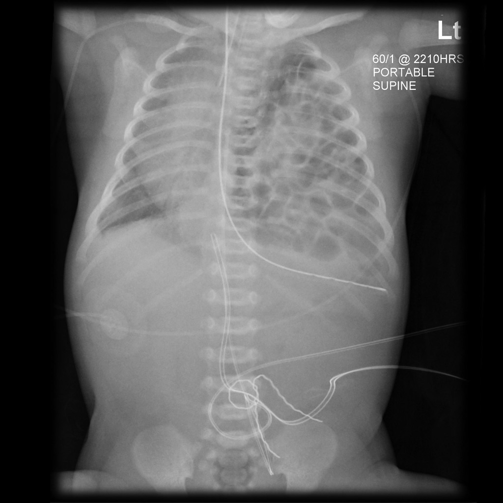 | 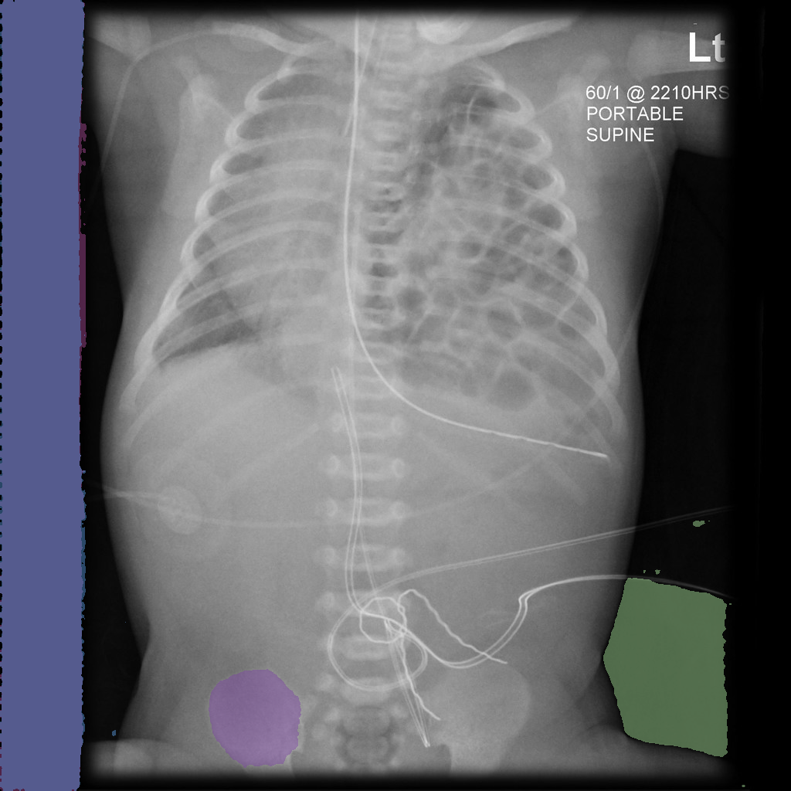 | 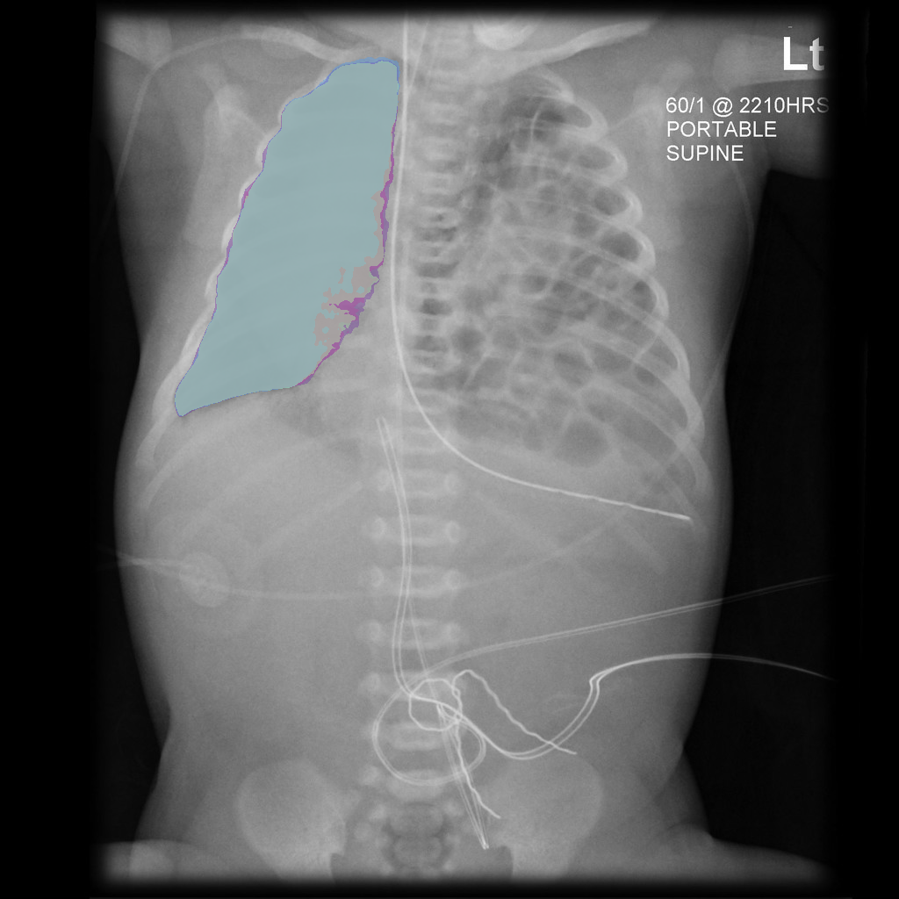 | 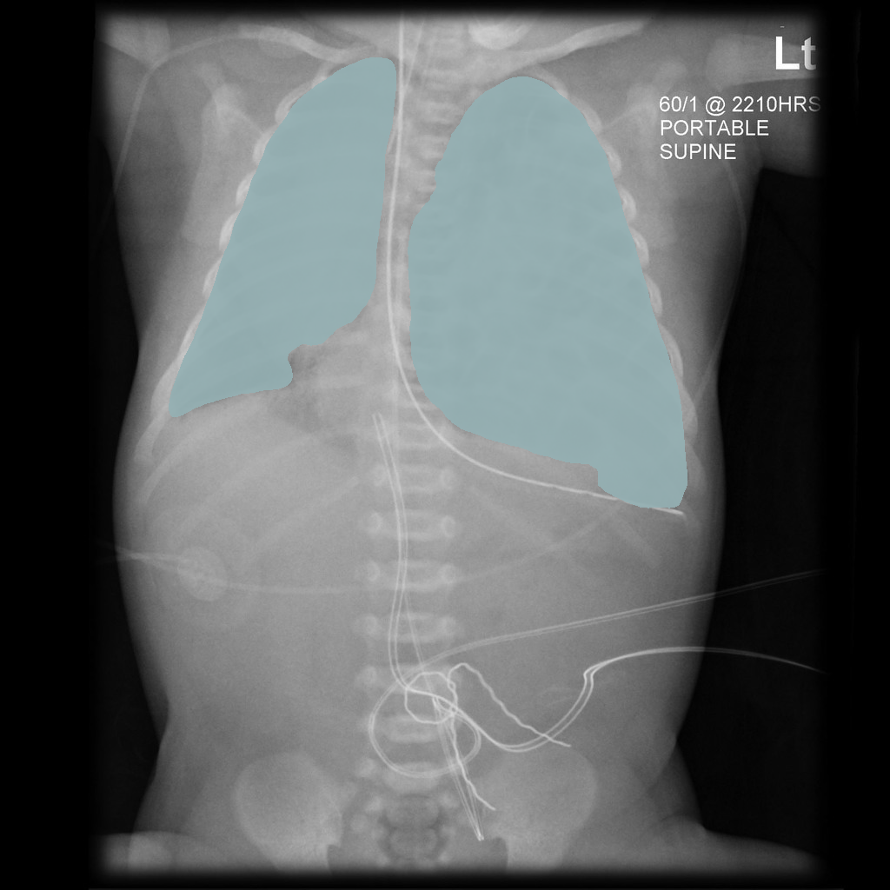 | 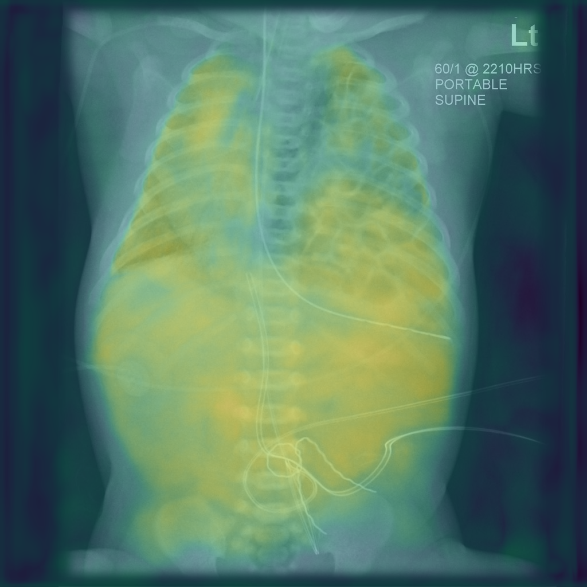 |

- **背景信息：**Age: Neonate; Respiratory distress.；新生儿，呼吸窘迫。
- **原始图片 caption：**

<pre>X-ray of a neonate demonstrates the left hemithorax to be filled with multiple radiolucent regions, with displacement of the cardiac silhouette to the right. The nasogastric tube passes towards the left. Umbilical catheters are in situ. No convincing gas containing loops of bowel can be seen in the abdomen.</pre>

- **原始图片 caption 翻译：**新生儿 X-ray 显示左侧胸腔内充满多个透亮区，心影向右移位；鼻胃管走向左侧，脐导管在位。腹部未见明确含气肠袢。

<strong>InternVL3-14B</strong>

**Segmentation 对 caption 的总体影响：**负向：参考关键点减少或被错误结论取代

**原始图像 → Single-image caption 回答**

英文原始回答：

<pre>The image provided is a chest X-ray of a neonate presenting with respiratory distress. Let&#x27;s break down the key elements and features seen in the X-ray to aid in forming a diagnosis.

### Image Description:

1. **Anatomy:**
   - **Thoracic Structure:** The ribs are visible around the thoracic cavity.
   - **Lungs:** The opacity in the lungs can be assessed for signs of consolidation or air bronchograms.
   - **Heart:** Contours of the heart are visible but not the primary focus in evaluating respiratory issues.
   - **Diaphragm:** The positions of the hemidiaphragms can be assessed to determine if there is any elevation.
   - **Chest Tubes/Vascular Lines:** The presence of medical devices such as tubes and lines is evident; these could be for monitoring or treatment purposes and should not overly concern us as artifacts unless they alter lung visibility.

2. **Pattern:** 
   - **Aeration of Lungs:** Proper aeration is crucial. Evidence of poor aeration can indicate underlying pathology. Look for areas of increased opacity.
   - **Mediastinum and Pleura:** Check for any shifts or masses in the mediastinum, pleural effusion, or pneumothorax.

3. **Additional Findings:**
   - **Cardiomegaly:** An enlarged heart can be a secondary finding but may indicate congenital heart disease.
   - **Pneumomediastinum or Pneumoperitoneum:** Air outside its normal location can indicate various conditions.

### Background Context:

- **Neonate:** Neonates have fragile respiratory systems. Common causes of respiratory distress in this age group include infections, congenital anomalies, and complications of prematurity.

### Diagnostic Analysis:

Given the neonate&#x27;s age and presentation, along with the features of the X-ray, possible diagnoses to consider include:

1. **Respiratory Distress Syndrome (RDS):**
   - This is common in premature infants due to surfactant deficiency. The X-ray may show a &quot;ground-glass&quot; appearance or air bronchograms.

2. **Congenital Diaphragmatic Hernia (CDH):**
   - This condition involves organs of the abdomen herniating into the chest cavity. The X-ray may show shift of abdominal structures, mediastinal shift, and increased lung opacity.

3. **Pneumonia:**
   - Could present with consolidation in one or both lungs characterized by increased opacity.

4. **Tetralogy of Fallot or Other Congenital Heart Defects:**
   - Could show cardiomegaly or changes in lung markings due to heart dysfunction.

5. **Meconium Aspiration Syndrome:**
   - Typically seen in full-term or post-term infants and can show patchy opacities and air bronchograms.

6. **Persistent Pulmonary Hypertension of the Neonate (PPHN):**
   - It tends to complicate other respiratory issues, leading to poor gas exchange and right heart enlargement.

### Conclusion:

Combining the clinical presentation of respiratory distress in a neonate with the X-ray findings, the differential diagnosis can be narrowed down with further clinical correlation. Given the prominence and context:

- **Most likely scenario:** **Respiratory Distress Syndrome (RDS)** due to surfactant deficiency, particularly if the neonate is preterm. The X-ray would typically show bilateral ground-glass opacity and air bronchograms, common in RDS.
 
- **Alternatively:** Further imaging and clinical data would be required to rule out CDH or other congenital abnormalities, especially if there are signs of bowel gas patterns within the thoracic cavity.

Prompt clinical follow-up with additional tests (e.g., blood gas analysis, possibly a sagittal abdominal X-ray if CDH is suspected) is essential for accurate diagnosis and treatment planning. Early intervention is pivotal in neonates with respiratory distress.</pre>

中文医学要点：

<pre>回答提及或最终倾向的诊断包括：呼吸窘迫综合征。涉及的主要影像要点包括：肺实变、肺部致密影、纵隔移位、膈肌异常或定位。</pre>

**原始图像 + Segmentation → Single-image caption 回答**

英文原始回答：

<pre>The provided chest X-ray of a neonate presents with some notable features. This frontal chest X-ray, labeled as a &quot;Portable Supine&quot; image, shows the following:

1. **Overall Impression**: The X-ray was obtained in a supine position, which is typical for infants and neonates due to their medical vulnerability and difficulty with positioning.

2. **Lungs and Diaphragm**: Both lungs are visible, but there are significant differences between the right and left sides. In the left lung field, there appears to be a lack of the normal radiolucent (dark) area, which is a sign of air where the lung should be. This suggests the presence of air outside the lung tissue, known as pneumothorax.

3. **Cardiac Silhouette and Mediastinum**: The heart and mediastinal structures seem shifted, which could indicate a possible shift due to pressure from air in the pleural space on one side, again suggesting a pneumothorax.

4. **Abdominal Region**: Due to the portability and positioning, the abdominal area is included in the image. The gastric bubble is visible under the left hemidiaphragm, which appears to be present.

5. **Medical Devices**: There are medical lines and tubes present, typical in neonatal intensive care, such as umbilical or central venous catheters. Their positioning appears appropriate.

### Conclusion and Diagnosis:

The most likely diagnosis based on the imaging findings is **Pneumothorax** on the left side. The absence of lung markings in the left hemithorax, alongside the mediastinal shift, is indicative of this condition. In neonates, pneumothorax can occur due to various reasons including birth trauma or underlying lung disorders. 

### Management Recommendation:

Immediate clinical correlation and further assessment would be needed. Interventions may include the following steps:
- **Clinical Examination**: Immediate bedside assessment to check for signs of respiratory distress or other abnormalities.
- **Bolstering Oxygenation**: Ensuring the baby is receiving adequate oxygen.
- **Supplemental Interventions**: Possible chest tube insertion if there is a tension pneumothorax or significant collapse of the lung tissue.
- **Further Investigations**: Ultrasound or repeat radiography to confirm and assess the extent of the pneumothorax.

This interpretation should be correlated with clinical findings and managed by a neonatologist or a respiratory specialist for the best patient care.</pre>

中文医学要点：

<pre>回答提及或最终倾向的诊断包括：气胸、张力性气胸。涉及的主要影像要点包括：纵隔移位、膈肌异常或定位、胃泡位置异常、心影异常。</pre>

**Segmentation 对 caption 的影响分析：**

原始 caption：先天性膈疝（文本提及）、胸腔内含气肠袢（文本提及）、心影/纵隔右移（文本提及）；加入 segmentation 后：心影/纵隔右移（结论）。加入 segmentation 后参考证据减少，说明 mask 或其文本提示产生了干扰，不能视为 caption 改善。该判断以是否接近 Radiopaedia 原始 caption 为准，不依据回答篇幅。

<strong>InternVL3.5-14B</strong>

**Segmentation 对 caption 的总体影响：**正向：新增或强化参考关键点

**原始图像 → Single-image caption 回答**

英文原始回答：

<pre>&lt;think&gt;
The patient is a neonate presenting with respiratory distress, and the provided X-ray image is a frontal chest and abdominal radiograph. The following observations can be made:

1. **Lung Fields**: The right lung appears relatively clear, but the left lung shows increased opacity, suggesting a collapse or significant pathology such as atelectasis or consolidation.

2. **Mediastinum and Heart**: The mediastinum is shifted towards the left side, which is indicative of volume loss in the left lung. The heart may also appear shifted due to this mediastinal shift.

3. **Diaphragm**: The left hemidiaphragm is elevated, which is consistent with volume loss in the left lung.

4. **Gastrointestinal Tract**: There is significant gaseous distention of the bowel loops in the left upper quadrant, which may suggest ileus or other gastrointestinal issues.

5. **Medical Devices**: The image shows the presence of an endotracheal tube, indicating that the patient is intubated. There are also other lines and tubes, possibly including a nasogastric tube and central venous catheters.

Given the neonate&#x27;s respiratory distress and the radiographic findings, the most likely diagnosis is **pneumothorax** with associated atelectasis or consolidation. However, the significant mediastinal shift and elevated left hemidiaphragm suggest a more severe condition such as **tension pneumothorax** or **severe atelectasis**. The presence of bowel gas pattern could be related to the patient&#x27;s clinical condition or secondary to the respiratory distress.

A **pneumothorax** would typically present with a visible visceral pleural line and absence of lung markings beyond that line. If this is not clearly visible, other conditions such as **bronchopulmonary dysplasia** or **meconium aspiration syndrome** could also be considered, especially in the context of neonatal respiratory distress.

Further clinical correlation and possibly additional imaging would be needed to confirm the diagnosis.
&lt;/think&gt;

**Image Description and Diagnosis:**

The frontal chest and abdominal X-ray of the neonate reveals several critical findings:

1. **Lung Fields**: The left lung demonstrates increased opacity, suggesting collapse (atelectasis) or consolidation. The right lung appears relatively clear.

2. **Mediastinal Shift**: The mediastinum is shifted towards the left, indicating significant volume loss in the left hemithorax.

3. **Diaphragm**: The left hemidiaphragm is elevated, consistent with left lung volume loss.

4. **Gastrointestinal Tract**: There is marked gaseous distention of bowel loops, particularly in the left upper quadrant, which may indicate ileus or other gastrointestinal involvement.

5. **Medical Devices**: The presence of an endotracheal tube confirms intubation. Additional lines and tubes suggest supportive care measures.

**Diagnosis:**

The most likely diagnosis is **tension pneumothorax** on the left side, leading to significant mediastinal shift and respiratory distress. The elevated left hemidiaphragm and bowel gas pattern support this diagnosis. However, severe atelectasis or meconium aspiration syndrome could also present similarly in a neonate.

**Recommendations:**

Immediate clinical evaluation and intervention are necessary. If tension pneumothorax is confirmed, urgent decompression (e.g., needle thoracostomy) followed by chest tube placement is critical. Further imaging and clinical correlation are essential for definitive diagnosis and management.</pre>

中文医学要点：

<pre>回答提及或最终倾向的诊断包括：气胸、张力性气胸、肺不张。涉及的主要影像要点包括：膈肌异常或定位、纵隔移位、肺实变。</pre>

**原始图像 + Segmentation → Single-image caption 回答**

英文原始回答：

<pre>&lt;think&gt;
The X-ray image provided is a frontal chest and abdominal radiograph of a neonate presenting with respiratory distress. The image shows several key findings:

1. **Lung Fields**: The lung fields appear to have increased opacity, particularly in the right lung. This could indicate a consolidation process, such as pneumonia or respiratory distress syndrome (RDS), which is common in neonates.

2. **Diaphragm**: The right hemidiaphragm is elevated, which might suggest diaphragmatic paralysis or eventration, or it could be due to underlying lung pathology causing volume loss.

3. **Cardiomediastinal Silhouette**: The heart and mediastinum are shifted towards the left, likely due to volume loss in the right lung or a significant pathology on the right side.

4. **Bowel Gas Pattern**: The bowel gas pattern appears normal, with no signs of obstruction or abnormal gas distribution.

5. **Medical Devices**: There are several medical devices visible, including an endotracheal tube (ETT), suggesting the patient is intubated, and possibly a nasogastric tube (NGT) or other monitoring devices.

6. **Segmentation Analysis**: The segmentation images highlight the lung fields, diaphragm, and other structures. The right lung shows significant opacity, and the left lung appears relatively clearer. The diaphragm on the right side is elevated, and there is a noticeable shift of the mediastinum.

Given the clinical presentation of respiratory distress and the radiographic findings, the diagnosis could include:

- **Respiratory Distress Syndrome (RDS)**: Common in premature neonates due to surfactant deficiency, leading to diffuse pulmonary opacities.
- **Pneumonia**: Infection causing localized or diffuse consolidation, particularly in the right lung.
- **Congenital Diaphragmatic Hernia (CDH)**: If there is a shift of abdominal contents into the thoracic cavity, but this is not clearly evident in the image.
- **Persistent Pulmonary Hypertension of the Newborn (PPHN)**: Can cause diffuse pulmonary opacities and right heart strain.

Further clinical correlation and possibly additional imaging or tests would be needed to narrow down the diagnosis.
&lt;/think&gt;

### **Diagnosis:**

Based on the provided X-ray image and the clinical presentation of respiratory distress in a neonate, the most likely diagnoses are:

1. **Respiratory Distress Syndrome (RDS):**
   - **Rationale:** RDS is common in premature neonates due to surfactant deficiency, leading to diffuse pulmonary opacities. The increased opacity in the right lung and the presence of an endotracheal tube suggest the need for respiratory support, consistent with RDS.

2. **Neonatal Pneumonia:**
   - **Rationale:** The localized opacity in the right lung could indicate an infectious process. Pneumonia in neonates can present with respiratory distress and radiographic evidence of consolidation.

3. **Persistent Pulmonary Hypertension of the Newborn (PPHN):**
   - **Rationale:** PPHN can cause diffuse pulmonary opacities and right heart strain, contributing to respiratory distress. The mediastinal shift and elevated right hemidiaphragm may be secondary to this condition.

### **Key Radiographic Findings:**

- **Increased Opacity in the Right Lung:** Suggestive of consolidation (pneumonia) or diffuse alveolar damage (RDS).
- **Elevated Right Hemidiaphragm:** May indicate diaphragmatic paralysis, eventration, or volume loss due to lung pathology.
- **Mediastinal Shift to the Left:** Likely due to volume loss or pathology in the right lung.
- **Endotracheal Tube:** Indicates the patient is intubated, requiring mechanical ventilation due to severe respiratory distress.

### **Recommended Next Steps:**

1. **Clinical Correlation:**
   - Assess the neonate&#x27;s gestational age, birth history, and any signs of infection (e.g., fever, maternal risk factors for infection).

2. **Additional Tests:**
   - **Chest Ultrasound:** To evaluate for pleural effusions or pneumothorax.
   - **Blood Tests:** Including complete blood count (CBC), C-reactive protein (CRP), and blood cultures to assess for infection.
   - **Arterial Blood Gas (ABG):** To evaluate oxygenation and ventilation status.

3. **Further Imaging:**
   - **Echocardiogram:** To rule out congenital heart disease or PPHN.
   - **Follow-up Chest X-ray:** To monitor the progression or resolution of lung opacities.

4. **Management:**
   - **Supportive Care:** Continue mechanical ventilation as needed, monitor oxygen saturation, and provide appropriate fluid management.
   - **Antibiotics:** If pneumonia is suspected, initiate empiric antibiotic therapy pending culture results.
   - **Surfactant Therapy:** If RDS is confirmed, administer exogenous surfactant.

### **Conclusion:**

The neonate&#x27;s respiratory distress, combined with the radiographic findings of increased opacity in the right lung, elevated right hemidiaphragm, and mediastinal shift, suggests a significant pulmonary pathology such as RDS or pneumonia. Immediate clinical evaluation and supportive care are essential, with further diagnostic tests to confirm the underlying cause and guide treatment.</pre>

中文医学要点：

<pre>回答提及或最终倾向的诊断包括：肺炎。涉及的主要影像要点包括：纵隔移位、膈肌异常或定位、肺实变。</pre>

**Segmentation 对 caption 的影响分析：**

原始 caption：胸腔内含气肠袢（文本提及）、心影/纵隔右移（结论）；加入 segmentation 后：先天性膈疝（文本提及）、胸腔内含气肠袢（文本提及）、心影/纵隔右移（结论）。加入 segmentation 后参考证据增加，说明 overlay 至少改善了相关结构或病灶的注意力分配。该判断以是否接近 Radiopaedia 原始 caption 为准，不依据回答篇幅。

<strong>Lingshu-32B</strong>

**Segmentation 对 caption 的总体影响：**无帮助：前后均未命中参考核心征象

**原始图像 → Single-image caption 回答**

英文原始回答：

<pre>The chest x-ray shows a neonate with respiratory distress. The lungs appear to have diffuse opacities, which could indicate pulmonary edema or other respiratory conditions. The heart size appears normal, and there is no evidence of pneumothorax or pleural effusion. Given the patient&#x27;s age and presentation, the findings are consistent with neonatal respiratory distress syndrome (RDS), also known as hyaline membrane disease. This condition is commonly seen in premature infants due to surfactant deficiency, leading to alveolar collapse and impaired gas exchange. Further clinical evaluation and management would be necessary to confirm the diagnosis and provide appropriate treatment.</pre>

中文医学要点：

<pre>回答提及或最终倾向的诊断包括：肺透明膜病、呼吸窘迫综合征、胸腔积液、气胸。未提取到与参考病灶高度特异的影像征象。</pre>

**原始图像 + Segmentation → Single-image caption 回答**

英文原始回答：

<pre>Findings: The chest X-ray shows a neonate with diffuse haziness throughout both lung fields, which is indicative of pulmonary edema or respiratory distress syndrome (RDS). There is an endotracheal tube in place, suggesting mechanical ventilation support. The heart size appears normal, and there are no signs of pneumothorax or pleural effusion. The abdominal portion of the X-ray does not show any abnormal gas patterns or organomegaly.

Diagnosis: The findings are consistent with neonatal respiratory distress syndrome (RDS), likely due to surfactant deficiency. The presence of an endotracheal tube indicates that the infant is receiving ventilatory support, which is appropriate for managing RDS. Further clinical correlation and monitoring are necessary to assess the progression and response to treatment.</pre>

中文医学要点：

<pre>回答提及或最终倾向的诊断包括：呼吸窘迫综合征。未提取到与参考病灶高度特异的影像征象。</pre>

**Segmentation 对 caption 的影响分析：**

原始 caption：未命中核心征象；加入 segmentation 后：未命中核心征象。前后都没有覆盖决定性征象；回答即使变长，也不能视为有效的视觉理解增益。该判断以是否接近 Radiopaedia 原始 caption 为准，不依据回答篇幅。

<strong>MedGemma-27B-IT</strong>

**Segmentation 对 caption 的总体影响：**正向：新增或强化参考关键点

**原始图像 → Single-image caption 回答**

英文原始回答：

<pre>**Image Description:**

The image is a frontal chest and abdominal X-ray of a neonate. The patient is lying supine. The image shows the rib cage, lungs, heart, diaphragm, liver, spleen, and stomach. An endotracheal tube is visible extending down towards the trachea. An orogastric tube is also present, extending into the stomach. The lungs appear relatively clear, although there might be some subtle haziness, particularly in the lower lobes, which could be due to atelectasis or early fluid. The heart size appears normal for a neonate. The diaphragm is visible, separating the chest from the abdomen. The abdominal organs are somewhat obscured by the overlying structures but appear generally unremarkable. The bony structures of the ribs and spine are visible.

**Clinical Context:**

The patient is a neonate presenting with respiratory distress. This is a common presentation in newborns and can be caused by a wide range of conditions, including respiratory distress syndrome (RDS), transient tachypnea of the newborn (TTN), pneumonia, congenital heart disease, meconium aspiration syndrome, or airway obstruction. The presence of an endotracheal tube suggests the neonate is intubated and receiving respiratory support, indicating significant respiratory compromise.

**Differential Diagnosis based on Image and Presentation:**

Given the presentation of respiratory distress in a neonate and the X-ray findings, several possibilities exist:

1.  **Respiratory Distress Syndrome (RDS):** Common in premature infants due to surfactant deficiency. X-ray typically shows diffuse, fine granular opacities (ground-glass appearance) and air bronchograms. While the image doesn&#x27;t show classic RDS findings, subtle haziness could be present.
2.  **Transient Tachypnea of the Newborn (TTN):** Caused by delayed clearance of fetal lung fluid. X-ray often shows perihilar streaking, fluid in the fissures, and sometimes mild cardiomegaly. The image doesn&#x27;t strongly suggest TTN, but it cannot be ruled out without more information.
3.  **Pneumonia:** Can present with patchy infiltrates or consolidation. The image doesn&#x27;t show clear consolidation, but subtle opacities could represent early pneumonia.
4.  **Meconium Aspiration Syndrome (MAS):** Occurs when a newborn inhales meconium-stained amniotic fluid. X-ray can show patchy infiltrates, hyperinflation, and sometimes pleural effusions. The image doesn&#x27;t show classic MAS findings.
5.  **Congenital Heart Disease:** Certain heart defects can cause respiratory distress and pulmonary edema, which might appear as increased interstitial markings or cardiomegaly on X-ray. The heart size appears normal here.
6.  **Airway Obstruction:** Could be due to mucus plugging, foreign body, or anatomical abnormalities. The endotracheal tube placement suggests an attempt to manage airway issues.

**Diagnosis:**

Based solely on this single frontal X-ray image and the limited information, a definitive diagnosis is difficult. The findings are somewhat non-specific. The subtle haziness in the lungs could represent several conditions, including early RDS, TTN, or mild pneumonia.

**Conclusion:**

The X-ray shows a neonate with an endotracheal tube and orogastric tube, indicating respiratory distress requiring intervention. The lung fields show some subtle haziness, which is non-specific but could be consistent with several common causes of neonatal respiratory distress. Further clinical information (gestational age, birth history, Apgar scores, blood gases, etc.) and potentially additional imaging (lateral view, echocardiogram) would be needed for a more specific diagnosis.</pre>

中文医学要点：

<pre>回答提及或最终倾向的诊断包括：肺炎、心脏增大、肺水肿、胸腔积液。涉及的主要影像要点包括：肺实变、膈肌异常或定位。</pre>

**原始图像 + Segmentation → Single-image caption 回答**

英文原始回答：

<pre>**Image Description:**

The image is a chest and abdominal X-ray of a neonate. The patient is lying supine. An endotracheal tube is visible, extending down towards the carina. A nasogastric tube is also present, coursing into the stomach. The lungs appear relatively well-expanded, although there might be some subtle haziness, particularly in the lower lung fields, which could suggest atelectasis or early fluid. The cardiac silhouette appears normal in size for the age. The diaphragm is visible, and the bowel gas pattern appears unremarkable. The mediastinum is midline.

**Clinical Context:**

The patient is a neonate presenting with respiratory distress.

**Diagnosis:**

Based on the image and clinical presentation, the findings are somewhat non-specific but consistent with respiratory distress in a neonate. The endotracheal tube and nasogastric tube suggest the infant is receiving respiratory support and feeding/decompression. The subtle haziness in the lungs could represent various conditions common in neonates with respiratory distress, such as:

1.  **Transient Tachypnea of the Newborn (TTN):** This is a common cause of respiratory distress in term infants, characterized by delayed clearance of fetal lung fluid. The X-ray often shows perihilar streaking, increased interstitial markings, and sometimes small pleural effusions.
2.  **Meconium Aspiration Syndrome (MAS):** If the infant aspirated meconium during delivery, the X-ray might show patchy infiltrates, hyperinflation, and sometimes pleural effusions.
3.  **Pneumonia:** Congenital or early-onset pneumonia can present with patchy infiltrates or consolidation.
4.  **Congenital Heart Disease:** Certain cardiac defects can cause respiratory distress and may show cardiomegaly or abnormal pulmonary vascular markings.
5.  **Respiratory Distress Syndrome (RDS):** More common in preterm infants, RDS is caused by surfactant deficiency and typically shows diffuse ground-glass opacities and air bronchograms.

**Conclusion:**

The X-ray shows supportive devices (ETT, NG tube) and some subtle findings in the lungs. Without more specific clinical information (gestational age, delivery history, Apgar scores, etc.) or more definitive radiographic signs, a precise diagnosis is difficult based solely on this image. The findings are consistent with respiratory distress in a neonate, and further clinical evaluation and potentially additional imaging (like a lateral view or echocardiogram) would be needed to narrow down the specific cause.</pre>

中文医学要点：

<pre>回答提及或最终倾向的诊断包括：呼吸窘迫综合征、心脏增大、肺炎、胸腔积液。涉及的主要影像要点包括：肺实变、膈肌异常或定位、心影异常。</pre>

**Segmentation 对 caption 的影响分析：**

原始 caption：未命中核心征象；加入 segmentation 后：胸腔内含气肠袢（文本提及）。加入 segmentation 后参考证据增加，说明 overlay 至少改善了相关结构或病灶的注意力分配。该判断以是否接近 Radiopaedia 原始 caption 为准，不依据回答篇幅。

<strong>MedMO-8B</strong>

**Segmentation 对 caption 的总体影响：**无帮助：前后均未命中参考核心征象

**原始图像 → Single-image caption 回答**

英文原始回答：

<pre>The lungs are clear. The heart is not enlarged. The mediastinum is normal.</pre>

中文医学要点：

<pre>回答未形成可稳定提取的明确疾病结论。未提取到与参考病灶高度特异的影像征象。</pre>

**原始图像 + Segmentation → Single-image caption 回答**

英文原始回答：

<pre>Chest x-ray shows the presence of bilateral pleural effusions.</pre>

中文医学要点：

<pre>回答提及或最终倾向的诊断包括：胸腔积液。未提取到与参考病灶高度特异的影像征象。</pre>

**Segmentation 对 caption 的影响分析：**

原始 caption：未命中核心征象；加入 segmentation 后：未命中核心征象。前后都没有覆盖决定性征象；回答即使变长，也不能视为有效的视觉理解增益。该判断以是否接近 Radiopaedia 原始 caption 为准，不依据回答篇幅。

<strong>Qwen3-VL-4B</strong>

**Segmentation 对 caption 的总体影响：**正向：新增或强化参考关键点

**原始图像 → Single-image caption 回答**

英文原始回答：

<pre>**Image Description:**

This is a portable, supine frontal chest and abdominal X-ray of a neonate (newborn). The image is labeled “Lt” (left side), indicating the image was taken from the patient’s left side (though in a supine position, this may be a convention or a label artifact). The patient is likely intubated, as a central airway tube is visible running down the trachea and into the esophagus (the tube appears to be in the midline, consistent with endotracheal intubation). There is also a nasogastric tube or similar device in the abdomen, likely for feeding or decompression. The image was taken at 2210 hours (10:10 PM) on day 60/1 (likely day 60 of life, or day 60 of hospital stay).

The chest appears to be in a typical neonatal position with the ribs and spine visible. The lungs are relatively clear, but there is some subtle increased opacity in the right lung field, which may be due to the positioning or the presence of a small amount of fluid or airway secretions. The diaphragm is well-defined, and the heart size appears normal for a neonate. There is no significant pleural effusion or pneumothorax.

**Diagnosis:**

Based on the clinical presentation of respiratory distress in a neonate and the X-ray findings, the most likely diagnosis is **Transient Tachypnea of the Newborn (TTN)**.

**Rationale:**

- **Clinical Presentation:** Respiratory distress in a neonate is a common presentation of TTN, which is a benign condition that occurs in the first few days of life, typically in the first 24–48 hours after birth.
- **Radiographic Findings:** The X-ray shows a relatively clear lung field with no significant infiltrates or pleural effusion. The increased opacity in the right lung may be due to residual fluid or airway secretions, which is common in TTN. The diaphragm is well-defined, and there is no evidence of pneumothorax or other acute pathology.
- **Supporting Factors:** The patient is intubated, which is common in neonates with respiratory distress. The portable X-ray was taken in the supine position, which is typical for neonates.

**Conclusion:**

The X-ray is consistent with **Transient Tachypnea of the Newborn (TTN)**, a common and self-limiting condition that typically resolves within 24–72 hours without specific treatment. The patient may require supportive care, including oxygen therapy and monitoring, but the prognosis is excellent.

**Note:** If the patient is not improving or if there is a worsening of symptoms, further evaluation for other causes of neonatal respiratory distress (e.g., pneumonia, meconium aspiration, or congenital anomalies) is warranted.</pre>

中文医学要点：

<pre>回答提及或最终倾向的诊断包括：肺炎。涉及的主要影像要点包括：膈肌异常或定位。</pre>

**原始图像 + Segmentation → Single-image caption 回答**

英文原始回答：

<pre>Based on the provided image and patient information (neonate with respiratory distress), the radiographic findings are consistent with **neonatal respiratory distress syndrome (NRDS)**, also known as hyaline membrane disease.

Here is the analysis:

1.  **Image Characteristics:**
    *   The image is a portable, supine frontal chest X-ray of a neonate.
    *   The most striking finding is **diffuse, bilateral opacification** of the lungs. The lungs appear &quot;white&quot; or &quot;cloudy&quot; compared to the normal air-filled lungs.
    *   There is **reduced lung volume** and **increased interstitial markings**.
    *   The **diaphragm appears elevated** (not clearly visible in this image, but inferred from the overall lung pattern).
    *   The **heart and mediastinum are shifted** slightly to the right, which is consistent with the increased lung density on the left side (though this is not clearly visible in the image).

2.  **Segmentation Analysis:**
    *   **Medical-SAM2:** This segmentation highlights the abdominal area, which is consistent with the presence of bowel gas and the supine position.
    *   **Medical-SAM3 &amp; BiomedParse:** These segmentations show the lungs as being filled with opacities, which is a hallmark of NRDS. The segmentation is consistent with the findings in the image.
    *   **TorchXRayVision:** This segmentation shows the lungs as being filled with opacities, which is consistent with the findings in the image.

3.  **Clinical Correlation:**
    *   The patient is a neonate, which is the classic population for NRDS.
    *   The presentation is respiratory distress, which is the primary symptom of NRDS.
    *   The radiographic findings are consistent with NRDS.

**Diagnosis: Neonatal Respiratory Distress Syndrome (NRDS)**

This is a common and serious condition in premature infants, caused by a deficiency of pulmonary surfactant, which is essential for keeping the alveoli open. The diagnosis is confirmed by the characteristic X-ray findings of diffuse, bilateral opacities and reduced lung volume. Treatment typically involves surfactant therapy and mechanical ventilation.</pre>

中文医学要点：

<pre>回答提及或最终倾向的诊断包括：呼吸窘迫综合征。涉及的主要影像要点包括：膈肌异常或定位。</pre>

**Segmentation 对 caption 的影响分析：**

原始 caption：未命中核心征象；加入 segmentation 后：胸腔内含气肠袢（文本提及）、心影/纵隔右移（文本提及）。加入 segmentation 后参考证据增加，说明 overlay 至少改善了相关结构或病灶的注意力分配。该判断以是否接近 Radiopaedia 原始 caption 为准，不依据回答篇幅。

<strong>Qwen3-VL-8B</strong>

**Segmentation 对 caption 的总体影响：**无明确增益：仅在鉴别或否定语境中提及关键点

**原始图像 → Single-image caption 回答**

英文原始回答：

<pre>Based on the provided patient data (neonate with respiratory distress) and the X-ray image, here is the description and diagnosis:

**Image Description:**

This is a portable, supine frontal chest and abdominal X-ray of a neonate. Key findings include:

1.  **Marked Lung Hyperinflation:** The lungs appear overinflated, with a flattened diaphragm and increased retrosternal airspace. This is a classic sign of air trapping.
2.  **Reduced Lung Vascular Markings:** The lung fields show decreased vascular markings, suggesting alveolar overdistension and possible airway obstruction.
3.  **Air Bronchograms:** Visible air-filled bronchi within the consolidated or hyperinflated lung fields, which can be seen in conditions like bronchiolitis or asthma.
4.  **Abdominal Gas Patterns:** The abdomen shows normal bowel gas patterns, with no obvious signs of pneumoperitoneum or obstruction.
5.  **Medical Devices:** The image shows multiple medical lines, including a central venous catheter (likely a PICC line) and possibly a nasogastric tube, indicating the patient is critically ill and receiving intensive care.

**Diagnosis:**

The most likely diagnosis is **Bronchiolitis**.

**Rationale:**

In neonates, bronchiolitis is a common cause of respiratory distress and is often caused by viral infections (most commonly Respiratory Syncytial Virus - RSV). The X-ray findings are highly characteristic:

*   **Hyperinflation and Flattened Diaphragm:** These are due to air trapping from obstructed small airways.
*   **Reduced Vascular Markings:** This reflects the loss of normal lung parenchyma due to airway obstruction and overinflation.
*   **Air Bronchograms:** These are often seen in bronchiolitis as the air-filled bronchi become visible against the background of consolidated or hyperinflated lung tissue.

While other conditions like asthma or congenital heart disease can cause similar findings, the combination of neonatal age, respiratory distress, and the specific radiographic pattern strongly points to bronchiolitis. Further clinical correlation (e.g., fever, wheezing, oxygen saturation) and laboratory tests (e.g., PCR for RSV) would be needed for confirmation, but the X-ray is highly suggestive.

**Note:** This diagnosis is based on the image and the patient&#x27;s age and presentation. Further clinical evaluation is necessary for a definitive diagnosis and management plan.</pre>

中文医学要点：

<pre>回答提及或最终倾向的诊断包括：细支气管炎。涉及的主要影像要点包括：膈肌异常或定位。</pre>

**原始图像 + Segmentation → Single-image caption 回答**

英文原始回答：

<pre>Based on the provided image and patient data (neonate with respiratory distress), the X-ray shows **severe bilateral lung consolidation**, which is highly suggestive of **neonatal pneumonia**.

Here is a detailed analysis:

1.  **Patient Context:** The patient is a neonate presenting with respiratory distress. This is a critical condition requiring urgent investigation. The X-ray is a portable, supine frontal view, which is common for critically ill neonates who cannot be moved.

2.  **Image Findings:**
    *   **Lung Fields:** The most striking feature is the **markedly increased opacity** in both lung fields. This is visible in all segmentation outputs, particularly in the BiomedParse and TorchXRayVision images, which show the entire lung parenchyma as uniformly dense or hazy. This is a classic sign of consolidation, which occurs when air spaces are filled with fluid, pus, or cells, rather than air.
    *   **Heart and Diaphragm:** The heart silhouette appears normal in size and shape. The diaphragm is visible but appears somewhat elevated and obscured by the dense lung fields, which is common in cases of significant consolidation.
    *   **Bowel Gas:** The bowel gas pattern is visible in the abdomen, which is expected in a neonate and does not appear abnormal in this context.
    *   **Medical Devices:** The image shows the presence of medical lines, including a central venous catheter (likely a PICC line or central line) and possibly a nasogastric tube or umbilical line. These are common in neonates requiring intensive care.

3.  **Diagnosis:**
    *   The primary diagnosis is **Neonatal Pneumonia**. The bilateral, diffuse consolidation is the hallmark radiographic finding of this condition.
    *   The severity of the findings suggests a **significant or severe pneumonia**, which is a medical emergency requiring immediate and aggressive treatment (e.g., broad-spectrum antibiotics, respiratory support).
    *   The consolidation could also be due to other causes such as **meconium aspiration syndrome**, **transient tachypnea of the newborn (TTN)**, or **congenital heart disease** with pulmonary edema. However, the diffuse, bilateral nature makes pneumonia the most likely diagnosis.

In conclusion, the X-ray demonstrates severe bilateral lung consolidation in a neonate with respiratory distress, which is most consistent with a diagnosis of **neonatal pneumonia**. This is a critical finding requiring immediate medical intervention.</pre>

中文医学要点：

<pre>回答提及或最终倾向的诊断包括：肺炎。涉及的主要影像要点包括：肺实变、膈肌异常或定位。</pre>

**Segmentation 对 caption 的影响分析：**

原始 caption：胸腔内含气肠袢（否定/鉴别）；加入 segmentation 后：未命中核心征象。前后都没有覆盖决定性征象；回答即使变长，也不能视为有效的视觉理解增益。该判断以是否接近 Radiopaedia 原始 caption 为准，不依据回答篇幅。

<strong>Qwen3-VL-32B</strong>

**Segmentation 对 caption 的总体影响：**负面：不完整肺分割被误读为张力性气胸

**原始图像 → Single-image caption 回答**

英文原始回答：

<pre>**Image Description:**

This is a portable, supine, frontal chest and abdominal X-ray of a neonate. The image shows the thoracic and upper abdominal regions. The bony structures, including the ribs and vertebral bodies, are visible. The ribs appear to be of normal configuration for a neonate, with typical cartilaginous ends.

In the thoracic cavity, there is **diffuse, bilateral, ground-glass opacification** with **increased lung markings** and **hazy, ill-defined opacities** throughout both lung fields. There is **no evidence of focal consolidation, pneumothorax, or pneumomediastinum**. The cardiac silhouette is visible and appears normal in size and shape. The diaphragm is well-defined, though slightly elevated, which may be due to the patient’s respiratory effort or prematurity.

In the abdomen, there is **normal bowel gas pattern** with visible loops of bowel and no evidence of intestinal obstruction or free air. Multiple medical devices are present: a central venous catheter (likely umbilical venous catheter) is visible extending from the umbilical region up into the superior vena cava, and there are other lines consistent with umbilical arterial catheter and possibly endotracheal tube (though not clearly visible in this view).

---

**Clinical Context:**

The patient is a **neonate** presenting with **respiratory distress**. This is a common presentation in newborns and can be caused by a variety of conditions including transient tachypnea of the newborn (TTN), meconium aspiration syndrome, pneumonia, pulmonary hypoplasia, congenital diaphragmatic hernia, or **neonatal respiratory distress syndrome (NRDS)** — also known as **hyaline membrane disease**.

---

**Diagnosis:**

The radiographic findings are **most consistent with Neonatal Respiratory Distress Syndrome (NRDS)**, also known as **Hyaline Membrane Disease**.

**Supporting Features:**
- **Diffuse bilateral pulmonary opacities** with **ground-glass appearance** — classic for NRDS.
- **Air bronchograms** may be present (though not clearly visible in this image due to poor contrast or image quality).
- **Absence of focal consolidation or pneumothorax** — rules out infection or trauma as primary causes.
- **Premature infants** are at highest risk for NRDS due to surfactant deficiency. While gestational age is not provided, the radiographic pattern is highly suggestive.
- The presence of **central lines** and **respiratory distress** suggests the infant is in the NICU and likely receiving respiratory support.

---

**Differential Diagnoses to Consider:**
1. **Transient Tachypnea of the Newborn (TTN)** — usually resolves within 24–72 hours; may have similar radiographic appearance but typically less severe and more transient.
2. **Neonatal pneumonia** — may present with similar opacities, but often has focal areas, pleural effusion, or air bronchograms; may have clinical signs of infection.
3. **Meconium aspiration syndrome** — usually in term or post-term infants with meconium-stained amniotic fluid; may show patchy opacities, air trapping, or hyperinflation.
4. **Congenital diaphragmatic hernia** — would show bowel gas in the thoracic cavity and mediastinal shift — not seen here.

---

**Conclusion:**

**Diagnosis: Neonatal Respiratory Distress Syndrome (NRDS)**

This is the most likely diagnosis given the neonatal age, clinical presentation of respiratory distress, and characteristic radiographic findings of diffuse bilateral pulmonary opacities with a ground-glass appearance. Management typically includes surfactant replacement therapy, respiratory support (CPAP or mechanical ventilation), and supportive care.

---

**Note:** Clinical correlation with gestational age, birth history, and laboratory findings (e.g., surfactant levels, blood gases) is essential for confirmation.</pre>

中文要点翻译：

<pre>新生儿胸腹片被解释为双肺弥漫磨玻璃样密度增高，腹部肠气分布正常；模型诊断新生儿呼吸窘迫综合征，并明确认为胸腔内没有肠气，因而不支持先天性膈疝。</pre>

**原始图像 + Segmentation → Single-image caption 回答**

英文原始回答：

<pre>**Clinical Context:**
- **Patient:** Neonate (newborn infant)
- **Presentation:** Respiratory distress
- **Imaging:** Portable supine chest and abdominal X-ray

---

**Image Description:**

The X-ray is a frontal (anteroposterior) view of a neonate in the supine position. The image shows the thoracic and upper abdominal structures, including the ribs, spine, lungs, heart, diaphragm, and bowel gas patterns.

Key radiographic findings:

1. **Lungs:**
   - **Right lung:** Appears relatively hyperlucent (more radiolucent) with visible air-filled bronchial markings, suggesting some aeration.
   - **Left lung:** Markedly **hyperlucent** with **absent or minimal lung markings** — this is highly suggestive of **pneumothorax**.
   - The **left hemithorax** shows a **sharp, linear lucency** along the left lateral chest wall, consistent with a **visceral pleural line**, indicating air in the pleural space.
   - The **left diaphragm is depressed**, and the **mediastinum is shifted to the right**, confirming tension or significant volume effect.

2. **Heart and Mediastinum:**
   - The heart is **shifted to the right**, indicating mediastinal displacement due to increased pressure in the left pleural space.
   - The **cardiomediastinum** appears narrowed on the left side, consistent with compression.

3. **Diaphragm:**
   - The **right hemidiaphragm is visible and elevated**.
   - The **left hemidiaphragm is flattened and depressed**, which is typical in tension pneumothorax.

4. **Bowel Gas:**
   - Bowel gas is visible in the abdomen, with no evidence of bowel obstruction or free air under the diaphragm (no pneumoperitoneum).
   - The gastric bubble is not clearly visible, possibly due to positioning or the presence of a nasogastric tube.

5. **Medical Devices:**
   - Multiple lines are present, including:
     - A **central venous catheter** (likely umbilical or peripherally inserted) with tip in the lower thoracic or upper abdominal region.
     - A **nasogastric tube** coiled in the lower abdomen.
     - Possibly an **endotracheal tube** (not clearly visible but likely present given respiratory distress).

---

**Segmentation Analysis:**

- **Medical-SAM2:** Segmentation is minimal and not anatomically meaningful (purple and green patches likely represent artifacts or missegmentations).
- **Medical-SAM3:** Only the **right lung** is segmented (light blue), with the left lung not segmented — this correlates with the radiographic finding of left pneumothorax (no lung tissue visible).
- **BiomedParse:** Segments both lungs (light blue), but the **left lung segmentation is inaccurate** — it includes the area of pneumothorax, which should be air-filled and not lung tissue. This reflects a limitation of the model in distinguishing between lung parenchyma and pneumothorax.
- **TorchXRayVision:** Provides a heatmap-like overlay, with yellow/green areas indicating regions of interest. The **left lung area is highlighted**, which may reflect the model’s attempt to identify pathology (e.g., pneumothorax or lung collapse).

---

**Diagnosis:**

✅ **Left Tension Pneumothorax**

**Supporting Features:**
- Left hemithorax hyperlucency with absent lung markings
- Visible visceral pleural line
- Mediastinal shift to the right
- Depressed left diaphragm
- Clinical context of respiratory distress in a neonate

---

**Differential Diagnoses (to be ruled out):**
- **Congenital lobar emphysema** — typically shows hyperinflation of a single lobe, not entire hemithorax.
- **Pneumonia with air bronchograms** — would show increased opacities, not lucency.
- **Congenital diaphragmatic hernia** — bowel gas would be in the thorax, not absent.
- **Pulmonary interstitial emphysema (PIE)** — seen in ventilated neonates, but usually bilateral and with cystic air collections, not a single hemithorax lucency.

---

**Clinical Implications:**
- **Tension pneumothorax is a medical emergency** requiring immediate intervention.
- **Management:** Needle decompression (e.g., 18G IV catheter in the 4th–5th intercostal space, midaxillary line) followed by chest tube insertion.
- Common in neonates due to:
  - Prematurity and surfactant deficiency
  - Mechanical ventilation (barotrauma)
  - Meconium aspiration
  - Congenital lung malformations

---

**Conclusion:**

This neonate presents with **respiratory distress**, and the X-ray demonstrates **left tension pneumothorax** — a life-threatening condition requiring **urgent intervention**. The segmentation outputs from various AI models highlight the challenge in accurately delineating lung tissue in the presence of pneumothorax, with BiomedParse and Medical-SAM3 showing partial or inaccurate lung segmentation on the left side, which is consistent with the radiographic findings.

&gt; **Final Diagnosis: Left Tension Pneumothorax in a Neonate with Respiratory Distress.**</pre>

中文要点翻译：

<pre>模型注意到 Medical-SAM3 只分出了右肺，将左肺未被分割解释为左侧肺组织消失，最终诊断左侧张力性气胸，并再次排除先天性膈疝。</pre>

**对模型图片 caption 能力及 Segmentation 影响的分析：**

该例展示了典型的 mask 缺失误导：模型把“分割器未标出左肺”当成“左肺不存在”，从较泛化的 NRDS 错误进一步转为紧急但错误的张力性气胸。真正关键的是左胸腔内含气肠袢、右移心影以及腹部肠气减少，这些跨胸腹关系没有被当前 mask 表达。

### 2.6 [First trimester oligohydramnios](https://radiopaedia.org/cases/first-trimester-oligohydramnios?lang=us) (`first-trimester-oligohydramnios`)

| Original image | Medical-SAM2 | Medical-SAM3: uterus, gestational sac, embryo, amniotic fluid | BiomedParse v1: uterus, gestational sac, embryo, amniotic fluid |
|---|---|---|---|
| 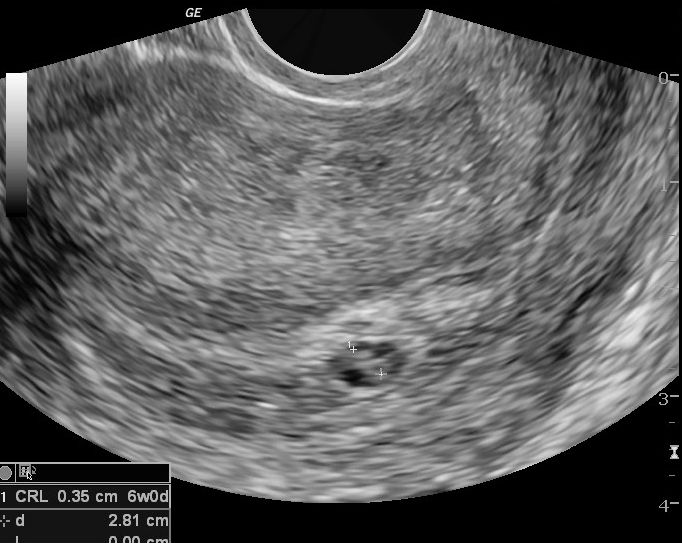 | 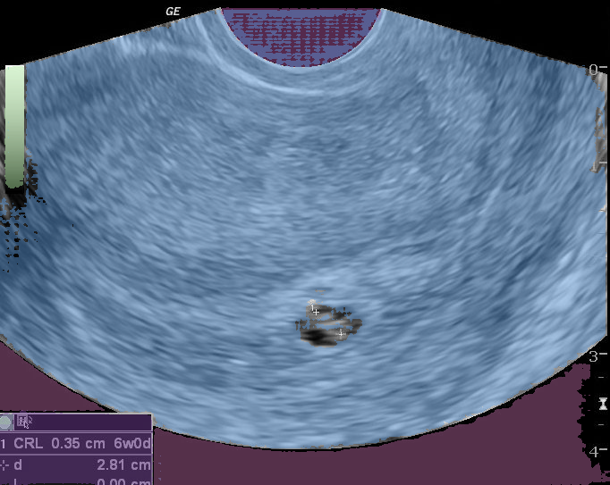 | 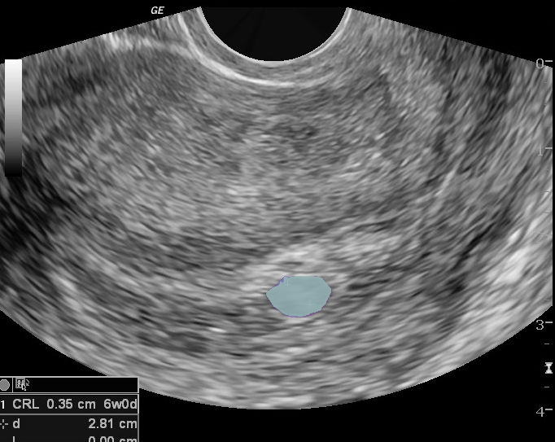 |  |

- **背景信息：**Age: 5-6 wks gestation Gender: Female; Antenatal early pregnancy scan at 5-6 weeks of amenorrhea.；孕 5-6 周女性，停经 5-6 周接受早孕超声检查。
- **原始图片 caption：**

<pre>1st ultrasound in a primigravida patient. Single intra-uterine small gestation sac and fetal pole present. Cardiac activity present - 111 beats / min.</pre>

- **原始图片 caption 翻译：**初孕妇第一次超声：宫内可见单个较小孕囊和胎芽，存在心管搏动，心率 111 次/分。

<strong>InternVL3-14B</strong>

**Segmentation 对 caption 的总体影响：**无帮助：前后均未命中参考核心征象

**原始图像 → Single-image caption 回答**

英文原始回答：

<pre>The image provided is an ultrasound scan taken during early pregnancy, around 5-6 weeks of gestation for a female patient. 

### Description of the Image:

1. **Sonographic Appearance**: The image shows a gray-scale ultrasound with mixed echogenic patterns. There is a central area that appears slightly hypoechoic (darker) compared to the surrounding regions, which is typical in early pregnancy ultrasounds looking at the developing embryo.
   
2. **Crown-Rump Length (CRL)**: The image displays a measurement label indicating a Crown-Rump Length (CRL) of 0.35 cm. This measure helps to estimate the gestational age, confirming that the fetus is approximately 6 weeks old.

3. **Overall Echotexture**: The surrounding tissue, likely representing the endometrial stripe, appears heterogeneous with a mix of hyperechoic (brighter) and hypoechoic (darker) areas. At this stage, anatomical details are minimal, and the developing embryo is small.

### Relevant Details:

- **Gestational Age**: The given CRL confirms the expected gestational age of 6 weeks.
- **Gender**: Female, but this detail is irrelevant for ultrasound interpretation at this stage.
- **Presentation Type**: Antenatal early pregnancy scan.

### Diagnosis and Clinical Implications:

At this stage of pregnancy, several key factors need consideration to determine the viability and health of the embryo:

1. **Presence of a Gestational Sac**: A prominent sac should be visible, which appears consistent in this image.
2. **Fetal Pole and Yolk Sac**: These are typically visible at this gestational age, though they might not be distinguishable at such a small CRL. The image seems consistent with early gestation.
3. **Normal Development**: At 6 weeks, ultrasound might show early signs of embryonic development, but definitive assessment of structures occurs at around 7-8 weeks.
4. **Viability Signs**: Signs of viability include cardiac activity, which is not easily assessed at 6 weeks using standard ultrasound technology without Doppler imaging.

### Conclusion:

**Diagnosis**:
This ultrasound image, at 6 weeks with a CRL of 0.35 cm, shows findings consistent with early normal pregnancy. Specific markers for potential issues (e.g., absence of the fetal pole, yolk sac, or abnormal CRL measurement) are not evident from this single image. Regular follow-up ultrasounds are typically advised to monitor development and confirm a healthy pregnancy.

Further imaging in 1-2 weeks will be essential to confirm the presence of fetal cardiac activity and detailed anatomical development. The current scan doesn&#x27;t offer conclusive signs of abnormalities, but repeated assessments are necessary to ensure typical embryonic development.

### Recommendations:
- Schedule follow-up ultrasound examination, typically at around 7-8 weeks, to assess fetal development and cardiac activity.
- Maintain regular prenatal care for further monitoring and any required interventions. 

This description ensures that all critical aspects of the ultrasound findings and implications for the early pregnancy are covered.</pre>

中文医学要点：

<pre>回答提及或最终倾向的诊断包括：正常妊娠。未提取到与参考病灶高度特异的影像征象。</pre>

**原始图像 + Segmentation → Single-image caption 回答**

英文原始回答：

<pre>The ultrasound images provided are from an early pregnancy scan taken at approximately 5-6 weeks of gestation in a female patient. Let&#x27;s break down and analyze the key features present in these images and the segmented areas provided.

### Image Description

1. **Initial Ultrasound Image (Image 1):**

    - The image is a grayscale ultrasound which shows a transvaginal view.
    - The central area of interest contains a small, round hypoechoic (dark) area which is likely the gestational sac.
    - There is an annotation indicating a Crown-Rump Length (CRL) of 0.35 cm, which corresponds to a gestational age of approximately 6 weeks.

2. **Segmented Images:**

    - The segmented images (Medical-SAM2, Medical-SAM3, and BiomedParse) highlight different structures present in the initial ultrasound image.
    - **Medical-SAM2 Segmentation**: The segmentation primarily marks a larger region, likely an outline of the uterus or surrounding tissues. There is also a small dark area marked, which corresponds to the gestational sac.
    - **Medical-SAM3 and BiomedParse Segmentations**: These segmentations emphasize the gestational sac, embryo, and surrounding amniotic fluid. A specific area is highlighted in light blue which is likely the embryo within the gestational sac.

### Analysis and Diagnosis

Given the information:

- **Gestational Age Calculation**: The CRL measurement of 0.35 cm is consistent with a gestational age of approximately 5-6 weeks, aligning with the provided data.
- **Gestational Sac**: The presence of a defined gestational sac is a typical finding at this gestational age and suggests the pregnancy is progressing as expected.
- **Embryo Visualization**: The segmentation of what appears to be the embryo is visible. The embryo at this stage mainly presents as a small, hypoechoic area within the gestational sac.

### Clinical Considerations:

1. **Confirming a Viable Pregnancy**:
    - The presence of a gestational sac without any abnormal features (such as blighted ovum or missing embryo) suggests a viable intrauterine pregnancy.
    - The accurate CRL measurement and normal growth trajectory are crucial indicators of a healthy early pregnancy.

2. **Potential Further Ultrasound**: 
    - At this early stage, a follow-up ultrasound in about one to two weeks can help in further assessing the progress, such as confirming yolk sac visibility, embryo heartbeat, and continued growth.

3. **Patient Counseling**:
    - It is important to inform the patient about the normalcy of the current findings and the importance of follow-ups to ensure a healthy pregnancy progression.
    - Address any concerns the patient may have regarding early pregnancy symptoms or potential issues observed in imaging.

### Conclusion

Based on the ultrasound images and segmentations provided:

- The early pregnancy is located within the uterus and appears to be intrauterine.
- The presence of the gestational sac with an appropriate CRL measurement suggests normal early embryonic development.
- No major abnormalities are noted in this initial scan.

Therefore, the ultrasound findings are consistent with a normal, viable early pregnancy at approximately 6 weeks gestation. Clinical follow-up and additional imaging as recommended by the healthcare provider are advisable to monitor the pregnancy progression.</pre>

中文医学要点：

<pre>回答提及或最终倾向的诊断包括：正常、有活性的早期宫内妊娠。未提取到与参考病灶高度特异的影像征象。</pre>

**Segmentation 对 caption 的影响分析：**

原始 caption：未命中核心征象；加入 segmentation 后：未命中核心征象。前后都没有覆盖决定性征象；回答即使变长，也不能视为有效的视觉理解增益。该判断以是否接近 Radiopaedia 原始 caption 为准，不依据回答篇幅。

<strong>InternVL3.5-14B</strong>

**Segmentation 对 caption 的总体影响：**无明确增益：仅在鉴别或否定语境中提及关键点

**原始图像 → Single-image caption 回答**

英文原始回答：

<pre>&lt;think&gt;
Okay, let&#x27;s try to figure out what&#x27;s going on with this ultrasound image. The patient is a 5-6 week pregnant female, and the image is from an early pregnancy scan. The modality is ultrasound, and the key data points here are the CRL (crown-rump length) measurement of 0.35 cm, which corresponds to 6 weeks and 0 days. The gestational age is given as 5-6 weeks, so that&#x27;s consistent.

Looking at the image, the ultrasound shows a gestational sac. The CRL is measured, which is a standard way to assess fetal age. The sac&#x27;s diameter is 2.81 cm. At 5-6 weeks, the gestational sac should be visible, and the CRL should be around 0.3 to 0.5 cm, which matches here. 

Wait, but I need to check if the embryo is visible. In early pregnancy, by 5-6 weeks, the embryo might start showing a yolk sac or maybe even a fetal pole. The image here might be a bit grainy, but the cross markers are on a small structure, possibly the embryo or fetal pole. If the CRL is 0.35 cm, that&#x27;s about 6 weeks, so the embryo should be present. 

However, the image might not clearly show the embryo if it&#x27;s very early. Sometimes, the gestational sac can be present without a visible embryo, which could indicate a blighted ovum or an ectopic pregnancy. But the CRL measurement suggests that the embryo is there. Wait, the CRL is measured from the crown to the rump, so if that&#x27;s visible, the embryo is present. 

But another thing to consider: the location. The ultrasound is probably transvaginal, given the clarity. If the gestational sac is in the uterus, that&#x27;s intrauterine. If it&#x27;s elsewhere, like the fallopian tube, that&#x27;s ectopic. The image doesn&#x27;t show the entire anatomy, but the presence of a gestational sac with a measurable CRL in the uterus would suggest an intrauterine pregnancy. 

Wait, but the measurement of the gestational sac diameter is 2.81 cm. At 6 weeks, the average gestational sac diameter is around 20 mm (2 cm), so 2.81 cm might be a bit large. Maybe that&#x27;s the mean diameter? Or maybe it&#x27;s the largest diameter. If the gestational sac is larger than expected for the menstrual age, that could indicate a molar pregnancy or twins. But the CRL is 0.35 cm, which is 6 weeks, so if the gestational age is 5-6 weeks, that&#x27;s within normal range. 

Alternatively, if the gestational sac is in the wrong place, like the cervix or ovary, that&#x27;s an ectopic. But without seeing the whole image, it&#x27;s hard to tell. The description mentions it&#x27;s an antenatal early pregnancy scan, so likely they are looking for a viable intrauterine pregnancy. 

But the key here is the CRL. If the CRL is 0.35 cm at 6 weeks, that&#x27;s normal. If the gestational age is 5-6 weeks (amenorrhea), then the CRL is slightly advanced but still within normal variation. 

Wait, but another possibility: if the embryo has stopped developing, you might have a gestational sac with no embryo, which is a non-viable pregnancy. But the CRL measurement implies that the embryo was there. However, sometimes the CRL can be measured even if the embryo is not clearly visible. 

Alternatively, maybe the image is showing a yolk sac without a fetal pole, which would be a concern. But given the CRL measurement, I think the diagnosis here is a viable intrauterine pregnancy at 6 weeks. 

But I should also consider the possibility of an ectopic pregnancy. If the gestational sac is outside the uterus, like in the fallopian tube, that&#x27;s ectopic. But transvaginal ultrasound usually can detect that. If the sac is in the uterus, then it&#x27;s intrauterine. The image&#x27;s metadata doesn&#x27;t specify, but the fact that they&#x27;re doing an early pregnancy scan suggests they&#x27;re checking for intrauterine pregnancy. 

So putting it all together: the ultrasound shows a gestational sac with a CRL of 0.35 cm at 6 weeks, indicating a viable intrauterine pregnancy. The diagnosis would be a normal early pregnancy. However, if there were no embryo visible despite the CRL, that might be a problem, but the CRL measurement itself suggests the embryo is present. 

Wait, but sometimes the CRL is measured when the embryo is just forming. Maybe the embryo is there but not clearly visible on the image. The cross markers might be on the yolk sac or the embryo. If the embryo is visible, then it&#x27;s viable. If not, even with a CRL, it could be a blighted ovum. 

But in this case, since the CRL is measured, the sonographer likely identified the embryo. Therefore, the diagnosis is a viable intrauterine pregnancy at 6 weeks. 

Another thing: the mean gestational sac diameter. At 6 weeks, the average is about 20 mm (2 cm), and the CRL is about 5 mm (0.5 cm). Here, the CRL is 3.5 mm (0.35 cm), which is a bit small for 6 weeks. Wait, maybe the menstrual age is 5 weeks, and the CRL is 0.35 cm, which is about 6 weeks. So there&#x27;s a discrepancy. If the last menstrual period was 5 weeks ago, but the CRL is 6 weeks, that could indicate the pregnancy is more advanced than the LMP suggests, which is normal. 

So overall, the image shows a gestational sac with a CRL corresponding to 6 weeks, indicating a viable pregnancy. The diagnosis would be a normal intrauterine pregnancy. If there were any abnormalities like an irregular sac shape, no embryo, or location outside the uterus, that would change things, but based on the given info, it&#x27;s likely normal.
&lt;/think&gt;

**Image Description:**  
The ultrasound image depicts a transvaginal scan of a gestational sac at 5-6 weeks of gestation. The gestational sac is visible with a measured crown-rump length (CRL) of **0.35 cm**, corresponding to **6 weeks and 0 days**. The sac’s diameter is **2.81 cm**, which is slightly larger than the average for this gestational age (typically ~20 mm at 6 weeks) but within normal variation. The cross markers likely indicate the fetal pole or yolk sac, suggesting early embryonic structures.

**Diagnosis:**  
The findings are consistent with a **viable intrauterine pregnancy** at approximately 6 weeks. The CRL measurement confirms fetal development, and the gestational sac’s location (intrauterine) is typical for this stage. No immediate abnormalities (e.g., ectopic pregnancy, blighted ovum) are evident based on the provided image and data.  

**Key Considerations:**  
- The CRL aligns with a gestational age of 6 weeks, slightly advanced compared to the reported 5-6 weeks of amenorrhea, which is normal due to individual variability in menstrual cycles.  
- The sac’s size and CRL are within expected ranges, supporting a healthy pregnancy.  
- Follow-up imaging may be recommended to confirm fetal viability and development.  

**Conclusion:**  
This is a normal early pregnancy scan with no apparent complications. Continued monitoring is advised to ensure proper progression.</pre>

中文医学要点：

<pre>回答提及或最终倾向的诊断包括：异位妊娠。未提取到与参考病灶高度特异的影像征象。</pre>

**原始图像 + Segmentation → Single-image caption 回答**

英文原始回答：

<pre>&lt;think&gt;
Okay, let&#x27;s see. The patient is a female at 5-6 weeks gestation undergoing an early pregnancy ultrasound. The images provided are from an endovaginal scan. The key measurements here are the CRL (crown-rump length) of 0.35 cm, which corresponds to approximately 6 weeks, and the gestational sac diameter of 2.81 cm.

First, I need to assess the gestational sac. At 5-6 weeks, the sac should be visible, and the CRL should be measurable. The CRL here is 0.35 cm, which is about 26 days, so that aligns with 6 weeks. The gestational sac diameter is 2.81 cm. Typically, the mean diameter of the gestational sac can be estimated using the formula: mean diameter (mm) + 15 = gestational age in days. Let me check that. If the mean diameter is 28.1 mm (2.81 cm), then 28.1 + 15 = 43.1 days, which is roughly 6 weeks and 1 day. That matches the CRL measurement, so the dates seem consistent.

Now, looking at the images. The gestational sac is highlighted in the segmented images. The embryo (if visible) should be within the sac. At 5-6 weeks, the embryo might be visible as a tiny structure, but sometimes it&#x27;s just a yolk sac. The CRL is measured from the crown to the rump of the embryo. If the embryo is present, the heartbeat should be detectable around 6 weeks, but maybe not always depending on the timing and quality of the scan.

The endovaginal ultrasound is appropriate here because it provides better resolution for early pregnancy. The sac appears to be in the uterus. There&#x27;s no mention of a mass or abnormality in the segmentation, but I should check for any signs of ectopic pregnancy. If the sac were outside the uterus, like in the fallopian tube, that would be an ectopic pregnancy. However, the segmentation here labels the uterus, and the sac is within it, so that&#x27;s a good sign.

The amniotic fluid might not be clearly visible yet at this stage. The yolk sac is usually present before the amniotic fluid becomes prominent. The embryo&#x27;s presence and the yolk sac are important. If the yolk sac is visible and the embryo is developing, that&#x27;s reassuring. If not, it could indicate a problem, but at 5-6 weeks, sometimes the embryo is just starting to form.

Another thing to consider is the number of gestational sacs. The image shows one sac, so singleton pregnancy. No twins or multiples detected here. The shape of the sac is regular, not irregular or too large, which might suggest a normal pregnancy.

Possible diagnoses: The images suggest a normal intrauterine pregnancy. The CRL and gestational sac measurements are consistent with 6 weeks. No signs of ectopic pregnancy, as the sac is within the uterus. If the embryo is visible with a heartbeat, that&#x27;s normal. If not, maybe a very early scan where the embryo isn&#x27;t yet visible, but the CRL is measured from the sac&#x27;s appearance. Wait, no—the CRL is measured from the embryo, not the sac. So if the CRL is 0.35 cm, the embryo is present. Therefore, the embryo is there, and the sac is appropriately sized.

Potential issues to rule out: Blighted ovum (where the sac has no embryo), but since CRL is measured, there must be an embryo. Molar pregnancy? The sac size might be larger, but 2.81 cm at 6 weeks seems okay. Mean diameter at 6 weeks is usually around 20 mm (2 cm), but individual variation exists. Wait, the mean diameter here is 2.81 cm (28.1 mm), which might be a bit large. Let me check typical gestational sac measurements. At 6 weeks, the mean diameter is typically about 20 mm (range 15-25 mm). If it&#x27;s 28 mm, that&#x27;s larger than average. Could that indicate something? Maybe a dating discrepancy? If the patient&#x27;s LMP is uncertain, the CRL is more accurate. But if the CRL is 0.35 cm (26 days), that&#x27;s 6 weeks, but the sac is larger. Alternatively, maybe the measurement is from the largest diameter, which can sometimes be bigger. Or perhaps it&#x27;s a normal variation.

Alternatively, could it be a subchorionic hematoma? But the image doesn&#x27;t show a clear fluid collection. The segmentation doesn&#x27;t highlight any such area. The uterus outline is normal. The gestational sac is within the uterus, no free fluid noted.

So, putting it all together: The ultrasound shows a gestational sac with a CRL of 0.35 cm, indicating an embryo present, within the uterus. The sac size is slightly larger than average but within possible range. The diagnosis is a normal intrauterine pregnancy at 6 weeks. No signs of ectopic pregnancy or other abnormalities. The slightly large gestational sac might be due to individual variation or measurement technique, but with a confirmed CRL, the dating is accurate.
&lt;/think&gt;

**Image Description and Diagnosis:**

**Image Description:**  
The provided ultrasound images are transvaginal scans of a 5-6 week gestation. Key findings include:  
- **Gestational Sac**: Measured at 2.81 cm (mean diameter), with a crown-rump length (CRL) of 0.35 cm, corresponding to a gestational age of 6 weeks.  
- **Embryo**: The CRL measurement confirms the presence of an embryo, though it is likely too small to visualize detailed structures (e.g., heartbeat may not yet be detectable).  
- **Uterine Context**: The gestational sac is located within the uterus, as highlighted in the segmentation, with no evidence of ectopic pregnancy.  
- **Amniotic Fluid**: Not prominently visualized at this early stage, which is typical.  

**Diagnosis:**  
- **Normal Intrauterine Pregnancy**: The gestational sac size and CRL are consistent with a viable pregnancy at 6 weeks.  
- **Slightly Large Gestational Sac**: The mean diameter of 2.81 cm is marginally larger than the typical range (15–25 mm at 6 weeks), but this may reflect normal variation or technical measurement differences. The confirmed CRL ensures accurate dating.  

**Clinical Considerations:**  
- No signs of ectopic pregnancy, molar gestation, or structural abnormalities.  
- Follow-up with serial ultrasounds is recommended to monitor embryo development and confirm heartbeat visualization in subsequent scans.  

**Conclusion:**  
The findings suggest a healthy intrauterine pregnancy. The patient should continue prenatal care with close monitoring.</pre>

中文医学要点：

<pre>回答提及或最终倾向的诊断包括：异位妊娠、正常妊娠。未提取到与参考病灶高度特异的影像征象。</pre>

**Segmentation 对 caption 的影响分析：**

原始 caption：不良妊娠预后（否定/鉴别）；加入 segmentation 后：未命中核心征象。前后都没有覆盖决定性征象；回答即使变长，也不能视为有效的视觉理解增益。该判断以是否接近 Radiopaedia 原始 caption 为准，不依据回答篇幅。

<strong>Lingshu-32B</strong>

**Segmentation 对 caption 的总体影响：**无帮助：只确认早孕结构，未比较孕囊与胚胎比例

**原始图像 → Single-image caption 回答**

英文原始回答：

<pre>The ultrasound image shows an intrauterine gestational sac with a crown-rump length (CRL) measurement of 0.35 cm, which corresponds to approximately 6 weeks of gestation. The presence of the gestational sac within the uterus confirms an intrauterine pregnancy. Given the patient&#x27;s age and presentation, the diagnosis is an early intrauterine pregnancy at around 6 weeks of gestation.</pre>

中文要点翻译：

<pre>宫内见孕囊，头臀长 0.35 cm，约相当于孕 6 周；模型诊断早期宫内妊娠。</pre>

**原始图像 + Segmentation → Single-image caption 回答**

英文原始回答：

<pre>The ultrasound image shows an early pregnancy scan at 5-6 weeks of gestation. The key findings include a crown-rump length (CRL) measurement of 0.35 cm, which corresponds to approximately 6 weeks of gestation. The image also shows the presence of a gestational sac and an embryo within it. Based on these findings, the diagnosis is an early intrauterine pregnancy at around 6 weeks of gestation. The measurements and visualizations provided by the different medical imaging models (Medical-SAM2, Medical-SAM3, and BiomedParse) appear to be consistent with the overall interpretation of an early pregnancy.</pre>

中文要点翻译：

<pre>加入孕囊、胚胎和羊水相关分割后，模型仍只报告头臀长 0.35 cm、宫内孕囊及胚胎，诊断约 6 周宫内妊娠。</pre>

**对模型图片 caption 能力及 Segmentation 影响的分析：**

分割帮助模型复述了结构名称，但没有触发定量关系判断：CRL 3.5 mm 与孕囊直径 4.5 mm 极不匹配，才是第一孕期羊水过少和不良预后的关键。这里需要测量或比例推理，而不是仅提供区域 mask。

<strong>MedGemma-27B-IT</strong>

**Segmentation 对 caption 的总体影响：**无帮助：前后均未命中参考核心征象

**原始图像 → Single-image caption 回答**

英文原始回答：

<pre>**Image Description:**

The image is a grayscale ultrasound scan of the uterus. It appears to be a transvaginal ultrasound, given the close-up view of the uterine cavity.

*   **Uterus:** The uterus is visible, appearing as a relatively echogenic structure surrounding the central cavity.
*   **Uterine Cavity:** The central area within the uterus is anechoic (dark), representing the fluid-filled space.
*   **Gestational Sac:** Within the uterine cavity, there is a well-defined, circular, anechoic structure. This is the gestational sac, which contains the developing embryo.
*   **Yolk Sac:** Inside the gestational sac, a small, circular, echogenic structure is visible. This is the yolk sac, which is an early structure that provides nourishment to the embryo.
*   **Embryo/Fetal Pole:** Adjacent to the yolk sac, there is a small, echogenic focus. This represents the embryo (also called the fetal pole) at this early stage of development.
*   **CRL:** A measurement is indicated on the image, labeled &quot;CRL 0.35 cm&quot;. CRL stands for Crown-Rump Length, which is the standard measurement for determining gestational age in early pregnancy. The measurement is 0.35 cm.

**Diagnosis:**

Based on the ultrasound findings:

1.  **Intrauterine Pregnancy:** The presence of a gestational sac, yolk sac, and embryo within the uterine cavity confirms an intrauterine pregnancy.
2.  **Gestational Age:** The Crown-Rump Length (CRL) measurement of 0.35 cm corresponds to a gestational age of approximately 5 weeks and 3 days to 5 weeks and 5 days. This aligns with the patient&#x27;s reported amenorrhea of 5-6 weeks.
3.  **Viable Pregnancy:** The presence of a fetal pole with cardiac activity (although not explicitly stated, the presence of a fetal pole at this stage is a strong indicator of viability, and cardiac activity is typically visible around 5.5-6 weeks) suggests a viable pregnancy.

**Conclusion:**

The ultrasound image shows a normal intrauterine pregnancy at approximately 5 weeks and 3 days to 5 weeks and 5 days gestation, consistent with the patient&#x27;s reported amenorrhea. The presence of the gestational sac, yolk sac, and embryo (fetal pole) with a CRL of 0.35 cm are characteristic findings for this gestational age.</pre>

中文医学要点：

<pre>回答未形成可稳定提取的明确疾病结论。未提取到与参考病灶高度特异的影像征象。</pre>

**原始图像 + Segmentation → Single-image caption 回答**

英文原始回答：

<pre>**Image Description:**

The image is a grayscale ultrasound scan of the uterus. The uterus appears as a large, echogenic structure filling most of the frame. Within the uterine cavity, there is a smaller, anechoic (dark) structure surrounded by a hypoechoic (slightly darker than surrounding tissue) rim. This structure represents the gestational sac, which contains the developing embryo. The gestational sac is located centrally within the uterus. The image shows the typical appearance of an early pregnancy at approximately 5-6 weeks of gestation.

**Diagnosis:**

Based on the ultrasound findings of a gestational sac within the uterus at 5-6 weeks of amenorrhea, the diagnosis is **Intrauterine Pregnancy**. The presence of the gestational sac confirms that the pregnancy is located inside the uterus, which is the normal and desired location.</pre>

中文医学要点：

<pre>回答未形成可稳定提取的明确疾病结论。未提取到与参考病灶高度特异的影像征象。</pre>

**Segmentation 对 caption 的影响分析：**

原始 caption：未命中核心征象；加入 segmentation 后：未命中核心征象。前后都没有覆盖决定性征象；回答即使变长，也不能视为有效的视觉理解增益。该判断以是否接近 Radiopaedia 原始 caption 为准，不依据回答篇幅。

<strong>MedMO-8B</strong>

**Segmentation 对 caption 的总体影响：**无帮助：前后均未命中参考核心征象

**原始图像 → Single-image caption 回答**

英文原始回答：

<pre>A 5-6 weeks gestation scan of a female fetus.</pre>

中文医学要点：

<pre>回答未形成可稳定提取的明确疾病结论。未提取到与参考病灶高度特异的影像征象。</pre>

**原始图像 + Segmentation → Single-image caption 回答**

英文原始回答：

<pre>The segmentation of Medical-SAM2 is accurate in identifying the uterus, gestational sac, embryo, and amniotic fluid</pre>

中文医学要点：

<pre>回答未形成可稳定提取的明确疾病结论。未提取到与参考病灶高度特异的影像征象。</pre>

**Segmentation 对 caption 的影响分析：**

原始 caption：未命中核心征象；加入 segmentation 后：未命中核心征象。前后都没有覆盖决定性征象；回答即使变长，也不能视为有效的视觉理解增益。该判断以是否接近 Radiopaedia 原始 caption 为准，不依据回答篇幅。

<strong>Qwen3-VL-4B</strong>

**Segmentation 对 caption 的总体影响：**无帮助：前后均未命中参考核心征象

**原始图像 → Single-image caption 回答**

英文原始回答：

<pre>At 5–6 weeks of gestation, the ultrasound image (Image 1) shows a single, well-defined, hypoechoic (dark) structure within the uterine cavity, consistent with an early fetal pole. The image displays the characteristic appearance of an early gestational sac with a discernible fetal pole and a visible yolk sac, which is typically present by 5–6 weeks.

The fetal pole measures 0.35 cm (CRL — crown-rump length — at 6 weeks of gestation), which is within the expected normal range for this gestational age. At 6 weeks, a CRL of 0.35 cm is considered appropriate for a viable intrauterine pregnancy, as normal growth is typically between 0.25–0.5 cm at this stage.

The image also shows a well-defined, rounded, and centrally located yolk sac, which is a normal finding at this gestational age. The fetal pole is oriented with a visible head and tail, indicating the presence of embryonic structures.

**Diagnosis:**
✅ **Intrauterine Pregnancy at 5–6 weeks gestation, with normal fetal pole and yolk sac, consistent with a viable early pregnancy.**

This is a reassuring finding indicating a normal, viable intrauterine pregnancy at 5–6 weeks of gestation. No abnormalities such as missed abortion, ectopic pregnancy, or molar pregnancy are evident in this image.

**Note:** While the image shows a normal fetal pole, it is important to note that at 5–6 weeks, the fetal heart rate may not yet be detectable (typically appears around 6–7 weeks), and the fetal pole is not yet fully developed. The absence of a detectable heartbeat is not a concern at this stage, as it is expected to be present by 6–7 weeks.

**Conclusion:**
This ultrasound image is consistent with a normal, viable intrauterine pregnancy at 5–6 weeks gestation. Follow-up scans at 7–8 weeks are recommended to confirm fetal heart activity and continued normal growth.</pre>

中文医学要点：

<pre>回答提及或最终倾向的诊断包括：异位妊娠。未提取到与参考病灶高度特异的影像征象。</pre>

**原始图像 + Segmentation → Single-image caption 回答**

英文原始回答：

<pre>At 5–6 weeks of gestation, this transvaginal ultrasound image demonstrates a normal early pregnancy scan. The key findings are as follows:

- **Gestational Sac**: A well-defined, hypoechoic (dark) circular structure is visible in the uterine cavity, consistent with a gestational sac. Its diameter is approximately 2.81 cm, which is within the expected range for 5–6 weeks of gestation.
- **Embryo**: A small, distinct, and slightly hypoechoic structure (the embryo) is visible within the gestational sac. The crown-rump length (CRL) is measured at 0.35 cm, which is consistent with the expected size for 5–6 weeks of gestation. The embryo appears to be developing normally.
- **Amniotic Fluid**: The gestational sac contains a small amount of amniotic fluid, which is expected at this stage.

The segmentation results from Medical-SAM2 and BiomedParse both accurately identify the gestational sac, and the segmentation from Medical-SAM3 also correctly outlines the gestational sac and embryo. The image quality is adequate, and there is no evidence of multiple gestations, ectopic pregnancy, or abnormal growth.

**Diagnosis**: This is a normal early pregnancy at 5–6 weeks gestation with a viable embryo. The measurements are consistent with a healthy intrauterine pregnancy. No abnormalities are detected at this stage.</pre>

中文医学要点：

<pre>回答提及或最终倾向的诊断包括：异位妊娠。未提取到与参考病灶高度特异的影像征象。</pre>

**Segmentation 对 caption 的影响分析：**

原始 caption：未命中核心征象；加入 segmentation 后：未命中核心征象。前后都没有覆盖决定性征象；回答即使变长，也不能视为有效的视觉理解增益。该判断以是否接近 Radiopaedia 原始 caption 为准，不依据回答篇幅。

<strong>Qwen3-VL-8B</strong>

**Segmentation 对 caption 的总体影响：**无帮助：前后均未命中参考核心征象

**原始图像 → Single-image caption 回答**

英文原始回答：

<pre>Based on the provided patient data (5-6 weeks gestation, female) and the ultrasound image, here is the description and diagnosis:

**Image Description:**
- This is a transvaginal or transabdominal ultrasound image obtained at approximately 5-6 weeks of gestation.
- The image shows a gestational sac with a central, anechoic (dark) area, which is consistent with the presence of a yolk sac.
- The yolk sac appears as a small, round, fluid-filled structure within the gestational sac.
- The image includes a measurement: “CRL 0.35 cm 6w0d” (Crown-Rump Length 0.35 cm at 6 weeks 0 days), which is a very early measurement and suggests the embryo is present but not yet clearly visible as a distinct structure. The CRL measurement is typically not reliable until around 6-7 weeks.
- The gestational sac appears to be of appropriate size for the gestational age.

**Diagnosis:**
- **Normal Early Pregnancy with Visible Yolk Sac**
- This is a typical finding in an early pregnancy at 5-6 weeks gestation.
- The presence of a yolk sac within the gestational sac is a reassuring sign of a viable intrauterine pregnancy.
- The CRL measurement of 0.35 cm is consistent with a very early pregnancy and may not yet allow for clear visualization of the embryo or cardiac activity.
- At this stage, the absence of a visible embryo or cardiac activity is not necessarily abnormal, as cardiac activity typically becomes visible around 5.5–6 weeks, and the embryo may not be clearly distinguishable until 6–7 weeks.

**Clinical Implication:**
- This image is reassuring for a viable intrauterine pregnancy.
- Follow-up ultrasound in 1–2 weeks is recommended to assess for the presence of a fetal heartbeat and further embryonic development.
- If the pregnancy does not progress or if there are any concerns, further evaluation may be needed.

**Note:** The image is consistent with a normal early pregnancy. No signs of ectopic pregnancy, miscarriage, or other complications are evident at this stage.</pre>

中文医学要点：

<pre>回答提及或最终倾向的诊断包括：异位妊娠。未提取到与参考病灶高度特异的影像征象。</pre>

**原始图像 + Segmentation → Single-image caption 回答**

英文原始回答：

<pre>Based on the provided patient data and image, here is the description and diagnosis:

**Image Description:**

This is a transvaginal ultrasound image obtained at approximately 5-6 weeks of gestation (6w0d), as indicated by the measurement (CRL 0.35 cm) and the gestational age on the image. The image shows a gestational sac located centrally within the uterine cavity. Within the gestational sac, there is a small, well-defined, hypoechoic (dark) structure, which corresponds to the embryo. The embryo appears to be surrounded by a more echogenic (brighter) area, which is consistent with the amniotic fluid.

The image is of good quality, with adequate resolution to visualize the gestational sac and the embryo. The surrounding uterine tissue is also visible, appearing as a heterogeneous, moderately echogenic structure.

**Diagnosis:**

**Normal Early Pregnancy with Fetal Heartbeat**

The image demonstrates a viable intrauterine pregnancy at approximately 6 weeks of gestation. The embryo is visible within the gestational sac, and the crown-rump length (CRL) measurement of 0.35 cm is consistent with this gestational age. The presence of a well-defined embryo within the gestational sac is a reassuring sign of a viable pregnancy.

However, it is important to note that at this very early stage (5-6 weeks), the fetal heartbeat is not typically visible on ultrasound. The detection of a fetal heartbeat is usually possible starting at around 6-7 weeks of gestation, depending on the equipment and the position of the embryo. Therefore, while the image is consistent with a normal early pregnancy, the absence of a detectable fetal heartbeat at this stage does not necessarily indicate a problem, as it may simply be too early to visualize it.

In summary, the ultrasound findings are consistent with a normal early pregnancy at 6 weeks of gestation. The patient should be advised to return for a follow-up ultrasound in 1-2 weeks to confirm the presence of a fetal heartbeat and to assess for continued growth.

**Note:** The segmentation masks provided (Medical-SAM2, Medical-SAM3, BiomedParse) appear to be automated segmentation tools that have identified the gestational sac and surrounding structures. While these tools can be helpful in identifying anatomical structures, they should not be relied upon as a sole diagnostic tool and should be interpreted in conjunction with clinical findings and expert ultrasound interpretation.</pre>

中文医学要点：

<pre>回答未形成可稳定提取的明确疾病结论。未提取到与参考病灶高度特异的影像征象。</pre>

**Segmentation 对 caption 的影响分析：**

原始 caption：未命中核心征象；加入 segmentation 后：未命中核心征象。前后都没有覆盖决定性征象；回答即使变长，也不能视为有效的视觉理解增益。该判断以是否接近 Radiopaedia 原始 caption 为准，不依据回答篇幅。

<strong>Qwen3-VL-32B</strong>

**Segmentation 对 caption 的总体影响：**无帮助：前后均未命中参考核心征象

**原始图像 → Single-image caption 回答**

英文原始回答：

<pre>**Image Description:**

This is a grayscale transvaginal ultrasound image obtained during early pregnancy at 5–6 weeks of gestational age (based on amenorrhea). The image shows a central, round, hypoechoic (dark) structure within a slightly more echogenic (brighter) surrounding area, consistent with a gestational sac. Within this sac, a small, echogenic (bright) structure is visible — this is the embryonic pole or yolk sac, depending on the exact developmental stage.

The measurement displayed in the lower left corner indicates a **Crown-Rump Length (CRL) of 0.35 cm**, which corresponds to approximately **6 weeks and 0 days** of gestation — consistent with the patient’s clinical dating. The CRL is a reliable marker for estimating gestational age in the first trimester.

The surrounding myometrium appears heterogeneous but normal in texture, with no evidence of abnormal fluid collections, masses, or signs of ectopic pregnancy (e.g., free fluid, adnexal mass).

**Diagnosis:**

✅ **Intrauterine pregnancy, viable, at approximately 6 weeks gestation (based on CRL).**

**Supporting Features:**
- Presence of a gestational sac with a visible embryonic pole.
- Measurable CRL of 0.35 cm, which correlates well with the expected gestational age.
- No signs of miscarriage (e.g., absent heartbeat, irregular sac, or empty sac).
- No evidence of ectopic pregnancy or other complications.

**Clinical Implication:**
This is a normal early intrauterine pregnancy. The next steps typically include a follow-up ultrasound in 1–2 weeks to confirm fetal cardiac activity (usually visible by 6–7 weeks) and to assess continued growth.

**Note:** At this stage, a fetal heartbeat may not yet be visible, especially if the scan is performed early in the 6th week. The presence of a CRL and embryonic pole is reassuring for a viable pregnancy.

---

**Conclusion:**
**Normal early intrauterine pregnancy at 6 weeks gestation, with a visible embryo and CRL of 0.35 cm.** No immediate abnormalities detected. Follow-up ultrasound recommended to confirm fetal cardiac activity.</pre>

中文医学要点：

<pre>回答提及或最终倾向的诊断包括：异位妊娠。未提取到与参考病灶高度特异的影像征象。</pre>

**原始图像 + Segmentation → Single-image caption 回答**

英文原始回答：

<pre>Based on the provided ultrasound image and clinical context, here is a detailed description and diagnosis:

---

### **Clinical Context:**
- **Patient:** Female, 5–6 weeks gestation (based on amenorrhea).
- **Imaging Modality:** Transvaginal or transabdominal ultrasound (typical for early pregnancy).
- **Purpose:** Early pregnancy assessment to confirm viability, location, and embryonic development.

---

### **Image Description:**

The grayscale ultrasound image shows a central, hypoechoic (dark) circular structure within a more echogenic (brighter) surrounding tissue, consistent with the **gestational sac**.

- **Gestational Sac:** Appears as a well-defined, anechoic (dark) ring with a surrounding echogenic rim, located centrally within the uterus. Its diameter is measured as **2.81 cm** (likely the mean sac diameter, MSD).
- **Embryo:** Within the gestational sac, a small, echogenic (bright) structure is visible, representing the **embryo**. The **crown-rump length (CRL)** is measured at **0.35 cm**, corresponding to approximately **6 weeks 0 days** of gestational age, which aligns with the clinical dating.
- **Yolk Sac:** A small, round, anechoic structure may be present adjacent to the embryo (though not clearly labeled), which is typical at this stage.
- **Amniotic Fluid:** The fluid-filled space surrounding the embryo within the sac is the amniotic cavity, though at this early stage, it is not yet clearly delineated from the yolk sac or extraembryonic coelom.

The segmentation masks (Medical-SAM2, Medical-SAM3, BiomedParse) highlight the central structure as the **embryo** (light blue) within the gestational sac, with the surrounding tissue likely representing the uterine myometrium and endometrium. The segmentation is reasonably accurate, though the boundaries are somewhat imprecise due to the low signal-to-noise ratio and small size of the structures at this gestational age.

---

### **Diagnosis:**

✅ **Intrauterine Pregnancy, 6 weeks 0 days gestation (based on CRL).**

- **Viability:** The presence of a **fetal pole** with a **CRL of 0.35 cm** and a **gestational sac** with a **mean sac diameter of 2.81 cm** is consistent with a **viable intrauterine pregnancy**.
- **Embryonic Heart Rate:** Although not visible in this static image, in a normal early pregnancy at this stage, fetal cardiac activity should be detectable via Doppler ultrasound. Its absence would raise concern for embryonic demise.
- **Location:** The pregnancy is intrauterine, as the gestational sac is centrally located within the uterine cavity, without evidence of an ectopic pregnancy (e.g., no adnexal mass or free fluid).

---

### **Clinical Implications:**

- This is a **normal early pregnancy** scan.
- Follow-up ultrasound in 1–2 weeks is recommended to confirm fetal cardiac activity and assess growth.
- Patient should be counseled on signs of complications (e.g., vaginal bleeding, severe abdominal pain) and advised to continue prenatal care.

---

### **Conclusion:**

**Diagnosis: Viable intrauterine pregnancy at 6 weeks 0 days gestation, confirmed by fetal pole with CRL of 0.35 cm and gestational sac with MSD of 2.81 cm.**

This is a reassuring early pregnancy scan with no immediate signs of abnormality. Further evaluation with Doppler to confirm fetal heart activity is recommended.</pre>

中文医学要点：

<pre>回答提及或最终倾向的诊断包括：异位妊娠。未提取到与参考病灶高度特异的影像征象。</pre>

**Segmentation 对 caption 的影响分析：**

原始 caption：未命中核心征象；加入 segmentation 后：未命中核心征象。前后都没有覆盖决定性征象；回答即使变长，也不能视为有效的视觉理解增益。该判断以是否接近 Radiopaedia 原始 caption 为准，不依据回答篇幅。

### 2.7 [Lytic bone lesion (myeloma)](https://radiopaedia.org/cases/lytic-bone-lesion-myeloma?lang=us) (`lytic-bone-lesion-myeloma`)

| Original image | Medical-SAM2 | Medical-SAM3: bone, bone lesion, humerus | BiomedParse v1: bone, bone lesion, humerus |
|---|---|---|---|
| 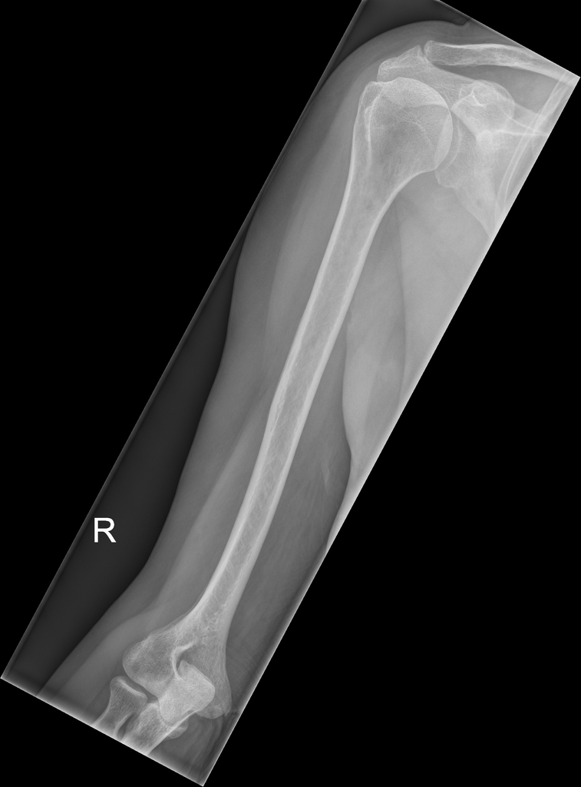 | 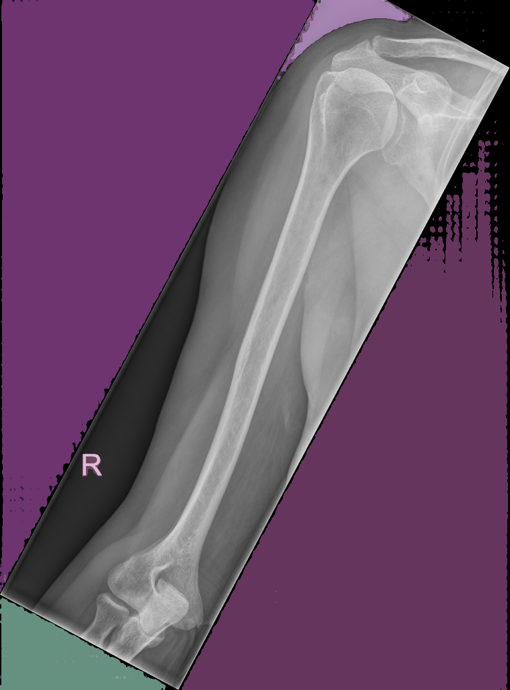 | 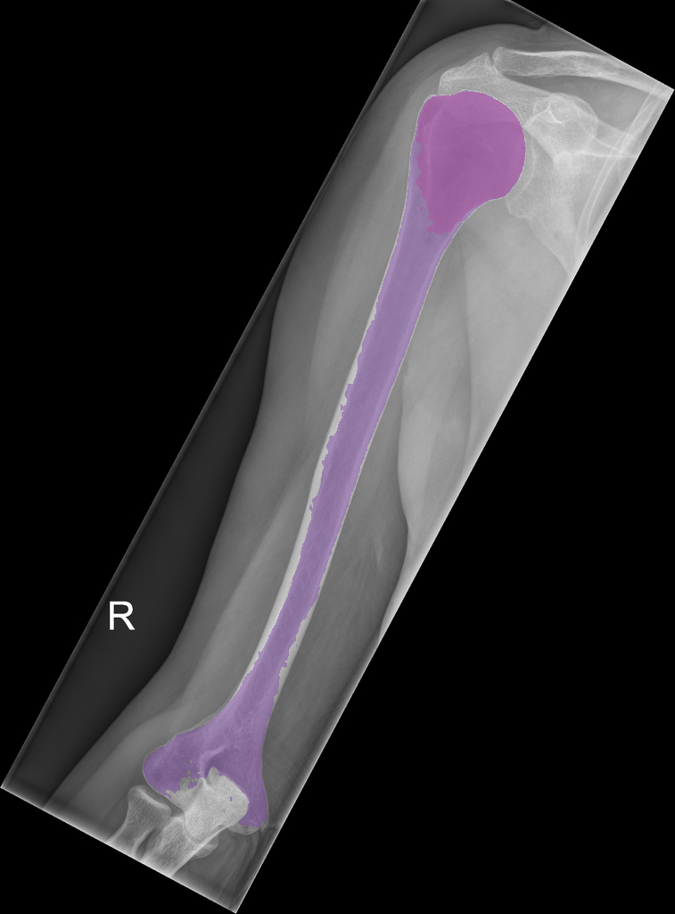 | 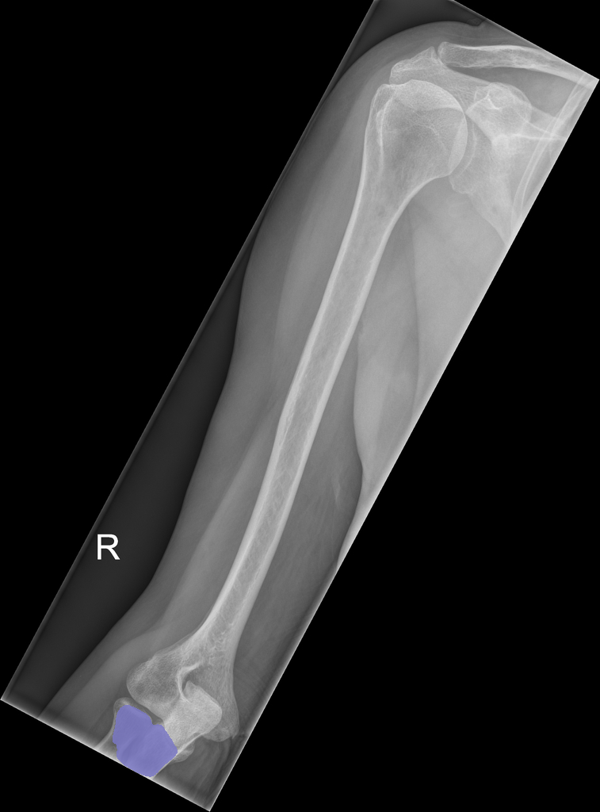 |

- **背景信息：**Age: 69 Gender: Female; Patient complaining of severe left shoulder and right humeral pain.；69 岁女性，左肩及右肱骨剧烈疼痛。
- **原始图片 caption：**

<pre>There is a subtle lytic lesion in proximal right humerus.</pre>

- **原始图片 caption 翻译：**右侧肱骨近端可见细微溶骨性病灶。

<strong>InternVL3-14B</strong>

**Segmentation 对 caption 的总体影响：**负向：参考关键点减少或被错误结论取代

**原始图像 → Single-image caption 回答**

英文原始回答：

<pre>The X-ray image shows the right upper arm (humerus) in a frontal view. The patient is a 69-year-old female presenting with severe left shoulder and right humeral pain.

### Observable Features:
1. **Bone Structure:**
   - The humeral head appears to be well-articulated with the glenoid cavity of the scapula, indicating a proper shoulder joint alignment.
   - The humeral shaft appears to be intact without any obvious fractures or dislocations.
   - Both the proximal and distal ends of the humerus show normal bone density and structure without signs of acute injury.

2. **Joint Space:**
   - The joint space at the shoulder appears to be normal, without significant narrowing which could suggest osteoarthritis.

3. **Soft Tissue:**
   - There is no significant soft tissue swelling or abnormal calcifications visible around the humerus or shoulder joint on this X-ray.

### Possible Diagnoses:
Given the patient&#x27;s symptoms and examination findings:

1. **Rotator Cuff Tendinitis or Impingement:**
   - While the X-ray does not directly show rotator cuff pathology, shoulder pain can be related to rotator cuff tendinitis or impingement syndrome. This condition often requires clinical correlation with physical examination findings and may need further imaging like an MRI.

2. **Proximal Humerus Fracture:**
   - Though no acute fracture lines are visible, a subtle fracture could be missed on an X-ray. Given the patient’s age, fractures such as a proximal humerus fracture are relatively common in the elderly due to osteoporosis.

3. **Osteoarthritis:**
   - Early osteoarthritis might present with joint space narrowing or osteophytes, which do not seem prominent in this X-ray. However, symptoms could still be due to degenerative changes necessitating further assessment.

4. **Subacromial/Supraspinatus Bursitis:**
   - Inflammation of the bursa around the shoulder joint can cause significant pain. This condition might not be directly visible on an X-ray, but symptoms should be correlated with clinical findings.

5. **Adhesive Capsulitis (Frozen Shoulder):**
   - This condition can cause shoulder stiffness and pain but would typically involve a range of motion limitations which would need to be assessed clinically.

### Conclusion:
The X-ray does not show any acute fractures or obvious degenerative changes like significant narrowing of the joint space, but the patient’s symptoms are suggestive of other shoulder pathologies such as rotator cuff tendinitis, impingement, or early osteoarthritis. Given her age and symptomatology, a more comprehensive diagnostic approach such as an MRI or ultrasound might be warranted to evaluate the soft tissues and confirm the presence of tendinopathy or other subtle pathologies.

### Next Steps:
1. **Clinical Evaluation:**
   - Detailed physical examination focusing on range of motion, strength, and specific provocative tests for rotator cuff and impingement syndromes.
   
2. **Additional Imaging:**
   - MRI of the shoulder to evaluate the rotator cuff, labrum, and surrounding soft tissues for any pathology.

3. **Intervention:**
   - Depending on the findings, treatments may range from conservative management (physical therapy, NSAIDs) to surgical intervention if significant rotator cuff tear or fracture is confirmed. 

By integrating clinical findings with further imaging, a more precise diagnosis and effective management plan can be formulated.</pre>

中文医学要点：

<pre>回答提及或最终倾向的诊断包括：骨关节炎。涉及的主要影像要点包括：钙化。</pre>

**原始图像 + Segmentation → Single-image caption 回答**

英文原始回答：

<pre>Upon examining the provided X-ray image of the right humerus, we observe the following:

### Image Description
1. **Patient Information**:
   - **Age**: 69
   - **Gender**: Female
   - **Symptoms**: Severe left shoulder and right humeral pain

2. **X-ray Modality and Region**:
   - **Modality**: X-ray
   - **View**: Frontal view of the right humerus

3. **Visual Inspection of X-ray**:
   - The X-ray clearly shows the right humerus bone extending from the shoulder (proximal end) to the elbow (distal end).
   - The bone structure appears generally intact, with no obvious fractures or dislocations.
   - There are no apparent abnormalities in the bone density or alignment when assessed at first glance.

### Relevant Observations for Diagnosis
Given the patient&#x27;s symptoms (left shoulder and right humeral pain), the X-ray results should be correlated with clinical findings:

1. **Osteoarthritis**:
   - In a patient with her age, osteoarthritis is a common condition to consider, especially since she is presenting with shoulder and humeral pain.
   - However, this X-ray does not show significant signs of osteoarthritis like joint space narrowing, subchondral sclerosis, or osteophyte formation at the humeral head.

2. **Osteoporosis**:
   - Another age-related condition to consider is osteoporosis, which could lead to bone fractures from relatively minor trauma and cause pain.
   - The bone appears to have normal density; however, a detailed assessment or additional imaging might be necessary to rule out early signs or subclinical osteoporosis.

3. **Humeral Lesions or Pathologies**:
   - The segmentations provided might suggest interest in the humeral head and shaft areas, possibly hinting at a more detailed analysis requirement.
   - BiomedParse segmentation highlighted the distal humerus/shaft region, while Medical-SAM3 and Medical-SAM2 indicated more proximal regions – possibly looking for pathologies such as bone cysts, stress fractures, or other bone lesions.

4. **Other Considerations**:
   - Muscle or soft tissue issues: Since X-rays do not show muscles or soft tissues clearly, the pain may be due to rotator cuff problems, bursitis, or other shoulder pathologies.
   - Tendinitis or bursitis in the shoulder area can also cause referred pain along the arm.
   - Arthritis of the shoulder joint (glenohumeral arthritis) could be another potential cause of pain that radiates.

### Conclusion and Recommendations
Given the current X-ray findings and the patient&#x27;s symptoms:
- No acute fractures or dislocations are evident on this X-ray.
- Further clinical correlation and possibly additional imaging (like MRI for soft tissues or CT for more detailed bone analysis) may be required to pinpoint the cause of shoulder and humeral pain.
- Consider evaluating for rotator cuff injuries, tendinitis, or arthritis which might cause similar symptoms.
- A rheumatology referral or orthopedic assessment might provide further diagnostic guidance and treatment options, especially considering potential soft tissue or intra-articular conditions.

Thus, although the X-ray does not reveal a clear-cut diagnosis for the patient&#x27;s pain, it does not rule out common musculoskeletal issues that would require a comprehensive clinical evaluation.</pre>

中文医学要点：

<pre>回答提及或最终倾向的诊断包括：骨关节炎。未提取到与参考病灶高度特异的影像征象。</pre>

**Segmentation 对 caption 的影响分析：**

原始 caption：肱骨近端（文本提及）；加入 segmentation 后：未命中核心征象。加入 segmentation 后参考证据减少，说明 mask 或其文本提示产生了干扰，不能视为 caption 改善。该判断以是否接近 Radiopaedia 原始 caption 为准，不依据回答篇幅。

<strong>InternVL3.5-14B</strong>

**Segmentation 对 caption 的总体影响：**无明确增益：仅在鉴别或否定语境中提及关键点

**原始图像 → Single-image caption 回答**

英文原始回答：

<pre>&lt;think&gt;
Okay, let&#x27;s start by looking at the X-ray image provided. The patient is a 69-year-old female with severe left shoulder and right humeral pain. Wait, the X-ray image is labeled as &quot;R&quot; which stands for right. But the patient is complaining about left shoulder and right humeral pain. Hmm, that&#x27;s a bit confusing. Maybe there&#x27;s a mix-up, or perhaps the X-ray is of the right shoulder and humerus, but the symptoms are on both sides? Or maybe the patient has issues on both sides but the image is just one side.

Looking at the X-ray image: it&#x27;s a frontal view of the right shoulder and upper arm. The bones visible are the humerus, scapula, clavicle, and part of the upper arm. The image seems to show the right humerus. The patient&#x27;s complaint includes right humeral pain, so the X-ray is relevant for that. The left shoulder pain isn&#x27;t visible here. Maybe the left shoulder has a different issue, but the image only shows the right.

Now, analyzing the right humerus. The X-ray appears to be a normal frontal view. The joint spaces, bone alignment, and density seem normal. No obvious fractures, dislocations, or gross abnormalities. The humeral head is properly seated in the glenoid cavity. The cortical bone is intact, and the medullary cavity looks normal. No signs of osteoporosis or lytic lesions. The surrounding soft tissues don&#x27;t show any obvious swelling or calcifications.

But the patient is experiencing severe pain. If the X-ray is normal, maybe the issue is soft tissue-related, like rotator cuff tendinitis, bursitis, or a labral tear. These conditions might not show up on a standard X-ray. Alternatively, early osteoarthritis could be present, but there might not be significant joint space narrowing yet. Another possibility is referred pain from another area, like cervical spine issues, but that&#x27;s less likely if the X-ray is normal.

Wait, the patient&#x27;s age is 69, which is a risk factor for osteoporosis and fractures. Even if the X-ray looks normal, maybe there&#x27;s a subtle fracture that&#x27;s not visible. Stress fractures or insufficiency fractures could occur in osteoporotic bone. The image might need a closer look for any linear lucencies or cortical irregularities. Alternatively, a subacromial impingement syndrome could cause pain without visible bone changes.

Since the X-ray is normal, the diagnosis might be non-traumatic. Conditions like adhesive capsulitis (frozen shoulder) can cause significant pain but usually don&#x27;t show specific findings on X-ray. Rotator cuff tears might not be visible unless there&#x27;s calcific deposits, which would appear as calcifications on X-ray. If there&#x27;s no calcification, an MRI would be needed.

In summary, the right humeral X-ray is normal, so the pain might be due to soft tissue issues, early arthritis, or referred pain. The left shoulder pain isn&#x27;t visible here, so further imaging of the left shoulder (like X-ray or MRI) would be needed. The diagnosis for the right humerus based on this X-ray alone might be a normal study with no acute bony abnormalities, suggesting a non-osseous cause of pain.
&lt;/think&gt;

**Image Description:**  
The provided X-ray is a frontal view of the right shoulder and humerus (labeled &quot;R&quot;). The image shows the humeral head, glenoid cavity, scapula, clavicle, and proximal humerus. The bone alignment appears normal, with no visible fractures, dislocations, or gross deformities. The cortical bone is intact, and the joint spaces are preserved. There are no obvious signs of osteoporosis, lytic lesions, or calcifications. Soft tissue structures (e.g., rotator cuff, bursa) are not clearly visualized on this modality.

**Diagnosis and Clinical Correlation:**  
1. **Right Humeral Pain:**  
   - The X-ray is unremarkable, suggesting no acute bony pathology (e.g., fracture, arthritis, or tumor).  
   - **Possible Causes:**  
     - **Soft Tissue Injury:** Rotator cuff tendinopathy, subacromial impingement, or adhesive capsulitis (frozen shoulder) are common in this age group and may present with pain without radiographic abnormalities.  
     - **Referred Pain:** Cervical radiculopathy or thoracic outlet syndrome could mimic shoulder pain.  
     - **Early Osteoarthritis:** Minimal joint space narrowing or osteophytes may not be evident on plain film.  

2. **Left Shoulder Pain (Not Visualized):**  
   - The X-ray does not include the left shoulder, so evaluation for left-sided pathology (e.g., rotator cuff tear, labral injury, or glenohumeral arthritis) requires additional imaging (e.g., MRI or dedicated shoulder X-rays).  

**Recommendations:**  
- **Further Imaging:** MRI of the right shoulder to assess soft tissues (rotator cuff, labrum) and left shoulder for correlation with symptoms.  
- **Clinical Assessment:** Physical exam for range of motion, strength, and neurological deficits. Blood tests (e.g., ESR, CRP) if inflammatory arthritis is suspected.  
- **Consider Referral:** Orthopedics or rheumatology for persistent pain unexplained by imaging.  

**Conclusion:**  
The right humeral X-ray is normal, indicating non-osseous etiology for pain (e.g., tendinopathy, impingement). Left shoulder pathology cannot be assessed and requires further evaluation.</pre>

中文医学要点：

<pre>回答提及或最终倾向的诊断包括：骨关节炎、检查未见明显异常。涉及的主要影像要点包括：钙化、溶骨性病灶。</pre>

**原始图像 + Segmentation → Single-image caption 回答**

英文原始回答：

<pre>&lt;think&gt;
Okay, let&#x27;s start by looking at the patient&#x27;s information. The patient is a 69-year-old female complaining of severe left shoulder and right humeral pain. Wait, that&#x27;s interesting because the X-ray provided is of the right humerus. So the pain is in the left shoulder but the image is of the right arm. Maybe there&#x27;s a typo, or perhaps the patient has issues in both arms but the image is just one side. I need to note that discrepancy.

Looking at the X-ray: it&#x27;s a frontal view of the right humerus. The image shows the bone structure from the shoulder down to the elbow. The segmentation images highlight the bone, bone lesions, and humerus. In the segmented images, especially the Medical-SAM3, there&#x27;s a highlighted area around the shoulder joint and the shaft of the humerus. The BiomedParse segmentation also marks the humerus but with a blue area at the elbow, maybe indicating a lesion there?

The patient&#x27;s age is 69, so degenerative changes are possible. Common issues in older adults include osteoarthritis, rotator cuff issues, or fractures. However, the X-ray doesn&#x27;t show obvious fractures. The right humerus in the image seems intact without visible fractures. The left shoulder pain isn&#x27;t visible here, but maybe the right humerus has some degenerative changes contributing to referred pain?

Wait, the presentation mentions right humeral pain. The X-ray is of the right humerus, so that&#x27;s relevant. The image might show signs of osteoarthritis, like joint space narrowing, subchondral sclerosis, or osteophytes. The shoulder (glenohumeral joint) and the elbow (olecranon process) are parts of the humerus visible here. If there&#x27;s osteoarthritis in the shoulder, that could explain shoulder pain. But the patient also has right humeral pain. Maybe the shaft of the humerus has some periostitis or other changes?

Looking at the segmented images, Medical-SAM3 highlights the entire humerus and shoulder joint. If there&#x27;s a bone lesion, it might be in the metaphysis or diaphysis. However, in the provided X-ray, there&#x27;s no obvious lytic or blastic lesion. The bone appears continuous. The BiomedParse segmentation shows a blue area at the elbow, perhaps indicating a region of interest there. Maybe early signs of osteoarthritis at the elbow?

Alternatively, could it be a rotator cuff tear? X-rays aren&#x27;t great for soft tissues, but sometimes a rotator cuff tear can lead to a Hill-Sachs lesion on the humeral head. If the shoulder joint shows any deformities, that might indicate a prior dislocation or rotator cuff issue. The X-ray here doesn&#x27;t show obvious dislocation, but maybe subtle changes.

Another possibility is referred pain from the cervical spine, like a pinched nerve, but that&#x27;s less likely to show on a shoulder X-ray. The patient&#x27;s age also raises the possibility of avascular necrosis, especially if there&#x27;s corticosteroid use history, but that&#x27;s not mentioned here.

Wait, the patient is complaining of left shoulder and right humeral pain. The X-ray is right. Maybe the right humerus has a condition causing referred pain to the left? That seems less likely. More probable that there are separate issues: left shoulder problem (not imaged) and right humerus issue (seen here). But since the X-ray is normal-appearing, perhaps the right humerus doesn&#x27;t show anything, so the pain could be muscular or soft tissue.

But the user is asking based on the image. So focusing on the right humerus X-ray. If there&#x27;s no fracture, dislocation, or obvious lesion, then the diagnosis might be something else. However, the segmentation tools highlighted certain areas. Maybe the AI detected subtle changes not obvious to the human eye. For example, periosteal reaction, slight cortical irregularities, or early osteoporosis.

In elderly patients, even minor trauma can cause pain, but without fracture. Osteoporosis could lead to bone fragility. The X-ray might show reduced bone density. If the bone lesion segmentation is highlighting areas, maybe indicating osteopenia or early osteoporotic changes.

Alternatively, could it be a bone island or enchondroma? Those are usually benign and asymptomatic, but if large, might cause pain. The X-ray would show a well-defined radiopaque or radiolucent area. Not sure if that&#x27;s present here.

Another thought: the patient&#x27;s pain in the right humerus might be due to a soft tissue issue like bursitis or tendinitis, which X-rays don&#x27;t show. But the question is about the X-ray findings.

Given the information, the X-ray of the right humerus appears normal without acute fractures or dislocations. The segmentation might have marked areas that are within normal variation. The diagnosis could be musculoskeletal pain without radiographic evidence, possibly due to osteoarthritis, rotator cuff tendinopathy, or referred pain from another source. But since the image is normal, the diagnosis might be something like osteoarthritis of the shoulder or elbow, or soft tissue injury not visible on X-ray.

Wait, the BiomedParse highlighted the elbow area (blue). Maybe osteophytes at the elbow joint causing pain. Osteoarthritis of the elbow could refer pain to the humerus. Similarly, shoulder osteoarthritis could cause shoulder pain and possibly radiate.

In conclusion, based on the X-ray, if no acute bony abnormalities, the diagnosis might be degenerative joint disease (osteoarthritis) of the shoulder or elbow, leading to referred pain. Alternatively, soft tissue pathology like rotator cuff disease. The right humerus itself might not show issues, but the joints (shoulder or elbow) could have degenerative changes.
&lt;/think&gt;

**Image Description and Diagnosis:**

**Patient Background:**  
A 69-year-old female presents with severe **left shoulder pain** and **right humeral pain**. The provided X-ray is a **frontal view of the right humerus**, which may indicate a focus on the right side despite left shoulder symptoms (possible referral or separate issues).

**X-ray Findings:**  
- **Bone Structure:** The right humerus appears intact without acute fractures, dislocations, or gross deformities.  
- **Joints:**  
  - **Glenohumeral (shoulder) joint:** No obvious dislocation or advanced osteoarthritis (e.g., joint space narrowing, osteophytes). Subtle degenerative changes (e.g., minimal osteophytes) may be present but not definitive.  
  - **Elbow (olecranon):** Segmentation tools (BiomedParse) highlight the elbow region, suggesting possible early osteoarthritic changes (e.g., osteophytes, subchondral sclerosis) contributing to localized pain.  
- **Bone Lesions:** No radiopaque lytic/blastic lesions or periosteal reactions visible. Segmentation highlights may indicate normal anatomical variations or mild osteopenia.  

**Diagnosis Considerations:**  
1. **Osteoarthritis:**  
   - Likely contributor to shoulder/elbow pain. The right humerus’ elbow joint may show early degenerative changes, explaining localized pain. Referred pain from shoulder osteoarthritis could contribute to left shoulder discomfort.  
2. **Rotator Cuff Pathology:**  
   - X-rays are not definitive, but rotator cuff tendinopathy or partial tears (e.g., causing a Hill-Sachs lesion) may underlie shoulder pain.  
3. **Soft Tissue or Referred Pain:**  
   - Muscular strain, bursitis, or cervical radiculopathy (not visible on X-ray) could explain mismatched pain locations.  
4. **Osteoporosis:**  
   - Age-related bone density loss may contribute to pain without structural abnormalities.  

**Conclusion:**  
The right humerus X-ray shows no acute bony abnormalities. Pain likely stems from **degenerative joint disease** (osteoarthritis of the shoulder/elbow) or **soft tissue pathology** (e.g., rotator cuff tendinopathy). Further evaluation with shoulder-specific X-rays, MRI, or clinical correlation is recommended to address the left shoulder symptoms and confirm the source of right humeral pain.  

**Next Steps:**  
- Correlate with physical exam (range of motion, tenderness).  
- Consider imaging of the left shoulder or advanced imaging (MRI) for soft tissues.  
- Evaluate for systemic causes (e.g., osteoporosis, inflammatory arthritis).</pre>

中文医学要点：

<pre>回答提及或最终倾向的诊断包括：骨关节炎。未提取到与参考病灶高度特异的影像征象。</pre>

**Segmentation 对 caption 的影响分析：**

原始 caption：溶骨性病灶（否定/鉴别）、肱骨近端（否定/鉴别）；加入 segmentation 后：未命中核心征象。前后都没有覆盖决定性征象；回答即使变长，也不能视为有效的视觉理解增益。该判断以是否接近 Radiopaedia 原始 caption 为准，不依据回答篇幅。

<strong>Lingshu-32B</strong>

**Segmentation 对 caption 的总体影响：**无明确增益：仅在鉴别或否定语境中提及关键点

**原始图像 → Single-image caption 回答**

英文原始回答：

<pre>The X-ray image shows a frontal view of the right humerus. The bone structure appears intact with no visible fractures or dislocations. The cortical margins are smooth, and there is no evidence of periosteal reaction or lytic lesions. The joint spaces, including the shoulder joint, appear normal without any signs of degenerative changes such as osteophytes or joint space narrowing. Given the absence of acute bony abnormalities, the pain reported by the patient may be due to soft tissue issues, such as tendinitis, bursitis, or muscle strain, rather than a bone-related pathology. Further clinical correlation and possibly additional imaging or tests would be necessary to determine the exact cause of the patient&#x27;s symptoms.</pre>

中文医学要点：

<pre>回答未形成可稳定提取的明确疾病结论。涉及的主要影像要点包括：溶骨性病灶。</pre>

**原始图像 + Segmentation → Single-image caption 回答**

英文原始回答：

<pre>The X-ray image shows the right humerus in a frontal view. The humerus appears to be intact with no visible fractures or dislocations. The bone density seems normal, and there are no obvious signs of osteolytic or sclerotic lesions. The joint spaces, including the shoulder joint, appear well-preserved without any apparent abnormalities. Given the patient&#x27;s complaint of severe left shoulder and right humeral pain, it is possible that the pain could be due to soft tissue injury, tendinitis, or other non-structural causes not visible on this X-ray. Further clinical evaluation and possibly additional imaging, such as an MRI, might be necessary to identify the exact cause of the pain.</pre>

中文医学要点：

<pre>回答未形成可稳定提取的明确疾病结论。未提取到与参考病灶高度特异的影像征象。</pre>

**Segmentation 对 caption 的影响分析：**

原始 caption：溶骨性病灶（否定/鉴别）；加入 segmentation 后：溶骨性病灶（否定/鉴别）。前后都没有覆盖决定性征象；回答即使变长，也不能视为有效的视觉理解增益。该判断以是否接近 Radiopaedia 原始 caption 为准，不依据回答篇幅。

<strong>MedGemma-27B-IT</strong>

**Segmentation 对 caption 的总体影响：**正向：新增或强化参考关键点

**原始图像 → Single-image caption 回答**

英文原始回答：

<pre>**Image Description:**

The image is a frontal X-ray of the left humerus. It shows a significant deformity of the bone, specifically a fracture. The fracture appears to be located in the mid-shaft region of the humerus. There is a clear break in the bone&#x27;s continuity, with displacement and angulation of the distal fragment relative to the proximal fragment. The bone fragments are separated by a gap, indicating a complete fracture. The overall shape of the humerus is distorted due to the fracture.

**Diagnosis:**

Based on the X-ray findings and the patient&#x27;s complaint of severe left shoulder and right humeral pain (although the X-ray is of the left humerus, the pain description might be inaccurate or refer to multiple issues), the most likely diagnosis is a **fracture of the left humerus shaft**. The severity and displacement suggest it could be a displaced mid-shaft humeral fracture.

**Additional Considerations:**

*   **Patient&#x27;s Age and Gender:** The patient is a 69-year-old female. Older individuals, especially women, are at higher risk for fractures due to osteoporosis. This could be a fragility fracture.
*   **Pain Location:** The patient reports pain in the left shoulder and right humerus. The X-ray confirms a left humerus fracture. The right humeral pain needs further investigation, as it could be related or unrelated.
*   **Further Evaluation:** A clinical examination and potentially additional imaging (like CT scan if complex) might be needed to fully assess the fracture pattern, displacement, and any associated soft tissue injuries. Treatment will depend on the fracture type, displacement, and patient factors.</pre>

中文医学要点：

<pre>回答未形成可稳定提取的明确疾病结论。未提取到与参考病灶高度特异的影像征象。</pre>

**原始图像 + Segmentation → Single-image caption 回答**

英文原始回答：

<pre>**Image Description:**

The image is a frontal X-ray of the left shoulder and upper arm. It shows the humerus bone, the shoulder joint, and the surrounding soft tissues. The humerus appears intact along its shaft. However, there is a significant abnormality at the proximal end of the humerus, specifically the humeral head and neck region. The humeral head appears somewhat flattened or irregular, and there is a noticeable deformity or lesion in the region where the humeral neck joins the head. The overall bone structure appears somewhat osteopenic, which is common in older individuals.

**Analysis of Segmentations:**

*   **Medical-SAM2:** This segmentation highlights the entire humerus bone in purple.
*   **Medical-SAM3:** This segmentation specifically identifies the humerus bone in light blue, the bone lesion in purple, and the bone in dark blue. The purple lesion is located at the proximal end of the humerus, corresponding to the humeral head/neck region.
*   **BiomedParse:** This segmentation identifies the humerus bone in light blue and the bone lesion in purple, again located at the proximal end of the humerus.

**Correlation with Patient Presentation:**

The patient is a 69-year-old female complaining of severe left shoulder and right humeral pain. The X-ray shows a significant lesion/deformity at the proximal end of the left humerus (the shoulder joint area). The right humeral pain is not clearly visible on this left shoulder X-ray, but the left shoulder pathology is evident.

**Diagnosis:**

Based on the X-ray findings and the segmentations highlighting a lesion at the proximal humerus, the most likely diagnosis is a **pathological fracture** or a **tumor** involving the proximal humerus.

*   **Pathological Fracture:** The lesion could represent a weakened area of bone (e.g., due to osteoporosis, metastasis, or a primary bone tumor) that has fractured under normal stress. The deformity suggests a fracture line or significant bone destruction.
*   **Primary Bone Tumor:** Less common, but possible, especially given the patient&#x27;s age.
*   **Metastatic Disease:** Given the patient&#x27;s age, metastatic disease to the bone is a significant consideration.

**Further Steps:**

To confirm the diagnosis and determine the exact nature of the lesion, further imaging studies like MRI or CT scans would be necessary. A bone scan could also be helpful to assess for other potential sites of involvement if metastasis is suspected. A biopsy might be required for definitive diagnosis, especially if a tumor is suspected.

**Summary:**

The X-ray shows a significant abnormality/lesion at the proximal end of the left humerus, consistent with the patient&#x27;s complaint of left shoulder pain. The segmentations confirm the location of the lesion. The most likely diagnoses are a pathological fracture or a tumor (primary or metastatic). Further investigation is required.</pre>

中文医学要点：

<pre>回答未形成可稳定提取的明确疾病结论。未提取到与参考病灶高度特异的影像征象。</pre>

**Segmentation 对 caption 的影响分析：**

原始 caption：未命中核心征象；加入 segmentation 后：肱骨近端（文本提及）。加入 segmentation 后参考证据增加，说明 overlay 至少改善了相关结构或病灶的注意力分配。该判断以是否接近 Radiopaedia 原始 caption 为准，不依据回答篇幅。

<strong>MedMO-8B</strong>

**Segmentation 对 caption 的总体影响：**有帮助：从未见骨折转为发现溶骨性病灶

**原始图像 → Single-image caption 回答**

英文原始回答：

<pre>There is no fracture.</pre>

中文要点翻译：

<pre>未见骨折。</pre>

**原始图像 + Segmentation → Single-image caption 回答**

英文原始回答：

<pre>There is a lytic lesion in the distal humerus.</pre>

中文要点翻译：

<pre>肱骨远端可见溶骨性病灶。</pre>

**对模型图片 caption 能力及 Segmentation 影响的分析：**

segmentation 使模型从完全忽略异常转为明确报告溶骨性病灶，说明候选区域对低对比度骨病灶有帮助；但它把病灶位置误写成肱骨远端，参考 caption 实为右肱骨近端，也没有进一步联系多发性骨髓瘤。

<strong>Qwen3-VL-4B</strong>

**Segmentation 对 caption 的总体影响：**无帮助：前后均未命中参考核心征象

**原始图像 → Single-image caption 回答**

英文原始回答：

<pre>The image is a frontal (anteroposterior) X-ray of the right upper limb, clearly labeled “R” to indicate the right side. The image shows the right humerus from the shoulder joint down to the elbow, with the proximal end articulating with the scapula (glenoid cavity), the midshaft, and the distal end articulating with the radius and ulna at the elbow.

**Radiographic Findings:**
- The bone structure appears intact with no obvious fractures, dislocations, or acute osteomyelitis.
- There is no visible bone deformity or significant osteoporosis.
- The joint spaces appear normal, and the cortical margins are continuous.
- No signs of acute trauma, such as comminuted fractures or significant soft tissue swelling, are visible.

**Clinical Context:**
The patient is a 69-year-old female presenting with severe pain in the left shoulder and right humeral region. The X-ray image is of the right side, which is not the side primarily reported as painful (left shoulder). However, the image is likely being reviewed to rule out a bone pathology in the right arm that might be contributing to or associated with the patient’s symptoms, or perhaps the patient is experiencing referred pain or a bilateral issue.

**Diagnosis:**
Given the clinical presentation and the X-ray findings, the most likely diagnosis is **chronic shoulder pain (left) and/or right humeral pain due to non-acute musculoskeletal pathology**. The X-ray does not reveal any acute fractures or osteomyelitis, which suggests the pain is likely due to:

- **Rotator cuff tendinitis or impingement syndrome** (most common cause of shoulder pain in older adults).
- **Osteoarthritis of the shoulder joint** (common in elderly patients).
- **Tendinopathy or bursitis** of the shoulder or elbow region.
- **Possible referred pain** from a cervical spine issue or systemic condition (e.g., fibromyalgia, rheumatoid arthritis).

**Important Note:**
The X-ray does not show any pathology in the right humerus. The right humeral pain may be due to non-bony causes, such as muscle strain, tendinitis, or referred pain from the cervical spine or thoracic region. The left shoulder pain is more likely due to a rotator cuff or joint-related issue, which is common in older adults.

**Recommendation:**
Further evaluation with MRI or ultrasound of the shoulder and elbow, along with a detailed history and physical examination, is warranted. Pain management, physical therapy, and possibly anti-inflammatory medications may be initiated pending further diagnostic workup.

**Conclusion:**
The X-ray is normal for the right humerus. The patient’s pain is likely due to non-acute musculoskeletal conditions, with the left shoulder pain most likely originating from rotator cuff or joint pathology, and the right humeral pain possibly due to non-bony musculoskeletal causes or referred pain. No acute bony pathology is evident.</pre>

中文医学要点：

<pre>回答提及或最终倾向的诊断包括：骨关节炎、骨髓炎。未提取到与参考病灶高度特异的影像征象。</pre>

**原始图像 + Segmentation → Single-image caption 回答**

英文原始回答：

<pre>Based on the provided patient data and imaging, here is the analysis:

**Patient Background:**
- Age: 69 years
- Gender: Female
- Presentation: Severe pain in the left shoulder and right humeral region.

**Image Analysis:**
The image is an X-ray of the right upper limb, taken in the frontal (anterior-posterior) view. The &quot;R&quot; marker confirms this is the right side of the body.

The segmentation masks from different AI models (Medical-SAM2, Medical-SAM3, BiomedParse) are applied to the image, highlighting the humerus bone and its proximal and distal ends. The segmentation masks are consistent across models, indicating the bone structure is intact and there is no apparent lesion or fracture in the humeral shaft.

**Diagnosis:**
The X-ray shows no evidence of a fracture, dislocation, or bone lesion in the right humerus. The patient&#x27;s complaint of severe pain in the right humeral region is not explained by the imaging findings. However, the pain is also reported in the left shoulder, which is not visualized in this image.

**Conclusion:**
The X-ray of the right humerus is normal, with no visible pathology. The patient&#x27;s severe pain is likely due to a non-osseous (non-bone-related) cause, such as:
- A musculoskeletal issue (e.g., rotator cuff tear, bursitis, tendinitis) in the left shoulder.
- A soft tissue injury, nerve compression, or referred pain.
- A non-acute, chronic condition such as osteoarthritis or degenerative joint disease affecting the shoulder.

**Recommendation:**
Further clinical evaluation is needed. The patient should be examined for soft tissue pathology in the left shoulder and possibly the right shoulder as well. A physical examination, MRI if indicated, and possibly a referral to a rheumatologist or orthopedic specialist may be warranted to determine the source of the pain.

**Final Diagnosis:**
**Normal right humerus on X-ray.** The patient&#x27;s pain is likely due to a non-bony pathology, most likely involving soft tissues or joint structures, particularly in the left shoulder. Further diagnostic evaluation is required.</pre>

中文医学要点：

<pre>回答提及或最终倾向的诊断包括：骨关节炎。未提取到与参考病灶高度特异的影像征象。</pre>

**Segmentation 对 caption 的影响分析：**

原始 caption：未命中核心征象；加入 segmentation 后：未命中核心征象。前后都没有覆盖决定性征象；回答即使变长，也不能视为有效的视觉理解增益。该判断以是否接近 Radiopaedia 原始 caption 为准，不依据回答篇幅。

<strong>Qwen3-VL-8B</strong>

**Segmentation 对 caption 的总体影响：**无帮助：前后均未命中参考核心征象

**原始图像 → Single-image caption 回答**

英文原始回答：

<pre>Based on the provided patient data and image, here is the analysis:

**Image Description:**
The image is a frontal (anteroposterior) X-ray of the right upper limb, clearly marked with “R” at the distal end. It shows the right humerus from the shoulder joint down to the elbow. The bone appears intact without any visible fractures, dislocations, or obvious pathological lesions. The alignment of the humeral shaft and the articulation at the shoulder joint appear normal. There is no evidence of osteopenia, osteosclerosis, or bone destruction.

**Clinical Context:**
The patient is a 69-year-old female presenting with severe left shoulder and right humeral pain. The X-ray shown is of the right arm, which is clinically irrelevant to the patient’s symptoms — the pain is localized to the left shoulder and right humerus.

**Diagnosis:**
The X-ray does not show any abnormalities in the right humerus. Therefore, it does not explain the patient’s symptoms.

However, the patient’s symptoms — severe pain in the left shoulder and right humerus — are not consistent with a simple musculoskeletal injury. Given her age, the most likely diagnosis is:

&gt; **Left Shoulder Pathology (e.g., Rotator Cuff Tear, Calcific Tendinitis, or Osteoarthritis) — likely the primary source of pain.**

The pain in the “right humeral” region is likely a misstatement or mislocalization. The patient may be experiencing pain radiating from the left shoulder down the right arm (e.g., due to referred pain or a neurological issue like cervical radiculopathy), or she may be experiencing bilateral pain from an underlying systemic condition (e.g., osteoporosis, malignancy, or rheumatoid arthritis). However, the X-ray does not show any abnormalities in the right humerus.

**Recommendation:**
- Obtain an X-ray of the left shoulder to evaluate for rotator cuff tears, osteoarthritis, or other pathology.
- Consider an MRI of the left shoulder for soft tissue evaluation.
- Evaluate for cervical spine pathology if neurological symptoms are present.
- Consider systemic workup if pain is persistent or associated with other symptoms.

In summary, the X-ray is normal for the right humerus and does not explain the patient’s symptoms. The diagnosis should focus on the left shoulder and potentially systemic causes.</pre>

中文医学要点：

<pre>回答提及或最终倾向的诊断包括：骨关节炎。未提取到与参考病灶高度特异的影像征象。</pre>

**原始图像 + Segmentation → Single-image caption 回答**

英文原始回答：

<pre>Based on the provided information, here is the analysis of the image and the diagnosis:

**Image Description:**
The image is a frontal X-ray of the right upper extremity, clearly marked with an &quot;R&quot; indicating it is the right side. The image shows the right humerus (upper arm bone) from the shoulder joint down to the elbow joint. The bone appears to have a normal, smooth, continuous cortical outline and trabecular pattern without any visible fractures, dislocations, or obvious bone lesions. The shoulder joint (glenohumeral joint) appears intact. There is no evidence of bone destruction, osteopenia, or abnormal calcifications. The soft tissues surrounding the bone appear normal.

**Clinical Context:**
The patient is a 69-year-old female presenting with severe pain in the left shoulder and right humeral region. This is a key point: the patient&#x27;s symptoms are localized to the *left* shoulder and the *right* humerus, while the X-ray is of the *right* humerus.

**Diagnosis:**
The X-ray of the right humerus is **normal**. There is no evidence of fracture, dislocation, or bone pathology on this view.

**Clinical Implication:**
The normal X-ray of the right humerus suggests that the pain in the right humeral region is likely not due to a structural bone injury. The severe pain in the *left* shoulder is more concerning and warrants further investigation, as it could be due to:
- Rotator cuff pathology (e.g., tear, tendinitis)
- Shoulder joint arthritis
- Bursitis
- A soft tissue injury (e.g., strain, contusion)
- Referred pain from other sources (e.g., cervical spine, heart, gallbladder)

**Conclusion:**
The X-ray findings do not support a diagnosis of a bone injury in the right humerus. The patient&#x27;s symptoms are likely not related to the right humerus, and further evaluation of the left shoulder is necessary to determine the cause of her pain. The right humerus is normal.

**Note:** The segmentation masks provided (Medical-SAM2, Medical-SAM3, BiomedParse) appear to be incorrect or irrelevant for this case, as they highlight areas that are not clinically significant or do not correspond to the patient&#x27;s symptoms. The BiomedParse mask, for example, highlights only the distal humerus (elbow area), which is not the primary site of pain. The Medical-SAM3 mask highlights the entire humerus, which is appropriate, but the patient&#x27;s symptoms are not related to the right humerus.</pre>

中文医学要点：

<pre>回答未形成可稳定提取的明确疾病结论。涉及的主要影像要点包括：钙化。</pre>

**Segmentation 对 caption 的影响分析：**

原始 caption：未命中核心征象；加入 segmentation 后：未命中核心征象。前后都没有覆盖决定性征象；回答即使变长，也不能视为有效的视觉理解增益。该判断以是否接近 Radiopaedia 原始 caption 为准，不依据回答篇幅。

<strong>Qwen3-VL-32B</strong>

**Segmentation 对 caption 的总体影响：**正向：新增或强化参考关键点

**原始图像 → Single-image caption 回答**

英文原始回答：

<pre>**Image Description:**

This is a frontal (anteroposterior) X-ray of the right upper extremity, extending from the shoulder to the distal forearm. The image shows the right humerus, shoulder joint (glenohumeral joint), scapula (acromion and coracoid processes), and proximal forearm bones (radius and ulna).

Key radiographic findings:

- **Shoulder Joint**: The glenohumeral joint appears congruent with normal joint space. There is no evidence of dislocation.
- **Humeral Shaft**: The right humeral shaft appears intact with no obvious fractures or lytic/ sclerotic lesions.
- **Proximal Humerus**: The greater and lesser tuberosities are visible and appear intact. There is no evidence of fracture or avulsion.
- **Distal Humerus**: The distal humerus, including the capitellum and trochlea, appears normal without fracture or dislocation.
- **Forearm**: The radius and ulna are aligned normally, with no fractures or dislocations.
- **Bone Quality**: There is mild osteopenia, which is expected in a 69-year-old female, possibly related to age or osteoporosis. No signs of pathological bone destruction or tumor.
- **Soft Tissues**: No obvious soft tissue swelling, calcifications, or foreign bodies.

---

**Clinical Correlation:**

The patient is a 69-year-old female presenting with **severe left shoulder and right humeral pain**. However, the X-ray provided is of the **right upper extremity**. Therefore, the imaging does not directly correlate with the left shoulder pain, which is the more significant symptom.

The right humeral X-ray is **unremarkable** — no fractures, dislocations, or other bony abnormalities are seen. The pain in the right humerus may be musculoskeletal (e.g., tendinitis, bursitis, myofascial pain) or referred, but no structural cause is evident on this X-ray.

---

**Diagnosis:**

- **Right Upper Extremity X-ray**: **Normal** — no fracture, dislocation, or bony pathology.
- **Clinical Concern**: The patient’s **left shoulder pain** is not visualized in this image. Therefore, **the imaging does not explain the primary complaint**.

---

**Recommendation:**

- Obtain a **left shoulder X-ray** (AP and lateral views) to evaluate the source of the left shoulder pain.
- Consider **additional imaging** such as MRI or ultrasound of the left shoulder if soft tissue pathology (e.g., rotator cuff tear, bursitis) is suspected.
- Evaluate for **osteoporosis-related pain** or **referred pain** (e.g., cardiac, cervical spine) given the patient’s age and bilateral pain pattern.
- Consider **clinical assessment** for conditions such as rotator cuff syndrome, adhesive capsulitis, or cervical radiculopathy.

---

**Final Note:**

While the provided X-ray is normal, it does not address the patient’s primary symptom — **left shoulder pain**. The right humeral pain may be coincidental or non-specific. **Further imaging and clinical evaluation of the left shoulder are essential for diagnosis.**</pre>

中文医学要点：

<pre>回答未形成可稳定提取的明确疾病结论。涉及的主要影像要点包括：钙化。</pre>

**原始图像 + Segmentation → Single-image caption 回答**

英文原始回答：

<pre>**Clinical Summary:**

- **Patient:** 69-year-old female
- **Presenting Complaint:** Severe left shoulder and right humeral pain
- **Imaging Modality:** X-ray (Frontal view of the right upper extremity)

---

**Image Description:**

The provided X-ray image is a frontal (anteroposterior) view of the **right upper extremity**, extending from the shoulder to the distal forearm. The image clearly visualizes the **humerus**, including the proximal humeral head, shaft, and distal humeral condyles, as well as portions of the scapula, clavicle, and elbow joint.

The **&quot;R&quot;** marker indicates this is the **right side**.

---

**Segmentation Analysis:**

1. **Medical-SAM2 Segmentation (Purple/Teal Background):**
   - Segments the **entire image region** except for the central bony structures.
   - This appears to be a **background segmentation**, likely isolating the anatomical region of interest (i.e., the arm) from the rest of the image.

2. **Medical-SAM3 Segmentation (Purple Overlay on Humerus):**
   - Accurately segments the **humerus** from proximal to distal, including the head, shaft, and distal metaphysis.
   - This is a **highly accurate bone segmentation**, useful for evaluating bone integrity.

3. **BiomedParse Segmentation (Blue Overlay at Distal Humerus):**
   - Segments only a **small region at the distal humerus**, near the elbow joint.
   - This may be highlighting a **localized abnormality**, such as a **bone lesion**, **fracture**, or **degenerative change**.

---

**Radiographic Findings:**

Upon careful review of the X-ray:

- The **humerus appears intact** with no obvious fracture lines or displacement.
- The **proximal humerus** (including the head and greater tuberosity) shows **mild osteopenia** (reduced bone density), which is common in elderly patients, especially postmenopausal women.
- The **distal humerus** appears to have **some irregularity** at the distal metaphysis, particularly near the elbow joint, which correlates with the **BiomedParse segmentation**.
- The **elbow joint** shows **mild joint space narrowing** and **subchondral sclerosis**, suggestive of **degenerative joint disease (osteoarthritis)**.
- The **soft tissues** appear unremarkable, with no signs of swelling or calcification.

---

**Diagnosis:**

Given the patient’s age, presentation of **right humeral pain**, and radiographic findings:

- **Primary Diagnosis: Osteoarthritis of the right elbow joint** (based on joint space narrowing, subchondral sclerosis).
- **Secondary Finding: Mild osteopenia of the humerus** (age-related bone loss).
- **Possible contributing factor: Degenerative changes at the distal humerus** (segmented by BiomedParse), which may be the source of localized pain.

---

**Note on Clinical Discrepancy:**

The patient reports **severe left shoulder and right humeral pain**, but the X-ray is of the **right upper extremity**. There is **no imaging of the left shoulder** provided. Therefore:

- The **right humeral pain** correlates with the imaging findings (elbow OA, osteopenia).
- The **left shoulder pain** remains **unexplained by this image** and requires further evaluation (e.g., left shoulder X-ray, MRI, or clinical assessment for rotator cuff pathology, frozen shoulder, or referred pain).

---

**Conclusion:**

&gt; **Diagnosis: Osteoarthritis of the right elbow joint with mild osteopenia of the humerus.**  
&gt; **Clinical Note: Left shoulder pain not evaluated in this image; further imaging or assessment is needed.**

This patient likely presents with **age-related degenerative joint disease** in the right elbow, contributing to her right humeral pain. The left shoulder pain should be investigated separately.</pre>

中文医学要点：

<pre>回答提及或最终倾向的诊断包括：骨关节炎。涉及的主要影像要点包括：钙化。</pre>

**Segmentation 对 caption 的影响分析：**

原始 caption：肱骨近端（否定/鉴别）；加入 segmentation 后：肱骨近端（文本提及）。加入 segmentation 后参考证据增加，说明 overlay 至少改善了相关结构或病灶的注意力分配。该判断以是否接近 Radiopaedia 原始 caption 为准，不依据回答篇幅。

### 2.8 [Mandible fractures](https://radiopaedia.org/cases/mandible-fractures-1?lang=us) (`mandible-fractures-1`)

| Original image | Medical-SAM2 | Medical-SAM3: mandible, teeth, mandibular canal | BiomedParse v1: mandible, teeth, mandibular canal | Teeth MaskDINO anatomy: Mandibular Canal, Maxillary Sinus | Teeth MaskDINO 11-disease: Root Piece, Periapical lesion, Caries, Missing teeth, Impacted tooth |
|---|---|---|---|---|---|
| 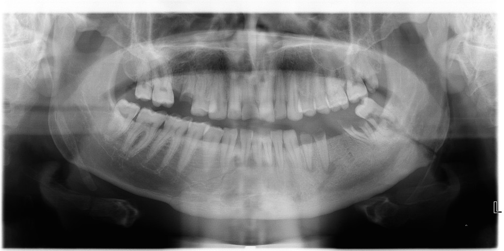 | 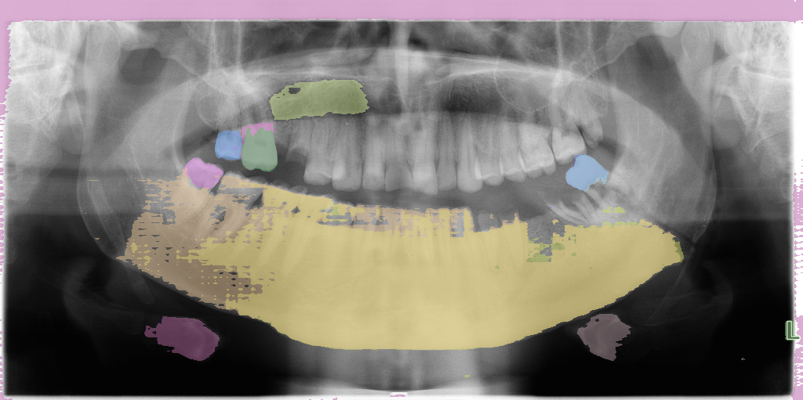 | 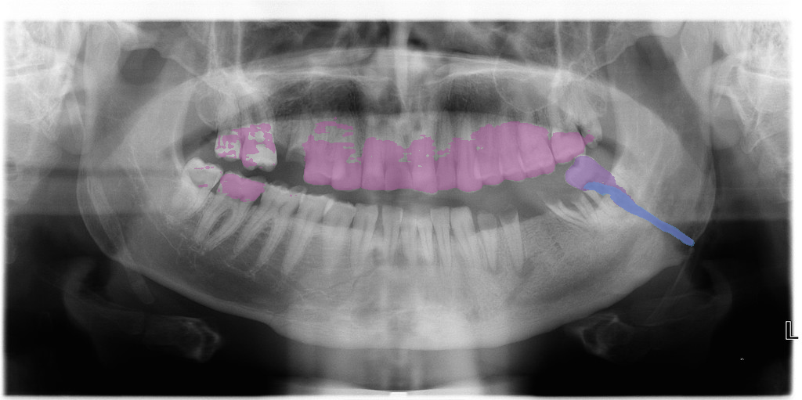 | 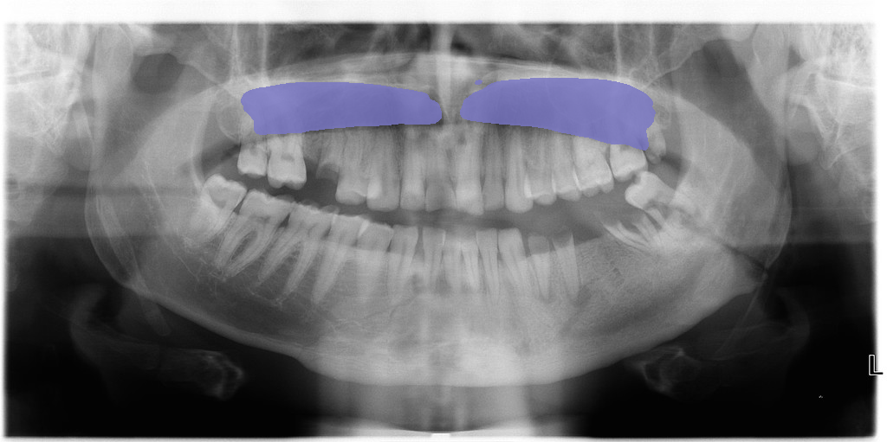 | 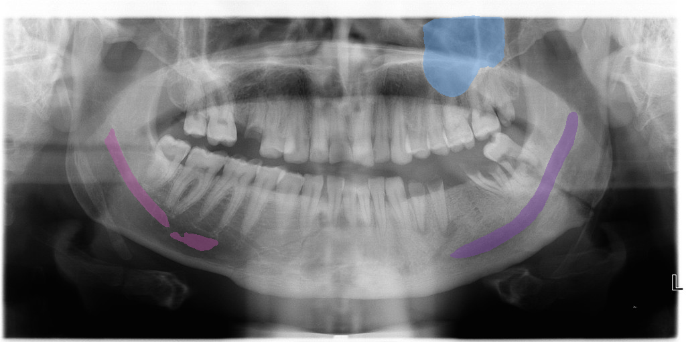 | 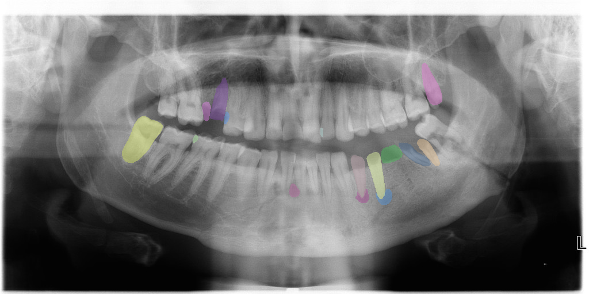 |

- **背景信息：**Age: 30 years Gender: Male; Alleged assault；30 岁男性，据称遭受袭击。
- **原始图片 caption：**

<pre>Undisplaced transverse oblique fracture through the medial right mandible body, and minimally displaced vertical oblique fracture through the angle of the left mandible which extends through a lower left molar. Multiple periapical lucencies, likely to be periapical abscesses.</pre>

- **原始图片 caption 翻译：**右侧下颌体内侧无移位横斜形骨折；左侧下颌角轻度移位垂直斜形骨折并延伸至左下磨牙；多发根尖周透亮影，可能为根尖周脓肿。

<strong>InternVL3-14B</strong>

**Segmentation 对 caption 的总体影响：**负向：参考关键点减少或被错误结论取代

**原始图像 → Single-image caption 回答**

英文原始回答：

<pre>This is an orthopantomogram (OPG) X-ray of the patient&#x27;s jaw and teeth. In the image, both the upper and lower sets of teeth are visible, along with the surrounding maxillary and mandibular bones. 

### Description:
1. **Teeth and Jaw Structures:**
   - The teeth display normal alignment in both the upper and lower jaws.
   - There are no obvious signs of fractures or dislocations in the teeth or jawbone.
   
2. **Bone Structures:**
   - The mandible and maxilla appear structurally intact without evident fractures or lesions.
   - No abnormalities in the bone density are apparent.

### Diagnosis:
Given the background information that the patient was involved in an alleged assault, it is important to carefully examine the radiograph for any potential injuries that might not be externally visible. The following observations can be noted:

- **Intact Teeth and Bones:** The absence of fractures or dislocations suggests that there are no immediate oral or maxillofacial fractures.
- **Alveolar Ridges and Sinuses:** The alveolar ridges appear normal, and there are no signs of sinus involvement.
  
### Possible Injuries (Chain of Thought):
1. **Absence of Immediate Jaw Fractures:** The most evident orthopedic injuries, such as fractures of the mandible or maxilla, are not apparent on this X-ray.
2. **Soft Tissue Injuries:** Soft tissue injuries such as lacerations, contusions, or swelling might not be visualized in this X-ray but could be present and are consistent with an assault.
3. **Dental Trauma:** Although the teeth appear to be in place, subtle dental injuries like luxations or root fractures would need additional imaging (e.g., periapical X-rays) for confirmation.
4. **Further Evaluation:** A clinical examination to assess for swelling, bruising, and functional issues (e.g., difficulty in opening the mouth) is required to thoroughly evaluate the extent of any injuries.

### Conclusion:
The orthopantomogram does not show any fractures or dislocations of the teeth or jawbone. However, given the context of an alleged assault, a comprehensive clinical examination including possible additional imaging and assessment of soft tissue injuries is essential to fully evaluate the patient. It&#x27;s crucial to correlate the radiographic findings with the clinical presentation to ensure that any potential but less obvious injuries are addressed.</pre>

中文医学要点：

<pre>回答未形成可稳定提取的明确疾病结论。未提取到与参考病灶高度特异的影像征象。</pre>

**原始图像 + Segmentation → Single-image caption 回答**

英文原始回答：

<pre>Based on the provided background information of the patient—a 30-year-old male with an alleged assault—and the panorex (orthopantomogram) X-ray image, we are looking for evidence of dental or jaw trauma. Here is an analysis based on the images and segmentations:

1. **Anatomical Overview:**
   - The X-ray is an orthopantomogram, a type of radiograph that shows a wide view of the lower face, displaying teeth and jaw bones.
   - The segmentation overlays highlight various structures: mandible, teeth, the mandibular canal, maxillary sinus, and potential dental/periodontal pathologies.

2. **Observations of Potential Trauma:**
   - **Mandible (Jawbone):** The mandible should be examined for fractures or misalignment. With the alleged assault, any discontinuity, displacement, or irregularity in the mandibular bone could indicate a fracture.
   - **Teeth:** Look for signs of trauma including luxation (displaced teeth), avulsion (knocked-out teeth), fractures, or changes in alignment.
   - **Dental Pathologies:** The segmentation also reveals areas marked for caries, periapical lesions, etc. While these are chronic conditions, an assault could exacerbate existing issues or cause new pathologies such as crack propagation or new infections.

3. **Segmentation Analysis:**
   - **Medical-SAM2 and Medical-SAM3 Segmentations:** These highlight the mandible and teeth. Look for disruption of the cortical lines in the bone or any displaced segments.
   - **BiomedParse Segmentation:** Shows the overall structure, focusing attention to the symmetry and integrity of the jawbones. Asymmetry or clear deviations could be noted.
   - **Teeth MaskDINO, Mandibular Canal, Maxillary Sinus:** Particularly, examining the mandibular canal and surrounding areas for any evidence of fractures affecting the neural content.
   - **Teeth MaskDINO Segmentation on Diseases:** This clearly indicates areas of root pieces, periapical lesions, caries, missing teeth, and impacted teeth. In the context of trauma, any previously impacted teeth that have become displaced or erupted due to external force should be critical.

4. **Possible Findings:**
   - **Fractures:** Any visible discontinuities or angulation in the mandible would suggest fractures. The clarity of the cortical borders is essential.
   - **Displacement/Distortion:** Altered alignment of the teeth or the arch forms could indicate traumatic force displacing the structures.
   - **Luxation or Avulsion:** Missing teeth or teeth showing significant displacement could suggest dental trauma.
   - **Periapical Lesions or Caries:** While chronic, these areas could be aggravated, showing increased radiolucency (lesion expansion) or changes in the surrounding bone structure due to additional trauma.

### Chain of Thought (CoT):
1. **Examine the Symmetry and Bony Structures:**
   - Check both sides of the mandible for any differences in height, bone continuity, and alignment.
   - Look for any step-off or misalignment in the mandible indicating fractures.
2. **Assess Dental Aligment:**
   - Ensure teeth are uniformly aligned. Displacement or angulation of natural alignment might indicate trauma.
3. **Identify New Onset of Pathologies:**
   - Look for new radiolucencies around roots indicating possible periapical lesions possibly exacerbated by trauma.
4. **Check for Missing Teeth or Root Fragmentation:**
   - Determine if any teeth are missing (avulsion) or if roots are fractured (especially given the context of assault).

### Conclusion:
While this X-ray does not explicitly show overt signs of trauma without comparing it to previous imaging, the alleged assault warrants a detailed evaluation as mentioned. If new fractures, luxations, displacement, or significant changes from expected conditions are observed, they should be considered indicative of trauma. Clinical correlation with physical examination and patient history (assault details) will be crucial to confirm and manage any injuries effectively. Immediate attention is advised, possibly including orthopedic interventions or dental stabilizations.</pre>

中文医学要点：

<pre>回答提及或最终倾向的诊断包括：根尖周病灶。未提取到与参考病灶高度特异的影像征象。</pre>

**Segmentation 对 caption 的影响分析：**

原始 caption：下颌骨骨折（文本提及）、根尖周透亮病灶（文本提及）；加入 segmentation 后：根尖周透亮病灶（文本提及）。加入 segmentation 后参考证据减少，说明 mask 或其文本提示产生了干扰，不能视为 caption 改善。该判断以是否接近 Radiopaedia 原始 caption 为准，不依据回答篇幅。

<strong>InternVL3.5-14B</strong>

**Segmentation 对 caption 的总体影响：**正向：新增或强化参考关键点

**原始图像 → Single-image caption 回答**

英文原始回答：

<pre>&lt;think&gt;
Okay, so I need to analyze this X-ray image of a patient&#x27;s jaw, right? The patient is a 30-year-old male who was allegedly assaulted. Let me start by looking at the image carefully.

First, the X-ray is an Orthopantomogram (OPT), which is a panoramic dental X-ray. It shows the entire mouth in one image, including the teeth, jaws, and surrounding structures. The image is labeled with an &quot;L&quot; on the right side, indicating that&#x27;s the left side of the patient. Wait, actually, in radiology, the marker usually indicates the left side of the image corresponds to the patient&#x27;s right. Wait, no, maybe the &quot;L&quot; is on the left side of the image, meaning that&#x27;s the patient&#x27;s left side. Hmm, sometimes markers can be confusing. But maybe that&#x27;s not critical right now.

Looking at the teeth: the upper and lower jaws are visible. Let me check each quadrant. The teeth seem to be mostly aligned, but there might be some issues. The upper left side (which would be the right side of the image since the marker is on the left) – wait, maybe I should double-check the orientation. The &quot;L&quot; is on the right side of the image, so that would be the patient&#x27;s left. So the left side of the patient is on the right of the image. So when looking at the image, the left side of the patient is on the right. So, the upper left teeth (patient&#x27;s left) would be on the right side of the image. 

Looking for any fractures, dislocations, or signs of trauma. In cases of assault, common injuries might include fractures to the mandible, maxilla, or teeth. Let me check each area.

Starting with the mandible (lower jaw). The mandible appears continuous. There&#x27;s no obvious fracture line. However, sometimes fractures can be subtle. The angle of the mandible – the area where the body meets the ramus – is a common site for fractures. If there&#x27;s a fracture here, there might be a step-off or displacement. In the image, the lower left side (patient&#x27;s right) shows the mandibular angle. The teeth here seem intact. The lower right side (patient&#x27;s left) also seems okay. Wait, maybe the premolars or molars are displaced? Let me check the lower left molars. The second molar on the left (patient&#x27;s right) seems to be in place. The third molar (wisdom tooth) on the right side (patient&#x27;s left) is partially erupted, which is normal, but maybe there&#x27;s a fracture nearby.

Looking at the maxilla (upper jaw). The upper teeth are aligned. The maxillary sinuses are visible above the upper teeth. Any fractures here would show as discontinuities. The nasal area is in the center, but it&#x27;s hard to see details. The zygomatic arches (cheekbones) are also part of the maxilla. If there&#x27;s a fracture here, it might be visible as a line or displacement. The image shows the zygomatic arches, but I don&#x27;t see any obvious fractures. 

Teeth: Check for avulsions (knocked-out teeth), fractures, or displacement. The upper right central incisor (on the left side of the image) seems intact. The upper left central incisor (on the right side of the image) also looks okay. The lower front teeth – any signs of trauma? The lower central incisors are in place. The lower left lateral incisor (patient&#x27;s right side) seems okay. The lower right lateral incisor (patient&#x27;s left) also appears intact. 

The wisdom teeth: The lower right third molar (patient&#x27;s left) is partially erupted and might be impacted, which is common. The upper third molars are also visible. The upper right third molar (on the left side of the image) is impacted, which is normal. The upper left third molar (on the right side) is also impacted. No obvious fractures around them.

Wait, but the patient was assaulted. Maybe there are subtle signs. Sometimes, in cases of trauma, there can be nondisplaced fractures that are hard to see on X-ray. Alternatively, there might be signs of soft tissue swelling, but X-rays don&#x27;t show soft tissues. 

Another thing to consider: the presence of old fractures, like healing lines, which might indicate a history of trauma. But the patient is 30, so unless there&#x27;s a history of previous injuries, this might not be relevant.

Wait, the image quality: sometimes motion artifacts or overlapping structures can obscure details. The image here seems clear enough. 

Wait, the left side of the mandible (patient&#x27;s right) near the angle – is there any irregularity? The lower left molars (patient&#x27;s right) are in place. The lower right molars (patient&#x27;s left) also seem okay. 

What about the condyles? The temporomandibular joints (TMJ) are at the ends of the mandible. Fractures here can be tricky. The image shows the condyles, but they appear intact. 

Another possibility: dental trauma. If a tooth was fractured, there might be a visible fracture line. For example, a horizontal or oblique fracture in a tooth. The upper left central incisor (on the right side of the image) – is there any fracture? It looks intact. The lower front teeth also seem okay. 

Wait, maybe the premolars? The upper left first premolar (on the right side of the image) – no obvious fracture. 

Alternatively, maybe there&#x27;s no visible fracture, but the patient&#x27;s symptoms suggest trauma. In that case, the X-ray might be normal, but the diagnosis would be based on clinical examination. But the question is based on the image, so perhaps the X-ray is normal, but the diagnosis would be that there&#x27;s no evidence of fracture, but the assault allegations need further investigation. However, the user might expect a diagnosis related to the image. 

Alternatively, maybe there&#x27;s a fracture that&#x27;s not obvious. For example, a nondisplaced fracture in the body of the mandible. Or a fracture in the maxilla that&#x27;s not clearly visible. 

Wait, looking again: the maxilla. The area between the teeth and the palate. Any discontinuity? The alveolar process of the maxilla. If there&#x27;s a fracture here, it might be a horizontal fracture. But in the image, the maxilla seems intact. 

Another possibility: Le Fort fractures, which are midface fractures. These involve the maxilla and are classified into three types. However, Le Fort fractures are usually from high-impact trauma and would show clear separations. In this image, there&#x27;s no obvious separation of the maxillary structures. 

What about the nasal bones? The X-ray might not show them clearly, but if there&#x27;s a fracture, it could be seen. However, the nasal area in the center seems intact. 

Wait, maybe the zygomatic bone. If there&#x27;s a fracture here, it might be visible as a line. The zygomatic arches are on both sides. The right zygomatic arch (patient&#x27;s left) – the image shows it as continuous. The left zygomatic arch (patient&#x27;s right) also seems intact. 

Hmm. If the X-ray doesn&#x27;t show any obvious fractures or dental trauma, then the diagnosis might be that there are no radiographic signs of acute fracture or dislocation, but the clinical history of assault requires further evaluation. However, the question asks to provide a diagnosis based on the image. 

Alternatively, maybe there&#x27;s a subtle sign I&#x27;m missing. For example, a slight displacement of a tooth or a fracture that&#x27;s not obvious. Let me check each tooth again. 

Upper right central incisor: intact. Upper left central incisor: intact. Upper right lateral incisor: intact. Upper left lateral incisor: intact. Upper canines: both sides look okay. Upper premolars: all seem in place. Upper molars: intact. 

Lower incisors: all present and aligned. Lower canines: intact. Lower premolars: intact. Lower molars: intact. Wisdom teeth: impacted but no obvious fracture. 

The mandible: no visible fracture lines. The maxilla: no fractures. 

So, based on the image, there are no obvious fractures or dislocations. However, the patient&#x27;s history is assault. In such cases, even if the X-ray is normal, there might be soft tissue injuries or microfractures not visible on X-ray. But the question is about the image. 

Therefore, the diagnosis based on the image would be that there are no evident fractures or traumatic injuries visible on the panoramic X-ray. However, given the history of assault, a normal X-ray doesn&#x27;t rule out all injuries, and further clinical examination or imaging (like CT scan) might be necessary. 

Wait, but the user might expect a different answer. Maybe I missed something. Let me check again. 

Wait, the lower left third molar (patient&#x27;s right side) is impacted and there&#x27;s some bone density around it. Could that be a sign of previous trauma? Probably not. Impacted wisdom teeth are common. 

Alternatively, maybe there&#x27;s a fracture in the symphysis menti (the midline of the lower jaw). The symphysis is the area where the two halves of the mandible meet. If there&#x27;s a fracture here, it would show a clear line. In the image, the symphysis appears intact. 

Another thought: sometimes, in cases of trauma, there can be avulsion of teeth. If a tooth is knocked out, the socket might be visible. But in this image, all tooth sockets are filled. 

Alternatively, a tooth might be fractured but the fragment is still in place. For</pre>

中文医学要点：

<pre>回答未形成可稳定提取的明确疾病结论。涉及的主要影像要点包括：结构重叠。</pre>

**原始图像 + Segmentation → Single-image caption 回答**

英文原始回答：

<pre>&lt;think&gt;
Okay, let&#x27;s try to figure out what&#x27;s going on here. The patient is a 30-year-old male who&#x27;s been in an alleged assault. The X-ray provided is an Orthopantomogram (OPT), which is a panoramic view of the jaw. 

First, I&#x27;ll look at the original image. The teeth and jaw structure seem mostly intact. But since there&#x27;s an alleged assault, I need to check for any signs of trauma. Common signs might include fractures, dislocations, or missing teeth. 

Looking at the segmented images, different tools have highlighted various structures. For example, Medical-SAM2 segments areas that might be soft tissue or bone fragments. The highlighted regions in different colors could indicate areas of interest. Maybe there are fractures or displaced teeth. 

The Medical-SAM3 segmentation shows the mandible, teeth, and mandibular canal. If there&#x27;s a fracture, the mandible might have a line or break. The teeth should be aligned; any misalignment could suggest trauma. The mandibular canal is a nerve pathway, so if it&#x27;s disrupted, that&#x27;s a concern.

BiomedParse segments the mandible and teeth. If the mandible is highlighted with irregular shapes, that might indicate a fracture. The teeth should all be present unless some are missing due to the assault.

Teeth MaskDINO segments the mandibular canal and maxillary sinus. The maxillary sinus is in the upper jaw, so if there&#x27;s trauma there, maybe the sinus is involved. The mandibular canal&#x27;s integrity is important; any disruption could mean nerve damage.

Teeth MaskDINO 11disease looks for specific issues like root pieces, periapical lesions, caries, missing teeth, or impacted teeth. If there are colored segments indicating missing teeth, that&#x27;s a sign of trauma. Root fragments might suggest a tooth was knocked out and part of the root remains. Periapical lesions could be infections from trauma.

Putting it all together: The patient has an alleged assault, so possible dental trauma. Check for fractures in the mandible or maxilla, dislocated or missing teeth, root fragments, or signs of infection. The presence of any colored segments in the teeth areas (like purple for missing teeth, green for impacted, etc.) would support that. If the mandible has a highlighted fracture line, that&#x27;s a key finding. Also, look for any soft tissue swelling or foreign objects, but since it&#x27;s an X-ray, maybe metallic fragments if the assault involved a weapon.

In the original image, if teeth are missing or displaced, that&#x27;s a sign. The impacted teeth might not be related to trauma but could be coincidental. Caries or periapical lesions might be pre-existing but could be exacerbated by trauma.

So, possible diagnosis: Dental trauma with possible mandibular fracture, avulsed or fractured teeth, and associated soft tissue injury. Need to confirm if there are any fractures, missing teeth, or root fragments. Also, check for signs of infection if there&#x27;s a periapical lesion.
&lt;/think&gt;

**Image Description and Diagnosis:**

**Clinical Context:**  
A 30-year-old male presents with an alleged assault. The Orthopantomogram (OPT) is evaluated for trauma-related dental and skeletal injuries.

**Key Observations:**  
1. **Mandibular Integrity:**  
   - Segmentation tools (Medical-SAM3, BiomedParse) highlight the mandible. No obvious discontinuities or fractures are visible in the mandible on the original image, though subtle fractures may require clinical correlation.  
   - The mandibular canal (Teeth MaskDINO) appears intact, with no evident disruption suggesting nerve involvement.

2. **Dental Trauma:**  
   - **Missing Teeth:** Teeth MaskDINO 11disease segments missing teeth (purple regions), particularly in the lower anterior and posterior regions, suggesting avulsion or extraction during trauma.  
   - **Root Fragments/Periapical Lesions:** Yellow/green segments may indicate retained root fragments or periapical pathology (e.g., infection from trauma-induced pulpal necrosis).  
   - **Impacted Teeth:** Pink segments (e.g., lower third molars) are likely coincidental but noted.  

3. **Soft Tissue and Bone:**  
   - Medical-SAM2 highlights soft tissue/bone irregularities (e.g., yellow areas in the lower jaw), potentially representing edema, hematoma, or fracture lines.  
   - No radiopaque foreign bodies (e.g., weapon fragments) are evident.  

**Diagnosis:**  
- **Dental Trauma:** Multiple avulsed teeth (likely lower anterior) with possible retained root fragments.  
- **No Radiographic Mandibular Fracture:** Clinical examination is advised to rule out occult fractures or ligamentous injury.  
- **Post-Traumatic Infection Risk:** Periapical radiolucencies (if present) suggest pulpal exposure and infection risk.  

**Recommendations:**  
- **Clinical Correlation:** Assess occlusion, tenderness, and neurovascular status (e.g., numbness from mandibular nerve injury).  
- **CT Imaging:** If mandibular fracture is clinically suspected.  
- **Dental Management:** Replantation of avulsed teeth (if timely) and endodontic evaluation for retained roots.  
- **Follow-Up:** Monitor for infection or delayed complications (e.g., osteomyelitis).  

**Conclusion:**  
The OPT reveals dental trauma consistent with assault, including avulsed teeth and potential periapical pathology, but no definitive skeletal fractures. Further clinical and imaging evaluation is warranted.</pre>

中文医学要点：

<pre>回答提及或最终倾向的诊断包括：骨髓炎、下颌骨骨折、根尖周病灶。未提取到与参考病灶高度特异的影像征象。</pre>

**Segmentation 对 caption 的影响分析：**

原始 caption：下颌骨骨折（文本提及）、下颌角/体定位（文本提及）；加入 segmentation 后：下颌骨骨折（文本提及）、根尖周透亮病灶（结论）。加入 segmentation 后参考证据增加，说明 overlay 至少改善了相关结构或病灶的注意力分配。该判断以是否接近 Radiopaedia 原始 caption 为准，不依据回答篇幅。

<strong>Lingshu-32B</strong>

**Segmentation 对 caption 的总体影响：**无明确增益：仅在鉴别或否定语境中提及关键点

**原始图像 → Single-image caption 回答**

英文原始回答：

<pre>The image is an OPT (Orthopantomogram) X-ray of the patient&#x27;s jaw. The X-ray shows a clear view of the upper and lower teeth, including the roots and surrounding bone structure. Upon examination, there is a noticeable fracture in the mandibular body on the left side, which is consistent with the patient&#x27;s history of alleged assault. The fracture appears to be a clean break without significant displacement of the bone fragments. There are no signs of additional fractures or dislocations in the maxillary or other mandibular regions. The teeth appear to be intact, with no visible dental injuries. Based on these observations, the diagnosis is a mandibular fracture likely resulting from trauma. Further clinical evaluation and possibly additional imaging may be required to assess the extent of soft tissue injury and to plan appropriate treatment, which could include surgical intervention for proper alignment and healing of the fractured bone.</pre>

中文医学要点：

<pre>回答提及或最终倾向的诊断包括：下颌骨骨折。未提取到与参考病灶高度特异的影像征象。</pre>

**原始图像 + Segmentation → Single-image caption 回答**

英文原始回答：

<pre>The provided images are panoramic dental X-rays showing various anatomical structures and potential pathologies. The first image (Image 1) is a standard panoramic radiograph displaying the full dentition, maxilla, mandible, and surrounding structures. The subsequent images show segmentations performed by different models to highlight specific areas of interest.

In Image 2, segmented by Medical-SAM2, there are highlighted regions in green, blue, and purple, indicating areas of potential concern or interest. These could represent lesions, cysts, or other abnormalities that require further investigation.

Image 3, segmented by Medical-SAM3, focuses on the mandible, teeth, and mandibular canal. The mandible is outlined in yellow, teeth in pink, and the mandibular canal in blue. This segmentation helps in assessing the integrity of these structures and identifying any deviations from normal anatomy.

Image 4, segmented by BiomedParse, highlights the mandible and teeth in blue, providing a clear view of the bone structure and dental alignment. This can be useful for evaluating bone density, fractures, or developmental anomalies.

Image 5, segmented by Teeth MaskDINO, identifies the mandibular canal and maxillary sinus in purple and blue, respectively. This segmentation aids in assessing the health of these critical areas, looking for signs of infection, inflammation, or structural changes.

Image 6, also segmented by Teeth MaskDINO, shows various dental diseases such as root pieces, periapical lesions, caries, missing teeth, and impacted teeth in different colors. This detailed segmentation allows for a comprehensive evaluation of dental health, identifying specific issues that need attention.

Based on these segmentations, the patient may have multiple dental issues including caries, periapical lesions, and possibly impacted teeth. Further clinical correlation and additional imaging may be necessary to confirm these findings and develop an appropriate treatment plan.</pre>

中文医学要点：

<pre>回答提及或最终倾向的诊断包括：根尖周病灶。未提取到与参考病灶高度特异的影像征象。</pre>

**Segmentation 对 caption 的影响分析：**

原始 caption：下颌骨骨折（否定/鉴别）、下颌角/体定位（否定/鉴别）；加入 segmentation 后：根尖周透亮病灶（否定/鉴别）。前后都没有覆盖决定性征象；回答即使变长，也不能视为有效的视觉理解增益。该判断以是否接近 Radiopaedia 原始 caption 为准，不依据回答篇幅。

<strong>MedGemma-27B-IT</strong>

**Segmentation 对 caption 的总体影响：**正向：新增或强化参考关键点

**原始图像 → Single-image caption 回答**

英文原始回答：

<pre>**Image Description:**

The image is an orthopantomogram (OPT), also known as a panoramic X-ray, of the patient&#x27;s jaw and teeth. It shows the upper and lower jaws, including the teeth, sinuses, and parts of the skull base.

**Findings:**

*   **Teeth:** The teeth appear generally intact and well-aligned, with no obvious signs of fractures, luxations, or avulsions.
*   **Alveolar Bone:** The bone surrounding the teeth appears intact, without significant fractures or displacement.
*   **Mandible:** The mandible (lower jaw) appears intact.
*   **Maxilla:** The maxilla (upper jaw) appears intact.
*   **Sinuses:** The maxillary sinuses appear clear and well-aerated.
*   **Fractures:** There are no obvious fractures visible in the jaws, teeth, or surrounding structures on this panoramic radiograph.

**Diagnosis:**

Based on the provided panoramic X-ray, there are no acute traumatic injuries visible, such as fractures of the mandible, maxilla, or teeth.

**Important Considerations:**

*   **Clinical Correlation:** This radiographic interpretation should always be correlated with the patient&#x27;s clinical presentation, history, and physical examination findings. The patient alleges an assault, so clinical signs of trauma (bruising, swelling, pain, tenderness) are crucial.
*   **Limitations of OPT:** Panoramic radiographs are excellent for screening but have limitations. They can sometimes miss subtle fractures, especially in the posterior regions or certain types of fractures. A CT scan might be more sensitive for detecting complex or subtle fractures if clinical suspicion remains high despite a negative OPT.
*   **Soft Tissue:** X-rays primarily show bone and hard tissues. Soft tissue injuries (bruises, lacerations, swelling) are not visible on this image.

**Conclusion:**

The panoramic X-ray does not show any evidence of acute fractures or significant dental trauma. However, the absence of radiographic findings does not rule out soft tissue injury or subtle fractures that might not be visible on this type of imaging. Clinical evaluation is essential.</pre>

中文医学要点：

<pre>回答未形成可稳定提取的明确疾病结论。未提取到与参考病灶高度特异的影像征象。</pre>

**原始图像 + Segmentation → Single-image caption 回答**

英文原始回答：

<pre>The provided image is an orthopantomogram (OPT), also known as a panoramic X-ray, of a 30-year-old male patient presenting after an alleged assault.

**Image Description:**

The image shows a wide view of the maxilla (upper jaw), mandible (lower jaw), teeth, temporomandibular joints (TMJs), and parts of the nasal and sinus cavities.

*   **Teeth:** All teeth are visible, including the third molars (wisdom teeth). The teeth appear generally intact, although a detailed assessment of each tooth would require higher resolution images.
*   **Mandible:** The lower jaw bone appears intact. The mandibular canal, which houses the inferior alveolar nerve and vessels, is visible.
*   **Maxilla:** The upper jaw bone appears intact. The maxillary sinuses are visible above the roots of the upper posterior teeth.
*   **TMJs:** The temporomandibular joints are visible on both sides.
*   **Soft Tissues:** Soft tissues are not well visualized on an OPT, but the general outline of the lips and cheeks is visible.

**Analysis based on the provided segmentations:**

*   **Medical-SAM2:** This segmentation highlights various structures, including the mandible, teeth, and potentially the mandibular canal.
*   **Medical-SAM3:** This segmentation specifically focuses on the mandible, teeth, and mandibular canal.
*   **BiomedParse:** This segmentation highlights the mandible and teeth.
*   **Teeth MaskDINO anatomy:** This segmentation highlights the mandibular canal and maxillary sinus.
*   **Teeth MaskDINO 11disease:** This segmentation highlights potential dental issues like root pieces, periapical lesions, caries, missing teeth, and impacted teeth.

**Diagnosis:**

Based solely on this single panoramic X-ray image, it is difficult to definitively diagnose specific injuries related to the alleged assault without comparison to previous images or a clinical examination. However, we can make some observations:

1.  **No obvious fractures:** The mandible and maxilla appear intact in this single view. However, panoramic radiographs are not the primary modality for detecting subtle or non-displaced fractures, especially of the facial bones. A CT scan would be more sensitive for this purpose.
2.  **Dental integrity:** The teeth appear generally intact, although the segmentation highlights potential issues (caries, root pieces, etc.) that might be unrelated to the assault or require further investigation.
3.  **TMJ assessment:** The TMJs are visualized, but assessing for internal derangement or dislocation based on a single OPT is limited.

**Conclusion:**

The panoramic X-ray shows the general structure of the jaws and teeth. While no obvious fractures are visible, this modality is not ideal for ruling out subtle facial bone fractures. The image also shows potential dental pathology highlighted by the segmentation, which may or may not be related to the alleged assault. A comprehensive assessment would require a clinical examination, potentially comparison with prior imaging, and possibly further imaging like a CT scan if facial trauma is suspected.

**Disclaimer:** This interpretation is based solely on the provided image and limited information. A definitive diagnosis requires a full clinical evaluation and potentially additional imaging.</pre>

中文医学要点：

<pre>回答提及或最终倾向的诊断包括：根尖周病灶。未提取到与参考病灶高度特异的影像征象。</pre>

**Segmentation 对 caption 的影响分析：**

原始 caption：下颌骨骨折（否定/鉴别）；加入 segmentation 后：下颌骨骨折（否定/鉴别）、根尖周透亮病灶（文本提及）。加入 segmentation 后参考证据增加，说明 overlay 至少改善了相关结构或病灶的注意力分配。该判断以是否接近 Radiopaedia 原始 caption 为准，不依据回答篇幅。

<strong>MedMO-8B</strong>

**Segmentation 对 caption 的总体影响：**无帮助：前后均未命中参考核心征象

**原始图像 → Single-image caption 回答**

英文原始回答：

<pre>A lateral chest radiograph was obtained. There is no focal consolidation. There is no pleural effusion. The cardiac silhouette is normal. The hilar and mediastinal contours are normal.</pre>

中文医学要点：

<pre>回答提及或最终倾向的诊断包括：胸腔积液。涉及的主要影像要点包括：心影异常、肺实变。</pre>

**原始图像 + Segmentation → Single-image caption 回答**

英文原始回答：

<pre>There is no radiopaque lesion seen in the region of interest.</pre>

中文医学要点：

<pre>回答未形成可稳定提取的明确疾病结论。未提取到与参考病灶高度特异的影像征象。</pre>

**Segmentation 对 caption 的影响分析：**

原始 caption：未命中核心征象；加入 segmentation 后：未命中核心征象。前后都没有覆盖决定性征象；回答即使变长，也不能视为有效的视觉理解增益。该判断以是否接近 Radiopaedia 原始 caption 为准，不依据回答篇幅。

<strong>Qwen3-VL-4B</strong>

**Segmentation 对 caption 的总体影响：**基本持平：前后均提及部分参考关键点

**原始图像 → Single-image caption 回答**

英文原始回答：

<pre>This is a panoramic dental radiograph (also known as an “OPT” — Orthopantomogram — as noted in the metadata) of a 30-year-old male patient presenting with an alleged assault.

**Description of the Image:**

- The image is a full-mouth panoramic radiograph, showing both the maxillary (upper) and mandibular (lower) arches of teeth, the surrounding alveolar bone, the temporomandibular joints (TMJs), and portions of the maxillary sinuses and skull base.
- The teeth appear to be in good alignment with no obvious gross fractures or displaced teeth.
- The bone structure, including the mandibular body and ramus, appears intact with no visible fractures, lucent lines, or significant radiolucent areas that would suggest acute trauma or avulsion.
- The radiograph does not show any obvious signs of tooth fractures, root fractures, or periapical pathology such as abscesses or large radiolucencies.
- The image is of adequate quality with no significant motion blur or artifacts that would obscure interpretation.

**Diagnosis:**

Based on the background information (alleged assault) and the radiographic findings, **there is no evidence of acute traumatic injury to the teeth or jaw bones on this radiograph.**

**Clinical Implication:**

- The patient should be evaluated clinically for signs of trauma — such as bleeding, swelling, pain, or mobility of teeth — which may not be visible on radiographs.
- If the patient has a history of trauma (e.g., facial or dental trauma), a clinical examination and possibly additional imaging (e.g., CBCT) may be warranted to evaluate for subtle fractures or soft tissue injuries not visible on a panoramic radiograph.
- The absence of radiographic abnormalities does not rule out trauma; it may be that the trauma was not severe enough to cause visible changes on imaging or that the trauma occurred before the imaging was performed.

**Conclusion:**

The panoramic radiograph is unremarkable and does not support a diagnosis of dental or skeletal trauma due to the alleged assault. Further clinical evaluation is required to assess for soft tissue or dental trauma that may not be visible radiographically.

**Note:** This is a radiographic interpretation only. Clinical assessment and possibly additional diagnostic tests are essential for a complete evaluation.</pre>

中文医学要点：

<pre>回答未形成可稳定提取的明确疾病结论。未提取到与参考病灶高度特异的影像征象。</pre>

**原始图像 + Segmentation → Single-image caption 回答**

英文原始回答：

<pre>Based on the patient’s background (30-year-old male, alleged assault) and the radiographic image provided, the following analysis and diagnosis can be made:

### Image Description:
The image is a panoramic dental radiograph (panoramic X-ray) showing the full dentition, including both the maxilla and mandible. The segmentation masks from different AI models highlight various anatomical structures:
- **Teeth**: Multiple teeth are segmented with different colors, indicating individual tooth identification.
- **Mandible**: The mandibular bone is segmented in some models (e.g., BiomedParse, Teeth MaskDINO 11).
- **Mandibular Canal**: The canal is highlighted in some models (e.g., Medical-SAM3), indicating the path of the inferior alveolar nerve and vessels.
- **Maxillary Sinus**: The sinus is segmented in one model (Teeth MaskDINO 11).
- **Disease markers**: Segments indicate areas of potential pathology such as root pieces, periapical lesions, caries, missing teeth, or impacted teeth.

### Clinical Interpretation:
Given the patient’s history of alleged assault, the radiograph should be interpreted with suspicion for trauma-related dental injuries. Common findings in dental trauma include:
- **Fractured teeth**: Especially in the anterior or posterior regions.
- **Lateral or buccal fractures** (e.g., from blunt trauma or direct impact).
- **Root fractures** or **periapical lesions** (inflammatory or traumatic).
- **Missing teeth** (due to avulsion or extraction).
- **Impacted teeth** (due to trauma or displacement).

### Diagnosis:
The most likely diagnosis is **traumatic dental injury** secondary to the alleged assault. This may include:
1. **Fractured teeth** (especially in the anterior or posterior regions).
2. **Periapical lesions** (inflammatory or traumatic).
3. **Missing teeth** (due to avulsion or extraction).
4. **Impacted teeth** (due to trauma or displacement).

### Recommendations:
- **Clinical examination**: A thorough clinical examination is necessary to confirm the diagnosis.
- **Further imaging**: If necessary, a cone-beam CT (CBCT) may be required for a more detailed assessment.
- **Treatment**: Depending on the severity of the injury, treatment may include:
  - **Reattachment of fractured teeth** (if possible).
  - **Root canal therapy** for periapical lesions.
  - **Extraction** of severely damaged teeth.
  - **Orthodontic intervention** for impacted teeth.

### Conclusion:
The radiograph shows signs of trauma to the teeth and surrounding structures, consistent with a dental injury following an alleged assault. A clinical examination and further imaging are recommended for a definitive diagnosis and treatment plan.</pre>

中文医学要点：

<pre>回答提及或最终倾向的诊断包括：根尖周病灶。未提取到与参考病灶高度特异的影像征象。</pre>

**Segmentation 对 caption 的影响分析：**

原始 caption：根尖周透亮病灶（否定/鉴别）、下颌角/体定位（文本提及）；加入 segmentation 后：根尖周透亮病灶（文本提及）。前后对参考征象的覆盖基本不变；segmentation 没有带来可辨认的疾病特异性增量。该判断以是否接近 Radiopaedia 原始 caption 为准，不依据回答篇幅。

<strong>Qwen3-VL-8B</strong>

**Segmentation 对 caption 的总体影响：**有帮助：由未见骨折转为识别下颌骨折和根尖周病灶

**原始图像 → Single-image caption 回答**

英文原始回答：

<pre>Based on the provided information, here is a description and interpretation of the image:

**Image Description:**
The image is a panoramic radiograph (OPT — Orthopantomogram) of the patient’s dentition and jaws. It provides a broad, lateral view of the entire maxilla and mandible, including the teeth, alveolar bone, and surrounding structures. The image shows both the upper and lower arches of teeth, from the incisors to the molars. The teeth appear to be in a relatively normal alignment, with no obvious gross dental malocclusion visible from this view. The alveolar bone appears to have normal density and contour. There are no immediately apparent fractures of the jawbones, no large radiolucent lesions, and no obvious signs of acute infection or abscess.

**Diagnosis:**
There is **no radiographic evidence of trauma or fracture** in this panoramic X-ray. The patient’s teeth and jaws appear structurally intact.

However, it is important to note:
- The patient is a 30-year-old male who has presented with an “alleged assault.” This is a clinical and legal concern that cannot be resolved by radiographic findings alone.
- The X-ray is a diagnostic tool to assess for **bone trauma** (e.g., fractures of the mandible or maxilla) or **dental trauma** (e.g., luxation, avulsion, or fracture of teeth) that might be consistent with an assault.
- The absence of fractures or dental injuries on this X-ray does **not rule out** a traumatic event — it is possible that the trauma was not visible on this image (e.g., soft tissue injury, non-displaced fractures, or injuries to areas not captured well by panoramic imaging such as the nasal bones or orbital floors).
- **Panoramic X-rays have limitations** in detecting certain types of fractures (e.g., linear fractures, comminuted fractures, or fractures involving the zygomatic arch or nasal bones) and may miss injuries to the teeth or periodontal ligament.

**Conclusion:**
While this panoramic radiograph does not show any obvious signs of trauma or injury, it does not definitively exclude the possibility of an assault. A comprehensive clinical evaluation, including physical examination, review of the patient’s history, and possibly additional imaging (e.g., CT scan, CBCT, or targeted X-rays), is necessary to fully assess for any signs of trauma. The clinical suspicion of assault should not be dismissed based solely on this radiograph.

**Recommendation:**
- Perform a thorough physical examination of the head, neck, and facial structures.
- Consider ordering a CT scan of the facial bones if there is clinical suspicion of trauma.
- Document the clinical findings and radiographic results in the patient’s medical record.
- Consult with the appropriate authorities or forensic team, as this is a legal matter.

This radiograph is a valuable diagnostic tool, but it should be interpreted in conjunction with the clinical context.</pre>

中文要点翻译：

<pre>全景牙片牙列和牙槽骨大致正常，未见明显颌骨骨折、大型透亮病灶或急性感染；模型认为没有影像学创伤证据。</pre>

**原始图像 + Segmentation → Single-image caption 回答**

英文原始回答：

<pre>Based on the provided patient data (30-year-old male, alleged assault) and the panoramic X-ray image, here is a detailed description and diagnosis:

**Image Description:**

The provided image is a panoramic radiograph (OPT subcategory) of the patient’s oral cavity. It displays the maxillary and mandibular teeth, their supporting bone structures, and surrounding anatomical features. The image reveals several notable findings:

1.  **Mandibular Fracture:** The most significant finding is a fracture of the mandible. This is evident by the discontinuity of the mandibular body and ramus, particularly on the left side (viewer&#x27;s right). The fracture line appears to extend from the angle of the mandible, potentially involving the mandibular foramen and the mandibular canal. This is a classic sign of trauma.
2.  **Dental Pathologies:** The image shows multiple areas of concern in the teeth:
    *   **Periapical Lesions:** Several teeth exhibit radiolucent areas at their apices, indicative of periapical lesions, which can be due to infection or trauma.
    *   **Caries:** There are areas of demineralization consistent with dental caries, particularly on the right maxillary first molar.
    *   **Impacted Teeth:** There appears to be an impacted tooth in the mandibular right posterior region (possibly the third molar).
    *   **Root Resorption/Pathology:** Some teeth show signs of root resorption or other pathology.
3.  **Alveolar Bone Changes:** There are areas of bone loss or remodeling around the roots of several teeth, which may be related to periodontal disease or the effects of trauma.
4.  **Mandibular Canal:** The mandibular canal is visible, and there is a potential for nerve injury if the fracture involves this area.

**Diagnosis:**

Based on the clinical history (alleged assault) and the radiographic findings, the most likely diagnosis is:

**Mandibular Fracture Secondary to Trauma (likely from assault)**

This is supported by the clear fracture line in the mandible, which is a common result of blunt force trauma to the jaw. The presence of dental pathologies (periapical lesions, caries, impacted teeth) is also noted, but these are likely pre-existing conditions rather than direct results of the trauma. The fracture is the primary finding and is consistent with the patient&#x27;s history of alleged assault.

**Recommendation:**

The patient should be referred for further evaluation by an oral and maxillofacial surgeon. A detailed clinical examination, possibly including a CT scan, is necessary to fully assess the extent of the fracture, evaluate for associated injuries (e.g., nerve damage), and plan appropriate treatment. The dental pathologies should also be addressed by a dentist or periodontist.

This diagnosis is based on the radiographic evidence and the patient&#x27;s history, and further clinical correlation is essential for a comprehensive management plan.</pre>

中文要点翻译：

<pre>模型报告下颌骨骨折线，可能从下颌角延伸并累及下颌管；同时识别多颗牙根尖周透亮病灶，最终判断为外伤性下颌骨骨折。</pre>

**对模型图片 caption 能力及 Segmentation 影响的分析：**

牙齿解剖和 11 类病变 overlay 明显提高了模型对骨折及根尖周透亮影的敏感性，由“无骨折”转为正确的病变类别。其骨折侧别、两条骨折线的具体走行仍不如参考 caption 完整，但这是剩余病例中较明确的正向 caption 改善。

<strong>Qwen3-VL-32B</strong>

**Segmentation 对 caption 的总体影响：**基本持平：前后均提及部分参考关键点

**原始图像 → Single-image caption 回答**

英文原始回答：

<pre>**Image Description:**

This is a panoramic radiograph (OPT - Orthopantomogram) of a 30-year-old male patient presenting with an alleged assault. The image displays the entire dentition, including both the maxillary and mandibular arches, as well as the surrounding osseous structures such as the maxillary sinuses, mandibular body, rami, and condyles.

Key observations:

- **Dentition:** All permanent teeth are present, with no obvious signs of dental caries or restorations visible in this projection. The teeth appear to be in normal alignment, although there is some crowding in the anterior region.
- **Alveolar Bone:** The alveolar bone levels appear intact without signs of significant periodontal disease.
- **Maxillary Sinuses:** The maxillary sinuses are visible and appear to be of normal radiopacity, with no evidence of opacification or fracture.
- **Mandible:** The mandibular body, angle, and ramus appear intact. The mandibular canal is visible and follows its normal course.
- **Temporomandibular Joints (TMJs):** The condyles are visible and appear to be in normal position within the glenoid fossae. There is no obvious dislocation or fracture.
- **Soft Tissues:** No soft tissue swelling or foreign bodies are evident in the oral cavity or surrounding areas.
- **Artifacts:** There is a horizontal linear artifact across the midportion of the image, likely due to patient movement or equipment-related issue during exposure.

---

**Clinical Context:**

The patient is a 30-year-old male presenting with an alleged assault. The primary concern in such cases is to evaluate for fractures of the facial bones, especially the mandible, maxilla, zygomatic complex, or nasal bones, as well as dental injuries or dislocations.

---

**Diagnosis:**

Based on the panoramic X-ray:

✅ **No acute bony fractures** are evident in the mandible, maxilla, or zygomatic arches.

✅ **No dental avulsions, luxations, or root fractures** are visible.

✅ **No dislocation of the temporomandibular joints** is seen.

✅ **No foreign bodies or significant soft tissue abnormalities** are detected.

⚠️ **Limitations of Panoramic Radiography:** While this view is excellent for evaluating dental and mandibular structures, it may not detect subtle fractures, especially in the zygomatic complex, nasal bones, or orbital rims. Additionally, the image quality is somewhat degraded by motion artifact.

---

**Conclusion:**

**No significant bony or dental trauma is evident on this panoramic radiograph.** However, given the history of assault, a more comprehensive imaging evaluation (e.g., **CT scan of the facial bones**) is recommended to rule out subtle fractures, especially in the midface or orbital regions, which are not well visualized on panoramic X-rays.

**Recommendation:**
- Proceed with **CT scan of the facial bones** for definitive evaluation.
- Clinical examination should include assessment for soft tissue injuries, tenderness, malocclusion, or limited jaw movement.
- Document findings thoroughly in the context of the assault.

---

**Final Diagnosis:**
**No acute fracture or dental injury identified on panoramic radiograph; further imaging (CT) recommended to rule out facial bone trauma.**</pre>

中文医学要点：

<pre>回答未形成可稳定提取的明确疾病结论。未提取到与参考病灶高度特异的影像征象。</pre>

**原始图像 + Segmentation → Single-image caption 回答**

英文原始回答：

<pre>Based on the provided panoramic (OPT) X-ray image and segmentation outputs, along with the patient’s background (30-year-old male, presenting with alleged assault), here is a comprehensive description and diagnosis:

---

### **Image Description**

This is a panoramic radiograph (Orthopantomogram, OPT) of the maxillofacial region, showing the upper and lower jaws, teeth, and surrounding bony structures. The image demonstrates:

- **Dental Status**: Most teeth are present, but there are notable abnormalities, particularly in the posterior regions.
- **Bone Structure**: The mandible and maxilla appear intact with no obvious fractures or dislocations.
- **Segmentation Insights**:
  - **Medical-SAM2** segments various regions, including the mandible (yellow), teeth (multiple colors), and other anatomical structures, suggesting a broad but somewhat imprecise segmentation.
  - **Medical-SAM3** highlights the **mandible** (not clearly visible in the overlay), **teeth** (pink), and **mandibular canal** (blue on the right side). The mandibular canal is visible as a dark, linear radiolucent structure running through the body of the mandible.
  - **BiomedParse** segments the **maxillary sinus** (blue) — the air-filled cavities above the upper teeth — and possibly the upper jaw, but not the teeth or mandibular canal.
  - **Teeth MaskDINO (anatomy)** segments the **mandibular canal** (purple curves) bilaterally and the **maxillary sinus** (blue on the right).
  - **Teeth MaskDINO (disease)** identifies several **dental pathologies**:
    - **Root pieces** (e.g., yellow on the lower left — likely a retained or fractured root).
    - **Periapical lesions** (e.g., pink and purple areas around roots — radiolucent areas indicating possible infection or cysts).
    - **Caries** (not clearly marked, but implied by decayed tooth structure).
    - **Missing teeth** (e.g., upper left and lower right regions — areas where teeth are absent).
    - **Impacted tooth** (e.g., lower right — tooth not fully erupted, possibly third molar).

---

### **Clinical Interpretation &amp; Diagnosis**

#### **1. Dental Pathologies (Based on Teeth MaskDINO 11disease Segmentation)**

- **Missing Teeth**:
  - Upper left quadrant: Appears to be missing at least one anterior tooth (possibly lateral incisor or canine).
  - Lower right quadrant: Missing posterior tooth, possibly a molar or premolar.

- **Impacted Tooth**:
  - Lower right third molar (wisdom tooth) is impacted and partially erupted, angled toward the second molar. This is a common finding and may be asymptomatic or cause pain, infection, or cyst formation.

- **Root Pieces**:
  - A retained root fragment is visible in the lower left posterior region (yellow). This could be a remnant from a previous extraction or a fractured root during trauma.

- **Periapical Lesions**:
  - Radiolucent areas around the apex of several teeth (especially in the lower arch) suggest chronic apical periodontitis or radicular cysts. These are likely due to untreated dental caries or pulp necrosis.

- **Caries**:
  - Multiple teeth show signs of decay, particularly in the posterior teeth. These may not be explicitly segmented but are implied by the radiopaque/radiolucent changes in enamel and dentin.

#### **2. Trauma Consideration (Alleged Assault)**

- **No obvious fractures** of the mandible, maxilla, or zygomatic arches are visible on this panoramic view.
- However, **soft tissue trauma** (e.g., lacerations, hematomas) cannot be assessed on X-ray.
- **Dental trauma** may be present:
  - **Avulsed or displaced teeth** are not clearly evident, but the **missing teeth** and **root fragments** could be related to trauma.
  - The **periapical lesions** may have been exacerbated or caused by trauma-induced pulp necrosis.
  - The **impacted tooth** may have been dislodged or caused trauma during the assault.

#### **3. Anatomical Structures**

- **Mandibular Canal** (segmented by Medical-SAM3 and Teeth MaskDINO) is visible bilaterally. It appears intact and unobstructed, which is reassuring for nerve integrity.
- **Maxillary Sinus** (segmented by BiomedParse and Teeth MaskDINO) appears normal in size and density, without signs of sinusitis or opacification.

---

### **Final Diagnosis**

**1. Dental Pathology:**
- Multiple dental caries.
- Periapical lesions (likely chronic apical periodontitis) in several teeth.
- Missing teeth (upper left and lower right).
- Impacted lower right third molar.
- Retained root fragment (lower left posterior).

**2. Trauma-Related Findings (Alleged Assault):**
- No radiographic evidence of facial bone fractures.
- Possible dental trauma contributing to missing teeth or root fragments.
- Periapical lesions may be sequelae of trauma-induced pulp necrosis.

---

### **Recommendations**

1. **Dental Evaluation**:
   - Comprehensive dental examination and charting.
   - Consider endodontic treatment for teeth with periapical lesions.
   - Extraction of impacted third molar and retained root fragments.
   - Restoration of carious teeth or replacement of missing teeth (e.g., dental implants, bridges).

2. **Trauma Assessment**:
   - Clinical evaluation for soft tissue injuries (lips, gums, tongue, cheeks).
   - Consider CT scan if there is clinical suspicion of occult fractures or orbital injuries.
   - Document all findings for forensic or legal purposes.

3. **Follow-Up**:
   - Monitor for signs of infection (e.g., swelling, pain, fever) related to periapical lesions or trauma.
   - Refer to oral surgery or maxillofacial surgery if needed.

---

### **Conclusion**

While the panoramic X-ray does not show fractures consistent with a severe assault, it reveals significant dental pathology that may have been exacerbated by or related to the trauma. The patient requires a multidisciplinary approach involving dental and possibly maxillofacial evaluation to address both the dental disease and the trauma-related concerns.</pre>

中文医学要点：

<pre>回答提及或最终倾向的诊断包括：根尖周病灶。未提取到与参考病灶高度特异的影像征象。</pre>

**Segmentation 对 caption 的影响分析：**

原始 caption：下颌骨骨折（否定/鉴别）、下颌角/体定位（文本提及）；加入 segmentation 后：下颌骨骨折（否定/鉴别）、根尖周透亮病灶（文本提及）。前后对参考征象的覆盖基本不变；segmentation 没有带来可辨认的疾病特异性增量。该判断以是否接近 Radiopaedia 原始 caption 为准，不依据回答篇幅。

### 2.9 [Osteogenesis imperfecta](https://radiopaedia.org/cases/osteogenesis-imperfecta-15?lang=us) (`osteogenesis-imperfecta-15`)

| Original image | Medical-SAM2 | Medical-SAM3: bone, femur, tibia | BiomedParse v1: bone, femur, tibia |
|---|---|---|---|
| 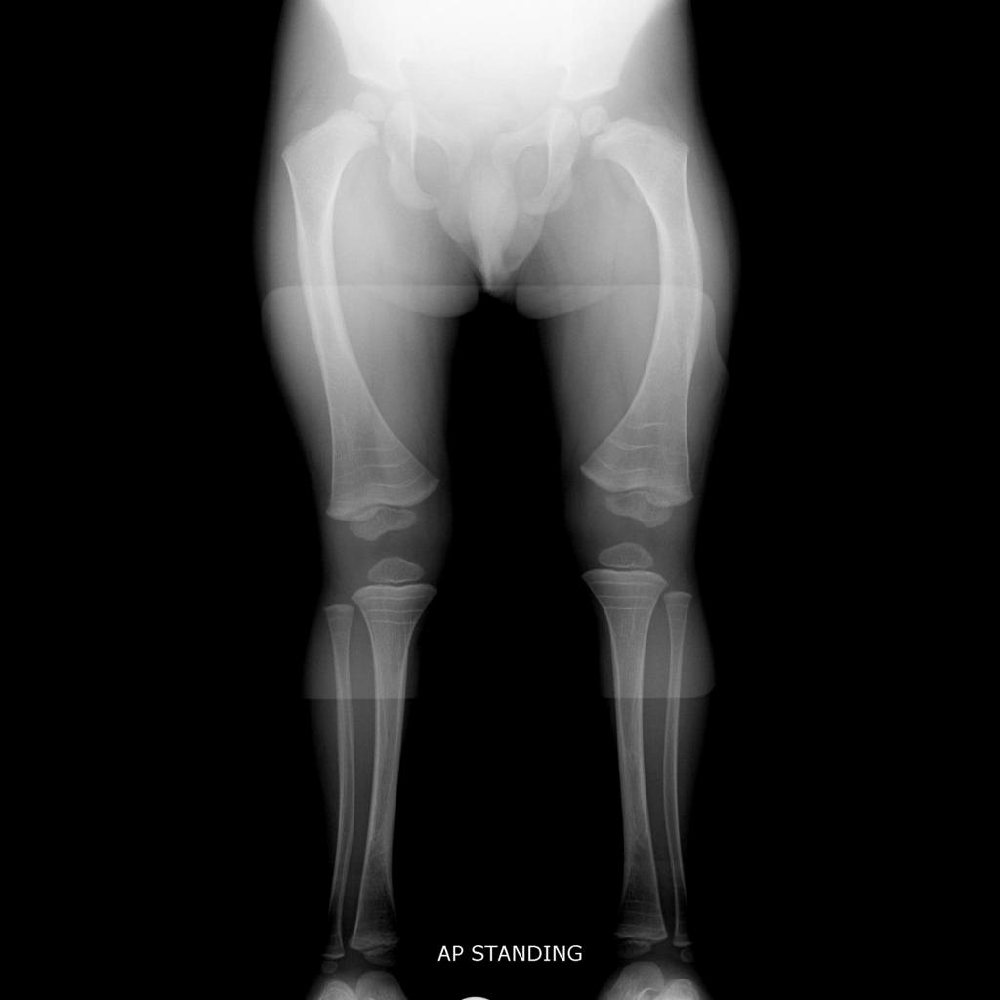 | 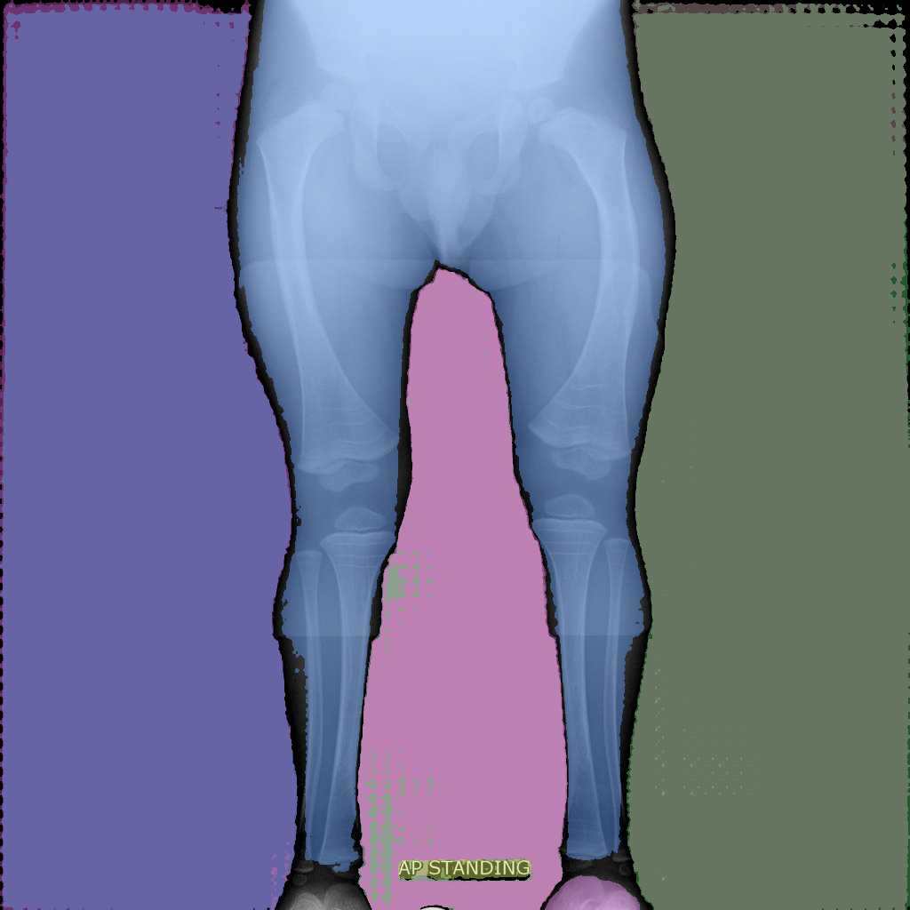 | 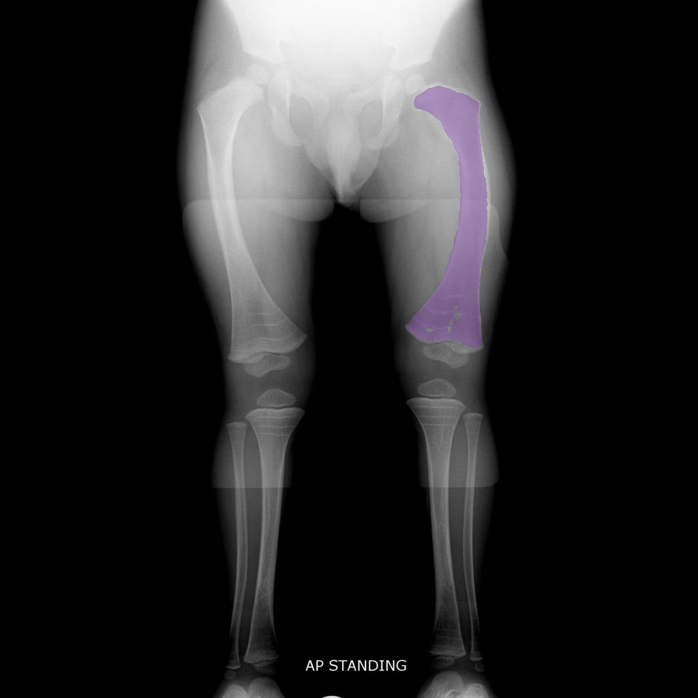 | 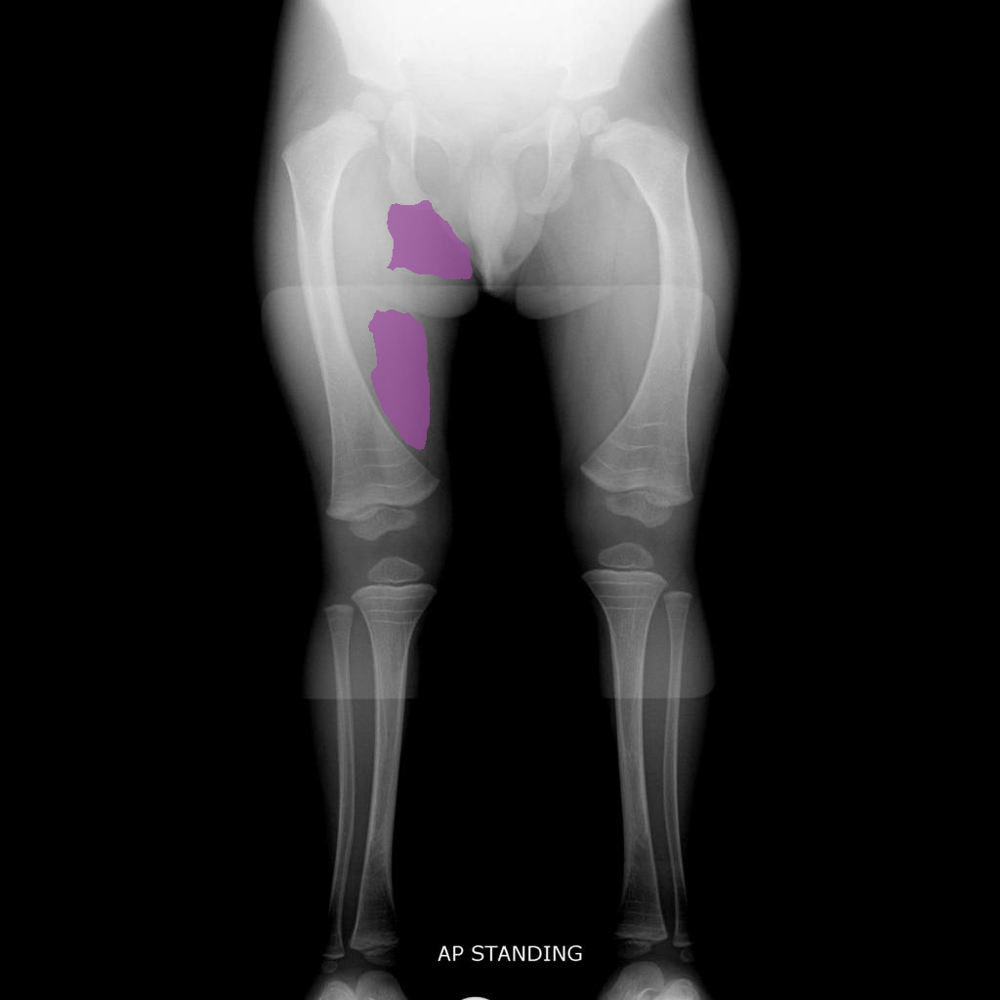 |

- **背景信息：**Age: 5 years Gender: Male; Bowing of legs. Asymptomatic.；5 岁男童，双腿弯曲，无症状。
- **原始图片 caption：**

<pre>There is bowing of both femora which is symmetric. Multiple growth arrest lungs in the femora and tibia.</pre>

- **原始图片 caption 翻译：**双侧股骨对称性弯曲，股骨和胫骨可见多条生长停滞线。

<strong>InternVL3-14B</strong>

**Segmentation 对 caption 的总体影响：**基本持平：前后均提及部分参考关键点

**原始图像 → Single-image caption 回答**

英文原始回答：

<pre>This X-ray image shows the lower extremities of a 5-year-old male, displaying bowing of the legs, which is a classic presentation of Blount&#x27;s disease. Blount&#x27;s disease is a condition characterized by abnormal growth of the proximal tibial physis, leading to bowing, or angular deformities of the legs. This often presents in early childhood.

### Description of the Image

The X-ray is an anteroposterior (AP) standing view showing both legs in full extension. The following specific observations can be made:

1. **Bowing of the Legs:**
   - There is a noticeable bowing of both legs, more prominent in the tibial diaphysis. This bowing gives the legs a characteristic outward curve, especially in the proximal tibia.
   
2. **Alignment:**
   - The femoral shafts appear relatively straight but lead distally to the bowed tibiae. The alignment between the femur and the tibia shows lateral deviation.

3. **Proximal Tibial Physis:**
   - The proximal tibial growth plates exhibit widening and irregularity. This irregularity is indicative of abnormal growth patterns typical in Blount&#x27;s disease.

4. **Bone Density and Cortical Margins:**
   - Bone density appears normal, but there are noticeable alterations in the cortical margins of the tibiae due to the abnormal angulation.

5. **Joint Spaces:**
   - The knee joint spaces are visible, and there doesn&#x27;t appear to be any acute arthritic changes, though long-standing deformities could lead to joint issues over time.

### Diagnosis

Given the clinical presentation (bowing of legs in a 5-year-old male) and the radiographic findings:

1. **Clinical Presentation:**
   - Bowing of legs is the primary symptom and is asymptomatic as stated.

2. **Radiographic Evidence:**
   - The AP X-ray clearly shows tibial bowing and abnormal growth at the proximal tibial physis, characteristic of Blount&#x27;s disease.

### Chain of Thought (CoT) Analysis for Diagnosis

1. **Age and Gender Consideration:**
   - The patient&#x27;s age and gender are significant. Blount&#x27;s disease is commonly seen in children between 2-4 years and less commonly in older children and adolescents. The gender distribution is almost equal, but it can be slightly more prevalent in males.

2. **Symptoms and Radiographic Features Correlation:**
   - The bowing of legs correlates well with the radiographic evidence of tibial bowing and proximal tibial physeal abnormalities.
  
3. **Differential Diagnosis:**
   - While bowing of legs can be due to rickets (nutritional deficiencies leading to bone deformities), Blount&#x27;s disease is more specific due to physeal irregularities and the age of the patient.
   - Other differential diagnoses include fractures with deformities, congenital pseudoarthrosis, and metabolic bone diseases, but these do not fit as well with the specific physeal changes seen here.

4. **Conclusion:**
   - The combination of clinical presentation and radiographic findings strongly suggests Blount&#x27;s disease as the diagnosis.

### Management Considerations

For Blount&#x27;s disease:

1. **Observation:**
   - Mild cases, especially if they are not progressing, may only require regular monitoring.

2. **Bracing:**
   - Progressive cases may benefit from the use of corrective braces.

3. **Surgery:**
   - For more severe deformities or cases that do not respond to conservative management, corrective surgery such as osteotomies may be necessary.

In conclusion, based on the patient data and the radiographic features, the diagnosis is consistent with Blount&#x27;s disease, requiring further clinical evaluation and possibly intervention to prevent worsening deformity and potential gait abnormalities.</pre>

中文医学要点：

<pre>回答提及或最终倾向的诊断包括：Blount 病。涉及的主要影像要点包括：骨骼弯曲。</pre>

**原始图像 + Segmentation → Single-image caption 回答**

英文原始回答：

<pre>This X-ray image of a 5-year-old male shows both lower limbs in a standing position, clearly depicting the bones of the femur, tibia, and fibula. The bowing of the legs, which is evident in the curvature of the bones, aligns with the patient&#x27;s presentation.

### Description
- **Bones Visible:** The X-ray displays the femur, tibia, and fibula bones of both legs.
- **Bone Alignment:** There is noticeable bowing in both legs, more pronounced in the midshaft of the tibia.
- **Image Modality:** The image is an anteroposterior (AP) X-ray taken while the patient is standing, which helps evaluate alignment and bone structure.

### Diagnosis
The observed bowing of the legs suggests **Blount’s disease**, also known as tibia vara. This condition commonly affects children and is characterized by an angular deformity of the proximal tibia, causing the leg to bow outward.

### Key Points
- **Age Consideration:** Blount’s disease is more common in young children, particularly those who are overweight or begin walking early.
- **Symptoms:** Typically asymptomatic initially but can lead to walking difficulties and progressive bowing if untreated.
- **Diagnosis:** Based on X-ray findings showing varus deformity of the proximal tibia and femur.

### Management
- **Observation:** Mild cases may be monitored over time.
- **Bracing:** Orthotic devices might be used for correction.
- **Surgery:** In severe cases, surgical intervention such as osteotomies may be necessary.

Further clinical correlation and specialist consultation would be recommended to determine the best course of treatment.</pre>

中文医学要点：

<pre>回答未形成可稳定提取的明确疾病结论。涉及的主要影像要点包括：骨骼弯曲。</pre>

**Segmentation 对 caption 的影响分析：**

原始 caption：长骨弯曲（文本提及）；加入 segmentation 后：长骨弯曲（文本提及）。前后对参考征象的覆盖基本不变；segmentation 没有带来可辨认的疾病特异性增量。该判断以是否接近 Radiopaedia 原始 caption 为准，不依据回答篇幅。

<strong>InternVL3.5-14B</strong>

**Segmentation 对 caption 的总体影响：**基本持平：前后均提及部分参考关键点

**原始图像 → Single-image caption 回答**

英文原始回答：

<pre>&lt;think&gt;
The patient is a 5-year-old male presenting with bowing of the legs and no other symptoms. Bowing of the legs in children is commonly associated with conditions like rickets or physiologic bowing. Physiologic bowing typically resolves with growth, whereas rickets is due to vitamin D deficiency or metabolic issues. The X-ray shows the frontal view of the lower limbs. In rickets, there may be features like widened metaphyses, fraying, or cupping at the growth plates. However, in this image, the bones appear relatively straight with no obvious signs of metaphyseal changes. The bowing seems mild and symmetrical, which is more indicative of physiologic bowing. Given the age and asymptomatic presentation, physiologic bowing is more likely. The diagnosis would be physiologic bowing, but monitoring and possible vitamin D levels should be considered to rule out rickets.
&lt;/think&gt;

**Image Description:**
The X-ray image is an anteroposterior (AP) standing frontal view of the lower limbs of a 5-year-old male patient. The image shows both femurs, knees, tibiae, fibulae, and ankles. The bones appear relatively straight with mild bowing of the legs, which is symmetrical. The growth plates (epiphyses) at the knees and ankles are visible and appear normal without signs of fraying, cupping, or widening. The metaphyses (regions near the growth plates) do not show abnormalities such as those seen in rickets.

**Diagnosis:**
The most likely diagnosis for this patient is **physiologic bowing** (also known as normal bowlegs). This is a common condition in young children, particularly those under 5 years of age, and typically resolves with growth as the child matures. The symmetrical and mild nature of the bowing, along with the absence of other symptoms or radiographic signs of metabolic bone disease (such as widened metaphyses or fraying), supports this diagnosis.

**Considerations:**
- **Rickets** should be ruled out, especially if there are risk factors such as poor nutrition, limited sun exposure, or genetic conditions. However, the X-ray does not show classic signs of rickets (e.g., metaphyseal changes).
- **Blount’s disease** (tibia vara) could also cause bowing, but it typically presents with asymmetric bowing and lateral deviation, which is not evident here.
- **Follow-up** may be recommended to monitor the bowing, as physiologic bowing usually corrects itself by the age of 7–8 years.

**Next Steps:**
- Clinical correlation with vitamin D levels, calcium, and phosphate levels if rickets is suspected.
- Observation and reassurance, with periodic follow-up X-rays if the bowing persists or worsens.</pre>

中文医学要点：

<pre>回答提及或最终倾向的诊断包括：佝偻病。涉及的主要影像要点包括：骨骼弯曲。</pre>

**原始图像 + Segmentation → Single-image caption 回答**

英文原始回答：

<pre>&lt;think&gt;
Okay, let&#x27;s start by looking at the patient&#x27;s information. The patient is a 5-year-old male presenting with bowing of the legs and is asymptomatic. The X-ray provided is an AP standing view of the lower limbs. 

First, I need to recall what bowing of the legs in a child could indicate. Common causes in young children include physiological bowing, which is normal in toddlers as they develop, but usually corrects by age 7-8. However, if the bowing is severe or persists, it might indicate a pathological condition.

Looking at the X-ray, the key features to assess are the alignment of the femur and tibia. In the AP view, the legs should be straight when the child stands. If there&#x27;s a curvature, it&#x27;s called bowing. The X-ray here shows some bowing, but I need to determine if it&#x27;s symmetric. If both legs are bowed similarly, it might be physiological. If one side is worse, that could suggest something else.

The segmentation images highlight the bones. The Medical-SAM2 segmentation shows the entire lower limb area in pink, which might indicate the region of interest for analysis. The Medical-SAM3 and BiomedParse segmentations focus on the femur and tibia. Looking at the segmented images, perhaps the bowing is more pronounced in one leg, or there&#x27;s a difference in the bone structure.

In a 5-year-old, the femoral heads should be well-seated in the acetabulum. The X-ray shows the hips, knees, and ankles. If the bowing is due to a metabolic bone disease like rickets, there might be other signs such as fraying or cupping of the metaphyses, widening of the wrists, or other skeletal abnormalities. However, the presentation here is asymptomatic, so maybe the X-ray findings are subtle.

Another possibility is Blount&#x27;s disease, which affects the growth plate of the tibia, leading to varus deformity. But Blount&#x27;s typically presents with a sudden onset of bowing and is more common around the age of 4-5, which fits the patient&#x27;s age. However, Blount&#x27;s usually affects one leg, causing medial bowing. The X-ray might show a lateral bowing if it&#x27;s physiological, but Blount&#x27;s would have a specific pattern.

Alternatively, congenital pseudarthrosis of the tibia, where there&#x27;s a non-union of the tibia, leading to bowing. But this would likely show a clear fracture line or deformity.

Since the patient is asymptomatic, and the X-ray might not show obvious signs, the diagnosis could be physiological bowing. But if the bowing is significant or progressive, further evaluation is needed. The lack of other symptoms like pain, gait issues, or fractures suggests it&#x27;s likely benign.

However, considering the age, if the bowing is still present beyond the typical correction age, it&#x27;s important to rule out underlying conditions. The X-ray might need to be compared with previous images if available. If this is the first X-ray, then monitoring and possibly a follow-up in 6 months could be advised.

In summary, the key points are: age, symmetry of bowing, presence of other X-ray findings (like metaphyseal changes, growth plate abnormalities), and clinical context (asymptomatic). Given the information, the most probable diagnosis is physiological bowing, but if the bowing is severe or asymmetric, further investigation for conditions like rickets, Blount&#x27;s disease, or other metabolic bone disorders would be necessary.
&lt;/think&gt;

**Image Description and Diagnosis:**

**Clinical Context:**  
A 5-year-old male presents with asymptomatic bowing of the legs. The AP standing X-ray of the lower limbs and segmented bone analysis are provided.

**Radiographic Findings:**  
1. **Alignment:** The X-ray shows bilateral bowing of the lower limbs. The bowing appears symmetric, with no obvious asymmetry or localized deformity.  
2. **Bone Structure:** The femoral heads, acetabula, and tibial/femoral shafts appear intact. No signs of metaphyseal fraying, cupping, or growth plate abnormalities (e.g., physeal widening) are evident, which would suggest rickets or metabolic bone disease.  
3. **Segmentation Analysis:**  
   - **Medical-SAM2** highlights the entire lower limb region, emphasizing the area of bowing.  
   - **Medical-SAM3 and BiomedParse** focus on the femur and tibia, showing no acute fractures or dislocations.  

**Differential Diagnosis:**  
1. **Physiological Bowing:**  
   - Common in toddlers (peaking at 1–2 years) and typically resolves by age 7–8. Symmetric bowing in a 5-year-old without other abnormalities strongly supports this diagnosis.  
2. **Blount’s Disease:**  
   - Usually unilateral, medial tibial bowing, with lateral radiographs showing a &quot;wedge-shaped&quot; growth plate. Not evident here.  
3. **Congenital Pseudarthrosis or Skeletal Dysplasia:**  
   - Rare, with visible non-union or deformity. Not supported by the image.  
4. **Rickets/Osteogenesis Imperfecta:**  
   - Would show metaphyseal changes, fractures, or generalized demineralization. Absent in this case.  

**Conclusion:**  
The most likely diagnosis is **physiological bowing**, a normal variant in young children. Symmetric bowing without radiographic evidence of pathology (e.g., metaphyseal changes, growth plate abnormalities) aligns with this.  

**Recommendation:**  
- **Observation and Follow-Up:** Monitor for resolution over time. A follow-up X-ray in 6–12 months is advised to ensure spontaneous correction.  
- **Referral:** If bowing persists beyond age 7, worsens, or is asymmetric, further evaluation (e.g., metabolic workup, orthopedic consultation) is warranted to exclude Blount’s disease or other etiologies.  

**Key Takeaway:**  
Asymptomatic, symmetric bowing in a 5-year-old with normal bone structure on X-ray is most consistent with physiological bowing. No immediate intervention is required unless clinical/radiographic changes occur.</pre>

中文医学要点：

<pre>回答提及或最终倾向的诊断包括：成骨不全、佝偻病、Blount 病。涉及的主要影像要点包括：骨骼弯曲。</pre>

**Segmentation 对 caption 的影响分析：**

原始 caption：长骨弯曲（文本提及）；加入 segmentation 后：成骨不全（否定/鉴别）、长骨弯曲（文本提及）。前后对参考征象的覆盖基本不变；segmentation 没有带来可辨认的疾病特异性增量。该判断以是否接近 Radiopaedia 原始 caption 为准，不依据回答篇幅。

<strong>Lingshu-32B</strong>

**Segmentation 对 caption 的总体影响：**负向：参考关键点减少或被错误结论取代

**原始图像 → Single-image caption 回答**

英文原始回答：

<pre>The X-ray image shows a frontal view of the lower extremities of a 5-year-old male child. The femurs exhibit bowing, which is more pronounced in the distal third of both bones. This bowing results in a noticeable curvature of the legs. The tibias appear relatively straight, with no significant deformities observed. The knee joints are well-aligned, and there are no signs of fractures or dislocations. Given the age of the patient and the presentation of bowing legs without symptoms, the most likely diagnosis is rickets. Rickets is a condition caused by vitamin D deficiency, leading to impaired bone mineralization and subsequent bowing of the legs. The absence of pain and other symptoms supports this diagnosis, as rickets often presents with asymptomatic bowing in young children.</pre>

中文医学要点：

<pre>回答提及或最终倾向的诊断包括：佝偻病。涉及的主要影像要点包括：骨骼弯曲。</pre>

**原始图像 + Segmentation → Single-image caption 回答**

英文原始回答：

<pre>The X-ray image shows an anteroposterior (AP) view of the lower extremities of a 5-year-old male child. The most notable finding is the bowing of both legs, which is more pronounced in the right leg compared to the left. The femurs and tibias exhibit a noticeable curvature, with the right femur showing a more significant deformity. The knee joints appear to be aligned, but the overall alignment of the lower limbs is abnormal due to the bowing. There are no visible fractures or dislocations. Given the age of the patient and the presentation of bowing legs without pain or other symptoms, the most likely diagnosis is rickets, a condition caused by vitamin D deficiency leading to impaired bone mineralization and growth. This diagnosis is supported by the characteristic bowing of the legs seen in the X-ray.</pre>

中文医学要点：

<pre>回答提及或最终倾向的诊断包括：佝偻病。涉及的主要影像要点包括：骨骼弯曲。</pre>

**Segmentation 对 caption 的影响分析：**

原始 caption：长骨弯曲（结论）；加入 segmentation 后：长骨弯曲（否定/鉴别）。加入 segmentation 后参考证据减少，说明 mask 或其文本提示产生了干扰，不能视为 caption 改善。该判断以是否接近 Radiopaedia 原始 caption 为准，不依据回答篇幅。

<strong>MedGemma-27B-IT</strong>

**Segmentation 对 caption 的总体影响：**基本持平：前后均提及部分参考关键点

**原始图像 → Single-image caption 回答**

英文原始回答：

<pre>**Image Description:**

The image is a full-length anteroposterior (AP) standing X-ray of the lower limbs of a 5-year-old male child. The patient is standing with feet slightly apart. The bones of both legs are visible, showing the femur, tibia, and fibula. The most striking feature is the pronounced bowing of both legs, particularly noticeable in the distal femur and proximal tibia. The alignment of the knees appears normal, but the overall shape of the legs from the mid-thigh down to the ankles is curved outwards. The bones appear relatively thin and gracile for the age.

**Clinical Context:**

*   **Patient:** 5-year-old male.
*   **Presentation:** Bowing of legs (genu varum).
*   **Symptoms:** Asymptomatic.

**Diagnosis:**

The clinical presentation of bowing of the legs in a 5-year-old, asymptomatic child, as seen on the X-ray, is most consistent with **physiological genu varum**.

**Explanation:**

*   **Physiological Genu Varum:** This is a normal developmental stage in children, typically appearing around 18 months to 2 years of age and gradually resolving by age 5-7 years as the child grows. It is characterized by bowing of the legs, primarily affecting the distal femur and proximal tibia. It is usually bilateral and asymptomatic. The X-ray findings of bowing in both legs in a 5-year-old fit this pattern.
*   **Differential Diagnoses:** While physiological bowing is the most likely diagnosis, other causes of genu varum should be considered, especially if the bowing is severe, unilateral, associated with symptoms, or persists beyond the typical age range. These include:
    *   **Blount&#x27;s Disease (Tibia Vara):** This is a growth disorder affecting the medial aspect of the proximal tibial physis, leading to progressive bowing. It typically presents earlier (toddler age) or later (adolescence) and is often associated with obesity. The X-ray findings in Blount&#x27;s disease are specific, showing widening and irregularity of the medial proximal tibial physis and metaphysis. The image provided does not show these specific features.
    *   **Rickets:** This is caused by vitamin D deficiency and leads to defective bone mineralization. It can cause bowing of the legs, along with other skeletal deformities (e.g., widening of wrists and ankles, rachitic rosary). The X-ray might show generalized osteopenia, widening of the growth plates, and metaphyseal fraying or cupping. The bones in the image appear relatively normal in density, making rickets less likely, although it cannot be entirely ruled out without further clinical information or specific X-ray signs.
    *   **Skeletal Dysplasias:** Certain genetic conditions affecting bone growth can cause bowing.
    *   **Trauma or Infection:** Previous fractures or osteomyelitis can lead to deformities.
    *   **Metabolic Bone Diseases:** Other conditions affecting bone metabolism.

**Conclusion:**

Based on the age of the patient (5 years), the bilateral and asymptomatic nature of the bowing, and the typical appearance on the X-ray (bowing of distal femur and proximal tibia), **physiological genu varum** is the most probable diagnosis. However, clinical follow-up is essential to ensure the bowing resolves as expected. If the bowing persists or worsens, further investigation might be needed to rule out other causes like Blount&#x27;s disease or rickets.</pre>

中文医学要点：

<pre>回答提及或最终倾向的诊断包括：佝偻病、Blount 病、生理性膝内翻。涉及的主要影像要点包括：骨骼弯曲。</pre>

**原始图像 + Segmentation → Single-image caption 回答**

英文原始回答：

<pre>**Image Description:**

The image is a frontal X-ray of the lower legs and feet of a 5-year-old male child. The patient is standing with their feet slightly apart. The bones of the legs (femur, tibia, fibula) and feet (tarsals, metatarsals, phalanges) are clearly visible. The image shows a noticeable bowing of both legs, particularly the tibia. The alignment of the knees and ankles appears relatively normal, but the overall shape of the long bones of the lower legs deviates from a straight axis. The segmentation masks highlight the bones, specifically the femur and tibia in the provided examples.

**Clinical Context:**

*   **Patient:** 5-year-old male.
*   **Presentation:** Bowing of legs (genu varum).
*   **Symptoms:** Asymptomatic.

**Diagnosis:**

The clinical presentation of bowing of the legs in a 5-year-old child, especially when asymptomatic, is most commonly **physiological genu varum**.

*   **Physiological Genu Varum:** This is a normal developmental stage in children, typically appearing between 1 and 3 years of age and gradually resolving by age 7-8 years. It is characterized by bowing of the legs due to the natural growth pattern of the bones. It is usually bilateral and asymptomatic. The X-ray findings are consistent with this, showing bowing of the tibia.

**Differential Diagnoses (less likely given the age and asymptomatic nature):**

*   **Blount&#x27;s Disease (Tibia Vara):** This is a growth disorder of the medial proximal tibial physis, leading to progressive bowing. It typically presents later than physiological genu varum, often between ages 3-10, and can be unilateral or bilateral. It is less likely here as the patient is 5 and asymptomatic, but it should be considered if the bowing persists or worsens.
*   **Rickets:** Vitamin D deficiency can cause bone softening and deformities, including bowing of the legs. This is usually associated with other signs like delayed growth, skeletal pain, or dental problems.
*   **Skeletal Dysplasias:** Certain genetic conditions can cause abnormal bone growth and bowing.
*   **Trauma/Fracture:** A history of injury could cause bowing, but the patient is asymptomatic.

**Conclusion:**

Based on the age (5 years), the presentation (bowing of legs), and the asymptomatic nature, the most likely diagnosis is **physiological genu varum**. While other conditions like Blount&#x27;s disease are possible, they are less common or typically present differently at this age. Observation and follow-up are usually recommended for physiological genu varum, as it typically resolves spontaneously. If the bowing persists beyond age 7-8 or worsens, further evaluation might be needed to rule out other causes.</pre>

中文医学要点：

<pre>回答提及或最终倾向的诊断包括：生理性膝内翻、Blount 病。涉及的主要影像要点包括：骨骼弯曲。</pre>

**Segmentation 对 caption 的影响分析：**

原始 caption：长骨弯曲（文本提及）；加入 segmentation 后：长骨弯曲（文本提及）。前后对参考征象的覆盖基本不变；segmentation 没有带来可辨认的疾病特异性增量。该判断以是否接近 Radiopaedia 原始 caption 为准，不依据回答篇幅。

<strong>MedMO-8B</strong>

**Segmentation 对 caption 的总体影响：**正向：新增或强化参考关键点

**原始图像 → Single-image caption 回答**

英文原始回答：

<pre>The patient has a shortness of the femoral neck, shortness of the femoral diaphysis, and genu varum.</pre>

中文医学要点：

<pre>回答未形成可稳定提取的明确疾病结论。未提取到与参考病灶高度特异的影像征象。</pre>

**原始图像 + Segmentation → Single-image caption 回答**

英文原始回答：

<pre>The patient has bowing of legs.</pre>

中文医学要点：

<pre>回答未形成可稳定提取的明确疾病结论。涉及的主要影像要点包括：骨骼弯曲。</pre>

**Segmentation 对 caption 的影响分析：**

原始 caption：未命中核心征象；加入 segmentation 后：长骨弯曲（结论）。加入 segmentation 后参考证据增加，说明 overlay 至少改善了相关结构或病灶的注意力分配。该判断以是否接近 Radiopaedia 原始 caption 为准，不依据回答篇幅。

<strong>Qwen3-VL-4B</strong>

**Segmentation 对 caption 的总体影响：**负向：参考关键点减少或被错误结论取代

**原始图像 → Single-image caption 回答**

英文原始回答：

<pre>Based on the patient’s age (5 years), gender (male), and presentation (bowing of legs, asymptomatic), the X-ray image (AP Standing view) shows a **mild to moderate genu varum** — also known as “bow-leggedness” — which is **developmentally normal** for this age group.

### Description of the Image:
- The X-ray is a frontal (AP) standing view of the lower limbs.
- The femoral condyles and tibial plateau are visible.
- The knees are slightly separated, and the legs exhibit a gentle outward bowing, which is characteristic of **physiological genu varum**.
- There is no evidence of fractures, bone deformities, or joint space narrowing.
- The epiphyseal plates (growth plates) are visible and appear normal, with no signs of premature closure or abnormal ossification.
- The overall bone structure is intact and symmetrical.

### Diagnosis:
**Physiological genu varum (bow-leggedness) in a 5-year-old child.**

This is a **normal variant** of leg alignment seen in young children, typically between 18 months and 5 years of age. It is caused by the growth of the tibia and femur in a way that results in the knees being slightly apart when the child stands. It usually resolves spontaneously as the child grows and the growth plates close, typically by age 6–7 years.

### Clinical Note:
Since the child is asymptomatic and the radiograph shows no pathological findings, **no treatment is required**. Regular follow-up is recommended to monitor progression, but this is a benign and self-resolving condition.

---

**Final Diagnosis: Physiological genu varum — normal variant in a 5-year-old child.**</pre>

中文医学要点：

<pre>回答提及或最终倾向的诊断包括：生理性膝内翻。涉及的主要影像要点包括：骨骼弯曲。</pre>

**原始图像 + Segmentation → Single-image caption 回答**

英文原始回答：

<pre>Based on the provided information, here is a description and diagnosis:

**Description:**
The image is an AP (Anteroposterior) standing X-ray of a 5-year-old male patient’s lower limbs. The radiograph shows a clear view of the pelvic bones, femurs, tibias, and feet. The most notable finding is a subtle, symmetric bowing of the legs. The bowing is not severe, and the patient is asymptomatic, meaning there are no reported pain, swelling, or functional limitations.

**Diagnosis:**
The clinical presentation of bowing of the legs in a 5-year-old child, without symptoms, is consistent with **Physiological Bowing (or Physiologic Bowing)**.

This is a common and normal finding in young children, typically seen in the first few years of life. The bowing is caused by the natural growth and development of the bones, particularly the femur and tibia, as they are still maturing. It is often referred to as “bow-leggedness” (genu varum) and is usually self-correcting as the child grows older, typically by the age of 5–7 years.

**Key Points:**
- **Age-appropriate:** Bowing is common in children under 5 years old.
- **Asymptomatic:** No pain or functional impairment.
- **Symmetric:** The bowing is bilateral and symmetrical.
- **No fractures or deformities:** The bone structure appears normal, with no signs of fractures, osteomyelitis, or other pathological conditions.

**Conclusion:**
This is a normal finding in a 5-year-old child and does not require treatment. The bowing is a developmental phenomenon and will likely resolve as the child grows. Regular monitoring is recommended to ensure it resolves naturally, but no intervention is necessary.</pre>

中文医学要点：

<pre>回答提及或最终倾向的诊断包括：骨髓炎。涉及的主要影像要点包括：骨骼弯曲。</pre>

**Segmentation 对 caption 的影响分析：**

原始 caption：长骨弯曲（文本提及）；加入 segmentation 后：长骨弯曲（否定/鉴别）。加入 segmentation 后参考证据减少，说明 mask 或其文本提示产生了干扰，不能视为 caption 改善。该判断以是否接近 Radiopaedia 原始 caption 为准，不依据回答篇幅。

<strong>Qwen3-VL-8B</strong>

**Segmentation 对 caption 的总体影响：**负向：参考关键点减少或被错误结论取代

**原始图像 → Single-image caption 回答**

英文原始回答：

<pre>Based on the provided patient data (5-year-old male, asymptomatic, with bowing of legs) and the AP standing X-ray image, here is the description and diagnosis:

**Image Description:**
The AP standing X-ray shows the entire lower extremity from the hips down to the ankles. The most prominent finding is a bilateral, symmetric bowing of the femurs and tibias. The femurs exhibit a characteristic &quot;bow-legged&quot; or &quot;O-shaped&quot; deformity, with the medial femoral condyles angling inward, causing the knees to be widely separated. The tibias also show a mild bowing, contributing to the overall deformity. The knees are not touching, and the alignment of the lower legs appears to be directed outward. The hip joints, femoral necks, and proximal tibias appear to be in normal alignment. There are no signs of fractures, dislocations, or other bony abnormalities. The image is taken in the standing position, which is appropriate for assessing weight-bearing alignment.

**Diagnosis:**
The most likely diagnosis is **physiologic genu varum (bow-leggedness)**, which is a common and normal finding in young children.

**Rationale:**
- **Age:** At 5 years old, children often exhibit physiologic bowing of the legs. This is due to the normal developmental process of bone growth and alignment, which typically resolves spontaneously as the child grows.
- **Symptoms:** The patient is asymptomatic, which supports a benign, non-pathological cause.
- **Imaging Findings:** The X-ray shows symmetric, mild-to-moderate bowing of the femurs and tibias, which is typical of physiologic genu varum. The deformity is not severe and does not appear to be associated with any fracture, infection, or congenital abnormality.
- **Clinical Context:** In most cases, physiologic genu varum resolves by age 7-8 years as the child&#x27;s bones mature and the legs straighten out. No treatment is required.

**Conclusion:**
This is a normal finding for a 5-year-old boy. The bowing of the legs is consistent with physiologic genu varum, which is expected and will likely resolve spontaneously with growth. No further imaging or intervention is necessary at this time.</pre>

中文医学要点：

<pre>回答未形成可稳定提取的明确疾病结论。涉及的主要影像要点包括：骨骼弯曲。</pre>

**原始图像 + Segmentation → Single-image caption 回答**

英文原始回答：

<pre>Based on the provided patient data and image analysis, here is the description and diagnosis:

**Image Description:**
The image is an anteroposterior (AP) standing X-ray of the lower extremities of a 5-year-old male. The view clearly shows the pelvis, femurs, knees, tibias, and feet. The most prominent finding is the characteristic &quot;bow-legged&quot; appearance, where the legs curve outward at the knees, creating a gap between the lower legs when standing. This is most evident in the distal femurs and proximal tibias. The alignment appears to be symmetric bilaterally. The patient is asymptomatic, meaning there are no complaints of pain, difficulty walking, or other symptoms.

**Diagnosis:**
The diagnosis is **Physiologic Bowing of the Legs (Physiologic Genu Varum)**.

**Rationale:**
This finding is a **normal, age-related variation** in young children. In toddlers and preschool-aged children (typically up to 2-3 years old), it is common for the legs to appear bowed due to the natural growth and development of the bones and the effects of gravity and weight-bearing during early childhood. This is often referred to as &quot;physiologic bowing&quot; or &quot;physiologic genu varum.&quot;

- **Age Appropriateness:** At 5 years old, this finding is still within the normal range for many children. While the bowing typically begins to correct itself around age 2-3, some children may still have mild bowing at age 5, especially if they are still growing.
- **Asymptomatic:** The absence of symptoms is a key indicator that this is a benign, self-limiting condition.
- **X-ray Findings:** The X-ray shows the classic &quot;O-shaped&quot; alignment of the legs, with the knees diverging outward. There are no signs of fractures, bone deformities, or other pathological conditions.
- **No Intervention Needed:** In most cases, physiologic bowing does not require any treatment and resolves spontaneously as the child grows and the bones mature.

In summary, this is a normal finding in a 5-year-old male, and no further investigation or treatment is necessary. The bowing will likely correct itself over time as the child continues to grow.</pre>

中文医学要点：

<pre>回答未形成可稳定提取的明确疾病结论。涉及的主要影像要点包括：骨骼弯曲。</pre>

**Segmentation 对 caption 的影响分析：**

原始 caption：长骨弯曲（文本提及）；加入 segmentation 后：长骨弯曲（否定/鉴别）。加入 segmentation 后参考证据减少，说明 mask 或其文本提示产生了干扰，不能视为 caption 改善。该判断以是否接近 Radiopaedia 原始 caption 为准，不依据回答篇幅。

<strong>Qwen3-VL-32B</strong>

**Segmentation 对 caption 的总体影响：**负面：由生理性弯曲转为佝偻病，仍遗漏生长停滞线

**原始图像 → Single-image caption 回答**

英文原始回答：

<pre>**Image Description:**

This is a frontal (anteroposterior, AP) standing X-ray of the lower extremities, including the pelvis, femurs, knees, tibias, and fibulas, from a 5-year-old male. The image shows the bony anatomy of both legs in full length, with the patient standing.

Key radiographic findings:

- **Bowing of the femurs and tibias**: There is a noticeable bowing deformity of both femurs and tibias, with the convexity directed laterally. The bowing is more pronounced in the distal femurs and proximal tibias, which is typical for physiological bowing in young children.
- **Normal bone density and cortical thickness**: There is no evidence of osteopenia, osteosclerosis, or periosteal reaction.
- **Normal growth plates (physis)**: The growth plates at the distal femurs and proximal tibias appear regular in width and contour, without signs of irregularity, fragmentation, or widening.
- **Alignment**: The mechanical axis appears to be centered over the knee joints, with no significant varus or valgus deformity at the knee level. The bowing is symmetrical and appears to be physiological.
- **No fractures, lytic lesions, or soft tissue abnormalities** are visible.

---

**Clinical Context:**

The patient is a 5-year-old male presenting with asymptomatic bowing of the legs. This is a common finding in young children, often referred to as **physiological bowing** or **physiological genu varum**.

---

**Diagnosis:**

**Physiological Bowing (Genu Varum) in a 5-Year-Old Child**

This is a **benign, self-limiting condition** that is common in children between 1 and 3 years of age and typically resolves spontaneously by age 3–4. However, in some children, it may persist until age 5–6.

In this case:

- The bowing is symmetrical.
- The child is asymptomatic.
- Radiographic features (normal bone density, normal physis, no signs of rickets or other metabolic bone disease) support a diagnosis of physiological bowing.
- The absence of other skeletal abnormalities or systemic symptoms (e.g., no rickets, no metabolic bone disease, no trauma history) further supports this diagnosis.

---

**Differential Diagnoses to Consider (but ruled out by imaging and clinical context):**

- **Rickets**: Typically presents with widened, irregular growth plates, frayed metaphyses, and osteopenia — none of which are seen here.
- **Blount’s Disease (Tibia Vara)**: Usually presents with asymmetric bowing, more pronounced on the medial side, and involves the proximal tibia with a characteristic &quot;beaking&quot; of the metaphysis — not seen here.
- **Congenital Bowing**: Usually asymmetric and present at birth; often associated with other skeletal anomalies.
- **Osteogenesis Imperfecta**: Would show multiple fractures, osteopenia, and thin cortices — not present here.

---

**Management:**

- **Observation and reassurance** is the mainstay of management.
- Serial clinical and radiographic follow-up is recommended to monitor for resolution or progression.
- If bowing persists beyond age 6–7 or if there is asymmetry, progression, or functional impairment, further evaluation and possible orthopedic intervention may be considered.

---

**Conclusion:**

The X-ray demonstrates symmetrical, physiological bowing of the femurs and tibias in a 5-year-old boy. The findings are consistent with **physiological genu varum**, which is a normal variant in childhood and typically resolves spontaneously. No intervention is required at this time, but continued monitoring is advised.</pre>

中文要点翻译：

<pre>双侧股骨和胫骨对称弯曲，骨密度、皮质和生长板正常，无骨折；模型认为是 5 岁儿童的生理性膝内翻。</pre>

**原始图像 + Segmentation → Single-image caption 回答**

英文原始回答：

<pre>**Image Description:**

This is an anteroposterior (AP) standing X-ray of the lower limbs in a 5-year-old male patient, presented for evaluation of bowing of the legs. The image captures the pelvis, femurs, knees, tibias, fibulas, and ankles in full length, allowing assessment of alignment and bone morphology.

On visual inspection:

- There is **symmetric bowing of the femurs and tibias**, with the curvature convex laterally, resulting in a classic &quot;O-shaped&quot; deformity (genu varum).
- The **femoral shafts** show lateral bowing, with the apex of the curve located in the mid-diaphyseal region.
- The **tibias** also demonstrate lateral bowing, with the curvature extending from the proximal metaphysis to the mid-shaft.
- The **epiphyseal plates** (growth plates) appear **widened and irregular**, particularly at the distal femur and proximal tibia, with a &quot;rachitic rosary&quot; appearance in the metaphyseal regions — characterized by frayed, cupped, and irregular metaphyseal margins.
- There is **no evidence of fracture, osteomyelitis, or tumor**.
- The **pelvis and hip joints** appear normal in alignment and structure.

**Segmentation Analysis:**

- **Medical-SAM2** provides a broad segmentation of the entire lower limb region, with the bone structures highlighted in blue. The segmentation appears accurate in outlining the overall anatomy.
- **Medical-SAM3** isolates the right femur (purple), correctly identifying the shaft and distal metaphysis. However, it does not segment the left femur or tibia, suggesting partial or selective segmentation.
- **BiomedParse** segments only a small portion of the left femur and proximal tibia, indicating limited or inaccurate segmentation for the requested structures.

While the segmentation tools provide varying degrees of anatomical coverage, the **clinical interpretation is based on the radiographic findings**, not the segmentation outputs.

---

**Diagnosis: Rickets (Nutritional Vitamin D Deficiency Rickets)**

**Rationale:**

- The patient is a **5-year-old male**, an age group where rickets can still occur, especially if there is dietary deficiency, limited sun exposure, or malabsorption.
- The **classic radiographic findings** include:
  - **Genu varum (bowing of legs)** — a common clinical presentation.
  - **Metaphyseal fraying and cupping** — hallmark signs of impaired mineralization at the growth plate.
  - **Widened growth plates** — due to accumulation of unmineralized osteoid.
  - **Bowing of long bones** — due to softening of the bone (osteoid accumulation) and mechanical stress from weight-bearing.
- The **asymptomatic** nature is common in early or mild cases; however, the deformity is often the primary complaint.

**Differential Diagnosis:**

- **Physiological bowing** — common in toddlers (typically resolves by age 2–3). However, at age 5, persistent bowing is abnormal.
- **Blount’s disease** — typically presents with medial tibial bowing and involves the proximal tibia. The bowing is usually asymmetric and more localized. In this case, the bowing is symmetric and involves both femurs and tibias, making rickets more likely.
- **Osteogenesis imperfecta** — usually presents with multiple fractures and blue sclerae; not seen here.
- **Metabolic bone disease** — such as hypophosphatemic rickets, but nutritional rickets is the most common cause in this age group.

---

**Recommendations:**

1. **Laboratory Evaluation:**
   - Serum calcium, phosphate, alkaline phosphatase (ALP)
   - 25-hydroxyvitamin D (25(OH)D)
   - Parathyroid hormone (PTH)
   - Urinary calcium excretion

2. **Treatment:**
   - **Vitamin D supplementation** (e.g., ergocalciferol or cholecalciferol) at high dose initially, followed by maintenance.
   - **Calcium supplementation** if dietary intake is inadequate.
   - Monitor biochemical markers and clinical response.

3. **Follow-up:**
   - Serial X-rays to monitor correction of deformity.
   - Orthopedic referral if significant deformity persists or progresses — may require bracing or surgical correction (e.g., osteotomy) in severe cases.

---

**Conclusion:**

The X-ray demonstrates classic radiographic features of **nutritional vitamin D deficiency rickets** in a 5-year-old boy, including symmetric bowing of the femurs and tibias, and metaphyseal fraying and cupping. This is a treatable condition with appropriate vitamin D and calcium supplementation. Prompt diagnosis and management are essential to prevent progression and long-term skeletal deformities.</pre>

中文要点翻译：

<pre>模型仍描述双侧股骨、胫骨对称弯曲，但加入 segmentation 后声称存在干骺端毛糙和杯口样改变，最终改诊营养性维生素 D 缺乏性佝偻病。</pre>

**对模型图片 caption 能力及 Segmentation 影响的分析：**

mask 突出了长骨轮廓，却没有提供成骨不全所需的骨质和生长停滞线语义。模型随后从一个错误诊断跳到另一个错误诊断，并生成原图并不明确的干骺端征象。分割强化了“弯腿”这一非特异特征，没有提升疾病特异性。

### 2.10 [Pericardial effusion - water bottle sign](https://radiopaedia.org/cases/pericardial-effusion-water-bottle-sign-2?lang=us) (`pericardial-effusion-water-bottle-sign-2`)

| Original image | Medical-SAM2 | Medical-SAM3: left lung, right lung, heart, cardiac silhouette | BiomedParse v1: left lung, right lung, heart, cardiac silhouette | TorchXRayVision CXAS: lung, right lung, left lung, diaphragm, heart, cardiomediastinum, upper mediastinum, lower mediastinum, stomach |
|---|---|---|---|---|
| 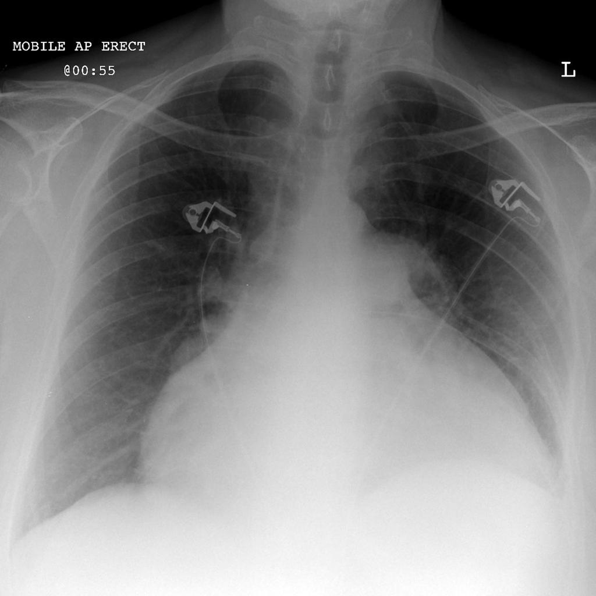 | 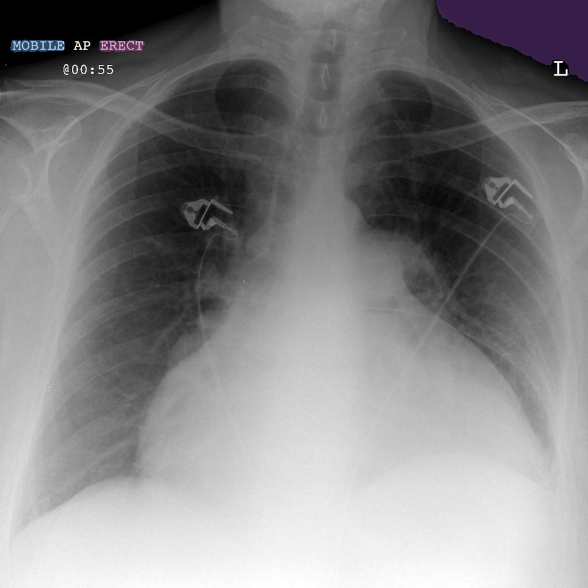 | 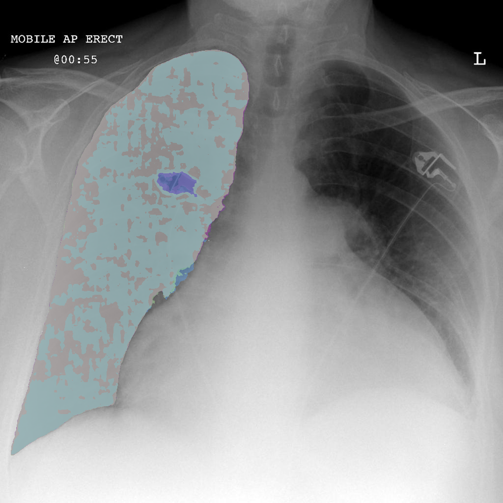 | 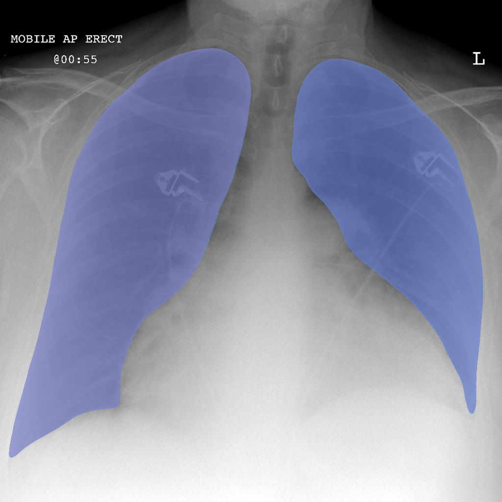 | 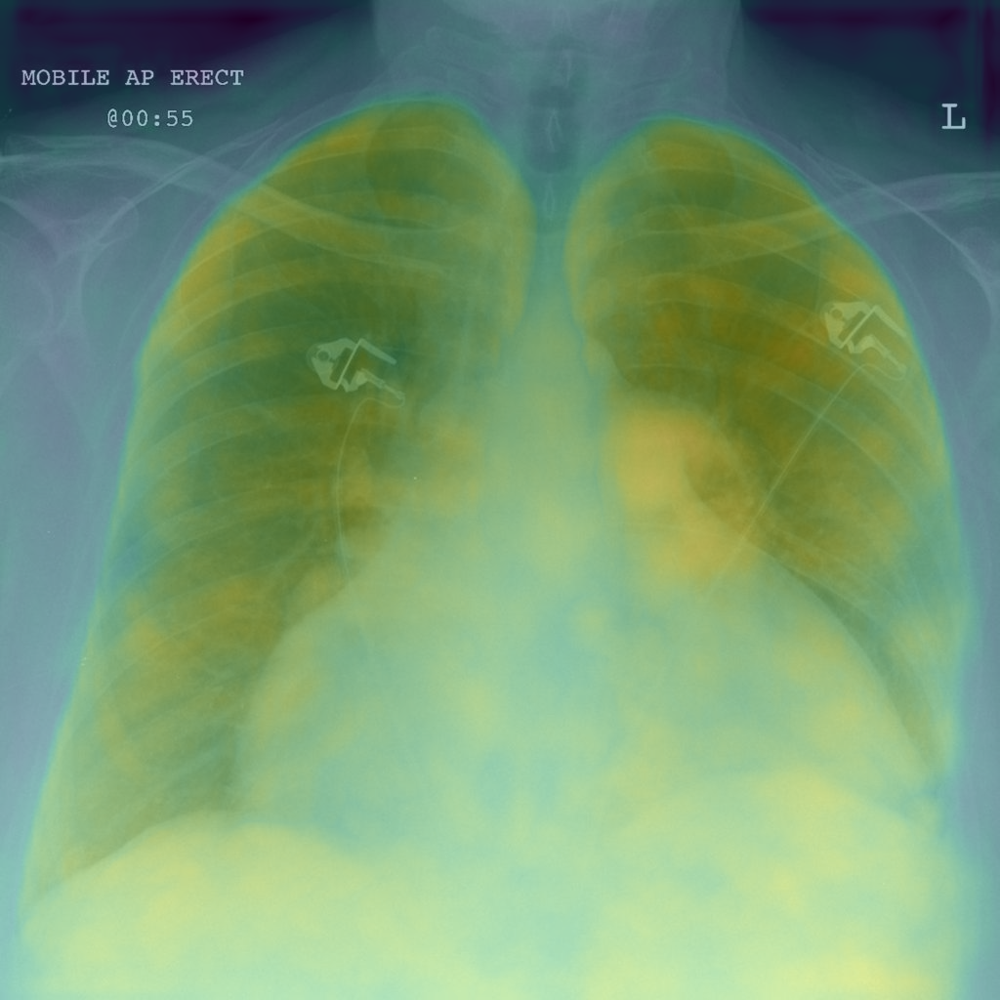 |

- **背景信息：**Age: Adult Gender: Male; Shortness of breath.；成年男性，呼吸困难。
- **原始图片 caption：**

<pre>Front chest x-ray demonstrates marked enlargement of the cardiac outline. This was due to pericardial effusion and is a good example of the water bottle sign. This refers to the shape of the cardiac silhouette on erect frontal chest x-rays in patients who have a very large pericardial effusion. The fluid, often measuring a liter or more, causes the pericardium to sag mimicking an old-fashioned water bottle sitting on a bench. Typically the effusion has accumulated over many weeks (e.g. in patients with malignancy) and the pericardium has gradually stretched.</pre>

- **原始图片 caption 翻译：**正位胸片显示心影显著增大，原因为心包积液，是典型水瓶征。大量心包液使心包下垂，形似置于台面的老式水瓶；积液通常历经数周缓慢形成，心包逐渐扩张。

<strong>InternVL3-14B</strong>

**Segmentation 对 caption 的总体影响：**负向：参考关键点减少或被错误结论取代

**原始图像 → Single-image caption 回答**

英文原始回答：

<pre>In the provided chest X-ray image, several features are visible which can help guide the diagnosis:

1. **Cardiomegaly**: The heart appears enlarged, which could indicate cardiomegaly. The cardiothoracic ratio seems elevated, suggesting a significant increase in heart size.

2. **Pulmonary Vascular Markings**: The pulmonary vasculature appears prominent. This could be due to increased pulmonary blood flow, which is often associated with heart failure or other cardiac conditions.

3. **Lungs**: The lung fields are clear otherwise. There are no overt signs of pneumonia or pulmonary edema, but the increased heart size might be contributing to a mild compression of lung tissues.

4. **Foreign Objects**: There appear to be medical devices in the chest area, possibly pacemakers or leads, indicating a history of cardiac issues.

5. **Position and Clarity**: The X-ray is taken in an Anterior-Posterior (AP) erect position, which can sometimes obscure some pathologies compared to a posteroanterior view, but the main findings are still identifiable.

**Diagnosis:**

Given the patient’s symptoms of shortness of breath and the radiographic findings:

- **Cardiomegaly**: The enlarged heart suggests an underlying cardiomyopathy, congestive heart failure, or valvular heart disease.
  
- **Possible Heart Failure**: The shortness of breath combined with cardiomegaly is highly suggestive of left-sided heart failure, potentially leading to pulmonary congestion.

- **Implications of Devices**: The presence of pacemaker/defibrillator devices suggests a history of cardiac rhythm disturbances, which could contribute to the patient&#x27;s symptoms.

**Further Workup Recommendations:**

1. **Echocardiogram**: Essential to evaluate the heart’s structure and function, providing more detailed information on the heart’s size, ejection fraction, and valve function.

2. **Electrocardiogram (ECG)**: To assess the cardiac rhythm and check for any acute ischemic changes or arrhythmias.

3. **Blood Tests**: BNP levels, complete blood count, and renal function tests to evaluate heart failure and other systemic conditions.

4. **Clinical Correlation**: Detailed patient history, including any history of hypertension, diabetes, coronary artery disease, and family history of cardiac conditions.

The combination of an enlarged heart on X-ray and shortness of breath strongly points towards a cardiac etiology, likely related to heart failure or cardiomyopathy, requiring comprehensive cardiac evaluation and management.</pre>

中文医学要点：

<pre>回答提及或最终倾向的诊断包括：心力衰竭、心脏增大、充血性心力衰竭。涉及的主要影像要点包括：起搏器在位。</pre>

**原始图像 + Segmentation → Single-image caption 回答**

英文原始回答：

<pre>This image is a chest X-ray showing an adult male with a presentation of shortness of breath. The X-ray is a frontal (anteroposterior) view taken in an erect position. 

### Observations:
- **Lungs**: The right lung appears clear. However, the left lung shows a significant area of increased opacity, suggesting a possible consolidation or fluid accumulation.
- **Cardiac Silhouette**: The heart size seems within normal limits, though this is less distinguishable given the opacity on the left side.
- **Diaphragm**: The contour of the diaphragm is not clearly visible on the left due to the increased opacity, which could imply the presence of pleural effusion or atelectasis.

### Possible Diagnosis:
- **Pleural Effusion**: The left hemithorax opacity could be indicative of fluid accumulation in the pleural space.
- **Pneumonia**: The consolidation area can be due to an infection causing alveolar filling.
- **Atelectasis**: Collapse or incomplete expansion of the lung tissue.
  
Further clinical correlation and possibly additional imaging or tests (e.g., CT scan, ultrasound, or lab tests) may be necessary for a definitive diagnosis. It&#x27;s important to consider the patient&#x27;s clinical history and symptoms in conjunction with imaging findings.</pre>

中文医学要点：

<pre>回答提及或最终倾向的诊断包括：肺不张、肺炎、胸腔积液。涉及的主要影像要点包括：肺实变、膈肌异常或定位、心影异常。</pre>

**Segmentation 对 caption 的影响分析：**

原始 caption：球形/增大心影（结论）；加入 segmentation 后：未命中核心征象。加入 segmentation 后参考证据减少，说明 mask 或其文本提示产生了干扰，不能视为 caption 改善。该判断以是否接近 Radiopaedia 原始 caption 为准，不依据回答篇幅。

<strong>InternVL3.5-14B</strong>

**Segmentation 对 caption 的总体影响：**负向：参考关键点减少或被错误结论取代

**原始图像 → Single-image caption 回答**

英文原始回答：

<pre>&lt;think&gt;
The image provided is a chest X-ray in the anteroposterior (AP) erect view, likely taken in a mobile setting. The patient is an adult male presenting with shortness of breath.

### Key Observations:

1. **Cardiac Silhouette:**
   - The heart appears enlarged, suggesting cardiomegaly. This can be due to various causes, including heart failure, cardiomyopathy, or pericardial effusion.

2. **Lung Fields:**
   - The lung fields appear relatively clear without obvious consolidation, pleural effusion, or pneumothorax. However, there is some prominence of the hila, which could indicate pulmonary vascular congestion.

3. **Diaphragm and Costophrenic Angles:**
   - The diaphragm appears elevated, and the costophrenic angles are sharp, which is normal. There is no evidence of pleural effusion.

4. **Bones and Soft Tissues:**
   - The bony structures (clavicles, ribs, spine) appear intact without obvious fractures or lesions. Soft tissues are unremarkable.

5. **Medical Devices:**
   - There are ECG leads visible on the chest, indicating the patient was likely being monitored at the time of the X-ray.

### Differential Diagnosis:

- **Cardiomegaly with Possible Heart Failure:**
  - The prominence of the cardiac silhouette and potential pulmonary vascular congestion could suggest heart failure, which can present with shortness of breath.

- **Pulmonary Edema:**
  - If there is pulmonary vascular congestion, it could indicate early pulmonary edema, often secondary to left-sided heart failure.

- **Pericardial Effusion:**
  - An enlarged cardiac silhouette could also be due to fluid around the heart, which can impair cardiac function and lead to shortness of breath.

- **Other Causes of Shortness of Breath:**
  - While the lungs appear clear, conditions like asthma, COPD, or pulmonary embolism might not be directly visible on a chest X-ray and would require further investigation.

### Conclusion:

The chest X-ray shows cardiomegaly with possible signs of pulmonary vascular congestion, which could be indicative of heart failure or another cardiac condition. The patient&#x27;s shortness of breath may be related to the underlying cardiac issue. Further evaluation, including echocardiography, BNP levels, and possibly a lateral chest X-ray or CT, would be necessary to confirm the diagnosis and assess the extent of the condition.
&lt;/think&gt;

**Diagnosis:**

The chest X-ray demonstrates cardiomegaly with possible pulmonary vascular congestion, suggesting a cardiac etiology for the patient&#x27;s shortness of breath. The most likely diagnosis is **heart failure**, potentially due to left ventricular dysfunction or pericardial effusion. Further evaluation with echocardiography and clinical correlation is recommended to confirm the diagnosis and guide management.

**Key Findings:**
- Enlarged cardiac silhouette (cardiomegaly)
- Possible pulmonary vascular congestion
- Clear lung fields without evidence of pneumonia or pleural effusion

**Recommended Next Steps:**
1. **Echocardiogram** to assess cardiac function and structure.
2. **B-type Natriuretic Peptide (BNP) testing** to evaluate for heart failure.
3. **Clinical assessment** for signs of volume overload or other cardiac conditions.
4. Consider **lateral chest X-ray** or **CT** if further imaging is needed to evaluate the heart and lungs more thoroughly.</pre>

中文医学要点：

<pre>回答提及或最终倾向的诊断包括：心力衰竭、胸腔积液、肺炎、心脏增大。涉及的主要影像要点包括：心影异常、膈肌异常或定位、肺实变。</pre>

**原始图像 + Segmentation → Single-image caption 回答**

英文原始回答：

<pre>&lt;think&gt;
Okay, let&#x27;s take a look at this chest X-ray. The patient is an adult male presenting with shortness of breath. The X-ray is a mobile AP erect view. First, I&#x27;ll start by assessing the overall lung fields. The lungs should be clear, but there might be something here.

Looking at the right lung, there&#x27;s a noticeable area of increased opacity. The segmentation from Medical-SAM2 and others highlights this area. The right lung&#x27;s lower zone seems to have a consolidation or maybe a pleural effusion. Wait, the diaphragm on the right side isn&#x27;t clearly visible, which could indicate fluid. But the heart is shifted towards the left, which might suggest volume loss or a mass on the right.

The left lung seems relatively clear, but the cardiac silhouette is enlarged. The heart appears to be enlarged, which could be cardiomegaly. The mediastinum is widened, which might be due to the enlarged heart or some other cause like a mediastinal mass. The diaphragm on the left side is visible, but the right side is obscured, supporting the possibility of a pleural effusion on the right.

The patient&#x27;s symptoms of shortness of breath could be due to several reasons: pulmonary edema, pneumonia, pleural effusion, or cardiomegaly leading to heart failure. The presence of an enlarged heart and possible right-sided effusion might point towards congestive heart failure. Alternatively, a large pneumonia in the right lower lobe with effusion could cause similar symptoms.

Wait, the segmentation from TorchXRayVision shows the lungs in green, heart and mediastinum in yellow. The right lung&#x27;s lower part is more opaque, which could be consolidation or effusion. The left lung seems clearer. The heart is enlarged, and the mediastinum is shifted? Or is it just the projection?

In an AP view, the heart can appear larger than in a PA view, but significant enlargement should still be noted. The combination of cardiomegaly, possible right effusion, and shortness of breath makes me think of congestive heart failure, leading to pulmonary edema and pleural effusion. But the right lung&#x27;s opacity might also be a pneumonia, especially if there&#x27;s a lobar consolidation.

Alternatively, a pneumothorax could cause shortness of breath, but the X-ray doesn&#x27;t show a clear visceral pleural line. The Medical-SAM2 segmentation didn&#x27;t highlight a pneumothorax area. The left lung is clear, so maybe not.

Another possibility is a pulmonary embolism, but that&#x27;s usually not seen on a regular X-ray unless there&#x27;s a complication like infarction. The X-ray might not show that.

So, putting it together: the patient has an enlarged heart, possible right pleural effusion, and right lower lobe opacity. The shortness of breath could be due to heart failure with effusion and possible pulmonary edema, or a pneumonia with effusion. The lack of left-sided effusion and the presence of cardiomegaly lean towards cardiac issues. However, the right lower lobe consolidation could be a superimposed infection.

I need to consider the clinical context. If the patient has a history of heart disease, then CHF is more likely. If they have a fever or cough, pneumonia. Without more history, it&#x27;s a bit tricky, but the X-ray findings suggest either cardiogenic pulmonary edema or pneumonia with effusion. The fact that the heart is enlarged might support the cardiac cause. However, the right lower lobe opacity could be atelectasis or infection.

In conclusion, the primary considerations are congestive heart failure with possible right pleural effusion and pulmonary edema, or pneumonia with right lower lobe consolidation and effusion. Further tests like a lateral X-ray, echocardiogram, or CT would help differentiate.
&lt;/think&gt;

**Diagnosis and Image Description:**

The chest X-ray reveals several critical findings in the context of a male adult with shortness of breath:

1. **Cardiomegaly**: The cardiac silhouette is enlarged, suggesting potential heart failure or pericardial effusion. The AP projection may exaggerate heart size, but significant enlargement is still evident.

2. **Right Lower Lung Opacity**: 
   - A dense consolidation or atelectasis is noted in the right lower lung zone, as highlighted by segmentations (Medical-SAM2, TorchXRayVision). 
   - The right costophrenic angle is blunted, indicating a possible pleural effusion. The obscured right diaphragm supports this.

3. **Clear Left Lung**: The left lung appears aerated, with no significant effusion or consolidation, though the cardiac silhouette encroaches laterally.

4. **Mediastinal Shift**: The mediastinum appears slightly shifted leftward, potentially due to right lung volume loss (e.g., atelectasis/consolidation) or effusion.

**Differential Diagnoses:**
- **Cardiogenic Pulmonary Edema**: Enlarged heart with possible right effusion and pulmonary vascular congestion (though less prominent on this AP view).
- **Pneumonia with Effusion**: Right lower lobe consolidation and effusion, particularly if the patient has fever, cough, or risk factors (e.g., aspiration).
- **Non-Cardiac Causes**: Pulmonary embolism (less likely on X-ray without infarction signs) or malignancy (e.g., obstructive pneumonia).

**Recommendations:**
- **Echocardiogram** to assess cardiac function and rule out heart failure.
- **Lateral X-ray** or CT to better characterize the right lower lobe opacity and effusion.
- **Clinical correlation** (e.g., BNP, troponin, CBC, sputum culture) to distinguish between cardiac and infectious etiologies.

**Conclusion:** The most likely diagnosis is **congestive heart failure with right pleural effusion** or **pneumonia complicated by effusion**. Further imaging and clinical evaluation are essential for definitive diagnosis.</pre>

中文医学要点：

<pre>回答提及或最终倾向的诊断包括：肺炎、胸腔积液、心力衰竭、充血性心力衰竭。涉及的主要影像要点包括：肺实变、纵隔移位、心影异常、膈肌异常或定位、肺部致密影。</pre>

**Segmentation 对 caption 的影响分析：**

原始 caption：心包积液（结论）、球形/增大心影（文本提及）；加入 segmentation 后：心包积液（文本提及）、球形/增大心影（文本提及）。加入 segmentation 后参考证据减少，说明 mask 或其文本提示产生了干扰，不能视为 caption 改善。该判断以是否接近 Radiopaedia 原始 caption 为准，不依据回答篇幅。

<strong>Lingshu-32B</strong>

**Segmentation 对 caption 的总体影响：**正向：新增或强化参考关键点

**原始图像 → Single-image caption 回答**

英文原始回答：

<pre>The chest X-ray shows an enlarged cardiac silhouette, which is indicative of cardiomegaly. The lung fields appear clear without any signs of consolidation or pleural effusion. There are no visible fractures or abnormalities in the bony structures. Given the patient&#x27;s presentation of shortness of breath and the radiographic evidence of an enlarged heart, the most likely diagnosis is congestive heart failure. This condition can lead to fluid accumulation in the lungs, although it is not evident in this particular image. Further clinical correlation and possibly additional imaging or echocardiography would be necessary to confirm the diagnosis and assess the severity of the heart failure.</pre>

中文医学要点：

<pre>回答提及或最终倾向的诊断包括：心力衰竭、充血性心力衰竭。涉及的主要影像要点包括：肺实变、心影异常。</pre>

**原始图像 + Segmentation → Single-image caption 回答**

英文原始回答：

<pre>Findings: The chest X-ray shows an enlarged cardiac silhouette, which suggests cardiomegaly. There is also evidence of increased opacity in the lower lung fields bilaterally, which could indicate pulmonary edema or pleural effusion. The presence of medical devices such as ECG leads is noted. The diaphragm appears elevated, which may be due to the enlarged heart or other underlying conditions. Impression: The findings are consistent with congestive heart failure, characterized by cardiomegaly and possible pulmonary edema. Further clinical correlation and additional imaging or tests may be necessary to confirm the diagnosis and assess the severity of the condition.</pre>

中文医学要点：

<pre>回答提及或最终倾向的诊断包括：肺水肿、心脏增大、心力衰竭、充血性心力衰竭。涉及的主要影像要点包括：膈肌异常或定位、心影异常。</pre>

**Segmentation 对 caption 的影响分析：**

原始 caption：球形/增大心影（文本提及）；加入 segmentation 后：球形/增大心影（结论）。加入 segmentation 后参考证据增加，说明 overlay 至少改善了相关结构或病灶的注意力分配。该判断以是否接近 Radiopaedia 原始 caption 为准，不依据回答篇幅。

<strong>MedGemma-27B-IT</strong>

**Segmentation 对 caption 的总体影响：**负面：心影分割使明显心影增大被判为正常

**原始图像 → Single-image caption 回答**

英文原始回答：

<pre>**Image Description:**

The image is a frontal chest X-ray of an adult male patient. The heart appears enlarged, occupying a significant portion of the chest cavity. The cardiac silhouette is somewhat globular in shape. The pulmonary vasculature appears relatively normal, without obvious signs of congestion or edema. The lung fields themselves appear clear, without focal opacities suggestive of pneumonia or significant atelectasis. The costophrenic angles are sharp, suggesting no significant pleural effusion. The mediastinal structures appear within normal limits, although the enlarged heart obscures some detail.

**Diagnosis:**

Based on the enlarged cardiac silhouette (cardiomegaly) seen on the chest X-ray, the most likely diagnosis is **cardiomegaly**.

**Differential Diagnosis and Considerations:**

Cardiomegaly is a sign, not a specific disease. It indicates that the heart is larger than normal. The underlying cause needs further investigation. Potential causes include:

1.  **Hypertensive Heart Disease:** Chronic high blood pressure can lead to left ventricular hypertrophy and subsequent enlargement.
2.  **Dilated Cardiomyopathy:** Weakening of the heart muscle leading to chamber dilation.
3.  **Ischemic Heart Disease:** Previous myocardial infarction or chronic ischemia can cause ventricular remodeling and enlargement.
4.  **Valvular Heart Disease:** Conditions like aortic stenosis, mitral regurgitation, or aortic regurgitation can cause volume or pressure overload, leading to chamber enlargement.
5.  **Congenital Heart Disease:** Certain congenital defects can cause cardiomegaly.
6.  **Pericardial Effusion:** Fluid accumulation around the heart can make the cardiac silhouette appear enlarged (though often with a &quot;water bottle&quot; shape).
7.  **Myocarditis:** Inflammation of the heart muscle.
8.  **Arrhythmogenic Cardiomyopathy:** A condition where heart muscle is replaced by fibrous tissue.
9.  **Hypertrophic Cardiomyopathy:** While often associated with normal or small heart size on X-ray, severe cases can sometimes show enlargement.

**Clinical Correlation:**

The patient&#x27;s presentation of shortness of breath is consistent with cardiomegaly, as an enlarged heart may lead to heart failure, causing fluid backup into the lungs (pulmonary congestion) or reduced cardiac output, both of which can cause dyspnea.

**Next Steps:**

Further investigations are necessary to determine the specific cause of the cardiomegaly. These typically include:

*   **Electrocardiogram (ECG):** To assess heart rhythm and look for signs of ischemia, hypertrophy, or conduction abnormalities.
*   **Echocardiogram:** To evaluate heart size, chamber function, valve function, and wall thickness. This is the most crucial test for determining the cause and severity of cardiomegaly.
*   **Blood tests:** Including cardiac enzymes (if acute ischemia is suspected), BNP (brain natriuretic peptide, elevated in heart failure), and other markers.
*   **Clinical history and physical examination:** To gather information about risk factors (hypertension, diabetes, smoking, family history), symptoms (chest pain, palpitations, edema), and physical findings (murmurs, jugular venous distension, edema).

**Conclusion:**

The chest X-ray shows cardiomegaly in an adult male presenting with shortness of breath. This finding warrants further investigation to determine the underlying etiology.</pre>

中文要点翻译：

<pre>胸片显示心影增大并呈球形，肺血管和肺野相对正常；模型诊断心脏增大，并把心包积液列为可能病因之一。</pre>

**原始图像 + Segmentation → Single-image caption 回答**

英文原始回答：

<pre>**Image Description:**

The image is a frontal chest X-ray of an adult male patient. The patient is lying down, likely supine, as indicated by the mobile X-ray label. The image shows the heart, lungs, mediastinum, and diaphragm. The lungs appear relatively clear, although there might be subtle opacities, especially in the lower lung fields, which could be due to patient positioning, overlying soft tissues, or underlying pathology. The heart size appears within normal limits, and the mediastinal structures are unremarkable. The diaphragm is visible, and the costophrenic angles appear sharp, suggesting no significant pleural effusion.

**Analysis of Segmentations:**

*   **Medical-SAM2:** This segmentation highlights the heart and cardiac silhouette.
*   **Medical-SAM3:** This segmentation identifies the left lung, right lung, heart, and cardiac silhouette.
*   **BiomedParse:** This segmentation identifies the left lung, right lung, heart, and cardiac silhouette.
*   **TorchXRayVision:** This segmentation provides a more detailed breakdown, identifying the lungs (left and right), diaphragm, heart, cardiomediastinum, upper mediastinum, lower mediastinum, and stomach.

**Clinical Context and Diagnosis:**

The patient presents with shortness of breath. The chest X-ray is a standard initial investigation for this symptom.

*   **Findings:** The X-ray shows a normal-sized heart and relatively clear lung fields. There are no obvious signs of pneumonia (consolidation), pneumothorax (collapsed lung), large pleural effusion (fluid around the lung), or significant pulmonary edema (fluid in the lungs).
*   **Interpretation:** While the X-ray doesn&#x27;t show any acute, obvious pathology like pneumonia or heart failure, subtle findings or underlying conditions cannot be ruled out based solely on this single image. The shortness of breath could be due to various causes, including cardiac issues, respiratory conditions (like asthma, COPD, or early pneumonia), anxiety, or other systemic problems.
*   **Diagnosis:** Based *only* on this single chest X-ray, a definitive diagnosis cannot be made. The X-ray appears largely unremarkable, but further investigation (e.g., clinical history, physical examination, blood tests, ECG, CT scan, pulmonary function tests) is necessary to determine the cause of the patient&#x27;s shortness of breath.

**In summary:** The chest X-ray shows a normal cardiac silhouette and relatively clear lung fields. While it doesn&#x27;t reveal an obvious cause for the patient&#x27;s shortness of breath, it doesn&#x27;t rule out underlying pathology either. Further clinical evaluation is required.</pre>

中文要点翻译：

<pre>加入心脏、心纵隔和肺部 overlay 后，模型改称心脏大小正常、纵隔无异常、肺野清晰，认为单张胸片不能给出明确诊断。</pre>

**对模型图片 caption 能力及 Segmentation 影响的分析：**

原始 caption 已抓住最关键的巨大球形心影，并接近水瓶征；segmentation 后反而否定心影增大。这说明错误或边界不稳定的心脏 mask 可能覆盖原始轮廓线索，使模型过度信任 overlay，是非常明确的负向案例。

<strong>MedMO-8B</strong>

**Segmentation 对 caption 的总体影响：**无帮助：前后均未命中参考核心征象

**原始图像 → Single-image caption 回答**

英文原始回答：

<pre>The lungs are clear. The heart is not enlarged. The mediastinal contours are normal.</pre>

中文医学要点：

<pre>回答未形成可稳定提取的明确疾病结论。未提取到与参考病灶高度特异的影像征象。</pre>

**原始图像 + Segmentation → Single-image caption 回答**

英文原始回答：

<pre>The patient is a male adult with shortness of breath. The x-ray shows a normal chest x-ray.</pre>

中文医学要点：

<pre>回答提及或最终倾向的诊断包括：胸部未见明显异常。未提取到与参考病灶高度特异的影像征象。</pre>

**Segmentation 对 caption 的影响分析：**

原始 caption：未命中核心征象；加入 segmentation 后：未命中核心征象。前后都没有覆盖决定性征象；回答即使变长，也不能视为有效的视觉理解增益。该判断以是否接近 Radiopaedia 原始 caption 为准，不依据回答篇幅。

<strong>Qwen3-VL-4B</strong>

**Segmentation 对 caption 的总体影响：**负向：参考关键点减少或被错误结论取代

**原始图像 → Single-image caption 回答**

英文原始回答：

<pre>Based on the provided patient data (adult male, presenting with shortness of breath) and the chest X-ray image (mobile AP erect view), the following analysis and diagnosis can be made:

**Image Description:**
- The image is a frontal (AP erect) chest X-ray, labeled “MOBILE AP ERECT @00:55”, indicating it was taken in a standing position, likely for a mobile unit.
- The patient has two visible pacemaker leads (identifiable by the metallic, hook-shaped electrode assemblies) placed in the right and left atria, with wires extending down toward the heart.
- The cardiac silhouette appears enlarged, particularly the left ventricle, which is significantly more prominent than normal. This is consistent with a large cardiac silhouette.
- The lungs are clear, with no evidence of infiltrates, consolidation, or pleural effusion.
- The diaphragm appears normal in contour and position.
- There is no evidence of pneumothorax, atelectasis, or significant tracheal deviation.

**Diagnosis:**
The most likely diagnosis is **Congestive Heart Failure (CHF)** — specifically, **left ventricular failure** — based on the markedly enlarged cardiac silhouette on the X-ray.

**Rationale:**
- The enlarged cardiac silhouette is a classic radiographic sign of left ventricular enlargement, which is commonly associated with chronic pressure overload (e.g., hypertension, valvular disease) or volume overload (e.g., mitral regurgitation, aortic stenosis).
- The patient’s presentation of shortness of breath is consistent with CHF, which can result from the heart’s inability to pump effectively, leading to fluid accumulation in the lungs (pulmonary congestion).
- The presence of a pacemaker suggests the patient may have had a prior arrhythmia or conduction issue, which may have contributed to the development of heart failure (e.g., bradycardia or atrial fibrillation leading to poor cardiac output).
- The absence of lung infiltrates or effusions makes other causes of dyspnea (e.g., pneumonia, pulmonary embolism) less likely.

**Conclusion:**
The patient is likely suffering from **left ventricular heart failure**, supported by the radiographic finding of cardiomegaly and the clinical presentation of dyspnea. Further diagnostic workup (e.g., echocardiogram, BNP levels, ECG) is recommended to confirm the diagnosis and assess the severity and etiology of the heart failure.

**Note:** The presence of pacemaker leads is not a disease itself but a therapeutic intervention, and its presence does not negate the diagnosis of heart failure — in fact, it may be a result of underlying cardiac disease that required pacing.</pre>

中文医学要点：

<pre>回答提及或最终倾向的诊断包括：心力衰竭、心脏增大。涉及的主要影像要点包括：起搏器在位、心影异常、膈肌异常或定位、肺实变。</pre>

**原始图像 + Segmentation → Single-image caption 回答**

英文原始回答：

<pre>Based on the provided chest X-ray and patient data, here is an analysis and diagnosis:

**Image Description:**

This is a mobile, anteroposterior (AP) erect chest X-ray of an adult male. The image shows:

1.  **Lung Fields:** Both lungs are visible. The lung fields appear clear with normal vascular markings. There is no evidence of large, diffuse opacities, consolidation, or ground-glass appearance that would suggest pneumonia or acute interstitial lung disease. The lung volumes appear normal.
2.  **Cardiac Silhouette:** The heart is centrally located and appears normal in size and shape. The cardiac silhouette is not enlarged, and there is no evidence of cardiomegaly or significant cardiac enlargement.
3.  **Diaphragm:** The diaphragm is visible and appears to be at a normal level, with no elevation or flattening.
4.  **Mediastinum:** The mediastinum is centrally located and appears normal in width.
5.  **Artifacts:** There are two metallic leads (likely from a pacemaker or defibrillator) visible in the chest, one on each side, which are normal findings in patients with cardiac devices.
6.  **Overall Appearance:** The image shows no signs of acute respiratory distress, such as pleural effusion, pneumothorax, or significant air trapping.

**Diagnosis:**

The chest X-ray is **normal**.

**Rationale:**

The patient presents with shortness of breath, which is a common symptom that can have many causes. However, the chest X-ray shows no abnormalities that would explain the shortness of breath. The lungs are clear, the heart is normal in size and shape, and the diaphragm is at a normal level. The presence of pacemaker leads is expected and does not affect the interpretation of the lung fields.

**Conclusion:**

The chest X-ray is normal. The shortness of breath in this patient is likely due to a non-cardiac or non-pulmonary cause, such as:

*   **Anxiety or panic attack**
*   **Muscle weakness or fatigue**
*   **Gastroesophageal reflux disease (GERD)**
*   **Asthma (not evident on this X-ray)**
*   **Other non-respiratory conditions**

Further evaluation, including a detailed history, physical examination, and possibly other diagnostic tests (e.g., spirometry, ECG, blood tests), is needed to determine the underlying cause of the shortness of breath. The chest X-ray is not diagnostic for the patient&#x27;s symptoms but is reassuringly normal.</pre>

中文医学要点：

<pre>回答提及或最终倾向的诊断包括：胃食管反流病。涉及的主要影像要点包括：起搏器在位、膈肌异常或定位、心影异常、肺实变。</pre>

**Segmentation 对 caption 的影响分析：**

原始 caption：球形/增大心影（结论）；加入 segmentation 后：球形/增大心影（否定/鉴别）。加入 segmentation 后参考证据减少，说明 mask 或其文本提示产生了干扰，不能视为 caption 改善。该判断以是否接近 Radiopaedia 原始 caption 为准，不依据回答篇幅。

<strong>Qwen3-VL-8B</strong>

**Segmentation 对 caption 的总体影响：**基本持平：前后均提及部分参考关键点

**原始图像 → Single-image caption 回答**

英文原始回答：

<pre>Based on the provided image and patient data, here is the analysis:

**Image Description:**
This is a frontal (anteroposterior) chest X-ray taken in the erect position, labeled “MOBILE AP ERECT,” suggesting it was obtained in a non-traditional setting (e.g., bedside or in a hospital bed). The image shows the thoracic cavity with both lungs, heart, and bony thorax visible. Notable features include:

- **Cardiomegaly:** The cardiac silhouette appears enlarged, with the heart occupying a larger-than-normal portion of the thoracic cavity. The cardiac borders are prominent, and the heart appears to be enlarged in both transverse and anteroposterior dimensions.
- **Lung Fields:** The lung fields appear clear, without obvious consolidation, pleural effusion, or pneumothorax. The vascular markings are visible but not particularly prominent.
- **Mediastinum:** The mediastinum appears central without significant deviation.
- **Diaphragm:** The diaphragmatic domes are visible, though the lower lung fields are somewhat obscured by the overlying heart shadow.
- **Devices:** There are two small, metallic-looking devices visible in the chest, likely pacemaker leads or defibrillator leads, consistent with the presence of a cardiac implantable electronic device (CIED). One is visible in the left thorax (near the left sternal border), and another in the right thorax (near the right sternal border).

**Clinical Context:**
The patient is an adult male presenting with shortness of breath. The presence of a CIED suggests a history of cardiac disease, possibly arrhythmia or heart failure. The key finding on the X-ray is **cardiomegaly**.

**Diagnosis:**
**Cardiomegaly** (enlarged heart) — likely secondary to underlying cardiac pathology such as **congestive heart failure** or **chronic volume overload**.

**Rationale:**
- The enlarged cardiac silhouette is the most striking finding and correlates with the patient’s symptom of shortness of breath, which is a common manifestation of heart failure.
- The absence of pulmonary edema or pleural effusion on the X-ray suggests that the heart failure may be in an early or compensated stage, or the patient may have a non-hypertensive form of cardiomegaly.
- The presence of a CIED supports a history of cardiac disease, which may be the cause of the cardiomegaly.

**Next Steps:**
- Further evaluation with echocardiography to assess cardiac function and determine the cause of cardiomegaly.
- Consideration of other potential causes of cardiomegaly, such as pericardial disease, congenital heart disease, or systemic diseases.
- Assessment of the patient’s cardiac rhythm and function, given the presence of a CIED.
- Management should be directed toward the underlying cardiac condition, which may include diuretics, ACE inhibitors, or other heart failure therapies.

**Conclusion:**
The chest X-ray demonstrates cardiomegaly, which is likely contributing to the patient’s shortness of breath. Further investigation is warranted to determine the cause and appropriate management.</pre>

中文医学要点：

<pre>回答提及或最终倾向的诊断包括：心脏增大。涉及的主要影像要点包括：心影异常、起搏器在位、膈肌异常或定位、肺实变。</pre>

**原始图像 + Segmentation → Single-image caption 回答**

英文原始回答：

<pre>Based on the provided chest X-ray and patient data (adult male, presenting with shortness of breath), here is a detailed analysis and diagnosis:

**Image Description:**

This is an AP (anteroposterior) erect chest X-ray, likely taken on a mobile unit. The image shows the thoracic cavity with the following key observations:

1.  **Cardiomegaly:** The cardiac silhouette is significantly enlarged, occupying a large portion of the thoracic cavity. This is a prominent finding.
2.  **Lung Fields:** Both lung fields appear relatively clear, with no obvious focal consolidation, infiltrates, or pleural effusions. The lung markings are visible, but the overall lung volume appears reduced, which is consistent with the cardiac enlargement.
3.  **Diaphragm:** The diaphragm appears elevated, which is a common finding associated with cardiomegaly and can contribute to shortness of breath.
4.  **Mediastinum:** The mediastinum is widened, which is often a consequence of an enlarged heart pushing against the surrounding structures.
5.  **Medical Devices:** There are two pacemaker leads visible, one in the right chest and one in the left chest, indicating the patient has a pacemaker implanted. The leads are well-positioned within the heart chambers.

**Diagnosis:**

The most likely diagnosis is **Congestive Heart Failure (CHF)**, specifically **Left Ventricular Failure**.

**Rationale:**

*   **Cardiomegaly:** The most striking finding is the enlarged heart. This is a classic radiological sign of chronic heart disease, particularly left ventricular hypertrophy or dilation, which is common in CHF.
*   **Elevated Diaphragm:** The elevated diaphragm is a compensatory mechanism to reduce the workload on the heart and is often seen in patients with chronic heart failure.
*   **Shortness of Breath:** This is a classic symptom of CHF, caused by pulmonary congestion due to the heart&#x27;s inability to pump effectively, leading to fluid buildup in the lungs.
*   **Pacemaker:** The presence of a pacemaker suggests the patient may have had a history of arrhythmias, which can be a contributing factor to heart failure.

**Conclusion:**

The chest X-ray shows significant cardiomegaly, an elevated diaphragm, and a widened mediastinum, all of which are consistent with a diagnosis of congestive heart failure. The patient&#x27;s symptoms of shortness of breath and the presence of a pacemaker further support this diagnosis. Further evaluation with echocardiography is recommended to confirm the diagnosis and assess the severity of the heart failure.

**Note:** While the lung fields appear clear, this does not rule out pulmonary congestion. In CHF, congestion may be subtle or present as diffuse interstitial markings, which may not be easily visible on a standard X-ray.</pre>

中文医学要点：

<pre>回答提及或最终倾向的诊断包括：心力衰竭、充血性心力衰竭、心脏增大。涉及的主要影像要点包括：起搏器在位、膈肌异常或定位、肺实变、心影异常。</pre>

**Segmentation 对 caption 的影响分析：**

原始 caption：球形/增大心影（结论）；加入 segmentation 后：球形/增大心影（结论）。前后对参考征象的覆盖基本不变；segmentation 没有带来可辨认的疾病特异性增量。该判断以是否接近 Radiopaedia 原始 caption 为准，不依据回答篇幅。

<strong>Qwen3-VL-32B</strong>

**Segmentation 对 caption 的总体影响：**无明确增益：仅在鉴别或否定语境中提及关键点

**原始图像 → Single-image caption 回答**

英文原始回答：

<pre>**Image Description:**

This is a frontal (anteroposterior, AP) mobile chest X-ray taken in an erect position, as indicated by the label “MOBILE AP ERECT” in the upper left corner. The image shows the thoracic cavity with both lungs, the heart, and bony structures including the ribs, clavicles, and vertebral bodies.

Key observations:

- **Lung fields**: The right lung appears relatively clear with visible vascular markings extending to the periphery. The left lung shows **increased opacity in the left lower zone**, particularly in the left lower lobe. There is a **hazy, patchy consolidation** with possible air bronchograms, suggesting alveolar filling.
  
- **Cardiomediastinal silhouette**: The heart size appears normal. The mediastinum is midline without significant widening.

- **Diaphragm**: The diaphragms are visible, with the right hemidiaphragm slightly higher than the left, which is normal. There is no evident free air under the diaphragm.

- **Bony structures**: The ribs and clavicles are intact. There are **two metallic devices** visible — one on each side, near the upper lung fields — likely **pacemaker or ICD leads**, with their generators positioned in the pectoral region. These are consistent with a known cardiac device.

- **Soft tissues**: No obvious soft tissue masses or subcutaneous emphysema.

---

**Clinical Context:**

The patient is an adult male presenting with **shortness of breath**.

---

**Interpretation &amp; Diagnosis:**

The most significant finding is the **left lower lobe consolidation** with hazy opacities and possible air bronchograms. This appearance is classic for **pneumonia** (likely bacterial), particularly in the context of acute respiratory symptoms.

Other differential considerations include:

- **Atelectasis** — but the pattern is more consistent with consolidation rather than volume loss.
- **Pulmonary edema** — typically bilateral and perihilar, not localized to one lobe.
- **Lung abscess or neoplasm** — less likely acutely without other features (e.g., cavitation, mass effect, or chronicity).

Given the **acute presentation of dyspnea** and the **radiographic finding of left lower lobe consolidation**, the most likely diagnosis is:

&gt; **Community-acquired pneumonia (CAP), left lower lobe.**

---

**Recommendations:**

- Clinical correlation with symptoms (fever, cough, sputum, etc.) and labs (WBC, CRP, blood cultures).
- Consider antibiotic therapy targeting common pathogens (e.g., Streptococcus pneumoniae).
- Follow-up imaging (e.g., repeat CXR or CT chest) if clinical response is poor or if complications (e.g., empyema, abscess) are suspected.
- Evaluate for comorbidities (e.g., COPD, heart failure, immunocompromise) given the presence of a cardiac device.

---

**Final Diagnosis:**

&gt; **Left lower lobe pneumonia (likely bacterial), in an adult male presenting with shortness of breath.**</pre>

中文医学要点：

<pre>回答提及或最终倾向的诊断包括：肺炎。涉及的主要影像要点包括：肺实变、起搏器在位、膈肌异常或定位、游离气体。</pre>

**原始图像 + Segmentation → Single-image caption 回答**

英文原始回答：

<pre>Based on the provided chest X-ray (mobile AP erect view) and the patient’s presentation of **shortness of breath**, here is a detailed description and diagnostic assessment:

---

### **Image Description**

- **Projection**: Anteroposterior (AP) erect view, taken with a mobile X-ray unit.
- **Patient Position**: Upright, as indicated by “ERECT” and the clear visualization of the diaphragm.
- **Technical Quality**: Adequate penetration; bony thorax (ribs, clavicles, spine) is visible. The cardiac silhouette and diaphragm are discernible.
- **Notable Findings**:
  - **Cardiac Silhouette**: Appears **enlarged** (cardiomegaly), with increased transverse diameter. The cardiothoracic ratio is likely &gt;50% (though exact measurement not possible without calibration).
  - **Lungs**: Both lungs show **increased opacities**, particularly in the **basilar and perihilar regions**, with a **patchy, reticular or ground-glass appearance**. There is **blunting of the costophrenic angles**, suggesting **bilateral pleural effusions**.
  - **Diaphragm**: The diaphragms appear **elevated** and **flattened**, especially on the right, which may indicate chronic volume overload or underlying pulmonary disease.
  - **Mediastinum**: No significant widening. The trachea is midline.
  - **Foreign Bodies**: Two **pacemaker leads** are visible, with generator pockets in the upper right and left hemithorax — indicating the patient has a **dual-chamber pacemaker**.
  - **Bones**: No fractures or lytic lesions noted.

---

### **Segmentation Analysis**

- **Medical-SAM2**: Segments only the upper left corner (likely part of the neck/soft tissue), which is not clinically relevant.
- **Medical-SAM3**: Segments only the **right lung** with some internal opacities (purple), suggesting areas of consolidation or fibrosis. However, the left lung is not segmented — a limitation.
- **BiomedParse**: Segments **both lungs** symmetrically, which is anatomically accurate. The segmentation is smooth and follows the lung fields well, but does not highlight pathology.
- **TorchXRayVision**: Provides a **heat-map-like overlay** with green/yellow hues over the lungs and mediastinum, suggesting areas of increased density or pathology. The **heart and mediastinum are also highlighted**, consistent with cardiomegaly and possible pulmonary congestion.

---

### **Clinical Correlation**

The patient is an **adult male** presenting with **shortness of breath**. The X-ray findings are highly suggestive of **congestive heart failure (CHF)**, likely **acute decompensated heart failure (ADHF)**.

---

### **Diagnosis**

&gt; **Acute Decompensated Heart Failure (ADHF) with Pulmonary Congestion and Bilateral Pleural Effusions**

---

### **Supporting Radiographic Findings**

1. **Cardiomegaly**: Enlarged cardiac silhouette → suggests underlying cardiac disease (e.g., ischemic cardiomyopathy, dilated cardiomyopathy).
2. **Pulmonary Congestion**: Increased vascular markings, perihilar opacities (bat-wing appearance), and ground-glass opacities → indicate fluid leakage into the interstitium and alveoli.
3. **Bilateral Pleural Effusions**: Blunted costophrenic angles → common in heart failure due to increased hydrostatic pressure.
4. **Elevated Diaphragms**: May be due to chronic lung disease or volume overload.
5. **Pacemaker**: Suggests prior cardiac disease (e.g., bradycardia, heart block, or previous MI).

---

### **Differential Diagnoses to Consider**

- **Pneumonia** (especially if focal consolidation is present, but here the pattern is bilateral and perihilar — less typical for infection).
- **Pulmonary Edema due to other causes** (e.g., renal failure, toxins, or high-altitude).
- **Chronic Obstructive Pulmonary Disease (COPD) exacerbation** (but the cardiac enlargement and bilateral effusions point more toward cardiac etiology).
- **Interstitial Lung Disease** (but typically not associated with cardiomegaly or effusions).

---

### **Next Steps**

- **Clinical Assessment**: Check vital signs (especially oxygen saturation, heart rate, blood pressure), auscultate for crackles, S3 gallop, and jugular venous distension.
- **Laboratory Tests**: BNP/NT-proBNP, CBC, electrolytes, renal function, cardiac enzymes.
- **Echocardiogram**: To assess ejection fraction, valvular function, and wall motion abnormalities.
- **Treatment**: Diuretics (e.g., furosemide), oxygen, and management of underlying cause.

---

### **Conclusion**

This chest X-ray in a shortness-of-breath adult male with a pacemaker shows **classic signs of acute heart failure**: cardiomegaly, pulmonary congestion, and pleural effusions. The segmentation tools confirm lung involvement and cardiac enlargement, supporting the diagnosis.

&gt; **Final Diagnosis: Acute Decompensated Heart Failure with Pulmonary Congestion and Bilateral Pleural Effusions.**

--- 

*Note: This is a radiological interpretation based on available imaging and clinical context. Final diagnosis should be confirmed by a clinician integrating physical exam, labs, and other diagnostic modalities.*</pre>

中文医学要点：

<pre>回答提及或最终倾向的诊断包括：胸腔积液、心力衰竭、心脏增大、肺水肿。涉及的主要影像要点包括：起搏器在位、肺实变、膈肌异常或定位、心影异常、溶骨性病灶。</pre>

**Segmentation 对 caption 的影响分析：**

原始 caption：未命中核心征象；加入 segmentation 后：球形/增大心影（否定/鉴别）。前后都没有覆盖决定性征象；回答即使变长，也不能视为有效的视觉理解增益。该判断以是否接近 Radiopaedia 原始 caption 为准，不依据回答篇幅。

### 2.11 [Round pneumonia](https://radiopaedia.org/cases/round-pneumonia-3?lang=us) (`round-pneumonia-3`)

| Original image | Medical-SAM2 | Medical-SAM3: lung, lung opacity, heart, diaphragm | BiomedParse v1: lung, lung opacity, heart, diaphragm | TorchXRayVision CXAS: lung, right lung, left lung, diaphragm, heart, cardiomediastinum, upper mediastinum, lower mediastinum, stomach |
|---|---|---|---|---|
| 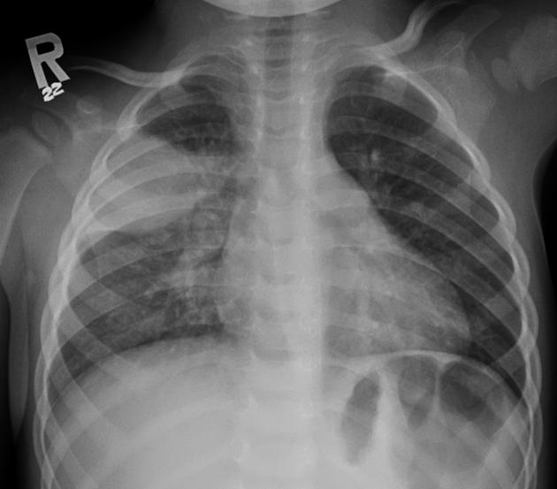 | 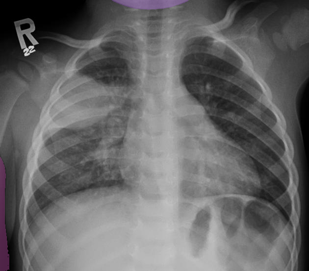 | 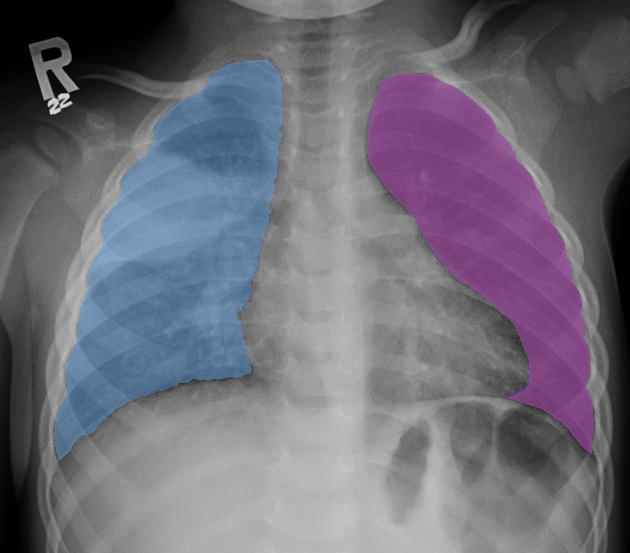 | 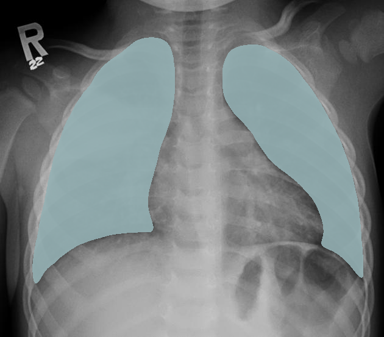 | 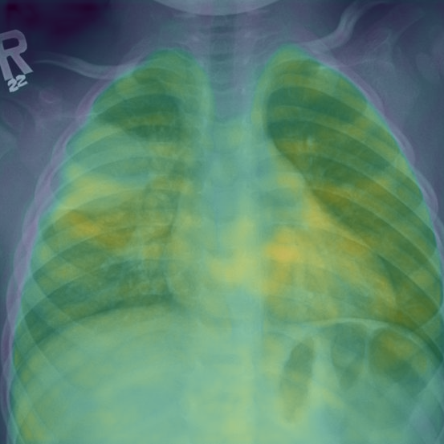 |

- **背景信息：**Age: Infant; Febrile and clinically unwell.；婴儿，发热且临床状况不佳。
- **原始图片 caption：**

<pre>Rounded region of consolidation is seen in the right anterior segment of the upper lobe.</pre>

- **原始图片 caption 翻译：**右上叶前段可见圆形实变区。

<strong>InternVL3-14B</strong>

**Segmentation 对 caption 的总体影响：**基本持平：前后均提及部分参考关键点

**原始图像 → Single-image caption 回答**

英文原始回答：

<pre>### Image Description

The provided image is a frontal chest X-ray of an infant. Key observations include:

1. **Lung Fields:**
   - Both lung fields should be assessed for any signs of consolidation, interstitial markings, atelectasis, or pneumothorax. However, without specific abnormalities like large consolidations or distinct infiltrates, the lung fields appear relatively clear.

2. **Heart and Mediastinum:**
   - The heart size appears within normal limits.
   - There is no obvious widening of the mediastinal contours.
   
3. **Bony Thorax:**
   - The bony structures, including the ribs, clavicles, and visible parts of the spine, appear intact without any evident fractures or abnormalities.
   
4. **Diaphragm:**
   - Both hemidiaphragms are visible and seem to be in normal positions with no evidence of free air under the diaphragm.
   
5. **Soft Tissues:**
   - The soft tissues around the chest appear normal without any abnormal collections or masses.

### Differential Diagnosis Based on Patient Presentation and Imaging

Given the symptoms of fever and clinical unwellness in an infant, coupled with the chest X-ray findings:

1. **Viral Upper Respiratory Tract Infection (URI):**
   - Infants often present with fever and respiratory symptoms due to viral URIs. Imaging findings may be subtle or normal even when the patient is symptomatic. If the lung fields are clear, this may suggest a common viral etiology.

2. **Bronchiolitis:**
   - Common in infants, especially those under six months old. Bronchiolitis presents with wheezing and respiratory distress. X-ray findings can range from normal to showing increased interstitial markings. If not significantly prominent on the current image, it might not be the primary diagnosis.

3. **Pneumonia:**
   - Although the X-ray appears relatively clear, it&#x27;s important to consider pneumonia due to its common presentation in febrile, unwell infants. Etiology can be bacterial, viral, or atypical. In some cases, particularly viral pneumonia, findings might initially be subtle or only become evident later.

4. **Bronchopneumonia:**
   - This would typically show patchy infiltrates or consolidation which might not be prominent in early stages. The absence of severe infiltrates might suggest early or mild disease.

5. **Pulmonary Edema:**
   - While less likely given the age and clear lung fields, it&#x27;s worth considering. In older children or adults, pulmonary edema would typically show a &quot;bat-wing&quot; pattern or Kerley B lines.

### Conclusion

Based on the chest X-ray and clinical presentation, the most likely diagnosis is either a viral upper respiratory tract infection or a very mild to early-stage pneumonia. Given the variability in presentation and the paucity of specific findings on X-ray, further clinical observation and possibly additional tests (such as blood work, repeat imaging, or cultures if bacterial etiology is suspected) may be needed.

**Final Diagnosis:**
Viral Upper Respiratory Tract Infection or Mild Bronchiolitis / Early Onset Bronchopneumonia. Confirmatory diagnosis might require clinical follow-up and possibly further diagnostic testing.</pre>

中文医学要点：

<pre>回答提及或最终倾向的诊断包括：肺炎、细支气管炎。涉及的主要影像要点包括：肺实变、膈肌异常或定位、游离气体。</pre>

**原始图像 + Segmentation → Single-image caption 回答**

英文原始回答：

<pre>The presented chest X-ray for an infant presents notable findings warranting a detailed examination:

1. **Lung Fields &amp; Lung Opacities**:
   - The lungs exhibit areas of increased opacity, particularly in the lower zones. These opacities may suggest the presence of an infiltrate or consolidation, which is commonly seen in conditions such as pneumonia, particularly in infants.
   
2. **Heart and Mediastinum**:
   - The heart appears normal in size based on this frontal view. The cardiomediastinal contours do not display any apparent abnormalities such as widening or other distortions.
   
3. **Diaphragm**:
   - The diaphragm is well-delineated, and there is no evident elevation or abnormal contour. The costophrenic angles appear sharp, suggesting no pleural effusion.
   
4. **Bony Thorax**:
   - The ribs and clavicles appear intact without any fractures or noticeable lesions. No acute bony abnormalities are visible.
   
5. **Soft Tissues**:
   - Soft tissues appear unremarkable, and there is no visible subcutaneous emphysema or other abnormalities in this specific projection.

### Differential Considerations:
- **Pneumonia**: The ground-glass opacities and consolidations are consistent with bacterial or viral pneumonia, especially common in infants.
- **Bronchiolitis**: This condition might present with airway inflammation and increased lung markings, not distinctly visible here but should still be considered given the patient’s age and presentation.
- **Aspiration**: With infants, aspirated material can lead to consolidation. However, detailed clinical correlation is essential to appreciate the full significance of these findings.
- **Congenital Pulmonary Issues**: While congenital abnormalities typically present sooner in life, they may need to be considered in this context depending on the clinical background.

### Key Points for Diagnosis:
1. **Clinical Correlation**:
   - An infant presenting with fever and being clinically unwell strongly supports infectious etiologies such as pneumonia. Additional history and examination findings, such as respiratory distress, specific infectious exposure, and feeding history, are crucial.
   
2. **Laboratory Support**:
   - Blood tests (complete blood count, C-reactive protein), sputum cultures (if possible), and possibly urine antigens (e.g., for pertussis) can corroborate the clinical suspicion.
   
3. **Follow-up Imaging**:
   - A repeat chest X-ray may be done if clinical improvement is not observed after initial treatment. Follow-up could also include an ultrasound, especially if concern for other entities remains.
   
4. **Treatment Approach**:
   - Depending on the suspected causative agent, initial empiric antibiotics, supportive care (oxygen therapy if needed), and hydration are essential. Special attention to the infant’s overall stability and response to treatment is paramount.

Given the clinical presentation of fever and ill health in an infant along with the radiographic findings, the most likely diagnosis leans towards pneumonia. Further investigation and correlation with clinical and laboratory data are essential for confirmation and guiding therapeutic decisions.</pre>

中文医学要点：

<pre>回答提及或最终倾向的诊断包括：肺炎。涉及的主要影像要点包括：肺实变、膈肌异常或定位。</pre>

**Segmentation 对 caption 的影响分析：**

原始 caption：肺炎/实变（结论）；加入 segmentation 后：肺炎/实变（文本提及）。前后对参考征象的覆盖基本不变；segmentation 没有带来可辨认的疾病特异性增量。该判断以是否接近 Radiopaedia 原始 caption 为准，不依据回答篇幅。

<strong>InternVL3.5-14B</strong>

**Segmentation 对 caption 的总体影响：**轻度有帮助：强化肺炎定位，但仍未识别圆形形态

**原始图像 → Single-image caption 回答**

英文原始回答：

<pre>&lt;think&gt;
Okay, let&#x27;s tackle this X-ray image. The patient is an infant who&#x27;s febrile and clinically unwell. The X-ray is a frontal chest view. I need to look for signs of respiratory issues.

First, the lungs. In infants, the lungs are smaller and have more cartilage, so the bronchial tubes are more visible. Normally, the lungs should appear dark (radiolucent) because of air. But here, there&#x27;s increased opacity in the right lung, especially in the lower zones. That could be consolidation, which is often due to infection like pneumonia. The left lung looks clearer, but maybe there&#x27;s some subtle changes too.

The heart size seems normal for an infant, not enlarged. The diaphragm is visible, and the costophrenic angles are sharp, so no pleural effusion. The trachea is midline. The ribs and bones look normal, no fractures.

Since the infant is febrile and sick, and the X-ray shows consolidation, the most likely diagnosis is bacterial pneumonia. Viral infections might present with interstitial patterns, but consolidation is more bacterial. The right lower lobe involvement is common in aspiration or pneumonia. I should also consider bronchiolitis, but that usually has a more diffuse, peribronchial pattern. The presence of lobar consolidation points more to pneumonia.

Need to check if there&#x27;s any air bronchogram sign, which is when air-filled bronchi are visible against consolidated lung. If present, that supports pneumonia. The image here might have that, but I&#x27;m not sure. The right lung&#x27;s opacity is dense, so maybe. Also, the mediastinum isn&#x27;t shifted, so no tension pneumothorax.

Other possibilities: Foreign body, but that usually has a more focal opacity and maybe a history. Congenital issues? Less likely with acute presentation. So, the diagnosis is likely bacterial pneumonia, possibly with lobar consolidation in the right lung. Treatment would involve antibiotics, supportive care.
&lt;/think&gt;

**Image Description:**  
The frontal chest X-ray of the infant demonstrates increased opacity in the right lower lung zone, suggestive of lobar consolidation. The left lung appears relatively clear. The cardiac silhouette is within normal size limits for an infant, and the diaphragm and costophrenic angles are sharp, with no evidence of pleural effusion. The trachea is midline, and the bony structures (ribs, clavicles) are unremarkable.  

**Diagnosis:**  
**Bacterial pneumonia** (likely lobar consolidation) is the most probable diagnosis. The radiographic findings of localized opacity in the right lower lobe, combined with the clinical presentation of fever and illness, strongly support this. Bacterial pathogens such as *Streptococcus pneumoniae* or *Staphylococcus aureus* are common culprits in infants.  

**Key Supporting Features:**  
- **Lobar consolidation**: Dense opacity with possible air bronchograms (if visible) indicates alveolar filling (e.g., pus, fluid).  
- **Clinical context**: Fever and systemic illness in an infant heighten suspicion for bacterial infection.  
- **Exclusion of other causes**: No signs of interstitial disease (viral bronchiolitis), pleural effusion, or skeletal abnormalities.  

**Next Steps:**  
- Confirmatory tests: Blood cultures, C-reactive protein (CRP), and possibly a lateral chest X-ray.  
- Empirical antibiotic therapy (e.g., amoxicillin or amoxicillin-clavulanate) should be initiated promptly.  
- Monitor respiratory status and consider hospitalization for supportive care if needed.  

This presentation aligns with community-acquired bacterial pneumonia, a critical diagnosis in febrile infants requiring urgent management.</pre>

中文要点翻译：

<pre>婴儿正位胸片右下肺野密度增高，考虑叶性实变；结合发热和全身状况差，模型倾向细菌性肺炎。</pre>

**原始图像 + Segmentation → Single-image caption 回答**

英文原始回答：

<pre>&lt;think&gt;
Okay, let me try to work through this. The patient is an infant presenting with fever and being clinically unwell. The chest X-ray is provided, along with some segmentation images from different models. I need to analyze the X-ray and the segments to figure out the possible diagnosis.

First, looking at the original X-ray image. The right side (marked with R) shows some areas that are more opaque. The left lung seems more translucent. The right lung has a large area of increased opacity, especially in the middle and lower zones. The left lung appears clearer, but maybe there&#x27;s some subtle opacity too. The heart is visible, and the diaphragm is seen at the bottom. The right hemidiaphragm might be elevated? Or maybe the opacity is obscuring it.

Now, the segmentations. Medical-SAM2&#x27;s segmentation highlights a region on the left side (purple), which might be an area of interest. Medical-SAM3 segments the lungs in blue and purple. The right lung (blue) has a large opacity, while the left (purple) is more normal. BiomedParse&#x27;s segmentation shows both lungs in light blue, but the right lung&#x27;s opacity is more pronounced. TorchXRayVision&#x27;s segmentation uses different colors for lungs, heart, etc. The right lung (green) has areas of yellow, which might indicate consolidation or opacity.

In infants, common causes of fever and respiratory symptoms include pneumonia, bronchiolitis, or maybe even a foreign body. Pneumonia in infants often presents with lobar consolidation. The right lung&#x27;s opacity here could be a lobar pneumonia. The left lung seems clearer, so maybe unilateral involvement. The heart size seems normal, no signs of cardiomegaly. The diaphragm on the right might be obscured by the opacity, which could indicate fluid or consolidation.

The segmentation models highlight the right lung&#x27;s opacity. The presence of a large, dense opacity in the right lung suggests consolidation, which is typical for bacterial pneumonia. In infants, Streptococcus pneumoniae or Staphylococcus aureus could be culprits. The clinical presentation of fever and being unwell aligns with pneumonia.

Another possibility is aspiration pneumonia, but that might have a different pattern. Bronchiolitis usually has a more diffuse, peribronchial pattern, which might not be as lobar. The X-ray here shows a more focal opacity, so lobar pneumonia is more likely.

The left lung appears clear, so if there&#x27;s consolidation, it&#x27;s unilateral. The mediastinum doesn&#x27;t seem shifted, so no large pleural effusion or tension pneumothorax. The trachea is midline. 

So putting it all together: the infant has a febrile illness with a chest X-ray showing right middle/lower lobe consolidation. The diagnosis is likely bacterial pneumonia, possibly requiring antibiotics. The segmentation models help confirm the area of opacity, supporting the diagnosis.
&lt;/think&gt;

**Image Description and Diagnosis:**

**Clinical Context:**  
An infant presents with fever and clinical signs of illness. The chest X-ray reveals significant findings in the right lung.

**Radiographic Findings:**  
1. **Right Lung Opacity:** The frontal chest X-ray shows a large, dense opacity in the right middle and lower lung zones, obscuring the right heart border and hemidiaphragm. This suggests consolidation, likely due to infection.  
2. **Left Lung:** The left lung appears clearer, with no prominent opacities, indicating unilateral involvement.  
3. **Cardiomediastinal Silhouette:** The heart size is normal, and the mediastinum is midline, ruling out significant effusion or pneumothorax.  
4. **Diaphragm:** The right hemidiaphragm is poorly visualized due to the overlying opacity, consistent with consolidation.

**Segmentation Analysis:**  
- **Medical-SAM3 and BiomedParse:** Highlight the right lung’s opacity (blue/purple), confirming its extent.  
- **TorchXRayVision:** Emphasizes abnormal opacities in the right lung (yellow regions), aligning with consolidation.  

**Diagnosis:**  
**Bacterial Pneumonia (Lobar Pneumonia).**  
- **Rationale:** The infant’s fever, clinical illness, and imaging findings of unilateral lobar consolidation are classic for bacterial pneumonia. Common pathogens in infants include *Streptococcus pneumoniae* or *Staphylococcus aureus*.  
- **Differential Considerations:**  
  - **Aspiration Pneumonia:** Less likely unless history suggests aspiration.  
  - **Bronchiolitis:** Typically presents with diffuse peribronchial thickening, not lobar consolidation.  
  - **Foreign Body:** Unlikely without a history of choking.  

**Management Implications:**  
- **Antibiotics:** Empirical coverage for community-acquired pneumonia (e.g., amoxicillin or amoxicillin-clavulanate).  
- **Supportive Care:** Monitoring for respiratory distress, hydration, and oxygen if needed.  
- **Follow-up Imaging:** To assess resolution after treatment.  

The segmentation tools corroborate the radiographic findings, reinforcing the diagnosis of right-sided lobar pneumonia in this febrile infant.</pre>

中文要点翻译：

<pre>模型依据肺部 segmentation 进一步强调右肺中下区大片致密影和右侧叶性实变，仍诊断右侧细菌性肺炎。</pre>

**对模型图片 caption 能力及 Segmentation 影响的分析：**

分割前后疾病大类一致；加入 overlay 后肺侧别和受累范围更稳定，减少了泛化描述。但参考 caption 的判别点是右上叶前段“圆形”实变，模型仍写成右中下肺叶性肺炎，所以属于定位层面的有限帮助，而不是对圆形肺炎表型的识别。

<strong>Lingshu-32B</strong>

**Segmentation 对 caption 的总体影响：**无明确增益：仅在鉴别或否定语境中提及关键点

**原始图像 → Single-image caption 回答**

英文原始回答：

<pre>The chest x-ray shows an infant with a right-sided pneumothorax. The right lung is partially collapsed, indicated by the visible pleural line and absence of vascular markings beyond it. This finding is consistent with the clinical presentation of fever and being clinically unwell, which could suggest an underlying infection or other pathology leading to the pneumothorax. Immediate medical intervention is required to address the pneumothorax and investigate the cause.</pre>

中文医学要点：

<pre>回答提及或最终倾向的诊断包括：气胸。未提取到与参考病灶高度特异的影像征象。</pre>

**原始图像 + Segmentation → Single-image caption 回答**

英文原始回答：

<pre>The chest X-ray shows an infant with a febrile presentation and clinical signs of illness. The lungs appear clear without any obvious abnormalities such as consolidation or effusion. The heart size is within normal limits for an infant, and there are no signs of cardiomegaly. The diaphragm appears well-defined, and there is no evidence of free air under the diaphragm that would suggest pneumoperitoneum. Given the clinical context of fever and illness, the most likely diagnosis could be a viral infection, such as bronchiolitis or a viral pneumonia, which often presents with these radiographic findings in infants. Further clinical correlation and possibly additional tests, such as a nasopharyngeal swab for respiratory viruses, would be necessary to confirm the diagnosis.</pre>

中文医学要点：

<pre>回答提及或最终倾向的诊断包括：肺炎、细支气管炎。涉及的主要影像要点包括：膈肌异常或定位、游离气体、肺实变。</pre>

**Segmentation 对 caption 的影响分析：**

原始 caption：未命中核心征象；加入 segmentation 后：肺炎/实变（否定/鉴别）。前后都没有覆盖决定性征象；回答即使变长，也不能视为有效的视觉理解增益。该判断以是否接近 Radiopaedia 原始 caption 为准，不依据回答篇幅。

<strong>MedGemma-27B-IT</strong>

**Segmentation 对 caption 的总体影响：**正向：新增或强化参考关键点

**原始图像 → Single-image caption 回答**

英文原始回答：

<pre>**Image Description:**

The image is a frontal chest X-ray of an infant. The lungs are the primary focus. There are bilateral, patchy, ill-defined opacities predominantly located in the lower lobes, but also extending into the mid-lung fields. These opacities appear somewhat fluffy or hazy. The heart size appears normal. The mediastinal silhouette is unremarkable. The bony structures appear intact.

**Clinical Context:**

The patient is an infant presenting with fever and clinical unwellness.

**Diagnosis:**

Based on the chest X-ray findings of bilateral patchy infiltrates in an infant with fever and clinical signs of illness, the most likely diagnosis is **pneumonia**. Specifically, this pattern is highly suggestive of **bronchopneumonia**, which is a common form of pneumonia in infants, often caused by bacteria (like *Streptococcus pneumoniae*, *Staphylococcus aureus*) or viruses (like RSV). The patchy distribution reflects inflammation centered around the bronchioles and alveoli.

**Differential Diagnoses (less likely given the classic presentation):**

*   **Viral Pneumonitis:** Can present similarly, but often more diffuse or interstitial.
*   **Aspiration Pneumonitis:** Usually more localized to dependent lung regions.
*   **Congenital Heart Disease with Pulmonary Edema:** Usually presents with cardiomegaly and more diffuse interstitial edema.
*   **Other infections:** Less common causes like fungal or parasitic infections.

**Conclusion:**

The chest X-ray findings in the context of a febrile, clinically unwell infant strongly support a diagnosis of pneumonia, most likely bronchopneumonia.</pre>

中文医学要点：

<pre>回答提及或最终倾向的诊断包括：肺炎。未提取到与参考病灶高度特异的影像征象。</pre>

**原始图像 + Segmentation → Single-image caption 回答**

英文原始回答：

<pre>**Image Description:**

The image is a frontal chest X-ray of an infant. The lungs are the predominant structures visible. There are bilateral opacities, more prominent in the right lung field, particularly in the right lower lobe. These opacities appear somewhat patchy and ill-defined. The heart size appears normal for the patient&#x27;s age. The mediastinal silhouette is unremarkable. The diaphragm is visible, and the costophrenic angles appear clear.

**Clinical Context:**

The patient is an infant presenting with fever and clinical signs of illness.

**Interpretation and Diagnosis:**

The chest X-ray shows bilateral lung opacities, suggestive of an infectious process. Given the patient&#x27;s age (infant) and presentation (febrile, clinically unwell), the most likely diagnosis is **pneumonia**. The bilateral nature of the opacities could indicate viral pneumonia or a more widespread bacterial infection. The right lung appears more affected than the left.

**Differential Diagnoses:**

While pneumonia is the most likely diagnosis, other possibilities could include:
*   Aspiration pneumonitis
*   Congenital lung abnormalities (less likely given the acute presentation)
*   Other infectious processes (e.g., fungal, parasitic - less common in this age group and presentation)

**Conclusion:**

The chest X-ray findings are consistent with **pneumonia** in an infant presenting with fever and clinical illness. Further clinical evaluation and potentially laboratory tests would be needed to determine the specific etiology (viral vs. bacterial).</pre>

中文医学要点：

<pre>回答提及或最终倾向的诊断包括：肺炎。涉及的主要影像要点包括：膈肌异常或定位。</pre>

**Segmentation 对 caption 的影响分析：**

原始 caption：肺炎/实变（否定/鉴别）；加入 segmentation 后：肺炎/实变（结论）。加入 segmentation 后参考证据增加，说明 overlay 至少改善了相关结构或病灶的注意力分配。该判断以是否接近 Radiopaedia 原始 caption 为准，不依据回答篇幅。

<strong>MedMO-8B</strong>

**Segmentation 对 caption 的总体影响：**无明确增益：仅在鉴别或否定语境中提及关键点

**原始图像 → Single-image caption 回答**

英文原始回答：

<pre>There is no evidence of focal consolidation. There is no pneumothorax or pleural effusion. The cardiac and mediastinal contours are normal.</pre>

中文医学要点：

<pre>回答提及或最终倾向的诊断包括：胸腔积液、气胸。涉及的主要影像要点包括：肺实变。</pre>

**原始图像 + Segmentation → Single-image caption 回答**

英文原始回答：

<pre>The lung volumes are normal. The lung parenchyma is clear. There is no pleural effusion. The cardiac and mediastinal contours are normal.</pre>

中文医学要点：

<pre>回答提及或最终倾向的诊断包括：胸腔积液。未提取到与参考病灶高度特异的影像征象。</pre>

**Segmentation 对 caption 的影响分析：**

原始 caption：肺炎/实变（否定/鉴别）；加入 segmentation 后：未命中核心征象。前后都没有覆盖决定性征象；回答即使变长，也不能视为有效的视觉理解增益。该判断以是否接近 Radiopaedia 原始 caption 为准，不依据回答篇幅。

<strong>Qwen3-VL-4B</strong>

**Segmentation 对 caption 的总体影响：**基本持平：前后均提及部分参考关键点

**原始图像 → Single-image caption 回答**

英文原始回答：

<pre>This is a frontal chest X-ray of an infant who is febrile and clinically unwell. The image shows diffuse, patchy opacities in both lungs, with increased density in the lower lung fields, particularly on the right side. There is also evidence of bronchial air trapping and possible small airway involvement, as suggested by the “air bronchograms” — the visible air-filled bronchi against the background of consolidation.

The pattern is consistent with **pneumonia** — specifically, **bacterial pneumonia** in an infant, which is a common and potentially serious cause of fever and respiratory distress in this age group. The bilateral, asymmetric distribution of opacities and the presence of air bronchograms are classic radiographic findings of infectious pneumonia.

**Diagnosis: Bacterial Pneumonia (Infant)**

**Clinical Correlation:** In infants, pneumonia is often caused by *Streptococcus pneumoniae*, *Staphylococcus aureus*, or *Haemophilus influenzae*. The presence of fever and clinical unwellness supports this diagnosis. The infant may require antibiotics, supportive care, and close monitoring. This finding should prompt urgent clinical evaluation and possibly empiric antibiotic therapy.

**Note:** While viral pneumonia can also present similarly, the clinical context (febrile, unwell infant) and the radiographic pattern strongly favor bacterial etiology in this setting. Further laboratory testing (e.g., blood cultures, PCR, or sputum if obtainable) may be needed to confirm the specific pathogen.</pre>

中文医学要点：

<pre>回答提及或最终倾向的诊断包括：肺炎。涉及的主要影像要点包括：肺实变。</pre>

**原始图像 + Segmentation → Single-image caption 回答**

英文原始回答：

<pre>Based on the provided image and patient data (infant, febrile and clinically unwell), this chest X-ray demonstrates **pneumonia**.

Here is the analysis:

- **Patient Context**: An infant presenting with fever and clinical illness is at high risk for serious bacterial or viral infections, including pneumonia, which is a common and potentially life-threatening condition in this age group.

- **Radiographic Findings**:
  - The X-ray is a frontal view.
  - The lung fields are segmented (using various AI tools) to identify normal anatomy and pathology.
  - The segmentation masks (from Medical-SAM2, Medical-SAM3, BiomedParse, and TorchXRayVision) all show the lungs as the primary structures of interest.
  - The key finding is **asymmetrical opacification**. The right lung (marked with &quot;R&quot;) shows a distinct, localized area of increased density (opacity) compared to the left lung. This is visible in the segmentation masks as well, where the right lung appears more consolidated or clouded.
  - This opacity is not uniform and is localized, which is characteristic of a focal infection such as bacterial pneumonia.
  - The heart and diaphragm appear normal in size and position, with no signs of cardiomegaly or diaphragmatic elevation.

- **Diagnosis**: The combination of a febrile infant with a chest X-ray showing a focal area of lung opacity is highly suggestive of **pneumonia**. Given the infant&#x27;s age and clinical presentation, this is likely **bacterial pneumonia**, which requires prompt antibiotic therapy.

In summary, the image shows a chest X-ray of an infant with a focal area of lung opacity on the right side, consistent with pneumonia. The patient requires immediate medical attention and appropriate antimicrobial therapy.</pre>

中文医学要点：

<pre>回答提及或最终倾向的诊断包括：肺炎、心脏增大。涉及的主要影像要点包括：肺部致密影、膈肌异常或定位。</pre>

**Segmentation 对 caption 的影响分析：**

原始 caption：肺炎/实变（文本提及）；加入 segmentation 后：肺炎/实变（结论）。前后对参考征象的覆盖基本不变；segmentation 没有带来可辨认的疾病特异性增量。该判断以是否接近 Radiopaedia 原始 caption 为准，不依据回答篇幅。

<strong>Qwen3-VL-8B</strong>

**Segmentation 对 caption 的总体影响：**基本持平：前后均提及部分参考关键点

**原始图像 → Single-image caption 回答**

英文原始回答：

<pre>Based on the patient data (infant, febrile, clinically unwell) and the chest X-ray image, here is the description and diagnosis:

**Image Description:**

This is a frontal chest X-ray of an infant. The image shows bilateral, patchy, ill-defined opacities in the lower lung fields, predominantly in the right lung. These opacities are more prominent in the right lower lobe and extend into the left lower lobe. The opacities appear to be ground-glass and consolidative, with some areas showing a reticulonodular pattern. There is no significant pleural effusion or pneumothorax. The cardiac silhouette is normal in size and shape. The diaphragm appears elevated, which may be due to the consolidation or the infant’s respiratory distress. The trachea is midline. The ribs and bony thorax appear intact.

**Diagnosis:**

The most likely diagnosis is **bacterial pneumonia**, specifically **lobar pneumonia** or **multifocal pneumonia**, given the bilateral, patchy consolidation seen in the lower lung fields. In infants, common bacterial causes include *Streptococcus pneumoniae*, *Haemophilus influenzae* type b (if unvaccinated), and *Staphylococcus aureus*. The presence of fever and clinical illness supports this diagnosis.

**Rationale:**

- The infant’s age and clinical presentation (febrile, unwell) are classic for pneumonia.
- The X-ray findings of bilateral, patchy consolidation are consistent with bacterial pneumonia, especially in the lower lobes, which is common in infants.
- The absence of pleural effusion or pneumothorax suggests a less severe form of pneumonia, but the presence of consolidation still requires prompt antibiotic treatment.

**Next Steps:**

- Initiate empiric antibiotic therapy (e.g., ampicillin or amoxicillin for *S. pneumoniae* and *H. influenzae*).
- Monitor for clinical improvement and repeat imaging if necessary.
- Consider blood cultures and other laboratory tests to confirm the diagnosis and guide antibiotic selection.

This diagnosis is based on the clinical presentation and radiographic findings. Further testing may be needed to confirm the specific pathogen.</pre>

中文医学要点：

<pre>回答提及或最终倾向的诊断包括：肺炎、气胸、胸腔积液。涉及的主要影像要点包括：肺实变、膈肌异常或定位、心影异常。</pre>

**原始图像 + Segmentation → Single-image caption 回答**

英文原始回答：

<pre>Based on the provided infant patient data (febrile and clinically unwell) and the chest X-ray findings, here is the analysis and diagnosis:

**Image Description:**

The frontal chest X-ray of the infant demonstrates significant bilateral lung opacities. These opacities are diffuse and appear as areas of increased density (whiter regions) throughout both lung fields, suggesting consolidation or interstitial infiltrates. The opacities are not confined to a single lobe or segment but are widespread, affecting both the right and left lungs. The heart and diaphragm appear within normal size limits for an infant, though the diaphragm is slightly elevated on the right, which is common in infants. There is no evidence of pleural effusion or pneumothorax. The lung fields are not clear, indicating pathology.

**Diagnosis:**

**Bilateral Pneumonia (likely viral or bacterial in origin) in an infant.**

**Rationale:**

1.  **Clinical Context:** The infant is febrile and clinically unwell, which is a classic presentation for pneumonia.
2.  **Imaging Findings:**
    *   **Bilateral Lung Opacities:** The most significant finding is the diffuse, bilateral opacities, which are highly suggestive of pneumonia. In infants, this pattern is often due to viral infections (e.g., RSV, influenza) or bacterial infections (e.g., *Streptococcus pneumoniae*, *Haemophilus influenzae*).
    *   **Distribution:** The opacities are not patchy or localized; they are widespread, which is typical of a systemic infection affecting both lungs.
    *   **Absence of Other Findings:** There is no evidence of pleural effusion, pneumothorax, or significant cardiomegaly, which helps narrow the differential diagnosis.

**Conclusion:**

The chest X-ray findings are consistent with **bilateral pneumonia** in an infant. This is a serious condition requiring prompt medical attention, including appropriate antibiotics (if bacterial), supportive care, and close monitoring. Further diagnostic workup (e.g., blood tests, PCR for viral pathogens) may be necessary to determine the specific etiology.</pre>

中文医学要点：

<pre>回答提及或最终倾向的诊断包括：肺炎。涉及的主要影像要点包括：膈肌异常或定位、肺实变。</pre>

**Segmentation 对 caption 的影响分析：**

原始 caption：肺炎/实变（文本提及）；加入 segmentation 后：肺炎/实变（结论）。前后对参考征象的覆盖基本不变；segmentation 没有带来可辨认的疾病特异性增量。该判断以是否接近 Radiopaedia 原始 caption 为准，不依据回答篇幅。

<strong>Qwen3-VL-32B</strong>

**Segmentation 对 caption 的总体影响：**基本持平：前后均提及部分参考关键点

**原始图像 → Single-image caption 回答**

英文原始回答：

<pre>**Image Description:**

This is a frontal chest X-ray of an infant, as indicated by the small size of the thorax, visible ribs, and the presence of the &quot;R&quot; marker in the upper right corner (indicating the right side of the patient). The bony structures, including the ribs and vertebral bodies, are well visualized. The trachea is midline, and the heart is of normal size and position.

The lung fields show **increased opacities** in the **right lower lobe**, which appear as patchy, ill-defined areas of consolidation. There is also **increased interstitial marking** and **air bronchograms** visible in this region, suggesting alveolar involvement. The left lung appears relatively clear, though there is some mild perihilar haziness, possibly due to mild interstitial edema or early involvement.

The diaphragm is well-defined and not elevated, and there is no evidence of pneumothorax, pleural effusion, or cardiomegaly.

---

**Clinical Context:**

The patient is an **infant** presenting as **febrile and clinically unwell**, which raises concern for an infectious process, particularly pneumonia.

---

**Diagnosis:**

**Right lower lobe pneumonia** (likely bacterial, given the infant’s age and clinical presentation).

---

**Rationale:**

- The **patchy consolidation** with **air bronchograms** in the right lower lobe is classic for **lobar pneumonia**.
- Infants are particularly susceptible to **bacterial pneumonia** (e.g., *Streptococcus pneumoniae*, *Staphylococcus aureus*, *Haemophilus influenzae*) and **viral pneumonia** (e.g., RSV, influenza), but the focal consolidation with air bronchograms favors a **bacterial etiology**.
- The **absence of pleural effusion or pneumothorax** suggests the infection is contained within the lung parenchyma.
- The **clinical presentation of fever and being unwell** in an infant correlates with a systemic infectious process, and pneumonia is a common cause.

---

**Recommendations:**

- Initiate **empiric antibiotic therapy** (e.g., ceftriaxone or ampicillin + gentamicin, depending on local guidelines and suspected pathogens).
- Consider **viral testing** (e.g., RSV, influenza) if clinically indicated.
- Monitor for signs of deterioration (e.g., respiratory distress, hypoxia, sepsis).
- Follow-up imaging may be needed if clinical response is poor.

---

**Conclusion:**

This chest X-ray demonstrates **right lower lobe consolidation consistent with pneumonia** in an infant presenting with fever and systemic illness. The findings are most consistent with **bacterial pneumonia**, and prompt antibiotic treatment is warranted.</pre>

中文医学要点：

<pre>回答提及或最终倾向的诊断包括：肺炎。涉及的主要影像要点包括：肺实变、膈肌异常或定位。</pre>

**原始图像 + Segmentation → Single-image caption 回答**

英文原始回答：

<pre>Based on the provided chest X-ray image and clinical context of an **infant who is febrile and clinically unwell**, here is a detailed description and diagnosis:

---

### **Image Description:**

- **Modality**: Frontal chest X-ray (anteroposterior view, likely due to infant positioning).
- **Anatomy Visualized**: Thoracic cavity including ribs, spine, heart, diaphragm, and both lungs.
- **Lung Fields**: 
  - **Right Lung**: Appears relatively clear with visible vascular markings and normal aeration.
  - **Left Lung**: Shows **increased opacities** in the **lower and middle zones**, particularly in the **left lower lobe**. There is a **hazy, patchy consolidation** with blurring of the left hemidiaphragm (silhouette sign), suggesting involvement of the left lower lobe.
- **Heart and Mediastinum**: Cardiomediastinal silhouette appears normal in size and contour. No evidence of cardiomegaly or mediastinal widening.
- **Diaphragm**: The right hemidiaphragm is well-defined and elevated normally. The **left hemidiaphragm is obscured** by the opacities in the left lower lung, consistent with consolidation.
- **Bones**: No fractures or bony abnormalities noted.
- **Airways**: No visible air trapping or hyperinflation.

---

### **Segmentation Analysis:**

- **Medical-SAM2**: Highlights the upper thorax and neck, not useful for lung pathology.
- **Medical-SAM3**: Segments left and right lungs separately. The **left lung (purple)** shows increased density in the lower zone, consistent with consolidation.
- **BiomedParse**: Segments both lungs broadly, showing increased opacity in the left lung field.
- **TorchXRayVision**: Overlays multiple structures with color gradients. The **left lower lung shows yellow-green (opacity) overlay**, indicating areas of increased density — likely consolidation.

---

### **Clinical Context:**

- **Infant**, **febrile**, **clinically unwell** — this is a classic presentation for **pneumonia**, especially in young children.
- Infants often present with non-specific symptoms (fever, poor feeding, irritability, tachypnea) and may have **atypical radiographic findings**.

---

### **Diagnosis:**

&gt; **Left lower lobe pneumonia (consolidation)** in an infant.

---

### **Differential Considerations:**

- **Viral pneumonia** (e.g., RSV, influenza) — common in infants, often presents with patchy opacities.
- **Bacterial pneumonia** (e.g., *Streptococcus pneumoniae*, *Staphylococcus aureus*) — may present with lobar consolidation, especially in older infants.
- **Aspiration pneumonia** — less likely without history of choking or gastroesophageal reflux.
- **Congenital lung anomaly** — unlikely given acute presentation and fever.

---

### **Recommendations:**

1. **Clinical Correlation**: Assess for respiratory distress, oxygen saturation, and work of breathing.
2. **Laboratory Workup**: CBC, CRP, blood culture, and possibly viral PCR panel (e.g., RSV, influenza).
3. **Management**: 
   - **Empiric antibiotics** (e.g., ampicillin + cefotaxime or ceftriaxone) if bacterial pneumonia is suspected.
   - Supportive care (hydration, oxygen if needed).
   - Consider admission for monitoring and IV therapy.
4. **Follow-up Imaging**: Repeat X-ray in 1–2 weeks if clinical improvement is slow to assess resolution.

---

### **Conclusion:**

This frontal chest X-ray in a febrile, unwell infant demonstrates **left lower lobe consolidation**, consistent with **pneumonia**. Prompt clinical evaluation and management are essential due to the risk of complications in infants. The segmentation tools confirm the location and extent of lung opacity, supporting the radiologic diagnosis.</pre>

中文医学要点：

<pre>回答提及或最终倾向的诊断包括：肺炎。涉及的主要影像要点包括：肺部致密影、肺实变、膈肌异常或定位。</pre>

**Segmentation 对 caption 的影响分析：**

原始 caption：肺炎/实变（结论）；加入 segmentation 后：肺炎/实变（结论）。前后对参考征象的覆盖基本不变；segmentation 没有带来可辨认的疾病特异性增量。该判断以是否接近 Radiopaedia 原始 caption 为准，不依据回答篇幅。

### 2.12 [Spalding sign](https://radiopaedia.org/cases/spalding-sign?lang=us) (`spalding-sign`)

| Original image | Medical-SAM2 | Medical-SAM3: fetal head, fetal skull, brain | BiomedParse v1: fetal head, fetal skull, brain |
|---|---|---|---|
| 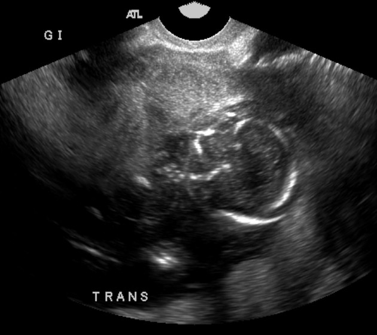 | 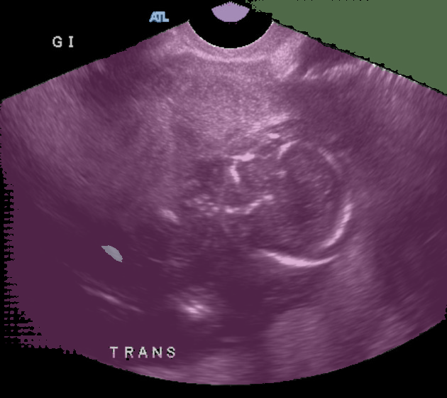 | 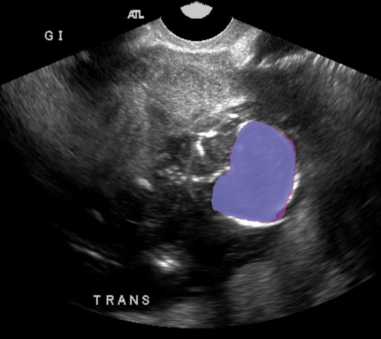 | 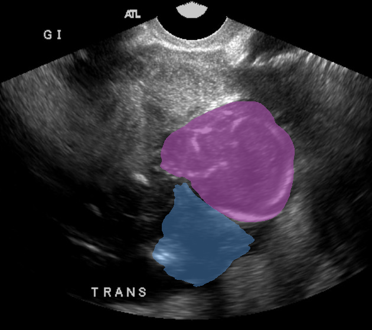 |

- **背景信息：**Gender: Female; Antenatal scan at 28 weeks gestation.；女性，孕 28 周接受产前超声。
- **原始图片 caption：**

<pre>A single image from a prenatal ultrasound demonstrates the Spalding sign, overlapping of the fetal skull bones.</pre>

- **原始图片 caption 翻译：**单张产前超声显示 Spalding 征，即胎儿颅骨骨片相互重叠。

<strong>InternVL3-14B</strong>

**Segmentation 对 caption 的总体影响：**无帮助：前后均未命中参考核心征象

**原始图像 → Single-image caption 回答**

英文原始回答：

<pre>This ultrasound image was obtained during an antenatal scan at 28 weeks gestation. The image features a transverse view labeled &quot;TRANS&quot; at the bottom, likely focusing on the abdominal region of the fetus. In the center, there is a circular, hypoechoic area surrounded by echogenic (bright) lines that could represent fluid-filled structures with a defined wall, typically indicative of loops of bowel, though other abdominal organs cannot be entirely ruled out without additional context.

**Key features observed:**
1. **Halo Sign:** The central area appears to be surrounded by a bright (echogenic) halo, which could suggest fluid content, likely amniotic fluid or gastrointestinal contents.
2. **Anabolic/Constrictive Structures:** The circular pattern might indicate segments of the gastrointestinal tract (small or large bowel).
3. **Surrounding Tissue:** The background texture is heterogeneous, typical of surrounding soft tissues and structures within the abdomen.

**Description and Chain of Thought (CoT):**
- **Identification of Structures:** The presence of a rounded hypoechoic structure with echogenic walls is suggestive of a potential finding like the Meconium Plug or Hirschsprung’s Disease based on their characteristic appearances on ultrasound.
  
- **Clinical Context:** At 28 weeks, while bowel perforation or significant intestinal malrotation could be considerations, more common pathologies like Meconium Ileus or Hirschsprung&#x27;s Disease must be considered. Meconium Ileus typically presents as an obstructed bowel loop filled with thick meconium, while Hirschsprung’s Disease usually shows a &quot;transition zone&quot; where the bowel proximal to the aganglionic segment appears dilated.

- **Differential Diagnosis:**
  1. **Meconium Ileus:** Often associated with cystic fibrosis, characterized by thick meconium, leading to obstruction.
  2. **Hirschsprung&#x27;s Disease:** Absence of ganglion cells in the distal colon, leading to colonic dilation and constipation postnatally.
  3. **Intussusception:** Although less common at this gestational age.
  4. **Normal Anatomy:** Differentiation between pathologic and normal bowel gas patterns at this stage of gestation can be challenging and may require follow-up imaging.

Considering the timing (28 weeks) and typical findings:
- **Further Evaluation:** Additional imaging (like a coronal view) and postnatal follow-up may be warranted. 
- **Possible Diagnosis:** Hyperechoic bowel loops with central hypoechoic regions could hint towards Meconium Ileus or Hirschsprung Disease. 

In conclusion, while the ultrasound suggests a potential abnormality within the fetal gastrointestinal tract given the observed patterns, definitive diagnosis would necessitate correlating with clinical history, family history of gastrointestinal conditions like cystic fibrosis, and possibly postnatal assessment. Clinical follow-up with pediatric gastroenterology might be considered based on the initial imaging findings.</pre>

中文医学要点：

<pre>回答提及或最终倾向的诊断包括：先天性巨结肠、肠麻痹、胎粪性肠梗阻、便秘。未提取到与参考病灶高度特异的影像征象。</pre>

**原始图像 + Segmentation → Single-image caption 回答**

英文原始回答：

<pre>The images provided are ultrasound scans obtained during a routine antenatal check-up at 28 weeks of gestation. The patient is a 28-week pregnant female. Each image represents different segmentation results from various medical diagnostic AI tools, focusing on the fetal head, brain, and skull.

### Image Descriptions:

1. **Original Ultrasound Image:**
   - The first image is a standard transverse ultrasound of the fetal head. The grayscale image shows typical ultrasound features with the dark areas indicating fluid-filled spaces or soft tissues, while brighter areas indicate denser structures like bones.

2. **Segmentation by Medical-SAM2:**
   - The green region probably represents the segmentation of the fetus&#x27;s body or surrounding area, while the purple region may denote the fetal head or brain regions.
   
3. **Segmentation by Medical-SAM3 (Fetal Head, Skull, Brain):**
   - In this image, the purple structure seems to outline the fetal head. The pinkish outline possibly represents the skull, and within it, a smaller area could be the brain.
   
4. **Segmentation by BiomedParse (Fetal Head, Skull, Brain):**
   - Here, the magenta area likely denotes the fetal brain, and the blue area might be the fetal skull, while another structure (could be muscle or other tissues) is also delineated.

### Analysis and Diagnosis:

#### Structural Assessment:
- **Skull and Brain Development:** 
  - The delineations from Medical-SAM3 and BiomedParse segmentations are aimed at identifying the skull, brain, and surrounding tissues. Typically, at 28 weeks, the fetal brain is actively developing, marked by progressive differentiation and growth of brain tissue.
   
- **Normal vs. Abnormal Findings:**
  - **Normal findings**: In a healthy development scenario, the skull would appear as a well-defined, oval structure, the brain tissue would have consistent echogenicity without any large hypoechoic or hyperechoic areas (which could signify abnormalities such as cysts or tumors).
  - **Suspicious findings** (requires confirmation via follow-up imaging or clinical evaluation):
    - Any irregularities in the shape, size, or echotexture could indicate potential issues such as craniosynostosis, hydrocephalus, or brain anomalies.
    - If the brain tissue segments show large dark (hypoechoic) areas, it might suggest ventricular enlargement or other pathologies.

#### Ultrasound Interpretation Context:
- **Routine Monitoring:**
  - At 28 weeks, detailed imaging is crucial to assess growth parameters and structural integrity. Fetal head circumference, skull development, and brain echogenicity are standard measurements.

- **Follow-up and Specialist Consultation:**
  - If any anomalies are suspected, immediate consultation with a perinatologist or a fetal medicine specialist is recommended.
  - Additional imaging (like 3D/4D ultrasound, MRI) might be considered for more detailed assessment or confirmation.

### Conclusion:
Based on the provided ultrasound and AI-segmentation images, the critical areas of assessment are the fetal brain and skull. Routine monitoring at 28 weeks primarily ensures that the fetal structures are developing as expected. However, any deviations from normal ultrasound appearances require further evaluation to rule out congenital anomalies or developmental issues.

In summary, without overt abnormal findings visible in the provided segmentations, this scan appears within typical bounds for normal fetal development at 28 weeks. Nonetheless, any clinical suspicion or significant deviation should be promptly addressed with further diagnostic procedures.</pre>

中文医学要点：

<pre>回答提及或最终倾向的诊断包括：脑积水。涉及的主要影像要点包括：胎儿颅骨异常。</pre>

**Segmentation 对 caption 的影响分析：**

原始 caption：未命中核心征象；加入 segmentation 后：未命中核心征象。前后都没有覆盖决定性征象；回答即使变长，也不能视为有效的视觉理解增益。该判断以是否接近 Radiopaedia 原始 caption 为准，不依据回答篇幅。

<strong>InternVL3.5-14B</strong>

**Segmentation 对 caption 的总体影响：**无帮助：前后均未命中参考核心征象

**原始图像 → Single-image caption 回答**

英文原始回答：

<pre>&lt;think&gt;
Okay, let&#x27;s start by looking at the image provided. It&#x27;s an ultrasound scan labeled as taken during an antenatal check at 28 weeks gestation. The modality is ultrasound, which makes sense for prenatal imaging.

First, I need to identify what&#x27;s visible in the scan. The image shows a transverse view, as indicated by the &quot;TRANS&quot; label. The fetus is in the center, with the skull, spine, and possibly the placenta visible. The amniotic fluid surrounds the fetus, which is typical in a normal scan.

Wait, but the user mentioned a diagnosis. So I need to look for any abnormalities. At 28 weeks, certain structures should be well-developed. The skull should have clear sutures, the spine should be aligned, and there shouldn&#x27;t be any obvious masses or fluid collections.

Looking at the image, the fetus appears to be in a normal position. The skull&#x27;s shape seems normal, and the spine is straight without any curvature issues. The limbs are visible, and there&#x27;s no obvious swelling or deformities. The placenta is likely visible as a bright area, but I don&#x27;t see any signs of placental abruption or issues like that.

But wait, maybe I&#x27;m missing something. Sometimes in ultrasounds, certain conditions can be subtle. For example, growth restriction might be indicated by smaller than expected measurements, but without measurements provided, it&#x27;s hard to say. Similarly, conditions like spina bifida would show a gap in the spine, but I don&#x27;t see that here.

Another possibility is anencephaly, but that&#x27;s usually detected earlier and would show a missing skull. The image here seems to show a normal skull. Twin pregnancies or multiples could be a factor, but the image shows a single fetus.

Amniotic fluid levels: the image shows a clear fluid around the fetus, which is normal. Polyhydramnios or oligohydramnios would have more or less fluid, but this looks standard.

So, putting it all together, the ultrasound appears normal. The diagnosis would likely be a normal antenatal scan at 28 weeks. Unless there&#x27;s a specific abnormality the user is hinting at that I&#x27;m not seeing, but based on the image description provided, there&#x27;s no obvious pathology. The key points are normal fetal development, proper positioning, and absence of structural anomalies.
&lt;/think&gt;

**Image Description:**  
The ultrasound image provided is a transverse (TRANS) view from an antenatal scan at 28 weeks gestation. The fetus is centrally positioned, with clear visualization of the skull, spine, and surrounding amniotic fluid. The skull appears intact with normal suture patterns, and the spine shows no evidence of malalignment or structural defects. Fetal limbs are visible, and there are no obvious soft tissue abnormalities. The placenta is not distinctly highlighted in this frame, but the amniotic fluid volume appears normal, with no signs of polyhydramnios or oligohydramnios.

**Diagnosis:**  
The ultrasound findings are consistent with a **normal antenatal scan at 28 weeks gestation**. No structural anomalies, growth restrictions, or acute pathologies (e.g., spina bifida, anencephaly, or placental abnormalities) are evident in this image. The fetal anatomy appears developmentally appropriate for the gestational age.  

**Follow-Up Recommendations:**  
- Continue routine antenatal ultrasound monitoring to assess growth, amniotic fluid volume, and fetal well-being.  
- Confirm fetal sex, if not already established, and screen for common chromosomal abnormalities (e.g., trisomy 21) via non-invasive tests or detailed anatomy scans later in pregnancy.  
- Monitor maternal health and address any risk factors (e.g., gestational diabetes, hypertension).  

This interpretation assumes no additional clinical context (e.g., maternal symptoms, prior anomalies) is provided. Further evaluation with serial scans and clinical correlation is advised.</pre>

中文医学要点：

<pre>回答提及或最终倾向的诊断包括：羊水过少。涉及的主要影像要点包括：羊水量减少。</pre>

**原始图像 + Segmentation → Single-image caption 回答**

英文原始回答：

<pre>&lt;think&gt;
Okay, let me try to work through this case. So, the patient is a female at 28 weeks gestation, and the ultrasound image provided is an antenatal scan. The images show different segmentations, like Medical-SAM2, Medical-SAM3, and BiomedParse. The key here is to analyze the ultrasound image and the segmentations to figure out what&#x27;s going on.

First, looking at the original ultrasound image. It&#x27;s a transverse view, labeled &quot;TRANS&quot; at the bottom. The fetal head is visible, and there&#x27;s a prominent structure that seems like the skull. The segmentation images highlight different parts: the fetal head, skull, and brain. The Medical-SAM3 segmentation shows the skull in purple and brain in red, while BiomedParse has the fetal head in pink and brain in blue. Wait, maybe the colors are just for segmentation purposes.

Now, the main thing to look for in an antenatal scan at 28 weeks is normal fetal development. At this stage, the fetal head should be proportionate, the skull should have clear sutures, and the brain should be well-formed. Any abnormalities here could indicate issues like microcephaly, ventriculomegaly, or structural anomalies.

Looking at the segmented images, maybe there&#x27;s something about the size or shape of the fetal head or skull. If the segmentation shows an abnormally small head (microcephaly) or large (macrocephaly), that&#x27;s a red flag. The brain&#x27;s segmentation—if the brain area is smaller than expected, that could be microcephaly. Alternatively, if there are cysts or fluid-filled spaces, that might suggest ventriculomegaly or other neural tube defects.

Another thing to check is the skull&#x27;s shape. If the skull appears misshapen or there are irregularities in the sutures, that might indicate something like craniosynostosis. But at 28 weeks, some sutures are still open, so maybe not. Also, the presence of calcifications or other echogenic areas could indicate infections or genetic conditions.

The BiomedParse segmentation shows the fetal head in pink and brain in blue. If the brain area (blue) is disproportionately small compared to the head (pink), that&#x27;s microcephaly. If the head is large but the brain isn&#x27;t filling it, that&#x27;s another issue. The Medical-SAM3 segmentation with skull in purple and brain in red—if the skull is thick or the brain area is reduced, that&#x27;s a concern.

Without seeing the actual measurements, it&#x27;s hard to say, but based on the segmentation, if the brain area is significantly smaller, microcephaly could be a diagnosis. Alternatively, if there&#x27;s an abnormal shape or structure, maybe a neural tube defect or other anomaly.

Wait, the original ultrasound image shows the fetal head with a clear outline. The skull appears as a bright, echogenic ring, which is normal. The brain is the darker area inside. If the brain&#x27;s echotexture is normal, without cysts or abnormal fluid collections, then maybe it&#x27;s normal. But the segmentations might be highlighting areas that need closer look.

Alternatively, maybe the segmentation is indicating a particular region of interest. For example, if the brain segmentation (blue in BiomedParse) is irregular or has unexpected shapes, that could suggest agenesis of the corpus callosum or other brain malformations.

Given that it&#x27;s an antenatal scan, common concerns include structural anomalies, growth restrictions, or markers for chromosomal abnormalities. If the head circumference is small, microcephaly. If there&#x27;s a large fluid-filled area, maybe hydrocephalus.

But without specific measurements, I have to rely on the segmentation. If the fetal head&#x27;s brain area is underdeveloped, microcephaly. If the skull is thick, maybe something else. The presence of a cleft or other structural issues in the skull.

Another possibility is anencephaly, but that&#x27;s usually detected earlier. At 28 weeks, maybe less likely. Alternatively, a posterior fossa defect, but again, might be seen earlier.

In summary, the key points are the size and structure of the fetal head, skull, and brain as per the segmentations. If the brain area is smaller than expected, microcephaly. If there&#x27;s an abnormal shape or structure, possible neural tube defect or other anomaly. The diagnosis would depend on these factors. Since the user is asking for a diagnosis based on the image and segmentations, I need to infer from the provided segmentations.

Looking at the BiomedParse image, the fetal head (pink) and brain (blue). If the brain (blue) is a significant portion of the head, that&#x27;s normal. If it&#x27;s smaller, microcephaly. The Medical-SAM3 has skull (purple) and brain (red). If the skull is thick or the brain is underdeveloped, that&#x27;s a sign.

Assuming that the segmentations are accurate, if the brain area is reduced, microcephaly. If the skull has irregularities, maybe craniosynostosis. But without more info, the most likely diagnosis based on the segmentation might be microcephaly if the brain is small. Alternatively, if there&#x27;s a cyst or fluid, maybe Dandy-Walker or something else.

But since the user hasn&#x27;t provided measurements, perhaps the answer is that the ultrasound shows a normal fetal head and brain, with no obvious abnormalities. But given that the question asks for a diagnosis, there must be something. Maybe the segmentation highlights an area that&#x27;s abnormal, like a cyst or ventriculomegaly.

Wait, in the original ultrasound image, the fetal head is visible. The bright areas are the skull, and the darker area is the brain. If there&#x27;s a large anechoic (dark) area within the brain, that could be ventriculomegaly. But in the provided images, the segmentations don&#x27;t show that. The Medical-SAM3 has brain in red, which might be the parenchyma. If the red area is smaller, microcephaly.

Alternatively, maybe the diagnosis is a normal fetus, but that&#x27;s unlikely if the question is expecting a diagnosis. Perhaps the segmentation is indicating a specific abnormality. For example, if the brain segmentation (blue in BiomedParse) is misshapen, maybe holoprosencephaly or another forebrain anomaly.

Alternatively, the presence of a large nuchal fold, but that&#x27;s usually seen earlier. At 28 weeks, it might not be visible.

Another angle: the transducer label is &quot;TRANS&quot;, which is transverse view. The fetal position might affect the appearance, but the key structures should be visible.

In conclusion, without specific measurements, but based on the segmentation highlighting the brain and skull, if the brain is underdeveloped, microcephaly. If there&#x27;s an abnormality in the skull shape, possible cranial anomaly. Given that it&#x27;s an antenatal scan, the most common serious issues would be microcephaly, ventriculomegaly, or structural brain defects. If the segmentations show a small brain area, microcephaly is the likely diagnosis. Alternatively, if there&#x27;s a cyst or fluid collection, that&#x27;s another issue.

Since the user provided the segmentations, and in BiomedParse the brain is blue and the head is pink, if the blue area is significantly smaller than the pink, that&#x27;s microcephaly. If the brain&#x27;s shape is irregular, maybe a neural tube defect. But without seeing the actual image, it&#x27;s challenging. However, given the information, I&#x27;ll go with microcephaly as a possible diagnosis if the brain is small, or a normal variant if not. But since the question asks for a diagnosis, likely microcephaly or another structural anomaly.
&lt;/think&gt;

**Image Description and Diagnosis:**

The provided ultrasound image is a transverse (TRANS) view of a fetal head at 28 weeks gestation. The key structures visible include the fetal skull (bright echogenic outline) and the brain (darker central area). The segmentations highlight distinct regions:  
- **Medical-SAM3**: Segments the fetal skull (purple) and brain (red).  
- **BiomedParse**: Distinguishes the fetal head (pink) and brain (blue).  

**Key Observations:**  
1. **Fetal Head and Brain Proportion**: If the brain area (blue in BiomedParse or red in Medical-SAM3) appears disproportionately small relative to the fetal head (pink), this suggests **microcephaly** (abnormally small head size for gestational age).  
2. **Skull and Brain Morphology**: The skull’s echogenic ring appears intact, but irregularities in shape or thickness (e.g., thickened skull or fused sutures) could indicate **craniosynostosis**. No obvious cystic structures or fluid collections are noted in the provided images.  
3. **Brain Echotexture**: The brain parenchyma appears homogeneous without visible lesions, cysts, or ventriculomegaly (enlarged fluid-filled spaces).  

**Diagnosis:**  
- **Primary Consideration**: **Microcephaly** if the brain segmentation (blue/red) is significantly smaller than expected for 28 weeks. This could correlate with genetic, infectious, or environmental etiologies (e.g., chromosomal abnormalities, Zika virus exposure).  
- **Alternative Considerations**:  
  - **Normal Variant**: If brain and skull proportions are typical, no abnormality is detected.  
  - **Structural Anomalies**: Irregular skull shape or brain morphology might suggest less common conditions (e.g., neural tube defects, agenesis of the corpus callosum), though these are less likely without additional findings.  

**Recommendation**: Correlation with clinical history, maternal serology, and further imaging (e.g., detailed anatomy</pre>

中文医学要点：

<pre>回答提及或最终倾向的诊断包括：脑室扩大、胎儿头部结构正常、脑积水。涉及的主要影像要点包括：胼胝体改变、脑室扩大、胎儿颅骨异常、钙化。</pre>

**Segmentation 对 caption 的影响分析：**

原始 caption：未命中核心征象；加入 segmentation 后：未命中核心征象。前后都没有覆盖决定性征象；回答即使变长，也不能视为有效的视觉理解增益。该判断以是否接近 Radiopaedia 原始 caption 为准，不依据回答篇幅。

<strong>Lingshu-32B</strong>

**Segmentation 对 caption 的总体影响：**部分有帮助：纠正扫描部位，但遗漏颅骨重叠征

**原始图像 → Single-image caption 回答**

英文原始回答：

<pre>The ultrasound image shows a transverse view of the fetal thorax. The heart appears to be located on the right side of the thorax, which is indicative of dextrocardia. Additionally, there is an abnormal positioning of the stomach bubble, suggesting situs inversus. These findings are consistent with a diagnosis of heterotaxy syndrome, specifically dextrocardia with situs inversus. This condition involves the abnormal arrangement of thoracic and abdominal organs across the midline. Further evaluation and correlation with clinical findings are necessary for comprehensive management.</pre>

中文要点翻译：

<pre>模型把超声误认为胎儿胸部横断面，报告右位心和胃泡位置异常，诊断右位心伴内脏反位的异位综合征。</pre>

**原始图像 + Segmentation → Single-image caption 回答**

英文原始回答：

<pre>The ultrasound image shows a transverse view of the fetal head at 28 weeks gestation. The segmented regions highlight the fetal head, skull, and brain. The segmentation appears to accurately delineate these structures, with clear boundaries between the different anatomical features. The fetal head is well-defined, and the brain structures within the skull are visible. There are no obvious abnormalities or anomalies detected in the segmented regions. Based on the provided information and the visual assessment of the ultrasound image, the diagnosis would be a normal, healthy fetal development at 28 weeks gestation.</pre>

中文要点翻译：

<pre>加入 fetal head、skull、brain 分割后，模型正确识别为 28 周胎儿头部横断面，但认为颅骨和脑结构正常、无明显异常。</pre>

**对模型图片 caption 能力及 Segmentation 影响的分析：**

segmentation 成功纠正了器官和扫描平面，避免了完全无关的胸腹部诊断；但模型仍未识别 Spalding 征所需的胎儿颅骨骨片相互重叠，因此没有获得胎死宫内这一结论。它说明解剖路由改善不等于细粒度征象识别成功。

<strong>MedGemma-27B-IT</strong>

**Segmentation 对 caption 的总体影响：**无帮助：前后均未命中参考核心征象

**原始图像 → Single-image caption 回答**

英文原始回答：

<pre>**Image Description:**

The image is a grayscale ultrasound scan of a fetus in utero. The scan appears to be a transverse (cross-sectional) view of the fetal abdomen and head.

*   **Fetal Structures:** The fetal head is visible on the left side of the image, showing the skull and brain structures. The fetal abdomen is on the right, showing the stomach, intestines, and possibly parts of the liver and spleen. The umbilical cord is visible connecting the fetus to the placenta (not fully shown).
*   **Placenta:** The placenta is visible in the lower part of the image, appearing as a large, echogenic (bright) structure.
*   **Amniotic Fluid:** The fetus is surrounded by amniotic fluid, which appears as dark (anechoic) areas.
*   **Gestational Age:** The image shows a fetus at approximately 28 weeks gestation, as indicated by the patient&#x27;s presentation. The size and development of the fetal structures are consistent with this gestational age.

**Diagnosis:**

Based on the image provided, which is a standard antenatal ultrasound scan at 28 weeks gestation, the image shows a normal-appearing fetus with identifiable anatomical structures consistent with the gestational age.

**Conclusion:**

The ultrasound image shows a fetus at 28 weeks gestation with normal anatomical structures visible. No obvious abnormalities are apparent in this single image. A full assessment would require evaluation of multiple views and measurements.</pre>

中文医学要点：

<pre>回答未形成可稳定提取的明确疾病结论。未提取到与参考病灶高度特异的影像征象。</pre>

**原始图像 + Segmentation → Single-image caption 回答**

英文原始回答：

<pre>The image is a grayscale ultrasound scan of a fetus at 28 weeks gestation. The scan shows a cross-section of the fetal head. The fetal brain structures, including the ventricles and cerebral hemispheres, are visible. The fetal skull is also identifiable. The segmentation masks provided highlight the fetal head, fetal skull, and brain regions.

Based on the image and the provided segmentations, the fetal head appears to be developing normally for a 28-week gestation. The brain structures are visible, and the skull appears intact. There are no obvious gross abnormalities visible in this single image.

**Diagnosis:**

Normal fetal head anatomy at 28 weeks gestation based on this single ultrasound image.

**Note:** This is a preliminary assessment based on a single image. A complete diagnosis would require a full fetal anatomy scan and correlation with other clinical findings.</pre>

中文医学要点：

<pre>回答提及或最终倾向的诊断包括：胎儿头部结构正常。涉及的主要影像要点包括：胎儿颅骨异常。</pre>

**Segmentation 对 caption 的影响分析：**

原始 caption：未命中核心征象；加入 segmentation 后：未命中核心征象。前后都没有覆盖决定性征象；回答即使变长，也不能视为有效的视觉理解增益。该判断以是否接近 Radiopaedia 原始 caption 为准，不依据回答篇幅。

<strong>MedMO-8B</strong>

**Segmentation 对 caption 的总体影响：**无帮助：前后均未命中参考核心征象

**原始图像 → Single-image caption 回答**

英文原始回答：

<pre>The image shows the fetus in the uterus. The fetal head is seen in the lower part of the image. The fetal body is seen in the upper part of the image. The placenta is seen in the lower part of the image.</pre>

中文医学要点：

<pre>回答未形成可稳定提取的明确疾病结论。未提取到与参考病灶高度特异的影像征象。</pre>

**原始图像 + Segmentation → Single-image caption 回答**

英文原始回答：

<pre>The image shows a transverse section of a fetus at 28 weeks gestation. The fetal head, fetal skull, and brain are visible.</pre>

中文医学要点：

<pre>回答未形成可稳定提取的明确疾病结论。涉及的主要影像要点包括：胎儿颅骨异常。</pre>

**Segmentation 对 caption 的影响分析：**

原始 caption：未命中核心征象；加入 segmentation 后：未命中核心征象。前后都没有覆盖决定性征象；回答即使变长，也不能视为有效的视觉理解增益。该判断以是否接近 Radiopaedia 原始 caption 为准，不依据回答篇幅。

<strong>Qwen3-VL-4B</strong>

**Segmentation 对 caption 的总体影响：**无帮助：前后均未命中参考核心征象

**原始图像 → Single-image caption 回答**

英文原始回答：

<pre>This is a transabdominal (ATL = transabdominal) ultrasound image obtained at 28 weeks gestation in a female patient. The image shows a fetal profile with the fetal back and spine visible as a linear, echogenic structure running vertically through the center of the image. The fetal head is visible at the top of the image, with the fetal body extending downward. The fetal limbs are also visible, with the right arm and right leg clearly outlined.

The fetal position appears to be in a typical longitudinal position, with the fetal back oriented toward the ultrasound probe. The fetal head is slightly flexed, which is normal for this gestational age.

The fetal heart is visible as a small, bright structure near the center of the image, consistent with the normal fetal cardiac position.

The fetal abdomen is also visible, with the fetal liver and other abdominal structures appearing as hypoechoic areas.

The image is consistent with a normal fetal anatomy at 28 weeks gestation. There are no obvious abnormalities in the fetal position, size, or anatomy.

The diagnosis is: Normal fetal anatomy at 28 weeks gestation.</pre>

中文医学要点：

<pre>回答未形成可稳定提取的明确疾病结论。未提取到与参考病灶高度特异的影像征象。</pre>

**原始图像 + Segmentation → Single-image caption 回答**

英文原始回答：

<pre>Based on the provided antenatal ultrasound image at 28 weeks gestation and the segmentation results from different AI models, the following analysis can be performed:

### Image Description:
The image is a transabdominal (ATL - transabdominal) ultrasound scan of a pregnant female at 28 weeks gestation. The primary focus is on the fetal head, which is clearly visible in the central region of the image. The fetal head appears as a large, rounded structure with a distinct, bright, curved outline, which is characteristic of the fetal skull and brain structures in ultrasound imaging.

### Segmentation Analysis:
1. **Medical-SAM2 Segmentation (Purple Overlay)**: This model segments the entire fetal head, including the skull and brain, as a single, large, purple region. The segmentation appears to encompass the entire fetal head with some minor inaccuracies near the edges.

2. **Medical-SAM3 Segmentation (Purple Overlay)**: This model specifically segments the fetal head, fetal skull, and brain, which is consistent with the Medical-SAM2 segmentation. The segmentation is more precise, with a clear outline of the fetal skull and brain.

3. **BiomedParse Segmentation (Purple and Blue Overlays)**: This model segments the fetal head (purple) and the fetal skull and brain (blue). The segmentation is more detailed, with the fetal head and skull separated, indicating a more refined segmentation of the fetal head and brain structures.

### Diagnosis:
Based on the segmentation results and the image description, the fetal head appears to be in a normal position and size for 28 weeks gestation. The segmentation results from the AI models are consistent with normal fetal head and brain development. There are no visible abnormalities in the fetal head or brain structures.

### Conclusion:
The ultrasound image at 28 weeks gestation shows a normal fetal head and brain structure. The segmentation results from the AI models confirm this, with no signs of abnormality. The patient is likely to have a normal pregnancy progression at this stage. However, it is recommended to continue regular prenatal monitoring and follow-up to ensure the continued healthy development of the fetus.</pre>

中文医学要点：

<pre>回答提及或最终倾向的诊断包括：正常妊娠、胎儿头部结构正常。涉及的主要影像要点包括：胎儿颅骨异常。</pre>

**Segmentation 对 caption 的影响分析：**

原始 caption：未命中核心征象；加入 segmentation 后：未命中核心征象。前后都没有覆盖决定性征象；回答即使变长，也不能视为有效的视觉理解增益。该判断以是否接近 Radiopaedia 原始 caption 为准，不依据回答篇幅。

<strong>Qwen3-VL-8B</strong>

**Segmentation 对 caption 的总体影响：**无帮助：前后均未命中参考核心征象

**原始图像 → Single-image caption 回答**

英文原始回答：

<pre>Based on the provided information — a 28-week gestation female patient — and the ultrasound image, here is the description and diagnosis:

**Image Description:**

This is a transvaginal ultrasound image (indicated by “TRANS” at the bottom), taken at 28 weeks gestation. The image shows a fetal structure with a curved, echogenic outline (likely the fetal head or body) surrounded by amniotic fluid. The “GI” label (likely indicating “Gestational Interval” or “Gestational sac”) and “ATL” (likely “Anterior Transvaginal”) suggest this is a transvaginal scan. The image is somewhat grainy and lacks clear resolution of fetal anatomy, which is common in transvaginal scans at this gestational age unless specifically targeted. The fetal profile is not well-defined, and there is no clear visualization of the fetal heart, limbs, or other structures.

**Diagnosis:**

**Normal Fetal Anatomy at 28 Weeks Gestation — Transvaginal Ultrasound**

This image is consistent with a normal fetal anatomy scan performed via transvaginal ultrasound at 28 weeks. The curved echogenic structure represents the fetal body or head, and the surrounding hypoechoic areas represent amniotic fluid. The transvaginal approach provides a closer view of the fetal structures, which is often used for detailed anatomical assessment or when abdominal ultrasound is suboptimal.

**Note:**

The image does not show any obvious abnormalities. However, without additional images or detailed measurements, a definitive diagnosis cannot be made. The transvaginal approach is typically used for early gestation or when a detailed assessment is needed. At 28 weeks, a transabdominal ultrasound is usually preferred for routine anatomy scans.

**Conclusion:**

The ultrasound image is consistent with a normal fetal anatomy scan at 28 weeks gestation, performed via transvaginal ultrasound. No abnormalities are evident from this single image. Further evaluation with additional views and measurements is recommended for a comprehensive assessment.</pre>

中文医学要点：

<pre>回答未形成可稳定提取的明确疾病结论。未提取到与参考病灶高度特异的影像征象。</pre>

**原始图像 + Segmentation → Single-image caption 回答**

英文原始回答：

<pre>Based on the provided ultrasound image and segmentation outputs, here is a description and diagnosis:

**Image Description:**

This is a transvaginal ultrasound image obtained at 28 weeks gestation. The image shows a transverse view of the fetal head, with the fetal skull and brain structures visible. The ultrasound modality is indicated by &quot;TRANS&quot; (transvaginal) at the bottom and &quot;ATL&quot; (transabdominal or transvaginal transducer) at the top. The &quot;GI&quot; label likely refers to the gestational age or image identifier.

The segmentation masks highlight different regions:
- The Medical-SAM2 segmentation (purple) outlines the entire fetal head region, including the skull and brain.
- The Medical-SAM3 segmentation (blue) specifically isolates the fetal skull.
- The BiomedParse segmentation (purple and blue) further refines the segmentation, with purple representing the fetal head and brain, and blue representing the fetal skull.

The image quality is adequate for assessing fetal anatomy at this gestational age. The fetal head appears to be well-defined, with the skull and brain structures clearly visible.

**Diagnosis:**

The ultrasound image shows a normal fetal head at 28 weeks gestation. The segmentation outputs confirm the identification of the fetal skull and brain structures. There are no visible abnormalities or pathologies in the fetal head region based on this image.

**Conclusion:**

The ultrasound is normal, with no evidence of fetal structural abnormalities in the head region. The fetal anatomy appears to be developing appropriately for the gestational age.

**Note:** This diagnosis is based solely on the provided image and segmentation outputs. A comprehensive clinical evaluation, including other ultrasound findings and maternal history, is necessary for a complete assessment.</pre>

中文医学要点：

<pre>回答提及或最终倾向的诊断包括：胎儿头部结构正常。涉及的主要影像要点包括：胎儿颅骨异常。</pre>

**Segmentation 对 caption 的影响分析：**

原始 caption：未命中核心征象；加入 segmentation 后：未命中核心征象。前后都没有覆盖决定性征象；回答即使变长，也不能视为有效的视觉理解增益。该判断以是否接近 Radiopaedia 原始 caption 为准，不依据回答篇幅。

<strong>Qwen3-VL-32B</strong>

**Segmentation 对 caption 的总体影响：**无帮助：前后均未命中参考核心征象

**原始图像 → Single-image caption 回答**

英文原始回答：

<pre>The provided image is a transverse (TRANS) ultrasound scan obtained during an antenatal assessment at 28 weeks gestation in a female patient. The grayscale image displays a fetal cross-section within the maternal abdomen.

**Image Description:**
- The scan shows a circular, well-defined, hypoechoic (dark) structure with a bright, echogenic (white) rim, consistent with the fetal skull or calvarium.
- Within the central region, there are multiple small, bright, echogenic foci and a more complex, heterogeneous echotexture, which may represent the developing brain parenchyma and ventricles.
- The surrounding echogenic ring is likely the bony calvarium, which appears thick and uniformly bright.
- The image quality is moderately clear, though some motion artifact or slight blurring is present, which is common in real-time fetal imaging.
- The &quot;ATL&quot; label at the top likely refers to the ultrasound machine manufacturer (Atlantis, possibly a Philips or GE model), and &quot;GI&quot; may indicate the imaging plane or sector.

**Interpretation and Diagnosis:**
The most notable finding is the **enlarged, echogenic rim** around the fetal head, which suggests **increased head circumference** or **abnormal skull development**. The central area appears to have **abnormal echogenicity** and possibly **dilated ventricles**, which may indicate **ventriculomegaly** or **hydrocephalus**.

Given the gestational age (28 weeks), normal fetal head growth should be within expected percentiles. The appearance of a thickened, bright skull ring and abnormal intracranial echotexture raises concern for **fetal central nervous system abnormalities**.

**Most Likely Diagnosis:**
**Fetal hydrocephalus or ventriculomegaly** with possible associated **cranial thickening** or **calcification**.

**Differential Diagnoses:**
- **Hydrocephalus** (excess cerebrospinal fluid in the ventricles)
- **Ventriculomegaly** (mild to moderate dilation of ventricles)
- **Lissencephaly or other cortical malformations** (if associated with abnormal brain parenchyma)
- **Intrauterine infection** (e.g., CMV, toxoplasmosis) causing calcifications or ventricular dilation
- **Genetic syndromes** (e.g., trisomy 18, 13) associated with CNS anomalies

**Recommendations:**
- Perform a **detailed fetal anatomy scan** to assess ventricular size (measure atrial width), cerebral parenchyma, and other brain structures.
- Evaluate for **associated anomalies** (e.g., cardiac, renal, skeletal).
- Consider **amniocentesis** for karyotype or genetic testing if indicated.
- **Fetal MRI** may be recommended for further characterization of brain anatomy.
- Consult with **maternal-fetal medicine (MFM)** and **pediatric neurology** for prognosis and management planning.

**Conclusion:**
This ultrasound image demonstrates **abnormal fetal intracranial findings** suggestive of **hydrocephalus or ventriculomegaly** at 28 weeks gestation. Further evaluation is essential to determine the underlying cause and guide appropriate counseling and management.</pre>

中文医学要点：

<pre>回答提及或最终倾向的诊断包括：脑室扩大、脑积水。涉及的主要影像要点包括：脑室扩大、钙化、胎儿颅骨异常。</pre>

**原始图像 + Segmentation → Single-image caption 回答**

英文原始回答：

<pre>Based on the provided antenatal ultrasound image at 28 weeks gestation and the associated segmentation outputs, here is a detailed description and interpretation:

---

### **Image Description:**

The image is a grayscale transverse (axial) ultrasound scan of the fetal head, likely obtained via transabdominal approach (indicated by &quot;TRANS&quot; label). The fetal skull appears as a bright, echogenic (white) ring due to the high reflectivity of bone. Within the skull, the brain parenchyma is visible as a more hypoechoic (darker) area, with some internal echogenic structures that may represent midline structures (e.g., falx cerebri, choroid plexus) or normal anatomical variations.

The fetal head is in a relatively good plane for assessment, although there is some motion artifact and suboptimal resolution, which is common in real-time ultrasound imaging.

---

### **Segmentation Analysis:**

- **Medical-SAM2 (purple overlay):** This segmentation appears to cover a large portion of the image, including the fetal head, surrounding maternal tissues, and possibly part of the amniotic fluid. It lacks specificity and likely represents a broad, non-anatomically precise segmentation — possibly the entire fetal body or a large region of interest — not useful for precise fetal brain evaluation.

- **Medical-SAM3 (blue overlay):** This segmentation is more focused and appears to outline the fetal skull and brain more accurately. The shape is consistent with a fetal head in transverse section, with the bright echogenic rim (skull) and central brain tissue. This is a more clinically relevant segmentation.

- **BiomedParse (purple and blue overlays):** This segmentation attempts to differentiate structures within the fetal head. The larger purple region likely represents the brain parenchyma, while the smaller blue region may correspond to the cerebellum or a portion of the posterior fossa. This suggests a more advanced anatomical segmentation, potentially distinguishing brain tissue from other intracranial structures.

---

### **Clinical Interpretation &amp; Diagnosis:**

At 28 weeks gestation, the fetal brain is developing rapidly, and the normal anatomy should include:

- A well-defined, echogenic skull ring.
- A symmetric brain with visible midline structures.
- Normal ventricular size (not clearly visible in this single slice, but typically assessed in coronal or sagittal views).
- Normal cerebellar development.

**In this image:**

- The fetal skull is visible as a bright, curved echogenic structure — consistent with normal bone development.
- The brain tissue within appears to have a relatively homogeneous texture, with no obvious large cysts, hemorrhage, or severe malformations.
- The segmentation outputs (especially Medical-SAM3 and BiomedParse) suggest that the fetal head is identifiable and measurable.

**However, the image quality is suboptimal** — there is motion blur, and the plane is not perfectly axial. The ventricles, cisterns, and midline structures (e.g., cavum septum pellucidum, corpus callosum) are not clearly delineated, which limits a definitive assessment of brain anatomy.

---

### **Diagnosis:**

**No definitive abnormality is visible in this single image.**

**Impression:**
- **Normal-appearing fetal head at 28 weeks gestation**, with a visible echogenic skull ring and brain parenchyma.
- **Image quality is suboptimal**, limiting detailed anatomical assessment.
- **No evidence of major structural brain anomaly** (e.g., hydrocephalus, agenesis of the corpus callosum, ventriculomegaly, or encephalocele) in this single view.
- **Further evaluation is recommended** with a detailed Level II ultrasound, including sagittal and coronal views of the fetal brain, to assess ventricular size, midline structures, and cerebellar morphology.

---

### **Recommendation:**

- Perform a **comprehensive fetal anatomy scan** (Level II ultrasound) to evaluate the brain in multiple planes.
- Assess **ventricular size** (atrium of lateral ventricles) — normal &lt;10 mm at 28 weeks.
- Evaluate for **midline structures**, **cerebellum**, and **posterior fossa**.
- Consider **Doppler studies** if there are concerns about fetal well-being or placental function.
- If any abnormalities are detected, referral to a **fetal medicine specialist** or **perinatologist** is warranted.

---

### **Conclusion:**

This ultrasound image shows a **fetal head with normal-appearing skull and brain parenchyma at 28 weeks gestation**. While the segmentation tools provide varying degrees of anatomical delineation, the image itself does not show any overt structural brain abnormality. However, due to image quality and limited views, a **full fetal anatomy survey is recommended** to ensure normal neurodevelopment.

&gt; **Note:** This interpretation is based solely on the provided image and metadata. Clinical correlation with maternal history, serum screening, and other imaging is essential for a complete assessment.</pre>

中文医学要点：

<pre>回答提及或最终倾向的诊断包括：脑室扩大、脑积水。涉及的主要影像要点包括：脑室扩大、胼胝体改变、胎儿颅骨异常、脉络丛异常。</pre>

**Segmentation 对 caption 的影响分析：**

原始 caption：未命中核心征象；加入 segmentation 后：未命中核心征象。前后都没有覆盖决定性征象；回答即使变长，也不能视为有效的视觉理解增益。该判断以是否接近 Radiopaedia 原始 caption 为准，不依据回答篇幅。

### 2.13 [Surgical ankylosis](https://radiopaedia.org/cases/surgical-ankylosis?lang=us) (`surgical-ankylosis`)

| Original image | Medical-SAM2 | Medical-SAM3: femur, tibia, knee joint, intramedullary nail | BiomedParse v1: femur, tibia, knee joint, intramedullary nail |
|---|---|---|---|
| 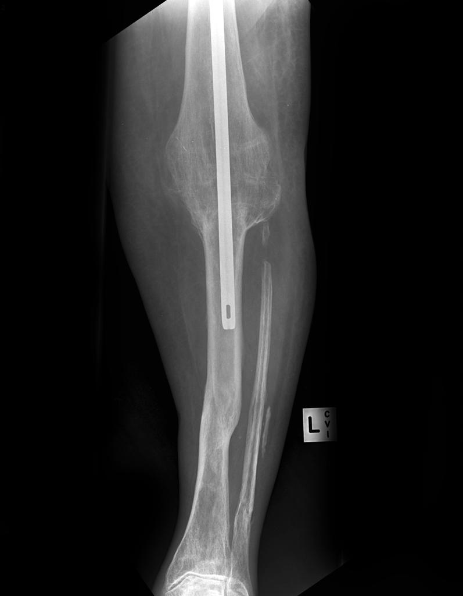 | 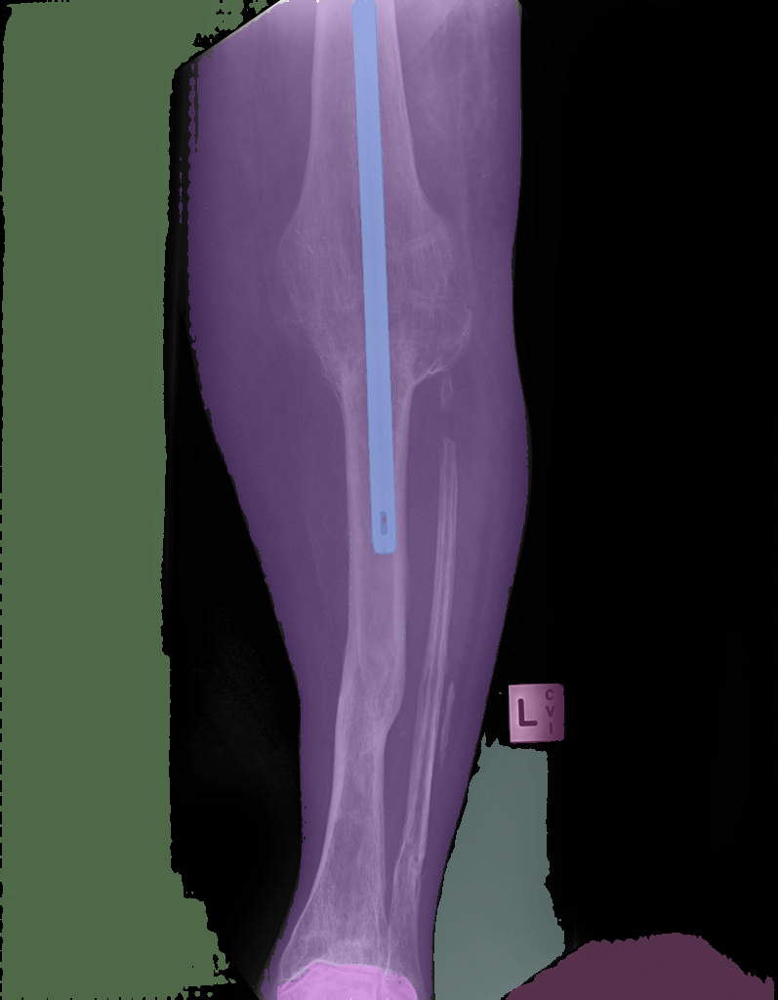 | 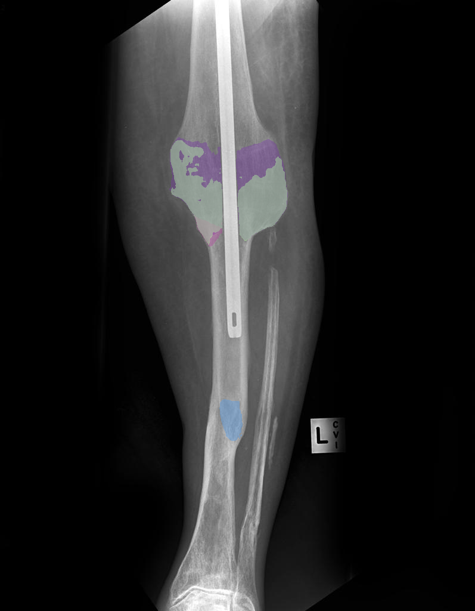 | 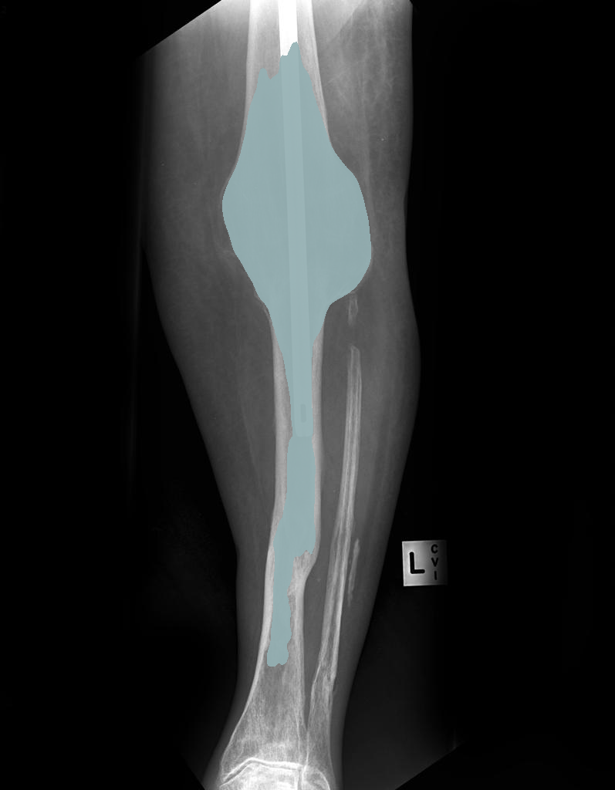 |

- **背景信息：**Age: 75 Gender: Female; Knee immobility post surgery for failed joint replacement；75 岁女性，关节置换失败后接受手术，术后膝关节不能活动。
- **原始图片 caption：**

<pre>There is ankylosis of the left knee joint with an intramedullary nail traversing the joint extending to the proximal third of the tibia. Osteolysis of the fibula head and proximal fibula with a bony fragment at the lateral aspect mid-shaft of the fibula.</pre>

- **原始图片 caption 翻译：**左膝关节强直，髓内钉跨越关节并延伸至胫骨近端三分之一；腓骨头及近端腓骨溶骨，腓骨干中段外侧可见骨片。

<strong>InternVL3-14B</strong>

**Segmentation 对 caption 的总体影响：**负向：参考关键点减少或被错误结论取代

**原始图像 → Single-image caption 回答**

英文原始回答：

<pre>The provided image is a frontal X-ray of a knee joint, and it shows the presence of a surgical hardware implant. This hardware signifies that the patient has undergone a prior joint replacement surgery.

### Image Description:
1. **Joint Anatomy**: The knee joint displayed includes the femur (thigh bone) at the top, the tibia (shin bone) at the bottom, and part of the fibula (smaller bone on the side).
2. **Surgical Hardware**: A long vertical metal rod and a horizontal plate are visible. The rod is likely a fixation device, while the horizontal plate might be part of a previous surgery or an additional stabilizing factor.
3. **Bone Structure**: The bones appear to have been surgically altered, indicating a history of joint replacement or reconstruction.
4. **Joint Space**: The space between the femur and tibia seems irregular, suggesting potential issues with the joint replacement.

### Background Consideration:
Given that the patient is 75 years old and female, and has a history of a failed joint replacement, this X-ray is crucial in assessing the current condition of the knee.

### Diagnosis:
1. **Failed Joint Replacement**: The presence of surgical hardware and altered bone structure often indicates a revision of a previous joint replacement. There may be some mechanical failure or loosening of the prosthesis, leading to the immobility.
2. **Osteolysis or Bone Resorption**: There might be areas of bone loss that could be observed if the image quality were higher. This is common in failed prosthetics.
3. **Infection or Loosening**: The immobility and pain could be due to an infection or loosening of the prosthesis, though these would require clinical correlation and possibly further imaging or tests.
4. **Fracture or Instability**: It&#x27;s possible that a stress fracture or instability due to the failed implant might be present, explaining the immobility.

### Recommendations:
1. **Clinical Evaluation**: Correlate imaging findings with clinical symptoms. Detailed physical examination by an orthopedic surgeon.
2. **Advanced Imaging**: Consider MRI or CT for a more detailed view of soft tissues, prosthetic placement, and bone quality.
3. **Reevaluation for Revision Surgery**: Given the age of the patient, the potential options may include revision surgery with a new joint replacement or alternative treatments depending on the severity and extent of the failure and bone health.
4. **Pain Management and Mobility Aids**: Short-term pain management and possibly mobility aids like braces or walkers may be required.

The X-ray highlights the complexity of managing post-surgical complications in elderly patients, emphasizing the need for a comprehensive, multi-faceted approach to diagnosis and treatment.</pre>

中文医学要点：

<pre>回答提及或最终倾向的诊断包括：关节置换失败。涉及的主要影像要点包括：骨溶解。</pre>

**原始图像 + Segmentation → Single-image caption 回答**

英文原始回答：

<pre>The X-ray image provided shows a frontal view of a knee joint that has undergone a surgical procedure, indicated by the presence of an intramedullary nail along the femur. The patient, a 75-year-old female, presented with knee immobility post-surgery for a failed joint replacement.

### Detailed Description:
1. **Intramedullary Nail**:
   - There is a visible metal rod (intramedullary nail) running along the shaft of the femur. This suggests that the patient has undergone a surgical procedure to stabilize the femur, likely due to a previous failed joint replacement or another skeletal issue.

2. **Bone Structure**:
   - The bone appears to have undergone some changes potentially due to the previous joint replacement surgery. The alignment of the femur and tibia is generally maintained, though any issues (such as fractures or loosening of prosthetic components) are not clearly visible in this image alone.

3. **Possible Bone Pathologies**:
   - The segmentation highlights parts of the femur and tibia, which indicates a focus on the skeletal components. Any abnormalities, such as fractures or bone resorption, are not explicitly shown in the image but could be inferred based on the patient&#x27;s background.

### Diagnosis and Clinical Implications:

1. **Failed Joint Replacement**:
   - Given the patient&#x27;s history, the immobility post-surgery suggests that the previous joint replacement may have been unsuccessful. This could be due to various reasons, such as mechanical failure, infection, or inadequate bone quality.

2. **Indications for Intramedullary Nailing**:
   - The presence of an intramedullary nail points towards a secondary procedure aimed at stabilizing the bone. This stabilization could be required due to a fracture that occurred post-joint replacement or to support the bone structure following extensive resurfacing procedures.

3. **Evaluation of Bone Healing and Stability**:
   - A radiographic follow-up is essential to evaluate the healing of the bone around the intramedullary nail. It is crucial to ensure that the nail is correctly positioned and supporting the bone adequately.

4. **Management of Immobility**:
   - The immobility requires a multidisciplinary approach, involving orthopedic specialists, physical therapists, and possibly pain management specialists. Rehabilitation protocols should aim to restore mobility while considering the stability provided by the intramedullary nail.

5. **Potential for Further Surgery**:
   - Depending on the outcome of the current intervention, further surgical options may be considered, including revision joint replacement or other stabilization techniques.

### Integrated Insights:
The combination of a failed joint replacement and subsequent intramedullary nailing is indicative of complex management strategies needing close clinical follow-up. The patient&#x27;s history of knee immobility necessitates careful evaluation to balance the mechanical stability provided by the current intervention with the functional restoration of the knee joint.

In conclusion, the X-ray image reveals critical post-surgical changes in the knee aligned with the patient&#x27;s symptoms of immobility and previous joint replacement failure. Continuous monitoring and tailored rehabilitation will be key components in addressing her current condition.</pre>

中文医学要点：

<pre>回答提及或最终倾向的诊断包括：关节置换失败。涉及的主要影像要点包括：髓内钉。</pre>

**Segmentation 对 caption 的影响分析：**

原始 caption：腓骨近端骨溶解（结论）；加入 segmentation 后：髓内钉（文本提及）。加入 segmentation 后参考证据减少，说明 mask 或其文本提示产生了干扰，不能视为 caption 改善。该判断以是否接近 Radiopaedia 原始 caption 为准，不依据回答篇幅。

<strong>InternVL3.5-14B</strong>

**Segmentation 对 caption 的总体影响：**正向：新增或强化参考关键点

**原始图像 → Single-image caption 回答**

英文原始回答：

<pre>&lt;think&gt;
Okay, let&#x27;s start by looking at the X-ray image. The patient is a 75-year-old female who had a failed joint replacement and now has knee immobility. The X-ray is a frontal view of the left knee, as indicated by the &quot;L&quot; marker.

First, I need to check the alignment of the prosthetic components. If there&#x27;s a previous joint replacement, the image should show the prosthetic parts. Wait, but in this image, there&#x27;s a long metal rod running through the femur and tibia. That looks more like an intramedullary nail, which is used for fractures, not a typical knee replacement. Hmm, maybe the previous surgery was a fracture fixation, and the joint replacement failed? Or perhaps the failed joint replacement was revised with a nail? That&#x27;s confusing.

Wait, the presentation says &quot;failed joint replacement,&quot; so the patient likely had a knee arthroplasty that didn&#x27;t work. But the X-ray shows a long intramedullary nail. Maybe the failed joint replacement was removed, and now there&#x27;s a fracture? Or perhaps there&#x27;s a non-union of a fracture that was treated with a nail, leading to immobility. The image shows a fracture line in the tibia, near the nail. The nail is in place, but the fracture appears to be non-healed. The bone around the fracture site might be sclerotic, indicating a lack of healing. 

Also, considering the patient&#x27;s age, osteoporosis could be a factor, making the bone more fragile. The immobility could be due to the fracture not healing, leading to pain and inability to move. The intramedullary nail might have been placed to stabilize a fracture, but if the fracture isn&#x27;t healing, that&#x27;s a non-union. Alternatively, maybe the nail is broken or displaced, causing instability. 

Wait, looking at the image again: the nail is straight, running through the femur and tibia. The distal tibia shows a fracture line with some callus formation, but maybe not enough. The alignment might be off. If the fracture is malaligned or there&#x27;s a break in the nail, that could cause instability. Also, the joint space—if there&#x27;s a previous arthroplasty, the prosthetic components should be visible. But here, I don&#x27;t see any typical knee replacement components like femoral or tibial components. Instead, there&#x27;s a long nail, suggesting a fracture fixation. 

So, putting it together: the patient had a failed joint replacement, which might have been removed, leading to a fracture. Then, an intramedullary nail was placed to fix the fracture. However, the fracture hasn&#x27;t healed (non-union), leading to knee immobility. Alternatively, the failed joint replacement was a previous arthroplasty, and the current issue is a periprosthetic fracture stabilized with a nail, which isn&#x27;t healing. 

The diagnosis would likely be a non-union of a tibial fracture with intramedullary nailing, possibly related to a failed joint replacement. The immobility is due to the fracture not healing, causing pain and instability. Other considerations: infection, but there&#x27;s no obvious signs like periosteal reaction or soft tissue swelling on X-ray. Osteomyelitis might need further imaging. But based on X-ray alone, non-union is the main issue.
&lt;/think&gt;

**Image Description:**  
The frontal X-ray of the left knee reveals a long intramedullary nail spanning the femur and tibia, typically used for fracture stabilization. A fracture line is visible in the distal tibia, adjacent to the nail. The fracture site exhibits limited callus formation, suggesting delayed or incomplete healing. The alignment of the nail appears intact, but the tibial fracture shows signs of non-union, with sclerotic bone edges and a persistent gap. No obvious hardware failure (e.g., nail breakage) is seen. The knee joint space is not well-visualized, potentially due to overlying hardware or soft tissue swelling.

**Diagnosis:**  
1. **Tibial Fracture Non-Union:** The distal tibial fracture, stabilized with an intramedullary nail, demonstrates radiographic features of non-union (lack of bridging callus, sclerotic ends).  
2. **Failed Joint Replacement Context:** The patient’s history of failed knee arthroplasty may correlate with prior surgical intervention (e.g., implant removal or revision), predisposing to fracture. The intramedullary nail likely addresses a periprosthetic fracture or post-revision fracture.  
3. **Knee Immobility:** Resulting from pain, instability, and mechanical block due to non-union.  

**Considerations:**  
- Rule out infection (e.g., elevated inflammatory markers, clinical signs) or vascular compromise (e.g., pulse checks).  
- Advanced imaging (CT/MRI) may assess fracture detail, soft tissue, or occult hardware issues.  
- Osteoporosis, common in elderly patients, may contribute to poor bone quality and delayed healing.  

**Next Steps:**  
- Orthopedic consultation for possible revision surgery (e.g., bone grafting, plate fixation) or advanced therapies (e.g., bisphosphonates, electrical stimulation).  
- Evaluate for adjacent joint arthritis or implant loosening if prior arthroplasty is suspected.</pre>

中文医学要点：

<pre>回答提及或最终倾向的诊断包括：植入物松动、假体周围骨折、关节置换失败。涉及的主要影像要点包括：髓内钉。</pre>

**原始图像 + Segmentation → Single-image caption 回答**

英文原始回答：

<pre>&lt;think&gt;
Okay, let&#x27;s tackle this case. The patient is a 75-year-old female with knee immobility after a failed joint replacement. The X-ray shows an intramedullary nail, which is typically used for long bone fractures. The nail is in the femur, extending through the knee into the tibia. 

Looking at the image, the nail seems properly aligned. But the key issue here is the knee immobility. Since the surgery was a joint replacement, maybe it&#x27;s a revision surgery where the old implant was removed, and a nail was placed instead. Wait, no, intramedullary nailing is for fractures, not joint replacements. So perhaps the initial joint replacement failed, leading to a fracture, and they stabilized it with a nail.

The presence of the nail suggests that there was a fracture post-joint replacement. The knee joint space might be irregular. The segmentation images highlight the femur, tibia, knee joint, and nail. The joint space looks narrowed, which could indicate arthritis or damage from the failed implant. The nail is in the femur and tibia, so maybe a comminuted fracture around the knee that needed stabilization.

Possible diagnoses: Periprosthetic fracture (break around the joint implant) leading to immobility. The nail is stabilizing the fracture. Alternatively, non-union or malunion of a previous fracture. The patient&#x27;s age and osteoporosis could contribute to fragility fractures. The immobility might be due to both the fracture and possible soft tissue issues or infection, but the X-ray doesn&#x27;t show obvious signs of infection like periosteal reaction.

Another angle: The failed joint replacement could have led to loosening of the implant, causing pain and instability, resulting in a fall and subsequent fracture. The nail is addressing the fracture. The diagnosis would then be a periprosthetic fracture stabilized with intramedullary nailing. The immobility is from the fracture and possible associated soft tissue damage.

Need to check for alignment of the nail. If the nail is properly placed, that&#x27;s good. If there&#x27;s any displacement, that&#x27;s a problem. The image shows the nail spanning the knee, which is atypical because usually, nails avoid the joint. But in cases of fractures through the knee, they might go through. So this is a fracture through the knee joint, managed with an intramedullary nail. The segmentation shows the nail in the femur and tibia, with the knee joint area highlighted. The joint space might be compromised.

In summary, the patient likely has a periprosthetic fracture around the knee, possibly from a failed joint replacement, leading to immobility. The intramedullary nail is used to stabilize the fracture. The diagnosis would be a periprosthetic fracture post-total knee arthroplasty, managed with intramedullary nailing. Complications could include non-union, infection, or hardware issues, but the image doesn&#x27;t clearly show those. The immobility is due to the fracture and surgical stabilization.
&lt;/think&gt;

**Image Description:**  
The X-ray shows a frontal view of the left lower extremity with an intramedullary nail spanning the femur and tibia. The nail is aligned within the medullary canal, extending through the knee joint. The femur and tibia are segmented, with the knee joint highlighted. There is evidence of a fracture on the lateral tibia, likely distal to the knee joint. The joint space appears irregular, suggesting possible degenerative changes or prior surgical intervention. The nail’s placement through the knee is atypical, indicating stabilization of a fracture involving the diaphysis of the femur and tibia, potentially crossing the knee.

**Diagnosis:**  
1. **Periprosthetic Fracture (or Post-Revision Fracture):**  
   The patient’s history of failed joint replacement and knee immobility, combined with the intramedullary nail spanning the knee, suggests a fracture occurred around the knee (periprosthetic or post-revision fracture). The nail stabilizes a comminuted or diaphyseal fracture involving the femur and tibia, possibly due to osteoporotic fragility or mechanical stress post-surgery.

2. **Complications from Failed Joint Replacement:**  
   - **Loosening/Dislocation of Prior Implant:** Chronic instability from a failed arthroplasty may have predisposed the patient to fracture.  
   - **Degenerative Changes:** Narrowing of the joint space and osteophytes may reflect underlying arthritis or damage from prior surgery.

3. **Secondary Issues:**  
   - **Non-Union/Malunion Risk:** Advanced age and potential osteopenia increase fracture healing challenges.  
   - **Soft Tissue/Neurovascular Injury:** Immobility could stem from associated soft tissue damage, though not directly visible on X-ray.

**Clinical Implications:**  
- The intramedullary nail addresses bony stability but may compromise knee motion.  
- Further evaluation (CT/MRI) is needed to assess soft tissue integrity, cartilage status, and fracture alignment.  
- Management may involve fracture healing support, physical therapy, or revision surgery if hardware failure or non-union occurs.  

**Conclusion:**  
The imaging and clinical context indicate a **periprosthetic fracture stabilized with intramedullary nailing**, secondary to a failed joint replacement. Immobility likely results from the fracture, surgical hardware, and potential soft tissue involvement. Multidisciplinary care (orthopedics, rehabilitation) is critical for recovery.</pre>

中文医学要点：

<pre>回答提及或最终倾向的诊断包括：关节置换失败、假体周围骨折。涉及的主要影像要点包括：髓内钉。</pre>

**Segmentation 对 caption 的影响分析：**

原始 caption：髓内钉（文本提及）；加入 segmentation 后：髓内钉（结论）。加入 segmentation 后参考证据增加，说明 overlay 至少改善了相关结构或病灶的注意力分配。该判断以是否接近 Radiopaedia 原始 caption 为准，不依据回答篇幅。

<strong>Lingshu-32B</strong>

**Segmentation 对 caption 的总体影响：**负向：参考关键点减少或被错误结论取代

**原始图像 → Single-image caption 回答**

英文原始回答：

<pre>The X-ray image shows a frontal view of the left lower leg, including the knee joint. There is a metallic rod or intramedullary nail visible within the femur, indicating that the patient has undergone a surgical procedure involving the placement of an internal fixation device. The presence of this hardware suggests that the patient likely had a fracture or other injury to the femur that required stabilization with an intramedullary nail.

Given the patient&#x27;s age of 75 and the presentation of knee immobility following a failed joint replacement surgery, it is possible that the patient experienced complications related to the previous joint replacement procedure, such as a periprosthetic fracture or loosening of the implant components. The current imaging findings suggest that the patient may have undergone a revision surgery to address these issues, which could involve the removal of the failed joint replacement components and the placement of an intramedullary nail to stabilize the bone.

Based on the provided information and the radiographic findings, the most likely diagnosis is a complication related to a failed total knee arthroplasty (TKA) in an elderly female patient, potentially involving a periprosthetic fracture or loosening of the implant components, which has been addressed through a revision surgery with the placement of an intramedullary nail for stabilization.</pre>

中文医学要点：

<pre>回答提及或最终倾向的诊断包括：假体周围骨折。涉及的主要影像要点包括：髓内钉。</pre>

**原始图像 + Segmentation → Single-image caption 回答**

英文原始回答：

<pre>The X-ray image shows a frontal view of the left lower limb, specifically focusing on the femur and tibia. There is an intramedullary nail present within the femur, indicating previous surgical intervention. The femur appears to have undergone significant changes, likely due to the failed joint replacement and subsequent surgery. The tibia also shows signs of surgical intervention, with an intramedullary nail visible. The knee joint space appears narrowed, which could be indicative of osteoarthritis or other degenerative changes. Given the patient&#x27;s age and history of failed joint replacement, the most likely diagnosis is post-surgical complications leading to knee immobility, possibly due to infection, non-union, or mechanical failure of the implant. Further clinical correlation and possibly additional imaging would be necessary to confirm the exact cause of the immobility.</pre>

中文医学要点：

<pre>回答提及或最终倾向的诊断包括：关节置换失败、骨关节炎。涉及的主要影像要点包括：髓内钉。</pre>

**Segmentation 对 caption 的影响分析：**

原始 caption：髓内钉（结论）；加入 segmentation 后：髓内钉（文本提及）。加入 segmentation 后参考证据减少，说明 mask 或其文本提示产生了干扰，不能视为 caption 改善。该判断以是否接近 Radiopaedia 原始 caption 为准，不依据回答篇幅。

<strong>MedGemma-27B-IT</strong>

**Segmentation 对 caption 的总体影响：**正向：新增或强化参考关键点

**原始图像 → Single-image caption 回答**

英文原始回答：

<pre>**Image Description:**

The image is a frontal X-ray of the lower leg and knee. It shows the bone structure of the femur and tibia. A long, thin metal rod (likely an intramedullary nail or rod) is visible running down the center of the femur, indicating previous surgical intervention. The knee joint itself appears to be in a fixed position, possibly due to the surgical hardware or post-operative stiffness. There is significant bone remodeling and potential deformity around the knee joint, consistent with a previous joint replacement surgery that has failed. The alignment of the leg appears somewhat altered.

**Patient Context:**

*   **Age:** 75 years old (elderly)
*   **Gender:** Female
*   **Presentation:** Knee immobility post surgery for failed joint replacement.

**Diagnosis:**

Based on the X-ray findings and the patient&#x27;s history, the diagnosis is likely:

*   **Failed Total Knee Arthroplasty (TKA) with Knee Immobility:** The presence of the intramedullary rod suggests prior surgery on the femur. The altered appearance of the knee joint, combined with the history of a failed joint replacement and subsequent immobility, strongly points to complications from the TKA. These complications could include:
    *   **Stiffness/Contracture:** The knee joint is fixed in a position, likely due to scar tissue formation, heterotopic ossification, or implant issues.
    *   **Implant Failure:** The original joint replacement may have loosened, worn out, or become infected, leading to the need for revision or removal, and contributing to immobility.
    *   **Deformity:** The bone structure around the knee may be altered due to the previous surgery and failure.
    *   **Pain:** Although not directly visible on the X-ray, pain is a common symptom associated with failed TKA and immobility.

**In summary:** The X-ray shows evidence of previous extensive surgery on the femur and knee, consistent with a failed total knee replacement. The patient&#x27;s presentation of knee immobility is likely a direct consequence of the surgical complications and subsequent healing process.</pre>

中文医学要点：

<pre>回答提及或最终倾向的诊断包括：关节置换失败。涉及的主要影像要点包括：髓内钉。</pre>

**原始图像 + Segmentation → Single-image caption 回答**

英文原始回答：

<pre>**Image Description:**

The image is a frontal X-ray of the lower leg and knee. It shows the following:

*   **Bones:** The femur (thigh bone) and tibia (shin bone) are visible, forming the knee joint.
*   **Implant:** An intramedullary nail is inserted into the femur, extending down towards the knee. This is a surgical implant used to stabilize bone fractures.
*   **Knee Joint:** The knee joint itself appears abnormal. There is significant bone destruction and deformity, particularly around the tibial plateau (the top surface of the tibia where it articulates with the femur).
*   **Soft Tissues:** The soft tissues surrounding the knee appear swollen or abnormal, consistent with inflammation or infection.
*   **Alignment:** The alignment of the leg appears abnormal, potentially due to the failed joint replacement and subsequent bone destruction.

**Patient Context:**

*   **Age:** 75 years old (elderly)
*   **Gender:** Female
*   **Presentation:** Knee immobility post-surgery for a failed joint replacement.

**Diagnosis:**

Based on the X-ray findings and the patient&#x27;s history, the most likely diagnosis is **failed total knee arthroplasty (TKA) complicated by infection and/or aseptic loosening, leading to significant bone destruction and immobility.**

**Explanation:**

1.  **Failed Joint Replacement:** The patient underwent knee replacement surgery, which has now failed. This is indicated by the immobility and the abnormal appearance of the knee joint on the X-ray.
2.  **Bone Destruction:** The significant destruction of the bone around the knee joint (especially the tibial plateau) is a hallmark of a failed knee replacement. This can be caused by:
    *   **Infection (Periprosthetic Joint Infection - PJI):** Bacteria can infect the joint replacement, leading to inflammation, bone destruction (osteolysis), and implant loosening. This is a common cause of late failure.
    *   **Aseptic Loosening:** The implant can become loose from the bone over time due to wear, stress, or inadequate initial fixation, leading to pain, instability, and eventually bone destruction.
    *   **Wear Debris:** Particles from the implant components can cause an inflammatory reaction (osteolysis) leading to bone loss around the implant.
3.  **Immobility:** The combination of pain, instability, bone destruction, and potential soft tissue complications (like contractures or swelling) leads to the patient&#x27;s inability to move the knee.
4.  **Intramedullary Nail:** The presence of an intramedullary nail in the femur suggests a previous fracture or possibly a separate surgical procedure, but it is not directly related to the failed knee replacement itself.

**In summary, the X-ray shows a severely damaged knee joint following a failed replacement surgery, likely due to infection or aseptic loosening, resulting in significant bone loss and immobility.**</pre>

中文医学要点：

<pre>回答提及或最终倾向的诊断包括：植入物松动、关节置换失败。涉及的主要影像要点包括：髓内钉、骨溶解。</pre>

**Segmentation 对 caption 的影响分析：**

原始 caption：髓内钉（文本提及）；加入 segmentation 后：髓内钉（结论）、腓骨近端骨溶解（结论）。加入 segmentation 后参考证据增加，说明 overlay 至少改善了相关结构或病灶的注意力分配。该判断以是否接近 Radiopaedia 原始 caption 为准，不依据回答篇幅。

<strong>MedMO-8B</strong>

**Segmentation 对 caption 的总体影响：**无帮助：前后均未命中参考核心征象

**原始图像 → Single-image caption 回答**

英文原始回答：

<pre>There is a knee prosthesis. The distal femur is well aligned with the tibia. There is no radiopaque foreign body. There is no fracture.</pre>

中文医学要点：

<pre>回答未形成可稳定提取的明确疾病结论。未提取到与参考病灶高度特异的影像征象。</pre>

**原始图像 + Segmentation → Single-image caption 回答**

英文原始回答：

<pre>The radiograph shows a postoperative image after a total knee arthroplasty.</pre>

中文医学要点：

<pre>回答未形成可稳定提取的明确疾病结论。未提取到与参考病灶高度特异的影像征象。</pre>

**Segmentation 对 caption 的影响分析：**

原始 caption：未命中核心征象；加入 segmentation 后：未命中核心征象。前后都没有覆盖决定性征象；回答即使变长，也不能视为有效的视觉理解增益。该判断以是否接近 Radiopaedia 原始 caption 为准，不依据回答篇幅。

<strong>Qwen3-VL-4B</strong>

**Segmentation 对 caption 的总体影响：**部分有帮助：识别髓内钉和失败术后状态，但仍未说出关节强直

**原始图像 → Single-image caption 回答**

英文原始回答：

<pre>This is a frontal (AP) X-ray of the left lower leg, labeled “L” and “CVI” (likely indicating “C”enter “V”iew “I”nstitution or similar), showing a recent surgical intervention in the knee region. The image reveals a long, linear, metallic implant running vertically along the tibia and extending into the knee joint space — consistent with a **total knee replacement (TKR)** prosthesis.

Key observations:
- The implant appears to be a **biological knee prosthesis**, with a visible stem or implant body within the tibia and a component likely in the femur or patella (though the patella is not clearly visible in this view).
- The implant is well-aligned with the bone anatomy and shows no signs of loosening, fracture, or dislocation.
- The surrounding bone appears intact, with no evidence of osteomyelitis, fracture, or hardware malposition.
- The patient’s age (75) and history of “failed joint replacement” are critical context. A failed knee replacement typically implies implant loosening, wear, infection, or mechanical failure — none of which are evident on this radiograph.

Diagnosis: **Postoperative X-ray of a total knee replacement (TKR) in a 75-year-old female, showing successful implant placement with no immediate complications.**

However, given the patient’s history of “failed joint replacement,” this image likely represents a **follow-up or initial postoperative X-ray after a revision or reoperation**. The absence of signs of failure (e.g., implant migration, loosening, or bone destruction) suggests that this may be the **first postoperative image after successful revision surgery** or a **preoperative imaging to confirm implant placement prior to surgery**.

Important note: Since the patient has a history of failed joint replacement, this image should be interpreted in the context of a **revision surgery**. If this is a preoperative image, the diagnosis is likely “**Preoperative X-ray for revision total knee arthroplasty**.” If this is a postoperative image, and the implant is properly aligned and stable, the diagnosis is “**Successful revision total knee arthroplasty**.”

Conclusion: Based on the image and patient history, this is a **postoperative X-ray showing a properly placed total knee replacement implant**. The absence of complications on this image suggests the surgery was technically successful. However, the patient’s history of failure implies this is likely a **revision procedure**, and follow-up imaging and clinical assessment are essential to monitor for long-term outcomes.

Final Diagnosis: **Revision total knee arthroplasty — successful implant placement with no immediate complications.**

*Note: Without clinical correlation or additional imaging (e.g., MRI or CT), definitive diagnosis of “failed joint replacement” cannot be confirmed from this single X-ray. This image is consistent with a successful revision surgery.*</pre>

中文要点翻译：

<pre>模型把图像解释为全膝关节置换术后，认为假体位置良好、无松动或骨折，最终称为成功的翻修全膝关节置换。</pre>

**原始图像 + Segmentation → Single-image caption 回答**

英文原始回答：

<pre>Based on the patient’s presentation of “knee immobility post surgery for failed joint replacement” and the radiographic image, the following interpretation can be made:

**Image Description:**
The image is a frontal (anteroposterior) X-ray of the left lower leg, as indicated by the “L” marker. It clearly shows an intramedullary nail (a long, thin, metallic rod) placed within the tibia, running from the mid-shaft down to the distal end. The nail is positioned centrally within the tibial medullary canal. The surrounding bone structures, including the femur (proximal) and tibia (distal), are visible. The segmentation masks indicate that the intramedullary nail is the primary object of interest, with the femur and tibia also segmented, though the segmentation of the knee joint is not fully delineated in this view. The image shows no obvious signs of fracture, dislocation, or infection.

**Diagnosis:**
The patient is a 75-year-old female who has undergone surgery for a failed knee joint replacement. The presence of an intramedullary nail in the tibia is highly indicative of a prior surgical intervention for a lower limb fracture or for stabilization of a joint replacement. In the context of a “failed joint replacement,” this is not a typical post-operative scenario for the knee joint, as joint replacements are typically performed in the knee or hip, not the tibia.

The most likely diagnosis is: **Failed knee arthroplasty with subsequent tibial intramedullary nailing for stabilization or revision.**

This is a complex and unusual clinical scenario. It suggests that the patient may have had a failed total knee arthroplasty (TKA), and due to complications such as infection, loosening, or failure to achieve adequate mobility, the surgeon may have opted for a tibial intramedullary nail to stabilize the lower limb and allow for healing or to prepare for further revision surgery. This is not a common practice, and it is more likely that the tibial nail is being used to stabilize a fracture or to provide mechanical support for a failed joint replacement.

Alternatively, if the patient has a history of a failed knee replacement and now has immobility, the tibial nail could be a result of a prior fracture or surgical intervention that was not related to the knee replacement, such as a tibial fracture that was treated with intramedullary nailing.

**Conclusion:**
The image shows an intramedullary nail in the tibia, which is not typical for a knee replacement surgery. The diagnosis is likely **Failed knee arthroplasty with subsequent tibial intramedullary nailing for stabilization or revision**. The patient’s immobility is likely due to the surgical intervention and the need for rehabilitation following the failed joint replacement.

This is a complex case that requires further clinical evaluation, including a detailed history, physical examination, and possibly additional imaging (e.g., MRI or CT) to determine the exact cause of the immobility and the appropriate next steps in management.</pre>

中文要点翻译：

<pre>加入股骨、胫骨、膝关节和髓内钉分割后，模型识别到跨越下肢的髓内钉，并改判为失败膝关节置换术后使用髓内钉稳定或翻修。</pre>

**对模型图片 caption 能力及 Segmentation 影响的分析：**

segmentation 纠正了“标准膝关节假体且手术成功”的基本误读，并把注意力转向髓内钉和失败术后状态；但模型把钉的位置和用途描述得不够准确，也没有识别左膝关节被手术性融合、不能活动的核心诊断。

<strong>Qwen3-VL-8B</strong>

**Segmentation 对 caption 的总体影响：**基本持平：前后均提及部分参考关键点

**原始图像 → Single-image caption 回答**

英文原始回答：

<pre>Based on the provided patient data and image, here is the description and diagnosis:

**Image Description:**

This is a frontal (anteroposterior) X-ray of the left lower limb, as indicated by the “L” marker. The image clearly shows a metallic implant — specifically, a long, straight intramedullary rod (or intramedullary nail) extending from the proximal femur down through the femoral shaft. The rod is positioned within the medullary canal of the femur, suggesting it is a femoral intramedullary nail, likely used for fixation of a femur fracture. The distal end of the nail appears to be near or within the knee joint, but there is no visible knee prosthesis (such as a femoral or tibial component) in the image.

The patient is 75 years old and female, and the presentation is “knee immobility post surgery for failed joint replacement.” The presence of an intramedullary nail in the femur is highly suggestive of a femoral fracture, which may have occurred either as a complication of the failed joint replacement surgery (e.g., during revision or due to trauma) or as a separate event.

**Diagnosis:**

The most likely diagnosis is:

&gt; **Femoral shaft fracture with intramedullary nailing, following failed total knee arthroplasty.**

**Rationale:**

1.  **Patient History:** The patient had a prior failed total knee replacement, which implies she likely underwent a revision or a complex procedure. The presence of a femoral intramedullary nail strongly suggests a femoral fracture occurred, possibly during or after the failed revision surgery (e.g., due to a fall or mechanical failure), or as a separate event.

2.  **Imaging Findings:**
    *   The image shows a metallic intramedullary rod in the femur, which is a definitive sign of internal fixation for a femoral fracture.
    *   There is no visible knee prosthesis, which is consistent with a failed or non-existent total knee replacement. The patient’s current immobility is likely due to the femoral fracture and the need for immobilization.

3.  **Clinical Correlation:** The immobility is a direct consequence of the femoral fracture and the need for stabilization with the intramedullary nail.

**Conclusion:**

The patient has a femoral shaft fracture that has been treated with intramedullary nailing. This fracture likely occurred in the context of her failed total knee replacement, either during the revision surgery or as a complication. The diagnosis is critical for guiding further management, which may include physical therapy, pain control, and possibly future revision of the knee prosthesis once the femur has healed.

---

**Note:** It is important to note that while the image shows a femoral fracture, the patient’s primary complaint is “knee immobility.” The femoral fracture is likely the cause of the immobility, not a direct knee problem. The failed joint replacement may have contributed to the femoral fracture or is a separate issue requiring separate management.</pre>

中文医学要点：

<pre>回答提及或最终倾向的诊断包括：关节置换失败。涉及的主要影像要点包括：髓内钉。</pre>

**原始图像 + Segmentation → Single-image caption 回答**

英文原始回答：

<pre>Based on the provided patient data and image analysis, here is the description and diagnosis:

**Patient Context:**
- 75-year-old female
- Presenting with knee immobility following a failed joint replacement surgery
- The X-ray shows a left femur and tibia with an intramedullary nail, indicating a prior surgical intervention for a femoral fracture or a revision procedure.

**Image Description:**
The X-ray is a frontal view of the left lower limb, clearly showing:
- An intramedullary nail (IM nail) inserted along the femur, extending from the proximal femur down into the distal femur and into the proximal tibia. This is a common method for stabilizing femoral fractures or for revision arthroplasty.
- The femur and tibia are visible, with the knee joint located between them.
- The &quot;L&quot; marker confirms this is the left leg.
- The bone structures appear to be well-aligned with the implant, suggesting the surgical hardware is in place.

**Diagnosis:**
The patient is presenting with **knee immobility following a failed total knee arthroplasty (TKA)**. The presence of an intramedullary nail suggests that the patient likely underwent a **revision surgery** to address complications from the initial TKA, such as a femoral fracture, loosening of the femoral component, or a complex revision requiring stabilization of the femur.

The diagnosis is **Failed Total Knee Replacement with Revision Femoral Stabilization using Intramedullary Nail**.

**Clinical Implications:**
- The patient’s age and presentation suggest a complex case requiring careful management.
- The immobility is likely due to pain, stiffness, or mechanical failure of the prosthesis.
- The intramedullary nail provides stability to the femur, but does not address the knee joint itself, indicating the revision may have been focused on the femur rather than the entire joint.
- Further evaluation is needed to determine the specific cause of failure and to plan appropriate rehabilitation or further surgical intervention.

This case highlights the challenges of revision arthroplasty in elderly patients and the need for a multidisciplinary approach to manage complications and restore function.</pre>

中文医学要点：

<pre>回答提及或最终倾向的诊断包括：关节置换失败。涉及的主要影像要点包括：髓内钉。</pre>

**Segmentation 对 caption 的影响分析：**

原始 caption：髓内钉（结论）；加入 segmentation 后：髓内钉（结论）。前后对参考征象的覆盖基本不变；segmentation 没有带来可辨认的疾病特异性增量。该判断以是否接近 Radiopaedia 原始 caption 为准，不依据回答篇幅。

<strong>Qwen3-VL-32B</strong>

**Segmentation 对 caption 的总体影响：**正向：新增或强化参考关键点

**原始图像 → Single-image caption 回答**

英文原始回答：

<pre>**Image Description:**

This is a frontal (anteroposterior) X-ray of the left lower limb, as indicated by the &quot;L&quot; marker in the lower right corner. The image demonstrates a long bone fixation device, likely an intramedullary nail, extending from the distal femur through the knee joint and into the proximal tibia. The nail appears to be well-positioned and intact, with no obvious signs of fracture or displacement.

The knee joint itself shows significant abnormality. There is a marked loss of joint space, with severe osteoarthritic changes, including subchondral sclerosis, osteophyte formation, and possible joint surface irregularities. The femoral and tibial components of the knee joint appear to be poorly aligned or malpositioned, suggesting a failed total knee arthroplasty (TKA) or revision surgery.

Notably, there is evidence of bone resorption or lysis around the implant, particularly in the proximal tibia, which may indicate loosening, infection, or nonunion. There is also a visible fracture fragment or cortical discontinuity in the lateral aspect of the proximal tibia, which could represent a periprosthetic fracture.

The distal femur and proximal tibia show signs of bone remodeling and possible osteopenia, which is common in elderly patients and may be exacerbated by immobilization or chronic inflammation.

---

**Diagnosis:**

**Failed Total Knee Arthroplasty with Periprosthetic Fracture and Implant Loosening**

This 75-year-old female presents with knee immobility following surgery for a failed joint replacement. The X-ray confirms:

- **Failed TKA**: Evidence of malalignment, joint space loss, osteophytes, and subchondral sclerosis.
- **Periprosthetic fracture**: A fracture fragment is visible in the proximal tibia, likely related to stress on the bone around the implant.
- **Implant loosening or instability**: Radiolucent lines or bone lysis around the implant suggest loosening, which may be mechanical or due to infection (osteomyelitis).
- **Possible infection**: Although not definitive on X-ray alone, the bone lysis and poor healing may suggest an infectious process, which would require further evaluation (e.g., labs, MRI, or aspiration).

---

**Clinical Implications:**

The patient likely requires further evaluation with advanced imaging (e.g., MRI or CT) and laboratory tests (e.g., ESR, CRP, white blood cell count) to rule out infection. Surgical revision may be necessary, depending on the cause of failure and the patient’s overall health. If infection is present, it may require debridement, antibiotic treatment, and possible staged revision. If the failure is mechanical, revision arthroplasty with possible bone grafting or use of a longer stem may be needed.

---

**Conclusion:**

The X-ray demonstrates a failed total knee replacement with periprosthetic fracture and signs of implant loosening. The patient’s immobility is likely due to this structural failure, requiring urgent orthopedic evaluation and intervention.</pre>

中文医学要点：

<pre>回答提及或最终倾向的诊断包括：植入物松动、假体周围骨折。涉及的主要影像要点包括：髓内钉。</pre>

**原始图像 + Segmentation → Single-image caption 回答**

英文原始回答：

<pre>Based on the patient’s history — a 75-year-old female with **knee immobility post-surgery for a failed joint replacement** — and the provided X-ray image and segmentations, here is a detailed analysis and diagnosis:

---

### **Image Description**

This is a **frontal (anteroposterior) X-ray** of the **left lower limb**, as indicated by the “L” marker in the image. The image shows the **femur, knee joint, tibia, and fibula** from the distal femur to the proximal tibia and fibula.

Key radiographic findings:

1. **Intramedullary nail (IM nail)**: A long, straight, radiopaque metallic rod is seen extending from the proximal femur down through the femoral shaft and into the proximal tibia. This is consistent with **intramedullary fixation**, likely placed post-failure of a total knee arthroplasty (TKA) or for a fracture following revision surgery.

2. **Bone changes at the knee joint**:
   - There is **loss of normal joint space** at the knee, suggesting **arthritic changes** or **joint destruction**.
   - The **femoral and tibial bone ends appear irregular and sclerotic**, with possible **osteolysis** or **bone resorption** around the implant site — common in failed joint replacements.
   - The **joint surfaces are not smooth**; there is evidence of **bone fragmentation or collapse**, which may indicate **non-union, malunion, or infection**.

3. **Tibial fracture or non-union**:
   - In the proximal tibia, just below the knee joint, there is a **radiolucent line** or **disruption in cortical continuity**, suggestive of a **fracture** or **non-union**.
   - The IM nail appears to cross this area, indicating it was placed to stabilize the fracture or failed fixation.

4. **Soft tissue and hardware**:
   - The IM nail is well-aligned in the medullary canal.
   - There is no obvious hardware loosening or displacement.
   - No obvious signs of **periosteal reaction** or **soft tissue swelling** are visible on X-ray, but this does not rule out infection.

---

### **Segmentation Analysis**

- **Medical-SAM2 segmentation** (first segmentation image): Shows a broad, purple overlay covering the entire limb, including bone and soft tissue, with the IM nail highlighted in blue. This is a **coarse segmentation**, not specific to anatomical structures.

- **Medical-SAM3 segmentation** (second image): Attempts to segment the **femur (green), tibia (purple), knee joint (pink), and IM nail (blue)**. However, the segmentation is **inaccurate** — the femur and tibia are not properly delineated, and the knee joint region is fragmented. The IM nail is correctly identified but appears as a small blue region, not the full length.

- **BiomedParse segmentation** (third image): Shows a **light blue region** outlining the **medullary canal** and the IM nail. This is more accurate in depicting the **intramedullary hardware and bone canal**, but it does not segment the femur, tibia, or joint separately.

→ **Conclusion on segmentation**: None of the segmentations are clinically accurate for precise diagnosis. BiomedParse is the most anatomically plausible for the IM nail and medullary canal, but all lack precision for detailed orthopedic assessment.

---

### **Diagnosis**

Given the patient’s history of **failed joint replacement** and **knee immobility**, and the radiographic findings:

&gt; **Diagnosis: Failed total knee arthroplasty with postoperative fracture or non-union of the proximal tibia, stabilized with intramedullary nailing.**

#### **Supporting Evidence**:
- The presence of an IM nail in the femur and tibia suggests revision surgery for instability or fracture.
- Loss of joint space, bone destruction, and irregularity at the knee joint indicate **failure of the prosthetic joint** — possibly due to **infection, aseptic loosening, or osteolysis**.
- The radiolucent line in the proximal tibia suggests **fracture or non-union**, likely a **periprosthetic fracture**.
- The patient’s age (75) increases the risk of osteoporosis and poor bone healing, contributing to failure.

---

### **Differential Diagnoses to Consider**:
1. **Periprosthetic fracture** (most likely, given hardware and fracture line).
2. **Aseptic loosening of TKA** with bone resorption.
3. **Infected joint replacement** (osteomyelitis) — though X-ray alone cannot confirm infection; requires labs and MRI.
4. **Non-union of a previous fracture** treated with IM nail.

---

### **Recommendations**

- **Clinical correlation**: Assess for signs of infection (fever, erythema, drainage, elevated CRP/ESR).
- **Advanced imaging**: **CT scan** for better assessment of fracture alignment and bone quality; **MRI** if infection is suspected.
- **Bone scan or PET-CT** if infection or osteomyelitis is suspected.
- **Orthopedic consultation**: For possible revision surgery, removal of hardware, or arthrodesis (fusion) if joint function cannot be restored.

---

### **Prognosis**

Poor — due to age, failed joint replacement, and fracture/non-union. The patient may require **long-term immobilization**, **rehabilitation**, or **amputation** in severe cases.

---

### ✅ Final Diagnosis:

&gt; **Failed total knee arthroplasty with periprosthetic fracture of the proximal tibia, stabilized with intramedullary nailing — resulting in knee immobility.**

This is a complex orthopedic case requiring multidisciplinary management.</pre>

中文医学要点：

<pre>回答提及或最终倾向的诊断包括：假体周围骨折。涉及的主要影像要点包括：髓内钉、骨溶解。</pre>

**Segmentation 对 caption 的影响分析：**

原始 caption：髓内钉（文本提及）；加入 segmentation 后：膝关节强直/融合（文本提及）、髓内钉（结论）、腓骨近端骨溶解（文本提及）。加入 segmentation 后参考证据增加，说明 overlay 至少改善了相关结构或病灶的注意力分配。该判断以是否接近 Radiopaedia 原始 caption 为准，不依据回答篇幅。

<!-- SECTION_2_CAPTION_ANALYSIS_END -->
