# 23 个困难单图病例的新增专家模型可视化

## 1. [Aqueductal stenosis](https://radiopaedia.org/cases/aqueductal-stenosis-3?lang=us) (`aqueductal-stenosis-3`)

| Original image | Medical-SAM2 | Medical-SAM3 | BiomedParse v1 |
|---|---|---|---|
|  |  |  |  |

## 2. [Ascites](https://radiopaedia.org/cases/ascites-6?lang=us) (`ascites-6`)

| Original image | Medical-SAM2 | Medical-SAM3 | BiomedParse v1 | FluoroSAM（补充，参考） |
|---|---|---|---|---|
|  |  |  |  | 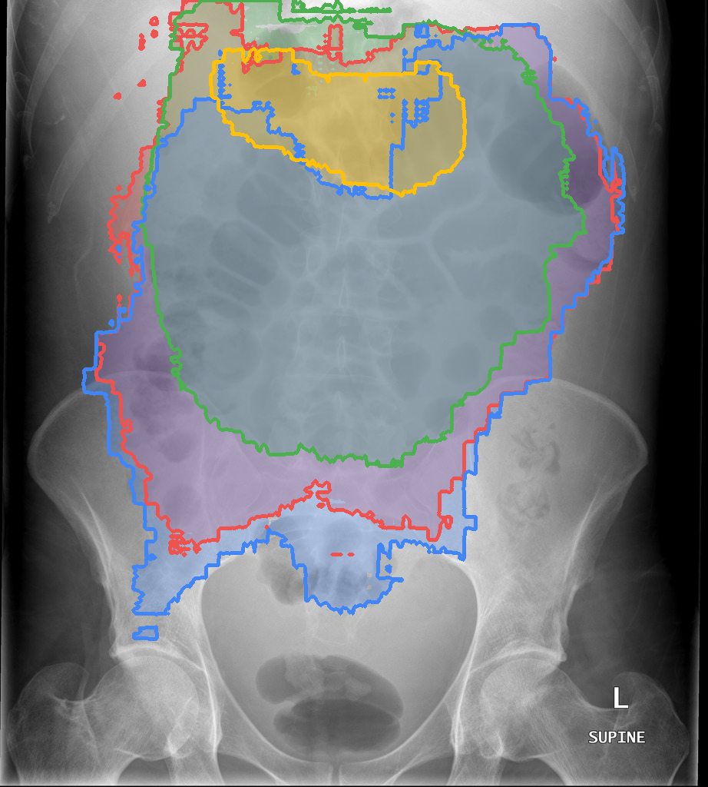 |

## 3. [BIRADS III lesion - infiltrating ductal carcinoma](https://radiopaedia.org/cases/birads-iii-lesion-infiltrating-ductal-carcinoma-1?lang=us) (`birads-iii-lesion-infiltrating-ductal-carcinoma-1`)

| Original image | Medical-SAM2 | Medical-SAM3 | BiomedParse v1 | BUSSeg whole-image（补充，参考） | BUSSeg panel-wise（补充，参考） | UltraSam / Medical-SAM3 boxes（补充，参考） | UltraSam / BiomedParse boxes（补充，参考） |
|---|---|---|---|---|---|---|---|
|  |  |  |  | 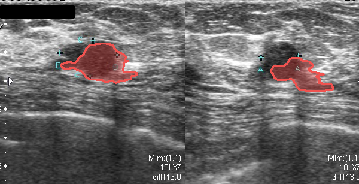 | 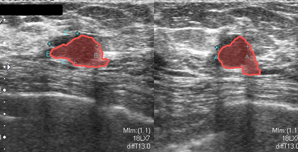 | 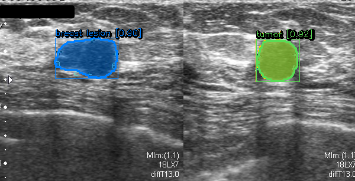 | 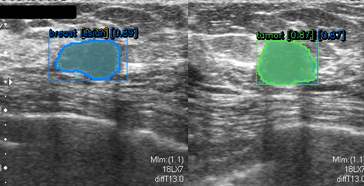 |

## 4. [Chilaiditi sign](https://radiopaedia.org/cases/chilaiditi-sign-2?lang=us) (`chilaiditi-sign-2`)

| Original image | Medical-SAM2 | Medical-SAM3 | BiomedParse v1 | TorchXRayVision | FluoroSAM（补充，参考） |
|---|---|---|---|---|---|
|  |  |  |  |  | 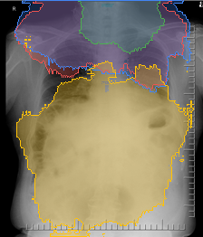 |

## 5. [Choroid plexus cyst - antenatal](https://radiopaedia.org/cases/choroid-plexus-cyst-antenatal?lang=us) (`choroid-plexus-cyst-antenatal`)

| Original image | Medical-SAM2 | Medical-SAM3 | BiomedParse v1 | UltraSam / Medical-SAM3 boxes（补充，参考） | UltraSam / BiomedParse boxes（补充，参考） | SonoCLIP（补充，参考） |
|---|---|---|---|---|---|---|
|  |  |  |  | 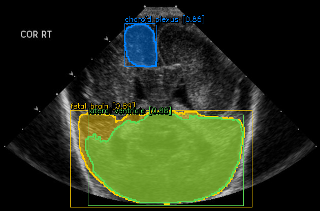 | 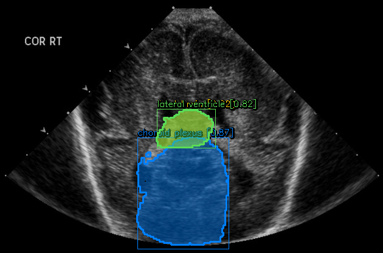 | 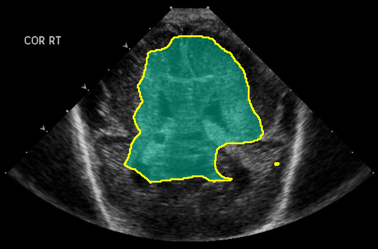 |

## 6. [Congenital diaphragmatic hernia](https://radiopaedia.org/cases/congenital-diaphragmatic-hernia?lang=us) (`congenital-diaphragmatic-hernia`)

| Original image | Medical-SAM2 | Medical-SAM3 | BiomedParse v1 | TorchXRayVision | FluoroSAM（补充，参考） |
|---|---|---|---|---|---|
|  |  |  |  |  | 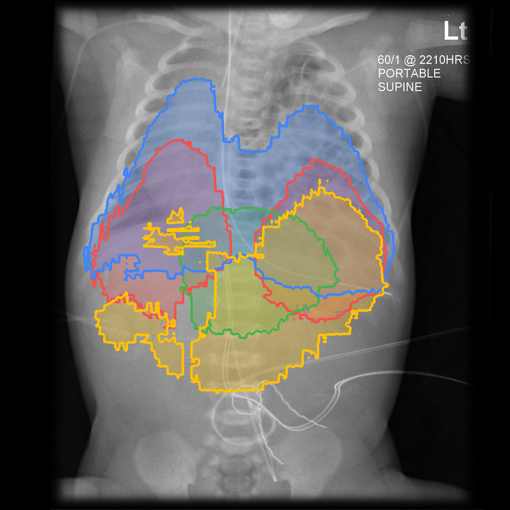 |

## 7. [Congenital diaphragmatic hernia](https://radiopaedia.org/cases/congenital-diaphragmatic-hernia-26?lang=us) (`congenital-diaphragmatic-hernia-26`)

| Original image | Medical-SAM2 | Medical-SAM3 | BiomedParse v1 | UltraSam / Medical-SAM3 boxes（补充，参考） | UltraSam / BiomedParse boxes（补充，参考） | SonoCLIP（补充，参考） |
|---|---|---|---|---|---|---|
|  |  |  |  | 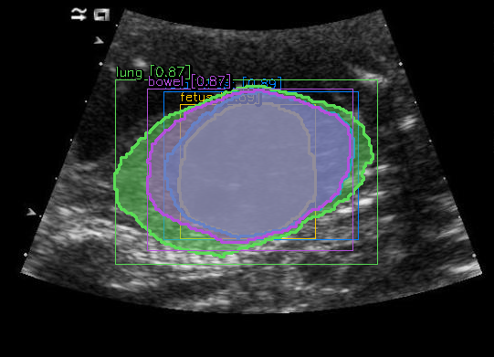 | 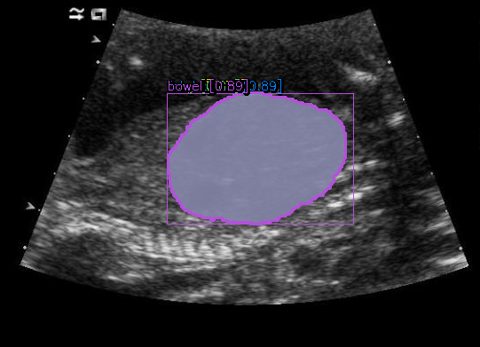 | 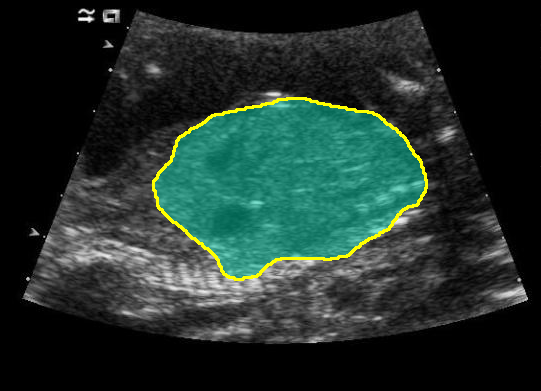 |

## 8. [Fetal cardiac rhabdomyoma](https://radiopaedia.org/cases/fetal-cardiac-rhabdomyoma-1?lang=us) (`fetal-cardiac-rhabdomyoma-1`)

| Original image | Medical-SAM2 | Medical-SAM3 | BiomedParse v1 | UltraSam / Medical-SAM3 boxes（补充，参考） | UltraSam / BiomedParse boxes（补充，参考） | SonoCLIP（补充，参考） |
|---|---|---|---|---|---|---|
|  |  |  |  | 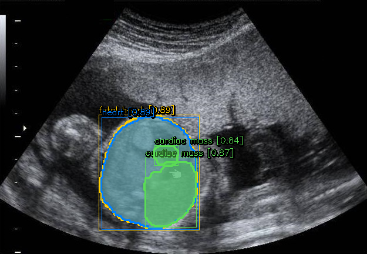 | 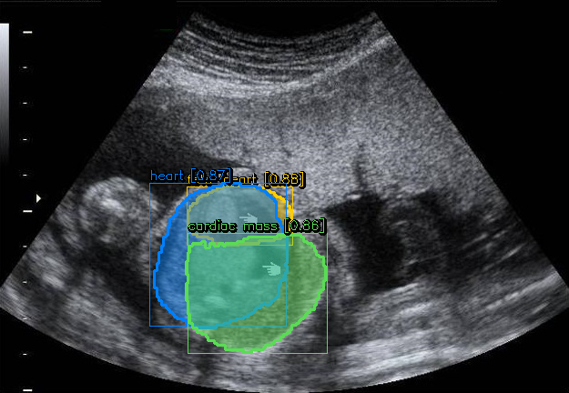 | 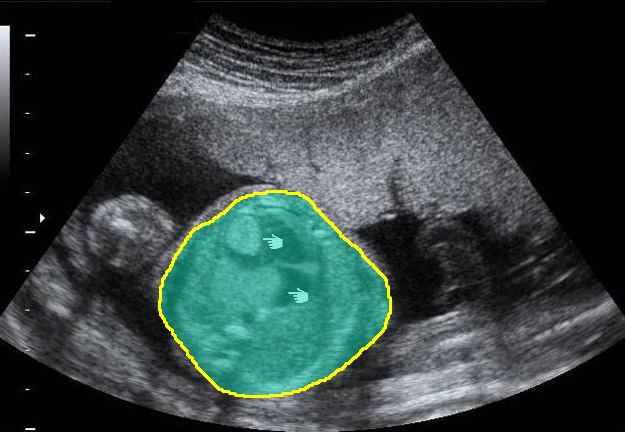 |

## 9. [First trimester oligohydramnios](https://radiopaedia.org/cases/first-trimester-oligohydramnios?lang=us) (`first-trimester-oligohydramnios`)

| Original image | Medical-SAM2 | Medical-SAM3 | BiomedParse v1 | UltraSam / Medical-SAM3 boxes（补充，参考） | UltraSam / BiomedParse boxes（补充，参考） | SonoCLIP（补充，参考） |
|---|---|---|---|---|---|---|
|  |  |  |  | 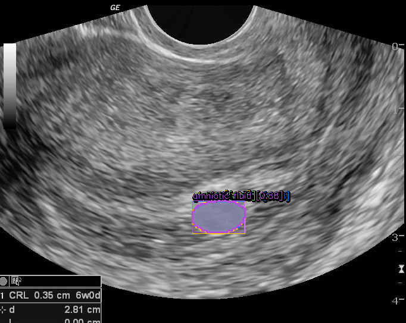 |  | 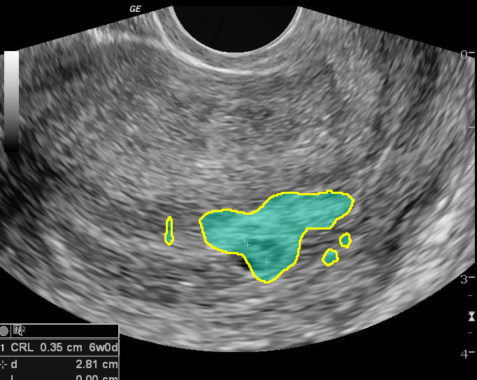 |

## 10. [Hiatus hernia](https://radiopaedia.org/cases/hiatus-hernia-15?lang=us) (`hiatus-hernia-15`)

| Original image | Medical-SAM2 | Medical-SAM3 | BiomedParse v1 | TorchXRayVision | FluoroSAM（补充，参考） |
|---|---|---|---|---|---|
|  |  |  |  |  | 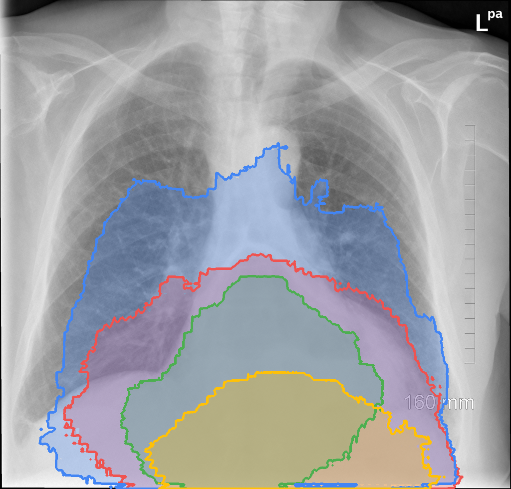 |

## 11. [Kienböck disease](https://radiopaedia.org/cases/kienbock-disease-3?lang=us) (`kienbock-disease-3`)

| Original image | Medical-SAM2 | Medical-SAM3 | BiomedParse v1 |
|---|---|---|---|
|  |  |  |  |

## 12. [Lytic bone lesion (myeloma)](https://radiopaedia.org/cases/lytic-bone-lesion-myeloma?lang=us) (`lytic-bone-lesion-myeloma`)

| Original image | Medical-SAM2 | Medical-SAM3 | BiomedParse v1 | FluoroSAM（补充，参考） |
|---|---|---|---|---|
|  |  |  |  | 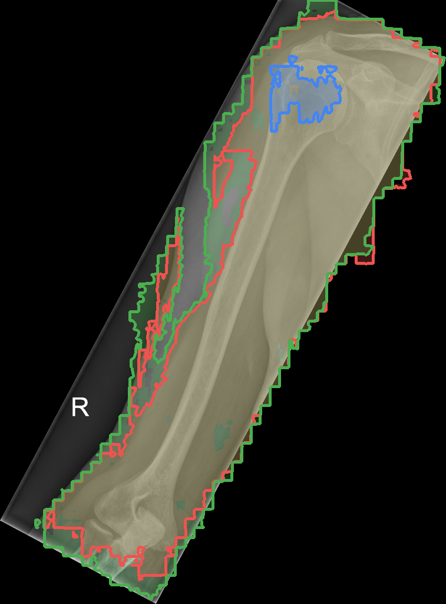 |

## 13. [Mandible fractures](https://radiopaedia.org/cases/mandible-fractures-1?lang=us) (`mandible-fractures-1`)

| Original image | Medical-SAM2 | Medical-SAM3 | BiomedParse v1 | Teeth MaskDINO anatomy | Teeth MaskDINO 11disease | FluoroSAM（补充，参考） |
|---|---|---|---|---|---|---|
|  |  |  |  |  |  | 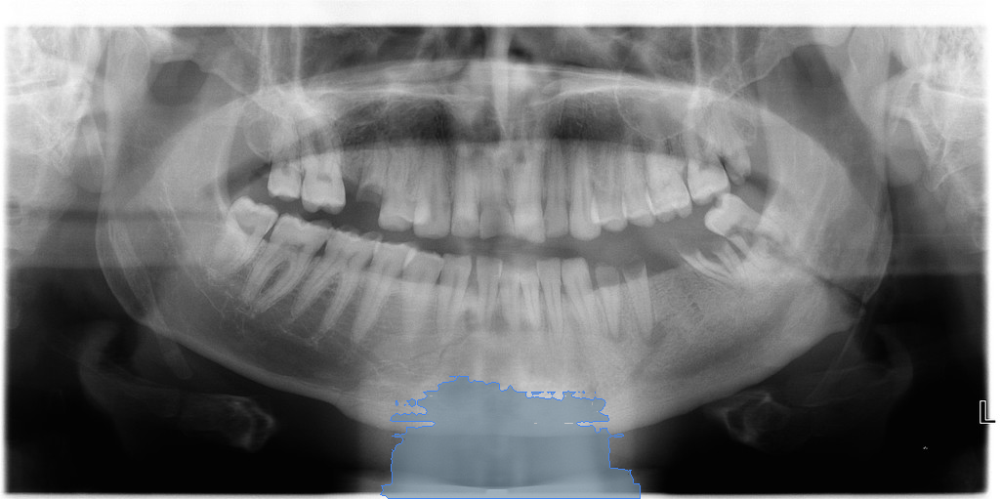 |

## 14. [Massive pleural effusion](https://radiopaedia.org/cases/massive-pleural-effusion-2?lang=us) (`massive-pleural-effusion-2`)

| Original image | Medical-SAM2 | Medical-SAM3 | BiomedParse v1 | TorchXRayVision | FluoroSAM（补充，参考） |
|---|---|---|---|---|---|
|  |  |  |  |  | 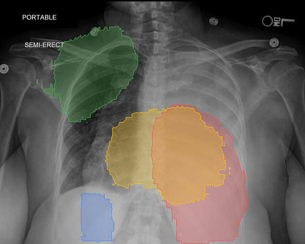 |

## 15. [Osteogenesis imperfecta](https://radiopaedia.org/cases/osteogenesis-imperfecta-15?lang=us) (`osteogenesis-imperfecta-15`)

| Original image | Medical-SAM2 | Medical-SAM3 | BiomedParse v1 | FluoroSAM（补充，参考） |
|---|---|---|---|---|
|  |  |  |  | 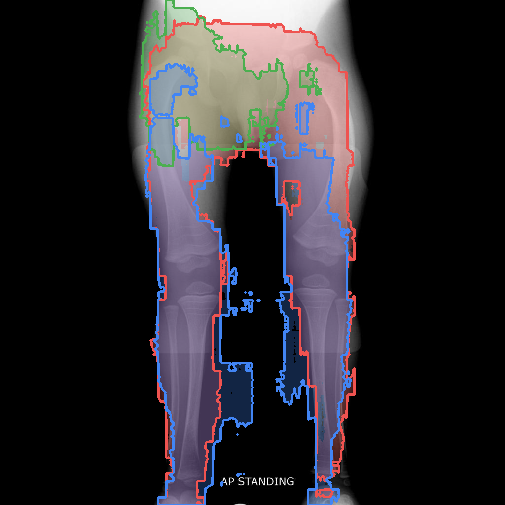 |

## 16. [Pancoast tumor](https://radiopaedia.org/cases/pancoast-tumour-11?lang=us) (`pancoast-tumour-11`)

| Original image | Medical-SAM2 | Medical-SAM3 | BiomedParse v1 | TorchXRayVision | FluoroSAM（补充，参考） |
|---|---|---|---|---|---|
|  |  |  |  |  | 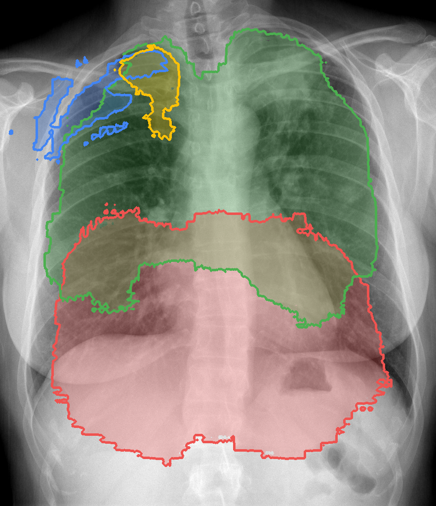 |

## 17. [Pericardial effusion - water bottle sign](https://radiopaedia.org/cases/pericardial-effusion-water-bottle-sign-2?lang=us) (`pericardial-effusion-water-bottle-sign-2`)

| Original image | Medical-SAM2 | Medical-SAM3 | BiomedParse v1 | TorchXRayVision | FluoroSAM（补充，参考） |
|---|---|---|---|---|---|
|  |  |  |  |  | 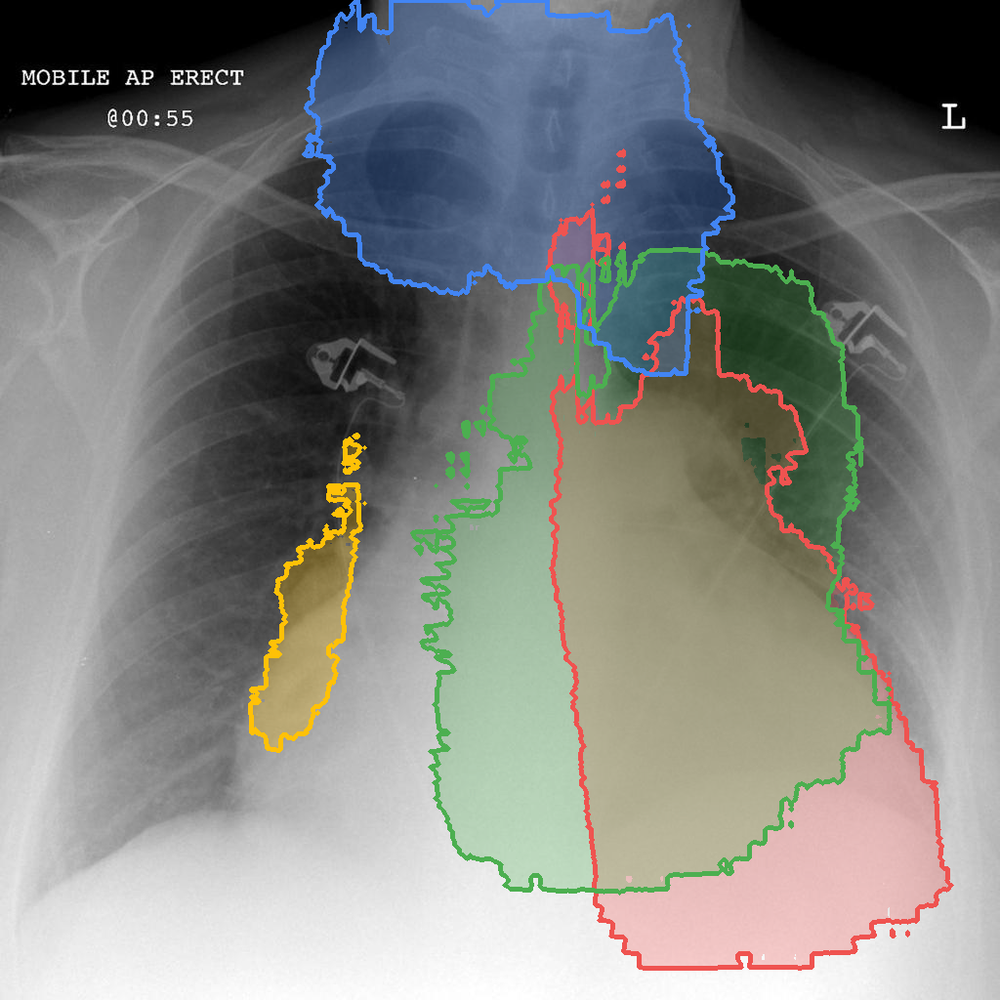 |

## 18. [Pneumoperitoneum](https://radiopaedia.org/cases/pneumoperitoneum-55?lang=us) (`pneumoperitoneum-55`)

| Original image | Medical-SAM2 | Medical-SAM3 | BiomedParse v1 | TorchXRayVision | FluoroSAM（补充，参考） |
|---|---|---|---|---|---|
|  |  |  |  |  | 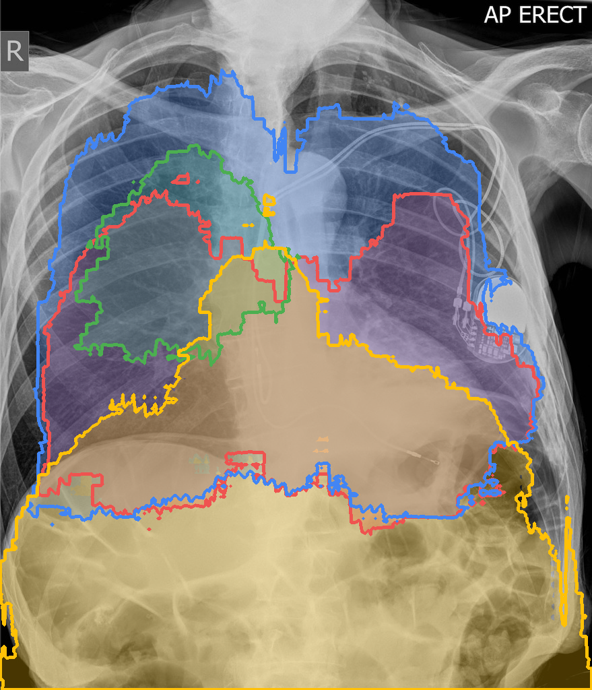 |

## 19. [Round pneumonia](https://radiopaedia.org/cases/round-pneumonia-3?lang=us) (`round-pneumonia-3`)

| Original image | Medical-SAM2 | Medical-SAM3 | BiomedParse v1 | TorchXRayVision | FluoroSAM（补充，参考） |
|---|---|---|---|---|---|
|  |  |  |  |  | 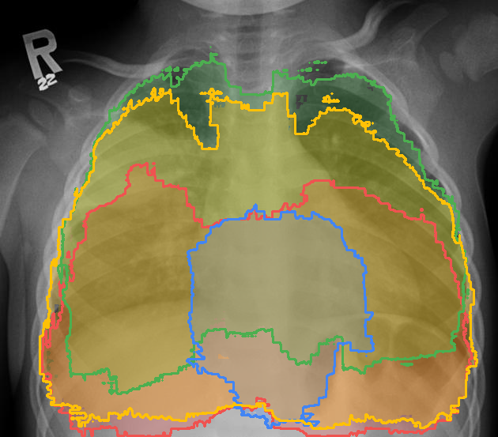 |

## 20. [Small bowel obstruction](https://radiopaedia.org/cases/small-bowel-obstruction-14?lang=us) (`small-bowel-obstruction-14`)

| Original image | Medical-SAM2 | Medical-SAM3 | BiomedParse v1 | FluoroSAM（补充，参考） |
|---|---|---|---|---|
|  |  |  |  | 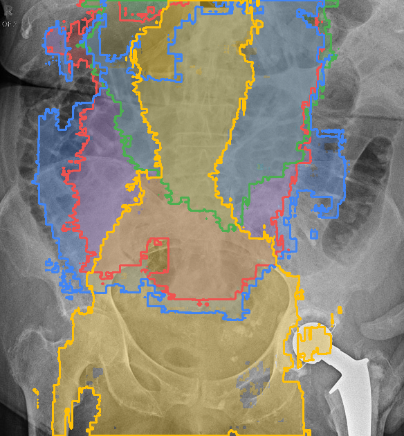 |

## 21. [Spalding sign](https://radiopaedia.org/cases/spalding-sign?lang=us) (`spalding-sign`)

| Original image | Medical-SAM2 | Medical-SAM3 | BiomedParse v1 | UltraSam / Medical-SAM3 boxes（补充，参考） | UltraSam / BiomedParse boxes（补充，参考） | SonoCLIP（补充，参考） |
|---|---|---|---|---|---|---|
|  |  |  |  | 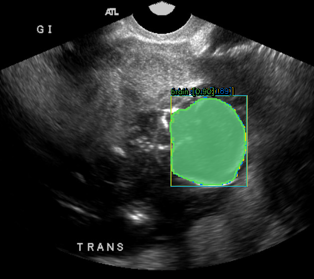 | 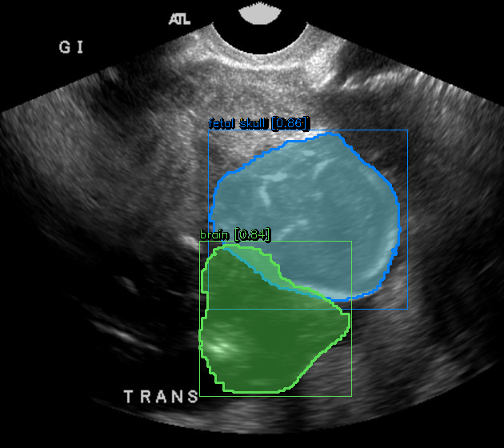 | 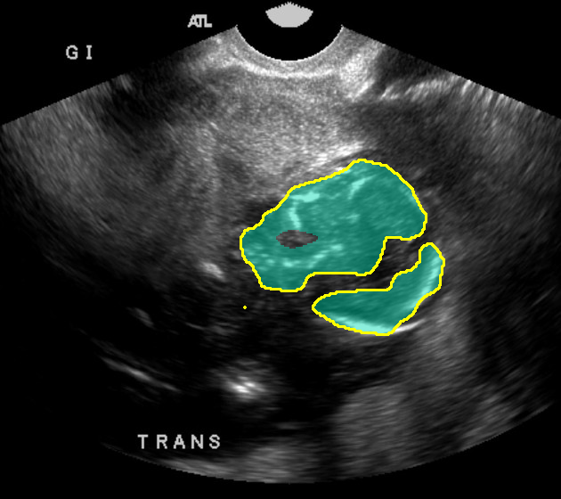 |

## 22. [Surgical ankylosis](https://radiopaedia.org/cases/surgical-ankylosis?lang=us) (`surgical-ankylosis`)

| Original image | Medical-SAM2 | Medical-SAM3 | BiomedParse v1 | FluoroSAM（补充，参考） |
|---|---|---|---|---|
|  |  |  |  | 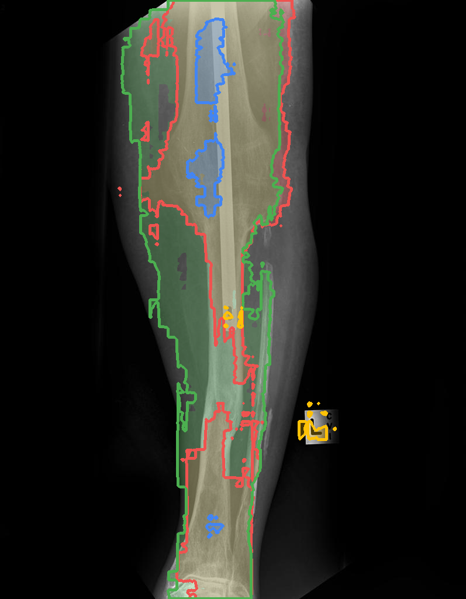 |

## 23. [Tension pneumoperitoneum](https://radiopaedia.org/cases/tension-pneumoperitoneum?lang=us) (`tension-pneumoperitoneum`)

| Original image | Medical-SAM2 | Medical-SAM3 | BiomedParse v1 | TorchXRayVision | FluoroSAM（补充，参考） |
|---|---|---|---|---|---|
|  |  |  |  |  | 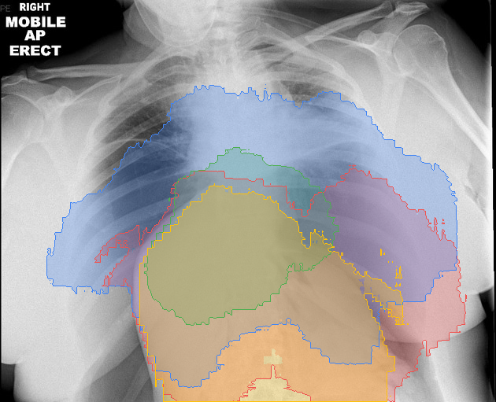 |
