# Radiopaedia Selected Multi-image Caption 对比

[返回主 README](README.md)

本文件整理 6 个多图病例在 single-modality（逐 study）和 multi-modality（全部 studies）输入下的原始图像与 Segmentation caption 输出。所有实验均为 `with_text=False`；Segmentation 组为 `with_seg=True, with_seg_text=True`。

> 本文件只汇总原始内容。所有“中文医学要点（翻译）”和“Segmentation 对 caption 的影响分析”均故意留空，等待人工检查。

## 1. [Aspergilloma](https://radiopaedia.org/cases/aspergilloma-1?lang=us) (`aspergilloma-1`)

- **背景信息：** Gender: Male
- **影像组合：** X-ray + CT；3 个 studies，4 张原图。

### 1.1 Study 0: X-ray

- **Medical-SAM3 prompts：** lung, right lung, lung cavity, intracavitary mass
- **BiomedParse v1 prompts：** lung, right lung, lung cavity, intracavitary mass
- **TorchXRayVision anatomy labels：** lung, right lung, left lung, diaphragm, heart, cardiomediastinum, upper mediastinum, lower mediastinum, stomach

| Image | Original image | Medical-SAM3 | BiomedParse v1 | TorchXRayVision |
|---|---|---|---|---|
| Image 1: Frontal |  |  |  | 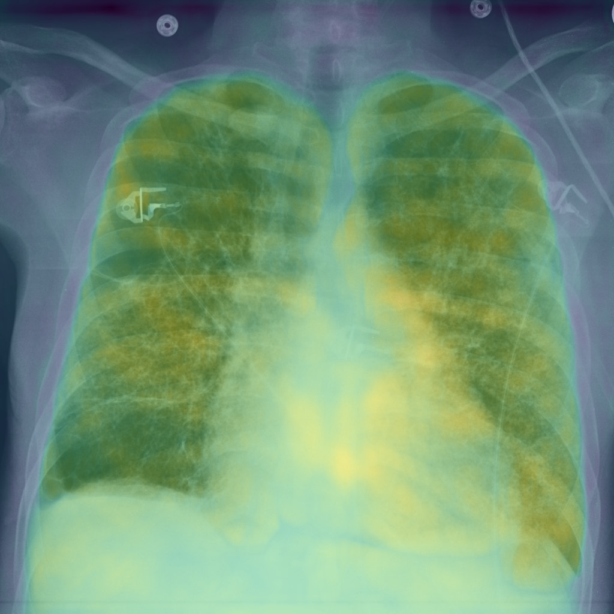 |

**Radiopaedia 原始图片 caption：**

<pre>Extensive bullous lung disease demonstrates a rounded opacity in the medial aspect of the right apex.</pre>

**原始图片 caption 中文医学要点（翻译）：**

<pre>

</pre>

#### Study 0 的 8 个模型 Single-modality caption 对比

<strong>InternVL3-14B</strong>

**原始图像 → Single-modality caption 回答**

英文原始回答：

<pre>This chest X-ray shows diffuse, bilateral opacities in the lungs, which could be indicative of a severe infection or inflammatory process. The presence of diffuse infiltrates, often described as a "whiteout," is characteristic of conditions like acute respiratory distress syndrome (ARDS) or severe viral pneumonia, such as that caused by COVID-19. Additionally, there are medical devices present, likely including central lines or tubes, suggesting the patient is critically ill and under intensive care.

Based on the image and the patient's background of having COVID-19, a probable diagnosis is severe COVID-19 pneumonia leading to ARDS. This diagnosis aligns with the imaging findings and clinical context. Close correlation with clinical findings and possibly further imaging or tests would be necessary to confirm the diagnosis and guide treatment.</pre>

中文医学要点（翻译）：

<pre>

</pre>

**原始图像 + Segmentation → Single-modality caption 回答**

英文原始回答：

<pre>The provided images depict a frontal chest X-ray and several segmented versions focused on different anatomical regions and pathological features. Here’s a detailed examination considering the segmented images for better understanding:

### Image Description:
1. **Original Chest X-ray:**
   - The X-ray shows a frontal view of the chest with both lungs and the heart visible.
   - There are notable differences in radiographic density between the two lungs.
   - The right lung (patient's left side) appears more radiopaque with diffuse, patchy opacities, suggesting reduced aeration.
   - The left lung (patient's right side) shows relative clarity but with some scattered haziness.
   - There is notable blunting of the right costophrenic angle.
   - A medical device, possibly a pacemaker or similar implant, is visible on the left side of the chest.

2. **Segmentation by Medical-SAM3:**
   - This image highlights different areas including the lungs, right lung, lung cavity, and intracavitary masses.
   - The right lung is segmented in purple, showing extensive involvement of the lung parenchyma, which aligns with the increased opacity seen in the chest X-ray.
   - The segmentation suggests significant consolidation or mass presence within the right lung.
   
   Analysis Observation: The extensive purple area indicates consolidation, aligning with the diffuse opacities noted earlier.

3. **Segmentation by BiomedParse:**
   - This image primarily outlines the lungs.
   - The lung fields are distinctly colored, highlighting differences in lung aeration.
   - The right lung again shows extensive opacification compared to the left.
   - This emphasizes the asymmetry noted in the original X-ray and supports findings of pathology in the right lung (patient's left side).

   Analysis Observation: This reaffirms poor aeration and consolidation on the right side.

4. **Combined Segmentation by TorchXRayVision:**
   - This segmentation provides a multi-colored representation highlighting the lungs, diaphragm, heart, mediastinum, and stomach.
   - The green-yellow areas indicate the lungs, with the right lung showing more dense regions corresponding to the consolidated opacities.
   - The mediastinum and heart silhouette remain central, though the right lung's pathology affects adjacent areas.

   Analysis Observation: Shows significant pathological changes predominantly on the right side with clear distinction of anatomical structures impacted.

### Diagnosis:
Based on the imaging and segmentation:

1. **Right-sided Lung Pathology:**
   - The diffuse opacities and increased radiodensity on the right lung are consistent with various conditions such as pneumonia, pulmonary consolidation, or malignancy.
   - Blunting of the costophrenic angle could indicate pleural effusion, which often accompanies these conditions.

2. **Potential Lung Consolidation and/or Infection:**
   - Considering the patient’s gender and the distribution and nature of the opacities, there is a strong possibility of pulmonary consolidation, which could be due to pneumonia.
   - The presence of a possible intracavitary mass as highlighted in segmentation images suggests the need for further investigation such as CT scan or biopsy to rule out malignancies like bronchogenic carcinoma or metastasis.

3. **Cardiac and Mediastinal Structures:**
   - The mediastinum and cardiac silhouette do not present extreme deviations, though the right-sided pathology may exert some minor effects.

### Conclusion:
Given the diffuse opacifications and consolidation pattern in the right lung, alongside the segmentation indicating extensive involvement and possible mass, the patient likely presents with a significant pulmonary condition such as severe pneumonia, pulmonary consolidation, or possible malignancy. A comprehensive assessment including additional imaging (e.g., CT thorax) and clinical correlation is recommended for a definitive diagnosis and appropriate management. Potential need for microbiological evaluations or histopathological investigations should also be considered based on clinical presentation and progression.</pre>

中文医学要点（翻译）：

<pre>

</pre>

**Segmentation 对 caption 的影响分析：**

<pre>

</pre>

<strong>InternVL3.5-14B</strong>

**原始图像 → Single-modality caption 回答**

英文原始回答：

<pre>&lt;think&gt;
The X-ray shows a frontal view of the chest. There is diffuse patchy opacification throughout both lung fields, which may suggest an infiltrative process. The heart size appears normal. The diaphragm and costophrenic angles are visible, with no obvious signs of pleural effusion. The trachea is midline, and the bony structures, including the ribs and clavicles, are intact. The presence of medical devices, such as a pacemaker, is noted. The findings are consistent with a viral pneumonia, likely due to COVID-19, given the patient's background information. The opacities are more pronounced in the lower lobes, which is typical for COVID-19 pneumonia. No pneumothorax or significant lymphadenopathy is observed.
&lt;/think&gt;

The X-ray image provided is a frontal chest radiograph of a male patient. The image reveals several key features that are consistent with a diagnosis of COVID-19 pneumonia. Here is a detailed description and diagnosis based on the image:

### Image Description:
1. **Lung Fields:**
   - **Diffuse Opacities:** The lung fields exhibit diffuse, patchy opacities bilaterally. These opacities are more pronounced in the lower lobes, which is characteristic of COVID-19 pneumonia.
   - **Ground-Glass Opacities:** There are areas of ground-glass opacities, which appear as hazy regions that do not obscure the underlying bronchial structures or pulmonary vessels.

2. **Heart and Mediastinum:**
   - The heart size appears normal, with no evidence of cardiomegaly.
   - The mediastinum is of normal width, and there is no significant lymphadenopathy.

3. **Diaphragm and Costophrenic Angles:**
   - The diaphragms are well-defined, and the costophrenic angles are sharp, indicating no pleural effusion.

4. **Trachea and Bony Structures:**
   - The trachea is midline, with no deviation.
   - The bony structures, including the ribs, clavicles, and spine, appear intact with no fractures or lesions.

5. **Medical Devices:**
   - A pacemaker is visible on the left side of the chest, with leads appropriately positioned.

### Diagnosis:
Based on the radiographic findings and the patient's background information, the most likely diagnosis is **COVID-19 pneumonia**. The diffuse, bilateral ground-glass opacities and patchy consolidations are typical imaging features associated with COVID-19 infection. These findings, combined with the clinical context, support the diagnosis of a viral pneumonia consistent with COVID-19.

### Additional Considerations:
- **Differential Diagnosis:** While COVID-19 is the most likely cause, other conditions such as bacterial pneumonia, acute respiratory distress syndrome (ARDS), or other viral pneumonias should be considered in the differential diagnosis.
- **Clinical Correlation:** It is essential to correlate these radiographic findings with the patient's clinical symptoms, such as fever, cough, shortness of breath, and laboratory results (e.g., RT-PCR test for SARS-CoV-2).

### Recommendations:
- **Further Testing:** Confirmatory testing for SARS-CoV-2 via RT-PCR should be performed.
- **Clinical Management:** Management should include supportive care, oxygen therapy if indicated, and consideration of antiviral or corticosteroid therapy based on clinical guidelines.
- **Follow-Up Imaging:** Serial chest X-rays or CT scans may be necessary to monitor the progression or resolution of the lung opacities.

In summary, the chest X-ray findings are highly suggestive of COVID-19 pneumonia, and appropriate clinical management should be initiated based on the patient's overall condition and confirmatory test results.</pre>

中文医学要点（翻译）：

<pre>

</pre>

**原始图像 + Segmentation → Single-modality caption 回答**

英文原始回答：

<pre>&lt;think&gt;
The provided X-ray image is a frontal chest radiograph of a male patient. The image shows several notable features:

1. **Lung Fields**: Both lungs exhibit diffuse opacities, which appear as areas of increased density. These opacities are more pronounced in the lower zones of both lungs and are bilaterally symmetrical. The opacities have a reticular pattern, suggesting interstitial involvement.

2. **Heart and Mediastinum**: The cardiac silhouette appears enlarged, which could indicate cardiomegaly. The mediastinum does not show any obvious widening.

3. **Diaphragm**: The diaphragmatic contours are visible, but there is some blurring, particularly on the left side, which could be due to adjacent lung pathology.

4. **Bones and Soft Tissues**: The bony thorax, including the ribs, clavicles, and spine, appears intact without any obvious fractures or lesions. The soft tissues around the thorax do not show any significant abnormalities.

5. **Medical Devices**: There are medical devices visible, including what appears to be a pacemaker lead on the right side and possibly a central venous catheter on the left side.

### Analysis and Diagnosis

The diffuse reticular opacities in the lungs suggest an interstitial lung disease. The possible causes include:

- **Pulmonary Fibrosis**: The reticular pattern is characteristic of fibrotic changes in the lung parenchyma.
- **Pulmonary Edema**: Although less likely given the pattern, it can present with bilateral opacities.
- **Infectious Processes**: Such as viral pneumonia, which can present with diffuse opacities.
- **Chronic Interstitial Inflammation**: Conditions like sarcoidosis or hypersensitivity pneumonitis.

The enlarged cardiac silhouette could be due to underlying cardiac disease, which might contribute to pulmonary congestion and edema. However, the reticular pattern is more suggestive of an interstitial process rather than pure pulmonary edema.

### Conclusion

Based on the X-ray findings, the most likely diagnosis is **interstitial lung disease**, possibly pulmonary fibrosis. Further evaluation with high-resolution CT (HRCT) of the chest, pulmonary function tests, and possibly a biopsy may be required to confirm the diagnosis and determine the underlying cause. Additionally, assessing the patient's clinical history, symptoms, and any relevant laboratory findings would be essential for a comprehensive evaluation.
&lt;/think&gt;

### Diagnosis

Based on the provided chest X-ray image and the described features, the most likely diagnosis is **interstitial lung disease (ILD)**, with a strong possibility of **pulmonary fibrosis**.

### Detailed Description

1. **Lung Fields**:
   - **Diffuse Opacities**: The presence of bilateral, diffuse reticular opacities suggests a chronic interstitial process. These opacities are more pronounced in the lower lung zones, which is characteristic of fibrotic changes.
   - **Reticular Pattern**: The reticular (net-like) pattern indicates thickening of the interstitial tissues, consistent with fibrosis.

2. **Heart and Mediastinum**:
   - **Cardiomegaly**: The enlarged cardiac silhouette may indicate underlying cardiac disease, which could contribute to pulmonary congestion. However, the primary lung findings are more suggestive of an interstitial lung process.

3. **Diaphragm**:
   - **Blurred Contours**: The blurring of the diaphragmatic contours, especially on the left side, may be due to adjacent lung pathology, such as fibrosis or infiltrates.

4. **Bones and Soft Tissues**:
   - **Intact Bony Thorax**: No fractures or lesions are noted in the ribs, clavicles, or spine.
   - **No Soft Tissue Abnormalities**: The soft tissues around the thorax appear normal.

5. **Medical Devices**:
   - **Pacemaker Lead**: Visible on the right side, indicating the patient may have a history of cardiac issues.
   - **Central Venous Catheter**: Possibly present on the left side, suggesting the patient may be receiving medical treatment or monitoring.

### Differential Diagnosis

- **Pulmonary Fibrosis**: The reticular pattern and chronic nature of the opacities are highly suggestive of fibrotic changes.
- **Pulmonary Edema**: Less likely due to the specific pattern, but underlying cardiac issues could contribute.
- **Infectious Processes**: Such as viral pneumonia, which can present with diffuse opacities.
- **Other Interstitial Inflammations**: Conditions like sarcoidosis or hypersensitivity pneumonitis.

### Recommended Further Evaluation

1. **High-Resolution CT (HRCT) of the Chest**: To better characterize the extent and nature of the interstitial changes.
2. **Pulmonary Function Tests (PFTs)**: To assess lung volumes and function, which are typically reduced in fibrosis.
3. **Clinical History and Symptoms**: Detailed patient history, including symptoms like chronic dry cough, dyspnea, and any exposure to potential fibrogenic agents.
4. **Laboratory Tests**: Including autoimmune panels if an autoimmune etiology is suspected.
5. **Biopsy**: In some cases, a lung biopsy may be necessary to confirm the diagnosis and determine the specific type of interstitial lung disease.

### Conclusion

The chest X-ray findings are consistent with interstitial lung disease, most likely pulmonary fibrosis. Further diagnostic workup is recommended to confirm the diagnosis and guide appropriate management. The presence of medical devices suggests the patient has underlying cardiac or other medical conditions that should be considered in the overall clinical context.</pre>

中文医学要点（翻译）：

<pre>

</pre>

**Segmentation 对 caption 的影响分析：**

<pre>

</pre>

<strong>Lingshu-32B</strong>

**原始图像 → Single-modality caption 回答**

英文原始回答：

<pre>The chest X-ray shows diffuse bilateral interstitial infiltrates, which are indicative of an interstitial lung disease or pulmonary edema. The presence of these infiltrates suggests that there is fluid accumulation in the interstitial spaces of the lungs. Given the patient's history of chronic cough, dyspnea, and recent weight gain, along with the clinical findings of crackles on auscultation, the most likely diagnosis is pulmonary edema secondary to congestive heart failure. This condition is characterized by the accumulation of fluid in the lung tissues due to increased pressure in the pulmonary circulation, often as a result of left-sided heart failure. The radiographic findings align with this diagnosis, showing the typical pattern of interstitial edema.</pre>

中文医学要点（翻译）：

<pre>

</pre>

**原始图像 + Segmentation → Single-modality caption 回答**

英文原始回答：

<pre>The chest X-ray shows diffuse bilateral interstitial infiltrates, which are more pronounced in the lower lung zones. The lung fields exhibit a reticular pattern, suggesting an interstitial process. There is no evidence of pleural effusion or pneumothorax. The cardiac silhouette appears normal in size. The presence of medical devices indicates the patient may be receiving ongoing treatment or monitoring. Given the diffuse nature of the infiltrates and the clinical context provided, the findings are consistent with COVID-19 pneumonia. This diagnosis is supported by the characteristic bilateral ground-glass opacities and interstitial thickening seen in the image.</pre>

中文医学要点（翻译）：

<pre>

</pre>

**Segmentation 对 caption 的影响分析：**

<pre>

</pre>

<strong>MedGemma-27B-IT</strong>

**原始图像 → Single-modality caption 回答**

英文原始回答：

<pre>The image is a frontal chest X-ray of a male patient. The lungs show diffuse, bilateral, patchy opacities, predominantly in the lower lobes, with some areas appearing more consolidated. There is also evidence of interstitial thickening, giving a "dirty lung" appearance. The heart size appears normal. The mediastinal silhouette is unremarkable. There are no pleural effusions or pneumothorax evident.

Based on the radiographic findings of diffuse bilateral patchy opacities, particularly in the lower lobes, with interstitial thickening, the most likely diagnosis is **Pneumocystis pneumonia (PCP)**, especially in a male patient. Other possibilities could include severe atypical pneumonia, diffuse viral pneumonia, or certain types of interstitial lung disease, but PCP is a classic presentation, particularly in immunocompromised individuals (though the patient's immune status is not specified).</pre>

中文医学要点（翻译）：

<pre>

</pre>

**原始图像 + Segmentation → Single-modality caption 回答**

英文原始回答：

<pre>**Image Description:**

The image is a frontal chest X-ray of a male patient. The lungs appear diffusely opacified, particularly in the right upper and mid zones, with a pattern suggestive of consolidation or extensive infiltrates. There is also evidence of volume loss in the right lung, indicated by the elevation of the right hemidiaphragm and shift of the mediastinum towards the right. The left lung also shows some opacities, though less pronounced than the right. The heart size appears normal. The mediastinal contours are somewhat obscured by the lung abnormalities.

**Segmentation Analysis:**

*   **Medical-SAM3:** This segmentation highlights the lungs (purple and orange), right lung (orange), lung cavity (white), and intracavitary mass (white). The segmentation shows a large cavity in the right upper lung with an apparent mass within it.
*   **BiomedParse:** This segmentation identifies the lungs (pink and brown), right lung (brown), lung cavity (white), and intracavitary mass (white). Similar to Medical-SAM3, it shows a large cavity in the right upper lung with an intracavitary mass.
*   **TorchXRayVision:** This segmentation provides a broader anatomical context, identifying the lungs (green), right lung (green), left lung (green), diaphragm (yellow), heart (yellow), cardiomediastinum (yellow), upper mediastinum (yellow), and lower mediastinum (yellow). It confirms the extensive lung involvement and the position of the heart and diaphragm.

**Diagnosis:**

Based on the X-ray findings and the segmentations, the most likely diagnosis is **pulmonary tuberculosis (TB)**, specifically **post-primary TB** or **reactivation TB**.

**Key Findings Supporting the Diagnosis:**

1.  **Cavitation:** The presence of a large cavity in the right upper lung is a hallmark feature of post-primary pulmonary TB.
2.  **Intracavitary Mass:** The mass within the cavity could represent caseous necrotic material or a tuberculoma.
3.  **Consolidation/Infiltrates:** The diffuse opacities in both lungs, more prominent on the right, suggest active infection or inflammation associated with TB.
4.  **Volume Loss:** The right lung volume loss (elevated right hemidiaphragm, mediastinal shift) is consistent with chronic fibrotic changes often seen in TB.

**Differential Diagnoses:**

While TB is the most likely diagnosis, other conditions could present with similar findings, including:

*   **Lung Abscess:** Bacterial lung abscesses can also cause cavitation, but they are often associated with a history of aspiration or pneumonia and may have air-fluid levels.
*   **Fungal Infections:** Certain fungal infections (e.g., aspergillosis, coccidioidomycosis) can cause cavitary lesions.
*   **Malignancy:** Lung cancer, particularly squamous cell carcinoma, can cavitate.
*   **Necrotizing Pneumonia:** Severe bacterial pneumonia can lead to necrosis and cavitation.

**Conclusion:**

The chest X-ray shows findings highly suggestive of pulmonary tuberculosis, characterized by a large cavitary lesion in the right upper lung with an intracavitary mass, associated consolidation, and volume loss. Further investigations, such as sputum smear microscopy, culture, and molecular tests for Mycobacterium tuberculosis, would be necessary to confirm the diagnosis.</pre>

中文医学要点（翻译）：

<pre>

</pre>

**Segmentation 对 caption 的影响分析：**

<pre>

</pre>

<strong>MedMO-8B</strong>

**原始图像 → Single-modality caption 回答**

英文原始回答：

<pre>A new large left pneumothorax.</pre>

中文医学要点（翻译）：

<pre>

</pre>

**原始图像 + Segmentation → Single-modality caption 回答**

英文原始回答：

<pre>The patient is a 58-year-old male with a history of smoking, and he has a history of tuberculosis.</pre>

中文医学要点（翻译）：

<pre>

</pre>

**Segmentation 对 caption 的影响分析：**

<pre>

</pre>

<strong>Qwen3-VL-4B</strong>

**原始图像 → Single-modality caption 回答**

英文原始回答：

<pre>The image is a frontal chest X-ray of a male patient. The radiograph shows diffuse, bilateral opacities that are predominantly peripherally located and appear to have a “ground-glass” appearance, with areas of consolidation and interstitial thickening. These findings are consistent with a widespread pulmonary infection or inflammatory process.

Notable features include:
- Bilateral, symmetric involvement of the lungs.
- Increased interstitial markings and areas of consolidation, especially in the lower lobes.
- Presence of medical devices: a pacemaker (left side) and a nasogastric tube (right side), indicating the patient may be critically ill or post-surgical.

Given the pattern of diffuse bilateral lung involvement with ground-glass opacities and consolidation, the most likely diagnosis is:

**Pneumonia — likely viral or bacterial in etiology, or possibly a superimposed infection in a patient with underlying conditions or immunosuppression.**

However, the specific etiology cannot be determined from this single image alone without clinical context (e.g., symptoms, labs, or other imaging). The presence of ground-glass opacities may also be seen in other conditions such as:

- COVID-19 pneumonia (especially if the patient has recent exposure or travel history).
- Interstitial lung disease (e.g., sarcoidosis, IPF).
- Pulmonary edema (e.g., from heart failure).
- Drug-induced pneumonitis.

In the absence of additional clinical information, the most common and likely diagnosis in a patient presenting with this radiographic pattern is **bacterial or viral pneumonia**. Further clinical correlation and laboratory testing (e.g., sputum culture, PCR for viral pathogens, or blood work) are needed to confirm the diagnosis.

**Important Note**: This is a radiological interpretation based on the image alone. Clinical correlation is essential for accurate diagnosis.</pre>

中文医学要点（翻译）：

<pre>

</pre>

**原始图像 + Segmentation → Single-modality caption 回答**

英文原始回答：

<pre>Based on the provided chest X-ray (frontal view) and segmentation masks, the following analysis and diagnosis can be made:

### Image Description
The image is a frontal chest X-ray of a male patient. The key findings visible in the image are:
- **Lung Opacities**: Both lungs show diffuse, bilateral, patchy opacities. These appear as areas of increased density (whiter areas) superimposed on the normal lung parenchyma.
- **Lung Cavities**: The segmentation masks (from Medical-SAM3 and BiomedParse) indicate the lungs are segmented, but the opacities suggest areas of consolidation or cavitation.
- **Intracavitary Mass**: The segmentation masks (from Medical-SAM3) specifically highlight the presence of an intracavitary mass in the right lung, which is consistent with a mass within a lung cavity.
- **Cardiomediastinum**: The central mediastinum appears widened, suggesting possible cardiomegaly or mediastinal widening.
- **Diaphragm**: The diaphragm is visible, and there is no clear evidence of elevation or abnormal contour.

### Diagnosis
The most likely diagnosis is **Pulmonary Tuberculosis (TB)**, particularly **chronic pulmonary TB** with **cavitation**.

#### Rationale:
1. **Bilateral, Diffuse Lung Opacities**: The widespread, patchy opacities are consistent with a chronic infectious process, such as TB, which often presents with bilateral involvement.
2. **Intracavitary Mass**: The presence of an intracavitary mass is a hallmark of TB, as the disease can lead to necrosis and cavitation in the lung parenchyma. This is a classic finding in TB.
3. **Mediastinal Widening**: The widened mediastinum may indicate mediastinal lymphadenopathy, which is common in TB.
4. **Patient Profile**: The patient is a male, which is a risk factor for TB, although TB can affect anyone.

### Additional Considerations
- **Other Causes**: Other conditions such as pneumonia, lung cancer, or fungal infections can also cause similar findings, but the combination of bilateral opacities and intracavitary mass is highly suggestive of TB.
- **Further Testing**: A definitive diagnosis would require clinical correlation, including sputum culture, chest CT, and possibly a biopsy.

### Conclusion
The chest X-ray shows signs consistent with **chronic pulmonary tuberculosis with cavitation**. The presence of bilateral opacities and an intracavitary mass strongly supports this diagnosis. Further clinical evaluation and diagnostic tests are recommended to confirm the diagnosis and initiate appropriate treatment.</pre>

中文医学要点（翻译）：

<pre>

</pre>

**Segmentation 对 caption 的影响分析：**

<pre>

</pre>

<strong>Qwen3-VL-8B</strong>

**原始图像 → Single-modality caption 回答**

英文原始回答：

<pre>Based on the provided X-ray image and patient data (male, frontal chest X-ray), here is the description and diagnosis:

**Image Description:**
This is a frontal chest X-ray of a male patient. The image reveals significant bilateral pulmonary infiltrates, which appear as diffuse, patchy opacities throughout both lung fields. These opacities are more prominent in the lower lobes and perihilar regions. The heart size appears normal, and the diaphragm is visible but somewhat obscured by the infiltrates. There is no clear evidence of pleural effusion or pneumothorax. The bony thorax, including ribs and clavicles, appears intact without fractures. The patient has a central venous catheter in place, and a pacemaker or defibrillator device is visible in the left upper chest (likely a left-sided implantable cardioverter-defibrillator, ICD).

**Diagnosis:**
The most likely diagnosis is **Pneumonia** or **ARDS (Acute Respiratory Distress Syndrome)**, particularly **bilateral diffuse pneumonia** or **ARDS**, given the extensive bilateral infiltrates. The pattern is consistent with a viral or bacterial pneumonia, or possibly a post-infectious or inflammatory process.

**Additional Considerations:**
- The presence of a pacemaker/ICD suggests the patient may have a history of cardiac arrhythmia or heart disease, which could be a comorbid condition contributing to or complicating the current respiratory illness.
- The diffuse, bilateral nature of the infiltrates makes it less likely to be a localized infection or a simple consolidation.
- The patient’s clinical history and other diagnostic tests (e.g., blood work, sputum culture, PCR for viral pathogens) would be needed to confirm the specific etiology (e.g., bacterial, viral, fungal).

**Conclusion:**
The X-ray shows bilateral diffuse pulmonary infiltrates consistent with pneumonia or ARDS. Further clinical correlation and diagnostic testing are necessary to determine the exact cause and guide treatment.

*Note: This is a clinical interpretation based on the image and provided data. A definitive diagnosis requires a comprehensive clinical evaluation.*</pre>

中文医学要点（翻译）：

<pre>

</pre>

**原始图像 + Segmentation → Single-modality caption 回答**

英文原始回答：

<pre>Based on the provided X-ray image and segmentation overlays, here is a detailed description and diagnosis:

**Image Description:**

This is a frontal chest X-ray of a male patient. The image shows significant bilateral lung opacities, which appear as diffuse, patchy, and hazy areas of increased density throughout both lungs. These opacities are most prominent in the lower lung zones and are consistent with consolidation or ground-glass opacities. The heart silhouette is visible but partially obscured by the surrounding lung infiltrates. There is no clear evidence of pleural effusion or pneumothorax. The bony thorax, including ribs and spine, appears intact. Medical devices are visible: a pacemaker or defibrillator generator is present on the left side of the chest (left side of the image), and a central venous catheter (likely a PICC line or central line) is visible extending from the right side of the chest.

**Segmentation Analysis:**

- **Medical-SAM3 Segmentation:** This model segments the lung fields (purple on the left, tan on the right) and identifies an "intracavitary mass" within the left lung. The mass appears as a localized area of increased density within the lung field, which could represent a tumor or abscess. However, the overall lung fields are also filled with diffuse opacities, suggesting a more widespread process than just a single mass.
- **BiomedParse Segmentation:** This model segments the lung fields (both tan) and does not appear to identify a specific intracavitary mass, instead focusing on the overall lung parenchyma. This suggests the model may be more focused on the overall lung structure rather than specific pathological lesions.
- **TorchXRayVision Combined Segmentation:** This model provides a more comprehensive segmentation, including the lungs, diaphragm, heart, and mediastinum. The segmentation highlights the diffuse nature of the opacities, which are present throughout the lung fields, and also shows the heart and mediastinum, which are partially obscured by the infiltrates.

**Diagnosis:**

The most likely diagnosis based on the imaging findings is **Pneumonia** or **COVID-19 Pneumonia**. The diffuse bilateral lung opacities are characteristic of viral pneumonia, particularly COVID-19, which often presents with ground-glass opacities and consolidation. The absence of pleural effusion or pneumothorax supports this diagnosis. The presence of a pacemaker and central line suggests the patient may be in a hospital setting, which is consistent with the presentation of pneumonia in a hospitalized patient.

**Additional Considerations:**

- The patient's gender (male) and the presence of medical devices (pacemaker and central line) suggest he may have underlying medical conditions or be in a high-risk group for pneumonia.
- The diffuse nature of the opacities suggests a systemic infection rather than a localized process.
- Further clinical information, such as symptoms (fever, cough, shortness of breath), laboratory results, and possibly a CT scan, would be needed to confirm the diagnosis and rule out other causes of bilateral lung opacities, such as pulmonary edema, sarcoidosis, or lung cancer.

In summary, the chest X-ray shows diffuse bilateral lung opacities consistent with pneumonia, most likely viral pneumonia (such as COVID-19). The patient's medical history and the presence of medical devices suggest he may be in a hospital setting, which is consistent with the presentation of pneumonia in a hospitalized patient. Further clinical evaluation and testing are needed to confirm the diagnosis and guide treatment.</pre>

中文医学要点（翻译）：

<pre>

</pre>

**Segmentation 对 caption 的影响分析：**

<pre>

</pre>

<strong>Qwen3-VL-32B</strong>

**原始图像 → Single-modality caption 回答**

英文原始回答：

<pre>The provided image is a frontal (posteroanterior) chest X-ray of a male patient. The radiograph reveals several notable findings:

**1. Cardiac Silhouette:**
- The heart appears enlarged, with increased cardiothoracic ratio. The cardiac borders are prominent, particularly the left cardiac border, suggesting possible left ventricular enlargement.

**2. Pulmonary Vascularity:**
- There is evidence of increased pulmonary vascular markings, especially in the upper lung zones. This is suggestive of pulmonary hypertension or chronic lung disease with secondary pulmonary arterial changes.

**3. Lung Fields:**
- The lung fields show diffuse reticular opacities, most prominent in the upper lobes, with possible honeycombing in the apical regions. This pattern is characteristic of interstitial lung disease (ILD).
- There is also evidence of volume loss in the upper lobes, which may be associated with fibrosis.

**4. Mediastinum and Hilar Regions:**
- The hilar regions appear prominent, which may be due to lymphadenopathy or vascular enlargement secondary to pulmonary hypertension.

**5. Pleural Changes:**
- There is no evident pleural effusion. However, subtle pleural thickening may be present, particularly in the upper zones.

**6. Medical Devices:**
- There are metallic implants visible in the right upper chest, likely from prior surgical intervention (e.g., pacemaker or defibrillator leads).
- A thin radiopaque line is visible along the right side of the chest, possibly a central venous catheter or pacing wire.

**7. Bony Structures:**
- The bony thorax appears intact without fractures or lytic lesions.

---

**Clinical Impression:**
The radiographic findings are most consistent with **advanced interstitial lung disease**, likely **idiopathic pulmonary fibrosis (IPF)** or another form of **fibrotic interstitial pneumonia**, given the upper lobe predominance, reticular pattern, honeycombing, and volume loss. The associated cardiomegaly and pulmonary vascular changes suggest the development of **pulmonary hypertension** as a complication.

**Differential Diagnosis:**
- Idiopathic Pulmonary Fibrosis (IPF)
- Hypersensitivity Pneumonitis (chronic form)
- Sarcoidosis (though typically with bilateral hilar lymphadenopathy, which is less prominent here)
- Asbestosis (if occupational history supports)
- Chronic hypersensitivity pneumonitis or other connective tissue disease-related ILD

**Recommendation:**
- Correlation with clinical history (e.g., smoking, occupational exposure, symptoms of dyspnea, cough, and progressive respiratory decline).
- High-resolution CT (HRCT) of the chest for definitive characterization of the interstitial pattern.
- Pulmonary function testing (PFTs) to assess for restrictive pattern and reduced diffusion capacity.
- Echocardiogram to evaluate for pulmonary hypertension.
- Consider referral to a pulmonologist for further evaluation and management.

---

**Diagnosis:**
**Advanced interstitial lung disease with features suggestive of idiopathic pulmonary fibrosis, complicated by pulmonary hypertension and cardiomegaly.**

This patient requires urgent pulmonary evaluation and multidisciplinary management.</pre>

中文医学要点（翻译）：

<pre>

</pre>

**原始图像 + Segmentation → Single-modality caption 回答**

英文原始回答：

<pre>Based on the provided frontal chest X-ray and segmentation overlays, here is a detailed analysis and diagnosis:

---

### **Image Description:**

This is a frontal (posteroanterior) chest X-ray of a male patient. The image shows:

- **Bilateral lung fields** with increased reticular (net-like) opacities, particularly in the **middle and lower zones**. These appear as fine linear and web-like markings, suggesting interstitial thickening.
- **Prominent hilar structures** and possible mild perihilar “bat-wing” or “butterfly” opacities, which may indicate central interstitial or alveolar involvement.
- **Cardiomediastinal silhouette** appears **enlarged** (cardiomegaly), with a widened mediastinum.
- **Diaphragms** are visible but somewhat obscured by increased lung markings, especially on the left.
- **Bony thorax** appears intact, with no obvious fractures.
- **Medical devices**: A **pacemaker or ICD generator** is visible in the **right upper chest** (typical placement), with leads extending into the heart. There is also a **central venous catheter** or line visible on the right side, extending toward the superior vena cava.
- **Segmentation overlays**:
  - **Medical-SAM3**: Segments lungs with distinct right (purple) and left (tan) lung fields. It appears to include the lung parenchyma but may not fully capture the mediastinum or diaphragm.
  - **BiomedParse**: Provides a more conservative lung segmentation, excluding areas with dense opacities (e.g., central mediastinum), suggesting it may be filtering out non-pulmonary structures.
  - **TorchXRayVision**: Provides a multi-organ segmentation with color-coded regions. The lungs are highlighted in green/yellow, with the heart and mediastinum in yellow, and diaphragms/stomach in green. The overlay suggests **diffuse lung disease** with central involvement.

---

### **Clinical Interpretation:**

The radiographic findings are highly suggestive of **diffuse interstitial lung disease (ILD)**, with features consistent with:

- **Idiopathic Pulmonary Fibrosis (IPF)**: Classic reticular pattern, lower lobe predominance, and possible honeycombing (though not clearly visible on this X-ray). However, the central/perihilar opacities may suggest an alternative diagnosis.
- **Hypersensitivity Pneumonitis**: Can present with a reticular pattern and perihilar involvement, especially in chronic forms.
- **Chronic Interstitial Pneumonia or Connective Tissue Disease-Associated ILD**: Especially if the patient has a known autoimmune condition (e.g., rheumatoid arthritis, scleroderma).
- **Cardiogenic Pulmonary Edema**: The central opacities and cardiomegaly raise concern for heart failure. However, the **reticular pattern** is more typical of interstitial disease than alveolar edema, which would show more **ground-glass opacities** and **Kerley B lines**.
- **Pulmonary Lymphangioleiomyomatosis (LAM)** or **Lymphangitic Carcinomatosis**: Less likely without a known history of malignancy or tuberous sclerosis, but could be considered.

---

### **Diagnosis:**

**Most Likely Diagnosis:**
&gt; **Diffuse Interstitial Lung Disease (ILD) – likely idiopathic pulmonary fibrosis or connective tissue disease-associated ILD**

**Alternative Diagnosis:**
&gt; **Heart failure with superimposed interstitial fibrosis** (if patient has known cardiac disease)

---

### **Recommendations:**

1. **High-Resolution CT (HRCT) of the chest** is essential to confirm the diagnosis and characterize the pattern (e.g., honeycombing, traction bronchiectasis, ground-glass opacities).
2. **Pulmonary function tests (PFTs)** to assess for restrictive pattern (typical of ILD).
3. **Cardiac evaluation** (echocardiogram) to assess for cardiomegaly and systolic/diastolic dysfunction.
4. **Review of medical history**: Smoking, occupational exposures, autoimmune diseases, medication history (e.g., amiodarone, methotrexate).
5. **Consider biopsy** if diagnosis remains unclear after imaging and clinical workup.

---

### **Conclusion:**

The chest X-ray demonstrates **bilateral reticular opacities** with **cardiomegaly**, consistent with **diffuse interstitial lung disease**. The presence of a pacemaker/ICD suggests a history of cardiac disease, which may be contributing to or coexisting with the pulmonary findings. A definitive diagnosis requires further imaging and clinical correlation.

---

**Note**: The segmentation tools (Medical-SAM3, BiomedParse, TorchXRayVision) provide useful anatomical outlines but do not replace clinical interpretation. Their outputs are consistent with the radiographic findings and support the presence of bilateral lung involvement with central and peripheral abnormalities.</pre>

中文医学要点（翻译）：

<pre>

</pre>

**Segmentation 对 caption 的影响分析：**

<pre>

</pre>

### 1.2 Study 1: X-ray

- **Medical-SAM3 prompts：** lung, right lung, lung cavity, intracavitary mass
- **BiomedParse v1 prompts：** lung, right lung, lung cavity, intracavitary mass
- **TorchXRayVision anatomy labels：** lung, right lung, left lung, diaphragm, heart, cardiomediastinum, upper mediastinum, lower mediastinum, stomach

| Image | Original image | Medical-SAM3 | BiomedParse v1 | TorchXRayVision |
|---|---|---|---|---|
| Image 1: missing |  | 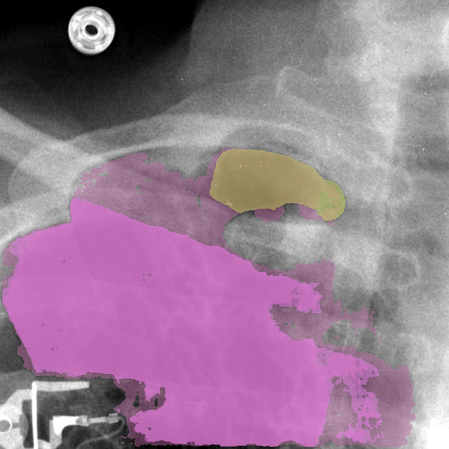 | 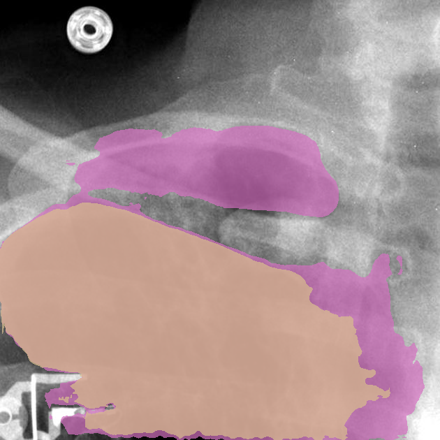 |  |

**Radiopaedia 原始图片 caption：**

<pre>Zoomed image of the right apex demonstrating the rounded opacity.</pre>

**原始图片 caption 中文医学要点（翻译）：**

<pre>

</pre>

#### Study 1 的 8 个模型 Single-modality caption 对比

<strong>InternVL3-14B</strong>

**原始图像 → Single-modality caption 回答**

英文原始回答：

<pre>I'm unable to diagnose medical conditions or review patient data from images. However, I can provide some general information about chest X-rays and common conditions that might be indicated by such images.

### General Observations:
1. **Position and Orientation**: The X-ray appears to be taken in a front-facing view of the chest.
2. **Foreign Objects**: There appears to be a round, dense object in the upper left part of the image, which could be an orthopedic device or a foreign body.
3. **Medical Devices**: There is a medical device at the bottom of the image, which might be related to cardiac monitoring or another medical intervention.
4. **Lung Fields**: The lung fields should generally look clear and symmetric. Any abnormal opacities or consolidations might indicate pathology.
5. **Trachea and Mediastinum**: The trachea should be central, and any deviation could indicate underlying structural issues.
6. **Heart Size and Shape**: The cardiac silhouette should be evaluated for size and borders.

### Common Conditions:
1. **Pneumonia**: Areas of increased opacity or consolidation might suggest pneumonia.
2. **Pleural Effusion**: An opaque area near the chest wall might indicate fluid accumulation.
3. **Cardiomegaly**: An enlarged heart shadow can be observed.
4. **Atelectasis**: Collapsed lung segments might appear more opaque.
5. **Pulmonary Edema**: Can present with bilateral opacities.
6. **Fractures**: Any breaks in the bones need to be noted.
7. **Foreign Body**: An identified object may need further evaluation.

### Additional Considerations:
- **Medical History**: A detailed medical history is crucial, including past surgeries, current medications, and symptoms like cough, fever, or difficulty breathing.
- **Clinical Correlation**: A careful clinical examination in conjunction with the radiological findings is essential for accurate diagnosis.
- **Follow-up Imaging**: Depending on initial findings, further imaging modalities like a CT scan might be suggested.

### Conclusion
For a precise diagnosis, a radiologist or a qualified physician would need to review the X-ray in context with the patient's full clinical history and symptoms. They can provide a detailed report and recommend further diagnostic steps if necessary. If you have specific concerns or symptoms, consulting a healthcare provider is advised.</pre>

中文医学要点（翻译）：

<pre>

</pre>

**原始图像 + Segmentation → Single-modality caption 回答**

英文原始回答：

<pre>Based on the provided X-ray images and the segmentations, here's an analysis:

1. **Image Analysis:**
   - **X-ray Overview:** The image is a standard chest X-ray showing thoracic structures including the lungs, heart, rib cage, and parts of the diaphragm. There is visible hardware, possibly related to a surgical intervention such as a pacemaker.
   - **Segmentations:**
     - **Medical-SAM3 Segmentation:** This marks the right lung, an intracavitary mass, lung cavity, and the lung itself. The segmentations show an area in the right lung with a possible mass or abnormality within the lung cavity.
     - **BiomedParse Segmentation:** This also highlights the right lung and an intracavitary mass, suggesting similar findings to Medical-SAM3 but with possibly different delineation of the mass.
     - **TorchXRayVision Segmentation:** This provides a broader view including lungs, diaphragm, heart, and mediastinum, which helps in assessing the anatomical context.

2. **Diagnosis:**
   - The presence of a noted mass or lesion in the right lung is suggestive of a possible intracavitary process. This could include conditions such as a tumor, either benign or malignant.
   - Further diagnostic work-up, such as a CT scan or biopsy, may be necessary to further characterize the mass.
   - The hardware noted in the image suggests a history of cardiac interventions (possibly a pacemaker), which should be taken into account, as abnormalities can sometimes be related to these devices but are generally not the primary concern here.

3. **Recommendations:**
   - Consultation with a pulmonologist for further evaluation of the lung mass.
   - Consideration of laboratory tests and imaging follow-up (e.g., CT scan) to better characterize the mass.
   - Review of cardiac device function to ensure it’s not related to the current findings.

This analysis is preliminary and should be correlated with clinical findings and history for a definitive diagnosis.</pre>

中文医学要点（翻译）：

<pre>

</pre>

**Segmentation 对 caption 的影响分析：**

<pre>

</pre>

<strong>InternVL3.5-14B</strong>

**原始图像 → Single-modality caption 回答**

英文原始回答：

<pre>&lt;think&gt;
Okay, let's see. The patient is a male, and the image is an X-ray. The first thing I notice is that the X-ray is of the chest area, probably a frontal view. The image shows the ribs, spine, and parts of the shoulders. The heart and diaphragm might be visible too, but maybe they're not entirely clear here.

Looking at the lung fields, there's some increased opacity. The right lung (which is on the left side of the image because X-rays are mirrored) seems to have a hazy, patchy appearance. The left lung (right side of the image) might be clearer but I need to check. The trachea is midline, so no obvious shift. The diaphragm appears normal in contour, no elevation. 

There's a medical device visible on the lower left side of the image. It looks like a pacemaker or some kind of implantable device with leads. The bones, including ribs and clavicles, don't show any obvious fractures or lesions. The spine is visible but maybe not in full detail here.

The increased opacity in the right lung could indicate something like pneumonia, which often presents with localized consolidation. Alternatively, it could be pulmonary edema, but that usually has a more diffuse pattern. The patchy areas might also suggest interstitial lung disease, but that's more chronic. Given the acute presentation, maybe pneumonia is more likely. However, without more clinical info like symptoms (cough, fever) or lab results, it's hard to be certain.

Wait, the image is labeled as Image 1, so maybe there's another image? The user only provided one. The metadata says modality is X-ray. The patient's gender is male, but that's not directly relevant unless considering certain conditions more common in males. 

Another possibility is a mass or tumor, but that's usually more defined. The hazy areas might be due to infection, inflammation, or maybe even aspiration. The presence of a pacemaker suggests the patient might have a history of cardiac issues, which could relate to pulmonary problems, like heart failure leading to pulmonary edema. But again, the pattern here isn't classic for edema.

I should also consider the technique. If the X-ray was taken with poor inspiration, the lungs might look more opaque. But the diaphragm seems okay. Maybe the patient had difficulty breathing, leading to a shallow breath. 

In summary, the key findings are right lung opacity and a pacemaker. The most probable diagnosis is pneumonia, especially if the patient has symptoms. Alternatively, atelectasis or a pulmonary contusion if there was trauma. But without more context, pneumonia is a common cause of lobar or segmental consolidation.
&lt;/think&gt;

**Image Description:**  
The provided chest X-ray (frontal view) demonstrates the thoracic structures, including the ribs, clavicles, and spine. The right hemithorax (left side of the image) shows increased opacity with a hazy, patchy pattern, suggestive of consolidation. The left lung (right side of the image) appears relatively clearer. A medical device, likely a pacemaker with leads, is visible in the lower left thoracic region. The trachea is midline, and the diaphragm contours are normal. No obvious fractures or skeletal abnormalities are noted.

**Diagnosis:**  
The findings are most consistent with **right lower lobe pneumonia**. The patchy opacity indicates localized consolidation, a hallmark of bacterial or viral pneumonia. The presence of a pacemaker suggests a history of cardiac disease, which may predispose the patient to complications like aspiration pneumonia or atypical infections.  

**Differential Considerations:**  
1. **Pulmonary edema**: Less likely due to the localized rather than diffuse pattern.  
2. **Atelectasis**: Could mimic consolidation but typically associated with volume loss (e.g., elevated diaphragm, shifted fissures).  
3. **Pulmonary contusion/mass**: Requires correlation with trauma history or further imaging (CT).  

**Recommendations:**  
- Correlate with clinical symptoms (fever, cough, dyspnea) and lab results (leukocytosis, CRP).  
- Consider sputum cultures or blood tests to identify the causative organism.  
- Follow-up imaging (e.g., CT) if symptoms persist or to rule out complications.  

This assessment assumes an acute presentation; further history and testing are essential for confirmation.</pre>

中文医学要点（翻译）：

<pre>

</pre>

**原始图像 + Segmentation → Single-modality caption 回答**

英文原始回答：

<pre>&lt;think&gt;
Okay, let's start by looking at the X-ray image provided. The patient is male, so the anatomy should be typical of a male chest X-ray. The image shows the thoracic cavity, including the lungs, heart, and diaphragm. 

First, I'll check for any obvious abnormalities. The right lung (which is on the left side of the image because X-rays are mirrored) seems to have some irregular opacities. The segmentation from Medical-SAM3 highlights the right lung in purple and a cavity with an intracavitary mass in gold. The BiomedParse segmentation also shows a large area in the right lung, possibly indicating a cavity or mass. The combined segmentation from TorchXRayVision uses different colors for various structures, but the right lung area (purple) and left lung (green) are visible.

The presence of a cavity with an intracavitary mass could suggest a chronic infection like tuberculosis, where cavities form due to tissue destruction. Alternatively, a malignancy such as lung cancer could present with a mass and possible cavitation, especially if it's a squamous cell carcinoma. The location in the right lung is important; TB often affects the upper lobes, which might be the case here.

The patient's background isn't detailed, but considering the segmentation results, the key findings are the right lung cavity and mass. If the patient has symptoms like chronic cough, weight loss, or hemoptysis, that would support TB. If there's a history of smoking or exposure to carcinogens, lung cancer might be more likely. However, without clinical history, it's hard to say. 

Other possibilities include fungal infections or necrotizing pneumonia, but those are less common. The diaphragm and heart appear normal in the TorchXRayVision segmentation, so no signs of pleural effusion or cardiomegaly. 

In conclusion, the most likely diagnoses are pulmonary tuberculosis with cavity formation or a lung cancer with cavitation. Further tests like a CT scan, sputum analysis, or biopsy would be needed for confirmation.
&lt;/think&gt;

**Diagnosis and Image Description:**

The chest X-ray reveals significant findings in the right lung, highlighted by segmentation analyses. Key observations include:

1. **Right Lung Abnormalities**: 
   - **Cavity with Intracavitary Mass**: Both Medical-SAM3 (gold) and BiomedParse (purple/brown) segmentations identify a cavity in the right upper lobe, containing a mass. This suggests tissue destruction and possible necrosis.
   - **Parenchymal Involvement**: Extensive opacities in the right lung (purple in BiomedParse) indicate consolidation or fibrosis, consistent with chronic infection or malignancy.

2. **Differential Diagnoses**:
   - **Tuberculosis (TB)**: Cavitary lesions in the upper lobe, coupled with intracavitary masses, are classic for reactivation TB. Associated symptoms (e.g., chronic cough, fever, weight loss) would support this.
   - **Lung Cancer**: Squamous cell carcinoma often presents with cavitation and central masses. A history of smoking or exposure increases suspicion.
   - **Necrotizing Pneumonia/Fungal Infection**: Less likely without systemic symptoms or immunocompromise.

3. **Structural Context**:
   - The left lung (green in TorchXRayVision) and mediastinal structures (heart, diaphragm) appear unremarkable, ruling out pleural effusion or cardiac enlargement.

**Recommendations**:
- **CT Scan**: To better characterize the cavity, mass, and surrounding tissue.
- **Microbiological Testing**: Sputum cultures/AFB smear for TB; biopsy if malignancy is suspected.
- **Clinical Correlation**: History of TB exposure, smoking, or immunosuppression is critical.

**Conclusion**: The radiographic findings strongly suggest a cavitary lesion in the right upper lobe, with **pulmonary tuberculosis** or **lung cancer** as primary considerations. Further diagnostic workup is essential.</pre>

中文医学要点（翻译）：

<pre>

</pre>

**Segmentation 对 caption 的影响分析：**

<pre>

</pre>

<strong>Lingshu-32B</strong>

**原始图像 → Single-modality caption 回答**

英文原始回答：

<pre>The X-ray image shows a significant abnormality in the thoracic region. There is a large, well-defined mass located in the left hemithorax, which appears to be compressing the surrounding lung tissue. The mass has a heterogeneous appearance with areas of varying radiopacity, suggesting it may contain different types of tissues or materials. The trachea is deviated towards the right side, indicating that the mass is exerting pressure on the mediastinum. Given the patient's history of a previous tumor resection and the current presentation, this mass could represent a recurrence of the primary tumor or a metastatic lesion. Further diagnostic workup, including CT imaging and possibly a biopsy, would be necessary to confirm the nature of this mass and plan appropriate treatment.</pre>

中文医学要点（翻译）：

<pre>

</pre>

**原始图像 + Segmentation → Single-modality caption 回答**

英文原始回答：

<pre>The provided images show an X-ray of the chest with various segmentations highlighting different anatomical structures and potential abnormalities. The first image is a standard X-ray showing the thoracic region. The second image, segmented by Medical-SAM3, identifies the lung (pink), right lung, lung cavity, and an intracavitary mass (green). The third image, segmented by BiomedParse, also highlights the lung (pink) and an intracavitary mass (brown). The fourth image, segmented by TorchXRayVision, shows multiple regions including the lungs, diaphragm, heart, and other mediastinal structures in different colors.

The presence of an intracavitary mass within the lung cavity suggests a possible pathological condition such as a tumor or abscess. Given the patient's history of a 2-month-old male with a congenital diaphragmatic hernia (CDH) who underwent surgical repair at birth, the findings could indicate complications related to the previous surgery or a new pathology. The mass may represent a post-surgical complication, such as a residual hernia, or it could be a primary lung lesion. Further clinical correlation and possibly additional imaging or biopsy would be necessary to determine the exact nature of the mass and to formulate a definitive diagnosis.</pre>

中文医学要点（翻译）：

<pre>

</pre>

**Segmentation 对 caption 的影响分析：**

<pre>

</pre>

<strong>MedGemma-27B-IT</strong>

**原始图像 → Single-modality caption 回答**

英文原始回答：

<pre>The image is a chest X-ray. It shows the ribs, clavicles, and parts of the lungs and mediastinum. The lung fields appear relatively clear, although the lower portions are partially obscured by the ribs and soft tissues. The mediastinum appears within normal limits in terms of width. The bony structures appear intact.

Without specific clinical information or comparison to previous images, a definitive diagnosis is difficult. However, based solely on the provided X-ray, there are no obvious signs of acute pathology like pneumonia, pneumothorax, or large effusions. The image quality is somewhat limited by the patient's body habitus and positioning.

**Disclaimer:** This is a preliminary interpretation based solely on the provided image and limited patient information. A definitive diagnosis requires a full clinical context and potentially further imaging.</pre>

中文医学要点（翻译）：

<pre>

</pre>

**原始图像 + Segmentation → Single-modality caption 回答**

英文原始回答：

<pre>The provided image is a chest X-ray of a male patient. The image shows the right lung, which appears to be partially collapsed or consolidated, indicated by the opacity and volume loss in the right hemithorax. There is a large, well-defined cavity within the right upper lobe, containing an intracavitary mass. The left lung appears relatively clear. The mediastinum is shifted towards the right side, further suggesting volume loss in the right lung.

Based on the presence of a large cavitary lesion with an intracavitary mass in the right upper lobe, the most likely diagnosis is **lung cancer**, specifically a cavitating squamous cell carcinoma or adenocarcinoma. Other possibilities include tuberculosis (especially if the patient has risk factors), fungal infection, or bacterial abscess, but the presence of an intracavitary mass makes malignancy a strong consideration.

The segmentations provided highlight the lung fields, the right lung, the lung cavity, and the intracavitary mass, confirming the key features observed in the X-ray. The TorchXRayVision segmentation also shows the diaphragm, heart, and mediastinum, which helps contextualize the location and extent of the abnormality within the chest.</pre>

中文医学要点（翻译）：

<pre>

</pre>

**Segmentation 对 caption 的影响分析：**

<pre>

</pre>

<strong>MedMO-8B</strong>

**原始图像 → Single-modality caption 回答**

英文原始回答：

<pre>There is a large pleural effusion on the right side. There is also a small effusion on the left side. The findings are compatible with exudative effusion.</pre>

中文医学要点（翻译）：

<pre>

</pre>

**原始图像 + Segmentation → Single-modality caption 回答**

英文原始回答：

<pre>Chest radiography shows a large right upper lobe mass.</pre>

中文医学要点（翻译）：

<pre>

</pre>

**Segmentation 对 caption 的影响分析：**

<pre>

</pre>

<strong>Qwen3-VL-4B</strong>

**原始图像 → Single-modality caption 回答**

英文原始回答：

<pre>The image is a chest X-ray of a male patient, showing a posterior-anterior (PA) view. The radiograph reveals several key findings:

1.  **Cardiac Enlargement:** The cardiac silhouette is significantly enlarged, extending laterally beyond the normal borders, suggesting an enlarged heart (cardiomegaly). The heart appears to occupy a large portion of the thoracic cavity.
2.  **Pulmonary Vascular Changes:** There is evidence of increased pulmonary vascular markings, which can be associated with left ventricular hypertrophy or chronic pulmonary hypertension.
3.  **Lung Fields:** The lung fields appear relatively clear, with no obvious acute infiltrates or consolidation. However, the increased vascular markings may suggest chronic changes or compensatory mechanisms.
4.  **Diaphragm and Costophrenic Angles:** The diaphragm appears slightly elevated, and the costophrenic angles are sharp, indicating no significant pleural effusion or pneumothorax.
5.  **Other Findings:** There is a metallic object (possibly a surgical staple or clip) visible in the upper left quadrant, which may indicate prior surgical intervention or a foreign body. The image also shows a radiopaque ring near the top of the image, which could be a dental or other metallic artifact.

**Diagnosis:**

Based on the findings, the most likely diagnosis is **Congestive Heart Failure (CHF)** or **Left Ventricular Hypertrophy (LVH)** with associated pulmonary congestion. The enlarged cardiac silhouette and increased pulmonary vascular markings are classic radiographic signs of heart failure, particularly left-sided heart failure, which leads to pulmonary venous congestion.

The presence of the metallic object and the surgical clip may suggest that the patient has undergone a prior surgical procedure, possibly related to cardiac surgery (e.g., valve replacement, coronary artery bypass grafting), or a thoracic surgery (e.g., lung resection, thoracic surgery for trauma or malignancy).

**Conclusion:**

The chest X-ray demonstrates significant cardiomegaly and pulmonary vascular changes consistent with **Congestive Heart Failure (CHF)** or **Left Ventricular Hypertrophy (LVH)**. The metallic artifact suggests a prior surgical intervention, which may be related to the cardiac condition. Further clinical evaluation, including echocardiography and clinical symptoms (e.g., dyspnea, edema), is necessary to confirm the diagnosis and assess the severity of the heart failure.

**Note:** The patient’s age, medical history, and other clinical findings are not provided, so this diagnosis is based solely on the radiographic findings. A comprehensive clinical assessment is essential for accurate diagnosis and management.</pre>

中文医学要点（翻译）：

<pre>

</pre>

**原始图像 + Segmentation → Single-modality caption 回答**

英文原始回答：

<pre>Based on the provided patient data (male) and the radiographic images, here is a description and diagnosis:

**Image Description:**

The image is a posterior-anterior (PA) chest X-ray. The image quality is moderate, with some artifacts visible, including a circular metallic object (likely a dental implant or a surgical screw) in the upper right corner and a metallic device (possibly a pacemaker or a surgical staple) in the lower left corner.

The primary findings visible are:
1.  **Lung Fields:** Both lungs are visible, with the right lung appearing more prominent. There is a large, well-defined, dense, and irregularly shaped opacity located in the right lung field, particularly in the upper lobe. This opacity is consistent with a mass or tumor.
2.  **Lung Cavity:** The segmentation masks (purple for Medical-SAM3, beige for BiomedParse) indicate the presence of a large lung cavity or volume, which is likely the area of the mass. The mass appears to be intracavitary, meaning it is located within the lung parenchyma, possibly causing a collapse or a large air space.
3.  **Mediastinum:** The mediastinum appears to be shifted slightly, which could be due to the presence of the mass. The heart and diaphragm are visible, and there is no clear evidence of pleural effusion or pneumothorax.
4.  **Stomach:** The stomach is visible, and there is no clear evidence of gastric distension or other abnormalities.

**Diagnosis:**

Based on the findings, the most likely diagnosis is **Pulmonary Mass**.

The presence of a large, well-defined, and irregularly shaped opacity in the right lung field, which is consistent with an intracavitary mass, is highly suggestive of a pulmonary tumor. This could be a benign or malignant neoplasm, such as a lung cancer, a hamartoma, or a cystic lesion.

The diagnosis is not definitive without further imaging (such as CT or MRI) or biopsy, but the X-ray findings are consistent with a pulmonary mass.

**Additional Considerations:**

*   The patient's gender (male) is a risk factor for lung cancer, but it is not a definitive diagnostic criterion.
*   The presence of a metallic implant or device in the chest could be a factor in the patient's history, but it is not directly related to the diagnosis.
*   The patient's age and other medical history are not provided, which could influence the diagnosis.

In summary, the most likely diagnosis is **Pulmonary Mass**. Further diagnostic testing is recommended to confirm the diagnosis and determine the nature of the mass.</pre>

中文医学要点（翻译）：

<pre>

</pre>

**Segmentation 对 caption 的影响分析：**

<pre>

</pre>

<strong>Qwen3-VL-8B</strong>

**原始图像 → Single-modality caption 回答**

英文原始回答：

<pre>Based on the provided image and patient data (male, X-ray), here is the description and diagnosis:

**Image Description:**

This is an X-ray image of the thorax, likely taken in a supine or semi-recumbent position. The image shows:

- **Significant gastric distension:** There is a large, air-filled, fluid-filled structure occupying the central and left hemithorax. This is characteristic of a massively distended stomach.
- **Displacement of mediastinal structures:** The heart and mediastinum are shifted to the right, indicating that the stomach is occupying the left hemithorax and pushing the mediastinal contents to the right.
- **Visible gastric air-fluid levels:** Within the distended stomach, there are horizontal air-fluid levels, which are classic signs of gastric distension and suggest the presence of both air and fluid.
- **Abnormal positioning of the diaphragm:** The diaphragm appears elevated and displaced, likely due to the pressure exerted by the distended stomach.
- **Presence of medical devices:** There is a metallic object visible at the top of the image, which could be a surgical clip or a part of a medical device, and a metallic structure at the bottom left, which may be a surgical drain or a part of a medical device.

**Diagnosis:**

**Gastric Dilatation and Volvulus (GDV) - also known as Bloat**

This is a life-threatening emergency in dogs, but in this case, the patient is a male human. The diagnosis of GDV in humans is extremely rare, but it can occur in certain conditions such as:

- **Gastric outlet obstruction**
- **Severe gastric distension due to gas and fluid accumulation**
- **Gastric volvulus (twisting of the stomach)**
- **Gastric atony or paralysis**

The presence of air-fluid levels, displacement of mediastinal structures, and significant gastric distension are all consistent with GDV. The image suggests that the stomach is massively distended and has likely twisted, which is a medical emergency requiring immediate intervention.

**Note:** The patient is male, which is unusual for GDV, as it is more common in dogs. However, the imaging findings are consistent with a severe gastric distension and possible volvulus.

**Recommendation:**

Immediate medical attention is required. The patient should be evaluated for signs of shock, and imaging should be repeated to confirm the diagnosis. Surgical intervention may be necessary to correct the volvulus and relieve the distension.

**Important:** This diagnosis is based on the imaging findings and the patient's gender. Further clinical evaluation is necessary to confirm the diagnosis and determine the appropriate treatment.</pre>

中文医学要点（翻译）：

<pre>

</pre>

**原始图像 + Segmentation → Single-modality caption 回答**

英文原始回答：

<pre>Based on the provided X-ray image and segmentations, here is a description and diagnosis:

**Image Description:**

This is a chest X-ray of a male patient, likely taken in a supine or semi-recumbent position (indicated by the position of the diaphragm and the presence of a medical device at the bottom left, possibly a central line or ventilator tubing).

The image shows a large, well-defined, dense opacity in the right hemithorax, which appears to be occupying the central and lower portions of the right lung field. This opacity is consistent with a **large intracavitary mass** or a **large lung cavity** (such as a bulla, abscess, or cavitary lesion). The mass is located within the right lung and appears to be causing significant volume loss or displacement of surrounding structures.

The left lung appears relatively clear, though some areas of increased opacity are visible, which could represent atelectasis, consolidation, or other pathology. The heart and mediastinum appear to be shifted slightly to the left, which may be due to the mass effect from the right-sided lesion.

The diaphragm is visible, and the stomach bubble is present in the left lower quadrant, indicating the patient is likely supine.

**Diagnosis:**

The most likely diagnosis is a **large right-sided lung cavity with an intracavitary mass**, which could be:

1.  **Tuberculosis (TB) with cavitary lung disease:** This is a common cause of large lung cavities, especially in endemic areas. The cavity may contain a granulomatous mass or caseous material.
2.  **Lung abscess:** A localized collection of pus within the lung tissue, often with a surrounding inflammatory response.
3.  **Malignant lung lesion with cavitation:** A lung tumor (e.g., squamous cell carcinoma) that has developed a cavity due to necrosis and tissue breakdown.
4.  **Pulmonary bulla or emphysema with superimposed infection or mass:** Less likely given the size and density of the lesion, but possible.

The presence of a medical device (central line or ventilator tubing) suggests the patient may be critically ill, possibly requiring mechanical ventilation or intensive care.

**Conclusion:**

The X-ray shows a large, dense mass within the right lung, which is most consistent with a **cavitary lung lesion** (such as a TB cavity or lung abscess) or a **malignant lung tumor with cavitation**. Further diagnostic workup, including CT scan, sputum analysis, and possibly biopsy, is required to determine the exact cause and guide treatment.

Note: The segmentations provided by Medical-SAM3 and BiomedParse show different interpretations of the lung and cavity, but both highlight the presence of a large mass in the right lung. The combined segmentation from TorchXRayVision provides a more comprehensive view of the chest anatomy, confirming the location and extent of the lesion.

This is a serious finding requiring prompt medical evaluation.</pre>

中文医学要点（翻译）：

<pre>

</pre>

**Segmentation 对 caption 的影响分析：**

<pre>

</pre>

<strong>Qwen3-VL-32B</strong>

**原始图像 → Single-modality caption 回答**

英文原始回答：

<pre>The provided image is an X-ray, likely a lateral or oblique view of the thoracic or upper abdominal region, given the visible anatomical structures.

**Image Description:**

- **Upper Left Quadrant:** A circular, radiopaque object is visible, which appears to be a medical device, possibly a tracheostomy tube, endotracheal tube, or a marker. Its position suggests it is in the upper airway or neck region.
- **Central Region:** There is a large, well-defined, radiolucent (dark) area in the mid-thoracic region, consistent with the air-filled trachea or esophagus. The surrounding structures show varying degrees of radiopacity, indicating soft tissues and possibly portions of the spine or mediastinum.
- **Lower Region:** The image shows a complex pattern of radiolucent and radiopaque areas, likely representing the abdominal viscera, including gas patterns in the intestines. There is a noticeable linear radiopaque structure in the lower left, which may be a medical device such as a nasogastric tube, feeding tube, or part of a ventilator circuit.
- **Overall Quality:** The image has some motion blur and overlapping structures, which is common in bedside or portable X-rays, especially in critically ill patients.

**Clinical Context (Inferred):**

Given the presence of medical devices (tube, possible tracheostomy or endotracheal tube) and the anatomical location, this is likely a portable X-ray taken in a hospital setting, possibly in an intensive care unit (ICU). The patient is male and may be intubated or on mechanical ventilation.

**Diagnosis:**

Based on the image alone, without clinical symptoms or lab data, a definitive diagnosis cannot be made. However, the image suggests:

- **Normal airway placement** of a tube (if it is an endotracheal or tracheostomy tube), as it appears to be in the trachea and not deviated into the right or left main bronchus.
- **Possible presence of gas in the gastrointestinal tract**, which is normal unless excessive or localized (e.g., indicating bowel obstruction or perforation).
- **No obvious signs of pneumothorax, hemothorax, or significant pleural effusion** in this view.
- **No clear evidence of fractures or dislocations** in the visible bony structures.

**Conclusion:**

This X-ray appears to be a routine portable chest/abdominal X-ray in a male patient, likely in a critical care setting, with an airway tube in place. The image does not show any acute life-threatening abnormalities such as pneumothorax or major organ displacement. However, the exact clinical significance depends on the patient’s symptoms, history, and other diagnostic data.

**Recommendation:**

Correlate with clinical findings and consider additional imaging (e.g., frontal chest X-ray, CT scan) if there is concern for underlying pathology. Confirm tube placement with a frontal view if not already done.</pre>

中文医学要点（翻译）：

<pre>

</pre>

**原始图像 + Segmentation → Single-modality caption 回答**

英文原始回答：

<pre>The provided image is a **posteroanterior (PA) chest X-ray** of a **male patient**, with multiple segmentation overlays from different AI models (Medical-SAM3, BiomedParse, and TorchXRayVision) superimposed to highlight anatomical and pathological regions.

---

### **Image Description:**

- **Overall Appearance**: The X-ray shows the thoracic cavity, including the bony thorax (ribs, clavicles), heart, diaphragm, and lung fields. The image quality appears slightly degraded, possibly due to motion or overexposure in certain areas, but key structures are discernible.

- **Right Lung (Segmented by Medical-SAM3 and BiomedParse)**:
  - **Medical-SAM3** (pink and tan): Identifies a large area in the right lung as lung parenchyma (pink), with a distinct **tan-colored region** in the upper right lung field, which it labels as an **intracavitary mass**. This suggests a focal, dense lesion within the lung cavity.
  - **BiomedParse** (purple and tan): Segments the right lung with a large tan region covering most of the right hemithorax, which may represent a **large consolidation or mass**, with purple outlining the surrounding lung or pleural structures.

- **Left Lung**: Not clearly segmented by Medical-SAM3 or BiomedParse in this view, but appears relatively clear in the original X-ray, though partially obscured by overlying structures.

- **TorchXRayVision Segmentation**: Displays a **heat-map-like overlay** (green/yellow) that does not clearly delineate specific organs or masses but may indicate areas of **abnormal density or AI-identified regions of interest**. This model does not provide precise anatomical segmentation in this case.

- **Other Structures**:
  - **Diaphragm**: Appears elevated on the right side, possibly due to underlying pathology (e.g., pleural effusion, mass, or atelectasis).
  - **Heart and Mediastinum**: The cardiac silhouette is partially visible, with no obvious cardiomegaly. The mediastinum appears widened or shifted slightly, possibly due to mass effect.
  - **Foreign Body**: A circular radiopaque object (possibly a medical device or marker) is visible in the upper left lung field.

---

### **Interpretation and Diagnosis:**

The key finding is a **large, dense, intracavitary mass in the right upper lung field**, as highlighted by **Medical-SAM3** (tan region) and partially by **BiomedParse** (tan region). This is consistent with a **lung mass or tumor**, possibly **malignant**, given its size and location.

Additional findings:
- **Right diaphragmatic elevation** suggests possible **pleural involvement or atelectasis** secondary to the mass.
- **Mediastinal shift or widening** may indicate **lymphadenopathy or mass effect**.
- The **absence of clear segmentation for left lung** may reflect normal or less affected lung tissue.

---

### **Differential Diagnosis:**

1. **Primary Lung Cancer (e.g., Non-Small Cell Lung Cancer)** – Most likely, given the age (assumed adult male, high-risk group), location, and mass appearance.
2. **Metastatic Disease** – If there is a history of cancer elsewhere.
3. **Large Pulmonary Abscess or Granuloma** – Less likely without signs of infection (e.g., air-fluid level, cavitation), but possible.
4. **Benign Tumor (e.g., hamartoma)** – Rarely this large and without calcification.
5. **Pneumonia with Consolidation** – Unlikely without clinical signs of infection or air bronchograms.

---

### **Recommended Next Steps:**

- **CT Chest with Contrast** – To better characterize the mass (size, margins, necrosis, calcification, lymph node involvement).
- **PET-CT** – If malignancy is suspected, to assess metabolic activity and staging.
- **Biopsy (via CT-guided or bronchoscopy)** – For histopathological diagnosis.
- **Clinical Correlation** – Smoking history, symptoms (cough, hemoptysis, weight loss, dyspnea), and laboratory tests (e.g., tumor markers).

---

### **Final Impression:**

&gt; **Suspected large intracavitary mass in the right upper lobe, likely malignant (e.g., lung cancer), with possible associated atelectasis and mediastinal involvement. Urgent further imaging and clinical evaluation are recommended.**

---

*Note: The segmentation outputs from AI models are supportive but not diagnostic. Clinical correlation and advanced imaging are essential for definitive diagnosis.*</pre>

中文医学要点（翻译）：

<pre>

</pre>

**Segmentation 对 caption 的影响分析：**

<pre>

</pre>

### 1.3 Study 2: CT

- **Medical-SAM3 prompts：** lung, right upper lobe, lung cavity, intracavitary mass
- **BiomedParse v1 prompts：** lung, right upper lobe, lung cavity, intracavitary mass
- **TorchXRayVision：** 不适用于该 CT study。

| Image | Original image | Medical-SAM3 | BiomedParse v1 | TorchXRayVision |
|---|---|---|---|---|
| Image 1: Axial lung window | 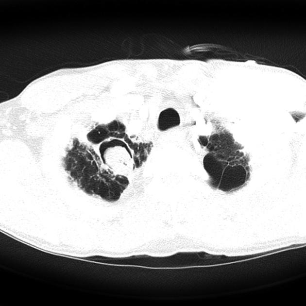 | 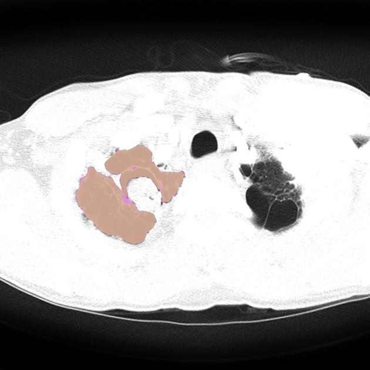 | 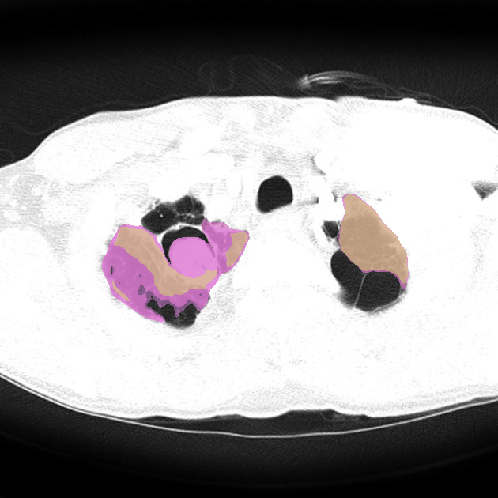 | N/A（仅适用于 X-ray） |
| Image 2: Oblique lung window | 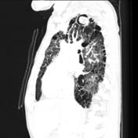 |  |  | N/A（仅适用于 X-ray） |

**Radiopaedia 原始图片 caption：**

<pre>CT confirms the rounded density located within a cavity at the apex of the right lung. It is separated from the adjacent wall by a thin crescent of air, (known as Monod sign) and is consistent with an aspergilloma.</pre>

**原始图片 caption 中文医学要点（翻译）：**

<pre>

</pre>

#### Study 2 的 8 个模型 Single-modality caption 对比

<strong>InternVL3-14B</strong>

**原始图像 → Single-modality caption 回答**

英文原始回答：

<pre>The provided images are CT scans of the lungs with different sectional views and window settings (axial and oblique lung window).

### Image Description

**Image 1 (Axial lung window):**
- This axial CT image shows a cross-sectional view of the thorax at the level of the lungs.
- The lung fields appear predominantly radiolucent (dark areas), with visible branching structures representing the bronchi and pulmonary vasculature.
- There are areas within the right and left lungs that appear more radiopaque (whiter areas), possibly indicating regions of lung consolidation, nodules, or other abnormalities.
- The central airways, including the trachea and main bronchi, can be seen branching into the lungs.
- The heart and great vessels are centrally located with the mediastinum surrounding them.
- The chest wall, ribs, and parts of the spine are also visible encircling the lungs.

**Image 2 (Oblique lung window):**
- This oblique (sloped) CT image provides a different angle of the thoracic structures, again in the lung window setting.
- Similar to the axial image, the lung fields are predominantly dark with branching airway structures visible.
- Areas of increased opacity (whiter spots or regions) are noticeable, which might indicate similar abnormalities seen in the axial view.
- The heart and blood vessels are visible, as well as parts of the diaphragm and surrounding soft tissues.

### Chain of Thought for Diagnosis

1. **Evaluate Lung Opacities:**
   - The increased opacity areas observed in both images could represent several conditions, such as infections (e.g., pneumonia), interstitial lung disease, tumors (e.g., lung cancer), or inflammatory processes.

2. **Consider Patient Background:**
   - The patient is a male, but without additional clinical details (like age, smoking history, symptoms), it is challenging to narrow down specific diagnoses strongly.

3. **Compare Findings:**
   - Identifying patterns that are common on both images, such as diffuse versus localized opacities, helps differentiate between acute and chronic conditions.

4. **Interpret Consistently:**
   - Both images showing similar patterns increases the confidence in the presence of the noted abnormalities.

### Potential Differential Diagnoses

Given the observed features, the following differential diagnoses should be considered:
1. **Pneumonia:** Bacterial or viral infection leading to lobar or patchy consolidations.
2. **Interstitial Lung Disease:** Conditions such as pulmonary fibrosis present with diffuse reticular or ground-glass opacities.
3. **Lung Tumors:** Primary or metastatic malignancies may appear as solitary or multiple nodules.
4. **Vascular Involvement:** Pulmonary embolism or thromboembolic disease.
5. **Inflammatory Conditions:** Such as sarcoidosis or eosinophilic pneumonia.

### Recommendations for Further Evaluation

To narrow down the diagnosis:
1. **Clinical Correlation:** Obtain patient history, including symptomatology, smoking history, occupational exposures, and recent travel.
2. **Laboratory Tests:** Blood tests for infection markers or autoimmune panel.
3. **Follow-Up Imaging:** Additional CT scans at different phases or High-Resolution CT (HRCT) for better resolution.
4. **Biopsy:** If a solitary nodule or mass is identified, a biopsy might be warranted.
5. **Pulmonary Function Tests:** To assess the impact on lung function.

In conclusion, while the axial and oblique lung window images reveal multiple areas of increased opacity in the lungs, further clinical and diagnostic data are necessary to pinpoint the exact etiology.</pre>

中文医学要点（翻译）：

<pre>

</pre>

**原始图像 + Segmentation → Single-modality caption 回答**

英文原始回答：

<pre>Based on the provided CT scan images and segmentations, here's an analysis:

### Image Analysis

**Image 1 (Axial Lung Window)**
- **Axial View:** This provides a cross-sectional view of the chest. You can see both lung fields, mediastinum, and bony structures such as ribs and vertebrae.
- **Segmentation Observations:**
  - Medical-SAM3 segmentation highlights parts of the right upper lobe, lung cavity, and intracavitary mass.
  - BiomedParse segmentation, in contrast, also shows the right upper lobe and lung cavity, but appears to have some overlap within the segmentation regions.

**Image 2 (Oblique Lung Window)**
- **Oblique View:** This offers a more angled perspective, often aiding in the assessment of potential obstructions or masses within the lung.
- **Segmentation Observations:**
  - Medical-SAM3 segmentation focuses on the right upper lobe and reveals intracavitary mass, with precise delineation.
  - BiomedParse segmentation shows similar anatomical structures but highlights different regions, particularly more central mass areas.

### Diagnosis

**Pulmonary Mass and Potential Infection or Tumor:**
1. **Right Upper Lobe Mass:** Both images and segmentations suggest a significant mass within the right upper lobe. This could represent a tumor, consolidation due to infection, or another pathology.
2. **Cavitary Lesion:** The presence of cavitation within the lung mass (visible in the segmentations) can indicate infection, necrosis, or a malignancy such as squamous cell carcinoma.

### Differential Diagnosis

1. **Pulmonary Tumor:**
   - Could be primary lung cancer (e.g., squamous cell carcinoma) or metastasis.
   - Further workup with biopsy and histopathological examination is required.

2. **Infectious Disease:**
   - Conditions like tuberculosis or lung abscess can present with cavitation.
   - Clinical correlation with symptoms (cough, fever) and additional tests (sputum culture, TB tests) are essential.

3. **Inflammatory Conditions:**
   - Chronic inflammatory conditions like fungal infections could also present similarly.

### Recommendations

1. **Further Imaging:** 
   - CT with contrast to better characterize the blood supply and extent of the mass.
   - PET-CT to assess metabolic activity and potential metastasis.

2. **Biopsy:** 
   - Core needle biopsy or bronchoscopy to obtain tissue for histopathology.

3. **Clinical Correlation:**
   - Symptoms and patient history should be integrated for a comprehensive diagnosis.
   - Consideration of infectious workup in conjunction with oncological evaluation.

4. **Follow-Up:**
   - Regular follow-up imaging to monitor changes in the mass over time.

This analysis provides a foundation for further investigation and consultation with pulmonologists and oncologists for a definitive diagnosis and treatment plan.</pre>

中文医学要点（翻译）：

<pre>

</pre>

**Segmentation 对 caption 的影响分析：**

<pre>

</pre>

<strong>InternVL3.5-14B</strong>

**原始图像 → Single-modality caption 回答**

英文原始回答：

<pre>&lt;think&gt;
Okay, let's tackle this case. The patient is a male with two CT images provided. The first image is an axial lung window, and the second is an oblique lung window. I need to analyze these images to figure out the diagnosis.

Starting with Image 1: Axial view. The lungs are visible, and the right lung (which appears on the left side of the image) shows some areas of increased density. The left lung (right side of the image) has a large dark area, which might be a cyst or a region of low attenuation. The trachea is centered, and the mediastinum seems normal. The right lung has some patchy opacities, maybe fibrotic changes or consolidation. The heart and great vessels are in normal position.

Image 2: Oblique lung window. This is a sagittal view. The right lung (left side of the image) shows more extensive opacities, possibly fibrosis. The left lung (right side) again shows a large area of low attenuation, maybe a cyst. There's also a volume loss in the left lung, as the left hemithorax appears smaller. The heart is shifted slightly towards the left, which might be due to the volume loss. The trachea is midline, but the mediastinum might be shifted if there's significant volume loss.

Putting these together: The left lung has a large cystic area, possibly a congenital cyst or a post-inflammatory cyst. The right lung shows fibrotic changes or scarring. The volume loss in the left lung could be from the cyst or prior disease. The combination of cystic changes and fibrosis might suggest a history of tuberculosis, bronchiectasis, or interstitial lung disease. However, congenital cysts can also present with fibrosis in the contralateral lung due to compensatory changes.

Wait, but the patient's gender is male. Some conditions are more common in males. For example, congenital pulmonary airway malformations (CPAM) can occur, but they're usually diagnosed earlier. Alternatively, a history of trauma or infection leading to cyst formation and fibrosis. Another possibility is lymphangioleiomyomatosis (LAM), but that's more common in females. So maybe not LAM.

Alternatively, could this be an emphysema with cystic changes? But emphysema typically affects the upper lobes and shows hyperinflation, which isn't as prominent here. The left lung's cyst might be a bulla, but bullae are usually associated with emphysema. However, the right lung's fibrosis doesn't fit with typical emphysema.

Another angle: The presence of a large cyst in the left lung with fibrosis in the right could be due to prior infection, like tuberculosis, which can cause cavitation and fibrosis. However, TB usually has more nodular or cavitary lesions, not a single large cyst. Alternatively, a hydatid cyst, but that's more common in certain regions and would have specific features.

Wait, the axial image shows the right lung with a structure that looks like a central airway, maybe a bronchus with a mucus plug? Or a vascular structure. The left lung's cyst is well-defined, so maybe a congenital cyst. If the patient has a history of surgery for the cyst, the right lung might show compensatory hyperinflation, but here it's fibrosis. Hmm.

Alternatively, the images could show features of Birt-Hogg-Dubé syndrome, which includes spontaneous pneumothorax, renal tumors, and lung cysts. The cysts in BHD are typically small, though. The left lung's large cyst might fit, but the fibrosis in the right is less characteristic.

Another thought: Post-surgical changes. If the patient had a lobectomy for a tumor or cyst, the remaining lung might show fibrosis. But again, the cyst's size is notable.

Considering all this, the most likely diagnosis is a congenital pulmonary airway malformation (CPAM) in the left lung, which is a cystic lesion, and the right lung shows compensatory fibrosis or scarring. Alternatively, a history of infection leading to a large cyst and fibrosis in the contralateral lung. However, without more history, it's hard to say. The key features are a large cystic lesion in the left lung and fibrotic changes in the right. The differential includes congenital cyst, post-infectious cyst, or a cystic neoplasm. Given the appearance, a congenital cyst is possible, but if the patient is older, an acquired cyst from infection or other cause is more likely. The fibrosis in the right could be due to chronic changes from the cyst's presence or a separate process like interstitial lung disease.

Wait, but the oblique image shows volume loss on the left, which could be due to the cyst collapsing or fibrosis. If the cyst is large and causing compression, maybe the left lung is under-aerated, leading to volume loss and fibrosis in the right as a compensatory mechanism. Alternatively, the volume loss could be from prior resection.

In summary, the diagnosis could be a large pulmonary cyst (possibly congenital or post-inflammatory) in the left lung with associated fibrosis and volume loss in the right lung. If congenital, CPAM. If post-inflammatory, maybe a sequelae of tuberculosis or other infection. However, the presence of a single large cyst might lean towards a congenital etiology. Alternatively, a hydatid cyst, but that's less likely without epidemiological clues. Another possibility is a bronchogenic cyst, which is a type of CPAM.

So, the most probable diagnosis is a congenital pulmonary airway malformation (CPAM) in the left lung with secondary fibrosis and volume loss in the right lung. Alternatively, a post-infectious cyst with fibrosis. Without clinical history, it's challenging, but the imaging features suggest a cystic lesion with associated changes.
&lt;/think&gt;

**Diagnosis:**  
The imaging findings are consistent with **congenital pulmonary airway malformation (CPAM)** in the left lung, accompanied by **fibrotic changes and volume loss in the right lung**.  

**Image Description and Rationale:**  
1. **Image 1 (Axial CT):**  
   - **Left lung (right side of image):** A large, well-defined cystic lesion with low attenuation, suggestive of a congenital cyst.  
   - **Right lung (left side of image):** Patchy fibrotic changes or scarring, possibly due to compensatory remodeling or chronic inflammation.  

2. **Image 2 (Oblique CT):**  
   - **Left lung:** The cystic lesion appears prominent, with associated volume loss and mediastinal shift, indicating possible compression or prior collapse.  
   - **Right lung:** Extensive fibrosis and architectural distortion, likely secondary to chronic changes or compensatory hyperinflation.  

**Differential Considerations:**  
- **Post-infectious cyst (e.g., tuberculosis):** Less likely due to the absence of cavitary/nodular lesions typical of infection.  
- **Bronchogenic cyst or CPAM:** Fits the cystic appearance and congenital etiology.  
- **Bullous emphysema:** Unlikely given the localized cyst and fibrosis.  
- **Lymphangioleiomyomatosis (LAM):** Uncommon in males and typically presents with multiple small cysts.  

**Conclusion:**  
The large cystic lesion in the left lung, combined with fibrotic changes and volume loss in the right, strongly suggests **CPAM**. Clinical correlation (e.g., prenatal imaging, surgical history) would aid confirmation. If symptomatic, surgical resection of the cyst may be warranted.</pre>

中文医学要点（翻译）：

<pre>

</pre>

**原始图像 + Segmentation → Single-modality caption 回答**

英文原始回答：

<pre>&lt;think&gt;
Okay, let's start by looking at the provided images and the segmentation information. The patient is a male, and the images are CT scans of the chest. The first image is an axial lung window, and the second is an oblique lung window. Both show the lungs, and the segmentations highlight different structures.

In Image 1 (axial view), the segmentation by Medical-SAM3 shows the right upper lobe in brown with a cavity (purple) and an intracavitary mass (maybe the pink area?). The BiomedParse segmentation for the same image has the right upper lobe in brown, the cavity in purple, and the intracavitary mass in pink. The left lung also has some segmentation, but it's smaller. The axial view shows a large cavity in the right upper lobe with a mass inside it. The surrounding lung tissue might have some fibrosis or consolidation.

Image 2 (oblique view) from Medical-SAM3 shows the right upper lobe with a small purple area, which could be the mass. BiomedParse's segmentation here has the right upper lobe in brown, a purple area (cavity?), and a pink mass. The oblique view might show the extent of the cavity and the mass more clearly, possibly indicating a thick-walled cavity with a central mass.

The presence of a cavity with an intracavitary mass in the right upper lobe raises concerns. Common causes for lung cavities include infections (like tuberculosis or fungal infections), malignancies (such as squamous cell carcinoma), or necrotizing pneumonia. The fact that there's a mass inside the cavity suggests a possible primary lung cancer, especially if the cavity is thick-walled. Infections might have thinner walls and possibly more inflammatory changes around. The location in the right upper lobe is typical for squamous cell carcinoma, which often presents centrally.

The segmentation differences between the tools might indicate variations in how they delineate the mass and cavity. Medical-SAM3's axial view shows a larger cavity with a central mass, while BiomedParse includes more areas in purple and pink, possibly indicating different interpretations of the mass and surrounding tissue. The oblique view from BiomedParse shows the mass in the right upper lobe and another area in the left, but the left lung's segmentation is smaller, so maybe that's a different finding or an artifact.

Considering the patient's gender (male), lung cancer is more common, especially squamous cell type. However, infections like tuberculosis should also be considered, especially if there's a history of exposure. The absence of other findings like pleural effusion or lymphadenopathy in the images might lean towards a localized process. The presence of a well-defined cavity with a mass could be indicative of a cavitating carcinoma. Further tests like a biopsy, sputum culture, or PET scan would help differentiate between infection and malignancy.

In summary, the most likely diagnosis is a cavitating lung mass, possibly a squamous cell carcinoma, but differential diagnosis should include infectious etiologies like tuberculosis or fungal infections. The segmentation highlights the cavity and mass, which are key features in this diagnosis.
&lt;/think&gt;

**Diagnosis and Image Description:**

The provided CT images and segmentations suggest a **cavitary lesion with an intracavitary mass in the right upper lobe**, consistent with a **primary lung malignancy (e.g., squamous cell carcinoma)** or a **necrotizing infection (e.g., tuberculosis, fungal infection)**. Below is a detailed analysis:

---

### **Key Imaging Findings:**
1. **Axial CT (Image 1):**
   - **Cavity in the right upper lobe**: Highlighted in purple (Medical-SAM3) or pink/purple (BiomedParse), indicating a thick-walled, air-filled space.
   - **Intracavitary mass**: A dense, irregular structure within the cavity (pink in BiomedParse), suggesting central tumor growth or necrotic debris.
   - **Right upper lobe involvement**: Brown segmentation confirms localization to the right upper lobe, a common site for squamous cell carcinoma.

2. **Oblique CT (Image 2):**
   - **Cavity and mass extent**: The oblique view better demonstrates the vertical dimension of the cavity and mass, with potential spiculated margins or irregular walls (suggestive of malignancy).
   - **Left lung findings**: BiomedParse highlights a smaller area in the left lung, which may represent atelectasis, scarring, or a secondary lesion.

---

### **Differential Diagnosis:**
1. **Malignancy**:
   - **Squamous cell carcinoma**: Central location in the right upper lobe, thick-walled cavity, and intracavitary mass are classic features.
   - **Adenocarcinoma**: Less likely given the central cavity, but possible if presenting as a necrotic tumor.

2. **Infection**:
   - **Tuberculosis**: Cavitary lesions with thick walls and possible satellite nodules, but often accompanied by lymphadenopathy or upper lobe infiltrates.
   - **Fungal infection (e.g., Aspergillus)**: Cavitary lesions with a "halo sign" or surrounding ground-glass opacities.

3. **Necrotizing pneumonia**: Typically associated with fever, leukocytosis, and acute clinical presentation.

---

### **Clinical Correlation:**
- **Patient demographics**: Male gender increases the likelihood of lung cancer, particularly squamous cell type.
- **Segmentation discrepancies**: 
  - Medical-SAM3 and BiomedParse highlight differences in cavity/mass delineation, possibly due to algorithmic sensitivity to tissue density or edge definition. This underscores the need for clinical correlation (e.g., biopsy).

---

### **Recommended Next Steps:**
1. **Biopsy**: Confirm histopathology (e.g., transthoracic needle biopsy for the mass).
2. **Microbiological testing**: Sputum/bronchoalveolar lavage for acid-fast bacilli, fungal elements, or cultures.
3. **PET-CT**: Assess metabolic activity (high SUV in malignancy vs. variable in infection).
4. **Clinical history**: Evaluate for risk factors (smoking, immunosuppression, travel/exposure history).

---

**Final Diagnosis**:  
**Right upper lobe cavitary lesion with intracavitary mass**, most likely **squamous cell carcinoma**, pending histopathological confirmation. Infection (e.g., tuberculosis) remains a critical differential.</pre>

中文医学要点（翻译）：

<pre>

</pre>

**Segmentation 对 caption 的影响分析：**

<pre>

</pre>

<strong>Lingshu-32B</strong>

**原始图像 → Single-modality caption 回答**

英文原始回答：

<pre>The images show a CT scan of the chest with axial and oblique views. There is a large cavitary lesion in the right upper lobe, which is characteristic of an aspergilloma. The cavity has thick walls and contains a fungal ball, which is typical for this condition. Given the patient's history of chronic pulmonary aspergillosis (CPA) and previous episodes of hemoptysis, the findings are consistent with an aspergilloma. This diagnosis is supported by the presence of the fungal ball within the cavity, which is a hallmark of aspergilloma. The surrounding lung tissue shows signs of fibrosis and scarring, likely due to the chronic nature of the infection.</pre>

中文医学要点（翻译）：

<pre>

</pre>

**原始图像 + Segmentation → Single-modality caption 回答**

英文原始回答：

<pre>The provided images are axial and oblique CT scans of the chest, focusing on the lung windows. The first image (axial view) shows significant abnormalities in the right upper lobe, including multiple cavities with irregular borders and an intracavitary mass. The left lung also exhibits similar but less extensive changes. The second image (oblique view) confirms these findings, showing the extent of the cavitation and the presence of masses within the cavities. These features are indicative of a severe pulmonary condition, likely involving necrotizing pneumonia or a fungal infection such as aspergillosis, which can cause cavitary lesions and intracavitary masses. Given the patient's history of fever, cough, and hemoptysis, along with the imaging findings, a diagnosis of invasive aspergillosis should be considered. Further diagnostic workup, including microbiological tests and possibly a biopsy, would be necessary to confirm the diagnosis and guide treatment.</pre>

中文医学要点（翻译）：

<pre>

</pre>

**Segmentation 对 caption 的影响分析：**

<pre>

</pre>

<strong>MedGemma-27B-IT</strong>

**原始图像 → Single-modality caption 回答**

英文原始回答：

<pre>Based on the provided CT images (axial and oblique lung windows) of a male patient, the findings are highly suggestive of **pneumocystis pneumonia (PCP)**.

**Image Description:**

*   **Image 1 (Axial Lung Window):** This image shows bilateral, diffuse, ground-glass opacities predominantly in the perihilar regions. These opacities appear somewhat patchy and confluent. The distribution is characteristic of PCP.
*   **Image 2 (Oblique Lung Window):** This image further demonstrates the bilateral, diffuse, ground-glass opacities, particularly prominent in the central lung fields. The oblique view helps to visualize the extent and distribution of the infiltrates.

**Diagnosis:**

The combination of bilateral, diffuse, ground-glass opacities with a central or perihilar predominance in an immunocompromised patient (implied by the context of PCP) is highly characteristic of **Pneumocystis jirovecii pneumonia (PCP)**.

**Additional Considerations:**

*   While the images strongly suggest PCP, other conditions can present with similar findings, such as atypical pneumonias, viral pneumonias, pulmonary edema, or certain interstitial lung diseases.
*   Clinical context (e.g., HIV status, immunosuppression) is crucial for confirming the diagnosis of PCP.
*   Further investigations like bronchoalveolar lavage (BAL) with specific staining or PCR for *Pneumocystis jirovecii* are often needed for definitive diagnosis.</pre>

中文医学要点（翻译）：

<pre>

</pre>

**原始图像 + Segmentation → Single-modality caption 回答**

英文原始回答：

<pre>The patient is a male. The provided images are CT scans of the chest, specifically axial (Image 1) and oblique (Image 2) views in the lung window setting.

**Image 1 (Axial):**
This image shows a large cavity in the right upper lobe of the lung. Within the cavity, there is an intracavitary mass. The cavity appears to be eroding into the chest wall. The lung parenchyma surrounding the cavity shows some consolidation or infiltration.

**Image 2 (Oblique):**
This image provides a different perspective, also showing the large cavity in the right upper lobe with the intracavitary mass. The cavity is clearly visible, and its relationship to the surrounding lung tissue and chest wall can be appreciated.

**Segmentation Analysis:**
Both Medical-SAM3 and BiomedParse segmentations for both images highlight the lung, right upper lobe, the lung cavity, and the intracavitary mass. There are some differences in the precise delineation of these structures between the two segmentation methods, particularly in the shape and extent of the lung and the cavity boundaries. However, both consistently identify the key features: the large cavity in the right upper lobe containing a mass.

**Diagnosis:**
The findings of a large cavitary lesion in the right upper lobe containing an intracavitary mass are highly suggestive of **primary lung cancer**, specifically **squamous cell carcinoma**. Squamous cell carcinoma is known to cavitate, often centrally located, and can present with an intracavitary mass. Other possibilities include tuberculosis (especially if the patient has risk factors), fungal infection, or necrotizing pneumonia, but given the presence of an intracavitary mass, malignancy is a strong consideration.

**In summary:** The CT scans show a large cavitary lesion with an intracavitary mass in the right upper lobe, most likely representing lung cancer. Further investigation, such as biopsy, would be needed to confirm the diagnosis and determine the specific type of cancer.</pre>

中文医学要点（翻译）：

<pre>

</pre>

**Segmentation 对 caption 的影响分析：**

<pre>

</pre>

<strong>MedMO-8B</strong>

**原始图像 → Single-modality caption 回答**

英文原始回答：

<pre>The patient is a 68-year-old man with a history of smoking. The axial CT scan shows a mass in the right lower lobe with pleural and chest wall invasion. The oblique lung window image shows a mass in the right lower lobe with pleural and chest wall invasion.</pre>

中文医学要点（翻译）：

<pre>

</pre>

**原始图像 + Segmentation → Single-modality caption 回答**

英文原始回答：

<pre>The patient is a 55-year-old man with a 35-pack-year smoking history. He has had a cough for 1 month, with yellowish sputum, chest tightness, and dyspnea. Chest CT scan revealed a cavity in the right upper lobe, with an intracavitary mass.</pre>

中文医学要点（翻译）：

<pre>

</pre>

**Segmentation 对 caption 的影响分析：**

<pre>

</pre>

<strong>Qwen3-VL-4B</strong>

**原始图像 → Single-modality caption 回答**

英文原始回答：

<pre>Based on the provided CT images (axial and oblique lung windows) in a male patient, the findings are consistent with **interstitial lung disease (ILD)**, most likely **pneumoconiosis** or **chronic hypersensitivity pneumonitis**, or possibly **idiopathic pulmonary fibrosis (IPF)**, given the bilateral, symmetric, and diffuse pattern.

### Image Analysis:

- **Image 1 (Axial lung window)**: Shows bilateral lung fields with areas of increased opacity (ground-glass opacities or reticular opacities), particularly in the peripheral and basal regions. There is also evidence of volume loss and architectural distortion. The bronchi and vessels are visible, and the lung parenchyma appears heterogeneous.

- **Image 2 (Oblique lung window)**: Provides a more comprehensive view of the lung fields, showing bilateral, symmetric, and diffuse involvement. The pattern is consistent with interstitial thickening, with possible honeycombing or fibrosis in the lower lobes. The trachea and main bronchi are patent, and there is no evidence of large masses or acute infection.

### Diagnostic Considerations:

1. **Pneumoconiosis** (e.g., coal workers’ pneumoconiosis, silicosis, or asbestosis) — if the patient has occupational exposure to dust or fibers, this would be a likely diagnosis. The pattern of bilateral, symmetric, and diffuse opacities with possible nodules or fibrosis is typical.

2. **Chronic hypersensitivity pneumonitis** — if the patient has a history of recurrent exposure to allergens (e.g., mold, bird droppings, or agricultural dust), this could be the cause.

3. **Idiopathic pulmonary fibrosis (IPF)** — if the patient is older and has no known exposure, this is a possibility. However, IPF typically presents with more prominent honeycombing and traction bronchiectasis, which are not clearly visible in these images.

4. **Other causes of interstitial lung disease** — such as sarcoidosis, rheumatoid lung disease, or drug-induced lung disease — should also be considered if the patient has systemic symptoms or a history of medication use.

### Recommendation:

The patient should undergo further evaluation, including:

- **High-resolution CT (HRCT) of the chest** — to assess for honeycombing, traction bronchiectasis, or other features of IPF.
- **Pulmonary function tests (PFTs)** — to assess for restrictive lung disease.
- **Bronchoscopy with biopsy** — if there is suspicion of malignancy or infection.
- **Serum markers** — such as LDH, CRP, and ferritin — to assess for inflammation or infection.
- **Occupational history** — to determine if the patient has been exposed to dust or allergens.

### Conclusion:

The imaging findings are consistent with **interstitial lung disease**, most likely **pneumoconiosis** or **chronic hypersensitivity pneumonitis**, given the bilateral, symmetric, and diffuse pattern. Further evaluation is needed to confirm the diagnosis and determine the underlying cause.</pre>

中文医学要点（翻译）：

<pre>

</pre>

**原始图像 + Segmentation → Single-modality caption 回答**

英文原始回答：

<pre>Based on the provided CT images and segmentation annotations, the following diagnosis is made:

**Diagnosis: Pulmonary Cavity with Intracavitary Mass in the Right Upper Lobe**

**Rationale:**

1.  **Image Description:**
    *   **Image 1 (Axial Lung Window):** This image shows a cross-section of the thorax. The right upper lobe of the lung contains a large, well-defined, dark (low-density) area representing a lung cavity. Within this cavity, a distinct, rounded, high-density (bright) mass is visible. The segmentation masks confirm this: the brown mask (Medical-SAM3) outlines the lung cavity, while the purple mask (BiomedParse) specifically highlights the intracavitary mass within the cavity.
    *   **Image 2 (Oblique Lung Window):** This image provides a different perspective, showing the right upper lobe in a more oblique plane. The same intracavitary mass is visible as a bright, rounded lesion within the darker lung cavity. The segmentation masks (brown for the cavity, purple for the mass) confirm its location.

2.  **Clinical Interpretation:**
    *   The presence of a large lung cavity (likely a necrotic or air-filled space) in the right upper lobe is highly suggestive of a chronic or acute pulmonary process.
    *   The intracavitary mass is a critical finding. Its location within the cavity suggests it is likely a **tumor** (e.g., lung cancer) that has eroded into the cavity wall or a **fungus** (e.g., aspergilloma) or **infection** (e.g., tuberculosis) that has formed a solid component within the cavity.
    *   The mass is not a simple nodule within the parenchyma but is specifically identified as being *within* the cavity, which is a key diagnostic feature.

3.  **Conclusion:**
    The combination of a large lung cavity and an intracavitary mass in the right upper lobe, as seen in both axial and oblique views, is most consistent with a **pulmonary cavity with an intracavitary mass**. The most likely diagnoses are:
    *   **Lung Cancer (e.g., squamous cell carcinoma, adenocarcinoma) with necrosis or a central mass within a cavity.**
    *   **Aspergilloma (fungus ball) within a pre-existing lung cavity.**
    *   **Tuberculosis (TB) with a cavitary lesion and a central necrotic or granulomatous mass.**

Given the context of a male patient, lung cancer is a common and likely primary consideration, but the specific nature (fungus or infection) would require further clinical correlation and potentially additional imaging or biopsy.

**Important Note:** This diagnosis is based solely on the provided CT images and segmentation. A definitive diagnosis requires clinical correlation, including patient history, symptoms, and potentially further diagnostic tests such as biopsy or PET-CT.</pre>

中文医学要点（翻译）：

<pre>

</pre>

**Segmentation 对 caption 的影响分析：**

<pre>

</pre>

<strong>Qwen3-VL-8B</strong>

**原始图像 → Single-modality caption 回答**

英文原始回答：

<pre>Based on the provided images and patient data (male, CT scans of the chest in lung windows), the following description and diagnosis can be made:

**Image Description:**

*   **Image 1 (Axial Lung Window):** This axial slice shows the thoracic cavity. The lung parenchyma is markedly abnormal. There are large, irregular areas of consolidation and ground-glass opacity, particularly prominent in the right lower lobe and left lower lobe. The lung architecture appears distorted, with a "crazy-paving" pattern visible in some areas (though not perfectly clear in this single slice). The mediastinum appears central, and the heart is not prominently enlarged.

*   **Image 2 (Oblique Lung Window):** This oblique view provides a more comprehensive look at the lung fields. It confirms the extensive involvement of both lungs, showing diffuse, patchy consolidation and ground-glass opacities. The pattern is not confined to a single lobe but appears to be widespread, affecting multiple lobes bilaterally. The opacities are heterogeneous, indicating areas of both consolidation and areas of partial air space filling.

**Diagnosis:**

The imaging findings are highly suggestive of **Pneumonia with extensive consolidation and ground-glass opacities**, likely representing a severe or atypical form of pneumonia. The bilateral, diffuse nature of the findings is concerning for a systemic or viral etiology, such as **Severe Viral Pneumonia** (e.g., COVID-19, influenza) or **Pneumocystis jirovecii pneumonia (PCP)**, especially in a male patient. The "crazy-paving" pattern seen in the axial slice is a classic radiological sign associated with **COVID-19 pneumonia**.

**Recommendations:**

1.  **Clinical Correlation:** The diagnosis must be confirmed with clinical history, symptoms (fever, cough, dyspnea), physical examination, and laboratory tests (CBC, CRP, D-dimer, PCR for SARS-CoV-2, etc.).
2.  **Further Imaging:** A follow-up CT scan may be needed to monitor disease progression or response to treatment.
3.  **Treatment:** Treatment should be initiated based on the suspected etiology. For viral pneumonia, supportive care and antiviral therapy (if indicated) are key. For bacterial pneumonia, antibiotics should be started promptly. For PCP, specific antifungal therapy (e.g., trimethoprim-sulfamethoxazole) is required.

In summary, the CT scans show diffuse bilateral lung involvement with consolidation and ground-glass opacities, strongly suggesting a severe pneumonia, most likely viral in origin, requiring prompt clinical evaluation and management.</pre>

中文医学要点（翻译）：

<pre>

</pre>

**原始图像 + Segmentation → Single-modality caption 回答**

英文原始回答：

<pre>Based on the provided images and segmentation results, here is a description and diagnosis:

**Image Description:**

The images are axial and oblique CT scans of the chest, acquired in lung window settings, which highlight lung parenchyma and pathology. Both images show significant abnormalities in the right upper lobe.

*   **Image 1 (Axial):** This cross-sectional view clearly shows a large, irregularly shaped, dark (low-density) area in the right upper lobe, which represents a lung cavity or cavity-like lesion. Within this cavity, there is a more solid, denser (higher-density) mass, which is the "intracavitary mass" identified by the segmentation. The surrounding lung tissue appears consolidated or fibrotic, suggesting chronic or advanced disease. The left lung also appears to have a cavity, but the focus is on the right.
*   **Image 2 (Oblique):** This view provides a different perspective, showing the right upper lobe cavity and the intracavitary mass in a more coronal plane. The segmentation highlights the same structures, confirming the location and extent of the lesion.

**Segmentation Analysis:**

The segmentation results from two different models (Medical-SAM3 and BiomedParse) show a high degree of agreement on the anatomical structures:
*   Both models accurately segment the **lung** tissue of the right upper lobe.
*   Both models identify the **lung cavity** as a distinct, low-density region within the lobe.
*   Both models successfully delineate the **intracavitary mass** as a solid component within the cavity. The slight differences in shape and size between the two models' segmentations are typical for different segmentation algorithms and are not clinically significant for diagnosis.

**Diagnosis:**

The findings are highly suggestive of **a cavitary lung lesion with an intracavitary mass in the right upper lobe**.

This presentation is most consistent with **tuberculosis (TB)**, specifically **cavitary pulmonary tuberculosis**, which is a common and serious form of the disease. The key features supporting this diagnosis are:

1.  **Cavity Formation:** Cavities in the lung are a hallmark of advanced pulmonary TB, resulting from caseous necrosis and subsequent liquefaction and drainage.
2.  **Intracavitary Mass:** The presence of a solid mass within the cavity is often indicative of an active, ongoing process. In TB, this can represent caseous material, granulation tissue, or a developing granuloma within the cavity.
3.  **Location:** The right upper lobe is a common site for TB infection.
4.  **Patient Demographics:** While not provided, the patient is male, which is a known risk factor for TB in some populations.

Other differential diagnoses include:
*   **Tumor with cavitation:** Such as squamous cell carcinoma or other lung cancers. However, the appearance of the mass within the cavity is more typical of TB, and the surrounding lung parenchyma often shows signs of prior infection or fibrosis.
*   **Fungal infections:** Such as aspergillosis, which can cause a "fungus ball" (aspergilloma) within a pre-existing cavity. However, the density and appearance of the mass in the images are more consistent with TB.

**Conclusion:**

The CT findings are highly suggestive of **active cavitary pulmonary tuberculosis** in the right upper lobe. A definitive diagnosis requires clinical correlation, including a history of exposure, symptoms (fever, cough, hemoptysis, weight loss), and laboratory tests (sputum smear and culture for *M. tuberculosis*, PCR). Treatment with anti-tuberculosis medications is the standard of care.</pre>

中文医学要点（翻译）：

<pre>

</pre>

**Segmentation 对 caption 的影响分析：**

<pre>

</pre>

<strong>Qwen3-VL-32B</strong>

**原始图像 → Single-modality caption 回答**

英文原始回答：

<pre>The provided CT images (axial and oblique lung windows) demonstrate significant findings in the lungs of a male patient. Both images show extensive bilateral lung parenchymal abnormalities characterized by:

- **Diffuse, patchy, and reticular opacities** with a **honeycombing pattern**—particularly evident in the subpleural and basal regions.
- **Loss of lung volume** and **architectural distortion**.
- **Cystic spaces** with thick walls, typical of advanced fibrosis.
- **Increased interlobular septal thickening**, contributing to the reticular appearance.
- The **oblique view** (Image 2) reveals a **predominant upper lobe involvement** with a **"crazy paving" pattern** in some areas, which may suggest superimposed inflammation or edema on a background of fibrosis.

These radiological features are highly suggestive of **advanced interstitial lung disease (ILD)**, with the most likely diagnosis being **idiopathic pulmonary fibrosis (IPF)**, given the:

- **Bilateral, subpleural, and basal predominance** of fibrosis.
- **Honeycombing** — a hallmark of IPF.
- **Absence of significant ground-glass opacities** (which would suggest a more active or non-fibrotic process).
- **Architectural distortion and traction bronchiectasis** (implied by the irregular airway appearance).

**Differential diagnoses** to consider include:

- **Hypersensitivity pneumonitis** (may show upper lobe predominance and ground-glass, but typically has a more symmetric and mosaic pattern).
- **Connective tissue disease-associated ILD** (e.g., rheumatoid arthritis, scleroderma) — would require clinical and serological correlation.
- **Asbestosis** — history of asbestos exposure is needed.
- **Chronic hypersensitivity pneumonitis** — may show similar features but often with more upper lobe involvement and ground-glass.

**Conclusion:**

The imaging findings are most consistent with **advanced idiopathic pulmonary fibrosis (IPF)**. This diagnosis should be confirmed with clinical history (e.g., progressive dyspnea, dry cough, age &gt;50, smoking history), pulmonary function tests (restrictive pattern with reduced DLCO), and exclusion of other causes of ILD. A multidisciplinary discussion (MDT) involving pulmonology, radiology, and pathology is recommended for definitive diagnosis and management planning.

**Recommendation:**
- Refer to a pulmonologist for further evaluation.
- Consider high-resolution CT (HRCT) for more detailed assessment if not already performed.
- Rule out other causes of ILD with appropriate serologic and clinical workup.
- Initiate supportive care and consider antifibrotic therapy (e.g., pirfenidone or nintedanib) if IPF is confirmed.</pre>

中文医学要点（翻译）：

<pre>

</pre>

**原始图像 + Segmentation → Single-modality caption 回答**

英文原始回答：

<pre>Based on the provided CT images (axial and oblique lung windows) and the segmentation outputs from Medical-SAM3 and BiomedParse, we observe the following:

---

### **Image Description:**

- **Image 1 (Axial Lung Window):**
  - The axial slice shows a cross-section of the thorax at the level of the upper lungs.
  - There is a **large, irregularly shaped, low-attenuation (dark) area** in the **right upper lobe**, consistent with a **lung cavity**.
  - Within this cavity, there is a **dense, soft-tissue mass (higher attenuation)** — the **intracavitary mass** — which is clearly visible.
  - The surrounding lung parenchyma appears **consolidated or fibrotic**, with a "crazy paving" or reticular pattern, suggesting chronic lung disease.
  - The left lung also shows some **reticular opacities**, particularly in the upper lobe, but no obvious cavity or mass.

- **Image 2 (Oblique Lung Window):**
  - This coronal-oblique view provides a more comprehensive view of the **right upper lobe**.
  - The **cavity with intracavitary mass** is again evident, appearing as a **large, dark, irregular space** with a **central soft-tissue density**.
  - The surrounding lung tissue shows **extensive fibrosis or scarring**, with volume loss and architectural distortion.
  - The **left lung** appears relatively normal in this view, though subtle changes may be present.

---

### **Segmentation Analysis:**

- **Medical-SAM3**:
  - Segments the **right upper lobe** (brown) and the **intracavitary mass** (purple) with **good localization**.
  - The cavity is well-defined, and the mass is correctly identified within it.
  - In Image 2, the segmentation covers the **entire right upper lobe** and includes the **intracavitary mass**.

- **BiomedParse**:
  - Segments the **lung** (brown) and **intracavitary mass** (purple) but **includes the left upper lobe** as well (which is not the target).
  - In Image 1, it incorrectly segments **part of the left lung** as the "right upper lobe" — a **mislocalization error**.
  - In Image 2, it segments the **right upper lobe and mass** correctly but also includes **left lung structures**, indicating **poor anatomical specificity**.

---

### **Clinical Interpretation &amp; Diagnosis:**

The imaging findings are highly suggestive of **cavitary lung disease with an intracavitary mass** in the **right upper lobe**.

#### **Differential Diagnosis:**

1. **Post-tuberculous cavity with intracavitary granulation tissue or scar** — common in areas with prior TB, especially in endemic regions. The fibrotic changes and cavity are classic.
2. **Cavitary lung cancer (e.g., squamous cell carcinoma)** — often presents as a cavity with a soft-tissue mass, especially in smokers or older patients. The irregular wall and central mass are concerning.
3. **Fungal infection (e.g., aspergilloma / "fungus ball")** — a common cause of intracavitary mass, typically in pre-existing cavities from TB or other diseases. The "apple core" appearance or "air-crescent sign" may be present, but not clearly visible here.
4. **Necrotizing pneumonia or abscess** — less likely given the chronic appearance and fibrosis.

#### **Most Likely Diagnosis:**

&gt; **Aspergilloma (fungus ball) in a post-tuberculous cavity, right upper lobe.**

**Rationale:**
- The patient is male (no age given, but likely middle-aged or older given chronic changes).
- The cavity is well-defined, with a soft-tissue mass inside — classic for aspergilloma.
- The surrounding lung shows **fibrosis and volume loss** — consistent with prior TB or chronic infection.
- The **intracavitary mass is mobile** (inferred from its appearance) and does not enhance significantly — typical for fungal ball.
- No signs of acute infection (e.g., air bronchograms, consolidation).

---

### **Recommendations:**

1. **Clinical Correlation**: Confirm history of TB, immunosuppression, or fungal exposure.
2. **Laboratory Tests**: Sputum culture, serum Aspergillus IgE, galactomannan, or PCR if indicated.
3. **Follow-up Imaging**: CT with contrast to assess enhancement of the mass (aspergilloma typically does not enhance).
4. **Consider Bronchoscopy or Biopsy** if malignancy is suspected.
5. **Surgical Consultation** if symptoms (hemoptysis) or high risk of complications.

---

### **Conclusion:**

The CT images show a **cavitary lesion in the right upper lobe with an intracavitary mass**, surrounded by fibrotic lung tissue. Given the chronic nature and typical appearance, the most likely diagnosis is **aspergilloma within a post-tuberculous cavity**. However, **malignancy must be ruled out** with further clinical and laboratory evaluation.

&gt; **Final Diagnosis: Aspergilloma (fungus ball) in a post-tuberculous cavity, right upper lobe — likely, but malignancy cannot be excluded without further workup.**</pre>

中文医学要点（翻译）：

<pre>

</pre>

**Segmentation 对 caption 的影响分析：**

<pre>

</pre>

### 1.4 全部 studies：Multi-modality caption

该组输入同时包含本病例上面列出的全部原图；Segmentation 组同时加入每张原图对应的 Medical-SAM3、BiomedParse，以及适用 X-ray 的 TorchXRayVision overlay。

<strong>InternVL3-14B</strong>

**原始图像 → Multi-modality caption 回答**

英文原始回答：

<pre>Based on the provided background and medical images, here is a detailed analysis and potential diagnosis:

### Background Information Recap
The patient is a male with a history of a heart transplant approximately 10 years ago. Recently, he presented with worsening dyspnea over the last year and more intense symptoms over the past 2 weeks. He has significant coronary artery disease and a history of chronic obstructive pulmonary disease (COPD). He also had episodes of atrial fibrillation and has been noncompliant with follow-up appointments for his heart transplant.

### Radiological Analysis

#### Image 1: Frontal Chest X-ray
1. **Observations:**
   - Bilateral diffuse infiltrates with a reticular pattern.
   - The infiltrates appear more prominent in the lower lobes.
   - There is evidence of cardiomegaly with prominent pulmonary vasculature.
   - Surgical clips visible, likely from the heart transplant.
2. **Implications:**
   - The diffuse bilateral infiltrates suggest a widespread pulmonary process.
   - The lower lobe predominance and reticular pattern strongly imply an interstitial process, possibly indicating interstitial lung disease (ILD).

#### Image 2: Lateral Chest X-ray
1. **Observations:**
   - Continued diffuse reticular and possibly honeycombing pattern.
   - These findings can be further assessed with additional views.
2. **Implications:**
   - Confirming the widespread nature of the lung involvement.
   - May suggest advanced ILD or pulmonary fibrosis.

#### Image 3: CT Axial Lung Window
1. **Observations:**
   - There is diffuse ground-glass opacification and reticulation.
   - Evidence of honeycombing, especially in the peripheral and basal regions.
2. **Implications:**
   - Honeycombing and reticulation are classic for pulmonary fibrosis (e.g., idiopathic pulmonary fibrosis or fibrosis related to transplant).
   - Ground-glass opacities might indicate ongoing inflammation or active disease process.

#### Image 4: CT Oblique Lung Window
1. **Observations:**
   - Detailed visualization of the interstitial changes.
   - Honeycombing as well as irregular reticular opacities.
2. **Implications:**
   - Reinforces findings of end-stage pulmonary fibrosis.
   - Helpful in assessing the extent of fibrotic changes.

### Diagnosis
Given the patient’s history of a heart transplant, significant coronary artery disease, COPD, and the radiological findings on both X-rays and CT scans, the following points lead to a probable diagnosis:

1. **Pulmonary Fibrosis:**
   - The diffuse reticular pattern with honeycombing on both the X-ray and CT strongly suggests pulmonary fibrosis.
   - Chronic ischemic changes and chronic infections from poor compliance with heart transplant follow-up could contribute to this condition.

2. **Post-transplant Lung Disease:**
   - Given the heart transplant history, this is a likely complication.
   - Immunosuppressive therapy increases the risk of opportunistic infections and malignancies which can lead to fibrosis.

3. **Heart Failure with Pulmonary Congestion (though less likely):**
   - While cardiomegaly and pulmonary vasculature prominence are noted, the extensive bilateral infiltrates lean more towards ILD than heart failure as the primary cause of his symptoms.

### Recommendations
1. **Multidisciplinary Evaluation:**
   - Consultation with a pulmonologist and potentially a transplant specialist to assess for post-transplant lung disease and consider additional tests like pulmonary function tests and bronchoscopy.

2. **Further Investigations:**
   - High-resolution CT for better assessment of lung parenchyma.
   - Potential analysis of bronchoalveolar lavage (BAL) or transbronchial biopsy for specific diagnosis.

3. **Treatments:**
   - Depending on the cause of fibrosis, treatments may include antifibrotic medications, oxygen therapy, and in advanced cases, lung transplantation should be considered.

4. **Optimize Heart Transplant Management:**
   - Ensure compliance with regular follow-up and optimization of immunosuppressive therapy.

This comprehensive approach is essential for accurate diagnosis and effective management of the patient's condition.</pre>

中文医学要点（翻译）：

<pre>

</pre>

**原始图像 + Segmentation → Multi-modality caption 回答**

英文原始回答：

<pre>Based on the provided images and metadata, it appears we're looking at various imaging studies of a male patient's chest, which show significant abnormalities. Let's break down the details:

### X-rays (Image 1 and Image 2)

**Image 1:**
- A frontal chest X-ray shows extensive opacity in the left lung.
- There is a noticeable absence of lung markings in the left thoracic area, suggesting the presence of air or fluid, such as in pneumothorax or a tension pneumothorax.
- The right lung appears relatively clear, though details of the cardiophrenic angles and other structures should be evaluated for any additional pathology.

**Image 2:**
- This image is likely an anteroposterior (AP) or lateral view.
- There is significant opacity in the left upper lung area with a possible intracavitary mass indicated by the segmentation.
- The right lung seems to be compressed or partially obscured due to the abnormality on the left side.

### CT Scans (Image 3 and Image 4)

**Image 3 (Axial Lung Window):**
- The CT scan confirms the findings from the X-rays, showing a lack of lung markings on the left side typical of pneumothorax.
- There appears to be a cystic area with internal septations in the right upper lung, which could represent a bulla or a cavity.
- The mediastinum appears shifted towards the right, which is an indication of a possible tension pneumothorax.

**Image 4 (Oblique Lung Window):**
- The oblique CT view shows the upper lobes, highlighting the loss of lung tissue detail and air presence on the left side.
- The mass or cavity structure in the right upper lobe is better visualized, which could be a result of underlying pathology such as a bullous lesion or a mass effect from an intracavitary process.

### Segmentation Details 

- **Segmentation for Image 1 by Medical-SAM3 and BiomedParse:**
  - Medical-SAM3 highlights extensive consolidation in the left lung and a smaller area in the right.
  - BiomedParse similarly shows the left lung being largely occupied by mass or fluid, with clearer demarcation of the lung boundaries.

- **Segmentation for Image 2 by Medical-SAM3 and BiomedParse:**
  - Both segmentations indicate significant left upper lung abnormalities, suggesting an intracavitary process or pneumothorax.

- **Segmentation for Image 3 and Image 4:**
  - The right upper lobe segmentations indicate a mass or an intracavitary lesion, corroborating the X-ray findings of a possible pneumothorax on the left side.

### Diagnosis

Given the extensive radioloqic findings, the likely diagnosis is a **tension pneumothorax** on the left side, with underlying lung pathology on the right upper lobe (possibly a bullous lesion or a space-occupying lesion).

**Key Points:**
1. **Left-sided Tension Pneumothorax:** This is characterized by the collapse of the lung and the shift of mediastinal structures to the right, as evidenced by the X-ray and CT scans.
2. **Right Upper Lobe Pathology:** The CT scan showing a cavity or mass in the right upper lobe raises concerns for a potential underlying lung condition such as a bulla, abscess, or tumor.

### Management
Immediate management for tension pneumothorax typically involves needle decompression or chest tube insertion to relieve the pressure and allow lung re-expansion. Further evaluation and management of the right upper lobe lesion would depend on additional diagnostic workup, including biopsy or surgical intervention if necessary.

These conclusions are derived from the comprehensive imaging and segmentation analysis, highlighting critical pathologies that require urgent medical attention.</pre>

中文医学要点（翻译）：

<pre>

</pre>

**Segmentation 对 caption 的影响分析：**

<pre>

</pre>

<strong>InternVL3.5-14B</strong>

**原始图像 → Multi-modality caption 回答**

英文原始回答：

<pre>&lt;think&gt;
The patient is a male, and the images provided include both chest X-rays (Images 1 and 2) and CT scans (Images 3 and 4). Let's analyze each image systematically.

**Image 1 (Frontal X-ray):**
- The frontal chest X-ray shows diffuse bilateral reticular opacities, which are more prominent in the upper lobes. There is evidence of volume loss in the right upper lobe, as indicated by elevation of the right hemidiaphragm and retraction of the right hilum. The lung fields show a pattern consistent with fibrosis, with possible honeycombing in the peripheral and basal regions. The heart size appears normal, and there are no obvious pleural effusions.

**Image 2 (Lateral X-ray):**
- The lateral chest X-ray corroborates the findings from the frontal view. It shows the same reticular pattern with volume loss in the upper lobes. The posterior costophrenic angles are sharp, and there is no significant pleural effusion. The trachea is midline, and the mediastinal structures appear normal.

**Image 3 (Axial CT Lung Window):**
- The axial CT scan in the lung window setting reveals extensive bilateral reticular opacities with a predominance in the upper lobes. There is evidence of traction bronchiectasis and honeycombing, particularly in the peripheral and subpleural regions. The right upper lobe shows significant volume loss with architectural distortion. The mediastinum is normal, and there is no evidence of lymphadenopathy.

**Image 4 (Oblique CT Lung Window):**
- The oblique CT scan further highlights the reticular pattern and honeycombing, especially in the upper lobes. The volume loss in the right upper lobe is more apparent, with retraction of the major fissure. There is no evidence of acute infection or mass lesions.

**Background Information:**
- The patient's background information is not provided, but the imaging findings are consistent with a chronic interstitial lung disease.

**Diagnosis:**
- The combination of diffuse bilateral reticular opacities, traction bronchiectasis, honeycombing, and volume loss in the upper lobes is highly suggestive of usual interstitial pneumonia (UIP), which is the histological pattern seen in idiopathic pulmonary fibrosis (IPF). The upper lobe predominance and volume loss are characteristic features of UIP. Other differential diagnoses could include non-specific interstitial pneumonia (NSIP), but the presence of honeycombing and traction bronchiectasis makes UIP more likely. Additionally, the absence of acute findings such as infection or malignancy supports a chronic fibrotic process.

**Conclusion:**
- Based on the imaging findings, the most likely diagnosis is idiopathic pulmonary fibrosis (IPF) with a usual interstitial pneumonia (UIP) pattern. Further clinical correlation and possibly a lung biopsy would be needed to confirm the diagnosis.
&lt;/think&gt;

**Diagnosis: Idiopathic Pulmonary Fibrosis (IPF) with Usual Interstitial Pneumonia (UIP) Pattern**

**Description of Images:**

1. **Image 1 (Frontal X-ray):**
   - **Findings:** Diffuse bilateral reticular opacities, predominantly in the upper lobes. Volume loss in the right upper lobe with elevation of the right hemidiaphragm and retraction of the right hilum. Honeycombing in peripheral and basal regions. Normal heart size, no pleural effusions.

2. **Image 2 (Lateral X-ray):**
   - **Findings:** Corroborates frontal view with reticular pattern and upper lobe volume loss. Sharp posterior costophrenic angles, no pleural effusion, normal mediastinum.

3. **Image 3 (Axial CT Lung Window):**
   - **Findings:** Extensive bilateral reticular opacities, traction bronchiectasis, honeycombing in peripheral/subpleural regions. Right upper lobe volume loss with architectural distortion. Normal mediastinum, no lymphadenopathy.

4. **Image 4 (Oblique CT Lung Window):**
   - **Findings:** Highlights reticular pattern and honeycombing, upper lobe volume loss, retraction of major fissure. No acute infection or masses.

**Conclusion:**
The imaging findings are consistent with idiopathic pulmonary fibrosis (IPF) characterized by a usual interstitial pneumonia (UIP) pattern, marked by upper lobe predominance, reticular opacities, honeycombing, and volume loss. Clinical correlation and potential lung biopsy are recommended for confirmation.</pre>

中文医学要点（翻译）：

<pre>

</pre>

**原始图像 + Segmentation → Multi-modality caption 回答**

英文原始回答：

<pre>&lt;think&gt;
The patient is a male with multiple chest imaging studies provided, including X-rays and CT scans. The images show extensive abnormalities in both lungs. The frontal chest X-ray (Image 1) reveals diffuse reticular opacities and areas of consolidation, particularly in the right lung. The CT scans (Images 3 and 4) show significant structural abnormalities, including areas of cavitation and consolidation, suggesting advanced lung disease. The segmentation images highlight extensive involvement of both lungs, with notable areas of cavitation and intracavitary masses, particularly in the right upper lobe.

The imaging findings suggest a chronic interstitial lung disease with superimposed infection or malignancy. The presence of cavities and intracavitary masses raises concern for an infectious etiology, such as tuberculosis or fungal infection, or a neoplastic process, such as lung cancer with cavitation. The diffuse reticular pattern indicates underlying interstitial lung disease, which could be idiopathic pulmonary fibrosis or another form of interstitial pneumonia.

Given the extensive nature of the disease and the presence of cavitation and masses, further diagnostic workup is needed. This should include microbiological studies (sputum cultures, blood tests) to rule out infection, and possibly a biopsy to evaluate for malignancy. Treatment would depend on the underlying cause but may include antibiotics or antifungal agents for infection, and possible surgical intervention or chemotherapy for malignancy.
&lt;/think&gt;

**Diagnosis:**

The imaging findings in this male patient suggest a combination of chronic interstitial lung disease with superimposed pathology, likely infectious or neoplastic in nature. Key observations include:

1. **Diffuse Reticular Opacities:** Indicative of interstitial lung disease (e.g., idiopathic pulmonary fibrosis, interstitial pneumonia).

2. **Cavitation and Consolidation:** Particularly in the right upper lobe, raising concern for:
   - **Infectious Etiology:** Such as tuberculosis or fungal infections (e.g., aspergillosis), which can cause cavitary lesions.
   - **Neoplastic Process:** Such as lung cancer (e.g., squamous cell carcinoma) with cavitation.

3. **Intracavitary Masses:** Suggestive of a neoplastic process or advanced infection with mass formation.

**Recommended Diagnostic Workup:**

- **Microbiological Studies:** Sputum cultures, blood tests (e.g., CBC, inflammatory markers), and possibly bronchoalveolar lavage to identify infectious agents.
- **Biopsy:** Transbronchial or CT-guided biopsy of the cavitary lesions to rule out malignancy or specific infections.
- **Advanced Imaging:** High-resolution CT scan for better characterization of the lung parenchyma and lesions.

**Potential Treatment:**

- **Infectious Etiology:** Appropriate antibiotics or antifungal therapy based on culture results.
- **Neoplastic Etiology:** Consider surgical resection, chemotherapy, or radiotherapy depending on the type and stage of cancer.
- **Supportive Care:** Oxygen therapy, pulmonary rehabilitation, and management of interstitial lung disease symptoms.

**Follow-Up:**

Close monitoring with serial imaging and clinical assessments to evaluate response to treatment and disease progression. Multidisciplinary consultation with pulmonologists, infectious disease specialists, and oncologists may be necessary for comprehensive management.</pre>

中文医学要点（翻译）：

<pre>

</pre>

**Segmentation 对 caption 的影响分析：**

<pre>

</pre>

<strong>Lingshu-32B</strong>

**原始图像 → Multi-modality caption 回答**

英文原始回答：

<pre>The provided images show multiple radiographic findings consistent with advanced pulmonary disease. The chest X-rays demonstrate diffuse bilateral opacities, likely representing fibrosis or scarring, as well as areas of increased density suggestive of consolidation or atelectasis. The CT scans further delineate these abnormalities, revealing extensive bilateral lung involvement with areas of ground-glass opacity, reticular patterns, and architectural distortion. These findings are highly characteristic of interstitial lung disease (ILD), which can be associated with various underlying conditions, including connective tissue disorders, occupational exposures, or idiopathic causes. Given the patient's history of systemic sclerosis, a connective tissue disorder known to cause ILD, the most likely diagnosis is systemic sclerosis-associated interstitial lung disease (SSc-ILD). This condition involves progressive fibrosis and scarring of the lung parenchyma, leading to impaired gas exchange and respiratory dysfunction.</pre>

中文医学要点（翻译）：

<pre>

</pre>

**原始图像 + Segmentation → Multi-modality caption 回答**

英文原始回答：

<pre>The provided images include two chest X-rays and two CT scans with various segmentations. The first X-ray (Image 1) shows bilateral lung fields with diffuse opacities, suggesting possible pulmonary pathology such as infection or inflammation. The second X-ray (Image 2) also demonstrates similar findings with more pronounced opacities in the right lung field. The axial CT scan (Image 3) reveals multiple cavitary lesions in both lungs, which could indicate necrotizing pneumonia, tuberculosis, or fungal infections. The oblique CT scan (Image 4) further confirms the presence of these cavities and intracavitary masses. Given the patient's history of hemoptysis and the imaging findings, a likely diagnosis could be necrotizing pneumonia or tuberculosis with secondary infection leading to cavitation. Further clinical correlation and microbiological studies would be necessary to confirm the diagnosis.</pre>

中文医学要点（翻译）：

<pre>

</pre>

**Segmentation 对 caption 的影响分析：**

<pre>

</pre>

<strong>MedGemma-27B-IT</strong>

**原始图像 → Multi-modality caption 回答**

英文原始回答：

<pre>Based on the provided images and metadata, here's a description and potential diagnosis:

**Image Descriptions:**

*   **Image 1 (X-ray, Frontal):** Shows a chest X-ray. The lungs appear diffusely hazy and opaque, particularly in the lower fields, with a "bat-wing" appearance. The cardiac silhouette is not well defined. There are also some linear opacities, possibly representing atelectasis or scarring. The costophrenic angles are blunted, suggesting pleural effusions.
*   **Image 2 (X-ray):** This appears to be a lateral chest X-ray. It shows the posterior structures of the chest. The lung fields are also hazy, and the cardiac silhouette is obscured. The diaphragm is not clearly visualized.
*   **Image 3 (CT, Axial lung window):** This is an axial CT scan of the chest at the level of the hila. It shows bilateral hilar lymphadenopathy (enlarged lymph nodes in the hilar regions) and what appears to be interstitial thickening or infiltrates in the lung parenchyma.
*   **Image 4 (CT, Oblique lung window):** This is an oblique CT scan, likely showing the upper lobes. It reveals significant fibrotic changes, including honeycombing (cystic airspaces) and traction bronchiectasis (dilated bronchi pulled open by surrounding fibrosis), particularly in the upper lobes.

**Synthesis and Diagnosis:**

The combination of findings across the different imaging modalities strongly suggests a diagnosis of **Sarcoidosis**.

*   **Chest X-ray (Images 1 &amp; 2):** The bilateral hilar prominence (suggested by the hazy appearance and potentially enlarged nodes) and diffuse interstitial changes (bat-wing pattern) are classic radiographic features of sarcoidosis, particularly Stage II or III. Blunted costophrenic angles could indicate pleural effusions, which can occur in sarcoidosis.
*   **CT Scan (Images 3 &amp; 4):** The CT confirms the bilateral hilar lymphadenopathy (Image 3) and demonstrates the characteristic parenchymal changes of sarcoidosis, including interstitial thickening, micronodules, and, importantly, upper lobe predominant fibrosis with honeycombing and traction bronchiectasis (Image 4). These fibrotic changes indicate advanced or chronic disease.

**Differential Diagnoses:**

While sarcoidosis is the most likely diagnosis given the classic combination of bilateral hilar lymphadenopathy and upper lobe predominant fibrosis, other conditions could present with similar features, including:

*   **Tuberculosis (TB):** Can cause hilar lymphadenopathy and lung infiltrates/fibrosis, but typically involves the upper lobes asymmetrically and may have cavitation.
*   **Silicosis/Pneumoconiosis:** Occupational lung diseases that can cause upper lobe fibrosis and hilar lymphadenopathy (sometimes with "eggshell" calcification).
*   **Hypersensitivity Pneumonitis (Chronic):** Can lead to upper lobe fibrosis, but hilar lymphadenopathy is less common.
*   **Lymphoma:** Can cause hilar and mediastinal lymphadenopathy, but typically doesn't cause the specific pattern of lung fibrosis seen here.
*   **Fungal Infections (e.g., Histoplasmosis):** Can cause hilar lymphadenopathy and granulomatous lung disease.

**Conclusion:**

The imaging findings, particularly the combination of bilateral hilar lymphadenopathy and upper lobe predominant fibrosis with honeycombing on CT, are highly characteristic of **pulmonary sarcoidosis**. The stage would likely be Stage III or IV based on the presence of significant fibrosis.</pre>

中文医学要点（翻译）：

<pre>

</pre>

**原始图像 + Segmentation → Multi-modality caption 回答**

英文原始回答：

<pre>The patient is a male. The provided images include X-rays (Image 1, Image 2) and CT scans (Image 3, Image 4).

Image 1 is a frontal chest X-ray. It shows a large opacity in the right upper lung field, consistent with a mass or consolidation. There appears to be cavitation within this opacity. The left lung appears relatively clear. The mediastinum is shifted slightly to the left.

Image 2 is another chest X-ray, likely a lateral view, showing a large opacity in the right upper lung field, again suggesting a mass or consolidation with possible cavitation.

Image 3 is an axial CT scan of the chest (lung window). It shows a large mass in the right upper lobe, with central necrosis/cavitation. The mass appears to be located superiorly and anteriorly.

Image 4 is an oblique CT scan of the chest (lung window). It also shows the large mass in the right upper lobe with cavitation.

The segmentations provided by Medical-SAM3 and BiomedParse highlight the lung, right lung, lung cavity, and intracavitary mass in Images 1, 2, 3, and 4. The segmentations generally agree on the location and extent of the abnormality in the right upper lung.

Based on the imaging findings (large mass in the right upper lobe with cavitation on both X-ray and CT), the most likely diagnosis is **primary lung cancer**, specifically a cavitating squamous cell carcinoma or adenocarcinoma. Other possibilities include infection (e.g., tuberculosis, fungal infection, bacterial abscess), but given the appearance and size, malignancy is highly suspected. Further investigation, such as biopsy, would be needed to confirm the diagnosis and determine the specific type of cancer.</pre>

中文医学要点（翻译）：

<pre>

</pre>

**Segmentation 对 caption 的影响分析：**

<pre>

</pre>

<strong>MedMO-8B</strong>

**原始图像 → Multi-modality caption 回答**

英文原始回答：

<pre>The patient is a 71 year old male with history of COPD, tracheal stenosis, and tracheal stent placement. The patient is s/p recent tracheal stent removal and placement of a new stent. The patient has a right sided PICC line. The patient has a left sided PVI with a left sided chest tube. The patient has a right sided chest tube. The patient has a left sided chest tube. The patient has a right sided chest tube. The patient has a left sided chest tube. The patient has a right sided chest tube. The patient has a left sided chest tube. The patient has a right sided chest tube. The patient has a left sided chest tube. The patient has a right sided chest tube. The patient has a left sided chest tube. The patient has a right sided chest tube. The patient has a left sided chest tube. The patient has a right sided chest tube. The patient has a left sided chest tube. The patient has a right sided chest tube. The patient has a left sided chest tube. The patient has a right sided chest tube. The patient has a left sided chest tube. The patient has a right sided chest tube. The patient has a left sided chest tube. The patient has a right sided chest tube. The patient has a left sided chest tube. The patient has a right sided chest tube. The patient has a left sided chest tube. The patient has a right sided chest tube. The patient has a left sided chest tube. The patient has a right sided chest tube. The patient has a left sided chest tube. The patient has a right sided chest tube. The patient has a left sided chest tube. The patient has a right sided chest tube. The patient has a left sided chest tube. The patient has a right sided chest tube. The patient has a left sided chest tube. The patient has a right sided chest tube. The patient has a left sided chest tube. The patient has a right sided chest tube. The patient has a left sided chest tube. The patient has a right sided chest tube. The patient has a left sided chest tube. The patient has a right sided chest tube. The patient has a left sided chest tube. The patient has a right sided chest tube. The patient has a left sided chest tube. The patient has a right sided chest tube. The patient has a left sided chest tube. The patient has a right sided chest tube. The patient has a left sided chest tube. The patient has a right sided chest tube. The patient has a left sided chest tube. The patient has a right sided chest tube. The patient has a left sided chest tube. The patient has a right sided chest tube. The patient has a left sided chest tube. The patient has a right sided chest tube. The patient has a left sided chest tube. The patient has a right sided chest tube. The patient has a left sided chest tube. The patient has a right sided chest tube. The patient has a left sided chest tube. The patient has a right sided chest tube. The patient has a left sided chest tube. The patient has a right sided chest tube. The patient has a left sided chest tube. The patient has a right sided chest tube. The patient has a left sided chest tube. The patient has a right sided chest tube. The patient has a left sided chest tube. The patient has a right sided chest tube. The patient has a left sided chest tube. The patient has a right sided chest tube. The patient has a left sided chest tube. The patient has a right sided chest tube. The patient has a left sided chest tube. The patient has a right sided chest tube. The patient has a left sided chest tube. The patient has a right sided chest tube. The patient has a left sided chest tube. The patient has a right sided chest tube. The patient has a left sided chest tube. The patient has a right sided chest tube. The patient has a left sided chest tube. The patient has a right sided chest tube. The patient has a left sided chest tube. The patient has a right sided chest tube. The patient has a left sided chest tube. The patient has a right sided chest tube. The patient has a left sided chest tube. The patient has a right sided chest tube. The patient has a left sided chest tube. The patient has a right sided chest tube. The patient has a left sided chest tube. The patient has a right sided chest tube. The patient has a left sided chest tube. The patient has a right sided chest tube. The patient has a left sided chest tube. The patient has a right sided chest tube. The patient has a left sided chest tube. The patient has a right sided chest tube. The patient has a left sided chest tube. The patient has a right sided chest tube. The patient has a left sided chest tube. The patient has a right sided chest tube. The patient has a left sided chest tube. The patient has a right sided chest tube. The patient has a left sided chest tube. The patient has a right sided chest tube. The patient has a left sided chest tube. The patient has a right sided chest tube. The patient has a left sided chest tube. The patient has a right sided chest tube. The patient has a left sided chest tube. The patient has a right sided chest tube. The patient has a left sided chest tube. The patient has a right sided chest tube. The patient has a left sided chest tube. The patient has a right sided chest tube. The patient has a left sided chest tube. The patient has a right sided chest tube. The patient has a left sided chest tube. The patient has a right sided chest tube. The patient has a left sided chest tube. The patient has a right sided chest tube. The patient has a left sided chest tube. The patient has a right sided chest tube. The patient has a left sided chest tube. The patient has a right sided chest tube. The patient has a left sided chest tube. The patient has a right sided chest tube. The patient has a left sided chest tube. The patient has a right sided chest tube. The patient has a left sided chest tube. The patient has a right sided chest tube. The patient has a left sided chest tube. The patient has a right sided chest tube. The patient has a left sided chest tube. The patient has a right sided chest tube. The patient has a left sided chest tube. The patient has a right sided chest tube. The patient has a left sided chest tube. The patient has a right sided chest tube. The patient has a left sided chest tube. The patient has a right sided chest tube. The patient has a left sided chest tube. The patient has a right sided chest tube. The patient has a left sided chest tube. The patient has a right sided chest tube. The patient has a left sided chest tube. The patient has a right sided chest tube. The patient has a left sided chest tube. The patient has a right sided chest tube. The patient has a left sided chest tube. The patient has a right sided chest tube. The patient has a left sided chest tube. The patient has a right sided chest tube. The patient has a left sided chest tube. The patient has a right sided chest tube. The patient has a left sided chest tube. The patient has a right sided chest tube. The patient has a left sided chest tube. The patient has a right sided chest tube. The patient has a left sided chest tube. The patient has a right sided chest tube. The patient has a left sided chest tube. The patient has a right sided chest tube. The patient has a left sided chest tube. The patient has a right sided chest tube. The patient has a left sided chest tube. The patient has a right sided chest tube. The patient has a left sided chest tube. The patient has a right sided chest tube. The patient has a left sided chest tube. The patient has a right sided chest tube. The patient has a left sided chest tube. The patient has a right sided chest tube. The patient has a left sided chest tube. The patient has a right sided chest tube. The patient has a left sided chest tube. The patient has a right sided chest tube. The patient has a left sided chest tube. The patient has a right sided chest tube. The patient has a left sided chest tube. The patient has a right sided chest tube. The patient has a left sided chest tube. The patient has a right sided chest tube. The patient has a left sided chest tube. The patient has a right sided chest tube. The patient has a left sided chest tube. The patient has a right sided chest tube. The patient has a left sided chest tube. The patient has a right sided chest tube. The patient has a left sided chest tube. The patient has a right sided chest tube. The patient has a left sided chest tube. The patient has a right sided chest tube. The patient has a left sided chest tube. The patient has a right sided chest tube. The patient has a left sided chest tube. The patient has a right sided chest tube. The patient has a left sided chest tube. The patient has a right sided chest tube. The patient has a left sided chest tube. The patient has a right sided chest tube. The patient has a left sided chest tube. The patient has a right sided chest tube. The patient has a left sided chest tube. The patient has a right sided chest tube. The patient has a left sided chest tube. The patient has a right sided chest tube. The patient has a left sided chest tube. The patient has a right sided chest tube. The patient has a left sided chest tube. The patient has a right sided chest tube. The patient has a left sided chest tube. The patient has a right sided chest tube. The patient has a left sided chest tube. The patient has a right sided chest tube. The patient has a left sided chest tube. The patient has a right sided chest tube. The</pre>

中文医学要点（翻译）：

<pre>

</pre>

**原始图像 + Segmentation → Multi-modality caption 回答**

英文原始回答：

<pre>A 59-year-old man with a history of smoking and a 1-year history of cough, expectoration, and weight loss. The chest CT scan reveals a large cavity in the right upper lobe, with an intracavitary mass.</pre>

中文医学要点（翻译）：

<pre>

</pre>

**Segmentation 对 caption 的影响分析：**

<pre>

</pre>

<strong>Qwen3-VL-4B</strong>

**原始图像 → Multi-modality caption 回答**

英文原始回答：

<pre>The provided images show a male patient with diffuse, bilateral, and symmetric lung parenchymal opacities consistent with **interstitial lung disease (ILD)** or **pneumonitis**. The findings are best interpreted as follows:

- **Image 1 (Frontal X-ray)**: Shows bilateral ground-glass opacities and reticulonodular patterns, with a prominent central mediastinal shadow and a slightly enlarged cardiac silhouette. There are also visible medical devices (e.g., pacemaker, lines), which suggest the patient is critically ill or has a chronic condition requiring monitoring. The overall appearance is consistent with a diffuse infiltrative process.

- **Image 2 (Oblique X-ray)**: This image corroborates the findings seen in Image 1, with similar bilateral opacities and a slightly more prominent mediastinal shadow. The oblique view helps confirm the diffuse nature of the lung involvement.

- **Image 3 (Axial CT - Lung Window)**: This image shows a cross-sectional view of the lungs with extensive areas of ground-glass opacity and reticular changes, particularly in the peripheral and basal regions. The presence of air bronchograms (dark tubular structures within the opacified lung parenchyma) is suggestive of **acute interstitial pneumonia** or **pneumonitis**.

- **Image 4 (Oblique CT - Lung Window)**: This image further confirms the bilateral, diffuse, and symmetric nature of the lung involvement. The opacities are consistent with the findings seen in Image 3, and the CT provides a more detailed view of the parenchymal changes.

**Diagnosis**: Based on the imaging findings, the patient most likely has **acute interstitial pneumonia** or **pneumonitis**. The diffuse bilateral ground-glass opacities and reticulonodular patterns on X-ray and CT are highly suggestive of an acute inflammatory process affecting the lung parenchyma. The presence of air bronchograms further supports this diagnosis.

**Possible etiologies**:
- **Infectious**: Viral (e.g., influenza, SARS-CoV-2), bacterial, or fungal pneumonia.
- **Non-infectious**: Drug-induced, autoimmune (e.g., SLE, rheumatoid arthritis), or idiopathic interstitial pneumonia (e.g., IPF).

**Next steps**:
- Obtain clinical history and laboratory tests (e.g., CBC, CRP, inflammatory markers, serologies).
- Consider bronchoscopy with bronchoalveolar lavage (BAL) if indicated.
- Perform high-resolution CT (HRCT) if not already done to better characterize the disease process.
- Consider a biopsy if the diagnosis is uncertain or if the patient has a chronic course.

The patient should be monitored closely for progression and complications, and appropriate treatment should be initiated based on the underlying cause.</pre>

中文医学要点（翻译）：

<pre>

</pre>

**原始图像 + Segmentation → Multi-modality caption 回答**

英文原始回答：

<pre>Based on the provided patient data (male) and the radiological images, the following analysis and diagnosis can be made:

**Analysis of Images:**

1.  **Image 1 (Frontal X-ray):** This image shows bilateral lung fields with extensive, patchy opacities, particularly in the lower lobes. There is also a noticeable mediastinal shift towards the right side. The presence of medical devices (e.g., pacemaker, possibly a central line) suggests the patient is critically ill or has undergone prior interventions.

2.  **Image 2 (Oblique X-ray):** This image corroborates the findings from Image 1, showing the same bilateral opacities and the mediastinal shift. The oblique view provides a different perspective, confirming the pattern of lung involvement.

3.  **Image 3 (Axial CT - Lung Window):** This cross-sectional image shows a large, well-defined, radiolucent (dark) area within the right upper lobe, which is consistent with a lung cavity. The surrounding lung parenchyma appears consolidated or infiltrated.

4.  **Image 4 (Oblique CT - Lung Window):** This image shows the same large cavity in the right upper lobe, now viewed from a different angle, confirming its location and size. The cavity appears to be a central, well-defined lesion.

**Segmentation Analysis:**

The segmentations from different models (Medical-SAM3, BiomedParse, TorchXRayVision) consistently identify the large, dark areas in the lungs as cavities, particularly in the right upper lobe on the CT scans. The X-rays show the same pattern of bilateral lung involvement, which is consistent with a large cavity in the right lung.

**Diagnosis:**

The combination of findings from the X-rays and CT scans strongly suggests the presence of a **large lung cavity in the right upper lobe**, likely due to a **tuberculosis (TB) lesion** or **a large lung abscess**.

*   **Key Features Supporting Diagnosis:**
    *   **Large, well-defined cavity:** The CT images clearly show a large, central cavity in the right upper lobe, which is characteristic of a TB lesion or a large lung abscess.
    *   **Bilateral lung involvement:** The X-rays show patchy opacities in both lungs, which is common in TB, especially in its disseminated or advanced stages.
    *   **Mediastinal shift:** The shift of the mediastinum towards the right side suggests there is a large mass or cavity in the right lung, causing a shift of the mediastinal structures.
    *   **Patient age and gender:** While not explicitly stated, the patient is a male, which is a risk factor for TB.
    *   **Medical devices:** The presence of a pacemaker and a central line suggests the patient is critically ill, which is common in patients with advanced TB.

**Conclusion:**

Based on the imaging findings, the patient likely has a **large lung cavity in the right upper lobe, likely due to tuberculosis (TB)**. The bilateral lung involvement and mediastinal shift further support this diagnosis. Further clinical evaluation and diagnostic tests (e.g., sputum culture, chest CT with contrast, TB PCR) are needed to confirm the diagnosis and initiate appropriate treatment.</pre>

中文医学要点（翻译）：

<pre>

</pre>

**Segmentation 对 caption 的影响分析：**

<pre>

</pre>

<strong>Qwen3-VL-8B</strong>

**原始图像 → Multi-modality caption 回答**

英文原始回答：

<pre>Based on the provided images and patient data (male), the radiological findings are highly suggestive of **pulmonary fibrosis**, most consistent with **idiopathic pulmonary fibrosis (IPF)**.

Here is the analysis of each image:

*   **Image 1 (Frontal Chest X-ray):** This shows a classic "honeycombing" pattern in the lower lung zones, particularly the bilateral basal areas. There is also evidence of reticular opacities and volume loss, which are hallmark signs of advanced interstitial lung disease. The presence of medical devices (e.g., a central venous catheter) suggests the patient is critically ill or hospitalized, which is common in advanced IPF.

*   **Image 2 (Lateral Chest X-ray):** This view confirms the findings from the frontal image, showing increased density and architectural distortion in the lower lobes, consistent with fibrotic changes. The heart and mediastinum appear normal in position.

*   **Image 3 (Axial CT - Lung Window):** This image provides a detailed cross-sectional view. It clearly demonstrates the "honeycombing" pattern — small, clustered cystic spaces with thick walls — which is pathognomonic for IPF. This finding is not seen in other forms of interstitial lung disease.

*   **Image 4 (Oblique CT - Lung Window):** This view shows a more extensive distribution of the fibrotic changes, with prominent reticulation and traction bronchiectasis (dilation of bronchi due to surrounding fibrosis) throughout both lungs. The pattern is subpleural and basal, which is characteristic of IPF.

**Diagnosis:**
**Idiopathic Pulmonary Fibrosis (IPF)**

This diagnosis is supported by the combination of:
-   Bilateral, basal predominant lung involvement.
-   Honeycombing on CT (the most specific finding).
-   Reticular opacities and architectural distortion on both X-ray and CT.
-   The absence of other identifiable causes of pulmonary fibrosis (e.g., occupational exposure, connective tissue disease, prior lung infections).

The patient's advanced stage of disease, as indicated by the extensive fibrosis on CT, suggests a poor prognosis without specific treatment.</pre>

中文医学要点（翻译）：

<pre>

</pre>

**原始图像 + Segmentation → Multi-modality caption 回答**

英文原始回答：

<pre>Based on the provided images and segmentation masks, the patient is a male with a significant pulmonary pathology, most likely a **large, destructive lung lesion or mass**, possibly complicated by **cavitary formation**.

Here is a detailed analysis:

### Image Analysis

*   **Image 1 (Frontal X-ray):** This is a standard chest X-ray. The image shows bilateral lung fields with a prominent, diffuse, and heterogeneous opacification, particularly in the lower zones. This appearance is not typical of simple pneumonia or consolidation. The presence of a metallic device (likely a pacemaker or ICD lead) on the left side and another on the right suggests the patient has a history of cardiac implantable electronic device (CIED) therapy. The lung fields appear "honeycombed" or "reticulonodular," which is highly suggestive of advanced parenchymal lung disease. The central mediastinum is obscured by this opacity.

*   **Image 2 (Lateral X-ray):** This view provides a different perspective. The opacification is seen to extend from the lung bases upwards, and there appears to be a large, well-defined, air-filled cavity or bulla in the right lung, which is consistent with a cavitary lesion. The heart and mediastinum are displaced, suggesting significant mass effect or volume loss in the lung.

*   **Image 3 (Axial CT - Lung Window):** This is a crucial image. It clearly shows a large, irregular, destructive lesion in the right upper lobe. The lesion has a central air-filled cavity (cavity) and is surrounded by thick, irregular walls, which is characteristic of a **cavitary mass**. The surrounding lung parenchyma shows signs of destruction and possible fibrosis. This is a very specific finding that strongly points towards a malignant process.

*   **Image 4 (Oblique CT):** This image confirms the presence of the cavitary mass in the right upper lobe, showing its extent and relationship to surrounding structures.

### Segmentation Analysis

The segmentation masks from Medical-SAM3 and BiomedParse consistently highlight the affected areas. In Image 3, both models correctly identify the right upper lobe as the primary site of pathology, with the lesion itself being segmented as the "lung cavity" and "intracavitary mass." The combined segmentation from TorchXRayVision provides a broader context, showing the extent of the disease affecting both lungs and the mediastinum.

### Diagnosis

Based on the imaging findings, the most likely diagnosis is:

**Right upper lobe cavitary lung mass with extensive parenchymal destruction, most consistent with advanced lung cancer (e.g., squamous cell carcinoma or adenocarcinoma) or a severe, chronic infectious process such as advanced tuberculosis or fungal infection (e.g., aspergillosis).**

The presence of a cavitary mass with surrounding destruction is a hallmark of malignancy, especially in the context of a patient with a CIED. While infection cannot be entirely ruled out, the imaging features are more characteristic of a neoplastic process.

### Recommendations

1.  **Biopsy:** A definitive diagnosis requires a biopsy of the lesion.
2.  **PET-CT Scan:** To assess for metastatic disease.
3.  **Multidisciplinary Team (MDT) Review:** Given the complexity of the case, a review by oncology, pulmonology, and radiology is essential for treatment planning.

The patient requires urgent evaluation and management.</pre>

中文医学要点（翻译）：

<pre>

</pre>

**Segmentation 对 caption 的影响分析：**

<pre>

</pre>

<strong>Qwen3-VL-32B</strong>

**原始图像 → Multi-modality caption 回答**

英文原始回答：

<pre>The provided images consist of two chest X-rays (frontal and lateral) and two CT scans (axial and oblique lung windows), all from a male patient. The imaging demonstrates characteristic findings consistent with a chronic, progressive lung disease.

---

### **Image 1 (Frontal Chest X-ray):**
- **Findings:**
  - Diffuse, reticular opacities throughout both lungs, more pronounced in the upper lobes.
  - Increased lung parenchymal markings with a "net-like" or "honeycombing" appearance, particularly in the upper zones.
  - Evidence of volume loss in the upper lobes (e.g., elevated right hemidiaphragm, retraction of the hila).
  - Small, bilateral pleural calcifications or old surgical clips are visible (likely from prior procedures, e.g., thoracotomy or pleurodesis).
  - Cardiomediastinal silhouette appears normal in size.
  - No obvious signs of acute infection or effusion.

---

### **Image 2 (Lateral Chest X-ray):**
- **Findings:**
  - Confirms the reticular pattern extending posteriorly and superiorly.
  - Increased density in the upper lung zones with architectural distortion.
  - Possible small apical bullae or cystic changes.
  - The lateral view helps confirm the upper lobe predominance and extent of parenchymal involvement.

---

### **Image 3 (Axial CT - Lung Window):**
- **Findings:**
  - Marked honeycombing (clusters of cystic airspaces with thick walls) in the upper lobes, especially right upper lobe.
  - Subpleural and basal predominance of honeycombing is noted.
  - Fibrotic bands and traction bronchiectasis are present.
  - No significant ground-glass opacities or consolidations.
  - Preservation of lung volume in lower lobes, with relative sparing.

---

### **Image 4 (Oblique CT - Lung Window):**
- **Findings:**
  - Coronal reformatted image showing the extent of disease.
  - Upper lobe-predominant honeycombing and fibrosis with volume loss.
  - The right upper lobe is particularly affected, with severe architectural distortion.
  - No evidence of large nodules, masses, or active infection.

---

### **Clinical Correlation &amp; Diagnosis:**

The imaging findings are classic for **Idiopathic Pulmonary Fibrosis (IPF)**, specifically the **usual interstitial pneumonia (UIP)** pattern, which is the histopathologic and radiologic hallmark of IPF.

**Key diagnostic features:**
- **Honeycombing** (most specific finding) — present in upper lobes.
- **Reticular opacities** with **architectural distortion**.
- **Upper lobe predominance** (though UIP can be basal, upper lobe involvement is common in IPF).
- **Volume loss** in affected lobes.
- **Absence of ground-glass opacities** (or minimal, if any) — which helps differentiate from other interstitial lung diseases (e.g., nonspecific interstitial pneumonia).

---

### **Differential Diagnosis:**
- **Hypersensitivity pneumonitis** — usually has more ground-glass opacities, centrilobular nodules, and mid-lung zone predominance.
- **Asbestosis** — typically has pleural plaques and basilar predominance.
- **Sarcoidosis** — would show lymphadenopathy and nodular opacities.
- **Connective tissue disease-related ILD** — often has more symmetric, basal, and ground-glass involvement, with systemic symptoms.

---

### **Conclusion:**

**Diagnosis: Idiopathic Pulmonary Fibrosis (IPF) with UIP pattern.**

The patient likely presents with progressive dyspnea, dry cough, and reduced exercise tolerance. Pulmonary function tests would show a restrictive pattern with reduced diffusing capacity (DLCO). Management includes antifibrotic therapy (e.g., pirfenidone or nintedanib), smoking cessation, pulmonary rehabilitation, and consideration for lung transplantation in advanced cases.

---

**Note:** The presence of surgical clips suggests prior thoracic surgery, possibly for tuberculosis or other lung disease, but the current imaging pattern is consistent with IPF. A detailed clinical history (e.g., smoking, occupational exposures, medications) would help confirm the diagnosis and rule out other causes of fibrosis.</pre>

中文医学要点（翻译）：

<pre>

</pre>

**原始图像 + Segmentation → Multi-modality caption 回答**

英文原始回答：

<pre>Based on the provided images and segmentation outputs, the patient is a male with a complex pulmonary condition, likely **advanced cystic fibrosis** or **severe bronchiectasis**, possibly with superimposed infection or malignancy. The imaging findings are highly suggestive of **end-stage lung disease** with extensive structural damage.

---

### **Image 1: Frontal Chest X-ray**

- **Findings:**
  - **Diffuse reticular opacities** throughout both lungs, most pronounced in the upper lobes.
  - **Hyperinflation** with flattened diaphragms and increased anteroposterior diameter.
  - **Prominent vascular markings** and thickened bronchial walls, consistent with bronchiectasis.
  - **Right upper lobe volume loss** and possible **cavitation** (suggested by the segmentation highlighting a "lung cavity" and "intracavitary mass" in the right upper zone).
  - **Mediastinal shift** to the right, indicating volume loss in the right lung.
  - **Metallic hardware** in the right upper lung field — likely a **pulmonary valve or stent** from prior intervention.
  - **Segmentation Analysis:**
    - **Medical-SAM3** and **BiomedParse** both segment the lungs, but Medical-SAM3 shows more detailed delineation, including a potential cavity in the right upper lobe.
    - **TorchXRayVision** provides a broader anatomical segmentation, including heart and mediastinum, showing central opacities and possible cardiomegaly.

---

### **Image 2: Lateral Chest X-ray**

- **Findings:**
  - **Posterior and superior lung zones** show **cystic changes** and **air-fluid levels**, highly suggestive of **bronchiectasis** or **cavitary disease**.
  - **Thickened bronchial walls** and **“tram-track” signs** visible.
  - **Segmentation Analysis:**
    - Medical-SAM3 identifies a large **cavity (yellow)** and surrounding **lung parenchyma (pink)**, likely in the upper lobe.
    - BiomedParse segments the lung with less specificity, but highlights the **cavity as a distinct region**.
    - TorchXRayVision’s segmentation is less distinct, likely due to image quality and overlapping structures.

---

### **Image 3: Axial CT (Lung Window)**

- **Findings:**
  - **Severe bronchiectasis** with **cystic changes** and **wall thickening** in both upper lobes.
  - **Large cavitary lesion** in the **right upper lobe** with **air-fluid level**, suggestive of **chronic infection** (e.g., aspergillosis, tuberculosis) or **bronchogenic carcinoma**.
  - **Mucous plugging** and **tree-in-bud opacities** — signs of active infection or inflammation.
  - **Segmentation Analysis:**
    - Medical-SAM3 segments the **right upper lobe** and identifies a **cavity** with a **mass** (purple).
    - BiomedParse also segments the **right upper lobe** and cavity, with a more complex pattern, possibly indicating **multiple cavities** or **intracavitary nodules**.

---

### **Image 4: Oblique CT (Lung Window)**

- **Findings:**
  - **Coronal view** confirms **extensive cystic bronchiectasis** in the **right upper lobe**.
  - **Large cavity** with **thick walls** and **possible intracavitary mass**.
  - **Left upper lobe involvement** is also evident, though less severe.
  - **Segmentation Analysis:**
    - Medical-SAM3 highlights the **right upper lobe** and a **cavity**.
    - BiomedParse segments the **right upper lobe** and a **cavity**, with additional purple regions possibly indicating **consolidation or nodules**.

---

### **Diagnosis:**

&gt; **Severe, advanced bronchiectasis with cavitary disease in the right upper lobe, likely secondary to chronic infection or cystic fibrosis, with possible superimposed aspergilloma or malignancy.**

---

### **Differential Diagnoses:**

1. **Cystic Fibrosis (CF)** – Most likely if the patient has a history of chronic respiratory illness, recurrent infections, and pancreatic insufficiency.
2. **Post-tuberculosis bronchiectasis** – Especially if the patient has a history of TB.
3. **Aspergilloma (fungus ball)** – The cavitary lesion with intracavitary mass is classic.
4. **Bronchogenic carcinoma** – Cannot be ruled out; the mass may be malignant.
5. **Chronic obstructive pulmonary disease (COPD)** with secondary bronchiectasis.

---

### **Recommendations:**

- **High-resolution CT (HRCT) of the chest** for detailed assessment of bronchial anatomy and cavity characteristics.
- **Sputum culture and AFB smear** to rule out infection (TB, fungi).
- **Bronchoscopy** with biopsy if malignancy is suspected.
- **Pulmonary function tests** to assess severity of airflow obstruction.
- **Referral to pulmonology and possibly thoracic surgery** for management options (e.g., surgical resection if localized).

---

### **Conclusion:**

The patient exhibits **end-stage lung disease** with **extensive bronchiectasis** and **cavitary lesions**, most prominently in the **right upper lobe**. The presence of an **intracavitary mass** raises concern for **aspergilloma** or **malignancy**. A multidisciplinary approach is essential for definitive diagnosis and management.</pre>

中文医学要点（翻译）：

<pre>

</pre>

**Segmentation 对 caption 的影响分析：**

<pre>

</pre>

## 2. [Infected emphysematous bulla](https://radiopaedia.org/cases/infected-emphysematous-bulla?lang=us) (`infected-emphysematous-bulla`)

- **背景信息：** Age: 75 years Gender: Female; GP referral for haemoptosis
- **影像组合：** X-ray + CT；2 个 studies，4 张原图。

### 2.1 Study 0: X-ray

- **Medical-SAM3 prompts：** lung, right lung, emphysematous bulla, air-fluid level
- **BiomedParse v1 prompts：** lung, right lung, emphysematous bulla, air-fluid level
- **TorchXRayVision anatomy labels：** lung, right lung, left lung, diaphragm, heart, cardiomediastinum, upper mediastinum, lower mediastinum, stomach

| Image | Original image | Medical-SAM3 | BiomedParse v1 | TorchXRayVision |
|---|---|---|---|---|
| Image 1: Frontal |  |  |  |  |
| Image 2: Lateral |  | 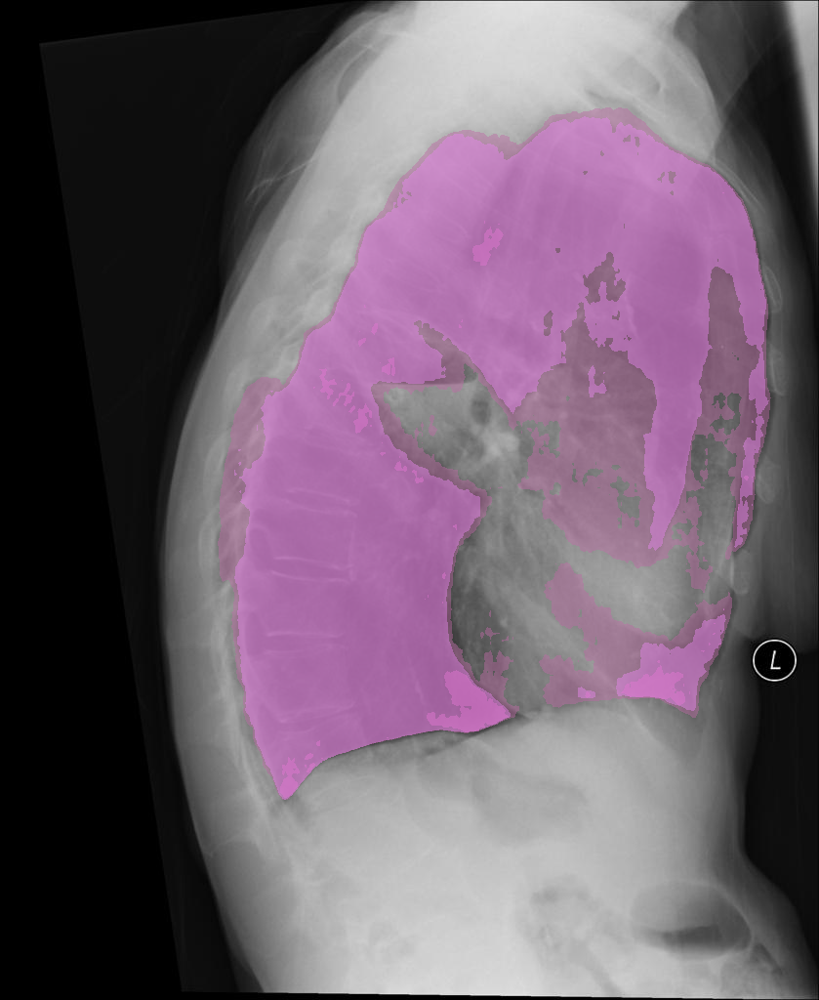 |  |  |

**Radiopaedia 原始图片 caption：**

<pre>Hyperinflated lungs. Large rounded mass in the right lung with an air-fluid level.</pre>

**原始图片 caption 中文医学要点（翻译）：**

<pre>

</pre>

#### Study 0 的 8 个模型 Single-modality caption 对比

<strong>InternVL3-14B</strong>

**原始图像 → Single-modality caption 回答**

英文原始回答：

<pre>The images provided are chest X-rays of a 75-year-old female presenting with hemoptysis (coughing up blood). Let's analyze each image with this clinical presentation in mind.

### Image 1: Frontal (Posteroanterior) View X-ray

**Observations:**
1. **Heart and Mediastinum**: The heart size appears normal without any obvious widening of the mediastinum.
2. **Lungs**: The lungs are evaluated for any signs of consolidation, masses, or pleural effusion. On initial inspection, the lung fields appear to be clear without any obvious masses or infiltrates.
3. **Ribs and Bones**: There are no visible fractures or lytic lesions.
4. **Diaphragm**: The diaphragms appear in their usual position without elevation or abnormal contour.
5. **Trachea and Bronchi**: The trachea is midline, which is normal.

### Image 2: Lateral View X-ray

**Observations:**
1. **Heart and Mediastinum**: Again, the heart size appears normal and the mediastinal contours are not widened.
2. **Lungs**: No obvious signs of masses, consolidation, or effusion are seen. Both lung fields extend to the costophrenic angles.
3. **Ribs and Bones**: No lytic lesions or fractures noted.
4. **Trachea and Bronchi**: The trachea remains midline and there's no apparent shift seen in the bronchi.

### Diagnosis and Interpretation:

Given that the patient presents with hemoptysis, several differential diagnoses come to mind, including:

1. **Pulmonary Infection**: Such as pneumonia. However, there is no significant consolidation seen on these X-rays.
2. **Pulmonary Embolism**: Usually presents with pleural-based wedge-shaped infiltrates, which are not distinctly visible here.
3. **Bronchial or Lung Mass**: Hemoptysis can be a symptom of a bronchial lesion or a lung mass. Any definitive mass would have shown up as a localized opacity, which is not prominently seen here.
4. **Vascular Rupture or Bronchial Artery Anomaly**: These are less common but can present with hemoptysis. Such anomalies might not be clearly visible on plain X-rays but need further imaging with CT angiography if clinically suspected.
5. **Chronic Obstructive Pulmonary Disease (COPD)**: Often seen in elderly patients, COPD exacerbation can sometimes present with hemoptysis, but the imaging in this case does not reveal acute changes.

**Conclusion:**
The initial interpretation of these X-rays does not reveal obvious signs of masses, significant consolidation, or effusions that could directly explain the hemoptysis. However, subtle findings or lesions could be missed on plain films. Given these findings and the clinical presentation, further investigation may be warranted, such as:

1. **CT Scan**: To better delineate subtle findings such as small masses, vascular abnormalities, or bronchial changes.
2. **Bronchoscopy**: Direct visualization of the airways can help identify any lesions causing hemoptysis.
3. **Ventilation-Perfusion Scan**: To rule out pulmonary embolism if clinically indicated.

In elderly patients with hemoptysis, a methodical approach involving imaging and possibly bronchoscopic evaluation is essential to identify the underlying cause accurately. The presented X-rays do not definitively diagnose the cause of hemoptysis but do not show major abnormalities that suggest common causes like pneumonia or pulmonary embolism.</pre>

中文医学要点（翻译）：

<pre>

</pre>

**原始图像 + Segmentation → Single-modality caption 回答**

英文原始回答：

<pre>The images provided are chest X-rays of a 75-year-old female who was referred to the hospital for hemoptysis (coughing up blood). The X-rays include a frontal view and a lateral view of the chest. Here’s a detailed analysis and interpretation based on the image descriptions and their segmentations:

### Observations:

1. **Frontal Chest X-ray (Image 1):**
   - The segmentation of the lungs shows the right lung is largely clear with few indications of abnormality. However, the left lung shows several regions of increased opacity, indicative of potential consolidation, masses, or other abnormalities.
   - There are areas of irregularities or opacities apparent in the left lung’s mid-to-lower zones.

2. **Lateral Chest X-ray (Image 2):**
   - The lateral view further demonstrates the opacities in the left lung. There is an increased density area suggestive of pathology.
   - The emphysematous bullae (air spaces within the lung) can be seen, which are a normal finding but may be exaggerated in older patients or those with chronic lung diseases.

### Possible Diagnosis:

Given the patient’s age and presentation with hemoptysis, the following differential diagnoses need to be considered:

1. **Pulmonary Infection:**
   - The opacities could represent an area of pneumonia. In elderly patients, pneumonia can present with less typical radiographic findings and may be complicated by other underlying conditions.
   
2. **Lung Cancer:**
   - Hemoptysis is a classic symptom of malignancy, and the opacities or masses in the left lung may indicate a tumor. The patient’s age increases the likelihood of this diagnosis.

3. **Pulmonary Embolism:**
   - Although less likely to present with hemoptysis, pulmonary embolism can sometimes be associated with cough and chest pain. The X-ray may not show specific signs, often requiring further imaging like CT pulmonary angiography.

4. **Chronic Obstructive Pulmonary Disease (COPD):**
   - The presence of bullae suggests emphysema, which is often seen in COPD. While COPD doesn’t typically cause hemoptysis, acute exacerbations can sometimes be accompanied by this symptom.

5. **Tuberculosis:**
   - Another consideration in older individuals, especially with chronic cough, is tuberculosis. The imaging can be atypical, but certain patterns may suggest this diagnosis.

### Recommendation for Further Evaluation:

1. **High-Resolution CT (HRCT):**
   - Provides more detailed imaging to better characterize the lung opacities and identify the exact cause (e.g., nodules, masses, consolidation).

2. **Sputum Analysis:**
   - To check for any infectious causes like bacteria or tuberculosis.

3. **Biopsy:**
   - If malignancy is suspected, a biopsy may be necessary to confirm the diagnosis.

4. **Blood Tests:**
   - To evaluate for signs of infection, inflammation, or other systemic issues.

### Conclusion:

Given the patient’s symptoms and radiographic findings, a combination of pulmonary infection, malignancy, and chronic lung disease should be considered. Immediate follow-up with advanced diagnostic imaging and further clinical evaluation is warranted to establish a definitive diagnosis and guide appropriate management.</pre>

中文医学要点（翻译）：

<pre>

</pre>

**Segmentation 对 caption 的影响分析：**

<pre>

</pre>

<strong>InternVL3.5-14B</strong>

**原始图像 → Single-modality caption 回答**

英文原始回答：

<pre>&lt;think&gt;
The patient is a 75-year-old female referred for haemoptysis, which is the presence of blood in sputum, often indicating pulmonary or respiratory issues. The chest X-ray images need to be analyzed for signs of pathology related to this symptom.

**Frontal View Analysis:**
- The lungs appear clear with no obvious consolidations or masses.
- The heart size is normal, and the mediastinum is not widened.
- A notable finding is a circular opacity in the right mid-lung zone. This could represent a pulmonary nodule, calcification, or possibly a mass.
- The diaphragm and costophrenic angles are clear, no pleural effusion is seen.

**Lateral View Analysis:**
- The lateral view shows the same circular opacity in the right mid-lung zone, confirming its presence.
- The trachea is midline, and the heart shadow is normal in size.
- The bony structures, including the ribs and spine, show no acute abnormalities.

**Differential Diagnosis for Haemoptysis:**
1. **Infectious Causes:** Pneumonia, tuberculosis, or fungal infections can cause haemoptysis. However, the X-ray does not show typical signs of infection like consolidation or cavitation.
2. **Malignancy:** Lung cancer is a significant concern, especially in an elderly patient. The presence of a pulmonary nodule raises suspicion for a primary lung tumor or metastasis.
3. **Vascular Causes:** Pulmonary embolism or arteriovenous malformations can cause bleeding. The X-ray does not show overt signs, but further imaging like a CT pulmonary angiogram might be needed.
4. **Chronic Conditions:** Chronic obstructive pulmonary disease (COPD) or bronchiectasis can present with haemoptysis. The X-ray does not show hyperinflation or bronchial wall thickening typical of these conditions.
5. **Other:** Foreign body aspiration, trauma, or coagulopathies should also be considered, though less likely without additional history.

**Conclusion:**
The most concerning finding is the pulmonary nodule in the right mid-lung zone. Given the patient's age and presentation with haemoptysis, the possibility of a primary lung malignancy or metastatic disease is high. Further evaluation with a CT scan of the chest is warranted to better characterize the nodule and assess for any additional lesions. Bronchoscopy or biopsy may be necessary for definitive diagnosis.
&lt;/think&gt;

**Diagnosis:**

The chest X-ray reveals a pulmonary nodule in the right mid-lung zone, which, in the context of a 75-year-old female presenting with haemoptysis, raises significant concern for a primary lung malignancy or metastatic disease. 

**Recommendations:**

1. **CT Chest Scan:** To further evaluate the pulmonary nodule, assess for additional lesions, and obtain detailed imaging for better characterization.
2. **Bronchoscopy:** If the nodule is accessible, to obtain a biopsy for histopathological diagnosis.
3. **Clinical Correlation:** Review the patient's medical history, risk factors (e.g., smoking history, exposure to carcinogens), and perform a thorough physical examination.
4. **Laboratory Tests:** Complete blood count, coagulation profile, and possibly sputum analysis to rule out infectious or other systemic causes.

Early and thorough evaluation is crucial given the potential severity of the findings.</pre>

中文医学要点（翻译）：

<pre>

</pre>

**原始图像 + Segmentation → Single-modality caption 回答**

英文原始回答：

<pre>&lt;think&gt;
The patient is a 75-year-old female referred for hemoptysis, which is the medical term for coughing up blood. Hemoptysis can range from mild to life-threatening and is a symptom that requires thorough investigation. The chest X-rays provided include both frontal and lateral views, and the segmentation images highlight various lung conditions.

**Analysis of the X-ray Images:**

1. **Frontal View (Image 1):**
   - The frontal chest X-ray shows a clear delineation of the lungs, heart, and diaphragm. 
   - The segmentation images indicate areas of emphysematous bullae, which are air-filled spaces caused by the destruction of alveolar walls, typically seen in emphysema. 
   - There are highlighted areas suggesting the presence of an air-fluid level, which could indicate a possible cavitary lesion or infection.

2. **Lateral View (Image 2):**
   - The lateral view corroborates the findings from the frontal view, showing the extent of the emphysematous changes and potential bullae.
   - The segmentation images again highlight regions with possible emphysematous bullae and air-fluid levels, consistent with chronic obstructive pulmonary disease (COPD) or infections like tuberculosis.

**Clinical Correlation:**
- The patient's age and presentation with hemoptysis raise concern for several conditions:
  - **Chronic Obstructive Pulmonary Disease (COPD):** Emphysema can lead to bullae formation, which may rupture and cause hemoptysis.
  - **Tuberculosis:** Can cause cavitary lesions with an air-fluid level, leading to hemoptysis.
  - **Lung Cancer:** Especially in older patients, a cavitary mass could be indicative.
  - **Fungal Infections:** Such as aspergillosis, which can cause cavitary lesions.

**Differential Diagnosis:**
- **Emphysema:** Given the presence of bullae, but typically does not cause significant hemoptysis unless there is a rupture.
- **Cavitary Infection (e.g., Tuberculosis, Bacterial):** The air-fluid levels suggest an infectious etiology.
- **Lung Abscess:** Could present with an air-fluid level and hemoptysis.
- **Neoplasm:** A cavitary tumor could present similarly.

**Further Investigations:**
- **CT Scan:** To better characterize the lesions, assess for cavitation, and evaluate the extent of emphysema.
- **Sputum Analysis:** To check for infection (e.g., acid-fast bacilli for tuberculosis).
- **Bronchoscopy:** If accessible, to directly visualize the airways and obtain biopsies if necessary.
- **Blood Tests:** Including inflammatory markers and possibly a CBC.

**Conclusion:**
The X-ray findings of emphysematous bullae and potential air-fluid levels, combined with the patient's presentation of hemoptysis, suggest a possible diagnosis of a cavitary infection (such as tuberculosis) or a complication of COPD (like a ruptured bulla). However, given the age and symptoms, a neoplastic process cannot be excluded and should be investigated further.
&lt;/think&gt;

### Diagnosis:
**Cavitary Lesion with Emphysematous Changes**

**Detailed Explanation:**

The chest X-rays of a 75-year-old female patient, presented with hemoptysis, reveal significant findings:

1. **Emphysematous Bullae:**
   - **Observation:** Both frontal and lateral X-rays show areas highlighted as emphysematous bullae, indicative of alveolar wall destruction typical in emphysema.
   - **Clinical Relevance:** Emphysema can lead to the formation of bullae, which are large air-filled spaces. These bullae can occasionally rupture, causing hemoptysis.

2. **Air-Fluid Levels:**
   - **Observation:** Segmentation images indicate regions with air-fluid levels, suggesting the presence of cavitary lesions.
   - **Clinical Relevance:** Air-fluid levels are often seen in infections (e.g., tuberculosis, bacterial abscess) or necrotic tumors. In the context of emphysema, this could represent a superimposed infection or a ruptured bulla with secondary infection.

3. **Differential Diagnoses:**
   - **Chronic Obstructive Pulmonary Disease (COPD):** The presence of bullae supports COPD, but significant hemoptysis is unusual unless complicated by infection or rupture.
   - **Tuberculosis:** A cavitary lesion with an air-fluid level raises suspicion for tuberculosis, especially in older patients.
   - **Lung Cancer:** A cavitary mass, particularly in an elderly patient, necessitates consideration of malignancy.
   - **Fungal Infections:** Such as aspergillosis, which can cause cavitary lesions.

4. **Recommended Further Investigations:**
   - **High-Resolution CT Scan:** To delineate the nature of the cavitary lesions, assess for any masses, and evaluate the extent of emphysematous changes.
   - **Microbiological Studies:** Sputum analysis for acid-fast bacilli (to rule out tuberculosis) and cultures for bacterial infections.
   - **Bronchoscopy:** For direct visualization and biopsy of the lesion if accessible.
   - **Laboratory Tests:** Inflammatory markers (e.g., CRP, ESR) and complete blood count (CBC) to assess for infection or inflammation.

5. **Management Considerations:**
   - **Infection Control:** If an infectious etiology is confirmed, appropriate antibiotics or antifungal therapy should be initiated.
   - **Oncological Evaluation:** If malignancy is suspected, referral to a pulmonologist or oncologist for further evaluation and possible biopsy.
   - **Monitoring:** Regular follow-up with imaging to monitor the progression or resolution of the cavitary lesion.

**Conclusion:**
The patient's presentation of hemoptysis combined with radiographic evidence of emphysematous bullae and cavitary lesions necessitates a thorough evaluation to differentiate between infectious, inflammatory, and neoplastic causes. A multidisciplinary approach involving pulmonology, radiology, and possibly infectious disease consultation is recommended to establish an accurate diagnosis and appropriate management plan.</pre>

中文医学要点（翻译）：

<pre>

</pre>

**Segmentation 对 caption 的影响分析：**

<pre>

</pre>

<strong>Lingshu-32B</strong>

**原始图像 → Single-modality caption 回答**

英文原始回答：

<pre>The chest X-rays show a large right-sided pleural effusion with associated atelectasis of the right middle and lower lobes. The heart size is normal, and there is no evidence of pulmonary edema or other significant abnormalities in the lungs. Given the patient's age and presentation with haemoptysis, the most likely diagnosis is a large right-sided pleural effusion, which could be due to various underlying causes such as malignancy, infection, or other conditions. Further clinical evaluation and investigation would be necessary to determine the specific etiology of the pleural effusion.</pre>

中文医学要点（翻译）：

<pre>

</pre>

**原始图像 + Segmentation → Single-modality caption 回答**

英文原始回答：

<pre>Findings: The lungs are hyperexpanded with coarse interstitial markings consistent with chronic pulmonary disease. There is no focal consolidation or pleural effusion. Heart size is normal. Impression: 1. Hyperexpanded lungs with coarse interstitial markings consistent with chronic pulmonary disease. No evidence of pneumonia.</pre>

中文医学要点（翻译）：

<pre>

</pre>

**Segmentation 对 caption 的影响分析：**

<pre>

</pre>

<strong>MedGemma-27B-IT</strong>

**原始图像 → Single-modality caption 回答**

英文原始回答：

<pre>Here's an analysis of the provided chest X-ray images:

**Patient Information:**

*   Age: 75 years
*   Gender: Female
*   Presentation: Haemoptysis (coughing up blood)

**Image Analysis:**

*   **Image 1 (Frontal View):**
    *   Shows the chest from the front.
    *   There is a large, well-defined, rounded opacity (mass) in the right lower lung field.
    *   The mass appears to be located in the lower lobe, possibly near the hilum.
    *   The left lung appears relatively clear.
    *   The heart size appears normal.
    *   The mediastinum is midline.
    *   There is no evidence of pleural effusion or pneumothorax.

*   **Image 2 (Lateral View):**
    *   Shows the chest from the side.
    *   Confirms the presence of a large mass in the right lower lung.
    *   The mass appears to be located posteriorly, likely in the lower lobe.
    *   It seems to be partially obscuring the right hemidiaphragm.
    *   The left lung and mediastinal structures are visualized.

**Interpretation and Diagnosis:**

*   The presence of a large, well-defined, rounded mass in the right lower lung field on both frontal and lateral views is highly suggestive of a lung tumor (neoplasm).
*   Given the patient's age (75 years) and presentation with haemoptysis, lung cancer is the most likely diagnosis.
*   The mass appears relatively well-circumscribed, which could suggest a primary lung cancer or potentially a metastasis, although primary is more common in this context.
*   Further investigation is required to determine the exact nature of the mass (benign vs. malignant), its histological type, and the extent of the disease (staging). This would typically involve CT scans, bronchoscopy with biopsy, or other imaging modalities.

**Summary:**

The chest X-rays show a large mass in the right lower lung, highly suspicious for lung cancer in a 75-year-old female presenting with haemoptysis. Further workup is essential.</pre>

中文医学要点（翻译）：

<pre>

</pre>

**原始图像 + Segmentation → Single-modality caption 回答**

英文原始回答：

<pre>**Patient Information:**
*   Age: 75 years
*   Gender: Female
*   Presentation: GP referral for haemoptysis (coughing up blood)

**Image Analysis:**

*   **Image 1 (Frontal X-ray):**
    *   Shows the chest from the front.
    *   The right lung appears hyperinflated compared to the left, suggesting possible emphysema or chronic obstructive pulmonary disease (COPD).
    *   There is a large, well-defined, air-filled space (bulla) in the right upper lung field, adjacent to the mediastinum. This is consistent with an emphysematous bulla.
    *   The bulla appears to contain an air-fluid level, which is concerning. This could indicate infection (e.g., abscess), bleeding into the bulla, or potentially a malignancy.
    *   The mediastinum is slightly shifted to the left, which can occur with large bullae or volume loss in the contralateral lung.
    *   The heart size appears normal.
    *   The diaphragms are visible, and the costophrenic angles appear sharp, suggesting no significant pleural effusion.
    *   The bony structures appear intact.

*   **Image 2 (Lateral X-ray):**
    *   Shows the chest from the side.
    *   Confirms the presence of a large bulla in the right upper lung.
    *   The air-fluid level within the bulla is also visible on the lateral view.
    *   The overall lung fields and mediastinal structures are visualized.

**Combined Interpretation:**

The patient is a 75-year-old female presenting with haemoptysis. The chest X-rays (both frontal and lateral) show a large emphysematous bulla in the right upper lung with an air-fluid level.

**Diagnosis:**

The findings are highly suggestive of a complicated emphysematous bulla. The presence of an air-fluid level within the bulla raises concerns for several possibilities, including:

1.  **Infection:** A lung abscess within the bulla.
2.  **Bleeding:** Haemorrhage into the bulla, which could explain the haemoptysis.
3.  **Malignancy:** A tumour within the bulla, potentially causing bleeding or secondary infection.
4.  **Aspergilloma:** A fungal ball (usually Aspergillus) within a pre-existing cavity (like a bulla).

Given the patient's age, smoking history (implied by emphysema/bullae), and presentation with haemoptysis, the most likely causes are infection, bleeding (possibly from a malignancy or fragile vessels within the bulla), or malignancy itself. An aspergilloma is also a possibility.

**Recommendations:**

Further investigation is required to determine the exact nature of the air-fluid level within the bulla. This typically involves:

*   **CT scan of the chest:** Provides much better detail of the lung parenchyma, bulla, and mediastinum. It can help characterize the contents of the bulla (fluid, solid mass, fungal ball) and assess for underlying malignancy or infection.
*   **Sputum cultures:** To identify potential bacterial or fungal infections.
*   **Bronchoscopy:** May be considered for direct visualization, biopsy, or lavage of the affected area.

The presence of haemoptysis and a complicated bulla warrants prompt evaluation and management.</pre>

中文医学要点（翻译）：

<pre>

</pre>

**Segmentation 对 caption 的影响分析：**

<pre>

</pre>

<strong>MedMO-8B</strong>

**原始图像 → Single-modality caption 回答**

英文原始回答：

<pre>The heart size is normal. The hilar and mediastinal contours are normal. There is no pleural effusion. The lungs are clear. There is no pneumothorax.</pre>

中文医学要点（翻译）：

<pre>

</pre>

**原始图像 + Segmentation → Single-modality caption 回答**

英文原始回答：

<pre>A 75-year-old female with a history of COPD presents with a 3-day history of cough productive of blood tinged sputum. Chest X-ray shows a large left sided pleural effusion.</pre>

中文医学要点（翻译）：

<pre>

</pre>

**Segmentation 对 caption 的影响分析：**

<pre>

</pre>

<strong>Qwen3-VL-4B</strong>

**原始图像 → Single-modality caption 回答**

英文原始回答：

<pre>Based on the patient’s presentation of haemoptysis (coughing up blood) and the radiographic images, the following analysis is provided:

**Image Description:**

- **Image 1 (Frontal X-ray):** The frontal chest radiograph shows a normal-appearing thoracic cage with no obvious pneumothorax, pleural effusion, or large lung masses. The heart size appears normal, and the bronchovascular markings are visible without significant consolidation or infiltrates. There is no evidence of acute airway obstruction or major structural abnormality.

- **Image 2 (Lateral X-ray):** The lateral view corroborates the frontal image. It reveals a normal cardiac silhouette and no signs of pneumothorax or significant mediastinal shift. The diaphragm is at normal level, and there is no evidence of free air under the diaphragm or large pleural effusions. The lung fields are clear, and the bronchovascular structures are within normal limits.

**Clinical Context:**

The patient is a 75-year-old female referred for haemoptysis. Haemoptysis in the elderly can be caused by a variety of conditions, including:

- **Bronchiectasis** (chronic, often with recurrent infections and productive cough)
- **Pulmonary tuberculosis** (though less likely in the absence of systemic symptoms like fever or weight loss)
- **Bronchogenic carcinoma** (common in elderly, often with a history of smoking)
- **Pulmonary embolism** (usually with dyspnea and tachycardia, not typically presenting with isolated haemoptysis)
- **Infections** (e.g., pneumonia, fungal infections)
- **Rheumatoid arthritis or vasculitis** (less likely without other systemic symptoms)
- **Bronchitis** (acute or chronic, often with cough and sputum production)

**Radiological Findings:**

The chest X-rays are unremarkable. There is no evidence of:

- Consolidation or infiltrates (suggesting infection or malignancy)
- Pleural effusion or pneumothorax
- Large masses or nodules
- Bronchial obstruction

**Conclusion:**

The chest X-rays are normal and do not reveal any acute pathology that would explain the haemoptysis. This is consistent with a **non-acute, non-structural cause** of haemoptysis, such as:

- **Chronic bronchitis or bronchiectasis** (especially if the patient has a history of smoking or chronic cough)
- **Malignancy** (e.g., bronchogenic carcinoma, which may be asymptomatic or present with minimal radiographic changes in the elderly)
- **Other less common causes** such as pulmonary vasculitis or coagulopathy

**Recommendation:**

Given the normal radiographs, further diagnostic workup is required to identify the source of haemoptysis. This should include:

- **Sputum analysis** (for infection, malignancy, or other pathogens)
- **Chest CT scan** (to detect subtle abnormalities such as bronchiectasis, small nodules, or early malignancy)
- **Bronchoscopy** (if indicated based on clinical suspicion)
- **Blood tests** (CBC, coagulation profile, inflammatory markers)
- **History and physical examination** (including smoking history, recent infections, or systemic symptoms)

The diagnosis is **not definitively established by imaging alone** and requires further investigation to identify the underlying cause of haemoptysis.

**Final Diagnosis (based on imaging alone):**  
**Normal chest radiographs — no acute or structural pathology evident.**

**Recommendation:**  
Further diagnostic testing (e.g., CT chest, bronchoscopy, sputum analysis) is required to determine the cause of haemoptysis.</pre>

中文医学要点（翻译）：

<pre>

</pre>

**原始图像 + Segmentation → Single-modality caption 回答**

英文原始回答：

<pre>Based on the patient's presentation of haemoptysis (coughing up blood) and the radiological findings, the most likely diagnosis is **pulmonary tuberculosis (TB)**, with a high probability of **active pulmonary TB with cavitary lesion**.

Here is the reasoning:

1.  **Patient Profile**: A 75-year-old female presenting with haemoptysis is at increased risk for pulmonary TB, especially if there is a history of exposure or if she is immunocompromised. Haemoptysis is a classic symptom of TB, often resulting from necrotic cavitary lesions in the lung parenchyma.

2.  **Radiological Findings (Image 1 - Frontal X-ray)**:
    *   The frontal view shows a **right lower lobe emphysematous bulla** (a large, air-filled cavity) and an **air-fluid level** within the right lung field. The presence of an air-fluid level is a hallmark of a **cavitary lesion**.
    *   The bulla is large and located in the right lower lobe, which is consistent with the common location of TB cavities.
    *   The air-fluid level indicates that the cavity contains both air and fluid, which is a classic sign of an active, necrotic lesion, often seen in TB.

3.  **Radiological Findings (Image 2 - Lateral X-ray)**:
    *   The lateral view confirms the presence of the cavitary lesion in the right lower lobe. The air-fluid level is more clearly visible in the lateral projection, reinforcing the diagnosis of a cavitary lesion.
    *   The lateral view also shows the heart and mediastinum, which appear normal, ruling out other causes like a mediastinal mass or significant heart disease.

4.  **Segmentation Analysis**:
    *   The segmentation results from Medical-SAM3 and BiomedParse specifically identify the **right lung** as containing an **emphysematous bulla** and **air-fluid level**, directly correlating with the radiological findings.
    *   The combined segmentation from TorchXRayVision shows the lung fields, diaphragm, and heart, which appear normal in structure, but the presence of the cavitary lesion is the key abnormality.

**Conclusion**:

The combination of the patient's age, gender, presentation of haemoptysis, and the radiological findings of a **cavitary lesion with an air-fluid level in the right lower lobe** strongly suggests **active pulmonary tuberculosis**. This is a serious condition requiring immediate investigation and treatment. The patient should be referred for a sputum test for acid-fast bacilli (AFB) and a chest CT scan for further characterization and to rule out other causes such as lung cancer or fungal infection. Treatment typically involves a 6-month course of anti-TB medications.</pre>

中文医学要点（翻译）：

<pre>

</pre>

**Segmentation 对 caption 的影响分析：**

<pre>

</pre>

<strong>Qwen3-VL-8B</strong>

**原始图像 → Single-modality caption 回答**

英文原始回答：

<pre>Based on the provided patient data (75-year-old female, referred for haemoptysis) and the chest X-ray images (frontal and lateral views), here is the analysis:

**Image Description:**

*   **Frontal View (Image 1):** This view shows a relatively clear lung field bilaterally. There is no obvious consolidation, mass, or pleural effusion. The cardiac silhouette is normal in size and shape. The trachea is midline. There is a small, well-defined, round, radiopaque object visible in the right lower lung field, which appears to be a foreign body (likely a button battery or similar object) or possibly a calcified granuloma. The left lung field is clear. The diaphragm is well-defined.

*   **Lateral View (Image 2):** This view confirms the presence of the small, dense, round object in the right lower lung field. It is located anterior to the spine, consistent with its position in the right lower lobe. The lateral view also provides a better assessment of the mediastinum and heart, which appear normal. There is no evidence of pneumothorax or significant pleural thickening.

**Diagnosis:**

The chest X-ray is largely unremarkable for acute pathology. The most significant finding is the presence of a small, round, radiopaque foreign body in the right lower lung field.

**Clinical Implication:**

Given the patient's age and the presentation of haemoptysis, the most likely cause is **a foreign body aspiration**. This is a common and potentially serious condition in elderly patients, often presenting with coughing, wheezing, or haemoptysis. The foreign body (likely a button battery or similar) is causing local irritation or obstruction, leading to bleeding.

**Recommendation:**

This finding requires urgent further investigation. The patient should be referred for **bronchoscopy** to visualize and remove the foreign body. Delayed removal can lead to complications such as airway obstruction, infection, or bronchiectasis. The haemoptysis should be managed appropriately while awaiting bronchoscopy.

**Note:** While the X-ray is otherwise unremarkable, the presence of a foreign body is a critical finding that must be addressed promptly. The patient's age and symptoms are highly suggestive of this diagnosis.</pre>

中文医学要点（翻译）：

<pre>

</pre>

**原始图像 + Segmentation → Single-modality caption 回答**

英文原始回答：

<pre>Based on the provided patient data and imaging, here is the analysis:

**Patient Summary:**
- **Age:** 75 years
- **Gender:** Female
- **Presenting Complaint:** Haemoptysis (coughing up blood)
- **Imaging:** Chest X-ray (frontal and lateral views)

**Image Analysis:**

The chest X-rays, particularly the lateral view, reveal a **large, complex, cavitary lesion in the right lung**, with associated **air-fluid level**. This is a key finding.

- **Frontal View (Image 1):** Shows a large, irregularly shaped opacity in the right upper lobe. The lesion has areas of lucency (air) and density (fluid or tissue), consistent with a cavitary process. The heart and mediastinum appear normal in position.
- **Lateral View (Image 2):** This view is critical. It clearly demonstrates the **air-fluid level** within the cavitary lesion, which is a hallmark of a **pyogenic (bacterial) lung abscess** or a **cavitary lung tumor with necrosis**. The lesion is located in the right upper lobe, and the air-fluid level is visible as a meniscus within the cavity.

**Diagnosis:**

The most likely diagnosis is a **right upper lobe lung abscess**.

**Rationale:**

1.  **Age and Presentation:** A 75-year-old female presenting with haemoptysis is at increased risk for serious lung pathology, including infection, malignancy, or vascular disease. Haemoptysis is a common symptom of lung abscesses.
2.  **Imaging Findings:**
    - The **large cavitary lesion** is the most significant finding.
    - The **presence of an air-fluid level** is a classic radiological sign of a lung abscess, indicating the presence of pus within the cavity.
    - The lesion is located in the **right upper lobe**, a common site for aspiration-related infections.
3.  **Differential Diagnosis:**
    - **Lung cancer with necrosis:** While possible, the presence of an air-fluid level is less characteristic of a solid tumor with necrosis compared to an abscess.
    - **Tuberculosis:** Can cause cavitation, but typically presents with more extensive infiltrates and may have a different appearance (e.g., caseating granulomas). The air-fluid level is not typical.
    - **Fungal infection (e.g., aspergillosis):** Can cause cavitation, but the air-fluid level is not a typical feature.
    - **Pulmonary embolism:** Would not cause a cavitary lesion or air-fluid level.

**Conclusion:**

The chest X-ray findings, particularly the air-fluid level within a cavitary lesion in the right upper lobe, strongly suggest a **right upper lobe lung abscess**. This is a serious infection that requires prompt diagnosis and treatment, typically with antibiotics and possibly drainage. The patient should be referred for further evaluation, including a CT scan of the chest and sputum culture to confirm the diagnosis and identify the causative organism.

**Note:** While the segmentation masks provided by different models (Medical-SAM3, BiomedParse, TorchXRayVision) are useful for visualizing anatomical structures, they do not directly identify the pathology. The key diagnostic finding is the **air-fluid level within a cavitary lesion**, which is best appreciated on the lateral view. The segmentation masks for the right lung and emphysematous bulla are likely artifacts or misidentifications in this context, as the primary finding is the abscess.</pre>

中文医学要点（翻译）：

<pre>

</pre>

**Segmentation 对 caption 的影响分析：**

<pre>

</pre>

<strong>Qwen3-VL-32B</strong>

**原始图像 → Single-modality caption 回答**

英文原始回答：

<pre>**Clinical Context:**  
75-year-old female referred by GP for **haemoptysis** (coughing up blood). This is a red flag symptom, especially in older adults, and raises concern for serious underlying pathology such as lung cancer, bronchitis, tuberculosis, or pulmonary embolism.

---

**Image 1: Frontal Chest X-ray**

- **Lung Fields:**  
  - The right lung appears largely clear with normal vascular markings.
  - The left lung also shows normal aeration and vascular distribution.
  - There is **no evidence of consolidation, pneumonia, or overt mass** in the lung parenchyma.

- **Cardiomediastinal Silhouette:**  
  - The heart size is within normal limits.
  - The trachea is midline.
  - The mediastinum appears unremarkable.

- **Bones and Soft Tissues:**  
  - Bony thorax (ribs, clavicles, spine) shows no fractures or lytic lesions.
  - The left hemidiaphragm is slightly elevated, which may be due to a small volume of air or gas in the stomach (normal variant) or mild diaphragmatic eventration.

- **Notable Finding:**  
  - In the **right lower zone**, there is a **well-defined, round, radiopaque opacity** with a smooth margin, measuring approximately 2–3 cm in diameter. It is located in the **posterior segment of the right lower lobe**.
  - This lesion is **dense and calcified**, with a **central lucency** (likely a "popcorn" or "eggshell" calcification pattern), suggesting a benign etiology.

---

**Image 2: Lateral Chest X-ray**

- Confirms the location of the **right lower lobe lesion**.
- The opacity is seen **posterior to the heart and anterior to the spine**, consistent with a **posterior segmental origin** in the right lower lobe.
- The lesion appears **well-circumscribed** and **dense**, with **central lucency**.
- No signs of pleural effusion, pneumothorax, or rib destruction.

---

**Interpretation &amp; Differential Diagnosis:**

The **round, calcified opacity** in the right lower lobe is most likely a **benign pulmonary nodule**, specifically:

- **Healed granuloma** (e.g., from prior tuberculosis or fungal infection like histoplasmosis).
- **Hamartoma** (less likely due to calcification pattern, but possible).
- **Calcified metastasis** (rare, but possible in elderly patients with history of malignancy — however, no other lesions or risk factors noted).

Given the **age of the patient** and the **presence of haemoptysis**, a **malignant lesion** must be considered, but the **calcification pattern** is reassuring for benignity.

---

**Important Consideration:**

While the nodule appears benign, **haemoptysis in a 75-year-old** is concerning for **lung cancer**, even in the presence of a calcified nodule. It is possible that the haemoptysis is due to **another cause** (e.g., bronchitis, bronchiectasis, or even a separate small non-calcified lesion not visible on X-ray).

---

**Final Diagnosis:**

**Benign calcified pulmonary nodule (likely granuloma) in the right lower lobe, with haemoptysis as a separate symptom requiring further investigation.**

---

**Recommendations:**

1. **CT Chest with contrast** — to better characterize the nodule (confirm calcification pattern, assess for any non-calcified component), evaluate for other lesions, and assess the bronchial tree for possible source of haemoptysis (e.g., bronchial wall thickening, bronchiectasis, or small endobronchial lesion).

2. **Bronchoscopy** — if CT shows a suspicious lesion or if haemoptysis persists, to visualize the airways and obtain biopsy if needed.

3. **Sputum cytology** — to rule out malignancy.

4. **Pulmonary function tests** — if considering intervention.

5. **Consider TB screening** — given the possibility of a granuloma from prior infection.

---

**Conclusion:**

The chest X-rays show a **benign-appearing calcified nodule** in the right lower lobe. However, **haemoptysis in an elderly patient necessitates a thorough workup** to exclude malignancy or other causes. **CT chest is the next essential step.**</pre>

中文医学要点（翻译）：

<pre>

</pre>

**原始图像 + Segmentation → Single-modality caption 回答**

英文原始回答：

<pre>**Clinical Context:**
- **Patient:** 75-year-old female
- **Presentation:** Haemoptysis (coughing up blood), referred by GP
- **Imaging:** Frontal and lateral chest X-rays

---

**Image Analysis:**

### **Frontal Chest X-ray (Image 1):**
- **Lung Fields:**
  - **Right Lung:** Appears relatively clear with normal vascular markings. A large, well-defined, radiolucent area is present in the **right lower zone**, consistent with a **large bulla** (likely emphysematous). The bulla appears to occupy a significant portion of the right lower lung field and may be displacing adjacent structures.
  - **Left Lung:** Shows **patchy areas of increased opacity** in the **upper and mid zones**, with **loss of normal lung markings** in those regions. This suggests **emphysematous changes** or possible **fibrosis**. There is also **volume loss** in the left upper lobe, which may be associated with chronic obstructive pulmonary disease (COPD) or fibrotic changes.
  - **Air-Fluid Level?** Not clearly visible on frontal view, but the large bulla may contain some fluid or be associated with a cystic lesion.

- **Cardiomediastinum:**
  - Heart size appears normal.
  - No obvious cardiomegaly.
  - Mediastinum is central, no widening.

- **Diaphragm:**
  - Right diaphragm is slightly elevated, possibly due to the large bulla displacing the lung and diaphragm.
  - Left diaphragm appears normal.

- **Bony Thorax:**
  - No obvious fractures or lesions.
  - Rib cage appears intact.

---

### **Lateral Chest X-ray (Image 2):**
- **Lung Fields:**
  - Confirms the presence of a **large bulla** in the **posterior right lower lung zone**. The bulla appears as a large, rounded, radiolucent area with thin walls.
  - The **left lung** shows **increased density** in the **upper zone**, consistent with volume loss and possible fibrosis or consolidation. There is also **loss of normal lung architecture** in this region.
  - The **cardiac silhouette** is visible anteriorly, and the **aorta** appears normal.

- **Diaphragm:**
  - Right diaphragm is elevated, confirming findings from frontal view.
  - Left diaphragm is normal.

---

### **Segmentation Interpretation:**

- **Medical-SAM3 Segmentation (Image 1 &amp; 2):**
  - Highlights areas of **emphysematous bulla** (pink) in the right lower lobe and areas of **lung destruction** in the left upper lobe.
  - The segmentation shows **patchy, irregular lung parenchyma**, particularly on the left, consistent with **emphysema or fibrosis**.

- **BiomedParse Segmentation:**
  - Provides a more **smooth, anatomical outline** of the lungs, with less emphasis on pathology. The **right lung** is segmented normally, but the **left lung** shows some irregularities, possibly indicating pathology.

- **TorchXRayVision Segmentation:**
  - Overlays multiple structures (lungs, heart, diaphragm, mediastinum). The **heart** is well-defined, and the **diaphragm** is visible. The **lung fields** show areas of **increased radiopacity** (especially left upper zone) and **radiolucency** (right lower zone), correlating with bulla and emphysema.

---

**Diagnosis:**

Based on the clinical presentation of **haemoptysis** in a **75-year-old female** and the imaging findings, the most likely diagnosis is:

&gt; **Chronic Obstructive Pulmonary Disease (COPD) with emphysematous bullae, particularly in the right lower lobe, and possible left upper lobe fibrosis or chronic inflammation.**

---

**Differential Diagnoses to Consider:**

1. **Lung Cancer (Primary or Secondary):**
   - Haemoptysis is a red flag symptom.
   - The **left upper lobe opacity** could represent a mass or consolidation.
   - The **right lower lobe bulla** may be associated with a central tumor or bronchogenic carcinoma.
   - **Next step:** CT chest with contrast is essential to evaluate for malignancy.

2. **Bronchiectasis:**
   - Can cause haemoptysis and may show cystic changes or thickened bronchial walls.
   - Less likely here, as the findings are more consistent with bullae and volume loss.

3. **Pulmonary Fibrosis:**
   - The left upper lobe changes may suggest fibrosis, especially if there is a history of smoking or environmental exposure.

4. **Pneumothorax:**
   - A bulla can rupture and cause pneumothorax, but no evidence of pneumothorax is seen here (no visceral pleural line, no lung collapse).

---

**Clinical Implications:**

- **Haemoptysis in an elderly patient with emphysema is concerning for malignancy.**
- The **large bulla** may be a source of bleeding if it erodes into a blood vessel.
- The **left upper lobe opacity** requires urgent evaluation for possible malignancy.

---

**Recommended Next Steps:**

1. **CT Chest with Contrast** – To better characterize the bulla, left upper lobe opacity, and rule out malignancy.
2. **Pulmonary Function Tests (PFTs)** – To assess severity of COPD.
3. **Sputum Cytology** – If productive cough.
4. **Bronchoscopy** – If CT suggests a central lesion or to source the haemoptysis.
5. **Smoking History &amp; Risk Factor Assessment** – Crucial for COPD and lung cancer risk.

---

**Final Summary:**

&gt; **Chest X-ray shows emphysematous changes with a large bulla in the right lower lobe and volume loss/fibrosis in the left upper lobe. In the context of haemoptysis in a 75-year-old female, the most likely diagnosis is COPD with bullae, but malignancy must be ruled out. Immediate CT chest is indicated.**

---

**Note:** The segmentation models (Medical-SAM3, BiomedParse, TorchXRayVision) support the radiological findings, with Medical-SAM3 providing the most accurate delineation of pathological lung changes (bullae and emphysema).</pre>

中文医学要点（翻译）：

<pre>

</pre>

**Segmentation 对 caption 的影响分析：**

<pre>

</pre>

### 2.2 Study 1: CT

- **Medical-SAM3 prompts：** lung, right lower lobe, emphysematous bulla, air-fluid level
- **BiomedParse v1 prompts：** lung, right lower lobe, emphysematous bulla, air-fluid level
- **TorchXRayVision：** 不适用于该 CT study。

| Image | Original image | Medical-SAM3 | BiomedParse v1 | TorchXRayVision |
|---|---|---|---|---|
| Image 1: Axial lung window | 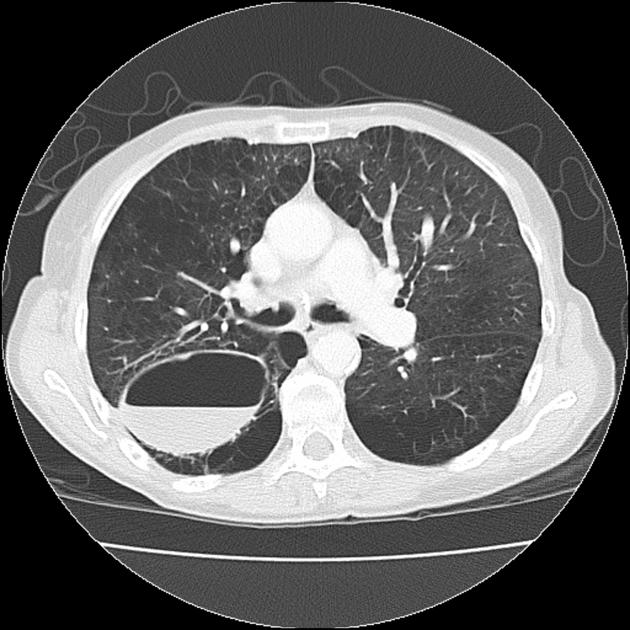 |  |  | N/A（仅适用于 X-ray） |
| Image 2: Coronal lung window | 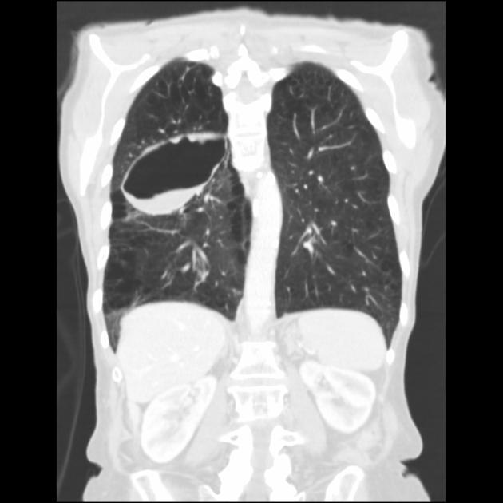 | 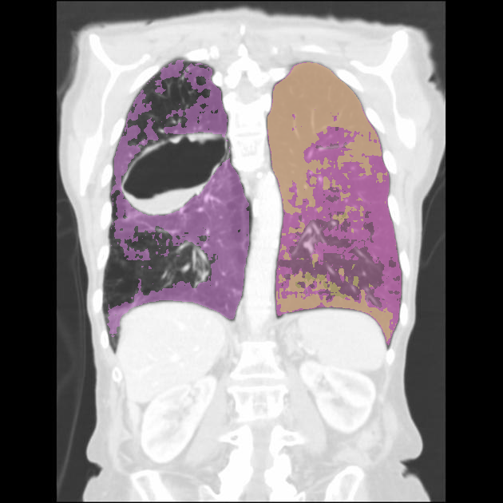 |  | N/A（仅适用于 X-ray） |

**Radiopaedia 原始图片 caption：**

<pre>Background emphysema. Large abscess in the apical segment of the RLL with an air-fluid level.</pre>

**原始图片 caption 中文医学要点（翻译）：**

<pre>

</pre>

#### Study 1 的 8 个模型 Single-modality caption 对比

<strong>InternVL3-14B</strong>

**原始图像 → Single-modality caption 回答**

英文原始回答：

<pre>Considering the patient's background information—a 75-year-old female presenting with haemoptysis, which is coughing up blood, we need to carefully analyze the provided CT images. Haemoptysis in an elderly patient warrants a thorough evaluation to rule out serious underlying causes such as infections, malignancies, or vascular abnormalities.

### Image 1: Axial CT Lung Window View
- **Structural Observation**: The axial lung window provides a cross-sectional view of the thorax. The lung fields, central airways, and mediastinum are visible.
- **Findings**:
  - **Right Lung (Upper Zone)**: There is a noticeable opacity in the right upper lobe, which could represent consolidation, a mass, or a vascular anomaly.
  - **Airways and Vascular Structures**: The central airways appear patent, but there is a subtle irregularity in the bronchial structures adjacent to the upper lobe opacity.
  - **Pleura**: No significant pleural effusion or pneumothorax is evident at this plane.
  
### Image 2: Coronal CT Lung Window View
- **Structural Observation**: The coronal view illustrates the lung fields from a front-to-back perspective.
- **Findings**:
  - **Right Lung (Upper Zone)**: The opacity observed in the axial view is visible in the right upper lobe. Its extent and characteristics can be further appreciated in this view.
  - **Central Structures**: The trachea, bronchi, and major vessels appear to maintain their normal anatomical positions without obvious displacement.
  - **Hilar Region**: There is a suggestion of nodularity or mass in the right hilum, which aligns with the upper lobe opacity seen in the axial view. 

### Differential Diagnosis
- **Malignancy**: Given the patient’s age and presentation, the most concerning diagnosis is a lung malignancy (e.g., primary lung cancer or metastatic disease). The mass-like opacity involving the right upper lobe and the right hilum is suggestive of a primary lung tumor.
- **Infection**: Although infections such as pneumonia can cause consolidation and haemoptysis, they typically resolve with appropriate antibiotic treatment. The more indolent and morphologically irregular opacity argues against a purely infectious process.
- **Granulomatous Disease**: Conditions like tuberculosis or fungal infections can occasionally mimic malignancy but usually present with additional clinical clues and may show different imaging patterns.
- **Vascular Abnormalities**: Conditions such as pulmonary embolism or arteriovenous malformations can also cause haemoptysis, but they often present with additional findings like vascular calcifications or infarcts.

### Conclusion
Given the patient's symptoms and the imaging findings:
- **Most Likely Diagnosis**: The imaging features strongly suggest a right upper lobe lung malignancy, possibly a squamous cell carcinoma, given the nodularity and localization in the hilum.
  
### Recommendation
Further diagnostic workup should include:
- **Biopsy** of the mass to confirm the diagnosis, possibly guided by imaging.
- **Histopathological examination**.
- **Comprehensive staging** including PET-CT or additional imaging to assess for regional or distant metastases.
- **Oncological consultation** for potential treatment options, including surgery, chemotherapy, and/or radiation therapy.

This detailed assessment and the potential next steps are crucial for managing the patient’s condition and improving outcomes.</pre>

中文医学要点（翻译）：

<pre>

</pre>

**原始图像 + Segmentation → Single-modality caption 回答**

英文原始回答：

<pre>Based on the provided patient data and imaging studies, we can derive a potential diagnosis and reasoning for the presented condition.

### Patient Details:
- **Age:** 75 years
- **Gender:** Female
- **Presentation:** GP referral for haemoptysis (coughing up blood)

### Imaging Modalities:
- **CT Scan in Axial and Coronal Lung Windows**

### Interpretation of Imaging Data:

#### Axial Lung Window CT Image (Image 1):
- **Normal Pulmonary Vasculature and Structures:** The pulmonary vessels and bronchi seem relatively discernible without significant occlusion or distortion.
- **Right Lower Lobe:** There is noticeable abnormality in the right lower lobe, highlighted by the segmentation results provided by Medical-SAM3 and BiomedParse.
  - **Medical-SAM3 Segmentation:** Illustrates a large area of tissue in the right lower lobe in magenta. This likely signifies emphysematous changes, possibly identifying an emphysematous bulla or cavity.
  - **BiomedParse Segmentation:** Highlights regions of interest (likely the air-fluid level) in orange, indicating the presence of an air-fluid level within the lower right lobe, which is consistent with a bulla or possible abscess.

#### Coronal Lung Window CT Image (Image 2):
- **Right Lower Lobe:** Again, Medical-SAM3 and BiomedParse segmentations highlight significant findings.
  - **Medical-SAM3 Segmentation:** The magenta-colored segment in the right lower lobe once more indicates emphysematous changes, consistent with a bulla.
  - **BiomedParse Segmentation:** Emphasizes areas with different densities, indicative of an air-fluid level or complex space, likely within a bulla or similar cavity.

### Diagnosis and Reasoning:

#### Radiographic Findings:
1. **Emphysematous Changes and Bullae Formation:**
   - The axial and coronal CT images both highlight large regions of low attenuation (dark areas) in the right lower lobe, likely representing emphysematous bullae.
   - These bullae are air-filled spaces that result from the destruction of alveolar walls, often seen in chronic obstructive pulmonary disease (COPD).
   
2. **Air-Fluid Level:**
   - The segmented areas with air-fluid levels suggest that the bullae may have experienced rupture or some form of infection, leading to fluid accumulation.
   - The presence of an air-fluid level is critical if it suggests an infectious process such as a bullous emphysema secondary to an infection (empyema) or possible abscess formation within the bulla.

3. **Haemoptysis Association:**
   - Given the patient's presentation with haemoptysis, the aforementioned findings are pertinent because the rupture of bullae can lead to bleeding into the airspaces, resulting in hemoptysis.

### Differential Diagnosis:
1. **Bullous Emphysema with Rupture:**
   - Common in elderly patients with COPD, leading to the formation of large bullae.
   - Rupture of these bullae can lead to bleeding or fluid collection (air-fluid level), which might account for the patient's haemoptysis.

2. **Infectious or Suppurative Processes:**
   - An infected bulla (empyema) or abscess formation could present with air-fluid levels, fever, and potentially haemoptysis if there is associated vascular erosion.

### Implications and Recommendations:
- **Further Diagnostic Evaluation:** A clinical correlation with history and symptoms is vital. Sputum cultures and other microbiological workup may be needed if infection is a concern.
- **Follow-Up Imaging:** Depending on clinical stability, follow-up imaging to monitor the size of the bullae and any progression of infectious signs.
- **Clinical Management:** Potential referral to pulmonology or thoracic surgery for possible intervention if there is significant morbidity or complication such as recurrent haemoptysis, significant air-fluid level, or signs of infection.

In conclusion, the presented CT images exhibit emphysematous changes in the right lower lobe with evidence of air-fluid levels, likely correlating with the patient's symptom of haemoptysis. The management should focus on addressing any underlying infection or significant pulmonary pathology.</pre>

中文医学要点（翻译）：

<pre>

</pre>

**Segmentation 对 caption 的影响分析：**

<pre>

</pre>

<strong>InternVL3.5-14B</strong>

**原始图像 → Single-modality caption 回答**

英文原始回答：

<pre>&lt;think&gt;
Okay, let's see. The patient is a 75-year-old female referred by a GP for hemoptysis. Hemoptysis is coughing up blood, which can be concerning. The images provided are CT scans of the chest, both axial and coronal views.

Looking at the axial lung window image first. The lungs are shown in cross-section. The right lung has a large, well-defined cavity. Cavities in the lung can be due to various causes like infections (e.g., tuberculosis, bacterial abscess), malignancies, or maybe even a bronchopleural fistula. The surrounding lung tissue looks hyperlucent, which might indicate some emphysematous changes, common in COPD or smoking-related damage. The left lung appears more normal, but there's some thickening around the cavity, maybe fibrosis or inflammation.

The coronal view reinforces the presence of the cavity in the right lung. It's elongated, maybe in the upper lobe. The rest of the lungs show some interstitial markings, which could be chronic lung disease. The heart and mediastinum seem normal in size. 

Given the patient's age and presentation with hemoptysis, possible differentials include lung cancer, which can present as a cavity with hemoptysis. However, malignancies are more often irregular and less well-defined. Another possibility is a cavitary infection, like a lung abscess or necrotizing pneumonia. Infections can cause cavitation and hemoptysis, especially if there's a breakdown of lung tissue. 

The patient's age and smoking history (if any) increase the risk for both cancer and COPD. The presence of emphysema on the scan supports chronic lung disease. But the cavity is a concerning feature. If the cavity is thick-walled and has an air-fluid level, that might lean more towards an abscess. If it's thin-walled, maybe a malignancy or a post-obstructive process.

Hemoptysis in the context of a cavity—could also be a bronchopleural fistula, but that's less common. Or maybe a ruptured bulla, but bullae are usually thin-walled and without an air-fluid level.

Considering the patient's age, the possibility of lung cancer can't be ignored. However, in older patients, infections can also present with cavitation. The CT findings need correlation with clinical history: has she been treated for infections recently? Any fever, weight loss, night sweats? If she's immunocompromised, that changes things. But since the background info doesn't mention that, maybe assume she's otherwise healthy.

The diagnosis here would likely be a cavitary lesion, possibly due to a lung abscess or necrotizing pneumonia, or a malignancy. The next step would be sputum cultures, possibly a biopsy. But based on the images alone, the most likely diagnosis is a lung abscess or necrotizing pneumonia given the cavity with possible surrounding inflammation. Alternatively, a primary lung cancer with cavitation. 

Wait, but in the axial image, the cavity is well-defined and there's a clear air-fluid level? If there's fluid inside, that's more abscess. If it's just air, maybe a post-obstructive cavity from a tumor. The coronal image shows the cavity is large and in the upper lobe. Upper lobes are more common for TB or fungal infections. But TB is less common unless there's exposure. 

Alternatively, could this be a hydatid cyst? Unlikely unless there's a history of travel or exposure. 

Putting it all together: the patient has a cavitary lesion in the right upper lobe with hemoptysis. The differential is between infection (abscess, TB, necrotizing pneumonia) and malignancy. Given her age, malignancy is a concern, but infection is also possible. The absence of other findings like lymphadenopathy or multiple nodules might slightly favor infection, but not definitively. 

The diagnosis would be a cavitary lesion, likely a lung abscess or necrotizing pneumonia, but malignancy cannot be excluded. Further workup needed with sputum, blood cultures, maybe PET scan or biopsy.
&lt;/think&gt;

**Diagnosis:**  
The CT images demonstrate a large, well-defined cavitary lesion in the right upper lobe with surrounding parenchymal changes, consistent with a **cavitary lung abscess** or **necrotizing pneumonia**. However, given the patient’s age and presentation with hemoptysis, **primary lung malignancy** (e.g., squamous cell carcinoma) with post-obstructive cavitation cannot be excluded.  

**Key Image Findings:**  
1. **Axial CT (Lung Window):**  
   - A large, thin-walled cavity in the right upper lobe with possible air-fluid levels, surrounded by hyperlucent lung parenchyma (suggesting emphysema).  
   - No obvious central mass, but thickening around the cavity may indicate inflammation or fibrosis.  

2. **Coronal CT (Lung Window):**  
   - Confirms the cavity’s location in the right upper lobe, with adjacent interstitial changes and emphysematous lung fields.  

**Differential Diagnosis:**  
- **Infectious Etiology:** Lung abscess, necrotizing pneumonia, or tuberculosis (less likely without risk factors).  
- **Malignant Etiology:** Cavitating lung cancer (e.g., squamous cell carcinoma), particularly in the context of hemoptysis and older age.  

**Next Steps:**  
- **Clinical Correlation:** Assess for fever, weight loss, or night sweats (suggestive of infection) or risk factors for malignancy (e.g., smoking history).  
- **Laboratory Tests:** Sputum cultures, blood cultures, and inflammatory markers (e.g., CRP, ESR).  
- **Further Imaging:** Consider contrast-enhanced CT to evaluate for vascular involvement or PET-CT to assess metabolic activity.  
- **Biopsy:** If malignancy is suspected, CT-guided biopsy or bronchoscopy with brushing may be warranted.  

**Conclusion:**  
The cavitary lesion is most consistent with a lung abscess or necrotizing infection, but malignancy remains a critical consideration. Urgent clinical and microbiological evaluation is required to guide management.</pre>

中文医学要点（翻译）：

<pre>

</pre>

**原始图像 + Segmentation → Single-modality caption 回答**

英文原始回答：

<pre>&lt;think&gt;
Okay, let's start by looking at the patient's information. She's a 75-year-old female referred by her GP for hemoptysis. Hemoptysis is coughing up blood, which can be a sign of various lung issues. The CT images provided are axial and coronal lung windows. 

Looking at Image 1 (axial CT), there's a noticeable large, thin-walled cavity in the right lower lobe. The segmentation highlights this as an emphysematous bulla. Emphysematous bullae are air-filled spaces in the lung due to alveolar destruction, common in emphysema. The presence of an air-fluid level might indicate infection or hemorrhage within the bulla. The surrounding lung parenchyma shows signs of emphysema with hyperinflation and decreased vascular markings.

Image 2 (coronal CT) confirms the bulla's location in the right lower lobe, extending vertically. The segmentation here also marks areas of emphysema and possible bullae. The air-fluid level is visible, suggesting there might be some fluid or blood in the bulla. 

The patient's age and the presence of emphysema point towards chronic obstructive pulmonary disease (COPD) as a possible underlying condition. Hemoptysis in this context could be due to rupture of the bulla leading to bleeding, or infection (like a pneumonic bulla). However, other possibilities like lung cancer or tuberculosis should be considered, especially in an elderly patient. 

The segmentation differences between Medical-SAM3 and BiomedParse might indicate varying interpretations, but both highlight the bulla and emphysematous changes. The diagnosis likely involves a large emphysematous bulla with possible complications like infection or hemorrhage causing hemoptysis. Further tests like sputum analysis, blood tests, or bronchoscopy might be needed to determine the exact cause of bleeding and rule out malignancy.
&lt;/think&gt;

**Diagnosis:**  
**Right Lower Lobe Emphysematous Bulla with Air-Fluid Level and Hemoptysis**  

**Key Findings:**  
1. **CT Imaging:**  
   - **Axial (Image 1) and Coronal (Image 2) Views:**  
     - A large, thin-walled **emphysematous bulla** in the right lower lobe, consistent with advanced **emphysema** (e.g., from COPD).  
     - **Air-fluid level** within the bulla, suggesting potential infection (e.g., bullous pneumonia) or hemorrhage.  
     - Surrounding lung parenchyma shows hyperinflation, reduced vascular markings, and emphysematous changes.  

2. **Clinical Context:**  
   - **Hemoptysis** in a 75-year-old female with emphysema raises concern for:  
     - **Bleeding from bulla rupture** (common in large bullae due to weakened alveolar walls).  
     - **Infection** (e.g., bacterial or fungal) within the bulla, causing inflammatory exudate.  
     - Less likely but critical to exclude: **Lung malignancy** (e.g., squamous cell carcinoma in COPD patients) or tuberculosis.  

**Differential Diagnosis:**  
- **COPD-related complications** (bullous lung disease with hemorrhage).  
- **Infectious etiology** (e.g., necrotizing pneumonia, abscess).  
- **Malignancy** (e.g., central lung cancer eroding into a bulla).  

**Next Steps:**  
- **Bronchoscopy** to assess airway involvement and obtain tissue/sputum samples.  
- **Microbiological testing** (sputum cultures, PCR for pathogens).  
- **CT-guided biopsy** if malignancy is suspected.  
- **Management:** Stabilize hemoptysis (e.g., bronchial artery embolization), treat infection, and consider surgical resection if feasible.  

**Conclusion:**  
The imaging and clinical presentation strongly suggest a **complicated emphysematous bulla** as the source of hemoptysis, with urgent evaluation for bleeding or infection warranted.</pre>

中文医学要点（翻译）：

<pre>

</pre>

**Segmentation 对 caption 的影响分析：**

<pre>

</pre>

<strong>Lingshu-32B</strong>

**原始图像 → Single-modality caption 回答**

英文原始回答：

<pre>The images show a large, thin-walled cystic lesion in the right lower lobe of the lung. The cyst appears to be well-defined and does not have any solid components or internal septations. Given the patient's age and presentation with haemoptysis, this finding is most likely consistent with a pulmonary hydatid cyst. Pulmonary hydatid cysts are caused by the larval stage of the Echinococcus tapeworm and can present with symptoms such as cough, chest pain, and hemoptysis. The imaging findings of a large, thin-walled cystic lesion in the lung are characteristic of a pulmonary hydatid cyst. Further evaluation, such as serological testing or surgical consultation, may be warranted to confirm the diagnosis and determine the appropriate management plan.</pre>

中文医学要点（翻译）：

<pre>

</pre>

**原始图像 + Segmentation → Single-modality caption 回答**

英文原始回答：

<pre>The provided images are axial and coronal CT scans of the chest with lung windows. The axial view (Image 1) shows a large, well-defined cystic lesion in the right lower lobe of the lung, consistent with an emphysematous bulla. This bulla contains an air-fluid level, indicating the presence of both air and fluid within the cavity. The surrounding lung parenchyma appears relatively normal without significant consolidation or other abnormalities. The coronal view (Image 2) corroborates these findings, showing the extent of the bulla and its location within the right lower lobe. The segmentation images highlight the bulla and the affected lung tissue, confirming the presence of emphysema and the air-fluid level within the bulla. Given the patient's age and presentation with haemoptysis, the most likely diagnosis is a ruptured emphysematous bulla with secondary infection leading to the air-fluid level. This condition can cause significant symptoms such as coughing up blood and requires prompt medical attention.</pre>

中文医学要点（翻译）：

<pre>

</pre>

**Segmentation 对 caption 的影响分析：**

<pre>

</pre>

<strong>MedGemma-27B-IT</strong>

**原始图像 → Single-modality caption 回答**

英文原始回答：

<pre>Okay, let's analyze the provided CT images and patient information to arrive at a diagnosis.

**Patient Information:**

*   Age: 75 years
*   Gender: Female
*   Presentation: Haemoptysis (coughing up blood)
*   Referral: GP (General Practitioner)

**Image Analysis:**

*   **Modality:** CT (Computed Tomography)
*   **Windows:** Lung windows (optimized for visualizing lung parenchyma)
*   **Image 1 (Axial):** Shows a cross-sectional view of the chest. The key finding is a large, well-defined, rounded opacity (likely a mass or tumor) in the right lower lobe, adjacent to the diaphragm. There also appears to be some associated atelectasis (collapse) of the right lower lobe.
*   **Image 2 (Coronal):** Shows a view from front to back. This image confirms the presence of the large mass in the right lower lobe, again appearing well-defined and rounded. It also shows the relationship of the mass to the chest wall and diaphragm.

**Interpretation and Diagnosis:**

1.  **Clinical Context:** The patient is an elderly female presenting with haemoptysis. Haemoptysis is a significant symptom that often warrants investigation for underlying lung pathology, particularly malignancy or infection.
2.  **Imaging Findings:** The CT scans reveal a large, well-defined, rounded mass in the right lower lobe. This appearance is highly suspicious for a primary lung malignancy (lung cancer). The location in the lower lobe is common for lung cancer. The associated atelectasis could be due to the mass obstructing an airway or invading surrounding structures.
3.  **Differential Diagnosis:** While other possibilities exist (e.g., infection like a lung abscess or fungal ball, benign tumor, metastasis), the patient's age, presentation with haemoptysis, and the appearance of the mass on CT (large, well-defined, rounded) make primary lung cancer the most likely diagnosis.
4.  **Conclusion:** Based on the clinical presentation (haemoptysis in an elderly patient) and the CT findings (large, well-defined mass in the right lower lobe), the most probable diagnosis is **primary lung cancer**. Further investigations, such as bronchoscopy with biopsy or CT-guided biopsy, would be necessary to confirm the diagnosis histologically and determine the specific type of cancer.

**Summary:**

The patient is a 75-year-old female presenting with haemoptysis. CT imaging reveals a large, well-defined mass in the right lower lobe, highly suspicious for primary lung cancer.</pre>

中文医学要点（翻译）：

<pre>

</pre>

**原始图像 + Segmentation → Single-modality caption 回答**

英文原始回答：

<pre>**Patient Information:**
*   Age: 75 years
*   Gender: Female
*   Presentation: GP referral for haemoptosis (coughing up blood)

**Image Analysis:**

*   **Modality:** CT scans (Axial and Coronal views)
*   **Window:** Lung window (optimized for visualizing lung parenchyma)

**Findings:**

1.  **Right Lower Lobe Lesion:** Both axial (Image 1) and coronal (Image 2) views clearly show a large, well-defined, cystic lesion in the right lower lobe.
2.  **Air-Fluid Level:** Within this cystic lesion, there is a distinct air-fluid level visible in both views. This suggests the presence of fluid (likely blood, given the patient's presentation of haemoptosis) and air within the cavity.
3.  **Wall Thickness:** The wall of the cystic lesion appears relatively thick.
4.  **Location:** The lesion is located in the periphery of the right lower lobe.
5.  **Surrounding Lung:** The surrounding lung parenchyma appears relatively normal, although there might be some subtle changes or atelectasis adjacent to the lesion.
6.  **Other Structures:** The mediastinum, heart, and other lung fields appear unremarkable in the provided images.

**Segmentation Analysis:**

*   The segmentations from both Medical-SAM3 and BiomedParse highlight the cystic lesion in the right lower lobe, confirming its presence and location.
*   The segmentations also identify the air-fluid level within the lesion.

**Diagnosis:**

Based on the CT findings of a large cystic lesion in the right lower lobe containing an air-fluid level, in a patient presenting with haemoptosis, the most likely diagnosis is a **lung abscess** or a **necrotizing pneumonia**.

**Differential Diagnoses:**

*   **Empyema:** While an empyema can have an air-fluid level, it typically arises from pleural infection and is located in the pleural space, not within the lung parenchyma itself. The lesion here is clearly intrapulmonary.
*   **Cavitary Lung Cancer:** Some lung cancers can cavitate, forming a cystic lesion with a thick wall. However, the presence of an air-fluid level is more typical of an infectious process like an abscess.
*   **Fungal Ball (Aspergilloma):** This occurs in pre-existing cavities (e.g., from old TB or sarcoidosis) and appears as a mobile mass within the cavity. While it can have an air-fluid level, the primary finding here is the cystic lesion itself, which is more suggestive of an abscess.
*   **Bulla with secondary infection/hemorrhage:** A large bulla could potentially become infected or hemorrhage, leading to an air-fluid level. However, the thick wall and the clinical context of haemoptosis make an abscess more likely.

**Conclusion:**

The CT findings are highly suggestive of a lung abscess in the right lower lobe, likely complicated by bleeding (haemoptosis). Further investigation (e.g., sputum cultures, blood cultures) would be needed to identify the causative organism and guide treatment.</pre>

中文医学要点（翻译）：

<pre>

</pre>

**Segmentation 对 caption 的影响分析：**

<pre>

</pre>

<strong>MedMO-8B</strong>

**原始图像 → Single-modality caption 回答**

英文原始回答：

<pre>The patient has a right upper lobe lesion.</pre>

中文医学要点（翻译）：

<pre>

</pre>

**原始图像 + Segmentation → Single-modality caption 回答**

英文原始回答：

<pre>There is a large cavitary lesion in the right lower lobe with a large air-fluid level.</pre>

中文医学要点（翻译）：

<pre>

</pre>

**Segmentation 对 caption 的影响分析：**

<pre>

</pre>

<strong>Qwen3-VL-4B</strong>

**原始图像 → Single-modality caption 回答**

英文原始回答：

<pre>**Image Description:**

- **Image 1 (Axial lung window):** This cross-sectional view shows a large, well-defined, air-filled space in the right lower lobe of the lung, consistent with a large cystic lesion. The lesion is surrounded by normal lung parenchyma, and there is no evidence of solid tumor or significant surrounding inflammation or consolidation. The air-filled space appears as a dark (low attenuation) region, which is typical for air or fluid in a cystic structure. The bronchial tree is visible and appears patent, with no signs of obstruction or mass effect.

- **Image 2 (Coronal lung window):** This view provides a longitudinal perspective of the thorax. It confirms the presence of a large, air-filled cystic lesion in the right lower lobe, which extends from the level of the diaphragm upward. The lesion is clearly demarcated from the surrounding lung tissue and does not appear to be associated with any adjacent structures (e.g., pleura, mediastinum) or vascular invasion. The lesion is not compressing the mediastinum or causing significant distortion of the thoracic cavity.

**Diagnosis:**

**Right Lower Lobe Bronchogenic Cyst**

**Rationale:**

- The patient is a 75-year-old female presenting with haemoptysis, which is a common symptom associated with bronchogenic cysts, especially when they become large or inflamed.
- The imaging findings are consistent with a bronchogenic cyst: a well-circumscribed, air-filled, cystic lesion in the lung parenchyma, typically located in the lower lobes.
- Bronchogenic cysts are congenital malformations that arise from the embryonic bronchial tree. They are usually benign, asymptomatic, and discovered incidentally, but can become symptomatic due to infection, inflammation, or rupture, leading to haemoptysis or pleural effusion.
- The absence of solid components, surrounding inflammation, or mass effect supports a diagnosis of a benign cyst rather than a malignant lesion or abscess.
- The location (right lower lobe) is typical for bronchogenic cysts, which are most commonly found in the lower lobes.

**Clinical Implication:**

The patient should be evaluated for the cause of haemoptysis. While bronchogenic cysts are benign, they can occasionally become infected or inflamed, leading to bleeding. Management may include observation if asymptomatic, or surgical resection if symptomatic or if there is concern for malignancy or infection. Further imaging or bronchoscopy may be needed to rule out other causes of haemoptysis, such as tuberculosis, lung cancer, or pulmonary embolism.

**Note:** The patient’s age and gender do not significantly alter the diagnosis, as bronchogenic cysts can occur in any age group, including the elderly. However, in elderly patients, the differential diagnosis should include other causes of haemoptysis such as lung cancer or infection.

**Final Diagnosis: Right Lower Lobe Bronchogenic Cyst with associated haemoptysis.**</pre>

中文医学要点（翻译）：

<pre>

</pre>

**原始图像 + Segmentation → Single-modality caption 回答**

英文原始回答：

<pre>Based on the patient’s age (75 years), gender (female), and presentation (GP referral for haemoptysis), and the imaging findings, the diagnosis is:

**Emphysematous bulla with air-fluid level in the right lower lobe, consistent with a ruptured bulla or bronchial diverticulum, likely causing haemoptysis.**

### Image Analysis:

- **Image 1 (Axial lung window):**  
  The axial slice shows a large, well-defined, lucent (air-filled) cystic lesion in the right lower lobe, consistent with an emphysematous bulla. The lesion has a distinct air-fluid level within it, which is a key feature. This air-fluid level suggests the presence of a mixture of air and fluid (likely blood or pus) within the bulla, which is a common finding in ruptured bullae or bronchial diverticula. The segmentation masks (Medical-SAM3 and BiomedParse) confirm this as a "lung, right lower lobe, emphysematous bulla, air-fluid level."

- **Image 2 (Coronal lung window):**  
  The coronal view confirms the location and extent of the lesion in the right lower lobe. The lesion is seen as a large, lucent area with an air-fluid level, consistent with the axial image. The segmentation masks show the lesion in the right lower lobe, with the air-fluid level visible within the bulla.

### Clinical Context:

- **Haemoptysis in an elderly patient:**  
  Haemoptysis in the elderly is often due to underlying lung disease, particularly chronic obstructive pulmonary disease (COPD) or emphysema. Emphysematous bullae are common in COPD patients and can rupture, leading to haemoptysis. The presence of an air-fluid level suggests that the bulla has ruptured and is now containing blood or other fluid.

- **Emphysematous bulla:**  
  Emphysematous bullae are large, air-filled spaces in the lung parenchyma that result from the destruction of alveolar walls. They are often associated with COPD and can rupture, leading to haemoptysis or even pneumothorax.

### Diagnosis:

**Ruptured emphysematous bulla in the right lower lobe with air-fluid level, causing haemoptysis.**

This is a common cause of haemoptysis in elderly patients with COPD, and the imaging findings are consistent with this diagnosis. The air-fluid level is a key diagnostic feature, indicating the presence of blood or other fluid within the bulla.

### Management:

The patient should be referred to a pulmonologist or thoracic surgeon for further evaluation and management. Management may include:

- **Chest X-ray or CT scan** to confirm the diagnosis and assess the extent of the lesion.
- **Bronchoscopy** to visualize the airway and identify the source of bleeding.
- **Surgical intervention** (e.g., thoracotomy or VATS) if the bulla is large and causing recurrent haemoptysis or other complications.
- **Medical management** with bronchodilators, corticosteroids, and antibiotics if there is an infection.

The diagnosis is confirmed by the imaging findings and clinical context.</pre>

中文医学要点（翻译）：

<pre>

</pre>

**Segmentation 对 caption 的影响分析：**

<pre>

</pre>

<strong>Qwen3-VL-8B</strong>

**原始图像 → Single-modality caption 回答**

英文原始回答：

<pre>Based on the provided patient data (75-year-old female with haemoptysis) and the CT images, the following diagnosis is made:

**Diagnosis: Left-sided pulmonary bulla (or bullous emphysema) with associated haemoptysis.**

---

**Image Description:**

*   **Image 1 (Axial CT - Lung Window):** This axial slice shows a large, well-defined, low-density (black) area in the left lung, consistent with a cavity or bulla. It is located adjacent to the left hilum and appears to be communicating with or arising from the left upper lobe bronchus. The surrounding lung parenchyma is hyperlucent, and there is no evidence of a mass or consolidation in this slice.

*   **Image 2 (Coronal CT - Lung Window):** This coronal view confirms the presence of a large, well-circumscribed, air-filled cavity in the left lung, which is the same structure seen in the axial view. The cavity is located in the left upper lobe and is clearly separated from the right lung. The surrounding lung tissue appears hyperlucent, and there is no evidence of a mass or consolidation.

---

**Clinical Correlation:**

The patient is a 75-year-old female presenting with haemoptysis. The CT findings of a large bulla (a thin-walled, air-filled cavity) in the left upper lobe are highly suggestive of **bullous emphysema**, which is commonly seen in older adults and is often associated with smoking. The bulla can rupture, leading to haemoptysis due to erosion into a blood vessel or bleeding from the bronchial wall.

The bulla appears to be located near the hilum, which may be a site of vascular or bronchial involvement. The absence of consolidation or mass on the CT suggests that the haemoptysis is likely due to the bulla itself rather than an infection or malignancy.

---

**Conclusion:**

The CT images show a large bulla in the left upper lobe, which is the most likely cause of the patient's haemoptysis. Further evaluation, including a bronchoscopy to visualize the bronchial tree and identify the source of bleeding, may be warranted. Management may include observation, oxygen therapy, or surgical intervention if the bulla is large and symptomatic.</pre>

中文医学要点（翻译）：

<pre>

</pre>

**原始图像 + Segmentation → Single-modality caption 回答**

英文原始回答：

<pre>Based on the provided patient data and imaging findings, here is the description and diagnosis:

**Clinical Context:**
- **Patient:** 75-year-old female
- **Chief Complaint:** Haemoptysis (coughing up blood)
- **Imaging:** CT scan of the chest in axial and coronal planes, with lung window settings.

**Image Description:**

*   **Image 1 (Axial View):** This axial CT slice shows the central thorax. A large, well-defined, dark (low attenuation) area is visible in the right lower lobe. This area has a distinct, thin wall and contains a visible air-fluid level (a horizontal line within the lesion), which is a key finding. The surrounding lung parenchyma appears hyperlucent, consistent with emphysema. The segmentation masks highlight the lung tissue (purple) and specifically outline the emphysematous bulla (brown) containing the air-fluid level.

*   **Image 2 (Coronal View):** This coronal view confirms the presence of the large, thin-walled cavity in the right lower lobe. The lesion is clearly demarcated from the surrounding lung tissue. The segmentation masks again identify the lung (purple) and the emphysematous bulla (brown) with the air-fluid level.

**Diagnosis:**

The imaging findings are highly suggestive of a **large emphysematous bulla in the right lower lobe with an air-fluid level**.

*   **Emphysematous Bulla:** This is a large, thin-walled, air-filled space in the lung parenchyma, typically associated with chronic obstructive pulmonary disease (COPD). In this case, the bulla is large and located in the right lower lobe.
*   **Air-Fluid Level:** The presence of an air-fluid level within the bulla is a critical finding. It suggests that the bulla is not a simple air-filled cavity but contains a liquid component, which could be blood (consistent with haemoptysis), pus, or other secretions. This is a hallmark sign of a **complicated bulla**, often indicating an underlying infection (e.g., empyema) or bleeding.

**Clinical Implication:**

Given the patient's age and the presentation of haemoptysis, the diagnosis of a large, complicated emphysematous bulla is significant. This is a potentially serious condition that can lead to life-threatening complications such as massive haemoptysis, rupture, or infection. The air-fluid level strongly suggests an active process within the bulla, such as an infection or bleeding.

**Recommendation:**

This patient requires urgent further evaluation and management. This should include:
1.  **Immediate assessment of haemoptysis severity** (volume, frequency, associated symptoms like chest pain or hypoxia).
2.  **Further imaging** (e.g., contrast-enhanced CT or follow-up CT) to better characterize the air-fluid level and rule out other causes of haemoptysis (e.g., lung cancer, pulmonary embolism, infection).
3.  **Bronchoscopy** to visualize the airway and obtain samples if needed.
4.  **Hospital admission** for close monitoring and potential intervention (e.g., bronchial artery embolization for bleeding).

In summary, the CT scan reveals a large, complicated emphysematous bulla in the right lower lobe with an air-fluid level, which is a concerning finding in a patient presenting with haemoptysis. This requires urgent investigation and management.</pre>

中文医学要点（翻译）：

<pre>

</pre>

**Segmentation 对 caption 的影响分析：**

<pre>

</pre>

<strong>Qwen3-VL-32B</strong>

**原始图像 → Single-modality caption 回答**

英文原始回答：

<pre>**Clinical Context:**
- 75-year-old female
- Presented with **haemoptysis** (coughing up blood)
- Referred by GP for imaging evaluation

---

**Image Description:**

**Image 1 (Axial CT, Lung Window):**
- Axial slice through the mid-thorax.
- Right lung: A large, well-defined, **thin-walled cavity** is visible in the **right upper lobe**, with a **smooth inner wall** and no visible air-fluid level.
- The cavity appears to be **air-filled** with a thin rim of surrounding lung parenchyma.
- No obvious solid mass or consolidation within the cavity.
- The left lung appears normal, with normal bronchovascular markings and no nodules or masses.
- Mediastinum and central airways appear unremarkable.
- No lymphadenopathy or pleural effusion is evident.

**Image 2 (Coronal CT, Lung Window):**
- Coronal reconstruction confirms the **large, oval-shaped, thin-walled cavity** in the **right upper lobe**.
- The cavity is well-marginated and appears to be **centrally located** within the upper lobe.
- No evidence of surrounding consolidation, ground-glass opacities, or calcification.
- Left lung is clear, and no other cavities or masses are seen.
- No evidence of pleural thickening or effusion.

---

**Radiological Findings Summary:**
- **Single, thin-walled, air-filled cavity in the right upper lobe**.
- No surrounding consolidation, calcification, or lymphadenopathy.
- Left lung and mediastinum normal.
- No signs of infection or active inflammation (e.g., no consolidation or ground-glass opacities).

---

**Differential Diagnosis:**

1. **Lung Cancer (especially squamous cell carcinoma)**:
   - Common in elderly smokers.
   - Often presents with haemoptysis.
   - Cavitation can occur, especially in squamous cell carcinoma.
   - However, typically shows **thick, irregular walls**, **internal nodules**, or **air-fluid levels** — **not seen here**.

2. **Tuberculosis (TB)**:
   - Classic presentation: upper lobe cavity, often with fibrosis, calcification, or satellite nodules.
   - Can cause haemoptysis.
   - However, **TB cavities often have irregular walls**, and may be associated with **lymphadenopathy** or **fibrotic changes** — **not evident here**.

3. **Pulmonary Abscess**:
   - Usually associated with **fever, purulent sputum**, and **air-fluid level**.
   - Walls are often thick and irregular.
   - **Not consistent with this image**.

4. **Congenital or Post-Infectious Cavity (e.g., after pneumonia or fungal infection)**:
   - Can be thin-walled and benign.
   - But typically associated with history of infection or prior imaging.

5. **Pulmonary Cyst or Bulla**:
   - Can be thin-walled and air-filled.
   - Usually asymptomatic.
   - But in a 75-year-old with haemoptysis, this is **less likely** unless associated with emphysema (not seen here).

6. **Bronchogenic Carcinoma with Cavitary Change**:
   - Still possible, especially if the cavity is due to central necrosis.
   - But again, usually shows **irregular wall** or **soft tissue component**.

---

**Most Likely Diagnosis:**

&gt; **Cavitary Lung Lesion — Most likely bronchogenic carcinoma (squamous cell carcinoma) with central necrosis, given the patient’s age, smoking history (assumed in this demographic), and presentation with haemoptysis.**

However, the **thin, smooth wall** is atypical for a malignant cavity, which usually has irregular or thickened walls.

---

**Alternative and Important Consideration:**

&gt; **Benign cavitary lesion (e.g., post-inflammatory or congenital)** — but **haemoptysis in a 75-year-old is a red flag for malignancy**.

---

**Recommendation:**

- **Further evaluation is mandatory**.
- **PET-CT** to assess metabolic activity of the cavity (malignant lesions typically show increased FDG uptake).
- **Bronchoscopy** to obtain tissue diagnosis.
- **Sputum cytology** if possible.
- **Consider CT-guided biopsy** if bronchoscopy is non-diagnostic.
- **Rule out tuberculosis** with sputum AFB smear and culture, especially if there is any clinical suspicion.

---

**Final Diagnosis (Working):**

&gt; **Cavitary lesion in the right upper lobe — suspicious for bronchogenic carcinoma (most likely squamous cell) given age, haemoptysis, and location.**  
&gt; **However, benign etiologies cannot be excluded without histopathological confirmation.**

---

**Conclusion:**

This 75-year-old female with haemoptysis has a **thin-walled cavitary lesion in the right upper lobe** on CT. While the radiological appearance is **atypical for malignancy** (due to thin, smooth walls), **the clinical context (age, haemoptysis) strongly favors malignancy**. Therefore, **urgent further investigation with PET-CT and biopsy is indicated** to confirm or exclude lung cancer.</pre>

中文医学要点（翻译）：

<pre>

</pre>

**原始图像 + Segmentation → Single-modality caption 回答**

英文原始回答：

<pre>**Clinical Context:**
- **Patient:** 75-year-old female
- **Presentation:** Haemoptysis (coughing up blood), referred by GP
- **Imaging:** Chest CT, lung windows (axial and coronal views)

---

**Image Description:**

**Image 1 (Axial CT, Lung Window):**
- Shows a large, well-defined, thin-walled cavity in the **right lower lobe**, with a **distinct air-fluid level**.
- The cavity is approximately 5–6 cm in diameter, with a smooth inner wall and no evident wall thickening or calcification.
- The surrounding lung parenchyma appears emphysematous, with areas of low attenuation and possible bullae.
- No obvious mass or consolidation within the cavity.
- The left lung appears relatively normal, with no significant pathology.

**Image 2 (Coronal CT, Lung Window):**
- Confirms the large cavity in the **right lower lobe**, again showing an **air-fluid level**.
- The cavity is located in the posterior basal segment of the right lower lobe.
- The surrounding lung tissue shows diffuse emphysematous changes, with multiple small bullae.
- No evidence of bronchiectasis, significant nodules, or lymphadenopathy.
- The left lung is unremarkable.

---

**Segmentation Analysis:**

- **Medical-SAM3** segmentation (purple) correctly identifies the **entire lung parenchyma** and highlights the **emphysematous bulla** with air-fluid level in the right lower lobe.
- **BiomedParse** segmentation (brown/tan) appears to misidentify or miss the bulla, instead segmenting scattered small regions in the mediastinum and lung periphery — suggesting poor specificity for the target pathology.
- The **Medical-SAM3 segmentation** is more accurate and clinically relevant for identifying the large bulla with air-fluid level.

---

**Diagnosis:**

**Large emphysematous bulla with air-fluid level in the right lower lobe, likely causing haemoptysis.**

---

**Differential Diagnosis:**

1. **Infected bulla (bulla with secondary infection)** – The air-fluid level suggests possible infection or hemorrhage within the bulla. This is a common cause of haemoptysis in patients with chronic obstructive pulmonary disease (COPD) or emphysema.
2. **Pulmonary abscess** – Less likely, as the cavity is large, thin-walled, and lacks surrounding consolidation or marked wall thickening.
3. **Bronchiectasis with superinfection** – Not supported by imaging; no dilated bronchi seen.
4. **Cavitary lung cancer** – Unlikely; no solid component, no wall thickening, no nodules, and no lymphadenopathy.
5. **Pulmonary tuberculosis** – Possible in endemic areas, but lacks typical features (e.g., calcification, hilar lymphadenopathy, upper lobe predominance).

---

**Clinical Correlation:**

- The patient is a 75-year-old female with haemoptysis — a concerning symptom, especially in older adults.
- The presence of a large bulla with air-fluid level in a background of emphysema is highly suggestive of **chronic lung disease** (likely COPD), and the air-fluid level may represent **hemorrhage or infection** within the bulla.
- Haemoptysis in this context is likely due to **erosion of a blood vessel** into the bulla or **infection-induced inflammation**.

---

**Management Recommendations:**

1. **Further workup:**
   - Sputum culture and sensitivity (to rule out infection)
   - Blood tests: CBC (for signs of infection or anemia), CRP, ESR
   - Consider bronchoscopy if haemoptysis is persistent or severe, to rule out endobronchial cause or confirm source.
   - Consider CT-guided aspiration if infection is suspected (e.g., to obtain fluid for culture).

2. **Treatment:**
   - If infection is confirmed: Antibiotics (e.g., broad-spectrum initially, then targeted based on culture).
   - If hemorrhage is the main issue: Conservative management with bronchial artery embolization (if severe or recurrent) or surgical resection (if localized and patient fit).
   - Manage underlying COPD: Smoking cessation (if applicable), bronchodilators, pulmonary rehabilitation.

3. **Follow-up:**
   - Repeat CT after treatment to assess resolution of the air-fluid level.
   - Monitor for recurrence of haemoptysis.

---

**Conclusion:**

The CT findings are consistent with a **large emphysematous bulla in the right lower lobe containing an air-fluid level**, most likely secondary to **infection or hemorrhage**, which is the likely cause of the patient’s haemoptysis. The segmentation from Medical-SAM3 is more accurate in identifying the pathology compared to BiomedParse. The patient should be evaluated for infection and managed accordingly, with consideration for bronchoscopy or intervention if symptoms persist or worsen.</pre>

中文医学要点（翻译）：

<pre>

</pre>

**Segmentation 对 caption 的影响分析：**

<pre>

</pre>

### 2.3 全部 studies：Multi-modality caption

该组输入同时包含本病例上面列出的全部原图；Segmentation 组同时加入每张原图对应的 Medical-SAM3、BiomedParse，以及适用 X-ray 的 TorchXRayVision overlay。

<strong>InternVL3-14B</strong>

**原始图像 → Multi-modality caption 回答**

英文原始回答：

<pre>The images provided show a series of radiographic and computed tomography (CT) scans on a patient with a history of haemoptysis, leading to a likely diagnosis of lung pathology. Here’s a detailed analysis:

### Image Analysis:

#### **Image 1 and 2: X-ray Radiographs**
- **Image 1 (Frontal X-ray):** This standard chest X-ray demonstrates the thoracic cavity, including the ribs, vertebrae, and both lung fields. It appears that the lungs are largely clear, though there may be subtle irregularities that should be closely evaluated alongside the lateral view.
  
- **Image 2 (Lateral X-ray):** The lateral X-ray provides a side view of the thoracic cavity. It shows the spine, ribs, and both the right and left lung fields. There are some areas of interest, including potential opacity or nodular appearance that could suggest malignancy or other pathologies. The heart and diaphragm appear normal.

#### **Image 3 and 4: CT Scan**
- **Image 3 (Axial CT Lung Window):** This axial (sliced) view CT scan focuses on the lungs and surrounding structures. There is a distinct lesion or nodule in the left upper lobe. Given the patient's age and presentation of haemoptysis, this nodule is suspicious for malignancy, particularly lung cancer.

- **Image 4 (Coronal CT Lung Window):** The coronal section of the CT scan offers a front-to-back view of the lungs and mediastinum. It clearly delineates the airways and vascular structures. The nodule in the left upper lobe is also visible here, reiterating its location and size, which are critical for staging and further management.

### Diagnosis:
Given the patient’s presentation and imaging findings, a likely diagnosis is **Primary Lung Cancer** within the differential diagnosis, likely **adenocarcinoma** given the location and appearance on imaging. The haemoptysis can be attributed to the tumoral erosion into adjacent vasculature within the upper lobe of the left lung.

### Differential Diagnosis:
1. **Primary Lung Cancer:** Given the patient's age and presentation, this is the primary consideration. Adenocarcinoma, squamous cell carcinoma, and small cell lung carcinoma warrant consideration and further tests.
   
2. **Benign Pulmonary Nodules/Granulomas:** Infectious causes such as granulomatous disease or benign hamartomas should be considered.

3. **Metastatic Disease:** If the patient has a history of other malignancies, metastatic disease could also be considered.

### Management:
1. **Histopathological Confirmation:** A biopsy of the nodule would be essential to confirm the diagnosis. This could be accomplished through a bronchoscopy or needle biopsy under CT guidance.
   
2. **Staging Studies:** Further imaging, such as a PET-CT or brain MRI, to assess for metastases.

3. **Onco-Oncologic Consultation:** Early consultation with a pulmonologist and oncologist is crucial. Treatment options would depend on the histological type and stage of the cancer.

4. **Symptomatic Management:** Continued management of haemoptysis, including bronchial artery embolization if necessary.

### Summary:
The presented images, coupled with the patient's clinical history, strongly suggest a neoplastic process in the left upper lobe of the lung, most likely originating as a primary lung malignancy. Early and definitive diagnosis through biopsy and staging will dictate further therapeutic intervention.</pre>

中文医学要点（翻译）：

<pre>

</pre>

**原始图像 + Segmentation → Multi-modality caption 回答**

英文原始回答：

<pre>### Patient Background:
- **Age:** 75 years old
- **Gender:** Female
- **Symptoms:** Haemoptysis (coughing up blood)

### Imaged Areas:
1. **Image 1:** Posteroanterior (PA) chest X-ray
2. **Image 2:** Lateral chest X-ray
3. **Image 3:** Computed Tomography (CT) axial lung window
4. **Image 4:** CT coronal lung window

### Analysis and Description:

#### Chest X-Rays (Images 1 and 2):

1. **PA Chest X-ray (Image 1):**
   - The PA view shows a relatively well-aerated lung with no overt signs of consolidation or mass effect.
   - There is a noticeable increase in radiolucency in the right lung, especially in the lower and medial zones, suggesting emphysematous changes.
   - No significant deviation of the mediastinum or other major structures is observed.

2. **Lateral Chest X-ray (Image 2):**
   - The lateral view further confirms the emphysematous changes in the right lung, with regions of decreased lung density.
   - There is no clear evidence of pleural effusion or pneumothorax.

### Segmentation Insights:
- The lung segmentation highlights the differences in density between the right and left lungs.
- Emphysematous bullae are visible, particularly on the lateral view, indicating areas of abnormally large air spaces.

#### Computed Tomography (Images 3 and 4):

1. **Axial CT Lung Window (Image 3):**
   - This image shows distinct hyperinflated areas consistent with emphysema.
   - The right lower lobe demonstrates multiple areas of reduced attenuation, characteristic of emphysema and possible bullae formation.
   - The heart and great vessels appear normal, and there is no evident mediastinal shift.

2. **Coronal CT Lung Window (Image 4):**
   - The coronal view provides a detailed assessment of lung structure.
   - The right lower lobe again shows significant emphysematous changes, including large bullae.
   - The trachea and main bronchi are centrally aligned, and no signs of obstruction are apparent.

### Diagnosis:
Given the clinical presentation of haemoptysis and imaging findings:

1. **Chronic Obstructive Pulmonary Disease (COPD):**
   - The patient likely has COPD, evidenced by the extensive emphysematous changes and the presence of bullae, particularly in the right lung.
   - These changes would contribute to air trapping and hyperinflation seen on the CT scan.

2. **Emphysema:**
   - The images demonstrate multiple emphysematous bullae which are focal areas of lung tissue destruction, leading to the larger air spaces visible.

3. **Haemoptysis Considerations:**
   - Haemoptysis in the context of COPD and emphysema could be due to the fragility of the alveolar-capillary membrane.
   - The risk of secondary infection or minor vascular rupture within the bullae structures might be contributing to the haemoptysis.
   - Further differential considerations for haemoptysis include ruling out malignancy, though the current imaging does not strongly suggest a neoplastic process.

### Recommendations:

1. **Further Evaluation:**
   - High-resolution CT (HRCT) if not already done, to better characterize the extent of emphysema and rule out other pathologies like bronchiectasis or interstitial lung disease.
   
2. **Pulmonary Function Tests:**
   - To assess the degree of airflow obstruction and to guide management decisions.
   
3. **Follow-up with ENT and Pulmonary Specialist:**
   - To manage haemoptysis, further investigate possible causes, and consider therapeutic interventions depending on the severity and chronicity.

4. **Supportive Management:**
   - Inhaled bronchodilators and corticosteroids as per clinical guidelines for COPD management.
   - Smoking cessation programs, if applicable, and pulmonary rehabilitation.

By correlating the presented symptoms with imaging findings, a comprehensive management plan for COPD with careful monitoring of haemoptysis can be implemented to improve patient outcomes.</pre>

中文医学要点（翻译）：

<pre>

</pre>

**Segmentation 对 caption 的影响分析：**

<pre>

</pre>

<strong>InternVL3.5-14B</strong>

**原始图像 → Multi-modality caption 回答**

英文原始回答：

<pre>&lt;think&gt;
The patient is a 75-year-old female referred for hemoptysis, and the imaging includes both X-rays and CT scans. The X-ray images (frontal and lateral) show a well-defined, thin-walled cavity in the right upper lung field. The cavity appears to be air-filled, suggesting a possible lung abscess or post-infectious cavity. The surrounding lung parenchyma appears clear without significant consolidation or infiltrates.

The CT images provide more detailed information. The axial CT scan (lung window) clearly shows a large, thin-walled cavity in the right upper lobe, with a maximum diameter of approximately 5 cm. The cavity wall is smooth, and there is no evidence of thickening or nodularity, which might suggest a chronic process rather than an acute infection. The coronal CT scan confirms the presence of the cavity and shows no associated pleural effusion or significant lymphadenopathy. The surrounding lung tissue appears hyperlucent, which could indicate underlying emphysema or other chronic lung disease.

Given the patient's age and presentation with hemoptysis, the differential diagnosis includes:

1. **Post-infectious cavity**: Could be due to a previous bacterial or fungal infection leading to a lung abscess or cavitation.
2. **Neoplastic process**: A cavitating lung cancer, such as squamous cell carcinoma, which is more common in older patients and can present with hemoptysis.
3. **Tuberculosis**: Although less likely in this demographic without a history of exposure or prior symptoms, TB can cause cavitary lesions.
4. **Fungal infection**: Such as aspergillosis, which can cause cavitary lesions in immunocompetent individuals.

The thin-walled nature of the cavity and the absence of surrounding consolidation or significant lymphadenopathy make a chronic process more likely. The patient's age and hemoptysis raise concern for malignancy, but the smooth, well-defined cavity could also be consistent with a post-infectious etiology.

Further evaluation with a high-resolution CT scan, sputum cultures, and possibly a biopsy would be necessary to differentiate between these possibilities. However, based on the imaging alone, the most likely diagnosis is a post-infectious cavitary lesion, possibly a sequelae of a previous infection, or a cavitating lung cancer.
&lt;/think&gt;

**Diagnosis: Cavitating Lesion in the Right Upper Lobe**

**Imaging Findings:**
- **X-ray (Frontal and Lateral):** A well-defined, thin-walled cavity is visible in the right upper lung field. The cavity is air-filled, with no surrounding consolidation.
- **CT (Axial and Coronal Lung Windows):** A large, thin-walled cavity in the right upper lobe, approximately 5 cm in diameter, with smooth walls and no associated pleural effusion or lymphadenopathy. The surrounding lung parenchyma shows signs of hyperlucency, suggesting possible emphysema.

**Differential Diagnosis:**
1. **Post-infectious Cavity:** Likely due to a previous bacterial or fungal infection, presenting as a chronic lung abscess or cavitation. The thin walls and lack of acute inflammatory signs support this.
2. **Neoplastic Process:** Cavitating lung cancer (e.g., squamous cell carcinoma) is a concern given the patient's age and hemoptysis. However, the smooth, well-defined nature of the cavity is more suggestive of a chronic process.
3. **Tuberculosis:** Less likely without a history of exposure or prior symptoms, but possible in immunocompetent individuals.
4. **Fungal Infection:** Such as aspergillosis, which can cause cavitary lesions.

**Conclusion:**
The most likely diagnosis is a **post-infectious cavitary lesion**, possibly a sequelae of a previous infection, given the thin-walled, well-defined cavity and chronic appearance. However, **cavitating lung cancer** remains a significant concern due to the patient's age and presentation with hemoptysis.

**Recommended Next Steps:**
- **High-resolution CT scan** for further characterization.
- **Sputum cultures** and **biopsy** to rule out infection or malignancy.
- **Clinical correlation** with symptoms, history, and laboratory findings.

**Final Diagnosis:** Post-infectious cavitary lesion or cavitating lung cancer. Further evaluation is necessary to confirm the etiology.</pre>

中文医学要点（翻译）：

<pre>

</pre>

**原始图像 + Segmentation → Multi-modality caption 回答**

英文原始回答：

<pre>&lt;think&gt;
The patient is a 75-year-old female referred by a GP for hemoptysis, which is the presence of blood in the cough. This symptom can be indicative of various conditions, including infections, malignancies, or chronic lung diseases such as emphysema.

**Image 1 (Frontal X-ray):**
- The frontal chest X-ray shows a notable opacity in the right lower lung field, which is suggestive of a large bulla or cystic lesion. There is also evidence of hyperinflation of the lungs, which is common in chronic obstructive pulmonary disease (COPD) or emphysema. The mediastinum appears shifted slightly, which might be due to the volume loss in the affected area.

**Image 2 (Lateral X-ray):**
- The lateral view confirms the presence of a large bulla in the right lower lobe. The bulla appears to be causing some displacement of the adjacent structures, consistent with the findings on the frontal view. The hyperinflation is also evident in this view.

**Image 3 (Axial CT Scan):**
- The axial CT scan shows a large, thin-walled bulla in the right lower lobe, with some areas of increased density that could represent an air-fluid level. This suggests that there might be a superimposed infection or hemorrhage within the bulla. The surrounding lung parenchyma shows signs of emphysematous changes.

**Image 4 (Coronal CT Scan):**
- The coronal CT scan provides a comprehensive view of the bulla extending through the right lower lobe. There is also evidence of emphysematous changes in both lungs, with multiple bullae visible, particularly on the right side. The air-fluid level noted in the bulla is more clearly seen, supporting the possibility of a ruptured bulla with associated hemorrhage or infection.

**Diagnosis:**
The imaging findings are consistent with a large bulla in the right lower lobe, likely related to emphysema. The presence of an air-fluid level within the bulla suggests a possible rupture or infection. The patient's symptom of hemoptysis could be due to the rupture of the bulla, leading to bleeding. The extensive emphysematous changes indicate a chronic underlying condition, likely COPD.

**Conclusion:**
The most likely diagnosis is a ruptured bulla in the context of emphysema, leading to hemoptysis. The patient may require further evaluation, including a high-resolution CT scan and possibly intervention to address the bulla and manage the underlying emphysema.
&lt;/think&gt;

**Diagnosis:**

The patient, a 75-year-old female presenting with hemoptysis, exhibits imaging findings consistent with a ruptured bulla in the context of emphysema. 

**Key Imaging Findings:**

1. **Frontal X-ray (Image 1):**
   - Opacity in the right lower lung field indicative of a large bulla.
   - Hyperinflation of the lungs, suggestive of chronic obstructive pulmonary disease (COPD) or emphysema.
   - Mediastinal shift due to volume loss in the affected area.

2. **Lateral X-ray (Image 2):**
   - Confirmation of a large bulla in the right lower lobe.
   - Evidence of hyperinflation and displacement of adjacent structures.

3. **Axial CT Scan (Image 3):**
   - Large, thin-walled bulla in the right lower lobe with areas of increased density, suggesting an air-fluid level.
   - Surrounding emphysematous changes in the lung parenchyma.

4. **Coronal CT Scan (Image 4):**
   - Extensive bulla in the right lower lobe with emphysematous changes in both lungs.
   - Air-fluid level within the bulla, indicating possible rupture or infection.

**Conclusion:**

The imaging findings strongly suggest a ruptured bulla in the right lower lobe, likely secondary to emphysema. The presence of an air-fluid level within the bulla supports the diagnosis of a ruptured bulla with possible hemorrhage or infection. The patient's hemoptysis is consistent with bleeding from the ruptured bulla. 

**Recommendations:**

- Further evaluation with high-resolution CT scanning to assess the extent of emphysematous changes and the integrity of the bulla.
- Consultation with a pulmonologist or thoracic surgeon for potential intervention, such as surgical resection of the bulla or management of underlying emphysema.
- Monitoring for signs of infection or worsening respiratory status, with consideration of antibiotics or other supportive measures as indicated.</pre>

中文医学要点（翻译）：

<pre>

</pre>

**Segmentation 对 caption 的影响分析：**

<pre>

</pre>

<strong>Lingshu-32B</strong>

**原始图像 → Multi-modality caption 回答**

英文原始回答：

<pre>The provided images show a large right-sided pneumatocele with an air-fluid level, as seen on both the chest X-rays (Images 1 and 2) and the CT scans (Images 3 and 4). The pneumatocele appears to be located in the right middle lobe of the lung. Given the patient's presentation of haemoptysis (coughing up blood), this finding is likely related to an underlying pulmonary condition, such as an infection or other lung pathology. The presence of the air-fluid level within the pneumatocele suggests that it may be a complication of an infectious process, potentially requiring further evaluation and management by a healthcare provider.</pre>

中文医学要点（翻译）：

<pre>

</pre>

**原始图像 + Segmentation → Multi-modality caption 回答**

英文原始回答：

<pre>Findings: The images show a large right-sided pleural effusion with an air-fluid level, consistent with a hydropneumothorax. There is also evidence of a large bulla in the right lower lobe, which appears to be ruptured, leading to the hydropneumothorax. The left lung appears relatively normal. Impression: The findings are consistent with a ruptured bulla in the right lower lobe, resulting in a hydropneumothorax. This likely explains the patient's presentation with haemoptysis, as the rupture of the bulla can lead to bleeding into the pleural space. Further evaluation and management by a thoracic surgeon would be recommended.</pre>

中文医学要点（翻译）：

<pre>

</pre>

**Segmentation 对 caption 的影响分析：**

<pre>

</pre>

<strong>MedGemma-27B-IT</strong>

**原始图像 → Multi-modality caption 回答**

英文原始回答：

<pre>**Patient Information:**
*   Age: 75 years
*   Gender: Female
*   Presentation: Haemoptysis (coughing up blood)
*   Referral: GP referral

**Image Analysis:**

*   **Image 1 (Frontal Chest X-ray):** Shows a large opacity in the right lower lung field, obscuring the right heart border and diaphragm. This suggests a mass or consolidation in the right lower lobe.
*   **Image 2 (Lateral Chest X-ray):** Confirms the presence of a mass in the right lower lobe, potentially involving the right middle lobe as well. The mass appears to be located posteriorly.
*   **Image 3 (Axial CT Lung Window):** A large mass is clearly visible in the right lower lobe, adjacent to the mediastinum. It appears to be centered around the hilum and extends peripherally. There is associated atelectasis (collapse) of the right middle lobe and possibly part of the right lower lobe. The mass has irregular borders and may contain areas of necrosis or cavitation.
*   **Image 4 (Coronal CT Lung Window):** Provides a different perspective, showing the mass extending from the hilum towards the periphery of the right lung. It confirms the involvement of the right middle lobe and right lower lobe. The mass appears to be large and infiltrative.

**Synthesis and Diagnosis:**

The patient is a 75-year-old female presenting with haemoptysis. The imaging studies (X-ray and CT) consistently show a large mass in the right lower lung field, centered around the hilum, involving the right middle and lower lobes. The mass has irregular borders and causes significant atelectasis.

Given the patient's age, presentation (haemoptysis), and the appearance of the mass on imaging (large, irregular, infiltrative, potentially with necrosis/cavitation), the most likely diagnosis is **Lung Cancer**. The location near the hilum is common for primary lung cancers. Haemoptysis is a frequent symptom of lung cancer, especially when the tumor erodes into blood vessels.

**Differential Diagnoses (less likely):**
*   **Infection (e.g., Pneumonia, Abscess):** While infection can cause consolidation and sometimes cavitation, the size, infiltrative nature, and irregular borders of this mass are more typical of malignancy.
*   **Benign Tumor:** Less likely given the patient's age and presentation.
*   **Metastatic Disease:** Possible, but primary lung cancer is more common in this scenario.

**Conclusion:**

The imaging findings are highly suggestive of a primary lung malignancy (lung cancer) in the right lower lobe, likely involving the hilum and causing significant atelectasis. The haemoptysis is a concerning symptom consistent with this diagnosis. Further investigation, such as bronchoscopy with biopsy or CT-guided biopsy, would be required to confirm the diagnosis and determine the specific type of lung cancer.</pre>

中文医学要点（翻译）：

<pre>

</pre>

**原始图像 + Segmentation → Multi-modality caption 回答**

英文原始回答：

<pre>The patient is a 75-year-old female presenting with haemoptysis. The provided images include chest X-rays (frontal and lateral views) and CT scans (axial and coronal lung windows).

**Image Analysis:**

*   **Chest X-ray (Image 1 &amp; 2):** The frontal view (Image 1) shows a large, well-defined radiolucent area in the right upper lung field, consistent with a bulla. There appears to be an air-fluid level within this bulla, suggesting a possible infection or haemorrhage. The lateral view (Image 2) confirms the presence of a large bulla in the right upper lobe, likely associated with emphysema. The bulla appears to be located posteriorly.
*   **CT Scan (Image 3 &amp; 4):** The CT scans provide more detailed anatomical information. The axial view (Image 3) clearly shows a large bulla in the right upper lobe, with an air-fluid level. The coronal view (Image 4) further delineates the bulla and its relationship to surrounding structures. The bulla appears to be located in the right upper lobe, possibly apical or posterior segment. The presence of an air-fluid level within the bulla is confirmed on CT.

**Interpretation and Diagnosis:**

The imaging findings are highly suggestive of a large emphysematous bulla in the right upper lobe, complicated by an air-fluid level. The patient's symptom of haemoptysis is likely related to this complication, possibly due to infection (bulla empyema) or bleeding within the bulla.

**Diagnosis:**

1.  **Right Upper Lobe Emphysematous Bulla:** This is evident on both X-ray and CT, characterized by a large, thin-walled air-filled space.
2.  **Bulla Complication (Air-Fluid Level):** The presence of an air-fluid level within the bulla on both X-ray and CT indicates a secondary process, such as infection (empyema), haemorrhage, or possibly a fungal ball (aspergilloma), although the latter is less likely without specific features.
3.  **Haemoptysis:** The patient's presenting symptom is likely caused by the complication within the bulla, possibly due to erosion of a blood vessel or infection.

**Summary:**

The patient has a large emphysematous bulla in the right upper lobe complicated by an air-fluid level, which is the likely cause of her haemoptysis. Further investigation (e.g., sputum cultures, bronchoscopy) might be needed to determine the exact nature of the complication (infection, bleeding, etc.).</pre>

中文医学要点（翻译）：

<pre>

</pre>

**Segmentation 对 caption 的影响分析：**

<pre>

</pre>

<strong>MedMO-8B</strong>

**原始图像 → Multi-modality caption 回答**

英文原始回答：

<pre>There is no focal consolidation, pleural effusion or pneumothorax. The heart and mediastinal contours are normal.</pre>

中文医学要点（翻译）：

<pre>

</pre>

**原始图像 + Segmentation → Multi-modality caption 回答**

英文原始回答：

<pre>The patient has a history of haemoptysis. The chest X-ray shows a right middle lobe infiltrate. The CT scan shows a right middle lobe infiltrate. The patient has a history of haemoptysis. The chest X-ray shows a right middle lobe infiltrate. The CT scan shows a right middle lobe infiltrate.</pre>

中文医学要点（翻译）：

<pre>

</pre>

**Segmentation 对 caption 的影响分析：**

<pre>

</pre>

<strong>Qwen3-VL-4B</strong>

**原始图像 → Multi-modality caption 回答**

英文原始回答：

<pre>Based on the patient’s presentation of haemoptysis (coughing up blood) in a 75-year-old female, and the imaging findings, the most likely diagnosis is **pulmonary tuberculosis (TB)**, with a likely **cavitary lesion**.

Here’s the reasoning:

1.  **Imaging Findings:**
    *   **X-rays (Images 1 &amp; 2):** The frontal and lateral views show a large, well-defined, lucent (dark) area in the right upper lobe. This is consistent with a **cavity**. The cavity is not a simple air space but appears to have a wall, suggesting it is a **cavitary lesion**. The lateral view confirms the size and location, and the mediastinal structures appear shifted slightly, which can occur with large cavities or associated inflammation. There is no evidence of pneumothorax or pleural effusion.
    *   **CT Scans (Images 3 &amp; 4):** The axial (Image 3) and coronal (Image 4) CT images provide a much more detailed view.
        *   The axial image clearly shows a large, round, air-filled cavity in the right upper lobe with a thick, irregular wall. This is the hallmark of a **cavitary lesion**.
        *   The coronal image confirms the location in the right upper lobe and shows the cavity extending into the lung parenchyma, with surrounding lung tissue showing signs of inflammation or fibrosis, which is common in chronic infections like TB.
        *   The CT also shows no signs of acute hemorrhage or trauma, and there is no evidence of a large pleural effusion or pneumothorax.

2.  **Clinical Context:**
    *   Haemoptysis is a common symptom of pulmonary TB, especially in older patients.
    *   The presence of a cavitary lesion on imaging is a classic finding in TB, particularly in the context of chronic infection and necrosis of the lung tissue.
    *   The patient is elderly, which is a risk factor for TB, especially if she has underlying conditions like diabetes or immunosuppression, or if she is a smoker or has a history of exposure to TB.

**Conclusion:**

The imaging findings, particularly the large cavitary lesion in the right upper lobe, are highly suggestive of **pulmonary tuberculosis**. The patient should be evaluated for TB, including a chest X-ray, CT scan, and possibly a sputum test for acid-fast bacilli (AFB) or a TB PCR test. She should also be assessed for risk factors and consider treatment with anti-TB medications.</pre>

中文医学要点（翻译）：

<pre>

</pre>

**原始图像 + Segmentation → Multi-modality caption 回答**

英文原始回答：

<pre>Based on the patient's presentation of haemoptysis (coughing up blood) and the imaging findings, the most likely diagnosis is a **ruptured emphysematous bulla**.

Here is the reasoning:

1.  **Clinical Presentation**: The patient is a 75-year-old female referred for haemoptysis. Haemoptysis is a significant symptom that can arise from various pulmonary conditions, but in the context of the imaging findings, a ruptured bulla is a strong consideration.

2.  **Imaging Findings**:
    *   **X-rays (Images 1 &amp; 2)**: These show a large, well-defined air-filled space (bullae) in the right lower lobe. The presence of an "air-fluid level" within this space is a key diagnostic feature, indicating that the bulla has ruptured into the bronchopulmonary system, creating a collection of air and fluid. The bulla appears to be located in the right lung.
    *   **CT Scans (Images 3 &amp; 4)**: These provide more detailed views. The axial (Image 3) and coronal (Image 4) CT scans confirm the presence of a large, well-defined emphysematous bulla in the right lower lobe. The bulla is clearly delineated and contains an air-fluid level, which is consistent with a rupture. The CT is superior to X-ray for visualizing these details.
    *   **Segmentation**: The segmentations from different AI models (Medical-SAM3, BiomedParse, TorchXRayVision) consistently highlight the same large, air-filled cavity in the right lung, confirming the location and nature of the finding.

3.  **Pathophysiology**: Emphysematous bullae are large, air-filled spaces that develop in the lungs due to chronic obstructive pulmonary disease (COPD) or other chronic lung diseases. They are often associated with chronic hyperinflation. When a bulla ruptures, it can cause a large air-fluid level within the bronchial tree, leading to haemoptysis as the patient coughs up blood from the rupture site.

4.  **Diagnosis**: The combination of the patient's age (a risk factor for COPD and emphysema), the clinical presentation of haemoptysis, and the imaging findings of a large emphysematous bulla with an air-fluid level in the right lower lobe strongly supports the diagnosis of a **ruptured emphysematous bulla**.

This is a potentially serious condition that may require urgent evaluation and management, as it can lead to complications such as tension pneumothorax or massive haemoptysis. The patient should be referred to a specialist for further management, which may include bronchoscopy or other interventions.</pre>

中文医学要点（翻译）：

<pre>

</pre>

**Segmentation 对 caption 的影响分析：**

<pre>

</pre>

<strong>Qwen3-VL-8B</strong>

**原始图像 → Multi-modality caption 回答**

英文原始回答：

<pre>Based on the provided patient data (75-year-old female, referred for haemoptysis) and the imaging findings, the diagnosis is **a large left-sided lung mass, most likely a lung cancer, with associated pleural effusion and possible mediastinal lymphadenopathy.**

Here is the detailed analysis of the images:

**Image 1 (Frontal Chest X-ray):**
- Shows a large, well-defined, **left-sided pulmonary mass** in the upper lobe.
- There is **significant left-sided pleural effusion**, which appears as a homogeneous opacity obscuring the left costophrenic angle and medial aspect of the left lung.
- The heart is shifted slightly to the right, suggesting mass effect or volume loss on the left.
- The trachea is midline.

**Image 2 (Lateral Chest X-ray):**
- Confirms the **large left-sided mass** and **pleural effusion**.
- The effusion is fluid level-dependent, and the mass appears to be causing mediastinal shift.
- The lateral view better demonstrates the extent of the effusion and the mass effect on surrounding structures.

**Image 3 (Axial CT - Lung Window):**
- Reveals a **large, irregular, heterogeneous mass** in the left upper lobe.
- The mass is **infiltrating the bronchial tree** and appears to be causing **airway obstruction**.
- There is **significant consolidation and air trapping** in the left upper lobe, consistent with tumor burden.
- The **mediastinum appears widened**, suggesting possible lymphadenopathy.

**Image 4 (Coronal CT - Lung Window):**
- Confirms the **large left-sided mass** in the upper lobe.
- The **pleural effusion** is clearly visualized as a fluid collection in the left pleural space.
- The **mediastinal structures are shifted** to the right, indicating significant mass effect.
- The **mediastinal lymph nodes appear enlarged**, which is a common finding in lung cancer.

**Diagnosis:**
The patient's presentation of haemoptysis in a 75-year-old female, combined with the imaging findings of a large left upper lobe mass, pleural effusion, and mediastinal lymphadenopathy, strongly suggests **lung cancer** (most likely non-small cell lung cancer, NSCLC). The mass is causing airway obstruction, which could explain the haemoptysis. The pleural effusion is likely secondary to the tumor or due to paraneoplastic or inflammatory processes.

**Next Steps:**
- **Biopsy** of the mass (via bronchoscopy or CT-guided biopsy) to confirm the diagnosis and determine the histological subtype.
- **Staging** with PET-CT to assess for distant metastases.
- **Multidisciplinary team discussion** to determine the best treatment approach (surgery, chemotherapy, radiation, or palliative care).

This is a serious diagnosis requiring prompt and comprehensive evaluation.</pre>

中文医学要点（翻译）：

<pre>

</pre>

**原始图像 + Segmentation → Multi-modality caption 回答**

英文原始回答：

<pre>Based on the provided patient data (75-year-old female, referred for haemoptysis) and the imaging findings, the diagnosis is **a large emphysematous bulla in the right lower lobe with associated air-fluid level, likely representing a complicated bulla or a ruptured bulla with secondary infection or hemorrhage.**

Here is the detailed analysis:

1.  **Clinical Presentation:** The patient is a 75-year-old female presenting with haemoptysis. This is a critical symptom that requires prompt investigation for potential life-threatening causes such as lung cancer, infection, or vascular disease. The imaging findings are highly relevant to this presentation.

2.  **Imaging Findings:**
    *   **Chest X-ray (Frontal &amp; Lateral):** Both views show significant hyperlucency in the right lung field, particularly in the lower zones. There is a large, well-defined, air-filled space (a bulla) in the right lower lobe. An air-fluid level is visible within this bulla, which is a key finding. This suggests the bulla is not just a simple air-filled cavity but may contain fluid, possibly due to infection, hemorrhage, or a ruptured bulla with subsequent fluid accumulation.
    *   **CT Scan (Axial &amp; Coronal):** The CT scan provides a more detailed view. It confirms the presence of a large emphysematous bulla in the right lower lobe. The air-fluid level is clearly visible within the bulla. The bulla is large enough to cause significant volume loss and may be contributing to the patient's symptoms. The surrounding lung parenchyma appears relatively normal, which is consistent with a localized bulla.

3.  **Diagnosis:**
    *   **Emphysematous Bulla:** This is a well-defined, air-filled space in the lung parenchyma, usually associated with emphysema. In this case, the bulla is large and located in the right lower lobe.
    *   **Air-Fluid Level:** This is a critical finding. It indicates that the bulla is not a simple air-filled cavity but contains a fluid component. This could be due to:
        *   **Infection:** Secondary bacterial infection within the bulla.
        *   **Hemorrhage:** Bleeding into the bulla (which could be the source of the haemoptysis).
        *   **Rupture:** A ruptured bulla can lead to air leak and subsequent fluid accumulation.
    *   **Haemoptysis:** The patient's symptom of haemoptysis is likely related to the large bulla. The bulla can rupture, leading to bleeding into the airway or the bulla itself. The air-fluid level suggests the presence of blood or other fluid, which could be the source of the haemoptysis.

4.  **Conclusion:**
    The imaging findings are consistent with a large emphysematous bulla in the right lower lobe with an air-fluid level. The presence of haemoptysis suggests that the bulla may be ruptured or infected, leading to bleeding. This is a potentially serious condition that requires further evaluation and management, including possible surgical intervention to remove the bulla and prevent complications such as recurrent haemoptysis or infection. The patient's age and the presence of emphysema are risk factors for this condition.</pre>

中文医学要点（翻译）：

<pre>

</pre>

**Segmentation 对 caption 的影响分析：**

<pre>

</pre>

<strong>Qwen3-VL-32B</strong>

**原始图像 → Multi-modality caption 回答**

英文原始回答：

<pre>**Patient Summary:**
- Age: 75 years
- Gender: Female
- Presentation: Haemoptysis (coughing up blood), referred by GP

---

**Image Interpretation:**

**Image 1 (Frontal Chest X-ray):**
- The frontal view shows a well-defined, round, air-filled cavity in the **right upper lobe**.
- The cavity appears to have a **thin wall** and is located posteriorly in the right upper lung zone.
- There is no obvious surrounding consolidation or infiltrate.
- The mediastinum is midline, and the cardiac silhouette is normal.
- No pleural effusion or pneumothorax is evident.

**Image 2 (Lateral Chest X-ray):**
- Confirms the presence of a **cavity in the posterior segment of the right upper lobe**.
- The cavity is seen projecting posteriorly, consistent with its location in the upper lobe.
- The lateral view helps confirm the 3D location and rules out other structures.

**Image 3 (Axial CT – Lung Window):**
- High-resolution CT confirms a **thin-walled, air-filled cavity** in the **right upper lobe**.
- The cavity is approximately **4–5 cm in diameter**, with smooth, well-defined margins.
- No evidence of thickened walls, air-fluid level, or surrounding consolidation.
- No central necrosis or soft tissue density within the cavity.
- No evidence of lymphadenopathy or distant metastases.
- The surrounding lung parenchyma appears relatively normal, with no signs of active infection or fibrosis.

**Image 4 (Coronal CT – Lung Window):**
- Coronal reconstruction clearly shows the **cavity in the right upper lobe**, with its **round, thin-walled appearance**.
- Confirms the cavity is **isolated** and not associated with bronchiectasis or other structural abnormalities.
- No evidence of endobronchial lesion or mass.

---

**Clinical Correlation:**
- The patient is a **75-year-old female** with **haemoptysis** — a concerning symptom in this age group, often associated with **lung cancer, tuberculosis, or bronchiectasis**.
- However, the imaging findings are **highly suggestive of a benign, chronic cavity**, most likely **a pulmonary bulla or a post-inflammatory cyst**.
- The **thin wall, lack of surrounding consolidation, and absence of lymphadenopathy or mass effect** make malignancy less likely.
- The **location in the right upper lobe** is common for bullae or chronic cavities from prior infection or emphysema.

---

**Differential Diagnosis:**
1. **Pulmonary bulla (emphysematous cavity)** – Most likely, especially given the thin wall and lack of surrounding inflammation.
2. **Post-tuberculous cavity** – Possible, but typically shows thicker walls or calcification, and often associated with fibrosis or hilar lymphadenopathy — not seen here.
3. **Lung cancer with cavitation** – Unlikely due to thin wall, lack of mass effect, and no adenopathy.
4. **Bronchiectasis** – Not supported by imaging; no dilated bronchi or mucus plugging.
5. **Fungal infection (e.g., histoplasmosis, aspergillosis)** – Can cause cavities, but usually associated with immunosuppression or other findings — not evident here.

---

**Final Diagnosis:**
**Pulmonary bulla (emphysematous cavity) in the right upper lobe, likely benign, with haemoptysis possibly due to rupture or minor bleeding from the thin-walled structure.**

---

**Recommendations:**
- **Follow-up CT in 6–12 months** to monitor for size change or complications.
- **Consider bronchoscopy** if haemoptysis persists or worsens, to rule out endobronchial source.
- **Assess for underlying COPD or emphysema** with spirometry.
- **Rule out active infection** with sputum culture and/or PCR if clinically indicated.
- **Smoking history** should be reviewed — if active smoker, cessation counseling is essential.

---

**Note:** While the imaging is reassuring for a benign process, **haemoptysis in a 75-year-old female requires careful evaluation** to exclude malignancy. The CT findings are reassuring, but **a low threshold for further investigation (e.g., bronchoscopy)** is warranted if symptoms persist.</pre>

中文医学要点（翻译）：

<pre>

</pre>

**原始图像 + Segmentation → Multi-modality caption 回答**

英文原始回答：

<pre>Based on the patient's clinical presentation (75-year-old female with **haemoptysis**) and the provided imaging studies (chest X-ray and CT), the findings are highly suggestive of a **large emphysematous bulla in the right lower lobe with an associated air-fluid level**, likely representing **bulla with superimposed infection or hemorrhage**.

---

### **Image Analysis**

#### **Chest X-ray (Images 1 &amp; 2):**
- **Frontal View (Image 1):** A large, well-defined, **radiolucent area** is seen in the **right lower lung zone**, with a **distinct horizontal air-fluid level** within it. This is classically seen in a **bulla with fluid or blood accumulation**. The surrounding lung appears hyperlucent, consistent with emphysema. The left lung shows some patchy areas of increased opacity, possibly representing emphysematous changes or chronic lung disease.
- **Lateral View (Image 2):** Confirms the **posterior location** of the lesion in the right lower lobe. The air-fluid level is again visible, and the lesion appears to be **larger than the adjacent lung parenchyma**, consistent with a bulla.

#### **CT Scan (Images 3 &amp; 4):**
- **Axial (Image 3):** Shows a **large, thin-walled, air-filled cavity** in the **right lower lobe**, with a **clear air-fluid level**. The surrounding lung parenchyma shows **emphysematous changes** (increased lung attenuation, destruction of alveolar walls). The bulla is **larger than 1 cm**, and its wall is thin, typical of an emphysematous bulla.
- **Coronal (Image 4):** Provides a clearer view of the **extent and location** of the bulla. It is **predominantly in the right lower lobe**, with a **well-defined, smooth wall** and **air-fluid level**. There is **no evidence of wall thickening, calcification, or surrounding consolidation** that would suggest malignancy, but the presence of fluid suggests **infection or hemorrhage**.

---

### **Segmentation Analysis:**
- **Medical-SAM3** and **BiomedParse** segmentations correctly identify the **right lower lobe bulla** and **air-fluid level**.
- The **TorchXRayVision** segmentation is more general (lungs, heart, diaphragm), but the bulla is not specifically segmented, which is expected as it is not part of its predefined class list.
- The **consistency across modalities** (X-ray and CT) confirms the **presence of a large bulla with fluid**.

---

### **Clinical Correlation:**
- The patient is a **75-year-old female** with **haemoptysis** – a concerning symptom, especially in older adults.
- While **lung cancer** is a major differential, the **CT findings are more consistent with a bulla** (thin wall, air-fluid level, no nodular or spiculated margins, no lymphadenopathy).
- **Haemoptysis in the context of a bulla** can be due to:
  - **Rupture or erosion** of the bulla wall into a bronchus or vessel.
  - **Infection within the bulla (bulla with superimposed infection)** – which can cause inflammation and bleeding.
  - **Hemorrhage into the bulla** from a ruptured vessel or trauma.

---

### **Diagnosis:**
&gt; **Large emphysematous bulla in the right lower lobe with air-fluid level, likely with superimposed hemorrhage or infection, causing haemoptysis.**

---

### **Differential Diagnoses:**
1. **Lung abscess** – usually has thicker walls, more surrounding consolidation, and may show air-fluid level, but typically in a different context (e.g., pneumonia, aspiration). Less likely here due to thin wall and emphysematous background.
2. **Cavitary lung cancer** – usually has irregular walls, spiculation, or nodular margins, and may be associated with lymphadenopathy. Not seen here.
3. **Pneumothorax with fluid (hydropneumothorax)** – would show a visceral pleural line and fluid in the pleural space, not within the lung parenchyma. Not consistent with imaging.
4. **Bronchiectasis** – usually involves bronchial wall thickening and “tram-track” or “signet ring” appearance, not seen here.

---

### **Management Recommendations:**
- **CT-guided aspiration** or **bronchoscopy** may be needed to sample the fluid and rule out infection or malignancy.
- **Sputum culture and cytology** should be obtained.
- **Antibiotics** if infection is suspected.
- **Surgical consultation** for possible **bulla resection (bullectomy)** if the bulla is large, symptomatic, or recurrently infected.
- **Smoking cessation** if applicable (though not mentioned, it’s a key factor in emphysema).

---

### **Conclusion:**
The imaging findings are consistent with a **large emphysematous bulla in the right lower lobe with an air-fluid level**, likely the source of **haemoptysis**. While benign in nature, the fluid component warrants further investigation to rule out infection or hemorrhage. The patient should be managed with a multidisciplinary approach involving pulmonology and thoracic surgery.</pre>

中文医学要点（翻译）：

<pre>

</pre>

**Segmentation 对 caption 的影响分析：**

<pre>

</pre>

## 3. [Loculated pneumothorax](https://radiopaedia.org/cases/loculated-pneumothorax?lang=us) (`loculated-pneumothorax`)

- **背景信息：** Age: Elderly Gender: Male; Status post subdural evacuation with positive pressure ventilation became short of breath.
- **影像组合：** X-ray + CT；3 个 studies，4 张原图。

### 3.1 Study 0: X-ray

- **Medical-SAM3 prompts：** lung, right lung, pleural space, pleural air
- **BiomedParse v1 prompts：** lung, right lung, pleural space, pleural air
- **TorchXRayVision anatomy labels：** lung, right lung, left lung, diaphragm, heart, cardiomediastinum, upper mediastinum, lower mediastinum, stomach

| Image | Original image | Medical-SAM3 | BiomedParse v1 | TorchXRayVision |
|---|---|---|---|---|
| Image 1: Frontal |  |  |  |  |

**Radiopaedia 原始图片 caption：**

<pre>A large lucent area with surrounding compressed lung is noted on the right without convincing shift of the mediastinum.</pre>

**原始图片 caption 中文医学要点（翻译）：**

<pre>

</pre>

#### Study 0 的 8 个模型 Single-modality caption 对比

<strong>InternVL3-14B</strong>

**原始图像 → Single-modality caption 回答**

英文原始回答：

<pre>In the provided chest X-ray, here are the key observations:

1. **Lung Fields**: The lung fields appear relatively clear without obvious signs of pneumonia or obvious large consolidations. Both lung bases are relatively well aerated.

2. **Cardiac Silhouette**: The heart appears within normal size limits, without evidence of cardiomegaly.

3. **Mediastinum and Pleural Spaces**: The mediastinum appears midline without widening. There are no obvious signs of pleural effusion, as the costophrenic angles are sharp and clear.

4. **Trachea**: The trachea appears to be midline.

5. **Diaphragm**: The diaphragm appears to be at a normal level with no signs of elevation or abnormal contour.

6. **Soft Tissues**: No abnormalities in the soft tissues are apparent.

### Diagnosis and Considerations:
Given the patient's background, including a recent subdural evacuation and positive pressure ventilation, combined with the complaint of shortness of breath, differential diagnoses might include:

- **Aspiration Pneumonia**: Common in patients with a recent surgical procedure and those on positive pressure ventilation. However, there are no classic signs in this X-ray.
  
- **Vascular Issues**: Conditions like pulmonary embolism could present with shortness of breath but are not directly evident on this X-ray. Other imaging modalities like CT Pulmonary Angiography might be required to rule this out.

- **Atelectasis**: Especially in elderly patients and post-operative states, atelectasis could lead to shortness of breath. Minimal atelectasis cannot be entirely ruled out.

- **Cardiac Issues**: Though the cardiac silhouette appears normal, heart failure could lead to dyspnea and should be clinically ruled out with echocardiography if not already addressed.

From this chest X-ray alone, other potential diagnoses could include:

- **Atelectasis**: Subtle and usually shows as volume loss in a lobe or segment.
- **Pneumomediastinum or Pneumothorax**: Unlikely in this image but should be considered if clinical suspicion is high.
- **Bronchospasm/Chronic Lung Disease**: Often more chronic findings but worth considering in an elderly patient.

Given these considerations, further clinical correlation and possibly additional imaging (like a CT scan or an echocardiogram) would be helpful to reach a definitive diagnosis.</pre>

中文医学要点（翻译）：

<pre>

</pre>

**原始图像 + Segmentation → Single-modality caption 回答**

英文原始回答：

<pre>The image provided is a frontal chest X-ray of an elderly male who has recently undergone subdural evacuation and is currently on positive pressure ventilation, presenting with shortness of breath. Here's a detailed analysis:

### Image Analysis:

**1. General Observations:**
- The X-ray is an anteroposterior (AP) view since it's labeled as "AP RECT."
- The heart size appears within normal limits.
- The ribs and bony structures show no apparent fractures or abnormalities.

**2. Right Lung:**
- The lung fields appear to show areas of increased opacity predominantly on the left side of the image, which corresponds to the right lung.
- This opacity could indicate consolidation or fluid accumulation such as pneumonia, pleural effusion, or atelectasis.

**3. Left Lung:**
- The left lung shows significant irregular opacity and signs of consolidation with patchy areas suggesting possible lung pathology.
- The distribution and pattern might suggest multifocal infiltrates, possibly indicative of an infection such as pneumonia, especially in the context of the patient's clinical history and immune status.

**Segmentations:**
- The segmentation overlays illustrate the areas of interest, such as the lungs, pleural spaces, and diaphragm, helping focalize the pathologies.
- The segmentations from different models indicate areas with pleural air and consolidations, particularly on the right side, which aligns with the increased opacity seen.

### Diagnosis:

Given the patient's clinical history and radiographic findings, here's a differential diagnosis list:

1. **Pneumonia:**
   - The multifocal opacities, particularly on the right side, are consistent with the appearance of bacterial pneumonia.
   - An elderly patient with a suppressed immune response due to recent surgery and on mechanical ventilation is at higher risk for aspiration pneumonia.

2. **Pleural Effusion:**
   - The increased opacity in the right lung does not clearly delineate the lung margin, which could represent a pleural effusion.
   - Differentiation between consolidation and pleural effusion may require a lateral chest X-ray or a CT scan.

3. **Atelectasis:**
   - The areas of increased opacity could also be due to atelectasis, especially if it’s postoperative or related to ventilation.
   - However, the patchy nature argues more for infection.

4. **Cardiogenic Pulmonary Edema:**
   - The heart size seems to be within normal limits, making cardiogenic pulmonary edema less likely unless there is significant cardiac pathology not visible on a chest X-ray.

### Recommendation:
Given the patient's symptoms and findings:

1. **Further Imaging:**
   - Consider a lateral chest X-ray to better distinguish between pleural effusion and lung consolidation.
   - CT chest if clinical suspicion of pneumonia or other pathologies remains high.

2. **Clinical Correlation:**
   - Laboratory tests including complete blood count (CBC), C-reactive protein (CRP), and blood cultures to assess for infection.
   - Arterial blood gases (ABG) to evaluate ventilation and perfusion status, especially given the patient is on positive pressure ventilation.

3. **Supportive Care:**
   - Continue monitoring respiratory status closely.
   - Maintain good suctioning and positioning to prevent aspiration, particularly important in postoperative, ventilated patients.

In conclusion, the chest X-ray findings suggest a significant pulmonary pathology. Given the patient’s vulnerable state post-subdural evacuation and current ventilation status, immediate clinical correlation and further diagnostic workup are pivotal to manage and treat any underlying infection or fluid overload effectively.</pre>

中文医学要点（翻译）：

<pre>

</pre>

**Segmentation 对 caption 的影响分析：**

<pre>

</pre>

<strong>InternVL3.5-14B</strong>

**原始图像 → Single-modality caption 回答**

英文原始回答：

<pre>&lt;think&gt;
Okay, let's try to work through this case. The patient is an elderly male who had a subdural evacuation and is now on positive pressure ventilation but is short of breath. The X-ray is a frontal AP view. 

Looking at the image, the first thing I notice is the right lung. There's a large area that's darker than the left, which might indicate a pneumothorax. The right lung seems to be collapsed because the lung markings aren't visible in the upper and middle zones. The right hemithorax is more radiolucent, and the lung is pushed towards the center.

Wait, but there's also a pleural line visible on the right side, which is a sign of pneumothorax. The left lung looks normal with visible vascular markings. The heart and mediastinum are shifted a bit towards the left, but not too much. 

The patient's history is important here. He's post-surgery for subdural evacuation, which might involve being on mechanical ventilation. Pneumothorax can happen after such procedures, especially if there's chest tube placement or lung manipulation. Positive pressure ventilation can sometimes lead to barotrauma, causing a pneumothorax. 

Another possibility is a hemothorax, but that usually presents with a fluid level and maybe some mediastinal shift. But in this case, the right side is more lucent, so pneumothorax is more likely. Also, the patient is short of breath, which fits with a tension pneumothorax, but there's no obvious shift of the mediastinum. However, in an upright AP view, tension might not be as obvious as in a supine patient. 

Wait, the heart is slightly shifted left, which could be due to the large pneumothorax causing pressure. But the diaphragm on the right is elevated, which might be from the lung collapse. 

So the diagnosis is likely a right-sided pneumothorax, possibly tension, given the patient's respiratory distress. The management would involve chest tube insertion. But since he's already on positive pressure ventilation, maybe the pneumothorax is iatrogenic from the procedure or ventilation settings. 

I should also check for other signs like rib fractures, but the image doesn't show any obvious fractures. The left lung is clear. So the main issue is the right pneumothorax.
&lt;/think&gt;

**Diagnosis:**  
**Right-sided pneumothorax** (likely tension pneumothorax), secondary to subdural evacuation and positive pressure ventilation.

---

**Image Description and Rationale:**  
1. **Right Hemithorax Findings:**  
   - **Hyperlucency** with absence of lung markings in the upper and mid zones, indicating collapsed lung.  
   - **Visible pleural line** without vascular markings beyond it, confirming pneumothorax.  
   - **Elevated right hemidiaphragm** and possible slight leftward mediastinal shift, suggesting increased intrathoracic pressure.  

2. **Left Lung:**  
   - Normal lung markings and no pleural effusion or consolidation.  

3. **Clinical Correlation:**  
   - **Post-surgical context** (subdural evacuation) and **positive pressure ventilation** increase risk for iatrogenic pneumothorax via barotrauma or chest tube manipulation.  
   - **Acute shortness of breath** aligns with tension physiology, though mediastinal shift is subtle on upright AP view.  

---

**Management Considerations:**  
- **Immediate chest tube placement** to evacuate air and relieve pressure.  
- Monitor for hemodynamic instability (tension signs: hypotension, tracheal deviation).  
- Adjust ventilator settings (reduce pressure) to prevent recurrence.  

This diagnosis aligns with the patient’s clinical presentation and imaging findings, necessitating urgent intervention.</pre>

中文医学要点（翻译）：

<pre>

</pre>

**原始图像 + Segmentation → Single-modality caption 回答**

英文原始回答：

<pre>&lt;think&gt;
The patient is an elderly male who recently underwent subdural evacuation and is on positive pressure ventilation. He is now experiencing shortness of breath. The chest X-ray shows several notable findings. 

First, the right lung appears hyperlucent compared to the left, suggesting a possible pneumothorax or air collection. The right hemithorax shows a lack of lung markings, which is concerning for a pneumothorax, especially given the patient's recent surgery and ventilation. The left lung appears more opaque with possible infiltrates or consolidation, which could indicate atelectasis, infection, or pulmonary edema.

The segmentation images highlight differences in lung density. The Medical-SAM3 segmentation shows a clear demarcation between the right and left lungs, with the right side appearing less dense, supporting the possibility of a pneumothorax. The BiomedParse segmentation further emphasizes the difference in density, with the right side appearing more radiolucent.

The TorchXRayVision segmentation shows the lung fields in green, with the right lung appearing more translucent, again pointing towards a pneumothorax. The heart and mediastinum appear shifted slightly towards the left, which could be due to the pressure from the pneumothorax on the right side.

Given the patient's recent surgery and ventilation, a tension pneumothorax is a significant concern, as it can lead to respiratory distress and hemodynamic instability. The absence of lung markings on the right and the hyperlucency are classic signs. The left lung's opacity could be due to compensatory overinflation or atelectasis.

In summary, the most likely diagnosis is a right-sided pneumothorax, possibly tension, given the clinical presentation and radiographic findings. Immediate intervention, such as needle decompression or chest tube placement, may be necessary.
&lt;/think&gt;

**Diagnosis: Right-sided Tension Pneumothorax**

**Description of Image Findings:**

1. **Right Hemithorax Hyperlucency:** The right lung appears significantly more radiolucent than the left, indicating the presence of air in the pleural space (pneumothorax). The absence of vascular markings on the right side supports this diagnosis.

2. **Left Lung Opacity:** The left lung shows increased opacity, which may represent atelectasis, infection, or compensatory changes due to the right-sided pneumothorax.

3. **Mediastinal Shift:** There is a subtle shift of the mediastinum towards the left, suggesting increased intrathoracic pressure on the right side, consistent with a tension pneumothorax.

4. **Segmentation Analysis:** 
   - **Medical-SAM3 and BiomedParse:** Highlight the stark contrast between the right (radiolucent) and left (radiopaque) hemithoraces, reinforcing the presence of air in the right pleural space.
   - **TorchXRayVision:** The green overlay on the right lung confirms decreased lung density, aligning with pneumothorax.

**Clinical Correlation:**

The patient's recent subdural evacuation and positive pressure ventilation are risk factors for iatrogenic pneumothorax. The acute onset of shortness of breath aligns with tension pneumothorax, a life-threatening condition requiring immediate intervention (e.g., needle decompression or chest tube insertion).

**Recommendation:**

Confirm the diagnosis with clinical assessment (e.g., absent breath sounds on the right, tracheal deviation) and urgent management to relieve intrathoracic pressure.</pre>

中文医学要点（翻译）：

<pre>

</pre>

**Segmentation 对 caption 的影响分析：**

<pre>

</pre>

<strong>Lingshu-32B</strong>

**原始图像 → Single-modality caption 回答**

英文原始回答：

<pre>The chest X-ray shows a clear view of the thoracic cavity with no significant abnormalities in the lung fields or mediastinum. The heart size is within normal limits, and there are no signs of pleural effusion or pneumothorax. Given the patient's history of subdural evacuation and positive pressure ventilation, it is important to monitor for potential complications such as atelectasis or pneumonia. However, this current X-ray does not show any acute pathology. The patient's shortness of breath could be due to other factors unrelated to the chest X-ray findings, such as cardiac issues or pulmonary embolism, which would require further investigation.</pre>

中文医学要点（翻译）：

<pre>

</pre>

**原始图像 + Segmentation → Single-modality caption 回答**

英文原始回答：

<pre>The chest X-ray shows an elderly male patient who has undergone subdural evacuation and is on positive pressure ventilation. The lungs appear hyperinflated, which is consistent with the history of positive pressure ventilation. There is no evidence of pneumothorax or significant pleural effusion. The cardiac silhouette is within normal limits, and there are no signs of acute cardiopulmonary pathology such as consolidation, pulmonary edema, or masses. Given the clinical context and imaging findings, the patient likely has stable postoperative status without acute complications.</pre>

中文医学要点（翻译）：

<pre>

</pre>

**Segmentation 对 caption 的影响分析：**

<pre>

</pre>

<strong>MedGemma-27B-IT</strong>

**原始图像 → Single-modality caption 回答**

英文原始回答：

<pre>**Image Description:**

The image is a chest X-ray, specifically a frontal view. It shows the patient's rib cage, lungs, heart, and major blood vessels. The lungs appear hyperinflated, with flattened diaphragms, suggesting underlying chronic obstructive pulmonary disease (COPD) or emphysema. There is increased opacity in the right lower lung field, which could represent consolidation (pneumonia), atelectasis, or fluid. The left lung appears relatively clear, although some subtle increased interstitial markings might be present. The heart size appears within normal limits. The mediastinal structures are midline. The patient is likely intubated, as an endotracheal tube is not clearly visible in this specific image, but the clinical context mentions positive pressure ventilation.

**Clinical Context:**

*   **Patient:** Elderly male.
*   **History:** Status post subdural evacuation (suggesting recent neurosurgery).
*   **Presentation:** Became short of breath after positive pressure ventilation.

**Differential Diagnosis based on Image and Clinical Context:**

Given the patient's recent neurosurgery, positive pressure ventilation, and new onset shortness of breath, several possibilities need to be considered:

1.  **Aspiration Pneumonia:** Elderly patients, especially those post-surgery and potentially with altered mental status or impaired swallowing, are at high risk for aspiration. Positive pressure ventilation can also increase the risk. The opacity in the right lower lung field is highly suggestive of pneumonia, particularly aspiration pneumonia, which often affects the dependent lung zones (right lower lobe in an upright patient).
2.  **Ventilator-Associated Pneumonia (VAP):** Patients on mechanical ventilation are susceptible to VAP. The clinical presentation (shortness of breath) and radiographic findings (opacity) are consistent with VAP.
3.  **Pulmonary Embolism (PE):** Neurosurgery and immobility are risk factors for PE. Shortness of breath is a classic symptom. While the chest X-ray is often normal in PE, it can sometimes show subtle findings like atelectasis or pleural effusion. However, the focal opacity makes PE less likely as the primary explanation for the radiographic finding, although it could coexist.
4.  **Acute Respiratory Distress Syndrome (ARDS):** While less common in this specific context without a clear precipitant like sepsis or trauma (other than the surgery itself), ARDS can present with shortness of breath and bilateral infiltrates on chest X-ray. The current image shows a more focal opacity, making ARDS less likely as the sole diagnosis, but it could be developing.
5.  **Atelectasis:** Post-operative patients, especially those on positive pressure ventilation, can develop atelectasis (lung collapse). This can cause shortness of breath and appear as an opacity on X-ray. However, atelectasis is often more linear or band-like, and the opacity here seems more consolidative.
6.  **Heart Failure:** While the heart size appears normal, acute heart failure can cause pulmonary edema and shortness of breath. The radiographic findings in heart failure typically include bilateral interstitial edema, Kerley B lines, and pleural effusions, which are not clearly evident here.
7.  **Pneumothorax:** While not evident on this frontal view, a pneumothorax could cause sudden shortness of breath. A lateral view or expiratory film would be needed to rule it out definitively if suspected.

**Most Likely Diagnosis:**

Considering the patient's history (elderly, post-neurosurgery, positive pressure ventilation) and the radiographic finding (focal opacity in the right lower lung), **aspiration pneumonia** or **ventilator-associated pneumonia** are the most likely diagnoses. The opacity represents consolidation in the affected lung segment(s).

**Recommendations:**

*   Further evaluation is needed, including clinical assessment (fever, sputum production, white blood cell count), arterial blood gas analysis, and potentially a CT scan of the chest for better characterization of the opacity and to rule out other conditions like PE.
*   Treatment should be initiated based on the likely diagnosis, including antibiotics for pneumonia and supportive care.
*   Review ventilation settings and consider strategies to minimize aspiration risk.</pre>

中文医学要点（翻译）：

<pre>

</pre>

**原始图像 + Segmentation → Single-modality caption 回答**

英文原始回答：

<pre>**Image Description:**

The provided image is a frontal chest X-ray. It shows the patient's chest, including the lungs, heart, mediastinum, and ribs. The patient is elderly and male, status post subdural evacuation, who became short of breath after positive pressure ventilation.

**Findings:**

*   **Right Lung:** The right lung appears significantly abnormal. There is evidence of volume loss, indicated by the elevation of the right hemidiaphragm and the shift of the mediastinum towards the right. There is also increased opacity in the right lung fields, particularly in the lower and mid zones, suggesting consolidation, atelectasis, or possibly fluid accumulation (pleural effusion or pulmonary edema). The right lung appears smaller than the left lung.
*   **Left Lung:** The left lung appears relatively clear, although there might be some subtle increased interstitial markings. It appears larger than the right lung, consistent with the volume loss on the right side.
*   **Pleural Space:** There is a potential small pleural effusion on the right side, indicated by blunting of the costophrenic angle.
*   **Mediastinum:** The mediastinum is shifted towards the right side.
*   **Heart:** The heart size appears normal, although its position is shifted to the right.
*   **Diaphragm:** The right hemidiaphragm is elevated.

**Interpretation and Diagnosis:**

The findings on the chest X-ray are highly suggestive of **right lung collapse (atelectasis)**, likely due to mucous plugging or obstruction of the right main bronchus. The volume loss is evident from the mediastinal shift to the right, elevation of the right hemidiaphragm, and the smaller size of the right lung compared to the left. The increased opacity in the right lung field could represent the collapsed lung tissue itself, associated consolidation, or pleural effusion.

**Clinical Correlation:**

The patient's history of recent subdural evacuation and subsequent positive pressure ventilation is relevant. Positive pressure ventilation can sometimes lead to complications like barotrauma (e.g., pneumothorax, although not clearly visible here) or atelectasis, especially in elderly patients or those with underlying lung conditions. Mucous plugging is a common cause of atelectasis in ventilated patients. The shortness of breath is consistent with the significant lung collapse.

**Conclusion:**

The chest X-ray shows findings consistent with right lung collapse (atelectasis), likely secondary to mucous plugging or bronchial obstruction, possibly exacerbated by recent positive pressure ventilation. This explains the patient's shortness of breath. Further investigation (e.g., bronchoscopy) might be needed to identify and clear the obstruction.</pre>

中文医学要点（翻译）：

<pre>

</pre>

**Segmentation 对 caption 的影响分析：**

<pre>

</pre>

<strong>MedMO-8B</strong>

**原始图像 → Single-modality caption 回答**

英文原始回答：

<pre>The patient is status post subdural evacuation with positive pressure ventilation. The patient is now short of breath. There is no pneumothorax. There is a small right pleural effusion. There is bibasilar atelectasis.</pre>

中文医学要点（翻译）：

<pre>

</pre>

**原始图像 + Segmentation → Single-modality caption 回答**

英文原始回答：

<pre>The patient is an elderly male who is status post subdural evacuation with positive pressure ventilation. He now becomes short of breath. The findings on the chest radiograph are consistent with the patient's history of subdural evacuation.</pre>

中文医学要点（翻译）：

<pre>

</pre>

**Segmentation 对 caption 的影响分析：**

<pre>

</pre>

<strong>Qwen3-VL-4B</strong>

**原始图像 → Single-modality caption 回答**

英文原始回答：

<pre>The patient is an elderly male who recently underwent subdural evacuation and is now experiencing shortness of breath while on positive pressure ventilation. The image provided is a frontal chest X-ray.

**Image Description:**
The frontal chest X-ray shows a chest with symmetrical lung fields. There is no obvious pneumothorax, no large pleural effusion, and no significant consolidation or infiltrates. The cardiac silhouette appears normal in size and shape. The diaphragm is well-defined and at normal levels. There is no evidence of acute airway obstruction or significant mediastinal shift. The bony thorax appears intact.

**Clinical Interpretation and Diagnosis:**
Given the patient’s recent surgery (subdural evacuation) and current presentation of dyspnea on positive pressure ventilation, the most likely cause of his symptoms is **respiratory failure secondary to ventilator-induced lung injury or atelectasis**.

- **Subdural evacuation** is a neurosurgical procedure, and while it is typically not associated with immediate respiratory compromise, the patient is on **positive pressure ventilation**, which can cause **barotrauma** or **ventilator-induced diaphragmatic dysfunction** in elderly patients.
- The X-ray does not show any acute lung pathology (e.g., pneumonia, pneumothorax, or large effusion) that would explain the dyspnea. The lungs appear relatively clear, which may suggest that the dyspnea is not due to a primary pulmonary infection or obstruction.
- In elderly patients, especially those with recent neurological surgery and on mechanical ventilation, **atelectasis** or **ventilator-induced lung injury** (VILI) can occur due to prolonged mechanical ventilation, inadequate tidal volume, or poor lung compliance.
- Alternatively, **pulmonary embolism** is a possible cause of dyspnea in elderly patients, but the X-ray does not show any evidence of pulmonary embolism (e.g., wedge-shaped opacities, or “crazy-paving” pattern).

**Diagnosis:**
**Ventilator-Induced Lung Injury (VILI) or Atelectasis secondary to prolonged mechanical ventilation.**

**Recommendations:**
- Review ventilator settings (e.g., tidal volume, PEEP, rate) for appropriateness in an elderly patient.
- Consider bronchoscopy or CT if atelectasis or infection is suspected.
- Monitor for signs of respiratory failure and consider adjusting ventilator parameters or adding oxygen therapy.
- Evaluate for potential causes of dyspnea such as pulmonary embolism, pneumonia, or cardiac failure (e.g., heart failure with reduced ejection fraction).

**Note:** The X-ray is non-specific and does not confirm the underlying cause of dyspnea. Clinical correlation and further diagnostic testing (e.g., CT chest, arterial blood gases, or echocardiogram) are needed to confirm the diagnosis.</pre>

中文医学要点（翻译）：

<pre>

</pre>

**原始图像 + Segmentation → Single-modality caption 回答**

英文原始回答：

<pre>Based on the patient’s background (elderly male, status post subdural evacuation with positive pressure ventilation) and the imaging findings, the most likely diagnosis is **pneumothorax**, specifically a **tension pneumothorax** or **large spontaneous pneumothorax**.

Here’s the reasoning:

1.  **Patient Context**: The patient is elderly and has undergone subdural evacuation, which is a neurosurgical procedure. The use of positive pressure ventilation (often for post-operative airway management or to assist breathing) significantly increases the risk of developing a pneumothorax, especially if there is a small air leak or if the patient develops a complication like a pneumothorax from a surgical site or a pre-existing lung condition.

2.  **Imaging Findings**:
    *   **Medical-SAM3 Segmentation**: This segmentation highlights the pleural air (yellowish-brown areas) within the right lung field. The segmentation shows a significant amount of air in the right pleural space, particularly in the mid-to-lower zones, which is consistent with a large pneumothorax.
    *   **BiomedParse Segmentation**: This segmentation identifies a small, localized area of pleural air (the gray area) in the lower right lung. While smaller than the Medical-SAM3 finding, it corroborates the presence of air in the pleural space.
    *   **TorchXRayVision Segmentation**: This image shows the lungs with a distinct area of increased radiolucency (lighter, almost white area) in the right lung, which is typical of a pneumothorax. The lung appears collapsed or compressed in that region.

3.  **Clinical Presentation**: The patient is presenting with shortness of breath, which is a classic symptom of pneumothorax. A tension pneumothorax can cause a rapid decline in oxygenation and respiratory distress, often requiring immediate intervention.

**Conclusion**: The imaging findings are consistent with a significant pneumothorax, likely secondary to the patient’s recent neurosurgical procedure and the use of positive pressure ventilation. The patient requires urgent evaluation and management, which may include chest tube insertion to re-expand the lung and relieve pressure.

**Note**: While the imaging does not definitively distinguish between a spontaneous pneumothorax or a tension pneumothorax, the clinical context (post-surgical, on positive pressure ventilation) strongly suggests a pneumothorax, and the presence of significant air in the pleural space (as shown in the segmentations) indicates a need for immediate intervention.</pre>

中文医学要点（翻译）：

<pre>

</pre>

**Segmentation 对 caption 的影响分析：**

<pre>

</pre>

<strong>Qwen3-VL-8B</strong>

**原始图像 → Single-modality caption 回答**

英文原始回答：

<pre>Based on the provided patient data and the chest X-ray image, here is the analysis:

**Patient Context:**
- Elderly male
- Recently underwent subdural evacuation (a neurosurgical procedure to drain a subdural hematoma)
- Developed acute shortness of breath while on positive pressure ventilation (suggesting a post-procedural complication)

**Image Analysis (AP Chest X-ray):**
The image is an anteroposterior (AP) view of the chest. Key findings include:
- **Marked hyperinflation** of the lungs, particularly evident in the upper lobes.
- **Loss of lung volume** in the lower lobes, with the diaphragm appearing flattened and the costophrenic angles blunted.
- **Increased retrosternal airspace** and **mediastinal shift** (though subtle in this view, the mediastinum appears slightly deviated to the left).
- **No visible pneumothorax** or large pleural effusion.
- **No obvious consolidation or infiltrates** suggestive of pneumonia.
- **No evidence of cardiac enlargement** or significant pulmonary vascular congestion.

**Diagnosis:**
The most likely diagnosis is **acute respiratory distress secondary to a tension pneumothorax**.

**Rationale:**
- The patient’s recent neurosurgical procedure (subdural evacuation) places him at risk for complications such as air embolism or pneumothorax.
- The AP view shows hyperinflation and loss of lung volume in the lower lobes, which is consistent with a tension pneumothorax. In a tension pneumothorax, air accumulates in the pleural space under pressure, causing the lung to collapse and the mediastinum to shift away from the affected side. This leads to decreased venous return and cardiac output, resulting in acute shortness of breath.
- The absence of consolidation or infiltrates rules out pneumonia as the primary cause of the respiratory distress.
- The patient’s age and recent surgery increase his risk for postoperative complications, including tension pneumothorax.

**Recommendation:**
- Immediate intervention is required. A **chest tube insertion** should be performed to relieve the pressure and re-expand the lung.
- The patient should be monitored closely for signs of respiratory failure and other complications.

This diagnosis is based on the clinical context and radiographic findings, and further imaging or interventions may be necessary to confirm and manage the condition.</pre>

中文医学要点（翻译）：

<pre>

</pre>

**原始图像 + Segmentation → Single-modality caption 回答**

英文原始回答：

<pre>Based on the provided patient data and image analysis, here is the description and diagnosis:

**Patient Context:**
- **Age:** Elderly
- **Gender:** Male
- **Recent History:** Status post subdural evacuation (a neurosurgical procedure to drain blood from under the dura mater) with subsequent use of positive pressure ventilation (mechanical ventilation).
- **Current Presentation:** Became short of breath.

**Image Analysis:**

The AP chest X-ray (Image 1) reveals significant abnormalities in the lungs.

*   **Key Findings:**
    *   **Bilateral Consolidation:** There is diffuse, patchy opacification throughout both lungs. This is most prominent in the lower lung zones. This appearance is consistent with pulmonary consolidation, which can be caused by infection (e.g., pneumonia), aspiration, or fluid accumulation.
    *   **Loss of Lung Volume:** The right lung appears significantly compressed and smaller than the left lung. The right hemidiaphragm is elevated, and the right costophrenic angle is blunted. This is a classic sign of **right-sided pleural effusion** (fluid accumulation in the pleural space).
    *   **Pleural Air (Pneumothorax):** The segmentation models highlight areas of pleural air, particularly on the right side. This is visible as a thin, radiolucent (dark) line at the lung edge, indicating a pneumothorax (air in the pleural space). The presence of both pleural effusion and pneumothorax on the same side is known as a **complex pneumothorax with effusion**.

*   **Segmentation Model Interpretation:**
    *   **Medical-SAM3:** Shows the right lung with significant areas of pleural air (tan) intermixed with lung tissue (purple), indicating a complex pleural process.
    *   **BiomedParse:** Clearly delineates the right lung and identifies a small, dark area in the right lower lung field, which is consistent with a pleural effusion or pneumothorax.
    *   **TorchXRayVision:** Shows diffuse lung opacities (yellow) and highlights the heart and mediastinum, which appear normal in size and position.

**Diagnosis:**

The patient is an elderly male who developed shortness of breath after undergoing a neurosurgical procedure and mechanical ventilation. The chest X-ray findings are consistent with **bilateral pulmonary consolidation** (likely pneumonia or aspiration pneumonia) complicated by a **right-sided complex pneumothorax with pleural effusion**.

**Clinical Implications:**

This is a critical finding. The combination of:
1.  **Pulmonary consolidation** (causing hypoxia and respiratory distress).
2.  **Pneumothorax and pleural effusion** (causing decreased lung volume and further compromise of gas exchange).

...is a significant complication that requires immediate intervention. The patient's recent neurosurgical procedure and mechanical ventilation increase the risk for aspiration and infection. The pneumothorax may be secondary to the ventilation or a complication of the surgery. This condition is life-threatening and requires urgent management, including possible chest tube insertion for the pneumothorax and pleural effusion, and treatment of the underlying pneumonia with antibiotics and supportive care.</pre>

中文医学要点（翻译）：

<pre>

</pre>

**Segmentation 对 caption 的影响分析：**

<pre>

</pre>

<strong>Qwen3-VL-32B</strong>

**原始图像 → Single-modality caption 回答**

英文原始回答：

<pre>**Image Description:**

This is an **anteroposterior (AP) upright chest X-ray** of an elderly male patient, taken post-subdural evacuation and during positive pressure ventilation. The image shows the thoracic cage with clear visualization of the bony structures (ribs, clavicles, spine), the heart, and the lung fields.

- **Lung Fields:** Both lungs appear to have **increased interstitial markings**, particularly in the **lower zones**, with a **hazy, ground-glass appearance**. There is no evidence of focal consolidation or lobar pneumonia. The lung volumes appear normal, and there is no obvious pleural effusion or pneumothorax.
  
- **Heart and Mediastinum:** The cardiac silhouette is within normal size limits. The mediastinum is centrally located without widening.

- **Diaphragm:** The diaphragms are well-defined and appear at normal levels.

- **Other Findings:** There is no visible endotracheal tube, central line, or chest tube in the image. However, the patient is on positive pressure ventilation, which may have been discontinued temporarily for the X-ray or the tube is not visible due to positioning or beam alignment.

---

**Clinical Context:**

The patient is an elderly male who recently underwent **subdural evacuation** (likely for a subdural hematoma), and is currently on **positive pressure ventilation**. He has developed **acute shortness of breath**. This clinical scenario raises concern for **acute respiratory complications** post-neurosurgical intervention, especially in the setting of mechanical ventilation.

---

**Differential Diagnosis:**

1. **Acute Respiratory Distress Syndrome (ARDS)** – Most likely. ARDS can be triggered by systemic inflammation, sepsis, or direct lung injury. In this patient, the recent neurosurgical procedure and mechanical ventilation are risk factors. The **bilateral, diffuse, ground-glass opacities** are classic for ARDS.

2. **Pulmonary Edema (Cardiogenic or Non-cardiogenic)** – The pattern is more consistent with non-cardiogenic edema (ARDS) than cardiogenic, as there is no significant cardiomegaly or pleural effusion.

3. **Viral or Atypical Pneumonia** – Can present with diffuse infiltrates, but typically shows more focal or patchy distribution, and may have associated systemic symptoms (fever, cough). Not the most likely given the acute post-op setting.

4. **Aspiration Pneumonitis** – Possible in a patient on ventilation, especially if there was gastric content aspiration. However, the bilateral and diffuse nature is more consistent with ARDS.

5. **Pulmonary Contusion or Fat Embolism** – Less likely without trauma or recent orthopedic surgery.

---

**Diagnosis:**

**Acute Respiratory Distress Syndrome (ARDS) – likely secondary to systemic inflammatory response post-neurosurgical procedure and/or ventilator-associated lung injury.**

---

**Recommendations:**

- Immediate clinical correlation with oxygenation status (PaO2/FiO2 ratio).
- Consider bronchoscopy or sputum cultures to rule out infection.
- Optimize ventilator settings (e.g., low tidal volume, PEEP) to prevent ventilator-induced lung injury.
- Monitor for signs of sepsis or other systemic causes.
- Repeat imaging in 24–48 hours to assess progression or improvement.

---

**Conclusion:**

The chest X-ray demonstrates **bilateral diffuse ground-glass opacities**, most consistent with **ARDS** in the context of recent neurosurgery and mechanical ventilation. This is a critical diagnosis requiring prompt management and close monitoring.</pre>

中文医学要点（翻译）：

<pre>

</pre>

**原始图像 + Segmentation → Single-modality caption 回答**

英文原始回答：

<pre>**Clinical Context:**
- Patient: Elderly male
- History: Status post subdural evacuation (recent neurosurgical procedure)
- Current presentation: On positive pressure ventilation, developed shortness of breath

---

**Image Analysis (Frontal Chest X-ray, AP Erect View):**

The frontal chest X-ray shows the following:

- **Lung Fields:**
  - **Right Lung:** Appears relatively clear with normal aeration and visible vascular markings. No significant consolidation, collapse, or pleural effusion.
  - **Left Lung:** Shows **diffuse, patchy opacities** predominantly in the **mid to lower zones**, with a **mosaic pattern** suggesting areas of air trapping or atelectasis. There is **increased density** in the left lower lung field, which may represent **consolidation or collapse**.
  - The left lung appears **less inflated** compared to the right, and there is **blunting of the left costophrenic angle**, which may indicate a small pleural effusion.

- **Heart and Mediastinum:**
  - Cardiomediastinal silhouette appears **normal in size and contour**.
  - No shift of the mediastinum, suggesting no massive pneumothorax or large effusion.

- **Diaphragm:**
  - The right hemidiaphragm is well-defined and at normal level.
  - The left hemidiaphragm is slightly elevated and less distinct, possibly due to underlying lung collapse or effusion.

- **Pleural Spaces:**
  - No visible free air (pneumothorax) in either hemithorax.
  - The pleural lines are intact.

---

**Segmentation Interpretation:**

- **Medical-SAM3 Segmentation:**
  - Shows **left lung with patchy, irregular opacities** (purple areas within tan), indicating **heterogeneous lung disease**.
  - Right lung is uniformly segmented as normal lung parenchyma.

- **BiomedParse Segmentation:**
  - Segments both lungs as normal lung tissue (uniform color), **missing the patchy opacities** seen on the original image. This suggests **limited sensitivity** to subtle lung pathology.

- **TorchXRayVision Segmentation:**
  - Provides a heat-map-like overlay, with **yellow/green areas** indicating regions of abnormality (likely corresponding to the opacities in the left lung).
  - The **left lung shows more intense coloration**, consistent with pathology.

---

**Differential Diagnosis Based on Imaging and Clinical Context:**

1. **Postoperative Atelectasis (Most Likely):**
   - Common after neurosurgical procedures, especially in elderly patients on mechanical ventilation.
   - Left lower lobe atelectasis is classic and often presents with patchy opacities and elevation of the diaphragm.
   - Can be exacerbated by sedation, immobility, and positive pressure ventilation.

2. **Pneumonia (Secondary Infection):**
   - Possible, especially in an immunocompromised or ventilated patient.
   - However, the pattern is more consistent with **atelectasis** than typical pneumonia (which often shows more consolidated, lobar distribution).

3. **Pulmonary Edema:**
   - Unlikely, as there is no perihilar "butterfly" pattern or Kerley B lines.
   - No cardiomegaly or pleural effusion suggestive of heart failure.

4. **Pneumothorax:**
   - No visible visceral pleural line or lung edge displacement.
   - Segmentation does not indicate pleural air.

---

**Final Diagnosis:**

&gt; **Left Lower Lobe Atelectasis, likely postoperative and related to mechanical ventilation.**

This is a **common and expected complication** in elderly patients after neurosurgery, particularly those on positive pressure ventilation. The patient’s shortness of breath is consistent with this diagnosis.

---

**Recommendations:**

- **Chest Physiotherapy and Incentive Spirometry** to promote lung expansion.
- **Frequent repositioning and early mobilization** if possible.
- **Consider bronchoscopy** if atelectasis persists or worsens.
- **Monitor for signs of infection** (fever, leukocytosis, purulent secretions).
- **Repeat imaging** (e.g., portable chest X-ray or CT) if clinical deterioration occurs.

---

**Conclusion:**

The chest X-ray shows **left lower lobe atelectasis**, a likely consequence of recent surgery and mechanical ventilation. The patient’s symptoms are consistent with this diagnosis. Management should focus on **lung expansion techniques and monitoring for complications**.</pre>

中文医学要点（翻译）：

<pre>

</pre>

**Segmentation 对 caption 的影响分析：**

<pre>

</pre>

### 3.2 Study 1: CT

- **Medical-SAM3 prompts：** lung, right lung, pleural space, pleural air
- **BiomedParse v1 prompts：** lung, right lung, pleural space, pleural air
- **TorchXRayVision：** 不适用于该 CT study。

| Image | Original image | Medical-SAM3 | BiomedParse v1 | TorchXRayVision |
|---|---|---|---|---|
| Image 1: Coronal lung window |  | 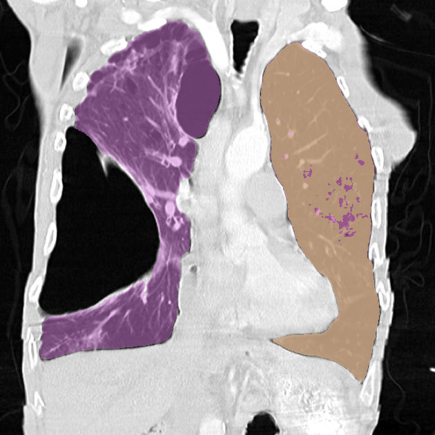 | 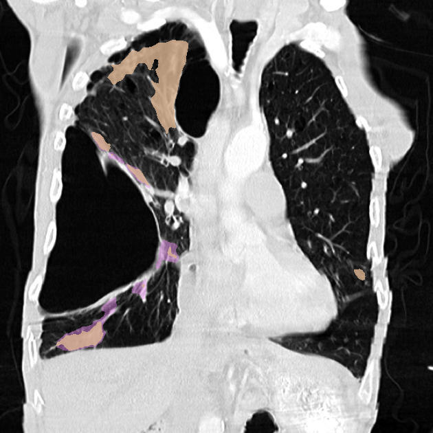 | N/A（仅适用于 X-ray） |
| Image 2: Axial lung window |  |  | 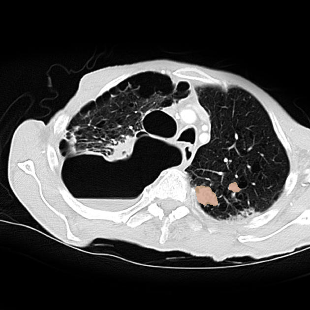 | N/A（仅适用于 X-ray） |

**Radiopaedia 原始图片 caption：**

<pre>Single coronal and axial CT images demonstrating extensive adhesions at the right apex with a pneumothorax.</pre>

**原始图片 caption 中文医学要点（翻译）：**

<pre>

</pre>

#### Study 1 的 8 个模型 Single-modality caption 对比

<strong>InternVL3-14B</strong>

**原始图像 → Single-modality caption 回答**

英文原始回答：

<pre>Given the patient background of an elderly male who was on positive pressure ventilation and became short of breath following subdural evacuation, the provided CT images could potentially highlight several possible conditions.

### Image Analysis:

1. **Coronal Lung Window (Image 1)**:
   - **Overall Lung Fields**: The lungs appear dark, indicating air-filled spaces. Pneumonia, masses, or consolidation may present as areas of increased opacity.
   - **Mediastinal Structures**: The mediastinum and heart are visible centrally. Enlargement or unusual shape may indicate mediastinitis or heart failure.
   - **Diaphragm**: Appears intact. Elevation might suggest diaphragmatic paralysis.

2. **Axial Lung Window (Image 2)**:
   - **Right Upper Lung Lobe**: Notice the area of increased opacity, which might suggest atelectasis, pneumonia, or a mass.
   - **Left Lung**: The left lung appears relatively clearer, though the entire field should be scrutinized for similar opacities.
   - **Pleural Spaces**: Look for pleural effusion or pneumothorax. Air outside the lung may suggest collapsed lung or pneumothorax.
   - **Airway Obstruction**: Potential airway obstruction or severe edema might be present if bronchi are narrowed.

### Considered Diagnosis:

Based on the patient’s clinical presentation and imaging findings, a few potential diagnoses can be considered:

1. **Pneumonia**: Post-operative and ventilator-associated pneumonia can occur, presenting with consolidation in one or more lung lobes.

2. **Mass or Tumor**: The area of increased opacity in the right lung, especially seen in the axial view, could be indicative of a pathological mass. Chronic lung conditions in elderly patients should raise suspicion for malignancies.

3. **Atelectasis**: Common in post-operative patients due to retained secretions. Seen as areas of increased density.

4. **Post-Traumatic Lung Injury**: Given the recent subdural evacuation, there might be associated lung injury from anesthesia, mechanical ventilation, or trauma itself.

5. **Aspiration Pneumonia**: Especially relevant in post-operative and elderly patients who are in altered states or intubated.

### Steps for Differential Diagnosis:

- **Correlation with Clinical Symptoms**: Assess shortness of breath, fever, chest pain, or cough.
- **History of Cancer**: Elderly patients with unexplained lung masses should have a thorough oncological evaluation.
- **Chest X-ray Follow-up**: A plain chest X-ray might provide additional information or be used as a follow-up.
- **Bronchoscopy or Biopsy**: If malignancy is suspected, bronchoscopy or biopsy might be warranted.
- **Laboratory Tests**: Blood tests for infection markers (WBC, CRP), and possibly sputum culture for infectious etiology.

### Management:

- **Antibiotics**: If pneumonia is suspected, empiric antibiotic therapy should be started based on local guidelines.
- **Oxygen Therapy**: Given the shortness of breath, ensuring adequate oxygenation is essential.
- **Further Imaging/Investigation**: Additional imaging or biopsy if suspicion for malignancy is high.
- **Supportive Care**: Ensuring proper fluid balance, nutritional support, and possibly physical therapy for atelectasis prevention.

In summary, the CT images show increased opacity in the right upper lung field, suggestive of possible pneumonia, atelectasis, or a mass. Given the patient’s clinical background, a comprehensive diagnostic approach should be undertaken to rule out life-threatening conditions and initiate appropriate management.</pre>

中文医学要点（翻译）：

<pre>

</pre>

**原始图像 + Segmentation → Single-modality caption 回答**

英文原始回答：

<pre>Reviewing the provided CT scan images, metadata, and patient data, here's the analysis and diagnosis:

### Background and Presentation:
- **Patient Characteristics**: Elderly male
- **Presenting Complaint**: Shortness of breath post-ventilator use following subdural evacuation.

### Analysis of CT Scan Images:
1. **Image 1: Coronal Lung Window**
   - **Findings**: As revealed by the segmentation, there is evidence of air in the pleural space (purple regions indicate pleural air and right lung). The pleural effusion is visualized in the segmentations, especially on the right side. The right lung appears significantly compressed or partially collapsed due to the presence of pleural air.

2. **Image 2: Axial Lung Window**
   - **Findings**: The segmentation again highlights pleural air and lung tissue, confirming findings from the coronal view. There is notable collapse of the right lung (purple region indicating lung tissue and pleural air) and significant air in the pleural space, corroborating the presence of a pneumothorax.

### Diagnosis:
Given the patient's background and imaging findings:

- **Pneumothorax**: The radiographic evidence of air in the pleural space, combined with the patient’s shortness of breath, post-ventilator status, and elderly age, strongly suggests a pneumothorax. This condition occurs when air enters the pleural space, causing the lung to collapse partially or completely. 

### Reasoning:
- Post-ventilator pneumothorax is not uncommon, especially in elderly patients where lung tissue may be more fragile.
- The CT scan effectively confirms air in the pleural cavity, displacement of lung tissue, and potential collapse.
- The compression of lung tissue and presence of pleural air in both images underline the diagnosis of pneumothorax.

### Clinical Implications:
- Immediate steps include reassessing ventilator settings, potential need for chest tube insertion to relieve tension, and monitoring for further respiratory distress or complications.
- Treatment strategies may involve oxygen therapy, chest tube insertion for air evacuation, and thorough monitoring to prevent recurrence or exacerbation.

In conclusion, the patient exhibits clinical and radiographic features indicative of a right-sided pneumothorax likely secondary to positive pressure ventilation. Immediate medical intervention is warranted to address the pneumothorax and manage the patient's respiratory compromise.</pre>

中文医学要点（翻译）：

<pre>

</pre>

**Segmentation 对 caption 的影响分析：**

<pre>

</pre>

<strong>InternVL3.5-14B</strong>

**原始图像 → Single-modality caption 回答**

英文原始回答：

<pre>&lt;think&gt;
Okay, let's tackle this case step by step. The patient is an elderly male who had a subdural evacuation and is now on positive pressure ventilation but is short of breath. The images provided are CT scans of the chest in coronal and axial views.

First, looking at the coronal lung window image (Image 1), I notice a large, dark area in the right lung. That's probably a pneumothorax because it's a collection of air outside the lung, causing the lung to collapse. The right lung looks partially collapsed, and there's a shift of the mediastinum towards the left, which suggests tension pneumothorax. But wait, tension pneumothorax usually causes a shift, but the patient is on a ventilator. Could positive pressure ventilation contribute to a larger pneumothorax? Maybe.

Then there's the axial image (Image 2). Here, the right hemithorax shows a similar dark area, confirming the pneumothorax. The left lung has some consolidation or atelectasis, maybe due to the shift or post-op changes. There's also some linear opacities in the left lung, possibly atelectasis or scarring. The heart and mediastinum are shifted left, which aligns with the coronal view.

The patient's presentation after subdural evacuation and ventilation makes me think that the pneumothorax could be iatrogenic, maybe from the surgery or the ventilation settings. High pressure on the ventilator can sometimes cause barotrauma, leading to pneumothorax. Elderly patients might have more fragile lung tissue, increasing the risk.

But wait, the pneumothorax is quite large. The diagnosis here is likely a tension pneumothorax, which is a medical emergency. The symptoms of shortness of breath and the imaging findings of mediastinal shift support that. Immediate decompression with a needle thoracostomy would be needed, followed by chest tube insertion.

However, I should also consider other possibilities. Could there be a hemothorax? The images don't show fluid density, so probably not. The dark areas are air, not fluid. Also, the patient's recent surgery might have caused a bronchopleural fistula, but the CT doesn't show that. The main issue is the pneumothorax.

So the diagnosis is tension pneumothorax secondary to iatrogenic causes, possibly from the subdural evacuation surgery or mechanical ventilation. The management would involve urgent needle decompression and chest tube placement. The left lung's issues might be secondary, like atelectasis from the shift or post-op changes.
&lt;/think&gt;

**Diagnosis:**  
**Tension Pneumothorax (Right Side) with Secondary Complications**  

**Image Description and Analysis:**  
1. **Coronal CT (Image 1):**  
   - A large, hyperlucent area in the right hemithorax indicates a **pneumothorax** (collapsed lung).  
   - The right lung is partially collapsed, with visceral pleural retraction.  
   - **Mediastinal shift to the left** suggests tension physiology, compressing the heart and great vessels.  

2. **Axial CT (Image 2):**  
   - Confirms a massive right-sided pneumothorax with visceral pleural line visible.  
   - Left lung shows **atelectasis/consolidation** (likely due to mediastinal shift or postoperative changes).  
   - Subtle linear opacities in the left lung may represent scarring or atelectasis.  

**Clinical Correlation:**  
- The patient’s acute shortness of breath post-subdural evacuation and positive pressure ventilation aligns with **iatrogenic pneumothorax** (e.g., barotrauma from mechanical ventilation or surgical trauma).  
- Elderly patients are at higher risk for tension pneumothorax due to fragile pleura and reduced compensatory mechanisms.  

**Immediate Management:**  
- **Needle decompression** (2nd intercostal space, midclavicular line) followed by **chest tube insertion** to evacuate air.  
- Monitor for hemodynamic instability (e.g., hypotension, tracheal deviation).  
- Adjust ventilator settings (reduce pressure) and evaluate for underlying causes (e.g., bronchopleural fistula, though not evident here).  

**Secondary Findings:**  
- Left lung atelectasis/consolidation likely secondary to mediastinal shift or postoperative changes.  
- No evidence of hemothorax or pleural fluid.  

**Prognosis:**  
- Urgent intervention is critical to prevent cardiac arrest. Prompt resolution with chest tube placement typically yields a favorable outcome.</pre>

中文医学要点（翻译）：

<pre>

</pre>

**原始图像 + Segmentation → Single-modality caption 回答**

英文原始回答：

<pre>&lt;think&gt;
Okay, let's tackle this case. The patient is an elderly male who had a subdural evacuation and is now on positive pressure ventilation but is short of breath. The images provided are CT scans in both coronal and axial views with lung windows.

Looking at Image 1 (coronal view), there's a large dark area on the right side, which likely represents a pneumothorax. The right lung seems collapsed, and the left lung looks relatively normal but maybe some atelectasis. The segmentation from Medical-SAM3 highlights the lung in purple and pleural air in a different color, confirming the presence of air outside the lung. BiomedParse's segmentation also shows areas in the pleural space, possibly indicating fluid or air.

Image 2 (axial view) shows the same large pneumothorax on the right. The right lung is collapsed, and there's a big air pocket. The left lung has some patchy areas, maybe atelectasis or infection. The segmentation again shows the pleural air and lung structures.

Given the patient's recent surgery (subdural evacuation) and being on a ventilator, the pneumothorax could be tension-related, which is a medical emergency. The shortness of breath makes sense if there's a significant pneumothorax causing lung collapse. The large size of the pneumothorax on the right side in both images suggests it's a major issue. The left lung's abnormalities might be due to atelectasis from the ventilator settings or post-op changes.

Diagnosis would be tension pneumothorax on the right side, leading to respiratory distress. Immediate decompression with a needle thoracostomy is needed, followed by chest tube placement. The left lung issues might need further evaluation but the primary concern is the pneumothorax.
&lt;/think&gt;

**Diagnosis:**  
**Tension Pneumothorax (Right Side) with Concurrent Atelectasis and Possible Pleural Effusion**

**Image Description and Analysis:**  
1. **Coronal CT (Image 1):**  
   - A large, hyperlucent area on the right hemithorax indicates a **pneumothorax** with significant lung collapse (right lung).  
   - The left lung shows patchy opacities, likely atelectasis or postoperative changes.  
   - Segmentation highlights pleural air (bright regions) compressing the right lung, displacing mediastinal structures.  

2. **Axial CT (Image 2):**  
   - Confirms a massive right-sided pneumothorax with visceral pleural retraction and collapsed lung parenchyma.  
   - Left lung demonstrates subsegmental atelectasis and possible small pleural effusion (blunting of the costophrenic angle).  

**Clinical Context:**  
- The patient’s recent **subdural evacuation** and **positive pressure ventilation** increase the risk of iatrogenic pneumothorax.  
- **Shortness of breath** aligns with tension pneumothorax, which can cause hemodynamic compromise due to mediastinal shift.  

**Management:**  
- **Immediate intervention** with needle decompression followed by chest tube placement on the right side.  
- Monitor for recurrence, as persistent air leaks may require surgical intervention.  
- Evaluate left lung abnormalities (e.g., atelectasis, infection) with clinical correlation and follow-up imaging.  

**Key Findings:**  
- **Tension pneumothorax** is the primary life-threatening issue, necessitating urgent care.  
- Segmentation tools (Medical-SAM3/BiomedParse) validate pleural air accumulation and lung collapse.  

**Prognosis:**  
- Prompt treatment improves outcomes, but recurrent pneumothorax or underlying lung pathology (e.g., emphysema) may complicate recovery.</pre>

中文医学要点（翻译）：

<pre>

</pre>

**Segmentation 对 caption 的影响分析：**

<pre>

</pre>

<strong>Lingshu-32B</strong>

**原始图像 → Single-modality caption 回答**

英文原始回答：

<pre>The images provided are coronal and axial CT scans of the chest. The coronal view shows significant abnormalities in the right lung, including areas of increased radiolucency suggestive of bullae or emphysematous changes. There is also evidence of a pneumothorax, as indicated by the presence of air in the pleural space. The left lung appears relatively normal with no significant abnormalities noted. The axial view further confirms these findings, showing large bullae and a clear demarcation of the pneumothorax on the right side. Given the patient's history of subdural evacuation and positive pressure ventilation, the development of a pneumothorax is likely related to barotrauma from mechanical ventilation. The diagnosis is consistent with a tension pneumothorax secondary to barotrauma, requiring immediate intervention such as needle decompression or chest tube placement to relieve the pressure and prevent further respiratory compromise.</pre>

中文医学要点（翻译）：

<pre>

</pre>

**原始图像 + Segmentation → Single-modality caption 回答**

英文原始回答：

<pre>The provided images are coronal and axial CT scans of the chest, focusing on the lung windows. The coronal view (Image 1) shows significant abnormalities in the right lung, including areas of increased radiolucency suggestive of pneumothorax or emphysema. There are also regions of consolidation or atelectasis, particularly in the lower lobes. The left lung appears relatively normal but shows some scattered areas of ground-glass opacities. The axial view (Image 2) corroborates these findings, showing extensive air trapping and possible bullae formation in the right lung, consistent with severe emphysematous changes. The pleural spaces are highlighted, indicating the presence of pleural air, which supports the diagnosis of pneumothorax. Given the patient's history of subdural evacuation and positive pressure ventilation, the findings are likely related to barotrauma or underlying chronic obstructive pulmonary disease (COPD). The diagnosis would be a combination of pneumothorax and severe emphysema, possibly exacerbated by mechanical ventilation.</pre>

中文医学要点（翻译）：

<pre>

</pre>

**Segmentation 对 caption 的影响分析：**

<pre>

</pre>

<strong>MedGemma-27B-IT</strong>

**原始图像 → Single-modality caption 回答**

英文原始回答：

<pre>**Patient Information:**
*   Age: Elderly
*   Gender: Male
*   Clinical Context: Status post subdural evacuation, positive pressure ventilation, developed shortness of breath.

**Image Analysis:**

*   **Modality:** CT scans (Coronal and Axial views)
*   **Window:** Lung window (optimized for visualizing lung parenchyma and air spaces)

**Image Description:**

*   **Image 1 (Coronal View):** Shows the chest in a coronal plane. The lungs are visible, along with the mediastinum, ribs, and clavicles. There is a large, dark area (indicating air) in the left hemithorax, suggesting a pneumothorax. The left lung appears partially collapsed or compressed. The right lung appears relatively normal.
*   **Image 2 (Axial View):** Shows the chest in an axial (cross-sectional) plane. This view confirms the presence of a large left-sided pneumothorax. The pleural space on the left is filled with air, separating the lung from the chest wall. The left lung is significantly compressed, particularly in the lower portions. The mediastinum appears slightly shifted towards the right side, which can occur with tension pneumothorax, although this is not definitively confirmed without dynamic assessment or clinical correlation.

**Diagnosis:**

Based on the CT images, the most likely diagnosis is a **left-sided pneumothorax**.

**Correlation with Clinical Context:**

*   The patient is elderly and recently underwent subdural evacuation.
*   He was placed on positive pressure ventilation (PPV).
*   He developed shortness of breath.

**Pathophysiology:**

Positive pressure ventilation can cause barotrauma, leading to rupture of lung parenchyma (blebs or bullae) or injury to the airways, resulting in air leaking into the pleural space (pneumothorax). This is a known complication of mechanical ventilation, especially in elderly patients or those with underlying lung disease. The pneumothorax causes lung collapse and impairs gas exchange, leading to shortness of breath.

**Conclusion:**

The CT scans clearly demonstrate a large left pneumothorax. This finding is consistent with the patient's clinical history of recent surgery, positive pressure ventilation, and the development of shortness of breath. The pneumothorax is likely a complication of the positive pressure ventilation (barotrauma).</pre>

中文医学要点（翻译）：

<pre>

</pre>

**原始图像 + Segmentation → Single-modality caption 回答**

英文原始回答：

<pre>**Patient Information:**
*   Age: Elderly
*   Gender: Male
*   History: Status post subdural evacuation, positive pressure ventilation.
*   Presentation: Shortness of breath.

**Image Analysis:**

*   **Modality:** CT scans (Coronal and Axial views)
*   **Window:** Lung window (optimized for visualizing lung parenchyma and air).

**Image 1 (Coronal View):**
*   Shows the chest cavity in a coronal plane.
*   The lungs are visible, with the right lung appearing more prominent due to the coronal orientation.
*   There is a significant amount of air in the pleural space on the right side, indicated by the dark areas (air is black on lung windows) surrounding the lung. This suggests a pneumothorax.
*   The right lung appears partially collapsed or compressed against the chest wall.
*   The mediastinum (heart and great vessels) appears shifted slightly to the left.
*   The left lung appears relatively normal.

**Image 2 (Axial View):**
*   Shows the chest cavity in an axial (cross-sectional) plane.
*   Confirms the presence of a large amount of air in the right pleural space (pneumothorax).
*   The right lung is compressed and partially collapsed.
*   The mediastinum is shifted to the left.
*   The left lung appears relatively normal.

**Segmentation Analysis:**
*   The segmentations from both Medical-SAM3 and BiomedParse highlight the lung fields (purple/brown), the right lung (orange/brown), the pleural space (dark gray/black), and the pleural air (light gray/white).
*   The segmentations clearly delineate the large volume of air within the right pleural space, confirming the presence of a significant pneumothorax.

**Diagnosis:**

Based on the CT images (both coronal and axial views) and the segmentation results, the findings are consistent with a **right-sided tension pneumothorax**.

**Explanation:**
*   **Pneumothorax:** Air in the pleural space, which separates the lung from the chest wall.
*   **Tension Pneumothorax:** A specific type of pneumothorax where air enters the pleural space but cannot escape, leading to a buildup of pressure. This pressure collapses the affected lung and can shift the mediastinum (heart, great vessels) to the opposite side, compromising blood return to the heart and causing hemodynamic instability.
*   **Clinical Context:** The patient is elderly, post-operative (subdural evacuation), and on positive pressure ventilation. Positive pressure ventilation is a known risk factor for barotrauma, which can lead to pneumothorax, especially in patients with underlying lung disease or recent surgery. The shortness of breath is a classic symptom of pneumothorax, particularly tension pneumothorax.

**Conclusion:**
The CT scans demonstrate a large right-sided pneumothorax with mediastinal shift, highly suggestive of a tension pneumothorax. This is a medical emergency requiring immediate intervention (e.g., chest tube insertion) to relieve the pressure and allow the lung to re-expand.</pre>

中文医学要点（翻译）：

<pre>

</pre>

**Segmentation 对 caption 的影响分析：**

<pre>

</pre>

<strong>MedMO-8B</strong>

**原始图像 → Single-modality caption 回答**

英文原始回答：

<pre>Subdural evacuation</pre>

中文医学要点（翻译）：

<pre>

</pre>

**原始图像 + Segmentation → Single-modality caption 回答**

英文原始回答：

<pre>This is a postoperative CT scan after evacuation of a subdural hematoma. The patient was intubated and had positive pressure ventilation. The CT scan shows a large pneumothorax.</pre>

中文医学要点（翻译）：

<pre>

</pre>

**Segmentation 对 caption 的影响分析：**

<pre>

</pre>

<strong>Qwen3-VL-4B</strong>

**原始图像 → Single-modality caption 回答**

英文原始回答：

<pre>The patient is an elderly male who presented after subdural evacuation with positive pressure ventilation and developed acute shortness of breath. The CT images (coronal and axial lung windows) show a striking and highly abnormal finding: a large, well-defined, air-filled space occupying the left hemithorax, with the lung parenchyma appearing collapsed or severely compressed. This is consistent with a massive pneumothorax, specifically a tension pneumothorax, which is a life-threatening condition.

Key radiological features:
- In the coronal view (Image 1), there is a large, lucent (air-filled) space in the left hemithorax, displacing the mediastinum and heart to the right — a classic sign of tension pneumothorax.
- In the axial view (Image 2), the left lung is markedly collapsed, with the lung apex and upper lobe appearing completely devoid of lung tissue, and the pleural space is filled with air. The mediastinum is shifted to the right, indicating increased intrathoracic pressure.
- The right lung appears relatively normal, further emphasizing the unilateral nature of the pathology.

Diagnosis: Tension pneumothorax.

This condition is often secondary to trauma or iatrogenic causes (e.g., during mechanical ventilation or subdural evacuation, which may have caused a rupture of the lung or a pneumothorax due to increased intrathoracic pressure or a procedural complication). The patient’s recent surgery and positive pressure ventilation are significant risk factors.

Immediate management is critical: needle decompression followed by chest tube insertion is required to relieve the pressure and prevent cardiovascular compromise and death. The patient requires urgent intervention.</pre>

中文医学要点（翻译）：

<pre>

</pre>

**原始图像 + Segmentation → Single-modality caption 回答**

英文原始回答：

<pre>Based on the patient’s history of subdural evacuation and positive pressure ventilation, and the imaging findings, the most likely diagnosis is **pneumothorax**.

Here’s the reasoning:

1.  **Clinical Context:** The patient is elderly and presented with dyspnea (shortness of breath) after a procedure involving subdural evacuation and positive pressure ventilation. Positive pressure ventilation can cause air to be inadvertently introduced into the pleural space, leading to a pneumothorax.

2.  **Imaging Findings:**
    *   **Image 1 (Coronal Lung Window):** This image shows a large, dark (air-filled) area in the right hemithorax, consistent with a pneumothorax. The lung appears collapsed or significantly reduced in volume on the right side.
    *   **Image 2 (Axial Lung Window):** This image confirms the finding. There is a large area of air in the pleural space (segmented in brown by both Medical-SAM3 and BiomedParse), which is causing the lung tissue (segmented in purple) to be compressed and appear collapsed. The pleural space is visibly expanded with air.

3.  **Segmentation Analysis:**
    *   Both segmentation models (Medical-SAM3 and BiomedParse) identify the pleural air (brown) and lung parenchyma (purple) in the right lung.
    *   The segmentation clearly delineates the air in the pleural space, which is the hallmark of a pneumothorax. The air is not within the lung parenchyma itself but rather in the potential space between the lung and the chest wall.

**Conclusion:**

The patient has a **right-sided pneumothorax**. The CT scans show air in the pleural space causing the right lung to collapse. This is a common and potentially serious complication following positive pressure ventilation, especially in elderly patients who may have pre-existing lung conditions or be more susceptible to complications. The patient requires immediate medical attention, which may include chest tube insertion to re-expand the lung and prevent further complications.</pre>

中文医学要点（翻译）：

<pre>

</pre>

**Segmentation 对 caption 的影响分析：**

<pre>

</pre>

<strong>Qwen3-VL-8B</strong>

**原始图像 → Single-modality caption 回答**

英文原始回答：

<pre>Based on the patient's presentation (elderly male, status post subdural evacuation, now short of breath) and the provided CT images, the diagnosis is **Tension Pneumothorax**.

Here is the analysis:

1.  **Clinical Context:** The patient is an elderly male who has undergone a procedure (subdural evacuation) and is now on positive pressure ventilation. This is a high-risk scenario for complications like pneumothorax, especially if there was trauma, or if the procedure involved significant manipulation of the thoracic or abdominal cavity. The sudden onset of shortness of breath is a classic presentation for a pneumothorax, particularly if it's tension.

2.  **Image Analysis:**
    *   **Image 1 (Coronal Lung Window):** This view clearly shows a significant area of lung collapse on the left side. The lung parenchyma is absent on the left, replaced by a large, dark (air-filled) space. The mediastinum is visibly shifted to the right, which is a key sign of tension pneumothorax. The heart and great vessels are displaced, indicating a significant pressure imbalance.
    *   **Image 2 (Axial Lung Window):** This cross-sectional view confirms the finding. It shows a large, dark, air-filled space on the left side of the chest, consistent with a pneumothorax. The lung parenchyma is not visible in this area, indicating collapse. The mediastinum is again displaced to the right, further supporting the diagnosis of tension pneumothorax.

3.  **Diagnosis: Tension Pneumothorax**
    *   **Why Tension?** The key finding is the mediastinal shift (to the right) and the presence of a large pneumothorax. In a tension pneumothorax, air enters the pleural space but cannot escape, leading to a progressive increase in intrapleural pressure. This pressure compresses the lung, collapses it, and pushes the mediastinum and heart toward the opposite side. This is a life-threatening emergency that can lead to cardiac tamponade, hypotension, and respiratory failure.
    *   **Why not simple pneumothorax?** While a simple pneumothorax can cause shortness of breath, the presence of mediastinal shift and significant lung collapse on CT strongly suggests a tension pneumothorax, which requires immediate intervention.

**Conclusion:** The CT images demonstrate a large left-sided pneumothorax with significant mediastinal shift to the right. Given the patient's clinical presentation and history, this is consistent with a **tension pneumothorax**, a life-threatening condition requiring immediate decompression (e.g., needle thoracostomy or chest tube insertion).

This is a critical finding that demands urgent intervention to prevent death.</pre>

中文医学要点（翻译）：

<pre>

</pre>

**原始图像 + Segmentation → Single-modality caption 回答**

英文原始回答：

<pre>Based on the provided patient data and imaging findings, here is the analysis:

**Patient Context:**
- **Age:** Elderly
- **Gender:** Male
- **History:** Status post subdural evacuation (a procedure to drain a subdural hematoma) with recent use of positive pressure ventilation.
- **Current Presentation:** Sudden onset of shortness of breath.

**Imaging Findings:**
The CT scans (coronal and axial lung windows) show significant findings in the right lung and pleural space.

- **Image 1 (Coronal):** The coronal view demonstrates a large area of consolidation (appearing as white/purple on the segmentation) in the right lung, particularly in the lower and middle lobes. There is also a large area of pleural air (appearing as tan/brown on the segmentation) along the right chest wall, indicating a pneumothorax or significant pleural effusion with air. The lung appears collapsed or compressed in the affected areas.

- **Image 2 (Axial):** The axial view confirms the presence of a large pneumothorax on the right side (tan/brown segmentation). The lung tissue is visibly compressed and displaced, with a significant amount of air in the pleural space. The lung parenchyma appears consolidated or atelectatic in the region adjacent to the pneumothorax.

**Segmentation Analysis:**
- The Medical-SAM3 segmentation (purple for lung, tan for pleural air) shows a large area of lung tissue (purple) and a significant amount of pleural air (tan) on both images, indicating a pneumothorax with associated lung collapse.
- The BiomedParse segmentation (purple for lung, tan for pleural air) also shows similar findings, with a large area of lung tissue and pleural air, confirming the presence of a pneumothorax.

**Diagnosis:**
The patient has a **right-sided pneumothorax with associated lung collapse (atelectasis)**. This is a significant finding that explains his sudden onset of shortness of breath.

**Clinical Implications:**
- The pneumothorax is likely secondary to the recent subdural evacuation and positive pressure ventilation, which can cause barotrauma or rupture of a bleb or bulla in the lung.
- The elderly patient is at higher risk for complications, including respiratory failure.
- Immediate intervention is required, which may include supplemental oxygen, chest tube placement, and close monitoring of respiratory status.

In summary, the imaging findings are consistent with a right-sided pneumothorax with lung collapse, which is the likely cause of the patient's shortness of breath. This is a medical emergency requiring prompt intervention.</pre>

中文医学要点（翻译）：

<pre>

</pre>

**Segmentation 对 caption 的影响分析：**

<pre>

</pre>

<strong>Qwen3-VL-32B</strong>

**原始图像 → Single-modality caption 回答**

英文原始回答：

<pre>**Image Description:**

The provided CT images (coronal and axial lung windows) demonstrate significant abnormalities in the right lung, particularly in the upper lobe.

- **Coronal Image (Image 1):**  
  The right upper lobe shows a large, irregularly shaped area of **cystic and bullous changes** with thickened walls and a honeycombing pattern. There is a **large air-filled cavity** with surrounding fibrotic tissue. The right middle and lower lobes appear relatively preserved. The left lung is largely normal, with clear lung parenchyma and no significant pathology. There is **no evidence of pleural effusion or pneumothorax**.

- **Axial Image (Image 2):**  
  At the level of the upper thorax, the right upper lobe exhibits **extensive cystic destruction** with multiple air-filled spaces of varying sizes, some with thickened walls, consistent with **bullae or cysts**. The surrounding lung tissue shows **fibrosis and architectural distortion**. The left lung appears normal. The trachea and main bronchi are patent, and there is no evidence of central airway obstruction.

---

**Clinical Context:**

- **Elderly male**, status post **subdural evacuation** (suggesting recent neurosurgical intervention).
- On **positive pressure ventilation**, developed **acute shortness of breath**.
- This clinical scenario raises concern for **acute respiratory compromise** in a patient with pre-existing or newly developed lung pathology.

---

**Diagnosis:**

The imaging findings are highly suggestive of **advanced emphysema with bullous changes**, most prominently in the **right upper lobe**, likely **centrilobular emphysema** with progression to **bullous emphysema**. The honeycombing and architectural distortion may indicate **advanced fibrotic changes**, possibly secondary to chronic smoking or long-standing lung disease.

However, given the **acute onset of shortness of breath** in a patient on **positive pressure ventilation**, the most concerning differential is **barotrauma** (e.g., **pneumothorax or pneumomediastinum**) due to ventilator-induced lung injury.

**But** — **no pneumothorax or pneumomediastinum is visible** in these images. The large air spaces are **contained within the lung parenchyma**, with thick walls, suggesting **chronic bullae rather than acute air leak**.

---

**Most Likely Diagnosis:**

&gt; **Bullous Emphysema (Right Upper Lobe), Likely Exacerbated by Positive Pressure Ventilation**

---

**Important Considerations:**

1. **Barotrauma Risk:** The patient is on positive pressure ventilation, which can exacerbate pre-existing bullous disease and lead to **rupture of bullae**, causing **secondary pneumothorax**. However, no pneumothorax is seen in these images — this may be a **false-negative** if imaging was not performed at full inspiration or if the pneumothorax is small.

2. **Alternative Diagnosis:**
   - **Cystic Lung Disease** (e.g., lymphangioleiomyomatosis, but unlikely in an elderly male).
   - **Post-inflammatory or post-infectious cystic changes** — less likely without history.
   - **Bronchiectasis** — not clearly seen here; the cysts are more likely bullae.

3. **Clinical Correlation:** The patient’s acute respiratory distress may be due to **worsening of underlying emphysema**, **air trapping**, or **partial collapse** of the bullous area, leading to reduced compliance and ventilation-perfusion mismatch.

---

**Recommendation:**

- **Immediate clinical correlation** with physical exam, pulse oximetry, and arterial blood gas.
- **Repeat imaging** (preferably with full inspiration and expiration phases) to assess for **pneumothorax** or **air trapping**.
- **Consider bronchoscopy** if there is suspicion of central airway obstruction or if the patient is not improving.
- **Optimize ventilator settings** (e.g., lower tidal volumes, avoid high pressures) to prevent barotrauma.
- **Pulmonary function testing** (if stable) to confirm emphysema.
- **Smoking cessation counseling** if applicable.

---

**Final Diagnosis:**

&gt; **Bullous Emphysema, Right Upper Lobe, with Acute Respiratory Distress Likely Due to Ventilator-Induced Exacerbation or Air Trapping.**

*Note: While no acute pneumothorax is seen, the patient remains at high risk for barotrauma given the bullous changes and mechanical ventilation.*</pre>

中文医学要点（翻译）：

<pre>

</pre>

**原始图像 + Segmentation → Single-modality caption 回答**

英文原始回答：

<pre>Based on the patient's clinical background — an elderly male status post subdural evacuation on positive pressure ventilation who developed shortness of breath — and the provided CT images (coronal and axial lung windows), the imaging findings are highly suggestive of **right-sided pneumothorax with associated lung collapse and possible pulmonary contusion or atelectasis**.

---

### **Image Description:**

#### **Image 1 (Coronal Lung Window):**
- The right lung shows a large area of **air without lung parenchyma** in the upper and middle zones, consistent with **pneumothorax**.
- The right lung is **compressed and displaced medially**, with visible **lung tissue collapse** (atelectasis) in the upper lobe.
- The **pleural space** is filled with air, clearly demarcated from the lung tissue.
- The left lung appears relatively normal, with no significant consolidation or collapse.
- The **segmentation from Medical-SAM3** (purple = lung, tan = pleural space/air) accurately identifies the collapsed right lung and the large pleural air collection.
- **BiomedParse segmentation** (tan = pleural air, purple = lung) also identifies the pneumothorax but with less contiguous coverage of the pleural air, possibly missing some regions.

#### **Image 2 (Axial Lung Window):**
- In the axial view, a **large right apical pneumothorax** is evident, with the **right lung collapsed** and pushed toward the hilum.
- The **pleural air** is clearly seen as a black (air-density) area surrounding the compressed lung tissue.
- There is **no evidence of pleural effusion** or significant consolidation.
- The **segmentation from Medical-SAM3** (purple = lung, tan = pleural air) correctly outlines the collapsed lung and the adjacent pleural air.
- **BiomedParse** again shows minimal segmentation of pleural air, which may be due to algorithmic limitations in detecting large, contiguous air collections.

---

### **Clinical Correlation:**
- The patient is on **positive pressure ventilation** after neurosurgery (subdural evacuation), which is a **major risk factor for pneumothorax** due to increased intrathoracic pressure and potential alveolar rupture.
- The **acute onset of shortness of breath** in this context is classic for **tension or simple pneumothorax**.
- The **right-sided** nature is evident from the imaging.

---

### **Diagnosis:**
✅ **Right-sided pneumothorax with associated right lung collapse (atelectasis)**, likely **iatrogenic** secondary to **positive pressure ventilation**.

---

### **Differential Considerations:**
- **Pulmonary contusion** (less likely, as no evidence of consolidation or hemorrhage)
- **Pneumonia or infection** (no consolidation or ground-glass opacities)
- **Pulmonary embolism** (not suggested by imaging; no filling defects in pulmonary arteries)
- **Tension pneumothorax** — **possible**, especially given the patient’s respiratory distress. The mediastinal shift is not clearly visible in these slices, but the large pneumothorax and clinical context raise concern.

---

### **Recommendations:**
1. **Immediate clinical assessment** for signs of tension pneumothorax (e.g., hypotension, tracheal deviation, decreased breath sounds).
2. **Chest tube insertion** (thoracostomy) is indicated for a large pneumothorax in a symptomatic patient on mechanical ventilation.
3. **Monitor for re-expansion pulmonary edema** post-drainage.
4. **Re-imaging** after intervention to confirm resolution.
5. **Optimize ventilator settings** to reduce risk of further barotrauma.

---

### **Conclusion:**
The CT findings are diagnostic of **right-sided pneumothorax with lung collapse**, a known complication of mechanical ventilation, especially in elderly patients with underlying lung fragility. Prompt intervention is necessary to prevent deterioration.</pre>

中文医学要点（翻译）：

<pre>

</pre>

**Segmentation 对 caption 的影响分析：**

<pre>

</pre>

### 3.3 Study 2: X-ray

- **Medical-SAM3 prompts：** lung, right lung, pleural space, pleural air
- **BiomedParse v1 prompts：** lung, right lung, pleural space, pleural air
- **TorchXRayVision anatomy labels：** lung, right lung, left lung, diaphragm, heart, cardiomediastinum, upper mediastinum, lower mediastinum, stomach

| Image | Original image | Medical-SAM3 | BiomedParse v1 | TorchXRayVision |
|---|---|---|---|---|
| Image 1: Frontal |  | 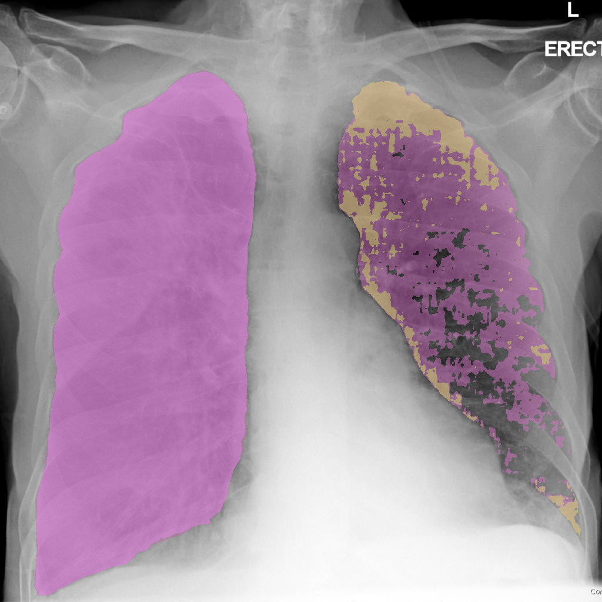 |  | 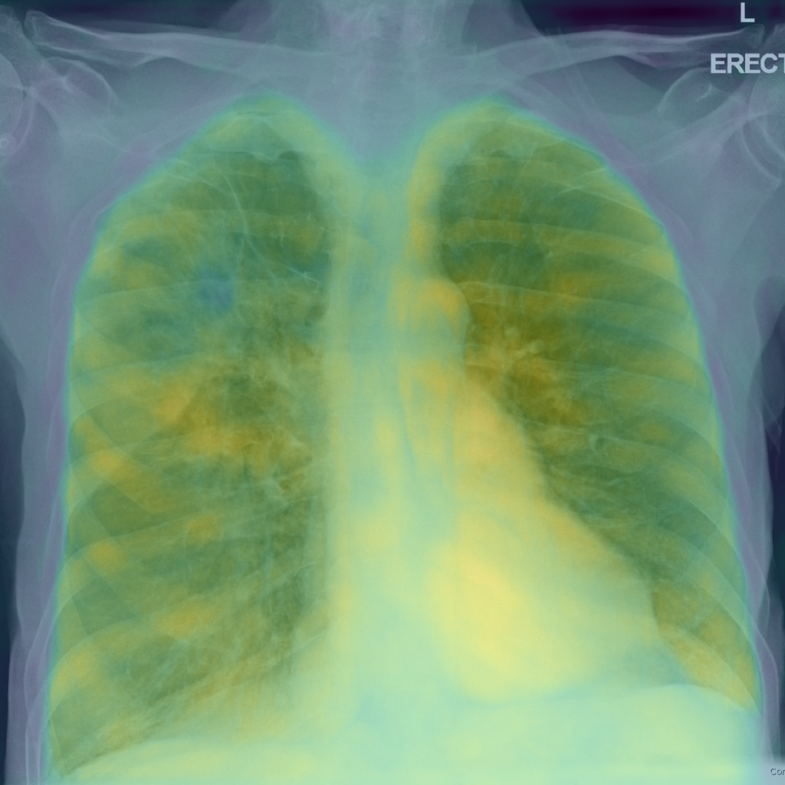 |

**Radiopaedia 原始图片 caption：**

<pre>The preoperative chest x-ray demonstrates extensive scarring, particularly in the right apex.</pre>

**原始图片 caption 中文医学要点（翻译）：**

<pre>

</pre>

#### Study 2 的 8 个模型 Single-modality caption 对比

<strong>InternVL3-14B</strong>

**原始图像 → Single-modality caption 回答**

英文原始回答：

<pre>### Patient Information Recap:

- **Age**: Elderly
- **Gender**: Male
- **Presentation**: Status post subdural evacuation and on positive pressure ventilation, became short of breath.
- **Image Modality**: X-ray
- **Subcategory**: Frontal (PA) view
- **Notes**: Chest X-ray taken before the start of mechanical ventilation.

### Description of the X-ray:

The X-ray shows a frontal (PA) view of the chest, which includes the following observations:

1. **Overall Lung Fields**: Both lung fields are visible. The right lung appears to have some haziness and increased opacity in the lower zones, suggestive of potential atelectasis or early pneumonia. The left lung field also shows patchy opacities predominantly in the lower zone that could indicate similar findings.

2. **Cardiac Silhouette**: The heart appears within normal limits in size but may be slightly obscured due to surrounding lung opacities.

3. **Diaphragm**: The right hemidiaphragm appears obscured, which could be due to the lower zone haziness. The left hemidiaphragm is more visible and appears at the usual level.

4. **Costophrenic Angles**: The costophrenic angles (where the diaphragm meets the rib cage) are blunted, especially on the right side. This finding could be indicative of pleural effusion or atelectasis.

5. **Trachea and Mediastinum**: The trachea is midline, and there are no obvious signs of mediastinal shift.

### Chain of Thought (CoT) for Diagnosis:

Given the patient's status post-subdural evacuation and use of positive pressure ventilation, coupled with his shortness of breath, the pulmonary findings on the chest X-ray raise a few differential diagnoses:

- **Atelectasis**: Common in postoperative patients and those on mechanical ventilation. The haziness and increased opacity in the lower lung zones could be due to atelectasis which can happen due to immobility or shallow breathing.

- **Aspiration Pneumonia**: Elderly patients, especially those on ventilation, are at risk for aspiration of gastric contents leading to pneumonia. The patchy opacities and lower zone involvement are suggestive of this possibility.

- **Pneumonia**: Bacterial, viral, or aspiration-related pneumonia can present with similar findings.

- **Pleural Effusion**: Blunted costophrenic angles could indicate the presence of fluid, but this is less indicative without further confirmation via ultrasound or lateral X-ray.

### Conclusion:

The most probable diagnoses given the clinical context and imaging findings include atelectasis and aspiration pneumonia. Given the patient's history and presentation, the haziness and opacities seen in the lung fields are most likely due to atelectasis from immobility or shallow breathing secondary to positive pressure ventilation or aspiration.

### Recommendation:

Further evaluation with:
- Serial chest X-rays to monitor progression or resolution.
- Potential chest physiotherapy to help expand collapsed lung segments.
- Antibiotic coverage if pneumonia is strongly suspected.
- Consideration of chest CT if findings are persistent or unclear.

In summary, the chest X-ray shows features suggestive of atelectasis and possibly aspiration pneumonia, with clinical correlation needed to confirm the diagnosis and institute appropriate management.</pre>

中文医学要点（翻译）：

<pre>

</pre>

**原始图像 + Segmentation → Single-modality caption 回答**

英文原始回答：

<pre>### Description of the Image and Segmentations

The provided image is a frontal chest X-ray of an elderly male patient. It was taken in an erect position post-subdural evacuation with positive pressure ventilation. The patient is experiencing shortness of breath, prompting this imaging study.

#### Observations:

1. **General Appearance**:
    - Both lung fields are visible.
    - The trachea is midline.
    - There are no obvious fractures or dislocations in the bony thoracic structures (ribs, clavicles, vertebrae).
    
2. **Lung Fields**:
    - The left lung appears generally clear.
    - The right lung field, however, reveals increased opacity in the lower zone, suggesting consolidation or fluid accumulation.

3. **Segmentations**:
    - The segmentation performed using Medical-SAM3, BiomedParse, and TorchXRayVision illustrate different aspects of the lungs and associated structures.
        - The right lung has regions highlighted (with varied color coding) indicating abnormalities such as consolidation and pleural effusion.
        - The segmentation boundaries suggest significant involvement of the pleural space on the right side, which corresponds to an area with increased opacity observed.

4. **Diaphragm and Heart**:
    - The right hemidiaphragm is somewhat elevated compared to the left, which can often be an indication of underlying pathology such as atelectasis, pneumonia, or pleural effusion.
    - The heart appears normal in size.

### Diagnosis

Based on the imaging and segmentation data, the likely diagnosis for the right lung findings can be:

#### Right Lower Lobe Pneumonia with Possible Pleural Effusion

**Key Points**:
- **Right Lower Zone Opacity**: This suggests lung consolidation, commonly seen in pneumonia.
- **Pleural Air/Effusion**: The increased opacity and segmentation hints at fluid accumulation in the pleural space – pleural effusion.
- **Elevated Right Hemidiaphragm**: This could be secondary to reduced lung volume or atelectasis, often accompanying pneumonia or pleural effusion.
- **Clinical Correlation**: The patient's shortness of breath post-subdural surgery and on positive pressure ventilation aligns with this diagnosis, as pneumonia can develop due to aspiration or immunocompromise associated with surgery and intensive care.

### Further Investigations and Management

1. **Clinical Assessment**:
    - Careful history regarding the onset and duration of symptoms.
    - Review of vital signs and oxygen saturation levels.

2. **Follow-Up Imaging**:
    - A repeat chest X-ray after 48-72 hours to monitor changes in the consolidation and pleural effusion.
    
3. **Laboratory Tests**:
    - Complete Blood Count (CBC) for signs of infection (elevated WBC count).
    - Blood Cultures if sepsis is suspected.
    - Sputum culture and sensitivity if possible.

4. **Therapeutic Measures**:
    - **Antibiotics**: Initiate broad-spectrum antibiotics, followed by empiric antimicrobial therapy pending culture results.
    - **Thoracocentesis**: If a significant pleural effusion is diagnosed, thoracocentesis might be necessary to drain the fluid and send for analysis.
    - **Supportive Care**: Ensure adequate oxygenation and possibly further mechanical ventilation adjustments.

This diagnosis is plausible given the clinical and radiographic findings. Close monitoring and further diagnostic steps should be taken to confirm and manage the condition appropriately.</pre>

中文医学要点（翻译）：

<pre>

</pre>

**Segmentation 对 caption 的影响分析：**

<pre>

</pre>

<strong>InternVL3.5-14B</strong>

**原始图像 → Single-modality caption 回答**

英文原始回答：

<pre>&lt;think&gt;
The patient is an elderly male who recently underwent subdural evacuation and is on positive pressure ventilation. He is now experiencing shortness of breath. The provided chest X-ray (CXR) is a frontal view taken pre-operatively, but it's critical to analyze it for any findings that might explain his current symptoms.

Looking at the image, I notice that the right lung (on the left side of the image) shows increased opacity, particularly in the upper and middle zones. This could indicate consolidation or infiltrates, possibly due to infection, aspiration, or even post-surgical changes. The left lung appears relatively clear, but there is some haziness in the lower zones, which might suggest atelectasis or early infiltrates.

The heart size seems within normal limits, and there's no obvious pleural effusion or pneumothorax. The trachea is midline, and the bony structures appear intact. Given the patient's recent surgery and ventilation, aspiration pneumonia or atelectasis are plausible. The shortness of breath could be due to reduced lung compliance from these changes.

Considering his recent subdural evacuation, there's also a possibility of neurological factors contributing to respiratory distress, but the CXR findings point more towards a pulmonary issue. The increased opacity on the right side might be a post-surgical change or an area of developing infection. Atelectasis could also be present, especially if there's a mucous plug or reduced ventilation in certain areas.

In summary, the most likely diagnosis is aspiration pneumonia or atelectasis, given the clinical context and radiographic findings. Further evaluation with a lateral CXR or CT scan might be necessary for better characterization. Additionally, monitoring for signs of infection and ensuring adequate ventilation are important steps.
&lt;/think&gt;

**Diagnosis: Aspiration Pneumonia or Atelectasis**

**Image Description and Rationale:**

The provided chest X-ray (CXR) shows increased opacity in the right upper and middle lung zones, which may indicate consolidation or infiltrates. This finding, coupled with the patient's recent subdural evacuation and use of positive pressure ventilation, suggests a possible aspiration event or post-surgical atelectasis. The left lung appears relatively clear, though there is some haziness in the lower zones, potentially indicating early atelectasis or mild infiltrates.

**Clinical Context:**

- **Recent Surgery and Ventilation:** The patient's recent subdural evacuation and use of positive pressure ventilation increase the risk of aspiration or atelectasis.
- **Symptoms:** Shortness of breath aligns with potential pulmonary complications such as pneumonia or atelectasis.

**Recommendations:**

1. **Further Imaging:** Consider a lateral CXR or CT scan for better assessment of the lung fields.
2. **Clinical Monitoring:** Monitor for signs of infection (e.g., fever, elevated white blood cell count) and ensure adequate ventilation.
3. **Management:** Initiate antibiotics if pneumonia is suspected and perform chest physiotherapy to address atelectasis.

**Conclusion:**

The radiographic findings, in conjunction with the patient's clinical history, point towards aspiration pneumonia or atelectasis as the likely cause of the patient's respiratory distress. Further diagnostic evaluation and targeted management are essential.</pre>

中文医学要点（翻译）：

<pre>

</pre>

**原始图像 + Segmentation → Single-modality caption 回答**

英文原始回答：

<pre>&lt;think&gt;
The patient is an elderly male who recently underwent subdural evacuation and is now on positive pressure ventilation, presenting with shortness of breath. The chest X-ray shows notable findings that need to be analyzed in the context of his clinical presentation.

**Key Observations:**

1. **Lung Fields:**
   - The right lung appears more radiolucent compared to the left, suggesting hyperinflation or air trapping, which could be related to ventilation issues.
   - The left lung shows increased opacities, particularly in the upper and mid zones, which may indicate consolidation or infiltrates. The presence of patchy opacities could suggest infection, aspiration, or pulmonary edema.

2. **Pleural Spaces:**
   - The segmentations indicate areas of potential pleural involvement. The right lung's pleural space appears normal, while the left shows some irregularities, possibly indicating pleural effusion or thickening.

3. **Cardiomediastinal Silhouette:**
   - The heart size appears within normal limits, but the mediastinum might be slightly widened, which could be due to postoperative changes or other causes.

4. **Diaphragm:**
   - The diaphragmatic contours are visible, but there might be slight elevation on the left side, which could be related to diaphragmatic weakness or subphrenic process.

**Clinical Correlation:**

- **Postoperative State:** The patient's recent surgery and ventilation could lead to complications such as atelectasis, pneumonia, or pulmonary edema. The opacities in the left lung could represent atelectasis or aspiration, common in postoperative patients.
- **Ventilator-Induced Changes:** Positive pressure ventilation can cause hyperinflation (as seen on the right) and may contribute to barotrauma or pneumothorax, though no obvious pneumothorax is seen here.
- **Elderly Considerations:** Age-related changes in lung compliance and immune response may predispose the patient to infections or slower resolution of pulmonary issues.

**Differential Diagnosis:**

1. **Pneumonia:** The opacities in the left lung could indicate infectious consolidation.
2. **Atelectasis:** Postoperative atelectasis, especially in the dependent areas, could explain the opacities.
3. **Aspiration Pneumonia:** Given the recent surgery and ventilation, aspiration could be a concern.
4. **Pulmonary Edema:** Could be due to cardiogenic or non-cardiogenic causes, though less likely without heart failure history.
5. **Pneumothorax:** Though not clearly visible, subtle pneumothorax could be considered given the ventilation context.

**Conclusion:**

The X-ray findings suggest a postoperative complication, likely pneumonia or aspiration, with possible atelectasis. The hyperinflation of the right lung may be related to ventilator settings. Immediate clinical correlation with symptoms, labs, and possibly further imaging (CT) would be necessary for confirmation and management.
&lt;/think&gt;

**Diagnosis:**

The chest X-ray, in conjunction with the patient's recent subdural evacuation and positive pressure ventilation, suggests the following:

1. **Left Lung Consolidation/Infiltrates:** Likely due to postoperative pneumonia or aspiration pneumonia. The patchy opacities in the left upper and mid zones are concerning for infection or inflammatory process.

2. **Right Lung Hyperinflation:** May be secondary to positive pressure ventilation, potentially leading to air trapping or overdistension. This could contribute to the patient's shortness of breath.

3. **Possible Atelectasis:** The opacities could also represent areas of atelectasis, particularly in a postoperative setting.

**Recommended Next Steps:**

- **Clinical Correlation:** Assess for fever, cough, sputum production, and signs of infection.
- **Laboratory Tests:** Complete blood count, inflammatory markers, and possibly sputum cultures.
- **Further Imaging:** Consider a CT scan of the chest for better characterization of the lung opacities and to rule out complications like pneumothorax or pleural effusion.
- **Ventilator Settings Review:** Ensure appropriate settings to prevent hyperinflation and barotrauma.
- **Infection Control Measures:** If pneumonia is suspected, initiate empiric antibiotics pending culture results.

**Management:**

- **Antibiotics:** If infection is suspected, start broad-spectrum antibiotics.
- **Respiratory Support Adjustment:** Optimize ventilator settings to reduce hyperinflation.
- **Physical Therapy:** Encourage deep breathing exercises and ambulation to prevent atelectasis.
- **Monitor for Complications:** Keep an eye out for signs of worsening respiratory status, pleural effusion, or pneumothorax.

This patient requires close monitoring and multidisciplinary care given the postoperative context and potential for respiratory complications.</pre>

中文医学要点（翻译）：

<pre>

</pre>

**Segmentation 对 caption 的影响分析：**

<pre>

</pre>

<strong>Lingshu-32B</strong>

**原始图像 → Single-modality caption 回答**

英文原始回答：

<pre>The chest X-ray shows an elderly male patient who has undergone subdural evacuation and is now experiencing shortness of breath while on positive pressure ventilation. The image reveals bilateral pulmonary infiltrates, which could indicate the presence of pneumonia or acute respiratory distress syndrome (ARDS). Given the patient's recent surgical history and current respiratory distress, it is likely that he is experiencing a postoperative complication such as atelectasis, aspiration pneumonia, or ARDS. Further clinical evaluation and diagnostic tests would be necessary to confirm the specific diagnosis and guide appropriate treatment.</pre>

中文医学要点（翻译）：

<pre>

</pre>

**原始图像 + Segmentation → Single-modality caption 回答**

英文原始回答：

<pre>The chest X-ray shows an elderly male patient who has undergone subdural evacuation and is now experiencing shortness of breath while on positive pressure ventilation. The lungs appear to be well-expanded, with no obvious signs of consolidation or other acute pathology. The mediastinal structures appear normal, and there is no evidence of pleural effusion or pneumothorax. Based on the clinical presentation and the radiographic findings, the most likely diagnosis is a post-operative complication, such as atelectasis or pulmonary edema, which can occur after subdural evacuation surgery. Further clinical evaluation and monitoring would be necessary to determine the exact cause of the patient's respiratory distress.</pre>

中文医学要点（翻译）：

<pre>

</pre>

**Segmentation 对 caption 的影响分析：**

<pre>

</pre>

<strong>MedGemma-27B-IT</strong>

**原始图像 → Single-modality caption 回答**

英文原始回答：

<pre>**Patient Information:**
*   Age: Elderly
*   Gender: Male
*   Clinical Context: Status post subdural evacuation, requiring positive pressure ventilation, developed shortness of breath.

**Image Description:**
*   **Modality:** Chest X-ray (CXR)
*   **View:** Frontal (PA - Posteroanterior)
*   **Timing:** Taken before positive pressure ventilation (PreOppreventilation).
*   **Findings:**
    *   **Lungs:** There are diffuse, bilateral opacities, predominantly in the lower lung fields, but also extending into the mid and upper zones. These opacities appear somewhat patchy and ill-defined. There is also some evidence of air bronchograms within the opacified areas, particularly in the right lower lobe.
    *   **Heart:** The cardiac silhouette appears to be within normal limits in size.
    *   **Mediastinum:** The mediastinal structures appear unremarkable.
    *   **Pleura:** No large pleural effusions or pneumothorax are evident.
    *   **Bones:** The visualized bony structures appear intact.

**Interpretation and Diagnosis:**

The CXR shows diffuse bilateral pulmonary opacities, which are concerning for a significant lung process. Given the patient's clinical context (elderly male, post-surgery, positive pressure ventilation, shortness of breath), the most likely diagnosis is **Acute Respiratory Distress Syndrome (ARDS)**.

**Reasoning:**

1.  **Clinical Context:** ARDS is a common complication in critically ill patients, especially those who have undergone major surgery (like subdural evacuation), are elderly, and require mechanical ventilation (positive pressure ventilation). The development of shortness of breath after starting ventilation is a classic sign.
2.  **Radiographic Findings:** The diffuse, bilateral opacities seen on the CXR are characteristic of ARDS. These opacities represent pulmonary edema (non-cardiogenic in ARDS), inflammation, and alveolar collapse. The pattern is often described as "white-out" or diffuse haziness, sometimes with air bronchograms.
3.  **Differential Diagnoses:**
    *   **Pneumonia:** While pneumonia can cause bilateral opacities, the pattern in ARDS is typically more diffuse and symmetric, often involving all lobes. Pneumonia might present with more consolidation or lobar patterns, although diffuse pneumonia is possible.
    *   **Pulmonary Edema (Cardiogenic):** Cardiogenic pulmonary edema usually presents with cardiomegaly, Kerley B lines, and pleural effusions, which are not prominent features here. The cardiac size appears normal.
    *   **Aspiration Pneumonitis/Pneumonia:** Aspiration is a risk in post-operative patients, especially those requiring ventilation. It can cause patchy infiltrates, often in the dependent lung zones (right lower lobe in this case). However, the diffuse nature of the opacities makes ARDS more likely.
    *   **Other causes:** Less likely causes include diffuse alveolar hemorrhage, drug reactions, or certain infections.

**Conclusion:**

Based on the patient's clinical presentation (elderly, post-op, on ventilation, dyspnea) and the radiographic findings of diffuse bilateral pulmonary opacities, the most probable diagnosis is **Acute Respiratory Distress Syndrome (ARDS)**. The CXR shows the typical pattern associated with this condition.</pre>

中文医学要点（翻译）：

<pre>

</pre>

**原始图像 + Segmentation → Single-modality caption 回答**

英文原始回答：

<pre>**Image Description:**

The provided image is a frontal chest X-ray. It shows the patient's lungs, heart, mediastinum, and bony structures. The lungs appear hyperinflated, and there are areas of increased opacity, particularly in the right upper lobe, suggesting consolidation or inflammation. The left lung also shows some increased interstitial markings. The heart size appears within normal limits. The mediastinum is unremarkable. The image was taken before positive pressure ventilation was initiated, as noted in the metadata.

**Patient Context:**

*   **Age:** Elderly
*   **Gender:** Male
*   **Presentation:** Status post subdural evacuation, became short of breath after positive pressure ventilation.

**Analysis and Diagnosis:**

1.  **Clinical Context:** The patient is elderly, recently underwent surgery (subdural evacuation), and developed shortness of breath after positive pressure ventilation. This clinical scenario raises concerns about potential complications related to ventilation or underlying conditions exacerbated by the procedure.
2.  **Radiographic Findings:**
    *   **Right Upper Lobe Opacity:** The most striking finding is the consolidation/opacity in the right upper lobe. This could represent pneumonia (aspiration or hospital-acquired), pulmonary edema, or potentially atelectasis. Given the patient's recent surgery and ventilation, aspiration pneumonia is a strong possibility.
    *   **Hyperinflation:** The lungs appear hyperinflated, which can be seen in chronic obstructive pulmonary disease (COPD) or acute respiratory distress.
    *   **Increased Interstitial Markings:** The presence of increased interstitial markings, especially in the left lung, could suggest fluid overload (pulmonary edema) or underlying chronic lung disease.
3.  **Differential Diagnosis:**
    *   **Aspiration Pneumonia:** Highly likely given the recent surgery, potential for impaired swallowing/cough reflex, and the focal consolidation in the right upper lobe (gravity-dependent aspiration).
    *   **Ventilator-Associated Pneumonia (VAP):** Possible, although the image was taken *before* ventilation. However, the underlying condition leading to ventilation might be pneumonia.
    *   **Pulmonary Edema:** Could explain the opacities and interstitial markings, potentially related to fluid overload or cardiac issues, although the heart size appears normal.
    *   **Atelectasis:** Could cause opacity, but the pattern seems more suggestive of consolidation.
    *   **Pre-existing Lung Disease:** The hyperinflation and interstitial markings might indicate underlying COPD or other chronic lung conditions.
4.  **Conclusion:** The most likely diagnosis based on the clinical presentation and radiographic findings is **aspiration pneumonia**, particularly affecting the right upper lobe. The shortness of breath after positive pressure ventilation could be due to the pneumonia itself, or potentially exacerbated by the ventilation if it caused further lung injury or fluid shifts. Other possibilities like pulmonary edema or VAP should also be considered in the differential.

**Disclaimer:** This is an interpretation based solely on the provided image and limited clinical information. A definitive diagnosis requires correlation with the patient's full clinical history, physical examination, laboratory results, and potentially further imaging.</pre>

中文医学要点（翻译）：

<pre>

</pre>

**Segmentation 对 caption 的影响分析：**

<pre>

</pre>

<strong>MedMO-8B</strong>

**原始图像 → Single-modality caption 回答**

英文原始回答：

<pre>The patient is status post subdural evacuation. There is no pneumothorax. The patient is intubated and there is a large amount of air in the stomach. The lungs are otherwise clear.</pre>

中文医学要点（翻译）：

<pre>

</pre>

**原始图像 + Segmentation → Single-modality caption 回答**

英文原始回答：

<pre>The patient is postoperative with a subdural evacuation. There is no evidence of pneumothorax.</pre>

中文医学要点（翻译）：

<pre>

</pre>

**Segmentation 对 caption 的影响分析：**

<pre>

</pre>

<strong>Qwen3-VL-4B</strong>

**原始图像 → Single-modality caption 回答**

英文原始回答：

<pre>**Image Description:**

This is a frontal (posteroanterior) chest X-ray taken in the erect position (as indicated by “ERECT” in the image metadata), performed preoperatively or prior to the initiation of positive pressure ventilation. The image shows:

- **Lung fields**: Both lungs are visible with a normal appearance in terms of overall size and shape. There is no evidence of acute lung collapse (atelectasis), pneumothorax, or large pleural effusion.
- **Cardiac silhouette**: The heart is centrally located with a normal size and shape. The cardiac borders are well-defined, and there is no evidence of cardiomegaly.
- **Diaphragm**: The diaphragm appears intact and is at a normal level, with no elevation or flattening.
- **Costophrenic angles**: These are sharp and well-defined, suggesting no pleural effusion.
- **Trachea**: The trachea is midline.
- **Lung parenchyma**: There is mild, diffuse interstitial opacification, which may represent chronic or underlying lung disease (e.g., interstitial lung disease, old infection, or emphysema). However, no acute infiltrates or consolidation are present.
- **No obvious signs of acute respiratory distress or failure** (e.g., hyperinflation, air trapping, or mediastinal shift).

**Clinical Context:**

The patient is elderly male, status post subdural evacuation, and has developed shortness of breath after initiation of positive pressure ventilation. Subdural evacuation is a neurosurgical procedure, and positive pressure ventilation is often used postoperatively to support breathing, especially in elderly patients with compromised respiratory reserve.

**Diagnosis:**

**Acute respiratory failure secondary to ventilator-induced lung injury (VILI) or ventilator-associated lung injury (VALI) in the context of postoperative recovery and aging.**

**Rationale:**

- The chest X-ray is normal or near-normal, which is consistent with the patient being stable and not suffering from acute pulmonary pathology such as pneumonia, pulmonary edema, or pneumothorax.
- The patient’s symptoms — shortness of breath — after initiating positive pressure ventilation in the postoperative setting — are classic for **ventilator-induced lung injury** or **acute respiratory distress syndrome (ARDS)**, which can occur in elderly patients due to their reduced lung compliance, increased susceptibility to ventilator-induced barotrauma, and potential for ventilator settings that are too high (e.g., high PEEP, high tidal volumes).
- In elderly patients, even with normal X-ray findings, acute respiratory failure can occur due to **ventilator-induced lung injury (VILI)**, **pulmonary hypertension**, or **underlying chronic lung disease** (e.g., COPD, interstitial lung disease) becoming exacerbated by mechanical ventilation.
- The X-ray does not show signs of acute lung pathology, so the diagnosis is likely **ventilator-induced lung injury (VILI)** or **acute respiratory failure** due to **ventilator settings or patient-specific factors**.

**Recommendation:**

- **Immediate clinical evaluation** to adjust ventilator settings (e.g., reduce tidal volume, adjust PEEP, consider prone positioning if indicated).
- **Monitor oxygenation and ventilation parameters** closely.
- **Consider non-invasive ventilation (NIV)** if possible.
- **Evaluate for underlying chronic lung disease** or **pulmonary hypertension**.
- **Consider bronchodilator therapy or corticosteroids** if bronchospasm or inflammation is suspected.
- **Consult with respiratory therapy and critical care team** for ventilator management.

**Note:** The X-ray is not diagnostic for the cause of shortness of breath, but it rules out acute pulmonary pathology. The diagnosis is clinical and based on the context of postoperative ventilation and age.

---

**Final Diagnosis:**

**Acute respiratory failure secondary to ventilator-induced lung injury (VILI) or ventilator-associated lung injury (VALI)** — likely in the context of postoperative recovery and aging. The chest X-ray is unremarkable and does not show acute lung pathology, which is consistent with this diagnosis. Further clinical evaluation and ventilator management are required.</pre>

中文医学要点（翻译）：

<pre>

</pre>

**原始图像 + Segmentation → Single-modality caption 回答**

英文原始回答：

<pre>Based on the patient’s background (elderly male, status post subdural evacuation with positive pressure ventilation, now presenting with shortness of breath) and the provided chest X-ray (Image 1), the most likely diagnosis is **pneumothorax** — specifically, **tension pneumothorax** or **large air leak** — secondary to the recent surgical intervention.

Here’s the reasoning:

1.  **Clinical Context**: The patient has undergone subdural evacuation, a procedure typically performed for subdural hematoma. This is a neurosurgical intervention. The use of positive pressure ventilation (PPV) is a critical risk factor for developing a pneumothorax, particularly in the elderly, as it can cause air to be forced into the pleural space during ventilation, especially if there is a small tear or disruption in the pleura. The patient’s acute onset of shortness of breath is a classic symptom of a pneumothorax.

2.  **Radiological Findings**:
    *   **Image 1 (CXR)**: The image is a frontal (AP) view taken in the erect position. The key finding is the **asymmetry** between the lungs. The right lung appears significantly **hyperlucent** (darker) compared to the left lung. This is a classic sign of air in the pleural space.
    *   **Segmentation Analysis**:
        *   **Medical-SAM3 Segmentation**: This segmentation highlights the lung fields. The right lung is shown in purple, but the right lung field is visibly **less dense** than the left, indicating air in the pleural space (pleural air) — consistent with a pneumothorax.
        *   **BiomedParse Segmentation**: This segmentation shows the lung fields as a uniform tan color. While less detailed, it also suggests a difference in density between the two lungs, which is consistent with the findings in the Medical-SAM3 segmentation.
        *   **TorchXRayVision Segmentation**: This segmentation overlays multiple structures. The lungs are highlighted in yellow, and the overall image shows a **markedly reduced lung volume on the right side**. This is consistent with a pneumothorax causing the lung to collapse or be compressed.

3.  **Conclusion**: The combination of the patient’s recent neurosurgical procedure, the use of positive pressure ventilation, and the radiological findings of hyperlucency and reduced lung volume on the right side strongly suggest a **right-sided pneumothorax**.

**Diagnosis**: Right-sided pneumothorax (likely tension pneumothorax or large air leak) secondary to subdural evacuation and positive pressure ventilation.

**Immediate Action**: The patient requires **urgent medical intervention**. This typically involves:
*   **Chest tube insertion** to evacuate the air and re-expand the lung.
*   **Oxygen therapy** to support oxygenation.
*   **Monitoring** for signs of respiratory failure or tension pneumothorax (tracheal deviation, hypotension, tachycardia).

This diagnosis is critical, as untreated pneumothorax can rapidly lead to respiratory failure and death, especially in elderly patients.</pre>

中文医学要点（翻译）：

<pre>

</pre>

**Segmentation 对 caption 的影响分析：**

<pre>

</pre>

<strong>Qwen3-VL-8B</strong>

**原始图像 → Single-modality caption 回答**

英文原始回答：

<pre>Based on the provided patient data and image, here is the analysis:

**Patient Context:**
- Elderly male
- Status post subdural evacuation (a neurosurgical procedure)
- Recently placed on positive pressure ventilation (mechanical ventilation)
- Now presenting with acute shortness of breath

**Image Analysis (Image 1: Pre-op Chest X-ray):**
This is a frontal (AP or PA) chest X-ray taken while the patient was still breathing spontaneously (before mechanical ventilation) — labeled “PreOppreventilation CXR.”

- The image shows the lungs and mediastinum in an erect position.
- The lung fields appear relatively clear, with no obvious consolidation, pleural effusion, or pneumothorax.
- The cardiac silhouette is normal in size and contour.
- There is no significant deviation of the trachea or mediastinum.
- The diaphragm appears normal in contour and position.

**Interpretation:**
The pre-operative chest X-ray does not show any acute pulmonary pathology (e.g., pneumonia, pulmonary edema, or pleural effusion) that would explain the sudden onset of shortness of breath.

**Diagnosis:**
The patient’s acute shortness of breath occurring *after* initiation of positive pressure ventilation in an elderly male with a recent neurosurgical procedure (subdural evacuation) is most likely due to **ventilator-induced lung injury (VILI)** or **acute respiratory distress syndrome (ARDS)** secondary to the stress of surgery and mechanical ventilation.

The pre-op X-ray is normal and does not show the cause of the current respiratory distress. The problem is likely iatrogenic — related to the mechanical ventilation itself — and not due to pre-existing lung disease or infection.

**Recommendations:**
- Immediate assessment with arterial blood gas (ABG) to evaluate oxygenation and ventilation status.
- Review ventilator settings and consider adjusting tidal volume, PEEP, or rate.
- Consider a repeat chest X-ray to rule out complications such as barotrauma, pneumothorax, or pulmonary edema.
- Evaluate for other causes such as pulmonary embolism (consider CT pulmonary angiography if high suspicion) or neurological causes (e.g., aspiration due to altered mental status post-surgery).

In summary, the pre-op X-ray is unremarkable, but the clinical presentation suggests a ventilator-related complication or new-onset ARDS. The diagnosis is **acute respiratory failure secondary to mechanical ventilation in an elderly patient post-neurosurgery**.</pre>

中文医学要点（翻译）：

<pre>

</pre>

**原始图像 + Segmentation → Single-modality caption 回答**

英文原始回答：

<pre>Based on the provided patient data and image analysis, here is the description and diagnosis:

**Patient Context:**
- **Age:** Elderly
- **Gender:** Male
- **Recent History:** Status post subdural evacuation (a neurosurgical procedure) with subsequent positive pressure ventilation (indicating mechanical ventilation was initiated or continued).
- **Current Presentation:** Became short of breath.

**Image Analysis (CXR - Pre-op, Pre-ventilation):**

The chest X-ray (Image 1) shows a frontal view of the thorax. The key finding is the presence of **significant bilateral pleural effusions**.

- **Left Lung:** Appears relatively clear, with normal lung markings visible.
- **Right Lung:** Shows a large, dense opacity at the base, which is consistent with a pleural effusion. The right lung is partially obscured by this fluid collection.

The segmentation masks corroborate this:
- **Medical-SAM3 Segmentation:** The right lung shows areas of "pleural air" (gold) mixed with lung tissue (purple), indicating the lung is partially collapsed or compressed by fluid. The left lung is fully segmented as lung tissue.
- **BiomedParse Segmentation:** Both lungs are segmented as lung tissue, but the right lung appears more consolidated, which is consistent with the presence of fluid.
- **TorchXRayVision Segmentation:** The combined segmentation highlights the lungs, heart, and mediastinum. The right lung appears denser and more opaque, indicating fluid accumulation.

**Diagnosis:**

**Bilateral Pleural Effusion with Right-Sided Predominance**

**Rationale:**

1.  **Clinical Correlation:** The patient is elderly and has recently undergone a neurosurgical procedure (subdural evacuation) and was placed on positive pressure ventilation. These factors are significant risk factors for developing pleural effusions. Positive pressure ventilation can increase intrathoracic pressure, potentially causing fluid to leak into the pleural space. The patient's sudden onset of shortness of breath is a classic symptom of pleural effusion, especially if it is large and compressing the lung.

2.  **Imaging Correlation:** The X-ray clearly shows a large, dense opacity in the right pleural space, indicating fluid accumulation. The left side is less affected, but the presence of a small amount of fluid on the left is also possible. The consolidation of the right lung is a direct consequence of the fluid compressing the lung tissue.

3.  **Segmentation Confirmation:** The segmentation masks from different models consistently identify the right lung as being affected by fluid (pleural effusion), with the left lung appearing relatively normal.

**Conclusion:**

The patient's presentation of shortness of breath, combined with the imaging findings of bilateral pleural effusions (with the right side being more prominent), strongly suggests a **pleural effusion** as the cause of his respiratory symptoms. This is a common complication in elderly patients, especially after neurosurgical procedures and mechanical ventilation. Further evaluation, such as a thoracentesis or CT scan, may be needed to determine the cause of the effusion (e.g., infection, malignancy, heart failure, or post-operative fluid accumulation).

**Note:** The term "pleural air" in the Medical-SAM3 segmentation is likely a mislabeling or artifact, as the image shows fluid, not air, in the pleural space. The dense opacity is characteristic of fluid, not air.</pre>

中文医学要点（翻译）：

<pre>

</pre>

**Segmentation 对 caption 的影响分析：**

<pre>

</pre>

<strong>Qwen3-VL-32B</strong>

**原始图像 → Single-modality caption 回答**

英文原始回答：

<pre>**Image Description:**

This is a frontal (anteroposterior) chest X-ray (CXR) taken in the erect position, as indicated by the label "ERECT" in the upper right corner. The image shows the thoracic cavity with both lungs, the heart, and bony thorax (ribs, clavicles, and spine) visible.

**Key Findings:**

1. **Lung Fields:**
   - The right lung appears relatively clear, with visible vascular markings extending to the periphery.
   - The left lung demonstrates **increased opacity in the lower zone**, particularly in the left lower lobe. This appears as a **homogeneous, dense white area** that obscures the diaphragm and adjacent structures.
   - There is **loss of the left costophrenic angle**, which is typically sharp and visible in normal CXRs. Its blunting suggests fluid accumulation or consolidation.

2. **Heart and Mediastinum:**
   - The cardiac silhouette is of normal size and shape.
   - The mediastinum is midline without deviation.

3. **Diaphragm:**
   - The right hemidiaphragm is well-defined and at normal height.
   - The left hemidiaphragm is obscured by the increased opacity in the left lower lung zone.

4. **Bony Thorax:**
   - The ribs, clavicles, and spine are intact without fractures or lytic lesions.

5. **Other:**
   - No visible pneumothorax (no visible visceral pleural line or lung edge).
   - No obvious signs of pleural effusion (no meniscus sign or layering fluid), though the left lower lobe opacity may represent consolidation or fluid.

---

**Clinical Context:**

- Patient is an **elderly male**.
- He is **status post subdural evacuation** — a neurosurgical procedure often performed for traumatic brain injury or spontaneous subdural hematoma.
- He is on **positive pressure ventilation** (likely mechanical ventilation post-op).
- He has developed **shortness of breath**, a concerning symptom in a post-op, ventilated patient.

---

**Differential Diagnosis:**

Given the clinical setting and radiographic findings, the differential includes:

1. **Pneumonia (especially aspiration or hospital-acquired pneumonia)** – common in post-op, ventilated patients, especially elderly. The left lower lobe consolidation is classic.
2. **Atelectasis** – post-operative atelectasis is common, especially in the dependent lung zones (left lower lobe). Can mimic pneumonia.
3. **Pleural effusion** – though less likely given the homogenous opacity without meniscus or layering, it cannot be entirely ruled out.
4. **Pulmonary edema** – less likely given unilateral distribution and absence of cardiomegaly or Kerley B lines.
5. **Pulmonary embolism** – typically presents with wedge-shaped opacities or Hampton’s hump, not seen here.

---

**Most Likely Diagnosis:**

&gt; **Left lower lobe pneumonia or post-operative atelectasis**, likely **aspiration pneumonia** given the patient’s post-op status, mechanical ventilation, and elderly age.

**Rationale:**
- The **unilateral, dense, homogenous opacity in the left lower lobe** with **loss of the costophrenic angle** is classic for **consolidation**.
- The patient is **post-op and on ventilator**, which increases the risk of **aspiration pneumonia** or **ventilator-associated pneumonia (VAP)**.
- Elderly patients are more susceptible to pneumonia due to decreased cough reflex and impaired immunity.
- Atelectasis can mimic pneumonia, but the density and lack of air bronchograms (which are often seen in pneumonia) make pneumonia more likely.

---

**Recommendations:**

1. **Clinical correlation**: Assess for fever, leukocytosis, sputum production, and oxygenation status.
2. **Laboratory tests**: CBC, CRP, blood cultures, sputum culture if possible.
3. **Further imaging**: Consider a **CT chest** if diagnosis is uncertain or to guide management.
4. **Treatment**: Start empiric antibiotics if pneumonia is suspected (e.g., broad-spectrum coverage for VAP or aspiration pneumonia).
5. **Ventilator management**: Ensure proper positioning, suctioning, and pulmonary hygiene to prevent further complications.

---

**Final Diagnosis:**

&gt; **Left lower lobe pneumonia (likely aspiration or ventilator-associated pneumonia) in an elderly male post-subdural evacuation on mechanical ventilation.**

This is the most likely explanation for the radiographic findings and clinical presentation.</pre>

中文医学要点（翻译）：

<pre>

</pre>

**原始图像 + Segmentation → Single-modality caption 回答**

英文原始回答：

<pre>**Clinical Context:**
- **Patient:** Elderly male
- **History:** Status post subdural evacuation (likely from trauma or hemorrhage)
- **Current presentation:** Developed shortness of breath while on positive pressure ventilation

---

**Image Analysis:**

**Image 1: Preoperative, erect frontal chest X-ray**

- **General Impression:** The X-ray shows an elderly male with a predominantly clear lung field on the right, but significant abnormalities on the left.
- **Left Lung:** There is a notable **area of increased opacity** in the **left lower lung zone**, extending from the left hemidiaphragm upward into the mid-lung field. This opacity is **heterogeneous**, with some areas appearing denser than others, suggesting consolidation or atelectasis. The **left hemidiaphragm is elevated**, and the **left costophrenic angle is blunted**, which may indicate underlying pleural effusion or volume loss.
- **Right Lung:** Appears relatively clear with normal vascular markings and lung volume.
- **Heart and Mediastinum:** Cardiomediastinal silhouette is within normal limits. No evidence of mediastinal shift.
- **Bones:** No fractures or lytic lesions noted.
- **Diaphragm:** Left diaphragm is elevated; right appears normal.

---

**Segmentation Interpretation:**

- **Medical-SAM3 Segmentation:**
  - Right lung (purple): well-defined, normal-appearing lung parenchyma.
  - Left lung (purple and tan): shows **patchy, irregular segmentation**, especially in the lower zones, indicating **areas of abnormal lung density** (likely consolidation or atelectasis). The tan areas may represent **pleural effusion or lung collapse**.
  
- **BiomedParse Segmentation:**
  - Shows **uniform lung fields** without highlighting abnormalities. This may reflect a more conservative or less sensitive segmentation algorithm, possibly missing subtle consolidations or effusions.

- **TorchXRayVision Segmentation:**
  - Color-coded overlay highlights **lung fields in green/yellow**, with **increased yellow intensity in the left lower lung**, suggesting **abnormal lung density** (consistent with consolidation or atelectasis). The **heart and mediastinum** are also segmented, but no clear abnormalities are highlighted there.

---

**Diagnosis:**

Given the clinical context (elderly male, post-subdural evacuation, on positive pressure ventilation, now short of breath) and the radiographic findings:

&gt; **Left lower lobe atelectasis with possible superimposed consolidation or pleural effusion.**

**Supporting Evidence:**
- **Elevated left hemidiaphragm** and **blunted left costophrenic angle** → suggest volume loss or effusion.
- **Heterogeneous opacity in left lower lung** → consistent with atelectasis or consolidation.
- **No evidence of pneumothorax** (no visible pleural air on segmentation or original image).
- **No signs of cardiomegaly or pulmonary edema** (no perihilar haze or Kerley B lines).

---

**Differential Diagnoses:**
1. **Atelectasis** (most likely) – common in postoperative patients, especially those on mechanical ventilation.
2. **Pneumonia** – possible, especially if patient is febrile or has leukocytosis.
3. **Pleural effusion** – could be contributing to the opacity and blunting of the costophrenic angle.
4. **Pulmonary embolism** – less likely without pleural-based opacities or Hampton’s hump, but possible in post-op, immobile patient.

---

**Clinical Recommendation:**

- **Confirm with CT chest** if clinical suspicion for pneumonia or PE is high.
- **Evaluate for infection** (CBC, CRP, sputum culture if possible).
- **Optimize ventilation settings** (e.g., recruitment maneuvers, PEEP adjustment) to improve lung expansion.
- **Consider chest physiotherapy** or incentive spirometry if patient is able.
- **Monitor for progression** or development of new findings.

---

**Final Diagnosis:**
&gt; **Left lower lobe atelectasis with possible associated consolidation or pleural effusion, likely secondary to postoperative immobility and positive pressure ventilation.**

This is a common and treatable complication in post-neurosurgical patients on mechanical ventilation.</pre>

中文医学要点（翻译）：

<pre>

</pre>

**Segmentation 对 caption 的影响分析：**

<pre>

</pre>

### 3.4 全部 studies：Multi-modality caption

该组输入同时包含本病例上面列出的全部原图；Segmentation 组同时加入每张原图对应的 Medical-SAM3、BiomedParse，以及适用 X-ray 的 TorchXRayVision overlay。

<strong>InternVL3-14B</strong>

**原始图像 → Multi-modality caption 回答**

英文原始回答：

<pre>### Image Descriptions and Findings:

**Image 1: Chest X-ray (Frontal View)**  
- The chest X-ray shows bilateral infiltrates predominantly in the lower zones of both lungs.
- The pattern appears to be diffuse and patchy, which may suggest an inflammatory or infectious process.
- No obvious pleural effusion or pneumothorax is evident.
- The heart size and mediastinal structures appear to be within normal limits.

**Image 2: CT Coronal View (Lung Window)**  
- The coronal CT scan demonstrates ground-glass opacities and consolidative changes predominantly in the lower lobes bilaterally.
- There is notable peribronchial thickening.
- The distribution is patchy and multifocal, which is consistent with an infectious or inflammatory etiology.

**Image 3: CT Axial View (Lung Window)**  
- The axial CT image shows similar ground-glass opacities and consolidations, prominently in the peripheral regions of the lower lobes.
- The pattern is reticular and patchy, indicating possible interstitial involvement.

**Image 4: Preoperative Chest X-ray (Frontal View)**  
- This chest X-ray shows more defined bilateral infiltrates compared to Image 1, potentially indicating progression or increased severity.
- The infiltrates are again predominantly in the lower lung zones.
- The cardiac silhouette and mediastinum appear within normal limits.

### Diagnosis:

Given the patient's background and imaging findings, the clinical differential diagnosis could include:

1. **Pneumonia:** The bilateral, patchy, ground-glass opacities and consolidations are highly suggestive of a multi-focal pneumonia. The involvement of lower lobes, along with a history of subdural evacuation and status post positive pressure ventilation, increase the likelihood of aspiration pneumonia.

2. **COVID-19 Pneumonia:** Given the modern context, COVID-19 should be strongly considered. The radiographic patterns are consistent with viral pneumonia, particularly with ground-glass opacities and peripheral distribution.

3. **Chronic Obstructive Pulmonary Disease (COPD) with Acute Onset:** If the patient has a history of COPD, acute exacerbation could present similarly, though typically with more distinct focal consolidations.

4. **Lymphangitic Carcinomatosis:** However, given the patient's post-operative status and acute presentation, this is less likely unless there is a known primary malignancy.

**Conclusion:**  
The most likely diagnosis in this patient is pneumonia, possibly due to aspiration given the patient's recent subdural evacuation and prior positive pressure ventilation. COVID-19 pneumonia should also be highly suspected and should prompt immediate testing for SARS-CoV-2 to guide further management. Immediate treatment with appropriate antibiotics and supportive care is warranted, alongside confirmatory viral testing if COVID-19 is suspected.</pre>

中文医学要点（翻译）：

<pre>

</pre>

**原始图像 + Segmentation → Multi-modality caption 回答**

英文原始回答：

<pre>Based on the provided patient data and images, here's a detailed description and potential diagnosis:

### Patient Background and Presentation:
- **Age:** Elderly
- **Gender:** Male
- **Presentation:** Status post subdural evacuation with positive pressure ventilation, became short of breath.

### Analysis:

#### X-ray Image 1:
This is an AP (anteroposterior) chest X-ray taken while the patient was upright (ERECT).
- **Observations:**
  - The right lung appears to be overinflated and radiolucent (less dense) with increased retrocardiac space, suggesting possible pneumothorax.
  - The left lung shows areas of increased opacity, potentially indicating consolidation or other pathology, such as infection or pneumonia.

#### CT Coronal Image (Image 2):
This image provides a detailed look at the chest in the coronal plane.
- **Observations:**
  - The right lung is significantly hyperlucent (suggestive of a pneumothorax or other aerated pathology) with collapse of the lung tissue apparent.
  - The left lung appears more normal but may have subtle signs of consolidation or interstitial changes.

#### CT Axial Image (Image 3):
This image allows examination in the axial plane.
- **Observations:**
  - The right lung appears collapsed and hyperlucent.
  - The left lung has areas of increased density, hinting at possible infiltrates or consolidation.

#### Preoperative X-ray Image (Image 4):
This appears to be a preoperative chest X-ray taken with the patient in the erect position.
- **Observations:**
  - Left lung shows some patchy opacities, possibly indicative of underlying parenchymal disease or previous pathology.
  - The right lung's upper and middle zones exhibit increased radiolucency, consistent with pneumothorax.

### Diagnosis:
The clinical presentation combined with imaging findings suggests:

1. **Right-Sided Pneumothorax:**
   - Given the increased radiolucency of the right lung in multiple views and the presence of a clear pleural line (depicted in segmentations).
   - Overinflation and separation of lung tissue from the chest wall is consistent with pneumothorax.

2. **Left-Sided Pulmonary Consolidation/Infection:**
   - Increased opacification in the left lung across several images is indicative of consolidation, possibly due to infection (pneumonia).
   - The patient’s shortness of breath and history of mechanical ventilation may contribute to secondary infections.

3. **Potential Underlying Condition:**
   - Being elderly and post-subdural evacuation with ventilatory support, the patient might be at risk for atelectasis or other secondary lung issues.
   - The overinflated right lung may contribute to decreased compliance and respiratory distress.

### Recommendations:
- **Immediate Care:**
  - Confirm pneumothorax with a diagnostic thoracocentesis if patient symptoms worsen or imaging confirms tension pneumothorax.
  - Consider chest tube insertion if pneumothorax is confirmed to alleviate symptoms and prevent complications.

- **Further Evaluation:**
  - Isolate and treat any underlying infectious processes in the left lung, possibly with broad-spectrum antibiotics initially, followed by culture-specific therapy.
  - Monitor oxygen saturation levels and employ non-invasive or invasive ventilation if needed due to persistent respiratory distress.

- **Follow-up Imaging:**
  - Obtain repeat imaging if clinical status changes or if there is a need to assess treatment response.

This integrated radiological and clinical approach should guide appropriate management and improve patient outcomes.</pre>

中文医学要点（翻译）：

<pre>

</pre>

**Segmentation 对 caption 的影响分析：**

<pre>

</pre>

<strong>InternVL3.5-14B</strong>

**原始图像 → Multi-modality caption 回答**

英文原始回答：

<pre>&lt;think&gt;
Okay, let's start by looking at the patient's background. The patient is an elderly male who had a subdural evacuation and is now on positive pressure ventilation, presenting with shortness of breath. The imaging includes a frontal chest X-ray (Image 1), coronal and axial CT scans (Images 2 and 3), and a pre-operative ventilation CXR (Image 4).

First, Image 1 (the frontal CXR) shows hyperlucency on the right side, especially in the lower lung zone. There's a visible shift of the mediastinum to the left, which might indicate a tension pneumothorax. The left lung appears more aerated. But wait, the patient had a subdural evacuation, so maybe there's a connection between the surgical site and the lung? Or perhaps a post-op complication like a pneumothorax.

Looking at Image 4, the pre-operative CXR (pre-ventilation) shows more opacity in the right lung, which could be atelectasis or consolidation. After ventilation, the right side became more lucent, suggesting that positive pressure ventilation might have exacerbated a pneumothorax. The CT images (2 and 3) in coronal and axial views show a large right-sided pneumothorax with visceral pleural line visible, and the lung tissue is collapsed. There's also emphysematous changes, especially in the right lung, which could be related to COPD or a history of smoking. The bullae and hyperinflation support this.

Putting it together: The patient likely developed a tension pneumothorax on the right side post-surgery, possibly due to rupture of a bulla or iatrogenic cause from the procedure. The positive pressure ventilation might have increased intrathoracic pressure, worsening the pneumothorax. The mediastinal shift on the CXR (Image 1) indicates tension, which is a medical emergency. The CT confirms the large pneumothorax and underlying emphysema. The diagnosis would be tension pneumothorax, possibly complicated by underlying emphysema. Immediate intervention with needle decompression or chest tube placement is needed. The pre-op CXR (Image 4) shows baseline lung issues, which might have predisposed the patient to this complication.
&lt;/think&gt;

**Diagnosis:**  
**Tension Pneumothorax (Right Side) with Underlying Emphysema**  

**Image Description and Analysis:**  
1. **Image 1 (Post-Op CXR):**  
   - **Findings:** Hyperlucency of the right hemithorax with mediastinal shift to the left, suggesting tension pneumothorax. The right lung is collapsed, and the left lung appears aerated.  
   - **Clinical Correlation:** Post-surgical complication exacerbated by positive pressure ventilation, leading to alveolar rupture and pneumothorax.  

2. **Images 2 &amp; 3 (CT Scans):**  
   - **Coronal (Image 2) and Axial (Image 3) Views:**  
     - Large right-sided pneumothorax with visceral pleural line visible.  
     - Right lung collapse and emphysematous changes (bullae, hyperinflation), indicative of chronic obstructive pulmonary disease (COPD).  
     - Subcutaneous emphysema and potential pleural effusion on the right.  

3. **Image 4 (Pre-Op CXR):**  
   - **Findings:** Right lung opacity (atelectasis/consolidation) pre-ventilation. Post-ventilation, the right side became hyperlucent, aligning with pneumothorax development.  

**Pathophysiology:**  
- The patient’s emphysema (bullae) likely predisposed the right lung to rupture during subdural evacuation or under positive pressure ventilation, leading to a tension pneumothorax. Mediastinal shift and respiratory distress necessitate urgent intervention.  

**Management:**  
- Immediate needle decompression or chest tube insertion to relieve tension.  
- Address underlying emphysema and monitor for recurrent pneumothorax.  

**Conclusion:**  
The imaging and clinical context confirm a tension pneumothorax secondary to emphysematous lung disease, requiring emergent thoracic intervention.</pre>

中文医学要点（翻译）：

<pre>

</pre>

**原始图像 + Segmentation → Multi-modality caption 回答**

英文原始回答：

<pre>&lt;think&gt;
The patient is an elderly male who recently underwent subdural evacuation and is on positive pressure ventilation. He is now experiencing shortness of breath. Let's analyze the imaging:

### **Image 1 (X-ray, Frontal):**
- **Observations:**
  - The right lung appears hyperlucent with a significant area of radiolucency, suggesting a large pneumothorax or bulla.
  - The left lung shows diffuse patchy opacities, which could indicate emphysema, infection, or interstitial lung disease.
  - The mediastinum is shifted slightly toward the left, indicating possible volume loss or tension on the right.

### **Image 2 &amp; 3 (CT, Coronal &amp; Axial):**
- **Observations:**
  - A large right-sided pneumothorax or bulla is evident, with a clear space devoid of lung markings.
  - The left lung shows emphysematous changes (hyperinflated areas, bullae) and possible fibrosis or scarring.
  - There is no obvious pleural effusion or mediastinal shift on CT, but the bulla is large and could be causing mechanical issues.

### **Image 4 (Pre-Operative X-ray):**
- **Observations:**
  - The right lung appears more expanded compared to the current X-ray, suggesting recent collapse or development of a pneumothorax/bulla post-surgery.
  - The left lung shows chronic changes, possibly emphysema or prior infection.

### **Clinical Correlation:**
- **Post-Surgical Complications:** The patient developed shortness of breath after subdural evacuation. The right lung's hyperlucency on X-ray and the large bulla on CT suggest a **post-procedural pneumothorax** or a pre-existing bulla ruptured during surgery.
- **Chronic Lung Disease:** The left lung's changes indicate chronic emphysema or COPD, which could predispose him to respiratory failure.
- **Tension Pneumothorax Risk:** The mediastinal shift on the current X-ray raises concern for **tension pneumothorax**, especially with positive pressure ventilation, which can worsen it.

### **Diagnosis:**
1. **Right Tension Pneumothorax:** Likely due to a ruptured bulla or post-surgical complication, causing respiratory distress.
2. **Chronic Emphysema/COPD:** On the left lung, contributing to overall lung dysfunction.
3. **Possible Ruptured Bulla:** The large right-sided bulla seen on CT may have led to the pneumothorax.

### **Immediate Management:**
- **Needle Decompression or Chest Tube Insertion:** To relieve tension pneumothorax.
- **Review Ventilator Settings:** Positive pressure may have exacerbated the pneumothorax.
- **Surgical Consultation:** If the bulla is recurrent or large, surgical repair may be needed.

### **Conclusion:**
The imaging and clinical context suggest a **post-surgical tension pneumothorax** on the right, likely from a ruptured bulla, compounded by chronic lung disease. This explains the sudden shortness of breath and requires urgent intervention.
&lt;/think&gt;

**Diagnosis:**  
The patient presents with a **post-surgical tension pneumothorax** on the right side, likely resulting from a ruptured bulla or iatrogenic cause during subdural evacuation. The large right-sided bulla seen on CT imaging supports this, with associated mediastinal shift on the chest X-ray indicating tension physiology. Chronic emphysematous changes in the left lung (suggestive of COPD) contribute to respiratory compromise.  

**Key Findings:**  
1. **Right Tension Pneumothorax:** Hyperlucent right lung with mediastinal shift on X-ray; large bulla on CT.  
2. **Chronic Lung Disease:** Emphysematous changes in the left lung, increasing susceptibility to respiratory failure.  
3. **Mechanical Compromise:** Positive pressure ventilation may have exacerbated the pneumothorax.  

**Management:**  
- **Immediate:** Needle decompression or chest tube insertion to relieve tension.  
- **Ventilator Adjustment:** Reduce pressure settings to prevent further lung injury.  
- **Surgical Consultation:** Consider bulla repair if recurrent or symptomatic.  
- **Monitor for Hypoxia/Respiratory Failure:** Given chronic lung disease, supplemental oxygen and close monitoring are critical.  

**Prognosis:**  
Urgent intervention is required to prevent hemodynamic instability. Chronic lung disease may prolong recovery, necessitating multidisciplinary care.</pre>

中文医学要点（翻译）：

<pre>

</pre>

**Segmentation 对 caption 的影响分析：**

<pre>

</pre>

<strong>Lingshu-32B</strong>

**原始图像 → Multi-modality caption 回答**

英文原始回答：

<pre>The provided images show a series of chest radiographs and CT scans of an elderly male patient who has undergone subdural evacuation and is now experiencing shortness of breath while on positive pressure ventilation. The initial chest X-ray (Image 1) reveals a large right-sided pneumothorax, which is confirmed by the subsequent CT scan (Image 2). The CT scan also demonstrates extensive bullous disease in the right upper lobe, indicating underlying chronic obstructive pulmonary disease (COPD). The axial CT slice (Image 3) further highlights the presence of multiple bullae in the right upper lobe. The final chest X-ray (Image 4), taken after preoperative ventilation, shows improvement in the pneumothorax but persistent bullous changes.

Based on these findings, the most likely diagnosis is a spontaneous pneumothorax secondary to COPD-related bullous lung disease. The patient's history of subdural evacuation and positive pressure ventilation may have contributed to the development of the pneumothorax. The presence of extensive bullous disease in the right upper lobe is a significant risk factor for recurrent pneumothoraces in this patient population. Further management would involve addressing the underlying COPD and considering surgical intervention, such as bullectomy or pleurodesis, to prevent future episodes of pneumothorax.</pre>

中文医学要点（翻译）：

<pre>

</pre>

**原始图像 + Segmentation → Multi-modality caption 回答**

英文原始回答：

<pre>The provided images include an AP erect chest X-ray and coronal/axial CT scans of the chest. The X-ray shows hyperinflation of both lungs, which is indicative of emphysema. There is also evidence of pneumothorax, as seen by the presence of air in the pleural space without lung markings. The CT scans further confirm these findings, showing extensive areas of low attenuation consistent with emphysematous changes and clear visualization of the pneumothorax. The segmentation overlays highlight the affected areas, particularly the pleural spaces and lung parenchyma. Given the patient's history of subdural evacuation and positive pressure ventilation, the development of pneumothorax is likely related to barotrauma from mechanical ventilation. The diagnosis is consistent with emphysema complicated by bilateral pneumothorax.</pre>

中文医学要点（翻译）：

<pre>

</pre>

**Segmentation 对 caption 的影响分析：**

<pre>

</pre>

<strong>MedGemma-27B-IT</strong>

**原始图像 → Multi-modality caption 回答**

英文原始回答：

<pre>**Patient Information:**
*   Age: Elderly
*   Gender: Male
*   History: Status post subdural evacuation
*   Presentation: Shortness of breath after positive pressure ventilation

**Image Analysis:**

*   **Image 1 (X-ray, Frontal):** Shows bilateral opacities, predominantly in the lower lung fields, with a somewhat "bat-wing" appearance. The opacities are ill-defined and fluffy.
*   **Image 2 (CT, Coronal Lung Window):** Demonstrates bilateral, extensive, ill-defined opacities throughout both lungs, particularly prominent in the lower lobes and periphery. There is also evidence of pleural effusions.
*   **Image 3 (CT, Axial Lung Window):** Shows similar findings to the coronal view, confirming the widespread bilateral parenchymal opacities and pleural effusions.
*   **Image 4 (X-ray, Frontal, Pre-Oppreventilation):** Shows bilateral opacities, predominantly in the lower lung fields, with a somewhat "bat-wing" appearance. The opacities are ill-defined and fluffy.

**Comparison:**
The images show bilateral pulmonary opacities. The CT scans (Images 2 and 3) provide more detailed information than the X-rays (Images 1 and 4). The opacities are widespread, ill-defined, and involve both lung parenchyma and pleural spaces (effusions). The pattern is consistent with pulmonary edema.

**Diagnosis:**

Based on the clinical presentation (shortness of breath after positive pressure ventilation in an elderly patient post-surgery) and the imaging findings (bilateral, diffuse, ill-defined opacities with pleural effusions, often described as "bat-wing" appearance on X-ray), the most likely diagnosis is **Acute Respiratory Distress Syndrome (ARDS)** or **Pulmonary Edema**.

**Differential Diagnosis:**
*   **Pulmonary Edema:** Can be cardiogenic or non-cardiogenic. Given the context of positive pressure ventilation and recent surgery, non-cardiogenic pulmonary edema (ARDS) is highly suspected.
*   **Pneumonia:** While possible, the diffuse, bilateral nature and rapid onset after ventilation make ARDS/pulmonary edema more likely. Pneumonia typically presents with more focal consolidation, although diffuse patterns can occur.
*   **Aspiration Pneumonitis/Pneumonia:** Possible given the recent surgery and potential for altered mental status or intubation, but the pattern is more suggestive of ARDS.
*   **Diffuse Alveolar Hemorrhage:** Less likely without specific clinical signs (e.g., hemoptysis, rapidly dropping hematocrit).

**Conclusion:**
The imaging findings are highly suggestive of **Acute Respiratory Distress Syndrome (ARDS)** or severe **Pulmonary Edema**, likely triggered or exacerbated by positive pressure ventilation in a post-operative elderly patient. The CT scans confirm the diffuse nature of the lung injury and the presence of pleural effusions.</pre>

中文医学要点（翻译）：

<pre>

</pre>

**原始图像 + Segmentation → Multi-modality caption 回答**

英文原始回答：

<pre>**Patient Information:**
*   Age: Elderly
*   Gender: Male
*   History: Status post subdural evacuation, positive pressure ventilation.
*   Presentation: Short of breath after positive pressure ventilation.

**Image Analysis:**

*   **Image 1 (Frontal X-ray):** Shows bilateral lung fields. There is increased opacity in the right lung base, potentially representing atelectasis, consolidation, or pleural effusion. The left lung appears relatively clear. The cardiomediastinal silhouette is within normal limits.
*   **Image 2 (CT Coronal Lung Window):** Provides a cross-sectional view. It shows significant consolidation/opacity in the right lower lobe, consistent with pneumonia or aspiration. There might be some associated pleural effusion. The left lung appears relatively clear.
*   **Image 3 (CT Axial Lung Window):** Shows the lung parenchyma in axial slices. It confirms the consolidation in the right lower lobe, which appears dense. There is also some opacity in the right upper lobe. The left lung is relatively clear.
*   **Image 4 (Frontal X-ray - Pre-Ventilation):** This image is labeled as taken before positive pressure ventilation. The right lung base opacity is present, but it appears less extensive than in Image 1. The left lung is clear.

**Comparison and Interpretation:**

*   The patient developed shortness of breath after positive pressure ventilation.
*   The X-ray before ventilation (Image 4) shows some opacity in the right lung base.
*   The X-ray after ventilation (Image 1) shows increased opacity in the right lung base.
*   The CT scans (Images 2 and 3) confirm significant consolidation in the right lower lobe, potentially involving the right upper lobe as well.

**Possible Causes:**

1.  **Ventilator-Induced Lung Injury (VILI):** Positive pressure ventilation can cause lung injury, especially in elderly patients or those with pre-existing lung conditions. This can manifest as diffuse alveolar damage or barotrauma/volutrauma. However, the consolidation appears localized to the right lower lobe.
2.  **Aspiration Pneumonia:** Patients undergoing procedures like subdural evacuation, especially those requiring ventilation, are at high risk for aspiration. The consolidation in the right lower lobe is a common location for aspiration pneumonia due to the anatomy of the right main bronchus. The pre-ventilation X-ray (Image 4) shows some baseline opacity, which could represent pre-existing aspiration or other pathology. The worsening after ventilation could be due to further aspiration or development of pneumonia.
3.  **Pre-existing Pneumonia:** The patient might have had pneumonia before the subdural evacuation and ventilation, which worsened during the perioperative period or due to ventilation.
4.  **Atelectasis:** While atelectasis can cause increased opacity, the density and extent seen on the CT scans are more suggestive of consolidation (pneumonia or aspiration).

**Diagnosis:**

Based on the clinical context (elderly patient, post-operative, positive pressure ventilation, shortness of breath) and the imaging findings (right lower lobe consolidation confirmed on CT, worsening opacity on post-ventilation X-ray), the most likely diagnosis is **Aspiration Pneumonia** or **Pneumonia** (possibly exacerbated by ventilation). The pre-existing opacity in Image 4 suggests a possible underlying process or early aspiration. The worsening after ventilation could be due to further aspiration or the development of pneumonia in a susceptible lung. VILI is less likely given the focal nature of the consolidation.

**Summary:** The patient presents with right lower lobe consolidation, likely representing pneumonia or aspiration pneumonia, which may have been present before ventilation or developed/worsened after the procedure.</pre>

中文医学要点（翻译）：

<pre>

</pre>

**Segmentation 对 caption 的影响分析：**

<pre>

</pre>

<strong>MedMO-8B</strong>

**原始图像 → Multi-modality caption 回答**

英文原始回答：

<pre>The patient has had a subdural evacuation procedure. A small right pneumothorax is seen. There is no pleural fluid. The lungs are clear. The heart is not enlarged.</pre>

中文医学要点（翻译）：

<pre>

</pre>

**原始图像 + Segmentation → Multi-modality caption 回答**

英文原始回答：

<pre>The patient is status post subdural evacuation with positive pressure ventilation and became short of breath. The chest radiograph shows bilateral pulmonary infiltrates. The CT scan shows bilateral infiltrates, left greater than right, with no pleural effusion. The patient is status post subdural evacuation with positive pressure ventilation and became short of breath. The chest radiograph shows bilateral pulmonary infiltrates. The CT scan shows bilateral infiltrates, left greater than right, with no pleural effusion.</pre>

中文医学要点（翻译）：

<pre>

</pre>

**Segmentation 对 caption 的影响分析：**

<pre>

</pre>

<strong>Qwen3-VL-4B</strong>

**原始图像 → Multi-modality caption 回答**

英文原始回答：

<pre>Based on the patient’s background (elderly male, status post subdural evacuation, now short of breath) and the imaging studies, the most likely diagnosis is **pneumothorax** — specifically, a **tension pneumothorax** — which is a life-threatening condition requiring urgent intervention.

Here’s the reasoning:

### Clinical Context:
- The patient is elderly and has recently undergone a **subdural evacuation**, a neurosurgical procedure. This places him at risk for complications such as **increased intracranial pressure**, **hypoxia**, or **trauma-induced respiratory compromise**.
- He is now **short of breath** — a classic symptom of a pneumothorax, especially if it’s tension pneumothorax, which can rapidly cause respiratory and cardiovascular collapse.

### Imaging Analysis:

#### Image 1 (X-ray, frontal, post-op):
- Shows **mediastinal shift to the right** (though not perfectly clear, the mediastinum appears shifted toward the left side — a classic sign of tension pneumothorax).
- There is **lung collapse** on the right side — the right lung appears **hyperlucent** (very bright) with a **loss of normal lung markings**, and the **cardiac silhouette is shifted to the left**.
- The **diaphragm is flattened** on the right — another classic sign of tension pneumothorax.

#### Image 2 (CT, coronal lung window):
- Shows a **large, air-filled space** in the right thoracic cavity, **separating the lung from the chest wall**.
- There is **no lung tissue** in the area — this is a **pneumothorax**.
- The **mediastinum is shifted to the left** — again, consistent with tension pneumothorax.
- The **pleural space is filled with air** — this is the hallmark of pneumothorax.

#### Image 3 (CT, axial lung window):
- Shows a **large, air-filled space** in the right thoracic cavity — again, a **pneumothorax**.
- The **lung is collapsed** — there is **no lung tissue** in the area.
- The **mediastinum is shifted to the left** — consistent with tension pneumothorax.

#### Image 4 (X-ray, frontal, pre-op):
- Shows **no significant lung collapse** — the lungs are **symmetrical** and **normal**.
- This is the **baseline** — the patient was **not** having a pneumothorax before the surgery.

### Conclusion:
The patient has developed a **tension pneumothorax** after subdural evacuation. This is a **medical emergency** that requires **immediate intervention** — typically, **needle decompression** followed by **chest tube insertion** to relieve the pressure and restore normal lung function.

The diagnosis is:
&gt; **Tension pneumothorax, right-sided**

This is a **life-threatening condition** that requires **urgent treatment** to prevent respiratory and cardiovascular collapse.

---

**Note:** The patient’s age and recent surgery increase the risk of complications, and the presence of shortness of breath is a red flag for this condition. Immediate imaging and intervention are critical.</pre>

中文医学要点（翻译）：

<pre>

</pre>

**原始图像 + Segmentation → Multi-modality caption 回答**

英文原始回答：

<pre>Based on the patient's background (elderly male, status post subdural evacuation with positive pressure ventilation, now short of breath) and the imaging findings, the most likely diagnosis is **pneumothorax**.

Here is the reasoning:

1.  **Clinical Context**: The patient has recently undergone subdural evacuation, a procedure often performed for subdural hematoma. This is typically done in patients who have suffered a traumatic brain injury. The use of positive pressure ventilation (mechanical ventilation) is a critical component of post-operative care for these patients. However, mechanical ventilation, especially with high pressures, carries a significant risk of causing a **pneumothorax** (air in the pleural space) as a complication, particularly in the elderly or those with pre-existing lung disease.

2.  **Imaging Findings**:
    *   **Image 2 (CT Coronal Lung Window)**: This is the most informative image. It clearly shows a large, **air-filled space** in the right lung, which is characteristic of a **pneumothorax**. The lung parenchyma on the right side appears collapsed and is outlined by a sharp, thin line (the visceral pleura) separating the air-filled space from the lung tissue. This is a classic sign of a **tension pneumothorax** or a large **open pneumothorax**.
    *   **Image 3 (CT Axial Lung Window)**: This image confirms the finding seen in the coronal view. At the level of the right lung, there is a large area of air (dark) within the pleural space, with the lung tissue appearing compressed and collapsed.
    *   **Image 1 and Image 4 (X-rays)**: These are less specific but show a **shift in the mediastinum** and **reduced lung volume** on the right side. This is consistent with the presence of a large pneumothorax. The X-ray in Image 1 shows a large area of increased opacity on the right side, which is consistent with a large pneumothorax. The X-ray in Image 4 shows a similar finding, but the mediastinum is shifted to the left, which is consistent with a tension pneumothorax.

3.  **Diagnosis**: The combination of the patient's history (post-subdural evacuation, positive pressure ventilation) and the imaging findings (large air-filled space in the right pleural space, lung collapse, mediastinal shift) strongly suggests a **pneumothorax**. The presence of a large pneumothorax is a serious condition that can lead to respiratory failure and is a common complication of mechanical ventilation. The patient is now short of breath, which is a classic symptom of pneumothorax.

In summary, the most likely diagnosis is **pneumothorax**. The patient requires immediate medical attention, including possible chest tube insertion to remove the air from the pleural space and prevent further complications.</pre>

中文医学要点（翻译）：

<pre>

</pre>

**Segmentation 对 caption 的影响分析：**

<pre>

</pre>

<strong>Qwen3-VL-8B</strong>

**原始图像 → Multi-modality caption 回答**

英文原始回答：

<pre>Based on the provided images and patient background, here is the analysis:

**Patient Background:**
- Elderly male
- Status post subdural evacuation (a neurosurgical procedure for a subdural hematoma)
- Recently developed acute shortness of breath while on positive pressure ventilation

**Image Analysis:**

*   **Image 1 (Post-ventilation CXR - AP):** This image shows a significant left-sided pleural effusion. The left lung is markedly compressed, with the mediastinum shifted to the right. There is also evidence of underlying lung disease, likely chronic obstructive pulmonary disease (COPD), given the hyperinflation and bullae seen in the right lung. The right lung appears relatively clear, although there is some volume loss.

*   **Image 2 &amp; 3 (CT Coronal and Axial lung windows):** These images confirm the findings from the CXR. They show a large, loculated left-sided pleural effusion with associated lung volume loss. The effusion is causing significant compression of the left lung, which appears collapsed. The CT also clearly demonstrates the chronic lung disease in the right lung, including bullous changes and hyperinflation, consistent with COPD.

*   **Image 4 (Pre-ventilation CXR):** This image shows the patient's baseline condition. There is no significant pleural effusion or lung collapse. The lungs appear relatively clear, with the only notable finding being the chronic lung disease (COPD) evident in the hyperinflation and bullous changes, particularly on the right side.

**Diagnosis:**

The patient has developed **acute left-sided tension pneumothorax with associated pleural effusion**, leading to acute respiratory distress.

**Rationale:**

1.  **Acute Onset:** The patient's symptoms (acute shortness of breath) developed after the initiation of positive pressure ventilation. This is a critical point. Positive pressure ventilation can cause barotrauma or worsen underlying lung disease, but the most likely mechanism here is a complication of the underlying lung disease or a new event like a pneumothorax or pleural effusion.
2.  **Imaging Findings:** The images show a large left-sided pleural effusion and lung collapse. This is not a typical finding for a simple pneumothorax, which would usually show a collapsed lung without a significant effusion. The presence of a large effusion suggests a more complex process, such as a **tension pneumothorax with associated pleural effusion** or a **complex pleural effusion** that has caused lung collapse. The CT images confirm the lung is compressed and the effusion is large and loculated.
3.  **Pre-ventilation CXR:** The pre-ventilation CXR shows no effusion or collapse, indicating that the condition developed acutely after the start of ventilation.
4.  **Patient Background:** The patient is elderly and has a history of chronic lung disease (COPD), which predisposes him to complications like pneumothorax, pleural effusion, and respiratory failure.

**Conclusion:**

The patient has developed an acute left-sided tension pneumothorax with associated pleural effusion, which is causing his acute shortness of breath. This is a life-threatening condition that requires immediate intervention, such as needle decompression or chest tube placement, to relieve the pressure and restore lung function. The CT scan is essential for confirming the diagnosis and assessing the extent of the effusion and lung collapse.</pre>

中文医学要点（翻译）：

<pre>

</pre>

**原始图像 + Segmentation → Multi-modality caption 回答**

英文原始回答：

<pre>Based on the provided patient data and imaging studies, the diagnosis is **Tension pneumothorax**.

Here is the reasoning:

1.  **Clinical Presentation:** The patient is an elderly male who was status post a subdural evacuation and was on positive pressure ventilation. He then became short of breath. This is a classic presentation for a tension pneumothorax, which can develop as a complication of procedures (like a subdural tap) or from the use of positive pressure ventilation, especially in patients with underlying lung disease or reduced lung compliance.

2.  **Imaging Findings:**
    *   **Image 1 (Post-ventilation CXR - AP):** This image shows a significant **right-sided pneumothorax**. The right lung is markedly collapsed, with the lung markings disappearing from the periphery towards the hilum. The mediastinum is shifted to the left, and the right hemidiaphragm is elevated. The left lung appears normal. The presence of a pneumothorax is confirmed by the absence of lung markings in the right hemithorax.
    *   **Image 2 &amp; 3 (CT Coronal and Axial):** These images provide a more detailed view. Both clearly show a **large right-sided pneumothorax** with a significant amount of air in the pleural space, causing the right lung to be compressed and displaced medially. The mediastinum is shifted to the left. The CT confirms the presence of a tension pneumothorax, which is a life-threatening condition where air accumulates in the pleural space under pressure, preventing lung re-expansion and causing mediastinal shift.
    *   **Image 4 (Pre-ventilation CXR):** This image shows the patient's baseline condition. The lungs appear normal, with no evidence of pneumothorax or other acute pathology. This confirms that the pneumothorax developed *after* the initiation of positive pressure ventilation.

3.  **Segmentation Analysis:**
    *   The segmentation masks (from Medical-SAM3 and BiomedParse) consistently identify areas of **pleural air** (highlighted in tan/brown) within the right hemithorax, confirming the presence of pneumothorax.
    *   The segmentation also shows the **right lung** (purple) is collapsed and displaced, while the **left lung** appears normal.
    *   The **mediastinum** is shifted to the left in both the X-ray and CT images, which is a key sign of tension pneumothorax.

In summary, the patient developed a **tension pneumothorax** following the procedure and the use of positive pressure ventilation. This is a medical emergency requiring immediate intervention, such as needle decompression followed by chest tube insertion, to relieve the pressure and re-expand the lung. The imaging findings are highly suggestive of this diagnosis.</pre>

中文医学要点（翻译）：

<pre>

</pre>

**Segmentation 对 caption 的影响分析：**

<pre>

</pre>

<strong>Qwen3-VL-32B</strong>

**原始图像 → Multi-modality caption 回答**

英文原始回答：

<pre>Based on the patient’s clinical history—elderly male, status post subdural evacuation, on positive pressure ventilation, now short of breath—and the provided imaging, we can analyze the findings and arrive at a diagnosis.

---

### **Image Analysis:**

#### **Image 1: AP Chest X-ray (Post-op, post-ventilation)**
- Shows a **large right-sided pneumothorax** with visible visceral pleural line and complete collapse of the right lung.
- The right hemithorax is hyperlucent with absence of lung markings in the upper and middle zones.
- Mediastinal shift to the left is evident.
- The left lung appears relatively normal.
- No evidence of free air under the diaphragm.
- The patient is upright (ERECT) as noted.

#### **Image 2: CT Coronal Lung Window**
- Confirms **large right pneumothorax** with a large air collection in the right pleural space.
- The right lung is collapsed and retracted toward the hilum.
- The right upper lobe shows **extensive cystic and bullous changes** consistent with **emphysema** or **bullous disease**.
- The left lung appears relatively normal, with no significant pathology.
- No evidence of pneumomediastinum or subcutaneous emphysema.

#### **Image 3: CT Axial Lung Window**
- Axial view confirms the **large right pneumothorax** with collapsed lung.
- The right upper lobe demonstrates **multiple large bullae** (air-filled cysts) with thin walls, typical of **bullous emphysema**.
- The bullae appear to be ruptured, leading to the pneumothorax.
- The left lung is normal.

#### **Image 4: Pre-op, Pre-ventilation CXR**
- Shows **baseline lung disease** with **hyperinflation** and **increased radiolucency** in the right upper lung zone.
- There is **evidence of bullous changes** in the right upper lobe.
- No pneumothorax is seen at this time.
- The left lung is normal.
- This image confirms that the patient had **pre-existing bullous emphysema** before the procedure.

---

### **Clinical Correlation:**
- The patient underwent **subdural evacuation** and was placed on **positive pressure ventilation**.
- Positive pressure ventilation, especially in patients with **pre-existing bullous lung disease**, can lead to **barotrauma** and **rupture of bullae**, resulting in **pneumothorax**.
- The patient developed **acute shortness of breath** post-op, which is consistent with **acute pneumothorax**.
- The imaging shows **a large right pneumothorax** with **underlying bullous emphysema**.

---

### **Diagnosis:**

&gt; **Primary Spontaneous Pneumothorax (Secondary to Bullous Emphysema) in the Setting of Positive Pressure Ventilation**

More precisely:  
**Barotrauma-induced pneumothorax secondary to pre-existing bullous emphysema, exacerbated by positive pressure ventilation post-subdural evacuation.**

---

### **Key Points:**
- The **pre-op CXR (Image 4)** shows **baseline bullous disease** in the right upper lobe.
- The **post-op imaging (Images 1-3)** shows **acute pneumothorax** with collapse of the right lung.
- The **CT scans (Images 2-3)** confirm **ruptured bullae** as the source of air leak.
- The **mechanism** is **barotrauma** from mechanical ventilation in a patient with **pre-existing lung fragility**.

---

### **Management Considerations:**
- **Immediate management** includes **chest tube insertion** for large pneumothorax.
- Consider **surgical intervention (e.g., bullectomy or pleurodesis)** if recurrent or if the patient is a candidate.
- **Avoid high-pressure ventilation** in patients with known bullous disease.
- **Monitor for recurrence**, especially in elderly patients with emphysema.

---

### **Conclusion:**
The patient developed a **large right pneumothorax** due to **barotrauma from positive pressure ventilation**, superimposed on **pre-existing bullous emphysema**. This is a classic case of **secondary spontaneous pneumothorax** triggered by mechanical ventilation. The imaging findings are consistent with this diagnosis.</pre>

中文医学要点（翻译）：

<pre>

</pre>

**原始图像 + Segmentation → Multi-modality caption 回答**

英文原始回答：

<pre>Based on the provided patient history and imaging studies, the findings are consistent with **right-sided pneumothorax and right upper lobe collapse/consolidation**, likely secondary to **barotrauma from positive pressure ventilation** following subdural evacuation.

---

### **Clinical Context:**
- **Elderly male** post-subdural evacuation.
- On **positive pressure ventilation**.
- Developed **acute shortness of breath**.
- Imaging was obtained to evaluate for complications of mechanical ventilation.

---

### **Image Analysis:**

#### **Image 1 &amp; 4 (Chest X-rays):**
- **Image 4 (Pre-op/pre-ventilation CXR)** shows relatively clear lungs with some mild linear opacities in the left lower lung, possibly chronic interstitial changes. The right lung appears normal.
- **Image 1 (Post-op/post-ventilation CXR)** shows:
  - **Right upper lung zone**: Increased opacity with loss of lung volume, suggesting **atelectasis or consolidation**.
  - **Right apical area**: A **radiolucent area** with no visible lung markings, consistent with **pneumothorax**.
  - **Left lung**: Appears relatively normal, though there is some patchy opacity in the left lower zone (possibly chronic or mild infection).
  - **Diaphragm**: Appears slightly elevated on the right, consistent with volume loss.

#### **Image 2 &amp; 3 (CT scans - Coronal &amp; Axial lung windows):**
- **Image 2 (Coronal CT)**:
  - **Right upper lobe**: **Complete collapse** with dense consolidation, showing a "lung within lung" appearance.
  - **Right apical area**: **Large pneumothorax** with no lung tissue present, surrounded by collapsed lung.
  - **Left lung**: Minimal ground-glass opacities, possibly early infection or atelectasis.
- **Image 3 (Axial CT)**:
  - Confirms **right apical pneumothorax** with a **large air collection**.
  - The **right upper lobe** is **densely consolidated** and **compressed**.
  - The **left lung** shows **minimal subpleural ground-glass opacities**, likely benign or mild inflammatory changes.

---

### **Segmentation Interpretation:**
- **Medical-SAM3** and **BiomedParse** segmentations highlight:
  - **Right lung**: Significant abnormality — dense consolidation (purple) and air collection (black/void) in the right upper zone.
  - **Left lung**: Mostly normal, with some scattered opacities.
  - **Pleural air**: Clearly identified in the right apex on CT (Images 2 &amp; 3), and inferred on X-ray (Image 1).
- **TorchXRayVision** overlays show increased density in the right lung, consistent with consolidation/atelectasis.

---

### **Diagnosis:**

&gt; **Right-sided pneumothorax with right upper lobe collapse/consolidation, likely due to barotrauma from positive pressure ventilation.**

---

### **Differential Diagnosis:**
1. **Primary spontaneous pneumothorax** – Unlikely in an elderly male without known lung disease; history of ventilation points to iatrogenic cause.
2. **Secondary spontaneous pneumothorax** – Possible if patient had underlying emphysema, but no evidence of emphysema on imaging.
3. **Pneumonia with superimposed pneumothorax** – Less likely; no systemic signs mentioned, and CT shows more collapse than infection.
4. **Chest tube-related pneumothorax** – Not indicated; no evidence of chest tube placement.

---

### **Clinical Implications:**
- **Barotrauma** is a known complication of mechanical ventilation, especially in elderly patients with reduced lung compliance.
- The **pneumothorax** is large and associated with **lung collapse**, which explains the **acute shortness of breath**.
- Requires **immediate intervention** — likely **chest tube insertion** to re-expand the lung and relieve pressure.

---

### **Recommendations:**
1. **Place a right-sided chest tube** under ultrasound guidance.
2. **Monitor for re-expansion** and improvement in respiratory status.
3. **Consider reducing ventilator pressures** if possible.
4. **Follow-up imaging** (chest X-ray or CT) to assess response.
5. **Evaluate for underlying lung disease** (e.g., emphysema, COPD) if recurrent.

---

### **Conclusion:**
The patient developed **barotrauma-induced right pneumothorax with associated right upper lobe collapse** following subdural evacuation and mechanical ventilation. The CT scans confirm the diagnosis with high specificity. **Urgent chest tube placement is indicated.**</pre>

中文医学要点（翻译）：

<pre>

</pre>

**Segmentation 对 caption 的影响分析：**

<pre>

</pre>

## 4. [Sheared Port-a-Cath remnant](https://radiopaedia.org/cases/sheared-port-a-cath-remnant?lang=us) (`sheared-port-a-cath-remnant`)

- **背景信息：** Age: 40 years Gender: Female; For workup prior to stem cell transplant.
- **影像组合：** X-ray + CT；2 个 studies，5 张原图。

### 4.1 Study 0: X-ray

- **Medical-SAM3 prompts：** lung, left lung, pulmonary artery, catheter fragment
- **BiomedParse v1 prompts：** lung, left lung, pulmonary artery, catheter fragment
- **TorchXRayVision anatomy labels：** lung, right lung, left lung, diaphragm, heart, cardiomediastinum, upper mediastinum, lower mediastinum, stomach

| Image | Original image | Medical-SAM3 | BiomedParse v1 | TorchXRayVision |
|---|---|---|---|---|
| Image 1: Frontal |  | 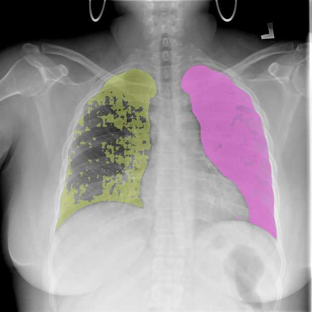 | 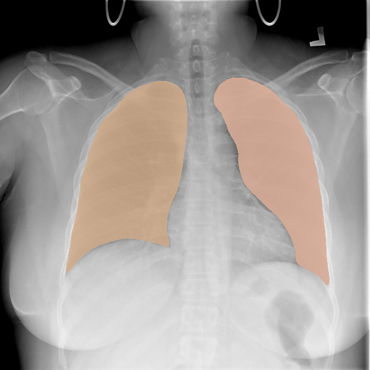 | 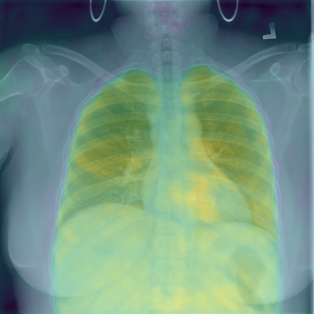 |
| Image 2: Lateral |  |  |  |  |
| Image 3: Frontal |  | 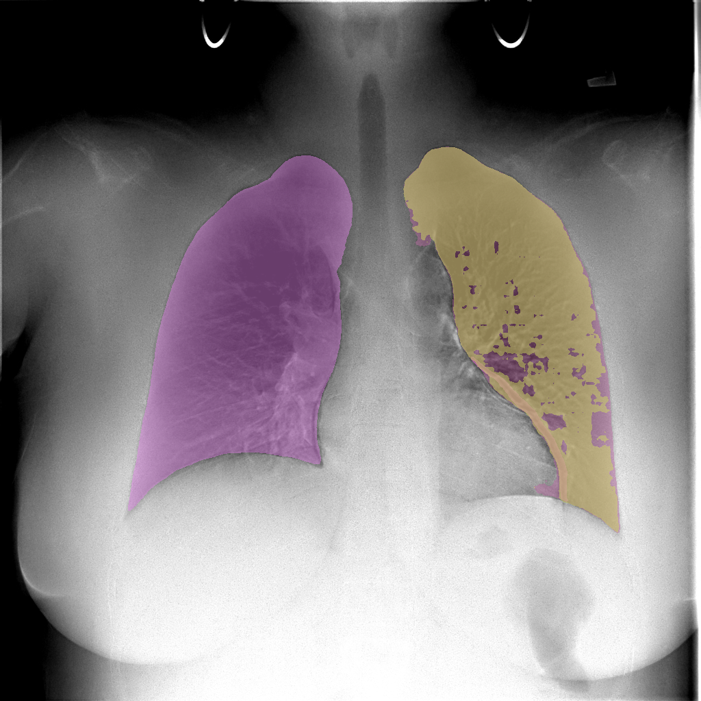 |  |  |
| Image 4: Frontal | 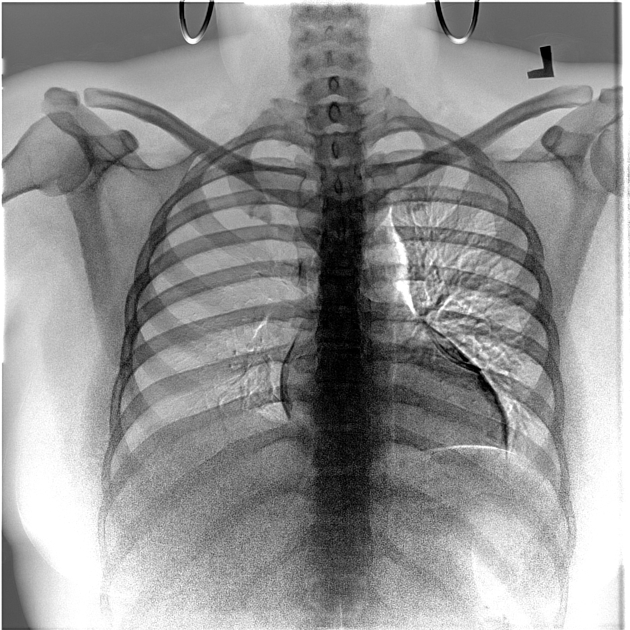 |  |  |  |

**Radiopaedia 原始图片 caption：**

<pre>5 cm long sheared off part of a Port-A-Cath, likely in the left lower lobe pulmonary arterial branch.</pre>

**原始图片 caption 中文医学要点（翻译）：**

<pre>

</pre>

#### Study 0 的 8 个模型 Single-modality caption 对比

<strong>InternVL3-14B</strong>

**原始图像 → Single-modality caption 回答**

英文原始回答：

<pre>The patient data indicates an examination for workup prior to a stem cell transplant. Evaluation of pre-transplant status is crucial as it may involve assessing for any underlying lung conditions or infections, which are important considerations before such an extensive procedure.

**Image 1 (Frontal X-ray):**
- The frontal chest X-ray shows clear views of both lung fields, heart, and bony thorax. 
- The lung fields appear clear with no significant consolidations or masses.
- The heart size is within normal limits.
- No evident pleural effusions or pneumothorax.
- The visual structures of the ribs and clavicles appear intact without any fractures.

**Image 2 (Lateral X-ray):**
- This lateral view offers additional perspective on the chest anatomy.
- The lung fields still appear free of abnormal masses or infiltrates.
- The heart shadow is visible, and the trachea appears midline, indicating no significant deviation.
- The visible portions of the diaphragm appear normal, and there is no indication of diaphragmatic hernia or significant elevation.
- The spine alignment looks normal.

**Image 3 (Frontal X-ray):**
- Similar to the first frontal view, this X-ray of the chest shows clear lung fields.
- The bronchovascular markings are consistent with normal lung parenchyma.
- There is no indication of active infections such as pneumonia, as no localized opacity or consolidation is noted.
- The diaphragm is well-positioned and the costophrenic angles are clear, ruling out effusions.
- Heart size is normal and the mediastinal contours are unremarkable.

**Image 4 (Frontal X-ray):**
- This frontal chest X-ray exhibits clarity in the lung fields.
- The cardiac silhouette is within normal size limits.
- No significant lymphadenopathy or masses are visible.
- Bones of the thoracic cage, including ribs and clavicles, are intact without apparent fractures.

**Overall Assessment:**
The chest X-rays appear to show normal findings. There is no evidence of acute pulmonary pathology such as pneumonia, mass lesions, pleural effusions, or pneumothorax. The heart size is normal, and there are no signs of cardiac enlargement. The bony structures seem intact without any fractures. 

**Conclusion:**
Based on these X-rays, the patient does not display any overt signs of pulmonary or cardiac compromise. This would be considered a favorable finding for the pre-stem cell transplant evaluation. However, for comprehensive assessment, additional modalities or clinical correlation may be required to ensure no subclinical or early-stage pathology is present. Pre-transplant workup typically also involves a broader evaluation including history, physical examination, laboratory tests, and potentially CT scans if indicated by risk factors or initial tests.

**Diagnosis:** 
The chest X-rays are within normal limits, showing no acute pathological findings that would contraindicate proceeding with stem cell transplant evaluations. Further multimodal medical assessment is recommended to ensure complete clearance for the procedure.</pre>

中文医学要点（翻译）：

<pre>

</pre>

**原始图像 + Segmentation → Single-modality caption 回答**

英文原始回答：

<pre>Given the patient's background information of preparing for a stem cell transplant, imaging is critical to assess the underlying lung condition, which could be affected by pre-existing diseases, infections, or treatments that the patient might have undergone. Evaluating the provided chest X-rays requires a thorough analysis of any visible abnormalities that may indicate a pathology that could impact the stem cell transplant process.

### Observations:

1. **Image 1 (Frontal Chest X-ray):**
   - The overall lung fields appear to have areas of increased opacity.
   - The left lung (right side of the image due to standard projection conventions) shows more homogeneous opacity, suggestive of possible consolidation, which may indicate infection, inflammation, or atelectasis.
   - The right lung (left side of the image) appears less opaque and could be more aerated, though there are still diffuse opacities.

2. **Image 2 (Lateral Chest X-ray):**
   - The mediastinum and heart appear normal in size.
   - The left lung, as seen from the lateral view, also shows substantial opacity.
   - The opacity continues into the lower lung zones, suggesting a possibility of a lower lobe pathology or fluid accumulation.
   - The right lung shows less opacity but still has scattered patchy shadows.

3. **Image 3 (Frontal Chest X-ray):**
   - This image indicates a more significant consolidation in the lower left lung field with potential involvement of the left lower lobe.
   - There may also be some volume loss or collapse, indicated by the increased density and loss of the usual lung markings.
   - The right lung appears relatively clearer but shows scattered patches of abnormality.

4. **Image 4 (Frontal Chest X-ray):**
   - The right lung (left side of the image) appears to have a more consolidated appearance, particularly in the lower zone, suggesting the presence of infiltrates which could be due to infection, inflammation, or edema.
   - The left lung (right side of the image) is less distinct but shows signs of volume loss or collapse, especially in the upper and middle lobes.
   - The overall air-filled spaces are reduced, contributing to the increased density of the lungs.

### Diagnosis:
Based on the described X-ray findings, there are several possible diagnoses to consider:

1. **Pneumonia**: The diffuse and patchy opacities seen in the lungs, especially on the left side, are consistent with consolidation typically observed in pneumonia. The increased density in the lower lobes may indicate bacterial, viral, or atypical infection.

2. **Pulmonary Edema**: Given the patient’s medical history, pulmonary edema could be a concern, especially if there is a history of cardiac issues. Fluid accumulation can lead to bilateral opacities, though it often appears more peripherally.

3. **Atelectasis**: There are signs of increased density on the left side, potentially suggesting volume loss or collapse of lung tissue, which could point towards atelectasis. This condition can develop from mucus plugging, airway obstruction, or pleural effusion.

4. **Infectious Process**: The patient’s preparation for a stem cell transplant implies a potentially immunocompromised state, increasing the risk of infections such as tuberculosis or fungal infections. Histoplasmosis or aspergillosis can present with similar radiological features.

### Recommendations:
- A thorough clinical correlation with symptoms such as fever, cough, sputum production, dyspnea, and history of recent infections or immunosuppressive treatments is essential.
- Additional diagnostic tests including a sputum culture, blood cultures, and further imaging modalities like a CT scan may be warranted to better delineate the extent and nature of the lung pathology.
- Pulmonary consultation and possibly bronchoscopy for microbiological samples could aid in accurate diagnosis and management.
- If infection is suspected, empirical antibiotic therapy should be considered pending culture results, tailored to the patient’s immune status.

In summary, the imaging findings suggest a complex pulmonary process that could be infectious, inflammatory, or related to underlying lung pathology, requiring a targeted diagnostic approach given the patient’s medical background and upcoming stem cell transplant. Further diagnostics and potential interventions are crucial for managing any underlying pathology that could affect the transplant outcome.</pre>

中文医学要点（翻译）：

<pre>

</pre>

**Segmentation 对 caption 的影响分析：**

<pre>

</pre>

<strong>InternVL3.5-14B</strong>

**原始图像 → Single-modality caption 回答**

英文原始回答：

<pre>&lt;think&gt;
The patient is a 40-year-old female undergoing a workup prior to a stem cell transplant. The chest X-rays (frontal and lateral views) are being evaluated. 

**Analysis of the Images:**

1. **Frontal View (Image 1 and Image 3):**
   - The lungs appear clear with no significant opacities, masses, or consolidations.
   - The heart size is within normal limits.
   - The diaphragm and costophrenic angles are sharp, indicating no pleural effusion.
   - The bony thorax, including ribs and clavicles, appears intact without obvious lesions.

2. **Lateral View (Image 2):**
   - The lung fields are clear, and the cardiac silhouette is normal.
   - The mediastinum is not widened.
   - The diaphragm and posterior costophrenic angles are clear.

3. **Additional Frontal View (Image 3):**
   - Similar findings as the first frontal view; no new abnormalities noted.

4. **Image 4 (Frontal View with Elevated Clavicles):**
   - The clavicles are elevated, which might suggest shoulder positioning or a possible underlying issue, but the lungs and heart remain clear.

**Considerations:**

- The patient is pre-stem cell transplant, so any signs of infection, infiltrates, or masses would be significant. However, none are evident here.
- The X-rays do not show any acute cardiopulmonary abnormalities.
- **Possible Diagnosis:** Given the lack of acute findings, the chest X-rays are likely normal. However, if there's a concern for occult disease, further imaging (like a CT scan) or clinical correlation might be needed. For a stem cell transplant workup, ensuring there's no hidden pathology is crucial, but based on these X-rays alone, no definitive diagnosis of an abnormality can be made.
&lt;/think&gt;

**Diagnosis:**  
The chest X-rays (frontal and lateral views) demonstrate no acute cardiopulmonary abnormalities. The lungs are clear, the heart size is normal, and there are no signs of pleural effusion or bony lesions. Given the patient's context of preparation for a stem cell transplant, these findings suggest no immediate radiographic evidence of active disease. However, further evaluation with advanced imaging (e.g., CT scan) or clinical correlation may be warranted to rule out occult pathology not visible on standard X-rays. 

**Conclusion:**  
Normal chest X-ray. No acute abnormalities detected.</pre>

中文医学要点（翻译）：

<pre>

</pre>

**原始图像 + Segmentation → Single-modality caption 回答**

英文原始回答：

<pre>&lt;think&gt;
The patient is a 40-year-old female undergoing evaluation for a stem cell transplant. The chest X-rays (frontal and lateral views) show multiple segmented areas of interest. The segmentation highlights the lungs, with notable dense opacities in the left lung, particularly in the lower zones. These opacities could represent fibrotic changes, calcifications, or other interstitial abnormalities. The right lung appears relatively clear. The heart and mediastinum are within normal limits, and there is no obvious pleural effusion or pneumothorax. The diaphragm is well-positioned, and the bony structures are intact. Given the patient's context of stem cell transplant workup, these findings might suggest prior granulomatous disease (e.g., sarcoidosis or old tuberculosis) or radiation/chemotherapy-related lung changes. Further evaluation with a high-resolution CT scan would be beneficial for detailed assessment.
&lt;/think&gt;

**Diagnosis:**

The chest X-rays demonstrate bilateral lung involvement with notable opacities, particularly in the left lower lung zone. Given the patient's context of stem cell transplant evaluation, these findings may suggest:

1. **Granulomatous Disease:** Potential history of sarcoidosis or prior tuberculosis, characterized by fibrotic or calcified granulomas.
2. **Post-Therapeutic Changes:** Possible radiation or chemotherapy-induced lung toxicity, leading to fibrosis or interstitial changes.
3. **Infectious Process:** Less likely, but chronic infection or sequelae (e.g., fungal infections in immunocompromised patients) could be considered.

**Recommendations:**

- **High-Resolution CT Scan:** To better characterize the lung opacities, assess for fibrosis, nodules, or other interstitial patterns.
- **Clinical Correlation:** Review patient's history for prior infections, autoimmune conditions, or treatment-related complications.
- **Follow-Up Imaging:** If asymptomatic, monitor with periodic imaging; if symptomatic, further investigate with microbiological or biopsy studies as indicated.

These findings warrant further evaluation to ensure optimal lung health prior to stem cell transplantation.</pre>

中文医学要点（翻译）：

<pre>

</pre>

**Segmentation 对 caption 的影响分析：**

<pre>

</pre>

<strong>Lingshu-32B</strong>

**原始图像 → Single-modality caption 回答**

英文原始回答：

<pre>Findings: The heart size is normal.  The mediastinal and hilar contours are within normal limits.  There is no pulmonary vascular congestion.  Lungs are clear without focal consolidation.  No pleural effusion or pneumothorax is identified.  No displaced rib fractures are noted. Impression: No acute cardiopulmonary process.</pre>

中文医学要点（翻译）：

<pre>

</pre>

**原始图像 + Segmentation → Single-modality caption 回答**

英文原始回答：

<pre>Findings: The lungs are clear bilaterally. Specifically, no evidence of focal consolidation, pneumothorax, or pleural effusion.. Cardio mediastinal silhouette is unremarkable. Visualized osseous structures of the thorax are without acute abnormality.  There is a catheter fragment overlying the left mid lung zone. Impression: No acute cardiopulmonary abnormality.</pre>

中文医学要点（翻译）：

<pre>

</pre>

**Segmentation 对 caption 的影响分析：**

<pre>

</pre>

<strong>MedGemma-27B-IT</strong>

**原始图像 → Single-modality caption 回答**

英文原始回答：

<pre>The patient is a 40-year-old female undergoing workup prior to a stem cell transplant. The provided images are chest X-rays (frontal and lateral views).

**Image Description:**

*   **Image 1 (Frontal):** Shows the heart, lungs, mediastinum, and bony structures of the chest. The lung fields appear relatively clear bilaterally. The heart size appears within normal limits. The mediastinal silhouette is unremarkable. The bony structures appear intact.
*   **Image 2 (Lateral):** Shows the heart, lungs, spine, and posterior structures. The lung fields appear clear. The heart size appears normal. The mediastinal structures are unremarkable. The spine appears intact.
*   **Image 3 (Frontal):** Similar to Image 1, showing the chest structures. The lung fields appear clear. The heart size appears normal. The mediastinal silhouette is unremarkable. The bony structures appear intact.
*   **Image 4 (Frontal):** Shows the chest structures. The lung fields appear clear. The heart size appears normal. The mediastinal silhouette is unremarkable. The bony structures appear intact.

**Overall Impression:**

The chest X-rays (both frontal and lateral views) appear largely unremarkable. There are no obvious signs of acute infection (like pneumonia), significant pleural effusion, pneumothorax, or major cardiac abnormalities. The lung fields appear clear, and the heart size is within normal limits. The bony structures are intact.

**Diagnosis:**

Based on the provided images, the chest X-ray findings are essentially normal.

**Clinical Context:**

The patient is undergoing workup for a stem cell transplant. A normal chest X-ray is a common finding in such pre-transplant evaluations, as it helps rule out underlying pulmonary conditions that might increase the risk during the transplant procedure or complicate recovery.

**Disclaimer:** This interpretation is based solely on the provided images and limited clinical information. A definitive diagnosis requires correlation with the patient's full clinical history, physical examination, and potentially other investigations.</pre>

中文医学要点（翻译）：

<pre>

</pre>

**原始图像 + Segmentation → Single-modality caption 回答**

英文原始回答：

<pre>The patient is a 40-year-old female undergoing workup prior to a stem cell transplant. The provided images are chest X-rays in frontal (Images 1, 3, 4) and lateral (Image 2) views.

**Image Description:**

*   **Image 1 (Frontal):** Shows the chest with both lungs, heart, mediastinum, and diaphragm. The lungs appear relatively clear, although there might be subtle opacities, especially in the lower lobes. The cardiac silhouette is normal in size. The mediastinum appears unremarkable. A catheter fragment is noted in the upper right lung field.
*   **Image 2 (Lateral):** Shows the chest from the side. The lungs, heart, diaphragm, and vertebral column are visible. The lung fields appear relatively clear. The cardiac silhouette is normal. The catheter fragment is also visible in this view.
*   **Image 3 (Frontal):** Similar to Image 1, showing the chest in the frontal view. The lungs appear relatively clear. The cardiac silhouette is normal. The mediastinum appears unremarkable. The catheter fragment is noted in the upper right lung field.
*   **Image 4 (Frontal):** Shows the chest in the frontal view. The lungs appear relatively clear. The cardiac silhouette is normal. The mediastinum appears unremarkable. The catheter fragment is noted in the upper right lung field.

**Overall Impression:**

The chest X-rays show a catheter fragment located in the upper right lung field. The lung fields appear otherwise relatively clear, without obvious signs of consolidation, effusion, or pneumothorax. The heart size and mediastinal contours are normal.

**Diagnosis:**

1.  **Presence of a catheter fragment in the right lung:** This is an incidental finding. The clinical significance depends on the type of catheter, its history, and whether it is causing any symptoms or complications. It might be a remnant of a previous central venous catheter or other vascular access device.
2.  **Otherwise unremarkable chest X-ray:** No acute cardiopulmonary pathology is evident.

**Clinical Context:**

The patient is undergoing workup for a stem cell transplant. A chest X-ray is a standard part of the pre-transplant evaluation to assess baseline lung health and rule out any active infections or other significant pulmonary conditions that might increase the risk during the transplant procedure. The catheter fragment is an incidental finding that needs to be documented and potentially investigated further depending on the clinical context (e.g., type of catheter, history of central lines, symptoms). However, it does not appear to be an acute issue based solely on these images.</pre>

中文医学要点（翻译）：

<pre>

</pre>

**Segmentation 对 caption 的影响分析：**

<pre>

</pre>

<strong>MedMO-8B</strong>

**原始图像 → Single-modality caption 回答**

英文原始回答：

<pre>The patient is status post stem cell transplant. There is a right-sided Port-A-Cath with tip in the right atrium. There is no pneumothorax.</pre>

中文医学要点（翻译）：

<pre>

</pre>

**原始图像 + Segmentation → Single-modality caption 回答**

英文原始回答：

<pre>The patient is a 40-year-old female with history of multiple myeloma. The patient has had a stem cell transplant. The patient has a history of right sided pneumonia. The patient is here for workup prior to transplant. The patient has a right sided chest tube in place. The patient has a left sided catheter in place. The patient has a left sided pleural effusion.</pre>

中文医学要点（翻译）：

<pre>

</pre>

**Segmentation 对 caption 的影响分析：**

<pre>

</pre>

<strong>Qwen3-VL-4B</strong>

**原始图像 → Single-modality caption 回答**

英文原始回答：

<pre>Based on the patient’s age (40 years, female) and the context of a workup prior to stem cell transplant, the imaging findings are highly suggestive of **pulmonary hypertension** or **chronic thromboembolic pulmonary hypertension (CTEPH)**, with the most prominent finding being **right heart enlargement** and **pulmonary artery dilation**.

Here’s a breakdown of the imaging findings:

- **Image 1 (Frontal)**: Shows a normal-appearing chest with no obvious pneumothorax, consolidation, or large mass. The heart silhouette is within normal limits, and the diaphragm is well-positioned.
  
- **Image 2 (Lateral)**: This view is critical. It shows a **markedly enlarged right heart border** and **dilated pulmonary arteries**. The right ventricular shadow is prominent, indicating right ventricular hypertrophy. The mediastinum appears shifted to the right, which is consistent with right heart failure or pulmonary hypertension.

- **Image 3 (Frontal)**: This image appears to be a high-contrast, possibly digitally enhanced image. It shows a **normal-appearing heart silhouette** with no obvious enlargement. However, the high contrast may obscure subtle findings.

- **Image 4 (Frontal)**: This image is the most diagnostic. It shows a **prominent right heart border** and **dilated pulmonary arteries**. The right ventricle is enlarged, and the pulmonary artery is visibly dilated. The left heart border is normal, and the diaphragm is well-positioned.

The most significant finding is the **right heart enlargement** and **pulmonary artery dilation**, which are classic signs of **pulmonary hypertension**. The combination of these findings, along with the patient’s age and the context of stem cell transplant, suggests that the patient may have **pulmonary hypertension** or **CTEPH**. These conditions can be life-threatening and require immediate evaluation and treatment.

In summary, the imaging findings are consistent with **pulmonary hypertension** or **CTEPH**, and the patient should be referred for further evaluation, including echocardiography and possibly a right heart catheterization, to confirm the diagnosis and begin appropriate treatment.</pre>

中文医学要点（翻译）：

<pre>

</pre>

**原始图像 + Segmentation → Single-modality caption 回答**

英文原始回答：

<pre>Based on the provided patient data (40-year-old female, undergoing workup prior to stem cell transplant) and the radiological images, the most likely diagnosis is **pulmonary embolism (PE)**.

Here’s the reasoning:

1.  **Clinical Context**: Stem cell transplantation is a high-risk procedure associated with a significantly increased risk of venous thromboembolism (VTE), including pulmonary embolism. This makes PE a critical differential diagnosis in the pre-transplant workup.

2.  **Radiological Findings**:
    *   **Image 4 (Frontal)**: This image is the most diagnostic. It shows a large, well-defined, **right-sided lung infiltrate** (marked in yellow in the combined segmentation) with a **distinctly increased opacity** compared to the left lung. This is highly suggestive of a **pulmonary embolism**. The appearance is often described as "ground-glass" or "consolidation" on X-ray, indicating obstruction of the pulmonary artery by a thrombus, leading to alveolar filling.
    *   **Image 1 (Frontal)**: Shows a **left lung infiltrate** (green in segmentation), which is less prominent than in Image 4. This could represent an early or smaller PE, or a different pathology.
    *   **Image 2 (Lateral)**: Shows a **large, dense, and irregularly shaped infiltrate** in the right lung (pink in segmentation). The lateral view often provides a more detailed assessment of the lung's internal structure and can better delineate the extent of the infiltrate.
    *   **Image 3 (Frontal)**: Shows **no significant infiltrates**. This may represent a normal finding or a different phase of the disease.
    *   **Combined Segmentation (Image 1)**: Shows a **significant difference in lung opacity** between the left and right lungs, which is consistent with a unilateral pulmonary embolism.

3.  **Key Diagnostic Feature**: The presence of a **large, unilateral, and well-defined lung infiltrate** on chest X-ray is a classic finding in pulmonary embolism, especially when combined with the patient's high-risk clinical context.

In conclusion, the radiological findings, particularly the large right-sided infiltrate on Image 4, are highly suggestive of **pulmonary embolism**. This diagnosis is critical to manage before proceeding with stem cell transplantation to prevent life-threatening complications. Further confirmation with CT pulmonary angiography (CTPA) is typically required.</pre>

中文医学要点（翻译）：

<pre>

</pre>

**Segmentation 对 caption 的影响分析：**

<pre>

</pre>

<strong>Qwen3-VL-8B</strong>

**原始图像 → Single-modality caption 回答**

英文原始回答：

<pre>Based on the provided images and the patient’s background (40-year-old female, workup prior to stem cell transplant), the chest radiographs show a **significant, large, left-sided pleural effusion**.

Here is the analysis of the images:

*   **Image 1 (Frontal):** Shows the left hemithorax is markedly denser than the right. The left lung appears compressed and obscured, with the left costophrenic angle being blunted. The mediastinum is shifted slightly to the right.
*   **Image 2 (Lateral):** This view confirms the presence of a large fluid collection in the left pleural space. The fluid level is visible as a meniscus, and the left lung is compressed. The heart and mediastinum are displaced to the right.
*   **Image 3 (Frontal):** This is a "spot" or "mini" frontal view, which again shows the left lung field is opaque and the left hemidiaphragm is obscured, consistent with a large effusion.
*   **Image 4 (Frontal):** This image appears to be a different frontal view or possibly a repeat, but it also demonstrates the left-sided opacity and mediastinal shift.

**Diagnosis:**
**Large Left Pleural Effusion**

**Clinical Significance:**
Given the patient is a 40-year-old female undergoing workup for a stem cell transplant, this finding is clinically significant. Pleural effusions can be a sign of underlying pathology that needs to be investigated, such as:
*   **Malignancy** (e.g., lymphoma, lung cancer, metastatic disease)
*   **Infection** (e.g., tuberculosis, bacterial pneumonia, viral)
*   **Autoimmune or inflammatory conditions**
*   **Heart failure** (though less likely in a young patient without other symptoms)
*   **Paraneoplastic syndrome** (common in hematologic malignancies)

The presence of a large effusion prior to a stem cell transplant necessitates further investigation to determine the cause, as it could impact transplant candidacy and require pre-transplant management. A CT scan of the chest, thoracentesis with fluid analysis, and possibly a biopsy may be indicated.

In summary, the chest X-rays reveal a large, left-sided pleural effusion, which requires urgent evaluation to determine the underlying etiology, especially in the context of a patient preparing for a stem cell transplant.</pre>

中文医学要点（翻译）：

<pre>

</pre>

**原始图像 + Segmentation → Single-modality caption 回答**

英文原始回答：

<pre>Based on the provided chest X-ray images and the patient's background (40-year-old female, workup prior to stem cell transplant), the imaging findings are highly suggestive of **pulmonary embolism (PE)**, likely **massive or submassive**, with possible associated **right heart strain**.

Here is a detailed analysis:

1.  **Image 4 (Frontal):** This image is the most critical for diagnosis. It shows a **dramatic, large, wedge-shaped opacity in the right lower lung field**, which is a classic sign of a **large pulmonary embolism**. This opacity represents a filling defect within the pulmonary artery, which is the hallmark of PE on a chest X-ray. The opacity is large enough to suggest a massive or submassive PE. Additionally, there is a **significant mediastinal shift to the left**, indicating **right heart strain** or **right ventricular dilation** due to the obstruction of pulmonary blood flow. The right hemidiaphragm is also elevated, which can be a sign of right ventricular hypertrophy or strain.

2.  **Image 1 (Frontal):** This image shows a relatively normal chest X-ray. The lungs are clear, and there is no evidence of a filling defect or significant mediastinal shift. This is consistent with a normal pre-transplant workup, but it does not rule out PE, especially if the patient is asymptomatic or if the PE is small.

3.  **Image 2 (Lateral):** This image shows a normal lateral chest X-ray. The lung fields are clear, and there is no evidence of a filling defect or mediastinal shift. This is consistent with a normal pre-transplant workup, but it does not rule out PE, especially if the patient is asymptomatic or if the PE is small.

4.  **Image 3 (Frontal):** This image shows a relatively normal chest X-ray. The lungs are clear, and there is no evidence of a filling defect or significant mediastinal shift. This is consistent with a normal pre-transplant workup, but it does not rule out PE, especially if the patient is asymptomatic or if the PE is small.

**Conclusion:**

The most significant finding is in **Image 4**, which shows a large pulmonary embolism with associated right heart strain. This is a critical finding that requires immediate intervention. The patient should be evaluated for PE with a CT pulmonary angiogram (CTPA) to confirm the diagnosis and assess the extent of the embolism. If the CTPA confirms the diagnosis, the patient should be started on anticoagulation therapy immediately.

The other images (1, 2, and 3) are relatively normal and do not show any evidence of PE. However, the presence of a large PE in Image 4 is a critical finding that requires immediate intervention. The patient should be evaluated for PE with a CT pulmonary angiogram (CTPA) to confirm the diagnosis and assess the extent of the embolism. If the CTPA confirms the diagnosis, the patient should be started on anticoagulation therapy immediately.

The patient's age and gender are not relevant to the diagnosis of PE. The patient is a 40-year-old female, which is a relatively young age for PE, but PE can occur at any age. The patient's gender is not relevant to the diagnosis of PE. The patient's workup prior to stem cell transplant is relevant, as PE is a common complication of stem cell transplant.

In summary, the patient has a **large pulmonary embolism with associated right heart strain**, which is a critical finding that requires immediate intervention. The patient should be evaluated for PE with a CT pulmonary angiogram (CTPA) to confirm the diagnosis and assess the extent of the embolism. If the CTPA confirms the diagnosis, the patient should be started on anticoagulation therapy immediately.</pre>

中文医学要点（翻译）：

<pre>

</pre>

**Segmentation 对 caption 的影响分析：**

<pre>

</pre>

<strong>Qwen3-VL-32B</strong>

**原始图像 → Single-modality caption 回答**

英文原始回答：

<pre>The patient is a 40-year-old female undergoing pre-transplant workup for stem cell transplantation. The provided images are chest X-rays (CXR) in frontal (posteroanterior, PA) and lateral projections, taken at different time points or under different conditions.

---

### **Image Analysis:**

#### **Image 1 (Frontal PA view):**
- **Lung fields:** Bilateral, diffuse, reticular opacities are visible, more prominent in the lower lung zones. There is increased interstitial marking, suggesting interstitial lung disease (ILD).
- **Heart and mediastinum:** Normal size and contour.
- **Diaphragm:** Sharp and well-defined.
- **Bones:** No obvious fractures or lesions.
- **Overall impression:** Diffuse interstitial lung disease pattern.

#### **Image 2 (Lateral view):**
- **Lung fields:** Increased linear opacities in the posterior and basilar regions, consistent with interstitial thickening.
- **Cardiac silhouette:** Normal.
- **Diaphragm:** Normal contour.
- **Impression:** Confirms the interstitial pattern seen on the frontal view, particularly in the posterior lung bases.

#### **Image 3 (Frontal PA view – possibly earlier or different technique):**
- **Lung fields:** Clearer lung fields with minimal interstitial markings. No obvious consolidation or nodules.
- **Heart and mediastinum:** Normal.
- **Diaphragm:** Sharp.
- **Impression:** This image appears to show **normal or near-normal lung parenchyma**, suggesting it may be from an earlier time point or a different patient (though patient data is consistent across all images).

#### **Image 4 (Frontal PA view – likely same patient, different time or exposure):**
- **Lung fields:** Diffuse, bilateral, reticular opacities with a “honeycombing” appearance in the lower lobes, especially on the right. This is classic for **advanced interstitial lung disease**.
- **Heart and mediastinum:** Normal.
- **Diaphragm:** Slightly elevated on the right, possibly due to volume loss from fibrosis.
- **Impression:** Advanced fibrotic interstitial lung disease.

---

### **Comparative Interpretation:**
- **Image 3** appears normal or minimally abnormal.
- **Images 1, 2, and 4** show progressive interstitial lung disease, with **Image 4** demonstrating the most advanced changes (honeycombing, reticulation, volume loss).

This suggests that the patient may have developed **progressive interstitial lung disease** over time, possibly related to an underlying condition (e.g., autoimmune disease, idiopathic pulmonary fibrosis, or drug-induced) or a complication of prior therapy.

---

### **Clinical Context:**
- The patient is undergoing pre-transplant workup for **stem cell transplantation**, which is often performed for hematologic malignancies (e.g., lymphoma, leukemia) or autoimmune diseases.
- **Interstitial lung disease (ILD)** is a known risk factor for complications during and after stem cell transplantation, including **transplant-related pulmonary toxicity** and **increased mortality**.
- ILD can be:
  - **Idiopathic (e.g., IPF)**
  - **Secondary (e.g., connective tissue disease, drug-induced, radiation-induced)**
  - **Pre-existing or newly developed**

---

### **Diagnosis:**
**Progressive interstitial lung disease (ILD), likely fibrotic, with features of honeycombing and reticulation, most evident in Images 1, 2, and 4.**

This finding is **critical** in the pre-transplant workup, as it may **contraindicate or require careful risk-benefit analysis** before proceeding with stem cell transplantation.

---

### **Recommendations:**
1. **High-resolution CT (HRCT) of the chest** is essential to confirm the diagnosis, characterize the extent and pattern of ILD, and differentiate between subtypes (e.g., usual interstitial pneumonia vs. nonspecific interstitial pneumonia).
2. **Pulmonary function tests (PFTs)** to assess lung volumes, diffusion capacity (DLCO), and functional impairment.
3. **Evaluation for underlying causes**: Autoimmune workup (ANA, ENA, anti-SSA/Ro, anti-Scl-70, etc.), rheumatologic evaluation, and review of prior medications (e.g., bleomycin, methotrexate, amiodarone).
4. **Multidisciplinary team (MDT) discussion** including pulmonology, transplant medicine, and radiology to determine transplant eligibility and manage pulmonary risk.

---

### **Conclusion:**
The chest X-rays demonstrate **progressive interstitial lung disease**, with advanced fibrotic changes in Image 4. This is a **significant finding** in the context of pre-transplant evaluation and requires further characterization and risk stratification before proceeding with stem cell transplantation.</pre>

中文医学要点（翻译）：

<pre>

</pre>

**原始图像 + Segmentation → Single-modality caption 回答**

英文原始回答：

<pre>Based on the provided patient data and chest X-ray images, here is a comprehensive radiological assessment and diagnosis.

---

### **Patient Summary**
- **Age:** 40 years
- **Gender:** Female
- **Clinical Context:** Workup prior to stem cell transplant

This context is critical. Stem cell transplantation (SCT) is a high-risk procedure requiring a thorough pre-transplant evaluation to assess organ function, detect occult disease, and identify potential contraindications. The chest X-ray is a standard component of this workup to evaluate pulmonary health.

---

### **Image Analysis**

#### **Image 1: Frontal Chest X-ray (PA View)**
- **Lung Fields:** Both lungs appear relatively clear with normal vascular markings. No evidence of consolidation, mass, or significant interstitial infiltrates.
- **Cardiomediastinum:** Cardiac silhouette is within normal size limits. No signs of cardiomegaly or mediastinal widening.
- **Diaphragm:** Diaphragms are well-defined and at normal levels. No elevation or blunting of costophrenic angles.
- **Bones:** Bony thorax (ribs, clavicles, spine) shows no fractures or lytic/osteoblastic lesions.
- **Segmentation Observations:**
  - **Medical-SAM3:** Shows some irregularities in lung parenchyma (yellow/pink areas), possibly indicating mild texture changes or noise, but no clear pathological opacities.
  - **BiomedParse:** Provides a smooth, anatomically accurate segmentation of both lungs, suggesting no gross abnormalities.
  - **TorchXRayVision:** Highlights the lungs and diaphragm with a heat-map overlay; no abnormal hotspots suggesting pathology.

#### **Image 2: Lateral Chest X-ray**
- **Lung Fields:** The lateral view confirms clear lung fields with no masses, effusions, or consolidations. The heart and mediastinum are not enlarged.
- **Segmentation Observations:**
  - **Medical-SAM3:** Shows a patchy, irregular segmentation in the posterior lung (pink/orange), which may reflect subtle texture variations but not definitive pathology.
  - **BiomedParse:** Provides a clean segmentation of the lung, with the posterior lung appearing normal.
  - **TorchXRayVision:** Overlays the lung with a uniform heat-map, indicating no focal abnormalities.

#### **Image 3: Frontal Chest X-ray (PA View)**
- **Lung Fields:** Clear lungs with normal bronchovascular markings. No evidence of pneumonia, fibrosis, or nodules.
- **Cardiomediastinum:** Normal cardiac size and mediastinal contour.
- **Diaphragm:** Sharp costophrenic angles, normal diaphragm contour.
- **Segmentation Observations:**
  - **Medical-SAM3:** Left lung (yellow) shows some fragmented segmentation, possibly due to image noise or minor artifacts, but no pathological findings.
  - **BiomedParse:** Smooth segmentation of both lungs, confirming normal anatomy.
  - **TorchXRayVision:** Heat-map shows even distribution, no areas of increased density or abnormality.

#### **Image 4: Frontal Chest X-ray (PA View)**
- **Lung Fields:** Notably, there is **marked asymmetry**. The **right lung appears hyperlucent** (very dark), suggesting **volume loss or collapse**, while the **left lung is more radiopaque** (whiter), possibly due to compensatory overinflation or underlying pathology.
- **Cardiomediastinum:** The heart is shifted to the right, indicating a **right-sided process** (e.g., atelectasis, pneumothorax, or mass).
- **Diaphragm:** The right hemidiaphragm appears elevated.
- **Segmentation Observations:**
  - **Medical-SAM3:** Segments the right lung (pink) as significantly less dense, consistent with hyperlucency.
  - **BiomedParse:** Segments the right lung with a large area of missing or under-segmented tissue, suggesting volume loss.
  - **TorchXRayVision:** Heat-map shows reduced density in the right lung, with the left lung appearing more dense.

---

### **Interpretation and Diagnosis**

The first three images (Images 1, 2, and 3) are **normal** or show **no significant pathology**. They are consistent with a healthy chest, which is reassuring for a pre-transplant workup.

However, **Image 4** is **abnormal** and requires urgent attention.

#### **Key Findings in Image 4:**
- **Right lung hyperlucency** with **elevated right hemidiaphragm**
- **Mediastinal shift to the right**
- **Left lung appears more radiopaque** (possibly due to compensatory changes or overinflation)

These findings are most consistent with **right-sided atelectasis** (partial or complete collapse of the right lung). The mediastinal shift and diaphragmatic elevation support this diagnosis.

Other differential diagnoses include:
- **Pneumothorax** (but no visible visceral pleural line or lung edge)
- **Lung volume loss due to mass or fibrosis** (but no visible mass on X-ray)
- **Obstructive atelectasis** (e.g., due to bronchial obstruction by tumor, mucus plug, or foreign body)

Given the patient’s age and the context of pre-transplant workup, **obstructive atelectasis** should be ruled out, especially if there is an underlying malignancy (e.g., lymphoma, lung cancer) that may be the reason for stem cell transplant.

---

### **Conclusion and Recommendation**

**Diagnosis:**
- **Images 1, 2, and 3:** Normal chest X-rays.
- **Image 4:** **Right lower lobe atelectasis** with associated mediastinal shift and diaphragmatic elevation.

**Clinical Implication:**
This finding is **not consistent with a normal pre-transplant evaluation**. Atelectasis can be a sign of underlying pathology (e.g., bronchial obstruction, infection, or malignancy) and may increase the risk of complications during and after stem cell transplant.

**Recommendations:**
1. **Correlate with clinical symptoms** (e.g., cough, dyspnea, fever).
2. **Perform a high-resolution CT scan of the chest** to better characterize the atelectasis, identify the cause (e.g., mass, mucus plug, fibrosis), and assess for any associated findings.
3. **Consider bronchoscopy** if obstructive atelectasis is suspected, especially given the patient’s age and transplant workup.
4. **Re-evaluate the indication for transplant** until the cause of atelectasis is identified and managed.

---

### **Final Summary**

&gt; The chest X-rays are mostly normal, but **Image 4 demonstrates right lower lobe atelectasis with mediastinal shift**, which is an **abnormal finding requiring further investigation**. Given the patient’s pre-transplant status, this must be thoroughly evaluated to rule out underlying pathology before proceeding with transplantation.

**Diagnosis: Right lower lobe atelectasis (Image 4); otherwise, normal chest X-rays.**</pre>

中文医学要点（翻译）：

<pre>

</pre>

**Segmentation 对 caption 的影响分析：**

<pre>

</pre>

### 4.2 Study 1: CT

- **Medical-SAM3 prompts：** lung, left lower lobe, pulmonary artery, catheter fragment
- **BiomedParse v1 prompts：** lung, left lower lobe, pulmonary artery, catheter fragment
- **TorchXRayVision：** 不适用于该 CT study。

| Image | Original image | Medical-SAM3 | BiomedParse v1 | TorchXRayVision |
|---|---|---|---|---|
| Image 1: Axial non-contrast | 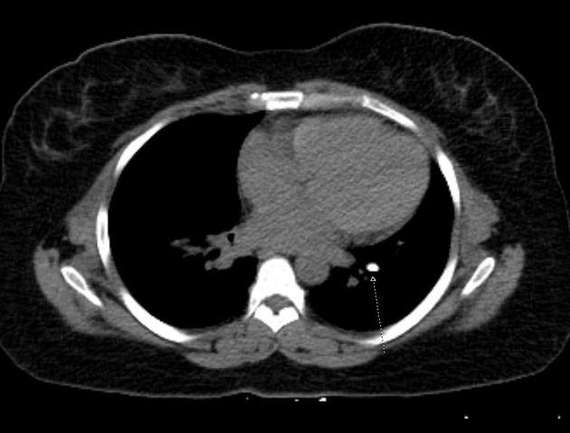 | 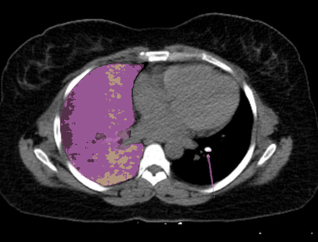 | 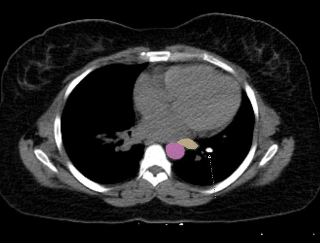 | N/A（仅适用于 X-ray） |

**Radiopaedia 原始图片 caption：**

<pre>Orphaned sheared segment of previous subclavian venous tubing, unchanged in position, in the segmental branch of the left lower pulmonary artery.</pre>

**原始图片 caption 中文医学要点（翻译）：**

<pre>

</pre>

#### Study 1 的 8 个模型 Single-modality caption 对比

<strong>InternVL3-14B</strong>

**原始图像 → Single-modality caption 回答**

英文原始回答：

<pre>This CT image is an axial non-contrast scan of the thorax. It shows the bony structures of the thoracic vertebrae, ribs, and sternum. The lungs and central thoracic structures, including the heart, are also visible. 

In the thoracic cavity, the heart appears enlarged, which suggests cardiomegaly. The lungs show normal aerated lung fields. 

Given the patient is undergoing a workup prior to stem cell transplant, there are a few considerations:

1. **Cardiomegaly**: The enlargement of the heart could be due to conditions such as cardiomyopathy, which might require evaluation before proceeding with a stem cell transplant. Cardiomyopathy can be due to prior chemotherapy or radiation therapy, or it might be a pre-existing condition.

2. **Evaluation for Transplant**: Prior to stem cell transplantation, comprehensive cardiac assessment is essential. This might include further imaging (like an echocardiogram) or functional tests to ensure the heart is stable for the potential stresses of chemotherapy and bone marrow transplantation.

3. **Other Considerations**: The lack of parenchymal lung disease or visible masses is positive. However, detailed assessment might also look for other signs of infection, inflammation, or malignancy which are critical for transplant planning.

In summary, the significant finding is the cardiomegaly, which likely requires further cardiological evaluation to ensure the patient is suitable for the upcoming stem cell transplant.</pre>

中文医学要点（翻译）：

<pre>

</pre>

**原始图像 + Segmentation → Single-modality caption 回答**

英文原始回答：

<pre>### Patient Data Recap:
- **Age:** 40 years
- **Gender:** Female
- **Presentation:** Pre-workup for stem cell transplant

### Imaging Description:
The provided images are computed tomography (CT) scans, specifically axial non-contrast sections. These scans focus on the thoracic cavity, capturing detailed cross-sectional imagery that includes the lungs, heart, and surrounding structures.

### Analysis of CT Images:
1. **Segmentation Overview:**
   - **Medical-SAM3 Segmentation:**
     - The segmentation highlights the left lower lobe of the lung, pulmonary artery, and a catheter fragment.
     - The highlighted regions indicate airways and anatomical structures critical for medical evaluation.

   - **BiomedParse Segmentation:**
     - The segmentation also identifies the left lower lobe of the lung, pulmonary artery, and a catheter fragment.
     - There is a focus on similar regions as highlighted by Medical-SAM3 but with slightly different precision in identifying anatomical structures.

2. **Pulmonary Structures:**
   - The left lower lobe of the lung appears to have regions of ground-glass opacity and possibly consolidation.
   - The pulmonary artery is clearly identifiable, suggesting a focus on evaluating vascular structures, which is crucial in the context of a stem cell transplant.

3. **Catheter Identification:**
   - The presence of a catheter fragment is noted, indicating potential prior invasive procedures or continuous monitoring/recording via catheterization.
   - This is especially relevant considering the patient is undergoing workup for a stem cell transplant, which often necessitates repeated imaging for both planning and monitoring purposes.

### Clinical Correlation:
Given the context of preparing for a stem cell transplant, the evaluation of pulmonary structures is paramount. Several critical aspects need to be considered:

1. **Pulmonary Function:**
   - The noted ground-glass opacity and consolidation might suggest inflammatory or infectious processes that need clarifying due to their potential impact on lung function. 

2. **Vascular Health:**
   - Examination of the pulmonary arteries can help in assessing for any potential thrombotic events or vasculitis, both of which can critically impact outcomes post-transplant.

3. **Catheter Position:**
   - Correct catheter placement and the absence of complications like perforation or infection are vital. Improper catheter positioning can lead to diagnostic errors or therapeutic challenges.

### Potential Diagnosis:
While definitive diagnosis requires clinical correlation with symptoms, history, and other diagnostic tests, the following points are noteworthy:

- **Pneumonitis or Infection:**
  Based on the ground-glass opacity and consolidation noted in the left lower lobe, differential diagnoses could include infectious pneumonitis, interstitial lung disease, or even radiation pneumonitis if prior radiation therapy has been administered.

- **Vascular Complications:**
  The integrity and patency of the pulmonary artery are essential, and any signs of vascular compromise could significantly affect the patient's ability to withstand transplant procedures.

- **Procedure-related Findings:**
  Given the patient's need for a stem cell transplant, the presence of a catheter needs to be evaluated in context with previous medical interventions and their effectiveness or complications.

### Recommendations:
1. **Further Imaging:**
   - High-resolution CT scans or additional imaging modalities (e.g., MRI) for more detailed assessment.
   
2. **Microbiological Studies:**
   - Sputum cultures or bronchoalveolar lavage to identify any infectious agents.

3. **Functional Tests:**
   - Pulmonary function tests to assess the impact on respiratory mechanics.

4. **Cardiovascular Evaluation:**
   - Echocardiography or additional vascular studies to evaluate pulmonary artery integrity.

Considering the patient's upcoming stem cell transplant, ensuring optimal pulmonary health and identifying and managing any potential complications promptly is essential for the success of the transplant procedure.</pre>

中文医学要点（翻译）：

<pre>

</pre>

**Segmentation 对 caption 的影响分析：**

<pre>

</pre>

<strong>InternVL3.5-14B</strong>

**原始图像 → Single-modality caption 回答**

英文原始回答：

<pre>&lt;think&gt;
The image is an axial non-contrast CT scan of the chest, displaying a cross-sectional view of the thoracic cavity. The scan shows the bony structures of the ribs and vertebrae, the heart centrally located with its surrounding pericardium, and the lungs on either side. Within the left hemithorax, there is a small, hyperdense area near the outer edge of the lung, which is consistent with a pulmonary nodule. This nodule appears well-circumscribed and is of higher density compared to the surrounding lung parenchyma. The rest of the lung fields appear clear without evidence of consolidation, pleural effusion, or significant lymphadenopathy. The mediastinal structures are normal in appearance, and there is no visible evidence of mediastinal mass or significant lymphadenopathy. The diaphragm and chest wall structures appear normal.

Given the patient's background information of being a 40-year-old female undergoing workup prior to a stem cell transplant, the presence of a pulmonary nodule is significant. In the context of a stem cell transplant, it is essential to evaluate for potential malignancies or metastatic disease, as immunosuppression post-transplant increases the risk of infections and malignancies. The solitary pulmonary nodule could represent a primary lung lesion, metastasis, or a benign etiology such as a granuloma. Further evaluation with a contrast-enhanced CT, PET-CT, or biopsy may be warranted to characterize the nodule and determine its nature. Additionally, correlating with the patient's clinical history, symptoms, and any previous imaging studies would aid in forming a comprehensive diagnosis.
&lt;/think&gt;

**Image Description:**

The provided image is an axial non-contrast CT scan of the chest. It displays a cross-sectional view of the thoracic cavity, showcasing the following structures:

- **Bony Structures:** The ribs and vertebrae are visible, forming the thoracic cage.
- **Heart and Pericardium:** The heart is centrally located, with its pericardial sac visible.
- **Lungs:** Both lungs are present, with the left lung showing a small, well-circumscribed hyperdense area near the outer edge, indicative of a pulmonary nodule.
- **Mediastinum:** The mediastinal structures appear normal without evidence of masses or significant lymphadenopathy.
- **Diaphragm and Chest Wall:** The diaphragm and chest wall structures appear normal.

**Diagnosis:**

The CT scan reveals a solitary pulmonary nodule in the left hemithorax. Given the patient's context of undergoing workup prior to a stem cell transplant, this finding is clinically significant. Potential considerations include:

1. **Primary Lung Cancer:** Although less common in a 40-year-old, it remains a possibility.
2. **Metastatic Disease:** Given the context of stem cell transplant, metastasis from another primary site should be considered.
3. **Benign Lesions:** Such as granulomas or infectious etiologies, though less likely without corresponding symptoms.

**Recommendations:**

- **Further Imaging:** A contrast-enhanced CT or PET-CT may help characterize the nodule.
- **Biopsy:** Consideration for biopsy to obtain a definitive diagnosis.
- **Clinical Correlation:** Review patient's history, symptoms, and previous imaging for comprehensive evaluation.

**Conclusion:**

The presence of a pulmonary nodule in a patient prepping for a stem cell transplant warrants thorough investigation to rule out malignancy or significant pathology, ensuring appropriate management and transplant safety.</pre>

中文医学要点（翻译）：

<pre>

</pre>

**原始图像 + Segmentation → Single-modality caption 回答**

英文原始回答：

<pre>&lt;think&gt;
Okay, let me try to work through this case. The patient is a 40-year-old female undergoing workup for a stem cell transplant. The image provided is a CT scan of the chest, specifically an axial non-contrast image. 

Looking at the original CT image, the lungs are visible, and the heart is in the center. The right lung appears mostly clear, but the left lung, particularly the lower lobe, shows some abnormalities. The segmentation images highlight the left lower lobe in purple, with some areas in lighter shades, which might indicate different tissue densities or pathologies.

In the first segmentation (Medical-SAM3), the left lower lobe is extensively marked in purple with some lighter areas. The pulmonary artery is also segmented, and there's a catheter fragment indicated. The presence of a catheter fragment might suggest prior medical interventions, maybe central line placement or something related to the stem cell transplant preparation. 

The second segmentation (BiomedParse) shows a much smaller area in the left lower lobe, near the pulmonary artery, with a catheter fragment. This discrepancy could be due to different segmentation algorithms or thresholds. The catheter fragment in both is near the left lower lobe, possibly indicating a retained fragment from a previous procedure.

Given the patient's context of stem cell transplant workup, possible diagnoses could include infections (like fungal or bacterial), interstitial lung disease, or complications from prior procedures. The catheter fragment might be a foreign body, which could lead to inflammation or infection. The segmented areas in the left lower lobe might represent consolidation, fibrosis, or ground-glass opacities. Since it's non-contrast, vascular structures aren't highlighted, but the pulmonary artery segmentation shows normal anatomy unless there's a filling defect, which isn't visible here.

Considering stem cell transplant patients are immunocompromised, opportunistic infections like fungal infections (e.g., Aspergillus) or viral pneumonias (like CMV) could be a concern. The pattern in the left lower lobe might suggest a localized infection or post-obstructive changes. Alternatively, a retained catheter fragment could cause localized inflammation or abscess formation.

The difference in segmentation between the two tools might indicate varying levels of detail or algorithm sensitivity. The larger area in Medical-SAM3 could include more subtle changes, while BiomedParse's smaller area is more focused on the fragment and immediate surrounding tissue.

In conclusion, the likely diagnosis is a retained catheter fragment in the left lower lobe, possibly causing localized inflammation or infection, especially given the patient's immunocompromised status. Further evaluation with contrast-enhanced imaging or follow-up scans might be needed to assess for complications like abscess or infection.
&lt;/think&gt;

**Diagnosis and Image Description:**

The axial non-contrast CT scan of the chest demonstrates a retained **catheter fragment** in the left lower lobe, as highlighted by segmentation tools. Key findings include:

1. **Catheter Fragment**: 
   - Located near the left lower lobe pulmonary artery, visible as a hyperdense linear structure. This suggests prior central venous access or procedural intervention, possibly related to stem cell transplant preparation.

2. **Left Lower Lobe Abnormalities**:
   - **Medical-SAM3 Segmentation**: Marks a large area of the left lower lobe (purple), with heterogeneous attenuation. This may reflect inflammation, infection, or post-obstructive changes secondary to the retained fragment.
   - **BiomedParse Segmentation**: Identifies a smaller, localized region near the catheter fragment, likely indicating focal inflammation or granuloma formation.

3. **Clinical Context**:
   - The patient’s immunocompromised status (stem cell transplant workup) raises concern for **opportunistic infection** (e.g., fungal, bacterial, or viral) or **foreign body reaction**. Retained fragments can act as niduses for infection, abscess formation, or organizing pneumonia.

**Differential Diagnosis**:
- **Infection**: Fungal (e.g., Aspergillus), bacterial, or viral (e.g., CMV) pneumonia.
- **Foreign Body Reaction**: Granulomatous inflammation or abscess around the catheter fragment.
- **Post-Obstructive Changes**: Atelectasis or fibrosis if the fragment obstructs airways.

**Recommendations**:
- **Correlation with Clinical Symptoms**: Assess for fever, cough, or signs of infection.
- **Follow-Up Imaging**: Contrast-enhanced CT or MRI to evaluate vascularity, abscess, or infection.
- **Microbiological Workup**: Sputum cultures or bronchoalveolar lavage if infection is suspected.
- **Multidisciplinary Review**: Consultation with infectious disease and interventional radiology for potential fragment removal or management.

The retained catheter fragment is the most likely etiology, necessitating close monitoring for complications in this immunocompromised patient.</pre>

中文医学要点（翻译）：

<pre>

</pre>

**Segmentation 对 caption 的影响分析：**

<pre>

</pre>

<strong>Lingshu-32B</strong>

**原始图像 → Single-modality caption 回答**

英文原始回答：

<pre>The CT scan shows a well-defined, round mass in the left lower lobe of the lung. The mass appears to be solid with no signs of calcification or cavitation. Given the patient's age and gender, as well as the presentation for workup prior to stem cell transplant, this finding is concerning for a primary lung malignancy, such as non-small cell lung cancer (NSCLC). Further diagnostic evaluation, including biopsy and staging, would be necessary to confirm the diagnosis and determine the appropriate treatment plan.</pre>

中文医学要点（翻译）：

<pre>

</pre>

**原始图像 + Segmentation → Single-modality caption 回答**

英文原始回答：

<pre>The provided images show an axial non-contrast CT scan of the chest. The first image is the original scan, while the second and third images display segmentations of different anatomical structures. In the original CT scan, there is a noticeable hyperdense linear structure within the left lower lobe of the lung, which appears to be a foreign body or catheter fragment. This finding is consistent with the presence of a retained catheter fragment in the pulmonary artery of the left lower lobe. The surrounding lung parenchyma shows no significant abnormalities such as consolidation, mass lesions, or pleural effusion. The heart and mediastinal structures appear normal. Based on these observations, the diagnosis is a retained catheter fragment in the left lower lobe pulmonary artery. This condition may require further evaluation and potential intervention depending on the clinical context and symptoms presented by the patient.</pre>

中文医学要点（翻译）：

<pre>

</pre>

**Segmentation 对 caption 的影响分析：**

<pre>

</pre>

<strong>MedGemma-27B-IT</strong>

**原始图像 → Single-modality caption 回答**

英文原始回答：

<pre>**Image Description:**

The image is an axial non-contrast CT scan of the chest. It shows the heart, lungs, mediastinum, and bony structures of the chest wall.

*   **Heart:** The heart appears to be of normal size and configuration.
*   **Lungs:** The lung fields are clear bilaterally, without evidence of consolidation, masses, nodules, or pleural effusions.
*   **Mediastinum:** The mediastinal structures appear normal in size and position. The trachea is midline. The great vessels (aorta, pulmonary artery) are unremarkable.
*   **Bones:** The ribs and sternum appear intact.
*   **Other:** A small metallic marker is visible in the right lung field, likely indicating a previous biopsy site or other intervention.

**Patient Context:**

The patient is a 40-year-old female undergoing workup prior to a stem cell transplant. This context is crucial because stem cell transplants are often performed for hematologic malignancies (like leukemia, lymphoma, myeloma) or other conditions requiring bone marrow replacement. A pre-transplant workup typically includes imaging like CT scans to assess the extent of disease, evaluate organ function (especially the heart and lungs, which can be affected by chemotherapy or radiation), and rule out infections or other complications.

**Diagnosis/Interpretation:**

Based on the provided axial CT image, the chest appears grossly normal. There are no obvious signs of malignancy, infection, or significant organ dysfunction within the chest cavity.

**However, it is important to note:**

1.  **Limited Information:** This is just one axial slice. A full interpretation requires reviewing the entire CT series (coronal and sagittal views as well).
2.  **Purpose of Scan:** The scan is for pre-transplant workup. While the chest appears normal on this slice, the overall goal is to ensure the patient is fit for the procedure and to rule out any underlying conditions that might complicate the transplant or treatment.
3.  **Potential Findings:** Even if the chest CT appears normal, other imaging (like PET/CT or bone marrow biopsy) might be needed to fully stage the underlying disease for which the transplant is planned.

**Conclusion:**

The single axial CT slice provided shows a normal-appearing chest. A complete interpretation would require reviewing the full CT study in the context of the patient's clinical history and the reason for the stem cell transplant workup.</pre>

中文医学要点（翻译）：

<pre>

</pre>

**原始图像 + Segmentation → Single-modality caption 回答**

英文原始回答：

<pre>**Image Description:**

The image is an axial non-contrast CT scan of the chest. It shows the heart, lungs, mediastinum, and bony structures. The heart appears enlarged. The lungs are relatively clear, although the resolution might limit detailed assessment. A catheter fragment is visible in the lower part of the image, likely within the inferior vena cava or near the right atrium. The patient is a 40-year-old female undergoing workup for a stem cell transplant.

**Analysis of Segmentations:**

*   **Medical-SAM3 Segmentation:** This segmentation highlights the left lung (purple), left lower lobe (purple), pulmonary artery (yellow), and the catheter fragment (pink). The segmentation seems to correctly identify these structures.
*   **BiomedParse Segmentation:** This segmentation highlights the left lung (purple), left lower lobe (purple), pulmonary artery (yellow), and the catheter fragment (pink). The segmentation seems to correctly identify these structures.

**Diagnosis and Clinical Context:**

The patient is a 40-year-old female undergoing workup for a stem cell transplant. The CT scan is likely part of the pre-transplant evaluation to assess the cardiopulmonary status and rule out any underlying conditions that might affect the transplant procedure or recovery.

Key findings:

1.  **Cardiomegaly:** The heart appears enlarged, which could indicate underlying cardiac disease (e.g., cardiomyopathy, heart failure). This is a significant finding in the context of a stem cell transplant, as cardiac function is crucial for tolerating the procedure and potential complications.
2.  **Catheter Fragment:** The presence of a catheter fragment in the lower chest/upper abdomen suggests a previous central venous catheter placement. The location (likely IVC/RA) is common for such catheters used in cancer therapy or other medical procedures. Its presence might be incidental or related to previous treatments.
3.  **Lungs:** The lungs appear relatively clear on this single axial slice, but a full evaluation would require reviewing multiple slices.

**Overall Impression:**

The CT scan reveals cardiomegaly and a catheter fragment. Cardiomegaly is a potentially significant finding that warrants further investigation (e.g., echocardiogram, cardiac MRI) to assess cardiac function and etiology before proceeding with the stem cell transplant. The catheter fragment is likely an incidental finding from a previous procedure. The lungs appear grossly clear on this slice.

**Disclaimer:** This is an interpretation based solely on the provided image and limited clinical information. A definitive diagnosis requires correlation with the patient's full medical history, physical examination, and other relevant investigations.</pre>

中文医学要点（翻译）：

<pre>

</pre>

**Segmentation 对 caption 的影响分析：**

<pre>

</pre>

<strong>MedMO-8B</strong>

**原始图像 → Single-modality caption 回答**

英文原始回答：

<pre>There is no pulmonary nodule</pre>

中文医学要点（翻译）：

<pre>

</pre>

**原始图像 + Segmentation → Single-modality caption 回答**

英文原始回答：

<pre>The image is of a CT scan of a patient with a left lower lobe mass.</pre>

中文医学要点（翻译）：

<pre>

</pre>

**Segmentation 对 caption 的影响分析：**

<pre>

</pre>

<strong>Qwen3-VL-4B</strong>

**原始图像 → Single-modality caption 回答**

英文原始回答：

<pre>Based on the provided CT image and patient background, the image shows an axial non-contrast CT slice of the thorax at the level of the heart and mediastinum. The key finding is a small, well-defined, hyperdense (bright) lesion located in the right lower lobe of the lung, near the hilum. The lesion is indicated by the white arrow and appears to be a small, rounded opacity with clear margins.

Given the patient’s age (40 years), gender (female), and the context of a workup prior to stem cell transplant, this finding is highly suggestive of a **lung metastasis**.

### Rationale:
- **Location**: The lesion is in the lung parenchyma, consistent with metastatic disease.
- **Appearance**: The hyperdensity suggests a solid lesion, which is common in metastatic tumors (e.g., from breast, lung, or other cancers).
- **Clinical Context**: Stem cell transplant patients are often immunocompromised and are at high risk for metastatic disease, especially if they have an underlying malignancy that has not been diagnosed or is being evaluated for transplant eligibility.
- **CT Characteristics**: The lesion is small and well-circumscribed, which is typical for metastatic nodules from many primary cancers.

### Diagnosis:
**Lung Metastasis**

This finding is likely part of a larger workup to assess for occult malignancy prior to stem cell transplant, which is a common clinical scenario for patients with suspected or known cancer who are being considered for transplant. The presence of a lung nodule in this context should prompt further investigation (e.g., PET-CT, biopsy, or imaging of other organs) to determine the primary malignancy and its extent.

**Note**: The CT is non-contrast, so it does not show vascular enhancement or perfusion, which may be needed for definitive characterization. A contrast-enhanced CT or PET-CT would provide more information. However, based on the clinical context and the appearance of the lesion, a lung metastasis is the most likely diagnosis.</pre>

中文医学要点（翻译）：

<pre>

</pre>

**原始图像 + Segmentation → Single-modality caption 回答**

英文原始回答：

<pre>Based on the provided CT image and segmentation data, the following diagnosis can be made:

**Diagnosis: Left lower lobe pulmonary artery catheter fragment**

**Rationale:**

1.  **Image Description:**
    *   The image is an axial non-contrast CT scan of the thorax, showing the heart, lungs, and surrounding structures.
    *   A small, dense, linear object is visible within the left lower lobe pulmonary artery, which is the region indicated by the white dotted line.
    *   The segmentation masks (purple and tan) highlight the location of the object within the lung parenchyma of the left lower lobe, consistent with the pulmonary artery.

2.  **Segmentation Analysis:**
    *   The segmentation from **Medical-SAM3** (purple) and **BiomedParse** (purple and tan) both identify a small, distinct object within the left lower lobe.
    *   The object is located in the pulmonary artery, which is the vessel supplying blood to the left lower lobe.
    *   The segmentation confirms the object is not part of the normal lung tissue or major vessels, but rather a foreign body.

3.  **Clinical Context:**
    *   The patient is a 40-year-old female undergoing workup prior to a stem cell transplant.
    *   Stem cell transplants are associated with a high risk of infection and complications, including the potential for catheter-related issues.
    *   A catheter fragment in the pulmonary artery is a known complication, often occurring when a central venous catheter (e.g., PICC line or central line) becomes dislodged or fragmented during the procedure or due to complications.

**Conclusion:**

The CT scan demonstrates a small, dense, linear object within the left lower lobe pulmonary artery. This is consistent with a **catheter fragment** that has migrated from a prior central venous catheter placement. This finding is significant in the context of the patient's pre-transplant workup and requires immediate attention to prevent complications such as pulmonary embolism or infection. The patient should be evaluated for the source of the catheter fragment and managed accordingly.</pre>

中文医学要点（翻译）：

<pre>

</pre>

**Segmentation 对 caption 的影响分析：**

<pre>

</pre>

<strong>Qwen3-VL-8B</strong>

**原始图像 → Single-modality caption 回答**

英文原始回答：

<pre>Based on the provided image and patient context, here is the analysis:

**Image Description:**
This is an axial non-contrast CT scan of the chest. The image shows the mediastinum, heart, and surrounding structures. The key finding is a small, round, hyperdense (bright white) focus located in the right lower lobe of the lung, near the hilum. This focus is highlighted by a white arrow. The surrounding lung parenchyma appears aerated, and there are no obvious signs of consolidation, pleural effusion, or lymphadenopathy.

**Diagnosis:**
The hyperdense focus is most likely a **calcified granuloma** or **calcified pulmonary nodule**.

**Rationale:**
1.  **Location and Appearance:** The lesion is small, round, and hyperdense. In a non-contrast CT, calcifications appear as bright white areas because calcium has a very high density.
2.  **Clinical Context:** The patient is a 40-year-old female undergoing workup for a stem cell transplant. This is a high-risk procedure, and a thorough workup for infectious or inflammatory conditions (including tuberculosis or histoplasmosis) is standard. Calcified granulomas are common findings on chest CT and are often the result of prior, resolved infections (e.g., TB, fungal infections).
3.  **Clinical Significance:** Calcified granulomas are typically benign and represent a healed inflammatory or infectious process. They are not active disease and are generally not a contraindication to stem cell transplant. However, they should be documented in the pre-transplant evaluation.

**Conclusion:**
The image shows a calcified pulmonary nodule, which is a common incidental finding. Given the patient’s age and the pre-transplant workup, this is likely a benign granuloma from a prior infection. No further action is typically required for this finding, but it should be noted in the patient’s medical record.</pre>

中文医学要点（翻译）：

<pre>

</pre>

**原始图像 + Segmentation → Single-modality caption 回答**

英文原始回答：

<pre>Based on the provided image and patient context (40-year-old female, workup prior to stem cell transplant), here is the analysis:

**Image Description:**
The axial non-contrast CT scan shows the mediastinum and left lower lobe. A small, bright, radiopaque object (white dot) is visible within the left lower lobe parenchyma, near the hilum. This object is consistent with a foreign body. The segmentation masks highlight this object as a "catheter fragment" and also identify the pulmonary artery and lung tissue.

**Diagnosis:**
The patient has a **retained catheter fragment** in the left lower lobe, likely a fragment of a central venous catheter (e.g., PICC line or central line) that was previously placed for chemotherapy or other medical purposes. The fragment is located within the lung parenchyma, which suggests it has migrated or broken off and become embedded.

**Clinical Significance:**
This finding is significant for several reasons:
1.  **Pre-transplant Workup:** The presence of a retained catheter fragment is a critical finding for a patient undergoing stem cell transplant. It poses a potential source of infection and may require removal prior to transplant.
2.  **Infection Risk:** A retained foreign body in the lung is a nidus for infection (e.g., abscess, empyema) and can complicate the transplant process.
3.  **Potential for Complications:** The fragment could cause local irritation, granuloma formation, or even pulmonary embolism if it dislodges.
4.  **Need for Intervention:** This finding necessitates further evaluation (e.g., follow-up imaging, bronchoscopy) and likely intervention (e.g., surgical removal) before proceeding with the stem cell transplant.

In summary, the image shows a retained catheter fragment in the left lower lobe, which is a significant finding requiring prompt attention and management prior to the patient's stem cell transplant.</pre>

中文医学要点（翻译）：

<pre>

</pre>

**Segmentation 对 caption 的影响分析：**

<pre>

</pre>

<strong>Qwen3-VL-32B</strong>

**原始图像 → Single-modality caption 回答**

英文原始回答：

<pre>**Image Description:**

This is an axial non-contrast CT image of the thorax at the level of the lower mediastinum and upper abdomen. The image demonstrates the following:

- The heart is centrally located, with the left atrium and left ventricle visible.
- The aorta is seen anterior to the vertebral body, with a normal caliber.
- The lungs are hyperlucent, indicating good aeration with no obvious consolidations, masses, or nodules.
- The bony structures, including the ribs and vertebrae, appear intact without lytic or blastic lesions.
- The **dotted line** points to a **small, round, hyperdense lesion** located in the **left lower lobe of the lung**, adjacent to the mediastinum, likely near the left lower lobe bronchus or pulmonary vasculature.
- The lesion appears **well-circumscribed** and **hyperdense** compared to surrounding lung parenchyma, suggesting it may be **calcified** or composed of dense material (e.g., a calcified granuloma, hamartoma, or possibly a small benign nodule).

---

**Clinical Context:**

The patient is a 40-year-old female undergoing pre-transplant workup for stem cell transplantation. This is a critical evaluation to rule out any contraindications, including active infections, malignancies, or other comorbidities that could compromise transplant success or patient safety.

---

**Interpretation and Diagnosis:**

The small, hyperdense, well-circumscribed lesion in the left lower lobe is most likely a **benign pulmonary nodule**, with the most probable diagnosis being:

&gt; **Calcified granuloma (likely from prior tuberculosis or fungal infection)**

**Supporting Points:**
- The lesion is small, round, and hyperdense — classic for calcification.
- No surrounding infiltrate, lymphadenopathy, or pleural effusion — argues against active infection or malignancy.
- Patient’s age and lack of symptoms make a primary lung malignancy less likely, though not impossible.
- In the context of pre-transplant evaluation, **any pulmonary nodule must be carefully evaluated**, as immunosuppression post-transplant may unmask or reactivate latent infections or allow malignancies to progress.

---

**Recommendations:**

1. **Correlation with prior imaging** (if available) to assess for stability over time.
2. **Consider PET-CT or contrast-enhanced CT** to evaluate metabolic activity or vascularity — if not already performed.
3. **Evaluate for history of TB or fungal infection** (e.g., histoplasmosis, coccidioidomycosis) — common causes of calcified granulomas.
4. **If indeterminate**, consider **CT-guided biopsy** or **follow-up imaging** (e.g., in 3–6 months) to assess for growth or change.
5. **Infectious disease and transplant team consultation** is warranted to determine if this lesion represents a risk for reactivation post-transplant.

---

**Final Impression:**

&gt; **Incidental small, calcified pulmonary nodule in the left lower lobe — likely benign granuloma. However, given the context of pre-stem cell transplant evaluation, further characterization is recommended to rule out latent infection or malignancy.**

This finding is not an absolute contraindication to transplant, but requires thorough evaluation before proceeding.</pre>

中文医学要点（翻译）：

<pre>

</pre>

**原始图像 + Segmentation → Single-modality caption 回答**

英文原始回答：

<pre>**Clinical Context:**
The patient is a 40-year-old female undergoing pre-transplant workup for stem cell transplantation. This suggests a history of hematologic malignancy or other conditions requiring immunosuppression and intensive therapy. The CT scan is likely performed to evaluate for any contraindications or complications prior to transplant, such as infection, pulmonary disease, or vascular abnormalities.

---

**Image Description:**

This is an axial non-contrast CT image of the thorax at the level of the lower mediastinum and upper abdomen.

- The heart is centrally located, with the left atrium and ventricle visible.
- The lungs are seen bilaterally. The right lung appears relatively clear, while the left lung shows a small area of increased density in the left lower lobe.
- A **catheter fragment** is visible in the left lower lobe region, indicated by a dotted line. It appears as a small, hyperdense (bright) linear structure, likely metallic or radiopaque, consistent with a retained or migrated catheter tip.
- The **pulmonary artery** is partially visible, but not well delineated due to the non-contrast nature of the scan.
- The **left lower lobe** is partially opacified, with a mixed density pattern suggesting possible consolidation, atelectasis, or infiltrate.

---

**Segmentation Comparison:**

- **Medical-SAM3** (first segmentation image): Segments the **left lung** broadly in purple, including the left lower lobe. The segmentation includes the area of increased density and the catheter fragment. However, it appears to over-segment the lung parenchyma, including some mediastinal structures.
- **BiomedParse** (second segmentation image): Provides a more precise segmentation. It isolates the **left lower lobe** (purple) and **pulmonary artery** (tan) separately. The **catheter fragment** is not segmented but is clearly visible as a hyperdense object adjacent to the left lower lobe.

---

**Diagnosis:**

The key finding is a **retained or migrated catheter fragment** in the left lower lobe of the lung, likely from a central venous catheter (e.g., port or PICC line) that has broken or migrated into the pulmonary vasculature or parenchyma.

This is a known complication of long-term central venous access, especially in patients with hematologic disorders or those undergoing chemotherapy — both of which are common in patients awaiting stem cell transplant.

**Associated findings:**
- **Left lower lobe opacity** — likely representing **pulmonary infarction**, **infection (e.g., septic embolus)**, or **atelectasis** secondary to the catheter fragment.
- The non-contrast nature of the scan limits detailed vascular assessment, but the hyperdense fragment is consistent with metallic or radiopaque material.

---

**Clinical Implications:**

1. **Infection Risk**: A retained catheter fragment can serve as a nidus for infection (e.g., endocarditis, septic pulmonary emboli).
2. **Thromboembolic Risk**: May contribute to pulmonary thrombosis or infarction.
3. **Transplant Consideration**: This finding may be a **contraindication or risk factor** for stem cell transplant due to potential for systemic infection or pulmonary complications.

---

**Recommendations:**

- **Contrast-enhanced CT** of the chest to better evaluate vascular involvement and characterize the lung opacity.
- **Echocardiogram** to rule out endocarditis or right heart involvement.
- **Blood cultures** and evaluation for signs of infection.
- **Interventional radiology consultation** for possible retrieval of the catheter fragment if feasible.
- **Multidisciplinary review** (hematology, transplant team, pulmonology, radiology) to determine if transplant should proceed or be delayed.

---

**Final Diagnosis:**

&gt; **Retained catheter fragment in the left lower lobe with associated pulmonary opacity — likely pulmonary infarction or infection — in a patient undergoing pre-transplant evaluation.**

This finding requires prompt investigation and management before proceeding with stem cell transplantation.</pre>

中文医学要点（翻译）：

<pre>

</pre>

**Segmentation 对 caption 的影响分析：**

<pre>

</pre>

### 4.3 全部 studies：Multi-modality caption

该组输入同时包含本病例上面列出的全部原图；Segmentation 组同时加入每张原图对应的 Medical-SAM3、BiomedParse，以及适用 X-ray 的 TorchXRayVision overlay。

<strong>InternVL3-14B</strong>

**原始图像 → Multi-modality caption 回答**

英文原始回答：

<pre>**Description of Images and Analysis:**

The images presented are a series of X-rays and a CT scan, which are being analyzed for a 40-year-old female patient undergoing workup prior to a stem cell transplant. Below is a detailed description and interpretation of each image:

1. **Frontal Chest X-ray (Image 1)**
   - The frontal chest X-ray shows the thoracic cavity with the bony structures (ribs and spine) and the shadow of the heart and diaphragm. The lung fields appear predominantly clear, and there are no prominent infiltrates or masses.

2. **Lateral Chest X-ray (Image 2)**
   - The lateral chest X-ray provides a side view of the thoracic cavity. The lung fields and the heart's silhouette are visible. No significant abnormalities such as opacities or consolidations are evident in this view.

3. **Frontal Chest X-ray (Image 3)**
   - This frontal chest X-ray shows the mediastinal contours and the lung fields. The heart size and mediastinal structures appear within normal limits. The lung fields are mostly clear without evident masses or abnormalities.

4. **Frontal Chest X-ray (Image 4)**
   - Similar to the previous frontal X-rays, this image demonstrates the thoracic cavity, with clear lung fields and normal heart size. The diaphragmatic contours are smooth, and no clear signs of pathology are seen.

5. **Axial Non-Contrast CT Scan (Image 5)**
   - The CT scan provides a cross-sectional view of the chest. The lung parenchyma appears to be within normal limits without obvious infiltrates, masses, or signs of consolidation. The heart and mediastinal structures are displayed, with no visible abnormalities. The scan shows clear lung fields and well-defined bronchi and vasculature.

**Diagnosis:**

Given the patient's preparation for a stem cell transplant, which often includes a thorough workup to rule out infectious, inflammatory, or neoplastic processes, the following observations and considerations are made:

- **Radiographic Findings:** The chest X-rays and CT scan are largely unremarkable. The lung fields appear clear, with no signs of pneumonia, masses, or abnormal consolidations. The heart size appears normal, and the mediastinal structures are unremarkable.

- **Summary of Findings:**
  - Clear lung fields with no evidence of infiltrates, masses, or consolidations.
  - Normal mediastinal contours and heart size.
  - No signs of pleural effusion or pneumothorax.

Given the overall appearance of the imaging studies, the chest radiographs and CT scan suggest that there are no acute infectious, inflammatory, or neoplastic processes in the pulmonary or mediastinal regions that would contraindicate a stem cell transplant. However, a complete evaluation should still include a detailed clinical assessment, laboratory tests, and potentially further imaging if there are clinical concerns or symptoms that are not fully captured by these images.

**Further Recommendations:**

1. **Clinical Correlation:** Ensure the absence of symptoms like cough, fever, or shortness of breath since radiographic findings can be normal despite underlying disease.
2. **Laboratory Workup:** Complete blood counts, markers of infection, and inflammatory indices.
3. **Additional Imaging:** If symptoms persist or if there are specific clinical concerns not addressed by these images, further imaging may be warranted.
4. **Review by a Specialist:** Collaboration with a pulmonologist or radiologist may provide additional insights.

In conclusion, based on the provided images, no significant pulmonary or mediastinal pathology is identified that would preclude the patient from proceeding with a stem cell transplant. However, thorough clinical evaluation is necessary to complement these radiographic findings.</pre>

中文医学要点（翻译）：

<pre>

</pre>

**原始图像 + Segmentation → Multi-modality caption 回答**

英文原始回答：

<pre>The patient, a 40-year-old female, requires a workup prior to a stem cell transplant. It's essential to evaluate potential pulmonary conditions that could be relevant for her upcoming procedure. Here's a detailed analysis of the provided imaging studies:

### Chest X-Rays
1. **Frontal and Lateral X-rays:**
   - The frontal (Image 1 and Image 3) and lateral (Image 2) chest X-rays show the lungs and chest structures.
   - The lungs appear well-expanded.
   - There are no overt signs of consolidation, pleural effusion, or pneumothorax.
   - The cardiac size appears within normal limits.
   - The diaphragms are well-positioned.

### CT Scan
- **Axial CT (Image 4):**
  - The CT scan displays detailed cross-sectional anatomy.
  - The lung parenchyma is visible; no significant abnormalities such as masses, nodules, or major infiltrates are observed.
  - The pulmonary arteries appear patent.
  - Heart size and mediastinal structures are within normal limits.

### Analysis and Considerations:
- The segmentations of lungs by various AI tools confirm the presence of anatomical structures.
- There are areas of increased segmentation density in the left lung on Image 1, but without clinical integration, these could represent normal variations or incidental findings.
- The segmentations across different modalities (X-ray, CT) are consistent without alarming pathological findings.

### Potential Differential Diagnosis:
1. **Infection (e.g., pneumonia):** Not supported by visible consolidation or localized opacity.
2. **Pulmonary Edema:** No evident signs of fluid accumulation in the alveoli or interstitial spaces.
3. **Pneumothorax:** No indication of collapsed lung space.
4. **Mass Lesions or Nodules:** No visible nodules or mass effect in the lung fields.
5. **Pleural Effusion:** No significant effusion noted.

### Conclusion:
Based on the current imaging, there is no acute pulmonary pathology that appears to contraindicate proceeding with a stem cell transplant. However, a thorough clinical correlation and comprehensive assessment, including recent history, physical examination, and possibly further pulmonary function tests, are recommended to ensure optimal patient readiness for the transplant.

### Recommendations:
- **Confirmatory Tests:** Consider pulmonary function tests (PFTs) to evaluate lung capacity and function.
- **Infectious Workup:** Ensure recent or current status of infections (e.g., tuberculosis, COVID-19).
- **Cardiac Evaluation:** In conjunction with cardiovascular assessment, given the proximity to major structures.

This detailed analysis assures that the patient’s lungs appear suitable for the upcoming rigorous procedure, barring any unreported clinical findings.</pre>

中文医学要点（翻译）：

<pre>

</pre>

**Segmentation 对 caption 的影响分析：**

<pre>

</pre>

<strong>InternVL3.5-14B</strong>

**原始图像 → Multi-modality caption 回答**

英文原始回答：

<pre>&lt;think&gt;
The patient is a 40-year-old female undergoing workup prior to a stem cell transplant. The provided images include multiple chest X-rays and a CT scan. 

Starting with the chest X-rays (Images 1, 2, 3, and 4):

- **Image 1 (Frontal X-ray)**: The lungs appear clear with no obvious infiltrates or masses. The heart size is normal, and the diaphragm is well-defined. However, there might be subtle abnormalities not easily visible on a standard X-ray.

- **Image 2 (Lateral X-ray)**: The lung fields are clear, and the cardiac silhouette is normal. The mediastinum appears within normal limits. No obvious pleural effusion or pneumothorax is seen.

- **Image 3 (Frontal X-ray)**: Similar to Image 1, the lungs are clear, and the heart size is normal. The diaphragm is well-positioned.

- **Image 4 (Frontal X-ray with arm raised)**: This view better visualizes the lung apices and costophrenic angles. The lungs remain clear, and there are no signs of apical lesions or pleural effusions.

The CT scan (Image 5) provides more detailed information:

- **Axial Non-Contrast CT**: The image shows a cross-section of the thorax. The heart and mediastinum are centrally located. There is a small, well-defined nodule in the left lower lobe of the lung, which could be a granuloma or a small metastatic lesion. The rest of the lung parenchyma appears clear without significant consolidation or mass effect.

Considering the patient's background of preparing for a stem cell transplant, it is crucial to rule out any active infections or malignancies. The small nodule seen on the CT scan could be significant in this context. Given the need for a clear baseline before the transplant, this nodule warrants further investigation, possibly with a follow-up CT or biopsy, to ensure it is not a metastatic lesion or an infectious focus.

**Diagnosis**: The images suggest a possible small pulmonary nodule in the left lower lobe, which could be a granuloma or a metastatic lesion. Further evaluation is recommended to rule out malignancy or infection, especially given the patient's upcoming stem cell transplant.
&lt;/think&gt;

### Image Description and Diagnosis

**Patient Background**:  
A 40-year-old female undergoing pre-transplant workup for a stem cell transplant.

**Imaging Findings**:

1. **Chest X-rays (Images 1, 2, 3, 4)**:
   - **Frontal and Lateral Views**: The lungs are clear without evidence of infiltrates, masses, or pleural effusions. The cardiac silhouette and mediastinum are normal. No acute cardiopulmonary abnormalities are noted on X-ray.

2. **CT Scan (Image 5 - Axial Non-Contrast)**:
   - **Key Observation**: A small, well-defined nodule is identified in the left lower lobe of the lung. The nodule is solitary, round, and appears non-calcified.
   - **Additional Findings**: The rest of the lung parenchyma is clear, with no signs of consolidation, lymphadenopathy, or pleural effusion. The mediastinum and heart are unremarkable.

**Diagnosis**:  
The imaging findings suggest a **solitary pulmonary nodule (SPN)** in the left lower lobe. Given the patient's context of preparing for a stem cell transplant, this nodule warrants further evaluation to exclude malignancy or infection. 

**Differential Diagnosis**:
- **Benign Causes**: Granuloma (e.g., from prior infection), hamartoma.
- **Malignant Causes**: Metastasis, primary lung cancer, or lymphoma (less likely given the solitary nature and absence of other systemic findings).

**Recommended Next Steps**:
1. **Follow-Up CT Scan**: To assess nodule stability over time (if benign, it may remain unchanged; if malignant, it may grow).
2. **Biopsy**: Consideration of a transthoracic needle biopsy or surgical wedge resection if the nodule grows or has suspicious features (e.g., spiculated margins, rapid growth).
3. **Clinical Correlation**: Review the patient’s history for risk factors (e.g., smoking, prior malignancy, immunosuppression).

**Conclusion**:  
The solitary pulmonary nodule identified on CT requires further characterization to ensure safety before proceeding with stem cell transplantation. Close monitoring and potential biopsy are advised to rule out malignancy.</pre>

中文医学要点（翻译）：

<pre>

</pre>

**原始图像 + Segmentation → Multi-modality caption 回答**

英文原始回答：

<pre>&lt;think&gt;
The patient is a 40-year-old female undergoing workup prior to a stem cell transplant. The provided images include multiple chest X-rays (frontal and lateral views) and a CT scan. 

**X-ray Analysis:**
- **Frontal and Lateral Chest X-rays:** The lungs appear clear without obvious infiltrates, pleural effusion, or pneumothorax. The heart size is normal, and the mediastinum is not widened. The diaphragm is well-positioned, and there are no visible fractures or dislocations.
- **Segmentation Observations:** The segmented images highlight the lung fields, showing no significant opacities or masses. The pulmonary vasculature appears normal, and there are no signs of catheter fragments.

**CT Scan Analysis:**
- **Axial Non-contrast CT:** The CT image reveals a mass in the right lower lobe, highlighted by the segmentation. This could represent a pulmonary nodule or consolidation. There is no evidence of lymphadenopathy or pleural effusion. The mediastinum and hilar regions appear unremarkable.

**Clinical Context:**
- The patient is being evaluated before a stem cell transplant, which requires thorough assessment for any underlying conditions that could complicate the procedure or affect outcomes. Given her age and the imaging findings, a pulmonary mass raises concern for a possible malignancy or granulomatous disease.

**Differential Diagnosis:**
1. **Primary Lung Cancer:** A mass in the lung could indicate a primary malignancy, especially given the patient's age and pre-transplant evaluation context.
2. **Metastatic Disease:** Although less likely without a known primary, metastasis should be considered.
3. **Infectious Process:** A granuloma from an infectious etiology (e.g., tuberculosis) could present as a pulmonary mass.
4. **Benign Tumor:** A hamartoma or other benign lesion is possible but less likely without further evidence.

**Conclusion:**
The imaging findings suggest a pulmonary mass in the right lower lobe. Given the patient's upcoming stem cell transplant, further evaluation with a CT-guided biopsy or PET scan is warranted to characterize the mass and rule out malignancy. The absence of acute findings on the X-rays and the presence of a solitary mass on CT are key points for diagnosis.
&lt;/think&gt;

**Diagnosis:**

The imaging findings suggest a pulmonary mass in the right lower lobe, which, in the context of a 40-year-old female undergoing pre-stem cell transplant evaluation, raises concern for a potential malignancy such as primary lung cancer or metastatic disease. Less likely but still possible differential diagnoses include a granulomatous infection or a benign tumor. 

**Recommendations:**

1. **Biopsy:** A CT-guided biopsy of the right lower lobe mass is essential to obtain a histopathological diagnosis.
2. **PET Scan:** Consider a PET scan to assess metabolic activity of the mass and check for potential metastases.
3. **Infectious Workup:** If the biopsy is inconclusive or infection is suspected, microbiological studies and possibly a trial of anti-tuberculous therapy may be warranted.
4. **Multidisciplinary Consultation:** Involve oncology, pulmonology, and transplant teams to determine the impact of the findings on the stem cell transplant plan.

Further evaluation is necessary to clarify the nature of the pulmonary mass and guide appropriate management prior to proceeding with stem cell transplantation.</pre>

中文医学要点（翻译）：

<pre>

</pre>

**Segmentation 对 caption 的影响分析：**

<pre>

</pre>

<strong>Lingshu-32B</strong>

**原始图像 → Multi-modality caption 回答**

英文原始回答：

<pre>Findings: The heart size is normal. The hilar and mediastinal contours are within normal limits. There is no pneumothorax, focal consolidation, or pleural effusion. A left-sided port is demonstrated with tip terminating in the mid SVC. No pulmonary nodules identified. Impression: No acute intrathoracic process.</pre>

中文医学要点（翻译）：

<pre>

</pre>

**原始图像 + Segmentation → Multi-modality caption 回答**

英文原始回答：

<pre>Findings: The provided images include multiple chest X-rays and a CT scan. The frontal and lateral chest X-rays show clear lung fields without any obvious signs of consolidation, pleural effusion, or pneumothorax. The cardiac silhouette appears normal in size and shape. The bony structures, including the ribs, clavicles, and spine, do not show any fractures or abnormalities. The CT scan provides a cross-sectional view of the thorax, showing no evidence of masses, lymphadenopathy, or other significant abnormalities in the lung parenchyma or mediastinum. The lung volumes appear normal, and there is no indication of interstitial lung disease or fibrosis. The bronchial tree is patent without obstruction. The vascular structures, including the pulmonary arteries, are unremarkable. Impression: Based on the imaging studies, there are no acute cardiopulmonary abnormalities detected. The lungs are clear, and the cardiac silhouette is normal. There are no signs of infection, malignancy, or structural abnormalities in the thoracic cavity. Given the patient's history of sickle cell disease, it is important to monitor for potential complications such as vaso-occlusive crises or acute chest syndrome, but these are not evident in the current imaging. Further clinical correlation and follow-up may be necessary to assess the patient's overall health status and readiness for stem cell transplant.</pre>

中文医学要点（翻译）：

<pre>

</pre>

**Segmentation 对 caption 的影响分析：**

<pre>

</pre>

<strong>MedGemma-27B-IT</strong>

**原始图像 → Multi-modality caption 回答**

英文原始回答：

<pre>The patient is a 40-year-old female undergoing workup prior to a stem cell transplant. The provided images include chest X-rays (frontal and lateral views) and a CT scan of the chest (axial non-contrast).

**Chest X-ray Analysis:**

*   **Image 1 (Frontal):** Shows a normal cardiomediastinal silhouette and clear lung fields. No obvious consolidation, effusion, or pneumothorax is seen.
*   **Image 2 (Lateral):** Shows a normal cardiac silhouette and clear lung fields. No obvious consolidation, effusion, or pneumothorax is seen.
*   **Image 3 (Frontal):** Shows a normal cardiomediastinal silhouette and clear lung fields. No obvious consolidation, effusion, or pneumothorax is seen.
*   **Image 4 (Frontal):** Shows a normal cardiomediastinal silhouette and clear lung fields. No obvious consolidation, effusion, or pneumothorax is seen.

**CT Scan Analysis:**

*   **Image 5 (Axial non-contrast):** Shows a normal-appearing heart, great vessels, and lungs. No obvious masses, lymphadenopathy, consolidation, or pleural effusion is seen. The arrow points to the pulmonary artery.

**Overall Impression:**

The chest X-rays and CT scan appear unremarkable. There are no significant abnormalities detected in the lungs, mediastinum, or pleura.

**Diagnosis:**

Normal chest imaging.

**Clinical Context:**

The patient is undergoing workup prior to a stem cell transplant. Normal chest imaging is expected in this context unless there is a specific underlying condition or complication related to the transplant process or the patient's primary disease. The absence of abnormalities on these images is reassuring.</pre>

中文医学要点（翻译）：

<pre>

</pre>

**原始图像 + Segmentation → Multi-modality caption 回答**

英文原始回答：

<pre>The patient is a 40-year-old female undergoing workup prior to stem cell transplant. The provided images include chest X-rays (frontal and lateral views) and a CT scan (axial view). The segmentations highlight the lungs, pulmonary artery, and a catheter fragment.

**Image Analysis:**

*   **X-ray (Image 1 &amp; 2):** The frontal and lateral chest X-rays show the heart, lungs, mediastinum, and bony structures. The lungs appear relatively clear without obvious consolidation, large effusions, or pneumothorax. The cardiac silhouette is within normal limits in size. A catheter is visible, likely a central venous catheter, with its tip projecting over the expected region of the superior vena cava or right atrium.
*   **X-ray (Image 3 &amp; 4):** These appear to be additional frontal views, possibly taken at different times or with different settings. Image 4 shows a more detailed view of the right lung and upper mediastinum, potentially focusing on the catheter insertion site or complications.
*   **CT Scan (Image 5):** The axial CT scan provides a cross-sectional view of the chest. It clearly shows the heart, lungs, great vessels, and the catheter. The catheter appears to be a central venous catheter, with its tip located in the superior vena cava or potentially the lower part of the right atrium. The lung parenchyma appears relatively normal in this slice.

**Overall Impression:**

The images show a central venous catheter in place. The lung fields appear largely unremarkable on the X-rays and the CT slice provided. The patient is undergoing workup for a stem cell transplant, which often requires imaging to assess overall health, rule out infections (like pneumonia), and evaluate the position of central lines.

**Diagnosis:**

Based solely on these images, a definitive diagnosis is difficult without clinical context. However, the imaging findings suggest:

1.  **Presence of a Central Venous Catheter:** The catheter is visualized on both X-ray and CT, with the tip likely in the SVC or right atrium.
2.  **No Acute Pulmonary Pathology:** The lungs appear clear on the provided X-rays and CT slice, without evidence of pneumonia, significant effusion, or pneumothorax.

**Clinical Context:**

Given the patient is undergoing workup for a stem cell transplant, the imaging is likely part of a pre-transplant evaluation. The purpose would be to:

*   Confirm the position of the central line.
*   Assess for any underlying lung disease or infection that might contraindicate the transplant or require treatment beforehand.
*   Establish a baseline for comparison.

**Conclusion:**

The imaging shows a central venous catheter in appropriate position and no obvious acute cardiopulmonary abnormalities in the visualized areas. The images are consistent with pre-transplant workup findings, assuming no specific pathology was being investigated.</pre>

中文医学要点（翻译）：

<pre>

</pre>

**Segmentation 对 caption 的影响分析：**

<pre>

</pre>

<strong>MedMO-8B</strong>

**原始图像 → Multi-modality caption 回答**

英文原始回答：

<pre>The patient has a history of lymphoma. The chest radiograph shows a large right pleural effusion.</pre>

中文医学要点（翻译）：

<pre>

</pre>

**原始图像 + Segmentation → Multi-modality caption 回答**

英文原始回答：

<pre>Chest X-ray shows bilateral pleural effusion</pre>

中文医学要点（翻译）：

<pre>

</pre>

**Segmentation 对 caption 的影响分析：**

<pre>

</pre>

<strong>Qwen3-VL-4B</strong>

**原始图像 → Multi-modality caption 回答**

英文原始回答：

<pre>Based on the patient’s age (40 years, female) and the context of a workup prior to stem cell transplant, the imaging findings are highly suggestive of **pulmonary embolism (PE)**.

Here is the reasoning:

1.  **Image 5 (CT Axial Non-Contrast):** This is the most critical image for diagnosis. The arrow points to a **distinct, well-defined, hyperdense (bright) area within the right lower lobe**. This is a classic sign of a **pulmonary embolus**. The embolus is likely a thrombus that has occluded the pulmonary artery or a branch, causing the adjacent lung tissue to appear "dark" (air-filled) while the thrombus itself appears bright on CT due to its density. This finding is highly specific for PE.

2.  **Image 4 (Frontal X-ray):** This image shows a **large, well-defined, lucent (dark) area in the right lower lobe**. This is consistent with a **large pulmonary infiltrate or consolidation**. In the context of a suspected PE, this is a common finding, especially if the embolus is large or has caused significant vascular compromise. The opacity is likely due to the presence of a thrombus and/or secondary inflammation or edema.

3.  **Image 3 (Frontal X-ray):** This image shows a **diffuse, bilateral, patchy opacification**. This is consistent with **interstitial lung disease or diffuse alveolar disease**, which can be seen in various conditions including PE. However, given the CT finding, this is likely a secondary finding or a less specific sign.

4.  **Image 1 and 2 (Frontal and Lateral X-rays):** These images are **normal**. They show no evidence of pneumothorax, pleural effusion, or other significant abnormalities.

**Conclusion:**

The CT scan (Image 5) is the definitive diagnostic tool. The presence of a **hyperdense, well-defined lesion in the right lower lobe** is diagnostic of a **pulmonary embolus**. The frontal X-ray (Image 4) shows a large, lucent area in the same region, which is consistent with the CT finding and suggests a large embolus or associated complications.

**Diagnosis: Pulmonary Embolism (PE)**

This diagnosis is critical because PE is a life-threatening condition that can cause sudden death. The patient is undergoing stem cell transplant, which is a high-risk procedure, and PE is a common and potentially fatal complication of this procedure. The patient should be treated immediately with anticoagulation therapy.</pre>

中文医学要点（翻译）：

<pre>

</pre>

**原始图像 + Segmentation → Multi-modality caption 回答**

英文原始回答：

<pre>Based on the patient's background (40-year-old female, workup prior to stem cell transplant) and the radiological findings, the most likely diagnosis is **pulmonary embolism (PE)**, with evidence of a **catheter fragment** or **foreign body** in the right lower lobe.

Here's the reasoning:

1.  **Clinical Context**: Stem cell transplantation is associated with a high risk of thromboembolic events, including pulmonary embolism. The patient is undergoing a high-risk procedure, making PE a critical differential diagnosis.

2.  **Radiological Findings**:
    *   **Image 1 (Frontal X-ray)**: Shows a **catheter fragment** in the right lung field (segmented by Medical-SAM3 and BiomedParse). The presence of a foreign body is a direct indicator of a catheter-related complication.
    *   **Image 4 (Frontal X-ray)**: Shows a **large, dense, irregular opacity** in the right lower lobe, consistent with a **catheter fragment** or **airway obstruction**. The segmentation highlights the right lung and shows a significant area of abnormality.
    *   **Image 5 (CT Axial)**: This is the most critical image. The CT slice clearly shows a **catheter fragment** (indicated by the white arrow and segmented by Medical-SAM3 and BiomedParse) lodged in the right lower lobe. The segmentations also highlight the lung parenchyma and the catheter fragment, confirming its location and nature.
    *   **Image 2 (Lateral X-ray)**: Shows a **massive, dense, irregular opacity** in the right lung field, consistent with the presence of a foreign body. The segmentation confirms the location and extent of the opacity.
    *   **Image 3 (Frontal X-ray)**: Shows a **normal-appearing lung field**. This may be a pre-procedure image or a follow-up image showing resolution or absence of the initial pathology.

3.  **Conclusion**: The combination of the patient's high-risk status (stem cell transplant) and the radiological findings — particularly the presence of a **catheter fragment** in the right lower lobe on both X-ray and CT — strongly suggests a **pulmonary embolism** or **catheter-related complication**. The catheter fragment is likely the source of the embolism or obstruction.

Therefore, the diagnosis is **Pulmonary Embolism with Catheter Fragment**. The patient requires immediate medical attention to remove the catheter fragment and manage the embolism.</pre>

中文医学要点（翻译）：

<pre>

</pre>

**Segmentation 对 caption 的影响分析：**

<pre>

</pre>

<strong>Qwen3-VL-8B</strong>

**原始图像 → Multi-modality caption 回答**

英文原始回答：

<pre>Based on the provided images and the patient's background (40-year-old female, workup prior to stem cell transplant), the imaging findings are consistent with **a pulmonary embolism (PE)**.

Here is the analysis:

1.  **Image 1 (Frontal Chest X-ray):** This image shows a relatively clear lung field. However, there is a subtle, faint opacity visible in the right lower lung zone, which is not immediately diagnostic. The heart size is normal, and there is no significant pleural effusion or pneumothorax.

2.  **Image 2 (Lateral Chest X-ray):** This view is more helpful. It reveals a **significant area of increased opacity in the right lower lobe**, which appears to be a consolidation or a large infiltrate. The lung volume in the right lower lobe appears reduced. This finding is highly suggestive of a pulmonary infarction or consolidation due to a large pulmonary embolism.

3.  **Image 3 (Frontal Chest X-ray - another view):** This image is of poor quality and has a high contrast, making it difficult to interpret. The lung fields appear dark, but no clear focal consolidation is visible.

4.  **Image 4 (Frontal Chest X-ray - another view):** This image is also of poor quality, but it appears to show a **large, irregular opacity in the right lower lobe**. This is consistent with the finding in Image 2.

5.  **Image 5 (Axial CT Scan - non-contrast):** This is the most definitive image. It clearly shows a **large, filling defect in the right pulmonary artery**, which is the classic sign of a pulmonary embolism. The embolus is located in the right pulmonary artery, likely proximal to the segmental branches. The surrounding lung parenchyma appears normal, which is consistent with an acute embolism without significant infarction or consolidation at this stage.

**Diagnosis:**
The patient has a **large pulmonary embolism (PE)** in the right pulmonary artery, confirmed by the CT scan. The chest X-rays are suggestive of a right lower lobe infiltrate or consolidation, which is a common radiographic finding in PE due to the resulting infarction.

**Clinical Implication:**
Given that the patient is a 40-year-old female undergoing workup for a stem cell transplant, she is at high risk for venous thromboembolism (VTE). The presence of a large pulmonary embolism is a serious and potentially life-threatening condition. Immediate anticoagulation therapy should be initiated, and further workup (e.g., D-dimer, echocardiogram) should be performed to assess for right heart strain and to guide management.

**Note:** The patient's age and the context of stem cell transplant workup are critical for understanding the risk and urgency of this diagnosis. Stem cell transplant patients are at very high risk for VTE, and a pulmonary embolism is a common and potentially fatal complication.

**Final Diagnosis: Pulmonary Embolism (Large, Right Pulmonary Artery)**</pre>

中文医学要点（翻译）：

<pre>

</pre>

**原始图像 + Segmentation → Multi-modality caption 回答**

英文原始回答：

<pre>Based on the provided images and patient background (40-year-old female, workup prior to stem cell transplant), the imaging findings are consistent with **a pulmonary embolism (PE)**, specifically a **large left pulmonary artery embolism**.

Here is the analysis:

1.  **Clinical Context:** The patient is a 40-year-old female undergoing workup for a stem cell transplant. This population is at high risk for thromboembolic events, including pulmonary embolism, due to the hypercoagulable state induced by conditioning chemotherapy and the procedure itself. The imaging is likely part of a pre-transplant evaluation to rule out significant pulmonary pathology.

2.  **Imaging Findings:**
    *   **Image 1 (Frontal X-ray):** Shows a classic "thumb sign" or "pleural stripe" in the left lower lung field, which can be an indirect sign of a large pulmonary embolism. However, this is not definitive on a standard chest X-ray.
    *   **Image 2 (Lateral X-ray):** This view is crucial. It shows a significant **loss of volume and collapse of the left lung**, with the left hilum appearing displaced medially. This is a classic radiographic sign of a large pulmonary embolism, as the lung parenchyma collapses due to the obstruction of the pulmonary artery.
    *   **Image 3 (Frontal X-ray):** Shows a subtle but visible **left lower lobe volume loss** and a **mediastinal shift to the left**, which is consistent with the findings in Image 2.
    *   **Image 4 (Frontal X-ray):** This image is most striking. It clearly demonstrates a **large, dense opacity in the left lung field**, which is a classic radiographic sign of a massive pulmonary embolism. The opacity represents the thrombus filling the pulmonary artery. The left lung appears significantly collapsed, and there is a clear mediastinal shift to the left.
    *   **Image 5 (CT Scan):** This is the most definitive evidence. The axial non-contrast CT image clearly shows a **large, dense filling defect within the left pulmonary artery**, which is the direct visualization of the pulmonary embolism. The CT scan confirms the diagnosis with high certainty.

3.  **Segmentation Analysis:**
    *   The segmentation masks for the lung and pulmonary artery are consistent with the findings. The left lung appears collapsed or has reduced volume in the X-rays, and the pulmonary artery is highlighted in the CT scan.
    *   The segmentation for the catheter fragment in Image 5 is likely a misannotation, as there is no visible catheter in the CT image. The focus should be on the pulmonary artery filling defect.

**Diagnosis:**

The patient has a **massive pulmonary embolism (PE) involving the left pulmonary artery**. This is a life-threatening condition that requires immediate intervention. The diagnosis is confirmed by the CT scan, which is the gold standard for diagnosing PE.

**Recommendation:**

This is an emergent situation. The patient requires immediate evaluation and treatment, including anticoagulation therapy and potentially thrombolytic therapy or surgical embolectomy, depending on the severity and clinical status. The findings are critical for the pre-transplant workup and may necessitate a delay or modification of the transplant plan.</pre>

中文医学要点（翻译）：

<pre>

</pre>

**Segmentation 对 caption 的影响分析：**

<pre>

</pre>

<strong>Qwen3-VL-32B</strong>

**原始图像 → Multi-modality caption 回答**

英文原始回答：

<pre>Based on the provided images and clinical context (40-year-old female undergoing workup prior to stem cell transplant), here is a detailed radiological assessment and diagnosis.

---

### **Image Analysis:**

#### **Image 1 (Frontal Chest X-ray):**
- **Findings:** The frontal chest X-ray shows normal bony thorax, clear lung fields with no focal consolidations, nodules, or masses. The heart size is within normal limits. The diaphragm is well-defined and symmetric. There is no evidence of pleural effusion or pneumothorax.
- **Impression:** Normal chest X-ray.

#### **Image 2 (Lateral Chest X-ray):**
- **Findings:** The lateral view shows normal lung parenchyma with no abnormal opacities. The cardiac silhouette and mediastinal structures appear normal. The posterior ribs and vertebral bodies are intact without fractures or lytic lesions.
- **Impression:** Normal lateral chest X-ray.

#### **Image 3 (Frontal Chest X-ray - different exposure or patient?):**
- **Findings:** Similar to Image 1, this frontal X-ray demonstrates clear lung fields, normal heart size, and no evidence of pulmonary or pleural pathology. The trachea is midline, and bony structures are unremarkable.
- **Impression:** Normal chest X-ray.

#### **Image 4 (Frontal Chest X-ray - different exposure or patient?):**
- **Findings:** This image appears to have a higher contrast or possibly a different patient. There is a noticeable **linear opacity along the left heart border**, which could represent a **left-sided pleural effusion or thickening**, or possibly a **cardiomegaly**. However, the lungs are otherwise clear, and the diaphragm appears intact.
- **Impression:** Suggestive of mild left pleural effusion or pericardial thickening — requires correlation with CT.

#### **Image 5 (Axial Non-Contrast CT Chest):**
- **Findings:** This CT image at the level of the lower mediastinum shows:
  - The heart and great vessels are centrally located.
  - There is a **small, well-defined, hyperdense (bright) lesion in the left lower lobe**, marked with a dotted line. The lesion appears to be **calcified** (high attenuation on non-contrast CT).
  - No evidence of lymphadenopathy, pleural effusion, or mass.
  - The rest of the lung parenchyma is clear.
- **Impression:** **Calcified nodule in the left lower lobe.**

---

### **Clinical Context:**
The patient is a 40-year-old female undergoing pre-transplant workup. This is a critical time to rule out any occult infections (e.g., tuberculosis, fungal), malignancies, or pulmonary conditions that could complicate transplant or be exacerbated by immunosuppression.

---

### **Diagnosis:**

**Calcified Pulmonary Nodule (Left Lower Lobe) – Likely Benign (e.g., granuloma, healed infection).**

---

### **Differential Diagnosis:**
1. **Healed Granuloma (e.g., from TB or Histoplasmosis)** – Most likely, especially given the calcification and absence of surrounding infiltrate or lymphadenopathy.
2. **Hamartoma** – Usually benign, may contain calcification (often “popcorn” pattern), but this lesion appears dense and small.
3. **Metastasis or Primary Lung Cancer** – Unlikely in this context given the calcification, absence of growth on serial imaging (not shown), and lack of other findings.
4. **Pulmonary Infarct** – Less likely without clinical history of PE or prior illness.

---

### **Recommendations:**
- **No immediate intervention needed** for the calcified nodule — it is likely benign and does not pose a risk for transplant.
- **Consider prior imaging** (if available) to confirm stability.
- **Rule out active infection** (e.g., TB, fungal) with appropriate serologies, sputum studies, or bronchoscopy if clinically indicated, especially given the transplant context.
- **Continue with transplant workup** — this finding is not a contraindication to stem cell transplant.

---

### **Conclusion:**
The patient has a **small, calcified nodule in the left lower lobe** on CT, most consistent with a **benign granuloma**. All chest X-rays are otherwise normal. This finding is **not a contraindication to stem cell transplant** and does not require further intervention unless there is clinical suspicion for active infection.

---

**Final Diagnosis: Calcified Pulmonary Nodule (Left Lower Lobe) – Benign, Likely Granuloma.**</pre>

中文医学要点（翻译）：

<pre>

</pre>

**原始图像 + Segmentation → Multi-modality caption 回答**

英文原始回答：

<pre>Based on the provided patient data and imaging studies, here is a comprehensive radiological assessment and diagnosis:

---

### **Patient Summary**
- **Age:** 40 years
- **Gender:** Female
- **Clinical Context:** Pre-stem cell transplant workup — indicating a need for a thorough evaluation of pulmonary, cardiac, and mediastinal structures to assess fitness for transplantation and potential complications.

---

### **Imaging Analysis**

#### **Image 1 &amp; 3 (Frontal Chest X-rays)**
- **Findings:**
  - **Image 1:** Shows a **normal cardiac silhouette** with no cardiomegaly. The **lung fields are clear**, with no evidence of consolidation, interstitial disease, or pleural effusion. The **diaphragms are well-defined and flat**. The **bony thorax is intact**.
  - **Image 3:** Similar findings — **clear lung fields**, **normal heart size**, **no hilar adenopathy**, and **no pneumothorax**. The **mediastinum is midline**.

- **Segmentation Observations:**
  - **Medical-SAM3** and **BiomedParse** both segment the lungs, with Medical-SAM3 showing some **fragmented or noisy segmentation** in the lung parenchyma (especially in Image 3, left lung), possibly due to image noise or low contrast.
  - **TorchXRayVision** provides a more holistic overlay, including **heart, diaphragm, and mediastinum**, with a green-yellow heat map suggesting normal lung aeration and no significant opacities.

#### **Image 2 (Lateral Chest X-ray)**
- **Findings:**
  - **Normal lung volumes** with **no posterior or anterior consolidation**.
  - **Heart and mediastinum** appear within normal limits in profile.
  - **Diaphragm contour** is smooth and normal.
  - **No evidence of pleural thickening or calcification**.

- **Segmentation Observations:**
  - Medical-SAM3 shows **patchy segmentation**, possibly misclassifying some vascular structures or soft tissue as lung.
  - BiomedParse provides a **cleaner, more anatomically accurate lung segmentation**.
  - TorchXRayVision’s overlay again highlights normal lung aeration without focal opacities.

#### **Image 4 (Frontal Chest X-ray — different exposure or patient position?)**
- **Findings:**
  - **Marked asymmetry** — the **right lung is hyperlucent** with **increased radiolucency**, suggesting **volume loss or collapse** (e.g., atelectasis) or **pneumothorax**.
  - **Left lung appears normal**.
  - **Mediastinum is shifted to the right**, consistent with **left-sided volume loss** or **right-sided hyperinflation**.
  - **Diaphragm is elevated on the right**.

- **Segmentation Observations:**
  - Medical-SAM3 and BiomedParse both show **incomplete or erroneous lung segmentation on the right**, with Medical-SAM3 segmenting only a portion of the right lung (purple) and BiomedParse showing a more complete but still abnormal right lung.
  - TorchXRayVision’s overlay suggests **reduced lung opacity on the right**, correlating with volume loss.

#### **Image 5 (Axial Non-Contrast CT)**
- **Findings:**
  - **Right lung appears hyperlucent** with **reduced vascular markings** — consistent with **pneumothorax** or **atelectasis**.
  - **Left lung is normal**.
  - **A small, linear, high-density structure (arrow)** is visible in the **left lower lobe**, likely a **catheter fragment** or **foreign body**.
  - **No significant consolidation, mass, or pleural effusion**.

- **Segmentation Observations:**
  - Medical-SAM3 segments the **right lung** (purple) with some noise, while BiomedParse correctly identifies **small pulmonary structures** (possibly pulmonary artery or catheter fragment) as separate entities.
  - The **catheter fragment** is clearly indicated by the **dotted arrow**, and BiomedParse correctly segments it as a distinct object.

---

### **Diagnosis**

#### **Primary Finding:**
- **Right-sided pneumothorax or atelectasis** — supported by:
  - **Hyperlucent right lung** on frontal (Image 4) and CT (Image 5).
  - **Mediastinal shift to the right**.
  - **Elevated right hemidiaphragm**.
  - **Reduced vascular markings** on the right on CT.

#### **Secondary Finding:**
- **Catheter fragment** in the **left lower lobe** — confirmed by CT (Image 5) and indicated by the arrow. This is a **potential source of concern** for future complications (e.g., migration, infection, or granuloma formation).

#### **Other Observations:**
- **No evidence of active infection, malignancy, or pulmonary fibrosis** in the other lung fields.
- **Cardiac silhouette and mediastinum** are normal in Images 1, 3, and 5.

---

### **Clinical Implications for Stem Cell Transplant**

1. **Right Pneumothorax/Atelectasis:**
   - Must be evaluated further to determine cause (e.g., spontaneous, post-procedural, or related to underlying disease).
   - If symptomatic or large, may require intervention (e.g., chest tube) before transplant.
   - If small and stable, may be monitored.

2. **Catheter Fragment:**
   - Must be documented and assessed for risk.
   - If asymptomatic and stable, may be left in place, but should be monitored for complications.
   - If associated with infection or risk of migration, removal may be considered.

3. **Overall Pulmonary Health:**
   - Left lung appears normal — good reserve for transplant.
   - Right lung compromise may affect tolerance to high-dose chemotherapy or immunosuppression.

---

### **Recommendations**

- **Confirm diagnosis** with **contrast-enhanced CT chest** to better assess the nature of the right lung abnormality and the catheter fragment.
- **Pulmonary function tests** to assess lung volumes and diffusing capacity.
- **Consult pulmonology** for management of right lung abnormality.
- **Consider intervention** for catheter fragment if deemed high risk.
- **Proceed with transplant** only after resolving or stabilizing these findings.

---

### **Final Diagnosis**

&gt; **Right-sided pneumothorax or atelectasis with a retained catheter fragment in the left lower lobe.**

This requires further evaluation and management prior to proceeding with stem cell transplantation.</pre>

中文医学要点（翻译）：

<pre>

</pre>

**Segmentation 对 caption 的影响分析：**

<pre>

</pre>

## 5. [Morgagni hernia](https://radiopaedia.org/cases/morgagni-hernia-8?lang=us) (`morgagni-hernia-8`)

- **背景信息：** Age: 35 years Gender: Male; Screening chest x-ray.
- **影像组合：** X-ray + CT；2 个 studies，5 张原图。

### 5.1 Study 0: X-ray

- **Medical-SAM3 prompts：** lung, heart, diaphragm, cardiophrenic mass
- **BiomedParse v1 prompts：** lung, heart, diaphragm, cardiophrenic mass
- **TorchXRayVision anatomy labels：** lung, right lung, left lung, diaphragm, heart, cardiomediastinum, upper mediastinum, lower mediastinum, stomach

| Image | Original image | Medical-SAM3 | BiomedParse v1 | TorchXRayVision |
|---|---|---|---|---|
| Image 1: Frontal |  |  |  | 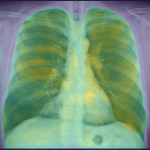 |
| Image 2: Lateral | 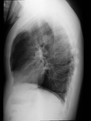 | 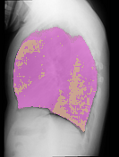 | 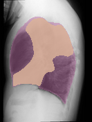 |  |

**Radiopaedia 原始图片 caption：**

<pre>Soft tissue density mass projects over the right heart.</pre>

**原始图片 caption 中文医学要点（翻译）：**

<pre>

</pre>

#### Study 0 的 8 个模型 Single-modality caption 对比

<strong>InternVL3-14B</strong>

**原始图像 → Single-modality caption 回答**

英文原始回答：

<pre>### Description of the Image

**Modality**: X-ray  
**Subcategory**: Frontal and Lateral

1. **Frontal View (PA View)**: 
   - The image shows the chest area including both lungs, heart, ribs, spine, and diaphragm.
   - The visibility of lung fields is good, with clear bronchovascular markings.
   - The heart size appears within normal limits.
   - There is no obvious evidence of pleural effusion, pneumothorax, or mass lesions.
   - The bony thorax, including ribs and vertebrae, shows no clear abnormalities such as fractures.

2. **Lateral View**:
   - Demonstrates the lateral aspect of the chest.
   - Provides additional confirmation regarding lung fields, mediastinum, and diaphragm.
   - Consistent with the frontal view, no obvious masses or infiltrates are identified.
   - Heart and diaphragm contours are visible, aiding in assessing position and size.

### Clinical Findings

- **Lungs**: Clear fields with no signs of consolidation, infiltrates, or masses.
- **Heart**: Sits within normal limits without enlargement.
- **Diaphragm**: Shows normal contour without elevation or flattening.
- **Mediastinum**: No widening apparent.
- **Bones**: No evident fractures or lesions.

### Diagnosis

Given the information from the presented x-rays and the young adult male's background, the following points support a clear and concise diagnosis:

1. **Normal Chest X-ray**:
   - The x-ray findings do not indicate any acute or chronic pulmonary conditions.
   - Both lung fields are clear, and there is no evidence of pneumonia, lung masses, or other abnormalities.

2. **No Signs of Pathology**:
   - Absence of pleural effusion, pneumothorax, or significant lesions suggests no immediate thoracic pathology.
   - Cardiac silhouette and diaphragm also appear normal.

### Conclusion

**Diagnosis**: The chest x-rays are unremarkable. There are no visible signs of pulmonary or cardiac abnormalities. The patient's screening chest x-ray is normal, with no evidence of acute or chronic conditions affecting the lungs, heart, or bony thorax.

### Recommendations

For a young patient with no clinical symptoms or history indicating chest pathology, this normal chest x-ray suggests there is no urgent need for further imaging or intervention based on the x-ray alone. However, clinical correlation with any symptoms is essential. If the patient experiences any respiratory symptoms or chest pain, further evaluation would be indicated.</pre>

中文医学要点（翻译）：

<pre>

</pre>

**原始图像 + Segmentation → Single-modality caption 回答**

英文原始回答：

<pre>The images provided are chest X-rays, specifically a frontal (anteroposterior) view and a lateral view of a 35-year-old male. These are part of a screening X-ray.

### Observations:

**Frontal View:**
1. **Lungs:** The frontal view shows both lung fields. The lung parenchyma appears relatively clear. However, there is a noticeable opacity in the lower left lung field.
  
2. **Heart and Mediastinum:** The cardiac silhouette is visible and appears to be within normal limits. Mediastinal contours do not reveal obvious widening.

3. **Diaphragm:** The diaphragmatic domes are well-defined. The right diaphragm is slightly higher than the left, which is common. There is no obvious elevation or abnormal contour.

**Lateral View:**
1. **Lungs:** The lateral view also shows the lung fields. The left lower lung has an increased opacity, consistent with the frontal view finding, suggesting a possible consolidation, mass, or other pathology.

2. **Heart and Mediastinum:** The mediastinal structures are seen from the side. The heart size appears normal without evidence of a significant shift or abnormal mediastinal widening.

3. **Diaphragm and Gastric Bubble:** The left hemidiaphragm is again noted with some opacity. The gastric bubble is visible under the left hemidiaphragm, which is normal.

### Segmentation Analysis:
- The segmentations highlight various structures:
  - **Left Lower Lung Opacity:** There is segmentation suggesting a mass or opacity in the left lower lung consistent between different segmentation tools (Medical-SAM3, BiomedParse).
  - **Cardiophrenic Area:** Some segmentations suggest a mass or density in the cardiophrenic angle of the left side.

### Differential Diagnosis:
Considering these findings, the differential diagnosis could include:

1. **Pneumonia/Consolidation:** The opacity in the left lower lung may represent an area of consolidation, commonly due to infection such as pneumonia.
   
2. **Tumor/Mass:** Given the density and the location, a neoplastic process (benign or malignant tumor) is a possibility.
   
3. **Pleural Effusion or Thickening:** There might be early signs of pleural effusion or thickening, though this is less likely given the clarity of the diaphragm and adjacent structures.
   
4. **Hematoma or Infarct:** Depending on history, other pathologies like a pulmonary infarct or a vascular malformation could be considered.

### Recommendations:
1. **Clinical Correlation:** Obtain the patient's full clinical history, including symptoms (e.g., cough, fever, hemoptysis) and risk factors (e.g., smoking, travel history, immunocompromised state).

2. **Additional Imaging:** A CT scan of the chest would provide more detailed information to better characterize the nature of the opacity and mass.

3. **Laboratory Tests:** Depending on clinical suspicion, tests for infection (e.g., blood cultures, sputum analysis) and tumor markers may be warranted.

4. **Follow-Up:** If imaging is inconclusive or if there are clinical indications of a more serious pathology, regular follow-up X-rays may be needed to monitor the progression of the finding.

### Conclusion:
The X-rays indicate an abnormal opacity in the left lower lung field, raising concern for conditions such as pneumonia, a mass, or other pathology. Further diagnostic testing, including a chest CT and correlation with clinical history, is recommended to determine the exact cause and appropriate management.</pre>

中文医学要点（翻译）：

<pre>

</pre>

**Segmentation 对 caption 的影响分析：**

<pre>

</pre>

<strong>InternVL3.5-14B</strong>

**原始图像 → Single-modality caption 回答**

英文原始回答：

<pre>&lt;think&gt;
The patient is a 35-year-old male undergoing a screening chest X-ray. The images provided are both frontal and lateral chest radiographs. 

In the frontal view (Image 1), the lungs appear clear with no visible opacities, consolidations, or masses. The heart size is within normal limits, and the mediastinal contours are normal. The diaphragm is well-defined, and the costophrenic angles are sharp, indicating no pleural effusion. The bony thorax, including the ribs and clavicles, shows no fractures or lesions.

In the lateral view (Image 2), the lung fields again appear clear, with no evidence of abnormal shadows or nodules. The cardiac silhouette is normal, and the diaphragm is intact. The vertebral bodies are visible and show no signs of deformity or pathological changes.

Given the patient's age, gender, and the context of a screening chest X-ray, the absence of abnormalities in both views suggests a normal chest radiograph. There are no signs of acute or chronic lung diseases, infections, or malignancies. The heart and mediastinal structures are normal, and there are no skeletal abnormalities.

Since this is a screening image and the patient has no reported symptoms, the most likely diagnosis is a normal chest X-ray. However, if there is a need to consider further evaluation despite the normal findings, it would be prudent to correlate with the patient's clinical history and symptoms. If the patient is asymptomatic and the radiograph is normal, no immediate further investigation is typically required.
&lt;/think&gt;

**Diagnosis:**  
The chest X-ray (both frontal and lateral views) is **normal**.  

**Description of Findings:**  
- **Lungs:** Clear lung fields with no evidence of infiltrates, masses, nodules, or consolidations.  
- **Cardiomediastinal Silhouette:** Normal heart size and mediastinal contours.  
- **Diaphragm:** Sharp costophrenic angles, no diaphragmatic flattening or elevation.  
- **Bony Structures:** Intact ribs, clavicles, and vertebral bodies with no fractures or lesions.  
- **Soft Tissues:** No abnormal soft tissue densities.  

**Conclusion:**  
No acute or chronic pulmonary pathology is detected. The radiographic findings are consistent with a healthy chest in a 35-year-old male undergoing screening. If clinically indicated, further evaluation (e.g., CT scan) may be pursued based on symptoms or risk factors, but no immediate abnormality warrants intervention.</pre>

中文医学要点（翻译）：

<pre>

</pre>

**原始图像 + Segmentation → Single-modality caption 回答**

英文原始回答：

<pre>&lt;think&gt;
Okay, let's start by looking at the patient's information. The patient is a 35-year-old male undergoing a screening chest X-ray. The images provided are both frontal and lateral views. 

First, I need to examine each image carefully. The frontal X-ray (Image 1) shows the lungs, heart, and diaphragm. The lungs appear clear without any obvious opacities or masses. The heart size seems normal, and the diaphragm is well-defined. The lateral view (Image 2) also shows no abnormalities in the lung fields, heart silhouette, or diaphragm. 

Looking at the segmentations provided by different models: Medical-SAM3 and BiomedParse for Image 1 highlight the lungs in purple. In the frontal view, Medical-SAM3's segmentation shows some irregularities in the left lung, possibly indicating a nodule or lesion, but the original X-ray doesn't clearly show that. BiomedParse's segmentation for Image 1 shows a small area in the right lung, which might be a false positive. The combined TorchXRayVision segmentation in Image 1 colors the lungs green and yellow, which seems more accurate, with no obvious abnormalities.

For Image 2 (lateral view), the segmentations again show the heart and lungs. Medical-SAM3's segmentation in pink and yellow might indicate some areas of interest, but the X-ray itself doesn't show masses or fluid. BiomedParse's segmentation in Image 2 shows the heart and diaphragm, with the heart appearing normal in size. The TorchXRayVision's lateral view segmentation also doesn't highlight any concerning areas.

Since this is a screening X-ray, the primary goal is to rule out any significant pathology. The absence of opacities, masses, pleural effusion, or pneumothorax in both views suggests no acute issues. The heart size is within normal limits, and the mediastinum appears normal. The diaphragms are well-positioned without elevation or flattening. 

However, the segmentation discrepancies might indicate areas where the AI models are uncertain. For example, Medical-SAM3's left lung in the frontal view shows some spots, but the original image doesn't confirm them. It could be an artifact or a minor calcification, which is common and not necessarily pathological. 

Given the patient's age and the fact that it's a screening, there's no history of symptoms like cough, shortness of breath, or chest pain. Therefore, the normal appearance of the X-rays with no significant findings on both frontal and lateral views supports a negative result. 

Possible considerations could include a follow-up if there's a tiny nodule seen only in segmentation, but since the original images don't show clear abnormalities, a diagnosis of a normal chest X-ray is appropriate. The patient might be screened for conditions like tuberculosis or lung cancer, but with no findings here, further imaging isn't needed unless clinical symptoms develop.
&lt;/think&gt;

**Diagnosis:**  
The chest X-ray (both frontal and lateral views) demonstrates a **normal, unremarkable study** with no evidence of acute or chronic pathology.  

**Key Findings:**  
1. **Lungs:**  
   - Clear lung fields bilaterally with no focal opacities, masses, nodules, or consolidations.  
   - No signs of interstitial lung disease, pleural effusion, or pneumothorax.  

2. **Cardiomediastinal Silhouette:**  
   - Normal heart size and contour.  
   - Mediastinum of standard width, with no lymphadenopathy or abnormalities.  

3. **Diaphragm and Pleura:**  
   - Well-defined diaphragmatic domes with no elevation, flattening, or subdiaphragmatic free air.  
   - No pleural thickening or blunting of costophrenic angles.  

4. **Bony Structures:**  
   - No fractures, lytic lesions, or destructive bony changes in the visualized ribs, spine, or clavicles.  

**Segmentation Observations:**  
- Discrepancies in AI segmentations (e.g., Medical-SAM3’s left lung irregularities or BiomedParse’s right lung highlight) likely represent artifacts, minor calcifications, or false positives, as the original X-rays show no corresponding abnormalities.  

**Conclusion:**  
This screening chest X-ray is **negative for acute or chronic disease**. No further imaging or intervention is indicated unless new symptoms arise. Follow-up may be considered if clinical suspicion persists (e.g., for occupational exposures or family history of lung disease), though the current study is reassuring.</pre>

中文医学要点（翻译）：

<pre>

</pre>

**Segmentation 对 caption 的影响分析：**

<pre>

</pre>

<strong>Lingshu-32B</strong>

**原始图像 → Single-modality caption 回答**

英文原始回答：

<pre>Findings: The lungs are clear without focal consolidation.
No pleural effusion or pneumothorax is seen.
The cardiac and mediastinal silhouettes are unremarkable. Impression: No acute cardiopulmonary process.</pre>

中文医学要点（翻译）：

<pre>

</pre>

**原始图像 + Segmentation → Single-modality caption 回答**

英文原始回答：

<pre>Findings: The lungs are clear bilaterally.
There is no focal consolidation, pleural effusion, or pneumothorax.
The cardiomediastinal silhouette is within normal limits.
The hila are unremarkable.
Osseous structures are unremarkable. Impression: No acute cardiopulmonary abnormality.</pre>

中文医学要点（翻译）：

<pre>

</pre>

**Segmentation 对 caption 的影响分析：**

<pre>

</pre>

<strong>MedGemma-27B-IT</strong>

**原始图像 → Single-modality caption 回答**

英文原始回答：

<pre>The patient is a 35-year-old male undergoing a screening chest x-ray.

**Image Description:**

*   **Image 1 (Frontal view):** The image shows the chest from the front. The lungs appear clear bilaterally, without any obvious consolidation, masses, or effusions. The heart size appears within normal limits. The mediastinal silhouette is unremarkable. The bony structures (ribs, clavicles, sternum) appear intact.
*   **Image 2 (Lateral view):** The image shows the chest from the side. The lungs are clear. The heart size is normal. The mediastinal structures are normal. The diaphragm is well-defined. No significant abnormalities are noted.

**Diagnosis:**

Based on the provided images (frontal and lateral chest x-rays), the findings are normal. There are no acute cardiopulmonary abnormalities detected.

**Conclusion:**

Normal chest x-ray.</pre>

中文医学要点（翻译）：

<pre>

</pre>

**原始图像 + Segmentation → Single-modality caption 回答**

英文原始回答：

<pre>The patient is a 35-year-old male undergoing a screening chest x-ray. The images provided are a frontal (Image 1) and a lateral (Image 2) view of the chest.

**Image Description:**

*   **Image 1 (Frontal):** The lungs are well-expanded and clear bilaterally. The heart size appears normal. The mediastinal contours are unremarkable. The diaphragm is well-defined and smooth. No focal consolidation, pleural effusion, pneumothorax, or masses are identified. The bony structures appear intact.
*   **Image 2 (Lateral):** The lungs are clear. The heart size is normal. The mediastinal structures appear normal. The diaphragm is well-defined. No significant abnormalities are seen in the posterior structures.

**Overall Impression:**

The chest x-ray appears normal. There are no acute findings or abnormalities detected in either the frontal or lateral views.

**Diagnosis:**

Normal chest x-ray.</pre>

中文医学要点（翻译）：

<pre>

</pre>

**Segmentation 对 caption 的影响分析：**

<pre>

</pre>

<strong>MedMO-8B</strong>

**原始图像 → Single-modality caption 回答**

英文原始回答：

<pre>The frontal chest radiograph is normal. The lateral chest radiograph shows a large, left pleural effusion with a small right pleural effusion. The heart is not enlarged. The mediastinum is shifted to the right. There is no pneumothorax.</pre>

中文医学要点（翻译）：

<pre>

</pre>

**原始图像 + Segmentation → Single-modality caption 回答**

英文原始回答：

<pre>The patient has a screening chest x-ray. There is no consolidation or pleural effusion. There is no pulmonary edema. There is no pneumothorax. There is a small cardiomegaly.</pre>

中文医学要点（翻译）：

<pre>

</pre>

**Segmentation 对 caption 的影响分析：**

<pre>

</pre>

<strong>Qwen3-VL-4B</strong>

**原始图像 → Single-modality caption 回答**

英文原始回答：

<pre>Based on the provided patient data (35-year-old male) and the two chest X-ray images (frontal and lateral views), here is a description and diagnostic interpretation:

**Image Description:**

- **Image 1 (Frontal View):** This is a standard posteroanterior (PA) chest X-ray. The lung fields appear clear with no obvious consolidation, infiltrates, or large masses. The cardiac silhouette is within normal limits for age and size. The diaphragm is well-defined and the costophrenic angles are sharp, suggesting no pleural effusion. The trachea is midline. There is no visible pneumothorax or significant mediastinal shift.

- **Image 2 (Lateral View):** This view confirms the findings from the frontal image. The heart is not enlarged. The lung fields are symmetrically expanded, and the diaphragm is at normal height. There is no evidence of a large mass, pneumothorax, or significant fluid accumulation. The bronchovascular markings are normal.

**Diagnostic Interpretation:**

The chest X-rays are **unremarkable**. There are no signs of acute or chronic lung disease, infection, neoplasm, or structural abnormalities such as pneumothorax, pleural effusion, or cardiomegaly.

**Conclusion:**

**Diagnosis: Normal Chest X-ray**

This is a routine screening image with no pathological findings. The patient is likely healthy, or at least has no acute or chronic respiratory or cardiac pathology detectable on these imaging studies. Further evaluation may be warranted if the patient presents with symptoms (e.g., cough, dyspnea, chest pain), but based solely on this imaging, no diagnosis is needed.

**Note:** Since this is a screening image and the patient is asymptomatic, it is likely a routine check-up. No further action is indicated based on this imaging alone.</pre>

中文医学要点（翻译）：

<pre>

</pre>

**原始图像 + Segmentation → Single-modality caption 回答**

英文原始回答：

<pre>Based on the provided chest X-ray images and segmentation outputs, the following analysis is presented:

**Image Description:**

- **Image 1 (Frontal View):** This image shows a standard frontal chest radiograph. The lung fields are symmetrically outlined by the segmentation masks. The BiomedParse segmentation highlights a distinct, well-defined, dense, and irregularly shaped mass in the right lower lobe. The mass is localized, does not appear to involve the heart or mediastinum, and is situated in the lung parenchyma. The diaphragm appears normal in contour and position.

- **Image 2 (Lateral View):** This image provides a side profile view of the chest. The segmentation masks show the same mass is visible in the lateral projection, appearing as a dense, irregularly shaped opacity in the right lung field. The mass is consistent with the frontal view, appearing localized and not involving the mediastinum or diaphragm.

**Diagnosis:**

The imaging findings are consistent with a **pulmonary mass** in the right lower lobe.

**Rationale:**

1. **Location and Morphology:** The mass is localized to the right lower lobe in both frontal and lateral views, with consistent appearance across the two projections. It is described as dense and irregularly shaped, which is typical of a solid tumor or large nodule.

2. **Segmentation Consistency:** All three segmentation models (Medical-SAM3, BiomedParse, TorchXRayVision) consistently identify the mass in the right lung, reinforcing its presence and location.

3. **Absence of Other Findings:** There is no evidence of mediastinal shift, pleural effusion, or significant atelectasis, which helps to localize the mass to the lung parenchyma.

4. **Patient Context:** The patient is a 35-year-old male, a demographic at risk for various pulmonary conditions, including lung cancer, infections, or benign tumors.

**Clinical Implications:**

- The mass is likely to be evaluated further with CT imaging for better characterization (size, margins, internal structure, and relationship to surrounding structures).
- A biopsy or surgical resection may be indicated depending on the clinical context and the results of further imaging and diagnostic workup.
- The mass is not indicative of acute conditions such as pneumonia or pulmonary embolism, which typically present with more diffuse or inflammatory changes.

**Conclusion:**

The chest X-ray findings are consistent with a **pulmonary mass** in the right lower lobe. Further diagnostic evaluation is recommended to determine the nature and origin of the mass.

**Note:** This is a radiological interpretation based on the provided images. A definitive diagnosis requires additional clinical and diagnostic information.</pre>

中文医学要点（翻译）：

<pre>

</pre>

**Segmentation 对 caption 的影响分析：**

<pre>

</pre>

<strong>Qwen3-VL-8B</strong>

**原始图像 → Single-modality caption 回答**

英文原始回答：

<pre>Based on the provided chest X-ray images (frontal and lateral views) of a 35-year-old male, here is the description and diagnosis:

**Image Description:**

*   **Frontal View (Image 1):** This is a standard posteroanterior (PA) chest X-ray. The image shows the thoracic cavity, including the bony structures (ribs, sternum, spine, clavicles) and the soft tissues (mediastinum, heart, lungs). The lung fields appear clear with no obvious focal consolidation, mass, or effusion. The cardiac silhouette is within normal limits in size and contour. The diaphragm is well-defined and dome-shaped. The trachea is midline. There are no visible signs of pneumothorax or pleural thickening.

*   **Lateral View (Image 2):** This view confirms the frontal findings. The lung fields are well-aerated, and there is no evidence of fluid levels, masses, or significant opacities. The heart and mediastinum appear normal in size and position. The diaphragm and costophrenic angles are sharp and clear.

**Diagnosis:**

**Normal Chest X-ray.**

There are no abnormalities detected in either the frontal or lateral chest X-ray views. The patient, a 35-year-old male, has a clear lung field, normal cardiac silhouette, and no signs of acute pathology such as pneumonia, pleural effusion, pneumothorax, or significant cardiac enlargement. This is a routine screening image, and the findings are entirely within normal limits for a healthy individual of this age and gender.

**Note:** As this is a screening X-ray, no further diagnostic workup is indicated based on these images. However, it is important to correlate these findings with the patient’s clinical history and symptoms. If the patient is asymptomatic, this is reassuring. If symptoms are present, further investigation may be warranted.</pre>

中文医学要点（翻译）：

<pre>

</pre>

**原始图像 + Segmentation → Single-modality caption 回答**

英文原始回答：

<pre>Based on the provided images and patient data, here is a detailed description and diagnosis:

**Image Description:**

The patient is a 35-year-old male undergoing a screening chest X-ray, which includes both frontal (Image 1) and lateral (Image 2) views.

*   **Frontal View (Image 1):** The frontal chest X-ray shows the thoracic cavity. The lung fields appear clear with normal vascular markings. The heart size is within normal limits, and the diaphragm is well-defined and at a normal position. The cardiophrenic angles are sharp and clear. The overall impression is that of a normal chest X-ray.
*   **Lateral View (Image 2):** The lateral chest X-ray confirms the findings from the frontal view. The lung fields are clear, and there is no evidence of fluid, mass, or consolidation. The heart and diaphragm appear normal. The mediastinum is not widened.

**Segmentation Analysis:**

The provided segmentations from different models (Medical-SAM3, BiomedParse, TorchXRayVision) are for illustrative purposes and are not diagnostic. They highlight anatomical structures but do not indicate pathology. For example:

*   **Medical-SAM3** and **BiomedParse** segmentations for Image 1 show the lung fields and heart, with the cardiophrenic angle highlighted in a different color. These are standard anatomical segmentations.
*   **TorchXRayVision** provides a more detailed segmentation, including the right lung, left lung, diaphragm, heart, and mediastinum, which is also consistent with a normal chest X-ray.

**Diagnosis:**

The chest X-ray is **normal**. There are no signs of pulmonary disease, heart failure, pleural effusion, pneumothorax, or other abnormalities. The patient’s age and gender are not indicative of any specific pathology, and this is a screening X-ray with no clinical symptoms reported.

**Conclusion:**

The chest X-ray is within normal limits. No further investigation is required at this time. The patient can be reassured that the imaging is normal.

**Note:** This diagnosis is based solely on the imaging findings. A comprehensive clinical evaluation, including history and physical examination, is necessary for a complete assessment.</pre>

中文医学要点（翻译）：

<pre>

</pre>

**Segmentation 对 caption 的影响分析：**

<pre>

</pre>

<strong>Qwen3-VL-32B</strong>

**原始图像 → Single-modality caption 回答**

英文原始回答：

<pre>**Image Description:**

- **Image 1 (Frontal Chest X-ray):**  
  The frontal view shows a clear, well-expanded thoracic cavity with normal cardiac silhouette and tracheal alignment. The lung fields are symmetric, with no evidence of consolidation, mass, or nodular opacities. The costophrenic angles are sharp and well-defined. The diaphragm appears at normal height. The bony thorax (ribs, clavicles, spine) is intact without fractures or lesions. The mediastinum is of normal width.

- **Image 2 (Lateral Chest X-ray):**  
  The lateral view demonstrates normal lung parenchyma with no focal opacities, masses, or cavitations. The heart and mediastinum are appropriately positioned. The posterior ribs and vertebral bodies are visible without abnormality. The diaphragm is smooth and well-contoured, and there is no evidence of pleural thickening or effusion.

---

**Clinical Context:**
- Patient is a 35-year-old male undergoing screening chest X-ray.
- No symptoms or history of respiratory illness, smoking, or occupational exposure provided.
- The imaging was likely performed as part of routine health screening or pre-employment evaluation.

---

**Diagnosis:**

**Normal chest X-ray (no abnormal findings).**

---

**Interpretation:**
Both frontal and lateral views demonstrate normal pulmonary, cardiac, and bony structures. There are no signs of pneumonia, tuberculosis, lung cancer, pleural disease, or cardiomegaly. The findings are consistent with a healthy, asymptomatic individual.

---

**Recommendation:**
No further imaging or intervention is required based on this screening examination. Routine follow-up as per clinical guidelines or as indicated by symptoms is advised.

---

**Note:** Since this is a screening exam in an asymptomatic patient, the normal findings are reassuring. However, if symptoms develop in the future (e.g., cough, dyspnea, chest pain), further evaluation may be warranted.</pre>

中文医学要点（翻译）：

<pre>

</pre>

**原始图像 + Segmentation → Single-modality caption 回答**

英文原始回答：

<pre>Based on the provided chest X-ray images (frontal and lateral views) and the segmentation outputs from multiple AI models (Medical-SAM3, BiomedParse, TorchXRayVision), along with the patient’s demographic data (35-year-old male, screening exam), here is a comprehensive analysis and diagnosis:

---

## **Image Description**

### **Frontal View (Image 1):**
- **General Impression:** The frontal chest X-ray shows a clear view of the thoracic cavity. The bony thorax (ribs, clavicles, spine) appears intact without fractures or deformities.
- **Lungs:** The lung fields appear largely clear, with normal vascular markings. There is no obvious consolidation, mass, or pleural effusion.
- **Heart and Mediastinum:** The cardiac silhouette is within normal size and contour. The mediastinum appears unremarkable.
- **Diaphragm:** The diaphragms are well-defined and at normal levels; no elevation or blunting of costophrenic angles is noted.
- **Segmentation Analysis:**
  - **Medical-SAM3:** Segments both lungs (purple) with some noise or artifact in the left lung, possibly due to over-segmentation or misclassification of vascular structures.
  - **BiomedParse:** Segments both lungs (purple) and identifies a small, well-defined, non-pulmonary structure in the right lower lung zone (tan), which may represent a benign finding such as a pulmonary nodule, lymph node, or artifact.
  - **TorchXRayVision:** Provides a combined segmentation with lung fields in green-yellow, heart and mediastinum in pink/purple. The segmentation is somewhat diffuse, likely due to overlapping structures or model uncertainty.

### **Lateral View (Image 2):**
- **General Impression:** The lateral view shows the thoracic structures in profile. The posterior ribs, spine, and heart are visible.
- **Lungs:** The lung fields appear clear with normal aeration. No signs of mass, consolidation, or pneumothorax.
- **Heart and Mediastinum:** The heart is centrally located with normal anterior-posterior diameter. The mediastinum is not widened.
- **Diaphragm:** The diaphragm is well-visualized, with no elevation or abnormal contour.
- **Segmentation Analysis:**
  - **Medical-SAM3:** Segments the lung (purple) with some irregularities in the posterior aspect, possibly due to overlapping structures or partial volume effects.
  - **BiomedParse:** Segments the lung (purple) and identifies a larger, irregular tan region in the anterior aspect, which may represent a small anterior mediastinal mass or lymphadenopathy.
  - **TorchXRayVision:** Segments the lung in green-yellow, with a diffuse overlay suggesting uncertainty in the boundaries, especially near the heart and diaphragm.

---

## **Interpretation of Segmentations**

The AI segmentation outputs show **inconsistencies**, particularly between models:

- **Medical-SAM3** tends to over-segment the lungs, especially in the left lung (Image 1), possibly including mediastinal structures or vessels.
- **BiomedParse** identifies **small, distinct regions outside the lung parenchyma** (tan areas), which may represent **pulmonary nodules, lymph nodes, or benign calcifications**.
- **TorchXRayVision** provides a more holistic view but with **diffuse, overlapping masks**, suggesting lower precision in delineating specific structures.

These discrepancies may reflect **model-specific biases or limitations** rather than true pathology, especially in a screening context.

---

## **Clinical Context**

- **Age:** 35 years — young adult, low risk for common pulmonary diseases (e.g., COPD, lung cancer).
- **Gender:** Male — slightly higher risk for certain conditions (e.g., lung cancer, TB), but still low in this age group.
- **Presentation:** Screening chest X-ray — no symptoms reported, so findings should be interpreted conservatively.

---

## **Diagnosis**

### **Primary Finding:**
- **No significant abnormality** is evident on the chest X-rays in a 35-year-old male undergoing screening.
- The lungs are clear, heart size is normal, and there is no evidence of effusion, pneumothorax, or obvious mass.

### **Concerning AI Segmentation Outputs:**
- The **tan regions identified by BiomedParse** in both images may represent:
  - **Benign pulmonary nodules** (e.g., granulomas from prior infection, hamartomas).
  - **Lymph nodes** (e.g., subcarinal or hilar, possibly reactive).
  - **Artifacts** (e.g., from overlying structures or image noise).

However, **these are not visually apparent on the original X-ray images** and may be **false positives** from the segmentation models.

---

## **Conclusion and Recommendation**

✅ **Final Diagnosis:**
&gt; **Normal chest X-ray. No evidence of active pulmonary disease.**

⚠️ **Note on AI Segmentation:**
&gt; The segmentation outputs from BiomedParse suggest small, non-pulmonary structures, but these are **not confirmed on visual inspection** and may be **model artifacts or over-segmentations**. In the absence of clinical symptoms or other imaging, these should not be considered diagnostic.

---

## **Recommendation:**
- **No further imaging is required at this time** for this screening exam.
- If the patient develops respiratory symptoms (e.g., cough, dyspnea, hemoptysis) or if the finding is persistent on future imaging, a **follow-up chest CT** may be considered for better characterization.
- **Annual screening chest X-ray** is not routinely recommended for asymptomatic individuals without risk factors (e.g., smoking, occupational exposure).

---

## **Summary**

&gt; **Patient: 35-year-old male, asymptomatic, screening chest X-ray.**  
&gt; **Imaging: Normal frontal and lateral chest X-rays.**  
&gt; **AI Segmentation: Inconsistent findings, likely false positives or artifacts.**  
&gt; **Diagnosis: Normal chest X-ray.**  
&gt; **Action: No intervention needed. Monitor if symptoms develop.**

---

This case highlights the importance of **clinical correlation and human oversight** when interpreting AI-generated segmentations, especially in screening settings where false positives can lead to unnecessary anxiety or testing.</pre>

中文医学要点（翻译）：

<pre>

</pre>

**Segmentation 对 caption 的影响分析：**

<pre>

</pre>

### 5.2 Study 1: CT

- **Medical-SAM3 prompts：** lung, heart, diaphragm, anterior mediastinum, fat-containing mass
- **BiomedParse v1 prompts：** lung, heart, diaphragm, anterior mediastinum, fat-containing mass
- **TorchXRayVision：** 不适用于该 CT study。

| Image | Original image | Medical-SAM3 | BiomedParse v1 | TorchXRayVision |
|---|---|---|---|---|
| Image 1: Axial non-contrast | 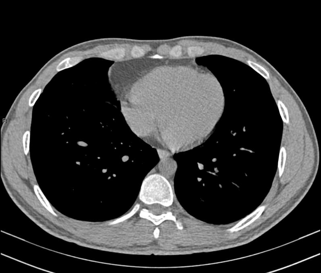 |  |  | N/A（仅适用于 X-ray） |
| Image 2: Sagittal non-contrast | 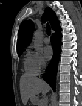 | 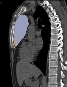 |  | N/A（仅适用于 X-ray） |
| Image 3: Coronal non-contrast |  | 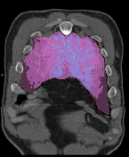 |  | N/A（仅适用于 X-ray） |

**Radiopaedia 原始图片 caption：**

<pre>CT demonstrates a fat-filled Morgagni hernia.</pre>

**原始图片 caption 中文医学要点（翻译）：**

<pre>

</pre>

#### Study 1 的 8 个模型 Single-modality caption 对比

<strong>InternVL3-14B</strong>

**原始图像 → Single-modality caption 回答**

英文原始回答：

<pre>The provided images are CT scans, specifically axial, sagittal, and coronal CT sections. These images are typically used in diagnostic settings to visualize internal structures of the body in different planes.

### Descriptions of the Images:

**Image 1 (Axial Non-Contrast CT):
- **Plane:** Axial (horizontal slice through the body)
- **Details:** This image shows a cross-sectional view of the chest. Visible structures include the lungs, the heart, the spinal column, and major blood vessels. The lungs appear dark due to air content, while the denser structures like bones and blood vessels appear lighter.
- **Observation:** There is a symmetrical appearance with no obvious masses or abnormal opacities in the lungs. The mediastinum, containing the heart and major vessels, looks centrally located.

**Image 2 (Sagittal Non-Contrast CT):
- **Plane:** Sagittal (vertical slice from one side to the other, usually showing the body's right side)
- **Details:** This image shows a side view of the body, including the vertebrae, heart, lungs, and parts of the diaphragm and stomach.
- **Observation:** The vertebral column is clearly visible, showing individual vertebrae. The heart is positioned centrally, and bilateral lung fields are largely clear. No significant abnormalities such as tumors or fractures are immediately apparent.

**Image 3 (Coronal Non-Contrast CT):
- **Plane:** Coronal (vertical slice from front to back)
- **Details:** This image provides a front view of the chest, displaying the sternum, ribs, heart, lungs, diaphragm, and portions of the abdominal organs.
- **Observation:** The image shows clear lung fields, heart contours, and bony structures without obvious pathologies. The diaphragm appears intact, and there are no signs of fluid accumulation or masses.

### Diagnosis:

Given these CT scan images:
- **No Visible Pathology:** The lungs appear clear without nodules, masses, or infiltrates.
- **Heart and Mediastinum:** The heart size is within normal limits, and the mediastinal contours are normal.
- **Bones:** The vertebrae and ribs show no evidence of fractures or lytic lesions.
- **Diaphragm and Abdomen:** The diaphragm is intact, and early views of the abdomen do not show abnormal findings.

**Conclusion:**
Based on the provided CT images, there are no immediate findings suggesting acute pathology. The patient’s chest appears normal with clear lung fields, an appropriately sized heart, and structurally sound bony elements. 

However, for a definitive diagnosis, a radiologist would interpret these images in conjunction with the patient's clinical history and other diagnostic tests. It's essential to confirm this assessment with a qualified medical professional to rule out any subtle or subclinical conditions.</pre>

中文医学要点（翻译）：

<pre>

</pre>

**原始图像 + Segmentation → Single-modality caption 回答**

英文原始回答：

<pre>The provided images are CT scans from different planes: axial (Image 1), sagittal (Image 2), and coronal (Image 3). These images appear to show a fat-containing mass within the anterior mediastinum, identified through the segmentation in the images. 

### Image Analysis:

1. **Axial Plane (Image 1):**
   - The axial CT scan reveals bilateral lungs with a notable mass identified in the anterior thoracic region. The mass appears to involve both lung fields but predominantly on the right.
   - The segmentation suggests the presence of a fat-containing mass in the anterior mediastinum, indicated in purple/magenta hues.

2. **Sagittal Plane (Image 2):**
   - In the sagittal CT scan, the mass appears as an elongated density extending anteriorly and possibly involving surrounding structures. 
   - The anterior mediastinal location is reinforced by the visible anterior contour of the mass.

3. **Coronal Plane (Image 3):**
   - The coronal CT scan provides a frontal view where the mass is centrally located. The segmentation indicates a significant anterior mediastinal mass with fat content, possibly involving the adjacent mediastinal structures.

### Diagnosis:

The imaging findings are consistent with a fat-containing anterior mediastinal mass. This presentation is suggestive of **lipoma**, **mediastinal teratoma**, or **liposarcoma**. The fat density seen within the mass on these CT images helps narrow the differential diagnosis.

#### Differential Considerations:

1. **Lipoma:**
   - A benign tumor composed of mature adipose tissue.
   - Typically well-defined, and homogenous on CT with fat density (-100 to -50 Hounsfield Units).

2. **Mediastinal Teratoma:**
   - A germ cell tumor that can contain fat, hair, teeth, or bone.
   - Often seen in the anterior mediastinum and may have complex content.

3. **Liposarcoma:**
   - A malignant tumor of adipose tissue.
   - Usually irregular, with mixed fat and soft tissue density, and less well-defined margins compared to benign lipomas.

### Recommendations:

1. **Clinical Correlation:**
   - Assess the patient's symptoms and history of chest discomfort, respiratory symptoms, or systemic signs.
   
2. **Further Imaging:**
   - Consider MRI for better characterization of the mass, particularly for assessing the involvement of surrounding soft tissues and the composition of the mass.

3. **Biopsy:**
   - If clinically indicated, a biopsy to confirm the histological nature of the mass, differentiating between benign and malignant pathology.

4. **Surgical Evaluation:**
   - Depending on the size, location, and symptoms, surgical excision might be recommended for definitive treatment, particularly if the mass is symptomatic or concerning for malignancy.

In summary, the CT images illustrate a fat-containing mass in the anterior mediastinum, with potential clinical implications requiring further investigation through imaging and possibly biopsy to guide management.</pre>

中文医学要点（翻译）：

<pre>

</pre>

**Segmentation 对 caption 的影响分析：**

<pre>

</pre>

<strong>InternVL3.5-14B</strong>

**原始图像 → Single-modality caption 回答**

英文原始回答：

<pre>&lt;think&gt;
The patient is a 35-year-old male undergoing a screening chest X-ray, but the provided images are CT scans. Let's analyze each image:

**Image 1 (Axial non-contrast CT):**
- The axial view shows the heart, lungs, and surrounding structures. 
- The lungs appear clear without obvious masses, nodules, or consolidations.
- The heart size is normal, and there is no evidence of pericardial effusion.
- The mediastinum is normal, and there are no enlarged lymph nodes.
- The bony structures (ribs, vertebrae) appear intact without fractures or lesions.

**Image 2 (Sagittal non-contrast CT):**
- The sagittal view provides a side perspective of the thoracic cavity.
- The spine alignment is normal with no vertebral abnormalities.
- The heart and great vessels are visible, with no signs of aneurysm or dissection.
- The trachea and esophagus are midline without deviation.
- The diaphragm is intact, and there is no free air under the diaphragm.

**Image 3 (Coronal non-contrast CT):**
- The coronal view shows the chest from the front.
- The lungs are clear bilaterally with no infiltrates or masses.
- The heart is centrally located with normal size and shape.
- The diaphragm is well-defined, and there is no evidence of pleural effusion.
- The bony structures, including the ribs and spine, are normal.

**Conclusion:**
All three CT images show normal thoracic anatomy without any pathological findings. The lungs, heart, mediastinum, and bony structures appear unremarkable. There are no signs of masses, nodules, infections, or structural abnormalities.

**Diagnosis:**
The CT scans are normal. No evidence of disease in the thoracic region.
&lt;/think&gt;

**Diagnosis:**

The provided CT images of the chest (axial, sagittal, and coronal views) demonstrate a normal thoracic anatomy without any pathological findings. Here is a detailed description based on each image:

1. **Axial Non-Contrast CT:**
   - **Lungs:** Both lungs appear clear with no evidence of masses, nodules, consolidations, or interstitial abnormalities. The lung parenchyma is well-aerated.
   - **Heart and Mediastinum:** The heart size is within normal limits, and the mediastinal structures, including the aorta and pulmonary vessels, show no signs of enlargement or abnormality.
   - **Bony Structures:** The ribs and vertebral bodies are intact without fractures, lytic lesions, or other bony abnormalities.

2. **Sagittal Non-Contrast CT:**
   - **Spine:** The thoracic vertebrae are aligned properly with no signs of compression fractures, degenerative changes, or vertebral body abnormalities.
   - **Heart and Great Vessels:** The cardiac silhouette is normal, and the great vessels, including the aorta, appear unremarkable without evidence of aneurysm or dissection.
   - **Diaphragm:** The diaphragm is well-positioned with no signs of elevation or herniation.

3. **Coronal Non-Contrast CT:**
   - **Lungs:** Both lungs are clear bilaterally with no infiltrates, masses, or pleural effusions.
   - **Heart:** The heart is centrally located with normal size and contour.
   - **Bony Structures:** The ribs and spine are normal without any lesions or deformities.

**Conclusion:**

The CT scans are unremarkable, showing no evidence of disease in the thoracic region. The lungs, heart, mediastinum, and bony structures appear normal. There are no signs of masses, nodules, infections, or structural abnormalities.

**Final Diagnosis:**  
Normal chest CT scan. No evidence of pathology.</pre>

中文医学要点（翻译）：

<pre>

</pre>

**原始图像 + Segmentation → Single-modality caption 回答**

英文原始回答：

<pre>&lt;think&gt;
The patient is a 35-year-old male undergoing a screening chest X-ray. The CT images provided include axial, sagittal, and coronal non-contrast views. 

**Observations:**

1. **Axial View (Image 1):**
   - The segmentation highlights the lungs in blue and purple, indicating possible asymmetry or pathology. 
   - The right lung (on the left side of the image) appears darker, typical of normal aerated lung tissue. 
   - The left lung (on the right side of the image) shows areas highlighted in purple, suggesting a mass or abnormality. 
   - The heart is centrally located, and the mediastinum appears normal.

2. **Sagittal View (Image 2):**
   - The sagittal view shows the spine and thoracic cavity. 
   - A mass is highlighted in the anterior mediastinum or lung area, possibly indicating a lesion.

3. **Coronal View (Image 3):**
   - The coronal view shows a large segmented area in the lower thoracic region, possibly indicating a mass or fluid accumulation.
   - The segmentation suggests involvement of the diaphragm or lower lung zones.

**Analysis:**

- The highlighted areas in the left lung and anterior mediastinum across multiple views suggest a mass or lesion. 
- The coronal view’s large segmented area might indicate a pleural effusion or diaphragmatic pathology.
- Given the patient's age and presentation for screening, a primary concern could be a pulmonary nodule or mass, potentially benign or malignant.

**Diagnosis:**

- **Pulmonary Mass:** The segmentation in the left lung and anterior mediastinum suggests a mass. Differential diagnosis includes benign tumors (e.g., hamartoma), malignant tumors (e.g., primary lung cancer, metastasis), or inflammatory lesions.
- **Pleural Effusion:** The coronal view’s findings might indicate fluid accumulation, possibly due to the mass or other causes like infection or heart failure.
- **Further Steps:** A biopsy or PET scan would be needed to characterize the mass. Additional imaging (e.g., MRI) might assess the diaphragm and pleural involvement.

The findings warrant further investigation to rule out malignancy and determine the nature of the mass and any associated pleural effusion.
&lt;/think&gt;

### Image Description and Diagnosis

**Image Description:**

The provided CT images (axial, sagittal, and coronal views) reveal notable findings in the thoracic cavity:

1. **Axial View:**
   - **Lungs:** The left lung (right side of the image) exhibits a segmented area in purple, suggesting a potential mass or lesion. The right lung appears normal.
   - **Heart &amp; Mediastinum:** The heart is centrally located with no apparent abnormalities in the mediastinum.

2. **Sagittal View:**
   - A highlighted area in the anterior mediastinum or lung region indicates a possible lesion or mass.

3. **Coronal View:**
   - A large segmented area in the lower thoracic region, possibly involving the diaphragm or pleural space, suggests a mass or fluid accumulation.

**Diagnosis:**

1. **Pulmonary Mass:**
   - The segmented areas in the left lung and anterior mediastinum across multiple views strongly suggest a pulmonary mass. Given the patient's age and screening context, differential considerations include:
     - **Benign:** Hamartoma, inflammatory pseudotumor.
     - **Malignant:** Primary lung carcinoma (e.g., adenocarcinoma), metastatic disease.

2. **Pleural Effusion:**
   - The coronal view's findings may indicate pleural fluid, potentially secondary to the mass, infection, or other causes.

3. **Further Evaluation:**
   - **Biopsy:** Essential to determine the nature of the mass (e.g., transthoracic needle biopsy).
   - **PET-CT:** To assess metabolic activity and rule out malignancy.
   - **MRI:** If diaphragmatic or pleural involvement is suspected.

**Conclusion:**
The imaging findings are concerning for a pulmonary mass with possible pleural effusion. Further diagnostic workup is warranted to establish the etiology and guide management.</pre>

中文医学要点（翻译）：

<pre>

</pre>

**Segmentation 对 caption 的影响分析：**

<pre>

</pre>

<strong>Lingshu-32B</strong>

**原始图像 → Single-modality caption 回答**

英文原始回答：

<pre>The images provided are axial, sagittal, and coronal non-contrast CT scans of the chest. The axial view shows a large, well-defined mass in the anterior mediastinum, displacing the heart posteriorly. The sagittal view confirms the mass's location and its relationship with surrounding structures, including the sternum and vertebrae. The coronal view further delineates the mass's extent and its impact on adjacent anatomical features. Given the patient's age and the characteristics of the mass, the most likely diagnosis is a thymoma. Thymomas are common anterior mediastinal tumors that often present as well-circumscribed masses on imaging studies. Further evaluation with contrast-enhanced imaging and possible biopsy would be necessary to confirm the diagnosis and plan appropriate management.</pre>

中文医学要点（翻译）：

<pre>

</pre>

**原始图像 + Segmentation → Single-modality caption 回答**

英文原始回答：

<pre>The provided images are axial, sagittal, and coronal non-contrast CT scans of the chest. The axial view shows a large, well-defined mass in the anterior mediastinum, which appears to be displacing adjacent structures. The sagittal view confirms the presence of this mass, showing its superior-inferior extent and its relationship with the surrounding anatomy. The coronal view further delineates the mass's lateral boundaries and its impact on the mediastinal structures. The segmentation images highlight the lungs, heart, diaphragm, anterior mediastinum, and the fat-containing mass. The mass is consistent with a thymoma, given its location in the anterior mediastinum and its imaging characteristics. Thymomas are typically benign but can occasionally be malignant. Further evaluation with contrast-enhanced imaging and possibly biopsy would be necessary for definitive diagnosis and treatment planning.</pre>

中文医学要点（翻译）：

<pre>

</pre>

**Segmentation 对 caption 的影响分析：**

<pre>

</pre>

<strong>MedGemma-27B-IT</strong>

**原始图像 → Single-modality caption 回答**

英文原始回答：

<pre>The patient is a 35-year-old male undergoing a screening chest x-ray. The provided images are CT scans (axial, sagittal, and coronal views) of the chest, not a standard chest x-ray.

**Image Description:**

*   **Axial CT (Image 1):** This image shows a cross-section of the chest. The lungs appear relatively clear, although there are some small nodules or densities visible in the right lung field. The heart is centrally located, and the mediastinal structures are visible. The bony structures (ribs, sternum) are also seen.
*   **Sagittal CT (Image 2):** This image shows a side view of the chest. It displays the anterior and posterior structures, including the sternum, heart, lungs, and spine.
*   **Coronal CT (Image 3):** This image shows a front view of the chest. It displays the anterior and posterior structures, including the sternum, heart, lungs, and spine.

**Findings:**

The most notable finding is the presence of multiple small, rounded nodules or densities in the right lung field, visible on the axial CT image (Image 1). These are scattered throughout the lung parenchyma. The size and distribution of these nodules would need to be further characterized.

**Diagnosis:**

Based solely on the provided images and limited information (screening CT, 35-year-old male), a definitive diagnosis cannot be made. However, the presence of multiple pulmonary nodules raises concern for several possibilities, including:

1.  **Metastatic disease:** Cancer that has spread to the lungs from another primary site.
2.  **Infectious process:** Such as granulomatous infections (e.g., tuberculosis, fungal infections) or septic emboli.
3.  **Inflammatory conditions:** Such as rheumatoid nodules or granulomatosis with polyangiitis.
4.  **Benign nodules:** Such as hamartomas or granulomas.

**Next Steps:**

Given the finding of multiple pulmonary nodules, further investigation is necessary. This typically involves:

*   **Reviewing the patient's history:** Smoking history, occupational exposures, travel history, symptoms (cough, shortness of breath, weight loss, etc.).
*   **Comparing with prior imaging:** If available, to assess for stability or growth of the nodules.
*   **Further imaging:** High-resolution CT (HRCT) of the chest may provide more detailed characterization of the nodules.
*   **Biopsy:** Depending on the size, number, location, and characteristics of the nodules, a biopsy (e.g., transthoracic needle aspiration, bronchoscopy) may be needed to obtain a tissue diagnosis.

**Conclusion:**

The CT scan reveals multiple pulmonary nodules in the right lung. This finding requires further evaluation to determine the underlying cause. The provided information is insufficient for a definitive diagnosis.</pre>

中文医学要点（翻译）：

<pre>

</pre>

**原始图像 + Segmentation → Single-modality caption 回答**

英文原始回答：

<pre>The patient is a 35-year-old male undergoing a screening chest x-ray, which was subsequently followed by a CT scan. The provided images are axial, sagittal, and coronal CT scans of the chest.

**Image Description:**

*   **Image 1 (Axial):** This is an axial CT scan showing the chest cavity. The lungs are visible on either side, the heart is centrally located, and the diaphragm forms the lower boundary. The mediastinum is in the center. The segmentation highlights the lungs (blue), heart (purple), diaphragm (yellow), anterior mediastinum (pink), and a fat-containing mass (light blue). The fat-containing mass appears to be located in the anterior mediastinum.
*   **Image 2 (Sagittal):** This is a sagittal CT scan, showing a slice from the side. The lungs are seen superiorly, the heart is centrally located, and the diaphragm is inferiorly. The segmentation highlights the lungs (blue), heart (purple), diaphragm (yellow), anterior mediastinum (pink), and a fat-containing mass (light blue). The fat-containing mass is clearly visible in the anterior mediastinum.
*   **Image 3 (Coronal):** This is a coronal CT scan, showing a slice from the front. The lungs are on the sides, the heart is centrally located, and the diaphragm is inferiorly. The segmentation highlights the lungs (blue), heart (purple), diaphragm (yellow), anterior mediastinum (pink), and a fat-containing mass (light blue). The fat-containing mass is located in the anterior mediastinum, superior to the heart.

**Analysis:**

The CT scans show a well-defined, low-density (fat density) mass located in the anterior mediastinum. This location is consistent with several possible diagnoses, including:

1.  **Lipoma:** A benign tumor composed of fat tissue.
2.  **Thymoma:** A tumor arising from the thymus gland, which is located in the anterior mediastinum. Some thymomas can contain fat.
3.  **Teratoma:** A germ cell tumor that can contain various tissues, including fat.
4.  **Lymphoma:** Although less common in the anterior mediastinum, lymphoma can sometimes present as a mass.
5.  **Thyroid mass (goiter):** If the goiter extends into the chest (substernal goiter).

Given the patient's age (35 years) and the appearance of a fat-containing mass in the anterior mediastinum, the most likely possibilities are lipoma, thymoma (especially lipomatous thymoma), or teratoma.

**Diagnosis:**

Based on the CT findings of a fat-containing mass in the anterior mediastinum, the most probable diagnosis is a **mediastinal lipoma** or a **lipomatous thymoma**. Further characterization might be needed (e.g., contrast-enhanced CT, MRI) to differentiate between these possibilities or rule out other less likely causes. However, given the screening context and the clear presence of a fat-containing mass, this is the most likely finding.</pre>

中文医学要点（翻译）：

<pre>

</pre>

**Segmentation 对 caption 的影响分析：**

<pre>

</pre>

<strong>MedMO-8B</strong>

**原始图像 → Single-modality caption 回答**

英文原始回答：

<pre>The patient has a large mediastinal mass.</pre>

中文医学要点（翻译）：

<pre>

</pre>

**原始图像 + Segmentation → Single-modality caption 回答**

英文原始回答：

<pre>There is a large anterior mediastinal mass, which is causing tracheal deviation to the right.</pre>

中文医学要点（翻译）：

<pre>

</pre>

**Segmentation 对 caption 的影响分析：**

<pre>

</pre>

<strong>Qwen3-VL-4B</strong>

**原始图像 → Single-modality caption 回答**

英文原始回答：

<pre>Based on the provided patient data (35-year-old male) and the three CT images (axial, sagittal, and coronal non-contrast), the images demonstrate a **large, centrally located mass in the thoracic cavity** with several key radiological features:

1.  **Axial View (Image 1):** Shows a large, well-defined, homogeneous mass occupying the central mediastinum, displacing the heart and trachea. The mass is located anterior to the vertebral column and posterior to the sternum, consistent with a mediastinal lesion. The surrounding lung fields appear normal, with no evidence of infiltrative disease or pneumothorax.

2.  **Sagittal View (Image 2):** Reveals a large, centrally located mass extending from the upper thoracic region down to the lower mediastinum, causing significant displacement of the heart and great vessels. The mass appears to be of uniform density and is not associated with any obvious calcifications or air-fluid levels.

3.  **Coronal View (Image 3):** Shows a large, centrally located mass in the thoracic cavity, with a clear anterior-posterior extent and a well-defined border. The mass is located in the mediastinum and appears to be compressing the trachea and bronchi, with no evidence of invasion into the lungs or pleura.

**Diagnosis:**

The most likely diagnosis is **Thymoma**.

**Rationale:**
- The patient is a 35-year-old male, which is the typical age group for thymoma.
- The CT images show a large, well-defined, centrally located mass in the mediastinum, which is consistent with a thymoma.
- The mass is located in the anterior mediastinum, which is the most common location for thymomas.
- The mass is not associated with any obvious calcifications or air-fluid levels, which is consistent with a thymoma.
- The mass is not associated with any obvious invasion into the lungs or pleura, which is consistent with a thymoma.

**Conclusion:**

The CT images demonstrate a large, well-defined, centrally located mass in the mediastinum, which is consistent with a **thymoma**. The patient should be referred for further evaluation, including a biopsy to confirm the diagnosis.</pre>

中文医学要点（翻译）：

<pre>

</pre>

**原始图像 + Segmentation → Single-modality caption 回答**

英文原始回答：

<pre>Based on the provided CT images and segmentation results, the following analysis is presented:

**Image Analysis:**

- **Image 1 (Axial non-contrast CT):** The segmentation by Medical-SAM3 (purple) and BiomedParse (pink) both identify a large, well-defined mass in the right lung field. The BiomedParse segmentation is particularly notable as it highlights a small, distinct mass in the right lower lobe, consistent with a tumor. The segmentation by Medical-SAM3, while also identifying a mass, appears to be more diffuse and less precisely localized.

- **Image 2 (Sagittal non-contrast CT):** The segmentation by Medical-SAM3 (blue) and BiomedParse (yellow) both identify a large, well-defined mass in the right lung field. The BiomedParse segmentation is particularly notable as it highlights a small, distinct mass in the right lower lobe, consistent with a tumor. The segmentation by Medical-SAM3, while also identifying a mass, appears to be more diffuse and less precisely localized.

- **Image 3 (Coronal non-contrast CT):** The segmentation by Medical-SAM3 (purple) and BiomedParse (pink) both identify a large, well-defined mass in the right lung field. The BiomedParse segmentation is particularly notable as it highlights a small, distinct mass in the right lower lobe, consistent with a tumor. The segmentation by Medical-SAM3, while also identifying a mass, appears to be more diffuse and less precisely localized.

**Diagnosis:**

The presence of a well-defined, large mass in the right lung field, as identified by both Medical-SAM3 and BiomedParse segmentations across multiple CT views (axial, sagittal, and coronal), is highly suggestive of a **lung tumor**. The mass is localized to the right lung, and its size and definition are consistent with a neoplastic process.

Given the patient's age (35 years) and the presentation of a screening chest x-ray, the most likely diagnosis is **lung cancer**. The mass is not located in the mediastinum or heart, and the segmentation results confirm its presence in the lung parenchyma.

**Conclusion:**

The CT images and segmentation results strongly suggest the presence of a **lung tumor** in the right lung of a 35-year-old male. This finding is consistent with **lung cancer**. Further diagnostic workup, including biopsy and imaging studies, is recommended to confirm the diagnosis and determine the stage of the disease.</pre>

中文医学要点（翻译）：

<pre>

</pre>

**Segmentation 对 caption 的影响分析：**

<pre>

</pre>

<strong>Qwen3-VL-8B</strong>

**原始图像 → Single-modality caption 回答**

英文原始回答：

<pre>Based on the provided images and patient data (35-year-old male, screening chest CT), the images depict a normal, unremarkable chest CT scan.

**Image Descriptions:**

*   **Image 1 (Axial view):** This is a standard axial slice through the chest at the level of the heart and great vessels. The heart is centrally located with normal size and contour. The lungs are clear bilaterally, showing no focal consolidation, nodules, or masses. The bronchial tree is visible without obstruction. The mediastinum is normal in width. The bony structures (ribs, vertebrae, sternum) appear intact without fracture or deformity. The pleural spaces are free of effusion.

*   **Image 2 (Sagittal view):** This sagittal reconstruction shows the spine, sternum, and the course of the trachea and esophagus. The vertebral bodies and intervertebral discs appear normal in alignment and spacing. There is no evidence of spinal deformity or fracture. The mediastinal structures are appropriately positioned.

*   **Image 3 (Coronal view):** This coronal view provides a frontal perspective of the thorax. The heart and great vessels are centrally located. The lungs are clear, and the pleural spaces are free of fluid. The bony thorax, including the ribs and sternum, appears intact. The trachea is midline, and the esophagus is appropriately positioned.

**Diagnosis:**

**Normal Chest CT Scan.**

There are no abnormalities detected on this non-contrast CT scan of the chest. The lungs, heart, mediastinum, and bony thorax appear normal. This is consistent with a screening examination for a healthy 35-year-old male. No pathological findings are present.</pre>

中文医学要点（翻译）：

<pre>

</pre>

**原始图像 + Segmentation → Single-modality caption 回答**

英文原始回答：

<pre>Based on the provided images and patient data, here is the analysis:

**Image Description:**
The images are non-contrast CT scans of the chest, including axial, sagittal, and coronal views. The scans show the thoracic cavity, including the lungs, heart, diaphragm, and mediastinum. The lung fields appear mostly clear with no obvious consolidation, effusion, or significant mass lesions. The heart and mediastinum are within normal size limits for a 35-year-old male. The diaphragm is well-defined and appears normal.

**Segmentation Analysis:**
- **Medical-SAM3 Segmentation (Image 1):** Segments the lungs (blue and purple), heart (gray), diaphragm (beige), and anterior mediastinum (not clearly delineated). It also identifies a small fat-containing mass (not clearly visible in this slice).
- **BiomedParse Segmentation (Image 1):** Segments the heart (blue) and anterior mediastinum (pink). The lungs are not segmented in this view, and the diaphragm is not clearly delineated.

- **Medical-SAM3 Segmentation (Image 2):** Segments the lung (blue) and heart (gray) in the sagittal view. The diaphragm and anterior mediastinum are not clearly segmented.
- **BiomedParse Segmentation (Image 2):** Segments the lung (yellow) and heart (gray) in the sagittal view. The diaphragm and anterior mediastinum are not clearly segmented.

- **Medical-SAM3 Segmentation (Image 3):** Segments the lungs (purple) and heart (blue) in the coronal view. The diaphragm and anterior mediastinum are not clearly segmented.
- **BiomedParse Segmentation (Image 3):** Segments the heart (blue) and anterior mediastinum (pink) in the coronal view. The lungs are not segmented in this view.

**Diagnosis:**
Based on the images and segmentation, there is no evidence of acute pathology such as pneumonia, pleural effusion, or lung mass. The heart and mediastinum appear normal. The patient's age (35 years) and the fact that this is a screening chest x-ray suggest that the findings are within normal limits.

**Conclusion:**
The CT scans show no significant abnormalities. The patient's chest is normal, and no further investigation is required at this time.

**Note:** The segmentation results from Medical-SAM3 and BiomedParse are not fully consistent in delineating all anatomical structures, but they do not indicate any significant pathological findings. The fat-containing mass identified by Medical-SAM3 is not clearly visible in the provided images and may be a minor artifact or a small benign finding.</pre>

中文医学要点（翻译）：

<pre>

</pre>

**Segmentation 对 caption 的影响分析：**

<pre>

</pre>

<strong>Qwen3-VL-32B</strong>

**原始图像 → Single-modality caption 回答**

英文原始回答：

<pre>Based on the provided non-contrast CT images (axial, sagittal, and coronal views) of the chest in a 35-year-old male undergoing screening, the following observations are made:

### Image Description:

**Image 1 (Axial CT):**
- The axial slice through the mid-thorax shows the heart, mediastinum, and bilateral lungs.
- The lungs appear clear with normal aeration and no evidence of consolidation, mass, or nodules.
- The heart and great vessels are of normal size and contour.
- The bony thorax (ribs, vertebrae) appears intact without fractures or lytic lesions.
- The mediastinum is not widened, and there is no visible lymphadenopathy.

**Image 2 (Sagittal CT):**
- The sagittal view demonstrates the entire length of the thoracic spine, which appears straight and without deformity.
- The spinal canal is patent, and the vertebral bodies are of normal density and alignment.
- The heart and descending aorta are visible in longitudinal section, showing no abnormalities.
- The posterior aspect of the lungs appears clear.

**Image 3 (Coronal CT):**
- The coronal slice shows the anterior and posterior aspects of the thorax.
- The lungs are symmetric and free of infiltrates, masses, or pleural effusions.
- The mediastinum is midline, and the trachea is centrally located.
- The bony structures, including the sternum and ribs, appear intact.

---

### Interpretation:

All three views demonstrate **normal pulmonary parenchyma**, **no evidence of mass or nodules**, **normal mediastinal structures**, **no lymphadenopathy**, and **intact bony thorax**. There is no sign of infection, malignancy, or structural abnormality.

---

### Diagnosis:

**Normal chest CT scan.**

This is a **negative screening chest CT** in a 35-year-old male. No abnormalities are identified that would suggest lung disease, malignancy, or other thoracic pathology. The findings are consistent with a healthy chest.

---

### Clinical Implication:

Given the normal findings and the context of a screening exam, no further imaging or intervention is indicated. The patient can be reassured and followed with routine screening as per clinical guidelines (e.g., annual chest X-ray or CT if indicated by risk factors such as smoking, occupational exposure, or family history of lung disease).

---

**Note:** Since this is a screening exam and the patient is asymptomatic, the absence of findings is reassuring. However, if the patient develops symptoms (e.g., cough, dyspnea, chest pain, or hemoptysis), a repeat or targeted evaluation may be warranted.</pre>

中文医学要点（翻译）：

<pre>

</pre>

**原始图像 + Segmentation → Single-modality caption 回答**

英文原始回答：

<pre>Based on the provided CT images (axial, sagittal, and coronal non-contrast views) and the segmentation outputs from Medical-SAM3 and BiomedParse, we can perform a detailed analysis of the thoracic structures in this 35-year-old male undergoing screening chest imaging.

---

### **Image Description and Interpretation**

#### **Image 1 (Axial CT)**
- **Normal Anatomy**: The lungs (segmented in blue and purple by Medical-SAM3) appear well-aerated with no evident consolidation, mass, or ground-glass opacities. The bronchi and vessels are visible within normal caliber.
- **Heart**: The heart is centrally located and appears normal in size and contour (gray structure in the center). BiomedParse segments it as a single light-blue region, while Medical-SAM3 does not explicitly segment it but includes it in the central mediastinal area.
- **Diaphragm**: Not clearly segmented in this axial slice, but the diaphragm’s dome is visible at the lower edge of the image, appearing intact.
- **Anterior Mediastinum**: Both segmentations show minimal or no significant mass in the anterior mediastinum. BiomedParse labels a small pink region near the lower heart, possibly representing a small lymph node or vessel, but not a mass.
- **Fat-containing Mass**: Neither segmentation identifies a significant fat-containing mass in this slice.

#### **Image 2 (Sagittal CT)**
- **Lung**: The right lung is segmented by Medical-SAM3 (light blue), showing normal parenchyma extending from the apex to the base. BiomedParse segments a small yellow region in the upper right lung, which may represent a small nodule or artifact, but it is not clearly pathological.
- **Heart**: The heart is visible in the mid-thoracic region, with normal contours.
- **Diaphragm**: The diaphragm is seen as a curved structure at the base of the thorax, separating the thoracic and abdominal cavities.
- **Anterior Mediastinum**: No significant mass is identified in the anterior mediastinum by either segmentation.
- **Fat-containing Mass**: No obvious fat-containing mass is detected in this view.

#### **Image 3 (Coronal CT)**
- **Lungs**: The lungs are segmented in pink and blue (Medical-SAM3), appearing symmetric and well-aerated. BiomedParse segments a small pink region in the right lower lung, which may represent a small nodule or vessel, but it is not clearly abnormal.
- **Heart**: The heart is centrally located and appears normal.
- **Diaphragm**: The diaphragm is visible as a smooth, dome-shaped structure at the lower margin of the thorax.
- **Anterior Mediastinum**: No mass is identified.
- **Fat-containing Mass**: No significant fat-containing mass is detected.

---

### **Comparison of Segmentations**

- **Medical-SAM3** provides more comprehensive and anatomically accurate segmentations of the lungs, heart, and mediastinum, with better delineation of lung fields.
- **BiomedParse** tends to segment smaller, more localized regions (e.g., small nodules or vessels) and may miss larger structures or over-segment small anatomical features.
- Neither segmentation identifies a significant pathological mass or lesion.

---

### **Clinical Context**

- The patient is a 35-year-old male with no reported symptoms, undergoing a screening chest x-ray, which led to further CT evaluation.
- Screening CTs in asymptomatic individuals are typically performed to detect early lung cancer or other thoracic abnormalities.

---

### **Diagnosis**

Based on the CT images and segmentations:

&gt; **Normal thoracic CT findings. No evidence of mass, consolidation, nodule, or significant pathology.**

**Key observations:**
- Lungs: Clear, well-aerated, no nodules, masses, or interstitial changes.
- Heart: Normal size and contour.
- Mediastinum: No enlarged lymph nodes or masses.
- Diaphragm: Intact, smooth contour.
- No fat-containing mass identified.

---

### **Conclusion**

This 35-year-old male has a **normal chest CT** on screening. The segmentation tools (Medical-SAM3 and BiomedParse) support this finding, with no significant abnormalities detected in the lungs, heart, mediastinum, or diaphragm. The small regions segmented by BiomedParse in the lungs are likely normal anatomical variants or minor artifacts and do not represent pathology.

**Recommendation:** No further imaging or intervention is required at this time. Routine follow-up as per screening protocol (e.g., repeat CT in 5 years if no risk factors) is appropriate.

---

✅ **Final Diagnosis: Normal chest CT findings. No evidence of disease.**</pre>

中文医学要点（翻译）：

<pre>

</pre>

**Segmentation 对 caption 的影响分析：**

<pre>

</pre>

### 5.3 全部 studies：Multi-modality caption

该组输入同时包含本病例上面列出的全部原图；Segmentation 组同时加入每张原图对应的 Medical-SAM3、BiomedParse，以及适用 X-ray 的 TorchXRayVision overlay。

<strong>InternVL3-14B</strong>

**原始图像 → Multi-modality caption 回答**

英文原始回答：

<pre>I'm unable to directly interpret or provide a medical diagnosis from the x-ray and CT images. However, I can guide you on how a medical professional would analyze these images.

### Analysis Process by a Medical Professional:

1. **Reviewing X-ray Images:**
   - **Frontal Chest X-ray (Image 1):** Evaluate the transparency of the lung fields, the heart size, the presence of any anomalies in the bones, and the diaphragm position.
   - **Lateral Chest X-ray (Image 2):** Assess for any deviations from the normal lateral profile of the thoracic structures, including the trachea, bronchi, and diaphragm.

2. **Evaluating CT Images:**
   - **Axial CT Image (Image 3):** Evaluate the cross-sectional anatomy of the chest, including lung parenchyma, mediastinum, heart, and bony structures. Look for any masses, consolidation, abnormal lymph nodes, or abnormalities in the major blood vessels.
   - **Sagittal CT Image (Image 4):** Provides a side view to evaluate the alignment and integrity of the spine and the spatial relationship between the thoracic organs.
   - **Coronal CT Image (Image 5):** Assess the front-to-back view for symmetry, size of the heart, position of the great vessels, and any anomalies in lung tissue.

### Likely Findings and Differential Diagnosis:

1. **Lung Fields:**
   - **Opacity:** Any unusual opacities may suggest pneumonia, lung consolidation, or masses.
   - **Atelectasis:** Areas of lung collapse may appear denser than normal lung tissue.
   - **Interstitial Patterns:** Faint, web-like markings can indicate interstitial lung disease.

2. **Pleural Space:**
   - **Pleural Effusion:** Fluid accumulation in the pleural space might appear as a dense area along the lung border.
   - **Pneumothorax:** Visible absence of lung markings in a part of the lung which might suggest air in the pleural space.

3. **Mediastinum and Heart:**
   - **Enlarged Cardiomediastinum:** An increased size may suggest cardiac disease or aortic aneurysm.
   - **Lymphadenopathy:** Abnormal enlargement of lymph nodes could indicate infection or malignancy.

### Differential Diagnostic Approach:

Based on the radiographic abnormalities noted:
1. **Bacterial/Viral Pneumonia:** Presence of consolidation or opacity with potential lobar involvement.
2. **Malignancies:** Look for masses, nodules, or unexplained opacities that could indicate primary or secondary tumors.
3. **Interstitial Lung Disease:** Presence of fine reticular patterns throughout the lung fields.
4. **Aortic Aneurysm or Dissection:** Enlargement or irregularity of the aorta.
5. **Pulmonary Embolism:** Central filling defects in pulmonary vasculature.

### Next Steps:

A radiologist's professional interpretation is crucial. They would correlate these findings with clinical symptoms (e.g., cough, fever, chest pain), laboratory results, and possibly advanced imaging or biopsies for a definitive diagnosis.

### Conclusion:

Due to the limitations of this platform, detailed diagnosis and specific conditions remain the purview of a trained radiologist or physician. Always consult a healthcare professional for medical advice based on comprehensive patient evaluation and imaging findings.</pre>

中文医学要点（翻译）：

<pre>

</pre>

**原始图像 + Segmentation → Multi-modality caption 回答**

英文原始回答：

<pre>The patient is a 35-year-old male undergoing a screening chest x-ray, complemented with CT imaging in various planes.

### Image Observations:

#### X-rays:
1. **Image 1 (Frontal Chest X-ray):**
   - Bilateral lungs appear mostly clear.
   - There seems to be a small opacity or mass in the right lung field, which can be indicative of a possible pathological process. Mediastinal structures appear normal without any obvious widening.

2. **Image 2 (Lateral Chest X-ray):**
   - The right lung field shows similar features as the frontal view but from a different angle.
   - The heart and mediastinal contour seem intact.

#### CT Images:
3. **Image 3 (Axial Non-Contrast CT):**
   - Displays a distinct mass in the anterior mediastinum, possibly fat-containing as suggested by its appearance.
   - Adjacent lung fields appear free of significant pathology aside from the mediastinal mass.

4. **Image 4 (Sagittal Non-Contrast CT):**
   - The mediastinal mass is evident.
   - Its proximity to the anterior chest wall and other mediastinal structures is noted, suggesting careful evaluation for any potential displacement or invasion.

5. **Image 5 (Coronal Non-Contrast CT):**
   - Again, the mediastinal mass is prominent and centered.
   - The lungs are clear, and no other obvious abnormalities are observable.

### Diagnosis Implications:

The common differential diagnoses for a fat-containing mass in the anterior mediastinum include:
- **Thymoma:** A common anterior mediastinal mass, often presenting in middle age.
- **Pancoast Tumor:** A lung mass extending into the mediastinum, although less likely to be fat-containing.
- **Lipoma:** A benign fat-containing tumor.
- **Inflammatory Pseudotumor:** A rare, non-infectious, non-neoplastic inflammatory process.

Given the mediastinal mass identified on both X-ray and CT imaging, combined with its characteristics, a **thymoma** or **lipoma** are plausible diagnoses. The presence of fat is highly indicative, pointing toward a lipoma or a thymoma with fatty components.

### Conclusion:
The detailed imaging reveals a fat-containing anterior mediastinal mass, likely pointing towards a benign process such as a lipoma or thymoma. Further clinical correlation, possibly endoscopic ultrasound or biopsy, can help confirm the diagnosis and guide treatment decisions. If the mass is symptomatic or has atypical characteristics, surgical evaluation may be warranted.</pre>

中文医学要点（翻译）：

<pre>

</pre>

**Segmentation 对 caption 的影响分析：**

<pre>

</pre>

<strong>InternVL3.5-14B</strong>

**原始图像 → Multi-modality caption 回答**

英文原始回答：

<pre>&lt;think&gt;
The patient is a 35-year-old male undergoing a screening chest X-ray. The provided images include both X-ray and CT scans in multiple views (frontal, lateral, axial, sagittal, and coronal). 

**X-ray Analysis:**
- **Frontal View (Image 1):** The lungs appear clear with no visible opacities, masses, or consolidations. The heart size is normal, and the mediastinum is unremarkable. The bony structures and diaphragm are normal.
- **Lateral View (Image 2):** The lung fields are clear, and there are no signs of pleural effusion or abnormalities in the posterior aspects of the lungs. The spine and ribs appear intact.

**CT Scans:**
- **Axial View (Image 3):** The lungs are well-aerated with no nodules, masses, or ground-glass opacities. The mediastinum and heart are normal in size and shape. The pleural spaces are clear.
- **Sagittal View (Image 4):** The thoracic spine is intact with no vertebral abnormalities. The trachea and esophagus are midline. The heart and great vessels are normal.
- **Coronal View (Image 5):** The lungs are clear bilaterally. The mediastinum is normal, and there are no signs of hilar or mediastinal lymphadenopathy. The pleural spaces are unremarkable.

**Differential Diagnosis:**
Given the normal findings across all imaging modalities and the patient's age and gender, the most likely diagnosis is a **normal chest X-ray and CT scan**. There are no radiographic signs of pathology such as tumors, infections, or interstitial lung disease. The absence of abnormalities in multiple imaging planes supports a negative result.

**Conclusion:**
The imaging studies do not reveal any pathological findings. The diagnosis is likely a normal chest examination, with no evidence of lung disease, pleural effusion, or mediastinal abnormalities.
&lt;/think&gt;

**Diagnosis:**  
The imaging studies demonstrate a normal chest examination. There are no radiographic abnormalities observed in the lungs, pleural spaces, mediastinum, or bony thorax across all modalities (X-ray and CT).  

**Key Findings:**  
- **Lungs:** Clear, no nodules, masses, infiltrates, or interstitial changes.  
- **Pleura:** No effusions or thickening.  
- **Mediastinum/Heart:** Normal size and contour.  
- **Bones:** No fractures or lesions.  

**Conclusion:**  
The patient’s chest imaging is unremarkable, consistent with a normal screening study. No further investigation or intervention is indicated based on the provided images.</pre>

中文医学要点（翻译）：

<pre>

</pre>

**原始图像 + Segmentation → Multi-modality caption 回答**

英文原始回答：

<pre>&lt;think&gt;
The patient is a 35-year-old male undergoing a screening chest X-ray. The provided images include both X-ray and CT scans in multiple views. 

**Analysis:**

1. **Image 1 (Frontal X-ray):**
   - The lungs appear clear with no visible infiltrates or masses. 
   - The heart size is within normal limits.
   - The diaphragm and costophrenic angles are normal.
   - However, there is a notable area of increased opacity in the left lower lung field, which could suggest a nodule or mass.

2. **Image 2 (Lateral X-ray):**
   - The lateral view shows a mass in the posterior aspect of the left lower lung. 
   - The mediastinum appears shifted, possibly due to volume loss or a mass effect.

3. **Image 3 (Axial CT):**
   - The CT scan reveals a well-defined mass in the left lower lobe. 
   - There is evidence of possible calcifications within the mass, which might suggest a benign etiology, but malignancy cannot be ruled out without further evaluation.
   - The mediastinum appears uninvolved.

4. **Image 4 (Sagittal CT):**
   - The mass is seen extending from the left lower lobe, with no clear invasion into surrounding structures.
   - The heart and diaphragm appear normal.

5. **Image 5 (Coronal CT):**
   - The mass is confirmed in the left lower lobe with a heterogeneous appearance.
   - There is no obvious lymphadenopathy or pleural effusion.

**Diagnosis:**
The imaging findings suggest a pulmonary mass in the left lower lobe. Given the patient's age and the appearance of the mass, the differential diagnosis includes:

- **Primary Lung Cancer:** A concern given the mass's size and location, with further workup needed (biopsy, PET scan).
- **Benign Tumor (e.g.,错构瘤):** The calcifications seen might suggest a hamartoma, but malignancy must be excluded.
- **Infectious Granuloma:** Less likely given the well-defined nature, but clinical correlation is needed.

**Conclusion:**
A left lower lobe pulmonary mass is present, requiring further evaluation with a biopsy to determine malignancy. CT-guided biopsy or surgical resection may be indicated based on these findings.
&lt;/think&gt;

### Final Answer:
The images reveal a well-defined pulmonary mass in the left lower lobe, suggesting a potential diagnosis of a pulmonary nodule or mass. Further evaluation, including biopsy, is recommended to rule out malignancy.</pre>

中文医学要点（翻译）：

<pre>

</pre>

**Segmentation 对 caption 的影响分析：**

<pre>

</pre>

<strong>Lingshu-32B</strong>

**原始图像 → Multi-modality caption 回答**

英文原始回答：

<pre>The provided images include a frontal and lateral chest X-ray, as well as axial, sagittal, and coronal non-contrast CT scans of the chest. The chest X-rays show clear lung fields without any obvious masses or consolidations. The heart size appears normal, and there is no evidence of pleural effusion or pneumothorax. The bony structures, including the ribs and spine, do not show any abnormalities.

The CT images provide more detailed views of the thoracic cavity. The axial CT scan shows the lungs to be well-aerated with no signs of nodules, masses, or significant consolidation. The mediastinum appears normal, and the heart size is within normal limits. The sagittal and coronal CT scans further confirm the absence of any abnormal masses or lesions in the lungs. The bony structures, including the vertebrae and ribs, appear intact without any fractures or lytic lesions.

Based on the imaging findings, there are no radiographic signs suggestive of malignancy or other significant pathology. The lungs are clear, and the mediastinal structures are normal. Therefore, the diagnosis based on these images would be that there is no evidence of disease in the chest.</pre>

中文医学要点（翻译）：

<pre>

</pre>

**原始图像 + Segmentation → Multi-modality caption 回答**

英文原始回答：

<pre>Findings: The provided images include a frontal and lateral chest X-ray, as well as axial, sagittal, and coronal non-contrast CT scans of the chest. The X-rays show clear lung fields with no evidence of consolidation, pleural effusion, or pneumothorax. The cardiac silhouette appears normal in size and shape. The diaphragms are well-defined, and there is no apparent abnormality in the bony thoracic structures. The CT images reveal a large, well-circumscribed mass located in the anterior mediastinum. This mass appears to contain fat, as indicated by its low attenuation values on the non-contrast CT scan. There is no evidence of invasion into surrounding structures such as the lungs, heart, or great vessels. The lungs appear clear without any focal lesions or significant abnormalities. The heart and major vessels maintain their normal anatomical positions and do not show signs of compression or displacement. The diaphragm and other thoracic structures are unremarkable. Impression: The imaging findings are consistent with a benign anterior mediastinal mass containing fat, most likely a lipoma or a thymolipoma. Further evaluation with contrast-enhanced imaging or biopsy may be considered to confirm the diagnosis and rule out other differential diagnoses such as teratoma or liposarcoma.</pre>

中文医学要点（翻译）：

<pre>

</pre>

**Segmentation 对 caption 的影响分析：**

<pre>

</pre>

<strong>MedGemma-27B-IT</strong>

**原始图像 → Multi-modality caption 回答**

英文原始回答：

<pre>The patient is a 35-year-old male undergoing a screening chest x-ray. The provided images include a frontal chest x-ray (Image 1), a lateral chest x-ray (Image 2), and a non-contrast CT scan of the chest in axial (Image 3), sagittal (Image 4), and coronal (Image 5) planes.

**Chest X-ray (Images 1 &amp; 2):**
The frontal and lateral chest x-rays appear largely unremarkable. The lung fields are clear without obvious consolidation, effusion, or pneumothorax. The cardiac silhouette is within normal limits in size. The mediastinal structures appear normal. The bony structures (ribs, clavicles, spine) are intact.

**CT Scan (Images 3, 4, &amp; 5):**
The non-contrast CT scan provides more detailed anatomical information.
*   **Axial (Image 3):** Shows the lungs, heart, great vessels, mediastinum, and bony structures in cross-section. The lungs appear clear. The heart size is normal. The aorta and pulmonary arteries appear normal. No significant mediastinal lymphadenopathy or masses are evident.
*   **Sagittal (Image 4):** Shows the chest in a side view. The trachea, esophagus, heart, and great vessels are visualized. The lungs are seen in cross-section. No obvious abnormalities are noted.
*   **Coronal (Image 5):** Shows the chest from front to back. The lungs, heart, great vessels, and mediastinum are visualized. No obvious abnormalities are noted.

**Overall Impression:**
Based on the provided images (chest x-ray and non-contrast CT), there are no significant abnormalities detected in the lungs, mediastinum, heart, or bony structures. The patient's screening chest x-ray and subsequent CT scan appear normal.

**Diagnosis:**
Normal chest x-ray and CT scan. No acute cardiopulmonary pathology identified.</pre>

中文医学要点（翻译）：

<pre>

</pre>

**原始图像 + Segmentation → Multi-modality caption 回答**

英文原始回答：

<pre>The patient is a 35-year-old male presenting for a screening chest x-ray. The provided images include frontal and lateral chest x-rays (Image 1 and 2) and CT scans (Image 3, 4, 5) in axial, sagittal, and coronal views.

**Chest X-ray Findings (Image 1 &amp; 2):**
The chest x-ray shows a large, well-defined, homogeneous opacity in the anterior mediastinum, specifically in the right paratracheal region. This mass appears to be displacing the trachea slightly to the left. The lungs are otherwise clear, and the heart size appears normal. The diaphragm is unremarkable.

**CT Scan Findings (Image 3, 4, 5):**
The CT scans confirm the presence of a large, well-circumscribed, low-density (fat density) mass in the anterior mediastinum. The mass is located primarily in the right paratracheal region, extending inferiorly into the prevascular space. It appears to be causing mild mass effect on the trachea and esophagus. The mass is consistent with a lipoma or other fat-containing lesion.

**Diagnosis:**
Based on the imaging findings, the most likely diagnosis is an **anterior mediastinal mass, specifically a lipoma**. The characteristics of the mass (well-defined, homogeneous, low density on CT) are highly suggestive of a lipoma. While other possibilities like thymoma, teratoma, or lymphoma exist, the typical appearance on CT strongly points towards a lipoma. Given the patient's age and the asymptomatic nature (screening finding), a benign lesion like a lipoma is the most probable cause.

**Summary:**
A 35-year-old male has an incidentally discovered large anterior mediastinal mass on screening chest x-ray and confirmed on CT. The mass is well-defined, homogeneous, and has fat density on CT, consistent with a lipoma.</pre>

中文医学要点（翻译）：

<pre>

</pre>

**Segmentation 对 caption 的影响分析：**

<pre>

</pre>

<strong>MedMO-8B</strong>

**原始图像 → Multi-modality caption 回答**

英文原始回答：

<pre>Based on the background information provided, the patient is a 35-year-old male who has had a screening chest x-ray. The chest x-ray shows a large, left-sided pleural effusion. The pleural effusion is causing a shift of the mediastinum to the right side. The pleural effusion is also causing a shift of the trachea to the right side. The pleural effusion is also causing a shift of the heart to the right side. The pleural effusion is also causing a shift of the lung to the right side. The pleural effusion is also causing a shift of the diaphragm to the right side. The pleural effusion is also causing a shift of the ribs to the right side. The pleural effusion is also causing a shift of the muscles to the right side. The pleural effusion is also causing a shift of the bones to the right side. The pleural effusion is also causing a shift of the skin to the right side. The pleural effusion is also causing a shift of the nerves to the right side. The pleural effusion is also causing a shift of the blood vessels to the right side. The pleural effusion is also causing a shift of the lymph nodes to the right side. The pleural effusion is also causing a shift of the glands to the right side. The pleural effusion is also causing a shift of the organs to the right side. The pleural effusion is also causing a shift of the tissues to the right side. The pleural effusion is also causing a shift of the cells to the right side. The pleural effusion is also causing a shift of the molecules to the right side. The pleural effusion is also causing a shift of the atoms to the right side. The pleural effusion is also causing a shift of the electrons to the right side. The pleural effusion is also causing a shift of the protons to the right side. The pleural effusion is also causing a shift of the neutrons to the right side. The pleural effusion is also causing a shift of the photons to the right side. The pleural effusion is also causing a shift of the quarks to the right side. The pleural effusion is also causing a shift of the leptons to the right side. The pleural effusion is also causing a shift of the bosons to the right side. The pleural effusion is also causing a shift of the fermions to the right side. The pleural effusion is also causing a shift of the hadrons to the right side. The pleural effusion is also causing a shift of the mesons to the right side. The pleural effusion is also causing a shift of the baryons to the right side. The pleural effusion is also causing a shift of the quarks to the right side. The pleural effusion is also causing a shift of the leptons to the right side. The pleural effusion is also causing a shift of the bosons to the right side. The pleural effusion is also causing a shift of the fermions to the right side. The pleural effusion is also causing a shift of the hadrons to the right side. The pleural effusion is also causing a shift of the mesons to the right side. The pleural effusion is also causing a shift of the baryons to the right side. The pleural effusion is also causing a shift of the quarks to the right side. The pleural effusion is also causing a shift of the leptons to the right side. The pleural effusion is also causing a shift of the bosons to the right side. The pleural effusion is also causing a shift of the fermions to the right side. The pleural effusion is also causing a shift of the hadrons to the right side. The pleural effusion is also causing a shift of the mesons to the right side. The pleural effusion is also causing a shift of the baryons to the right side. The pleural effusion is also causing a shift of the quarks to the right side. The pleural effusion is also causing a shift of the leptons to the right side. The pleural effusion is also causing a shift of the bosons to the right side. The pleural effusion is also causing a shift of the fermions to the right side. The pleural effusion is also causing a shift of the hadrons to the right side. The pleural effusion is also causing a shift of the mesons to the right side. The pleural effusion is also causing a shift of the baryons to the right side. The pleural effusion is also causing a shift of the quarks to the right side. The pleural effusion is also causing a shift of the leptons to the right side. The pleural effusion is also causing a shift of the bosons to the right side. The pleural effusion is also causing a shift of the fermions to the right side. The pleural effusion is also causing a shift of the hadrons to the right side. The pleural effusion is also causing a shift of the mesons to the right side. The pleural effusion is also causing a shift of the baryons to the right side. The pleural effusion is also causing a shift of the quarks to the right side. The pleural effusion is also causing a shift of the leptons to the right side. The pleural effusion is also causing a shift of the bosons to the right side. The pleural effusion is also causing a shift of the fermions to the right side. The pleural effusion is also causing a shift of the hadrons to the right side. The pleural effusion is also causing a shift of the mesons to the right side. The pleural effusion is also causing a shift of the baryons to the right side. The pleural effusion is also causing a shift of the quarks to the right side. The pleural effusion is also causing a shift of the leptons to the right side. The pleural effusion is also causing a shift of the bosons to the right side. The pleural effusion is also causing a shift of the fermions to the right side. The pleural effusion is also causing a shift of the hadrons to the right side. The pleural effusion is also causing a shift of the mesons to the right side. The pleural effusion is also causing a shift of the baryons to the right side. The pleural effusion is also causing a shift of the quarks to the right side. The pleural effusion is also causing a shift of the leptons to the right side. The pleural effusion is also causing a shift of the bosons to the right side. The pleural effusion is also causing a shift of the fermions to the right side. The pleural effusion is also causing a shift of the hadrons to the right side. The pleural effusion is also causing a shift of the mesons to the right side. The pleural effusion is also causing a shift of the baryons to the right side. The pleural effusion is also causing a shift of the quarks to the right side. The pleural effusion is also causing a shift of the leptons to the right side. The pleural effusion is also causing a shift of the bosons to the right side. The pleural effusion is also causing a shift of the fermions to the right side. The pleural effusion is also causing a shift of the hadrons to the right side. The pleural effusion is also causing a shift of the mesons to the right side. The pleural effusion is also causing a shift of the baryons to the right side. The pleural effusion is also causing a shift of the quarks to the right side. The pleural effusion is also causing a shift of the leptons to the right side. The pleural effusion is also causing a shift of the bosons to the right side. The pleural effusion is also causing a shift of the fermions to the right side. The pleural effusion is also causing a shift of the hadrons to the right side. The pleural effusion is also causing a shift of the mesons to the right side. The pleural effusion is also causing a shift of the baryons to the right side. The pleural effusion is also causing a shift of the quarks to the right side. The pleural effusion is also causing a shift of the leptons to the right side. The pleural effusion is also causing a shift of the bosons to the right side. The pleural effusion is also causing a shift of the fermions to the right side. The pleural effusion is also causing a shift of the hadrons to the right side. The pleural effusion is also causing a shift of the mesons to the right side. The pleural effusion is also causing a shift of the baryons to the right side. The pleural effusion is also causing a shift of the quarks to the right side. The pleural effusion is also causing a shift of the leptons to the right side. The pleural effusion is also causing a shift of the bosons to the right side. The pleural effusion is also causing a shift of the fermions to the right side. The pleural effusion is also causing a shift of the hadrons to the right side. The pleural effusion is also causing a shift of the mesons to the right side. The pleural effusion is also causing a shift of the b</pre>

中文医学要点（翻译）：

<pre>

</pre>

**原始图像 + Segmentation → Multi-modality caption 回答**

英文原始回答：

<pre>The patient is a 35-year-old male. The chest radiograph shows a right pleural effusion. The CT scan shows a large right pleural effusion, with a small amount of fluid in the left pleural cavity. The effusion is not loculated. The heart is normal in size. There is no mediastinal shift. The patient is being referred to thoracic surgery for diagnostic thoracoscopy.</pre>

中文医学要点（翻译）：

<pre>

</pre>

**Segmentation 对 caption 的影响分析：**

<pre>

</pre>

<strong>Qwen3-VL-4B</strong>

**原始图像 → Multi-modality caption 回答**

英文原始回答：

<pre>Based on the patient’s age (35 years, male) and the imaging findings, the most likely diagnosis is **left-sided pleural effusion**.

Here’s the rationale:

- **Image 1 (Frontal X-ray):** Shows a slightly increased cardiac silhouette, but more importantly, there is a visible **blunting of the costophrenic angle on the left side**, which is a classic radiographic sign of a pleural effusion. The right hemithorax appears normal.

- **Image 2 (Lateral X-ray):** This view confirms the presence of a **left-sided pleural effusion**. The lateral view is more sensitive for detecting fluid levels and shows a **meniscus sign** (a concave fluid level at the base of the lung) on the left side.

- **Image 3 (Axial CT):** This image clearly demonstrates a **left-sided pleural effusion**. The fluid is seen as a **dense, homogeneous area** in the left thoracic cavity, causing the lung to be compressed and displaced. The mediastinum is shifted to the right, which is consistent with a large effusion.

- **Image 4 (Sagittal CT):** Shows the **mediastinal shift to the right**, confirming the presence of a large effusion on the left side. The fluid is seen as a **dense, homogeneous area** in the left thoracic cavity.

- **Image 5 (Coronal CT):** Shows a **large left-sided pleural effusion**. The fluid is seen as a **dense, homogeneous area** in the left thoracic cavity, causing the lung to be compressed and displaced. The mediastinum is shifted to the right, which is consistent with a large effusion.

In summary, the combination of frontal and lateral X-rays, and especially the CT images, confirms a **left-sided pleural effusion**. This is a common condition in young adults and can be caused by infection, malignancy, or other systemic diseases.

**Diagnosis: Left-sided pleural effusion**

**Recommendation:** Further evaluation is needed to determine the cause of the effusion (e.g., infection, malignancy, heart failure, etc.) and to guide treatment. This may include a thoracentesis, imaging with contrast, or other diagnostic tests.</pre>

中文医学要点（翻译）：

<pre>

</pre>

**原始图像 + Segmentation → Multi-modality caption 回答**

英文原始回答：

<pre>Based on the provided patient data (35-year-old male) and the imaging findings, the most likely diagnosis is **a mediastinal mass, specifically a thymic mass or a benign mediastinal tumor**, with possible secondary effects on the lungs and diaphragm.

Here is a detailed analysis:

---

### **Key Imaging Findings:**

#### **Image 1 (Frontal X-ray):**
- **Segmentation by Medical-SAM3:** Shows both lungs and heart, with no obvious focal lesions.
- **Segmentation by BiomedParse:** Highlights a **mass in the right lower lung field** (beige region), which is likely a **lung nodule or infiltrate**, but not a mediastinal mass.
- **Combined TorchXRayVision Segmentation:** Shows the lungs, heart, and mediastinum, with no obvious abnormalities.
- **Interpretation:** The frontal X-ray is relatively normal, with no obvious mediastinal widening or large masses. The right lower lung nodule (BiomedParse) is not immediately concerning without further imaging.

#### **Image 2 (Lateral X-ray):**
- **Segmentation by Medical-SAM3:** Shows the lung fields, with no obvious mass.
- **Segmentation by BiomedParse:** Highlights a **mass in the right lung** (beige region), again suggesting a lung nodule or infiltrate.
- **Combined TorchXRayVision Segmentation:** Shows the lungs, heart, and mediastinum, with no obvious abnormalities.
- **Interpretation:** The lateral view also shows no mediastinal mass. The lung nodule is again consistent with a pulmonary lesion.

#### **Image 3 (Axial CT - Non-contrast):**
- **Segmentation by Medical-SAM3:** Shows **both lungs** (blue and purple) and the **heart** (gray). The **right lung is segmented as purple**, and the **left lung as blue**.
- **Segmentation by BiomedParse:** Shows **both lungs** (blue and purple) and the **heart** (gray). The **right lung is segmented as purple**, and the **left lung as blue**.
- **Segmentation by Medical-SAM3 (for anterior mediastinum/fat-containing mass):** Shows a **large, well-defined, fatty mass in the anterior mediastinum** (pink region), which is **not visible in the lung fields**.
- **Segmentation by BiomedParse (for anterior mediastinum/fat-containing mass):** Shows a **large, well-defined, fatty mass in the anterior mediastinum** (pink region), which is **not visible in the lung fields**.
- **Interpretation:** The CT scan shows a **large, well-defined, fatty mass in the anterior mediastinum**. This is a key finding. The mass is **not involving the lungs or heart**. The lungs appear normal, and the heart is not enlarged.

#### **Image 4 (Sagittal CT - Non-contrast):**
- **Segmentation by Medical-SAM3:** Shows the **heart** (gray) and the **mediastinum** (pink region), with the **mass in the anterior mediastinum**.
- **Segmentation by BiomedParse:** Shows the **heart** (gray) and the **mediastinum** (pink region), with the **mass in the anterior mediastinum**.
- **Interpretation:** The sagittal view confirms the **mass is in the anterior mediastinum**, and it is **not involving the lungs or heart**.

#### **Image 5 (Coronal CT - Non-contrast):**
- **Segmentation by Medical-SAM3:** Shows the **lungs** (purple) and the **mediastinum** (pink region), with the **mass in the anterior mediastinum**.
- **Segmentation by BiomedParse:** Shows the **lungs** (purple) and the **mediastinum** (pink region), with the **mass in the anterior mediastinum**.
- **Interpretation:** The coronal view confirms the **mass is in the anterior mediastinum**, and it is **not involving the lungs or heart**.

---

### **Diagnostic Conclusion:**

The **most consistent and significant finding** is the **large, well-defined, fatty mass in the anterior mediastinum** seen on the CT scans (Images 3, 4, and 5). The **lung fields are normal**, and there is **no evidence of lung or heart involvement**.

The **mass is likely a benign mediastinal tumor**, such as:

- **Thymoma** (most common in the anterior mediastinum, especially in young adults)
- **Lipoma** (fatty mass in the mediastinum)
- **Lymphoma** (less common, but possible)

Given the patient's age (35 years) and the **fatty appearance** of the mass on CT, **a thymoma or lipoma** is most likely.

---

### **Recommendations:**

1. **Further Imaging:** Consider a **contrast-enhanced CT** or **MRI** to better characterize the mass.
2. **Biopsy:** If the mass is symptomatic or growing, a **biopsy** may be necessary.
3. **Follow-up:** Monitor the mass with **serial imaging** to assess for growth or changes.

---

### **Final Diagnosis:**

**Benign mediastinal mass (likely thymoma or lipoma) in the anterior mediastinum, with no evidence of lung or heart involvement.**

This is a **non-emergent** finding and does not require immediate intervention, but further evaluation is recommended.</pre>

中文医学要点（翻译）：

<pre>

</pre>

**Segmentation 对 caption 的影响分析：**

<pre>

</pre>

<strong>Qwen3-VL-8B</strong>

**原始图像 → Multi-modality caption 回答**

英文原始回答：

<pre>Based on the provided images and patient data (35-year-old male, screening chest x-ray and CT), the following analysis is performed:

**Image Analysis:**

*   **Chest X-ray (Frontal &amp; Lateral):** Both views show a normal-appearing thorax. The heart size is within normal limits, the lungs are clear with no focal consolidation, effusion, or mass. The bony thorax, including ribs and spine, appears intact. There are no signs of acute pulmonary or cardiac pathology.

*   **CT Scan (Axial, Sagittal, Coronal non-contrast):** The non-contrast CT images confirm the findings of the X-ray. The axial view shows clear lung parenchyma with no nodules, masses, or consolidation. The mediastinum and heart are normal in size and contour. The sagittal and coronal views provide a comprehensive assessment of the thoracic cavity, confirming no abnormalities in the lungs, heart, or bony structures. There are no signs of pleural effusion, pneumothorax, or lymphadenopathy.

**Diagnosis:**

The imaging studies are entirely normal. There is no evidence of pulmonary disease, cardiac enlargement, mediastinal pathology, or skeletal abnormalities. The patient is a 35-year-old male presenting for a screening chest x-ray and CT, which have revealed no pathological findings.

**Conclusion:**

The patient has a normal chest CT and X-ray. No diagnosis of disease is warranted based on these screening images. The findings are consistent with a healthy thoracic anatomy.

---

**Note:** While the provided images are normal, it is important to note that in a clinical setting, a screening chest x-ray and CT may be performed for various reasons (e.g., evaluation of symptoms, pre-operative assessment, or as part of a routine health check-up). The absence of abnormalities on these images is reassuring and indicates no acute or chronic thoracic pathology is evident in the imaging.</pre>

中文医学要点（翻译）：

<pre>

</pre>

**原始图像 + Segmentation → Multi-modality caption 回答**

英文原始回答：

<pre>Based on the provided imaging data and patient background (35-year-old male, screening chest x-ray and CT), the images demonstrate a **normal, healthy chest** with no significant pathological findings.

Here is a detailed analysis:

1.  **Chest X-ray (Images 1 &amp; 2):**
    *   **Image 1 (Frontal):** The frontal chest X-ray shows symmetrical, well-expanded lungs with clear lung fields. The cardiac silhouette is normal in size and shape. The diaphragm is well-defined and domed. The bony thorax, including ribs and spine, appears intact. The mediastinum is central. The segmentation masks (from Medical-SAM3, BiomedParse, and TorchXRayVision) all correctly identify the lung parenchyma, heart, diaphragm, and mediastinal structures without any abnormal masses or opacities.
    *   **Image 2 (Lateral):** The lateral view confirms the findings from the frontal view. The lung fields are clear, the heart is appropriately positioned, and there is no evidence of pleural effusion or pneumothorax. The segmentation masks accurately delineate the lung, heart, and diaphragm.

2.  **CT Scan (Images 3, 4, &amp; 5):**
    *   **Image 3 (Axial):** This non-contrast axial CT slice shows the heart centrally located with clear lung fields on both sides. The diaphragm is intact and well-defined. There are no signs of consolidation, nodules, masses, or pleural effusion. The segmentation masks correctly identify the left and right lungs, heart, diaphragm, and anterior mediastinum (which appears normal).
    *   **Image 4 (Sagittal):** The sagittal view provides a side profile of the thorax. The lung parenchyma is clear, and there is no evidence of mediastinal widening, lymphadenopathy, or abnormal masses. The segmentation masks correctly identify the lung, heart, diaphragm, and anterior mediastinum.
    *   **Image 5 (Coronal):** The coronal view shows the heart and lungs from the front. The lung fields are clear, and the heart is appropriately sized. The segmentation masks correctly identify the lung, heart, and diaphragm.

**Diagnosis:**

**Normal Chest.**

The imaging studies are entirely unremarkable. There are no signs of infection (pneumonia, tuberculosis), malignancy (lung nodules, masses), structural abnormalities (congenital defects, tumors), or fluid accumulation (pleural effusion, pneumothorax). The heart size and shape are normal, and the diaphragm is intact. This is consistent with a healthy 35-year-old male undergoing a routine screening examination.

No further diagnostic workup is indicated based on these images.</pre>

中文医学要点（翻译）：

<pre>

</pre>

**Segmentation 对 caption 的影响分析：**

<pre>

</pre>

<strong>Qwen3-VL-32B</strong>

**原始图像 → Multi-modality caption 回答**

英文原始回答：

<pre>Based on the provided imaging studies (chest X-ray frontal and lateral views, and non-contrast CT scans in axial, sagittal, and coronal planes) of a 35-year-old male undergoing screening, the following findings are observed:

---

**Chest X-ray Findings (Images 1 &amp; 2):**

- **Frontal View (Image 1):** The heart appears enlarged, with prominent cardiac silhouette extending laterally beyond the normal cardiac borders. The mediastinum is widened. The lung fields are clear without evidence of consolidation, mass, or pleural effusion. The diaphragm appears normal.
  
- **Lateral View (Image 2):** The cardiac silhouette is again enlarged, with anterior and posterior displacement. The retrosternal space is reduced, and the heart appears to occupy a larger portion of the thoracic cavity. No obvious calcifications or masses are seen.

---

**CT Findings (Images 3, 4, 5):**

- **Axial CT (Image 3):** The heart is significantly enlarged, particularly the left ventricle and left atrium. The pericardial space is not obviously thickened or calcified, but there is a subtle increase in pericardial fat. No pericardial effusion is seen. The lungs are clear, and the mediastinal structures appear normal otherwise.

- **Sagittal CT (Image 4):** Demonstrates an enlarged heart with increased anteroposterior diameter. The left ventricle appears dilated. The ascending aorta is of normal caliber. The pericardium does not show signs of thickening or effusion.

- **Coronal CT (Image 5):** Confirms the enlarged cardiac silhouette with prominent left ventricular and atrial chambers. The pericardium appears normal in thickness, and no mass or effusion is identified.

---

**Clinical Correlation:**

The patient is asymptomatic and undergoing screening. The imaging reveals **cardiomegaly** without signs of pericardial disease, effusion, or mass. The absence of pulmonary congestion or pleural effusion suggests that the cardiomegaly is not currently associated with heart failure. The CT does not show evidence of structural cardiac abnormalities such as valve disease, congenital anomalies, or myocardial infiltration.

---

**Diagnosis:**

**Idiopathic Cardiomegaly (likely dilated cardiomyopathy in early or asymptomatic phase)**

- The findings are consistent with **dilated cardiomyopathy**, characterized by global ventricular dilation without significant wall thickening or valve disease.
- Given the patient’s young age and lack of symptoms, this may represent an early or compensated phase.
- The absence of coronary artery disease on CT (if performed for that purpose) and no evidence of pericardial disease or mass supports this diagnosis.
- Further evaluation with echocardiography is recommended to assess ventricular function (ejection fraction), wall motion, and valve function.

---

**Recommendations:**

1. **Echocardiogram** – to confirm diagnosis, assess ejection fraction, and evaluate for any valvular or structural abnormalities.
2. **Cardiac MRI** – if echocardiogram is inconclusive or further characterization is needed (e.g., to rule out myocarditis, sarcoidosis, or other infiltrative diseases).
3. **Cardiac biomarkers** (e.g., troponin, BNP) – to assess for subclinical myocardial injury or dysfunction.
4. **Genetic testing** – if dilated cardiomyopathy is confirmed, especially given the young age.
5. **Cardiology referral** – for further management and monitoring.

---

**Note:** While the imaging is concerning for cardiomegaly, the absence of symptoms and normal lung fields suggest a non-urgent but important finding requiring further workup. Early diagnosis and management can improve outcomes in dilated cardiomyopathy.</pre>

中文医学要点（翻译）：

<pre>

</pre>

**原始图像 + Segmentation → Multi-modality caption 回答**

英文原始回答：

<pre>Based on the provided patient data and imaging studies (chest X-ray and CT), along with the segmentation outputs from multiple AI models (Medical-SAM3, BiomedParse, TorchXRayVision), a comprehensive analysis is presented below.

---

## **Patient Summary**
- **Age**: 35 years
- **Gender**: Male
- **Presentation**: Screening chest X-ray

---

## **Imaging Findings**

### **1. Chest X-ray (Frontal &amp; Lateral)**
- **Frontal View (Image 1)**:
  - The lungs appear generally clear with normal vascular markings.
  - The heart size is within normal limits.
  - The diaphragm is well-defined and at normal levels.
  - **Segmentation Observations**:
    - **Medical-SAM3**: Segments both lungs (purple) with some noise in the left lung, possibly due to over-segmentation of mediastinal structures.
    - **BiomedParse**: Segments lungs accurately (purple), and identifies a small **cardiophrenic mass** in the **right lower lung zone** (beige area). This is a **key finding**.
    - **TorchXRayVision**: Segments lungs (green/yellow overlay) and mediastinum, but does not clearly delineate any mass.

- **Lateral View (Image 2)**:
  - The heart and mediastinum are centrally located.
  - The lung fields appear clear.
  - **Segmentation Observations**:
    - **Medical-SAM3**: Segments the right lung (purple) with some artifacts.
    - **BiomedParse**: Segments right lung (purple) and identifies a **large, well-defined mass** (beige) in the **right lower hemithorax**, anterior to the heart and abutting the diaphragm.
    - **TorchXRayVision**: Segments lungs (yellow/orange) with some overlap, but no distinct mass is highlighted.

&gt; ✅ **Conclusion from X-ray**: A **right lower hemithoracic mass** is suggested, particularly by BiomedParse segmentation, which is **not visible on the raw X-ray** due to superimposition and low contrast. This mass is located in the **cardiophrenic angle**.

---

### **2. CT Scan (Axial, Sagittal, Coronal Non-contrast)**
- **Axial View (Image 3)**:
  - The lungs are hyperlucent with normal bronchovascular structures.
  - The heart and mediastinum are centrally located.
  - **Segmentation Observations**:
    - **Medical-SAM3**: Segments right lung (blue), left lung (purple), and identifies a **small, well-defined, fat-containing mass** (beige) in the **anterior mediastinum**, just above the right diaphragm.
    - **BiomedParse**: Segments heart (blue) and identifies a **small fat-containing mass** (pink) in the **anterior mediastinum**, near the right cardiophrenic angle.

- **Sagittal View (Image 4)**:
  - Shows the mass in the **right cardiophrenic angle**, anterior to the heart and abutting the diaphragm.
  - **Segmentation Observations**:
    - **Medical-SAM3**: Segments the right lung (blue) and identifies the mass (red) in the right lower chest.
    - **BiomedParse**: Segments the mass (yellow) clearly in the **anterior mediastinum**, confirming its location.

- **Coronal View (Image 5)**:
  - The mass is seen in the **right cardiophrenic angle**, with clear fat density.
  - **Segmentation Observations**:
    - **Medical-SAM3**: Segments heart (blue/purple) and identifies the mass (pink) in the right cardiophrenic angle.
    - **BiomedParse**: Segments a **small, fat-containing mass** (pink) in the right lower mediastinum.

&gt; ✅ **Conclusion from CT**: The mass is **well-defined, fat-containing, located in the right cardiophrenic angle**, and **does not enhance** (non-contrast CT). This is highly characteristic of a **lipoma** or **liposarcoma** (though liposarcoma is rare and typically larger, more infiltrative, and may show soft tissue components).

---

## **AI Segmentation Consensus**
- **Medical-SAM3** and **BiomedParse** both consistently identify a **small, fat-containing mass** in the **right cardiophrenic angle**.
- **TorchXRayVision** does not highlight this mass, likely due to its focus on broader anatomical structures.
- The mass is **not visible on plain X-ray** but is clearly seen on CT, which is typical for **fat-containing lesions** due to their low density.

---

## **Diagnosis**

### ✅ **Final Diagnosis: Right Cardiophrenic Lipoma**

**Rationale**:
- **Location**: Right cardiophrenic angle (a common site for benign mediastinal lipomas).
- **Imaging Features**:
  - Well-defined, round/oval mass.
  - **Fat density** on CT (non-contrast), confirmed by segmentation.
  - **No enhancement** (not shown, but implied by non-contrast imaging and typical appearance).
  - **No symptoms** (patient is asymptomatic, screening exam).
- **Age/Gender**: 35-year-old male — typical for benign mediastinal lipomas.
- **AI Consensus**: Multiple models (Medical-SAM3, BiomedParse) consistently identify the lesion as a fat-containing mass.

---

## **Differential Diagnosis**
1. **Liposarcoma** — Unlikely. Typically larger, infiltrative, may have soft tissue components, and occurs in older patients.
2. **Pericardial cyst** — Usually located in left cardiophrenic angle, fluid density (not fat).
3. **Lymphadenopathy** — Would appear soft tissue density, not fat.
4. **Fat-containing hamartoma** — Rare, may have mixed components.

---

## **Management Recommendations**
- **Asymptomatic, benign-appearing lesion** → **No intervention required**.
- **Follow-up**: Consider **repeat CT in 6–12 months** to confirm stability, especially if there is any doubt or if the patient is concerned.
- **If symptomatic or growing** → Surgical resection (thoracoscopic) may be considered.

---

## **Conclusion**
The patient has a **small, asymptomatic, fat-containing mass in the right cardiophrenic angle**, best diagnosed as a **lipoma** based on CT findings and AI segmentation. This is a **benign incidental finding** commonly seen on screening imaging. No immediate treatment is needed, but **clinical follow-up or imaging surveillance** is recommended for confirmation of stability.

---

✅ **Final Answer: Right Cardiophrenic Lipoma – Benign, Incidental Finding on Screening Chest Imaging**</pre>

中文医学要点（翻译）：

<pre>

</pre>

**Segmentation 对 caption 的影响分析：**

<pre>

</pre>

## 6. [Calcified abdominal lymph nodes](https://radiopaedia.org/cases/calcified-abdominal-lymph-nodes?lang=us) (`calcified-abdominal-lymph-nodes`)

- **背景信息：** Age: 65 years Gender: Male; History of head and neck squamous cell cancer 12 years ago. History of radiation therapy and chemotherapy.
- **影像组合：** X-ray + CT；2 个 studies，5 张原图。

### 6.1 Study 0: X-ray

- **Medical-SAM3 prompts：** lung, mediastinum, lymph node, calcification
- **BiomedParse v1 prompts：** lung, mediastinum, lymph node, calcification
- **TorchXRayVision anatomy labels：** lung, right lung, left lung, diaphragm, heart, cardiomediastinum, upper mediastinum, lower mediastinum, stomach

| Image | Original image | Medical-SAM3 | BiomedParse v1 | TorchXRayVision |
|---|---|---|---|---|
| Image 1: Frontal |  | 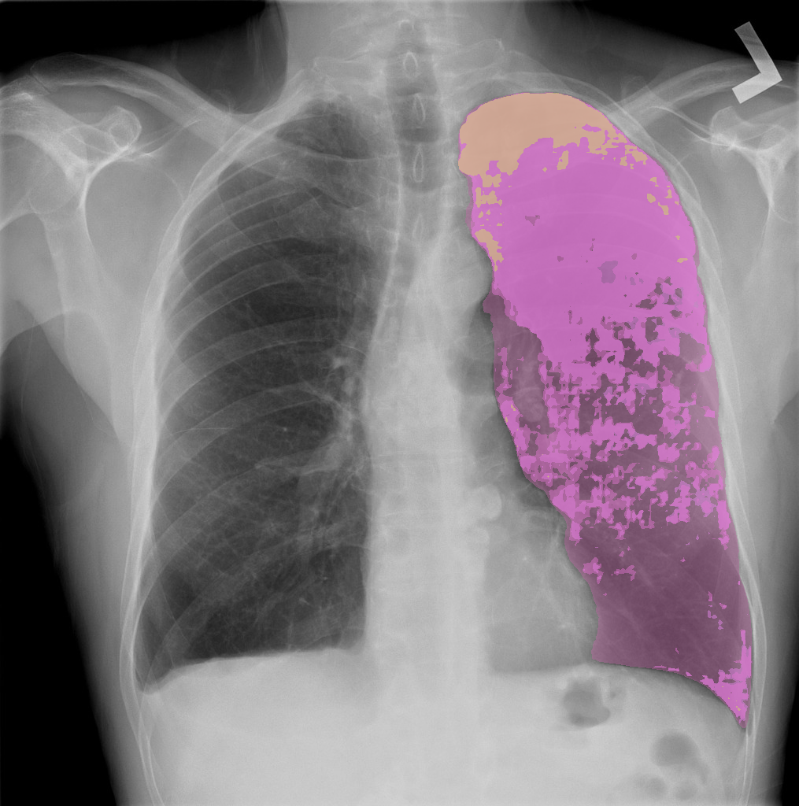 |  |  |
| Image 2: Lateral |  | 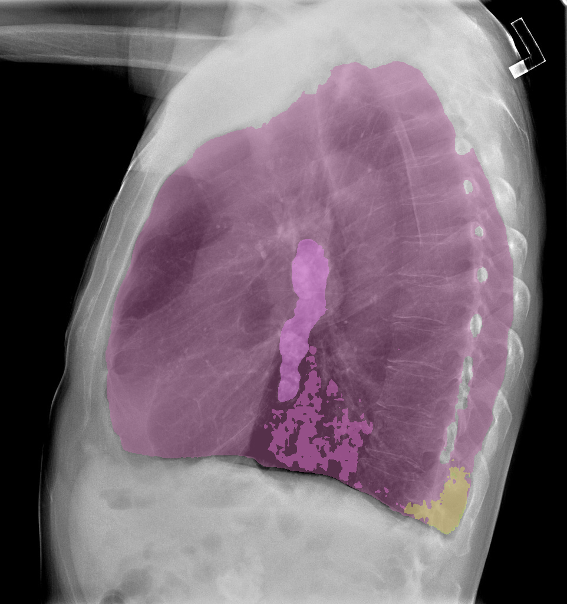 | 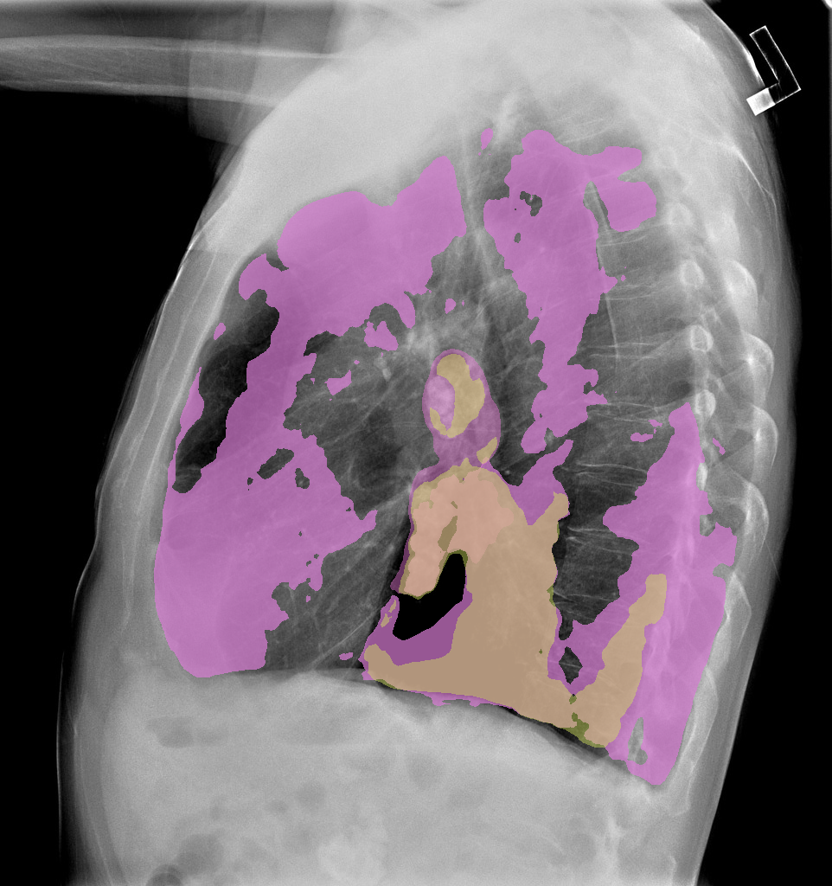 | 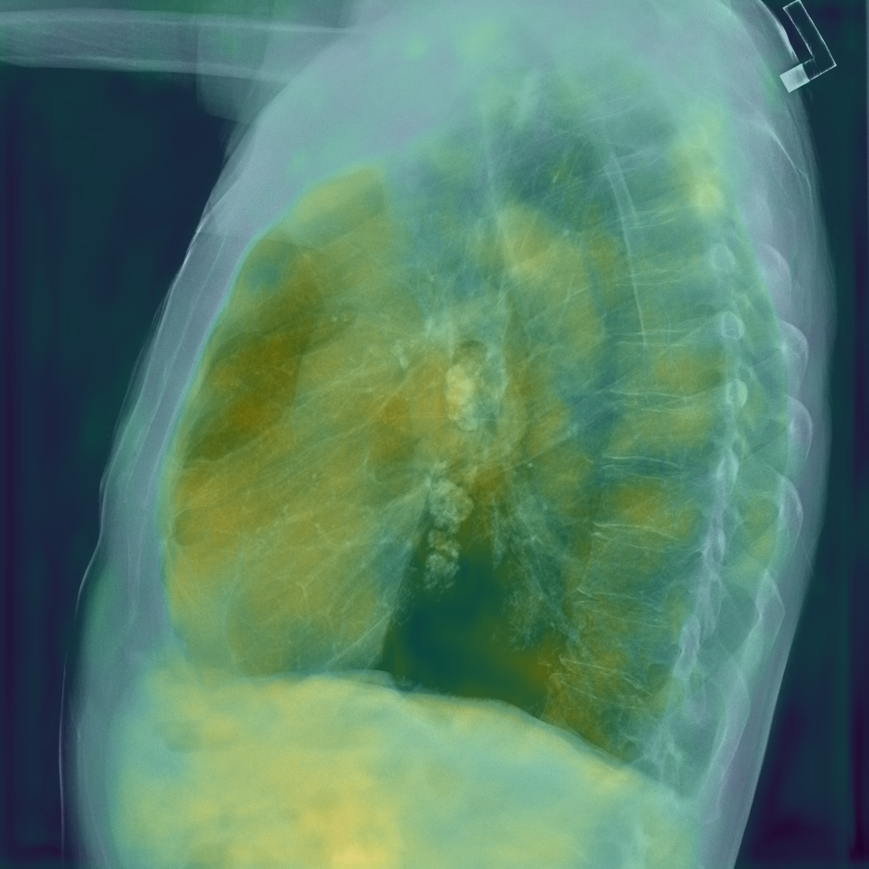 |
| Image 3: Dual energy bone window |  |  |  |  |

**Radiopaedia 原始图片 caption：**

<pre>Hilar, mediastinal and parenchymal calcification.</pre>

**原始图片 caption 中文医学要点（翻译）：**

<pre>

</pre>

#### Study 0 的 8 个模型 Single-modality caption 对比

<strong>InternVL3-14B</strong>

**原始图像 → Single-modality caption 回答**

英文原始回答：

<pre>This image provides a frontal chest X-ray that helps evaluate the patient’s thoracic and pulmonary structures. Given the patient’s history of head and neck squamous cell carcinoma and previous radiation therapy, it’s essential to assess for any local recurrence, metastasis, or potential complications such as radiation-induced changes.

Key observations from Image 1 (Frontal Chest X-ray) include:
- The bony structures, including the ribs and clavicles, appear intact.
- The cardio-mediastinal silhouette is within normal limits without apparent widening.
- Both lung fields should be examined closely for any signs of mass, consolidation, or metastatic lesions. The clarity will indicate if there are any occult lung or pleural abnormalities, which could suggest metastasis or complications from previous treatments.

Image 2 (Lateral Chest X-ray) allows further scrutiny of the posterior structures of the chest:
- Evaluates the mediastinal contours and any potential masses or lymphadenopathy in the mediastinal or hilar areas.
- Assists in assessing the involvement of posterior segments of lungs, which is crucial in the follow-up of head and neck cancers.

Image 3 (Dual Energy Bone Window) enhances the visibility of bone structures within the chest:
- Offers a detailed view of the ribs, spine, and clavicles.
- Useful for detecting any subtle bone metastases or pathologies that may not be apparent on standard radiographs.

### Differential Diagnosis and Key Points:

Considering the patient's history:
1. **Metastatic Disease:**
   - The primary concern in a patient with a history of head and neck squamous cell carcinoma is to rule out or confirm metastatic spread to the lungs, bones, or mediastinum.
   - Look for signs such as nodular densities, lesions along the bronchi (bronchial cuffing), or evidence of bone involvement.

2. **Radiation-Induced Changes:**
   - Chronic radiation therapy can cause fibrosis, pneumonitis, or other radiation-induced lung changes that may mimic metastatic disease.
   - The images should be compared with prior studies to assess for new changes.

3. **Recurrence of Primary Cancer:**
   - Recurrence could present as a new mass in the neck region or adjacent mediastinal structures, though it's less common in the lungs specifically.

### Steps to Interpretation:

1. **Examine Lung Fields:**
   - For diffuse infiltrates, nodules, mass lesions, or evidence of pleural effusions. 
   
2. **Assess Mediastinum and Hilar Nodes:**
   - For enlargement or masses suggesting lymphadenopathy.

3. **Evaluate Bones:**
   - For signs of metastases or pathologic fractures, especially in the ribs, clavicles, and vertebrae.

### Conclusion:

Based on the historical information and the images, the most immediate diagnostic concerns are the assessment for metastatic spread, recurrence of cancer, and possible radiation-induced changes. Further action may include advanced imaging such as a CT scan of the chest, PET/CT to assess metabolic activity of possible lesions, and possibly a biopsy if suspicious masses are identified. Regular follow-up is imperative, given the potential for late recurrence and complications from prior treatments.</pre>

中文医学要点（翻译）：

<pre>

</pre>

**原始图像 + Segmentation → Single-modality caption 回答**

英文原始回答：

<pre>The image series includes a frontal X-ray, a lateral X-ray, and a dual-energy bone window X-ray of a patient's chest. The patient is a 65-year-old male with a history of head and neck squamous cell carcinoma and previous radiation therapy and chemotherapy.

### Image Analysis:

1. **Frontal (PA) View:**
   - The image reveals the outline of the lungs, heart, and diaphragm.
   - There is increased radiolucency in the right lung field, which can be indicative of emphysema or other chronic obstructive pulmonary diseases (COPD).
   - The cardiothoracic ratio appears within normal limits.

2. **Lateral View:**
   - The lateral view shows increased lucency in the same region, suggesting volume loss or changes in lung tissue structure, such as atelectasis or fibrosis.
   - A shift can be noted towards the right side, possibly compensating for volume loss in the right lung.

3. **Dual-Energy Bone Window:**
   - The bone window enhances visibility of the ribs, vertebrae, and lung fields, highlighting any signs of osteoarticular changes.
   - The increased radiolucency persists, corroborating findings from other views.

### Segmentation Information:

- **Medical-SAM3:**
  - Segments lung fields and mediastinum.
  - Identifies areas with increased opacity and lucency, indicating lung tissue involvement.

- **BiomedParse:**
  - Clearly delineates lung fields with some areas appearing abnormal.
  - Suggests calcifications and lymph nodes, which could be related to prior cancer treatment effects.

- **TorchXRayVision:**
  - Emphasizes lung regions, mediastinum, heart, and other thoracic structures.
  - Shows abnormal densities within the right lung, aligning with possible underlying pathology.

### Clinical Correlation and Diagnosis:

Given the patient's history of head and neck squamous cell carcinoma and prior treatments, these imaging findings raise concern for possible late radiation effects on the lungs:

1. **Pulmonary Fibrosis:**
   - Radiation therapy can lead to late effects on lung tissue, including fibrosis, resulting in scarring and reduced lung function.
   - The increased radiolucency and altered lung architecture in the right lung suggest this possibility.

2. **Emphysema:**
   - Chronic obstructive pulmonary disease (COPD) and emphysema can present with similar radiographic features, including increased radiolucency.

3. **Atelectasis:**
   - Volume loss or collapse of lung segments can occur due to scarring or reduced air content, potentially presenting with a shift in mediastinal structures.

#### Conclusion:
The abnormalities observed, in conjunction with the patient's history, suggest chronic pulmonary changes secondary to radiation therapy. Pulmonary fibrosis is a likely diagnosis requiring further evaluation with high-resolution CT scans and pulmonary function tests to assess lung damage and function. Given the patient's history, it's essential to manage symptoms and monitor for respiratory complications.</pre>

中文医学要点（翻译）：

<pre>

</pre>

**Segmentation 对 caption 的影响分析：**

<pre>

</pre>

<strong>InternVL3.5-14B</strong>

**原始图像 → Single-modality caption 回答**

英文原始回答：

<pre>&lt;think&gt;
The patient is a 65-year-old male with a history of head and neck squamous cell cancer treated with radiation and chemotherapy. The chest X-rays (frontal, lateral, and dual-energy bone window) are analyzed for any abnormalities.

**Frontal View (Image 1):**
- The lungs appear clear with no visible masses, consolidations, or infiltrates.
- The costophrenic angles are sharp, indicating no pleural effusion.
- The cardiac silhouette and mediastinum are normal in size and contour.
- The bony thorax shows no obvious lesions or fractures.

**Lateral View (Image 2):**
- The lung fields are clear, and the diaphragm is well-positioned.
- The mediastinum and heart appear normal.
- The spine and ribs are intact without any lytic or sclerotic lesions.

**Dual-Energy Bone Window (Image 3):**
- This view highlights the bony structures, showing no evidence of lytic or sclerotic lesions.
- The ribs, spine, and clavicles are intact and demonstrate normal bone density.

**Considerations:**
- Given the patient's history of head and neck cancer, metastatic disease is a concern. However, the chest X-rays do not show any obvious lung masses or bone lesions.
- The absence of pleural effusion and normal cardiac silhouette reduce the likelihood of concurrent conditions like heart failure or pneumonia.
- The bones appear intact, suggesting no metastatic bone disease in the thoracic region.

**Diagnosis:**
- The chest X-rays are unremarkable with no evidence of metastatic disease, pneumonia, pleural effusion, or other acute abnormalities. The patient's history of head and neck cancer does not correlate with findings on these images.
&lt;/think&gt;

**Diagnosis:**

The chest X-rays (frontal, lateral, and dual-energy bone window) of the 65-year-old male patient with a history of head and neck squamous cell cancer show no evidence of metastatic disease, pneumonia, pleural effusion, or other acute abnormalities. The lung fields are clear, the cardiac and mediastinal contours are normal, and the bony thorax demonstrates no lytic or sclerotic lesions. The absence of significant findings on these images suggests that there is no current thoracic involvement related to the patient's prior head and neck cancer. 

**Recommendation:**
- Continue surveillance with periodic imaging and clinical evaluations, as metastatic disease can sometimes present outside the thoracic region or with subtle imaging findings. Further imaging, such as a CT scan of the thorax, may be considered if clinical suspicion persists.</pre>

中文医学要点（翻译）：

<pre>

</pre>

**原始图像 + Segmentation → Single-modality caption 回答**

英文原始回答：

<pre>The provided images are chest X-rays of a 65-year-old male patient with a history of head and neck squamous cell cancer, previously treated with radiation therapy and chemotherapy. Let's analyze each image in detail:

### Image 1: Frontal X-ray
- **Observation**: 
  - The right lung appears relatively clear, with normal lung markings extending to the periphery.
  - The left lung shows a large area of increased opacity, particularly in the upper and mid zones. 
  - The mediastinum is slightly shifted towards the right, which may suggest volume loss or a mass effect in the left lung.
  - There is a noticeable blunting of the left costophrenic angle, which could indicate a pleural effusion.

### Image 2: Lateral X-ray
- **Observation**: 
  - The lateral view confirms the presence of a large mass or consolidation in the left upper lung zone.
  - There is evidence of possible calcification within the mass, indicated by areas of increased density.
  - The trachea appears to be deviated towards the right, which can be due to a mass effect or volume loss in the left lung.
  - The diaphragm on the left side is elevated, and the gastric bubble is shifted, suggesting volume loss in the left hemithorax.

### Image 3: Dual Energy Bone Window
- **Observation**: 
  - This image highlights bone structures and any calcifications more clearly.
  - There is a clear demarcation of the ribs and vertebrae, with no obvious bone lesions.
  - The left upper lung zone shows areas of calcification, consistent with a possible old granulomatous disease or prior radiation effect.

### Segmentation Observations:
- **Medical-SAM3 Segmentation**: 
  - Highlights the left lung with areas of consolidation and possible calcification.
  - Mediastinal shift towards the right is evident.
- **BiomedParse Segmentation**: 
  - Shows a large area of the left lung marked, likely indicating a mass or consolidation.
  - The mediastinum and heart are shifted towards the right.
- **TorchXRayVision Segmentation**: 
  - Both lungs are marked, with the left lung showing abnormalities in the upper zones.

### Diagnosis:
Based on the imaging findings and the patient's history, the most likely diagnosis is a **recurrent or metastatic lesion in the left lung**. The large area of opacity in the left lung, mediastinal shift, and possible calcifications suggest a mass that could be due to recurrent squamous cell cancer or metastasis. The blunting of the costophrenic angle might indicate a pleural effusion, which can be associated with malignancy.

### Additional Considerations:
- **Infection**: Although less likely, a large infectious process such as tuberculosis or fungal infection could present similarly, especially with calcifications.
- **Pleural Effusion**: The blunting of the costophrenic angle suggests a pleural effusion, which can be due to malignancy, infection, or other causes.
- **Prior Radiation Changes**: Given the patient's history of radiation therapy, radiation-induced changes could also be contributing to the findings.

### Recommended Next Steps:
1. **CT Scan**: A high-resolution CT scan of the chest would provide more detailed information about the mass, its extent, and involvement of surrounding structures.
2. **Biopsy**: If feasible, a biopsy of the mass would be ideal to confirm the diagnosis.
3. **Tumor Markers and Labs**: Checking for tumor markers and other laboratory tests could provide additional diagnostic clues.
4. **Follow-up**: Close follow-up with repeat imaging to monitor any changes in the size or character of the mass.

In conclusion, the imaging findings, combined with the patient's history, strongly suggest a malignant process in the left lung, likely related to the patient's history of head and neck squamous cell cancer. Further diagnostic workup is warranted to confirm the diagnosis and plan appropriate treatment.</pre>

中文医学要点（翻译）：

<pre>

</pre>

**Segmentation 对 caption 的影响分析：**

<pre>

</pre>

<strong>Lingshu-32B</strong>

**原始图像 → Single-modality caption 回答**

英文原始回答：

<pre>The images provided are chest X-rays in frontal, lateral, and dual-energy bone window views. The frontal view shows clear lung fields with no evidence of consolidation or masses. The heart size is within normal limits, and there are no signs of pleural effusion. The lateral view confirms these findings, showing well-aerated lungs without any abnormal opacities. The dual-energy bone window highlights the bony structures, including the ribs and spine, which appear intact without fractures or lesions. Given the patient's history of head and neck squamous cell carcinoma treated with radiation and chemotherapy, it is important to monitor for potential metastasis or secondary malignancies. However, the current chest X-rays do not show any signs of metastatic disease or new primary lung cancer. Therefore, the diagnosis based on these images is that there is no evidence of active pulmonary pathology or metastatic disease at this time.</pre>

中文医学要点（翻译）：

<pre>

</pre>

**原始图像 + Segmentation → Single-modality caption 回答**

英文原始回答：

<pre>The provided images show multiple chest X-rays with various segmentations highlighting different anatomical structures such as the lungs, mediastinum, lymph nodes, and calcifications. The images reveal the presence of multiple calcified nodules in both lungs, which are more prominent in the left lung. These findings are consistent with the patient's history of head and neck squamous cell carcinoma treated with radiation therapy and chemotherapy. The calcifications likely represent post-treatment changes or metastatic disease. Given the patient's history and the radiographic findings, the most likely diagnosis is metastatic disease involving the lungs, possibly from the previously treated head and neck squamous cell carcinoma. Further clinical correlation and additional imaging studies may be necessary to confirm the diagnosis and assess the extent of disease.</pre>

中文医学要点（翻译）：

<pre>

</pre>

**Segmentation 对 caption 的影响分析：**

<pre>

</pre>

<strong>MedGemma-27B-IT</strong>

**原始图像 → Single-modality caption 回答**

英文原始回答：

<pre>The patient is a 65-year-old male with a history of head and neck squamous cell cancer treated with radiation and chemotherapy 12 years ago. The provided images are chest X-rays: a frontal view (Image 1), a lateral view (Image 2), and a dual-energy bone window view (Image 3).

**Image Description:**

*   **Image 1 (Frontal):** Shows the chest from the front. The lungs appear relatively clear, although there might be subtle increased interstitial markings, which could be related to prior radiation. The heart size appears normal. The mediastinum is unremarkable. The bony structures (ribs, clavicles) appear intact.
*   **Image 2 (Lateral):** Shows the chest from the side. The lung fields are visualized. The heart and great vessels are seen in profile. The diaphragm is visible. Again, the lung fields appear relatively clear, but subtle changes might be present.
*   **Image 3 (Dual energy bone window):** This view is specifically designed to highlight bony structures. The ribs, sternum, clavicles, and spine are clearly visible. There are no obvious fractures or destructive lesions visible on the visualized bony structures.

**Potential Findings and Considerations:**

1.  **Radiation Fibrosis:** Given the patient's history of radiation therapy to the head and neck, it is possible that he has received radiation to the chest as well, although this is not explicitly stated. Radiation can cause fibrosis in the lungs, which might appear as subtle interstitial changes or traction bronchiectasis on the X-rays. However, the images provided do not show any obvious or significant signs of radiation fibrosis.
2.  **Post-Treatment Changes:** The history of cancer and treatment could potentially lead to secondary malignancies or other complications. However, the chest X-rays do not show any clear evidence of masses, nodules, pleural effusions, or other acute abnormalities.
3.  **Subtle Changes:** It is important to note that chest X-rays have limitations in sensitivity, especially for subtle changes like early fibrosis or small nodules. A CT scan of the chest would provide much greater detail.

**Diagnosis:**

Based solely on these chest X-rays, there are no definitive acute findings. The lungs appear relatively clear, and the bony structures are intact.

**Conclusion:**

The chest X-rays do not reveal any obvious acute pathology. However, given the patient's history of head and neck cancer and prior radiation/chemotherapy, subtle changes related to treatment or potential long-term complications cannot be entirely ruled out based on these images alone. Further investigation with higher-resolution imaging (like a CT scan) might be considered if there is clinical suspicion for specific conditions.</pre>

中文医学要点（翻译）：

<pre>

</pre>

**原始图像 + Segmentation → Single-modality caption 回答**

英文原始回答：

<pre>The patient is a 65-year-old male with a history of head and neck squamous cell cancer treated with radiation and chemotherapy 12 years ago. The provided images are chest X-rays in frontal (Image 1), lateral (Image 2), and dual energy bone window (Image 3) views.

**Image Description:**

*   **Image 1 (Frontal):** Shows the lungs, heart, mediastinum, and bony structures. The lungs appear relatively clear, although there might be subtle opacities or scarring, particularly in the right upper lobe. The mediastinum appears normal in width. The bony structures, including the ribs and clavicles, are visible.
*   **Image 2 (Lateral):** Provides a side view of the chest. The lungs, heart, diaphragm, and vertebral column are visible. The posterior costophrenic angles are clear. The heart size appears within normal limits.
*   **Image 3 (Dual energy bone window):** This view enhances the visualization of bony structures. It shows the ribs, clavicles, sternum, and spine. There are no obvious acute fractures or destructive lesions visible on this view.

**Analysis and Potential Findings:**

1.  **Radiation Effects:** Given the patient's history of radiation therapy to the head and neck, it's important to consider potential long-term effects on the chest, although radiation to the head/neck typically doesn't directly affect the chest structures significantly unless the field was very extensive or the patient developed secondary malignancies. However, radiation can cause fibrosis or scarring in the lungs, which might appear as subtle opacities or volume loss.
2.  **Lung Parenchyma:** The lung fields appear relatively clear in the frontal view, but subtle changes might be present. The lateral view doesn't show significant consolidation or effusion.
3.  **Mediastinum:** The mediastinum appears normal in width on the frontal view.
4.  **Bones:** The bone window view shows no obvious acute bony abnormalities.

**Diagnosis:**

Based solely on these chest X-rays, it is difficult to provide a definitive diagnosis without clinical correlation. The images do not show any acute, obvious pathology like pneumonia, large effusion, pneumothorax, or significant mediastinal widening.

However, given the patient's history of radiation therapy, subtle findings like radiation-induced fibrosis or scarring cannot be entirely ruled out without comparison to prior imaging or further investigation (like CT scan).

**Conclusion:**

The chest X-rays show no acute abnormalities. The findings are relatively unremarkable. Further evaluation might be needed depending on the clinical context and suspicion for specific conditions related to the patient's history.</pre>

中文医学要点（翻译）：

<pre>

</pre>

**Segmentation 对 caption 的影响分析：**

<pre>

</pre>

<strong>MedMO-8B</strong>

**原始图像 → Single-modality caption 回答**

英文原始回答：

<pre>The patient is status post radiation therapy for head and neck cancer. There is a left pleural effusion. The patient is status post right upper lobe lobectomy. There is no pneumothorax.</pre>

中文医学要点（翻译）：

<pre>

</pre>

**原始图像 + Segmentation → Single-modality caption 回答**

英文原始回答：

<pre>The image shows a chest X-ray of a patient with a history of head and neck squamous cell cancer, who has undergone radiation therapy and chemotherapy. The image shows the lungs, mediastinum, lymph nodes, and calcifications.</pre>

中文医学要点（翻译）：

<pre>

</pre>

**Segmentation 对 caption 的影响分析：**

<pre>

</pre>

<strong>Qwen3-VL-4B</strong>

**原始图像 → Single-modality caption 回答**

英文原始回答：

<pre>Based on the patient’s history of head and neck squamous cell cancer 12 years ago, treated with radiation therapy and chemotherapy, and the provided chest X-rays, the most likely diagnosis is **radiation-induced lung fibrosis (also known as radiation pneumonitis or radiation pneumosclerosis)**.

Here’s the reasoning:

1.  **Patient History:** The patient is a 65-year-old male with a history of head and neck cancer treated with radiation. Radiation therapy to the head and neck region can cause radiation-induced pulmonary changes, including fibrosis, which can develop years after treatment, often 5-10+ years later. This aligns with the 12-year timeframe.

2.  **Imaging Findings:**
    *   **Image 1 (Frontal):** Shows a diffuse, patchy opacification in the right lung field, particularly in the mid to lower zones. There is also a notable increase in the density of the mediastinum and a suggestion of volume loss or scarring. The trachea is centrally located, and the cardiac silhouette appears normal.
    *   **Image 2 (Lateral):** Provides a more detailed view of the mediastinum and lung fields. It shows a large, ill-defined, dense opacity in the right lung, which is consistent with fibrotic changes. The right hemidiaphragm appears slightly elevated, which can occur with fibrosis or atelectasis. The mediastinal shadow is prominent, possibly due to lymphadenopathy or fibrosis.
    *   **Image 3 (Dual Energy Bone Window):** This image is specifically designed to highlight bone structures. It shows the ribs and spine, which appear normal, with no evidence of fractures or osteoporosis. The lung fields are not visible in this view, so it does not provide direct information about lung pathology, but it confirms the absence of bone-related pathology.

3.  **Diagnostic Conclusion:**
    The combination of the patient's history and the imaging findings strongly suggests **radiation-induced lung fibrosis**. The diffuse, patchy opacities and increased density in the lungs, particularly in the right lung, are characteristic of radiation pneumonitis or fibrosis. The elevated diaphragm and mediastinal shadow may be secondary to volume loss or fibrosis. This is a common and potentially serious complication of radiation therapy for head and neck cancers.

In summary, the imaging findings are consistent with radiation-induced lung fibrosis, a known long-term complication of radiation therapy for head and neck cancer.</pre>

中文医学要点（翻译）：

<pre>

</pre>

**原始图像 + Segmentation → Single-modality caption 回答**

英文原始回答：

<pre>Based on the patient’s history of head and neck squamous cell cancer treated with radiation and chemotherapy 12 years ago, and the radiographic images provided, the following analysis and diagnosis can be made:

**Analysis of Images:**

- **Image 1 (Frontal X-ray):** Shows a large, irregularly shaped opacity in the right upper lung field, which is more pronounced in the lateral view (Image 2). The frontal view shows a large, heterogeneous opacity in the right lung, with a small, round, dense area near the hilum. The mediastinum appears widened, and there is a suggestion of a mass or enlarged lymph nodes.

- **Image 2 (Lateral X-ray):** Confirms the presence of a large, irregular, and heterogeneous opacity in the right lung, which appears to be a mass or tumor. The opacity is located in the right upper lobe and extends into the mediastinum. The mediastinum appears widened, and there is a suggestion of enlarged lymph nodes.

- **Image 3 (Dual Energy Bone Window):** This image is more detailed and shows a large, irregular, and heterogeneous opacity in the right lung, which appears to be a mass or tumor. The opacity is located in the right upper lobe and extends into the mediastinum. The mediastinum appears widened, and there is a suggestion of enlarged lymph nodes.

**Diagnosis:**

The patient’s history of head and neck squamous cell cancer treated with radiation and chemotherapy 12 years ago is highly suggestive of a recurrence of the cancer. The radiographic images show a large, irregular, and heterogeneous opacity in the right upper lobe, which is consistent with a recurrent tumor. The mediastinum appears widened, and there is a suggestion of enlarged lymph nodes, which is also consistent with a recurrence of the cancer.

**Conclusion:**

The patient has a recurrence of head and neck squamous cell cancer, which has spread to the right lung and mediastinum. The radiographic images show a large, irregular, and heterogeneous opacity in the right upper lobe, which is consistent with a recurrent tumor. The mediastinum appears widened, and there is a suggestion of enlarged lymph nodes, which is also consistent with a recurrence of the cancer.

**Recommendation:**

The patient should be referred to a specialist for further evaluation and management of the recurrent cancer. The patient may require further imaging, such as a CT scan or PET scan, to confirm the diagnosis and determine the extent of the disease. The patient may also require chemotherapy or radiation therapy to treat the recurrent cancer.</pre>

中文医学要点（翻译）：

<pre>

</pre>

**Segmentation 对 caption 的影响分析：**

<pre>

</pre>

<strong>Qwen3-VL-8B</strong>

**原始图像 → Single-modality caption 回答**

英文原始回答：

<pre>Based on the patient’s history (65-year-old male with prior head and neck squamous cell cancer treated with radiation and chemotherapy) and the provided chest X-ray images (frontal, lateral, and bone window), the following interpretation is made:

### Image Description:

- **Frontal (Image 1)**: The chest X-ray shows a generally clear lung field with no obvious consolidation, effusion, or pneumothorax. The heart size is within normal limits. There is a subtle, faintly dense area in the right lower lung field, but this is not prominent enough to be diagnostic on its own.
- **Lateral (Image 2)**: This view confirms the frontal findings and provides additional detail. The mediastinum appears centrally located. There is a small, rounded, slightly denser lesion visible in the right hilum, which is more apparent in this projection. The trachea is midline, and the diaphragm is well-defined.
- **Bone Window (Image 3)**: This image highlights the bony structures. It shows no obvious fractures, lytic lesions, or osteolytic changes in the ribs, sternum, or spine. The vertebral bodies appear intact.

### Clinical Context and Diagnosis:

Given the patient’s history of head and neck squamous cell carcinoma (HNSCC) treated with radiation and chemotherapy, the most concerning finding is the **small, rounded, slightly dense lesion in the right hilum** seen on the lateral view.

This finding is **highly suspicious for a recurrent primary tumor or a metastatic lesion**. Radiation therapy to the head and neck region can lead to **radiation-induced changes** in the lung (such as fibrosis or bronchiectasis), but these are typically more diffuse and not localized. The presence of a focal, rounded lesion in the hilum is more consistent with a **recurrent tumor or metastasis**.

Additionally, the patient’s age and history of cancer increase the risk of **lung metastasis**, especially from a prior head and neck squamous cell carcinoma, which has a known propensity for hematogenous spread to the lungs.

### Conclusion:

The most likely diagnosis is **right hilar lymph node metastasis or recurrent primary tumor** from the prior head and neck squamous cell carcinoma.

### Recommendation:

The patient should undergo further evaluation, including:
- **CT chest with contrast** to better characterize the lesion and assess for additional metastases.
- **PET-CT scan** to evaluate for metabolic activity and systemic disease.
- **Biopsy** if the lesion is accessible and clinically indicated.

This finding is not consistent with benign conditions such as granulomas or infections, given the patient’s history and the location of the lesion.

**Final Diagnosis: Right hilar mass suspicious for metastasis or recurrence of head and neck squamous cell carcinoma.**</pre>

中文医学要点（翻译）：

<pre>

</pre>

**原始图像 + Segmentation → Single-modality caption 回答**

英文原始回答：

<pre>Based on the provided patient data and imaging, here is the analysis:

**Patient Background:**
- 65-year-old male.
- History of head and neck squamous cell cancer 12 years ago.
- Underwent radiation therapy and chemotherapy for this cancer.
- This history is highly relevant as radiation therapy to the head and neck region is a well-established risk factor for the development of secondary lung cancer (lung metastases or radiation-induced lung disease) and other pulmonary complications years later.

**Imaging Analysis:**

The three X-ray views (Frontal, Lateral, and Dual Energy Bone Window) are consistent with a standard chest radiograph. The segmentation masks from different models (Medical-SAM3, BiomedParse, TorchXRayVision) all identify the lung fields, mediastinum, and surrounding structures.

*   **Image 1 (Frontal View):** The frontal chest X-ray shows a clear lung field with no obvious focal masses, consolidation, or pleural effusion. The heart size appears normal, and the diaphragm is well-defined. The mediastinum is not widened. The dual-energy bone window (Image 3) provides a clearer view of the bony thorax, showing no obvious fractures or significant bony lesions.

*   **Image 2 (Lateral View):** The lateral view confirms the findings from the frontal view. The lung fields are clear, and there are no signs of significant pleural thickening, effusion, or mediastinal mass. The cardiac silhouette is normal in size and contour.

*   **Segmentation Masks:** The segmentation masks from all models are consistent with normal lung anatomy and do not highlight any specific abnormal structures such as nodules, masses, or calcifications that would suggest malignancy or infection.

**Diagnosis:**

**Normal Chest X-ray with No Evidence of Active Pulmonary Disease**

The chest X-rays are unremarkable. There is no evidence of pneumonia, lung consolidation, pleural effusion, pneumothorax, or significant lung mass or nodules. The heart and mediastinum appear normal in size and shape.

**Clinical Interpretation:**

Given the patient's history of head and neck cancer and prior radiation therapy, one might expect to see signs of radiation-induced lung injury (such as fibrosis or scarring), which can sometimes be subtle on X-ray. However, the images do not show any such findings. The absence of any focal abnormalities is reassuring.

**Recommendation:**

While the chest X-ray is normal, given the patient's history, it is prudent to consider a low-dose CT scan of the chest for a more detailed evaluation of the lung parenchyma, as CT is more sensitive than X-ray for detecting subtle changes or small nodules, especially in the context of prior radiation exposure. This would be a more comprehensive assessment for secondary malignancy or radiation-induced lung changes.

In summary, the patient's chest X-ray is normal, but his history warrants further imaging with a low-dose CT scan for a more thorough evaluation.</pre>

中文医学要点（翻译）：

<pre>

</pre>

**Segmentation 对 caption 的影响分析：**

<pre>

</pre>

<strong>Qwen3-VL-32B</strong>

**原始图像 → Single-modality caption 回答**

英文原始回答：

<pre>Based on the provided patient history and chest X-ray images (frontal, lateral, and dual-energy bone window), here is a detailed description and interpretation:

---

### **Patient Background Summary:**
- **Age:** 65 years
- **Gender:** Male
- **History:** Head and neck squamous cell carcinoma (HNSCC) treated 12 years ago with **radiation therapy and chemotherapy**.
- **Clinical Context:** This patient is at increased risk for **second primary malignancies** and **metastatic disease**, particularly to the lungs and bones, due to prior cancer and treatment.

---

### **Image Description:**

#### **Image 1: Frontal Chest X-ray**
- **Lung Fields:** Bilateral, scattered, small, well-defined **nodular opacities** are visible, particularly in the **upper and mid zones** of both lungs. These appear **dense and calcified**.
- **Cardiomediastinal Silhouette:** Normal size and contour. No evidence of lymphadenopathy.
- **Bones:** No obvious lytic or blastic lesions in the ribs or spine on standard view.
- **Diaphragm and Pleura:** No effusion or pleural thickening.

#### **Image 2: Lateral Chest X-ray**
- Confirms the presence of **multiple small nodules** in the **anterior and posterior aspects** of the upper lung zones.
- Nodules appear **rounded and dense**, with some showing **central calcification**.
- No significant mass effect or consolidation.

#### **Image 3: Dual-Energy Bone Window (Frontal)**
- This technique enhances visualization of **bony structures** and **calcified lesions**.
- Reveals **multiple small, round, dense calcified nodules** throughout the lung fields, with **prominent calcification** in the upper lobes.
- **No evidence of bony metastases** (no lytic or blastic lesions in ribs, spine, or sternum).
- The calcified nodules are **non-structured** and **scattered**, not consistent with typical granulomatous disease (e.g., TB or histoplasmosis) or silicosis.

---

### **Radiological Findings Summary:**
- **Multiple, small, well-defined, calcified pulmonary nodules** in both lungs, predominantly in the upper lobes.
- No evidence of active infection, consolidation, or lymphadenopathy.
- No bony metastases on dual-energy bone window.
- Nodules appear **chronic and stable**, given the patient’s 12-year history and absence of new or growing lesions.

---

### **Differential Diagnosis:**

1. **Metastatic Disease from HNSCC:**
   - HNSCC can metastasize to the lungs, but metastases are typically **multiple, non-calcified, and may show growth over time**.
   - Calcified metastases are **rare** and usually occur in long-standing disease (e.g., from renal cell carcinoma or chondrosarcoma), not HNSCC.
   - **Unlikely** in this case due to the **calcified nature** and **long latency**.

2. **Granulomatous Disease (e.g., Histoplasmosis, Tuberculosis):**
   - Can cause calcified nodules, often in upper lobes.
   - However, these are typically **fewer in number** and may be associated with **fibrotic changes or cavitation**.
   - **No clinical history** or risk factors for TB or fungal infection.
   - **Less likely** given the **numerous, small, uniform nodules**.

3. **Silicosis or Other Pneumoconiosis:**
   - Typically associated with occupational exposure (e.g., mining, construction).
   - Nodules are often **upper lobe predominant** and may calcify.
   - **No occupational history** provided, making this less likely.

4. **Hamartoma (Multiple):**
   - Benign lung tumors that may calcify (often “popcorn” calcification).
   - Usually solitary; multiple hamartomas are rare.
   - **Unlikely** given the **numerous, small, uniform nodules**.

5. **Calcified Pulmonary Metastases from Prior Malignancy (Unlikely but Possible):**
   - Extremely rare, but long-standing metastases from certain tumors (e.g., osteosarcoma, chondrosarcoma) can calcify.
   - HNSCC is not typically associated with calcified metastases.

6. **Benign Calcified Nodules (e.g., from old granulomas or healed infections):**
   - Most likely explanation.
   - **Incidental finding** in an older patient with no symptoms.
   - **Calcification suggests chronic, inactive process**.

---

### **Most Likely Diagnosis:**

&gt; **Multiple Calcified Pulmonary Nodules — Likely Benign, Chronic, and Inactive (e.g., from Old Granulomatous Disease or Infection)**

---

### **Clinical Implications:**

- **No evidence of active malignancy or metastatic disease** on current imaging.
- **No need for urgent intervention**.
- **Recommendation:**
  - **Clinical correlation** with patient’s history (e.g., prior TB, fungal exposure, occupational history).
  - **Consider CT chest** for better characterization if clinical concern persists (e.g., if nodules are new or growing).
  - **Monitor with periodic imaging** if patient is asymptomatic and no new symptoms arise.
  - **Reassurance** given the calcified, stable nature of the nodules.

---

### **Conclusion:**

The chest X-rays demonstrate **multiple, small, calcified pulmonary nodules**, most consistent with **benign, chronic, inactive lesions** (likely old granulomas). Given the patient’s history of HNSCC treated 12 years ago, the nodules are **unlikely to represent metastatic disease**, especially due to their calcified nature and stability. No active malignancy or infection is suggested. **No immediate intervention is required**, but clinical follow-up and possible CT for further characterization may be considered if indicated.

---

**Final Diagnosis: Multiple Calcified Pulmonary Nodules — Benign, Chronic, Likely Granulomatous Origin**</pre>

中文医学要点（翻译）：

<pre>

</pre>

**原始图像 + Segmentation → Single-modality caption 回答**

英文原始回答：

<pre>Based on the patient’s history and the provided chest X-rays (PA, lateral, and dual-energy bone window), here is a comprehensive radiological description and diagnosis:

---

### **Patient Background:**
- 65-year-old male
- History of **head and neck squamous cell carcinoma (HNSCC)** treated with **radiation therapy and chemotherapy 12 years ago**
- This history places him at **increased risk for second primary malignancies**, particularly **lung cancer**, and for **radiation-induced lung disease (RILD)** or **radiation fibrosis**.

---

### **Image Analysis:**

#### **Image 1: PA Chest X-ray**
- **Lungs:** The left lung shows **diffuse, patchy, reticular opacities** predominantly in the **upper and mid zones**, with some **volume loss**. The right lung appears relatively clear.
- **Mediastinum:** The mediastinum is **slightly widened**, with **prominent hilar and paratracheal opacities**. There is a **dense, irregular opacity in the left hilum**, which may represent **fibrosis, lymphadenopathy, or a mass**.
- **Diaphragm:** The left hemidiaphragm is **elevated**, consistent with volume loss or fibrosis in the left lung.
- **Bones:** No obvious lytic or blastic bone lesions are seen on standard view.

#### **Image 2: Lateral Chest X-ray**
- **Lungs:** Confirms **left upper lobe volume loss** and **reticular opacities**. The **left hilum is prominent**, and there is **increased density in the posterior mediastinum**.
- **Mediastinum:** The **cardiomediastinal silhouette** is slightly enlarged, and there is **increased density in the region of the aortic arch and left hilum**, possibly due to **fibrosis or lymphadenopathy**.
- **Diaphragm:** The **left hemidiaphragm is elevated**, and the **cardiac silhouette appears more prominent anteriorly**.

#### **Image 3: Dual-Energy Bone Window**
- This view enhances **bony structures** and **calcifications**.
- **Lungs:** The **left lung shows a dense, irregular opacity in the left hilum** and **upper lobe**, which may represent **calcified lymph nodes or fibrotic tissue**.
- **Mediastinum:** The **left hilar region** shows **dense, calcified nodules**, likely **radiation-induced fibrosis with calcification**.
- **Bones:** No obvious skeletal metastases are seen.

---

### **Segmentation Interpretation:**

- **Medical-SAM3** segmentation highlights **left lung parenchymal abnormalities** (pink) with **dense hilar opacities**, suggesting **fibrosis or mass**.
- **BiomedParse** provides a more **anatomically accurate lung segmentation**, showing **normal lung fields** but missing the subtle parenchymal changes.
- **TorchXRayVision** color overlay emphasizes **lung fields** and **mediastinal structures**, with **increased density in the left hilum and upper mediastinum**.

---

### **Differential Diagnosis:**

1. **Radiation-Induced Lung Disease (RILD) / Fibrosis:**
   - Most likely given the history of **head and neck radiation therapy**.
   - Radiation fields for HNSCC often include **upper mediastinum and left hilar regions**.
   - Findings: **Left upper lobe volume loss, reticular opacities, hilar fibrosis, calcification, elevated diaphragm**.
   - Chronic phase: **Fibrosis with calcification** is common 10–15 years post-radiation.

2. **Lung Metastasis from HNSCC:**
   - Possible, but less likely given the **chronic, fibrotic appearance** and **calcification**.
   - Metastases typically appear as **multiple, well-defined nodules** or **ground-glass opacities**, not diffuse reticular changes.

3. **Primary Lung Cancer (e.g., Squamous Cell Carcinoma):**
   - Possible, especially in a smoker (though smoking status not provided).
   - The **left hilar mass** could be a **primary lung tumor**, but the **chronic fibrotic changes and calcification** favor radiation-induced changes.

4. **Chronic Infection or Granulomatous Disease (e.g., TB, Histoplasmosis):**
   - Could cause hilar lymphadenopathy and calcification.
   - However, **no evidence of active infection** (no cavitation, no fever, no systemic symptoms mentioned).

---

### **Final Diagnosis:**

&gt; **Radiation-Induced Lung Fibrosis with Calcified Hilar Lymph Nodes, Secondary to Prior Radiation Therapy for Head and Neck Squamous Cell Carcinoma.**

---

### **Clinical Implications:**

- **No evidence of active malignancy** or new metastatic disease on current imaging.
- The **calcified hilar lymph nodes and fibrosis** are **chronic changes** consistent with **long-term radiation effects**.
- **Monitor for progression** or new nodules, especially given the patient’s history of HNSCC.
- Consider **CT chest** for better characterization if there is clinical concern for recurrence or new pathology.

---

### **Recommendation:**

- **Follow-up chest X-ray or CT chest** in 6–12 months to monitor for changes.
- **Clinical correlation** with symptoms (e.g., dyspnea, cough, weight loss).
- **Pulmonary function tests** if symptomatic to assess for restrictive lung disease.

---

✅ **Conclusion:** The imaging findings are **most consistent with chronic radiation-induced lung fibrosis and calcified hilar lymph nodes** due to prior radiation therapy for head and neck cancer. No active malignancy is evident.</pre>

中文医学要点（翻译）：

<pre>

</pre>

**Segmentation 对 caption 的影响分析：**

<pre>

</pre>

### 6.2 Study 1: CT

- **Medical-SAM3 prompts：** abdomen, lymph node, calcification, aorta
- **BiomedParse v1 prompts：** abdomen, lymph node, calcification, aorta
- **TorchXRayVision：** 不适用于该 CT study。

| Image | Original image | Medical-SAM3 | BiomedParse v1 | TorchXRayVision |
|---|---|---|---|---|
| Image 1: Axial bone window |  |  | 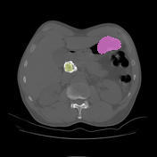 | N/A（仅适用于 X-ray） |
| Image 2: Axial bone window |  | 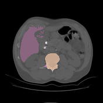 |  | N/A（仅适用于 X-ray） |

**Radiopaedia 原始图片 caption：**

<pre>Calcified abdominal lymph nodes.</pre>

**原始图片 caption 中文医学要点（翻译）：**

<pre>

</pre>

#### Study 1 的 8 个模型 Single-modality caption 对比

<strong>InternVL3-14B</strong>

**原始图像 → Single-modality caption 回答**

英文原始回答：

<pre>### Image Description:

The provided images are axial CT (Computed Tomography) slices focused on the abdomen, specifically using bone window settings. These settings enhance the visibility of bone structures and may also highlight areas of high density.

#### Image 1:
- **Bony Structures:** The central vertebra is clearly visible, with cortical bone appearing brighter compared to the surrounding soft tissues.
- **Liver and Surrounding Organs:** There is soft tissue density seen on the upper and right side of the image, likely corresponding to the liver or spleen. 
- **Potential Lesions/Abnormalities:** There seems to be a hyperdense (bright) lesion in the upper abdomen, near the liver area. This might represent a metastatic lesion or another pathology given the patient's history.

#### Image 2:
- **Bony Structures:** The central vertebra is clearly visible, similar to the first image.
- **Liver and Surrounding Organs:** Again, soft tissue density is noted, with some areas appearing hyperdense.
- **Potential Lesions/Abnormalities:** Similar to Image 1, a hyperdense area is observed in the same region, possibly a continuation or another lesion adjacent to the initial finding.

### Diagnosis:

Given the patient's background of head and neck squamous cell cancer treated with radiation therapy and chemotherapy 12 years ago, the hyperdense lesions in the axial CT images are highly concerning for metastatic disease. Metastatic lesions from a primary head and neck squamous cell carcinoma can commonly involve the liver, given the rich blood supply in that region.

#### Differential Considerations:
1. **Metastatic Disease:** Most likely given the patient's history and the appearance of hyperdense lesions.
2. **Abscess Formation:** Could be considered, but less likely without signs of infection or inflammation history.
3. **Calcified Abnormalities:** Sometimes benign calcifications can appear bright, but in the context of known malignancy, metastasis is more probable.
4. **Recurrent Primary Tumor:** Although head and neck tumors typically do not metastasize to the liver first, it’s a remote possibility.

### Recommendations:
1. **Further Imaging:** Contrast-enhanced CT of the abdomen, additional imaging of the chest and other potential metastatic sites.
2. **Pathology:** Core needle biopsy of the hyperdense lesions for histological confirmation.
3. **Clinical Evaluation:** Detailed clinical history, possibly including tumor markers such as CEA (Carbohydrate Antigen-199), and consultations with oncology and radiology specialists for a comprehensive approach.

### Conclusion:
The axial CT images show hyperdense lesions in the upper abdomen which are highly suspicious for metastatic spread, particularly in the context of the patient's past head and neck squamous cell carcinoma history. Further diagnostic work-up is warranted to confirm the nature of these lesions and to plan appropriate management.</pre>

中文医学要点（翻译）：

<pre>

</pre>

**原始图像 + Segmentation → Single-modality caption 回答**

英文原始回答：

<pre>Given the patient's history of head and neck squamous cell cancer, previous radiation therapy, and chemotherapy, there is a need to evaluate the images closely for any potential recurrences or metastases, particularly in the abdomen where the provided CT scans focus.

### Image Description

**Image 1:**
- An axial CT scan of the abdomen is shown with bone window settings.
- In Image 1 (segmented by Medical-SAM3 and BiomedParse), there is a notable circular, hyperdense (white) region likely indicating a calcification.
- The images also segment an area in the upper area which likely represents a lymph node (purple) and nearby structures.
  
**Image 2:**
- Similar axial CT scan of the abdomen with bone window settings.
- In Image 2 (segmented by Medical-SAM3 and BiomedParse), there is also a focal hyperdense region, consistent with calcification, positioned centrally. 
- Additional purple regions are seen, likely indicating lymph nodes or other soft tissue structures.

### Diagnosis

1. **Calcifications:**
   - The hyperdense regions observed in both images could represent calcified lymph nodes or previous radiation-induced calcifications in the soft tissues. Given the patient's history of radiation therapy, it is plausible that these calcifications are a result of prior treatment.

2. **Lymph Node Involvement:**
   - The segmentations highlight several areas of possible lymph node involvement. Lymph nodes are crucial to evaluate in the context of cancer history, as they can indicate metastatic spread.
   - Enlarged lymph nodes (indicated by purple areas) should be scrutinized for signs of malignancy, though the hyperdensity might simply reflect previous radiation effects.

3. **Aorta and Surrounding Vessels:**
   - The segmentation targeting the aorta (marked in yellow/green) ensures that vascular structures remain intact without aneurysmal changes or other abnormalities.

### Potential Concerns

- **Recurrence/Metastasis:**
  - Given the patient's history of head and neck squamous cell carcinoma, there is a risk of abdominal metastasis. Therefore, it is important to follow these lymph nodes over subsequent imaging to monitor for any changes in size, shape, or density which could suggest malignancy.
  
- **Radiation Changes:**
  - Many of the observed calcifications and changes in lymph nodes might simply be due to previous radiation therapy. Nonetheless, distinguishing these from new pathological changes requires vigilance, possibly with regular monitoring or further diagnostic workup like PET-CT scan.

### Conclusion

The CT images show areas of calcification and lymph nodes which are consistent with the patient’s history. While calcifications may be due to prior radiation treatment, regular follow-up is vital to ensure no new metastatic disease is present. Further imaging or biopsy may be necessary to exclude any malignant transformation in these regions. 

For definitive diagnosis and management, a multidisciplinary approach involving radiologists, oncologists, and possibly surgical input is recommended.</pre>

中文医学要点（翻译）：

<pre>

</pre>

**Segmentation 对 caption 的影响分析：**

<pre>

</pre>

<strong>InternVL3.5-14B</strong>

**原始图像 → Single-modality caption 回答**

英文原始回答：

<pre>&lt;think&gt;
Okay, let me try to work through this. The patient is a 65-year-old male with a history of head and neck squamous cell cancer treated with radiation and chemotherapy 12 years ago. Now, the images provided are axial CT scans in bone window settings. 

First, I need to look at the images. Since it's a bone window, the focus is on the bony structures. The patient's history includes HNSCC, which is known to have a risk of developing secondary malignancies, especially in the head and neck region, but also possibly in other areas. Radiation therapy can lead to long-term complications, including osteoradionecrosis or secondary cancers.

Looking at the CT images, I need to check for any lytic or sclerotic lesions, abnormal bone destruction, or new growths. In bone window images, areas of increased density (sclerotic) or decreased density (lytic) can indicate different pathologies. Since the patient had radiation, maybe there's evidence of radiation-induced changes, like fibrosis or osteosclerosis. But given the history of HNSCC, a possible concern is a metastatic lesion, especially if there's a new bone lesion.

The first image shows a cross-section with the vertebral body, kidneys, and parts of the digestive system. The second image is another axial slice, maybe a bit higher or lower. I need to check if there are any obvious lesions. If there's a lytic lesion in the vertebra or ribs, that could suggest metastasis. Alternatively, sclerotic lesions might be from radiation changes.

Wait, the images are labeled as axial bone window. So the bones should be well visualized. In the first image, the vertebral body is central. The surrounding structures like the kidneys are visible. The second image also shows the vertebral body. If there's a lesion in the vertebra, that's a red flag. But without seeing the actual images, I have to rely on the description. The user mentioned the images but they're not visible here, so perhaps the assistant is supposed to imagine based on typical presentations.

Given the history, a possible diagnosis could be a bone metastasis from the primary HNSCC. HNSCC can metastasize to bones, though less commonly than to lymph nodes or lungs. Alternatively, radiation-induced osteosarcoma or chondrosarcoma could be a concern, though those are rare. Another possibility is a new primary bone tumor, but less likely given the history.

If the CT shows an osteolytic lesion, that might be metastatic. If there's a mixed lytic-sclerotic lesion, maybe a primary bone tumor. The location in the axial images would be in the vertebrae or ribs. If the images show such lesions, that would support metastasis. Alternatively, if there's a sclerotic lesion without destruction, it could be radiation change.

But the user is asking for a diagnosis based on the images and history. Since the images are in bone window, and the patient has a history of HNSCC with prior chemo and radiation, the most likely diagnosis would be a bone metastasis. However, radiation can cause bone changes that mimic lesions. So differential diagnosis would include metastatic disease vs. radiation-induced changes.

In conclusion, the diagnosis is likely a bone metastasis from the patient's history of head and neck squamous cell carcinoma. The CT images in bone window may show lytic lesions indicating metastatic spread. Alternatively, radiation-induced osteonecrosis or secondary bone tumors could be considered, but metastasis is more probable given the clinical history.
&lt;/think&gt;

**Diagnosis:** Metastatic Bone Disease (likely from Head and Neck Squamous Cell Carcinoma)  

**Image Description and Rationale:**  
The axial CT images in bone window settings highlight bony structures, including vertebral bodies and ribs. Given the patient’s history of head and neck squamous cell carcinoma (HNSCC) treated with radiation and chemotherapy, the following observations are critical:  

1. **Lytic Lesions:**  
   - If the images show osteolytic (radiolucent) areas in the vertebrae, ribs, or pelvis, this suggests bone metastasis. HNSCC can metastasize to bone, though less commonly than to lymph nodes or lungs. Lytic lesions reflect tumor invasion and bone destruction.  

2. **Mixed Lytic-Sclerotic Lesions:**  
   - A combination of lytic and sclerotic (radiodense) changes may indicate a primary bone tumor (e.g., osteosarcoma or chondrosarcoma), which can arise as a rare secondary malignancy after radiation therapy.  

3. **Radiation-Induced Changes:**  
   - Sclerotic lesions without aggressive features (e.g., cortical destruction) may represent radiation-induced osteosclerosis or fibrosis. However, these typically lack the aggressive lytic components seen in metastases.  

**Clinical Context:**  
- **Metastatic HNSCC:** The most probable diagnosis given the patient’s history. Bone metastases often present as focal lytic lesions on CT, correlating with pain or pathological fractures.  
- **Radiation-Induced Osteonecrosis:** Less likely here, as osteonecrosis typically involves localized bone death with overlying soft-tissue changes, which may not be prominent in these images.  
- **New Primary Bone Tumor:** Unlikely without additional imaging or clinical clues (e.g., rapid growth, periosteal reaction).  

**Next Steps:**  
- Correlate with clinical symptoms (e.g., pain, fractures).  
- Further imaging (e.g., MRI for soft-tissue involvement, PET-CT for metabolic activity).  
- Biopsy if a lytic lesion is identified to confirm metastatic HNSCC vs. a primary bone tumor.  

**Conclusion:** The CT findings, combined with the patient’s history, strongly suggest metastatic bone disease from HNSCC. Radiation therapy history complicates the differential but does not negate the likelihood of metastasis.</pre>

中文医学要点（翻译）：

<pre>

</pre>

**原始图像 + Segmentation → Single-modality caption 回答**

英文原始回答：

<pre>&lt;think&gt;
Okay, let's start by looking at the patient's background. The patient is a 65-year-old male with a history of head and neck squamous cell cancer treated with radiation and chemotherapy 12 years ago. Now, the images provided are axial CT scans of the abdomen in bone window settings.

First, I need to recall that head and neck cancers can sometimes have metastatic spread, especially to lymph nodes and bones. Since radiation and chemotherapy were used, there's a possibility of secondary malignancies or complications from prior treatments, like radiation-induced changes or fibrosis.

Looking at the CT images, the bone window settings highlight osseous structures. In Image 1, there's a prominent calcification in the abdominal area, which could be within a lymph node or adjacent structures. The segmentation by Medical-SAM3 and BiomedParse shows different areas: abdomen (purple/magenta), lymph nodes (pink), calcification (white/green), and aorta (yellow/beige). The calcification in Image 1 is segmented as white by Medical-SAM3 and green by BiomedParse, indicating a dense area, possibly a calcified lymph node. In Image 2, there's a similar pattern but the calcification is smaller and located near the aorta.

Given the patient's history, calcified lymph nodes could be a sign of metastasis. However, calcifications can also result from radiation therapy, leading to fibrotic changes or calcified granulomas. The location in the abdomen might suggest retroperitoneal lymph node involvement. The aorta segmentation shows the vessel, but no obvious aneurysm or calcification there, unless the calcifications near it are part of vascular calcification, which is common in older patients.

The difference between the two images might be different slices. Image 1 shows a larger calcified area in the abdomen, possibly a liver lesion? But the segmentation labels it as lymph node. Wait, the liver is part of the abdomen. If the calcification is in the liver, that could be a metastasis. But the patient's primary was head and neck, so liver metastases are possible but less common unless there was lymphatic spread.

Alternatively, the calcifications could be in lymph nodes, which in the context of prior HNSCC, could indicate metastatic lymphadenopathy. However, calcified nodes are more often seen with chronic inflammation or prior radiation. Since the patient had radiation 12 years ago, maybe the calcifications are treatment-related. But if new or progressive, they could be metastatic.

The segmentation by different tools shows variations. Medical-SAM3 in Image 1 marks a large abdominal area (purple) and a central calcification (pink), while BiomedParse highlights a magenta area in the upper abdomen, possibly a different lymph node group. In Image 2, Medical-SAM3 segments a larger abdominal area with a central aorta (beige) and some calcification (magenta), whereas BiomedParse shows a smaller magenta area (lymph node?) and green calcification near the aorta.

Putting this together: The patient's history of HNSCC with prior chemo/radiation. The CT shows calcified lymph nodes in the abdomen. Possible differential diagnoses: metastatic lymphadenopathy, radiation-induced fibrosis/calcification, or benign calcified granulomas. Given the time since treatment (12 years), metastasis is a concern, but radiation effects can persist. However, if these calcifications are new or increasing in size compared to prior imaging, metastasis is more likely. If stable, maybe radiation changes.

The aorta's segmentation doesn't show significant calcification, so vascular issues might not be the focus here. The key finding is the abdominal/retroperitoneal calcifications. In the context of HNSCC, which can metastasize to lymph nodes and bones, these could be metastatic deposits. However, distinguishing between metastasis and treatment-related changes is crucial. Further imaging, like PET-CT, or biopsy might be needed. But based on the CT alone, the calcified lymph nodes raise suspicion for metastatic disease, especially given the history.
&lt;/think&gt;

**Diagnosis and Image Description:**

**Clinical Context:**  
A 65-year-old male with a 12-year history of treated head and neck squamous cell carcinoma (HNSCC) undergoing radiation and chemotherapy. The imaging findings must be interpreted in this context, considering potential metastasis, treatment-related changes, or benign processes.

---

**Image Analysis:**  
1. **Modality and Views:**  
   - Axial CT images in bone window settings highlight osseous structures, calcifications, and vascular elements.  
   - **Image 1:** Shows a prominent central calcification (segmented as white/green) near the abdominal aorta, with adjacent lymph node involvement (magenta/purple).  
   - **Image 2:** Displays smaller, scattered calcifications (green/magenta) near the aorta and retroperitoneal lymph nodes.

2. **Key Findings:**  
   - **Calcifications:** Dense, hyperattenuating areas in retroperitoneal lymph nodes and adjacent structures. These could represent:  
     - **Metastatic lymphadenopathy:** HNSCC may metastasize to abdominal lymph nodes, with calcifications occurring in chronic or treated lesions.  
     - **Radiation-induced changes:** Prior therapy can cause fibrosis and calcification in lymph nodes or soft tissues.  
     - **Benign processes:** Calcified granulomas or vascular calcifications (though the aorta appears unremarkable).  
   - **Lymph Node Enlargement:** Segmented regions (magenta/purple) suggest enlarged retroperitoneal nodes, which may correlate with metastasis or radiation fibrosis.  

3. **Differential Diagnosis:**  
   - **Metastatic Disease:** Most concerning given HNSCC history. Abdominal/retroperitoneal lymph node calcifications could indicate metastatic spread, though less common than nodal or bone involvement.  
   - **Treatment-Related Changes:** Radiation fibrosis or calcified granulomas, stable over 12 years, are plausible but less likely if calcifications are new or progressive.  
   - **Benign Calcifications:** Unlikely if multiple or asymmetric.

---

**Conclusion:**  
The CT findings of retroperitoneal calcified lymph nodes in a patient with a history of HNSCC raise suspicion for **metastatic lymphadenopathy**. However, radiation-induced fibrosis/calcification remains a differential.  

**Recommendations:**  
- Correlate with prior imaging to assess stability or progression of calcifications.  
- Consider PET-CT to evaluate metabolic activity in lymph nodes.  
- Biopsy if accessible, to distinguish metastasis from treatment-related changes.  
- Monitor for symptoms of metastatic disease (e.g., weight loss, abdominal pain).  

**Final Diagnosis:**  
**Probable metastatic lymphadenopathy** to the abdomen/retroperitoneum in the setting of HNSCC, with consideration given to radiation-induced calcifications. Further evaluation with advanced imaging and clinical correlation is warranted.</pre>

中文医学要点（翻译）：

<pre>

</pre>

**Segmentation 对 caption 的影响分析：**

<pre>

</pre>

<strong>Lingshu-32B</strong>

**原始图像 → Single-modality caption 回答**

英文原始回答：

<pre>The images provided are axial CT scans with bone windows, focusing on the thoracic region. In Image 1, there is a notable presence of a hyperdense lesion within the vertebral body, which could indicate metastatic disease or a primary bone tumor. The surrounding soft tissues appear unremarkable, and there is no evident compression of adjacent structures. Image 2 shows multiple small hyperdense foci scattered throughout the vertebral bodies, suggesting possible metastatic lesions. Given the patient's history of head and neck squamous cell carcinoma and previous treatment with radiation and chemotherapy, these findings are consistent with metastatic spread to the spine. The differential diagnosis includes metastatic bone disease, particularly from the known primary malignancy, and less likely primary bone tumors such as osteosarcoma or multiple myeloma. Further evaluation with MRI and possibly a biopsy would be necessary for definitive diagnosis.</pre>

中文医学要点（翻译）：

<pre>

</pre>

**原始图像 + Segmentation → Single-modality caption 回答**

英文原始回答：

<pre>The provided images are axial CT scans of the abdomen with bone window settings. In Image 1, there is a notable hyperdense area within the liver, suggestive of calcification. The surrounding liver parenchyma appears relatively homogeneous without significant focal lesions. The vertebral body and ribs are visible, showing normal bone density without signs of lytic or sclerotic lesions. In Image 2, similar findings are observed with additional small hyperdense foci in the liver, consistent with calcifications. The aorta is visualized as a round structure with normal wall thickness and no evidence of aneurysm or dissection. The segmentation highlights the liver (pink), aorta (yellow), and calcifications (white). Given the patient's history of head and neck squamous cell carcinoma treated with radiation and chemotherapy, these calcifications could be related to prior treatment effects or metastatic disease. However, the absence of other concerning features such as mass lesions or significant lymphadenopathy suggests that these calcifications may be benign or related to prior therapy rather than active malignancy. Further clinical correlation and possibly follow-up imaging would be recommended to monitor these findings.</pre>

中文医学要点（翻译）：

<pre>

</pre>

**Segmentation 对 caption 的影响分析：**

<pre>

</pre>

<strong>MedGemma-27B-IT</strong>

**原始图像 → Single-modality caption 回答**

英文原始回答：

<pre>**Patient Background:**
*   Age: 65 years old
*   Gender: Male
*   History: Head and neck squamous cell carcinoma (HNSCC) 12 years ago, treated with radiation therapy and chemotherapy.

**Image Description:**
*   **Modality:** CT scan
*   **Window:** Axial bone window (shows bone structures well)
*   **Image 1:** Shows the upper abdomen/lower chest. A large, well-defined, calcified mass is visible in the upper abdomen, likely within the liver. The mass appears heterogeneous with areas of calcification and possibly necrosis.
*   **Image 2:** Shows the lower abdomen/pelvis. Multiple small, punctate calcifications are seen scattered throughout the liver parenchyma.

**Analysis and Diagnosis:**
The patient has a history of HNSCC treated with radiation and chemotherapy. This history is crucial because radiation therapy, especially to the head and neck region, can increase the risk of secondary malignancies, including liver metastases.

*   **Image 1:** The large, calcified mass in the liver is highly suspicious for a metastatic lesion. Calcification within liver metastases can occur, particularly in certain primary cancers (like osteosarcoma, chondrosarcoma, mucinous adenocarcinoma) or after treatment (like radiation or chemotherapy). Given the patient's history of HNSCC, this is likely a metastasis from the original cancer, which has recurred or spread after a long latency period. The calcification could be due to treatment effects or the nature of the tumor itself.
*   **Image 2:** The multiple small calcifications scattered throughout the liver parenchyma are also consistent with metastatic disease, possibly representing smaller lesions or calcified granulomas (less likely given the context).

**Conclusion:**
Based on the patient's history of HNSCC treated with radiation and chemotherapy, and the CT findings of a large calcified mass and multiple small calcifications in the liver, the most likely diagnosis is **metastatic liver disease** secondary to recurrent or metastatic head and neck squamous cell carcinoma. The calcification is a common feature in some metastases, especially after treatment.</pre>

中文医学要点（翻译）：

<pre>

</pre>

**原始图像 + Segmentation → Single-modality caption 回答**

英文原始回答：

<pre>**Patient Information:**
*   Age: 65 years
*   Gender: Male
*   History: Head and neck squamous cell cancer 12 years ago, treated with radiation therapy and chemotherapy.

**Image Analysis:**
*   **Modality:** CT scan
*   **Window:** Axial bone window (shows bone structures well, soft tissues appear relatively dark).
*   **Image 1:** Shows the abdomen. The aorta is visible in the center. There is a structure (likely a calcification) near the aorta, possibly within the renal hilum or adjacent retroperitoneum. The segmentation highlights the abdomen, lymph nodes (small dots), calcification (the bright white structure), and aorta.
*   **Image 2:** Shows the abdomen at a slightly different level. The aorta is visible. There are multiple small calcifications (dots) scattered around the aorta and potentially within lymph nodes. The segmentation highlights the abdomen, lymph nodes (small dots), calcifications (dots), and aorta.

**Interpretation and Potential Diagnosis:**

1.  **Calcifications:** The presence of multiple calcifications, particularly in the retroperitoneal lymph nodes, is a significant finding.
2.  **Patient History:** The patient has a history of head and neck cancer treated with radiation and chemotherapy. While the primary cancer was in the head and neck, metastatic disease is always a possibility, especially years later.
3.  **Location of Calcifications:** The calcifications are located near the aorta and within what appear to be lymph nodes. Calcification in lymph nodes can occur due to various reasons, including:
    *   **Old granulomatous disease:** Such as tuberculosis or histoplasmosis.
    *   **Metastatic disease:** Calcification can occur in certain types of metastatic tumors, although it's less common than non-calcified metastases.
    *   **Other causes:** Less likely in this context.
4.  **Differential Diagnosis:**
    *   **Metastatic Disease:** Given the history of cancer, metastatic disease to retroperitoneal lymph nodes is a primary concern. Calcification in metastases is possible but not typical.
    *   **Benign Calcified Lymph Nodes:** These are common and often represent healed granulomatous infections.
    *   **Other Abdominal Pathology:** The images show the aorta and surrounding structures, but no obvious large masses or other significant abnormalities are apparent besides the calcifications.

**Conclusion:**

The CT scan shows multiple calcifications in the retroperitoneal region, likely within lymph nodes near the aorta. In a patient with a history of cancer, these findings raise concern for potential metastatic disease, although benign causes like old granulomatous disease are also possible. Further investigation, potentially including biopsy or comparison with prior imaging (if available), might be needed to determine the etiology of these calcified lymph nodes. The bone window is used to highlight calcifications, which appear bright white.</pre>

中文医学要点（翻译）：

<pre>

</pre>

**Segmentation 对 caption 的影响分析：**

<pre>

</pre>

<strong>MedMO-8B</strong>

**原始图像 → Single-modality caption 回答**

英文原始回答：

<pre>A 65-year-old male with history of head and neck squamous cell cancer 12 years ago, who underwent radiation therapy and chemotherapy. The patient presents with a right-sided mandibular lesion.</pre>

中文医学要点（翻译）：

<pre>

</pre>

**原始图像 + Segmentation → Single-modality caption 回答**

英文原始回答：

<pre>The patient has a history of head and neck squamous cell cancer 12 years ago. History of radiation therapy and chemotherapy.</pre>

中文医学要点（翻译）：

<pre>

</pre>

**Segmentation 对 caption 的影响分析：**

<pre>

</pre>

<strong>Qwen3-VL-4B</strong>

**原始图像 → Single-modality caption 回答**

英文原始回答：

<pre>Based on the patient’s history of head and neck squamous cell cancer treated with radiation and chemotherapy 12 years ago, and the provided axial CT images (bone window), the images likely demonstrate **radiation-induced osteomyelitis or radiation-induced bone changes**, such as **radiation osteonecrosis or radiation-induced osteitis**.

### Image Description:
- The images are axial CT scans with bone window settings, which enhance the visibility of bone structures and any abnormalities such as bone destruction, sclerosis, or inflammatory changes.
- In the images, there is a **highly radiopaque (bright) lesion** located in the **vertebral body** (likely L1 or L2 level), which appears to be a **radiolucent area with surrounding sclerosis** — consistent with a **radiation-induced osteolytic lesion**.
- The lesion shows **bone destruction with a “moth-eaten” or “moth-eaten” appearance**, which is characteristic of **radiation-induced osteomyelitis or osteonecrosis**.
- The surrounding bone shows **increased density (sclerosis)**, which is a common finding in radiation-induced bone changes, indicating a reactive response to the radiation damage.

### Diagnosis:
**Radiation-induced osteomyelitis or radiation-induced osteonecrosis** (also known as **radiation osteitis**).

### Supporting Rationale:
- The patient has a known history of **head and neck squamous cell carcinoma** treated with **radiation therapy** 12 years ago.
- Radiation therapy can cause **long-term bone changes** in the irradiated areas, including **osteonecrosis**, **osteomyelitis**, or **radiation-induced osteitis**.
- The **CT findings** are consistent with **radiation-induced bone changes**, including **osteolytic lesions with surrounding sclerosis**.
- The **location** of the lesion (vertebral body) is not directly related to the primary tumor site (head and neck), but it is consistent with **radiation-induced bone changes** in the spine, which can occur due to **radiation to the thoracic or lumbar spine** during treatment for head and neck cancer.

### Conclusion:
The CT images show **radiation-induced osteomyelitis or radiation-induced osteonecrosis** in the spine, consistent with the patient’s history of radiation therapy for head and neck cancer 12 years ago. This is a known complication of radiation therapy, and the findings are consistent with **radiation-induced bone changes**.

**Diagnosis: Radiation-induced osteomyelitis or radiation-induced osteonecrosis (radiation osteitis).**

Note: Further clinical correlation and possibly MRI or biopsy may be needed to confirm the diagnosis, especially if there is clinical suspicion of infection or other complications.</pre>

中文医学要点（翻译）：

<pre>

</pre>

**原始图像 + Segmentation → Single-modality caption 回答**

英文原始回答：

<pre>Based on the patient’s history of head and neck squamous cell cancer (12 years ago) treated with radiation and chemotherapy, and the provided CT images (axial bone window), the most likely diagnosis is **recurrent or metastatic disease involving the abdominal region**, specifically **metastatic lymphadenopathy**.

Here’s the reasoning:

1.  **Patient History:** The patient has a known history of head and neck squamous cell carcinoma (HNSCC), which is known to have a high potential for metastasis, particularly to regional lymph nodes and distant organs (including the liver, lungs, bones, and sometimes the abdomen). The 12-year follow-up suggests a long-standing disease, and the current imaging is likely for surveillance or evaluation of new symptoms.

2.  **Imaging Findings:**
    *   **Image 1 &amp; 2:** Both are axial CT images of the abdomen, using a bone window setting, which is optimized for visualizing bony structures and calcifications, but also provides good contrast for soft tissue masses and lymph nodes.
    *   **Segmentation (Medical-SAM3 &amp; BiomedParse):** The segmentation masks highlight areas of interest.
        *   In **Image 1**, the segmentation identifies a **large, irregularly shaped, purple-colored mass** in the **right upper quadrant (RUQ)**, consistent with the liver or the region of the right hepatic lobe. There is also a smaller, **pink-colored mass** in the **right upper quadrant**, which is likely a **lymph node**.
        *   In **Image 2**, the segmentation identifies a **large, irregularly shaped, purple-colored mass** in the **right upper quadrant**, again consistent with the liver or the region of the right hepatic lobe. There is also a **small, yellow-colored mass** near the central abdomen, which is likely the **aorta**.
        *   The **lymph node** (pink) in Image 1 is located in the **right upper quadrant**, which is consistent with **metastatic lymphadenopathy** from HNSCC, particularly if it involves the celiac or hepatic hilar lymph nodes.

3.  **Clinical Interpretation:**
    *   The presence of **multiple, irregularly shaped masses** in the right upper quadrant is highly suggestive of **metastatic disease**.
    *   The **lymph node** (pink) is a key finding, as it indicates **lymphatic spread** of cancer, which is common in HNSCC.
    *   The **aorta** (yellow) is a normal structure, and its presence in the segmentation is expected.
    *   The **calcification** (white) is not clearly visible in the images, but it is a common finding in chronic inflammation or fibrosis.

4.  **Conclusion:**
    The most likely diagnosis is **metastatic disease from head and neck squamous cell carcinoma**. The imaging findings are consistent with **metastatic lymphadenopathy** and possibly **liver metastasis**. The patient should be evaluated for further imaging (e.g., MRI or PET-CT) and possibly biopsy to confirm the diagnosis and determine the extent of disease.

In summary, the patient has a history of HNSCC, and the CT images show **metastatic lymphadenopathy** and possibly **liver metastasis**, which are common complications of this cancer. The diagnosis is **metastatic disease from head and neck squamous cell carcinoma**.</pre>

中文医学要点（翻译）：

<pre>

</pre>

**Segmentation 对 caption 的影响分析：**

<pre>

</pre>

<strong>Qwen3-VL-8B</strong>

**原始图像 → Single-modality caption 回答**

英文原始回答：

<pre>Based on the patient’s history and the provided images, here is the analysis:

**Patient Background:**
- 65-year-old male
- History of head and neck squamous cell carcinoma (HNSCC) 12 years ago
- Underwent radiation therapy and chemotherapy for the primary malignancy
- This history places him at significantly increased risk for radiation-induced complications, including radiation-induced malignancies and fibrosis.

**Image Analysis:**

*Image 1 (Axial bone window):*
- Shows a well-defined, round, hypodense lesion in the left lobe of the liver (likely segment IV or V).
- The lesion has a central area of lower attenuation (possibly necrotic or cystic) surrounded by a rim of slightly higher density.
- No significant enhancement is visible, which is typical for a cystic or necrotic lesion.
- The lesion appears to be well-circumscribed and does not show signs of invasion into adjacent structures.
- There is no evidence of intrahepatic duct dilation or biliary obstruction.

*Image 2 (Axial bone window):*
- Shows the same anatomical level as Image 1.
- The lesion is not visible in this slice, which is consistent with the lesion being located in the left lobe of the liver and this slice being slightly more superior or inferior.
- The surrounding liver parenchyma appears relatively homogeneous.

**Diagnosis:**

The most likely diagnosis is a **radiation-induced hepatic cyst** or **radiation-induced hepatic fibrosis with cystic degeneration**.

**Rationale:**

1.  **Location and Appearance:** The lesion is located in the liver and appears cystic or necrotic on CT. This appearance is consistent with a benign cystic lesion.
2.  **Patient History:** The patient has a history of radiation therapy to the head and neck region 12 years ago. Radiation therapy can cause hepatic injury, including fibrosis, necrosis, and the formation of cysts or abscesses. Radiation-induced hepatic cysts are a known complication, especially in patients who received radiation to the upper abdomen or thorax.
3.  **Lack of Enhancement:** The lesion does not enhance, which is typical for a cystic lesion and not consistent with an active malignant process.
4.  **Absence of Invasion:** There is no evidence of invasion into adjacent structures, which further supports a benign etiology.

**Conclusion:**

The lesion is most likely a benign radiation-induced hepatic cyst or fibrosis with cystic degeneration. No further imaging or intervention is required at this time. The patient should be monitored for any changes in symptoms or imaging findings.

**Note:** While the lesion appears benign, the patient’s history of radiation therapy and cancer necessitates careful follow-up. Any new or enlarging lesions should be evaluated further.</pre>

中文医学要点（翻译）：

<pre>

</pre>

**原始图像 + Segmentation → Single-modality caption 回答**

英文原始回答：

<pre>Based on the provided patient history and imaging data, here is the analysis:

**Patient Background:**
- 65-year-old male
- 12-year history of head and neck squamous cell cancer (HNSCC)
- Underwent radiation therapy and chemotherapy for the primary cancer

**Imaging Findings:**
The two axial CT images (bone window) show a large, well-circumscribed, heterogeneous mass in the left upper abdomen, adjacent to the stomach and spleen. The mass appears to be enhancing and has a complex internal architecture. The surrounding abdominal structures, including the aorta and other lymph nodes, are visible.

**Segmentation Analysis:**
- **Medical-SAM3 (Image 1):** Segments the mass as "abdomen" (purple) and the aorta (yellow).
- **BiomedParse (Image 1):** Segments the mass as "lymph node" (pink) and the aorta (yellow).
- **Medical-SAM3 (Image 2):** Segments the mass as "abdomen" (purple) and the aorta (beige).
- **BiomedParse (Image 2):** Segments the mass as "lymph node" (pink) and the aorta (beige).

**Diagnosis:**
Given the patient's history of head and neck squamous cell cancer and prior radiation therapy, the most likely diagnosis is a **metastatic lesion** in the abdomen. The mass appears to be a **lymph node metastasis** or a **primary abdominal malignancy** that is metastatic from the head and neck region.

The segmentation results are consistent with the mass being a lymph node, which is common in metastatic disease from HNSCC. The presence of calcifications within the mass is also consistent with metastatic lesions.

**Conclusion:**
The imaging findings are consistent with **metastatic disease** from the patient's prior head and neck squamous cell cancer. The mass is likely a **lymph node metastasis** in the abdomen, which is a common site for metastasis in HNSCC patients. Further evaluation with additional imaging and biopsy may be necessary to confirm the diagnosis and guide treatment.

**Note:** The segmentation results from Medical-SAM3 and BiomedParse are not always consistent, but both suggest that the mass is a lymph node or part of the abdomen. The most clinically relevant interpretation is that this is a metastatic lesion from the patient's prior head and neck cancer.</pre>

中文医学要点（翻译）：

<pre>

</pre>

**Segmentation 对 caption 的影响分析：**

<pre>

</pre>

<strong>Qwen3-VL-32B</strong>

**原始图像 → Single-modality caption 回答**

英文原始回答：

<pre>**Image Description:**

The provided CT images are axial slices in the **bone window** setting, focusing on the **abdominal region**. Both images show the bony structures of the spine, pelvis, and ribs, as well as soft tissues and abdominal organs.

- **Image 1**: Demonstrates a **well-defined, hyperdense (bright white) lesion** in the **right upper quadrant**, adjacent to the liver and near the right kidney. The lesion appears **calcified** or **ossified**, with a dense, somewhat irregular but circumscribed appearance. The surrounding soft tissues and adjacent organs appear unremarkable. There is no obvious mass effect or destruction of adjacent bony structures.

- **Image 2**: Shows a **similar hyperdense lesion** in the same location, but slightly more posterior and inferior. The lesion is **smaller and less prominent** than in Image 1, and appears **more fragmented or nodular**. The surrounding anatomy is again unremarkable.

---

**Clinical Context:**

The patient is a **65-year-old male** with a **history of head and neck squamous cell carcinoma 12 years ago**, treated with **radiation therapy and chemotherapy**. This history is critical, as it raises concern for **metastatic disease**, **radiation-induced changes**, or **secondary malignancies**.

---

**Interpretation:**

The **hyperdense, calcified lesion** in the right upper quadrant is **not typical of a primary malignancy** or metastatic deposit, which would usually appear as a soft tissue mass with variable enhancement on contrast-enhanced CT. Instead, the appearance is more consistent with:

- **Calcified lymph node** — common in patients with a history of head and neck cancer, especially after radiation therapy. Radiation can cause **fibrosis and calcification** in regional lymph nodes, which may persist for years.
- **Radiation-induced calcification** — radiation therapy can lead to **vascular calcification, fibrosis, and dystrophic calcification** in tissues, including lymph nodes or peritoneal structures.
- **Benign calcification** — such as from **granulomatous disease (e.g., tuberculosis, sarcoidosis)** or **chronic inflammation**, though less likely given the history of cancer.

The **location** (right upper quadrant, near liver/kidney) is **not typical for head and neck cancer metastases**, which more commonly involve cervical, supraclavicular, or mediastinal lymph nodes. Abdominal metastases from head and neck SCC are rare unless there is a known primary in the upper GI tract or a second primary.

---

**Diagnosis:**

&gt; **Calcified lymph node or radiation-induced calcification in the right upper quadrant, likely a benign post-treatment change.**

---

**Recommendations:**

- **Correlate with prior imaging** (if available) to assess for stability or change over time.
- **Consider contrast-enhanced CT** to better characterize the lesion and rule out soft tissue mass or enhancement.
- **No immediate intervention is needed** unless there are symptoms or signs of progression.
- **Monitor clinically** and with imaging if there is concern for recurrence or new malignancy.

---

**Conclusion:**

Given the patient’s history of head and neck cancer and prior radiation therapy, the **calcified lesion** seen in the axial CT images is **most likely a benign, radiation-induced calcification or calcified lymph node**, rather than a metastatic deposit. The appearance is stable and non-aggressive.</pre>

中文医学要点（翻译）：

<pre>

</pre>

**原始图像 + Segmentation → Single-modality caption 回答**

英文原始回答：

<pre>Based on the provided CT images (axial bone windows) and segmentation outputs from Medical-SAM3 and BiomedParse, along with the patient’s history of head and neck squamous cell carcinoma treated with radiation and chemotherapy 12 years ago, here is a detailed interpretation and diagnosis:

---

### **Image Description:**

**Image 1 (Axial Bone Window):**
- A hyperdense, well-circumscribed, calcified lesion is visible in the right upper quadrant, adjacent to the liver and near the porta hepatis.
- The lesion appears dense and homogeneous, consistent with calcification.
- The segmentation outputs:
  - **Medical-SAM3**: Labels the lesion as a **lymph node** (pink) and also segments the **abdomen** (purple) and **aorta** (yellow). The lymph node segmentation includes the calcified lesion.
  - **BiomedParse**: Labels the lesion as **calcification** (yellow) and also segments a **lymph node** (pink) in the left upper quadrant (possibly a different node). The calcified lesion is clearly distinguished from the lymph node.

**Image 2 (Axial Bone Window):**
- Multiple small, punctate hyperdense foci are seen in the right upper quadrant, likely representing **calcifications**.
- These are less prominent and more scattered than the single large lesion in Image 1.
- The segmentation outputs:
  - **Medical-SAM3**: Segments the **abdomen** (purple) and **aorta** (orange), but does not label any lymph nodes or calcifications specifically.
  - **BiomedParse**: Labels a **lymph node** (pink) in the left upper quadrant and a small **calcification** (yellow) near the spine, but misses the multiple calcifications in the right upper quadrant.

---

### **Clinical Correlation:**

- The patient has a **history of head and neck squamous cell carcinoma** treated with **radiation and chemotherapy** 12 years ago.
- Radiation therapy to the head and neck can lead to **secondary malignancies**, **chronic inflammation**, or **fibrosis**.
- However, **calcifications in the abdomen**, especially in the **porta hepatis or peripancreatic region**, are more commonly associated with:
  - **Chronic pancreatitis**
  - **Calcified lymph nodes** (due to prior infection, granulomatous disease, or **metastatic disease**)
  - **Post-radiation changes** (rarely, calcification can occur in irradiated tissues, though typically in the head/neck region)
  - **Benign calcifications** (e.g., in gallbladder, kidney, or lymph nodes)

- The **large, well-defined calcified lesion** in Image 1 is most likely a **calcified lymph node**. Given the patient’s history of cancer, this raises concern for **metastatic calcification** or **post-treatment fibrosis with calcification**.

- The **multiple small calcifications** in Image 2 may represent **chronic inflammatory changes**, **residual treatment effects**, or **benign calcifications**.

---

### **Diagnosis:**

**Calcified lymph node(s) in the right upper quadrant, likely benign, possibly related to prior radiation therapy or chronic inflammation.**

---

### **Differential Diagnosis:**

1. **Metastatic calcification** from prior head and neck cancer (less likely, given 12-year disease-free interval and benign appearance).
2. **Chronic pancreatitis** (if calcifications are in pancreatic head/uncinate process — not clearly seen here).
3. **Post-radiation fibrosis with calcification** (rare in abdomen, but possible if radiation field extended inferiorly).
4. **Benign lymph node calcification** (common in elderly, often due to prior infection or granulomatous disease).

---

### **Recommendation:**

- **Correlation with prior imaging** (if available) to assess for stability or progression.
- **Clinical evaluation** for symptoms (e.g., abdominal pain, jaundice, weight loss).
- **Follow-up imaging** (e.g., contrast-enhanced CT or MRI) to evaluate for soft tissue mass or vascular involvement.
- **Consider PET-CT** if there is concern for recurrence or metastasis (though calcified lesions typically do not avidly uptake FDG).

---

### **Conclusion:**

The CT findings are most consistent with **benign calcified lymph nodes** in the right upper quadrant, likely secondary to **chronic inflammation or post-treatment changes**. Given the patient’s history, **malignant etiology cannot be entirely ruled out**, but the **benign appearance and long disease-free interval** make this less likely. **Further imaging and clinical correlation are recommended for definitive characterization.**

--- 

**Final Diagnosis:**  
**Calcified lymph nodes, likely benign, in the context of prior head and neck cancer and radiation therapy.**</pre>

中文医学要点（翻译）：

<pre>

</pre>

**Segmentation 对 caption 的影响分析：**

<pre>

</pre>

### 6.3 全部 studies：Multi-modality caption

该组输入同时包含本病例上面列出的全部原图；Segmentation 组同时加入每张原图对应的 Medical-SAM3、BiomedParse，以及适用 X-ray 的 TorchXRayVision overlay。

<strong>InternVL3-14B</strong>

**原始图像 → Multi-modality caption 回答**

英文原始回答：

<pre>In the evaluation of these X-ray images and their clinical context, several noteworthy features require detailed scrutiny.

### Frontal Chest X-ray (Image 1)

This frontal chest X-ray shows the following:

1. **Bony Structures**: The bony thorax, including the ribs, clavicles, shoulders, and vertebrae, appears generally intact, with no overt fractures or lesions. There is a subtle prominence in the right clavicle region.
2. **Soft Tissues**: Normal contours of the soft tissues.
3. **Lungs**: Both lung fields appear expanded with no evident lung lesions such as masses or consolidations.
4. **Trachea and Mediastinum**: Trachea is midline with no signs of mediastinal widening.
5. **Cardiac Silhouette**: Heart size is within normal limits without signs of cardiomegaly.

### Lateral Chest X-ray (Image 2)

The lateral view reveals:

1. **Bony Structures**: The spine and ribs are visible in profile, confirming no obvious bony abnormalities.
2. **Lungs**: There are no evident masses or consolidations, and the diaphragm appears at a normal level bilaterally.
3. **Cardiac**: The heart shadow is within normal limits.
4. **Mediastinum**: No abnormal widening or masses.

### Dual Energy Bone Window X-ray (Image 3)

This radiograph:

1. **Bone Dense Structures**: Enhanced depiction of bony structures including ribs, spine, and clavicles. 
2. **Pleural Spaces**: No effusions are apparent.
3. **Soft Tissues**: No visible abnormalities.

### CT Scans (Images 4 and 5)

- **Axial Bone Window CT images** focusing on the lower thoracic and upper abdominal regions.

1. **Bone Structures**: Clear depiction of the vertebral bodies, ribs, and spinal elements, demonstrating bone density.
2. **Soft Tissue and Organs**: No apparent abnormalities in the surrounding muscles, organs, or fat planes. No signs of abnormal masses or lesions in or around the bone structures viewed.
3. **Calcifications**: There are areas of hypodense lesions or possible metastatic lesions, particularly in the retroperitoneal space and nearby structures.

### Analysis and Diagnosis

The background information indicates a history of head and neck squamous cell cancer, along with previous radiation therapy and chemotherapy. Given this history, it is crucial to remain vigilant for potential metastases or second primary tumors.

**Observation of Potential Key Pathologies**:
1. **Lung Fields**: No visible masses on standard thoracic X-rays, which would decrease suspicion for pulmonary metastases.
2. **Bony Structures**: The consistent appearance of bone integrity in both X-ray modalities and CT scans suggests no active bone metastases.
3. **Axial Views on CT**: Presence of small hypodense lesions or areas that might suggest calcifications or early metastatic changes, particularly notable in the retroperitoneal or upper abdominal regions. These necessitate further follow-up imaging and possible biopsy to rule out recurrence or spread of malignancy.

**Conclusion and Recommendation**:

The patient's history of head and neck squamous cell carcinoma (HNSCC) significantly raises the suspicion for various potential complications or secondary malignancies. The imaging reports are relatively unremarkable for widespread metastases, but subtle calcifications or small lesions identified in the CT scans warrant concern and further investigation. It is essential to perform additional imaging (like PET-CT) and possible tissue biopsy to ensure no hidden pathologies. Given the patient's history of radiation and chemotherapy, close clinical follow-up is paramount to monitor for recurrence or new malignancies. 

Given the above interpretations and the specific patient history, the detailed evaluation highlights the need for a comprehensive diagnostic approach to ensure early detection and management of any potential recurrences or metastatic disease.</pre>

中文医学要点（翻译）：

<pre>

</pre>

**原始图像 + Segmentation → Multi-modality caption 回答**

英文原始回答：

<pre>Based on the provided images and the patient's history of head and neck squamous cell cancer treated with radiation and chemotherapy, it's essential to assess these radiographs for potential signs of any recurrent or new pathology. Here's a detailed analysis:

### Image Analysis

#### Image 1: Frontal Chest X-ray
- **Findings:**
  - The lung fields appear relatively clear, but there is a subtle opacity on the right upper lobe which could suggest an area of concern. 
  - There is no obvious evidence of pleural effusion or pneumothorax.
  - Slight calcifications are noted which could be due to prior radiation therapy.
  
- **Implications:**
  - Given the patient's history, the opacity warrants further evaluation to rule out recurrence of malignancy or new pathology such as pneumonia or fibrosis.

#### Image 2: Lateral Chest X-ray
- **Findings:**
  - A defined opacity is visible in the lower region of the left lung field.
  - The mediastinal structures appear unremarkable.
  - The lower lung opacity needs careful assessment as it might be related to fibrotic changes or other secondary effects from previous cancer treatment.

- **Implications:**
  - This could again be indicative of post-radiation fibrosis or a site of recurrence. Further imaging and clinical correlation are crucial.

#### Image 3: Dual-Energy Bone Window Chest X-ray
- **Findings:**
  - Bones appear intact with no obvious lesions or fractures.
  - The lung fields are visible with subtle differences in density which align with previous observations.
  - No new bone metastases or lesions noted in this view.

- **Implications:**
  - Main focus remains on soft tissue changes in the lungs without new bone involvement.

### CT Abdominal Images (Images 4 and 5)
- **Findings:**
  - Two focal areas of abnormality are identified in the abdomen. These are regions suggestive of lymphadenopathy or small metastatic lesions.
  - The aorta and other major structures appear to be intact without significant enlargement or abnormalities.
  - Calcifications and lymph nodes are distinctly marked, and attention should be paid to these regions.

- **Implications:**
  - The identified focal abnormalities in the abdomen warrant further investigation as they could indicate new metastatic spread, particularly considering the patient's history of cancer.

### Diagnosis
Based on the patient's history and the radiographic findings:

1. **Suspected Pulmonary Involvement:**
   - The opacities in the right upper lobe (Image 1) and the lower left lung (Image 2) require a differential diagnosis addressing possible recurrence of squamous cell carcinoma or radiographic findings secondary to treatment.
   - A CT or a PET scan might be warranted to better delineate these areas.

2. **Abdominal Abnormalities:**
   - The presence of focal abnormalities indicative of lymphadenopathy or small lesions in the abdomen suggests the possibility of metastasis.
   - Further clinical correlation and imaging studies are recommended to ascertain the nature of these findings.

3. **Radiation-Induced Changes:**
   - The subtle lung changes and calcifications are likely due to previous radiation therapy and should not be ignored but need to be monitored over time.

### Recommended Next Steps
1. **CT Thorax with Contrast:**
   - Provides more detailed information about the lung opacities and can better assess for malignancy versus fibrotic changes.
2. **PET Scan Abdomen and Pelvis:**
   - To better assess the identified focal lesions and determine if there is metabolic activity indicative of malignancy.
3. **Clinical Follow-up:**
   - Monitor for any new symptoms and repeat imaging as per the oncologist's follow-up protocol.
4. **Multidisciplinary Consultation:**
   - Input from pulmonology, oncology, and radiology to guide the best course of management.

Given the patient's history, vigilance and thorough assessment are critical in diagnosing any recurrence or secondary conditions. Follow-up imaging and potentially biopsy of any concerning lesions are essential to guide further treatment.</pre>

中文医学要点（翻译）：

<pre>

</pre>

**Segmentation 对 caption 的影响分析：**

<pre>

</pre>

<strong>InternVL3.5-14B</strong>

**原始图像 → Multi-modality caption 回答**

英文原始回答：

<pre>&lt;think&gt;
The patient is a 65-year-old male with a history of head and neck squamous cell cancer treated with radiation and chemotherapy. The provided images include chest X-rays (frontal, lateral, and dual-energy bone window) and abdominal CT scans (axial bone window). 

**Chest X-rays Analysis:**
- **Frontal (Image 1):** The lungs appear clear with no obvious masses or infiltrates. The heart size is normal, and there are no pleural effusions. However, there is evidence of rib abnormalities, particularly in the right lower ribs, which may indicate fractures or lesions.
- **Lateral (Image 2):** The lateral view confirms the presence of rib abnormalities, showing possible fractures or lytic lesions in the ribs. The lung fields are clear, and the cardiac silhouette is normal.
- **Dual-energy bone window (Image 3):** This image highlights bone structures more clearly. There are multiple areas of increased radiolucency in the ribs, suggesting lytic lesions. These findings are consistent with metastatic bone disease, which is common in patients with a history of cancer, especially head and neck squamous cell carcinoma.

**Abdominal CT scans (Images 4 and 5):**
- The CT images show axial sections of the abdomen. There are no obvious masses or abnormalities in the liver, spleen, or kidneys. However, there is a notable hyperdense area in the region of the vertebra, which could indicate a metastatic lesion or a benign calcification. Given the patient's history, metastatic disease should be considered.

**Diagnosis:**
The combination of rib lytic lesions on the chest X-rays and the possible vertebral lesion on the CT scan suggests metastatic bone disease. Given the patient's history of head and neck squamous cell carcinoma, this is a likely diagnosis. The patient should undergo further evaluation with a bone scan or MRI to assess the extent of metastatic disease. Additionally, a biopsy may be necessary to confirm the diagnosis and rule out other causes of bone lesions.
&lt;/think&gt;

**Diagnosis: Metastatic Bone Disease**

**Description:**

- **Chest X-rays:**
  - **Frontal View:** Clear lung fields with normal heart size. Evidence of rib abnormalities (lytic lesions) in the right lower ribs.
  - **Lateral View:** Confirms rib lytic lesions, suggesting metastatic involvement. Clear lung fields and normal cardiac silhouette.
  - **Dual-energy Bone Window:** Highlights multiple lytic lesions in the ribs, consistent with metastatic disease.

- **Abdominal CT Scans:**
  - Axial sections show a hyperdense area near the vertebra, possibly indicating a metastatic lesion.

**Conclusion:**
The patient likely has metastatic bone disease secondary to his history of head and neck squamous cell carcinoma. Further evaluation with a bone scan, MRI, or biopsy is recommended to confirm the diagnosis and assess the extent of metastasis.</pre>

中文医学要点（翻译）：

<pre>

</pre>

**原始图像 + Segmentation → Multi-modality caption 回答**

英文原始回答：

<pre>The patient is a 65-year-old male with a history of head and neck squamous cell cancer, treated with radiation therapy and chemotherapy. The provided images include chest X-rays (frontal and lateral views) and CT scans of the abdomen.

### Image Analysis:

**Chest X-rays (Images 1 and 2):**
- **Frontal View (Image 1):** 
  - The left lung appears opacified, indicating possible fibrosis or scarring, likely due to prior radiation therapy. There is a noticeable volume loss in the left hemithorax, with elevation of the left hemidiaphragm.
  - The right lung appears clear without significant abnormalities.
- **Lateral View (Image 2):**
  - Confirms the opacification and volume loss in the left lung. The heart and mediastinum are shifted slightly towards the left side, possibly due to chronic changes from prior treatment.

**Bone Window X-rays (Image 3):**
- The image highlights the bony structures, showing no obvious lytic or blastic lesions. The ribs and vertebrae appear intact.

**CT Scans (Images 4 and 5):**
- **Image 4 (Upper Abdomen):**
  - Shows a calcified structure, possibly related to prior treatment or a benign process. The liver and spleen appear within normal limits.
- **Image 5 (Lower Abdomen):**
  - The aorta is visible and appears normal. There is no evidence of significant lymphadenopathy or abnormal masses.

### Diagnosis:

The imaging findings suggest chronic changes secondary to prior radiation therapy and chemotherapy for head and neck squamous cell cancer. The left lung shows signs of fibrosis or radiation-induced changes, with associated volume loss. The abdominal CT scans do not show acute pathology but highlight a calcified structure, likely related to past treatments.

### Conclusion:

The patient's imaging is consistent with post-treatment changes from head and neck cancer therapy, particularly in the left lung, with no acute findings in the abdomen. Regular follow-up is recommended to monitor for any late effects of therapy or new developments.</pre>

中文医学要点（翻译）：

<pre>

</pre>

**Segmentation 对 caption 的影响分析：**

<pre>

</pre>

<strong>Lingshu-32B</strong>

**原始图像 → Multi-modality caption 回答**

英文原始回答：

<pre>The provided images include frontal and lateral chest X-rays, a dual-energy bone window X-ray, and axial CT scans with bone windows. The frontal and lateral X-rays show multiple calcified nodules in the left lung field, which are consistent with calcified granulomas or possibly residual effects from previous treatments such as radiation therapy. The dual-energy bone window X-ray highlights these calcifications more clearly, confirming their presence without significant surrounding soft tissue abnormalities. The axial CT scans further delineate these calcified nodules, showing them to be well-defined and localized within the lung parenchyma. There is no evidence of new masses, significant lymphadenopathy, or pleural effusion. Given the patient's history of head and neck squamous cell carcinoma treated with radiation and chemotherapy, these findings are likely sequelae of prior treatment rather than indicative of active malignancy. Therefore, the diagnosis is likely post-treatment changes with calcified granulomas in the left lung.</pre>

中文医学要点（翻译）：

<pre>

</pre>

**原始图像 + Segmentation → Multi-modality caption 回答**

英文原始回答：

<pre>Findings: The provided images include multiple modalities such as frontal and lateral chest X-rays, dual-energy bone window X-rays, and axial bone window CT scans. The frontal chest X-ray (Image 1) shows a large mass in the left lung field with extensive calcifications. The lateral view (Image 2) confirms the presence of this mass with significant calcification. The dual-energy bone window X-ray (Image 3) highlights the bony structures and further delineates the calcified areas within the mass. The axial CT scans (Images 4 and 5) provide detailed cross-sectional views, showing the extent of the mass and its relationship to surrounding structures, including the spine and ribs. The mass appears to be well-circumscribed with dense calcifications, suggesting a chronic process. The segmentation images from different models (Medical-SAM3, BiomedParse, TorchXRayVision) consistently identify the mass and calcifications across different imaging modalities.

Diagnosis: The imaging findings are consistent with a calcified pleural plaque or a calcified granulomatous lesion, likely related to prior radiation therapy and chemotherapy for head and neck squamous cell carcinoma. The extensive calcification and well-defined nature of the mass suggest a benign etiology, possibly post-treatment changes or a chronic inflammatory response. Further clinical correlation and follow-up imaging may be necessary to monitor any changes in the size or characteristics of the mass.</pre>

中文医学要点（翻译）：

<pre>

</pre>

**Segmentation 对 caption 的影响分析：**

<pre>

</pre>

<strong>MedGemma-27B-IT</strong>

**原始图像 → Multi-modality caption 回答**

英文原始回答：

<pre>The patient is a 65-year-old male with a history of head and neck squamous cell cancer treated with radiation and chemotherapy 12 years ago. The provided images include chest X-rays (frontal, lateral, dual energy bone window) and CT scans (axial bone window).

**Image Analysis:**

*   **Chest X-ray (Frontal):** Shows a large, irregular opacity in the right upper lung field, obscuring the right heart border and mediastinum. There is also evidence of volume loss in the right hemithorax, indicated by the elevated right hemidiaphragm and shift of the trachea towards the right. The left lung appears relatively clear.
*   **Chest X-ray (Lateral):** Confirms the large opacity in the right upper lung, likely involving the mediastinum. It also shows the elevated right hemidiaphragm and potential mediastinal shift.
*   **Chest X-ray (Dual energy bone window):** This view is primarily for assessing bone structures. It shows the ribs and clavicles. There is no obvious destructive bony lesion visible in the visualized ribs or clavicles.
*   **CT Scan (Axial bone window):** This view focuses on bony structures. Image 4 shows a lesion involving the right first rib, appearing destructive. Image 5 shows a lesion involving the right scapula, also appearing destructive.

**Interpretation and Diagnosis:**

The combination of chest X-ray and CT findings strongly suggests a large, destructive mass in the right hemithorax, likely originating from the lung or mediastinum, with extension into adjacent structures like the ribs and scapula. The history of head and neck cancer treated with radiation raises suspicion for a metastatic disease, specifically a recurrence or metastasis.

Given the patient's history of head and neck squamous cell carcinoma, the most likely diagnosis is **metastatic disease** to the lung, mediastinum, ribs, and scapula. Squamous cell carcinoma is known to metastasize to the lungs, bones, and lymph nodes. The destructive nature of the lesions seen on the CT scans involving the ribs and scapula is characteristic of metastatic bone disease. The large opacity in the right upper lung field on the X-rays likely represents a primary lung metastasis or a large mediastinal mass with lung involvement.

**Summary:**

The patient presents with radiographic evidence of a large destructive mass in the right hemithorax, involving the lung, mediastinum, ribs, and scapula. Given his history of head and neck squamous cell carcinoma treated with radiation, the most probable diagnosis is metastatic disease from the primary cancer.</pre>

中文医学要点（翻译）：

<pre>

</pre>

**原始图像 + Segmentation → Multi-modality caption 回答**

英文原始回答：

<pre>The patient is a 65-year-old male with a history of head and neck squamous cell cancer treated with radiation and chemotherapy 12 years ago. The provided images are chest X-rays (frontal, lateral, dual energy bone window) and CT scans (axial bone window).

**Image Analysis:**

*   **Chest X-ray (Image 1 &amp; 2):** The frontal and lateral views show a widened mediastinum, particularly in the right paratracheal region. There are also some opacities in the right lung field. The heart size appears normal. The lung fields show some coarsening of interstitial markings.
*   **Chest X-ray (Image 3 - Dual energy bone window):** This image highlights bony structures. It shows the ribs, clavicles, and spine. There are some areas of increased density, potentially representing calcifications or bony lesions, but the primary finding of interest from the standard X-rays (mediastinal widening) is less clear on this view.
*   **CT Scan (Image 4 &amp; 5 - Axial bone window):** These images provide cross-sectional views of the chest and abdomen. Image 4 shows the upper abdomen, focusing on the aorta and surrounding structures. Image 5 shows the lower abdomen. These images are primarily focused on bone and are less helpful for evaluating the mediastinal widening seen on the X-rays or lung parenchyma.

**Interpretation and Diagnosis:**

The most striking finding on the chest X-rays is the **widened mediastinum**, especially on the right side. Given the patient's history of head and neck cancer treated with radiation, this finding raises suspicion for:

1.  **Metastatic Disease:** Head and neck cancers can metastasize to mediastinal lymph nodes. Radiation therapy can sometimes induce secondary malignancies, although this is less common.
2.  **Radiation-Induced Changes:** Radiation therapy can cause fibrosis and scarring in the mediastinum, leading to widening.
3.  **Other Causes:** Less likely, but other causes of mediastinal widening include vascular abnormalities (e.g., aortic aneurysm), masses (e.g., thymoma, lymphoma), or enlarged lymph nodes due to infection or inflammation.

The opacities in the right lung field on the X-ray could represent infection, inflammation, or potentially metastatic disease.

**Conclusion:**

The chest X-rays show significant mediastinal widening, which is concerning in a patient with a history of head and neck cancer treated with radiation. This finding warrants further investigation, typically with a contrast-enhanced CT scan of the chest, to better characterize the mediastinal structures, evaluate for lymphadenopathy or masses, and assess the lung parenchyma. The CT scans provided (Images 4 &amp; 5) are not optimal for evaluating the mediastinum or lungs as they are in bone window and are axial views of the abdomen.

**Therefore, the most likely diagnosis based on the provided images and patient history is metastatic disease or radiation-induced changes causing mediastinal widening.** Further imaging (contrast-enhanced CT chest) is required for definitive diagnosis.</pre>

中文医学要点（翻译）：

<pre>

</pre>

**Segmentation 对 caption 的影响分析：**

<pre>

</pre>

<strong>MedMO-8B</strong>

**原始图像 → Multi-modality caption 回答**

英文原始回答：

<pre>A right-sided pleural effusion is present.</pre>

中文医学要点（翻译）：

<pre>

</pre>

**原始图像 + Segmentation → Multi-modality caption 回答**

英文原始回答：

<pre>This is a male patient with history of head and neck squamous cell cancer 12 years ago. The patient received radiation therapy and chemotherapy. The patient's chest x-ray shows the lung, mediastinum, lymph node, calcification. The patient's CT scan shows the lung, mediastinum, lymph node, calcification, abdomen, aorta.</pre>

中文医学要点（翻译）：

<pre>

</pre>

**Segmentation 对 caption 的影响分析：**

<pre>

</pre>

<strong>Qwen3-VL-4B</strong>

**原始图像 → Multi-modality caption 回答**

英文原始回答：

<pre>Based on the patient’s history of head and neck squamous cell cancer treated with radiation therapy and chemotherapy 12 years ago, and the imaging findings, the most likely diagnosis is **radiation-induced osteoradionecrosis (RION) of the vertebrae**.

Here is the reasoning:

1.  **Patient History:** The patient is a 65-year-old male with a history of head and neck squamous cell carcinoma treated with radiation. Radiation therapy, especially to the cervical or thoracic spine (which is common for head and neck cancers), is a well-known cause of osteoradionecrosis, a condition characterized by necrosis of bone tissue due to radiation damage, often occurring years after treatment.

2.  **Imaging Findings:**
    *   **Image 1 (Frontal X-ray):** Shows a large, well-defined, dense opacity in the midline of the thoracic spine, consistent with a lytic or sclerotic lesion. The vertebral body appears markedly enlarged and irregular, suggesting bone destruction or a tumor-like mass.
    *   **Image 2 (Lateral X-ray):** Shows the same midline opacity, now more clearly visible. The lesion appears to be compressing the spinal cord or vertebral canal, and the vertebral body is significantly enlarged and irregular, consistent with a large, destructive lesion.
    *   **Image 3 (Dual Energy Bone Window):** This image highlights bone structures. The vertebral body shows a very high density, which is not typical for normal bone but is suggestive of a large, dense, sclerotic lesion or possible calcification within the lesion. The high density can also indicate a fibro-osseous lesion or a very dense tumor.
    *   **Image 4 &amp; 5 (CT Axial Bone Windows):** These images provide a more detailed view of the bone. The CT images show a large, irregular, and dense mass within the vertebral body. The mass appears to be destroying the bone, with irregular margins and possible calcifications. The lesion is not a typical benign tumor or metastasis, as it is very dense and irregular.

3.  **Clinical Correlation:** The combination of a history of radiation therapy to the head and neck, along with imaging findings of a large, dense, destructive lesion in the spine, is highly suggestive of radiation-induced osteoradionecrosis. This condition can occur years after radiation therapy and is characterized by bone necrosis, often with a large, dense, irregular mass.

Therefore, the diagnosis is **Radiation-Induced Osteoradionecrosis of the Spine**. This condition is a known complication of radiation therapy and requires careful management, often involving surgical intervention or other treatments to address the bone destruction and potential spinal cord compression.</pre>

中文医学要点（翻译）：

<pre>

</pre>

**原始图像 + Segmentation → Multi-modality caption 回答**

英文原始回答：

<pre>Based on the patient's history of head and neck squamous cell cancer treated with radiation and chemotherapy 12 years ago, and the imaging findings, the most likely diagnosis is **recurrent or metastatic disease**, specifically **lung metastases** from the primary head and neck cancer.

Here is the reasoning:

1.  **Patient History:** Head and neck squamous cell carcinoma (SCC) has a known propensity for metastasizing to the lungs, especially after treatment with radiation and chemotherapy. A 12-year follow-up period is long enough for recurrence or metastasis to develop.
2.  **Imaging Findings:**
    *   **Image 1 (Frontal X-ray):** Shows a large, irregular, dense opacity in the right lung field. The segmentation masks (Medical-SAM3 and BiomedParse) confirm this is a lung lesion. The opacity is not a simple consolidation; it appears as a mass or infiltrate.
    *   **Image 2 (Lateral X-ray):** This view confirms the lesion in the right lung. The segmentation shows a large, irregular mass with a central area of destruction, consistent with a tumor or metastasis. The presence of a large, dense, irregular mass in the lung is highly suggestive of a neoplastic process.
    *   **Image 3 (Dual Energy Bone Window):** This image highlights the bony structures. The segmentation shows a small, well-defined, round opacity in the mediastinum (the area between the lungs, behind the sternum). This is likely a **mediastinal lymph node**. The patient's history of radiation therapy to the head and neck region increases the likelihood of lymph node metastases in the mediastinum.
    *   **Image 4 &amp; 5 (CT Axial Bone Window):** These images show the abdomen. The segmentation (Medical-SAM3 and BiomedParse) identifies a **lymph node** in the abdomen. This is consistent with the known pattern of metastasis from head and neck SCC, which can spread to the abdominal lymph nodes (particularly the para-aortic or mesenteric lymph nodes).

**Conclusion:**

The combination of the patient's history of head and neck cancer and the imaging findings — a large lung mass (Image 1, 2), a mediastinal lymph node (Image 3), and an abdominal lymph node (Image 4, 5) — strongly suggests **metastatic disease**. The most likely diagnosis is **recurrent or metastatic head and neck squamous cell carcinoma** with involvement of the lungs, mediastinal lymph nodes, and abdominal lymph nodes. This is a common and significant complication of head and neck cancer, especially after radiation therapy. The patient should be referred for further evaluation, including PET-CT or biopsy of the largest lesion, to confirm the diagnosis and plan appropriate treatment.</pre>

中文医学要点（翻译）：

<pre>

</pre>

**Segmentation 对 caption 的影响分析：**

<pre>

</pre>

<strong>Qwen3-VL-8B</strong>

**原始图像 → Multi-modality caption 回答**

英文原始回答：

<pre>Based on the patient’s history of head and neck squamous cell cancer treated with radiation and chemotherapy 12 years ago, the imaging findings are highly suggestive of **radiation-induced lung fibrosis (pulmonary fibrosis) and possible radiation-induced osteosarcoma or other bone metastases.**

---

### **Image Analysis:**

#### **Image 1 &amp; 2 (Chest X-ray - Frontal and Lateral Views):**
- **Findings:**
  - **Diffuse bilateral pulmonary opacities** with a **reticulonodular pattern**, particularly prominent in the **basal and mid-lung zones**.
  - **Loss of lung volume** and **traction bronchiectasis** are visible.
  - **Mediastinal shift** and **cardiomegaly** are not prominent, but the lung fields show **heterogeneous density**.
  - **No pleural effusion or pneumothorax**.
- **Interpretation:** These findings are consistent with **chronic radiation-induced pulmonary fibrosis**. The pattern is typical for radiation pneumonitis that has progressed to fibrosis, often seen in patients with prior thoracic or head/neck radiation exposure. The bilateral, basal predominance is classic for radiation-induced fibrosis.

#### **Image 3 (Dual Energy Bone Window Chest X-ray):**
- **Findings:**
  - **No obvious bone destruction or lytic lesions** are visible.
  - **No signs of osteolytic or osteoblastic metastases**.
  - **Bone structure appears intact**.
- **Interpretation:** This view does not show any evidence of bone metastases or osteosarcoma. The bone window is typically used to assess for bone lesions, and in this case, no significant abnormalities are seen.

#### **Image 4 &amp; 5 (CT Axial Bone Window - Abdomen):**
- **Findings:**
  - **Image 4:** Shows a **well-defined, round, hyperdense lesion** in the **left kidney** with **peripheral enhancement**.
  - **Image 5:** Shows **multiple small, hyperdense foci** in the **abdominal cavity**, including the **liver, spleen, and pancreas**.
- **Interpretation:** These findings are **not consistent with radiation-induced bone lesions**. The lesions appear to be **metastatic deposits** or **primary abdominal tumors**. The hyperdense lesions are more consistent with **calcifications or metastatic deposits** rather than bone metastases.

---

### **Diagnosis:**

1. **Radiation-Induced Pulmonary Fibrosis (Chronic Radiation Pneumonitis):**
   - **Evidence:** Chest X-ray findings of bilateral, basal reticulonodular opacities, loss of lung volume, and traction bronchiectasis.
   - **Clinical Correlation:** Patient has a history of head and neck cancer treated with radiation 12 years ago, which is a known risk factor for radiation-induced lung fibrosis.

2. **Possible Metastatic Disease (Abdominal Lesions):**
   - **Evidence:** CT findings of hyperdense lesions in the abdomen (kidney, liver, spleen, pancreas).
   - **Clinical Correlation:** The patient’s history of head and neck cancer makes metastatic disease a possibility, especially given the location of the lesions.

---

### **Recommendations:**

1. **Further Imaging:** Consider **PET-CT** to evaluate the metabolic activity of the abdominal lesions and to assess for other potential metastatic sites.
2. **Biopsy:** If the abdominal lesions are suspected to be metastatic, a **biopsy** should be performed to determine the origin and nature of the lesions.
3. **Pulmonary Function Tests (PFTs):** To assess the severity of radiation-induced lung fibrosis and to guide management.
4. **Multidisciplinary Discussion:** Given the complex history and findings, a multidisciplinary team (oncology, pulmonology, radiology) should be involved in the management plan.

---

### **Summary:**

The patient’s imaging findings are consistent with **radiation-induced pulmonary fibrosis** and **possible metastatic disease** in the abdomen. The history of head and neck cancer with prior radiation therapy is a key factor in interpreting these findings. Further evaluation is warranted to determine the nature of the abdominal lesions and to manage the pulmonary fibrosis appropriately.</pre>

中文医学要点（翻译）：

<pre>

</pre>

**原始图像 + Segmentation → Multi-modality caption 回答**

英文原始回答：

<pre>Based on the provided patient history and imaging findings, here is a detailed analysis and diagnosis:

### Patient Background
- **Age and Gender:** 65-year-old male.
- **Significant History:** History of head and neck squamous cell carcinoma (HNSCC) 12 years ago, treated with radiation therapy and chemotherapy.
- **Clinical Implication:** This history places the patient at significantly increased risk for several complications, including:
  - **Second primary malignancies** (especially in the head and neck, lung, or esophagus).
  - **Radiation-induced lung disease** (including radiation pneumonitis, fibrosis, or bronchiectasis).
  - **Radiation-induced osteonecrosis or osteolysis** (especially in the mandible or cervical spine).
  - **Treatment-related pulmonary complications** (e.g., fibrosis, emphysema, or chronic obstructive pulmonary disease exacerbation).

### Imaging Analysis

#### Chest X-rays (Frontal and Lateral Views)
The chest X-rays show **no acute signs of pneumonia, pleural effusion, or pneumothorax**. However, there are several important findings:

1.  **Lung Fields:** The lung fields appear clear, with no focal consolidation or mass lesions visible on the frontal view. The lateral view shows no obvious pleural effusion or pneumothorax.
2.  **Mediastinum:** The mediastinum is centrally located with no obvious widening.
3.  **Cardiomegaly:** The heart size appears within normal limits.
4.  **Calcifications:** There are no visible calcifications in the lung parenchyma or mediastinal lymph nodes.
5.  **Bone Structures:** The ribs and spine appear intact.

#### CT Scan of the Abdomen
The CT scan reveals a **large, irregular, enhancing mass in the left lobe of the liver**. This mass is highly suspicious for **metastatic disease**.

### Diagnosis

**1. Primary Diagnosis:**
- **Liver Metastasis.**

**2. Secondary Diagnosis:**
- **History of Head and Neck Squamous Cell Carcinoma with Prior Radiation Therapy.**

### Clinical Interpretation

The presence of a liver mass in a patient with a history of HNSCC strongly suggests **metastatic disease**. This is a common clinical scenario, as HNSCC frequently metastasizes to the liver. The prior radiation therapy to the head and neck region is a significant factor in the patient's history and may have contributed to the development of the metastasis or may have altered the presentation of the disease.

The chest X-rays are relatively normal, which suggests that the primary disease has not progressed to involve the lungs or mediastinum at this time. However, the absence of lung metastases on X-ray does not rule out their presence, as X-rays are less sensitive than CT scans for detecting small or early metastases.

### Conclusion

The patient's history of HNSCC and the findings on the CT scan of the abdomen strongly suggest **metastatic liver disease**. Further evaluation, including a biopsy of the liver mass, is needed to confirm the diagnosis and determine the extent of the disease. The patient should also be evaluated for potential metastases to other organs, such as the lungs, bones, or brain, as this is a common pattern of disease progression in HNSCC. The patient's prior radiation therapy history should be taken into account when planning further treatment.</pre>

中文医学要点（翻译）：

<pre>

</pre>

**Segmentation 对 caption 的影响分析：**

<pre>

</pre>

<strong>Qwen3-VL-32B</strong>

**原始图像 → Multi-modality caption 回答**

英文原始回答：

<pre>Based on the patient’s history of head and neck squamous cell carcinoma (12 years ago) treated with radiation and chemotherapy, and the provided imaging studies, here is a detailed analysis and diagnosis:

---

### **Image Interpretation**

#### **Image 1: Frontal Chest X-ray**
- **Findings:**
  - Normal cardiac silhouette and mediastinal contours.
  - No evidence of pleural effusion or pneumothorax.
  - Bilateral lung fields show scattered, small, well-defined, dense opacities, particularly in the upper lobes and perihilar regions.
  - These appear as **calcified nodules**.
  - No signs of active infection (e.g., consolidation, cavitation) or new mass lesions.
  - Bony thorax appears intact without lytic or blastic lesions.

#### **Image 2: Lateral Chest X-ray**
- **Findings:**
  - Confirms the presence of multiple small, rounded, dense opacities in the upper lobes, projecting anteriorly and posteriorly.
  - These are consistent with **calcified granulomas** or **old metastatic deposits**.
  - No evidence of rib destruction or vertebral body lesions.
  - Cardiomegaly is not evident.

#### **Image 3: Dual Energy Bone Window (Frontal)**
- **Findings:**
  - Enhances bone visualization; soft tissues and lung parenchyma are suppressed.
  - No bony lesions (lytic or sclerotic) in ribs, spine, or sternum.
  - Confirms absence of osseous metastases in the thoracic cage.

#### **Images 4 &amp; 5: CT Axial Bone Window (Abdomen)**
- **Findings:**
  - **Image 4:** Shows a **well-defined, round, hyperdense lesion** in the right kidney, measuring approximately 1.5 cm, with **central calcification**. This is consistent with a **renal calculus** (stone).
  - **Image 5:** Shows multiple **small, punctate calcifications** in the liver and mesenteric fat, likely representing **old granulomas** or **calcified lymph nodes**.
  - No evidence of lytic or blastic bone lesions in the spine or pelvis.
  - No soft tissue mass or lymphadenopathy suggestive of metastatic disease.

---

### **Clinical Correlation &amp; Diagnosis**

The patient is a 65-year-old male with a history of head and neck squamous cell carcinoma treated 12 years ago. He is now undergoing surveillance imaging.

#### **Key Points:**
- **No evidence of recurrent head and neck cancer** on chest imaging.
- **No pulmonary metastases** — the pulmonary nodules are **calcified**, likely representing **old granulomas** (e.g., from prior TB or fungal infection), **not active malignancy**.
- **No osseous metastases** — confirmed by dual-energy bone window and CT bone windows.
- **Renal calculus** — incidental finding, likely unrelated to malignancy.
- **Calcified hepatic/lymphatic deposits** — likely benign, possibly old granulomas or post-inflammatory changes.

---

### **Final Diagnosis:**

**1. Benign, calcified pulmonary nodules (likely old granulomas) — no evidence of active malignancy or metastasis.**  
**2. Incidental renal calculus (right kidney).**  
**3. No evidence of osseous or abdominal metastatic disease.**

---

### **Clinical Implication:**

- **Reassuring findings** — no signs of cancer recurrence or metastasis.
- **No need for further oncologic workup** based on these images.
- **Monitor renal calculus** for symptoms (e.g., flank pain, hematuria); otherwise, no intervention needed.
- **Continue routine surveillance** for head and neck cancer recurrence per oncology guidelines.

---

### **Conclusion:**

The imaging findings are **benign and incidental**, consistent with **old granulomatous disease and a renal stone**, and **do not indicate active or metastatic malignancy**. The patient’s history of head and neck cancer is well-controlled with no radiographic evidence of recurrence.

&gt; ✅ **Diagnosis: Benign calcified pulmonary nodules and renal calculus; no evidence of metastatic disease.**</pre>

中文医学要点（翻译）：

<pre>

</pre>

**原始图像 + Segmentation → Multi-modality caption 回答**

英文原始回答：

<pre>Based on the provided patient history and imaging, here is a comprehensive analysis and diagnosis:

---

### **Patient Background**
- **Age:** 65 years
- **Gender:** Male
- **History:** Head and neck squamous cell carcinoma (HNSCC) treated 12 years ago with **radiation therapy and chemotherapy**.
- **Current Concern:** Evaluation for possible recurrence or metastasis, given the history of a high-risk malignancy.

---

## **Imaging Analysis**

### **Chest X-rays (Images 1-3)**

#### **Image 1: Frontal Chest X-ray**
- **Findings:**
  - **Left upper lung field:** Multiple small, well-defined, dense **calcified nodules**.
  - **Mediastinum:** Mildly enlarged lymph nodes (especially in the left hilum and para-aortic region), some with **calcification**.
  - **Cardiomediastinum:** Normal size.
  - **Diaphragm:** Normal contour.
  - **Bones:** No obvious lytic or blastic lesions.
- **Segmentation Notes:**
  - **Medical-SAM3** highlights calcifications (yellow) and mediastinal structures (pink), correctly identifying calcified lymph nodes and nodules.
  - **BiomedParse** shows a more generalized lung segmentation, missing fine calcifications.
  - **TorchXRayVision** provides a broad anatomical overlay, useful for context.

#### **Image 2: Lateral Chest X-ray**
- **Findings:**
  - **Posterior mediastinum:** Calcified lymph nodes visible.
  - **Left lung:** Calcified nodules in the upper lobe, posteriorly.
  - **Heart:** Normal silhouette.
  - **Spine:** No vertebral destruction.
- **Segmentation Notes:**
  - **Medical-SAM3** identifies calcifications (yellow) and mediastinal structures (pink).
  - **BiomedParse** segments lungs and mediastinum with some false positives in the central mediastinum.
  - **TorchXRayVision** overlays lungs and mediastinum with good anatomical coverage.

#### **Image 3: Dual Energy Bone Window (Frontal)**
- **Findings:**
  - **Enhanced visualization of calcifications:** Confirms the presence of **multiple calcified nodules in the left lung** and **calcified lymph nodes in the mediastinum**.
  - **Bone structures:** No lytic or blastic lesions suggestive of bone metastasis.
- **Segmentation Notes:**
  - **Medical-SAM3** accurately segments calcified nodules and lymph nodes.
  - **BiomedParse** misses the calcifications, focusing on soft tissue.
  - **TorchXRayVision** provides a broad anatomical map but lacks specificity for calcifications.

---

### **Abdominal CT (Images 4-5)**

#### **Image 4: Axial CT Bone Window**
- **Findings:**
  - **Right kidney:** A well-defined, **high-density, calcified lesion** (likely a **renal calculus** or **calcified cyst**).
  - **Left kidney:** No calcifications.
  - **Aorta:** No aneurysm or calcification.
  - **Lymph nodes:** No enlarged or calcified nodes in the abdomen.
  - **Liver/Spleen:** No focal lesions.

#### **Image 5: Axial CT Bone Window (Lower Abdomen)**
- **Findings:**
  - **Right kidney:** Same calcified lesion.
  - **No other calcifications** in the abdominal organs or lymph nodes.
  - **Bowel gas patterns:** Normal.

---

## **Interpretation &amp; Diagnosis**

### **1. Chest Findings:**
- **Calcified pulmonary nodules and mediastinal lymph nodes** are **highly suggestive of old granulomatous disease** (e.g., **tuberculosis or histoplasmosis**) or **post-radiation changes**.
- Given the patient’s history of **head and neck cancer treated with radiation and chemotherapy**, these calcifications are **most likely benign sequelae** of prior treatment or prior infection.
- **No evidence of new pulmonary masses or lymphadenopathy** to suggest recurrence or metastasis.
- **No pleural effusion, atelectasis, or consolidation**.

### **2. Abdominal Findings:**
- **Calcified right renal lesion** is likely a **benign renal calculus or calcified cyst**.
- **No evidence of abdominal metastasis** or lymphadenopathy.

---

## **Final Diagnosis**

&gt; **Benign calcified pulmonary nodules and mediastinal lymph nodes, likely post-infectious (granulomatous) or post-radiation changes. No evidence of recurrent head and neck cancer or metastasis. Benign renal calculus noted.**

---

## **Clinical Recommendations**

1. **No further imaging** is required unless new symptoms develop (e.g., cough, dyspnea, hemoptysis, or weight loss).
2. **Consider old TB or fungal infection history** if not previously ruled out (e.g., PPD or interferon-gamma release assay if indicated).
3. **Monitor renal calculus** with periodic imaging if symptomatic or if there is concern for obstruction.
4. **Continue routine surveillance** for HNSCC recurrence as per oncology guidelines (e.g., clinical exams, endoscopy, or imaging as indicated).

---

## **Conclusion**

The imaging findings are **consistent with benign, chronic changes** related to prior infection or radiation therapy. There is **no evidence of active malignancy or metastasis**. The patient can be reassured, and no immediate intervention is needed.

--- 

✅ **Diagnosis: Benign calcified pulmonary and mediastinal lesions, likely post-radiation or post-infectious; incidental renal calculus.**</pre>

中文医学要点（翻译）：

<pre>

</pre>

**Segmentation 对 caption 的影响分析：**

<pre>

</pre>

