# Case Study: Calcified Abdominal Lymph Nodes

[返回主 README](README.md)

本页具体追踪 [Calcified abdominal lymph nodes](https://radiopaedia.org/cases/calcified-abdominal-lymph-nodes?lang=us) 在 **Qwen3-VL-8B Step 1–4** 中的完整信息流，用于分析错误从哪里产生、为什么没有被 cross-image validation 纠正，以及最终诊断为什么失败。

## 1. 病例与参考答案

- **Case ID：** `calcified-abdominal-lymph-nodes`
- **参考诊断：** Calcified abdominal lymph nodes（腹部钙化淋巴结）
- **诊断确定性：** Diagnosis almost certain
- **患者信息：** 65 岁，男性
- **临床背景：** 12 年前患头颈部鳞状细胞癌，接受过放疗和化疗。
- **影像组合：** X-ray 3 张（正位、侧位、双能骨窗）+ CT 2 张（轴位骨窗）。

Radiopaedia 的病例讨论指出，应结合既往头颈部鳞癌治疗史考虑钙化淋巴结的鉴别诊断，首要解释是**治疗后的钙化淋巴结**。

## 2. 原始图片与 Caption

Radiopaedia 在该病例中提供的是 **study-level caption**，同一 study 内的图片共享同一段文字，而不是每张图分别提供 caption。

### 2.1 X-ray Study

| Image 1: Frontal | Image 2: Lateral | Image 3: Dual energy bone window |
|---|---|---|
|  |  | 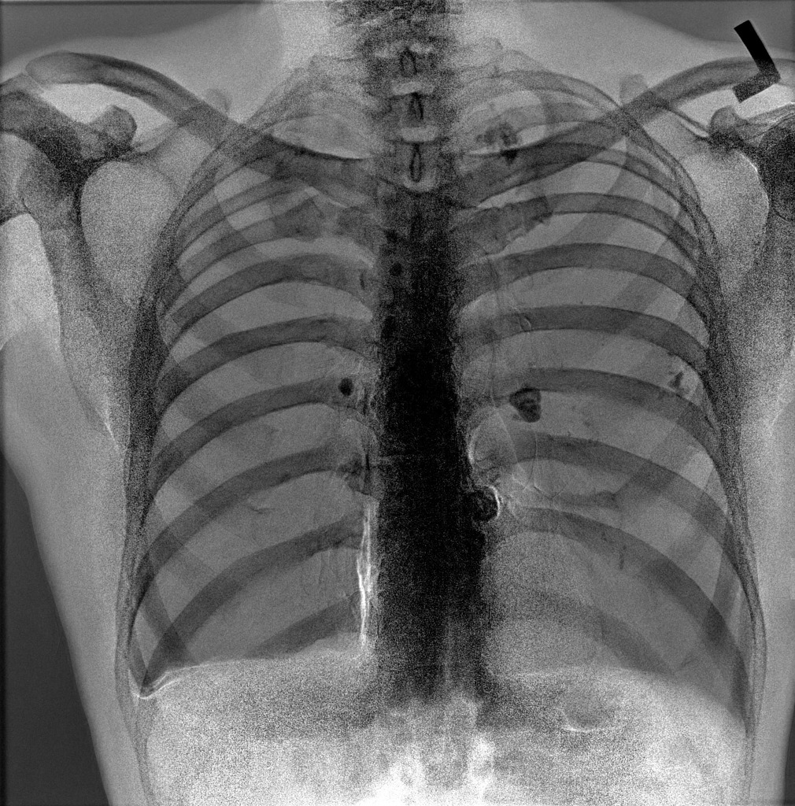 |

**Radiopaedia 原始 caption：**

> Hilar, mediastinal and parenchymal calcification.

**中文翻译：** 肺门、纵隔及肺实质内可见钙化。

### 2.2 CT Study

| Image 4: Axial bone window | Image 5: Axial bone window |
|---|---|
|  |  |

**Radiopaedia 原始 caption：**

> Calcified abdominal lymph nodes.

**中文翻译：** 腹部钙化淋巴结。

## 3. Step 1: 逐图 Grounding

Step 1 应定位每张图中的异常并输出紧致 bbox 和简短 finding caption。下表中的右列是实际给后续步骤使用的 grounding 可视化。

### 3.1 Image 1: X-ray Frontal

| Original | Step 1 grounding |
|---|---|
|  | 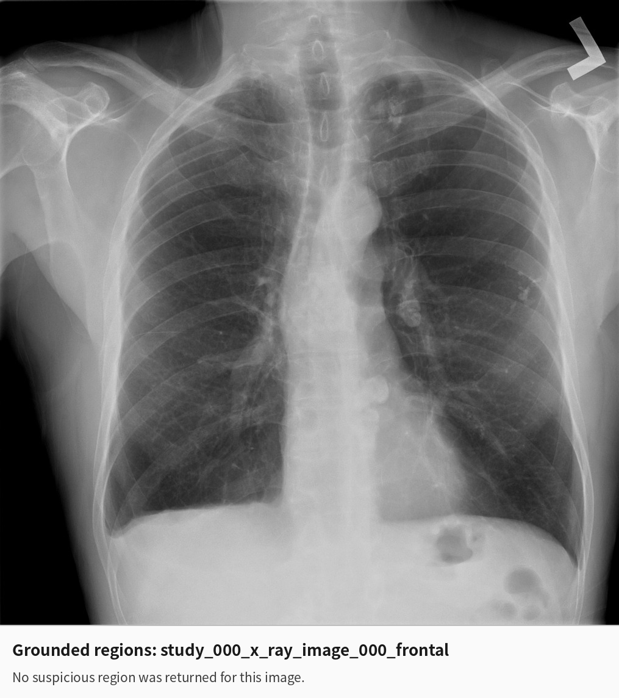 |

- **模型结果：** `regions: []`
- **参考影像信息：** 正位片可见肺门、纵隔及肺实质钙化。
- **问题：** Step 1 完全漏检，没有为后续跨视角验证提供 X-ray 正位 anchor。

### 3.2 Image 2: X-ray Lateral

| Original | Step 1 grounding |
|---|---|
|  | 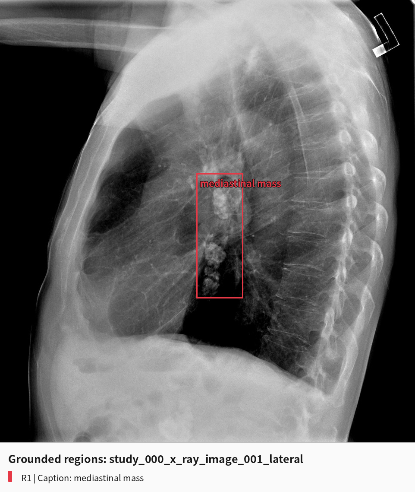 |

```json
{
  "bbox_2d": [474, 392, 586, 674],
  "caption": "mediastinal mass"
}
```

- **定位：** bbox 大致覆盖了纵隔内串珠状、团块状高密度钙化区域。
- **定性：** 模型没有识别“钙化”，而是将其命名为 `mediastinal mass`。
- **问题性质：** 这是“位置基本命中、finding 语义错误”，并非单纯 bbox 偏移。

### 3.3 Image 3: X-ray Dual Energy Bone Window

| Original | Step 1 grounding |
|---|---|
|  | 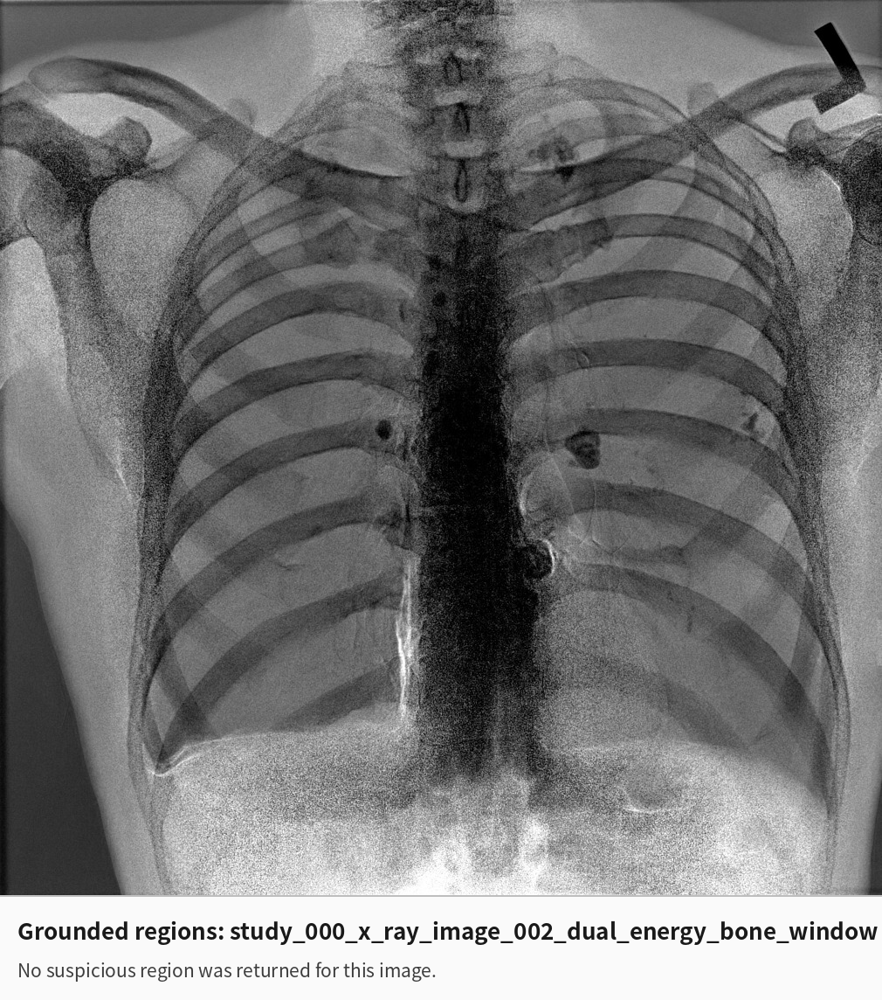 |

- **模型结果：** `regions: []`
- **参考影像信息：** 双能骨窗进一步突出肺门、纵隔及肺实质钙化。
- **问题：** 在本应有助于显示钙化的视图中仍然漏检，使侧位片的错误“肿块”无法被同 study 的另一视图纠正。

### 3.4 Image 4: CT Axial Bone Window

| Original | Step 1 grounding |
|---|---|
|  | 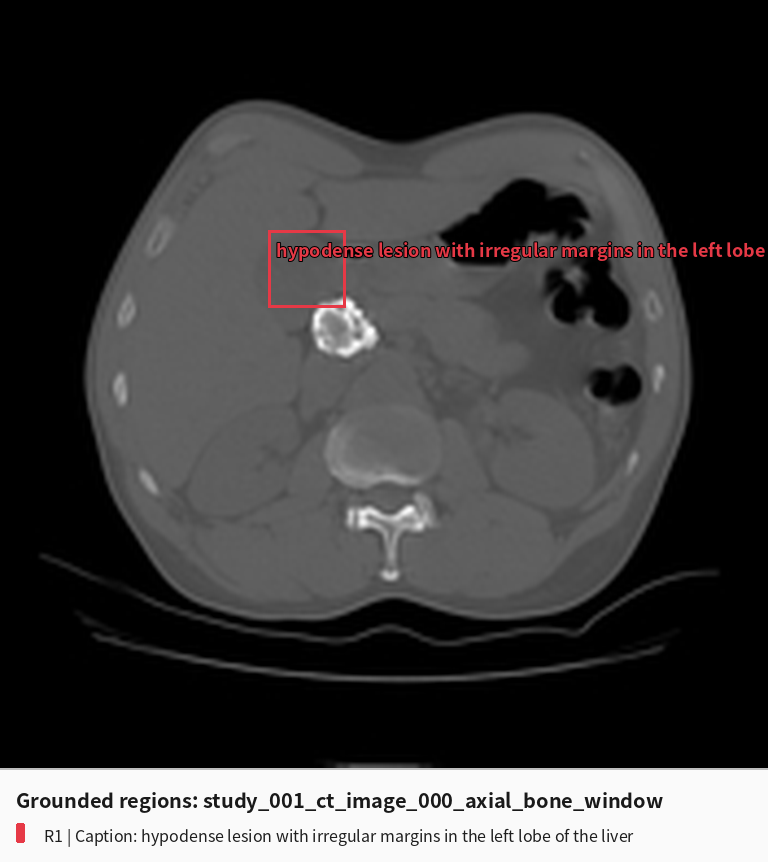 |

```json
{
  "bbox_2d": [350, 300, 450, 400],
  "caption": "hypodense lesion with irregular margins in the left lobe of the liver"
}
```

- **定位：** bbox 位于钙化灶左上方的肝实质，未紧密覆盖中央高密度钙化淋巴结。
- **定性：** 将骨窗中的显著高密度钙化误写为“左肝低密度不规则病灶”。
- **问题性质：** bbox 与目标均错误，同时出现器官、密度和病灶性质错误。

### 3.5 Image 5: CT Axial Bone Window

| Original | Step 1 grounding |
|---|---|
|  | 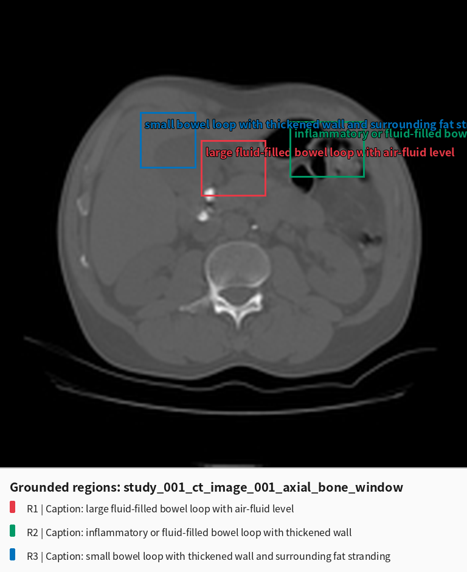 |

```json
[
  {
    "bbox_2d": [430, 300, 570, 420],
    "caption": "large fluid-filled bowel loop with air-fluid level"
  },
  {
    "bbox_2d": [620, 260, 780, 380],
    "caption": "inflammatory or fluid-filled bowel loop with thickened wall"
  },
  {
    "bbox_2d": [300, 240, 420, 360],
    "caption": "small bowel loop with thickened wall and surrounding fat stranding"
  }
]
```

- **定位：** 三个框主要覆盖肝实质、胃肠气体或邻近软组织；第一个框仅在边缘擦到小片钙化。
- **定性：** 三个 finding 全部围绕积液肠袢、肠壁增厚和脂肪浸润展开，未识别真正关键的高密度钙化淋巴结。
- **问题性质：** 明显假阳性，并把同一张低分辨率 CT 中的正常/非目标结构拆成三个“独立异常”。

### 3.6 Step 1 小结

| 指标 | 结果 |
|---|---:|
| 输入图片 | 5 |
| 返回 region 的图片 | 3/5 |
| 返回 region 总数 | 5 |
| 正确识别“钙化/钙化淋巴结”的 region | 0/5 |
| 明显漏检图片 | Image 1、Image 3 |
| 位置接近但语义错误 | Image 2 |
| bbox 和语义均错误 | Image 4、Image 5 |

## 4. Step 2: Crop Caption 与结构化观察

Step 2 对每个 Step 1 region 分别输入“完整原图 + bbox crop”。没有 Step 1 region 的 Image 1 和 Image 3 不会触发 Step 2 调用，因此仍保持 `findings: []`。

### 4.1 Image 2, Finding 1

| Step 1 bbox image | Actual crop supplied to Step 2 |
|---|---|
|  | 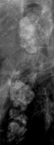 |

```json
{
  "location": "mediastinum",
  "morphology": "irregular, nodular mass",
  "size": {"long_axis": 3, "short_axis": 2, "unit": "cm"},
  "density": "heterogeneous",
  "margin": "indistinct",
  "surrounding": "mediastinal structures",
  "visible_signs": "mediastinal shift",
  "appearance": "irregular, nodular mass with heterogeneous density",
  "description": "An irregular, nodular mass with heterogeneous density and indistinct margins is visible in the mediastinum. The mass appears to be causing a mediastinal shift. The surrounding mediastinal structures are obscured by the mass.",
  "evidence_quality": "moderate",
  "suspicion_level": "high",
  "confidence": 0.9
}
```

**分析：** crop 内实际最突出的证据是多个粗大、团块状高密度钙化影。Step 2 没有纠正 Step 1 的“mass”标签，反而扩写出“不规则肿块、边缘不清、纵隔移位”，并给出未经标尺校准的 `3 × 2 cm` 和 0.9 高置信度。这里发生了明显的**错误语义强化**。

### 4.2 Image 4, Finding 1

| Step 1 bbox image | Actual crop supplied to Step 2 |
|---|---|
|  | 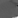 |

```json
{
  "location": null,
  "morphology": null,
  "size": {"long_axis": null, "short_axis": null, "unit": null},
  "density": null,
  "margin": null,
  "surrounding": null,
  "visible_signs": null,
  "appearance": null,
  "description": null,
  "evidence_quality": null,
  "suspicion_level": null,
  "confidence": 0.0
}
```

**分析：** crop 只有约 `18 × 18` 像素，并且没有覆盖主要钙化灶。Step 2 没有产生可用观察，这一点比继续编造肝病灶更谨慎，但后续 Step 3 不应再把该 Step 1 claim 判为 supported。

### 4.3 Image 5, Findings 1–3

| Finding 1 crop | Finding 2 crop | Finding 3 crop |
|---|---|---|
| 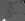 | 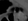 |  |

三个 region 的结构化 description、location、morphology、density、margin、surrounding、visible signs 和 appearance 均为 `null`，confidence 均为 `0.0`。其中：

- Finding 1 crop 为约 `25 × 21` 像素，`size.unit` 被保留成 `mm`，但长短径为空。
- Finding 2 crop 为约 `28 × 21` 像素，size 全为空。
- Finding 3 crop 为约 `21 × 21` 像素，却生成 `0 × 0 mm`。

**分析：** 三个 crop 都过小且来自错误 bbox，没有足够信息支持“肠袢积液、肠壁增厚、脂肪浸润”。Step 2 实际上已经用空 observation 和 0.0 confidence 表达了“无法验证”，但这一负面证据没有被 Step 3 正确消费。

## 5. Step 3: Cross-image Validation

该病例 5 张图两两组合，共执行 10 个 image-pair validation。模型没有建立任何 `same_lesion`、`same_process`、`different_finding` 或 `uncertain` relation，所有 `cross_image_relations` 均为空。

| Pair | Finding assessment | Relation / unmatched | 模型的 pair summary |
|---|---|---|---|
| Image 1–2 | Image 2 F1: bbox `valid`，claim `supported` | Image 2 F1 unmatched | Image 1 无可疑区域；Image 2 有纵隔肿块，因此无法建立关系。 |
| Image 1–3 | 无 finding assessment | 无 relation | 两张图均没有 proposed finding。 |
| Image 1–4 | Image 4 F1: bbox `valid`，claim `supported` | Image 4 F1 unmatched | Image 4 有肝低密度灶；Image 1 无异常，二者无解剖或临床联系。 |
| Image 1–5 | Image 5 F1–F3 全部 `valid/supported` | 三个 finding 均 unmatched | CT 显示肠道病变，胸片无异常，无法建立关系。 |
| Image 2–3 | Image 2 F1: `valid/supported` | Image 2 F1 unmatched | 侧位片有纵隔肿块，双能片无异常，无法建立关系。 |
| Image 2–4 | Image 2 F1、Image 4 F1 均 `valid/supported` | Image 2 F1 unmatched | 纵隔肿块与肝低密度灶被视为两个无关病变。 |
| Image 2–5 | Image 2 F1、Image 5 F1–F3 全部 `valid/supported` | Image 2 F1 unmatched | 纵隔肿块与肠道异常被视为两个无关过程。 |
| Image 3–4 | Image 4 F1: `valid/supported` | Image 4 F1 unmatched | 双能胸片无异常，CT 有肝低密度灶。 |
| Image 3–5 | Image 5 F1–F3 全部 `valid/supported` | 三个 finding 均 unmatched | 双能胸片无异常，CT 有三个肠道 finding。 |
| Image 4–5 | Image 4 F1、Image 5 F1–F3 全部 `valid/supported` | 四个 finding 均 unmatched | 肝病灶与肠道异常被视为互不相关。 |

### 5.1 Comprehensive Review 原始结果

```json
{
  "global_finding_groups": [],
  "independent_findings": [],
  "rejected_findings": [],
  "unresolved_findings": [],
  "image_coverage_audit": [
    {"image_number": 1, "coverage_status": "complete", "covered_finding_numbers": [], "uncovered_suspicious_regions": []},
    {"image_number": 2, "coverage_status": "complete", "covered_finding_numbers": [1], "uncovered_suspicious_regions": []},
    {"image_number": 3, "coverage_status": "complete", "covered_finding_numbers": [], "uncovered_suspicious_regions": []},
    {"image_number": 4, "coverage_status": "complete", "covered_finding_numbers": [1], "uncovered_suspicious_regions": []},
    {"image_number": 5, "coverage_status": "complete", "covered_finding_numbers": [1, 2, 3], "uncovered_suspicious_regions": []}
  ],
  "case_level_consistency": "consistent",
  "case_level_conflicts": [],
  "evidence_summary": "",
  "recommended_reinspection": []
}
```

### 5.2 Step 3 的具体问题

1. **没有真正复核 claim。** Image 4 和 Image 5 的 Step 2 observation 几乎全部为空、confidence 为 0，但 Step 3 仍将相应 Step 1 claim 判为 `supported`。
2. **同一错误被重复支持。** Image 2 的“纵隔肿块”在与 Image 1、3、4、5 的四次配对中都被判为 supported；配对次数增加反而放大了错误置信感。
3. **没有识别 same process。** 正确线索应是不同部位、不同模态中共同出现的钙化过程；由于 Step 1/2 从未抽取“calcification”，Step 3 无法建立 X-ray 与 CT 之间的 `same_process`。
4. **coverage audit 失真。** Image 1 和 Image 3 明明漏掉可见钙化，却被标记为 `coverage_status: complete`，且没有触发 `recommended_reinspection`。
5. **review 内部不一致。** Pair validation 反复声称 5 个 finding 都受支持，但最终既没有 independent、rejected 或 unresolved finding，也没有 global group，`evidence_summary` 为空。

## 6. Step 4: Qwen3-VL-8B 最终诊断

Step 4 实际接收 5 张原图、患者背景，以及下列 reference findings：

```text
Reference findings:
No reference findings were produced.

Please provide the final diagnosis.
```

因此，Step 3 虽然生成了大量 pair validation，但由于 `evidence_summary` 为空，**没有任何结构化验证结果真正进入 Step 4 的决策上下文**。

<details>
<summary><strong>Qwen3-VL-8B 完整原始输出</strong></summary>

<pre>
Based on the provided clinical history and imaging findings, the most likely diagnosis is:

Metastatic lung cancer (likely from a prior head and neck primary) with possible hepatic metastases.

Rationale:

1. Clinical History: The patient is a 65-year-old male with a known history of head and neck squamous cell carcinoma 12 years ago, treated with radiation and chemotherapy. This is a high-risk scenario for developing a second malignancy or metastatic disease, particularly given the long-term follow-up and prior cancer treatment.

2. Chest X-ray Findings (Images 1, 2, 3):
- Image 1 (PA view): Shows a prominent, irregularly shaped, dense opacity in the right hilum (central area of the right lung). This is highly suggestive of a mass lesion, likely involving the bronchus or mediastinal structures. There is also a smaller, less defined opacity in the left lower lung field.
- Image 2 (Lateral view): Confirms the presence of a large, irregular mass in the right hilum, which is causing mediastinal shift and compression of the trachea. The mass appears to be centrally located, consistent with a primary lung tumor or a metastasis to the mediastinum.
- Image 3 (AP view): Shows a large, dense mass in the right hilum, confirming the findings from the other views. The left lung appears relatively clear, though there is a small opacity in the left lower lung field.
- Overall: The imaging findings are highly suggestive of a primary lung cancer (e.g., non-small cell lung cancer) or a large metastatic lesion in the right hilum.

3. CT Scan Findings (Images 4 and 5):
- Image 4: Shows a large, well-defined, hypodense lesion in the right lobe of the liver, which is highly suspicious for a metastatic liver lesion.
- Image 5: Shows another hypodense lesion in the left lobe of the liver.
- Overall: The presence of multiple hepatic lesions on CT strongly suggests metastatic disease.

Conclusion:

The combination of a large central lung mass (right hilum) and multiple liver lesions in a patient with a history of head and neck cancer strongly indicates metastatic disease. Given the anatomical location and the history of prior head and neck cancer, the primary tumor is likely in the lung, and the liver lesions are metastases.

Final Diagnosis:
Metastatic lung cancer with hepatic metastases.

This diagnosis requires further workup, including biopsy of the lung lesion and possibly PET-CT to assess for other potential metastatic sites.
</pre>

</details>

- **中文要点：** 模型将胸片上的钙化影解释为右肺门/纵隔肿块，将 CT 上的钙化淋巴结解释为双侧肝转移灶，并在既往肿瘤病史影响下诊断为“转移性肺癌伴肝转移”。
- **评测结果：** `Incorrect`
- **参考诊断：** Calcified abdominal lymph nodes

## 7. 错误传播结论

该病例不是单一环节偶然失误，而是一条完整的失败链：

```text
Step 1
漏检正位和双能片钙化；侧位钙化被命名为肿块；CT 钙化被误框为肝/肠道病变
    ↓
Step 2
侧位错误被扩写为高置信度纵隔肿块；CT crop 无法提供有效观察
    ↓
Step 3
忽略 Step 2 的空 observation 和 0 confidence，反复支持错误 claim；
未建立任何 same_process；错误地宣布 coverage complete 和 case consistent
    ↓
Comprehensive review
所有 finding 分类均为空，evidence_summary 为空，也没有触发重新检查
    ↓
Step 4
只得到原图、肿瘤病史和“No reference findings”；再次把钙化误读成肿块/转移灶
    ↓
错误诊断：Metastatic lung cancer with hepatic metastases
```

**最主要的失败点是 Step 1 的 visual grounding 与 finding 命名均不可靠；但 Step 3 也没有履行纠错职责。** 如果 Step 3 能将“空 observation + confidence 0”视为反证，将正位/双能片无 region 视为 coverage incomplete，并触发针对 `calcification/high-density foci` 的重新查看，即使 Step 1 出错，也仍有机会恢复。当前实现则把“没有匹配关系”错误地当成“没有冲突”，最终既未纠正错误，也没有向 Step 4 输出任何可用证据。

---

# Case Study: Infected Emphysematous Bulla

[返回主 README](README.md)

本页继续追踪 [Infected emphysematous bulla](https://radiopaedia.org/cases/infected-emphysematous-bulla?lang=us) 在 **Qwen3-VL-8B Step 1–4** 中的完整信息流。为保证版本一致，本节的 Step 1 结果严格取自 `step_1_backup`；Step 2、Step 3 和 Step 4 也是基于该旧版 Step 1 产生的结果，不使用当前重新运行的 `step_1`。

## 1. 病例与参考答案

- **Case ID：** `infected-emphysematous-bulla`
- **参考诊断：** Infected emphysematous bulla（感染性肺气肿性肺大疱）
- **诊断确定性：** Diagnosis probable
- **患者信息：** 75 岁，女性
- **临床背景：** 全科医生因咯血转诊。
- **影像组合：** X-ray 2 张（正位、侧位）+ CT 2 张（轴位、冠状位肺窗）。

Radiopaedia 的病例讨论给出的核心解释是：**原有大型肺气肿性肺大疱继发感染，形成脓肿和气液平面。** 因此，正确整合需要同时识别背景肺气肿、右肺病变、空腔及其气液平面，而不只是泛化为“肺空洞”。

## 2. 原始图片与 Caption

Radiopaedia 在该病例中同样提供 **study-level caption**，同一 study 内两张图共享文字描述。

### 2.1 X-ray Study

| Image 1: Frontal | Image 2: Lateral |
|---|---|
|  |  |

**Radiopaedia 原始 caption：**

> Hyperinflated lungs. Large rounded mass in the right lung with an air-fluid level.

**中文翻译：** 双肺过度充气；右肺可见大型圆形病变，内部存在气液平面。

### 2.2 CT Study

| Image 3: Axial lung window | Image 4: Coronal lung window |
|---|---|
|  |  |

**Radiopaedia 原始 caption：**

> Background emphysema. Large abscess in the apical segment of the RLL with an air-fluid level.

**中文翻译：** 背景为肺气肿；右下叶尖段可见大型脓肿，内部存在气液平面。

## 3. Step 1: 逐图 Grounding

以下结果均来自旧版 `step_1_backup`。四张图均返回一个 region，但 X-ray finding 命名错误，CT 则持续出现患者左右侧颠倒。

### 3.1 Image 1: X-ray Frontal

| Original | Step 1 grounding (`step_1_backup`) |
|---|---|
|  | 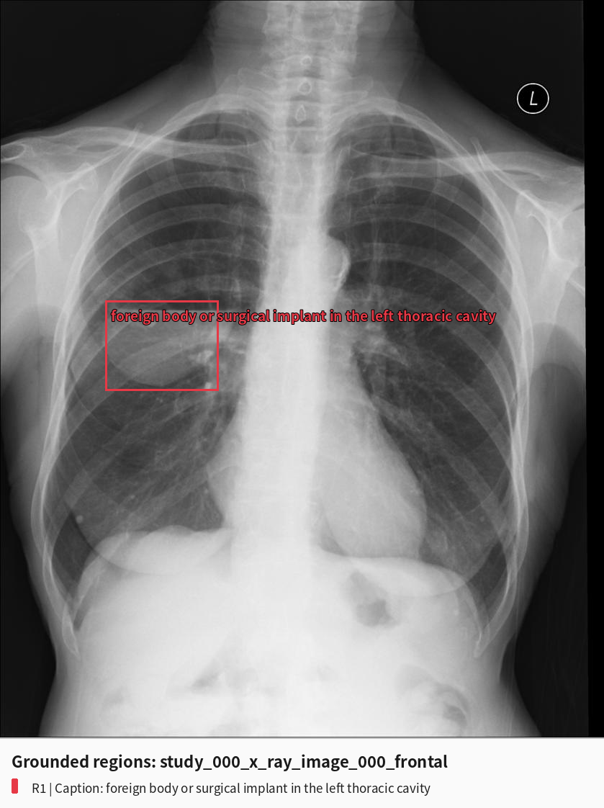 |

```json
{
  "bbox_2d": [175, 408, 362, 530],
  "caption": "foreign body or surgical implant in the left thoracic cavity"
}
```

- **定位：** bbox 实际位于画面左侧，即患者右肺，并覆盖大型圆形病变及其气液平面的主要部分。
- **定性：** 模型没有识别空腔或气液平面，而把区域内的小圆形高密度影和邻近病变解释成“异物或手术植入物”。
- **侧别：** 图像右上角的 `L` 标记表示画面右侧为患者左侧；病变在画面左侧，应属于患者右肺。模型却写成左胸腔。
- **问题性质：** bbox 基本命中，但关键征象、病灶性质和患者侧别均错误。

### 3.2 Image 2: X-ray Lateral

| Original | Step 1 grounding (`step_1_backup`) |
|---|---|
|  | 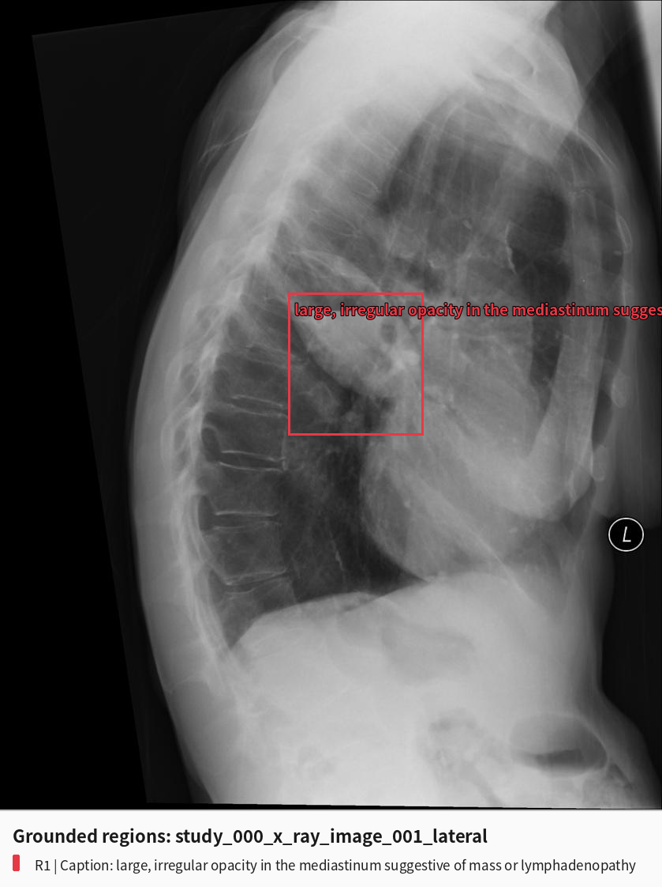 |

```json
{
  "bbox_2d": [436, 362, 639, 538],
  "caption": "large, irregular opacity in the mediastinum suggestive of mass or lymphadenopathy"
}
```

- **定位：** bbox 覆盖了侧位片上病变及清晰的水平气液界面。
- **定性：** 模型忽略气液平面，把肺内空腔性病变误写成纵隔肿块或淋巴结肿大。
- **问题性质：** 位置基本命中，但解剖归属和 finding 语义错误。

### 3.3 Image 3: CT Axial Lung Window

| Original | Step 1 grounding (`step_1_backup`) |
|---|---|
|  | 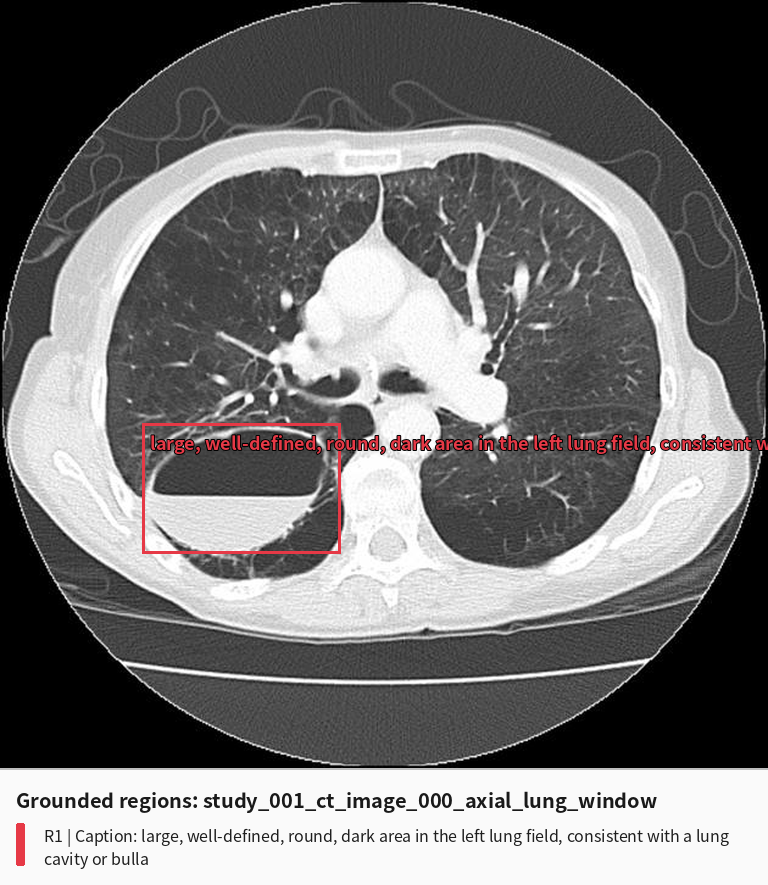 |

```json
{
  "bbox_2d": [185, 552, 444, 721],
  "caption": "large, well-defined, round, dark area in the left lung field, consistent with a lung cavity or bulla"
}
```

- **定位：** bbox 紧密覆盖空腔及气液平面，局部定位正确。
- **定性：** 已识别为 `cavity or bulla`，明显优于胸片结果，但没有指出继发感染或脓肿。
- **侧别：** 标准轴位 CT 以患者足端视角显示，画面左侧对应患者右侧；模型错误标成左肺。

### 3.4 Image 4: CT Coronal Lung Window

| Original | Step 1 grounding (`step_1_backup`) |
|---|---|
|  | 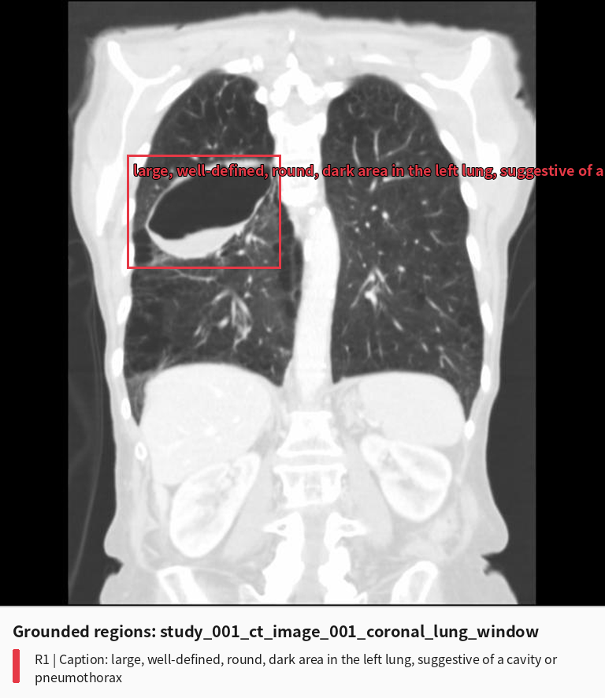 |

```json
{
  "bbox_2d": [210, 256, 464, 444],
  "caption": "large, well-defined, round, dark area in the left lung, suggestive of a cavity or pneumothorax"
}
```

- **定位：** bbox 覆盖右肺内大型含气空腔和液平，定位基本正确。
- **定性：** 识别到 cavity，但把局灶肺内空腔与 pneumothorax 并列，且没有识别感染成分。
- **侧别：** 再次把画面左侧的患者右肺病变写成左肺。

### 3.5 Step 1 小结

| 指标 | 结果 |
|---|---:|
| 输入图片 | 4 |
| 返回 region 的图片 | 4/4 |
| 返回 region 总数 | 4 |
| bbox 覆盖主要病变 | 4/4 |
| 明确识别 cavity/bulla | 2/4（两张 CT） |
| 明确识别 air-fluid level | 0/4 |
| 侧别正确 | 0/4 |
| 识别背景 emphysema 或 superimposed infection | 0/4 |

## 4. Step 2: Crop Caption 与结构化观察

Step 2 对每个旧版 Step 1 region 分别输入“完整原图 + 对应 bbox crop”。它在 CT crop 中恢复了气液平面，但在胸片中仍未正确读取关键征象，四张图的患者侧别也全部保持为左侧。

### 4.1 Image 1, Finding 1

| Step 1 bbox image | Actual crop supplied to Step 2 |
|---|---|
|  | 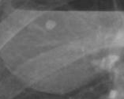 |

```json
{
  "location": "left lung",
  "morphology": "rounded",
  "size": {"long_axis": 2, "short_axis": 1.5, "unit": "cm"},
  "density": "hyperdense",
  "margin": "well-defined",
  "surrounding": "lung parenchyma",
  "visible_signs": "no calcification, no cavitation",
  "appearance": "small, round, hyperdense opacity",
  "description": "A small, round, hyperdense opacity is visible within the left lung field. The margin is well-defined, and it is surrounded by lung parenchyma. No calcification or cavitation is visible.",
  "evidence_quality": "poor",
  "suspicion_level": "low",
  "confidence": 0.8
}
```

**分析：** crop 实际同时包含大型病变的一部分、水平气液界面及小圆形高密度标记，但模型把注意力集中在小圆形影上。它明确写出“无空洞”，与可见的大型空腔/气液平面相反；同时在 `evidence_quality: poor` 的情况下仍给出 0.8 confidence 和未经校准的厘米尺寸。

### 4.2 Image 2, Finding 1

| Step 1 bbox image | Actual crop supplied to Step 2 |
|---|---|
|  | 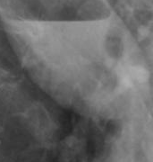 |

```json
{
  "location": "left lower thoracic cavity",
  "morphology": "soft tissue density",
  "size": {"long_axis": 3, "short_axis": 2, "unit": "cm"},
  "density": "soft tissue density",
  "margin": "indistinct",
  "surrounding": "adjacent to the diaphragm and left hemidiaphragm",
  "visible_signs": "no calcification, no air-fluid level",
  "appearance": "hazy, ill-defined opacity",
  "description": "A soft tissue density lesion is visible in the left lower thoracic cavity, adjacent to the diaphragm. The lesion has an ill-defined margin and appears as a hazy opacity without calcification or air-fluid level.",
  "evidence_quality": "poor",
  "suspicion_level": "low",
  "confidence": 0.6
}
```

**分析：** crop 中的水平气液界面非常直接，但 Step 2 仍输出 `no air-fluid level`，并将病变放到左下胸腔和膈肌旁。该结果没有独立纠正 Step 1，反而把“纵隔肿块”改写成另一套不准确的低位软组织影描述。

### 4.3 Image 3, Finding 1

| Step 1 bbox image | Actual crop supplied to Step 2 |
|---|---|
|  | 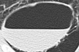 |

```json
{
  "location": "left lower lobe",
  "morphology": "circular",
  "size": {"long_axis": 5.2, "short_axis": 4.8, "unit": "cm"},
  "density": "low attenuation",
  "margin": "well-defined",
  "surrounding": "lung parenchyma",
  "visible_signs": "air-fluid level",
  "appearance": "cystic",
  "description": "A well-defined, low-attenuation, circular lesion in the left lower lobe with an air-fluid level.",
  "evidence_quality": "good",
  "suspicion_level": "low",
  "confidence": 0.95
}
```

**分析：** 这是四个 Step 2 结果中最接近参考征象的一项：正确提取圆形囊性病变和气液平面。但病变应位于**右下叶尖段**，模型仍写成左下叶；同时没有描述背景肺气肿、壁部改变或感染性内容。

### 4.4 Image 4, Finding 1

| Step 1 bbox image | Actual crop supplied to Step 2 |
|---|---|
|  | 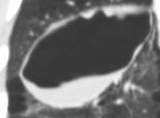 |

```json
{
  "location": "left lung",
  "morphology": "cavity",
  "size": {"long_axis": 6, "short_axis": 4, "unit": "cm"},
  "density": "low attenuation",
  "margin": "well-defined",
  "surrounding": "lung parenchyma with visible bronchovascular markings",
  "visible_signs": "no evidence of surrounding consolidation or mass effect",
  "appearance": "air-filled cavity with smooth inner wall",
  "description": "A well-defined, air-filled cavity is visible within the left lung, with smooth margins and no adjacent consolidation or mass effect. The surrounding lung parenchyma shows preserved bronchovascular markings.",
  "evidence_quality": "good",
  "suspicion_level": "low",
  "confidence": 0.95
}
```

**分析：** 模型识别到空腔，但遗漏明显液体成分，写成单纯 `air-filled cavity`；同时继续把右肺写成左肺，并用“无邻近实变”弱化感染解释。它保留了 bulla 的一部分视觉特征，却没有形成“肺气肿背景上的大疱继发感染”。

### 4.5 Step 2 小结

| 指标 | 结果 |
|---|---:|
| 结构化 observation | 4/4 |
| 正确识别 cavity/bulla | 2/4（CT） |
| 正确识别 air-fluid level | 1/4（仅轴位 CT） |
| 侧别正确 | 0/4 |
| 明确识别 background emphysema | 0/4 |
| 明确识别 superimposed infection/abscess | 0/4 |

## 5. Step 3: Cross-image Validation

该病例 4 张图两两组合，共执行 6 个 image-pair validation。所有 bbox 和 claim 在每次出现时都被判为 `valid/supported`；模型建立 3 条 `same_lesion`、2 条 `different_finding`，另有 1 个 pair 没有 relation。

| Pair | Finding assessment | Relation | 模型的 pair summary 与问题 |
|---|---|---|---|
| Image 1–2 | 两个 finding 均 `valid/supported` | `same_lesion`，0.90 | 把正位的“异物/植入物”和侧位的“纵隔肿块”合并为左胸同一病灶，未识别二者其实都在显示右肺气液平面。 |
| Image 1–3 | 两个 finding 均 `valid/supported` | `different_finding`，0.98 | 因“高密度小影”和“低密度空腔”的表述不同而拆开，错过 X-ray 与 CT 对同一空腔性病变的跨模态对应。 |
| Image 1–4 | 两个 finding 均 `valid/supported` | `same_lesion`，0.90 | 正确方向上尝试关联 X-ray 与 CT，但错误共识为左肺，并声称 CT 空腔能够支持 X-ray 的“异物/植入物”。 |
| Image 2–3 | 两个 finding 均 `valid/supported` | 无 relation；两个 finding 均 unmatched | 将侧位 X-ray 判断为纵隔病变、轴位 CT 判断为左肺空腔，认为解剖位置不同；实际应关联为同一右肺病变。 |
| Image 2–4 | 两个 finding 均 `valid/supported` | `different_finding`，1.00 | 以“纵隔 vs. 肺”为由强置信度拆分；实际两个视图均覆盖同一空腔和气液平面。 |
| Image 3–4 | 两个 finding 均 `valid/supported` | `same_lesion`，0.98 | 正确识别轴位与冠状位为同一 cavity/bulla，但错误共识为左下叶，并未把两张图联合解释为感染性肺大疱。 |

### 5.1 定位、定量与定性验证表现

- **定位：** 所有建立关系的 pair 都把患者侧别总结为左侧。模型甚至引用 `L marker` 作为依据，却没有正确理解标记与病变在显示坐标中的相对关系，导致侧别错误被 cross-validation 固化。
- **定量：** 相关 pair 均输出 `not_comparable`。这避免了把不同视图的模型估计尺寸直接合并，但也没有利用轴位 `5.2 × 4.8 cm` 与冠状位 `6 × 4 cm` 的大致一致性作为辅助证据。
- **定性：** CT–CT pair 正确总结 `well-defined`、`low attenuation`、`cystic appearance` 和轴位气液平面；但 X-ray–CT pair 被 Step 1/2 的错误文字锚定，将真正互补的征象误解为不同病灶，或错误地支持“异物/植入物”。

### 5.2 Comprehensive Review 原始结果

```json
{
  "global_finding_groups": [
    {
      "global_finding_number": 1,
      "member_findings": [
        {"image_number": 1, "finding_number": 1},
        {"image_number": 4, "finding_number": 1}
      ],
      "relation_basis": "same_lesion",
      "status": "supported",
      "location": {
        "status": "consistent",
        "consensus": {"laterality": "left", "organ": "lung"},
        "conflicts": []
      },
      "quantification": {
        "status": "not_comparable",
        "consensus": null,
        "conflicts": []
      },
      "characterization": {
        "status": "complementary",
        "consensus": ["well-defined margin", "location in left lung"],
        "conflicts": []
      },
      "supporting_image_pairs": [3],
      "evidence_quality": "adequate"
    }
  ],
  "independent_findings": [
    {
      "finding": {"image_number": 2, "finding_number": 1},
      "status": "supported",
      "summary": "validated visual observation",
      "reason_not_grouped": "Anatomically distinct from the lesion in the left lung."
    },
    {
      "finding": {"image_number": 3, "finding_number": 1},
      "status": "supported",
      "summary": "validated visual observation",
      "reason_not_grouped": "Anatomically distinct from the lesion in the left lung."
    }
  ],
  "rejected_findings": [],
  "unresolved_findings": [],
  "image_coverage_audit": [
    {"image_number": 1, "coverage_status": "complete", "covered_finding_numbers": [1], "uncovered_suspicious_regions": []},
    {"image_number": 2, "coverage_status": "complete", "covered_finding_numbers": [1], "uncovered_suspicious_regions": []},
    {"image_number": 3, "coverage_status": "complete", "covered_finding_numbers": [1], "uncovered_suspicious_regions": []},
    {"image_number": 4, "coverage_status": "complete", "covered_finding_numbers": [1], "uncovered_suspicious_regions": []}
  ],
  "case_level_consistency": "partially_consistent",
  "case_level_conflicts": [
    "The X-ray (Image 1) and CT (Image 3) findings are anatomically distinct and represent different pathologies."
  ],
  "evidence_summary": "The visual evidence identifies a well-defined lesion in the left lung, consistent across X-ray and CT imaging, and a separate mediastinal opacity. The lesion in the left lung is described as a cavity on CT, while the X-ray shows a hyperdense opacity. The mediastinal opacity is distinct from the lung lesion and is not further characterized in the CT images.",
  "recommended_reinspection": []
}
```

### 5.3 Step 3 的具体问题

1. **侧别错误被一致性验证放大。** 四张图的 Step 2 location 都错写为左侧，Step 3 没有根据 X-ray `L` marker、CT 显示惯例和跨视图解剖位置纠正，反而反复形成 `left` consensus。
2. **relation 缺乏传递一致性。** Pair 3 将 Image 1 和 Image 4 归为同一病灶，Pair 6 将 Image 3 和 Image 4 归为同一病灶，但最终 group 只包含 Image 1 与 Image 4，Image 3 被列为“解剖上不同”的 independent finding。
3. **没有纠正 X-ray 语义。** Step 2 已把两张胸片标为 `evidence_quality: poor`，且 Image 2 明明否认可见气液平面；Step 3 仍将“异物/植入物”和“纵隔肿块”全部判为 supported。
4. **跨模态对应失败。** X-ray 与 CT 的密度表现本来就不同，不能仅因“一张为 opacity、一张为 cavity”判作不同病灶；应综合位置、形态和两者共同可见的水平液面。
5. **遗漏病例级核心属性。** review 没有保留 `air-fluid level`、background emphysema 或 infection/abscess，最终 evidence summary 只剩“左肺空腔 + 独立纵隔影”。
6. **coverage audit 过于乐观。** 四张图虽都有 bbox，但“有框”不等于关键征象已被覆盖和正确描述；所有图均被标为 complete，也没有触发 reinspection。

## 6. Step 4: Qwen3-VL-8B 最终诊断

Step 4 接收四张原图、患者背景，以及 Step 3 的 `evidence_summary`：

```text
Reference findings:
The visual evidence identifies a well-defined lesion in the left lung, consistent across X-ray and CT imaging, and a separate mediastinal opacity. The lesion in the left lung is described as a cavity on CT, while the X-ray shows a hyperdense opacity. The mediastinal opacity is distinct from the lung lesion and is not further characterized in the CT images.

Please provide the final diagnosis.
```

<details>
<summary><strong>Qwen3-VL-8B 完整原始输出</strong></summary>

<pre>
Based on the imaging findings and the patient's presentation of haemoptysis, the final diagnosis is:

Left-sided lung cavity (likely a lung abscess or cavitary lung cancer) with a separate mediastinal opacity.

Rationale:

1. Lung Lesion:
- CT Scan (Images 3 & 4): Clearly demonstrates a well-defined, large, air-filled cavity in the left lung (specifically, the left upper lobe). This is the most significant finding.
- X-ray (Image 1): Shows a hyperdense opacity in the left lung, which is consistent with the cavity seen on CT. The cavity appears as a dense area on X-ray because it contains fluid or debris, or due to the surrounding tissue density.
- Clinical Correlation: Haemoptysis is a common symptom of cavitary lung lesions, such as lung abscesses, tuberculosis, or lung cancer.

2. Mediastinal Opacity:
- X-ray (Image 1): Shows a distinct opacity in the mediastinum.
- CT Scan (Images 3 & 4): This opacity is visible but is not further characterized (e.g., no specific description of its size, shape, or whether it is lymphadenopathy, a mass, or a vascular structure). The reference notes it is "distinct from the lung lesion."
- Clinical Correlation: A mediastinal opacity can have many causes, including lymphadenopathy, a mediastinal mass, or vascular structures. Given the patient's age and the presence of a lung cavity, lymphadenopathy is a common finding. Further investigation (e.g., PET-CT, biopsy) would be needed to determine the exact nature.

Conclusion:

The most likely diagnosis is a cavitary lesion in the left lung (which could be a lung abscess, tuberculosis, or lung cancer) causing haemoptysis. The mediastinal opacity is an additional finding that requires further investigation but is not directly related to the haemoptysis.

Note: A definitive diagnosis (e.g., lung abscess vs. lung cancer) would require additional clinical information (e.g., symptoms, history, laboratory tests) and potentially a biopsy or further imaging. The CT scan is the most definitive imaging modality for characterizing the lung cavity.
</pre>

</details>

- **中文要点：** 模型最终识别出肺空腔，并把肺脓肿纳入鉴别，但沿用了 Step 3 的错误左侧定位，还保留了并不存在的独立“纵隔影”；结论停留在肺脓肿、结核或空洞型肺癌之间，没有识别“肺气肿性肺大疱继发感染”。
- **评测结果：** `Incorrect`
- **参考诊断：** Infected emphysematous bulla

## 7. 错误传播结论

该病例的 bbox 定位总体并不差，主要失败发生在**关键征象读取、患者侧别判断和跨模态 correspondence**：

```text
Step 1 (`step_1_backup`)
四张图均框到主要区域，但胸片气液平面被误读为异物/纵隔肿块；
CT 识别 cavity/bulla，却把患者右肺持续写成左肺
    ↓
Step 2
轴位 CT 恢复 air-fluid level，但胸片仍明确否认气液平面；
所有 observation 均为左侧，且未提取背景肺气肿与继发感染
    ↓
Step 3
把错误 X-ray claim 全部判为 supported；部分应对应的 X-ray–CT finding 被拆开；
错误左侧被固化为 consensus，CT–CT 的传递关系也未进入同一 global group
    ↓
Comprehensive review
只输出“左肺空腔 + 独立纵隔影”，丢失 air-fluid level、emphysema 和 infection；
coverage 被错误判为 complete，未触发重新检查
    ↓
Step 4
在错误 evidence summary 锚定下，诊断为左肺空洞，鉴别肺脓肿/结核/肺癌，
未形成“右肺气肿性肺大疱继发感染”的病例级诊断
```

**该病例说明，仅把 bbox 框准并不足以支持最终诊断。** Step 1 的两个 CT region 已包含决定性的空腔和气液平面，但 Step 2/3 没有稳定保留“右侧、气液平面、背景肺气肿”这三个关键属性。尤其值得注意的是，Step 3 并非没有跨图证据，而是错误地把跨视图重复信息解释为多个病灶，并把一致的侧别错误当作可靠共识。对这类病例，cross-image validation 必须显式检查显示方向、提取每个模态共同可见的气液界面，并允许 CT 对 X-ray 的模糊 opacity 进行语义纠正。
