# Aspergilloma

[返回 Step 3 总览](../README_STEP3_VISUALIZATION.md)

- **Case ID：** `aspergilloma-1`
- **Case URL：** [https://radiopaedia.org/cases/aspergilloma-1?lang=us](https://radiopaedia.org/cases/aspergilloma-1?lang=us)
- **验证模型：** Qwen3-VL-8B
- **图像 / Step 2 findings：** 4 / 7
- **定位结果：** strong 2；partial 5；not support 5；parse error 0
- **Strong bbox relations：** 2
- **原始 JSON：** [case_evidence.json](../assets_step3/aspergilloma-1/case_evidence.json)

**Overlay 图例：** 红框为跨图新定位；绿框为 IoU >= 0.5 的已有 bbox；黄框为未达到阈值的已有 bbox。

## Step 2 Finding Nodes

### Finding 1: `study_000_x_ray_image_000_frontal_f01`

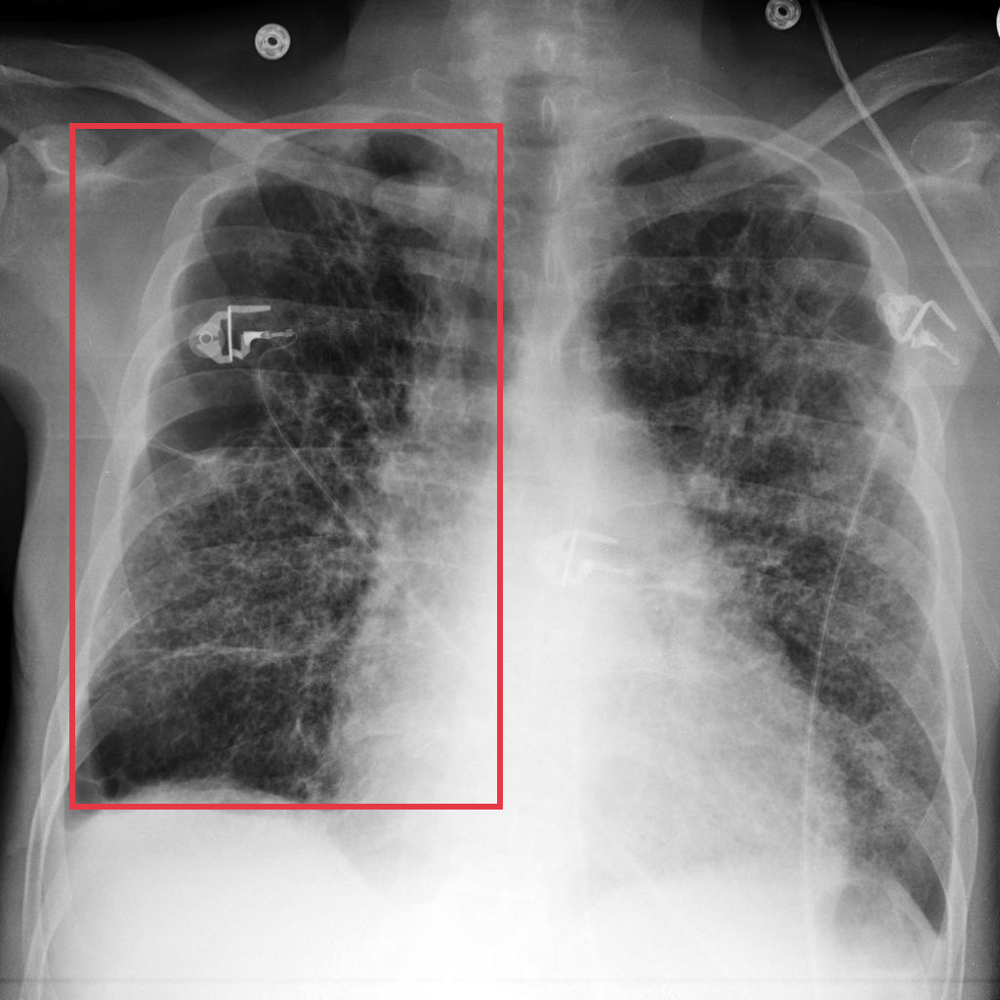

- **Modality / subcategory：** X-ray / Frontal
- **bbox_2d：** `[70, 124, 502, 809]`
- **Lingshu caption：** The lungs are hyperinflated. There is diffuse interstitial thickening bilaterally. The heart size is normal. No pneumothorax or pleural effusion seen.
- **中文翻译：** 双肺过度充气。双侧可见弥漫性间质增厚。心影大小正常。未见气胸或胸腔积液。

### Finding 2: `study_000_x_ray_image_000_frontal_f02`

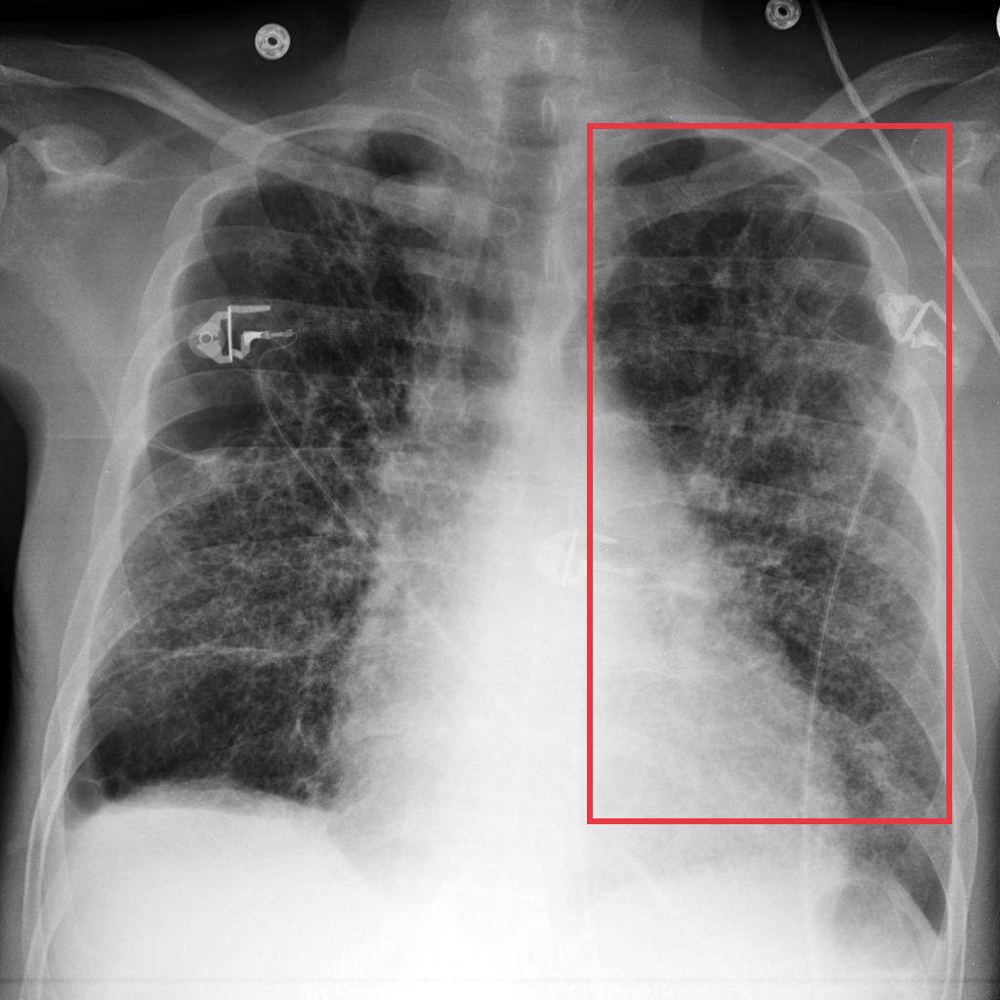

- **Modality / subcategory：** X-ray / Frontal
- **bbox_2d：** `[587, 124, 952, 824]`
- **Lingshu caption：** The lungs are hyperinflated. There is diffuse interstitial thickening bilaterally. The heart size is normal. No pneumothorax or pleural effusion seen.
- **中文翻译：** 双肺过度充气。双侧可见弥漫性间质增厚。心影大小正常。未见气胸或胸腔积液。

### Finding 3: `study_000_x_ray_image_000_frontal_f03`

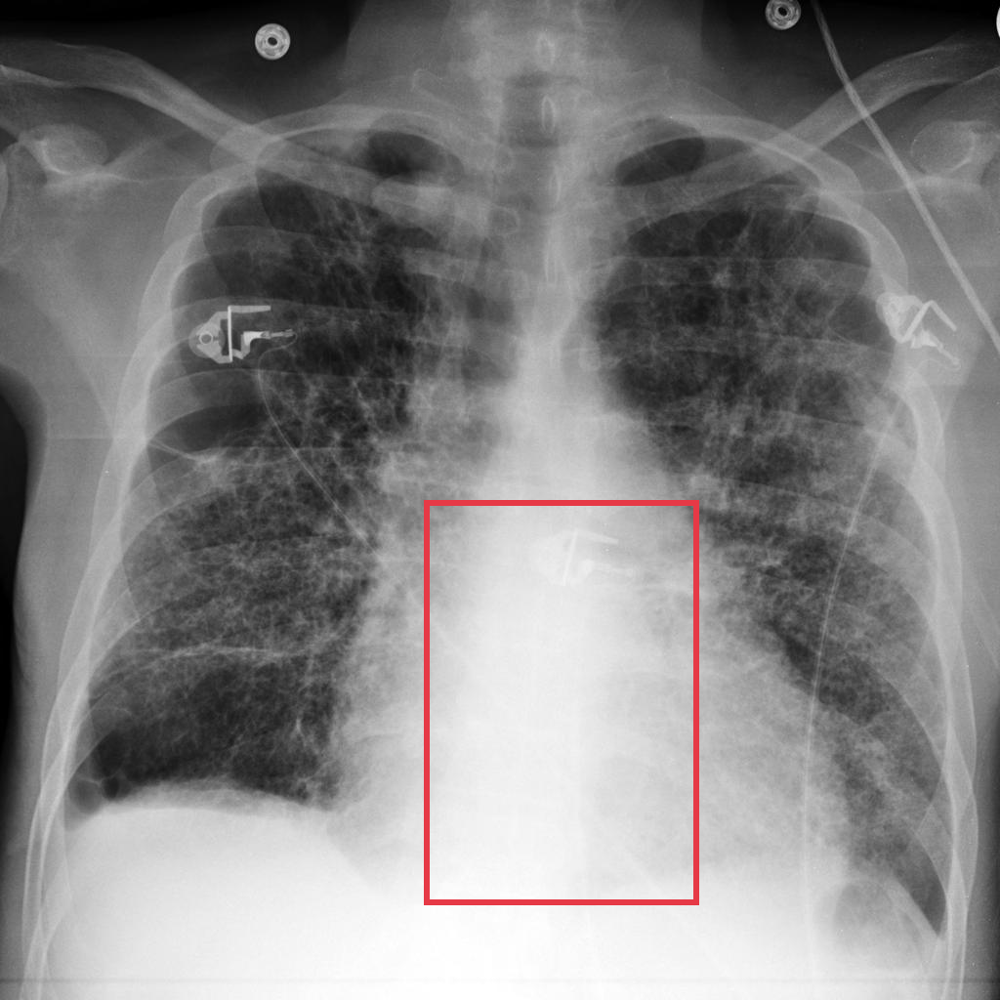

- **Modality / subcategory：** X-ray / Frontal
- **bbox_2d：** `[424, 500, 699, 905]`
- **Lingshu caption：** The heart size is enlarged. The mediastinal contours are prominent. There is increased opacity throughout both lungs with more pronounced opacities in the lower lobes bilaterally.
- **中文翻译：** 心影增大，纵隔轮廓突出。双肺透亮度普遍降低，双侧下叶的致密影更为明显。

### Finding 4: `study_001_x_ray_image_000_missing_f01`

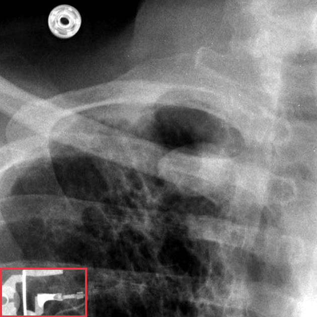

- **Modality / subcategory：** X-ray / missing
- **bbox_2d：** `[0, 845, 274, 1000]`
- **Lingshu caption：** The image shows a chest x-ray with a red box highlighting a specific area. Within this region, there appears to be a foreign object, possibly a medical device or implant, which is not typically present in a normal chest x-ray. The surrounding lung fields appear relatively clear, without any obvious signs of consolidation, effusion, or pneumothorax. The heart size and mediastinal contours seem within normal limits. However, due to the presence of the foreign object, further evaluation may be necessary to determine its nature and potential implications.
- **中文翻译：** 图像为胸部 X 线片，红框标出了一个特定区域。该区域内似乎存在异物，可能是正常胸片中通常不会出现的医疗器械或植入物。周围肺野相对清晰，未见明显实变、积液或气胸。心影大小及纵隔轮廓似在正常范围内。但由于存在该异物，可能需要进一步评估其性质及潜在影响。

### Finding 5: `study_002_ct_image_000_axial_lung_window_f01`

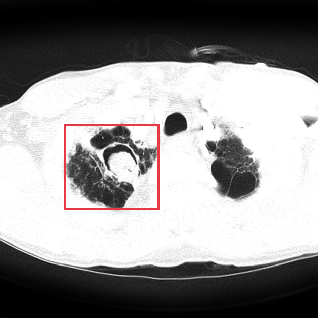

- **Modality / subcategory：** CT / Axial lung window
- **bbox_2d：** `[200, 390, 500, 660]`
- **Lingshu caption：** The lungs are hyperinflated. There is a large area of consolidation in the right upper lobe. There is also a smaller area of consolidation in the left upper lobe. The mediastinal contours are normal.
- **中文翻译：** 双肺过度充气。右上叶可见大片实变，左上叶另见较小范围实变。纵隔轮廓正常。

### Finding 6: `study_002_ct_image_000_axial_lung_window_f02`

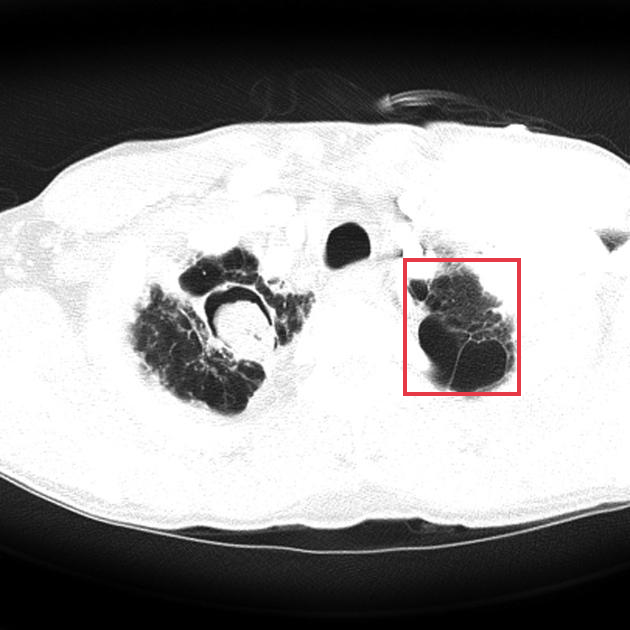

- **Modality / subcategory：** CT / Axial lung window
- **bbox_2d：** `[641, 410, 826, 628]`
- **Lingshu caption：** The lungs are hyperinflated. There is a large area of consolidation in the left upper lobe. The right upper lobe also shows some areas of consolidation.
- **中文翻译：** 双肺过度充气。左上叶可见大片实变，右上叶也可见部分实变区域。

### Finding 7: `study_002_ct_image_001_oblique_lung_window_f01`

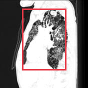

- **Modality / subcategory：** CT / Oblique lung window
- **bbox_2d：** `[250, 100, 750, 800]`
- **Lingshu caption：** The lungs are hyperinflated. There is diffuse bronchiectasis and bronchial wall thickening. There is also diffuse ground glass opacity.
- **中文翻译：** 双肺过度充气。可见弥漫性支气管扩张及支气管壁增厚，并有弥漫性磨玻璃密度影。

## Directed Cross-image Validation

### Anchor 1: `study_000_x_ray_image_000_frontal_f01`

**Anchor Lingshu caption：** The lungs are hyperinflated. There is diffuse interstitial thickening bilaterally. The heart size is normal. No pneumothorax or pleural effusion seen.
**Anchor caption 中文翻译：** 双肺过度充气。双侧可见弥漫性间质增厚。心影大小正常。未见气胸或胸腔积液。

#### location_00001: PARTIAL SUPPORT

<table>
<tr><th>Anchor original bbox</th><th>Cross-image grounded target bbox</th><th>Existing target bbox: study_001_x_ray_image_000_missing_f01</th></tr>
<tr><td></td><td>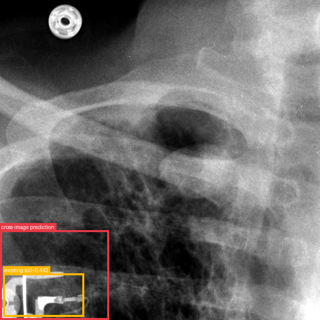</td><td></td></tr>
</table>

- **Target：** `study_001_x_ray_image_000_missing`; X-ray; missing
- **Relation：** `bbox_to_image` / `partial_support`
- **Returned target bbox：** `[0, 720, 342, 1000]`
- **Maximum IoU：** 0.443; threshold=0.5
- **Strong relation IDs：** `[]`

**IoU matching：**

| Existing target bbox | IoU | Strong match | Lingshu caption | 中文翻译 |
|---|---:|---|---|---|
| `study_001_x_ray_image_000_missing_f01`; `[0, 845, 274, 1000]` | 0.443 | no | The image shows a chest x-ray with a red box highlighting a specific area. Within this region, there appears to be a foreign object, possibly a medical device or implant, which is not typically present in a normal chest x-ray. The surrounding lung fields appear relatively clear, without any obvious signs of consolidation, effusion, or pneumothorax. The heart size and mediastinal contours seem within normal limits. However, due to the presence of the foreign object, further evaluation may be necessary to determine its nature and potential implications. | 图像为胸部 X 线片，红框标出了一个特定区域。该区域内似乎存在异物，可能是正常胸片中通常不会出现的医疗器械或植入物。周围肺野相对清晰，未见明显实变、积液或气胸。心影大小及纵隔轮廓似在正常范围内。但由于存在该异物，可能需要进一步评估其性质及潜在影响。 |

**B 图单红框（Lingshu 实际输入）：**

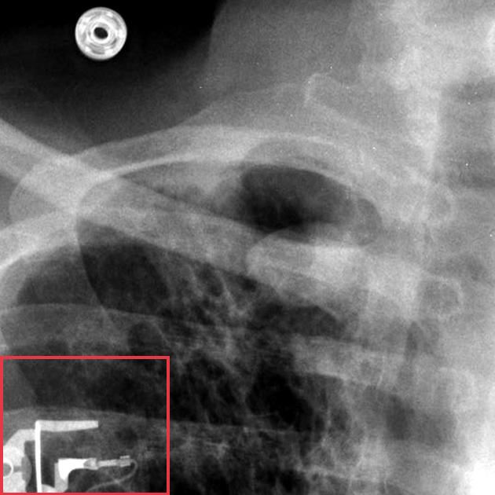

**Re-ground Lingshu caption：** The image shows a chest x-ray with a red box highlighting a specific area. Within this region, there appears to be an opacity or density that could potentially indicate an abnormality. The opacity is located in the lower lung fields, possibly involving the right or left lower lobe. The surrounding lung parenchyma appears relatively clear, without any obvious signs of consolidation, effusion, or other significant abnormalities. However, further evaluation and correlation with clinical findings would be necessary to determine the significance of this finding.
**Re-ground caption 中文翻译：** 图像为胸部 X 线片，红框标出特定区域。框内似有致密影，可能提示异常。该致密影位于下肺野，可能累及右下叶或左下叶。周围肺实质相对清晰，未见明显实变、积液或其他显著异常。但仍需进一步评估并结合临床表现判断其意义。

#### location_00002: STRONG SUPPORT

<table>
<tr><th>Anchor original bbox</th><th>Cross-image grounded target bbox</th><th>Existing target bbox: study_002_ct_image_000_axial_lung_window_f01</th><th>Existing target bbox: study_002_ct_image_000_axial_lung_window_f02</th></tr>
<tr><td></td><td>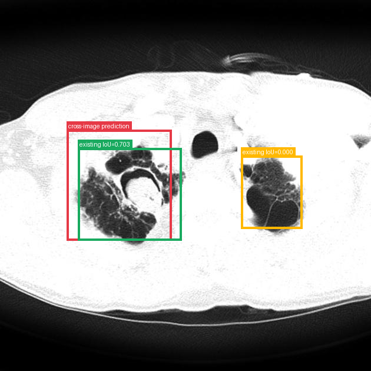</td><td></td><td></td></tr>
</table>

- **Target：** `study_002_ct_image_000_axial_lung_window`; CT; Axial lung window
- **Relation：** `bbox_to_bbox` / `strong_support`
- **Returned target bbox：** `[180, 350, 465, 650]`
- **Maximum IoU：** 0.703; threshold=0.5
- **Strong relation IDs：** `[&#x27;strong_location_00002_01&#x27;]`

**IoU matching：**

| Existing target bbox | IoU | Strong match | Lingshu caption | 中文翻译 |
|---|---:|---|---|---|
| `study_002_ct_image_000_axial_lung_window_f01`; `[200, 390, 500, 660]` | 0.703 | yes | The lungs are hyperinflated. There is a large area of consolidation in the right upper lobe. There is also a smaller area of consolidation in the left upper lobe. The mediastinal contours are normal. | 双肺过度充气。右上叶可见大片实变，左上叶另见较小范围实变。纵隔轮廓正常。 |
| `study_002_ct_image_000_axial_lung_window_f02`; `[641, 410, 826, 628]` | 0.000 | no | The lungs are hyperinflated. There is a large area of consolidation in the left upper lobe. The right upper lobe also shows some areas of consolidation. | 双肺过度充气。左上叶可见大片实变，右上叶也可见部分实变区域。 |

#### location_00003: PARTIAL SUPPORT

<table>
<tr><th>Anchor original bbox</th><th>Cross-image grounded target bbox</th><th>Existing target bbox: study_002_ct_image_001_oblique_lung_window_f01</th></tr>
<tr><td></td><td>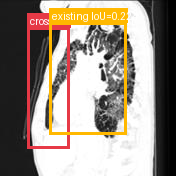</td><td></td></tr>
</table>

- **Target：** `study_002_ct_image_001_oblique_lung_window`; CT; Oblique lung window
- **Relation：** `bbox_to_image` / `partial_support`
- **Returned target bbox：** `[157, 157, 400, 850]`
- **Maximum IoU：** 0.224; threshold=0.5
- **Strong relation IDs：** `[]`

**IoU matching：**

| Existing target bbox | IoU | Strong match | Lingshu caption | 中文翻译 |
|---|---:|---|---|---|
| `study_002_ct_image_001_oblique_lung_window_f01`; `[250, 100, 750, 800]` | 0.224 | no | The lungs are hyperinflated. There is diffuse bronchiectasis and bronchial wall thickening. There is also diffuse ground glass opacity. | 双肺过度充气。可见弥漫性支气管扩张及支气管壁增厚，并有弥漫性磨玻璃密度影。 |

**B 图单红框（Lingshu 实际输入）：**

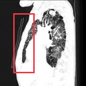

**Re-ground Lingshu caption：** The oblique lung window shows a large area of consolidation in the right upper lobe. The consolidation appears to have a heterogeneous density with areas of increased opacity. There is also evidence of air bronchograms within the consolidated region. The surrounding lung parenchyma appears relatively normal without significant signs of atelectasis or pleural effusion.
**Re-ground caption 中文翻译：** 斜位肺窗显示右上叶大片实变。实变密度不均，内有更高密度区域，并可见空气支气管征。周围肺实质相对正常，未见明显肺不张或胸腔积液。

### Anchor 2: `study_000_x_ray_image_000_frontal_f02`

**Anchor Lingshu caption：** The lungs are hyperinflated. There is diffuse interstitial thickening bilaterally. The heart size is normal. No pneumothorax or pleural effusion seen.
**Anchor caption 中文翻译：** 双肺过度充气。双侧可见弥漫性间质增厚。心影大小正常。未见气胸或胸腔积液。

#### location_00004: NOT SUPPORT

<table>
<tr><th>Anchor original bbox</th><th>Target original image; model returned null</th><th>Existing target bbox: study_001_x_ray_image_000_missing_f01</th></tr>
<tr><td></td><td></td><td></td></tr>
</table>

- **Target：** `study_001_x_ray_image_000_missing`; X-ray; missing
- **Relation：** `bbox_to_image` / `not_support`
- **Returned target bbox：** `unknown`
- **Maximum IoU：** n/a; threshold=0.5
- **Strong relation IDs：** `[]`

**IoU matching：**

| Existing target bbox | IoU | Strong match | Lingshu caption | 中文翻译 |
|---|---:|---|---|---|
| `study_001_x_ray_image_000_missing_f01`; `[0, 845, 274, 1000]` | n/a | n/a | The image shows a chest x-ray with a red box highlighting a specific area. Within this region, there appears to be a foreign object, possibly a medical device or implant, which is not typically present in a normal chest x-ray. The surrounding lung fields appear relatively clear, without any obvious signs of consolidation, effusion, or pneumothorax. The heart size and mediastinal contours seem within normal limits. However, due to the presence of the foreign object, further evaluation may be necessary to determine its nature and potential implications. | 图像为胸部 X 线片，红框标出了一个特定区域。该区域内似乎存在异物，可能是正常胸片中通常不会出现的医疗器械或植入物。周围肺野相对清晰，未见明显实变、积液或气胸。心影大小及纵隔轮廓似在正常范围内。但由于存在该异物，可能需要进一步评估其性质及潜在影响。 |

#### location_00005: STRONG SUPPORT

<table>
<tr><th>Anchor original bbox</th><th>Cross-image grounded target bbox</th><th>Existing target bbox: study_002_ct_image_000_axial_lung_window_f01</th><th>Existing target bbox: study_002_ct_image_000_axial_lung_window_f02</th></tr>
<tr><td></td><td>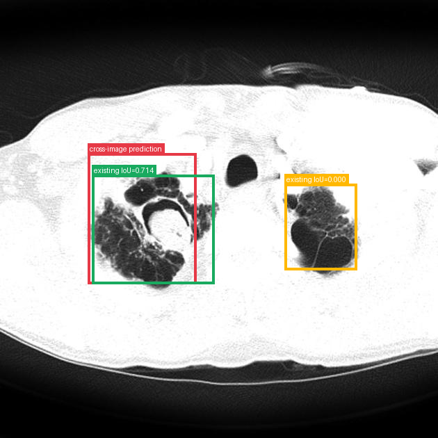</td><td></td><td></td></tr>
</table>

- **Target：** `study_002_ct_image_000_axial_lung_window`; CT; Axial lung window
- **Relation：** `bbox_to_bbox` / `strong_support`
- **Returned target bbox：** `[200, 350, 450, 650]`
- **Maximum IoU：** 0.714; threshold=0.5
- **Strong relation IDs：** `[&#x27;strong_location_00005_01&#x27;]`

**IoU matching：**

| Existing target bbox | IoU | Strong match | Lingshu caption | 中文翻译 |
|---|---:|---|---|---|
| `study_002_ct_image_000_axial_lung_window_f01`; `[200, 390, 500, 660]` | 0.714 | yes | The lungs are hyperinflated. There is a large area of consolidation in the right upper lobe. There is also a smaller area of consolidation in the left upper lobe. The mediastinal contours are normal. | 双肺过度充气。右上叶可见大片实变，左上叶另见较小范围实变。纵隔轮廓正常。 |
| `study_002_ct_image_000_axial_lung_window_f02`; `[641, 410, 826, 628]` | 0.000 | no | The lungs are hyperinflated. There is a large area of consolidation in the left upper lobe. The right upper lobe also shows some areas of consolidation. | 双肺过度充气。左上叶可见大片实变，右上叶也可见部分实变区域。 |

#### location_00006: PARTIAL SUPPORT

<table>
<tr><th>Anchor original bbox</th><th>Cross-image grounded target bbox</th><th>Existing target bbox: study_002_ct_image_001_oblique_lung_window_f01</th></tr>
<tr><td></td><td>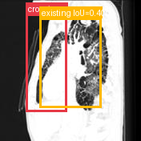</td><td></td></tr>
</table>

- **Target：** `study_002_ct_image_001_oblique_lung_window`; CT; Oblique lung window
- **Relation：** `bbox_to_image` / `partial_support`
- **Returned target bbox：** `[187, 100, 480, 800]`
- **Maximum IoU：** 0.400; threshold=0.5
- **Strong relation IDs：** `[]`

**IoU matching：**

| Existing target bbox | IoU | Strong match | Lingshu caption | 中文翻译 |
|---|---:|---|---|---|
| `study_002_ct_image_001_oblique_lung_window_f01`; `[250, 100, 750, 800]` | 0.400 | no | The lungs are hyperinflated. There is diffuse bronchiectasis and bronchial wall thickening. There is also diffuse ground glass opacity. | 双肺过度充气。可见弥漫性支气管扩张及支气管壁增厚，并有弥漫性磨玻璃密度影。 |

**B 图单红框（Lingshu 实际输入）：**

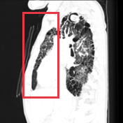

**Re-ground Lingshu caption：** The oblique lung window shows a large area of consolidation in the right upper lobe. The consolidation appears as a dense, white area on the CT scan, indicating a significant amount of fluid or other material filling the alveoli. This finding is consistent with pneumonia or other infectious processes. The surrounding lung tissue appears relatively normal, without any obvious signs of atelectasis or other abnormalities.
**Re-ground caption 中文翻译：** 斜位肺窗显示右上叶大片实变，在 CT 上呈致密白色区，提示肺泡内有大量液体或其他物质充填。该征象符合肺炎或其他感染过程。周围肺组织相对正常，未见明显肺不张或其他异常。

### Anchor 3: `study_000_x_ray_image_000_frontal_f03`

**Anchor Lingshu caption：** The heart size is enlarged. The mediastinal contours are prominent. There is increased opacity throughout both lungs with more pronounced opacities in the lower lobes bilaterally.
**Anchor caption 中文翻译：** 心影增大，纵隔轮廓突出。双肺透亮度普遍降低，双侧下叶的致密影更为明显。

#### location_00007: NOT SUPPORT

<table>
<tr><th>Anchor original bbox</th><th>Target original image; model returned null</th><th>Existing target bbox: study_001_x_ray_image_000_missing_f01</th></tr>
<tr><td></td><td></td><td></td></tr>
</table>

- **Target：** `study_001_x_ray_image_000_missing`; X-ray; missing
- **Relation：** `bbox_to_image` / `not_support`
- **Returned target bbox：** `unknown`
- **Maximum IoU：** n/a; threshold=0.5
- **Strong relation IDs：** `[]`

**IoU matching：**

| Existing target bbox | IoU | Strong match | Lingshu caption | 中文翻译 |
|---|---:|---|---|---|
| `study_001_x_ray_image_000_missing_f01`; `[0, 845, 274, 1000]` | n/a | n/a | The image shows a chest x-ray with a red box highlighting a specific area. Within this region, there appears to be a foreign object, possibly a medical device or implant, which is not typically present in a normal chest x-ray. The surrounding lung fields appear relatively clear, without any obvious signs of consolidation, effusion, or pneumothorax. The heart size and mediastinal contours seem within normal limits. However, due to the presence of the foreign object, further evaluation may be necessary to determine its nature and potential implications. | 图像为胸部 X 线片，红框标出了一个特定区域。该区域内似乎存在异物，可能是正常胸片中通常不会出现的医疗器械或植入物。周围肺野相对清晰，未见明显实变、积液或气胸。心影大小及纵隔轮廓似在正常范围内。但由于存在该异物，可能需要进一步评估其性质及潜在影响。 |

#### location_00008: NOT SUPPORT

<table>
<tr><th>Anchor original bbox</th><th>Target original image; model returned null</th><th>Existing target bbox: study_002_ct_image_000_axial_lung_window_f01</th><th>Existing target bbox: study_002_ct_image_000_axial_lung_window_f02</th></tr>
<tr><td></td><td></td><td></td><td></td></tr>
</table>

- **Target：** `study_002_ct_image_000_axial_lung_window`; CT; Axial lung window
- **Relation：** `bbox_to_image` / `not_support`
- **Returned target bbox：** `unknown`
- **Maximum IoU：** n/a; threshold=0.5
- **Strong relation IDs：** `[]`

**IoU matching：**

| Existing target bbox | IoU | Strong match | Lingshu caption | 中文翻译 |
|---|---:|---|---|---|
| `study_002_ct_image_000_axial_lung_window_f01`; `[200, 390, 500, 660]` | n/a | n/a | The lungs are hyperinflated. There is a large area of consolidation in the right upper lobe. There is also a smaller area of consolidation in the left upper lobe. The mediastinal contours are normal. | 双肺过度充气。右上叶可见大片实变，左上叶另见较小范围实变。纵隔轮廓正常。 |
| `study_002_ct_image_000_axial_lung_window_f02`; `[641, 410, 826, 628]` | n/a | n/a | The lungs are hyperinflated. There is a large area of consolidation in the left upper lobe. The right upper lobe also shows some areas of consolidation. | 双肺过度充气。左上叶可见大片实变，右上叶也可见部分实变区域。 |

#### location_00009: PARTIAL SUPPORT

<table>
<tr><th>Anchor original bbox</th><th>Cross-image grounded target bbox</th><th>Existing target bbox: study_002_ct_image_001_oblique_lung_window_f01</th></tr>
<tr><td></td><td>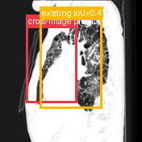</td><td></td></tr>
</table>

- **Target：** `study_002_ct_image_001_oblique_lung_window`; CT; Oblique lung window
- **Relation：** `bbox_to_image` / `partial_support`
- **Returned target bbox：** `[184, 184, 548, 732]`
- **Maximum IoU：** 0.417; threshold=0.5
- **Strong relation IDs：** `[]`

**IoU matching：**

| Existing target bbox | IoU | Strong match | Lingshu caption | 中文翻译 |
|---|---:|---|---|---|
| `study_002_ct_image_001_oblique_lung_window_f01`; `[250, 100, 750, 800]` | 0.417 | no | The lungs are hyperinflated. There is diffuse bronchiectasis and bronchial wall thickening. There is also diffuse ground glass opacity. | 双肺过度充气。可见弥漫性支气管扩张及支气管壁增厚，并有弥漫性磨玻璃密度影。 |

**B 图单红框（Lingshu 实际输入）：**

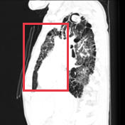

**Re-ground Lingshu caption：** The lungs are hyperinflated. There is diffuse bronchiectasis and bronchial wall thickening. There is a large area of consolidation in the right upper lobe. There is also a smaller area of consolidation in the left upper lobe.
**Re-ground caption 中文翻译：** 双肺过度充气。可见弥漫性支气管扩张和支气管壁增厚。右上叶可见大片实变，左上叶另见较小范围实变。

### Anchor 4: `study_001_x_ray_image_000_missing_f01`

**Anchor Lingshu caption：** The image shows a chest x-ray with a red box highlighting a specific area. Within this region, there appears to be a foreign object, possibly a medical device or implant, which is not typically present in a normal chest x-ray. The surrounding lung fields appear relatively clear, without any obvious signs of consolidation, effusion, or pneumothorax. The heart size and mediastinal contours seem within normal limits. However, due to the presence of the foreign object, further evaluation may be necessary to determine its nature and potential implications.
**Anchor caption 中文翻译：** 图像为胸部 X 线片，红框标出了一个特定区域。该区域内似乎存在异物，可能是正常胸片中通常不会出现的医疗器械或植入物。周围肺野相对清晰，未见明显实变、积液或气胸。心影大小及纵隔轮廓似在正常范围内。但由于存在该异物，可能需要进一步评估其性质及潜在影响。

#### location_00010: NOT SUPPORT

<table>
<tr><th>Anchor original bbox</th><th>Target original image; model returned null</th><th>Existing target bbox: study_002_ct_image_000_axial_lung_window_f01</th><th>Existing target bbox: study_002_ct_image_000_axial_lung_window_f02</th></tr>
<tr><td></td><td></td><td></td><td></td></tr>
</table>

- **Target：** `study_002_ct_image_000_axial_lung_window`; CT; Axial lung window
- **Relation：** `bbox_to_image` / `not_support`
- **Returned target bbox：** `unknown`
- **Maximum IoU：** n/a; threshold=0.5
- **Strong relation IDs：** `[]`

**IoU matching：**

| Existing target bbox | IoU | Strong match | Lingshu caption | 中文翻译 |
|---|---:|---|---|---|
| `study_002_ct_image_000_axial_lung_window_f01`; `[200, 390, 500, 660]` | n/a | n/a | The lungs are hyperinflated. There is a large area of consolidation in the right upper lobe. There is also a smaller area of consolidation in the left upper lobe. The mediastinal contours are normal. | 双肺过度充气。右上叶可见大片实变，左上叶另见较小范围实变。纵隔轮廓正常。 |
| `study_002_ct_image_000_axial_lung_window_f02`; `[641, 410, 826, 628]` | n/a | n/a | The lungs are hyperinflated. There is a large area of consolidation in the left upper lobe. The right upper lobe also shows some areas of consolidation. | 双肺过度充气。左上叶可见大片实变，右上叶也可见部分实变区域。 |

#### location_00011: NOT SUPPORT

<table>
<tr><th>Anchor original bbox</th><th>Target original image; model returned null</th><th>Existing target bbox: study_002_ct_image_001_oblique_lung_window_f01</th></tr>
<tr><td></td><td></td><td></td></tr>
</table>

- **Target：** `study_002_ct_image_001_oblique_lung_window`; CT; Oblique lung window
- **Relation：** `bbox_to_image` / `not_support`
- **Returned target bbox：** `unknown`
- **Maximum IoU：** n/a; threshold=0.5
- **Strong relation IDs：** `[]`

**IoU matching：**

| Existing target bbox | IoU | Strong match | Lingshu caption | 中文翻译 |
|---|---:|---|---|---|
| `study_002_ct_image_001_oblique_lung_window_f01`; `[250, 100, 750, 800]` | n/a | n/a | The lungs are hyperinflated. There is diffuse bronchiectasis and bronchial wall thickening. There is also diffuse ground glass opacity. | 双肺过度充气。可见弥漫性支气管扩张及支气管壁增厚，并有弥漫性磨玻璃密度影。 |

### Anchor 5: `study_002_ct_image_000_axial_lung_window_f02`

**Anchor Lingshu caption：** The lungs are hyperinflated. There is a large area of consolidation in the left upper lobe. The right upper lobe also shows some areas of consolidation.
**Anchor caption 中文翻译：** 双肺过度充气。左上叶可见大片实变，右上叶也可见部分实变区域。

#### location_00013: PARTIAL SUPPORT

<table>
<tr><th>Anchor original bbox</th><th>Cross-image grounded target bbox</th><th>Existing target bbox: study_002_ct_image_001_oblique_lung_window_f01</th></tr>
<tr><td></td><td>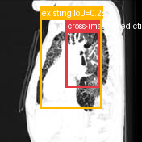</td><td></td></tr>
</table>

- **Target：** `study_002_ct_image_001_oblique_lung_window`; CT; Oblique lung window
- **Relation：** `bbox_to_image` / `partial_support`
- **Returned target bbox：** `[462, 220, 710, 620]`
- **Maximum IoU：** 0.282; threshold=0.5
- **Strong relation IDs：** `[]`

**IoU matching：**

| Existing target bbox | IoU | Strong match | Lingshu caption | 中文翻译 |
|---|---:|---|---|---|
| `study_002_ct_image_001_oblique_lung_window_f01`; `[250, 100, 750, 800]` | 0.282 | no | The lungs are hyperinflated. There is diffuse bronchiectasis and bronchial wall thickening. There is also diffuse ground glass opacity. | 双肺过度充气。可见弥漫性支气管扩张及支气管壁增厚，并有弥漫性磨玻璃密度影。 |

**B 图单红框（Lingshu 实际输入）：**

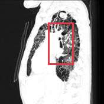

**Re-ground Lingshu caption：** The oblique lung window shows a large area of consolidation in the right upper lobe. The consolidation appears to have a heterogeneous density with some areas appearing more opaque than others. There is also evidence of air bronchograms within the consolidated area. The surrounding lung parenchyma appears relatively normal without any significant abnormalities.
**Re-ground caption 中文翻译：** 斜位肺窗显示右上叶大片实变，密度不均，部分区域更为致密。实变区内可见空气支气管征。周围肺实质相对正常，未见其他明显异常。

## Dynamically Skipped Anchors

| Anchor node | Reused strong relations | Skipped target images |
|---|---|---|
| `study_002_ct_image_000_axial_lung_window_f01` | `[&#x27;strong_location_00002_01&#x27;, &#x27;strong_location_00005_01&#x27;]` | `[&#x27;study_002_ct_image_001_oblique_lung_window&#x27;]` |

## Case-level Location Validation Summary / 病例级定位验证总结

- **Strong support：** 2 个 bbox-to-bbox 关系
- **Partial support：** 5 个 bbox-to-image 关系
- **Not support：** 5 个 bbox-to-image 关系

### Strong Support

#### Strong 1: `study_000_x_ray_image_000_frontal_f01` ↔ `study_002_ct_image_000_axial_lung_window_f01`

- **Relation / query：** `strong_location_00002_01` / `location_00002`
- **IoU：** 0.703（threshold=0.5）

<table>
<tr><th>Anchor bbox</th><th>Cross-image grounded target bbox</th><th>Matched target bbox</th></tr>
<tr><td></td><td></td><td></td></tr>
</table>

- **Anchor Lingshu caption：** The lungs are hyperinflated. There is diffuse interstitial thickening bilaterally. The heart size is normal. No pneumothorax or pleural effusion seen.
- **Anchor caption 中文翻译：** 双肺过度充气。双侧可见弥漫性间质增厚。心影大小正常。未见气胸或胸腔积液。
- **Target Lingshu caption：** The lungs are hyperinflated. There is a large area of consolidation in the right upper lobe. There is also a smaller area of consolidation in the left upper lobe. The mediastinal contours are normal.
- **Target caption 中文翻译：** 双肺过度充气。右上叶可见大片实变，左上叶另见较小范围实变。纵隔轮廓正常。

#### Strong 2: `study_000_x_ray_image_000_frontal_f02` ↔ `study_002_ct_image_000_axial_lung_window_f01`

- **Relation / query：** `strong_location_00005_01` / `location_00005`
- **IoU：** 0.714（threshold=0.5）

<table>
<tr><th>Anchor bbox</th><th>Cross-image grounded target bbox</th><th>Matched target bbox</th></tr>
<tr><td></td><td></td><td></td></tr>
</table>

- **Anchor Lingshu caption：** The lungs are hyperinflated. There is diffuse interstitial thickening bilaterally. The heart size is normal. No pneumothorax or pleural effusion seen.
- **Anchor caption 中文翻译：** 双肺过度充气。双侧可见弥漫性间质增厚。心影大小正常。未见气胸或胸腔积液。
- **Target Lingshu caption：** The lungs are hyperinflated. There is a large area of consolidation in the right upper lobe. There is also a smaller area of consolidation in the left upper lobe. The mediastinal contours are normal.
- **Target caption 中文翻译：** 双肺过度充气。右上叶可见大片实变，左上叶另见较小范围实变。纵隔轮廓正常。

### Partial Support

#### Partial 1: `study_000_x_ray_image_000_frontal_f01` → `study_001_x_ray_image_000_missing`

- **Query：** `location_00001`
- **Returned target bbox：** `[0, 720, 342, 1000]`
- **Maximum IoU：** 0.443（低于 threshold=0.5）

<table>
<tr><th>Anchor bbox</th><th>Cross-image grounding and IoU overlay</th><th>B image with the single re-grounded bbox given to Lingshu</th><th>Closest existing target bbox</th></tr>
<tr><td></td><td></td><td></td><td></td></tr>
</table>

- **A 端原始 Lingshu caption：** The lungs are hyperinflated. There is diffuse interstitial thickening bilaterally. The heart size is normal. No pneumothorax or pleural effusion seen.
- **A 端 caption 中文翻译：** 双肺过度充气。双侧可见弥漫性间质增厚。心影大小正常。未见气胸或胸腔积液。
- **B 端 re-ground Lingshu caption：** The image shows a chest x-ray with a red box highlighting a specific area. Within this region, there appears to be an opacity or density that could potentially indicate an abnormality. The opacity is located in the lower lung fields, possibly involving the right or left lower lobe. The surrounding lung parenchyma appears relatively clear, without any obvious signs of consolidation, effusion, or other significant abnormalities. However, further evaluation and correlation with clinical findings would be necessary to determine the significance of this finding.
- **B 端 re-ground caption 中文翻译：** 图像为胸部 X 线片，红框标出特定区域。框内似有致密影，可能提示异常。该致密影位于下肺野，可能累及右下叶或左下叶。周围肺实质相对清晰，未见明显实变、积液或其他显著异常。但仍需进一步评估并结合临床表现判断其意义。

#### Partial 2: `study_000_x_ray_image_000_frontal_f01` → `study_002_ct_image_001_oblique_lung_window`

- **Query：** `location_00003`
- **Returned target bbox：** `[157, 157, 400, 850]`
- **Maximum IoU：** 0.224（低于 threshold=0.5）

<table>
<tr><th>Anchor bbox</th><th>Cross-image grounding and IoU overlay</th><th>B image with the single re-grounded bbox given to Lingshu</th><th>Closest existing target bbox</th></tr>
<tr><td></td><td></td><td></td><td></td></tr>
</table>

- **A 端原始 Lingshu caption：** The lungs are hyperinflated. There is diffuse interstitial thickening bilaterally. The heart size is normal. No pneumothorax or pleural effusion seen.
- **A 端 caption 中文翻译：** 双肺过度充气。双侧可见弥漫性间质增厚。心影大小正常。未见气胸或胸腔积液。
- **B 端 re-ground Lingshu caption：** The oblique lung window shows a large area of consolidation in the right upper lobe. The consolidation appears to have a heterogeneous density with areas of increased opacity. There is also evidence of air bronchograms within the consolidated region. The surrounding lung parenchyma appears relatively normal without significant signs of atelectasis or pleural effusion.
- **B 端 re-ground caption 中文翻译：** 斜位肺窗显示右上叶大片实变。实变密度不均，内有更高密度区域，并可见空气支气管征。周围肺实质相对正常，未见明显肺不张或胸腔积液。

#### Partial 3: `study_000_x_ray_image_000_frontal_f02` → `study_002_ct_image_001_oblique_lung_window`

- **Query：** `location_00006`
- **Returned target bbox：** `[187, 100, 480, 800]`
- **Maximum IoU：** 0.400（低于 threshold=0.5）

<table>
<tr><th>Anchor bbox</th><th>Cross-image grounding and IoU overlay</th><th>B image with the single re-grounded bbox given to Lingshu</th><th>Closest existing target bbox</th></tr>
<tr><td></td><td></td><td></td><td></td></tr>
</table>

- **A 端原始 Lingshu caption：** The lungs are hyperinflated. There is diffuse interstitial thickening bilaterally. The heart size is normal. No pneumothorax or pleural effusion seen.
- **A 端 caption 中文翻译：** 双肺过度充气。双侧可见弥漫性间质增厚。心影大小正常。未见气胸或胸腔积液。
- **B 端 re-ground Lingshu caption：** The oblique lung window shows a large area of consolidation in the right upper lobe. The consolidation appears as a dense, white area on the CT scan, indicating a significant amount of fluid or other material filling the alveoli. This finding is consistent with pneumonia or other infectious processes. The surrounding lung tissue appears relatively normal, without any obvious signs of atelectasis or other abnormalities.
- **B 端 re-ground caption 中文翻译：** 斜位肺窗显示右上叶大片实变，在 CT 上呈致密白色区，提示肺泡内有大量液体或其他物质充填。该征象符合肺炎或其他感染过程。周围肺组织相对正常，未见明显肺不张或其他异常。

#### Partial 4: `study_000_x_ray_image_000_frontal_f03` → `study_002_ct_image_001_oblique_lung_window`

- **Query：** `location_00009`
- **Returned target bbox：** `[184, 184, 548, 732]`
- **Maximum IoU：** 0.417（低于 threshold=0.5）

<table>
<tr><th>Anchor bbox</th><th>Cross-image grounding and IoU overlay</th><th>B image with the single re-grounded bbox given to Lingshu</th><th>Closest existing target bbox</th></tr>
<tr><td></td><td></td><td></td><td></td></tr>
</table>

- **A 端原始 Lingshu caption：** The heart size is enlarged. The mediastinal contours are prominent. There is increased opacity throughout both lungs with more pronounced opacities in the lower lobes bilaterally.
- **A 端 caption 中文翻译：** 心影增大，纵隔轮廓突出。双肺透亮度普遍降低，双侧下叶的致密影更为明显。
- **B 端 re-ground Lingshu caption：** The lungs are hyperinflated. There is diffuse bronchiectasis and bronchial wall thickening. There is a large area of consolidation in the right upper lobe. There is also a smaller area of consolidation in the left upper lobe.
- **B 端 re-ground caption 中文翻译：** 双肺过度充气。可见弥漫性支气管扩张和支气管壁增厚。右上叶可见大片实变，左上叶另见较小范围实变。

#### Partial 5: `study_002_ct_image_000_axial_lung_window_f02` → `study_002_ct_image_001_oblique_lung_window`

- **Query：** `location_00013`
- **Returned target bbox：** `[462, 220, 710, 620]`
- **Maximum IoU：** 0.282（低于 threshold=0.5）

<table>
<tr><th>Anchor bbox</th><th>Cross-image grounding and IoU overlay</th><th>B image with the single re-grounded bbox given to Lingshu</th><th>Closest existing target bbox</th></tr>
<tr><td></td><td></td><td></td><td></td></tr>
</table>

- **A 端原始 Lingshu caption：** The lungs are hyperinflated. There is a large area of consolidation in the left upper lobe. The right upper lobe also shows some areas of consolidation.
- **A 端 caption 中文翻译：** 双肺过度充气。左上叶可见大片实变，右上叶也可见部分实变区域。
- **B 端 re-ground Lingshu caption：** The oblique lung window shows a large area of consolidation in the right upper lobe. The consolidation appears to have a heterogeneous density with some areas appearing more opaque than others. There is also evidence of air bronchograms within the consolidated area. The surrounding lung parenchyma appears relatively normal without any significant abnormalities.
- **B 端 re-ground caption 中文翻译：** 斜位肺窗显示右上叶大片实变，密度不均，部分区域更为致密。实变区内可见空气支气管征。周围肺实质相对正常，未见其他明显异常。

### Not Support

#### Not support 1: `study_000_x_ray_image_000_frontal_f02` → `study_001_x_ray_image_000_missing`

- **Query：** `location_00004`
- **Result：** 目标图返回 `null`，未定位到对应区域。

<table>
<tr><th>Anchor bbox</th><th>Target original image</th></tr>
<tr><td></td><td></td></tr>
</table>

- **A 端原始 Lingshu caption：** The lungs are hyperinflated. There is diffuse interstitial thickening bilaterally. The heart size is normal. No pneumothorax or pleural effusion seen.
- **A 端 caption 中文翻译：** 双肺过度充气。双侧可见弥漫性间质增厚。心影大小正常。未见气胸或胸腔积液。
- **B 端 re-ground caption：** 不适用；目标图返回 `null`，没有生成 re-ground bbox。

#### Not support 2: `study_000_x_ray_image_000_frontal_f03` → `study_001_x_ray_image_000_missing`

- **Query：** `location_00007`
- **Result：** 目标图返回 `null`，未定位到对应区域。

<table>
<tr><th>Anchor bbox</th><th>Target original image</th></tr>
<tr><td></td><td></td></tr>
</table>

- **A 端原始 Lingshu caption：** The heart size is enlarged. The mediastinal contours are prominent. There is increased opacity throughout both lungs with more pronounced opacities in the lower lobes bilaterally.
- **A 端 caption 中文翻译：** 心影增大，纵隔轮廓突出。双肺透亮度普遍降低，双侧下叶的致密影更为明显。
- **B 端 re-ground caption：** 不适用；目标图返回 `null`，没有生成 re-ground bbox。

#### Not support 3: `study_000_x_ray_image_000_frontal_f03` → `study_002_ct_image_000_axial_lung_window`

- **Query：** `location_00008`
- **Result：** 目标图返回 `null`，未定位到对应区域。

<table>
<tr><th>Anchor bbox</th><th>Target original image</th></tr>
<tr><td></td><td></td></tr>
</table>

- **A 端原始 Lingshu caption：** The heart size is enlarged. The mediastinal contours are prominent. There is increased opacity throughout both lungs with more pronounced opacities in the lower lobes bilaterally.
- **A 端 caption 中文翻译：** 心影增大，纵隔轮廓突出。双肺透亮度普遍降低，双侧下叶的致密影更为明显。
- **B 端 re-ground caption：** 不适用；目标图返回 `null`，没有生成 re-ground bbox。

#### Not support 4: `study_001_x_ray_image_000_missing_f01` → `study_002_ct_image_000_axial_lung_window`

- **Query：** `location_00010`
- **Result：** 目标图返回 `null`，未定位到对应区域。

<table>
<tr><th>Anchor bbox</th><th>Target original image</th></tr>
<tr><td></td><td></td></tr>
</table>

- **A 端原始 Lingshu caption：** The image shows a chest x-ray with a red box highlighting a specific area. Within this region, there appears to be a foreign object, possibly a medical device or implant, which is not typically present in a normal chest x-ray. The surrounding lung fields appear relatively clear, without any obvious signs of consolidation, effusion, or pneumothorax. The heart size and mediastinal contours seem within normal limits. However, due to the presence of the foreign object, further evaluation may be necessary to determine its nature and potential implications.
- **A 端 caption 中文翻译：** 图像为胸部 X 线片，红框标出了一个特定区域。该区域内似乎存在异物，可能是正常胸片中通常不会出现的医疗器械或植入物。周围肺野相对清晰，未见明显实变、积液或气胸。心影大小及纵隔轮廓似在正常范围内。但由于存在该异物，可能需要进一步评估其性质及潜在影响。
- **B 端 re-ground caption：** 不适用；目标图返回 `null`，没有生成 re-ground bbox。

#### Not support 5: `study_001_x_ray_image_000_missing_f01` → `study_002_ct_image_001_oblique_lung_window`

- **Query：** `location_00011`
- **Result：** 目标图返回 `null`，未定位到对应区域。

<table>
<tr><th>Anchor bbox</th><th>Target original image</th></tr>
<tr><td></td><td></td></tr>
</table>

- **A 端原始 Lingshu caption：** The image shows a chest x-ray with a red box highlighting a specific area. Within this region, there appears to be a foreign object, possibly a medical device or implant, which is not typically present in a normal chest x-ray. The surrounding lung fields appear relatively clear, without any obvious signs of consolidation, effusion, or pneumothorax. The heart size and mediastinal contours seem within normal limits. However, due to the presence of the foreign object, further evaluation may be necessary to determine its nature and potential implications.
- **A 端 caption 中文翻译：** 图像为胸部 X 线片，红框标出了一个特定区域。该区域内似乎存在异物，可能是正常胸片中通常不会出现的医疗器械或植入物。周围肺野相对清晰，未见明显实变、积液或气胸。心影大小及纵隔轮廓似在正常范围内。但由于存在该异物，可能需要进一步评估其性质及潜在影响。
- **B 端 re-ground caption：** 不适用；目标图返回 `null`，没有生成 re-ground bbox。
