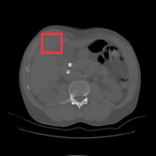

# Calcified abdominal lymph nodes

[返回 Step 3 总览](../README_STEP3_VISUALIZATION.md)

- **Case ID：** `calcified-abdominal-lymph-nodes`
- **Case URL：** [https://radiopaedia.org/cases/calcified-abdominal-lymph-nodes?lang=us](https://radiopaedia.org/cases/calcified-abdominal-lymph-nodes?lang=us)
- **验证模型：** Qwen3-VL-8B
- **图像 / Step 2 findings：** 5 / 5
- **定位结果：** strong 0；partial 1；not support 3；parse error 0
- **Strong bbox relations：** 0
- **原始 JSON：** [case_evidence.json](../assets_step3/calcified-abdominal-lymph-nodes/case_evidence.json)
- **定量/定性验证 JSON：** [step_3_validation_case_evidence.json](../assets_step3/calcified-abdominal-lymph-nodes/step_3_validation_case_evidence.json)

**Overlay 图例：** 红框为跨图新定位；绿框为 IoU >= 0.5 的已有 bbox；黄框为未达到阈值的已有 bbox。

## Step 2 Finding Nodes

### Finding 1: `study_000_x_ray_image_001_lateral_f01`

- **Modality / subcategory：** X-ray / Lateral
- **bbox_2d：** `[474, 392, 586, 674]`
- **Lingshu caption：** The lungs are hyperinflated. There is a large rounded opacity projecting over the right hilum. The heart size is normal. No pleural effusion or pneumothorax.
- **中文翻译：** 双肺过度充气。右肺门投影区可见较大的圆形致密影。心影大小正常。未见胸腔积液或气胸。

### Finding 2: `study_001_ct_image_000_axial_bone_window_f01`

- **Modality / subcategory：** CT / Axial bone window
- **bbox_2d：** `[350, 300, 450, 400]`
- **Lingshu caption：** The image shows a lesion in the right lobe of the liver. The lesion appears to be hypodense compared to the surrounding liver parenchyma. There is no evidence of calcification or hemorrhage within the lesion. The lesion is well-circumscribed and does not appear to invade the surrounding structures. The adjacent liver parenchyma appears normal without any signs of cirrhosis or other abnormalities.
- **中文翻译：** 图像显示肝右叶病灶，其密度低于周围肝实质。病灶内未见钙化或出血征象，边界清楚，似未侵犯周围结构。邻近肝实质表现正常，未见肝硬化或其他异常征象。

### Finding 3: `study_001_ct_image_001_axial_bone_window_f01`

- **Modality / subcategory：** CT / Axial bone window
- **bbox_2d：** `[430, 300, 570, 420]`
- **Lingshu caption：** The red box is located over the right upper quadrant of the abdomen. There is no definite focal lesion identified within the liver. The liver is of normal size and attenuation. No intrahepatic biliary ductal dilatation is seen.
- **中文翻译：** 红框位于右上腹。肝内未发现明确局灶性病变。肝脏大小及密度正常，未见肝内胆管扩张。

### Finding 4: `study_001_ct_image_001_axial_bone_window_f02`

- **Modality / subcategory：** CT / Axial bone window
- **bbox_2d：** `[620, 260, 780, 380]`
- **Lingshu caption：** The red box is located over the left upper quadrant. There is a large amount of free intraperitoneal air. The liver is unremarkable. The spleen is not well seen. The stomach is distended with air. The pancreas is partially obscured by the stomach. The kidneys are unremarkable. There is no evidence of lymphadenopathy. There is no pleural effusion or pneumothorax. The visualized osseous structures are unremarkable.
- **中文翻译：** 红框位于左上腹。腹腔内可见大量游离气体。肝脏未见异常，脾脏显示不清。胃腔充气扩张，胰腺部分被胃遮挡。双肾未见异常。未见淋巴结肿大、胸腔积液或气胸。所见骨性结构无明显异常。

### Finding 5: `study_001_ct_image_001_axial_bone_window_f03`

- **Modality / subcategory：** CT / Axial bone window
- **bbox_2d：** `[300, 240, 420, 360]`
- **Lingshu caption：** The image shows a cross-sectional view of the abdomen, with a focus on the liver region. Within the boxed area, there appears to be a distinct lesion or abnormality present. The lesion exhibits a heterogeneous appearance, with areas of varying density and attenuation. It is difficult to determine the exact nature of this finding without additional clinical information or further imaging studies. However, the presence of this lesion warrants further investigation to determine its underlying cause and potential clinical significance.
- **中文翻译：** 图像为腹部横断面，重点显示肝区。框内似有一个明确病灶或异常，呈不均质表现，包含不同密度和衰减区域。缺少更多临床资料或进一步影像检查时难以确定其确切性质，但该病灶值得进一步检查，以明确病因及潜在临床意义。

## Directed Cross-image Validation

### Anchor 1: `study_000_x_ray_image_001_lateral_f01`

**Anchor Lingshu caption：** The lungs are hyperinflated. There is a large rounded opacity projecting over the right hilum. The heart size is normal. No pleural effusion or pneumothorax.
**Anchor caption 中文翻译：** 双肺过度充气。右肺门投影区可见较大的圆形致密影。心影大小正常。未见胸腔积液或气胸。

#### location_00001: NOT SUPPORT

<table>
<tr><th>Anchor original bbox</th><th>Target original image; model returned null</th></tr>
<tr><td></td><td></td></tr>
</table>

- **Target：** `study_000_x_ray_image_002_dual_energy_bone_window`; X-ray; Dual energy bone window
- **Relation：** `bbox_to_image` / `not_support`
- **Returned target bbox：** `unknown`
- **Maximum IoU：** n/a; threshold=0.5
- **Strong relation IDs：** `[]`

**IoU matching：**

The target image has no existing Step 2 bbox.

#### location_00002: NOT SUPPORT

<table>
<tr><th>Anchor original bbox</th><th>Target original image; model returned null</th><th>Existing target bbox: study_001_ct_image_000_axial_bone_window_f01</th></tr>
<tr><td></td><td></td><td></td></tr>
</table>

- **Target：** `study_001_ct_image_000_axial_bone_window`; CT; Axial bone window
- **Relation：** `bbox_to_image` / `not_support`
- **Returned target bbox：** `unknown`
- **Maximum IoU：** n/a; threshold=0.5
- **Strong relation IDs：** `[]`

**IoU matching：**

| Existing target bbox | IoU | Strong match | Lingshu caption | 中文翻译 |
|---|---:|---|---|---|
| `study_001_ct_image_000_axial_bone_window_f01`; `[350, 300, 450, 400]` | n/a | n/a | The image shows a lesion in the right lobe of the liver. The lesion appears to be hypodense compared to the surrounding liver parenchyma. There is no evidence of calcification or hemorrhage within the lesion. The lesion is well-circumscribed and does not appear to invade the surrounding structures. The adjacent liver parenchyma appears normal without any signs of cirrhosis or other abnormalities. | 图像显示肝右叶病灶，其密度低于周围肝实质。病灶内未见钙化或出血征象，边界清楚，似未侵犯周围结构。邻近肝实质表现正常，未见肝硬化或其他异常征象。 |

#### location_00003: NOT SUPPORT

<table>
<tr><th>Anchor original bbox</th><th>Target original image; model returned null</th><th>Existing target bbox: study_001_ct_image_001_axial_bone_window_f01</th><th>Existing target bbox: study_001_ct_image_001_axial_bone_window_f02</th><th>Existing target bbox: study_001_ct_image_001_axial_bone_window_f03</th></tr>
<tr><td></td><td></td><td></td><td></td><td></td></tr>
</table>

- **Target：** `study_001_ct_image_001_axial_bone_window`; CT; Axial bone window
- **Relation：** `bbox_to_image` / `not_support`
- **Returned target bbox：** `unknown`
- **Maximum IoU：** n/a; threshold=0.5
- **Strong relation IDs：** `[]`

**IoU matching：**

| Existing target bbox | IoU | Strong match | Lingshu caption | 中文翻译 |
|---|---:|---|---|---|
| `study_001_ct_image_001_axial_bone_window_f01`; `[430, 300, 570, 420]` | n/a | n/a | The red box is located over the right upper quadrant of the abdomen. There is no definite focal lesion identified within the liver. The liver is of normal size and attenuation. No intrahepatic biliary ductal dilatation is seen. | 红框位于右上腹。肝内未发现明确局灶性病变。肝脏大小及密度正常，未见肝内胆管扩张。 |
| `study_001_ct_image_001_axial_bone_window_f02`; `[620, 260, 780, 380]` | n/a | n/a | The red box is located over the left upper quadrant. There is a large amount of free intraperitoneal air. The liver is unremarkable. The spleen is not well seen. The stomach is distended with air. The pancreas is partially obscured by the stomach. The kidneys are unremarkable. There is no evidence of lymphadenopathy. There is no pleural effusion or pneumothorax. The visualized osseous structures are unremarkable. | 红框位于左上腹。腹腔内可见大量游离气体。肝脏未见异常，脾脏显示不清。胃腔充气扩张，胰腺部分被胃遮挡。双肾未见异常。未见淋巴结肿大、胸腔积液或气胸。所见骨性结构无明显异常。 |
| `study_001_ct_image_001_axial_bone_window_f03`; `[300, 240, 420, 360]` | n/a | n/a | The image shows a cross-sectional view of the abdomen, with a focus on the liver region. Within the boxed area, there appears to be a distinct lesion or abnormality present. The lesion exhibits a heterogeneous appearance, with areas of varying density and attenuation. It is difficult to determine the exact nature of this finding without additional clinical information or further imaging studies. However, the presence of this lesion warrants further investigation to determine its underlying cause and potential clinical significance. | 图像为腹部横断面，重点显示肝区。框内似有一个明确病灶或异常，呈不均质表现，包含不同密度和衰减区域。缺少更多临床资料或进一步影像检查时难以确定其确切性质，但该病灶值得进一步检查，以明确病因及潜在临床意义。 |

### Anchor 2: `study_001_ct_image_000_axial_bone_window_f01`

**Anchor Lingshu caption：** The image shows a lesion in the right lobe of the liver. The lesion appears to be hypodense compared to the surrounding liver parenchyma. There is no evidence of calcification or hemorrhage within the lesion. The lesion is well-circumscribed and does not appear to invade the surrounding structures. The adjacent liver parenchyma appears normal without any signs of cirrhosis or other abnormalities.
**Anchor caption 中文翻译：** 图像显示肝右叶病灶，其密度低于周围肝实质。病灶内未见钙化或出血征象，边界清楚，似未侵犯周围结构。邻近肝实质表现正常，未见肝硬化或其他异常征象。

#### location_00004: PARTIAL SUPPORT

<table>
<tr><th>Anchor original bbox</th><th>Cross-image grounded target bbox</th><th>Existing target bbox: study_001_ct_image_001_axial_bone_window_f01</th><th>Existing target bbox: study_001_ct_image_001_axial_bone_window_f02</th><th>Existing target bbox: study_001_ct_image_001_axial_bone_window_f03</th></tr>
<tr><td></td><td></td><td></td><td></td><td></td></tr>
</table>

- **Target：** `study_001_ct_image_001_axial_bone_window`; CT; Axial bone window
- **Relation：** `bbox_to_image` / `partial_support`
- **Returned target bbox：** `[266, 212, 398, 344]`
- **Maximum IoU：** 0.484; threshold=0.5
- **Strong relation IDs：** `[]`

**IoU matching：**

| Existing target bbox | IoU | Strong match | Lingshu caption | 中文翻译 |
|---|---:|---|---|---|
| `study_001_ct_image_001_axial_bone_window_f01`; `[430, 300, 570, 420]` | 0.000 | no | The red box is located over the right upper quadrant of the abdomen. There is no definite focal lesion identified within the liver. The liver is of normal size and attenuation. No intrahepatic biliary ductal dilatation is seen. | 红框位于右上腹。肝内未发现明确局灶性病变。肝脏大小及密度正常，未见肝内胆管扩张。 |
| `study_001_ct_image_001_axial_bone_window_f02`; `[620, 260, 780, 380]` | 0.000 | no | The red box is located over the left upper quadrant. There is a large amount of free intraperitoneal air. The liver is unremarkable. The spleen is not well seen. The stomach is distended with air. The pancreas is partially obscured by the stomach. The kidneys are unremarkable. There is no evidence of lymphadenopathy. There is no pleural effusion or pneumothorax. The visualized osseous structures are unremarkable. | 红框位于左上腹。腹腔内可见大量游离气体。肝脏未见异常，脾脏显示不清。胃腔充气扩张，胰腺部分被胃遮挡。双肾未见异常。未见淋巴结肿大、胸腔积液或气胸。所见骨性结构无明显异常。 |
| `study_001_ct_image_001_axial_bone_window_f03`; `[300, 240, 420, 360]` | 0.484 | no | The image shows a cross-sectional view of the abdomen, with a focus on the liver region. Within the boxed area, there appears to be a distinct lesion or abnormality present. The lesion exhibits a heterogeneous appearance, with areas of varying density and attenuation. It is difficult to determine the exact nature of this finding without additional clinical information or further imaging studies. However, the presence of this lesion warrants further investigation to determine its underlying cause and potential clinical significance. | 图像为腹部横断面，重点显示肝区。框内似有一个明确病灶或异常，呈不均质表现，包含不同密度和衰减区域。缺少更多临床资料或进一步影像检查时难以确定其确切性质，但该病灶值得进一步检查，以明确病因及潜在临床意义。 |

**B 图单红框（Lingshu 实际输入）：**

**Re-ground Lingshu caption：** The red box is located in the right upper quadrant of the abdomen. Within this region, there is a large area of increased density compared to the surrounding tissue. This could represent a variety of pathologies including a mass, abscess, or other lesion. The exact nature of the abnormality cannot be determined from this single image alone. Further imaging and clinical correlation would be necessary for a more definitive assessment.
**Re-ground caption 中文翻译：** 红框位于右上腹。框内可见较周围组织明显增高的大范围密度影，可能代表肿块、脓肿或其他病变。仅凭这一幅图像无法确定异常的确切性质，需要进一步影像检查并结合临床资料评估。

**Quantitative / qualitative validation：**

| Validation pair | Quantitative size / 定量 | Qualitative caption / 定性 |
|---|---|---|
| `partial__location_00004` | `inconsistent` | `inconsistent` |

## Dynamically Skipped Anchors

None.

## Case-level Location Validation Summary / 病例级定位验证总结

- **Strong support：** 0 个 bbox-to-bbox 关系
- **Partial support：** 1 个 bbox-to-image 关系
- **Not support：** 3 个 bbox-to-image 关系

### Strong Support

该病例没有 strong-support bbox 对应关系。

### Partial Support

#### Partial 1: `study_001_ct_image_000_axial_bone_window_f01` → `study_001_ct_image_001_axial_bone_window`

- **Query：** `location_00004`
- **Returned target bbox：** `[266, 212, 398, 344]`
- **Maximum IoU：** 0.484（低于 threshold=0.5）

<table>
<tr><th>Anchor bbox</th><th>Cross-image grounding and IoU overlay</th><th>B image with the single re-grounded bbox given to Lingshu</th><th>Closest existing target bbox</th></tr>
<tr><td></td><td></td><td></td><td></td></tr>
</table>

- **A 端原始 Lingshu caption：** The image shows a lesion in the right lobe of the liver. The lesion appears to be hypodense compared to the surrounding liver parenchyma. There is no evidence of calcification or hemorrhage within the lesion. The lesion is well-circumscribed and does not appear to invade the surrounding structures. The adjacent liver parenchyma appears normal without any signs of cirrhosis or other abnormalities.
- **A 端 caption 中文翻译：** 图像显示肝右叶病灶，其密度低于周围肝实质。病灶内未见钙化或出血征象，边界清楚，似未侵犯周围结构。邻近肝实质表现正常，未见肝硬化或其他异常征象。
- **B 端 re-ground Lingshu caption：** The red box is located in the right upper quadrant of the abdomen. Within this region, there is a large area of increased density compared to the surrounding tissue. This could represent a variety of pathologies including a mass, abscess, or other lesion. The exact nature of the abnormality cannot be determined from this single image alone. Further imaging and clinical correlation would be necessary for a more definitive assessment.
- **B 端 re-ground caption 中文翻译：** 红框位于右上腹。框内可见较周围组织明显增高的大范围密度影，可能代表肿块、脓肿或其他病变。仅凭这一幅图像无法确定异常的确切性质，需要进一步影像检查并结合临床资料评估。
- **Quantitative size validation / 定量大小一致性：** `inconsistent`
- **Qualitative caption validation / 定性语义一致性：** `inconsistent`

### Not Support

#### Not support 1: `study_000_x_ray_image_001_lateral_f01` → `study_000_x_ray_image_002_dual_energy_bone_window`

- **Query：** `location_00001`
- **Result：** 目标图返回 `null`，未定位到对应区域。

<table>
<tr><th>Anchor bbox</th><th>Target original image</th></tr>
<tr><td></td><td></td></tr>
</table>

- **A 端原始 Lingshu caption：** The lungs are hyperinflated. There is a large rounded opacity projecting over the right hilum. The heart size is normal. No pleural effusion or pneumothorax.
- **A 端 caption 中文翻译：** 双肺过度充气。右肺门投影区可见较大的圆形致密影。心影大小正常。未见胸腔积液或气胸。
- **B 端 re-ground caption：** 不适用；目标图返回 `null`，没有生成 re-ground bbox。
- **定量 / 定性验证：** 不适用；仅对 strong-support 和 partial-support pair 执行。

#### Not support 2: `study_000_x_ray_image_001_lateral_f01` → `study_001_ct_image_000_axial_bone_window`

- **Query：** `location_00002`
- **Result：** 目标图返回 `null`，未定位到对应区域。

<table>
<tr><th>Anchor bbox</th><th>Target original image</th></tr>
<tr><td></td><td></td></tr>
</table>

- **A 端原始 Lingshu caption：** The lungs are hyperinflated. There is a large rounded opacity projecting over the right hilum. The heart size is normal. No pleural effusion or pneumothorax.
- **A 端 caption 中文翻译：** 双肺过度充气。右肺门投影区可见较大的圆形致密影。心影大小正常。未见胸腔积液或气胸。
- **B 端 re-ground caption：** 不适用；目标图返回 `null`，没有生成 re-ground bbox。
- **定量 / 定性验证：** 不适用；仅对 strong-support 和 partial-support pair 执行。

#### Not support 3: `study_000_x_ray_image_001_lateral_f01` → `study_001_ct_image_001_axial_bone_window`

- **Query：** `location_00003`
- **Result：** 目标图返回 `null`，未定位到对应区域。

<table>
<tr><th>Anchor bbox</th><th>Target original image</th></tr>
<tr><td></td><td></td></tr>
</table>

- **A 端原始 Lingshu caption：** The lungs are hyperinflated. There is a large rounded opacity projecting over the right hilum. The heart size is normal. No pleural effusion or pneumothorax.
- **A 端 caption 中文翻译：** 双肺过度充气。右肺门投影区可见较大的圆形致密影。心影大小正常。未见胸腔积液或气胸。
- **B 端 re-ground caption：** 不适用；目标图返回 `null`，没有生成 re-ground bbox。
- **定量 / 定性验证：** 不适用；仅对 strong-support 和 partial-support pair 执行。
