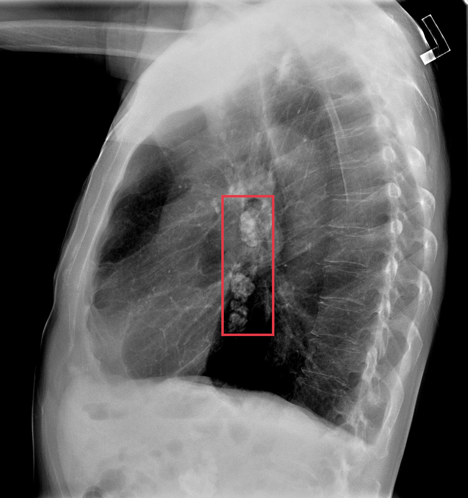
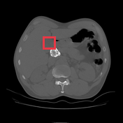
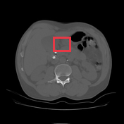
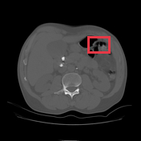
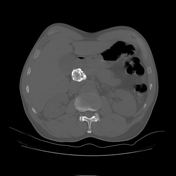
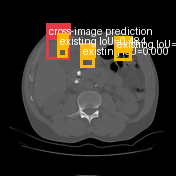

# Calcified abdominal lymph nodes

[返回 Step 3 总览](../README_STEP3_VISUALIZATION.md)

- **Case ID：** `calcified-abdominal-lymph-nodes`
- **Case URL：** [https://radiopaedia.org/cases/calcified-abdominal-lymph-nodes?lang=us](https://radiopaedia.org/cases/calcified-abdominal-lymph-nodes?lang=us)
- **验证模型：** Qwen3-VL-8B
- **图像 / Step 2 findings：** 5 / 5
- **定位结果：** strong 0；partial 1；not support 3；parse error 0
- **Strong bbox relations：** 0
- **原始 JSON：** [case_evidence.json](../assets_step3/calcified-abdominal-lymph-nodes/case_evidence.json)

**Overlay 图例：** 红框为跨图新定位；绿框为 IoU >= 0.5 的已有 bbox；黄框为未达到阈值的已有 bbox。

## Step 2 Finding Nodes

### Finding 1: `study_000_x_ray_image_001_lateral_f01`

- **Modality / subcategory：** X-ray / Lateral
- **bbox_2d：** `[474, 392, 586, 674]`
- **Lingshu caption：** The lungs are hyperinflated. There is a large rounded opacity projecting over the right hilum. The heart size is normal. No pleural effusion or pneumothorax.

### Finding 2: `study_001_ct_image_000_axial_bone_window_f01`

- **Modality / subcategory：** CT / Axial bone window
- **bbox_2d：** `[350, 300, 450, 400]`
- **Lingshu caption：** The image shows a lesion in the right lobe of the liver. The lesion appears to be hypodense compared to the surrounding liver parenchyma. There is no evidence of calcification or hemorrhage within the lesion. The lesion is well-circumscribed and does not appear to invade the surrounding structures. The adjacent liver parenchyma appears normal without any signs of cirrhosis or other abnormalities.

### Finding 3: `study_001_ct_image_001_axial_bone_window_f01`

- **Modality / subcategory：** CT / Axial bone window
- **bbox_2d：** `[430, 300, 570, 420]`
- **Lingshu caption：** The red box is located over the right upper quadrant of the abdomen. There is no definite focal lesion identified within the liver. The liver is of normal size and attenuation. No intrahepatic biliary ductal dilatation is seen.

### Finding 4: `study_001_ct_image_001_axial_bone_window_f02`

- **Modality / subcategory：** CT / Axial bone window
- **bbox_2d：** `[620, 260, 780, 380]`
- **Lingshu caption：** The red box is located over the left upper quadrant. There is a large amount of free intraperitoneal air. The liver is unremarkable. The spleen is not well seen. The stomach is distended with air. The pancreas is partially obscured by the stomach. The kidneys are unremarkable. There is no evidence of lymphadenopathy. There is no pleural effusion or pneumothorax. The visualized osseous structures are unremarkable.

### Finding 5: `study_001_ct_image_001_axial_bone_window_f03`

- **Modality / subcategory：** CT / Axial bone window
- **bbox_2d：** `[300, 240, 420, 360]`
- **Lingshu caption：** The image shows a cross-sectional view of the abdomen, with a focus on the liver region. Within the boxed area, there appears to be a distinct lesion or abnormality present. The lesion exhibits a heterogeneous appearance, with areas of varying density and attenuation. It is difficult to determine the exact nature of this finding without additional clinical information or further imaging studies. However, the presence of this lesion warrants further investigation to determine its underlying cause and potential clinical significance.

## Directed Cross-image Validation

### Anchor 1: `study_000_x_ray_image_001_lateral_f01`

**Anchor Lingshu caption：** The lungs are hyperinflated. There is a large rounded opacity projecting over the right hilum. The heart size is normal. No pleural effusion or pneumothorax.

#### location_00001: NOT SUPPORT

<table>
<tr><th>Anchor original bbox</th><th>Target original image; model returned null</th></tr>
<tr><td></td><td></td></tr>
</table>

- **Target：** `study_000_x_ray_image_002_dual_energy_bone_window`; X-ray; Dual energy bone window
- **Relation：** `bbox_to_image` / `not_support`
- **Returned target bbox：** `unknown`
- **Maximum IoU：** n/a; threshold=0.5
- **Strong relation IDs：** `[]`

**IoU matching：**

The target image has no existing Step 2 bbox.

#### location_00002: NOT SUPPORT

<table>
<tr><th>Anchor original bbox</th><th>Target original image; model returned null</th><th>Existing target bbox: study_001_ct_image_000_axial_bone_window_f01</th></tr>
<tr><td></td><td></td><td></td></tr>
</table>

- **Target：** `study_001_ct_image_000_axial_bone_window`; CT; Axial bone window
- **Relation：** `bbox_to_image` / `not_support`
- **Returned target bbox：** `unknown`
- **Maximum IoU：** n/a; threshold=0.5
- **Strong relation IDs：** `[]`

**IoU matching：**

| Existing target bbox | IoU | Strong match | Lingshu caption |
|---|---:|---|---|
| `study_001_ct_image_000_axial_bone_window_f01`; `[350, 300, 450, 400]` | n/a | n/a | The image shows a lesion in the right lobe of the liver. The lesion appears to be hypodense compared to the surrounding liver parenchyma. There is no evidence of calcification or hemorrhage within the lesion. The lesion is well-circumscribed and does not appear to invade the surrounding structures. The adjacent liver parenchyma appears normal without any signs of cirrhosis or other abnormalities. |

#### location_00003: NOT SUPPORT

<table>
<tr><th>Anchor original bbox</th><th>Target original image; model returned null</th><th>Existing target bbox: study_001_ct_image_001_axial_bone_window_f01</th><th>Existing target bbox: study_001_ct_image_001_axial_bone_window_f02</th><th>Existing target bbox: study_001_ct_image_001_axial_bone_window_f03</th></tr>
<tr><td></td><td></td><td></td><td></td><td></td></tr>
</table>

- **Target：** `study_001_ct_image_001_axial_bone_window`; CT; Axial bone window
- **Relation：** `bbox_to_image` / `not_support`
- **Returned target bbox：** `unknown`
- **Maximum IoU：** n/a; threshold=0.5
- **Strong relation IDs：** `[]`

**IoU matching：**

| Existing target bbox | IoU | Strong match | Lingshu caption |
|---|---:|---|---|
| `study_001_ct_image_001_axial_bone_window_f01`; `[430, 300, 570, 420]` | n/a | n/a | The red box is located over the right upper quadrant of the abdomen. There is no definite focal lesion identified within the liver. The liver is of normal size and attenuation. No intrahepatic biliary ductal dilatation is seen. |
| `study_001_ct_image_001_axial_bone_window_f02`; `[620, 260, 780, 380]` | n/a | n/a | The red box is located over the left upper quadrant. There is a large amount of free intraperitoneal air. The liver is unremarkable. The spleen is not well seen. The stomach is distended with air. The pancreas is partially obscured by the stomach. The kidneys are unremarkable. There is no evidence of lymphadenopathy. There is no pleural effusion or pneumothorax. The visualized osseous structures are unremarkable. |
| `study_001_ct_image_001_axial_bone_window_f03`; `[300, 240, 420, 360]` | n/a | n/a | The image shows a cross-sectional view of the abdomen, with a focus on the liver region. Within the boxed area, there appears to be a distinct lesion or abnormality present. The lesion exhibits a heterogeneous appearance, with areas of varying density and attenuation. It is difficult to determine the exact nature of this finding without additional clinical information or further imaging studies. However, the presence of this lesion warrants further investigation to determine its underlying cause and potential clinical significance. |

### Anchor 2: `study_001_ct_image_000_axial_bone_window_f01`

**Anchor Lingshu caption：** The image shows a lesion in the right lobe of the liver. The lesion appears to be hypodense compared to the surrounding liver parenchyma. There is no evidence of calcification or hemorrhage within the lesion. The lesion is well-circumscribed and does not appear to invade the surrounding structures. The adjacent liver parenchyma appears normal without any signs of cirrhosis or other abnormalities.

#### location_00004: PARTIAL SUPPORT

<table>
<tr><th>Anchor original bbox</th><th>Cross-image grounded target bbox</th><th>Existing target bbox: study_001_ct_image_001_axial_bone_window_f01</th><th>Existing target bbox: study_001_ct_image_001_axial_bone_window_f02</th><th>Existing target bbox: study_001_ct_image_001_axial_bone_window_f03</th></tr>
<tr><td></td><td></td><td></td><td></td><td></td></tr>
</table>

- **Target：** `study_001_ct_image_001_axial_bone_window`; CT; Axial bone window
- **Relation：** `bbox_to_image` / `partial_support`
- **Returned target bbox：** `[266, 212, 398, 344]`
- **Maximum IoU：** 0.484; threshold=0.5
- **Strong relation IDs：** `[]`

**IoU matching：**

| Existing target bbox | IoU | Strong match | Lingshu caption |
|---|---:|---|---|
| `study_001_ct_image_001_axial_bone_window_f01`; `[430, 300, 570, 420]` | 0.000 | no | The red box is located over the right upper quadrant of the abdomen. There is no definite focal lesion identified within the liver. The liver is of normal size and attenuation. No intrahepatic biliary ductal dilatation is seen. |
| `study_001_ct_image_001_axial_bone_window_f02`; `[620, 260, 780, 380]` | 0.000 | no | The red box is located over the left upper quadrant. There is a large amount of free intraperitoneal air. The liver is unremarkable. The spleen is not well seen. The stomach is distended with air. The pancreas is partially obscured by the stomach. The kidneys are unremarkable. There is no evidence of lymphadenopathy. There is no pleural effusion or pneumothorax. The visualized osseous structures are unremarkable. |
| `study_001_ct_image_001_axial_bone_window_f03`; `[300, 240, 420, 360]` | 0.484 | no | The image shows a cross-sectional view of the abdomen, with a focus on the liver region. Within the boxed area, there appears to be a distinct lesion or abnormality present. The lesion exhibits a heterogeneous appearance, with areas of varying density and attenuation. It is difficult to determine the exact nature of this finding without additional clinical information or further imaging studies. However, the presence of this lesion warrants further investigation to determine its underlying cause and potential clinical significance. |

**Target Lingshu caption：** unavailable. This is a newly re-grounded bbox and has not passed through Step 2 Lingshu captioning.

## Dynamically Skipped Anchors

None.

## Case-level Location Validation Summary / 病例级定位验证总结

- **Strong support：** 0 个 bbox-to-bbox 关系
- **Partial support：** 1 个 bbox-to-image 关系
- **Not support：** 3 个 bbox-to-image 关系

### Strong Support

该病例没有 strong-support bbox 对应关系。

### Partial Support

#### Partial 1: `study_001_ct_image_000_axial_bone_window_f01` → `study_001_ct_image_001_axial_bone_window`

- **Query：** `location_00004`
- **Returned target bbox：** `[266, 212, 398, 344]`
- **Maximum IoU：** 0.484（低于 threshold=0.5）

<table>
<tr><th>Anchor bbox</th><th>Cross-image grounded target bbox</th><th>Closest existing target bbox</th></tr>
<tr><td></td><td></td><td></td></tr>
</table>

### Not Support

#### Not support 1: `study_000_x_ray_image_001_lateral_f01` → `study_000_x_ray_image_002_dual_energy_bone_window`

- **Query：** `location_00001`
- **Result：** 目标图返回 `null`，未定位到对应区域。

<table>
<tr><th>Anchor bbox</th><th>Target original image</th></tr>
<tr><td></td><td></td></tr>
</table>

#### Not support 2: `study_000_x_ray_image_001_lateral_f01` → `study_001_ct_image_000_axial_bone_window`

- **Query：** `location_00002`
- **Result：** 目标图返回 `null`，未定位到对应区域。

<table>
<tr><th>Anchor bbox</th><th>Target original image</th></tr>
<tr><td></td><td></td></tr>
</table>

#### Not support 3: `study_000_x_ray_image_001_lateral_f01` → `study_001_ct_image_001_axial_bone_window`

- **Query：** `location_00003`
- **Result：** 目标图返回 `null`，未定位到对应区域。

<table>
<tr><th>Anchor bbox</th><th>Target original image</th></tr>
<tr><td></td><td></td></tr>
</table>
