# Congenital esophageal stenosis

[返回 Step 3 总览](../README_STEP3_VISUALIZATION.md)

- **Case ID：** `congenital-esophageal-stenosis-1`
- **Case URL：** [https://radiopaedia.org/cases/congenital-esophageal-stenosis-1?lang=us](https://radiopaedia.org/cases/congenital-esophageal-stenosis-1?lang=us)
- **验证模型：** Qwen3-VL-8B
- **图像 / Step 2 findings：** 5 / 7
- **定位结果：** strong 0；partial 6；not support 9；parse error 0
- **Strong bbox relations：** 0
- **原始 JSON：** [case_evidence.json](../assets_step3/congenital-esophageal-stenosis-1/case_evidence.json)
- **定量/定性验证 JSON：** [step_3_validation_case_evidence.json](../assets_step3/congenital-esophageal-stenosis-1/step_3_validation_case_evidence.json)

**Overlay 图例：** 红框为跨图新定位；绿框为 IoU >= 0.5 的已有 bbox；黄框为未达到阈值的已有 bbox。

## Step 2 Finding Nodes

### Finding 1: `study_000_fluoroscopy_image_000_frontal_f01`

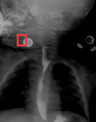

- **Modality / subcategory：** Fluoroscopy / Frontal
- **bbox_2d：** `[175, 280, 280, 375]`
- **Lingshu caption：** The image shows a frontal view of the neck and upper chest area. There is a red box highlighting a specific region on the left side of the neck. Within this region, there appears to be an abnormality that could potentially indicate a pathological condition. The surrounding tissues and structures appear relatively normal, without any obvious signs of inflammation, swelling, or other abnormalities.
- **中文翻译：** 图像为颈部及上胸部正位像。红框标出颈部左侧特定区域，其中似有可能提示病理状态的异常。周围组织和结构相对正常，未见明显炎症、肿胀或其他异常。

### Finding 2: `study_000_fluoroscopy_image_001_frontal_f01`

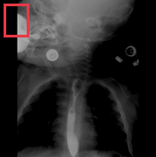

- **Modality / subcategory：** Fluoroscopy / Frontal
- **bbox_2d：** `[27, 27, 187, 236]`
- **Lingshu caption：** The image shows a frontal view of the chest with a red box highlighting an area of interest in the upper left quadrant. Within this region, there appears to be a radiopaque structure that could represent a foreign body or calcification. The surrounding lung fields appear clear without obvious signs of consolidation, effusion, or pneumothorax. The heart silhouette is visible and appears normal in size and shape. The diaphragm and costophrenic angles are also well-defined. No acute bony abnormalities are noted in the visible portions of the ribs and spine.
- **中文翻译：** 图像为胸部正位像，红框标出左上象限的关注区域。该区域内似有不透 X 线结构，可能代表异物或钙化。周围肺野清晰，未见明显实变、积液或气胸。心影可见，大小和形态正常。膈肌及肋膈角清楚。可见肋骨和脊柱未见急性骨性异常。

### Finding 3: `study_000_fluoroscopy_image_001_frontal_f02`

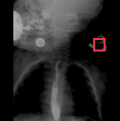

- **Modality / subcategory：** Fluoroscopy / Frontal
- **bbox_2d：** `[778, 314, 875, 424]`
- **Lingshu caption：** The image shows a frontal view of the chest with a red bounding box highlighting a specific area. Within this region, there appears to be a radiopaque object consistent with a foreign body, likely a coin, located in the upper esophagus. The surrounding structures, including the trachea and major bronchi, appear unremarkable. The lungs show no obvious signs of consolidation, effusion, or pneumothorax. The heart silhouette is normal in size and shape. There are no apparent fractures or dislocations of the ribs or clavicles.
- **中文翻译：** 图像为胸部正位像，红框标出特定区域。区域内似有不透 X 线异物，可能为位于上段食管的硬币。气管及主支气管等周围结构未见明显异常。双肺未见明显实变、积液或气胸。心影大小和形态正常，肋骨及锁骨未见明显骨折或脱位。

### Finding 4: `study_000_fluoroscopy_image_001_frontal_f03`

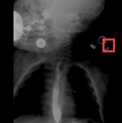

- **Modality / subcategory：** Fluoroscopy / Frontal
- **bbox_2d：** `[845, 314, 942, 424]`
- **Lingshu caption：** The image shows a frontal view of the chest with a focus on the upper thoracic region. There is a marked area in the left upper quadrant of the image, which appears to be highlighted for further examination. Within this region, there is a noticeable opacity that could suggest the presence of an abnormality such as a mass or consolidation. The surrounding lung fields appear relatively clear, with no obvious signs of pleural effusion or pneumothorax. The heart silhouette is partially visible, and there are no apparent abnormalities in the mediastinum. The diaphragm and bony structures, including the ribs and spine, do not show any significant deviations from normal anatomy.
- **中文翻译：** 图像为胸部正位像，重点显示上胸部。图像左上象限有一处标记区域，其中可见明显致密影，可能提示肿块或实变等异常。周围肺野相对清晰，未见明显胸腔积液或气胸。心影部分可见，纵隔未见明显异常。膈肌及肋骨、脊柱等骨性结构未见明显偏离正常解剖。

### Finding 5: `study_001_ct_image_001_sagittal_mediastinal_window_with_contrast_f01`

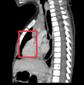

- **Modality / subcategory：** CT / Sagittal mediastinal window - with contrast
- **bbox_2d：** `[220, 360, 440, 680]`
- **Lingshu caption：** The red box is located in the anterior mediastinum. There is a large mass in this area which appears to be heterogeneous in density. The mass is displacing the heart posteriorly.
- **中文翻译：** 红框位于前纵隔。该处可见较大肿块，密度不均，并将心脏向后推移。

### Finding 6: `study_001_ct_image_001_sagittal_mediastinal_window_with_contrast_f02`

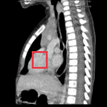

- **Modality / subcategory：** CT / Sagittal mediastinal window - with contrast
- **bbox_2d：** `[300, 480, 440, 640]`
- **Lingshu caption：** The image shows a sagittal view of the chest with a focus on the mediastinum. The boxed region highlights an area of interest that appears to have increased density compared to surrounding tissues. This could indicate a mass or lesion. The mediastinal structures, including the heart and major vessels, are visible, and there is no obvious displacement or compression of these structures. The lung fields appear clear without any significant abnormalities such as consolidation or effusion. The bony structures, including the vertebrae and ribs, are intact without signs of fracture or lytic lesions.
- **中文翻译：** 图像为胸部矢状位，重点显示纵隔。框内关注区域的密度似高于周围组织，可能提示肿块或病灶。心脏及大血管等纵隔结构可见，未见明显移位或受压。肺野清晰，未见明显实变或积液。椎体和肋骨完整，未见骨折或溶骨性病变。

### Finding 7: `study_002_photograph_image_000_upper_digestive_tract_endoscopy_f01`

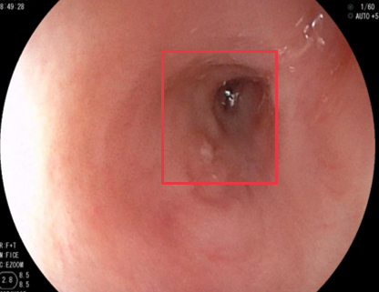

- **Modality / subcategory：** Photograph / Upper digestive tract endoscopy.
- **bbox_2d：** `[427, 172, 731, 630]`
- **Lingshu caption：** The esophagus appears normal. The gastroesophageal junction is visible. The stomach is visible. There is a small amount of food debris present. The pylorus is visible.
- **中文翻译：** 食管外观正常，可见胃食管交界及胃腔。胃内有少量食物残渣，可见幽门。

## Directed Cross-image Validation

### Anchor 1: `study_000_fluoroscopy_image_000_frontal_f01`

**Anchor Lingshu caption：** The image shows a frontal view of the neck and upper chest area. There is a red box highlighting a specific region on the left side of the neck. Within this region, there appears to be an abnormality that could potentially indicate a pathological condition. The surrounding tissues and structures appear relatively normal, without any obvious signs of inflammation, swelling, or other abnormalities.
**Anchor caption 中文翻译：** 图像为颈部及上胸部正位像。红框标出颈部左侧特定区域，其中似有可能提示病理状态的异常。周围组织和结构相对正常，未见明显炎症、肿胀或其他异常。

#### location_00001: PARTIAL SUPPORT

<table>
<tr><th>Anchor original bbox</th><th>Cross-image grounded target bbox</th><th>Existing target bbox: study_000_fluoroscopy_image_001_frontal_f01</th><th>Existing target bbox: study_000_fluoroscopy_image_001_frontal_f02</th><th>Existing target bbox: study_000_fluoroscopy_image_001_frontal_f03</th></tr>
<tr><td></td><td>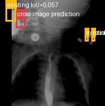</td><td></td><td></td><td></td></tr>
</table>

- **Target：** `study_000_fluoroscopy_image_001_frontal`; Fluoroscopy; Frontal
- **Relation：** `bbox_to_image` / `partial_support`
- **Returned target bbox：** `[150, 170, 250, 270]`
- **Maximum IoU：** 0.057; threshold=0.5
- **Strong relation IDs：** `[]`

**IoU matching：**

| Existing target bbox | IoU | Strong match | Lingshu caption | 中文翻译 |
|---|---:|---|---|---|
| `study_000_fluoroscopy_image_001_frontal_f01`; `[27, 27, 187, 236]` | 0.057 | no | The image shows a frontal view of the chest with a red box highlighting an area of interest in the upper left quadrant. Within this region, there appears to be a radiopaque structure that could represent a foreign body or calcification. The surrounding lung fields appear clear without obvious signs of consolidation, effusion, or pneumothorax. The heart silhouette is visible and appears normal in size and shape. The diaphragm and costophrenic angles are also well-defined. No acute bony abnormalities are noted in the visible portions of the ribs and spine. | 图像为胸部正位像，红框标出左上象限的关注区域。该区域内似有不透 X 线结构，可能代表异物或钙化。周围肺野清晰，未见明显实变、积液或气胸。心影可见，大小和形态正常。膈肌及肋膈角清楚。可见肋骨和脊柱未见急性骨性异常。 |
| `study_000_fluoroscopy_image_001_frontal_f02`; `[778, 314, 875, 424]` | 0.000 | no | The image shows a frontal view of the chest with a red bounding box highlighting a specific area. Within this region, there appears to be a radiopaque object consistent with a foreign body, likely a coin, located in the upper esophagus. The surrounding structures, including the trachea and major bronchi, appear unremarkable. The lungs show no obvious signs of consolidation, effusion, or pneumothorax. The heart silhouette is normal in size and shape. There are no apparent fractures or dislocations of the ribs or clavicles. | 图像为胸部正位像，红框标出特定区域。区域内似有不透 X 线异物，可能为位于上段食管的硬币。气管及主支气管等周围结构未见明显异常。双肺未见明显实变、积液或气胸。心影大小和形态正常，肋骨及锁骨未见明显骨折或脱位。 |
| `study_000_fluoroscopy_image_001_frontal_f03`; `[845, 314, 942, 424]` | 0.000 | no | The image shows a frontal view of the chest with a focus on the upper thoracic region. There is a marked area in the left upper quadrant of the image, which appears to be highlighted for further examination. Within this region, there is a noticeable opacity that could suggest the presence of an abnormality such as a mass or consolidation. The surrounding lung fields appear relatively clear, with no obvious signs of pleural effusion or pneumothorax. The heart silhouette is partially visible, and there are no apparent abnormalities in the mediastinum. The diaphragm and bony structures, including the ribs and spine, do not show any significant deviations from normal anatomy. | 图像为胸部正位像，重点显示上胸部。图像左上象限有一处标记区域，其中可见明显致密影，可能提示肿块或实变等异常。周围肺野相对清晰，未见明显胸腔积液或气胸。心影部分可见，纵隔未见明显异常。膈肌及肋骨、脊柱等骨性结构未见明显偏离正常解剖。 |

**B 图单红框（Lingshu 实际输入）：**

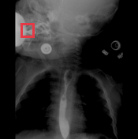

**Re-ground Lingshu caption：** The image shows a frontal view of the chest with a focus on the upper mediastinum. Within the boxed region, there appears to be a radiopaque structure suggestive of a foreign body or calcification. The surrounding soft tissues and bony structures do not show any obvious signs of acute pathology. The lungs appear clear without evidence of consolidation, effusion, or pneumothorax. The heart size is within normal limits, and no significant abnormalities are noted in the visible portions of the great vessels.
**Re-ground caption 中文翻译：** 图像为胸部正位像，重点显示上纵隔。框内似有不透 X 线结构，提示可能为异物或钙化。周围软组织及骨性结构未见明显急性病变。双肺清晰，未见实变、积液或气胸。心影大小正常，所见大血管未见显著异常。

**Quantitative / qualitative validation：**

| Validation pair | Quantitative size / 定量 | Qualitative caption / 定性 |
|---|---|---|
| `partial__location_00001` | `consistent` | `inconsistent` |

#### location_00002: PARTIAL SUPPORT

<table>
<tr><th>Anchor original bbox</th><th>Cross-image grounded target bbox</th></tr>
<tr><td></td><td>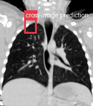</td></tr>
</table>

- **Target：** `study_001_ct_image_000_coronal_lung_window`; CT; Coronal lung window
- **Relation：** `bbox_to_image` / `partial_support`
- **Returned target bbox：** `[260, 180, 400, 320]`
- **Maximum IoU：** n/a; threshold=0.5
- **Strong relation IDs：** `[]`

**IoU matching：**

The target image has no existing Step 2 bbox.

**B 图单红框（Lingshu 实际输入）：**

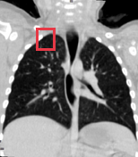

**Re-ground Lingshu caption：** The image shows a coronal lung window CT scan. There is a red bounding box located in the right upper lobe of the lungs. Within this region, there appears to be a small, well-defined nodule. The surrounding lung parenchyma appears relatively normal without significant consolidation, ground-glass opacities, or other obvious abnormalities. The mediastinum and heart appear unremarkable. No pleural effusions or pneumothorax are noted.
**Re-ground caption 中文翻译：** 图像为冠状位肺窗 CT。红框位于右上叶，框内似有小而边界清楚的结节。周围肺实质相对正常，未见明显实变、磨玻璃影或其他异常。纵隔和心脏未见异常。未见胸腔积液或气胸。

**Quantitative / qualitative validation：**

| Validation pair | Quantitative size / 定量 | Qualitative caption / 定性 |
|---|---|---|
| `partial__location_00002` | `inconsistent` | `inconsistent` |

#### location_00003: PARTIAL SUPPORT

<table>
<tr><th>Anchor original bbox</th><th>Cross-image grounded target bbox</th><th>Existing target bbox: study_001_ct_image_001_sagittal_mediastinal_window_with_contrast_f01</th><th>Existing target bbox: study_001_ct_image_001_sagittal_mediastinal_window_with_contrast_f02</th></tr>
<tr><td></td><td>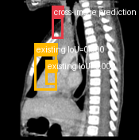</td><td></td><td></td></tr>
</table>

- **Target：** `study_001_ct_image_001_sagittal_mediastinal_window_with_contrast`; CT; Sagittal mediastinal window - with contrast
- **Relation：** `bbox_to_image` / `partial_support`
- **Returned target bbox：** `[375, 120, 460, 280]`
- **Maximum IoU：** 0.000; threshold=0.5
- **Strong relation IDs：** `[]`

**IoU matching：**

| Existing target bbox | IoU | Strong match | Lingshu caption | 中文翻译 |
|---|---:|---|---|---|
| `study_001_ct_image_001_sagittal_mediastinal_window_with_contrast_f01`; `[220, 360, 440, 680]` | 0.000 | no | The red box is located in the anterior mediastinum. There is a large mass in this area which appears to be heterogeneous in density. The mass is displacing the heart posteriorly. | 红框位于前纵隔。该处可见较大肿块，密度不均，并将心脏向后推移。 |
| `study_001_ct_image_001_sagittal_mediastinal_window_with_contrast_f02`; `[300, 480, 440, 640]` | 0.000 | no | The image shows a sagittal view of the chest with a focus on the mediastinum. The boxed region highlights an area of interest that appears to have increased density compared to surrounding tissues. This could indicate a mass or lesion. The mediastinal structures, including the heart and major vessels, are visible, and there is no obvious displacement or compression of these structures. The lung fields appear clear without any significant abnormalities such as consolidation or effusion. The bony structures, including the vertebrae and ribs, are intact without signs of fracture or lytic lesions. | 图像为胸部矢状位，重点显示纵隔。框内关注区域的密度似高于周围组织，可能提示肿块或病灶。心脏及大血管等纵隔结构可见，未见明显移位或受压。肺野清晰，未见明显实变或积液。椎体和肋骨完整，未见骨折或溶骨性病变。 |

**B 图单红框（Lingshu 实际输入）：**

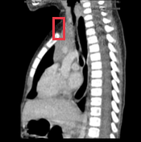

**Re-ground Lingshu caption：** The image shows a sagittal view of the thoracic region with a focus on the mediastinum. The boxed area highlights a region in the anterior mediastinum. Within this region, there appears to be a mass-like structure that is distinct from the surrounding tissues. The mass is located near the heart and major vessels, suggesting its proximity to critical structures. The density of the mass is different from the adjacent lung tissue, indicating a possible abnormality. The surrounding mediastinal structures appear to be displaced or compressed by the mass. There is no clear evidence of calcification or necrosis within the mass. The overall appearance suggests a need for further evaluation to determine the nature of the lesion.
**Re-ground caption 中文翻译：** 图像为胸部矢状位，重点显示纵隔。框内位于前纵隔，可见与周围组织不同的肿块样结构，邻近心脏和大血管。肿块密度不同于邻近肺组织，提示可能存在异常，并似使周围纵隔结构发生移位或受压。肿块内未见明确钙化或坏死。整体表现需要进一步评估以明确病灶性质。

**Quantitative / qualitative validation：**

| Validation pair | Quantitative size / 定量 | Qualitative caption / 定性 |
|---|---|---|
| `partial__location_00003` | `inconsistent` | `inconsistent` |

#### location_00004: NOT SUPPORT

<table>
<tr><th>Anchor original bbox</th><th>Target original image; model returned null</th><th>Existing target bbox: study_002_photograph_image_000_upper_digestive_tract_endoscopy_f01</th></tr>
<tr><td></td><td></td><td></td></tr>
</table>

- **Target：** `study_002_photograph_image_000_upper_digestive_tract_endoscopy`; Photograph; Upper digestive tract endoscopy.
- **Relation：** `bbox_to_image` / `not_support`
- **Returned target bbox：** `unknown`
- **Maximum IoU：** n/a; threshold=0.5
- **Strong relation IDs：** `[]`

**IoU matching：**

| Existing target bbox | IoU | Strong match | Lingshu caption | 中文翻译 |
|---|---:|---|---|---|
| `study_002_photograph_image_000_upper_digestive_tract_endoscopy_f01`; `[427, 172, 731, 630]` | n/a | n/a | The esophagus appears normal. The gastroesophageal junction is visible. The stomach is visible. There is a small amount of food debris present. The pylorus is visible. | 食管外观正常，可见胃食管交界及胃腔。胃内有少量食物残渣，可见幽门。 |

### Anchor 2: `study_000_fluoroscopy_image_001_frontal_f01`

**Anchor Lingshu caption：** The image shows a frontal view of the chest with a red box highlighting an area of interest in the upper left quadrant. Within this region, there appears to be a radiopaque structure that could represent a foreign body or calcification. The surrounding lung fields appear clear without obvious signs of consolidation, effusion, or pneumothorax. The heart silhouette is visible and appears normal in size and shape. The diaphragm and costophrenic angles are also well-defined. No acute bony abnormalities are noted in the visible portions of the ribs and spine.
**Anchor caption 中文翻译：** 图像为胸部正位像，红框标出左上象限的关注区域。该区域内似有不透 X 线结构，可能代表异物或钙化。周围肺野清晰，未见明显实变、积液或气胸。心影可见，大小和形态正常。膈肌及肋膈角清楚。可见肋骨和脊柱未见急性骨性异常。

#### location_00005: NOT SUPPORT

<table>
<tr><th>Anchor original bbox</th><th>Target original image; model returned null</th></tr>
<tr><td></td><td></td></tr>
</table>

- **Target：** `study_001_ct_image_000_coronal_lung_window`; CT; Coronal lung window
- **Relation：** `bbox_to_image` / `not_support`
- **Returned target bbox：** `unknown`
- **Maximum IoU：** n/a; threshold=0.5
- **Strong relation IDs：** `[]`

**IoU matching：**

The target image has no existing Step 2 bbox.

#### location_00006: PARTIAL SUPPORT

<table>
<tr><th>Anchor original bbox</th><th>Cross-image grounded target bbox</th><th>Existing target bbox: study_001_ct_image_001_sagittal_mediastinal_window_with_contrast_f01</th><th>Existing target bbox: study_001_ct_image_001_sagittal_mediastinal_window_with_contrast_f02</th></tr>
<tr><td></td><td>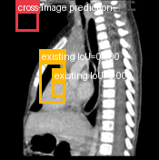</td><td></td><td></td></tr>
</table>

- **Target：** `study_001_ct_image_001_sagittal_mediastinal_window_with_contrast`; CT; Sagittal mediastinal window - with contrast
- **Relation：** `bbox_to_image` / `partial_support`
- **Returned target bbox：** `[100, 20, 250, 200]`
- **Maximum IoU：** 0.000; threshold=0.5
- **Strong relation IDs：** `[]`

**IoU matching：**

| Existing target bbox | IoU | Strong match | Lingshu caption | 中文翻译 |
|---|---:|---|---|---|
| `study_001_ct_image_001_sagittal_mediastinal_window_with_contrast_f01`; `[220, 360, 440, 680]` | 0.000 | no | The red box is located in the anterior mediastinum. There is a large mass in this area which appears to be heterogeneous in density. The mass is displacing the heart posteriorly. | 红框位于前纵隔。该处可见较大肿块，密度不均，并将心脏向后推移。 |
| `study_001_ct_image_001_sagittal_mediastinal_window_with_contrast_f02`; `[300, 480, 440, 640]` | 0.000 | no | The image shows a sagittal view of the chest with a focus on the mediastinum. The boxed region highlights an area of interest that appears to have increased density compared to surrounding tissues. This could indicate a mass or lesion. The mediastinal structures, including the heart and major vessels, are visible, and there is no obvious displacement or compression of these structures. The lung fields appear clear without any significant abnormalities such as consolidation or effusion. The bony structures, including the vertebrae and ribs, are intact without signs of fracture or lytic lesions. | 图像为胸部矢状位，重点显示纵隔。框内关注区域的密度似高于周围组织，可能提示肿块或病灶。心脏及大血管等纵隔结构可见，未见明显移位或受压。肺野清晰，未见明显实变或积液。椎体和肋骨完整，未见骨折或溶骨性病变。 |

**B 图单红框（Lingshu 实际输入）：**

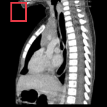

**Re-ground Lingshu caption：** The image shows a sagittal view of the chest with a focus on the mediastinum. The red box highlights an area in the upper thoracic region, possibly indicating a region of interest for further evaluation. Within this region, there appears to be a mass or lesion that could be causing concern. The mass is located near the anterior mediastinum, adjacent to the sternum and possibly involving the thymus gland. The lesion seems to have irregular borders and may exhibit heterogeneous density, suggesting a possible neoplastic process. Surrounding structures such as the heart, great vessels, and lung parenchyma appear to be displaced or compressed by the mass. There is no clear evidence of calcification within the lesion, and the surrounding tissues do not show signs of significant inflammation or edema. Further imaging and clinical correlation would be necessary to determine the exact nature of this finding.
**Re-ground caption 中文翻译：** 图像为胸部矢状位，重点显示纵隔。红框位于上胸部，其中似有值得关注的肿块或病灶。肿块靠近前纵隔和胸骨，可能累及胸腺，边缘不规则、密度不均，提示可能为肿瘤性过程。心脏、大血管及肺实质等周围结构似受推移或压迫。病灶内未见明确钙化，周围组织未见明显炎症或水肿。需要进一步影像检查并结合临床资料明确其性质。

**Quantitative / qualitative validation：**

| Validation pair | Quantitative size / 定量 | Qualitative caption / 定性 |
|---|---|---|
| `partial__location_00006` | `inconsistent` | `inconsistent` |

#### location_00007: NOT SUPPORT

<table>
<tr><th>Anchor original bbox</th><th>Target original image; model returned null</th><th>Existing target bbox: study_002_photograph_image_000_upper_digestive_tract_endoscopy_f01</th></tr>
<tr><td></td><td></td><td></td></tr>
</table>

- **Target：** `study_002_photograph_image_000_upper_digestive_tract_endoscopy`; Photograph; Upper digestive tract endoscopy.
- **Relation：** `bbox_to_image` / `not_support`
- **Returned target bbox：** `unknown`
- **Maximum IoU：** n/a; threshold=0.5
- **Strong relation IDs：** `[]`

**IoU matching：**

| Existing target bbox | IoU | Strong match | Lingshu caption | 中文翻译 |
|---|---:|---|---|---|
| `study_002_photograph_image_000_upper_digestive_tract_endoscopy_f01`; `[427, 172, 731, 630]` | n/a | n/a | The esophagus appears normal. The gastroesophageal junction is visible. The stomach is visible. There is a small amount of food debris present. The pylorus is visible. | 食管外观正常，可见胃食管交界及胃腔。胃内有少量食物残渣，可见幽门。 |

### Anchor 3: `study_000_fluoroscopy_image_001_frontal_f02`

**Anchor Lingshu caption：** The image shows a frontal view of the chest with a red bounding box highlighting a specific area. Within this region, there appears to be a radiopaque object consistent with a foreign body, likely a coin, located in the upper esophagus. The surrounding structures, including the trachea and major bronchi, appear unremarkable. The lungs show no obvious signs of consolidation, effusion, or pneumothorax. The heart silhouette is normal in size and shape. There are no apparent fractures or dislocations of the ribs or clavicles.
**Anchor caption 中文翻译：** 图像为胸部正位像，红框标出特定区域。区域内似有不透 X 线异物，可能为位于上段食管的硬币。气管及主支气管等周围结构未见明显异常。双肺未见明显实变、积液或气胸。心影大小和形态正常，肋骨及锁骨未见明显骨折或脱位。

#### location_00008: NOT SUPPORT

<table>
<tr><th>Anchor original bbox</th><th>Target original image; model returned null</th></tr>
<tr><td></td><td></td></tr>
</table>

- **Target：** `study_001_ct_image_000_coronal_lung_window`; CT; Coronal lung window
- **Relation：** `bbox_to_image` / `not_support`
- **Returned target bbox：** `unknown`
- **Maximum IoU：** n/a; threshold=0.5
- **Strong relation IDs：** `[]`

**IoU matching：**

The target image has no existing Step 2 bbox.

#### location_00009: PARTIAL SUPPORT

<table>
<tr><th>Anchor original bbox</th><th>Cross-image grounded target bbox</th><th>Existing target bbox: study_001_ct_image_001_sagittal_mediastinal_window_with_contrast_f01</th><th>Existing target bbox: study_001_ct_image_001_sagittal_mediastinal_window_with_contrast_f02</th></tr>
<tr><td></td><td>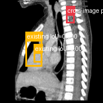</td><td></td><td></td></tr>
</table>

- **Target：** `study_001_ct_image_001_sagittal_mediastinal_window_with_contrast`; CT; Sagittal mediastinal window - with contrast
- **Relation：** `bbox_to_image` / `partial_support`
- **Returned target bbox：** `[640, 140, 730, 230]`
- **Maximum IoU：** 0.000; threshold=0.5
- **Strong relation IDs：** `[]`

**IoU matching：**

| Existing target bbox | IoU | Strong match | Lingshu caption | 中文翻译 |
|---|---:|---|---|---|
| `study_001_ct_image_001_sagittal_mediastinal_window_with_contrast_f01`; `[220, 360, 440, 680]` | 0.000 | no | The red box is located in the anterior mediastinum. There is a large mass in this area which appears to be heterogeneous in density. The mass is displacing the heart posteriorly. | 红框位于前纵隔。该处可见较大肿块，密度不均，并将心脏向后推移。 |
| `study_001_ct_image_001_sagittal_mediastinal_window_with_contrast_f02`; `[300, 480, 440, 640]` | 0.000 | no | The image shows a sagittal view of the chest with a focus on the mediastinum. The boxed region highlights an area of interest that appears to have increased density compared to surrounding tissues. This could indicate a mass or lesion. The mediastinal structures, including the heart and major vessels, are visible, and there is no obvious displacement or compression of these structures. The lung fields appear clear without any significant abnormalities such as consolidation or effusion. The bony structures, including the vertebrae and ribs, are intact without signs of fracture or lytic lesions. | 图像为胸部矢状位，重点显示纵隔。框内关注区域的密度似高于周围组织，可能提示肿块或病灶。心脏及大血管等纵隔结构可见，未见明显移位或受压。肺野清晰，未见明显实变或积液。椎体和肋骨完整，未见骨折或溶骨性病变。 |

**B 图单红框（Lingshu 实际输入）：**

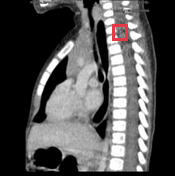

**Re-ground Lingshu caption：** The image shows a sagittal view of the thoracic spine with a red box highlighting a specific area. Within this region, there appears to be a lesion or abnormality that requires further investigation. The surrounding structures, including the vertebral bodies, intervertebral discs, and paraspinal soft tissues, should also be carefully examined for any additional abnormalities or signs of pathology.
**Re-ground caption 中文翻译：** 图像为胸椎矢状位，红框标出特定区域。框内似有需要进一步检查的病灶或异常。还应仔细评估椎体、椎间盘和椎旁软组织等周围结构有无其他异常或病理征象。

**Quantitative / qualitative validation：**

| Validation pair | Quantitative size / 定量 | Qualitative caption / 定性 |
|---|---|---|
| `partial__location_00009` | `inconsistent` | `inconsistent` |

#### location_00010: NOT SUPPORT

<table>
<tr><th>Anchor original bbox</th><th>Target original image; model returned null</th><th>Existing target bbox: study_002_photograph_image_000_upper_digestive_tract_endoscopy_f01</th></tr>
<tr><td></td><td></td><td></td></tr>
</table>

- **Target：** `study_002_photograph_image_000_upper_digestive_tract_endoscopy`; Photograph; Upper digestive tract endoscopy.
- **Relation：** `bbox_to_image` / `not_support`
- **Returned target bbox：** `unknown`
- **Maximum IoU：** n/a; threshold=0.5
- **Strong relation IDs：** `[]`

**IoU matching：**

| Existing target bbox | IoU | Strong match | Lingshu caption | 中文翻译 |
|---|---:|---|---|---|
| `study_002_photograph_image_000_upper_digestive_tract_endoscopy_f01`; `[427, 172, 731, 630]` | n/a | n/a | The esophagus appears normal. The gastroesophageal junction is visible. The stomach is visible. There is a small amount of food debris present. The pylorus is visible. | 食管外观正常，可见胃食管交界及胃腔。胃内有少量食物残渣，可见幽门。 |

### Anchor 4: `study_000_fluoroscopy_image_001_frontal_f03`

**Anchor Lingshu caption：** The image shows a frontal view of the chest with a focus on the upper thoracic region. There is a marked area in the left upper quadrant of the image, which appears to be highlighted for further examination. Within this region, there is a noticeable opacity that could suggest the presence of an abnormality such as a mass or consolidation. The surrounding lung fields appear relatively clear, with no obvious signs of pleural effusion or pneumothorax. The heart silhouette is partially visible, and there are no apparent abnormalities in the mediastinum. The diaphragm and bony structures, including the ribs and spine, do not show any significant deviations from normal anatomy.
**Anchor caption 中文翻译：** 图像为胸部正位像，重点显示上胸部。图像左上象限有一处标记区域，其中可见明显致密影，可能提示肿块或实变等异常。周围肺野相对清晰，未见明显胸腔积液或气胸。心影部分可见，纵隔未见明显异常。膈肌及肋骨、脊柱等骨性结构未见明显偏离正常解剖。

#### location_00011: NOT SUPPORT

<table>
<tr><th>Anchor original bbox</th><th>Target original image; model returned null</th></tr>
<tr><td></td><td></td></tr>
</table>

- **Target：** `study_001_ct_image_000_coronal_lung_window`; CT; Coronal lung window
- **Relation：** `bbox_to_image` / `not_support`
- **Returned target bbox：** `unknown`
- **Maximum IoU：** n/a; threshold=0.5
- **Strong relation IDs：** `[]`

**IoU matching：**

The target image has no existing Step 2 bbox.

#### location_00012: PARTIAL SUPPORT

<table>
<tr><th>Anchor original bbox</th><th>Cross-image grounded target bbox</th><th>Existing target bbox: study_001_ct_image_001_sagittal_mediastinal_window_with_contrast_f01</th><th>Existing target bbox: study_001_ct_image_001_sagittal_mediastinal_window_with_contrast_f02</th></tr>
<tr><td></td><td>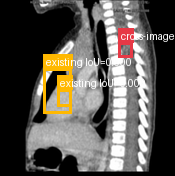</td><td></td><td></td></tr>
</table>

- **Target：** `study_001_ct_image_001_sagittal_mediastinal_window_with_contrast`; CT; Sagittal mediastinal window - with contrast
- **Relation：** `bbox_to_image` / `partial_support`
- **Returned target bbox：** `[675, 244, 764, 334]`
- **Maximum IoU：** 0.000; threshold=0.5
- **Strong relation IDs：** `[]`

**IoU matching：**

| Existing target bbox | IoU | Strong match | Lingshu caption | 中文翻译 |
|---|---:|---|---|---|
| `study_001_ct_image_001_sagittal_mediastinal_window_with_contrast_f01`; `[220, 360, 440, 680]` | 0.000 | no | The red box is located in the anterior mediastinum. There is a large mass in this area which appears to be heterogeneous in density. The mass is displacing the heart posteriorly. | 红框位于前纵隔。该处可见较大肿块，密度不均，并将心脏向后推移。 |
| `study_001_ct_image_001_sagittal_mediastinal_window_with_contrast_f02`; `[300, 480, 440, 640]` | 0.000 | no | The image shows a sagittal view of the chest with a focus on the mediastinum. The boxed region highlights an area of interest that appears to have increased density compared to surrounding tissues. This could indicate a mass or lesion. The mediastinal structures, including the heart and major vessels, are visible, and there is no obvious displacement or compression of these structures. The lung fields appear clear without any significant abnormalities such as consolidation or effusion. The bony structures, including the vertebrae and ribs, are intact without signs of fracture or lytic lesions. | 图像为胸部矢状位，重点显示纵隔。框内关注区域的密度似高于周围组织，可能提示肿块或病灶。心脏及大血管等纵隔结构可见，未见明显移位或受压。肺野清晰，未见明显实变或积液。椎体和肋骨完整，未见骨折或溶骨性病变。 |

**B 图单红框（Lingshu 实际输入）：**

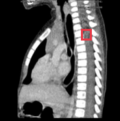

**Re-ground Lingshu caption：** The image shows a sagittal view of the thoracic spine with a focus on the mediastinum. The red box highlights a specific area of interest. Within this region, there appears to be a mass or lesion that is distinct from the surrounding tissues. The mass is located near the vertebral column and seems to be adjacent to the esophagus or trachea. The density and borders of the mass suggest it could be a solid lesion, possibly indicating a tumor or other pathological process. The surrounding structures, including the vertebrae and soft tissues, appear normal without any obvious signs of invasion or displacement.
**Re-ground caption 中文翻译：** 图像为胸椎矢状位，重点显示纵隔。红框标出关注区域，其中似有与周围组织不同的肿块或病灶，位于脊柱旁并邻近食管或气管。其密度和边界提示可能为实性病变、肿瘤或其他病理过程。周围椎体和软组织正常，未见明显侵犯或移位。

**Quantitative / qualitative validation：**

| Validation pair | Quantitative size / 定量 | Qualitative caption / 定性 |
|---|---|---|
| `partial__location_00012` | `inconsistent` | `inconsistent` |

#### location_00013: NOT SUPPORT

<table>
<tr><th>Anchor original bbox</th><th>Target original image; model returned null</th><th>Existing target bbox: study_002_photograph_image_000_upper_digestive_tract_endoscopy_f01</th></tr>
<tr><td></td><td></td><td></td></tr>
</table>

- **Target：** `study_002_photograph_image_000_upper_digestive_tract_endoscopy`; Photograph; Upper digestive tract endoscopy.
- **Relation：** `bbox_to_image` / `not_support`
- **Returned target bbox：** `unknown`
- **Maximum IoU：** n/a; threshold=0.5
- **Strong relation IDs：** `[]`

**IoU matching：**

| Existing target bbox | IoU | Strong match | Lingshu caption | 中文翻译 |
|---|---:|---|---|---|
| `study_002_photograph_image_000_upper_digestive_tract_endoscopy_f01`; `[427, 172, 731, 630]` | n/a | n/a | The esophagus appears normal. The gastroesophageal junction is visible. The stomach is visible. There is a small amount of food debris present. The pylorus is visible. | 食管外观正常，可见胃食管交界及胃腔。胃内有少量食物残渣，可见幽门。 |

### Anchor 5: `study_001_ct_image_001_sagittal_mediastinal_window_with_contrast_f01`

**Anchor Lingshu caption：** The red box is located in the anterior mediastinum. There is a large mass in this area which appears to be heterogeneous in density. The mass is displacing the heart posteriorly.
**Anchor caption 中文翻译：** 红框位于前纵隔。该处可见较大肿块，密度不均，并将心脏向后推移。

#### location_00014: NOT SUPPORT

<table>
<tr><th>Anchor original bbox</th><th>Target original image; model returned null</th><th>Existing target bbox: study_002_photograph_image_000_upper_digestive_tract_endoscopy_f01</th></tr>
<tr><td></td><td></td><td></td></tr>
</table>

- **Target：** `study_002_photograph_image_000_upper_digestive_tract_endoscopy`; Photograph; Upper digestive tract endoscopy.
- **Relation：** `bbox_to_image` / `not_support`
- **Returned target bbox：** `unknown`
- **Maximum IoU：** n/a; threshold=0.5
- **Strong relation IDs：** `[]`

**IoU matching：**

| Existing target bbox | IoU | Strong match | Lingshu caption | 中文翻译 |
|---|---:|---|---|---|
| `study_002_photograph_image_000_upper_digestive_tract_endoscopy_f01`; `[427, 172, 731, 630]` | n/a | n/a | The esophagus appears normal. The gastroesophageal junction is visible. The stomach is visible. There is a small amount of food debris present. The pylorus is visible. | 食管外观正常，可见胃食管交界及胃腔。胃内有少量食物残渣，可见幽门。 |

### Anchor 6: `study_001_ct_image_001_sagittal_mediastinal_window_with_contrast_f02`

**Anchor Lingshu caption：** The image shows a sagittal view of the chest with a focus on the mediastinum. The boxed region highlights an area of interest that appears to have increased density compared to surrounding tissues. This could indicate a mass or lesion. The mediastinal structures, including the heart and major vessels, are visible, and there is no obvious displacement or compression of these structures. The lung fields appear clear without any significant abnormalities such as consolidation or effusion. The bony structures, including the vertebrae and ribs, are intact without signs of fracture or lytic lesions.
**Anchor caption 中文翻译：** 图像为胸部矢状位，重点显示纵隔。框内关注区域的密度似高于周围组织，可能提示肿块或病灶。心脏及大血管等纵隔结构可见，未见明显移位或受压。肺野清晰，未见明显实变或积液。椎体和肋骨完整，未见骨折或溶骨性病变。

#### location_00015: NOT SUPPORT

<table>
<tr><th>Anchor original bbox</th><th>Target original image; model returned null</th><th>Existing target bbox: study_002_photograph_image_000_upper_digestive_tract_endoscopy_f01</th></tr>
<tr><td></td><td></td><td></td></tr>
</table>

- **Target：** `study_002_photograph_image_000_upper_digestive_tract_endoscopy`; Photograph; Upper digestive tract endoscopy.
- **Relation：** `bbox_to_image` / `not_support`
- **Returned target bbox：** `unknown`
- **Maximum IoU：** n/a; threshold=0.5
- **Strong relation IDs：** `[]`

**IoU matching：**

| Existing target bbox | IoU | Strong match | Lingshu caption | 中文翻译 |
|---|---:|---|---|---|
| `study_002_photograph_image_000_upper_digestive_tract_endoscopy_f01`; `[427, 172, 731, 630]` | n/a | n/a | The esophagus appears normal. The gastroesophageal junction is visible. The stomach is visible. There is a small amount of food debris present. The pylorus is visible. | 食管外观正常，可见胃食管交界及胃腔。胃内有少量食物残渣，可见幽门。 |

## Dynamically Skipped Anchors

None.

## Case-level Location Validation Summary / 病例级定位验证总结

- **Strong support：** 0 个 bbox-to-bbox 关系
- **Partial support：** 6 个 bbox-to-image 关系
- **Not support：** 9 个 bbox-to-image 关系

### Strong Support

该病例没有 strong-support bbox 对应关系。

### Partial Support

#### Partial 1: `study_000_fluoroscopy_image_000_frontal_f01` → `study_000_fluoroscopy_image_001_frontal`

- **Query：** `location_00001`
- **Returned target bbox：** `[150, 170, 250, 270]`
- **Maximum IoU：** 0.057（低于 threshold=0.5）

<table>
<tr><th>Anchor bbox</th><th>Cross-image grounding and IoU overlay</th><th>B image with the single re-grounded bbox given to Lingshu</th><th>Closest existing target bbox</th></tr>
<tr><td></td><td></td><td></td><td></td></tr>
</table>

- **A 端原始 Lingshu caption：** The image shows a frontal view of the neck and upper chest area. There is a red box highlighting a specific region on the left side of the neck. Within this region, there appears to be an abnormality that could potentially indicate a pathological condition. The surrounding tissues and structures appear relatively normal, without any obvious signs of inflammation, swelling, or other abnormalities.
- **A 端 caption 中文翻译：** 图像为颈部及上胸部正位像。红框标出颈部左侧特定区域，其中似有可能提示病理状态的异常。周围组织和结构相对正常，未见明显炎症、肿胀或其他异常。
- **B 端 re-ground Lingshu caption：** The image shows a frontal view of the chest with a focus on the upper mediastinum. Within the boxed region, there appears to be a radiopaque structure suggestive of a foreign body or calcification. The surrounding soft tissues and bony structures do not show any obvious signs of acute pathology. The lungs appear clear without evidence of consolidation, effusion, or pneumothorax. The heart size is within normal limits, and no significant abnormalities are noted in the visible portions of the great vessels.
- **B 端 re-ground caption 中文翻译：** 图像为胸部正位像，重点显示上纵隔。框内似有不透 X 线结构，提示可能为异物或钙化。周围软组织及骨性结构未见明显急性病变。双肺清晰，未见实变、积液或气胸。心影大小正常，所见大血管未见显著异常。
- **Quantitative size validation / 定量大小一致性：** `consistent`
- **Qualitative caption validation / 定性语义一致性：** `inconsistent`

#### Partial 2: `study_000_fluoroscopy_image_000_frontal_f01` → `study_001_ct_image_000_coronal_lung_window`

- **Query：** `location_00002`
- **Returned target bbox：** `[260, 180, 400, 320]`
- **Maximum IoU：** n/a（低于 threshold=0.5）

<table>
<tr><th>Anchor bbox</th><th>Cross-image grounding and IoU overlay</th><th>B image with the single re-grounded bbox given to Lingshu</th></tr>
<tr><td></td><td></td><td></td></tr>
</table>

- **A 端原始 Lingshu caption：** The image shows a frontal view of the neck and upper chest area. There is a red box highlighting a specific region on the left side of the neck. Within this region, there appears to be an abnormality that could potentially indicate a pathological condition. The surrounding tissues and structures appear relatively normal, without any obvious signs of inflammation, swelling, or other abnormalities.
- **A 端 caption 中文翻译：** 图像为颈部及上胸部正位像。红框标出颈部左侧特定区域，其中似有可能提示病理状态的异常。周围组织和结构相对正常，未见明显炎症、肿胀或其他异常。
- **B 端 re-ground Lingshu caption：** The image shows a coronal lung window CT scan. There is a red bounding box located in the right upper lobe of the lungs. Within this region, there appears to be a small, well-defined nodule. The surrounding lung parenchyma appears relatively normal without significant consolidation, ground-glass opacities, or other obvious abnormalities. The mediastinum and heart appear unremarkable. No pleural effusions or pneumothorax are noted.
- **B 端 re-ground caption 中文翻译：** 图像为冠状位肺窗 CT。红框位于右上叶，框内似有小而边界清楚的结节。周围肺实质相对正常，未见明显实变、磨玻璃影或其他异常。纵隔和心脏未见异常。未见胸腔积液或气胸。
- **Quantitative size validation / 定量大小一致性：** `inconsistent`
- **Qualitative caption validation / 定性语义一致性：** `inconsistent`

#### Partial 3: `study_000_fluoroscopy_image_000_frontal_f01` → `study_001_ct_image_001_sagittal_mediastinal_window_with_contrast`

- **Query：** `location_00003`
- **Returned target bbox：** `[375, 120, 460, 280]`
- **Maximum IoU：** 0.000（低于 threshold=0.5）

<table>
<tr><th>Anchor bbox</th><th>Cross-image grounding and IoU overlay</th><th>B image with the single re-grounded bbox given to Lingshu</th><th>Closest existing target bbox</th></tr>
<tr><td></td><td></td><td></td><td></td></tr>
</table>

- **A 端原始 Lingshu caption：** The image shows a frontal view of the neck and upper chest area. There is a red box highlighting a specific region on the left side of the neck. Within this region, there appears to be an abnormality that could potentially indicate a pathological condition. The surrounding tissues and structures appear relatively normal, without any obvious signs of inflammation, swelling, or other abnormalities.
- **A 端 caption 中文翻译：** 图像为颈部及上胸部正位像。红框标出颈部左侧特定区域，其中似有可能提示病理状态的异常。周围组织和结构相对正常，未见明显炎症、肿胀或其他异常。
- **B 端 re-ground Lingshu caption：** The image shows a sagittal view of the thoracic region with a focus on the mediastinum. The boxed area highlights a region in the anterior mediastinum. Within this region, there appears to be a mass-like structure that is distinct from the surrounding tissues. The mass is located near the heart and major vessels, suggesting its proximity to critical structures. The density of the mass is different from the adjacent lung tissue, indicating a possible abnormality. The surrounding mediastinal structures appear to be displaced or compressed by the mass. There is no clear evidence of calcification or necrosis within the mass. The overall appearance suggests a need for further evaluation to determine the nature of the lesion.
- **B 端 re-ground caption 中文翻译：** 图像为胸部矢状位，重点显示纵隔。框内位于前纵隔，可见与周围组织不同的肿块样结构，邻近心脏和大血管。肿块密度不同于邻近肺组织，提示可能存在异常，并似使周围纵隔结构发生移位或受压。肿块内未见明确钙化或坏死。整体表现需要进一步评估以明确病灶性质。
- **Quantitative size validation / 定量大小一致性：** `inconsistent`
- **Qualitative caption validation / 定性语义一致性：** `inconsistent`

#### Partial 4: `study_000_fluoroscopy_image_001_frontal_f01` → `study_001_ct_image_001_sagittal_mediastinal_window_with_contrast`

- **Query：** `location_00006`
- **Returned target bbox：** `[100, 20, 250, 200]`
- **Maximum IoU：** 0.000（低于 threshold=0.5）

<table>
<tr><th>Anchor bbox</th><th>Cross-image grounding and IoU overlay</th><th>B image with the single re-grounded bbox given to Lingshu</th><th>Closest existing target bbox</th></tr>
<tr><td></td><td></td><td></td><td></td></tr>
</table>

- **A 端原始 Lingshu caption：** The image shows a frontal view of the chest with a red box highlighting an area of interest in the upper left quadrant. Within this region, there appears to be a radiopaque structure that could represent a foreign body or calcification. The surrounding lung fields appear clear without obvious signs of consolidation, effusion, or pneumothorax. The heart silhouette is visible and appears normal in size and shape. The diaphragm and costophrenic angles are also well-defined. No acute bony abnormalities are noted in the visible portions of the ribs and spine.
- **A 端 caption 中文翻译：** 图像为胸部正位像，红框标出左上象限的关注区域。该区域内似有不透 X 线结构，可能代表异物或钙化。周围肺野清晰，未见明显实变、积液或气胸。心影可见，大小和形态正常。膈肌及肋膈角清楚。可见肋骨和脊柱未见急性骨性异常。
- **B 端 re-ground Lingshu caption：** The image shows a sagittal view of the chest with a focus on the mediastinum. The red box highlights an area in the upper thoracic region, possibly indicating a region of interest for further evaluation. Within this region, there appears to be a mass or lesion that could be causing concern. The mass is located near the anterior mediastinum, adjacent to the sternum and possibly involving the thymus gland. The lesion seems to have irregular borders and may exhibit heterogeneous density, suggesting a possible neoplastic process. Surrounding structures such as the heart, great vessels, and lung parenchyma appear to be displaced or compressed by the mass. There is no clear evidence of calcification within the lesion, and the surrounding tissues do not show signs of significant inflammation or edema. Further imaging and clinical correlation would be necessary to determine the exact nature of this finding.
- **B 端 re-ground caption 中文翻译：** 图像为胸部矢状位，重点显示纵隔。红框位于上胸部，其中似有值得关注的肿块或病灶。肿块靠近前纵隔和胸骨，可能累及胸腺，边缘不规则、密度不均，提示可能为肿瘤性过程。心脏、大血管及肺实质等周围结构似受推移或压迫。病灶内未见明确钙化，周围组织未见明显炎症或水肿。需要进一步影像检查并结合临床资料明确其性质。
- **Quantitative size validation / 定量大小一致性：** `inconsistent`
- **Qualitative caption validation / 定性语义一致性：** `inconsistent`

#### Partial 5: `study_000_fluoroscopy_image_001_frontal_f02` → `study_001_ct_image_001_sagittal_mediastinal_window_with_contrast`

- **Query：** `location_00009`
- **Returned target bbox：** `[640, 140, 730, 230]`
- **Maximum IoU：** 0.000（低于 threshold=0.5）

<table>
<tr><th>Anchor bbox</th><th>Cross-image grounding and IoU overlay</th><th>B image with the single re-grounded bbox given to Lingshu</th><th>Closest existing target bbox</th></tr>
<tr><td></td><td></td><td></td><td></td></tr>
</table>

- **A 端原始 Lingshu caption：** The image shows a frontal view of the chest with a red bounding box highlighting a specific area. Within this region, there appears to be a radiopaque object consistent with a foreign body, likely a coin, located in the upper esophagus. The surrounding structures, including the trachea and major bronchi, appear unremarkable. The lungs show no obvious signs of consolidation, effusion, or pneumothorax. The heart silhouette is normal in size and shape. There are no apparent fractures or dislocations of the ribs or clavicles.
- **A 端 caption 中文翻译：** 图像为胸部正位像，红框标出特定区域。区域内似有不透 X 线异物，可能为位于上段食管的硬币。气管及主支气管等周围结构未见明显异常。双肺未见明显实变、积液或气胸。心影大小和形态正常，肋骨及锁骨未见明显骨折或脱位。
- **B 端 re-ground Lingshu caption：** The image shows a sagittal view of the thoracic spine with a red box highlighting a specific area. Within this region, there appears to be a lesion or abnormality that requires further investigation. The surrounding structures, including the vertebral bodies, intervertebral discs, and paraspinal soft tissues, should also be carefully examined for any additional abnormalities or signs of pathology.
- **B 端 re-ground caption 中文翻译：** 图像为胸椎矢状位，红框标出特定区域。框内似有需要进一步检查的病灶或异常。还应仔细评估椎体、椎间盘和椎旁软组织等周围结构有无其他异常或病理征象。
- **Quantitative size validation / 定量大小一致性：** `inconsistent`
- **Qualitative caption validation / 定性语义一致性：** `inconsistent`

#### Partial 6: `study_000_fluoroscopy_image_001_frontal_f03` → `study_001_ct_image_001_sagittal_mediastinal_window_with_contrast`

- **Query：** `location_00012`
- **Returned target bbox：** `[675, 244, 764, 334]`
- **Maximum IoU：** 0.000（低于 threshold=0.5）

<table>
<tr><th>Anchor bbox</th><th>Cross-image grounding and IoU overlay</th><th>B image with the single re-grounded bbox given to Lingshu</th><th>Closest existing target bbox</th></tr>
<tr><td></td><td></td><td></td><td></td></tr>
</table>

- **A 端原始 Lingshu caption：** The image shows a frontal view of the chest with a focus on the upper thoracic region. There is a marked area in the left upper quadrant of the image, which appears to be highlighted for further examination. Within this region, there is a noticeable opacity that could suggest the presence of an abnormality such as a mass or consolidation. The surrounding lung fields appear relatively clear, with no obvious signs of pleural effusion or pneumothorax. The heart silhouette is partially visible, and there are no apparent abnormalities in the mediastinum. The diaphragm and bony structures, including the ribs and spine, do not show any significant deviations from normal anatomy.
- **A 端 caption 中文翻译：** 图像为胸部正位像，重点显示上胸部。图像左上象限有一处标记区域，其中可见明显致密影，可能提示肿块或实变等异常。周围肺野相对清晰，未见明显胸腔积液或气胸。心影部分可见，纵隔未见明显异常。膈肌及肋骨、脊柱等骨性结构未见明显偏离正常解剖。
- **B 端 re-ground Lingshu caption：** The image shows a sagittal view of the thoracic spine with a focus on the mediastinum. The red box highlights a specific area of interest. Within this region, there appears to be a mass or lesion that is distinct from the surrounding tissues. The mass is located near the vertebral column and seems to be adjacent to the esophagus or trachea. The density and borders of the mass suggest it could be a solid lesion, possibly indicating a tumor or other pathological process. The surrounding structures, including the vertebrae and soft tissues, appear normal without any obvious signs of invasion or displacement.
- **B 端 re-ground caption 中文翻译：** 图像为胸椎矢状位，重点显示纵隔。红框标出关注区域，其中似有与周围组织不同的肿块或病灶，位于脊柱旁并邻近食管或气管。其密度和边界提示可能为实性病变、肿瘤或其他病理过程。周围椎体和软组织正常，未见明显侵犯或移位。
- **Quantitative size validation / 定量大小一致性：** `inconsistent`
- **Qualitative caption validation / 定性语义一致性：** `inconsistent`

### Not Support

#### Not support 1: `study_000_fluoroscopy_image_000_frontal_f01` → `study_002_photograph_image_000_upper_digestive_tract_endoscopy`

- **Query：** `location_00004`
- **Result：** 目标图返回 `null`，未定位到对应区域。

<table>
<tr><th>Anchor bbox</th><th>Target original image</th></tr>
<tr><td></td><td></td></tr>
</table>

- **A 端原始 Lingshu caption：** The image shows a frontal view of the neck and upper chest area. There is a red box highlighting a specific region on the left side of the neck. Within this region, there appears to be an abnormality that could potentially indicate a pathological condition. The surrounding tissues and structures appear relatively normal, without any obvious signs of inflammation, swelling, or other abnormalities.
- **A 端 caption 中文翻译：** 图像为颈部及上胸部正位像。红框标出颈部左侧特定区域，其中似有可能提示病理状态的异常。周围组织和结构相对正常，未见明显炎症、肿胀或其他异常。
- **B 端 re-ground caption：** 不适用；目标图返回 `null`，没有生成 re-ground bbox。
- **定量 / 定性验证：** 不适用；仅对 strong-support 和 partial-support pair 执行。

#### Not support 2: `study_000_fluoroscopy_image_001_frontal_f01` → `study_001_ct_image_000_coronal_lung_window`

- **Query：** `location_00005`
- **Result：** 目标图返回 `null`，未定位到对应区域。

<table>
<tr><th>Anchor bbox</th><th>Target original image</th></tr>
<tr><td></td><td></td></tr>
</table>

- **A 端原始 Lingshu caption：** The image shows a frontal view of the chest with a red box highlighting an area of interest in the upper left quadrant. Within this region, there appears to be a radiopaque structure that could represent a foreign body or calcification. The surrounding lung fields appear clear without obvious signs of consolidation, effusion, or pneumothorax. The heart silhouette is visible and appears normal in size and shape. The diaphragm and costophrenic angles are also well-defined. No acute bony abnormalities are noted in the visible portions of the ribs and spine.
- **A 端 caption 中文翻译：** 图像为胸部正位像，红框标出左上象限的关注区域。该区域内似有不透 X 线结构，可能代表异物或钙化。周围肺野清晰，未见明显实变、积液或气胸。心影可见，大小和形态正常。膈肌及肋膈角清楚。可见肋骨和脊柱未见急性骨性异常。
- **B 端 re-ground caption：** 不适用；目标图返回 `null`，没有生成 re-ground bbox。
- **定量 / 定性验证：** 不适用；仅对 strong-support 和 partial-support pair 执行。

#### Not support 3: `study_000_fluoroscopy_image_001_frontal_f01` → `study_002_photograph_image_000_upper_digestive_tract_endoscopy`

- **Query：** `location_00007`
- **Result：** 目标图返回 `null`，未定位到对应区域。

<table>
<tr><th>Anchor bbox</th><th>Target original image</th></tr>
<tr><td></td><td></td></tr>
</table>

- **A 端原始 Lingshu caption：** The image shows a frontal view of the chest with a red box highlighting an area of interest in the upper left quadrant. Within this region, there appears to be a radiopaque structure that could represent a foreign body or calcification. The surrounding lung fields appear clear without obvious signs of consolidation, effusion, or pneumothorax. The heart silhouette is visible and appears normal in size and shape. The diaphragm and costophrenic angles are also well-defined. No acute bony abnormalities are noted in the visible portions of the ribs and spine.
- **A 端 caption 中文翻译：** 图像为胸部正位像，红框标出左上象限的关注区域。该区域内似有不透 X 线结构，可能代表异物或钙化。周围肺野清晰，未见明显实变、积液或气胸。心影可见，大小和形态正常。膈肌及肋膈角清楚。可见肋骨和脊柱未见急性骨性异常。
- **B 端 re-ground caption：** 不适用；目标图返回 `null`，没有生成 re-ground bbox。
- **定量 / 定性验证：** 不适用；仅对 strong-support 和 partial-support pair 执行。

#### Not support 4: `study_000_fluoroscopy_image_001_frontal_f02` → `study_001_ct_image_000_coronal_lung_window`

- **Query：** `location_00008`
- **Result：** 目标图返回 `null`，未定位到对应区域。

<table>
<tr><th>Anchor bbox</th><th>Target original image</th></tr>
<tr><td></td><td></td></tr>
</table>

- **A 端原始 Lingshu caption：** The image shows a frontal view of the chest with a red bounding box highlighting a specific area. Within this region, there appears to be a radiopaque object consistent with a foreign body, likely a coin, located in the upper esophagus. The surrounding structures, including the trachea and major bronchi, appear unremarkable. The lungs show no obvious signs of consolidation, effusion, or pneumothorax. The heart silhouette is normal in size and shape. There are no apparent fractures or dislocations of the ribs or clavicles.
- **A 端 caption 中文翻译：** 图像为胸部正位像，红框标出特定区域。区域内似有不透 X 线异物，可能为位于上段食管的硬币。气管及主支气管等周围结构未见明显异常。双肺未见明显实变、积液或气胸。心影大小和形态正常，肋骨及锁骨未见明显骨折或脱位。
- **B 端 re-ground caption：** 不适用；目标图返回 `null`，没有生成 re-ground bbox。
- **定量 / 定性验证：** 不适用；仅对 strong-support 和 partial-support pair 执行。

#### Not support 5: `study_000_fluoroscopy_image_001_frontal_f02` → `study_002_photograph_image_000_upper_digestive_tract_endoscopy`

- **Query：** `location_00010`
- **Result：** 目标图返回 `null`，未定位到对应区域。

<table>
<tr><th>Anchor bbox</th><th>Target original image</th></tr>
<tr><td></td><td></td></tr>
</table>

- **A 端原始 Lingshu caption：** The image shows a frontal view of the chest with a red bounding box highlighting a specific area. Within this region, there appears to be a radiopaque object consistent with a foreign body, likely a coin, located in the upper esophagus. The surrounding structures, including the trachea and major bronchi, appear unremarkable. The lungs show no obvious signs of consolidation, effusion, or pneumothorax. The heart silhouette is normal in size and shape. There are no apparent fractures or dislocations of the ribs or clavicles.
- **A 端 caption 中文翻译：** 图像为胸部正位像，红框标出特定区域。区域内似有不透 X 线异物，可能为位于上段食管的硬币。气管及主支气管等周围结构未见明显异常。双肺未见明显实变、积液或气胸。心影大小和形态正常，肋骨及锁骨未见明显骨折或脱位。
- **B 端 re-ground caption：** 不适用；目标图返回 `null`，没有生成 re-ground bbox。
- **定量 / 定性验证：** 不适用；仅对 strong-support 和 partial-support pair 执行。

#### Not support 6: `study_000_fluoroscopy_image_001_frontal_f03` → `study_001_ct_image_000_coronal_lung_window`

- **Query：** `location_00011`
- **Result：** 目标图返回 `null`，未定位到对应区域。

<table>
<tr><th>Anchor bbox</th><th>Target original image</th></tr>
<tr><td></td><td></td></tr>
</table>

- **A 端原始 Lingshu caption：** The image shows a frontal view of the chest with a focus on the upper thoracic region. There is a marked area in the left upper quadrant of the image, which appears to be highlighted for further examination. Within this region, there is a noticeable opacity that could suggest the presence of an abnormality such as a mass or consolidation. The surrounding lung fields appear relatively clear, with no obvious signs of pleural effusion or pneumothorax. The heart silhouette is partially visible, and there are no apparent abnormalities in the mediastinum. The diaphragm and bony structures, including the ribs and spine, do not show any significant deviations from normal anatomy.
- **A 端 caption 中文翻译：** 图像为胸部正位像，重点显示上胸部。图像左上象限有一处标记区域，其中可见明显致密影，可能提示肿块或实变等异常。周围肺野相对清晰，未见明显胸腔积液或气胸。心影部分可见，纵隔未见明显异常。膈肌及肋骨、脊柱等骨性结构未见明显偏离正常解剖。
- **B 端 re-ground caption：** 不适用；目标图返回 `null`，没有生成 re-ground bbox。
- **定量 / 定性验证：** 不适用；仅对 strong-support 和 partial-support pair 执行。

#### Not support 7: `study_000_fluoroscopy_image_001_frontal_f03` → `study_002_photograph_image_000_upper_digestive_tract_endoscopy`

- **Query：** `location_00013`
- **Result：** 目标图返回 `null`，未定位到对应区域。

<table>
<tr><th>Anchor bbox</th><th>Target original image</th></tr>
<tr><td></td><td></td></tr>
</table>

- **A 端原始 Lingshu caption：** The image shows a frontal view of the chest with a focus on the upper thoracic region. There is a marked area in the left upper quadrant of the image, which appears to be highlighted for further examination. Within this region, there is a noticeable opacity that could suggest the presence of an abnormality such as a mass or consolidation. The surrounding lung fields appear relatively clear, with no obvious signs of pleural effusion or pneumothorax. The heart silhouette is partially visible, and there are no apparent abnormalities in the mediastinum. The diaphragm and bony structures, including the ribs and spine, do not show any significant deviations from normal anatomy.
- **A 端 caption 中文翻译：** 图像为胸部正位像，重点显示上胸部。图像左上象限有一处标记区域，其中可见明显致密影，可能提示肿块或实变等异常。周围肺野相对清晰，未见明显胸腔积液或气胸。心影部分可见，纵隔未见明显异常。膈肌及肋骨、脊柱等骨性结构未见明显偏离正常解剖。
- **B 端 re-ground caption：** 不适用；目标图返回 `null`，没有生成 re-ground bbox。
- **定量 / 定性验证：** 不适用；仅对 strong-support 和 partial-support pair 执行。

#### Not support 8: `study_001_ct_image_001_sagittal_mediastinal_window_with_contrast_f01` → `study_002_photograph_image_000_upper_digestive_tract_endoscopy`

- **Query：** `location_00014`
- **Result：** 目标图返回 `null`，未定位到对应区域。

<table>
<tr><th>Anchor bbox</th><th>Target original image</th></tr>
<tr><td></td><td></td></tr>
</table>

- **A 端原始 Lingshu caption：** The red box is located in the anterior mediastinum. There is a large mass in this area which appears to be heterogeneous in density. The mass is displacing the heart posteriorly.
- **A 端 caption 中文翻译：** 红框位于前纵隔。该处可见较大肿块，密度不均，并将心脏向后推移。
- **B 端 re-ground caption：** 不适用；目标图返回 `null`，没有生成 re-ground bbox。
- **定量 / 定性验证：** 不适用；仅对 strong-support 和 partial-support pair 执行。

#### Not support 9: `study_001_ct_image_001_sagittal_mediastinal_window_with_contrast_f02` → `study_002_photograph_image_000_upper_digestive_tract_endoscopy`

- **Query：** `location_00015`
- **Result：** 目标图返回 `null`，未定位到对应区域。

<table>
<tr><th>Anchor bbox</th><th>Target original image</th></tr>
<tr><td></td><td></td></tr>
</table>

- **A 端原始 Lingshu caption：** The image shows a sagittal view of the chest with a focus on the mediastinum. The boxed region highlights an area of interest that appears to have increased density compared to surrounding tissues. This could indicate a mass or lesion. The mediastinal structures, including the heart and major vessels, are visible, and there is no obvious displacement or compression of these structures. The lung fields appear clear without any significant abnormalities such as consolidation or effusion. The bony structures, including the vertebrae and ribs, are intact without signs of fracture or lytic lesions.
- **A 端 caption 中文翻译：** 图像为胸部矢状位，重点显示纵隔。框内关注区域的密度似高于周围组织，可能提示肿块或病灶。心脏及大血管等纵隔结构可见，未见明显移位或受压。肺野清晰，未见明显实变或积液。椎体和肋骨完整，未见骨折或溶骨性病变。
- **B 端 re-ground caption：** 不适用；目标图返回 `null`，没有生成 re-ground bbox。
- **定量 / 定性验证：** 不适用；仅对 strong-support 和 partial-support pair 执行。
