# Focal hepatic steatosis

[返回 Step 3 总览](../README_STEP3_VISUALIZATION.md)

- **Case ID：** `focal-hepatic-steatosis`
- **Case URL：** [https://radiopaedia.org/cases/focal-hepatic-steatosis?lang=us](https://radiopaedia.org/cases/focal-hepatic-steatosis?lang=us)
- **验证模型：** Qwen3-VL-8B
- **图像 / Step 2 findings：** 7 / 13
- **定位结果：** strong 2；partial 13；not support 33；parse error 0
- **Strong bbox relations：** 2
- **原始 JSON：** [case_evidence.json](../assets_step3/focal-hepatic-steatosis/case_evidence.json)

**Overlay 图例：** 红框为跨图新定位；绿框为 IoU >= 0.5 的已有 bbox；黄框为未达到阈值的已有 bbox。

## Step 2 Finding Nodes

### Finding 1: `study_000_ct_image_000_axial_c_portal_venous_phase_f01`

- **Modality / subcategory：** CT / Axial C+ portal venous phase
- **bbox_2d：** `[160, 231, 432, 478]`
- **Lingshu caption：** The liver is enlarged and contains multiple hypodense lesions. The largest lesion measures 2.5 cm and is located in segment 4. There is no evidence of vascular invasion.
- **中文翻译：** 肝脏增大，内见多发低密度病灶。最大病灶位于第 4 段，大小约 2.5 cm。未见血管侵犯。

### Finding 2: `study_000_ct_image_000_axial_c_portal_venous_phase_f02`

- **Modality / subcategory：** CT / Axial C+ portal venous phase
- **bbox_2d：** `[304, 541, 410, 674]`
- **Lingshu caption：** The liver is enlarged and contains multiple hypodense lesions. The largest lesion measures approximately 1.5 cm and is located in segment 4. There is no evidence of vascular invasion. No other focal lesions are identified. The spleen is unremarkable.
- **中文翻译：** 肝脏增大，内见多发低密度病灶。最大病灶位于第 4 段，大小约 1.5 cm。未见血管侵犯，也未发现其他局灶性病灶。脾脏未见异常。

### Finding 3: `study_000_ct_image_000_axial_c_portal_venous_phase_f03`

- **Modality / subcategory：** CT / Axial C+ portal venous phase
- **bbox_2d：** `[308, 722, 432, 877]`
- **Lingshu caption：** The liver is enlarged and demonstrates multiple hypodense lesions throughout all segments. The largest lesion measures 1.6 cm and is located in segment 7. There is no evidence of vascular invasion. No additional masses are identified.
- **中文翻译：** 肝脏增大，各肝段可见多发低密度病灶。最大病灶位于第 7 段，大小约 1.6 cm。未见血管侵犯，也未发现其他肿块。

### Finding 4: `study_001_ultrasound_image_000_missing_f01`

- **Modality / subcategory：** Ultrasound / missing
- **bbox_2d：** `[251, 302, 319, 378]`
- **Lingshu caption：** The liver parenchyma appears diffusely hyperechoic. The portal vein is dilated measuring 15 mm. There is no evidence of ascites.
- **中文翻译：** 肝实质呈弥漫性高回声。门静脉扩张，直径约 15 mm。未见腹水。

### Finding 5: `study_001_ultrasound_image_000_missing_f02`

- **Modality / subcategory：** Ultrasound / missing
- **bbox_2d：** `[481, 387, 595, 537]`
- **Lingshu caption：** The liver parenchyma is diffusely hyperechoic. The portal vein is dilated measuring 15 mm. There is a small amount of ascites.
- **中文翻译：** 肝实质呈弥漫性高回声。门静脉扩张，直径约 15 mm。可见少量腹水。

### Finding 6: `study_001_ultrasound_image_000_missing_f03`

- **Modality / subcategory：** Ultrasound / missing
- **bbox_2d：** `[341, 515, 395, 576]`
- **Lingshu caption：** The liver parenchyma is diffusely hyperechoic and there is increased echogenicity anterior to the diaphragm consistent with chronic liver disease. There is a small hypoechoic lesion in segment 4A measuring approximately 1.0 cm.
- **中文翻译：** 肝实质呈弥漫性高回声，膈肌前方回声增强，符合慢性肝病表现。肝 4A 段可见一个约 1.0 cm 的小低回声病灶。

### Finding 7: `study_002_mri_image_000_axial_t1_in_phase_f01`

- **Modality / subcategory：** MRI / Axial T1 in-phase
- **bbox_2d：** `[548, 452, 673, 564]`
- **Lingshu caption：** The liver is enlarged and demonstrates diffuse abnormal signal intensity, which is most consistent with fatty infiltration. The spleen is also enlarged. There is a 1.5 cm focal area of low signal intensity in the left lobe of the liver, which may represent a simple cyst.
- **中文翻译：** 肝脏增大并呈弥漫性异常信号，最符合脂肪浸润。脾脏也增大。肝左叶可见一个 1.5 cm 的局灶性低信号区，可能为单纯性囊肿。

### Finding 8: `study_002_mri_image_000_axial_t1_in_phase_f02`

- **Modality / subcategory：** MRI / Axial T1 in-phase
- **bbox_2d：** `[637, 623, 762, 731]`
- **Lingshu caption：** The liver is enlarged and demonstrates diffuse abnormal signal intensity, which is most consistent with fatty infiltration. The spleen is also enlarged. There is a small amount of fluid in the right subphrenic space. No focal hepatic lesions are identified.
- **中文翻译：** 肝脏增大并呈弥漫性异常信号，最符合脂肪浸润。脾脏也增大。右侧膈下间隙可见少量液体。未发现局灶性肝病灶。

### Finding 9: `study_002_mri_image_000_axial_t1_in_phase_f03`

- **Modality / subcategory：** MRI / Axial T1 in-phase
- **bbox_2d：** `[810, 642, 966, 812]`
- **Lingshu caption：** The liver is enlarged and demonstrates diffuse abnormal signal intensity, which is most consistent with fatty infiltration. The spleen is also enlarged. There is a 2.5 cm lesion in the left lobe of the liver, which is hypointense on this T1 weighted image.
- **中文翻译：** 肝脏增大并呈弥漫性异常信号，最符合脂肪浸润。脾脏也增大。肝左叶可见一个 2.5 cm 病灶，在该 T1 加权图像上呈低信号。

### Finding 10: `study_002_mri_image_001_axial_t1_out_of_phase_f01`

- **Modality / subcategory：** MRI / Axial T1 out-of-phase
- **bbox_2d：** `[370, 286, 740, 686]`
- **Lingshu caption：** The liver is enlarged and demonstrates diffuse decrease in signal intensity on this out of phase sequence consistent with hepatic steatosis. The boxed area demonstrates a focal area of decreased signal intensity which could represent a focal fatty change or a focal lesion such as a hemangioma.
- **中文翻译：** 肝脏增大，反相位序列上信号弥漫性下降，符合肝脂肪变。框内可见局灶性信号降低，可能代表局灶性脂肪改变或血管瘤等局灶性病变。

### Finding 11: `study_002_mri_image_002_axial_t1_c_f01`

- **Modality / subcategory：** MRI / Axial T1 C+
- **bbox_2d：** `[310, 280, 570, 580]`
- **Lingshu caption：** The liver is enlarged. The hepatic parenchyma demonstrates diffuse nodularity. There is no focal lesion identified. The portal vein is prominent.
- **中文翻译：** 肝脏增大，肝实质呈弥漫性结节状。未发现局灶性病灶。门静脉增粗。

### Finding 12: `study_002_mri_image_003_axial_t2_f01`

- **Modality / subcategory：** MRI / Axial T2
- **bbox_2d：** `[474, 348, 624, 488]`
- **Lingshu caption：** The liver is enlarged and demonstrates diffuse abnormal signal intensity, which is T2 hyperintense and T1 hypointense. The intrahepatic biliary ducts are dilated. There is also a small amount of fluid in the subcapsular region of the right lobe of the liver.
- **中文翻译：** 肝脏增大并呈弥漫性异常信号，表现为 T2 高信号、T1 低信号。肝内胆管扩张，肝右叶包膜下另见少量液体。

### Finding 13: `study_002_mri_image_004_axial_t2_fat_sat_f01`

- **Modality / subcategory：** MRI / Axial T2 fat sat
- **bbox_2d：** `[333, 381, 607, 550]`
- **Lingshu caption：** The image shows a dilated common bile duct with a filling defect. The common bile duct appears to be enlarged and contains a distinct, well-defined structure within it, which could represent a stone or other obstructive lesion.
- **中文翻译：** 图像显示胆总管扩张并有充盈缺损。增宽的胆总管内可见边界清楚的结构，可能为结石或其他梗阻性病变。

## Directed Cross-image Validation

### Anchor 1: `study_000_ct_image_000_axial_c_portal_venous_phase_f01`

**Anchor Lingshu caption：** The liver is enlarged and contains multiple hypodense lesions. The largest lesion measures 2.5 cm and is located in segment 4. There is no evidence of vascular invasion.
**Anchor caption 中文翻译：** 肝脏增大，内见多发低密度病灶。最大病灶位于第 4 段，大小约 2.5 cm。未见血管侵犯。

#### location_00001: NOT SUPPORT

<table>
<tr><th>Anchor original bbox</th><th>Target original image; model returned null</th><th>Existing target bbox: study_001_ultrasound_image_000_missing_f01</th><th>Existing target bbox: study_001_ultrasound_image_000_missing_f02</th><th>Existing target bbox: study_001_ultrasound_image_000_missing_f03</th></tr>
<tr><td></td><td></td><td></td><td></td><td></td></tr>
</table>

- **Target：** `study_001_ultrasound_image_000_missing`; Ultrasound; missing
- **Relation：** `bbox_to_image` / `not_support`
- **Returned target bbox：** `unknown`
- **Maximum IoU：** n/a; threshold=0.5
- **Strong relation IDs：** `[]`

**IoU matching：**

| Existing target bbox | IoU | Strong match | Lingshu caption | 中文翻译 |
|---|---:|---|---|---|
| `study_001_ultrasound_image_000_missing_f01`; `[251, 302, 319, 378]` | n/a | n/a | The liver parenchyma appears diffusely hyperechoic. The portal vein is dilated measuring 15 mm. There is no evidence of ascites. | 肝实质呈弥漫性高回声。门静脉扩张，直径约 15 mm。未见腹水。 |
| `study_001_ultrasound_image_000_missing_f02`; `[481, 387, 595, 537]` | n/a | n/a | The liver parenchyma is diffusely hyperechoic. The portal vein is dilated measuring 15 mm. There is a small amount of ascites. | 肝实质呈弥漫性高回声。门静脉扩张，直径约 15 mm。可见少量腹水。 |
| `study_001_ultrasound_image_000_missing_f03`; `[341, 515, 395, 576]` | n/a | n/a | The liver parenchyma is diffusely hyperechoic and there is increased echogenicity anterior to the diaphragm consistent with chronic liver disease. There is a small hypoechoic lesion in segment 4A measuring approximately 1.0 cm. | 肝实质呈弥漫性高回声，膈肌前方回声增强，符合慢性肝病表现。肝 4A 段可见一个约 1.0 cm 的小低回声病灶。 |

#### location_00002: NOT SUPPORT

<table>
<tr><th>Anchor original bbox</th><th>Target original image; model returned null</th><th>Existing target bbox: study_002_mri_image_000_axial_t1_in_phase_f01</th><th>Existing target bbox: study_002_mri_image_000_axial_t1_in_phase_f02</th><th>Existing target bbox: study_002_mri_image_000_axial_t1_in_phase_f03</th></tr>
<tr><td></td><td></td><td></td><td></td><td></td></tr>
</table>

- **Target：** `study_002_mri_image_000_axial_t1_in_phase`; MRI; Axial T1 in-phase
- **Relation：** `bbox_to_image` / `not_support`
- **Returned target bbox：** `unknown`
- **Maximum IoU：** n/a; threshold=0.5
- **Strong relation IDs：** `[]`

**IoU matching：**

| Existing target bbox | IoU | Strong match | Lingshu caption | 中文翻译 |
|---|---:|---|---|---|
| `study_002_mri_image_000_axial_t1_in_phase_f01`; `[548, 452, 673, 564]` | n/a | n/a | The liver is enlarged and demonstrates diffuse abnormal signal intensity, which is most consistent with fatty infiltration. The spleen is also enlarged. There is a 1.5 cm focal area of low signal intensity in the left lobe of the liver, which may represent a simple cyst. | 肝脏增大并呈弥漫性异常信号，最符合脂肪浸润。脾脏也增大。肝左叶可见一个 1.5 cm 的局灶性低信号区，可能为单纯性囊肿。 |
| `study_002_mri_image_000_axial_t1_in_phase_f02`; `[637, 623, 762, 731]` | n/a | n/a | The liver is enlarged and demonstrates diffuse abnormal signal intensity, which is most consistent with fatty infiltration. The spleen is also enlarged. There is a small amount of fluid in the right subphrenic space. No focal hepatic lesions are identified. | 肝脏增大并呈弥漫性异常信号，最符合脂肪浸润。脾脏也增大。右侧膈下间隙可见少量液体。未发现局灶性肝病灶。 |
| `study_002_mri_image_000_axial_t1_in_phase_f03`; `[810, 642, 966, 812]` | n/a | n/a | The liver is enlarged and demonstrates diffuse abnormal signal intensity, which is most consistent with fatty infiltration. The spleen is also enlarged. There is a 2.5 cm lesion in the left lobe of the liver, which is hypointense on this T1 weighted image. | 肝脏增大并呈弥漫性异常信号，最符合脂肪浸润。脾脏也增大。肝左叶可见一个 2.5 cm 病灶，在该 T1 加权图像上呈低信号。 |

#### location_00003: PARTIAL SUPPORT

<table>
<tr><th>Anchor original bbox</th><th>Cross-image grounded target bbox</th><th>Existing target bbox: study_002_mri_image_001_axial_t1_out_of_phase_f01</th></tr>
<tr><td></td><td></td><td></td></tr>
</table>

- **Target：** `study_002_mri_image_001_axial_t1_out_of_phase`; MRI; Axial T1 out-of-phase
- **Relation：** `bbox_to_image` / `partial_support`
- **Returned target bbox：** `[150, 200, 450, 500]`
- **Maximum IoU：** 0.077; threshold=0.5
- **Strong relation IDs：** `[]`

**IoU matching：**

| Existing target bbox | IoU | Strong match | Lingshu caption | 中文翻译 |
|---|---:|---|---|---|
| `study_002_mri_image_001_axial_t1_out_of_phase_f01`; `[370, 286, 740, 686]` | 0.077 | no | The liver is enlarged and demonstrates diffuse decrease in signal intensity on this out of phase sequence consistent with hepatic steatosis. The boxed area demonstrates a focal area of decreased signal intensity which could represent a focal fatty change or a focal lesion such as a hemangioma. | 肝脏增大，反相位序列上信号弥漫性下降，符合肝脂肪变。框内可见局灶性信号降低，可能代表局灶性脂肪改变或血管瘤等局灶性病变。 |

**B 图单红框（Lingshu 实际输入）：**

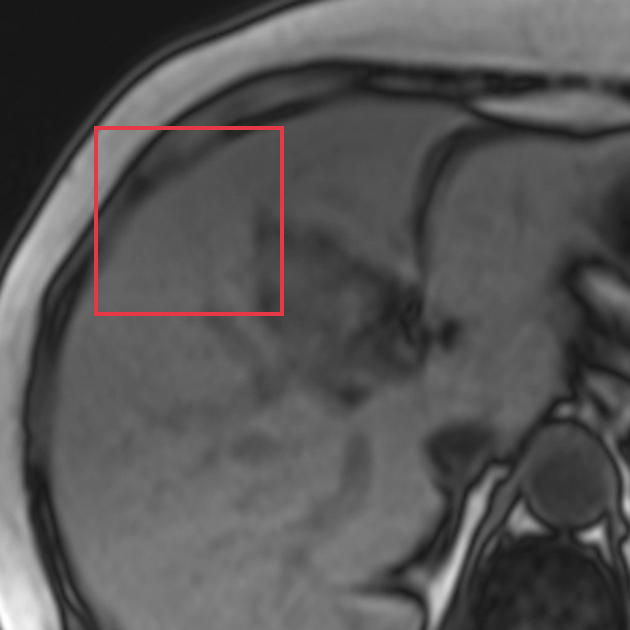

**Re-ground Lingshu caption：** The liver parenchyma demonstrates diffuse low signal intensity on this out of phase sequence compared to the spleen. This is consistent with diffuse hepatic steatosis. No focal lesions are identified. The biliary tree is not dilated. The portal vein is patent. There is no evidence of ascites or lymphadenopathy.
**Re-ground caption 中文翻译：** 反相位序列上肝实质信号较脾脏弥漫性降低，符合弥漫性肝脂肪变。未发现局灶性病灶。胆管树未扩张，门静脉通畅。未见腹水或淋巴结肿大。

#### location_00004: PARTIAL SUPPORT

<table>
<tr><th>Anchor original bbox</th><th>Cross-image grounded target bbox</th><th>Existing target bbox: study_002_mri_image_002_axial_t1_c_f01</th></tr>
<tr><td></td><td></td><td></td></tr>
</table>

- **Target：** `study_002_mri_image_002_axial_t1_c`; MRI; Axial T1 C+
- **Relation：** `bbox_to_image` / `partial_support`
- **Returned target bbox：** `[244, 176, 528, 436]`
- **Maximum IoU：** 0.286; threshold=0.5
- **Strong relation IDs：** `[]`

**IoU matching：**

| Existing target bbox | IoU | Strong match | Lingshu caption | 中文翻译 |
|---|---:|---|---|---|
| `study_002_mri_image_002_axial_t1_c_f01`; `[310, 280, 570, 580]` | 0.286 | no | The liver is enlarged. The hepatic parenchyma demonstrates diffuse nodularity. There is no focal lesion identified. The portal vein is prominent. | 肝脏增大，肝实质呈弥漫性结节状。未发现局灶性病灶。门静脉增粗。 |

**B 图单红框（Lingshu 实际输入）：**

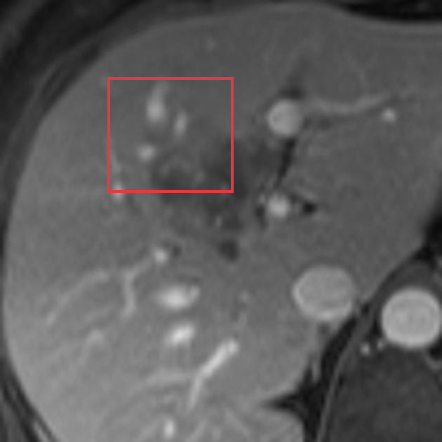

**Re-ground Lingshu caption：** The liver is enlarged. The hepatic parenchyma demonstrates diffuse nodularity. There is no evidence of focal hepatic lesions. The intrahepatic biliary ducts are dilated. The portal vein is prominent.
**Re-ground caption 中文翻译：** 肝脏增大，肝实质呈弥漫性结节状。未见局灶性肝病灶。肝内胆管扩张，门静脉增粗。

#### location_00005: PARTIAL SUPPORT

<table>
<tr><th>Anchor original bbox</th><th>Cross-image grounded target bbox</th><th>Existing target bbox: study_002_mri_image_003_axial_t2_f01</th></tr>
<tr><td></td><td></td><td></td></tr>
</table>

- **Target：** `study_002_mri_image_003_axial_t2`; MRI; Axial T2
- **Relation：** `bbox_to_image` / `partial_support`
- **Returned target bbox：** `[150, 120, 450, 450]`
- **Maximum IoU：** 0.000; threshold=0.5
- **Strong relation IDs：** `[]`

**IoU matching：**

| Existing target bbox | IoU | Strong match | Lingshu caption | 中文翻译 |
|---|---:|---|---|---|
| `study_002_mri_image_003_axial_t2_f01`; `[474, 348, 624, 488]` | 0.000 | no | The liver is enlarged and demonstrates diffuse abnormal signal intensity, which is T2 hyperintense and T1 hypointense. The intrahepatic biliary ducts are dilated. There is also a small amount of fluid in the subcapsular region of the right lobe of the liver. | 肝脏增大并呈弥漫性异常信号，表现为 T2 高信号、T1 低信号。肝内胆管扩张，肝右叶包膜下另见少量液体。 |

**B 图单红框（Lingshu 实际输入）：**

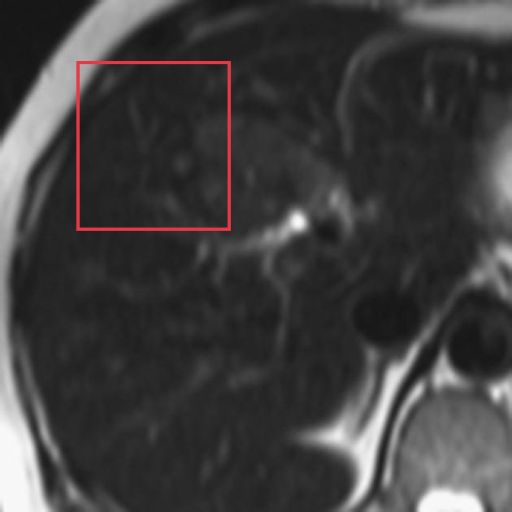

**Re-ground Lingshu caption：** The liver is enlarged and demonstrates diffuse abnormal signal intensity, which is heterogeneous. The spleen also appears to be enlarged.
**Re-ground caption 中文翻译：** 肝脏增大并呈弥漫性、不均匀异常信号。脾脏也似增大。

#### location_00006: NOT SUPPORT

<table>
<tr><th>Anchor original bbox</th><th>Target original image; model returned null</th><th>Existing target bbox: study_002_mri_image_004_axial_t2_fat_sat_f01</th></tr>
<tr><td></td><td></td><td></td></tr>
</table>

- **Target：** `study_002_mri_image_004_axial_t2_fat_sat`; MRI; Axial T2 fat sat
- **Relation：** `bbox_to_image` / `not_support`
- **Returned target bbox：** `unknown`
- **Maximum IoU：** n/a; threshold=0.5
- **Strong relation IDs：** `[]`

**IoU matching：**

| Existing target bbox | IoU | Strong match | Lingshu caption | 中文翻译 |
|---|---:|---|---|---|
| `study_002_mri_image_004_axial_t2_fat_sat_f01`; `[333, 381, 607, 550]` | n/a | n/a | The image shows a dilated common bile duct with a filling defect. The common bile duct appears to be enlarged and contains a distinct, well-defined structure within it, which could represent a stone or other obstructive lesion. | 图像显示胆总管扩张并有充盈缺损。增宽的胆总管内可见边界清楚的结构，可能为结石或其他梗阻性病变。 |

### Anchor 2: `study_000_ct_image_000_axial_c_portal_venous_phase_f02`

**Anchor Lingshu caption：** The liver is enlarged and contains multiple hypodense lesions. The largest lesion measures approximately 1.5 cm and is located in segment 4. There is no evidence of vascular invasion. No other focal lesions are identified. The spleen is unremarkable.
**Anchor caption 中文翻译：** 肝脏增大，内见多发低密度病灶。最大病灶位于第 4 段，大小约 1.5 cm。未见血管侵犯，也未发现其他局灶性病灶。脾脏未见异常。

#### location_00007: NOT SUPPORT

<table>
<tr><th>Anchor original bbox</th><th>Target original image; model returned null</th><th>Existing target bbox: study_001_ultrasound_image_000_missing_f01</th><th>Existing target bbox: study_001_ultrasound_image_000_missing_f02</th><th>Existing target bbox: study_001_ultrasound_image_000_missing_f03</th></tr>
<tr><td></td><td></td><td></td><td></td><td></td></tr>
</table>

- **Target：** `study_001_ultrasound_image_000_missing`; Ultrasound; missing
- **Relation：** `bbox_to_image` / `not_support`
- **Returned target bbox：** `unknown`
- **Maximum IoU：** n/a; threshold=0.5
- **Strong relation IDs：** `[]`

**IoU matching：**

| Existing target bbox | IoU | Strong match | Lingshu caption | 中文翻译 |
|---|---:|---|---|---|
| `study_001_ultrasound_image_000_missing_f01`; `[251, 302, 319, 378]` | n/a | n/a | The liver parenchyma appears diffusely hyperechoic. The portal vein is dilated measuring 15 mm. There is no evidence of ascites. | 肝实质呈弥漫性高回声。门静脉扩张，直径约 15 mm。未见腹水。 |
| `study_001_ultrasound_image_000_missing_f02`; `[481, 387, 595, 537]` | n/a | n/a | The liver parenchyma is diffusely hyperechoic. The portal vein is dilated measuring 15 mm. There is a small amount of ascites. | 肝实质呈弥漫性高回声。门静脉扩张，直径约 15 mm。可见少量腹水。 |
| `study_001_ultrasound_image_000_missing_f03`; `[341, 515, 395, 576]` | n/a | n/a | The liver parenchyma is diffusely hyperechoic and there is increased echogenicity anterior to the diaphragm consistent with chronic liver disease. There is a small hypoechoic lesion in segment 4A measuring approximately 1.0 cm. | 肝实质呈弥漫性高回声，膈肌前方回声增强，符合慢性肝病表现。肝 4A 段可见一个约 1.0 cm 的小低回声病灶。 |

#### location_00008: NOT SUPPORT

<table>
<tr><th>Anchor original bbox</th><th>Target original image; model returned null</th><th>Existing target bbox: study_002_mri_image_000_axial_t1_in_phase_f01</th><th>Existing target bbox: study_002_mri_image_000_axial_t1_in_phase_f02</th><th>Existing target bbox: study_002_mri_image_000_axial_t1_in_phase_f03</th></tr>
<tr><td></td><td></td><td></td><td></td><td></td></tr>
</table>

- **Target：** `study_002_mri_image_000_axial_t1_in_phase`; MRI; Axial T1 in-phase
- **Relation：** `bbox_to_image` / `not_support`
- **Returned target bbox：** `unknown`
- **Maximum IoU：** n/a; threshold=0.5
- **Strong relation IDs：** `[]`

**IoU matching：**

| Existing target bbox | IoU | Strong match | Lingshu caption | 中文翻译 |
|---|---:|---|---|---|
| `study_002_mri_image_000_axial_t1_in_phase_f01`; `[548, 452, 673, 564]` | n/a | n/a | The liver is enlarged and demonstrates diffuse abnormal signal intensity, which is most consistent with fatty infiltration. The spleen is also enlarged. There is a 1.5 cm focal area of low signal intensity in the left lobe of the liver, which may represent a simple cyst. | 肝脏增大并呈弥漫性异常信号，最符合脂肪浸润。脾脏也增大。肝左叶可见一个 1.5 cm 的局灶性低信号区，可能为单纯性囊肿。 |
| `study_002_mri_image_000_axial_t1_in_phase_f02`; `[637, 623, 762, 731]` | n/a | n/a | The liver is enlarged and demonstrates diffuse abnormal signal intensity, which is most consistent with fatty infiltration. The spleen is also enlarged. There is a small amount of fluid in the right subphrenic space. No focal hepatic lesions are identified. | 肝脏增大并呈弥漫性异常信号，最符合脂肪浸润。脾脏也增大。右侧膈下间隙可见少量液体。未发现局灶性肝病灶。 |
| `study_002_mri_image_000_axial_t1_in_phase_f03`; `[810, 642, 966, 812]` | n/a | n/a | The liver is enlarged and demonstrates diffuse abnormal signal intensity, which is most consistent with fatty infiltration. The spleen is also enlarged. There is a 2.5 cm lesion in the left lobe of the liver, which is hypointense on this T1 weighted image. | 肝脏增大并呈弥漫性异常信号，最符合脂肪浸润。脾脏也增大。肝左叶可见一个 2.5 cm 病灶，在该 T1 加权图像上呈低信号。 |

#### location_00009: NOT SUPPORT

<table>
<tr><th>Anchor original bbox</th><th>Target original image; model returned null</th><th>Existing target bbox: study_002_mri_image_001_axial_t1_out_of_phase_f01</th></tr>
<tr><td></td><td></td><td></td></tr>
</table>

- **Target：** `study_002_mri_image_001_axial_t1_out_of_phase`; MRI; Axial T1 out-of-phase
- **Relation：** `bbox_to_image` / `not_support`
- **Returned target bbox：** `unknown`
- **Maximum IoU：** n/a; threshold=0.5
- **Strong relation IDs：** `[]`

**IoU matching：**

| Existing target bbox | IoU | Strong match | Lingshu caption | 中文翻译 |
|---|---:|---|---|---|
| `study_002_mri_image_001_axial_t1_out_of_phase_f01`; `[370, 286, 740, 686]` | n/a | n/a | The liver is enlarged and demonstrates diffuse decrease in signal intensity on this out of phase sequence consistent with hepatic steatosis. The boxed area demonstrates a focal area of decreased signal intensity which could represent a focal fatty change or a focal lesion such as a hemangioma. | 肝脏增大，反相位序列上信号弥漫性下降，符合肝脂肪变。框内可见局灶性信号降低，可能代表局灶性脂肪改变或血管瘤等局灶性病变。 |

#### location_00010: PARTIAL SUPPORT

<table>
<tr><th>Anchor original bbox</th><th>Cross-image grounded target bbox</th><th>Existing target bbox: study_002_mri_image_002_axial_t1_c_f01</th></tr>
<tr><td></td><td></td><td></td></tr>
</table>

- **Target：** `study_002_mri_image_002_axial_t1_c`; MRI; Axial T1 C+
- **Relation：** `bbox_to_image` / `partial_support`
- **Returned target bbox：** `[298, 542, 402, 667]`
- **Maximum IoU：** 0.040; threshold=0.5
- **Strong relation IDs：** `[]`

**IoU matching：**

| Existing target bbox | IoU | Strong match | Lingshu caption | 中文翻译 |
|---|---:|---|---|---|
| `study_002_mri_image_002_axial_t1_c_f01`; `[310, 280, 570, 580]` | 0.040 | no | The liver is enlarged. The hepatic parenchyma demonstrates diffuse nodularity. There is no focal lesion identified. The portal vein is prominent. | 肝脏增大，肝实质呈弥漫性结节状。未发现局灶性病灶。门静脉增粗。 |

**B 图单红框（Lingshu 实际输入）：**

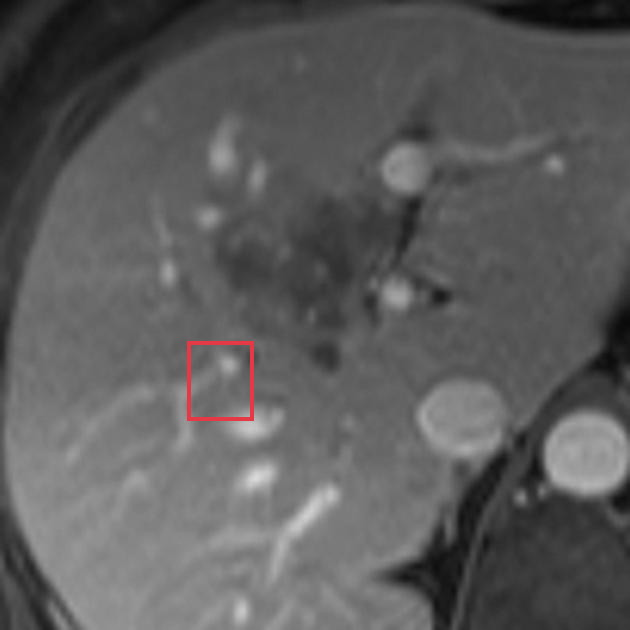

**Re-ground Lingshu caption：** The liver is enlarged. There are multiple lesions throughout the liver which demonstrate peripheral enhancement. The largest lesion is located in segment 6 and measures approximately 2.5 cm.
**Re-ground caption 中文翻译：** 肝脏增大，内见多发周边强化病灶。最大病灶位于第 6 段，大小约 2.5 cm。

#### location_00011: NOT SUPPORT

<table>
<tr><th>Anchor original bbox</th><th>Target original image; model returned null</th><th>Existing target bbox: study_002_mri_image_003_axial_t2_f01</th></tr>
<tr><td></td><td></td><td></td></tr>
</table>

- **Target：** `study_002_mri_image_003_axial_t2`; MRI; Axial T2
- **Relation：** `bbox_to_image` / `not_support`
- **Returned target bbox：** `unknown`
- **Maximum IoU：** n/a; threshold=0.5
- **Strong relation IDs：** `[]`

**IoU matching：**

| Existing target bbox | IoU | Strong match | Lingshu caption | 中文翻译 |
|---|---:|---|---|---|
| `study_002_mri_image_003_axial_t2_f01`; `[474, 348, 624, 488]` | n/a | n/a | The liver is enlarged and demonstrates diffuse abnormal signal intensity, which is T2 hyperintense and T1 hypointense. The intrahepatic biliary ducts are dilated. There is also a small amount of fluid in the subcapsular region of the right lobe of the liver. | 肝脏增大并呈弥漫性异常信号，表现为 T2 高信号、T1 低信号。肝内胆管扩张，肝右叶包膜下另见少量液体。 |

#### location_00012: NOT SUPPORT

<table>
<tr><th>Anchor original bbox</th><th>Target original image; model returned null</th><th>Existing target bbox: study_002_mri_image_004_axial_t2_fat_sat_f01</th></tr>
<tr><td></td><td></td><td></td></tr>
</table>

- **Target：** `study_002_mri_image_004_axial_t2_fat_sat`; MRI; Axial T2 fat sat
- **Relation：** `bbox_to_image` / `not_support`
- **Returned target bbox：** `unknown`
- **Maximum IoU：** n/a; threshold=0.5
- **Strong relation IDs：** `[]`

**IoU matching：**

| Existing target bbox | IoU | Strong match | Lingshu caption | 中文翻译 |
|---|---:|---|---|---|
| `study_002_mri_image_004_axial_t2_fat_sat_f01`; `[333, 381, 607, 550]` | n/a | n/a | The image shows a dilated common bile duct with a filling defect. The common bile duct appears to be enlarged and contains a distinct, well-defined structure within it, which could represent a stone or other obstructive lesion. | 图像显示胆总管扩张并有充盈缺损。增宽的胆总管内可见边界清楚的结构，可能为结石或其他梗阻性病变。 |

### Anchor 3: `study_000_ct_image_000_axial_c_portal_venous_phase_f03`

**Anchor Lingshu caption：** The liver is enlarged and demonstrates multiple hypodense lesions throughout all segments. The largest lesion measures 1.6 cm and is located in segment 7. There is no evidence of vascular invasion. No additional masses are identified.
**Anchor caption 中文翻译：** 肝脏增大，各肝段可见多发低密度病灶。最大病灶位于第 7 段，大小约 1.6 cm。未见血管侵犯，也未发现其他肿块。

#### location_00013: NOT SUPPORT

<table>
<tr><th>Anchor original bbox</th><th>Target original image; model returned null</th><th>Existing target bbox: study_001_ultrasound_image_000_missing_f01</th><th>Existing target bbox: study_001_ultrasound_image_000_missing_f02</th><th>Existing target bbox: study_001_ultrasound_image_000_missing_f03</th></tr>
<tr><td></td><td></td><td></td><td></td><td></td></tr>
</table>

- **Target：** `study_001_ultrasound_image_000_missing`; Ultrasound; missing
- **Relation：** `bbox_to_image` / `not_support`
- **Returned target bbox：** `unknown`
- **Maximum IoU：** n/a; threshold=0.5
- **Strong relation IDs：** `[]`

**IoU matching：**

| Existing target bbox | IoU | Strong match | Lingshu caption | 中文翻译 |
|---|---:|---|---|---|
| `study_001_ultrasound_image_000_missing_f01`; `[251, 302, 319, 378]` | n/a | n/a | The liver parenchyma appears diffusely hyperechoic. The portal vein is dilated measuring 15 mm. There is no evidence of ascites. | 肝实质呈弥漫性高回声。门静脉扩张，直径约 15 mm。未见腹水。 |
| `study_001_ultrasound_image_000_missing_f02`; `[481, 387, 595, 537]` | n/a | n/a | The liver parenchyma is diffusely hyperechoic. The portal vein is dilated measuring 15 mm. There is a small amount of ascites. | 肝实质呈弥漫性高回声。门静脉扩张，直径约 15 mm。可见少量腹水。 |
| `study_001_ultrasound_image_000_missing_f03`; `[341, 515, 395, 576]` | n/a | n/a | The liver parenchyma is diffusely hyperechoic and there is increased echogenicity anterior to the diaphragm consistent with chronic liver disease. There is a small hypoechoic lesion in segment 4A measuring approximately 1.0 cm. | 肝实质呈弥漫性高回声，膈肌前方回声增强，符合慢性肝病表现。肝 4A 段可见一个约 1.0 cm 的小低回声病灶。 |

#### location_00014: NOT SUPPORT

<table>
<tr><th>Anchor original bbox</th><th>Target original image; model returned null</th><th>Existing target bbox: study_002_mri_image_000_axial_t1_in_phase_f01</th><th>Existing target bbox: study_002_mri_image_000_axial_t1_in_phase_f02</th><th>Existing target bbox: study_002_mri_image_000_axial_t1_in_phase_f03</th></tr>
<tr><td></td><td></td><td></td><td></td><td></td></tr>
</table>

- **Target：** `study_002_mri_image_000_axial_t1_in_phase`; MRI; Axial T1 in-phase
- **Relation：** `bbox_to_image` / `not_support`
- **Returned target bbox：** `unknown`
- **Maximum IoU：** n/a; threshold=0.5
- **Strong relation IDs：** `[]`

**IoU matching：**

| Existing target bbox | IoU | Strong match | Lingshu caption | 中文翻译 |
|---|---:|---|---|---|
| `study_002_mri_image_000_axial_t1_in_phase_f01`; `[548, 452, 673, 564]` | n/a | n/a | The liver is enlarged and demonstrates diffuse abnormal signal intensity, which is most consistent with fatty infiltration. The spleen is also enlarged. There is a 1.5 cm focal area of low signal intensity in the left lobe of the liver, which may represent a simple cyst. | 肝脏增大并呈弥漫性异常信号，最符合脂肪浸润。脾脏也增大。肝左叶可见一个 1.5 cm 的局灶性低信号区，可能为单纯性囊肿。 |
| `study_002_mri_image_000_axial_t1_in_phase_f02`; `[637, 623, 762, 731]` | n/a | n/a | The liver is enlarged and demonstrates diffuse abnormal signal intensity, which is most consistent with fatty infiltration. The spleen is also enlarged. There is a small amount of fluid in the right subphrenic space. No focal hepatic lesions are identified. | 肝脏增大并呈弥漫性异常信号，最符合脂肪浸润。脾脏也增大。右侧膈下间隙可见少量液体。未发现局灶性肝病灶。 |
| `study_002_mri_image_000_axial_t1_in_phase_f03`; `[810, 642, 966, 812]` | n/a | n/a | The liver is enlarged and demonstrates diffuse abnormal signal intensity, which is most consistent with fatty infiltration. The spleen is also enlarged. There is a 2.5 cm lesion in the left lobe of the liver, which is hypointense on this T1 weighted image. | 肝脏增大并呈弥漫性异常信号，最符合脂肪浸润。脾脏也增大。肝左叶可见一个 2.5 cm 病灶，在该 T1 加权图像上呈低信号。 |

#### location_00015: PARTIAL SUPPORT

<table>
<tr><th>Anchor original bbox</th><th>Cross-image grounded target bbox</th><th>Existing target bbox: study_002_mri_image_001_axial_t1_out_of_phase_f01</th></tr>
<tr><td></td><td></td><td></td></tr>
</table>

- **Target：** `study_002_mri_image_001_axial_t1_out_of_phase`; MRI; Axial T1 out-of-phase
- **Relation：** `bbox_to_image` / `partial_support`
- **Returned target bbox：** `[250, 667, 400, 850]`
- **Maximum IoU：** 0.003; threshold=0.5
- **Strong relation IDs：** `[]`

**IoU matching：**

| Existing target bbox | IoU | Strong match | Lingshu caption | 中文翻译 |
|---|---:|---|---|---|
| `study_002_mri_image_001_axial_t1_out_of_phase_f01`; `[370, 286, 740, 686]` | 0.003 | no | The liver is enlarged and demonstrates diffuse decrease in signal intensity on this out of phase sequence consistent with hepatic steatosis. The boxed area demonstrates a focal area of decreased signal intensity which could represent a focal fatty change or a focal lesion such as a hemangioma. | 肝脏增大，反相位序列上信号弥漫性下降，符合肝脂肪变。框内可见局灶性信号降低，可能代表局灶性脂肪改变或血管瘤等局灶性病变。 |

**B 图单红框（Lingshu 实际输入）：**

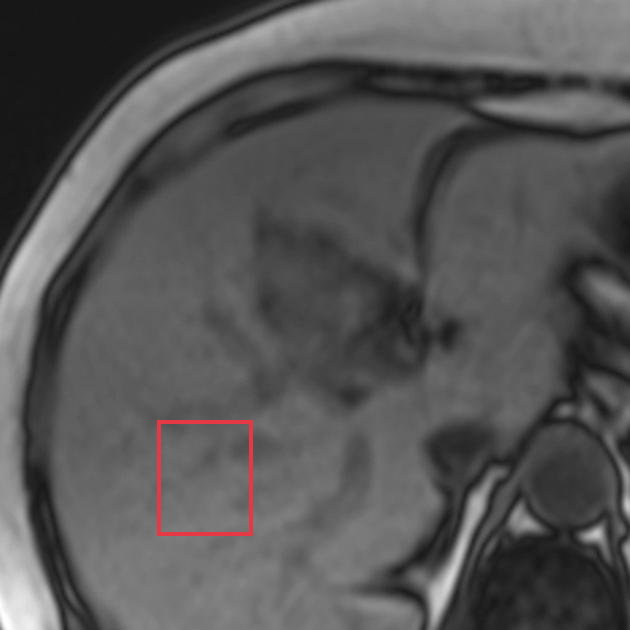

**Re-ground Lingshu caption：** The liver is enlarged and demonstrates diffuse decrease in signal intensity on this out of phase sequence compared to the spleen. This is consistent with diffuse hepatic steatosis. The boxed area appears to correspond to the right lobe of the liver. No focal lesions are identified.
**Re-ground caption 中文翻译：** 肝脏增大，反相位序列上信号较脾脏弥漫性降低，符合弥漫性肝脂肪变。框内似对应肝右叶。未发现局灶性病灶。

#### location_00016: PARTIAL SUPPORT

<table>
<tr><th>Anchor original bbox</th><th>Cross-image grounded target bbox</th><th>Existing target bbox: study_002_mri_image_002_axial_t1_c_f01</th></tr>
<tr><td></td><td></td><td></td></tr>
</table>

- **Target：** `study_002_mri_image_002_axial_t1_c`; MRI; Axial T1 C+
- **Relation：** `bbox_to_image` / `partial_support`
- **Returned target bbox：** `[270, 668, 400, 807]`
- **Maximum IoU：** 0.000; threshold=0.5
- **Strong relation IDs：** `[]`

**IoU matching：**

| Existing target bbox | IoU | Strong match | Lingshu caption | 中文翻译 |
|---|---:|---|---|---|
| `study_002_mri_image_002_axial_t1_c_f01`; `[310, 280, 570, 580]` | 0.000 | no | The liver is enlarged. The hepatic parenchyma demonstrates diffuse nodularity. There is no focal lesion identified. The portal vein is prominent. | 肝脏增大，肝实质呈弥漫性结节状。未发现局灶性病灶。门静脉增粗。 |

**B 图单红框（Lingshu 实际输入）：**

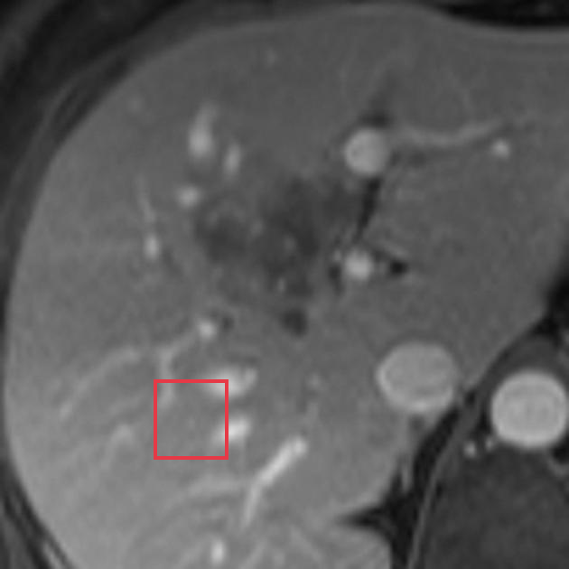

**Re-ground Lingshu caption：** The liver is enlarged and demonstrates multiple focal lesions which demonstrate peripheral enhancement and central non-enhancement. The largest lesion is located in segment 6 and measures approximately 2.5 cm. There is no evidence of biliary ductal dilatation. No intrahepatic biliary duct stones are identified. The portal vein is patent. The spleen is unremarkable.
**Re-ground caption 中文翻译：** 肝脏增大并有多发局灶性病灶，呈周边强化及中央不强化。最大病灶位于第 6 段，约 2.5 cm。未见胆管扩张或肝内胆管结石。门静脉通畅，脾脏未见异常。

#### location_00017: NOT SUPPORT

<table>
<tr><th>Anchor original bbox</th><th>Target original image; model returned null</th><th>Existing target bbox: study_002_mri_image_003_axial_t2_f01</th></tr>
<tr><td></td><td></td><td></td></tr>
</table>

- **Target：** `study_002_mri_image_003_axial_t2`; MRI; Axial T2
- **Relation：** `bbox_to_image` / `not_support`
- **Returned target bbox：** `unknown`
- **Maximum IoU：** n/a; threshold=0.5
- **Strong relation IDs：** `[]`

**IoU matching：**

| Existing target bbox | IoU | Strong match | Lingshu caption | 中文翻译 |
|---|---:|---|---|---|
| `study_002_mri_image_003_axial_t2_f01`; `[474, 348, 624, 488]` | n/a | n/a | The liver is enlarged and demonstrates diffuse abnormal signal intensity, which is T2 hyperintense and T1 hypointense. The intrahepatic biliary ducts are dilated. There is also a small amount of fluid in the subcapsular region of the right lobe of the liver. | 肝脏增大并呈弥漫性异常信号，表现为 T2 高信号、T1 低信号。肝内胆管扩张，肝右叶包膜下另见少量液体。 |

#### location_00018: NOT SUPPORT

<table>
<tr><th>Anchor original bbox</th><th>Target original image; model returned null</th><th>Existing target bbox: study_002_mri_image_004_axial_t2_fat_sat_f01</th></tr>
<tr><td></td><td></td><td></td></tr>
</table>

- **Target：** `study_002_mri_image_004_axial_t2_fat_sat`; MRI; Axial T2 fat sat
- **Relation：** `bbox_to_image` / `not_support`
- **Returned target bbox：** `unknown`
- **Maximum IoU：** n/a; threshold=0.5
- **Strong relation IDs：** `[]`

**IoU matching：**

| Existing target bbox | IoU | Strong match | Lingshu caption | 中文翻译 |
|---|---:|---|---|---|
| `study_002_mri_image_004_axial_t2_fat_sat_f01`; `[333, 381, 607, 550]` | n/a | n/a | The image shows a dilated common bile duct with a filling defect. The common bile duct appears to be enlarged and contains a distinct, well-defined structure within it, which could represent a stone or other obstructive lesion. | 图像显示胆总管扩张并有充盈缺损。增宽的胆总管内可见边界清楚的结构，可能为结石或其他梗阻性病变。 |

### Anchor 4: `study_001_ultrasound_image_000_missing_f01`

**Anchor Lingshu caption：** The liver parenchyma appears diffusely hyperechoic. The portal vein is dilated measuring 15 mm. There is no evidence of ascites.
**Anchor caption 中文翻译：** 肝实质呈弥漫性高回声。门静脉扩张，直径约 15 mm。未见腹水。

#### location_00019: NOT SUPPORT

<table>
<tr><th>Anchor original bbox</th><th>Target original image; model returned null</th><th>Existing target bbox: study_002_mri_image_000_axial_t1_in_phase_f01</th><th>Existing target bbox: study_002_mri_image_000_axial_t1_in_phase_f02</th><th>Existing target bbox: study_002_mri_image_000_axial_t1_in_phase_f03</th></tr>
<tr><td></td><td></td><td></td><td></td><td></td></tr>
</table>

- **Target：** `study_002_mri_image_000_axial_t1_in_phase`; MRI; Axial T1 in-phase
- **Relation：** `bbox_to_image` / `not_support`
- **Returned target bbox：** `unknown`
- **Maximum IoU：** n/a; threshold=0.5
- **Strong relation IDs：** `[]`

**IoU matching：**

| Existing target bbox | IoU | Strong match | Lingshu caption | 中文翻译 |
|---|---:|---|---|---|
| `study_002_mri_image_000_axial_t1_in_phase_f01`; `[548, 452, 673, 564]` | n/a | n/a | The liver is enlarged and demonstrates diffuse abnormal signal intensity, which is most consistent with fatty infiltration. The spleen is also enlarged. There is a 1.5 cm focal area of low signal intensity in the left lobe of the liver, which may represent a simple cyst. | 肝脏增大并呈弥漫性异常信号，最符合脂肪浸润。脾脏也增大。肝左叶可见一个 1.5 cm 的局灶性低信号区，可能为单纯性囊肿。 |
| `study_002_mri_image_000_axial_t1_in_phase_f02`; `[637, 623, 762, 731]` | n/a | n/a | The liver is enlarged and demonstrates diffuse abnormal signal intensity, which is most consistent with fatty infiltration. The spleen is also enlarged. There is a small amount of fluid in the right subphrenic space. No focal hepatic lesions are identified. | 肝脏增大并呈弥漫性异常信号，最符合脂肪浸润。脾脏也增大。右侧膈下间隙可见少量液体。未发现局灶性肝病灶。 |
| `study_002_mri_image_000_axial_t1_in_phase_f03`; `[810, 642, 966, 812]` | n/a | n/a | The liver is enlarged and demonstrates diffuse abnormal signal intensity, which is most consistent with fatty infiltration. The spleen is also enlarged. There is a 2.5 cm lesion in the left lobe of the liver, which is hypointense on this T1 weighted image. | 肝脏增大并呈弥漫性异常信号，最符合脂肪浸润。脾脏也增大。肝左叶可见一个 2.5 cm 病灶，在该 T1 加权图像上呈低信号。 |

#### location_00020: NOT SUPPORT

<table>
<tr><th>Anchor original bbox</th><th>Target original image; model returned null</th><th>Existing target bbox: study_002_mri_image_001_axial_t1_out_of_phase_f01</th></tr>
<tr><td></td><td></td><td></td></tr>
</table>

- **Target：** `study_002_mri_image_001_axial_t1_out_of_phase`; MRI; Axial T1 out-of-phase
- **Relation：** `bbox_to_image` / `not_support`
- **Returned target bbox：** `unknown`
- **Maximum IoU：** n/a; threshold=0.5
- **Strong relation IDs：** `[]`

**IoU matching：**

| Existing target bbox | IoU | Strong match | Lingshu caption | 中文翻译 |
|---|---:|---|---|---|
| `study_002_mri_image_001_axial_t1_out_of_phase_f01`; `[370, 286, 740, 686]` | n/a | n/a | The liver is enlarged and demonstrates diffuse decrease in signal intensity on this out of phase sequence consistent with hepatic steatosis. The boxed area demonstrates a focal area of decreased signal intensity which could represent a focal fatty change or a focal lesion such as a hemangioma. | 肝脏增大，反相位序列上信号弥漫性下降，符合肝脂肪变。框内可见局灶性信号降低，可能代表局灶性脂肪改变或血管瘤等局灶性病变。 |

#### location_00021: NOT SUPPORT

<table>
<tr><th>Anchor original bbox</th><th>Target original image; model returned null</th><th>Existing target bbox: study_002_mri_image_002_axial_t1_c_f01</th></tr>
<tr><td></td><td></td><td></td></tr>
</table>

- **Target：** `study_002_mri_image_002_axial_t1_c`; MRI; Axial T1 C+
- **Relation：** `bbox_to_image` / `not_support`
- **Returned target bbox：** `unknown`
- **Maximum IoU：** n/a; threshold=0.5
- **Strong relation IDs：** `[]`

**IoU matching：**

| Existing target bbox | IoU | Strong match | Lingshu caption | 中文翻译 |
|---|---:|---|---|---|
| `study_002_mri_image_002_axial_t1_c_f01`; `[310, 280, 570, 580]` | n/a | n/a | The liver is enlarged. The hepatic parenchyma demonstrates diffuse nodularity. There is no focal lesion identified. The portal vein is prominent. | 肝脏增大，肝实质呈弥漫性结节状。未发现局灶性病灶。门静脉增粗。 |

#### location_00022: NOT SUPPORT

<table>
<tr><th>Anchor original bbox</th><th>Target original image; model returned null</th><th>Existing target bbox: study_002_mri_image_003_axial_t2_f01</th></tr>
<tr><td></td><td></td><td></td></tr>
</table>

- **Target：** `study_002_mri_image_003_axial_t2`; MRI; Axial T2
- **Relation：** `bbox_to_image` / `not_support`
- **Returned target bbox：** `unknown`
- **Maximum IoU：** n/a; threshold=0.5
- **Strong relation IDs：** `[]`

**IoU matching：**

| Existing target bbox | IoU | Strong match | Lingshu caption | 中文翻译 |
|---|---:|---|---|---|
| `study_002_mri_image_003_axial_t2_f01`; `[474, 348, 624, 488]` | n/a | n/a | The liver is enlarged and demonstrates diffuse abnormal signal intensity, which is T2 hyperintense and T1 hypointense. The intrahepatic biliary ducts are dilated. There is also a small amount of fluid in the subcapsular region of the right lobe of the liver. | 肝脏增大并呈弥漫性异常信号，表现为 T2 高信号、T1 低信号。肝内胆管扩张，肝右叶包膜下另见少量液体。 |

#### location_00023: NOT SUPPORT

<table>
<tr><th>Anchor original bbox</th><th>Target original image; model returned null</th><th>Existing target bbox: study_002_mri_image_004_axial_t2_fat_sat_f01</th></tr>
<tr><td></td><td></td><td></td></tr>
</table>

- **Target：** `study_002_mri_image_004_axial_t2_fat_sat`; MRI; Axial T2 fat sat
- **Relation：** `bbox_to_image` / `not_support`
- **Returned target bbox：** `unknown`
- **Maximum IoU：** n/a; threshold=0.5
- **Strong relation IDs：** `[]`

**IoU matching：**

| Existing target bbox | IoU | Strong match | Lingshu caption | 中文翻译 |
|---|---:|---|---|---|
| `study_002_mri_image_004_axial_t2_fat_sat_f01`; `[333, 381, 607, 550]` | n/a | n/a | The image shows a dilated common bile duct with a filling defect. The common bile duct appears to be enlarged and contains a distinct, well-defined structure within it, which could represent a stone or other obstructive lesion. | 图像显示胆总管扩张并有充盈缺损。增宽的胆总管内可见边界清楚的结构，可能为结石或其他梗阻性病变。 |

### Anchor 5: `study_001_ultrasound_image_000_missing_f02`

**Anchor Lingshu caption：** The liver parenchyma is diffusely hyperechoic. The portal vein is dilated measuring 15 mm. There is a small amount of ascites.
**Anchor caption 中文翻译：** 肝实质呈弥漫性高回声。门静脉扩张，直径约 15 mm。可见少量腹水。

#### location_00024: NOT SUPPORT

<table>
<tr><th>Anchor original bbox</th><th>Target original image; model returned null</th><th>Existing target bbox: study_002_mri_image_000_axial_t1_in_phase_f01</th><th>Existing target bbox: study_002_mri_image_000_axial_t1_in_phase_f02</th><th>Existing target bbox: study_002_mri_image_000_axial_t1_in_phase_f03</th></tr>
<tr><td></td><td></td><td></td><td></td><td></td></tr>
</table>

- **Target：** `study_002_mri_image_000_axial_t1_in_phase`; MRI; Axial T1 in-phase
- **Relation：** `bbox_to_image` / `not_support`
- **Returned target bbox：** `unknown`
- **Maximum IoU：** n/a; threshold=0.5
- **Strong relation IDs：** `[]`

**IoU matching：**

| Existing target bbox | IoU | Strong match | Lingshu caption | 中文翻译 |
|---|---:|---|---|---|
| `study_002_mri_image_000_axial_t1_in_phase_f01`; `[548, 452, 673, 564]` | n/a | n/a | The liver is enlarged and demonstrates diffuse abnormal signal intensity, which is most consistent with fatty infiltration. The spleen is also enlarged. There is a 1.5 cm focal area of low signal intensity in the left lobe of the liver, which may represent a simple cyst. | 肝脏增大并呈弥漫性异常信号，最符合脂肪浸润。脾脏也增大。肝左叶可见一个 1.5 cm 的局灶性低信号区，可能为单纯性囊肿。 |
| `study_002_mri_image_000_axial_t1_in_phase_f02`; `[637, 623, 762, 731]` | n/a | n/a | The liver is enlarged and demonstrates diffuse abnormal signal intensity, which is most consistent with fatty infiltration. The spleen is also enlarged. There is a small amount of fluid in the right subphrenic space. No focal hepatic lesions are identified. | 肝脏增大并呈弥漫性异常信号，最符合脂肪浸润。脾脏也增大。右侧膈下间隙可见少量液体。未发现局灶性肝病灶。 |
| `study_002_mri_image_000_axial_t1_in_phase_f03`; `[810, 642, 966, 812]` | n/a | n/a | The liver is enlarged and demonstrates diffuse abnormal signal intensity, which is most consistent with fatty infiltration. The spleen is also enlarged. There is a 2.5 cm lesion in the left lobe of the liver, which is hypointense on this T1 weighted image. | 肝脏增大并呈弥漫性异常信号，最符合脂肪浸润。脾脏也增大。肝左叶可见一个 2.5 cm 病灶，在该 T1 加权图像上呈低信号。 |

#### location_00025: NOT SUPPORT

<table>
<tr><th>Anchor original bbox</th><th>Target original image; model returned null</th><th>Existing target bbox: study_002_mri_image_001_axial_t1_out_of_phase_f01</th></tr>
<tr><td></td><td></td><td></td></tr>
</table>

- **Target：** `study_002_mri_image_001_axial_t1_out_of_phase`; MRI; Axial T1 out-of-phase
- **Relation：** `bbox_to_image` / `not_support`
- **Returned target bbox：** `unknown`
- **Maximum IoU：** n/a; threshold=0.5
- **Strong relation IDs：** `[]`

**IoU matching：**

| Existing target bbox | IoU | Strong match | Lingshu caption | 中文翻译 |
|---|---:|---|---|---|
| `study_002_mri_image_001_axial_t1_out_of_phase_f01`; `[370, 286, 740, 686]` | n/a | n/a | The liver is enlarged and demonstrates diffuse decrease in signal intensity on this out of phase sequence consistent with hepatic steatosis. The boxed area demonstrates a focal area of decreased signal intensity which could represent a focal fatty change or a focal lesion such as a hemangioma. | 肝脏增大，反相位序列上信号弥漫性下降，符合肝脂肪变。框内可见局灶性信号降低，可能代表局灶性脂肪改变或血管瘤等局灶性病变。 |

#### location_00026: NOT SUPPORT

<table>
<tr><th>Anchor original bbox</th><th>Target original image; model returned null</th><th>Existing target bbox: study_002_mri_image_002_axial_t1_c_f01</th></tr>
<tr><td></td><td></td><td></td></tr>
</table>

- **Target：** `study_002_mri_image_002_axial_t1_c`; MRI; Axial T1 C+
- **Relation：** `bbox_to_image` / `not_support`
- **Returned target bbox：** `unknown`
- **Maximum IoU：** n/a; threshold=0.5
- **Strong relation IDs：** `[]`

**IoU matching：**

| Existing target bbox | IoU | Strong match | Lingshu caption | 中文翻译 |
|---|---:|---|---|---|
| `study_002_mri_image_002_axial_t1_c_f01`; `[310, 280, 570, 580]` | n/a | n/a | The liver is enlarged. The hepatic parenchyma demonstrates diffuse nodularity. There is no focal lesion identified. The portal vein is prominent. | 肝脏增大，肝实质呈弥漫性结节状。未发现局灶性病灶。门静脉增粗。 |

#### location_00027: NOT SUPPORT

<table>
<tr><th>Anchor original bbox</th><th>Target original image; model returned null</th><th>Existing target bbox: study_002_mri_image_003_axial_t2_f01</th></tr>
<tr><td></td><td></td><td></td></tr>
</table>

- **Target：** `study_002_mri_image_003_axial_t2`; MRI; Axial T2
- **Relation：** `bbox_to_image` / `not_support`
- **Returned target bbox：** `unknown`
- **Maximum IoU：** n/a; threshold=0.5
- **Strong relation IDs：** `[]`

**IoU matching：**

| Existing target bbox | IoU | Strong match | Lingshu caption | 中文翻译 |
|---|---:|---|---|---|
| `study_002_mri_image_003_axial_t2_f01`; `[474, 348, 624, 488]` | n/a | n/a | The liver is enlarged and demonstrates diffuse abnormal signal intensity, which is T2 hyperintense and T1 hypointense. The intrahepatic biliary ducts are dilated. There is also a small amount of fluid in the subcapsular region of the right lobe of the liver. | 肝脏增大并呈弥漫性异常信号，表现为 T2 高信号、T1 低信号。肝内胆管扩张，肝右叶包膜下另见少量液体。 |

#### location_00028: NOT SUPPORT

<table>
<tr><th>Anchor original bbox</th><th>Target original image; model returned null</th><th>Existing target bbox: study_002_mri_image_004_axial_t2_fat_sat_f01</th></tr>
<tr><td></td><td></td><td></td></tr>
</table>

- **Target：** `study_002_mri_image_004_axial_t2_fat_sat`; MRI; Axial T2 fat sat
- **Relation：** `bbox_to_image` / `not_support`
- **Returned target bbox：** `unknown`
- **Maximum IoU：** n/a; threshold=0.5
- **Strong relation IDs：** `[]`

**IoU matching：**

| Existing target bbox | IoU | Strong match | Lingshu caption | 中文翻译 |
|---|---:|---|---|---|
| `study_002_mri_image_004_axial_t2_fat_sat_f01`; `[333, 381, 607, 550]` | n/a | n/a | The image shows a dilated common bile duct with a filling defect. The common bile duct appears to be enlarged and contains a distinct, well-defined structure within it, which could represent a stone or other obstructive lesion. | 图像显示胆总管扩张并有充盈缺损。增宽的胆总管内可见边界清楚的结构，可能为结石或其他梗阻性病变。 |

### Anchor 6: `study_001_ultrasound_image_000_missing_f03`

**Anchor Lingshu caption：** The liver parenchyma is diffusely hyperechoic and there is increased echogenicity anterior to the diaphragm consistent with chronic liver disease. There is a small hypoechoic lesion in segment 4A measuring approximately 1.0 cm.
**Anchor caption 中文翻译：** 肝实质呈弥漫性高回声，膈肌前方回声增强，符合慢性肝病表现。肝 4A 段可见一个约 1.0 cm 的小低回声病灶。

#### location_00029: NOT SUPPORT

<table>
<tr><th>Anchor original bbox</th><th>Target original image; model returned null</th><th>Existing target bbox: study_002_mri_image_000_axial_t1_in_phase_f01</th><th>Existing target bbox: study_002_mri_image_000_axial_t1_in_phase_f02</th><th>Existing target bbox: study_002_mri_image_000_axial_t1_in_phase_f03</th></tr>
<tr><td></td><td></td><td></td><td></td><td></td></tr>
</table>

- **Target：** `study_002_mri_image_000_axial_t1_in_phase`; MRI; Axial T1 in-phase
- **Relation：** `bbox_to_image` / `not_support`
- **Returned target bbox：** `unknown`
- **Maximum IoU：** n/a; threshold=0.5
- **Strong relation IDs：** `[]`

**IoU matching：**

| Existing target bbox | IoU | Strong match | Lingshu caption | 中文翻译 |
|---|---:|---|---|---|
| `study_002_mri_image_000_axial_t1_in_phase_f01`; `[548, 452, 673, 564]` | n/a | n/a | The liver is enlarged and demonstrates diffuse abnormal signal intensity, which is most consistent with fatty infiltration. The spleen is also enlarged. There is a 1.5 cm focal area of low signal intensity in the left lobe of the liver, which may represent a simple cyst. | 肝脏增大并呈弥漫性异常信号，最符合脂肪浸润。脾脏也增大。肝左叶可见一个 1.5 cm 的局灶性低信号区，可能为单纯性囊肿。 |
| `study_002_mri_image_000_axial_t1_in_phase_f02`; `[637, 623, 762, 731]` | n/a | n/a | The liver is enlarged and demonstrates diffuse abnormal signal intensity, which is most consistent with fatty infiltration. The spleen is also enlarged. There is a small amount of fluid in the right subphrenic space. No focal hepatic lesions are identified. | 肝脏增大并呈弥漫性异常信号，最符合脂肪浸润。脾脏也增大。右侧膈下间隙可见少量液体。未发现局灶性肝病灶。 |
| `study_002_mri_image_000_axial_t1_in_phase_f03`; `[810, 642, 966, 812]` | n/a | n/a | The liver is enlarged and demonstrates diffuse abnormal signal intensity, which is most consistent with fatty infiltration. The spleen is also enlarged. There is a 2.5 cm lesion in the left lobe of the liver, which is hypointense on this T1 weighted image. | 肝脏增大并呈弥漫性异常信号，最符合脂肪浸润。脾脏也增大。肝左叶可见一个 2.5 cm 病灶，在该 T1 加权图像上呈低信号。 |

#### location_00030: NOT SUPPORT

<table>
<tr><th>Anchor original bbox</th><th>Target original image; model returned null</th><th>Existing target bbox: study_002_mri_image_001_axial_t1_out_of_phase_f01</th></tr>
<tr><td></td><td></td><td></td></tr>
</table>

- **Target：** `study_002_mri_image_001_axial_t1_out_of_phase`; MRI; Axial T1 out-of-phase
- **Relation：** `bbox_to_image` / `not_support`
- **Returned target bbox：** `unknown`
- **Maximum IoU：** n/a; threshold=0.5
- **Strong relation IDs：** `[]`

**IoU matching：**

| Existing target bbox | IoU | Strong match | Lingshu caption | 中文翻译 |
|---|---:|---|---|---|
| `study_002_mri_image_001_axial_t1_out_of_phase_f01`; `[370, 286, 740, 686]` | n/a | n/a | The liver is enlarged and demonstrates diffuse decrease in signal intensity on this out of phase sequence consistent with hepatic steatosis. The boxed area demonstrates a focal area of decreased signal intensity which could represent a focal fatty change or a focal lesion such as a hemangioma. | 肝脏增大，反相位序列上信号弥漫性下降，符合肝脂肪变。框内可见局灶性信号降低，可能代表局灶性脂肪改变或血管瘤等局灶性病变。 |

#### location_00031: NOT SUPPORT

<table>
<tr><th>Anchor original bbox</th><th>Target original image; model returned null</th><th>Existing target bbox: study_002_mri_image_002_axial_t1_c_f01</th></tr>
<tr><td></td><td></td><td></td></tr>
</table>

- **Target：** `study_002_mri_image_002_axial_t1_c`; MRI; Axial T1 C+
- **Relation：** `bbox_to_image` / `not_support`
- **Returned target bbox：** `unknown`
- **Maximum IoU：** n/a; threshold=0.5
- **Strong relation IDs：** `[]`

**IoU matching：**

| Existing target bbox | IoU | Strong match | Lingshu caption | 中文翻译 |
|---|---:|---|---|---|
| `study_002_mri_image_002_axial_t1_c_f01`; `[310, 280, 570, 580]` | n/a | n/a | The liver is enlarged. The hepatic parenchyma demonstrates diffuse nodularity. There is no focal lesion identified. The portal vein is prominent. | 肝脏增大，肝实质呈弥漫性结节状。未发现局灶性病灶。门静脉增粗。 |

#### location_00032: NOT SUPPORT

<table>
<tr><th>Anchor original bbox</th><th>Target original image; model returned null</th><th>Existing target bbox: study_002_mri_image_003_axial_t2_f01</th></tr>
<tr><td></td><td></td><td></td></tr>
</table>

- **Target：** `study_002_mri_image_003_axial_t2`; MRI; Axial T2
- **Relation：** `bbox_to_image` / `not_support`
- **Returned target bbox：** `unknown`
- **Maximum IoU：** n/a; threshold=0.5
- **Strong relation IDs：** `[]`

**IoU matching：**

| Existing target bbox | IoU | Strong match | Lingshu caption | 中文翻译 |
|---|---:|---|---|---|
| `study_002_mri_image_003_axial_t2_f01`; `[474, 348, 624, 488]` | n/a | n/a | The liver is enlarged and demonstrates diffuse abnormal signal intensity, which is T2 hyperintense and T1 hypointense. The intrahepatic biliary ducts are dilated. There is also a small amount of fluid in the subcapsular region of the right lobe of the liver. | 肝脏增大并呈弥漫性异常信号，表现为 T2 高信号、T1 低信号。肝内胆管扩张，肝右叶包膜下另见少量液体。 |

#### location_00033: NOT SUPPORT

<table>
<tr><th>Anchor original bbox</th><th>Target original image; model returned null</th><th>Existing target bbox: study_002_mri_image_004_axial_t2_fat_sat_f01</th></tr>
<tr><td></td><td></td><td></td></tr>
</table>

- **Target：** `study_002_mri_image_004_axial_t2_fat_sat`; MRI; Axial T2 fat sat
- **Relation：** `bbox_to_image` / `not_support`
- **Returned target bbox：** `unknown`
- **Maximum IoU：** n/a; threshold=0.5
- **Strong relation IDs：** `[]`

**IoU matching：**

| Existing target bbox | IoU | Strong match | Lingshu caption | 中文翻译 |
|---|---:|---|---|---|
| `study_002_mri_image_004_axial_t2_fat_sat_f01`; `[333, 381, 607, 550]` | n/a | n/a | The image shows a dilated common bile duct with a filling defect. The common bile duct appears to be enlarged and contains a distinct, well-defined structure within it, which could represent a stone or other obstructive lesion. | 图像显示胆总管扩张并有充盈缺损。增宽的胆总管内可见边界清楚的结构，可能为结石或其他梗阻性病变。 |

### Anchor 7: `study_002_mri_image_000_axial_t1_in_phase_f01`

**Anchor Lingshu caption：** The liver is enlarged and demonstrates diffuse abnormal signal intensity, which is most consistent with fatty infiltration. The spleen is also enlarged. There is a 1.5 cm focal area of low signal intensity in the left lobe of the liver, which may represent a simple cyst.
**Anchor caption 中文翻译：** 肝脏增大并呈弥漫性异常信号，最符合脂肪浸润。脾脏也增大。肝左叶可见一个 1.5 cm 的局灶性低信号区，可能为单纯性囊肿。

#### location_00034: PARTIAL SUPPORT

<table>
<tr><th>Anchor original bbox</th><th>Cross-image grounded target bbox</th><th>Existing target bbox: study_002_mri_image_001_axial_t1_out_of_phase_f01</th></tr>
<tr><td></td><td></td><td></td></tr>
</table>

- **Target：** `study_002_mri_image_001_axial_t1_out_of_phase`; MRI; Axial T1 out-of-phase
- **Relation：** `bbox_to_image` / `partial_support`
- **Returned target bbox：** `[500, 375, 600, 475]`
- **Maximum IoU：** 0.068; threshold=0.5
- **Strong relation IDs：** `[]`

**IoU matching：**

| Existing target bbox | IoU | Strong match | Lingshu caption | 中文翻译 |
|---|---:|---|---|---|
| `study_002_mri_image_001_axial_t1_out_of_phase_f01`; `[370, 286, 740, 686]` | 0.068 | no | The liver is enlarged and demonstrates diffuse decrease in signal intensity on this out of phase sequence consistent with hepatic steatosis. The boxed area demonstrates a focal area of decreased signal intensity which could represent a focal fatty change or a focal lesion such as a hemangioma. | 肝脏增大，反相位序列上信号弥漫性下降，符合肝脂肪变。框内可见局灶性信号降低，可能代表局灶性脂肪改变或血管瘤等局灶性病变。 |

**B 图单红框（Lingshu 实际输入）：**

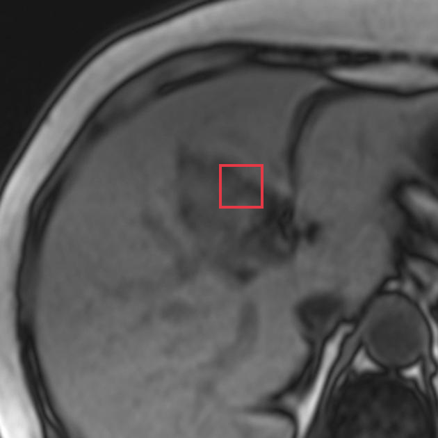

**Re-ground Lingshu caption：** The liver is enlarged and demonstrates diffuse abnormal signal intensity which is low on T1 weighted images and high on T2 weighted images. There is no evidence of intrahepatic biliary ductal dilatation. The spleen is also enlarged.
**Re-ground caption 中文翻译：** 肝脏增大并呈弥漫性异常信号，T1 加权图像上为低信号，T2 加权图像上为高信号。未见肝内胆管扩张。脾脏也增大。

#### location_00035: PARTIAL SUPPORT

<table>
<tr><th>Anchor original bbox</th><th>Cross-image grounded target bbox</th><th>Existing target bbox: study_002_mri_image_002_axial_t1_c_f01</th></tr>
<tr><td></td><td></td><td></td></tr>
</table>

- **Target：** `study_002_mri_image_002_axial_t1_c`; MRI; Axial T1 C+
- **Relation：** `bbox_to_image` / `partial_support`
- **Returned target bbox：** `[480, 300, 620, 460]`
- **Maximum IoU：** 0.167; threshold=0.5
- **Strong relation IDs：** `[]`

**IoU matching：**

| Existing target bbox | IoU | Strong match | Lingshu caption | 中文翻译 |
|---|---:|---|---|---|
| `study_002_mri_image_002_axial_t1_c_f01`; `[310, 280, 570, 580]` | 0.167 | no | The liver is enlarged. The hepatic parenchyma demonstrates diffuse nodularity. There is no focal lesion identified. The portal vein is prominent. | 肝脏增大，肝实质呈弥漫性结节状。未发现局灶性病灶。门静脉增粗。 |

**B 图单红框（Lingshu 实际输入）：**

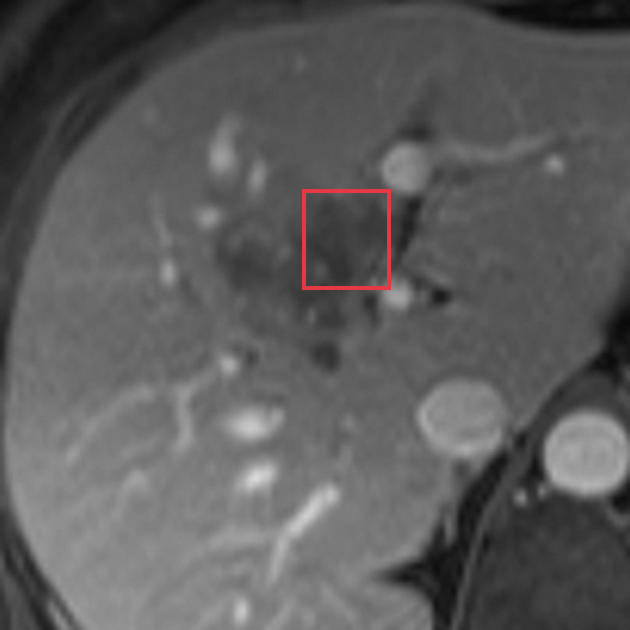

**Re-ground Lingshu caption：** The liver is enlarged. The hepatic parenchyma demonstrates diffuse nodularity. There is a 2.5 cm focal area of decreased enhancement in segment 4A of the liver. No other focal lesions are identified. The portal vein is prominent. The spleen is unremarkable.
**Re-ground caption 中文翻译：** 肝脏增大，肝实质呈弥漫性结节状。肝 4A 段可见一个 2.5 cm 的局灶性强化减低区，未发现其他局灶性病灶。门静脉增粗，脾脏未见异常。

#### location_00036: STRONG SUPPORT

<table>
<tr><th>Anchor original bbox</th><th>Cross-image grounded target bbox</th><th>Existing target bbox: study_002_mri_image_003_axial_t2_f01</th></tr>
<tr><td></td><td></td><td></td></tr>
</table>

- **Target：** `study_002_mri_image_003_axial_t2`; MRI; Axial T2
- **Relation：** `bbox_to_bbox` / `strong_support`
- **Returned target bbox：** `[484, 381, 608, 505]`
- **Maximum IoU：** 0.574; threshold=0.5
- **Strong relation IDs：** `[&#x27;strong_location_00036_01&#x27;]`

**IoU matching：**

| Existing target bbox | IoU | Strong match | Lingshu caption | 中文翻译 |
|---|---:|---|---|---|
| `study_002_mri_image_003_axial_t2_f01`; `[474, 348, 624, 488]` | 0.574 | yes | The liver is enlarged and demonstrates diffuse abnormal signal intensity, which is T2 hyperintense and T1 hypointense. The intrahepatic biliary ducts are dilated. There is also a small amount of fluid in the subcapsular region of the right lobe of the liver. | 肝脏增大并呈弥漫性异常信号，表现为 T2 高信号、T1 低信号。肝内胆管扩张，肝右叶包膜下另见少量液体。 |

#### location_00037: NOT SUPPORT

<table>
<tr><th>Anchor original bbox</th><th>Target original image; model returned null</th><th>Existing target bbox: study_002_mri_image_004_axial_t2_fat_sat_f01</th></tr>
<tr><td></td><td></td><td></td></tr>
</table>

- **Target：** `study_002_mri_image_004_axial_t2_fat_sat`; MRI; Axial T2 fat sat
- **Relation：** `bbox_to_image` / `not_support`
- **Returned target bbox：** `unknown`
- **Maximum IoU：** n/a; threshold=0.5
- **Strong relation IDs：** `[]`

**IoU matching：**

| Existing target bbox | IoU | Strong match | Lingshu caption | 中文翻译 |
|---|---:|---|---|---|
| `study_002_mri_image_004_axial_t2_fat_sat_f01`; `[333, 381, 607, 550]` | n/a | n/a | The image shows a dilated common bile duct with a filling defect. The common bile duct appears to be enlarged and contains a distinct, well-defined structure within it, which could represent a stone or other obstructive lesion. | 图像显示胆总管扩张并有充盈缺损。增宽的胆总管内可见边界清楚的结构，可能为结石或其他梗阻性病变。 |

### Anchor 8: `study_002_mri_image_000_axial_t1_in_phase_f02`

**Anchor Lingshu caption：** The liver is enlarged and demonstrates diffuse abnormal signal intensity, which is most consistent with fatty infiltration. The spleen is also enlarged. There is a small amount of fluid in the right subphrenic space. No focal hepatic lesions are identified.
**Anchor caption 中文翻译：** 肝脏增大并呈弥漫性异常信号，最符合脂肪浸润。脾脏也增大。右侧膈下间隙可见少量液体。未发现局灶性肝病灶。

#### location_00038: PARTIAL SUPPORT

<table>
<tr><th>Anchor original bbox</th><th>Cross-image grounded target bbox</th><th>Existing target bbox: study_002_mri_image_001_axial_t1_out_of_phase_f01</th></tr>
<tr><td></td><td></td><td></td></tr>
</table>

- **Target：** `study_002_mri_image_001_axial_t1_out_of_phase`; MRI; Axial T1 out-of-phase
- **Relation：** `bbox_to_image` / `partial_support`
- **Returned target bbox：** `[570, 618, 672, 716]`
- **Maximum IoU：** 0.046; threshold=0.5
- **Strong relation IDs：** `[]`

**IoU matching：**

| Existing target bbox | IoU | Strong match | Lingshu caption | 中文翻译 |
|---|---:|---|---|---|
| `study_002_mri_image_001_axial_t1_out_of_phase_f01`; `[370, 286, 740, 686]` | 0.046 | no | The liver is enlarged and demonstrates diffuse decrease in signal intensity on this out of phase sequence consistent with hepatic steatosis. The boxed area demonstrates a focal area of decreased signal intensity which could represent a focal fatty change or a focal lesion such as a hemangioma. | 肝脏增大，反相位序列上信号弥漫性下降，符合肝脂肪变。框内可见局灶性信号降低，可能代表局灶性脂肪改变或血管瘤等局灶性病变。 |

**B 图单红框（Lingshu 实际输入）：**

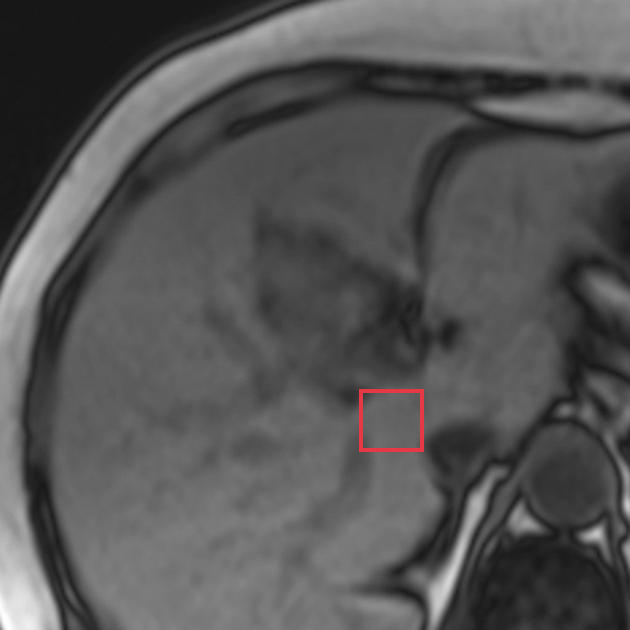

**Re-ground Lingshu caption：** The liver is enlarged and demonstrates diffuse low signal intensity on this out of phase sequence. The spleen is also enlarged. There is no evidence of focal hepatic lesions.
**Re-ground caption 中文翻译：** 肝脏增大，反相位序列上呈弥漫性低信号。脾脏也增大。未见局灶性肝病灶。

#### location_00039: PARTIAL SUPPORT

<table>
<tr><th>Anchor original bbox</th><th>Cross-image grounded target bbox</th><th>Existing target bbox: study_002_mri_image_002_axial_t1_c_f01</th></tr>
<tr><td></td><td></td><td></td></tr>
</table>

- **Target：** `study_002_mri_image_002_axial_t1_c`; MRI; Axial T1 C+
- **Relation：** `bbox_to_image` / `partial_support`
- **Returned target bbox：** `[600, 600, 700, 700]`
- **Maximum IoU：** 0.000; threshold=0.5
- **Strong relation IDs：** `[]`

**IoU matching：**

| Existing target bbox | IoU | Strong match | Lingshu caption | 中文翻译 |
|---|---:|---|---|---|
| `study_002_mri_image_002_axial_t1_c_f01`; `[310, 280, 570, 580]` | 0.000 | no | The liver is enlarged. The hepatic parenchyma demonstrates diffuse nodularity. There is no focal lesion identified. The portal vein is prominent. | 肝脏增大，肝实质呈弥漫性结节状。未发现局灶性病灶。门静脉增粗。 |

**B 图单红框（Lingshu 实际输入）：**

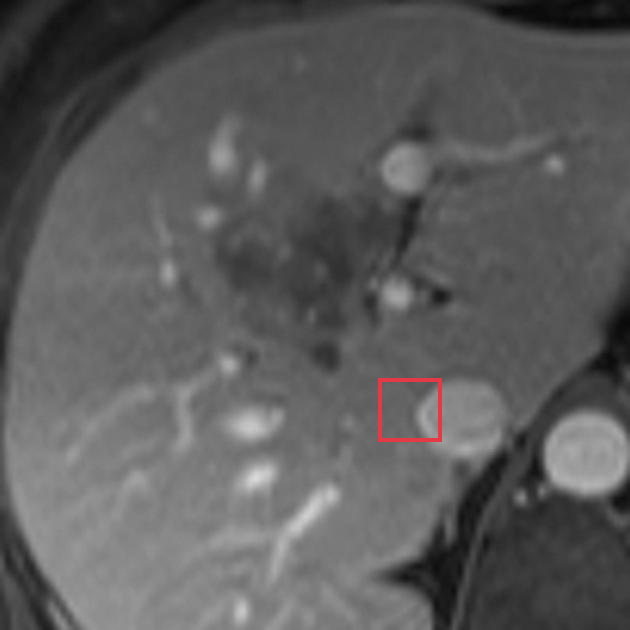

**Re-ground Lingshu caption：** The liver is enlarged. There are multiple lesions throughout the liver which demonstrate peripheral enhancement. The largest lesion is located in segment 6 and measures approximately 2.5 cm.
**Re-ground caption 中文翻译：** 肝脏增大，内见多发周边强化病灶。最大病灶位于第 6 段，大小约 2.5 cm。

#### location_00040: PARTIAL SUPPORT

<table>
<tr><th>Anchor original bbox</th><th>Cross-image grounded target bbox</th><th>Existing target bbox: study_002_mri_image_003_axial_t2_f01</th></tr>
<tr><td></td><td></td><td></td></tr>
</table>

- **Target：** `study_002_mri_image_003_axial_t2`; MRI; Axial T2
- **Relation：** `bbox_to_image` / `partial_support`
- **Returned target bbox：** `[610, 570, 778, 700]`
- **Maximum IoU：** 0.000; threshold=0.5
- **Strong relation IDs：** `[]`

**IoU matching：**

| Existing target bbox | IoU | Strong match | Lingshu caption | 中文翻译 |
|---|---:|---|---|---|
| `study_002_mri_image_003_axial_t2_f01`; `[474, 348, 624, 488]` | 0.000 | no | The liver is enlarged and demonstrates diffuse abnormal signal intensity, which is T2 hyperintense and T1 hypointense. The intrahepatic biliary ducts are dilated. There is also a small amount of fluid in the subcapsular region of the right lobe of the liver. | 肝脏增大并呈弥漫性异常信号，表现为 T2 高信号、T1 低信号。肝内胆管扩张，肝右叶包膜下另见少量液体。 |

**B 图单红框（Lingshu 实际输入）：**

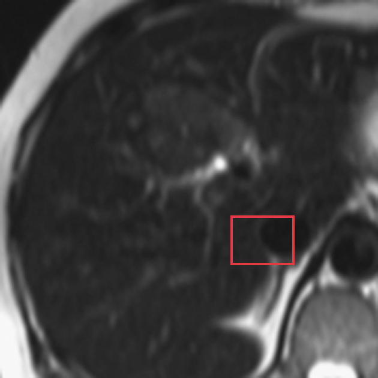

**Re-ground Lingshu caption：** The liver is enlarged and demonstrates diffuse abnormal signal intensity, which is T2 hyperintense and T1 hypointense. The spleen also appears to be enlarged.
**Re-ground caption 中文翻译：** 肝脏增大并呈弥漫性异常信号，表现为 T2 高信号、T1 低信号。脾脏也似增大。

#### location_00041: NOT SUPPORT

<table>
<tr><th>Anchor original bbox</th><th>Target original image; model returned null</th><th>Existing target bbox: study_002_mri_image_004_axial_t2_fat_sat_f01</th></tr>
<tr><td></td><td></td><td></td></tr>
</table>

- **Target：** `study_002_mri_image_004_axial_t2_fat_sat`; MRI; Axial T2 fat sat
- **Relation：** `bbox_to_image` / `not_support`
- **Returned target bbox：** `unknown`
- **Maximum IoU：** n/a; threshold=0.5
- **Strong relation IDs：** `[]`

**IoU matching：**

| Existing target bbox | IoU | Strong match | Lingshu caption | 中文翻译 |
|---|---:|---|---|---|
| `study_002_mri_image_004_axial_t2_fat_sat_f01`; `[333, 381, 607, 550]` | n/a | n/a | The image shows a dilated common bile duct with a filling defect. The common bile duct appears to be enlarged and contains a distinct, well-defined structure within it, which could represent a stone or other obstructive lesion. | 图像显示胆总管扩张并有充盈缺损。增宽的胆总管内可见边界清楚的结构，可能为结石或其他梗阻性病变。 |

### Anchor 9: `study_002_mri_image_000_axial_t1_in_phase_f03`

**Anchor Lingshu caption：** The liver is enlarged and demonstrates diffuse abnormal signal intensity, which is most consistent with fatty infiltration. The spleen is also enlarged. There is a 2.5 cm lesion in the left lobe of the liver, which is hypointense on this T1 weighted image.
**Anchor caption 中文翻译：** 肝脏增大并呈弥漫性异常信号，最符合脂肪浸润。脾脏也增大。肝左叶可见一个 2.5 cm 病灶，在该 T1 加权图像上呈低信号。

#### location_00042: PARTIAL SUPPORT

<table>
<tr><th>Anchor original bbox</th><th>Cross-image grounded target bbox</th><th>Existing target bbox: study_002_mri_image_001_axial_t1_out_of_phase_f01</th></tr>
<tr><td></td><td></td><td></td></tr>
</table>

- **Target：** `study_002_mri_image_001_axial_t1_out_of_phase`; MRI; Axial T1 out-of-phase
- **Relation：** `bbox_to_image` / `partial_support`
- **Returned target bbox：** `[768, 682, 918, 886]`
- **Maximum IoU：** 0.000; threshold=0.5
- **Strong relation IDs：** `[]`

**IoU matching：**

| Existing target bbox | IoU | Strong match | Lingshu caption | 中文翻译 |
|---|---:|---|---|---|
| `study_002_mri_image_001_axial_t1_out_of_phase_f01`; `[370, 286, 740, 686]` | 0.000 | no | The liver is enlarged and demonstrates diffuse decrease in signal intensity on this out of phase sequence consistent with hepatic steatosis. The boxed area demonstrates a focal area of decreased signal intensity which could represent a focal fatty change or a focal lesion such as a hemangioma. | 肝脏增大，反相位序列上信号弥漫性下降，符合肝脂肪变。框内可见局灶性信号降低，可能代表局灶性脂肪改变或血管瘤等局灶性病变。 |

**B 图单红框（Lingshu 实际输入）：**

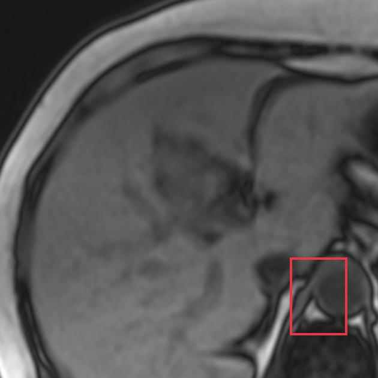

**Re-ground Lingshu caption：** The liver is enlarged and demonstrates diffuse low signal intensity on this out of phase sequence. The spleen also appears enlarged. There is a small amount of fluid seen in the right paracolic gutter.
**Re-ground caption 中文翻译：** 肝脏增大，反相位序列上呈弥漫性低信号。脾脏也似增大。右侧结肠旁沟可见少量液体。

#### location_00043: NOT SUPPORT

<table>
<tr><th>Anchor original bbox</th><th>Target original image; model returned null</th><th>Existing target bbox: study_002_mri_image_002_axial_t1_c_f01</th></tr>
<tr><td></td><td></td><td></td></tr>
</table>

- **Target：** `study_002_mri_image_002_axial_t1_c`; MRI; Axial T1 C+
- **Relation：** `bbox_to_image` / `not_support`
- **Returned target bbox：** `unknown`
- **Maximum IoU：** n/a; threshold=0.5
- **Strong relation IDs：** `[]`

**IoU matching：**

| Existing target bbox | IoU | Strong match | Lingshu caption | 中文翻译 |
|---|---:|---|---|---|
| `study_002_mri_image_002_axial_t1_c_f01`; `[310, 280, 570, 580]` | n/a | n/a | The liver is enlarged. The hepatic parenchyma demonstrates diffuse nodularity. There is no focal lesion identified. The portal vein is prominent. | 肝脏增大，肝实质呈弥漫性结节状。未发现局灶性病灶。门静脉增粗。 |

#### location_00044: NOT SUPPORT

<table>
<tr><th>Anchor original bbox</th><th>Target original image; model returned null</th><th>Existing target bbox: study_002_mri_image_003_axial_t2_f01</th></tr>
<tr><td></td><td></td><td></td></tr>
</table>

- **Target：** `study_002_mri_image_003_axial_t2`; MRI; Axial T2
- **Relation：** `bbox_to_image` / `not_support`
- **Returned target bbox：** `unknown`
- **Maximum IoU：** n/a; threshold=0.5
- **Strong relation IDs：** `[]`

**IoU matching：**

| Existing target bbox | IoU | Strong match | Lingshu caption | 中文翻译 |
|---|---:|---|---|---|
| `study_002_mri_image_003_axial_t2_f01`; `[474, 348, 624, 488]` | n/a | n/a | The liver is enlarged and demonstrates diffuse abnormal signal intensity, which is T2 hyperintense and T1 hypointense. The intrahepatic biliary ducts are dilated. There is also a small amount of fluid in the subcapsular region of the right lobe of the liver. | 肝脏增大并呈弥漫性异常信号，表现为 T2 高信号、T1 低信号。肝内胆管扩张，肝右叶包膜下另见少量液体。 |

#### location_00045: NOT SUPPORT

<table>
<tr><th>Anchor original bbox</th><th>Target original image; model returned null</th><th>Existing target bbox: study_002_mri_image_004_axial_t2_fat_sat_f01</th></tr>
<tr><td></td><td></td><td></td></tr>
</table>

- **Target：** `study_002_mri_image_004_axial_t2_fat_sat`; MRI; Axial T2 fat sat
- **Relation：** `bbox_to_image` / `not_support`
- **Returned target bbox：** `unknown`
- **Maximum IoU：** n/a; threshold=0.5
- **Strong relation IDs：** `[]`

**IoU matching：**

| Existing target bbox | IoU | Strong match | Lingshu caption | 中文翻译 |
|---|---:|---|---|---|
| `study_002_mri_image_004_axial_t2_fat_sat_f01`; `[333, 381, 607, 550]` | n/a | n/a | The image shows a dilated common bile duct with a filling defect. The common bile duct appears to be enlarged and contains a distinct, well-defined structure within it, which could represent a stone or other obstructive lesion. | 图像显示胆总管扩张并有充盈缺损。增宽的胆总管内可见边界清楚的结构，可能为结石或其他梗阻性病变。 |

### Anchor 10: `study_002_mri_image_001_axial_t1_out_of_phase_f01`

**Anchor Lingshu caption：** The liver is enlarged and demonstrates diffuse decrease in signal intensity on this out of phase sequence consistent with hepatic steatosis. The boxed area demonstrates a focal area of decreased signal intensity which could represent a focal fatty change or a focal lesion such as a hemangioma.
**Anchor caption 中文翻译：** 肝脏增大，反相位序列上信号弥漫性下降，符合肝脂肪变。框内可见局灶性信号降低，可能代表局灶性脂肪改变或血管瘤等局灶性病变。

#### location_00046: STRONG SUPPORT

<table>
<tr><th>Anchor original bbox</th><th>Cross-image grounded target bbox</th><th>Existing target bbox: study_002_mri_image_002_axial_t1_c_f01</th></tr>
<tr><td></td><td></td><td></td></tr>
</table>

- **Target：** `study_002_mri_image_002_axial_t1_c`; MRI; Axial T1 C+
- **Relation：** `bbox_to_bbox` / `strong_support`
- **Returned target bbox：** `[320, 200, 680, 600]`
- **Maximum IoU：** 0.512; threshold=0.5
- **Strong relation IDs：** `[&#x27;strong_location_00046_01&#x27;]`

**IoU matching：**

| Existing target bbox | IoU | Strong match | Lingshu caption | 中文翻译 |
|---|---:|---|---|---|
| `study_002_mri_image_002_axial_t1_c_f01`; `[310, 280, 570, 580]` | 0.512 | yes | The liver is enlarged. The hepatic parenchyma demonstrates diffuse nodularity. There is no focal lesion identified. The portal vein is prominent. | 肝脏增大，肝实质呈弥漫性结节状。未发现局灶性病灶。门静脉增粗。 |

#### location_00047: PARTIAL SUPPORT

<table>
<tr><th>Anchor original bbox</th><th>Cross-image grounded target bbox</th><th>Existing target bbox: study_002_mri_image_003_axial_t2_f01</th></tr>
<tr><td></td><td></td><td></td></tr>
</table>

- **Target：** `study_002_mri_image_003_axial_t2`; MRI; Axial T2
- **Relation：** `bbox_to_image` / `partial_support`
- **Returned target bbox：** `[320, 200, 680, 600]`
- **Maximum IoU：** 0.146; threshold=0.5
- **Strong relation IDs：** `[]`

**IoU matching：**

| Existing target bbox | IoU | Strong match | Lingshu caption | 中文翻译 |
|---|---:|---|---|---|
| `study_002_mri_image_003_axial_t2_f01`; `[474, 348, 624, 488]` | 0.146 | no | The liver is enlarged and demonstrates diffuse abnormal signal intensity, which is T2 hyperintense and T1 hypointense. The intrahepatic biliary ducts are dilated. There is also a small amount of fluid in the subcapsular region of the right lobe of the liver. | 肝脏增大并呈弥漫性异常信号，表现为 T2 高信号、T1 低信号。肝内胆管扩张，肝右叶包膜下另见少量液体。 |

**B 图单红框（Lingshu 实际输入）：**

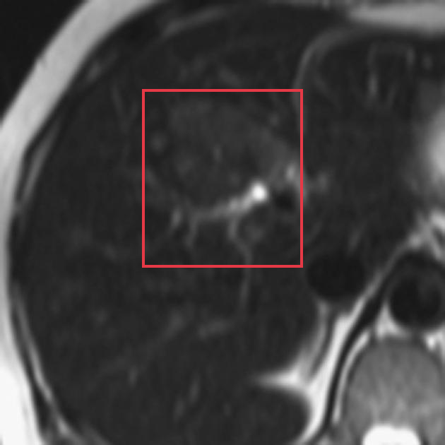

**Re-ground Lingshu caption：** The liver is enlarged and demonstrates diffuse abnormal signal intensity which is low on T1 weighted images and high on T2 weighted images. The intrahepatic bile ducts are dilated. There is no evidence of biliary obstruction.
**Re-ground caption 中文翻译：** 肝脏增大并呈弥漫性异常信号，T1 加权图像上为低信号，T2 加权图像上为高信号。肝内胆管扩张，未见胆道梗阻证据。

#### location_00048: NOT SUPPORT

<table>
<tr><th>Anchor original bbox</th><th>Target original image; model returned null</th><th>Existing target bbox: study_002_mri_image_004_axial_t2_fat_sat_f01</th></tr>
<tr><td></td><td></td><td></td></tr>
</table>

- **Target：** `study_002_mri_image_004_axial_t2_fat_sat`; MRI; Axial T2 fat sat
- **Relation：** `bbox_to_image` / `not_support`
- **Returned target bbox：** `unknown`
- **Maximum IoU：** n/a; threshold=0.5
- **Strong relation IDs：** `[]`

**IoU matching：**

| Existing target bbox | IoU | Strong match | Lingshu caption | 中文翻译 |
|---|---:|---|---|---|
| `study_002_mri_image_004_axial_t2_fat_sat_f01`; `[333, 381, 607, 550]` | n/a | n/a | The image shows a dilated common bile duct with a filling defect. The common bile duct appears to be enlarged and contains a distinct, well-defined structure within it, which could represent a stone or other obstructive lesion. | 图像显示胆总管扩张并有充盈缺损。增宽的胆总管内可见边界清楚的结构，可能为结石或其他梗阻性病变。 |

## Dynamically Skipped Anchors

| Anchor node | Reused strong relations | Skipped target images |
|---|---|---|
| `study_002_mri_image_002_axial_t1_c_f01` | `[&#x27;strong_location_00046_01&#x27;]` | `[&#x27;study_002_mri_image_003_axial_t2&#x27;, &#x27;study_002_mri_image_004_axial_t2_fat_sat&#x27;]` |
| `study_002_mri_image_003_axial_t2_f01` | `[&#x27;strong_location_00036_01&#x27;]` | `[&#x27;study_002_mri_image_004_axial_t2_fat_sat&#x27;]` |

## Case-level Location Validation Summary / 病例级定位验证总结

- **Strong support：** 2 个 bbox-to-bbox 关系
- **Partial support：** 13 个 bbox-to-image 关系
- **Not support：** 33 个 bbox-to-image 关系

### Strong Support

#### Strong 1: `study_002_mri_image_000_axial_t1_in_phase_f01` ↔ `study_002_mri_image_003_axial_t2_f01`

- **Relation / query：** `strong_location_00036_01` / `location_00036`
- **IoU：** 0.574（threshold=0.5）

<table>
<tr><th>Anchor bbox</th><th>Cross-image grounded target bbox</th><th>Matched target bbox</th></tr>
<tr><td></td><td></td><td></td></tr>
</table>

- **Anchor Lingshu caption：** The liver is enlarged and demonstrates diffuse abnormal signal intensity, which is most consistent with fatty infiltration. The spleen is also enlarged. There is a 1.5 cm focal area of low signal intensity in the left lobe of the liver, which may represent a simple cyst.
- **Anchor caption 中文翻译：** 肝脏增大并呈弥漫性异常信号，最符合脂肪浸润。脾脏也增大。肝左叶可见一个 1.5 cm 的局灶性低信号区，可能为单纯性囊肿。
- **Target Lingshu caption：** The liver is enlarged and demonstrates diffuse abnormal signal intensity, which is T2 hyperintense and T1 hypointense. The intrahepatic biliary ducts are dilated. There is also a small amount of fluid in the subcapsular region of the right lobe of the liver.
- **Target caption 中文翻译：** 肝脏增大并呈弥漫性异常信号，表现为 T2 高信号、T1 低信号。肝内胆管扩张，肝右叶包膜下另见少量液体。

#### Strong 2: `study_002_mri_image_001_axial_t1_out_of_phase_f01` ↔ `study_002_mri_image_002_axial_t1_c_f01`

- **Relation / query：** `strong_location_00046_01` / `location_00046`
- **IoU：** 0.512（threshold=0.5）

<table>
<tr><th>Anchor bbox</th><th>Cross-image grounded target bbox</th><th>Matched target bbox</th></tr>
<tr><td></td><td></td><td></td></tr>
</table>

- **Anchor Lingshu caption：** The liver is enlarged and demonstrates diffuse decrease in signal intensity on this out of phase sequence consistent with hepatic steatosis. The boxed area demonstrates a focal area of decreased signal intensity which could represent a focal fatty change or a focal lesion such as a hemangioma.
- **Anchor caption 中文翻译：** 肝脏增大，反相位序列上信号弥漫性下降，符合肝脂肪变。框内可见局灶性信号降低，可能代表局灶性脂肪改变或血管瘤等局灶性病变。
- **Target Lingshu caption：** The liver is enlarged. The hepatic parenchyma demonstrates diffuse nodularity. There is no focal lesion identified. The portal vein is prominent.
- **Target caption 中文翻译：** 肝脏增大，肝实质呈弥漫性结节状。未发现局灶性病灶。门静脉增粗。

### Partial Support

#### Partial 1: `study_000_ct_image_000_axial_c_portal_venous_phase_f01` → `study_002_mri_image_001_axial_t1_out_of_phase`

- **Query：** `location_00003`
- **Returned target bbox：** `[150, 200, 450, 500]`
- **Maximum IoU：** 0.077（低于 threshold=0.5）

<table>
<tr><th>Anchor bbox</th><th>Cross-image grounding and IoU overlay</th><th>B image with the single re-grounded bbox given to Lingshu</th><th>Closest existing target bbox</th></tr>
<tr><td></td><td></td><td></td><td></td></tr>
</table>

- **A 端原始 Lingshu caption：** The liver is enlarged and contains multiple hypodense lesions. The largest lesion measures 2.5 cm and is located in segment 4. There is no evidence of vascular invasion.
- **A 端 caption 中文翻译：** 肝脏增大，内见多发低密度病灶。最大病灶位于第 4 段，大小约 2.5 cm。未见血管侵犯。
- **B 端 re-ground Lingshu caption：** The liver parenchyma demonstrates diffuse low signal intensity on this out of phase sequence compared to the spleen. This is consistent with diffuse hepatic steatosis. No focal lesions are identified. The biliary tree is not dilated. The portal vein is patent. There is no evidence of ascites or lymphadenopathy.
- **B 端 re-ground caption 中文翻译：** 反相位序列上肝实质信号较脾脏弥漫性降低，符合弥漫性肝脂肪变。未发现局灶性病灶。胆管树未扩张，门静脉通畅。未见腹水或淋巴结肿大。

#### Partial 2: `study_000_ct_image_000_axial_c_portal_venous_phase_f01` → `study_002_mri_image_002_axial_t1_c`

- **Query：** `location_00004`
- **Returned target bbox：** `[244, 176, 528, 436]`
- **Maximum IoU：** 0.286（低于 threshold=0.5）

<table>
<tr><th>Anchor bbox</th><th>Cross-image grounding and IoU overlay</th><th>B image with the single re-grounded bbox given to Lingshu</th><th>Closest existing target bbox</th></tr>
<tr><td></td><td></td><td></td><td></td></tr>
</table>

- **A 端原始 Lingshu caption：** The liver is enlarged and contains multiple hypodense lesions. The largest lesion measures 2.5 cm and is located in segment 4. There is no evidence of vascular invasion.
- **A 端 caption 中文翻译：** 肝脏增大，内见多发低密度病灶。最大病灶位于第 4 段，大小约 2.5 cm。未见血管侵犯。
- **B 端 re-ground Lingshu caption：** The liver is enlarged. The hepatic parenchyma demonstrates diffuse nodularity. There is no evidence of focal hepatic lesions. The intrahepatic biliary ducts are dilated. The portal vein is prominent.
- **B 端 re-ground caption 中文翻译：** 肝脏增大，肝实质呈弥漫性结节状。未见局灶性肝病灶。肝内胆管扩张，门静脉增粗。

#### Partial 3: `study_000_ct_image_000_axial_c_portal_venous_phase_f01` → `study_002_mri_image_003_axial_t2`

- **Query：** `location_00005`
- **Returned target bbox：** `[150, 120, 450, 450]`
- **Maximum IoU：** 0.000（低于 threshold=0.5）

<table>
<tr><th>Anchor bbox</th><th>Cross-image grounding and IoU overlay</th><th>B image with the single re-grounded bbox given to Lingshu</th><th>Closest existing target bbox</th></tr>
<tr><td></td><td></td><td></td><td></td></tr>
</table>

- **A 端原始 Lingshu caption：** The liver is enlarged and contains multiple hypodense lesions. The largest lesion measures 2.5 cm and is located in segment 4. There is no evidence of vascular invasion.
- **A 端 caption 中文翻译：** 肝脏增大，内见多发低密度病灶。最大病灶位于第 4 段，大小约 2.5 cm。未见血管侵犯。
- **B 端 re-ground Lingshu caption：** The liver is enlarged and demonstrates diffuse abnormal signal intensity, which is heterogeneous. The spleen also appears to be enlarged.
- **B 端 re-ground caption 中文翻译：** 肝脏增大并呈弥漫性、不均匀异常信号。脾脏也似增大。

#### Partial 4: `study_000_ct_image_000_axial_c_portal_venous_phase_f02` → `study_002_mri_image_002_axial_t1_c`

- **Query：** `location_00010`
- **Returned target bbox：** `[298, 542, 402, 667]`
- **Maximum IoU：** 0.040（低于 threshold=0.5）

<table>
<tr><th>Anchor bbox</th><th>Cross-image grounding and IoU overlay</th><th>B image with the single re-grounded bbox given to Lingshu</th><th>Closest existing target bbox</th></tr>
<tr><td></td><td></td><td></td><td></td></tr>
</table>

- **A 端原始 Lingshu caption：** The liver is enlarged and contains multiple hypodense lesions. The largest lesion measures approximately 1.5 cm and is located in segment 4. There is no evidence of vascular invasion. No other focal lesions are identified. The spleen is unremarkable.
- **A 端 caption 中文翻译：** 肝脏增大，内见多发低密度病灶。最大病灶位于第 4 段，大小约 1.5 cm。未见血管侵犯，也未发现其他局灶性病灶。脾脏未见异常。
- **B 端 re-ground Lingshu caption：** The liver is enlarged. There are multiple lesions throughout the liver which demonstrate peripheral enhancement. The largest lesion is located in segment 6 and measures approximately 2.5 cm.
- **B 端 re-ground caption 中文翻译：** 肝脏增大，内见多发周边强化病灶。最大病灶位于第 6 段，大小约 2.5 cm。

#### Partial 5: `study_000_ct_image_000_axial_c_portal_venous_phase_f03` → `study_002_mri_image_001_axial_t1_out_of_phase`

- **Query：** `location_00015`
- **Returned target bbox：** `[250, 667, 400, 850]`
- **Maximum IoU：** 0.003（低于 threshold=0.5）

<table>
<tr><th>Anchor bbox</th><th>Cross-image grounding and IoU overlay</th><th>B image with the single re-grounded bbox given to Lingshu</th><th>Closest existing target bbox</th></tr>
<tr><td></td><td></td><td></td><td></td></tr>
</table>

- **A 端原始 Lingshu caption：** The liver is enlarged and demonstrates multiple hypodense lesions throughout all segments. The largest lesion measures 1.6 cm and is located in segment 7. There is no evidence of vascular invasion. No additional masses are identified.
- **A 端 caption 中文翻译：** 肝脏增大，各肝段可见多发低密度病灶。最大病灶位于第 7 段，大小约 1.6 cm。未见血管侵犯，也未发现其他肿块。
- **B 端 re-ground Lingshu caption：** The liver is enlarged and demonstrates diffuse decrease in signal intensity on this out of phase sequence compared to the spleen. This is consistent with diffuse hepatic steatosis. The boxed area appears to correspond to the right lobe of the liver. No focal lesions are identified.
- **B 端 re-ground caption 中文翻译：** 肝脏增大，反相位序列上信号较脾脏弥漫性降低，符合弥漫性肝脂肪变。框内似对应肝右叶。未发现局灶性病灶。

#### Partial 6: `study_000_ct_image_000_axial_c_portal_venous_phase_f03` → `study_002_mri_image_002_axial_t1_c`

- **Query：** `location_00016`
- **Returned target bbox：** `[270, 668, 400, 807]`
- **Maximum IoU：** 0.000（低于 threshold=0.5）

<table>
<tr><th>Anchor bbox</th><th>Cross-image grounding and IoU overlay</th><th>B image with the single re-grounded bbox given to Lingshu</th><th>Closest existing target bbox</th></tr>
<tr><td></td><td></td><td></td><td></td></tr>
</table>

- **A 端原始 Lingshu caption：** The liver is enlarged and demonstrates multiple hypodense lesions throughout all segments. The largest lesion measures 1.6 cm and is located in segment 7. There is no evidence of vascular invasion. No additional masses are identified.
- **A 端 caption 中文翻译：** 肝脏增大，各肝段可见多发低密度病灶。最大病灶位于第 7 段，大小约 1.6 cm。未见血管侵犯，也未发现其他肿块。
- **B 端 re-ground Lingshu caption：** The liver is enlarged and demonstrates multiple focal lesions which demonstrate peripheral enhancement and central non-enhancement. The largest lesion is located in segment 6 and measures approximately 2.5 cm. There is no evidence of biliary ductal dilatation. No intrahepatic biliary duct stones are identified. The portal vein is patent. The spleen is unremarkable.
- **B 端 re-ground caption 中文翻译：** 肝脏增大并有多发局灶性病灶，呈周边强化及中央不强化。最大病灶位于第 6 段，约 2.5 cm。未见胆管扩张或肝内胆管结石。门静脉通畅，脾脏未见异常。

#### Partial 7: `study_002_mri_image_000_axial_t1_in_phase_f01` → `study_002_mri_image_001_axial_t1_out_of_phase`

- **Query：** `location_00034`
- **Returned target bbox：** `[500, 375, 600, 475]`
- **Maximum IoU：** 0.068（低于 threshold=0.5）

<table>
<tr><th>Anchor bbox</th><th>Cross-image grounding and IoU overlay</th><th>B image with the single re-grounded bbox given to Lingshu</th><th>Closest existing target bbox</th></tr>
<tr><td></td><td></td><td></td><td></td></tr>
</table>

- **A 端原始 Lingshu caption：** The liver is enlarged and demonstrates diffuse abnormal signal intensity, which is most consistent with fatty infiltration. The spleen is also enlarged. There is a 1.5 cm focal area of low signal intensity in the left lobe of the liver, which may represent a simple cyst.
- **A 端 caption 中文翻译：** 肝脏增大并呈弥漫性异常信号，最符合脂肪浸润。脾脏也增大。肝左叶可见一个 1.5 cm 的局灶性低信号区，可能为单纯性囊肿。
- **B 端 re-ground Lingshu caption：** The liver is enlarged and demonstrates diffuse abnormal signal intensity which is low on T1 weighted images and high on T2 weighted images. There is no evidence of intrahepatic biliary ductal dilatation. The spleen is also enlarged.
- **B 端 re-ground caption 中文翻译：** 肝脏增大并呈弥漫性异常信号，T1 加权图像上为低信号，T2 加权图像上为高信号。未见肝内胆管扩张。脾脏也增大。

#### Partial 8: `study_002_mri_image_000_axial_t1_in_phase_f01` → `study_002_mri_image_002_axial_t1_c`

- **Query：** `location_00035`
- **Returned target bbox：** `[480, 300, 620, 460]`
- **Maximum IoU：** 0.167（低于 threshold=0.5）

<table>
<tr><th>Anchor bbox</th><th>Cross-image grounding and IoU overlay</th><th>B image with the single re-grounded bbox given to Lingshu</th><th>Closest existing target bbox</th></tr>
<tr><td></td><td></td><td></td><td></td></tr>
</table>

- **A 端原始 Lingshu caption：** The liver is enlarged and demonstrates diffuse abnormal signal intensity, which is most consistent with fatty infiltration. The spleen is also enlarged. There is a 1.5 cm focal area of low signal intensity in the left lobe of the liver, which may represent a simple cyst.
- **A 端 caption 中文翻译：** 肝脏增大并呈弥漫性异常信号，最符合脂肪浸润。脾脏也增大。肝左叶可见一个 1.5 cm 的局灶性低信号区，可能为单纯性囊肿。
- **B 端 re-ground Lingshu caption：** The liver is enlarged. The hepatic parenchyma demonstrates diffuse nodularity. There is a 2.5 cm focal area of decreased enhancement in segment 4A of the liver. No other focal lesions are identified. The portal vein is prominent. The spleen is unremarkable.
- **B 端 re-ground caption 中文翻译：** 肝脏增大，肝实质呈弥漫性结节状。肝 4A 段可见一个 2.5 cm 的局灶性强化减低区，未发现其他局灶性病灶。门静脉增粗，脾脏未见异常。

#### Partial 9: `study_002_mri_image_000_axial_t1_in_phase_f02` → `study_002_mri_image_001_axial_t1_out_of_phase`

- **Query：** `location_00038`
- **Returned target bbox：** `[570, 618, 672, 716]`
- **Maximum IoU：** 0.046（低于 threshold=0.5）

<table>
<tr><th>Anchor bbox</th><th>Cross-image grounding and IoU overlay</th><th>B image with the single re-grounded bbox given to Lingshu</th><th>Closest existing target bbox</th></tr>
<tr><td></td><td></td><td></td><td></td></tr>
</table>

- **A 端原始 Lingshu caption：** The liver is enlarged and demonstrates diffuse abnormal signal intensity, which is most consistent with fatty infiltration. The spleen is also enlarged. There is a small amount of fluid in the right subphrenic space. No focal hepatic lesions are identified.
- **A 端 caption 中文翻译：** 肝脏增大并呈弥漫性异常信号，最符合脂肪浸润。脾脏也增大。右侧膈下间隙可见少量液体。未发现局灶性肝病灶。
- **B 端 re-ground Lingshu caption：** The liver is enlarged and demonstrates diffuse low signal intensity on this out of phase sequence. The spleen is also enlarged. There is no evidence of focal hepatic lesions.
- **B 端 re-ground caption 中文翻译：** 肝脏增大，反相位序列上呈弥漫性低信号。脾脏也增大。未见局灶性肝病灶。

#### Partial 10: `study_002_mri_image_000_axial_t1_in_phase_f02` → `study_002_mri_image_002_axial_t1_c`

- **Query：** `location_00039`
- **Returned target bbox：** `[600, 600, 700, 700]`
- **Maximum IoU：** 0.000（低于 threshold=0.5）

<table>
<tr><th>Anchor bbox</th><th>Cross-image grounding and IoU overlay</th><th>B image with the single re-grounded bbox given to Lingshu</th><th>Closest existing target bbox</th></tr>
<tr><td></td><td></td><td></td><td></td></tr>
</table>

- **A 端原始 Lingshu caption：** The liver is enlarged and demonstrates diffuse abnormal signal intensity, which is most consistent with fatty infiltration. The spleen is also enlarged. There is a small amount of fluid in the right subphrenic space. No focal hepatic lesions are identified.
- **A 端 caption 中文翻译：** 肝脏增大并呈弥漫性异常信号，最符合脂肪浸润。脾脏也增大。右侧膈下间隙可见少量液体。未发现局灶性肝病灶。
- **B 端 re-ground Lingshu caption：** The liver is enlarged. There are multiple lesions throughout the liver which demonstrate peripheral enhancement. The largest lesion is located in segment 6 and measures approximately 2.5 cm.
- **B 端 re-ground caption 中文翻译：** 肝脏增大，内见多发周边强化病灶。最大病灶位于第 6 段，大小约 2.5 cm。

#### Partial 11: `study_002_mri_image_000_axial_t1_in_phase_f02` → `study_002_mri_image_003_axial_t2`

- **Query：** `location_00040`
- **Returned target bbox：** `[610, 570, 778, 700]`
- **Maximum IoU：** 0.000（低于 threshold=0.5）

<table>
<tr><th>Anchor bbox</th><th>Cross-image grounding and IoU overlay</th><th>B image with the single re-grounded bbox given to Lingshu</th><th>Closest existing target bbox</th></tr>
<tr><td></td><td></td><td></td><td></td></tr>
</table>

- **A 端原始 Lingshu caption：** The liver is enlarged and demonstrates diffuse abnormal signal intensity, which is most consistent with fatty infiltration. The spleen is also enlarged. There is a small amount of fluid in the right subphrenic space. No focal hepatic lesions are identified.
- **A 端 caption 中文翻译：** 肝脏增大并呈弥漫性异常信号，最符合脂肪浸润。脾脏也增大。右侧膈下间隙可见少量液体。未发现局灶性肝病灶。
- **B 端 re-ground Lingshu caption：** The liver is enlarged and demonstrates diffuse abnormal signal intensity, which is T2 hyperintense and T1 hypointense. The spleen also appears to be enlarged.
- **B 端 re-ground caption 中文翻译：** 肝脏增大并呈弥漫性异常信号，表现为 T2 高信号、T1 低信号。脾脏也似增大。

#### Partial 12: `study_002_mri_image_000_axial_t1_in_phase_f03` → `study_002_mri_image_001_axial_t1_out_of_phase`

- **Query：** `location_00042`
- **Returned target bbox：** `[768, 682, 918, 886]`
- **Maximum IoU：** 0.000（低于 threshold=0.5）

<table>
<tr><th>Anchor bbox</th><th>Cross-image grounding and IoU overlay</th><th>B image with the single re-grounded bbox given to Lingshu</th><th>Closest existing target bbox</th></tr>
<tr><td></td><td></td><td></td><td></td></tr>
</table>

- **A 端原始 Lingshu caption：** The liver is enlarged and demonstrates diffuse abnormal signal intensity, which is most consistent with fatty infiltration. The spleen is also enlarged. There is a 2.5 cm lesion in the left lobe of the liver, which is hypointense on this T1 weighted image.
- **A 端 caption 中文翻译：** 肝脏增大并呈弥漫性异常信号，最符合脂肪浸润。脾脏也增大。肝左叶可见一个 2.5 cm 病灶，在该 T1 加权图像上呈低信号。
- **B 端 re-ground Lingshu caption：** The liver is enlarged and demonstrates diffuse low signal intensity on this out of phase sequence. The spleen also appears enlarged. There is a small amount of fluid seen in the right paracolic gutter.
- **B 端 re-ground caption 中文翻译：** 肝脏增大，反相位序列上呈弥漫性低信号。脾脏也似增大。右侧结肠旁沟可见少量液体。

#### Partial 13: `study_002_mri_image_001_axial_t1_out_of_phase_f01` → `study_002_mri_image_003_axial_t2`

- **Query：** `location_00047`
- **Returned target bbox：** `[320, 200, 680, 600]`
- **Maximum IoU：** 0.146（低于 threshold=0.5）

<table>
<tr><th>Anchor bbox</th><th>Cross-image grounding and IoU overlay</th><th>B image with the single re-grounded bbox given to Lingshu</th><th>Closest existing target bbox</th></tr>
<tr><td></td><td></td><td></td><td></td></tr>
</table>

- **A 端原始 Lingshu caption：** The liver is enlarged and demonstrates diffuse decrease in signal intensity on this out of phase sequence consistent with hepatic steatosis. The boxed area demonstrates a focal area of decreased signal intensity which could represent a focal fatty change or a focal lesion such as a hemangioma.
- **A 端 caption 中文翻译：** 肝脏增大，反相位序列上信号弥漫性下降，符合肝脂肪变。框内可见局灶性信号降低，可能代表局灶性脂肪改变或血管瘤等局灶性病变。
- **B 端 re-ground Lingshu caption：** The liver is enlarged and demonstrates diffuse abnormal signal intensity which is low on T1 weighted images and high on T2 weighted images. The intrahepatic bile ducts are dilated. There is no evidence of biliary obstruction.
- **B 端 re-ground caption 中文翻译：** 肝脏增大并呈弥漫性异常信号，T1 加权图像上为低信号，T2 加权图像上为高信号。肝内胆管扩张，未见胆道梗阻证据。

### Not Support

#### Not support 1: `study_000_ct_image_000_axial_c_portal_venous_phase_f01` → `study_001_ultrasound_image_000_missing`

- **Query：** `location_00001`
- **Result：** 目标图返回 `null`，未定位到对应区域。

<table>
<tr><th>Anchor bbox</th><th>Target original image</th></tr>
<tr><td></td><td></td></tr>
</table>

- **A 端原始 Lingshu caption：** The liver is enlarged and contains multiple hypodense lesions. The largest lesion measures 2.5 cm and is located in segment 4. There is no evidence of vascular invasion.
- **A 端 caption 中文翻译：** 肝脏增大，内见多发低密度病灶。最大病灶位于第 4 段，大小约 2.5 cm。未见血管侵犯。
- **B 端 re-ground caption：** 不适用；目标图返回 `null`，没有生成 re-ground bbox。

#### Not support 2: `study_000_ct_image_000_axial_c_portal_venous_phase_f01` → `study_002_mri_image_000_axial_t1_in_phase`

- **Query：** `location_00002`
- **Result：** 目标图返回 `null`，未定位到对应区域。

<table>
<tr><th>Anchor bbox</th><th>Target original image</th></tr>
<tr><td></td><td></td></tr>
</table>

- **A 端原始 Lingshu caption：** The liver is enlarged and contains multiple hypodense lesions. The largest lesion measures 2.5 cm and is located in segment 4. There is no evidence of vascular invasion.
- **A 端 caption 中文翻译：** 肝脏增大，内见多发低密度病灶。最大病灶位于第 4 段，大小约 2.5 cm。未见血管侵犯。
- **B 端 re-ground caption：** 不适用；目标图返回 `null`，没有生成 re-ground bbox。

#### Not support 3: `study_000_ct_image_000_axial_c_portal_venous_phase_f01` → `study_002_mri_image_004_axial_t2_fat_sat`

- **Query：** `location_00006`
- **Result：** 目标图返回 `null`，未定位到对应区域。

<table>
<tr><th>Anchor bbox</th><th>Target original image</th></tr>
<tr><td></td><td></td></tr>
</table>

- **A 端原始 Lingshu caption：** The liver is enlarged and contains multiple hypodense lesions. The largest lesion measures 2.5 cm and is located in segment 4. There is no evidence of vascular invasion.
- **A 端 caption 中文翻译：** 肝脏增大，内见多发低密度病灶。最大病灶位于第 4 段，大小约 2.5 cm。未见血管侵犯。
- **B 端 re-ground caption：** 不适用；目标图返回 `null`，没有生成 re-ground bbox。

#### Not support 4: `study_000_ct_image_000_axial_c_portal_venous_phase_f02` → `study_001_ultrasound_image_000_missing`

- **Query：** `location_00007`
- **Result：** 目标图返回 `null`，未定位到对应区域。

<table>
<tr><th>Anchor bbox</th><th>Target original image</th></tr>
<tr><td></td><td></td></tr>
</table>

- **A 端原始 Lingshu caption：** The liver is enlarged and contains multiple hypodense lesions. The largest lesion measures approximately 1.5 cm and is located in segment 4. There is no evidence of vascular invasion. No other focal lesions are identified. The spleen is unremarkable.
- **A 端 caption 中文翻译：** 肝脏增大，内见多发低密度病灶。最大病灶位于第 4 段，大小约 1.5 cm。未见血管侵犯，也未发现其他局灶性病灶。脾脏未见异常。
- **B 端 re-ground caption：** 不适用；目标图返回 `null`，没有生成 re-ground bbox。

#### Not support 5: `study_000_ct_image_000_axial_c_portal_venous_phase_f02` → `study_002_mri_image_000_axial_t1_in_phase`

- **Query：** `location_00008`
- **Result：** 目标图返回 `null`，未定位到对应区域。

<table>
<tr><th>Anchor bbox</th><th>Target original image</th></tr>
<tr><td></td><td></td></tr>
</table>

- **A 端原始 Lingshu caption：** The liver is enlarged and contains multiple hypodense lesions. The largest lesion measures approximately 1.5 cm and is located in segment 4. There is no evidence of vascular invasion. No other focal lesions are identified. The spleen is unremarkable.
- **A 端 caption 中文翻译：** 肝脏增大，内见多发低密度病灶。最大病灶位于第 4 段，大小约 1.5 cm。未见血管侵犯，也未发现其他局灶性病灶。脾脏未见异常。
- **B 端 re-ground caption：** 不适用；目标图返回 `null`，没有生成 re-ground bbox。

#### Not support 6: `study_000_ct_image_000_axial_c_portal_venous_phase_f02` → `study_002_mri_image_001_axial_t1_out_of_phase`

- **Query：** `location_00009`
- **Result：** 目标图返回 `null`，未定位到对应区域。

<table>
<tr><th>Anchor bbox</th><th>Target original image</th></tr>
<tr><td></td><td></td></tr>
</table>

- **A 端原始 Lingshu caption：** The liver is enlarged and contains multiple hypodense lesions. The largest lesion measures approximately 1.5 cm and is located in segment 4. There is no evidence of vascular invasion. No other focal lesions are identified. The spleen is unremarkable.
- **A 端 caption 中文翻译：** 肝脏增大，内见多发低密度病灶。最大病灶位于第 4 段，大小约 1.5 cm。未见血管侵犯，也未发现其他局灶性病灶。脾脏未见异常。
- **B 端 re-ground caption：** 不适用；目标图返回 `null`，没有生成 re-ground bbox。

#### Not support 7: `study_000_ct_image_000_axial_c_portal_venous_phase_f02` → `study_002_mri_image_003_axial_t2`

- **Query：** `location_00011`
- **Result：** 目标图返回 `null`，未定位到对应区域。

<table>
<tr><th>Anchor bbox</th><th>Target original image</th></tr>
<tr><td></td><td></td></tr>
</table>

- **A 端原始 Lingshu caption：** The liver is enlarged and contains multiple hypodense lesions. The largest lesion measures approximately 1.5 cm and is located in segment 4. There is no evidence of vascular invasion. No other focal lesions are identified. The spleen is unremarkable.
- **A 端 caption 中文翻译：** 肝脏增大，内见多发低密度病灶。最大病灶位于第 4 段，大小约 1.5 cm。未见血管侵犯，也未发现其他局灶性病灶。脾脏未见异常。
- **B 端 re-ground caption：** 不适用；目标图返回 `null`，没有生成 re-ground bbox。

#### Not support 8: `study_000_ct_image_000_axial_c_portal_venous_phase_f02` → `study_002_mri_image_004_axial_t2_fat_sat`

- **Query：** `location_00012`
- **Result：** 目标图返回 `null`，未定位到对应区域。

<table>
<tr><th>Anchor bbox</th><th>Target original image</th></tr>
<tr><td></td><td></td></tr>
</table>

- **A 端原始 Lingshu caption：** The liver is enlarged and contains multiple hypodense lesions. The largest lesion measures approximately 1.5 cm and is located in segment 4. There is no evidence of vascular invasion. No other focal lesions are identified. The spleen is unremarkable.
- **A 端 caption 中文翻译：** 肝脏增大，内见多发低密度病灶。最大病灶位于第 4 段，大小约 1.5 cm。未见血管侵犯，也未发现其他局灶性病灶。脾脏未见异常。
- **B 端 re-ground caption：** 不适用；目标图返回 `null`，没有生成 re-ground bbox。

#### Not support 9: `study_000_ct_image_000_axial_c_portal_venous_phase_f03` → `study_001_ultrasound_image_000_missing`

- **Query：** `location_00013`
- **Result：** 目标图返回 `null`，未定位到对应区域。

<table>
<tr><th>Anchor bbox</th><th>Target original image</th></tr>
<tr><td></td><td></td></tr>
</table>

- **A 端原始 Lingshu caption：** The liver is enlarged and demonstrates multiple hypodense lesions throughout all segments. The largest lesion measures 1.6 cm and is located in segment 7. There is no evidence of vascular invasion. No additional masses are identified.
- **A 端 caption 中文翻译：** 肝脏增大，各肝段可见多发低密度病灶。最大病灶位于第 7 段，大小约 1.6 cm。未见血管侵犯，也未发现其他肿块。
- **B 端 re-ground caption：** 不适用；目标图返回 `null`，没有生成 re-ground bbox。

#### Not support 10: `study_000_ct_image_000_axial_c_portal_venous_phase_f03` → `study_002_mri_image_000_axial_t1_in_phase`

- **Query：** `location_00014`
- **Result：** 目标图返回 `null`，未定位到对应区域。

<table>
<tr><th>Anchor bbox</th><th>Target original image</th></tr>
<tr><td></td><td></td></tr>
</table>

- **A 端原始 Lingshu caption：** The liver is enlarged and demonstrates multiple hypodense lesions throughout all segments. The largest lesion measures 1.6 cm and is located in segment 7. There is no evidence of vascular invasion. No additional masses are identified.
- **A 端 caption 中文翻译：** 肝脏增大，各肝段可见多发低密度病灶。最大病灶位于第 7 段，大小约 1.6 cm。未见血管侵犯，也未发现其他肿块。
- **B 端 re-ground caption：** 不适用；目标图返回 `null`，没有生成 re-ground bbox。

#### Not support 11: `study_000_ct_image_000_axial_c_portal_venous_phase_f03` → `study_002_mri_image_003_axial_t2`

- **Query：** `location_00017`
- **Result：** 目标图返回 `null`，未定位到对应区域。

<table>
<tr><th>Anchor bbox</th><th>Target original image</th></tr>
<tr><td></td><td></td></tr>
</table>

- **A 端原始 Lingshu caption：** The liver is enlarged and demonstrates multiple hypodense lesions throughout all segments. The largest lesion measures 1.6 cm and is located in segment 7. There is no evidence of vascular invasion. No additional masses are identified.
- **A 端 caption 中文翻译：** 肝脏增大，各肝段可见多发低密度病灶。最大病灶位于第 7 段，大小约 1.6 cm。未见血管侵犯，也未发现其他肿块。
- **B 端 re-ground caption：** 不适用；目标图返回 `null`，没有生成 re-ground bbox。

#### Not support 12: `study_000_ct_image_000_axial_c_portal_venous_phase_f03` → `study_002_mri_image_004_axial_t2_fat_sat`

- **Query：** `location_00018`
- **Result：** 目标图返回 `null`，未定位到对应区域。

<table>
<tr><th>Anchor bbox</th><th>Target original image</th></tr>
<tr><td></td><td></td></tr>
</table>

- **A 端原始 Lingshu caption：** The liver is enlarged and demonstrates multiple hypodense lesions throughout all segments. The largest lesion measures 1.6 cm and is located in segment 7. There is no evidence of vascular invasion. No additional masses are identified.
- **A 端 caption 中文翻译：** 肝脏增大，各肝段可见多发低密度病灶。最大病灶位于第 7 段，大小约 1.6 cm。未见血管侵犯，也未发现其他肿块。
- **B 端 re-ground caption：** 不适用；目标图返回 `null`，没有生成 re-ground bbox。

#### Not support 13: `study_001_ultrasound_image_000_missing_f01` → `study_002_mri_image_000_axial_t1_in_phase`

- **Query：** `location_00019`
- **Result：** 目标图返回 `null`，未定位到对应区域。

<table>
<tr><th>Anchor bbox</th><th>Target original image</th></tr>
<tr><td></td><td></td></tr>
</table>

- **A 端原始 Lingshu caption：** The liver parenchyma appears diffusely hyperechoic. The portal vein is dilated measuring 15 mm. There is no evidence of ascites.
- **A 端 caption 中文翻译：** 肝实质呈弥漫性高回声。门静脉扩张，直径约 15 mm。未见腹水。
- **B 端 re-ground caption：** 不适用；目标图返回 `null`，没有生成 re-ground bbox。

#### Not support 14: `study_001_ultrasound_image_000_missing_f01` → `study_002_mri_image_001_axial_t1_out_of_phase`

- **Query：** `location_00020`
- **Result：** 目标图返回 `null`，未定位到对应区域。

<table>
<tr><th>Anchor bbox</th><th>Target original image</th></tr>
<tr><td></td><td></td></tr>
</table>

- **A 端原始 Lingshu caption：** The liver parenchyma appears diffusely hyperechoic. The portal vein is dilated measuring 15 mm. There is no evidence of ascites.
- **A 端 caption 中文翻译：** 肝实质呈弥漫性高回声。门静脉扩张，直径约 15 mm。未见腹水。
- **B 端 re-ground caption：** 不适用；目标图返回 `null`，没有生成 re-ground bbox。

#### Not support 15: `study_001_ultrasound_image_000_missing_f01` → `study_002_mri_image_002_axial_t1_c`

- **Query：** `location_00021`
- **Result：** 目标图返回 `null`，未定位到对应区域。

<table>
<tr><th>Anchor bbox</th><th>Target original image</th></tr>
<tr><td></td><td></td></tr>
</table>

- **A 端原始 Lingshu caption：** The liver parenchyma appears diffusely hyperechoic. The portal vein is dilated measuring 15 mm. There is no evidence of ascites.
- **A 端 caption 中文翻译：** 肝实质呈弥漫性高回声。门静脉扩张，直径约 15 mm。未见腹水。
- **B 端 re-ground caption：** 不适用；目标图返回 `null`，没有生成 re-ground bbox。

#### Not support 16: `study_001_ultrasound_image_000_missing_f01` → `study_002_mri_image_003_axial_t2`

- **Query：** `location_00022`
- **Result：** 目标图返回 `null`，未定位到对应区域。

<table>
<tr><th>Anchor bbox</th><th>Target original image</th></tr>
<tr><td></td><td></td></tr>
</table>

- **A 端原始 Lingshu caption：** The liver parenchyma appears diffusely hyperechoic. The portal vein is dilated measuring 15 mm. There is no evidence of ascites.
- **A 端 caption 中文翻译：** 肝实质呈弥漫性高回声。门静脉扩张，直径约 15 mm。未见腹水。
- **B 端 re-ground caption：** 不适用；目标图返回 `null`，没有生成 re-ground bbox。

#### Not support 17: `study_001_ultrasound_image_000_missing_f01` → `study_002_mri_image_004_axial_t2_fat_sat`

- **Query：** `location_00023`
- **Result：** 目标图返回 `null`，未定位到对应区域。

<table>
<tr><th>Anchor bbox</th><th>Target original image</th></tr>
<tr><td></td><td></td></tr>
</table>

- **A 端原始 Lingshu caption：** The liver parenchyma appears diffusely hyperechoic. The portal vein is dilated measuring 15 mm. There is no evidence of ascites.
- **A 端 caption 中文翻译：** 肝实质呈弥漫性高回声。门静脉扩张，直径约 15 mm。未见腹水。
- **B 端 re-ground caption：** 不适用；目标图返回 `null`，没有生成 re-ground bbox。

#### Not support 18: `study_001_ultrasound_image_000_missing_f02` → `study_002_mri_image_000_axial_t1_in_phase`

- **Query：** `location_00024`
- **Result：** 目标图返回 `null`，未定位到对应区域。

<table>
<tr><th>Anchor bbox</th><th>Target original image</th></tr>
<tr><td></td><td></td></tr>
</table>

- **A 端原始 Lingshu caption：** The liver parenchyma is diffusely hyperechoic. The portal vein is dilated measuring 15 mm. There is a small amount of ascites.
- **A 端 caption 中文翻译：** 肝实质呈弥漫性高回声。门静脉扩张，直径约 15 mm。可见少量腹水。
- **B 端 re-ground caption：** 不适用；目标图返回 `null`，没有生成 re-ground bbox。

#### Not support 19: `study_001_ultrasound_image_000_missing_f02` → `study_002_mri_image_001_axial_t1_out_of_phase`

- **Query：** `location_00025`
- **Result：** 目标图返回 `null`，未定位到对应区域。

<table>
<tr><th>Anchor bbox</th><th>Target original image</th></tr>
<tr><td></td><td></td></tr>
</table>

- **A 端原始 Lingshu caption：** The liver parenchyma is diffusely hyperechoic. The portal vein is dilated measuring 15 mm. There is a small amount of ascites.
- **A 端 caption 中文翻译：** 肝实质呈弥漫性高回声。门静脉扩张，直径约 15 mm。可见少量腹水。
- **B 端 re-ground caption：** 不适用；目标图返回 `null`，没有生成 re-ground bbox。

#### Not support 20: `study_001_ultrasound_image_000_missing_f02` → `study_002_mri_image_002_axial_t1_c`

- **Query：** `location_00026`
- **Result：** 目标图返回 `null`，未定位到对应区域。

<table>
<tr><th>Anchor bbox</th><th>Target original image</th></tr>
<tr><td></td><td></td></tr>
</table>

- **A 端原始 Lingshu caption：** The liver parenchyma is diffusely hyperechoic. The portal vein is dilated measuring 15 mm. There is a small amount of ascites.
- **A 端 caption 中文翻译：** 肝实质呈弥漫性高回声。门静脉扩张，直径约 15 mm。可见少量腹水。
- **B 端 re-ground caption：** 不适用；目标图返回 `null`，没有生成 re-ground bbox。

#### Not support 21: `study_001_ultrasound_image_000_missing_f02` → `study_002_mri_image_003_axial_t2`

- **Query：** `location_00027`
- **Result：** 目标图返回 `null`，未定位到对应区域。

<table>
<tr><th>Anchor bbox</th><th>Target original image</th></tr>
<tr><td></td><td></td></tr>
</table>

- **A 端原始 Lingshu caption：** The liver parenchyma is diffusely hyperechoic. The portal vein is dilated measuring 15 mm. There is a small amount of ascites.
- **A 端 caption 中文翻译：** 肝实质呈弥漫性高回声。门静脉扩张，直径约 15 mm。可见少量腹水。
- **B 端 re-ground caption：** 不适用；目标图返回 `null`，没有生成 re-ground bbox。

#### Not support 22: `study_001_ultrasound_image_000_missing_f02` → `study_002_mri_image_004_axial_t2_fat_sat`

- **Query：** `location_00028`
- **Result：** 目标图返回 `null`，未定位到对应区域。

<table>
<tr><th>Anchor bbox</th><th>Target original image</th></tr>
<tr><td></td><td></td></tr>
</table>

- **A 端原始 Lingshu caption：** The liver parenchyma is diffusely hyperechoic. The portal vein is dilated measuring 15 mm. There is a small amount of ascites.
- **A 端 caption 中文翻译：** 肝实质呈弥漫性高回声。门静脉扩张，直径约 15 mm。可见少量腹水。
- **B 端 re-ground caption：** 不适用；目标图返回 `null`，没有生成 re-ground bbox。

#### Not support 23: `study_001_ultrasound_image_000_missing_f03` → `study_002_mri_image_000_axial_t1_in_phase`

- **Query：** `location_00029`
- **Result：** 目标图返回 `null`，未定位到对应区域。

<table>
<tr><th>Anchor bbox</th><th>Target original image</th></tr>
<tr><td></td><td></td></tr>
</table>

- **A 端原始 Lingshu caption：** The liver parenchyma is diffusely hyperechoic and there is increased echogenicity anterior to the diaphragm consistent with chronic liver disease. There is a small hypoechoic lesion in segment 4A measuring approximately 1.0 cm.
- **A 端 caption 中文翻译：** 肝实质呈弥漫性高回声，膈肌前方回声增强，符合慢性肝病表现。肝 4A 段可见一个约 1.0 cm 的小低回声病灶。
- **B 端 re-ground caption：** 不适用；目标图返回 `null`，没有生成 re-ground bbox。

#### Not support 24: `study_001_ultrasound_image_000_missing_f03` → `study_002_mri_image_001_axial_t1_out_of_phase`

- **Query：** `location_00030`
- **Result：** 目标图返回 `null`，未定位到对应区域。

<table>
<tr><th>Anchor bbox</th><th>Target original image</th></tr>
<tr><td></td><td></td></tr>
</table>

- **A 端原始 Lingshu caption：** The liver parenchyma is diffusely hyperechoic and there is increased echogenicity anterior to the diaphragm consistent with chronic liver disease. There is a small hypoechoic lesion in segment 4A measuring approximately 1.0 cm.
- **A 端 caption 中文翻译：** 肝实质呈弥漫性高回声，膈肌前方回声增强，符合慢性肝病表现。肝 4A 段可见一个约 1.0 cm 的小低回声病灶。
- **B 端 re-ground caption：** 不适用；目标图返回 `null`，没有生成 re-ground bbox。

#### Not support 25: `study_001_ultrasound_image_000_missing_f03` → `study_002_mri_image_002_axial_t1_c`

- **Query：** `location_00031`
- **Result：** 目标图返回 `null`，未定位到对应区域。

<table>
<tr><th>Anchor bbox</th><th>Target original image</th></tr>
<tr><td></td><td></td></tr>
</table>

- **A 端原始 Lingshu caption：** The liver parenchyma is diffusely hyperechoic and there is increased echogenicity anterior to the diaphragm consistent with chronic liver disease. There is a small hypoechoic lesion in segment 4A measuring approximately 1.0 cm.
- **A 端 caption 中文翻译：** 肝实质呈弥漫性高回声，膈肌前方回声增强，符合慢性肝病表现。肝 4A 段可见一个约 1.0 cm 的小低回声病灶。
- **B 端 re-ground caption：** 不适用；目标图返回 `null`，没有生成 re-ground bbox。

#### Not support 26: `study_001_ultrasound_image_000_missing_f03` → `study_002_mri_image_003_axial_t2`

- **Query：** `location_00032`
- **Result：** 目标图返回 `null`，未定位到对应区域。

<table>
<tr><th>Anchor bbox</th><th>Target original image</th></tr>
<tr><td></td><td></td></tr>
</table>

- **A 端原始 Lingshu caption：** The liver parenchyma is diffusely hyperechoic and there is increased echogenicity anterior to the diaphragm consistent with chronic liver disease. There is a small hypoechoic lesion in segment 4A measuring approximately 1.0 cm.
- **A 端 caption 中文翻译：** 肝实质呈弥漫性高回声，膈肌前方回声增强，符合慢性肝病表现。肝 4A 段可见一个约 1.0 cm 的小低回声病灶。
- **B 端 re-ground caption：** 不适用；目标图返回 `null`，没有生成 re-ground bbox。

#### Not support 27: `study_001_ultrasound_image_000_missing_f03` → `study_002_mri_image_004_axial_t2_fat_sat`

- **Query：** `location_00033`
- **Result：** 目标图返回 `null`，未定位到对应区域。

<table>
<tr><th>Anchor bbox</th><th>Target original image</th></tr>
<tr><td></td><td></td></tr>
</table>

- **A 端原始 Lingshu caption：** The liver parenchyma is diffusely hyperechoic and there is increased echogenicity anterior to the diaphragm consistent with chronic liver disease. There is a small hypoechoic lesion in segment 4A measuring approximately 1.0 cm.
- **A 端 caption 中文翻译：** 肝实质呈弥漫性高回声，膈肌前方回声增强，符合慢性肝病表现。肝 4A 段可见一个约 1.0 cm 的小低回声病灶。
- **B 端 re-ground caption：** 不适用；目标图返回 `null`，没有生成 re-ground bbox。

#### Not support 28: `study_002_mri_image_000_axial_t1_in_phase_f01` → `study_002_mri_image_004_axial_t2_fat_sat`

- **Query：** `location_00037`
- **Result：** 目标图返回 `null`，未定位到对应区域。

<table>
<tr><th>Anchor bbox</th><th>Target original image</th></tr>
<tr><td></td><td></td></tr>
</table>

- **A 端原始 Lingshu caption：** The liver is enlarged and demonstrates diffuse abnormal signal intensity, which is most consistent with fatty infiltration. The spleen is also enlarged. There is a 1.5 cm focal area of low signal intensity in the left lobe of the liver, which may represent a simple cyst.
- **A 端 caption 中文翻译：** 肝脏增大并呈弥漫性异常信号，最符合脂肪浸润。脾脏也增大。肝左叶可见一个 1.5 cm 的局灶性低信号区，可能为单纯性囊肿。
- **B 端 re-ground caption：** 不适用；目标图返回 `null`，没有生成 re-ground bbox。

#### Not support 29: `study_002_mri_image_000_axial_t1_in_phase_f02` → `study_002_mri_image_004_axial_t2_fat_sat`

- **Query：** `location_00041`
- **Result：** 目标图返回 `null`，未定位到对应区域。

<table>
<tr><th>Anchor bbox</th><th>Target original image</th></tr>
<tr><td></td><td></td></tr>
</table>

- **A 端原始 Lingshu caption：** The liver is enlarged and demonstrates diffuse abnormal signal intensity, which is most consistent with fatty infiltration. The spleen is also enlarged. There is a small amount of fluid in the right subphrenic space. No focal hepatic lesions are identified.
- **A 端 caption 中文翻译：** 肝脏增大并呈弥漫性异常信号，最符合脂肪浸润。脾脏也增大。右侧膈下间隙可见少量液体。未发现局灶性肝病灶。
- **B 端 re-ground caption：** 不适用；目标图返回 `null`，没有生成 re-ground bbox。

#### Not support 30: `study_002_mri_image_000_axial_t1_in_phase_f03` → `study_002_mri_image_002_axial_t1_c`

- **Query：** `location_00043`
- **Result：** 目标图返回 `null`，未定位到对应区域。

<table>
<tr><th>Anchor bbox</th><th>Target original image</th></tr>
<tr><td></td><td></td></tr>
</table>

- **A 端原始 Lingshu caption：** The liver is enlarged and demonstrates diffuse abnormal signal intensity, which is most consistent with fatty infiltration. The spleen is also enlarged. There is a 2.5 cm lesion in the left lobe of the liver, which is hypointense on this T1 weighted image.
- **A 端 caption 中文翻译：** 肝脏增大并呈弥漫性异常信号，最符合脂肪浸润。脾脏也增大。肝左叶可见一个 2.5 cm 病灶，在该 T1 加权图像上呈低信号。
- **B 端 re-ground caption：** 不适用；目标图返回 `null`，没有生成 re-ground bbox。

#### Not support 31: `study_002_mri_image_000_axial_t1_in_phase_f03` → `study_002_mri_image_003_axial_t2`

- **Query：** `location_00044`
- **Result：** 目标图返回 `null`，未定位到对应区域。

<table>
<tr><th>Anchor bbox</th><th>Target original image</th></tr>
<tr><td></td><td></td></tr>
</table>

- **A 端原始 Lingshu caption：** The liver is enlarged and demonstrates diffuse abnormal signal intensity, which is most consistent with fatty infiltration. The spleen is also enlarged. There is a 2.5 cm lesion in the left lobe of the liver, which is hypointense on this T1 weighted image.
- **A 端 caption 中文翻译：** 肝脏增大并呈弥漫性异常信号，最符合脂肪浸润。脾脏也增大。肝左叶可见一个 2.5 cm 病灶，在该 T1 加权图像上呈低信号。
- **B 端 re-ground caption：** 不适用；目标图返回 `null`，没有生成 re-ground bbox。

#### Not support 32: `study_002_mri_image_000_axial_t1_in_phase_f03` → `study_002_mri_image_004_axial_t2_fat_sat`

- **Query：** `location_00045`
- **Result：** 目标图返回 `null`，未定位到对应区域。

<table>
<tr><th>Anchor bbox</th><th>Target original image</th></tr>
<tr><td></td><td></td></tr>
</table>

- **A 端原始 Lingshu caption：** The liver is enlarged and demonstrates diffuse abnormal signal intensity, which is most consistent with fatty infiltration. The spleen is also enlarged. There is a 2.5 cm lesion in the left lobe of the liver, which is hypointense on this T1 weighted image.
- **A 端 caption 中文翻译：** 肝脏增大并呈弥漫性异常信号，最符合脂肪浸润。脾脏也增大。肝左叶可见一个 2.5 cm 病灶，在该 T1 加权图像上呈低信号。
- **B 端 re-ground caption：** 不适用；目标图返回 `null`，没有生成 re-ground bbox。

#### Not support 33: `study_002_mri_image_001_axial_t1_out_of_phase_f01` → `study_002_mri_image_004_axial_t2_fat_sat`

- **Query：** `location_00048`
- **Result：** 目标图返回 `null`，未定位到对应区域。

<table>
<tr><th>Anchor bbox</th><th>Target original image</th></tr>
<tr><td></td><td></td></tr>
</table>

- **A 端原始 Lingshu caption：** The liver is enlarged and demonstrates diffuse decrease in signal intensity on this out of phase sequence consistent with hepatic steatosis. The boxed area demonstrates a focal area of decreased signal intensity which could represent a focal fatty change or a focal lesion such as a hemangioma.
- **A 端 caption 中文翻译：** 肝脏增大，反相位序列上信号弥漫性下降，符合肝脂肪变。框内可见局灶性信号降低，可能代表局灶性脂肪改变或血管瘤等局灶性病变。
- **B 端 re-ground caption：** 不适用；目标图返回 `null`，没有生成 re-ground bbox。
