# Focal hepatic steatosis

[返回 Step 3 总览](../README_STEP3_VISUALIZATION.md)

- **Case ID：** `focal-hepatic-steatosis`
- **Case URL：** [https://radiopaedia.org/cases/focal-hepatic-steatosis?lang=us](https://radiopaedia.org/cases/focal-hepatic-steatosis?lang=us)
- **验证模型：** Qwen3-VL-8B
- **图像 / Step 2 findings：** 7 / 13
- **定位结果：** strong 2；partial 13；not support 33；parse error 0
- **Strong bbox relations：** 2
- **原始 JSON：** [case_evidence.json](../assets_step3/focal-hepatic-steatosis/case_evidence.json)

**Overlay 图例：** 红框为跨图新定位；绿框为 IoU >= 0.5 的已有 bbox；黄框为未达到阈值的已有 bbox。

## Step 2 Finding Nodes

### Finding 1: `study_000_ct_image_000_axial_c_portal_venous_phase_f01`

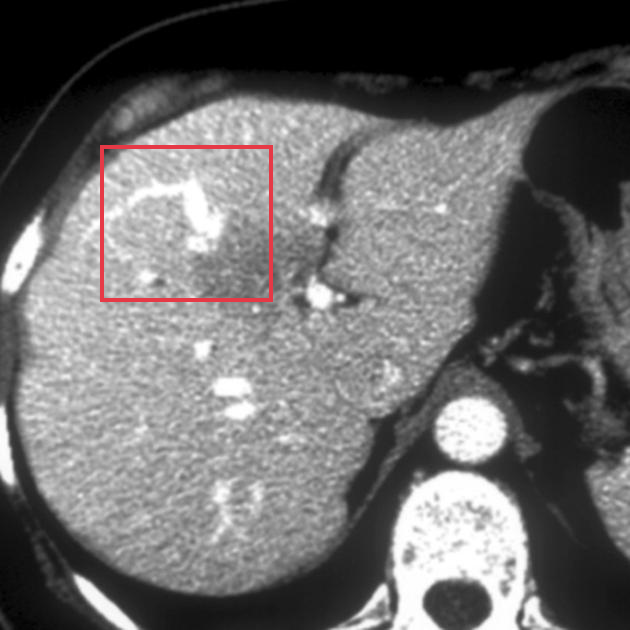

- **Modality / subcategory：** CT / Axial C+ portal venous phase
- **bbox_2d：** `[160, 231, 432, 478]`
- **Lingshu caption：** The liver is enlarged and contains multiple hypodense lesions. The largest lesion measures 2.5 cm and is located in segment 4. There is no evidence of vascular invasion.

### Finding 2: `study_000_ct_image_000_axial_c_portal_venous_phase_f02`

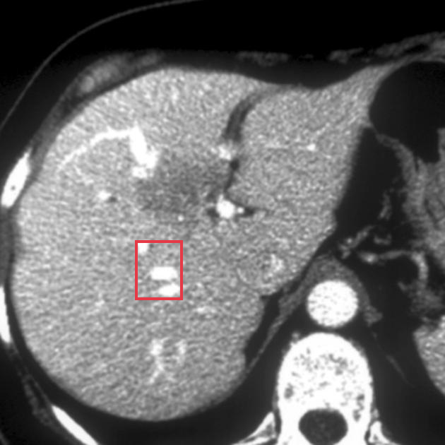

- **Modality / subcategory：** CT / Axial C+ portal venous phase
- **bbox_2d：** `[304, 541, 410, 674]`
- **Lingshu caption：** The liver is enlarged and contains multiple hypodense lesions. The largest lesion measures approximately 1.5 cm and is located in segment 4. There is no evidence of vascular invasion. No other focal lesions are identified. The spleen is unremarkable.

### Finding 3: `study_000_ct_image_000_axial_c_portal_venous_phase_f03`

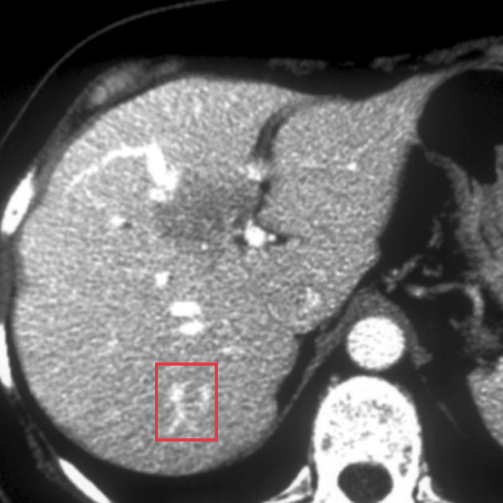

- **Modality / subcategory：** CT / Axial C+ portal venous phase
- **bbox_2d：** `[308, 722, 432, 877]`
- **Lingshu caption：** The liver is enlarged and demonstrates multiple hypodense lesions throughout all segments. The largest lesion measures 1.6 cm and is located in segment 7. There is no evidence of vascular invasion. No additional masses are identified.

### Finding 4: `study_001_ultrasound_image_000_missing_f01`

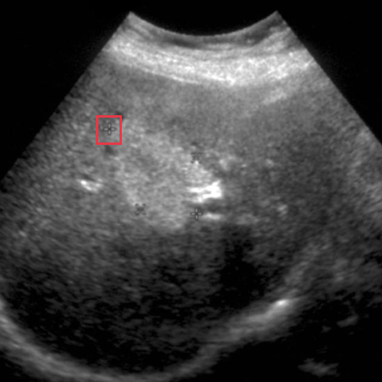

- **Modality / subcategory：** Ultrasound / missing
- **bbox_2d：** `[251, 302, 319, 378]`
- **Lingshu caption：** The liver parenchyma appears diffusely hyperechoic. The portal vein is dilated measuring 15 mm. There is no evidence of ascites.

### Finding 5: `study_001_ultrasound_image_000_missing_f02`

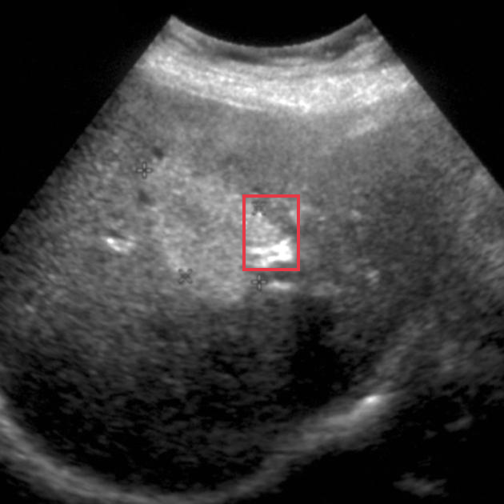

- **Modality / subcategory：** Ultrasound / missing
- **bbox_2d：** `[481, 387, 595, 537]`
- **Lingshu caption：** The liver parenchyma is diffusely hyperechoic. The portal vein is dilated measuring 15 mm. There is a small amount of ascites.

### Finding 6: `study_001_ultrasound_image_000_missing_f03`

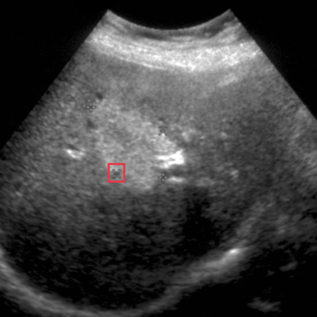

- **Modality / subcategory：** Ultrasound / missing
- **bbox_2d：** `[341, 515, 395, 576]`
- **Lingshu caption：** The liver parenchyma is diffusely hyperechoic and there is increased echogenicity anterior to the diaphragm consistent with chronic liver disease. There is a small hypoechoic lesion in segment 4A measuring approximately 1.0 cm.

### Finding 7: `study_002_mri_image_000_axial_t1_in_phase_f01`

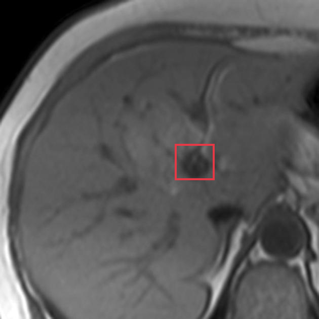

- **Modality / subcategory：** MRI / Axial T1 in-phase
- **bbox_2d：** `[548, 452, 673, 564]`
- **Lingshu caption：** The liver is enlarged and demonstrates diffuse abnormal signal intensity, which is most consistent with fatty infiltration. The spleen is also enlarged. There is a 1.5 cm focal area of low signal intensity in the left lobe of the liver, which may represent a simple cyst.

### Finding 8: `study_002_mri_image_000_axial_t1_in_phase_f02`

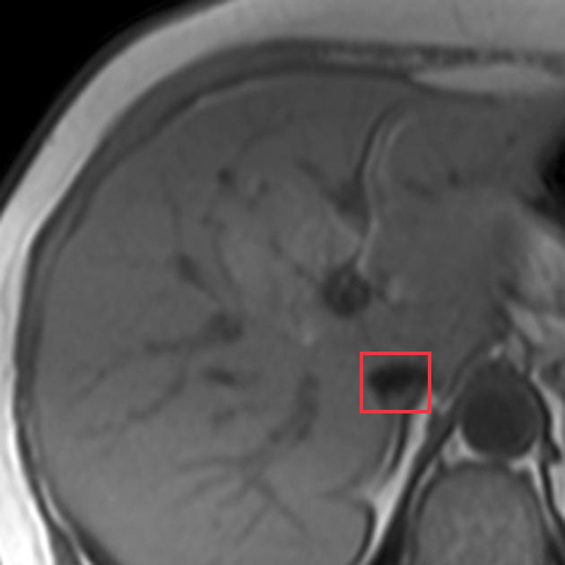

- **Modality / subcategory：** MRI / Axial T1 in-phase
- **bbox_2d：** `[637, 623, 762, 731]`
- **Lingshu caption：** The liver is enlarged and demonstrates diffuse abnormal signal intensity, which is most consistent with fatty infiltration. The spleen is also enlarged. There is a small amount of fluid in the right subphrenic space. No focal hepatic lesions are identified.

### Finding 9: `study_002_mri_image_000_axial_t1_in_phase_f03`

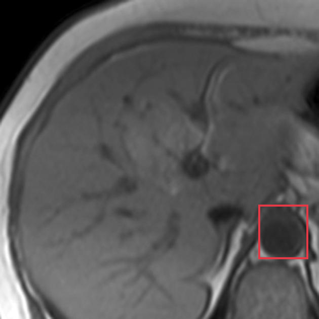

- **Modality / subcategory：** MRI / Axial T1 in-phase
- **bbox_2d：** `[810, 642, 966, 812]`
- **Lingshu caption：** The liver is enlarged and demonstrates diffuse abnormal signal intensity, which is most consistent with fatty infiltration. The spleen is also enlarged. There is a 2.5 cm lesion in the left lobe of the liver, which is hypointense on this T1 weighted image.

### Finding 10: `study_002_mri_image_001_axial_t1_out_of_phase_f01`

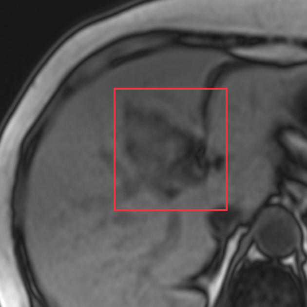

- **Modality / subcategory：** MRI / Axial T1 out-of-phase
- **bbox_2d：** `[370, 286, 740, 686]`
- **Lingshu caption：** The liver is enlarged and demonstrates diffuse decrease in signal intensity on this out of phase sequence consistent with hepatic steatosis. The boxed area demonstrates a focal area of decreased signal intensity which could represent a focal fatty change or a focal lesion such as a hemangioma.

### Finding 11: `study_002_mri_image_002_axial_t1_c_f01`

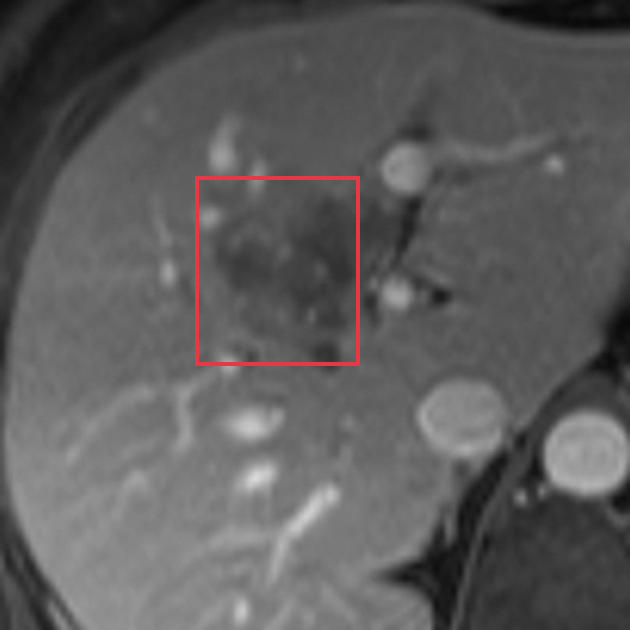

- **Modality / subcategory：** MRI / Axial T1 C+
- **bbox_2d：** `[310, 280, 570, 580]`
- **Lingshu caption：** The liver is enlarged. The hepatic parenchyma demonstrates diffuse nodularity. There is no focal lesion identified. The portal vein is prominent.

### Finding 12: `study_002_mri_image_003_axial_t2_f01`

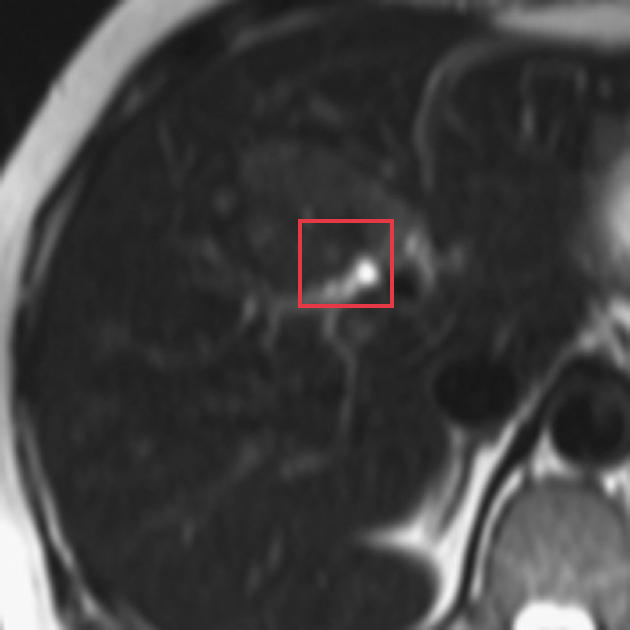

- **Modality / subcategory：** MRI / Axial T2
- **bbox_2d：** `[474, 348, 624, 488]`
- **Lingshu caption：** The liver is enlarged and demonstrates diffuse abnormal signal intensity, which is T2 hyperintense and T1 hypointense. The intrahepatic biliary ducts are dilated. There is also a small amount of fluid in the subcapsular region of the right lobe of the liver.

### Finding 13: `study_002_mri_image_004_axial_t2_fat_sat_f01`

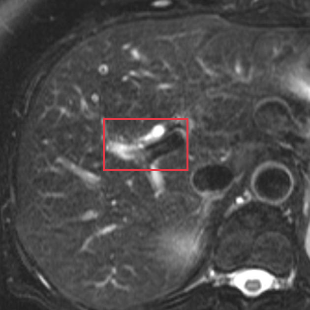

- **Modality / subcategory：** MRI / Axial T2 fat sat
- **bbox_2d：** `[333, 381, 607, 550]`
- **Lingshu caption：** The image shows a dilated common bile duct with a filling defect. The common bile duct appears to be enlarged and contains a distinct, well-defined structure within it, which could represent a stone or other obstructive lesion.

## Directed Cross-image Validation

### Anchor 1: `study_000_ct_image_000_axial_c_portal_venous_phase_f01`

**Anchor Lingshu caption：** The liver is enlarged and contains multiple hypodense lesions. The largest lesion measures 2.5 cm and is located in segment 4. There is no evidence of vascular invasion.

#### location_00001: NOT SUPPORT

<table>
<tr><th>Anchor original bbox</th><th>Target original image; model returned null</th><th>Existing target bbox: study_001_ultrasound_image_000_missing_f01</th><th>Existing target bbox: study_001_ultrasound_image_000_missing_f02</th><th>Existing target bbox: study_001_ultrasound_image_000_missing_f03</th></tr>
<tr><td></td><td></td><td></td><td></td><td></td></tr>
</table>

- **Target：** `study_001_ultrasound_image_000_missing`; Ultrasound; missing
- **Relation：** `bbox_to_image` / `not_support`
- **Returned target bbox：** `unknown`
- **Maximum IoU：** n/a; threshold=0.5
- **Strong relation IDs：** `[]`

**IoU matching：**

| Existing target bbox | IoU | Strong match | Lingshu caption |
|---|---:|---|---|
| `study_001_ultrasound_image_000_missing_f01`; `[251, 302, 319, 378]` | n/a | n/a | The liver parenchyma appears diffusely hyperechoic. The portal vein is dilated measuring 15 mm. There is no evidence of ascites. |
| `study_001_ultrasound_image_000_missing_f02`; `[481, 387, 595, 537]` | n/a | n/a | The liver parenchyma is diffusely hyperechoic. The portal vein is dilated measuring 15 mm. There is a small amount of ascites. |
| `study_001_ultrasound_image_000_missing_f03`; `[341, 515, 395, 576]` | n/a | n/a | The liver parenchyma is diffusely hyperechoic and there is increased echogenicity anterior to the diaphragm consistent with chronic liver disease. There is a small hypoechoic lesion in segment 4A measuring approximately 1.0 cm. |

#### location_00002: NOT SUPPORT

<table>
<tr><th>Anchor original bbox</th><th>Target original image; model returned null</th><th>Existing target bbox: study_002_mri_image_000_axial_t1_in_phase_f01</th><th>Existing target bbox: study_002_mri_image_000_axial_t1_in_phase_f02</th><th>Existing target bbox: study_002_mri_image_000_axial_t1_in_phase_f03</th></tr>
<tr><td></td><td>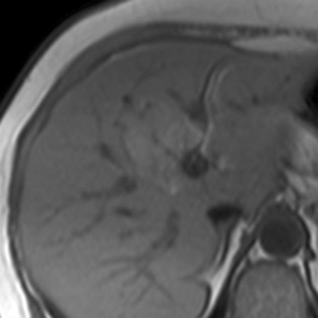</td><td></td><td></td><td></td></tr>
</table>

- **Target：** `study_002_mri_image_000_axial_t1_in_phase`; MRI; Axial T1 in-phase
- **Relation：** `bbox_to_image` / `not_support`
- **Returned target bbox：** `unknown`
- **Maximum IoU：** n/a; threshold=0.5
- **Strong relation IDs：** `[]`

**IoU matching：**

| Existing target bbox | IoU | Strong match | Lingshu caption |
|---|---:|---|---|
| `study_002_mri_image_000_axial_t1_in_phase_f01`; `[548, 452, 673, 564]` | n/a | n/a | The liver is enlarged and demonstrates diffuse abnormal signal intensity, which is most consistent with fatty infiltration. The spleen is also enlarged. There is a 1.5 cm focal area of low signal intensity in the left lobe of the liver, which may represent a simple cyst. |
| `study_002_mri_image_000_axial_t1_in_phase_f02`; `[637, 623, 762, 731]` | n/a | n/a | The liver is enlarged and demonstrates diffuse abnormal signal intensity, which is most consistent with fatty infiltration. The spleen is also enlarged. There is a small amount of fluid in the right subphrenic space. No focal hepatic lesions are identified. |
| `study_002_mri_image_000_axial_t1_in_phase_f03`; `[810, 642, 966, 812]` | n/a | n/a | The liver is enlarged and demonstrates diffuse abnormal signal intensity, which is most consistent with fatty infiltration. The spleen is also enlarged. There is a 2.5 cm lesion in the left lobe of the liver, which is hypointense on this T1 weighted image. |

#### location_00003: PARTIAL SUPPORT

<table>
<tr><th>Anchor original bbox</th><th>Cross-image grounded target bbox</th><th>Existing target bbox: study_002_mri_image_001_axial_t1_out_of_phase_f01</th></tr>
<tr><td></td><td>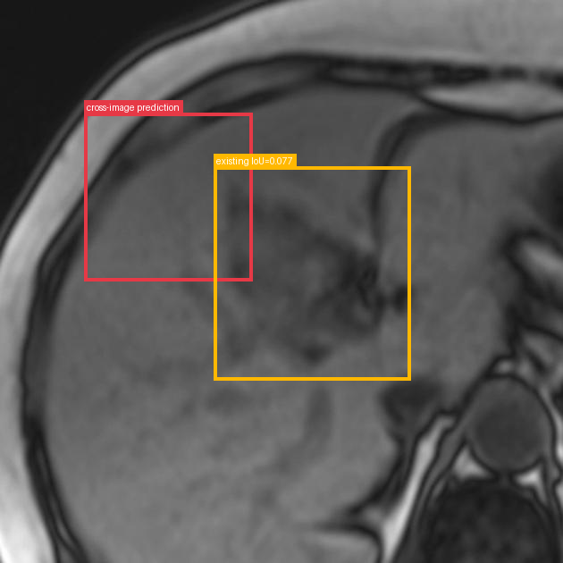</td><td></td></tr>
</table>

- **Target：** `study_002_mri_image_001_axial_t1_out_of_phase`; MRI; Axial T1 out-of-phase
- **Relation：** `bbox_to_image` / `partial_support`
- **Returned target bbox：** `[150, 200, 450, 500]`
- **Maximum IoU：** 0.077; threshold=0.5
- **Strong relation IDs：** `[]`

**IoU matching：**

| Existing target bbox | IoU | Strong match | Lingshu caption |
|---|---:|---|---|
| `study_002_mri_image_001_axial_t1_out_of_phase_f01`; `[370, 286, 740, 686]` | 0.077 | no | The liver is enlarged and demonstrates diffuse decrease in signal intensity on this out of phase sequence consistent with hepatic steatosis. The boxed area demonstrates a focal area of decreased signal intensity which could represent a focal fatty change or a focal lesion such as a hemangioma. |

**Target Lingshu caption：** unavailable. This is a newly re-grounded bbox and has not passed through Step 2 Lingshu captioning.

#### location_00004: PARTIAL SUPPORT

<table>
<tr><th>Anchor original bbox</th><th>Cross-image grounded target bbox</th><th>Existing target bbox: study_002_mri_image_002_axial_t1_c_f01</th></tr>
<tr><td></td><td>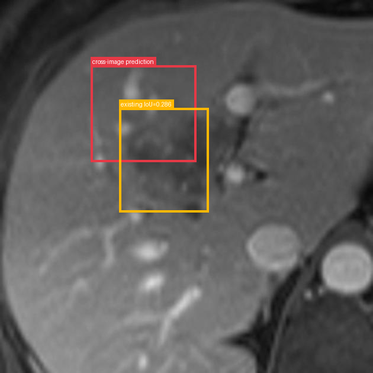</td><td></td></tr>
</table>

- **Target：** `study_002_mri_image_002_axial_t1_c`; MRI; Axial T1 C+
- **Relation：** `bbox_to_image` / `partial_support`
- **Returned target bbox：** `[244, 176, 528, 436]`
- **Maximum IoU：** 0.286; threshold=0.5
- **Strong relation IDs：** `[]`

**IoU matching：**

| Existing target bbox | IoU | Strong match | Lingshu caption |
|---|---:|---|---|
| `study_002_mri_image_002_axial_t1_c_f01`; `[310, 280, 570, 580]` | 0.286 | no | The liver is enlarged. The hepatic parenchyma demonstrates diffuse nodularity. There is no focal lesion identified. The portal vein is prominent. |

**Target Lingshu caption：** unavailable. This is a newly re-grounded bbox and has not passed through Step 2 Lingshu captioning.

#### location_00005: PARTIAL SUPPORT

<table>
<tr><th>Anchor original bbox</th><th>Cross-image grounded target bbox</th><th>Existing target bbox: study_002_mri_image_003_axial_t2_f01</th></tr>
<tr><td></td><td>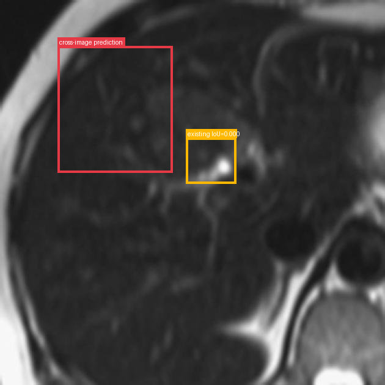</td><td></td></tr>
</table>

- **Target：** `study_002_mri_image_003_axial_t2`; MRI; Axial T2
- **Relation：** `bbox_to_image` / `partial_support`
- **Returned target bbox：** `[150, 120, 450, 450]`
- **Maximum IoU：** 0.000; threshold=0.5
- **Strong relation IDs：** `[]`

**IoU matching：**

| Existing target bbox | IoU | Strong match | Lingshu caption |
|---|---:|---|---|
| `study_002_mri_image_003_axial_t2_f01`; `[474, 348, 624, 488]` | 0.000 | no | The liver is enlarged and demonstrates diffuse abnormal signal intensity, which is T2 hyperintense and T1 hypointense. The intrahepatic biliary ducts are dilated. There is also a small amount of fluid in the subcapsular region of the right lobe of the liver. |

**Target Lingshu caption：** unavailable. This is a newly re-grounded bbox and has not passed through Step 2 Lingshu captioning.

#### location_00006: NOT SUPPORT

<table>
<tr><th>Anchor original bbox</th><th>Target original image; model returned null</th><th>Existing target bbox: study_002_mri_image_004_axial_t2_fat_sat_f01</th></tr>
<tr><td></td><td></td><td></td></tr>
</table>

- **Target：** `study_002_mri_image_004_axial_t2_fat_sat`; MRI; Axial T2 fat sat
- **Relation：** `bbox_to_image` / `not_support`
- **Returned target bbox：** `unknown`
- **Maximum IoU：** n/a; threshold=0.5
- **Strong relation IDs：** `[]`

**IoU matching：**

| Existing target bbox | IoU | Strong match | Lingshu caption |
|---|---:|---|---|
| `study_002_mri_image_004_axial_t2_fat_sat_f01`; `[333, 381, 607, 550]` | n/a | n/a | The image shows a dilated common bile duct with a filling defect. The common bile duct appears to be enlarged and contains a distinct, well-defined structure within it, which could represent a stone or other obstructive lesion. |

### Anchor 2: `study_000_ct_image_000_axial_c_portal_venous_phase_f02`

**Anchor Lingshu caption：** The liver is enlarged and contains multiple hypodense lesions. The largest lesion measures approximately 1.5 cm and is located in segment 4. There is no evidence of vascular invasion. No other focal lesions are identified. The spleen is unremarkable.

#### location_00007: NOT SUPPORT

<table>
<tr><th>Anchor original bbox</th><th>Target original image; model returned null</th><th>Existing target bbox: study_001_ultrasound_image_000_missing_f01</th><th>Existing target bbox: study_001_ultrasound_image_000_missing_f02</th><th>Existing target bbox: study_001_ultrasound_image_000_missing_f03</th></tr>
<tr><td></td><td></td><td></td><td></td><td></td></tr>
</table>

- **Target：** `study_001_ultrasound_image_000_missing`; Ultrasound; missing
- **Relation：** `bbox_to_image` / `not_support`
- **Returned target bbox：** `unknown`
- **Maximum IoU：** n/a; threshold=0.5
- **Strong relation IDs：** `[]`

**IoU matching：**

| Existing target bbox | IoU | Strong match | Lingshu caption |
|---|---:|---|---|
| `study_001_ultrasound_image_000_missing_f01`; `[251, 302, 319, 378]` | n/a | n/a | The liver parenchyma appears diffusely hyperechoic. The portal vein is dilated measuring 15 mm. There is no evidence of ascites. |
| `study_001_ultrasound_image_000_missing_f02`; `[481, 387, 595, 537]` | n/a | n/a | The liver parenchyma is diffusely hyperechoic. The portal vein is dilated measuring 15 mm. There is a small amount of ascites. |
| `study_001_ultrasound_image_000_missing_f03`; `[341, 515, 395, 576]` | n/a | n/a | The liver parenchyma is diffusely hyperechoic and there is increased echogenicity anterior to the diaphragm consistent with chronic liver disease. There is a small hypoechoic lesion in segment 4A measuring approximately 1.0 cm. |

#### location_00008: NOT SUPPORT

<table>
<tr><th>Anchor original bbox</th><th>Target original image; model returned null</th><th>Existing target bbox: study_002_mri_image_000_axial_t1_in_phase_f01</th><th>Existing target bbox: study_002_mri_image_000_axial_t1_in_phase_f02</th><th>Existing target bbox: study_002_mri_image_000_axial_t1_in_phase_f03</th></tr>
<tr><td></td><td></td><td></td><td></td><td></td></tr>
</table>

- **Target：** `study_002_mri_image_000_axial_t1_in_phase`; MRI; Axial T1 in-phase
- **Relation：** `bbox_to_image` / `not_support`
- **Returned target bbox：** `unknown`
- **Maximum IoU：** n/a; threshold=0.5
- **Strong relation IDs：** `[]`

**IoU matching：**

| Existing target bbox | IoU | Strong match | Lingshu caption |
|---|---:|---|---|
| `study_002_mri_image_000_axial_t1_in_phase_f01`; `[548, 452, 673, 564]` | n/a | n/a | The liver is enlarged and demonstrates diffuse abnormal signal intensity, which is most consistent with fatty infiltration. The spleen is also enlarged. There is a 1.5 cm focal area of low signal intensity in the left lobe of the liver, which may represent a simple cyst. |
| `study_002_mri_image_000_axial_t1_in_phase_f02`; `[637, 623, 762, 731]` | n/a | n/a | The liver is enlarged and demonstrates diffuse abnormal signal intensity, which is most consistent with fatty infiltration. The spleen is also enlarged. There is a small amount of fluid in the right subphrenic space. No focal hepatic lesions are identified. |
| `study_002_mri_image_000_axial_t1_in_phase_f03`; `[810, 642, 966, 812]` | n/a | n/a | The liver is enlarged and demonstrates diffuse abnormal signal intensity, which is most consistent with fatty infiltration. The spleen is also enlarged. There is a 2.5 cm lesion in the left lobe of the liver, which is hypointense on this T1 weighted image. |

#### location_00009: NOT SUPPORT

<table>
<tr><th>Anchor original bbox</th><th>Target original image; model returned null</th><th>Existing target bbox: study_002_mri_image_001_axial_t1_out_of_phase_f01</th></tr>
<tr><td></td><td>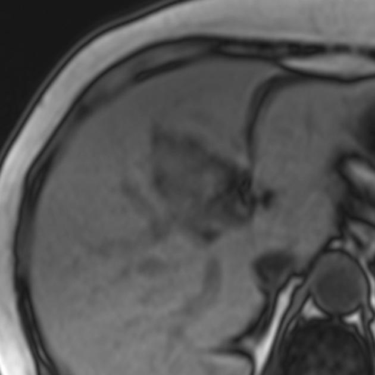</td><td></td></tr>
</table>

- **Target：** `study_002_mri_image_001_axial_t1_out_of_phase`; MRI; Axial T1 out-of-phase
- **Relation：** `bbox_to_image` / `not_support`
- **Returned target bbox：** `unknown`
- **Maximum IoU：** n/a; threshold=0.5
- **Strong relation IDs：** `[]`

**IoU matching：**

| Existing target bbox | IoU | Strong match | Lingshu caption |
|---|---:|---|---|
| `study_002_mri_image_001_axial_t1_out_of_phase_f01`; `[370, 286, 740, 686]` | n/a | n/a | The liver is enlarged and demonstrates diffuse decrease in signal intensity on this out of phase sequence consistent with hepatic steatosis. The boxed area demonstrates a focal area of decreased signal intensity which could represent a focal fatty change or a focal lesion such as a hemangioma. |

#### location_00010: PARTIAL SUPPORT

<table>
<tr><th>Anchor original bbox</th><th>Cross-image grounded target bbox</th><th>Existing target bbox: study_002_mri_image_002_axial_t1_c_f01</th></tr>
<tr><td></td><td>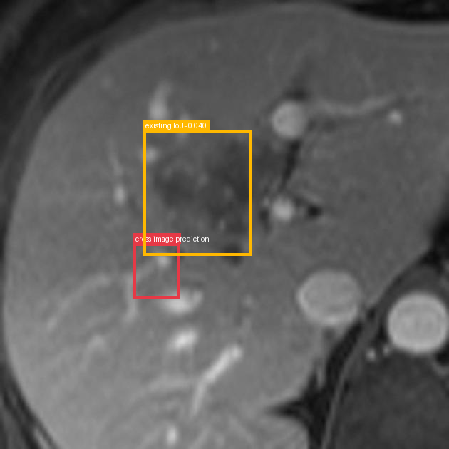</td><td></td></tr>
</table>

- **Target：** `study_002_mri_image_002_axial_t1_c`; MRI; Axial T1 C+
- **Relation：** `bbox_to_image` / `partial_support`
- **Returned target bbox：** `[298, 542, 402, 667]`
- **Maximum IoU：** 0.040; threshold=0.5
- **Strong relation IDs：** `[]`

**IoU matching：**

| Existing target bbox | IoU | Strong match | Lingshu caption |
|---|---:|---|---|
| `study_002_mri_image_002_axial_t1_c_f01`; `[310, 280, 570, 580]` | 0.040 | no | The liver is enlarged. The hepatic parenchyma demonstrates diffuse nodularity. There is no focal lesion identified. The portal vein is prominent. |

**Target Lingshu caption：** unavailable. This is a newly re-grounded bbox and has not passed through Step 2 Lingshu captioning.

#### location_00011: NOT SUPPORT

<table>
<tr><th>Anchor original bbox</th><th>Target original image; model returned null</th><th>Existing target bbox: study_002_mri_image_003_axial_t2_f01</th></tr>
<tr><td></td><td>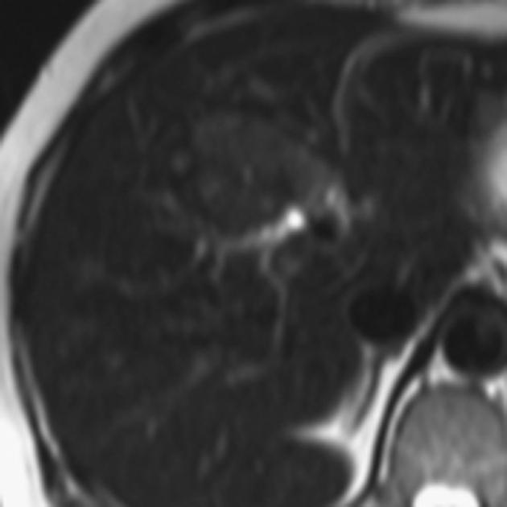</td><td></td></tr>
</table>

- **Target：** `study_002_mri_image_003_axial_t2`; MRI; Axial T2
- **Relation：** `bbox_to_image` / `not_support`
- **Returned target bbox：** `unknown`
- **Maximum IoU：** n/a; threshold=0.5
- **Strong relation IDs：** `[]`

**IoU matching：**

| Existing target bbox | IoU | Strong match | Lingshu caption |
|---|---:|---|---|
| `study_002_mri_image_003_axial_t2_f01`; `[474, 348, 624, 488]` | n/a | n/a | The liver is enlarged and demonstrates diffuse abnormal signal intensity, which is T2 hyperintense and T1 hypointense. The intrahepatic biliary ducts are dilated. There is also a small amount of fluid in the subcapsular region of the right lobe of the liver. |

#### location_00012: NOT SUPPORT

<table>
<tr><th>Anchor original bbox</th><th>Target original image; model returned null</th><th>Existing target bbox: study_002_mri_image_004_axial_t2_fat_sat_f01</th></tr>
<tr><td></td><td></td><td></td></tr>
</table>

- **Target：** `study_002_mri_image_004_axial_t2_fat_sat`; MRI; Axial T2 fat sat
- **Relation：** `bbox_to_image` / `not_support`
- **Returned target bbox：** `unknown`
- **Maximum IoU：** n/a; threshold=0.5
- **Strong relation IDs：** `[]`

**IoU matching：**

| Existing target bbox | IoU | Strong match | Lingshu caption |
|---|---:|---|---|
| `study_002_mri_image_004_axial_t2_fat_sat_f01`; `[333, 381, 607, 550]` | n/a | n/a | The image shows a dilated common bile duct with a filling defect. The common bile duct appears to be enlarged and contains a distinct, well-defined structure within it, which could represent a stone or other obstructive lesion. |

### Anchor 3: `study_000_ct_image_000_axial_c_portal_venous_phase_f03`

**Anchor Lingshu caption：** The liver is enlarged and demonstrates multiple hypodense lesions throughout all segments. The largest lesion measures 1.6 cm and is located in segment 7. There is no evidence of vascular invasion. No additional masses are identified.

#### location_00013: NOT SUPPORT

<table>
<tr><th>Anchor original bbox</th><th>Target original image; model returned null</th><th>Existing target bbox: study_001_ultrasound_image_000_missing_f01</th><th>Existing target bbox: study_001_ultrasound_image_000_missing_f02</th><th>Existing target bbox: study_001_ultrasound_image_000_missing_f03</th></tr>
<tr><td></td><td></td><td></td><td></td><td></td></tr>
</table>

- **Target：** `study_001_ultrasound_image_000_missing`; Ultrasound; missing
- **Relation：** `bbox_to_image` / `not_support`
- **Returned target bbox：** `unknown`
- **Maximum IoU：** n/a; threshold=0.5
- **Strong relation IDs：** `[]`

**IoU matching：**

| Existing target bbox | IoU | Strong match | Lingshu caption |
|---|---:|---|---|
| `study_001_ultrasound_image_000_missing_f01`; `[251, 302, 319, 378]` | n/a | n/a | The liver parenchyma appears diffusely hyperechoic. The portal vein is dilated measuring 15 mm. There is no evidence of ascites. |
| `study_001_ultrasound_image_000_missing_f02`; `[481, 387, 595, 537]` | n/a | n/a | The liver parenchyma is diffusely hyperechoic. The portal vein is dilated measuring 15 mm. There is a small amount of ascites. |
| `study_001_ultrasound_image_000_missing_f03`; `[341, 515, 395, 576]` | n/a | n/a | The liver parenchyma is diffusely hyperechoic and there is increased echogenicity anterior to the diaphragm consistent with chronic liver disease. There is a small hypoechoic lesion in segment 4A measuring approximately 1.0 cm. |

#### location_00014: NOT SUPPORT

<table>
<tr><th>Anchor original bbox</th><th>Target original image; model returned null</th><th>Existing target bbox: study_002_mri_image_000_axial_t1_in_phase_f01</th><th>Existing target bbox: study_002_mri_image_000_axial_t1_in_phase_f02</th><th>Existing target bbox: study_002_mri_image_000_axial_t1_in_phase_f03</th></tr>
<tr><td></td><td></td><td></td><td></td><td></td></tr>
</table>

- **Target：** `study_002_mri_image_000_axial_t1_in_phase`; MRI; Axial T1 in-phase
- **Relation：** `bbox_to_image` / `not_support`
- **Returned target bbox：** `unknown`
- **Maximum IoU：** n/a; threshold=0.5
- **Strong relation IDs：** `[]`

**IoU matching：**

| Existing target bbox | IoU | Strong match | Lingshu caption |
|---|---:|---|---|
| `study_002_mri_image_000_axial_t1_in_phase_f01`; `[548, 452, 673, 564]` | n/a | n/a | The liver is enlarged and demonstrates diffuse abnormal signal intensity, which is most consistent with fatty infiltration. The spleen is also enlarged. There is a 1.5 cm focal area of low signal intensity in the left lobe of the liver, which may represent a simple cyst. |
| `study_002_mri_image_000_axial_t1_in_phase_f02`; `[637, 623, 762, 731]` | n/a | n/a | The liver is enlarged and demonstrates diffuse abnormal signal intensity, which is most consistent with fatty infiltration. The spleen is also enlarged. There is a small amount of fluid in the right subphrenic space. No focal hepatic lesions are identified. |
| `study_002_mri_image_000_axial_t1_in_phase_f03`; `[810, 642, 966, 812]` | n/a | n/a | The liver is enlarged and demonstrates diffuse abnormal signal intensity, which is most consistent with fatty infiltration. The spleen is also enlarged. There is a 2.5 cm lesion in the left lobe of the liver, which is hypointense on this T1 weighted image. |

#### location_00015: PARTIAL SUPPORT

<table>
<tr><th>Anchor original bbox</th><th>Cross-image grounded target bbox</th><th>Existing target bbox: study_002_mri_image_001_axial_t1_out_of_phase_f01</th></tr>
<tr><td></td><td>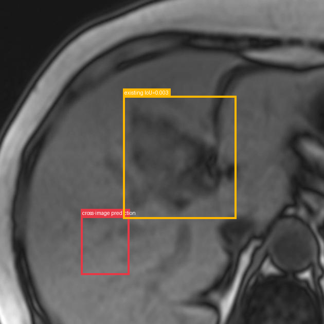</td><td></td></tr>
</table>

- **Target：** `study_002_mri_image_001_axial_t1_out_of_phase`; MRI; Axial T1 out-of-phase
- **Relation：** `bbox_to_image` / `partial_support`
- **Returned target bbox：** `[250, 667, 400, 850]`
- **Maximum IoU：** 0.003; threshold=0.5
- **Strong relation IDs：** `[]`

**IoU matching：**

| Existing target bbox | IoU | Strong match | Lingshu caption |
|---|---:|---|---|
| `study_002_mri_image_001_axial_t1_out_of_phase_f01`; `[370, 286, 740, 686]` | 0.003 | no | The liver is enlarged and demonstrates diffuse decrease in signal intensity on this out of phase sequence consistent with hepatic steatosis. The boxed area demonstrates a focal area of decreased signal intensity which could represent a focal fatty change or a focal lesion such as a hemangioma. |

**Target Lingshu caption：** unavailable. This is a newly re-grounded bbox and has not passed through Step 2 Lingshu captioning.

#### location_00016: PARTIAL SUPPORT

<table>
<tr><th>Anchor original bbox</th><th>Cross-image grounded target bbox</th><th>Existing target bbox: study_002_mri_image_002_axial_t1_c_f01</th></tr>
<tr><td></td><td>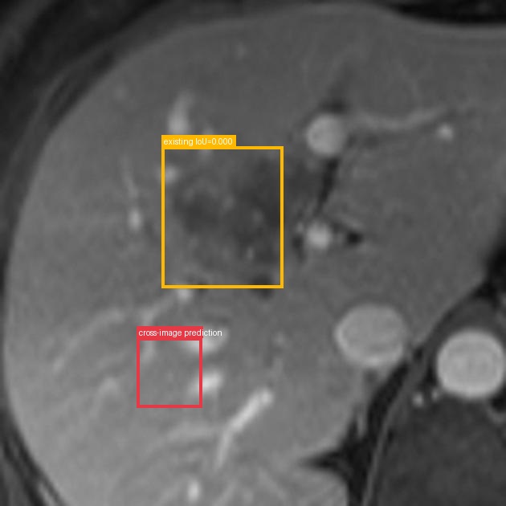</td><td></td></tr>
</table>

- **Target：** `study_002_mri_image_002_axial_t1_c`; MRI; Axial T1 C+
- **Relation：** `bbox_to_image` / `partial_support`
- **Returned target bbox：** `[270, 668, 400, 807]`
- **Maximum IoU：** 0.000; threshold=0.5
- **Strong relation IDs：** `[]`

**IoU matching：**

| Existing target bbox | IoU | Strong match | Lingshu caption |
|---|---:|---|---|
| `study_002_mri_image_002_axial_t1_c_f01`; `[310, 280, 570, 580]` | 0.000 | no | The liver is enlarged. The hepatic parenchyma demonstrates diffuse nodularity. There is no focal lesion identified. The portal vein is prominent. |

**Target Lingshu caption：** unavailable. This is a newly re-grounded bbox and has not passed through Step 2 Lingshu captioning.

#### location_00017: NOT SUPPORT

<table>
<tr><th>Anchor original bbox</th><th>Target original image; model returned null</th><th>Existing target bbox: study_002_mri_image_003_axial_t2_f01</th></tr>
<tr><td></td><td></td><td></td></tr>
</table>

- **Target：** `study_002_mri_image_003_axial_t2`; MRI; Axial T2
- **Relation：** `bbox_to_image` / `not_support`
- **Returned target bbox：** `unknown`
- **Maximum IoU：** n/a; threshold=0.5
- **Strong relation IDs：** `[]`

**IoU matching：**

| Existing target bbox | IoU | Strong match | Lingshu caption |
|---|---:|---|---|
| `study_002_mri_image_003_axial_t2_f01`; `[474, 348, 624, 488]` | n/a | n/a | The liver is enlarged and demonstrates diffuse abnormal signal intensity, which is T2 hyperintense and T1 hypointense. The intrahepatic biliary ducts are dilated. There is also a small amount of fluid in the subcapsular region of the right lobe of the liver. |

#### location_00018: NOT SUPPORT

<table>
<tr><th>Anchor original bbox</th><th>Target original image; model returned null</th><th>Existing target bbox: study_002_mri_image_004_axial_t2_fat_sat_f01</th></tr>
<tr><td></td><td></td><td></td></tr>
</table>

- **Target：** `study_002_mri_image_004_axial_t2_fat_sat`; MRI; Axial T2 fat sat
- **Relation：** `bbox_to_image` / `not_support`
- **Returned target bbox：** `unknown`
- **Maximum IoU：** n/a; threshold=0.5
- **Strong relation IDs：** `[]`

**IoU matching：**

| Existing target bbox | IoU | Strong match | Lingshu caption |
|---|---:|---|---|
| `study_002_mri_image_004_axial_t2_fat_sat_f01`; `[333, 381, 607, 550]` | n/a | n/a | The image shows a dilated common bile duct with a filling defect. The common bile duct appears to be enlarged and contains a distinct, well-defined structure within it, which could represent a stone or other obstructive lesion. |

### Anchor 4: `study_001_ultrasound_image_000_missing_f01`

**Anchor Lingshu caption：** The liver parenchyma appears diffusely hyperechoic. The portal vein is dilated measuring 15 mm. There is no evidence of ascites.

#### location_00019: NOT SUPPORT

<table>
<tr><th>Anchor original bbox</th><th>Target original image; model returned null</th><th>Existing target bbox: study_002_mri_image_000_axial_t1_in_phase_f01</th><th>Existing target bbox: study_002_mri_image_000_axial_t1_in_phase_f02</th><th>Existing target bbox: study_002_mri_image_000_axial_t1_in_phase_f03</th></tr>
<tr><td></td><td></td><td></td><td></td><td></td></tr>
</table>

- **Target：** `study_002_mri_image_000_axial_t1_in_phase`; MRI; Axial T1 in-phase
- **Relation：** `bbox_to_image` / `not_support`
- **Returned target bbox：** `unknown`
- **Maximum IoU：** n/a; threshold=0.5
- **Strong relation IDs：** `[]`

**IoU matching：**

| Existing target bbox | IoU | Strong match | Lingshu caption |
|---|---:|---|---|
| `study_002_mri_image_000_axial_t1_in_phase_f01`; `[548, 452, 673, 564]` | n/a | n/a | The liver is enlarged and demonstrates diffuse abnormal signal intensity, which is most consistent with fatty infiltration. The spleen is also enlarged. There is a 1.5 cm focal area of low signal intensity in the left lobe of the liver, which may represent a simple cyst. |
| `study_002_mri_image_000_axial_t1_in_phase_f02`; `[637, 623, 762, 731]` | n/a | n/a | The liver is enlarged and demonstrates diffuse abnormal signal intensity, which is most consistent with fatty infiltration. The spleen is also enlarged. There is a small amount of fluid in the right subphrenic space. No focal hepatic lesions are identified. |
| `study_002_mri_image_000_axial_t1_in_phase_f03`; `[810, 642, 966, 812]` | n/a | n/a | The liver is enlarged and demonstrates diffuse abnormal signal intensity, which is most consistent with fatty infiltration. The spleen is also enlarged. There is a 2.5 cm lesion in the left lobe of the liver, which is hypointense on this T1 weighted image. |

#### location_00020: NOT SUPPORT

<table>
<tr><th>Anchor original bbox</th><th>Target original image; model returned null</th><th>Existing target bbox: study_002_mri_image_001_axial_t1_out_of_phase_f01</th></tr>
<tr><td></td><td></td><td></td></tr>
</table>

- **Target：** `study_002_mri_image_001_axial_t1_out_of_phase`; MRI; Axial T1 out-of-phase
- **Relation：** `bbox_to_image` / `not_support`
- **Returned target bbox：** `unknown`
- **Maximum IoU：** n/a; threshold=0.5
- **Strong relation IDs：** `[]`

**IoU matching：**

| Existing target bbox | IoU | Strong match | Lingshu caption |
|---|---:|---|---|
| `study_002_mri_image_001_axial_t1_out_of_phase_f01`; `[370, 286, 740, 686]` | n/a | n/a | The liver is enlarged and demonstrates diffuse decrease in signal intensity on this out of phase sequence consistent with hepatic steatosis. The boxed area demonstrates a focal area of decreased signal intensity which could represent a focal fatty change or a focal lesion such as a hemangioma. |

#### location_00021: NOT SUPPORT

<table>
<tr><th>Anchor original bbox</th><th>Target original image; model returned null</th><th>Existing target bbox: study_002_mri_image_002_axial_t1_c_f01</th></tr>
<tr><td></td><td>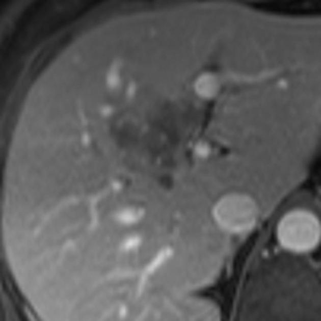</td><td></td></tr>
</table>

- **Target：** `study_002_mri_image_002_axial_t1_c`; MRI; Axial T1 C+
- **Relation：** `bbox_to_image` / `not_support`
- **Returned target bbox：** `unknown`
- **Maximum IoU：** n/a; threshold=0.5
- **Strong relation IDs：** `[]`

**IoU matching：**

| Existing target bbox | IoU | Strong match | Lingshu caption |
|---|---:|---|---|
| `study_002_mri_image_002_axial_t1_c_f01`; `[310, 280, 570, 580]` | n/a | n/a | The liver is enlarged. The hepatic parenchyma demonstrates diffuse nodularity. There is no focal lesion identified. The portal vein is prominent. |

#### location_00022: NOT SUPPORT

<table>
<tr><th>Anchor original bbox</th><th>Target original image; model returned null</th><th>Existing target bbox: study_002_mri_image_003_axial_t2_f01</th></tr>
<tr><td></td><td></td><td></td></tr>
</table>

- **Target：** `study_002_mri_image_003_axial_t2`; MRI; Axial T2
- **Relation：** `bbox_to_image` / `not_support`
- **Returned target bbox：** `unknown`
- **Maximum IoU：** n/a; threshold=0.5
- **Strong relation IDs：** `[]`

**IoU matching：**

| Existing target bbox | IoU | Strong match | Lingshu caption |
|---|---:|---|---|
| `study_002_mri_image_003_axial_t2_f01`; `[474, 348, 624, 488]` | n/a | n/a | The liver is enlarged and demonstrates diffuse abnormal signal intensity, which is T2 hyperintense and T1 hypointense. The intrahepatic biliary ducts are dilated. There is also a small amount of fluid in the subcapsular region of the right lobe of the liver. |

#### location_00023: NOT SUPPORT

<table>
<tr><th>Anchor original bbox</th><th>Target original image; model returned null</th><th>Existing target bbox: study_002_mri_image_004_axial_t2_fat_sat_f01</th></tr>
<tr><td></td><td></td><td></td></tr>
</table>

- **Target：** `study_002_mri_image_004_axial_t2_fat_sat`; MRI; Axial T2 fat sat
- **Relation：** `bbox_to_image` / `not_support`
- **Returned target bbox：** `unknown`
- **Maximum IoU：** n/a; threshold=0.5
- **Strong relation IDs：** `[]`

**IoU matching：**

| Existing target bbox | IoU | Strong match | Lingshu caption |
|---|---:|---|---|
| `study_002_mri_image_004_axial_t2_fat_sat_f01`; `[333, 381, 607, 550]` | n/a | n/a | The image shows a dilated common bile duct with a filling defect. The common bile duct appears to be enlarged and contains a distinct, well-defined structure within it, which could represent a stone or other obstructive lesion. |

### Anchor 5: `study_001_ultrasound_image_000_missing_f02`

**Anchor Lingshu caption：** The liver parenchyma is diffusely hyperechoic. The portal vein is dilated measuring 15 mm. There is a small amount of ascites.

#### location_00024: NOT SUPPORT

<table>
<tr><th>Anchor original bbox</th><th>Target original image; model returned null</th><th>Existing target bbox: study_002_mri_image_000_axial_t1_in_phase_f01</th><th>Existing target bbox: study_002_mri_image_000_axial_t1_in_phase_f02</th><th>Existing target bbox: study_002_mri_image_000_axial_t1_in_phase_f03</th></tr>
<tr><td></td><td></td><td></td><td></td><td></td></tr>
</table>

- **Target：** `study_002_mri_image_000_axial_t1_in_phase`; MRI; Axial T1 in-phase
- **Relation：** `bbox_to_image` / `not_support`
- **Returned target bbox：** `unknown`
- **Maximum IoU：** n/a; threshold=0.5
- **Strong relation IDs：** `[]`

**IoU matching：**

| Existing target bbox | IoU | Strong match | Lingshu caption |
|---|---:|---|---|
| `study_002_mri_image_000_axial_t1_in_phase_f01`; `[548, 452, 673, 564]` | n/a | n/a | The liver is enlarged and demonstrates diffuse abnormal signal intensity, which is most consistent with fatty infiltration. The spleen is also enlarged. There is a 1.5 cm focal area of low signal intensity in the left lobe of the liver, which may represent a simple cyst. |
| `study_002_mri_image_000_axial_t1_in_phase_f02`; `[637, 623, 762, 731]` | n/a | n/a | The liver is enlarged and demonstrates diffuse abnormal signal intensity, which is most consistent with fatty infiltration. The spleen is also enlarged. There is a small amount of fluid in the right subphrenic space. No focal hepatic lesions are identified. |
| `study_002_mri_image_000_axial_t1_in_phase_f03`; `[810, 642, 966, 812]` | n/a | n/a | The liver is enlarged and demonstrates diffuse abnormal signal intensity, which is most consistent with fatty infiltration. The spleen is also enlarged. There is a 2.5 cm lesion in the left lobe of the liver, which is hypointense on this T1 weighted image. |

#### location_00025: NOT SUPPORT

<table>
<tr><th>Anchor original bbox</th><th>Target original image; model returned null</th><th>Existing target bbox: study_002_mri_image_001_axial_t1_out_of_phase_f01</th></tr>
<tr><td></td><td></td><td></td></tr>
</table>

- **Target：** `study_002_mri_image_001_axial_t1_out_of_phase`; MRI; Axial T1 out-of-phase
- **Relation：** `bbox_to_image` / `not_support`
- **Returned target bbox：** `unknown`
- **Maximum IoU：** n/a; threshold=0.5
- **Strong relation IDs：** `[]`

**IoU matching：**

| Existing target bbox | IoU | Strong match | Lingshu caption |
|---|---:|---|---|
| `study_002_mri_image_001_axial_t1_out_of_phase_f01`; `[370, 286, 740, 686]` | n/a | n/a | The liver is enlarged and demonstrates diffuse decrease in signal intensity on this out of phase sequence consistent with hepatic steatosis. The boxed area demonstrates a focal area of decreased signal intensity which could represent a focal fatty change or a focal lesion such as a hemangioma. |

#### location_00026: NOT SUPPORT

<table>
<tr><th>Anchor original bbox</th><th>Target original image; model returned null</th><th>Existing target bbox: study_002_mri_image_002_axial_t1_c_f01</th></tr>
<tr><td></td><td></td><td></td></tr>
</table>

- **Target：** `study_002_mri_image_002_axial_t1_c`; MRI; Axial T1 C+
- **Relation：** `bbox_to_image` / `not_support`
- **Returned target bbox：** `unknown`
- **Maximum IoU：** n/a; threshold=0.5
- **Strong relation IDs：** `[]`

**IoU matching：**

| Existing target bbox | IoU | Strong match | Lingshu caption |
|---|---:|---|---|
| `study_002_mri_image_002_axial_t1_c_f01`; `[310, 280, 570, 580]` | n/a | n/a | The liver is enlarged. The hepatic parenchyma demonstrates diffuse nodularity. There is no focal lesion identified. The portal vein is prominent. |

#### location_00027: NOT SUPPORT

<table>
<tr><th>Anchor original bbox</th><th>Target original image; model returned null</th><th>Existing target bbox: study_002_mri_image_003_axial_t2_f01</th></tr>
<tr><td></td><td></td><td></td></tr>
</table>

- **Target：** `study_002_mri_image_003_axial_t2`; MRI; Axial T2
- **Relation：** `bbox_to_image` / `not_support`
- **Returned target bbox：** `unknown`
- **Maximum IoU：** n/a; threshold=0.5
- **Strong relation IDs：** `[]`

**IoU matching：**

| Existing target bbox | IoU | Strong match | Lingshu caption |
|---|---:|---|---|
| `study_002_mri_image_003_axial_t2_f01`; `[474, 348, 624, 488]` | n/a | n/a | The liver is enlarged and demonstrates diffuse abnormal signal intensity, which is T2 hyperintense and T1 hypointense. The intrahepatic biliary ducts are dilated. There is also a small amount of fluid in the subcapsular region of the right lobe of the liver. |

#### location_00028: NOT SUPPORT

<table>
<tr><th>Anchor original bbox</th><th>Target original image; model returned null</th><th>Existing target bbox: study_002_mri_image_004_axial_t2_fat_sat_f01</th></tr>
<tr><td></td><td></td><td></td></tr>
</table>

- **Target：** `study_002_mri_image_004_axial_t2_fat_sat`; MRI; Axial T2 fat sat
- **Relation：** `bbox_to_image` / `not_support`
- **Returned target bbox：** `unknown`
- **Maximum IoU：** n/a; threshold=0.5
- **Strong relation IDs：** `[]`

**IoU matching：**

| Existing target bbox | IoU | Strong match | Lingshu caption |
|---|---:|---|---|
| `study_002_mri_image_004_axial_t2_fat_sat_f01`; `[333, 381, 607, 550]` | n/a | n/a | The image shows a dilated common bile duct with a filling defect. The common bile duct appears to be enlarged and contains a distinct, well-defined structure within it, which could represent a stone or other obstructive lesion. |

### Anchor 6: `study_001_ultrasound_image_000_missing_f03`

**Anchor Lingshu caption：** The liver parenchyma is diffusely hyperechoic and there is increased echogenicity anterior to the diaphragm consistent with chronic liver disease. There is a small hypoechoic lesion in segment 4A measuring approximately 1.0 cm.

#### location_00029: NOT SUPPORT

<table>
<tr><th>Anchor original bbox</th><th>Target original image; model returned null</th><th>Existing target bbox: study_002_mri_image_000_axial_t1_in_phase_f01</th><th>Existing target bbox: study_002_mri_image_000_axial_t1_in_phase_f02</th><th>Existing target bbox: study_002_mri_image_000_axial_t1_in_phase_f03</th></tr>
<tr><td></td><td></td><td></td><td></td><td></td></tr>
</table>

- **Target：** `study_002_mri_image_000_axial_t1_in_phase`; MRI; Axial T1 in-phase
- **Relation：** `bbox_to_image` / `not_support`
- **Returned target bbox：** `unknown`
- **Maximum IoU：** n/a; threshold=0.5
- **Strong relation IDs：** `[]`

**IoU matching：**

| Existing target bbox | IoU | Strong match | Lingshu caption |
|---|---:|---|---|
| `study_002_mri_image_000_axial_t1_in_phase_f01`; `[548, 452, 673, 564]` | n/a | n/a | The liver is enlarged and demonstrates diffuse abnormal signal intensity, which is most consistent with fatty infiltration. The spleen is also enlarged. There is a 1.5 cm focal area of low signal intensity in the left lobe of the liver, which may represent a simple cyst. |
| `study_002_mri_image_000_axial_t1_in_phase_f02`; `[637, 623, 762, 731]` | n/a | n/a | The liver is enlarged and demonstrates diffuse abnormal signal intensity, which is most consistent with fatty infiltration. The spleen is also enlarged. There is a small amount of fluid in the right subphrenic space. No focal hepatic lesions are identified. |
| `study_002_mri_image_000_axial_t1_in_phase_f03`; `[810, 642, 966, 812]` | n/a | n/a | The liver is enlarged and demonstrates diffuse abnormal signal intensity, which is most consistent with fatty infiltration. The spleen is also enlarged. There is a 2.5 cm lesion in the left lobe of the liver, which is hypointense on this T1 weighted image. |

#### location_00030: NOT SUPPORT

<table>
<tr><th>Anchor original bbox</th><th>Target original image; model returned null</th><th>Existing target bbox: study_002_mri_image_001_axial_t1_out_of_phase_f01</th></tr>
<tr><td></td><td></td><td></td></tr>
</table>

- **Target：** `study_002_mri_image_001_axial_t1_out_of_phase`; MRI; Axial T1 out-of-phase
- **Relation：** `bbox_to_image` / `not_support`
- **Returned target bbox：** `unknown`
- **Maximum IoU：** n/a; threshold=0.5
- **Strong relation IDs：** `[]`

**IoU matching：**

| Existing target bbox | IoU | Strong match | Lingshu caption |
|---|---:|---|---|
| `study_002_mri_image_001_axial_t1_out_of_phase_f01`; `[370, 286, 740, 686]` | n/a | n/a | The liver is enlarged and demonstrates diffuse decrease in signal intensity on this out of phase sequence consistent with hepatic steatosis. The boxed area demonstrates a focal area of decreased signal intensity which could represent a focal fatty change or a focal lesion such as a hemangioma. |

#### location_00031: NOT SUPPORT

<table>
<tr><th>Anchor original bbox</th><th>Target original image; model returned null</th><th>Existing target bbox: study_002_mri_image_002_axial_t1_c_f01</th></tr>
<tr><td></td><td></td><td></td></tr>
</table>

- **Target：** `study_002_mri_image_002_axial_t1_c`; MRI; Axial T1 C+
- **Relation：** `bbox_to_image` / `not_support`
- **Returned target bbox：** `unknown`
- **Maximum IoU：** n/a; threshold=0.5
- **Strong relation IDs：** `[]`

**IoU matching：**

| Existing target bbox | IoU | Strong match | Lingshu caption |
|---|---:|---|---|
| `study_002_mri_image_002_axial_t1_c_f01`; `[310, 280, 570, 580]` | n/a | n/a | The liver is enlarged. The hepatic parenchyma demonstrates diffuse nodularity. There is no focal lesion identified. The portal vein is prominent. |

#### location_00032: NOT SUPPORT

<table>
<tr><th>Anchor original bbox</th><th>Target original image; model returned null</th><th>Existing target bbox: study_002_mri_image_003_axial_t2_f01</th></tr>
<tr><td></td><td></td><td></td></tr>
</table>

- **Target：** `study_002_mri_image_003_axial_t2`; MRI; Axial T2
- **Relation：** `bbox_to_image` / `not_support`
- **Returned target bbox：** `unknown`
- **Maximum IoU：** n/a; threshold=0.5
- **Strong relation IDs：** `[]`

**IoU matching：**

| Existing target bbox | IoU | Strong match | Lingshu caption |
|---|---:|---|---|
| `study_002_mri_image_003_axial_t2_f01`; `[474, 348, 624, 488]` | n/a | n/a | The liver is enlarged and demonstrates diffuse abnormal signal intensity, which is T2 hyperintense and T1 hypointense. The intrahepatic biliary ducts are dilated. There is also a small amount of fluid in the subcapsular region of the right lobe of the liver. |

#### location_00033: NOT SUPPORT

<table>
<tr><th>Anchor original bbox</th><th>Target original image; model returned null</th><th>Existing target bbox: study_002_mri_image_004_axial_t2_fat_sat_f01</th></tr>
<tr><td></td><td></td><td></td></tr>
</table>

- **Target：** `study_002_mri_image_004_axial_t2_fat_sat`; MRI; Axial T2 fat sat
- **Relation：** `bbox_to_image` / `not_support`
- **Returned target bbox：** `unknown`
- **Maximum IoU：** n/a; threshold=0.5
- **Strong relation IDs：** `[]`

**IoU matching：**

| Existing target bbox | IoU | Strong match | Lingshu caption |
|---|---:|---|---|
| `study_002_mri_image_004_axial_t2_fat_sat_f01`; `[333, 381, 607, 550]` | n/a | n/a | The image shows a dilated common bile duct with a filling defect. The common bile duct appears to be enlarged and contains a distinct, well-defined structure within it, which could represent a stone or other obstructive lesion. |

### Anchor 7: `study_002_mri_image_000_axial_t1_in_phase_f01`

**Anchor Lingshu caption：** The liver is enlarged and demonstrates diffuse abnormal signal intensity, which is most consistent with fatty infiltration. The spleen is also enlarged. There is a 1.5 cm focal area of low signal intensity in the left lobe of the liver, which may represent a simple cyst.

#### location_00034: PARTIAL SUPPORT

<table>
<tr><th>Anchor original bbox</th><th>Cross-image grounded target bbox</th><th>Existing target bbox: study_002_mri_image_001_axial_t1_out_of_phase_f01</th></tr>
<tr><td></td><td>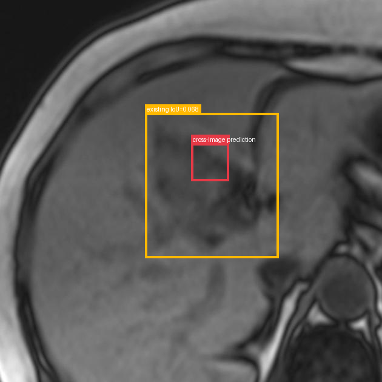</td><td></td></tr>
</table>

- **Target：** `study_002_mri_image_001_axial_t1_out_of_phase`; MRI; Axial T1 out-of-phase
- **Relation：** `bbox_to_image` / `partial_support`
- **Returned target bbox：** `[500, 375, 600, 475]`
- **Maximum IoU：** 0.068; threshold=0.5
- **Strong relation IDs：** `[]`

**IoU matching：**

| Existing target bbox | IoU | Strong match | Lingshu caption |
|---|---:|---|---|
| `study_002_mri_image_001_axial_t1_out_of_phase_f01`; `[370, 286, 740, 686]` | 0.068 | no | The liver is enlarged and demonstrates diffuse decrease in signal intensity on this out of phase sequence consistent with hepatic steatosis. The boxed area demonstrates a focal area of decreased signal intensity which could represent a focal fatty change or a focal lesion such as a hemangioma. |

**Target Lingshu caption：** unavailable. This is a newly re-grounded bbox and has not passed through Step 2 Lingshu captioning.

#### location_00035: PARTIAL SUPPORT

<table>
<tr><th>Anchor original bbox</th><th>Cross-image grounded target bbox</th><th>Existing target bbox: study_002_mri_image_002_axial_t1_c_f01</th></tr>
<tr><td></td><td>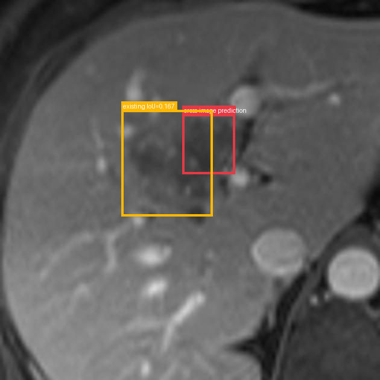</td><td></td></tr>
</table>

- **Target：** `study_002_mri_image_002_axial_t1_c`; MRI; Axial T1 C+
- **Relation：** `bbox_to_image` / `partial_support`
- **Returned target bbox：** `[480, 300, 620, 460]`
- **Maximum IoU：** 0.167; threshold=0.5
- **Strong relation IDs：** `[]`

**IoU matching：**

| Existing target bbox | IoU | Strong match | Lingshu caption |
|---|---:|---|---|
| `study_002_mri_image_002_axial_t1_c_f01`; `[310, 280, 570, 580]` | 0.167 | no | The liver is enlarged. The hepatic parenchyma demonstrates diffuse nodularity. There is no focal lesion identified. The portal vein is prominent. |

**Target Lingshu caption：** unavailable. This is a newly re-grounded bbox and has not passed through Step 2 Lingshu captioning.

#### location_00036: STRONG SUPPORT

<table>
<tr><th>Anchor original bbox</th><th>Cross-image grounded target bbox</th><th>Existing target bbox: study_002_mri_image_003_axial_t2_f01</th></tr>
<tr><td></td><td>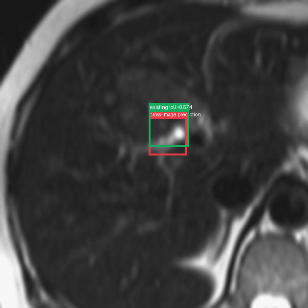</td><td></td></tr>
</table>

- **Target：** `study_002_mri_image_003_axial_t2`; MRI; Axial T2
- **Relation：** `bbox_to_bbox` / `strong_support`
- **Returned target bbox：** `[484, 381, 608, 505]`
- **Maximum IoU：** 0.574; threshold=0.5
- **Strong relation IDs：** `[&#x27;strong_location_00036_01&#x27;]`

**IoU matching：**

| Existing target bbox | IoU | Strong match | Lingshu caption |
|---|---:|---|---|
| `study_002_mri_image_003_axial_t2_f01`; `[474, 348, 624, 488]` | 0.574 | yes | The liver is enlarged and demonstrates diffuse abnormal signal intensity, which is T2 hyperintense and T1 hypointense. The intrahepatic biliary ducts are dilated. There is also a small amount of fluid in the subcapsular region of the right lobe of the liver. |

#### location_00037: NOT SUPPORT

<table>
<tr><th>Anchor original bbox</th><th>Target original image; model returned null</th><th>Existing target bbox: study_002_mri_image_004_axial_t2_fat_sat_f01</th></tr>
<tr><td></td><td></td><td></td></tr>
</table>

- **Target：** `study_002_mri_image_004_axial_t2_fat_sat`; MRI; Axial T2 fat sat
- **Relation：** `bbox_to_image` / `not_support`
- **Returned target bbox：** `unknown`
- **Maximum IoU：** n/a; threshold=0.5
- **Strong relation IDs：** `[]`

**IoU matching：**

| Existing target bbox | IoU | Strong match | Lingshu caption |
|---|---:|---|---|
| `study_002_mri_image_004_axial_t2_fat_sat_f01`; `[333, 381, 607, 550]` | n/a | n/a | The image shows a dilated common bile duct with a filling defect. The common bile duct appears to be enlarged and contains a distinct, well-defined structure within it, which could represent a stone or other obstructive lesion. |

### Anchor 8: `study_002_mri_image_000_axial_t1_in_phase_f02`

**Anchor Lingshu caption：** The liver is enlarged and demonstrates diffuse abnormal signal intensity, which is most consistent with fatty infiltration. The spleen is also enlarged. There is a small amount of fluid in the right subphrenic space. No focal hepatic lesions are identified.

#### location_00038: PARTIAL SUPPORT

<table>
<tr><th>Anchor original bbox</th><th>Cross-image grounded target bbox</th><th>Existing target bbox: study_002_mri_image_001_axial_t1_out_of_phase_f01</th></tr>
<tr><td></td><td>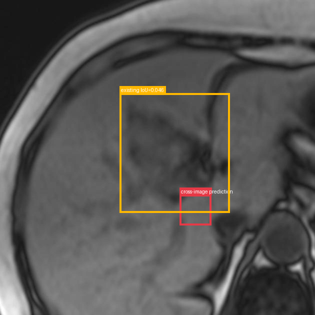</td><td></td></tr>
</table>

- **Target：** `study_002_mri_image_001_axial_t1_out_of_phase`; MRI; Axial T1 out-of-phase
- **Relation：** `bbox_to_image` / `partial_support`
- **Returned target bbox：** `[570, 618, 672, 716]`
- **Maximum IoU：** 0.046; threshold=0.5
- **Strong relation IDs：** `[]`

**IoU matching：**

| Existing target bbox | IoU | Strong match | Lingshu caption |
|---|---:|---|---|
| `study_002_mri_image_001_axial_t1_out_of_phase_f01`; `[370, 286, 740, 686]` | 0.046 | no | The liver is enlarged and demonstrates diffuse decrease in signal intensity on this out of phase sequence consistent with hepatic steatosis. The boxed area demonstrates a focal area of decreased signal intensity which could represent a focal fatty change or a focal lesion such as a hemangioma. |

**Target Lingshu caption：** unavailable. This is a newly re-grounded bbox and has not passed through Step 2 Lingshu captioning.

#### location_00039: PARTIAL SUPPORT

<table>
<tr><th>Anchor original bbox</th><th>Cross-image grounded target bbox</th><th>Existing target bbox: study_002_mri_image_002_axial_t1_c_f01</th></tr>
<tr><td></td><td>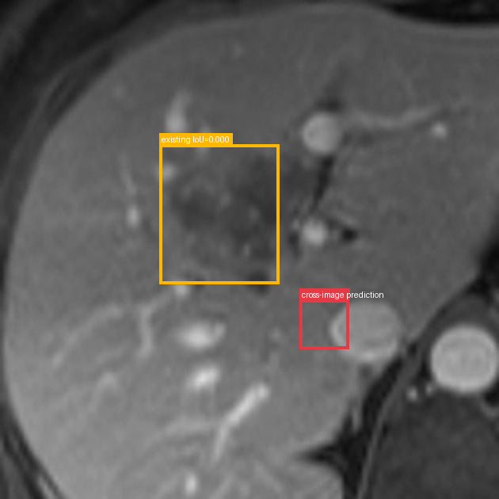</td><td></td></tr>
</table>

- **Target：** `study_002_mri_image_002_axial_t1_c`; MRI; Axial T1 C+
- **Relation：** `bbox_to_image` / `partial_support`
- **Returned target bbox：** `[600, 600, 700, 700]`
- **Maximum IoU：** 0.000; threshold=0.5
- **Strong relation IDs：** `[]`

**IoU matching：**

| Existing target bbox | IoU | Strong match | Lingshu caption |
|---|---:|---|---|
| `study_002_mri_image_002_axial_t1_c_f01`; `[310, 280, 570, 580]` | 0.000 | no | The liver is enlarged. The hepatic parenchyma demonstrates diffuse nodularity. There is no focal lesion identified. The portal vein is prominent. |

**Target Lingshu caption：** unavailable. This is a newly re-grounded bbox and has not passed through Step 2 Lingshu captioning.

#### location_00040: PARTIAL SUPPORT

<table>
<tr><th>Anchor original bbox</th><th>Cross-image grounded target bbox</th><th>Existing target bbox: study_002_mri_image_003_axial_t2_f01</th></tr>
<tr><td></td><td>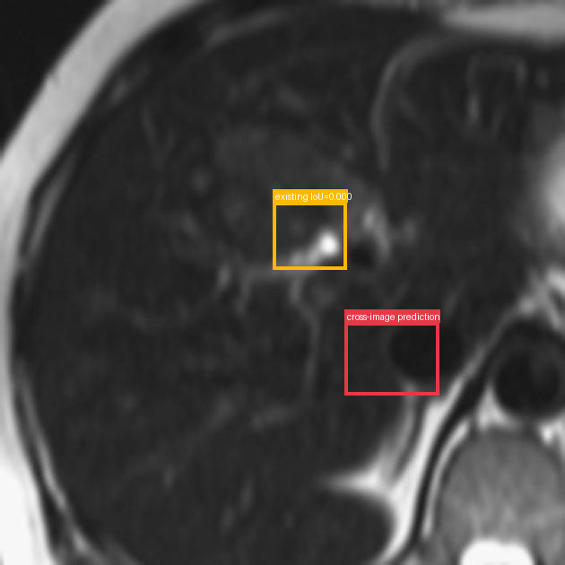</td><td></td></tr>
</table>

- **Target：** `study_002_mri_image_003_axial_t2`; MRI; Axial T2
- **Relation：** `bbox_to_image` / `partial_support`
- **Returned target bbox：** `[610, 570, 778, 700]`
- **Maximum IoU：** 0.000; threshold=0.5
- **Strong relation IDs：** `[]`

**IoU matching：**

| Existing target bbox | IoU | Strong match | Lingshu caption |
|---|---:|---|---|
| `study_002_mri_image_003_axial_t2_f01`; `[474, 348, 624, 488]` | 0.000 | no | The liver is enlarged and demonstrates diffuse abnormal signal intensity, which is T2 hyperintense and T1 hypointense. The intrahepatic biliary ducts are dilated. There is also a small amount of fluid in the subcapsular region of the right lobe of the liver. |

**Target Lingshu caption：** unavailable. This is a newly re-grounded bbox and has not passed through Step 2 Lingshu captioning.

#### location_00041: NOT SUPPORT

<table>
<tr><th>Anchor original bbox</th><th>Target original image; model returned null</th><th>Existing target bbox: study_002_mri_image_004_axial_t2_fat_sat_f01</th></tr>
<tr><td></td><td></td><td></td></tr>
</table>

- **Target：** `study_002_mri_image_004_axial_t2_fat_sat`; MRI; Axial T2 fat sat
- **Relation：** `bbox_to_image` / `not_support`
- **Returned target bbox：** `unknown`
- **Maximum IoU：** n/a; threshold=0.5
- **Strong relation IDs：** `[]`

**IoU matching：**

| Existing target bbox | IoU | Strong match | Lingshu caption |
|---|---:|---|---|
| `study_002_mri_image_004_axial_t2_fat_sat_f01`; `[333, 381, 607, 550]` | n/a | n/a | The image shows a dilated common bile duct with a filling defect. The common bile duct appears to be enlarged and contains a distinct, well-defined structure within it, which could represent a stone or other obstructive lesion. |

### Anchor 9: `study_002_mri_image_000_axial_t1_in_phase_f03`

**Anchor Lingshu caption：** The liver is enlarged and demonstrates diffuse abnormal signal intensity, which is most consistent with fatty infiltration. The spleen is also enlarged. There is a 2.5 cm lesion in the left lobe of the liver, which is hypointense on this T1 weighted image.

#### location_00042: PARTIAL SUPPORT

<table>
<tr><th>Anchor original bbox</th><th>Cross-image grounded target bbox</th><th>Existing target bbox: study_002_mri_image_001_axial_t1_out_of_phase_f01</th></tr>
<tr><td></td><td>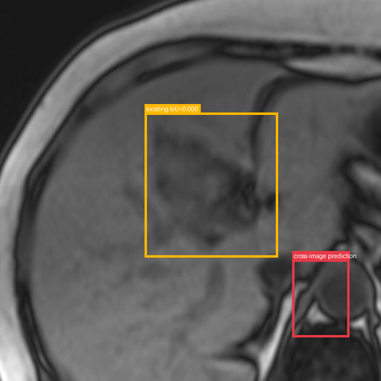</td><td></td></tr>
</table>

- **Target：** `study_002_mri_image_001_axial_t1_out_of_phase`; MRI; Axial T1 out-of-phase
- **Relation：** `bbox_to_image` / `partial_support`
- **Returned target bbox：** `[768, 682, 918, 886]`
- **Maximum IoU：** 0.000; threshold=0.5
- **Strong relation IDs：** `[]`

**IoU matching：**

| Existing target bbox | IoU | Strong match | Lingshu caption |
|---|---:|---|---|
| `study_002_mri_image_001_axial_t1_out_of_phase_f01`; `[370, 286, 740, 686]` | 0.000 | no | The liver is enlarged and demonstrates diffuse decrease in signal intensity on this out of phase sequence consistent with hepatic steatosis. The boxed area demonstrates a focal area of decreased signal intensity which could represent a focal fatty change or a focal lesion such as a hemangioma. |

**Target Lingshu caption：** unavailable. This is a newly re-grounded bbox and has not passed through Step 2 Lingshu captioning.

#### location_00043: NOT SUPPORT

<table>
<tr><th>Anchor original bbox</th><th>Target original image; model returned null</th><th>Existing target bbox: study_002_mri_image_002_axial_t1_c_f01</th></tr>
<tr><td></td><td></td><td></td></tr>
</table>

- **Target：** `study_002_mri_image_002_axial_t1_c`; MRI; Axial T1 C+
- **Relation：** `bbox_to_image` / `not_support`
- **Returned target bbox：** `unknown`
- **Maximum IoU：** n/a; threshold=0.5
- **Strong relation IDs：** `[]`

**IoU matching：**

| Existing target bbox | IoU | Strong match | Lingshu caption |
|---|---:|---|---|
| `study_002_mri_image_002_axial_t1_c_f01`; `[310, 280, 570, 580]` | n/a | n/a | The liver is enlarged. The hepatic parenchyma demonstrates diffuse nodularity. There is no focal lesion identified. The portal vein is prominent. |

#### location_00044: NOT SUPPORT

<table>
<tr><th>Anchor original bbox</th><th>Target original image; model returned null</th><th>Existing target bbox: study_002_mri_image_003_axial_t2_f01</th></tr>
<tr><td></td><td></td><td></td></tr>
</table>

- **Target：** `study_002_mri_image_003_axial_t2`; MRI; Axial T2
- **Relation：** `bbox_to_image` / `not_support`
- **Returned target bbox：** `unknown`
- **Maximum IoU：** n/a; threshold=0.5
- **Strong relation IDs：** `[]`

**IoU matching：**

| Existing target bbox | IoU | Strong match | Lingshu caption |
|---|---:|---|---|
| `study_002_mri_image_003_axial_t2_f01`; `[474, 348, 624, 488]` | n/a | n/a | The liver is enlarged and demonstrates diffuse abnormal signal intensity, which is T2 hyperintense and T1 hypointense. The intrahepatic biliary ducts are dilated. There is also a small amount of fluid in the subcapsular region of the right lobe of the liver. |

#### location_00045: NOT SUPPORT

<table>
<tr><th>Anchor original bbox</th><th>Target original image; model returned null</th><th>Existing target bbox: study_002_mri_image_004_axial_t2_fat_sat_f01</th></tr>
<tr><td></td><td></td><td></td></tr>
</table>

- **Target：** `study_002_mri_image_004_axial_t2_fat_sat`; MRI; Axial T2 fat sat
- **Relation：** `bbox_to_image` / `not_support`
- **Returned target bbox：** `unknown`
- **Maximum IoU：** n/a; threshold=0.5
- **Strong relation IDs：** `[]`

**IoU matching：**

| Existing target bbox | IoU | Strong match | Lingshu caption |
|---|---:|---|---|
| `study_002_mri_image_004_axial_t2_fat_sat_f01`; `[333, 381, 607, 550]` | n/a | n/a | The image shows a dilated common bile duct with a filling defect. The common bile duct appears to be enlarged and contains a distinct, well-defined structure within it, which could represent a stone or other obstructive lesion. |

### Anchor 10: `study_002_mri_image_001_axial_t1_out_of_phase_f01`

**Anchor Lingshu caption：** The liver is enlarged and demonstrates diffuse decrease in signal intensity on this out of phase sequence consistent with hepatic steatosis. The boxed area demonstrates a focal area of decreased signal intensity which could represent a focal fatty change or a focal lesion such as a hemangioma.

#### location_00046: STRONG SUPPORT

<table>
<tr><th>Anchor original bbox</th><th>Cross-image grounded target bbox</th><th>Existing target bbox: study_002_mri_image_002_axial_t1_c_f01</th></tr>
<tr><td></td><td>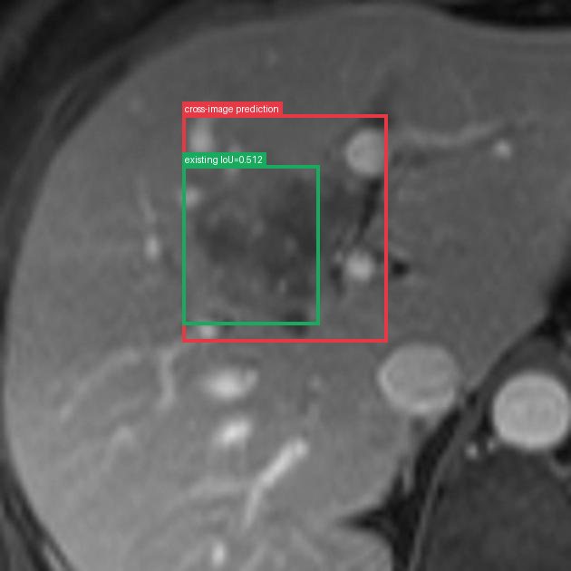</td><td></td></tr>
</table>

- **Target：** `study_002_mri_image_002_axial_t1_c`; MRI; Axial T1 C+
- **Relation：** `bbox_to_bbox` / `strong_support`
- **Returned target bbox：** `[320, 200, 680, 600]`
- **Maximum IoU：** 0.512; threshold=0.5
- **Strong relation IDs：** `[&#x27;strong_location_00046_01&#x27;]`

**IoU matching：**

| Existing target bbox | IoU | Strong match | Lingshu caption |
|---|---:|---|---|
| `study_002_mri_image_002_axial_t1_c_f01`; `[310, 280, 570, 580]` | 0.512 | yes | The liver is enlarged. The hepatic parenchyma demonstrates diffuse nodularity. There is no focal lesion identified. The portal vein is prominent. |

#### location_00047: PARTIAL SUPPORT

<table>
<tr><th>Anchor original bbox</th><th>Cross-image grounded target bbox</th><th>Existing target bbox: study_002_mri_image_003_axial_t2_f01</th></tr>
<tr><td></td><td>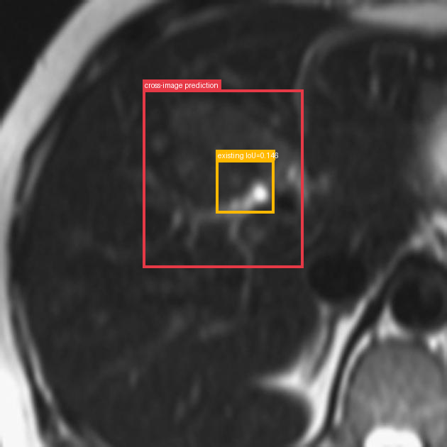</td><td></td></tr>
</table>

- **Target：** `study_002_mri_image_003_axial_t2`; MRI; Axial T2
- **Relation：** `bbox_to_image` / `partial_support`
- **Returned target bbox：** `[320, 200, 680, 600]`
- **Maximum IoU：** 0.146; threshold=0.5
- **Strong relation IDs：** `[]`

**IoU matching：**

| Existing target bbox | IoU | Strong match | Lingshu caption |
|---|---:|---|---|
| `study_002_mri_image_003_axial_t2_f01`; `[474, 348, 624, 488]` | 0.146 | no | The liver is enlarged and demonstrates diffuse abnormal signal intensity, which is T2 hyperintense and T1 hypointense. The intrahepatic biliary ducts are dilated. There is also a small amount of fluid in the subcapsular region of the right lobe of the liver. |

**Target Lingshu caption：** unavailable. This is a newly re-grounded bbox and has not passed through Step 2 Lingshu captioning.

#### location_00048: NOT SUPPORT

<table>
<tr><th>Anchor original bbox</th><th>Target original image; model returned null</th><th>Existing target bbox: study_002_mri_image_004_axial_t2_fat_sat_f01</th></tr>
<tr><td></td><td></td><td></td></tr>
</table>

- **Target：** `study_002_mri_image_004_axial_t2_fat_sat`; MRI; Axial T2 fat sat
- **Relation：** `bbox_to_image` / `not_support`
- **Returned target bbox：** `unknown`
- **Maximum IoU：** n/a; threshold=0.5
- **Strong relation IDs：** `[]`

**IoU matching：**

| Existing target bbox | IoU | Strong match | Lingshu caption |
|---|---:|---|---|
| `study_002_mri_image_004_axial_t2_fat_sat_f01`; `[333, 381, 607, 550]` | n/a | n/a | The image shows a dilated common bile duct with a filling defect. The common bile duct appears to be enlarged and contains a distinct, well-defined structure within it, which could represent a stone or other obstructive lesion. |

## Dynamically Skipped Anchors

| Anchor node | Reused strong relations | Skipped target images |
|---|---|---|
| `study_002_mri_image_002_axial_t1_c_f01` | `[&#x27;strong_location_00046_01&#x27;]` | `[&#x27;study_002_mri_image_003_axial_t2&#x27;, &#x27;study_002_mri_image_004_axial_t2_fat_sat&#x27;]` |
| `study_002_mri_image_003_axial_t2_f01` | `[&#x27;strong_location_00036_01&#x27;]` | `[&#x27;study_002_mri_image_004_axial_t2_fat_sat&#x27;]` |
