# Gastric band induced megaesophagus presenting as a neck mass

[返回 Step 3 总览](../README_STEP3_VISUALIZATION.md)

- **Case ID：** `gastric-band-induced-megaoesophagus-presenting-as-a-neck-mass`
- **Case URL：** [https://radiopaedia.org/cases/gastric-band-induced-megaoesophagus-presenting-as-a-neck-mass?lang=us](https://radiopaedia.org/cases/gastric-band-induced-megaoesophagus-presenting-as-a-neck-mass?lang=us)
- **验证模型：** Qwen3-VL-8B
- **图像 / Step 2 findings：** 6 / 5
- **定位结果：** strong 0；partial 3；not support 8；parse error 0
- **Strong bbox relations：** 0
- **原始 JSON：** [case_evidence.json](../assets_step3/gastric-band-induced-megaoesophagus-presenting-as-a-neck-mass/case_evidence.json)

**Overlay 图例：** 红框为跨图新定位；绿框为 IoU >= 0.5 的已有 bbox；黄框为未达到阈值的已有 bbox。

## Step 2 Finding Nodes

### Finding 1: `study_000_ultrasound_image_000_missing_f01`

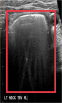

- **Modality / subcategory：** Ultrasound / missing
- **bbox_2d：** `[100, 100, 900, 900]`
- **Lingshu caption：** The image shows a transverse view of the neck. The boxed region appears to be located in the left side of the neck. Within this region, there is a hypoechoic area that could represent a lymph node or other soft tissue structure. The borders of this area are somewhat irregular, which may indicate an abnormality. Surrounding tissues appear relatively homogeneous without obvious signs of inflammation or other abnormalities.
- **中文翻译：** 图像为颈部横断面。框内区域似位于左颈部，其中可见低回声区，可能为淋巴结或其他软组织结构。其边缘略不规则，可能提示异常。周围组织相对均匀，未见明显炎症或其他异常。

### Finding 2: `study_001_ct_image_000_axial_non_contrast_f01`

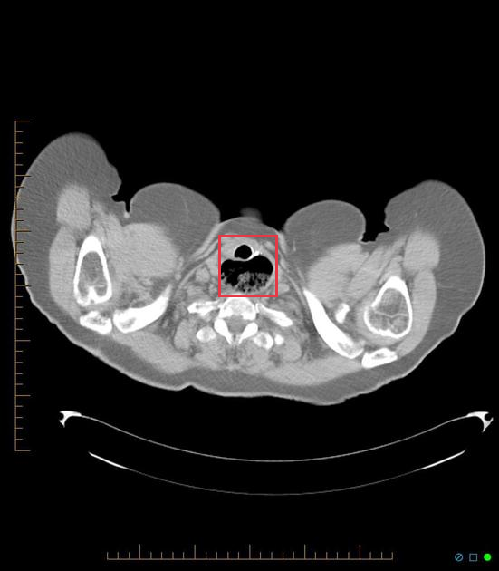

- **Modality / subcategory：** CT / Axial non-contrast
- **bbox_2d：** `[439, 412, 556, 520]`
- **Lingshu caption：** The red box is located in the midline at the level of the trachea. Within this area there is a large amount of air present in the soft tissues of the neck. There is also extensive subcutaneous emphysema throughout the chest wall bilaterally.
- **中文翻译：** 红框位于气管水平的中线区域。该处颈部软组织内可见大量气体，双侧胸壁还可见广泛皮下气肿。

### Finding 3: `study_001_ct_image_001_coronal_non_contrast_f01`

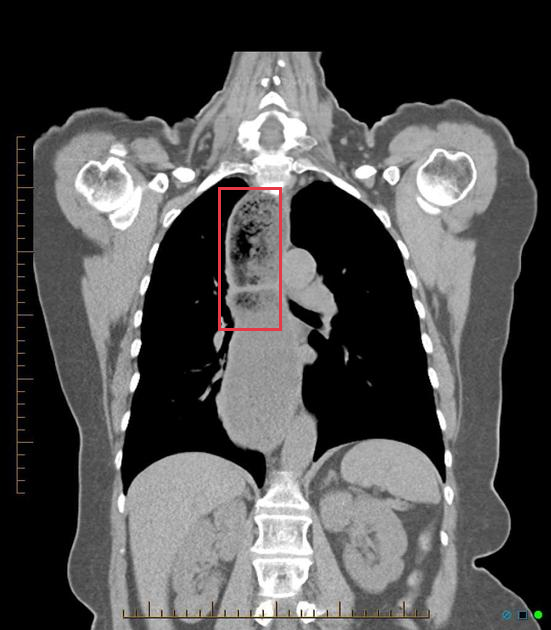

- **Modality / subcategory：** CT / Coronal non-contrast
- **bbox_2d：** `[396, 298, 511, 524]`
- **Lingshu caption：** The right upper lobe demonstrates a large area of consolidation with air bronchograms. There is also a small amount of peribronchial cuffing. The left lung is clear. The cardiomediastinal silhouette is unremarkable. No pleural effusions or pneumothorax.
- **中文翻译：** 右上叶可见大片实变并有空气支气管征，另见少量支气管周围袖套征。左肺清晰。心纵隔轮廓未见异常。未见胸腔积液或气胸。

### Finding 4: `study_001_ct_image_002_oblique_non_contrast_f01`

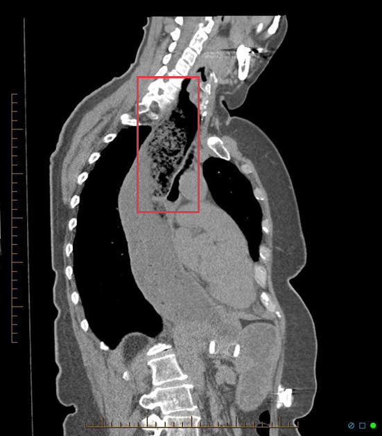

- **Modality / subcategory：** CT / Oblique non-contrast
- **bbox_2d：** `[359, 175, 521, 488]`
- **Lingshu caption：** The oblique non-contrast CT image shows a marked region in the upper thoracic area, specifically involving the trachea and surrounding structures. Within this region, there appears to be a significant narrowing of the tracheal lumen, which could indicate stenosis. The tracheal walls seem thickened, and there is evidence of irregularity in the tracheal contour. Adjacent to the trachea, there is a noticeable mass-like structure that may be causing compression or displacement of the trachea. This mass appears to have heterogeneous density, suggesting possible involvement of soft tissue or other pathological processes. The surrounding mediastinal structures, including the esophagus and major blood vessels, do not show obvious abnormalities in this view. The lung fields appear clear without any evident consolidation, effusion, or masses. The bony structures, including the vertebrae and ribs, are intact without signs of fractures or lesions.
- **中文翻译：** 斜位平扫 CT 显示上胸部标记区域，主要涉及气管及周围结构。该区域内气管腔明显狭窄，可能提示狭窄；气管壁似增厚，轮廓不规则。气管旁可见肿块样结构，可能压迫或推移气管。该肿块密度不均，提示可能涉及软组织或其他病理过程。本层面所见食管和大血管等周围纵隔结构无明显异常。肺野清晰，未见实变、积液或肿块。椎骨和肋骨完整，未见骨折或病灶。

### Finding 5: `study_002_fluoroscopy_image_000_missing_f01`

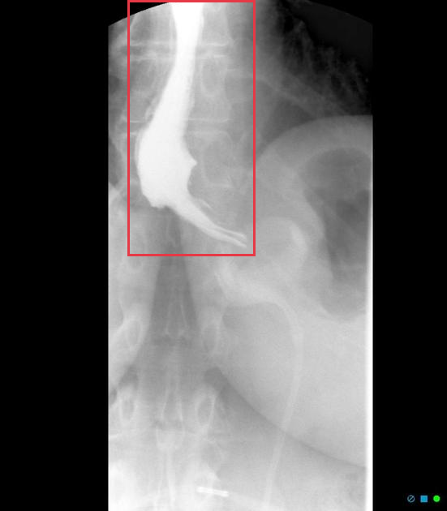

- **Modality / subcategory：** Fluoroscopy / missing
- **bbox_2d：** `[286, 1, 571, 500]`
- **Lingshu caption：** The esophagus is mildly dilated with a tapered narrowing at the gastroesophageal junction. There is no evidence of retained contrast in the esophagus 15 minutes after ingestion.
- **中文翻译：** 食管轻度扩张，胃食管交界处呈渐细性狭窄。吞服造影剂 15 分钟后未见造影剂滞留于食管。

## Directed Cross-image Validation

### Anchor 1: `study_000_ultrasound_image_000_missing_f01`

**Anchor Lingshu caption：** The image shows a transverse view of the neck. The boxed region appears to be located in the left side of the neck. Within this region, there is a hypoechoic area that could represent a lymph node or other soft tissue structure. The borders of this area are somewhat irregular, which may indicate an abnormality. Surrounding tissues appear relatively homogeneous without obvious signs of inflammation or other abnormalities.
**Anchor caption 中文翻译：** 图像为颈部横断面。框内区域似位于左颈部，其中可见低回声区，可能为淋巴结或其他软组织结构。其边缘略不规则，可能提示异常。周围组织相对均匀，未见明显炎症或其他异常。

#### location_00001: PARTIAL SUPPORT

<table>
<tr><th>Anchor original bbox</th><th>Cross-image grounded target bbox</th></tr>
<tr><td></td><td>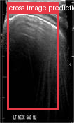</td></tr>
</table>

- **Target：** `study_000_ultrasound_image_001_missing`; Ultrasound; missing
- **Relation：** `bbox_to_image` / `partial_support`
- **Returned target bbox：** `[100, 100, 800, 900]`
- **Maximum IoU：** n/a; threshold=0.5
- **Strong relation IDs：** `[]`

**IoU matching：**

The target image has no existing Step 2 bbox.

**B 图单红框（Lingshu 实际输入）：**

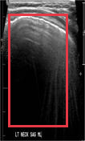

**Re-ground Lingshu caption：** The image shows a transverse view of the neck. The boxed region appears to be the left side of the neck. Within this region, there is a hypoechoic area that could represent a lymph node or other soft tissue structure. The borders of this area are somewhat indistinct, suggesting possible pathology. Surrounding tissues appear relatively homogeneous without obvious signs of inflammation or mass effect.
**Re-ground caption 中文翻译：** 图像为颈部横断面。框内似位于左颈部，其中可见低回声区，可能为淋巴结或其他软组织结构。其边界略模糊，提示可能存在病变。周围组织相对均匀，未见明显炎症或占位效应。

#### location_00002: NOT SUPPORT

<table>
<tr><th>Anchor original bbox</th><th>Target original image; model returned null</th><th>Existing target bbox: study_001_ct_image_000_axial_non_contrast_f01</th></tr>
<tr><td></td><td>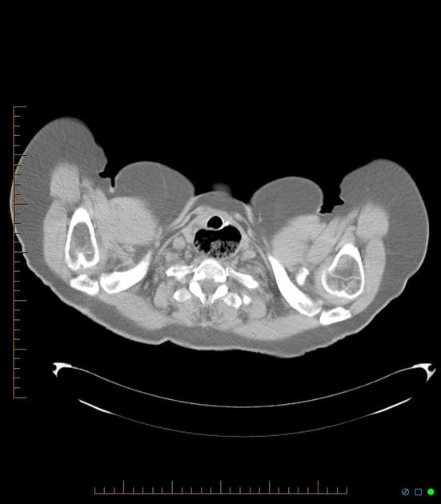</td><td></td></tr>
</table>

- **Target：** `study_001_ct_image_000_axial_non_contrast`; CT; Axial non-contrast
- **Relation：** `bbox_to_image` / `not_support`
- **Returned target bbox：** `unknown`
- **Maximum IoU：** n/a; threshold=0.5
- **Strong relation IDs：** `[]`

**IoU matching：**

| Existing target bbox | IoU | Strong match | Lingshu caption | 中文翻译 |
|---|---:|---|---|---|
| `study_001_ct_image_000_axial_non_contrast_f01`; `[439, 412, 556, 520]` | n/a | n/a | The red box is located in the midline at the level of the trachea. Within this area there is a large amount of air present in the soft tissues of the neck. There is also extensive subcutaneous emphysema throughout the chest wall bilaterally. | 红框位于气管水平的中线区域。该处颈部软组织内可见大量气体，双侧胸壁还可见广泛皮下气肿。 |

#### location_00003: NOT SUPPORT

<table>
<tr><th>Anchor original bbox</th><th>Target original image; model returned null</th><th>Existing target bbox: study_001_ct_image_001_coronal_non_contrast_f01</th></tr>
<tr><td></td><td>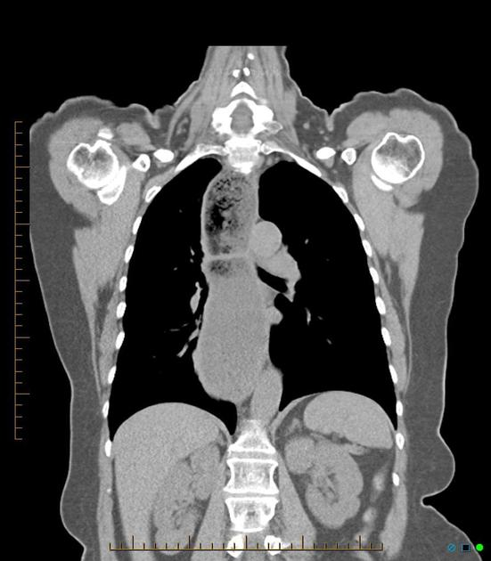</td><td></td></tr>
</table>

- **Target：** `study_001_ct_image_001_coronal_non_contrast`; CT; Coronal non-contrast
- **Relation：** `bbox_to_image` / `not_support`
- **Returned target bbox：** `unknown`
- **Maximum IoU：** n/a; threshold=0.5
- **Strong relation IDs：** `[]`

**IoU matching：**

| Existing target bbox | IoU | Strong match | Lingshu caption | 中文翻译 |
|---|---:|---|---|---|
| `study_001_ct_image_001_coronal_non_contrast_f01`; `[396, 298, 511, 524]` | n/a | n/a | The right upper lobe demonstrates a large area of consolidation with air bronchograms. There is also a small amount of peribronchial cuffing. The left lung is clear. The cardiomediastinal silhouette is unremarkable. No pleural effusions or pneumothorax. | 右上叶可见大片实变并有空气支气管征，另见少量支气管周围袖套征。左肺清晰。心纵隔轮廓未见异常。未见胸腔积液或气胸。 |

#### location_00004: NOT SUPPORT

<table>
<tr><th>Anchor original bbox</th><th>Target original image; model returned null</th><th>Existing target bbox: study_001_ct_image_002_oblique_non_contrast_f01</th></tr>
<tr><td></td><td>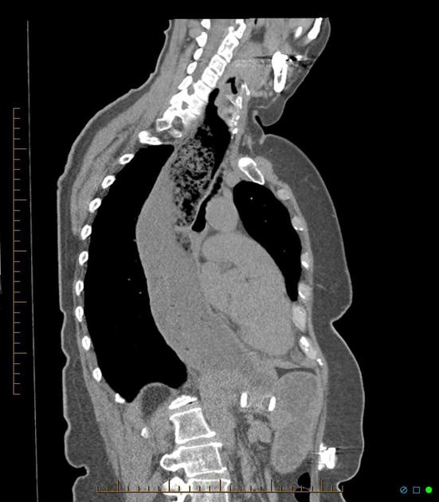</td><td></td></tr>
</table>

- **Target：** `study_001_ct_image_002_oblique_non_contrast`; CT; Oblique non-contrast
- **Relation：** `bbox_to_image` / `not_support`
- **Returned target bbox：** `unknown`
- **Maximum IoU：** n/a; threshold=0.5
- **Strong relation IDs：** `[]`

**IoU matching：**

| Existing target bbox | IoU | Strong match | Lingshu caption | 中文翻译 |
|---|---:|---|---|---|
| `study_001_ct_image_002_oblique_non_contrast_f01`; `[359, 175, 521, 488]` | n/a | n/a | The oblique non-contrast CT image shows a marked region in the upper thoracic area, specifically involving the trachea and surrounding structures. Within this region, there appears to be a significant narrowing of the tracheal lumen, which could indicate stenosis. The tracheal walls seem thickened, and there is evidence of irregularity in the tracheal contour. Adjacent to the trachea, there is a noticeable mass-like structure that may be causing compression or displacement of the trachea. This mass appears to have heterogeneous density, suggesting possible involvement of soft tissue or other pathological processes. The surrounding mediastinal structures, including the esophagus and major blood vessels, do not show obvious abnormalities in this view. The lung fields appear clear without any evident consolidation, effusion, or masses. The bony structures, including the vertebrae and ribs, are intact without signs of fractures or lesions. | 斜位平扫 CT 显示上胸部标记区域，主要涉及气管及周围结构。该区域内气管腔明显狭窄，可能提示狭窄；气管壁似增厚，轮廓不规则。气管旁可见肿块样结构，可能压迫或推移气管。该肿块密度不均，提示可能涉及软组织或其他病理过程。本层面所见食管和大血管等周围纵隔结构无明显异常。肺野清晰，未见实变、积液或肿块。椎骨和肋骨完整，未见骨折或病灶。 |

#### location_00005: NOT SUPPORT

<table>
<tr><th>Anchor original bbox</th><th>Target original image; model returned null</th><th>Existing target bbox: study_002_fluoroscopy_image_000_missing_f01</th></tr>
<tr><td></td><td>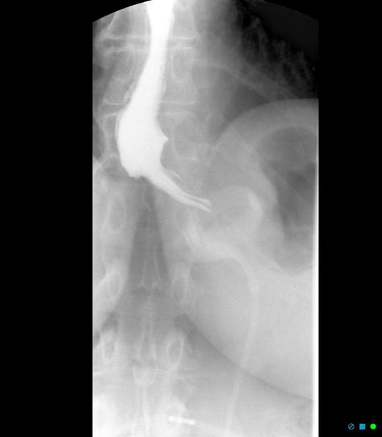</td><td></td></tr>
</table>

- **Target：** `study_002_fluoroscopy_image_000_missing`; Fluoroscopy; missing
- **Relation：** `bbox_to_image` / `not_support`
- **Returned target bbox：** `unknown`
- **Maximum IoU：** n/a; threshold=0.5
- **Strong relation IDs：** `[]`

**IoU matching：**

| Existing target bbox | IoU | Strong match | Lingshu caption | 中文翻译 |
|---|---:|---|---|---|
| `study_002_fluoroscopy_image_000_missing_f01`; `[286, 1, 571, 500]` | n/a | n/a | The esophagus is mildly dilated with a tapered narrowing at the gastroesophageal junction. There is no evidence of retained contrast in the esophagus 15 minutes after ingestion. | 食管轻度扩张，胃食管交界处呈渐细性狭窄。吞服造影剂 15 分钟后未见造影剂滞留于食管。 |

### Anchor 2: `study_001_ct_image_000_axial_non_contrast_f01`

**Anchor Lingshu caption：** The red box is located in the midline at the level of the trachea. Within this area there is a large amount of air present in the soft tissues of the neck. There is also extensive subcutaneous emphysema throughout the chest wall bilaterally.
**Anchor caption 中文翻译：** 红框位于气管水平的中线区域。该处颈部软组织内可见大量气体，双侧胸壁还可见广泛皮下气肿。

#### location_00006: NOT SUPPORT

<table>
<tr><th>Anchor original bbox</th><th>Target original image; model returned null</th><th>Existing target bbox: study_001_ct_image_001_coronal_non_contrast_f01</th></tr>
<tr><td></td><td></td><td></td></tr>
</table>

- **Target：** `study_001_ct_image_001_coronal_non_contrast`; CT; Coronal non-contrast
- **Relation：** `bbox_to_image` / `not_support`
- **Returned target bbox：** `unknown`
- **Maximum IoU：** n/a; threshold=0.5
- **Strong relation IDs：** `[]`

**IoU matching：**

| Existing target bbox | IoU | Strong match | Lingshu caption | 中文翻译 |
|---|---:|---|---|---|
| `study_001_ct_image_001_coronal_non_contrast_f01`; `[396, 298, 511, 524]` | n/a | n/a | The right upper lobe demonstrates a large area of consolidation with air bronchograms. There is also a small amount of peribronchial cuffing. The left lung is clear. The cardiomediastinal silhouette is unremarkable. No pleural effusions or pneumothorax. | 右上叶可见大片实变并有空气支气管征，另见少量支气管周围袖套征。左肺清晰。心纵隔轮廓未见异常。未见胸腔积液或气胸。 |

#### location_00007: PARTIAL SUPPORT

<table>
<tr><th>Anchor original bbox</th><th>Cross-image grounded target bbox</th><th>Existing target bbox: study_001_ct_image_002_oblique_non_contrast_f01</th></tr>
<tr><td></td><td>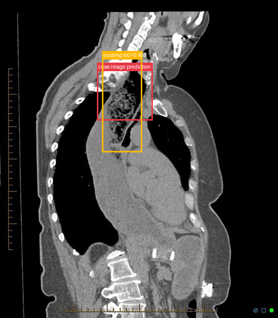</td><td></td></tr>
</table>

- **Target：** `study_001_ct_image_002_oblique_non_contrast`; CT; Oblique non-contrast
- **Relation：** `bbox_to_image` / `partial_support`
- **Returned target bbox：** `[350, 220, 550, 380]`
- **Maximum IoU：** 0.458; threshold=0.5
- **Strong relation IDs：** `[]`

**IoU matching：**

| Existing target bbox | IoU | Strong match | Lingshu caption | 中文翻译 |
|---|---:|---|---|---|
| `study_001_ct_image_002_oblique_non_contrast_f01`; `[359, 175, 521, 488]` | 0.458 | no | The oblique non-contrast CT image shows a marked region in the upper thoracic area, specifically involving the trachea and surrounding structures. Within this region, there appears to be a significant narrowing of the tracheal lumen, which could indicate stenosis. The tracheal walls seem thickened, and there is evidence of irregularity in the tracheal contour. Adjacent to the trachea, there is a noticeable mass-like structure that may be causing compression or displacement of the trachea. This mass appears to have heterogeneous density, suggesting possible involvement of soft tissue or other pathological processes. The surrounding mediastinal structures, including the esophagus and major blood vessels, do not show obvious abnormalities in this view. The lung fields appear clear without any evident consolidation, effusion, or masses. The bony structures, including the vertebrae and ribs, are intact without signs of fractures or lesions. | 斜位平扫 CT 显示上胸部标记区域，主要涉及气管及周围结构。该区域内气管腔明显狭窄，可能提示狭窄；气管壁似增厚，轮廓不规则。气管旁可见肿块样结构，可能压迫或推移气管。该肿块密度不均，提示可能涉及软组织或其他病理过程。本层面所见食管和大血管等周围纵隔结构无明显异常。肺野清晰，未见实变、积液或肿块。椎骨和肋骨完整，未见骨折或病灶。 |

**B 图单红框（Lingshu 实际输入）：**

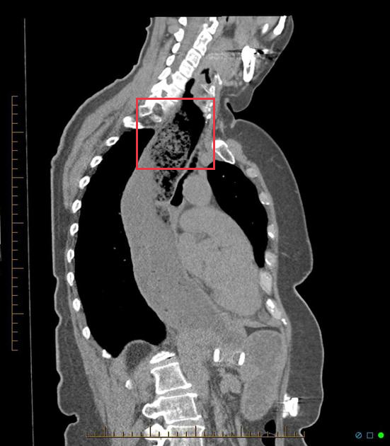

**Re-ground Lingshu caption：** The oblique non-contrast CT image shows a region of interest marked by a red bounding box located in the upper thoracic area. Within this region, there appears to be a mass-like structure that is distinct from the surrounding tissues. The mass is situated near the mediastinum and seems to have irregular borders. It is adjacent to the trachea and possibly involves the esophagus. The density of the mass suggests it could be solid, and there is no clear evidence of calcification within this area. Surrounding structures, including the lungs and major blood vessels, appear unremarkable outside the boxed region.
**Re-ground caption 中文翻译：** 斜位平扫 CT 显示上胸部红框关注区域，其中可见与周围组织不同的肿块样结构。肿块位于纵隔附近，边缘似不规则，邻近气管并可能累及食管。其密度提示可能为实性，内部未见明确钙化。框外肺和大血管等周围结构未见明显异常。

#### location_00008: NOT SUPPORT

<table>
<tr><th>Anchor original bbox</th><th>Target original image; model returned null</th><th>Existing target bbox: study_002_fluoroscopy_image_000_missing_f01</th></tr>
<tr><td></td><td></td><td></td></tr>
</table>

- **Target：** `study_002_fluoroscopy_image_000_missing`; Fluoroscopy; missing
- **Relation：** `bbox_to_image` / `not_support`
- **Returned target bbox：** `unknown`
- **Maximum IoU：** n/a; threshold=0.5
- **Strong relation IDs：** `[]`

**IoU matching：**

| Existing target bbox | IoU | Strong match | Lingshu caption | 中文翻译 |
|---|---:|---|---|---|
| `study_002_fluoroscopy_image_000_missing_f01`; `[286, 1, 571, 500]` | n/a | n/a | The esophagus is mildly dilated with a tapered narrowing at the gastroesophageal junction. There is no evidence of retained contrast in the esophagus 15 minutes after ingestion. | 食管轻度扩张，胃食管交界处呈渐细性狭窄。吞服造影剂 15 分钟后未见造影剂滞留于食管。 |

### Anchor 3: `study_001_ct_image_001_coronal_non_contrast_f01`

**Anchor Lingshu caption：** The right upper lobe demonstrates a large area of consolidation with air bronchograms. There is also a small amount of peribronchial cuffing. The left lung is clear. The cardiomediastinal silhouette is unremarkable. No pleural effusions or pneumothorax.
**Anchor caption 中文翻译：** 右上叶可见大片实变并有空气支气管征，另见少量支气管周围袖套征。左肺清晰。心纵隔轮廓未见异常。未见胸腔积液或气胸。

#### location_00009: PARTIAL SUPPORT

<table>
<tr><th>Anchor original bbox</th><th>Cross-image grounded target bbox</th><th>Existing target bbox: study_001_ct_image_002_oblique_non_contrast_f01</th></tr>
<tr><td></td><td>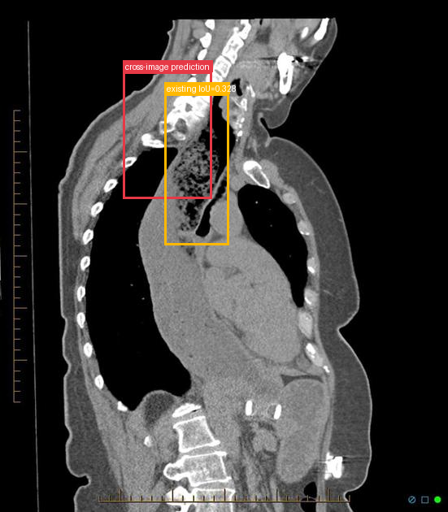</td><td></td></tr>
</table>

- **Target：** `study_001_ct_image_002_oblique_non_contrast`; CT; Oblique non-contrast
- **Relation：** `bbox_to_image` / `partial_support`
- **Returned target bbox：** `[275, 140, 475, 390]`
- **Maximum IoU：** 0.328; threshold=0.5
- **Strong relation IDs：** `[]`

**IoU matching：**

| Existing target bbox | IoU | Strong match | Lingshu caption | 中文翻译 |
|---|---:|---|---|---|
| `study_001_ct_image_002_oblique_non_contrast_f01`; `[359, 175, 521, 488]` | 0.328 | no | The oblique non-contrast CT image shows a marked region in the upper thoracic area, specifically involving the trachea and surrounding structures. Within this region, there appears to be a significant narrowing of the tracheal lumen, which could indicate stenosis. The tracheal walls seem thickened, and there is evidence of irregularity in the tracheal contour. Adjacent to the trachea, there is a noticeable mass-like structure that may be causing compression or displacement of the trachea. This mass appears to have heterogeneous density, suggesting possible involvement of soft tissue or other pathological processes. The surrounding mediastinal structures, including the esophagus and major blood vessels, do not show obvious abnormalities in this view. The lung fields appear clear without any evident consolidation, effusion, or masses. The bony structures, including the vertebrae and ribs, are intact without signs of fractures or lesions. | 斜位平扫 CT 显示上胸部标记区域，主要涉及气管及周围结构。该区域内气管腔明显狭窄，可能提示狭窄；气管壁似增厚，轮廓不规则。气管旁可见肿块样结构，可能压迫或推移气管。该肿块密度不均，提示可能涉及软组织或其他病理过程。本层面所见食管和大血管等周围纵隔结构无明显异常。肺野清晰，未见实变、积液或肿块。椎骨和肋骨完整，未见骨折或病灶。 |

**B 图单红框（Lingshu 实际输入）：**

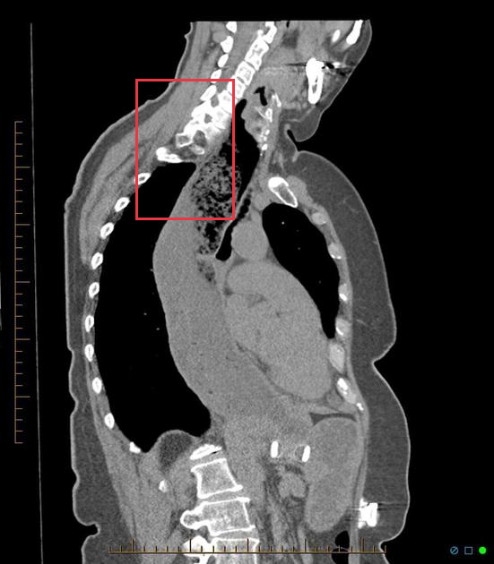

**Re-ground Lingshu caption：** The oblique non-contrast CT image shows a region of interest marked by a red bounding box located in the upper thoracic area. Within this region, there appears to be a heterogeneous mass with irregular borders. The mass is situated near the mediastinum and seems to involve adjacent structures. The density of the mass varies, suggesting possible necrosis or cystic components. Surrounding tissues show signs of displacement or compression due to the presence of the mass. No clear signs of calcification are observed within the mass. The overall appearance suggests a significant abnormality that warrants further investigation.
**Re-ground caption 中文翻译：** 斜位平扫 CT 显示上胸部红框关注区域，其中可见边缘不规则的不均质肿块，位于纵隔附近并似累及邻近结构。肿块密度不一，提示可能含坏死或囊性成分。周围组织因肿块而发生推移或受压。肿块内未见明确钙化。整体表现提示显著异常，值得进一步检查。

#### location_00010: NOT SUPPORT

<table>
<tr><th>Anchor original bbox</th><th>Target original image; model returned null</th><th>Existing target bbox: study_002_fluoroscopy_image_000_missing_f01</th></tr>
<tr><td></td><td></td><td></td></tr>
</table>

- **Target：** `study_002_fluoroscopy_image_000_missing`; Fluoroscopy; missing
- **Relation：** `bbox_to_image` / `not_support`
- **Returned target bbox：** `unknown`
- **Maximum IoU：** n/a; threshold=0.5
- **Strong relation IDs：** `[]`

**IoU matching：**

| Existing target bbox | IoU | Strong match | Lingshu caption | 中文翻译 |
|---|---:|---|---|---|
| `study_002_fluoroscopy_image_000_missing_f01`; `[286, 1, 571, 500]` | n/a | n/a | The esophagus is mildly dilated with a tapered narrowing at the gastroesophageal junction. There is no evidence of retained contrast in the esophagus 15 minutes after ingestion. | 食管轻度扩张，胃食管交界处呈渐细性狭窄。吞服造影剂 15 分钟后未见造影剂滞留于食管。 |

### Anchor 4: `study_001_ct_image_002_oblique_non_contrast_f01`

**Anchor Lingshu caption：** The oblique non-contrast CT image shows a marked region in the upper thoracic area, specifically involving the trachea and surrounding structures. Within this region, there appears to be a significant narrowing of the tracheal lumen, which could indicate stenosis. The tracheal walls seem thickened, and there is evidence of irregularity in the tracheal contour. Adjacent to the trachea, there is a noticeable mass-like structure that may be causing compression or displacement of the trachea. This mass appears to have heterogeneous density, suggesting possible involvement of soft tissue or other pathological processes. The surrounding mediastinal structures, including the esophagus and major blood vessels, do not show obvious abnormalities in this view. The lung fields appear clear without any evident consolidation, effusion, or masses. The bony structures, including the vertebrae and ribs, are intact without signs of fractures or lesions.
**Anchor caption 中文翻译：** 斜位平扫 CT 显示上胸部标记区域，主要涉及气管及周围结构。该区域内气管腔明显狭窄，可能提示狭窄；气管壁似增厚，轮廓不规则。气管旁可见肿块样结构，可能压迫或推移气管。该肿块密度不均，提示可能涉及软组织或其他病理过程。本层面所见食管和大血管等周围纵隔结构无明显异常。肺野清晰，未见实变、积液或肿块。椎骨和肋骨完整，未见骨折或病灶。

#### location_00011: NOT SUPPORT

<table>
<tr><th>Anchor original bbox</th><th>Target original image; model returned null</th><th>Existing target bbox: study_002_fluoroscopy_image_000_missing_f01</th></tr>
<tr><td></td><td></td><td></td></tr>
</table>

- **Target：** `study_002_fluoroscopy_image_000_missing`; Fluoroscopy; missing
- **Relation：** `bbox_to_image` / `not_support`
- **Returned target bbox：** `unknown`
- **Maximum IoU：** n/a; threshold=0.5
- **Strong relation IDs：** `[]`

**IoU matching：**

| Existing target bbox | IoU | Strong match | Lingshu caption | 中文翻译 |
|---|---:|---|---|---|
| `study_002_fluoroscopy_image_000_missing_f01`; `[286, 1, 571, 500]` | n/a | n/a | The esophagus is mildly dilated with a tapered narrowing at the gastroesophageal junction. There is no evidence of retained contrast in the esophagus 15 minutes after ingestion. | 食管轻度扩张，胃食管交界处呈渐细性狭窄。吞服造影剂 15 分钟后未见造影剂滞留于食管。 |

## Dynamically Skipped Anchors

None.

## Case-level Location Validation Summary / 病例级定位验证总结

- **Strong support：** 0 个 bbox-to-bbox 关系
- **Partial support：** 3 个 bbox-to-image 关系
- **Not support：** 8 个 bbox-to-image 关系

### Strong Support

该病例没有 strong-support bbox 对应关系。

### Partial Support

#### Partial 1: `study_000_ultrasound_image_000_missing_f01` → `study_000_ultrasound_image_001_missing`

- **Query：** `location_00001`
- **Returned target bbox：** `[100, 100, 800, 900]`
- **Maximum IoU：** n/a（低于 threshold=0.5）

<table>
<tr><th>Anchor bbox</th><th>Cross-image grounding and IoU overlay</th><th>B image with the single re-grounded bbox given to Lingshu</th></tr>
<tr><td></td><td></td><td></td></tr>
</table>

- **A 端原始 Lingshu caption：** The image shows a transverse view of the neck. The boxed region appears to be located in the left side of the neck. Within this region, there is a hypoechoic area that could represent a lymph node or other soft tissue structure. The borders of this area are somewhat irregular, which may indicate an abnormality. Surrounding tissues appear relatively homogeneous without obvious signs of inflammation or other abnormalities.
- **A 端 caption 中文翻译：** 图像为颈部横断面。框内区域似位于左颈部，其中可见低回声区，可能为淋巴结或其他软组织结构。其边缘略不规则，可能提示异常。周围组织相对均匀，未见明显炎症或其他异常。
- **B 端 re-ground Lingshu caption：** The image shows a transverse view of the neck. The boxed region appears to be the left side of the neck. Within this region, there is a hypoechoic area that could represent a lymph node or other soft tissue structure. The borders of this area are somewhat indistinct, suggesting possible pathology. Surrounding tissues appear relatively homogeneous without obvious signs of inflammation or mass effect.
- **B 端 re-ground caption 中文翻译：** 图像为颈部横断面。框内似位于左颈部，其中可见低回声区，可能为淋巴结或其他软组织结构。其边界略模糊，提示可能存在病变。周围组织相对均匀，未见明显炎症或占位效应。

#### Partial 2: `study_001_ct_image_000_axial_non_contrast_f01` → `study_001_ct_image_002_oblique_non_contrast`

- **Query：** `location_00007`
- **Returned target bbox：** `[350, 220, 550, 380]`
- **Maximum IoU：** 0.458（低于 threshold=0.5）

<table>
<tr><th>Anchor bbox</th><th>Cross-image grounding and IoU overlay</th><th>B image with the single re-grounded bbox given to Lingshu</th><th>Closest existing target bbox</th></tr>
<tr><td></td><td></td><td></td><td></td></tr>
</table>

- **A 端原始 Lingshu caption：** The red box is located in the midline at the level of the trachea. Within this area there is a large amount of air present in the soft tissues of the neck. There is also extensive subcutaneous emphysema throughout the chest wall bilaterally.
- **A 端 caption 中文翻译：** 红框位于气管水平的中线区域。该处颈部软组织内可见大量气体，双侧胸壁还可见广泛皮下气肿。
- **B 端 re-ground Lingshu caption：** The oblique non-contrast CT image shows a region of interest marked by a red bounding box located in the upper thoracic area. Within this region, there appears to be a mass-like structure that is distinct from the surrounding tissues. The mass is situated near the mediastinum and seems to have irregular borders. It is adjacent to the trachea and possibly involves the esophagus. The density of the mass suggests it could be solid, and there is no clear evidence of calcification within this area. Surrounding structures, including the lungs and major blood vessels, appear unremarkable outside the boxed region.
- **B 端 re-ground caption 中文翻译：** 斜位平扫 CT 显示上胸部红框关注区域，其中可见与周围组织不同的肿块样结构。肿块位于纵隔附近，边缘似不规则，邻近气管并可能累及食管。其密度提示可能为实性，内部未见明确钙化。框外肺和大血管等周围结构未见明显异常。

#### Partial 3: `study_001_ct_image_001_coronal_non_contrast_f01` → `study_001_ct_image_002_oblique_non_contrast`

- **Query：** `location_00009`
- **Returned target bbox：** `[275, 140, 475, 390]`
- **Maximum IoU：** 0.328（低于 threshold=0.5）

<table>
<tr><th>Anchor bbox</th><th>Cross-image grounding and IoU overlay</th><th>B image with the single re-grounded bbox given to Lingshu</th><th>Closest existing target bbox</th></tr>
<tr><td></td><td></td><td></td><td></td></tr>
</table>

- **A 端原始 Lingshu caption：** The right upper lobe demonstrates a large area of consolidation with air bronchograms. There is also a small amount of peribronchial cuffing. The left lung is clear. The cardiomediastinal silhouette is unremarkable. No pleural effusions or pneumothorax.
- **A 端 caption 中文翻译：** 右上叶可见大片实变并有空气支气管征，另见少量支气管周围袖套征。左肺清晰。心纵隔轮廓未见异常。未见胸腔积液或气胸。
- **B 端 re-ground Lingshu caption：** The oblique non-contrast CT image shows a region of interest marked by a red bounding box located in the upper thoracic area. Within this region, there appears to be a heterogeneous mass with irregular borders. The mass is situated near the mediastinum and seems to involve adjacent structures. The density of the mass varies, suggesting possible necrosis or cystic components. Surrounding tissues show signs of displacement or compression due to the presence of the mass. No clear signs of calcification are observed within the mass. The overall appearance suggests a significant abnormality that warrants further investigation.
- **B 端 re-ground caption 中文翻译：** 斜位平扫 CT 显示上胸部红框关注区域，其中可见边缘不规则的不均质肿块，位于纵隔附近并似累及邻近结构。肿块密度不一，提示可能含坏死或囊性成分。周围组织因肿块而发生推移或受压。肿块内未见明确钙化。整体表现提示显著异常，值得进一步检查。

### Not Support

#### Not support 1: `study_000_ultrasound_image_000_missing_f01` → `study_001_ct_image_000_axial_non_contrast`

- **Query：** `location_00002`
- **Result：** 目标图返回 `null`，未定位到对应区域。

<table>
<tr><th>Anchor bbox</th><th>Target original image</th></tr>
<tr><td></td><td></td></tr>
</table>

- **A 端原始 Lingshu caption：** The image shows a transverse view of the neck. The boxed region appears to be located in the left side of the neck. Within this region, there is a hypoechoic area that could represent a lymph node or other soft tissue structure. The borders of this area are somewhat irregular, which may indicate an abnormality. Surrounding tissues appear relatively homogeneous without obvious signs of inflammation or other abnormalities.
- **A 端 caption 中文翻译：** 图像为颈部横断面。框内区域似位于左颈部，其中可见低回声区，可能为淋巴结或其他软组织结构。其边缘略不规则，可能提示异常。周围组织相对均匀，未见明显炎症或其他异常。
- **B 端 re-ground caption：** 不适用；目标图返回 `null`，没有生成 re-ground bbox。

#### Not support 2: `study_000_ultrasound_image_000_missing_f01` → `study_001_ct_image_001_coronal_non_contrast`

- **Query：** `location_00003`
- **Result：** 目标图返回 `null`，未定位到对应区域。

<table>
<tr><th>Anchor bbox</th><th>Target original image</th></tr>
<tr><td></td><td></td></tr>
</table>

- **A 端原始 Lingshu caption：** The image shows a transverse view of the neck. The boxed region appears to be located in the left side of the neck. Within this region, there is a hypoechoic area that could represent a lymph node or other soft tissue structure. The borders of this area are somewhat irregular, which may indicate an abnormality. Surrounding tissues appear relatively homogeneous without obvious signs of inflammation or other abnormalities.
- **A 端 caption 中文翻译：** 图像为颈部横断面。框内区域似位于左颈部，其中可见低回声区，可能为淋巴结或其他软组织结构。其边缘略不规则，可能提示异常。周围组织相对均匀，未见明显炎症或其他异常。
- **B 端 re-ground caption：** 不适用；目标图返回 `null`，没有生成 re-ground bbox。

#### Not support 3: `study_000_ultrasound_image_000_missing_f01` → `study_001_ct_image_002_oblique_non_contrast`

- **Query：** `location_00004`
- **Result：** 目标图返回 `null`，未定位到对应区域。

<table>
<tr><th>Anchor bbox</th><th>Target original image</th></tr>
<tr><td></td><td></td></tr>
</table>

- **A 端原始 Lingshu caption：** The image shows a transverse view of the neck. The boxed region appears to be located in the left side of the neck. Within this region, there is a hypoechoic area that could represent a lymph node or other soft tissue structure. The borders of this area are somewhat irregular, which may indicate an abnormality. Surrounding tissues appear relatively homogeneous without obvious signs of inflammation or other abnormalities.
- **A 端 caption 中文翻译：** 图像为颈部横断面。框内区域似位于左颈部，其中可见低回声区，可能为淋巴结或其他软组织结构。其边缘略不规则，可能提示异常。周围组织相对均匀，未见明显炎症或其他异常。
- **B 端 re-ground caption：** 不适用；目标图返回 `null`，没有生成 re-ground bbox。

#### Not support 4: `study_000_ultrasound_image_000_missing_f01` → `study_002_fluoroscopy_image_000_missing`

- **Query：** `location_00005`
- **Result：** 目标图返回 `null`，未定位到对应区域。

<table>
<tr><th>Anchor bbox</th><th>Target original image</th></tr>
<tr><td></td><td></td></tr>
</table>

- **A 端原始 Lingshu caption：** The image shows a transverse view of the neck. The boxed region appears to be located in the left side of the neck. Within this region, there is a hypoechoic area that could represent a lymph node or other soft tissue structure. The borders of this area are somewhat irregular, which may indicate an abnormality. Surrounding tissues appear relatively homogeneous without obvious signs of inflammation or other abnormalities.
- **A 端 caption 中文翻译：** 图像为颈部横断面。框内区域似位于左颈部，其中可见低回声区，可能为淋巴结或其他软组织结构。其边缘略不规则，可能提示异常。周围组织相对均匀，未见明显炎症或其他异常。
- **B 端 re-ground caption：** 不适用；目标图返回 `null`，没有生成 re-ground bbox。

#### Not support 5: `study_001_ct_image_000_axial_non_contrast_f01` → `study_001_ct_image_001_coronal_non_contrast`

- **Query：** `location_00006`
- **Result：** 目标图返回 `null`，未定位到对应区域。

<table>
<tr><th>Anchor bbox</th><th>Target original image</th></tr>
<tr><td></td><td></td></tr>
</table>

- **A 端原始 Lingshu caption：** The red box is located in the midline at the level of the trachea. Within this area there is a large amount of air present in the soft tissues of the neck. There is also extensive subcutaneous emphysema throughout the chest wall bilaterally.
- **A 端 caption 中文翻译：** 红框位于气管水平的中线区域。该处颈部软组织内可见大量气体，双侧胸壁还可见广泛皮下气肿。
- **B 端 re-ground caption：** 不适用；目标图返回 `null`，没有生成 re-ground bbox。

#### Not support 6: `study_001_ct_image_000_axial_non_contrast_f01` → `study_002_fluoroscopy_image_000_missing`

- **Query：** `location_00008`
- **Result：** 目标图返回 `null`，未定位到对应区域。

<table>
<tr><th>Anchor bbox</th><th>Target original image</th></tr>
<tr><td></td><td></td></tr>
</table>

- **A 端原始 Lingshu caption：** The red box is located in the midline at the level of the trachea. Within this area there is a large amount of air present in the soft tissues of the neck. There is also extensive subcutaneous emphysema throughout the chest wall bilaterally.
- **A 端 caption 中文翻译：** 红框位于气管水平的中线区域。该处颈部软组织内可见大量气体，双侧胸壁还可见广泛皮下气肿。
- **B 端 re-ground caption：** 不适用；目标图返回 `null`，没有生成 re-ground bbox。

#### Not support 7: `study_001_ct_image_001_coronal_non_contrast_f01` → `study_002_fluoroscopy_image_000_missing`

- **Query：** `location_00010`
- **Result：** 目标图返回 `null`，未定位到对应区域。

<table>
<tr><th>Anchor bbox</th><th>Target original image</th></tr>
<tr><td></td><td></td></tr>
</table>

- **A 端原始 Lingshu caption：** The right upper lobe demonstrates a large area of consolidation with air bronchograms. There is also a small amount of peribronchial cuffing. The left lung is clear. The cardiomediastinal silhouette is unremarkable. No pleural effusions or pneumothorax.
- **A 端 caption 中文翻译：** 右上叶可见大片实变并有空气支气管征，另见少量支气管周围袖套征。左肺清晰。心纵隔轮廓未见异常。未见胸腔积液或气胸。
- **B 端 re-ground caption：** 不适用；目标图返回 `null`，没有生成 re-ground bbox。

#### Not support 8: `study_001_ct_image_002_oblique_non_contrast_f01` → `study_002_fluoroscopy_image_000_missing`

- **Query：** `location_00011`
- **Result：** 目标图返回 `null`，未定位到对应区域。

<table>
<tr><th>Anchor bbox</th><th>Target original image</th></tr>
<tr><td></td><td></td></tr>
</table>

- **A 端原始 Lingshu caption：** The oblique non-contrast CT image shows a marked region in the upper thoracic area, specifically involving the trachea and surrounding structures. Within this region, there appears to be a significant narrowing of the tracheal lumen, which could indicate stenosis. The tracheal walls seem thickened, and there is evidence of irregularity in the tracheal contour. Adjacent to the trachea, there is a noticeable mass-like structure that may be causing compression or displacement of the trachea. This mass appears to have heterogeneous density, suggesting possible involvement of soft tissue or other pathological processes. The surrounding mediastinal structures, including the esophagus and major blood vessels, do not show obvious abnormalities in this view. The lung fields appear clear without any evident consolidation, effusion, or masses. The bony structures, including the vertebrae and ribs, are intact without signs of fractures or lesions.
- **A 端 caption 中文翻译：** 斜位平扫 CT 显示上胸部标记区域，主要涉及气管及周围结构。该区域内气管腔明显狭窄，可能提示狭窄；气管壁似增厚，轮廓不规则。气管旁可见肿块样结构，可能压迫或推移气管。该肿块密度不均，提示可能涉及软组织或其他病理过程。本层面所见食管和大血管等周围纵隔结构无明显异常。肺野清晰，未见实变、积液或肿块。椎骨和肋骨完整，未见骨折或病灶。
- **B 端 re-ground caption：** 不适用；目标图返回 `null`，没有生成 re-ground bbox。
