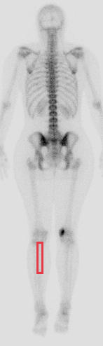
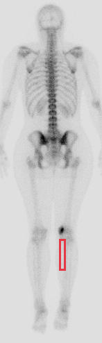
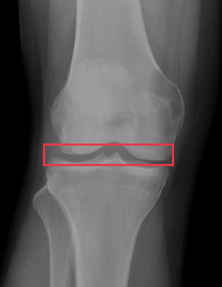
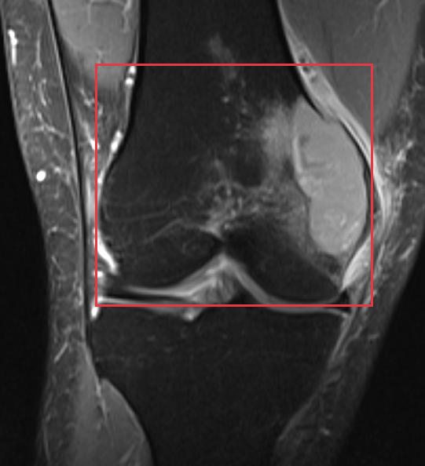
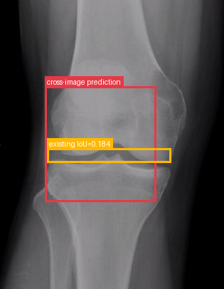
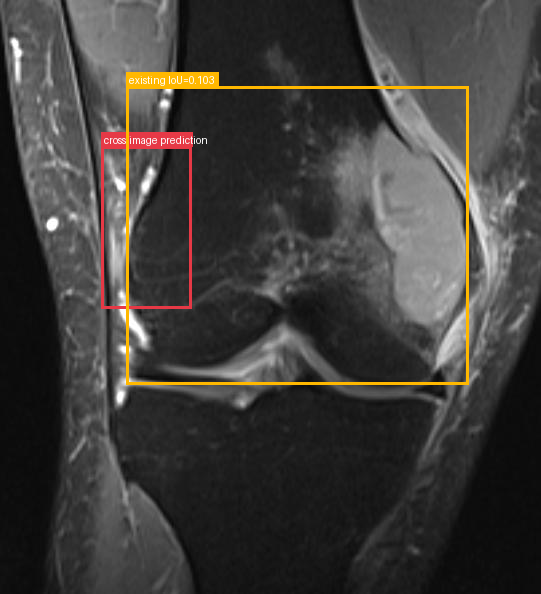
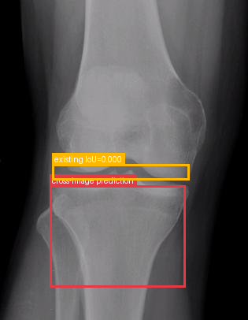
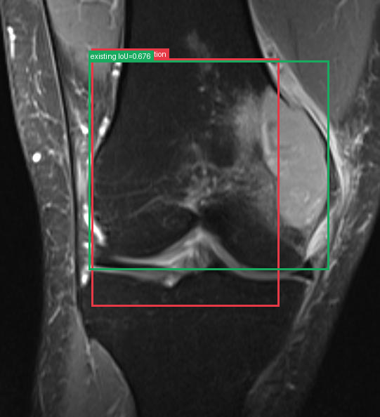
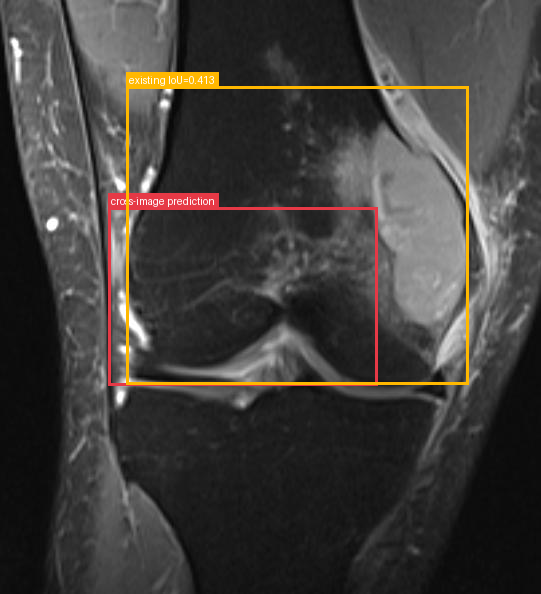

# Giant cell tumor of bone

[返回 Step 3 总览](../README_STEP3_VISUALIZATION.md)

- **Case ID：** `giant-cell-tumor-of-bone-1`
- **Case URL：** [https://radiopaedia.org/cases/giant-cell-tumor-of-bone-1?lang=us](https://radiopaedia.org/cases/giant-cell-tumor-of-bone-1?lang=us)
- **验证模型：** Qwen3-VL-8B
- **图像 / Step 2 findings：** 4 / 4
- **定位结果：** strong 1；partial 4；not support 0；parse error 0
- **Strong bbox relations：** 1
- **原始 JSON：** [case_evidence.json](../assets_step3/giant-cell-tumor-of-bone-1/case_evidence.json)

**Overlay 图例：** 红框为跨图新定位；绿框为 IoU >= 0.5 的已有 bbox；黄框为未达到阈值的已有 bbox。

## Step 2 Finding Nodes

### Finding 1: `study_000_nuclear_medicine_image_001_posterior_f01`

- **Modality / subcategory：** Nuclear medicine / Posterior
- **bbox_2d：** `[360, 700, 420, 790]`
- **Lingshu caption：** The posterior view of the whole body bone scan shows increased radiotracer uptake in the left femur. The uptake is localized to the diaphysis and metaphysis of the femur. There is no evidence of similar uptake in other regions of the skeleton.

### Finding 2: `study_000_nuclear_medicine_image_001_posterior_f02`

- **Modality / subcategory：** Nuclear medicine / Posterior
- **bbox_2d：** `[580, 698, 640, 788]`
- **Lingshu caption：** The posterior view of the bone scan shows increased radiotracer uptake in the left lower extremity, specifically in the region of the femur. This area appears more intense compared to the surrounding bone structures, suggesting a potential abnormality. The rest of the skeletal system, including the spine, pelvis, and other limbs, does not show any significant areas of increased uptake.

### Finding 3: `study_001_x_ray_image_000_frontal_f01`

- **Modality / subcategory：** X-ray / Frontal
- **bbox_2d：** `[194, 500, 781, 578]`
- **Lingshu caption：** The knee joint space appears narrowed, particularly in the medial compartment. There is evidence of osteophyte formation along the margins of the femur and tibia. Subchondral sclerosis is also noted in the medial compartment. The overall alignment of the knee joint appears to be maintained. No obvious fractures or dislocations are seen.

### Finding 4: `study_002_mri_image_000_coronal_t2_fat_sat_f01`

- **Modality / subcategory：** MRI / Coronal T2 fat sat
- **bbox_2d：** `[224, 138, 878, 658]`
- **Lingshu caption：** The coronal T2 fat sat MRI shows a hyperintense signal in the region of the knee joint, particularly involving the medial meniscus. There is evidence of increased fluid signal within the joint space, suggestive of effusion. The surrounding soft tissues appear to have normal signal intensity without any obvious masses or lesions. The bony structures, including the femur and tibia, show no signs of fracture or significant degenerative changes. The articular cartilage appears intact, although there may be subtle irregularities that warrant further evaluation.

## Directed Cross-image Validation

### Anchor 1: `study_000_nuclear_medicine_image_001_posterior_f01`

**Anchor Lingshu caption：** The posterior view of the whole body bone scan shows increased radiotracer uptake in the left femur. The uptake is localized to the diaphysis and metaphysis of the femur. There is no evidence of similar uptake in other regions of the skeleton.

#### location_00001: PARTIAL SUPPORT

<table>
<tr><th>Anchor original bbox</th><th>Cross-image grounded target bbox</th><th>Existing target bbox: study_001_x_ray_image_000_frontal_f01</th></tr>
<tr><td></td><td></td><td></td></tr>
</table>

- **Target：** `study_001_x_ray_image_000_frontal`; X-ray; Frontal
- **Relation：** `bbox_to_image` / `partial_support`
- **Returned target bbox：** `[200, 300, 700, 700]`
- **Maximum IoU：** 0.184; threshold=0.5
- **Strong relation IDs：** `[]`

**IoU matching：**

| Existing target bbox | IoU | Strong match | Lingshu caption |
|---|---:|---|---|
| `study_001_x_ray_image_000_frontal_f01`; `[194, 500, 781, 578]` | 0.184 | no | The knee joint space appears narrowed, particularly in the medial compartment. There is evidence of osteophyte formation along the margins of the femur and tibia. Subchondral sclerosis is also noted in the medial compartment. The overall alignment of the knee joint appears to be maintained. No obvious fractures or dislocations are seen. |

**Target Lingshu caption：** unavailable. This is a newly re-grounded bbox and has not passed through Step 2 Lingshu captioning.

**Quantification / characterization：**

| Validation | Status | Reason |
|---|---|---|
| Quantification | `insufficient` | The source region lacks explicit measurements or scale, and the target region&#x27;s bounding box does not provide measurable dimensions for comparison. |
| Characterization | `insufficient` | The target Lingshu caption is unknown, preventing semantic comparison using only the two Lingshu captions. |

#### location_00002: PARTIAL SUPPORT

<table>
<tr><th>Anchor original bbox</th><th>Cross-image grounded target bbox</th><th>Existing target bbox: study_002_mri_image_000_coronal_t2_fat_sat_f01</th></tr>
<tr><td></td><td></td><td></td></tr>
</table>

- **Target：** `study_002_mri_image_000_coronal_t2_fat_sat`; MRI; Coronal T2 fat sat
- **Relation：** `bbox_to_image` / `partial_support`
- **Returned target bbox：** `[187, 247, 356, 521]`
- **Maximum IoU：** 0.103; threshold=0.5
- **Strong relation IDs：** `[]`

**IoU matching：**

| Existing target bbox | IoU | Strong match | Lingshu caption |
|---|---:|---|---|
| `study_002_mri_image_000_coronal_t2_fat_sat_f01`; `[224, 138, 878, 658]` | 0.103 | no | The coronal T2 fat sat MRI shows a hyperintense signal in the region of the knee joint, particularly involving the medial meniscus. There is evidence of increased fluid signal within the joint space, suggestive of effusion. The surrounding soft tissues appear to have normal signal intensity without any obvious masses or lesions. The bony structures, including the femur and tibia, show no signs of fracture or significant degenerative changes. The articular cartilage appears intact, although there may be subtle irregularities that warrant further evaluation. |

**Target Lingshu caption：** unavailable. This is a newly re-grounded bbox and has not passed through Step 2 Lingshu captioning.

**Quantification / characterization：**

| Validation | Status | Reason |
|---|---|---|
| Quantification | `insufficient` | view, scale, or measurements do not permit a reliable comparison |
| Characterization | `insufficient` | the target Lingshu caption is unknown |

### Anchor 2: `study_000_nuclear_medicine_image_001_posterior_f02`

**Anchor Lingshu caption：** The posterior view of the bone scan shows increased radiotracer uptake in the left lower extremity, specifically in the region of the femur. This area appears more intense compared to the surrounding bone structures, suggesting a potential abnormality. The rest of the skeletal system, including the spine, pelvis, and other limbs, does not show any significant areas of increased uptake.

#### location_00003: PARTIAL SUPPORT

<table>
<tr><th>Anchor original bbox</th><th>Cross-image grounded target bbox</th><th>Existing target bbox: study_001_x_ray_image_000_frontal_f01</th></tr>
<tr><td></td><td></td><td></td></tr>
</table>

- **Target：** `study_001_x_ray_image_000_frontal`; X-ray; Frontal
- **Relation：** `bbox_to_image` / `partial_support`
- **Returned target bbox：** `[200, 580, 750, 900]`
- **Maximum IoU：** 0.000; threshold=0.5
- **Strong relation IDs：** `[]`

**IoU matching：**

| Existing target bbox | IoU | Strong match | Lingshu caption |
|---|---:|---|---|
| `study_001_x_ray_image_000_frontal_f01`; `[194, 500, 781, 578]` | 0.000 | no | The knee joint space appears narrowed, particularly in the medial compartment. There is evidence of osteophyte formation along the margins of the femur and tibia. Subchondral sclerosis is also noted in the medial compartment. The overall alignment of the knee joint appears to be maintained. No obvious fractures or dislocations are seen. |

**Target Lingshu caption：** unavailable. This is a newly re-grounded bbox and has not passed through Step 2 Lingshu captioning.

**Quantification / characterization：**

| Validation | Status | Reason |
|---|---|---|
| Quantification | `insufficient` | The source region&#x27;s size is estimated and not quantified, while the target region&#x27;s size is unknown, making reliable comparison impossible. |
| Characterization | `insufficient` | The target Lingshu caption is unknown, preventing semantic comparison with the source caption. |

#### location_00004: STRONG SUPPORT

<table>
<tr><th>Anchor original bbox</th><th>Cross-image grounded target bbox</th><th>Existing target bbox: study_002_mri_image_000_coronal_t2_fat_sat_f01</th></tr>
<tr><td></td><td></td><td></td></tr>
</table>

- **Target：** `study_002_mri_image_000_coronal_t2_fat_sat`; MRI; Coronal T2 fat sat
- **Relation：** `bbox_to_bbox` / `strong_support`
- **Returned target bbox：** `[242, 140, 736, 736]`
- **Maximum IoU：** 0.676; threshold=0.5
- **Strong relation IDs：** `[&#x27;strong_location_00004_01&#x27;]`

**IoU matching：**

| Existing target bbox | IoU | Strong match | Lingshu caption |
|---|---:|---|---|
| `study_002_mri_image_000_coronal_t2_fat_sat_f01`; `[224, 138, 878, 658]` | 0.676 | yes | The coronal T2 fat sat MRI shows a hyperintense signal in the region of the knee joint, particularly involving the medial meniscus. There is evidence of increased fluid signal within the joint space, suggestive of effusion. The surrounding soft tissues appear to have normal signal intensity without any obvious masses or lesions. The bony structures, including the femur and tibia, show no signs of fracture or significant degenerative changes. The articular cartilage appears intact, although there may be subtle irregularities that warrant further evaluation. |

**Quantification / characterization：**

| Validation | Status | Reason |
|---|---|---|
| Quantification | `insufficient` | The source image is a bone scan with an estimated size for the lesion, while the target image is an MRI with unknown measurements. The scales and imaging modalities differ, making reliable comparison impossible. |
| Characterization | `inconsistent` | The source caption describes increased radiotracer uptake in the femur, indicating a bone abnormality. The target caption describes a knee joint effusion and meniscal signal change, which are soft tissue findings, not bone abnormalities. |

### Anchor 3: `study_001_x_ray_image_000_frontal_f01`

**Anchor Lingshu caption：** The knee joint space appears narrowed, particularly in the medial compartment. There is evidence of osteophyte formation along the margins of the femur and tibia. Subchondral sclerosis is also noted in the medial compartment. The overall alignment of the knee joint appears to be maintained. No obvious fractures or dislocations are seen.

#### location_00005: PARTIAL SUPPORT

<table>
<tr><th>Anchor original bbox</th><th>Cross-image grounded target bbox</th><th>Existing target bbox: study_002_mri_image_000_coronal_t2_fat_sat_f01</th></tr>
<tr><td></td><td></td><td></td></tr>
</table>

- **Target：** `study_002_mri_image_000_coronal_t2_fat_sat`; MRI; Coronal T2 fat sat
- **Relation：** `bbox_to_image` / `partial_support`
- **Returned target bbox：** `[200, 350, 700, 650]`
- **Maximum IoU：** 0.413; threshold=0.5
- **Strong relation IDs：** `[]`

**IoU matching：**

| Existing target bbox | IoU | Strong match | Lingshu caption |
|---|---:|---|---|
| `study_002_mri_image_000_coronal_t2_fat_sat_f01`; `[224, 138, 878, 658]` | 0.413 | no | The coronal T2 fat sat MRI shows a hyperintense signal in the region of the knee joint, particularly involving the medial meniscus. There is evidence of increased fluid signal within the joint space, suggestive of effusion. The surrounding soft tissues appear to have normal signal intensity without any obvious masses or lesions. The bony structures, including the femur and tibia, show no signs of fracture or significant degenerative changes. The articular cartilage appears intact, although there may be subtle irregularities that warrant further evaluation. |

**Target Lingshu caption：** unavailable. This is a newly re-grounded bbox and has not passed through Step 2 Lingshu captioning.

**Quantification / characterization：**

| Validation | Status | Reason |
|---|---|---|
| Quantification | `insufficient` | view, scale, or measurements do not permit a reliable comparison |
| Characterization | `insufficient` | the target Lingshu caption is unknown |

## Dynamically Skipped Anchors

None.
