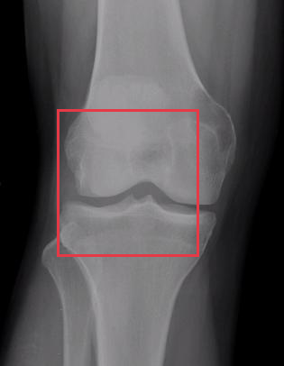
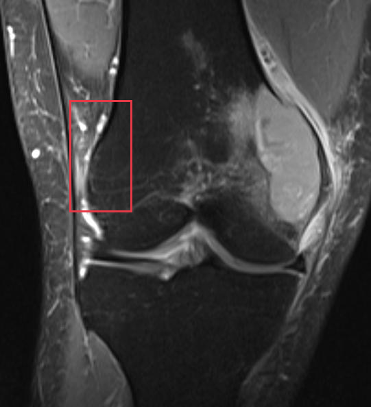
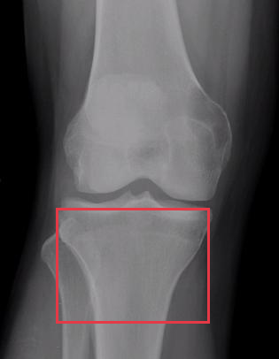
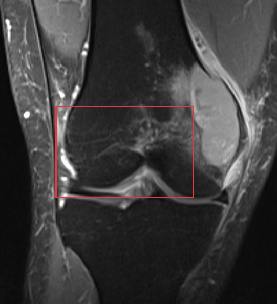

# Giant cell tumor of bone

[返回 Step 3 总览](../README_STEP3_VISUALIZATION.md)

- **Case ID：** `giant-cell-tumor-of-bone-1`
- **Case URL：** [https://radiopaedia.org/cases/giant-cell-tumor-of-bone-1?lang=us](https://radiopaedia.org/cases/giant-cell-tumor-of-bone-1?lang=us)
- **验证模型：** Qwen3-VL-8B
- **图像 / Step 2 findings：** 4 / 4
- **定位结果：** strong 1；partial 4；not support 0；parse error 0
- **Strong bbox relations：** 1
- **原始 JSON：** [case_evidence.json](../assets_step3/giant-cell-tumor-of-bone-1/case_evidence.json)
- **定量/定性验证 JSON：** [step_3_validation_case_evidence.json](../assets_step3/giant-cell-tumor-of-bone-1/step_3_validation_case_evidence.json)

**Overlay 图例：** 红框为跨图新定位；绿框为 IoU >= 0.5 的已有 bbox；黄框为未达到阈值的已有 bbox。

## Step 2 Finding Nodes

### Finding 1: `study_000_nuclear_medicine_image_001_posterior_f01`

- **Modality / subcategory：** Nuclear medicine / Posterior
- **bbox_2d：** `[360, 700, 420, 790]`
- **Lingshu caption：** The posterior view of the whole body bone scan shows increased radiotracer uptake in the left femur. The uptake is localized to the diaphysis and metaphysis of the femur. There is no evidence of similar uptake in other regions of the skeleton.
- **中文翻译：** 全身骨扫描后位像显示左股骨放射性示踪剂摄取增高，局限于股骨干及干骺端。骨骼其他部位未见类似摄取增高。

### Finding 2: `study_000_nuclear_medicine_image_001_posterior_f02`

- **Modality / subcategory：** Nuclear medicine / Posterior
- **bbox_2d：** `[580, 698, 640, 788]`
- **Lingshu caption：** The posterior view of the bone scan shows increased radiotracer uptake in the left lower extremity, specifically in the region of the femur. This area appears more intense compared to the surrounding bone structures, suggesting a potential abnormality. The rest of the skeletal system, including the spine, pelvis, and other limbs, does not show any significant areas of increased uptake.
- **中文翻译：** 骨扫描后位像显示左下肢、特别是股骨区域放射性示踪剂摄取增高，其强度高于周围骨结构，提示潜在异常。脊柱、骨盆及其他肢体等其余骨骼未见明显异常摄取增高。

### Finding 3: `study_001_x_ray_image_000_frontal_f01`

- **Modality / subcategory：** X-ray / Frontal
- **bbox_2d：** `[194, 500, 781, 578]`
- **Lingshu caption：** The knee joint space appears narrowed, particularly in the medial compartment. There is evidence of osteophyte formation along the margins of the femur and tibia. Subchondral sclerosis is also noted in the medial compartment. The overall alignment of the knee joint appears to be maintained. No obvious fractures or dislocations are seen.
- **中文翻译：** 膝关节间隙变窄，以内侧间室更明显。股骨及胫骨边缘可见骨赘形成，内侧间室另见软骨下硬化。膝关节整体对位尚可。未见明显骨折或脱位。

### Finding 4: `study_002_mri_image_000_coronal_t2_fat_sat_f01`

- **Modality / subcategory：** MRI / Coronal T2 fat sat
- **bbox_2d：** `[224, 138, 878, 658]`
- **Lingshu caption：** The coronal T2 fat sat MRI shows a hyperintense signal in the region of the knee joint, particularly involving the medial meniscus. There is evidence of increased fluid signal within the joint space, suggestive of effusion. The surrounding soft tissues appear to have normal signal intensity without any obvious masses or lesions. The bony structures, including the femur and tibia, show no signs of fracture or significant degenerative changes. The articular cartilage appears intact, although there may be subtle irregularities that warrant further evaluation.
- **中文翻译：** 冠状位 T2 脂肪抑制 MRI 显示膝关节区域高信号，尤其累及内侧半月板。关节腔内液体信号增多，提示积液。周围软组织信号正常，未见明显肿块或病灶。股骨、胫骨等骨性结构未见骨折或明显退变。关节软骨看似完整，但可能有细微不规则，需进一步评估。

## Directed Cross-image Validation

### Anchor 1: `study_000_nuclear_medicine_image_001_posterior_f01`

**Anchor Lingshu caption：** The posterior view of the whole body bone scan shows increased radiotracer uptake in the left femur. The uptake is localized to the diaphysis and metaphysis of the femur. There is no evidence of similar uptake in other regions of the skeleton.
**Anchor caption 中文翻译：** 全身骨扫描后位像显示左股骨放射性示踪剂摄取增高，局限于股骨干及干骺端。骨骼其他部位未见类似摄取增高。

#### location_00001: PARTIAL SUPPORT

<table>
<tr><th>Anchor original bbox</th><th>Cross-image grounded target bbox</th><th>Existing target bbox: study_001_x_ray_image_000_frontal_f01</th></tr>
<tr><td></td><td></td><td></td></tr>
</table>

- **Target：** `study_001_x_ray_image_000_frontal`; X-ray; Frontal
- **Relation：** `bbox_to_image` / `partial_support`
- **Returned target bbox：** `[200, 300, 700, 700]`
- **Maximum IoU：** 0.184; threshold=0.5
- **Strong relation IDs：** `[]`

**IoU matching：**

| Existing target bbox | IoU | Strong match | Lingshu caption | 中文翻译 |
|---|---:|---|---|---|
| `study_001_x_ray_image_000_frontal_f01`; `[194, 500, 781, 578]` | 0.184 | no | The knee joint space appears narrowed, particularly in the medial compartment. There is evidence of osteophyte formation along the margins of the femur and tibia. Subchondral sclerosis is also noted in the medial compartment. The overall alignment of the knee joint appears to be maintained. No obvious fractures or dislocations are seen. | 膝关节间隙变窄，以内侧间室更明显。股骨及胫骨边缘可见骨赘形成，内侧间室另见软骨下硬化。膝关节整体对位尚可。未见明显骨折或脱位。 |

**B 图单红框（Lingshu 实际输入）：**

**Re-ground Lingshu caption：** The knee joint space appears narrowed with subchondral sclerosis and osteophyte formation, suggestive of degenerative changes. The femoral condyles and tibial plateau show irregularities and possible cystic changes. There is also evidence of joint space narrowing and possible subchondral cysts.
**Re-ground caption 中文翻译：** 膝关节间隙变窄，伴软骨下硬化及骨赘形成，提示退行性改变。股骨髁和胫骨平台可见不规则及可能的囊性改变。另见关节间隙狭窄及可能的软骨下囊肿。

**Quantitative / qualitative validation：**

| Validation pair | Quantitative size / 定量 | Qualitative caption / 定性 |
|---|---|---|
| `partial__location_00001` | `inconsistent` | `inconsistent` |

#### location_00002: PARTIAL SUPPORT

<table>
<tr><th>Anchor original bbox</th><th>Cross-image grounded target bbox</th><th>Existing target bbox: study_002_mri_image_000_coronal_t2_fat_sat_f01</th></tr>
<tr><td></td><td></td><td></td></tr>
</table>

- **Target：** `study_002_mri_image_000_coronal_t2_fat_sat`; MRI; Coronal T2 fat sat
- **Relation：** `bbox_to_image` / `partial_support`
- **Returned target bbox：** `[187, 247, 356, 521]`
- **Maximum IoU：** 0.103; threshold=0.5
- **Strong relation IDs：** `[]`

**IoU matching：**

| Existing target bbox | IoU | Strong match | Lingshu caption | 中文翻译 |
|---|---:|---|---|---|
| `study_002_mri_image_000_coronal_t2_fat_sat_f01`; `[224, 138, 878, 658]` | 0.103 | no | The coronal T2 fat sat MRI shows a hyperintense signal in the region of the knee joint, particularly involving the medial meniscus. There is evidence of increased fluid signal within the joint space, suggestive of effusion. The surrounding soft tissues appear to have normal signal intensity without any obvious masses or lesions. The bony structures, including the femur and tibia, show no signs of fracture or significant degenerative changes. The articular cartilage appears intact, although there may be subtle irregularities that warrant further evaluation. | 冠状位 T2 脂肪抑制 MRI 显示膝关节区域高信号，尤其累及内侧半月板。关节腔内液体信号增多，提示积液。周围软组织信号正常，未见明显肿块或病灶。股骨、胫骨等骨性结构未见骨折或明显退变。关节软骨看似完整，但可能有细微不规则，需进一步评估。 |

**B 图单红框（Lingshu 实际输入）：**

**Re-ground Lingshu caption：** The image shows a coronal T2 fat-saturated MRI of the knee joint. Within the red box, there appears to be an area of increased signal intensity, which could indicate the presence of an abnormality such as edema, inflammation, or a lesion. The surrounding soft tissues and bony structures appear relatively normal in appearance. Further evaluation would be necessary to determine the specific nature and cause of the abnormality observed within the boxed region.
**Re-ground caption 中文翻译：** 图像为膝关节冠状位 T2 脂肪抑制 MRI。红框内似有信号增高区，可能提示水肿、炎症或病灶等异常。周围软组织及骨性结构外观相对正常。需要进一步评估才能确定框内异常的具体性质和原因。

**Quantitative / qualitative validation：**

| Validation pair | Quantitative size / 定量 | Qualitative caption / 定性 |
|---|---|---|
| `partial__location_00002` | `inconsistent` | `inconsistent` |

### Anchor 2: `study_000_nuclear_medicine_image_001_posterior_f02`

**Anchor Lingshu caption：** The posterior view of the bone scan shows increased radiotracer uptake in the left lower extremity, specifically in the region of the femur. This area appears more intense compared to the surrounding bone structures, suggesting a potential abnormality. The rest of the skeletal system, including the spine, pelvis, and other limbs, does not show any significant areas of increased uptake.
**Anchor caption 中文翻译：** 骨扫描后位像显示左下肢、特别是股骨区域放射性示踪剂摄取增高，其强度高于周围骨结构，提示潜在异常。脊柱、骨盆及其他肢体等其余骨骼未见明显异常摄取增高。

#### location_00003: PARTIAL SUPPORT

<table>
<tr><th>Anchor original bbox</th><th>Cross-image grounded target bbox</th><th>Existing target bbox: study_001_x_ray_image_000_frontal_f01</th></tr>
<tr><td></td><td></td><td></td></tr>
</table>

- **Target：** `study_001_x_ray_image_000_frontal`; X-ray; Frontal
- **Relation：** `bbox_to_image` / `partial_support`
- **Returned target bbox：** `[200, 580, 750, 900]`
- **Maximum IoU：** 0.000; threshold=0.5
- **Strong relation IDs：** `[]`

**IoU matching：**

| Existing target bbox | IoU | Strong match | Lingshu caption | 中文翻译 |
|---|---:|---|---|---|
| `study_001_x_ray_image_000_frontal_f01`; `[194, 500, 781, 578]` | 0.000 | no | The knee joint space appears narrowed, particularly in the medial compartment. There is evidence of osteophyte formation along the margins of the femur and tibia. Subchondral sclerosis is also noted in the medial compartment. The overall alignment of the knee joint appears to be maintained. No obvious fractures or dislocations are seen. | 膝关节间隙变窄，以内侧间室更明显。股骨及胫骨边缘可见骨赘形成，内侧间室另见软骨下硬化。膝关节整体对位尚可。未见明显骨折或脱位。 |

**B 图单红框（Lingshu 实际输入）：**

**Re-ground Lingshu caption：** The tibial plateau shows a subtle lucency in the medial aspect. The joint space appears preserved. No obvious fracture lines are identified. The surrounding soft tissues appear unremarkable.
**Re-ground caption 中文翻译：** 胫骨平台内侧可见细微透亮区。关节间隙保存，未见明确骨折线。周围软组织未见异常。

**Quantitative / qualitative validation：**

| Validation pair | Quantitative size / 定量 | Qualitative caption / 定性 |
|---|---|---|
| `partial__location_00003` | `inconsistent` | `inconsistent` |

#### location_00004: STRONG SUPPORT

<table>
<tr><th>Anchor original bbox</th><th>Cross-image grounded target bbox</th><th>Existing target bbox: study_002_mri_image_000_coronal_t2_fat_sat_f01</th></tr>
<tr><td></td><td></td><td></td></tr>
</table>

- **Target：** `study_002_mri_image_000_coronal_t2_fat_sat`; MRI; Coronal T2 fat sat
- **Relation：** `bbox_to_bbox` / `strong_support`
- **Returned target bbox：** `[242, 140, 736, 736]`
- **Maximum IoU：** 0.676; threshold=0.5
- **Strong relation IDs：** `[&#x27;strong_location_00004_01&#x27;]`

**IoU matching：**

| Existing target bbox | IoU | Strong match | Lingshu caption | 中文翻译 |
|---|---:|---|---|---|
| `study_002_mri_image_000_coronal_t2_fat_sat_f01`; `[224, 138, 878, 658]` | 0.676 | yes | The coronal T2 fat sat MRI shows a hyperintense signal in the region of the knee joint, particularly involving the medial meniscus. There is evidence of increased fluid signal within the joint space, suggestive of effusion. The surrounding soft tissues appear to have normal signal intensity without any obvious masses or lesions. The bony structures, including the femur and tibia, show no signs of fracture or significant degenerative changes. The articular cartilage appears intact, although there may be subtle irregularities that warrant further evaluation. | 冠状位 T2 脂肪抑制 MRI 显示膝关节区域高信号，尤其累及内侧半月板。关节腔内液体信号增多，提示积液。周围软组织信号正常，未见明显肿块或病灶。股骨、胫骨等骨性结构未见骨折或明显退变。关节软骨看似完整，但可能有细微不规则，需进一步评估。 |

**Quantitative / qualitative validation：**

| Validation pair | Quantitative size / 定量 | Qualitative caption / 定性 |
|---|---|---|
| `strong__strong_location_00004_01` | `inconsistent` | `inconsistent` |

### Anchor 3: `study_001_x_ray_image_000_frontal_f01`

**Anchor Lingshu caption：** The knee joint space appears narrowed, particularly in the medial compartment. There is evidence of osteophyte formation along the margins of the femur and tibia. Subchondral sclerosis is also noted in the medial compartment. The overall alignment of the knee joint appears to be maintained. No obvious fractures or dislocations are seen.
**Anchor caption 中文翻译：** 膝关节间隙变窄，以内侧间室更明显。股骨及胫骨边缘可见骨赘形成，内侧间室另见软骨下硬化。膝关节整体对位尚可。未见明显骨折或脱位。

#### location_00005: PARTIAL SUPPORT

<table>
<tr><th>Anchor original bbox</th><th>Cross-image grounded target bbox</th><th>Existing target bbox: study_002_mri_image_000_coronal_t2_fat_sat_f01</th></tr>
<tr><td></td><td></td><td></td></tr>
</table>

- **Target：** `study_002_mri_image_000_coronal_t2_fat_sat`; MRI; Coronal T2 fat sat
- **Relation：** `bbox_to_image` / `partial_support`
- **Returned target bbox：** `[200, 350, 700, 650]`
- **Maximum IoU：** 0.413; threshold=0.5
- **Strong relation IDs：** `[]`

**IoU matching：**

| Existing target bbox | IoU | Strong match | Lingshu caption | 中文翻译 |
|---|---:|---|---|---|
| `study_002_mri_image_000_coronal_t2_fat_sat_f01`; `[224, 138, 878, 658]` | 0.413 | no | The coronal T2 fat sat MRI shows a hyperintense signal in the region of the knee joint, particularly involving the medial meniscus. There is evidence of increased fluid signal within the joint space, suggestive of effusion. The surrounding soft tissues appear to have normal signal intensity without any obvious masses or lesions. The bony structures, including the femur and tibia, show no signs of fracture or significant degenerative changes. The articular cartilage appears intact, although there may be subtle irregularities that warrant further evaluation. | 冠状位 T2 脂肪抑制 MRI 显示膝关节区域高信号，尤其累及内侧半月板。关节腔内液体信号增多，提示积液。周围软组织信号正常，未见明显肿块或病灶。股骨、胫骨等骨性结构未见骨折或明显退变。关节软骨看似完整，但可能有细微不规则，需进一步评估。 |

**B 图单红框（Lingshu 实际输入）：**

**Re-ground Lingshu caption：** The coronal T2 fat sat MRI shows a hyperintense signal in the region of the medial meniscus, suggesting a possible tear or degeneration. The surrounding soft tissues appear normal without significant edema or effusion. The articular cartilage surfaces are intact, and there is no evidence of bone marrow edema or osteophyte formation. The anterior cruciate ligament (ACL) and posterior cruciate ligament (PCL) appear to be intact without signs of rupture or significant strain.
**Re-ground caption 中文翻译：** 冠状位 T2 脂肪抑制 MRI 显示内侧半月板区域高信号，提示可能存在撕裂或退变。周围软组织正常，未见明显水肿或积液。关节软骨面完整，未见骨髓水肿或骨赘形成。前、后交叉韧带完整，未见断裂或明显拉伤。

**Quantitative / qualitative validation：**

| Validation pair | Quantitative size / 定量 | Qualitative caption / 定性 |
|---|---|---|
| `partial__location_00005` | `inconsistent` | `inconsistent` |

## Dynamically Skipped Anchors

None.

## Case-level Location Validation Summary / 病例级定位验证总结

- **Strong support：** 1 个 bbox-to-bbox 关系
- **Partial support：** 4 个 bbox-to-image 关系
- **Not support：** 0 个 bbox-to-image 关系

### Strong Support

#### Strong 1: `study_000_nuclear_medicine_image_001_posterior_f02` ↔ `study_002_mri_image_000_coronal_t2_fat_sat_f01`

- **Relation / query：** `strong_location_00004_01` / `location_00004`
- **IoU：** 0.676（threshold=0.5）

<table>
<tr><th>Anchor bbox</th><th>Cross-image grounded target bbox</th><th>Matched target bbox</th></tr>
<tr><td></td><td></td><td></td></tr>
</table>

- **Anchor Lingshu caption：** The posterior view of the bone scan shows increased radiotracer uptake in the left lower extremity, specifically in the region of the femur. This area appears more intense compared to the surrounding bone structures, suggesting a potential abnormality. The rest of the skeletal system, including the spine, pelvis, and other limbs, does not show any significant areas of increased uptake.
- **Anchor caption 中文翻译：** 骨扫描后位像显示左下肢、特别是股骨区域放射性示踪剂摄取增高，其强度高于周围骨结构，提示潜在异常。脊柱、骨盆及其他肢体等其余骨骼未见明显异常摄取增高。
- **Target Lingshu caption：** The coronal T2 fat sat MRI shows a hyperintense signal in the region of the knee joint, particularly involving the medial meniscus. There is evidence of increased fluid signal within the joint space, suggestive of effusion. The surrounding soft tissues appear to have normal signal intensity without any obvious masses or lesions. The bony structures, including the femur and tibia, show no signs of fracture or significant degenerative changes. The articular cartilage appears intact, although there may be subtle irregularities that warrant further evaluation.
- **Target caption 中文翻译：** 冠状位 T2 脂肪抑制 MRI 显示膝关节区域高信号，尤其累及内侧半月板。关节腔内液体信号增多，提示积液。周围软组织信号正常，未见明显肿块或病灶。股骨、胫骨等骨性结构未见骨折或明显退变。关节软骨看似完整，但可能有细微不规则，需进一步评估。
- **Quantitative size validation / 定量大小一致性：** `inconsistent`
- **Qualitative caption validation / 定性语义一致性：** `inconsistent`

### Partial Support

#### Partial 1: `study_000_nuclear_medicine_image_001_posterior_f01` → `study_001_x_ray_image_000_frontal`

- **Query：** `location_00001`
- **Returned target bbox：** `[200, 300, 700, 700]`
- **Maximum IoU：** 0.184（低于 threshold=0.5）

<table>
<tr><th>Anchor bbox</th><th>Cross-image grounding and IoU overlay</th><th>B image with the single re-grounded bbox given to Lingshu</th><th>Closest existing target bbox</th></tr>
<tr><td></td><td></td><td></td><td></td></tr>
</table>

- **A 端原始 Lingshu caption：** The posterior view of the whole body bone scan shows increased radiotracer uptake in the left femur. The uptake is localized to the diaphysis and metaphysis of the femur. There is no evidence of similar uptake in other regions of the skeleton.
- **A 端 caption 中文翻译：** 全身骨扫描后位像显示左股骨放射性示踪剂摄取增高，局限于股骨干及干骺端。骨骼其他部位未见类似摄取增高。
- **B 端 re-ground Lingshu caption：** The knee joint space appears narrowed with subchondral sclerosis and osteophyte formation, suggestive of degenerative changes. The femoral condyles and tibial plateau show irregularities and possible cystic changes. There is also evidence of joint space narrowing and possible subchondral cysts.
- **B 端 re-ground caption 中文翻译：** 膝关节间隙变窄，伴软骨下硬化及骨赘形成，提示退行性改变。股骨髁和胫骨平台可见不规则及可能的囊性改变。另见关节间隙狭窄及可能的软骨下囊肿。
- **Quantitative size validation / 定量大小一致性：** `inconsistent`
- **Qualitative caption validation / 定性语义一致性：** `inconsistent`

#### Partial 2: `study_000_nuclear_medicine_image_001_posterior_f01` → `study_002_mri_image_000_coronal_t2_fat_sat`

- **Query：** `location_00002`
- **Returned target bbox：** `[187, 247, 356, 521]`
- **Maximum IoU：** 0.103（低于 threshold=0.5）

<table>
<tr><th>Anchor bbox</th><th>Cross-image grounding and IoU overlay</th><th>B image with the single re-grounded bbox given to Lingshu</th><th>Closest existing target bbox</th></tr>
<tr><td></td><td></td><td></td><td></td></tr>
</table>

- **A 端原始 Lingshu caption：** The posterior view of the whole body bone scan shows increased radiotracer uptake in the left femur. The uptake is localized to the diaphysis and metaphysis of the femur. There is no evidence of similar uptake in other regions of the skeleton.
- **A 端 caption 中文翻译：** 全身骨扫描后位像显示左股骨放射性示踪剂摄取增高，局限于股骨干及干骺端。骨骼其他部位未见类似摄取增高。
- **B 端 re-ground Lingshu caption：** The image shows a coronal T2 fat-saturated MRI of the knee joint. Within the red box, there appears to be an area of increased signal intensity, which could indicate the presence of an abnormality such as edema, inflammation, or a lesion. The surrounding soft tissues and bony structures appear relatively normal in appearance. Further evaluation would be necessary to determine the specific nature and cause of the abnormality observed within the boxed region.
- **B 端 re-ground caption 中文翻译：** 图像为膝关节冠状位 T2 脂肪抑制 MRI。红框内似有信号增高区，可能提示水肿、炎症或病灶等异常。周围软组织及骨性结构外观相对正常。需要进一步评估才能确定框内异常的具体性质和原因。
- **Quantitative size validation / 定量大小一致性：** `inconsistent`
- **Qualitative caption validation / 定性语义一致性：** `inconsistent`

#### Partial 3: `study_000_nuclear_medicine_image_001_posterior_f02` → `study_001_x_ray_image_000_frontal`

- **Query：** `location_00003`
- **Returned target bbox：** `[200, 580, 750, 900]`
- **Maximum IoU：** 0.000（低于 threshold=0.5）

<table>
<tr><th>Anchor bbox</th><th>Cross-image grounding and IoU overlay</th><th>B image with the single re-grounded bbox given to Lingshu</th><th>Closest existing target bbox</th></tr>
<tr><td></td><td></td><td></td><td></td></tr>
</table>

- **A 端原始 Lingshu caption：** The posterior view of the bone scan shows increased radiotracer uptake in the left lower extremity, specifically in the region of the femur. This area appears more intense compared to the surrounding bone structures, suggesting a potential abnormality. The rest of the skeletal system, including the spine, pelvis, and other limbs, does not show any significant areas of increased uptake.
- **A 端 caption 中文翻译：** 骨扫描后位像显示左下肢、特别是股骨区域放射性示踪剂摄取增高，其强度高于周围骨结构，提示潜在异常。脊柱、骨盆及其他肢体等其余骨骼未见明显异常摄取增高。
- **B 端 re-ground Lingshu caption：** The tibial plateau shows a subtle lucency in the medial aspect. The joint space appears preserved. No obvious fracture lines are identified. The surrounding soft tissues appear unremarkable.
- **B 端 re-ground caption 中文翻译：** 胫骨平台内侧可见细微透亮区。关节间隙保存，未见明确骨折线。周围软组织未见异常。
- **Quantitative size validation / 定量大小一致性：** `inconsistent`
- **Qualitative caption validation / 定性语义一致性：** `inconsistent`

#### Partial 4: `study_001_x_ray_image_000_frontal_f01` → `study_002_mri_image_000_coronal_t2_fat_sat`

- **Query：** `location_00005`
- **Returned target bbox：** `[200, 350, 700, 650]`
- **Maximum IoU：** 0.413（低于 threshold=0.5）

<table>
<tr><th>Anchor bbox</th><th>Cross-image grounding and IoU overlay</th><th>B image with the single re-grounded bbox given to Lingshu</th><th>Closest existing target bbox</th></tr>
<tr><td></td><td></td><td></td><td></td></tr>
</table>

- **A 端原始 Lingshu caption：** The knee joint space appears narrowed, particularly in the medial compartment. There is evidence of osteophyte formation along the margins of the femur and tibia. Subchondral sclerosis is also noted in the medial compartment. The overall alignment of the knee joint appears to be maintained. No obvious fractures or dislocations are seen.
- **A 端 caption 中文翻译：** 膝关节间隙变窄，以内侧间室更明显。股骨及胫骨边缘可见骨赘形成，内侧间室另见软骨下硬化。膝关节整体对位尚可。未见明显骨折或脱位。
- **B 端 re-ground Lingshu caption：** The coronal T2 fat sat MRI shows a hyperintense signal in the region of the medial meniscus, suggesting a possible tear or degeneration. The surrounding soft tissues appear normal without significant edema or effusion. The articular cartilage surfaces are intact, and there is no evidence of bone marrow edema or osteophyte formation. The anterior cruciate ligament (ACL) and posterior cruciate ligament (PCL) appear to be intact without signs of rupture or significant strain.
- **B 端 re-ground caption 中文翻译：** 冠状位 T2 脂肪抑制 MRI 显示内侧半月板区域高信号，提示可能存在撕裂或退变。周围软组织正常，未见明显水肿或积液。关节软骨面完整，未见骨髓水肿或骨赘形成。前、后交叉韧带完整，未见断裂或明显拉伤。
- **Quantitative size validation / 定量大小一致性：** `inconsistent`
- **Qualitative caption validation / 定性语义一致性：** `inconsistent`

### Not Support

该病例没有 not-support 查询。
