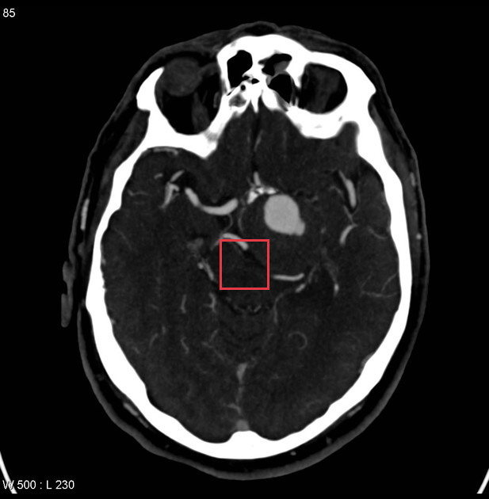
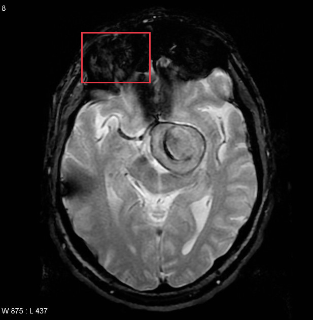
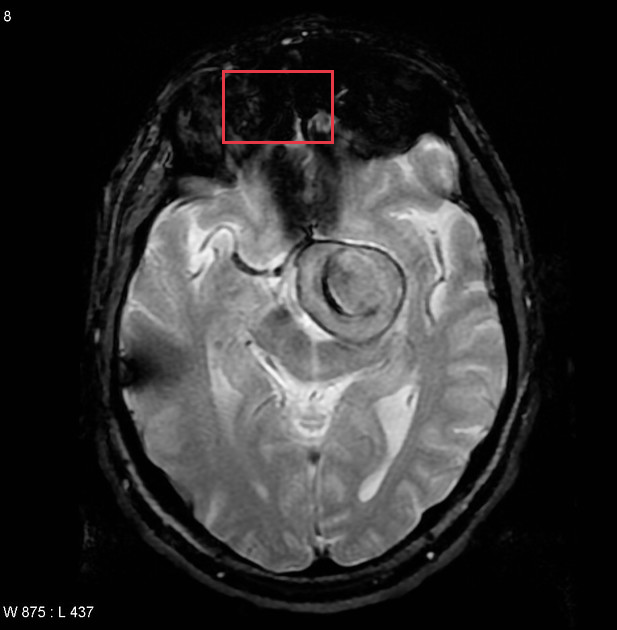
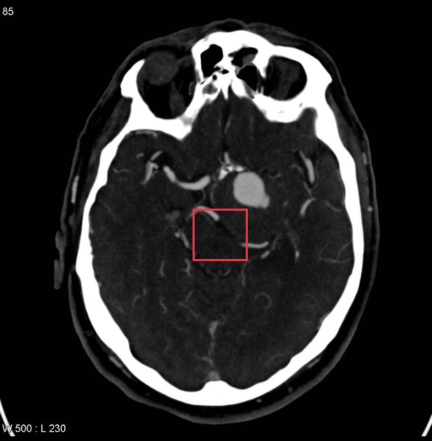
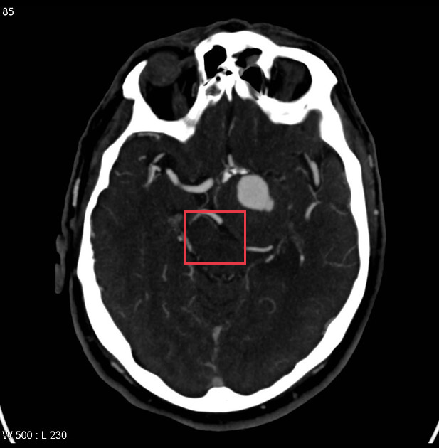
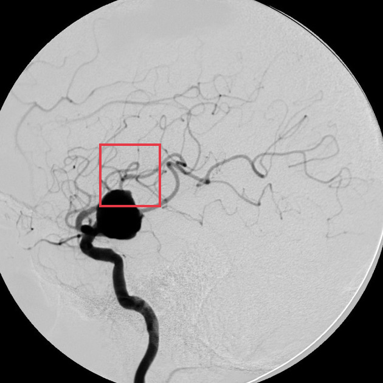

# Giant internal carotid artery aneurysm

[返回 Step 3 总览](../README_STEP3_VISUALIZATION.md)

- **Case ID：** `giant-internal-carotid-artery-aneurysm-1`
- **Case URL：** [https://radiopaedia.org/cases/giant-internal-carotid-artery-aneurysm-1?lang=us](https://radiopaedia.org/cases/giant-internal-carotid-artery-aneurysm-1?lang=us)
- **验证模型：** Qwen3-VL-8B
- **图像 / Step 2 findings：** 7 / 9
- **定位结果：** strong 3；partial 6；not support 12；parse error 0
- **Strong bbox relations：** 3
- **原始 JSON：** [case_evidence.json](../assets_step3/giant-internal-carotid-artery-aneurysm-1/case_evidence.json)
- **定量/定性验证 JSON：** [step_3_validation_case_evidence.json](../assets_step3/giant-internal-carotid-artery-aneurysm-1/step_3_validation_case_evidence.json)

**Overlay 图例：** 红框为跨图新定位；绿框为 IoU >= 0.5 的已有 bbox；黄框为未达到阈值的已有 bbox。

## Step 2 Finding Nodes

### Finding 1: `study_000_mri_image_000_axial_t2_f01`

- **Modality / subcategory：** MRI / Axial T2
- **bbox_2d：** `[495, 365, 690, 545]`
- **Lingshu caption：** The red box is located in the left temporal lobe. Within this region there is a ring enhancing lesion with surrounding vasogenic edema. The lesion measures approximately 1.5 cm in diameter. There is no mass effect on the adjacent structures.
- **中文翻译：** 红框位于左颞叶。该区域内可见环形强化病灶，周围伴血管源性水肿。病灶直径约 1.5 cm，邻近结构未见占位效应。

### Finding 2: `study_000_mri_image_001_axial_flair_f01`

- **Modality / subcategory：** MRI / Axial FLAIR
- **bbox_2d：** `[268, 58, 424, 194]`
- **Lingshu caption：** The right frontal lobe demonstrates a hyperintense signal on this axial flair sequence. The hyperintensity is located just above the Sylvian fissure. There is no evidence of mass effect or midline shift. The left frontal lobe appears unremarkable.
- **中文翻译：** 轴位 FLAIR 序列上右额叶可见高信号，位于外侧裂上方。未见占位效应或中线移位。左额叶未见异常。

### Finding 3: `study_000_mri_image_001_axial_flair_f02`

- **Modality / subcategory：** MRI / Axial FLAIR
- **bbox_2d：** `[598, 58, 754, 194]`
- **Lingshu caption：** The left frontal lobe demonstrates a small focus of increased signal intensity on this FLAIR sequence. There is no associated mass effect or contrast enhancement.
- **中文翻译：** FLAIR 序列上左额叶可见小灶性高信号，未伴占位效应或对比增强。

### Finding 4: `study_000_mri_image_001_axial_flair_f03`

- **Modality / subcategory：** MRI / Axial FLAIR
- **bbox_2d：** `[464, 346, 688, 554]`
- **Lingshu caption：** The axial FLAIR MRI image shows a hyperintense lesion located in the right basal ganglia region. The lesion appears to have a ring-like structure with a central hypointense area, suggesting a possible cystic or necrotic component. Surrounding the lesion, there is evidence of perilesional edema, indicated by the hyperintense signal extending into the adjacent white matter. The lesion&#x27;s borders are well-defined, and there is no significant mass effect observed on the surrounding brain structures. The ventricles appear symmetrical, and there is no midline shift noted.
- **中文翻译：** 轴位 FLAIR MRI 显示右侧基底节区高信号病灶。病灶似呈环形结构，中央为低信号，提示可能含囊性或坏死成分。周围可见病灶周围水肿，高信号延伸至邻近白质。病灶边界清楚，周围脑结构未见明显占位效应。双侧脑室对称，未见中线移位。

### Finding 5: `study_000_mri_image_002_axial_gradient_echo_f01`

- **Modality / subcategory：** MRI / Axial Gradient Echo
- **bbox_2d：** `[420, 308, 680, 550]`
- **Lingshu caption：** The red box is located over the left temporal lobe. Within this area there is a large heterogeneous mass with areas of T2 hypointensity likely representing hemorrhage. There is surrounding vasogenic edema. The mass effect from this lesion is causing a midline shift to the right.
- **中文翻译：** 红框位于左颞叶。该区域内可见较大的不均质肿块，内有 T2 低信号区，可能代表出血，周围伴血管源性水肿。病灶占位效应导致中线向右移位。

### Finding 6: `study_000_mri_image_003_mra_f01`

- **Modality / subcategory：** MRI / MRA
- **bbox_2d：** `[527, 320, 700, 530]`
- **Lingshu caption：** The image shows a magnetic resonance angiography (MRA) scan of the brain. Within the red box, there appears to be an area of increased signal intensity, which could potentially indicate an abnormality such as a vascular lesion or malformation. The surrounding vasculature appears relatively normal, with no obvious signs of stenosis or occlusion. However, without additional clinical information, it is difficult to determine the exact nature or significance of the observed finding.
- **中文翻译：** 图像为脑部磁共振血管成像。红框内似有信号增高区，可能提示血管性病变或畸形等异常。周围血管相对正常，未见明显狭窄或闭塞。但缺少更多临床资料时难以确定该征象的确切性质或意义。

### Finding 7: `study_001_ct_image_000_axial_c_arterial_phase_f01`

- **Modality / subcategory：** CT / Axial C+ arterial phase
- **bbox_2d：** `[492, 368, 614, 475]`
- **Lingshu caption：** The image shows a hyperdense lesion in the left middle cerebral artery territory, suggestive of an acute ischemic stroke. The lesion appears to be located in the left temporal lobe, with surrounding edema and mass effect. There is also evidence of contrast enhancement, indicating disruption of the blood-brain barrier.
- **中文翻译：** 图像显示左侧大脑中动脉供血区高密度病灶，提示急性缺血性卒中。病灶似位于左颞叶，周围伴水肿及占位效应，并可见对比增强，提示血脑屏障破坏。

### Finding 8: `study_002_dsa_angiography_image_000_lateral_internal_carotid_artery_f01`

- **Modality / subcategory：** DSA (angiography) / Lateral Internal carotid artery
- **bbox_2d：** `[231, 485, 376, 625]`
- **Lingshu caption：** The image shows a lateral view of the internal carotid artery. Within the boxed region, there is a saccular outpouching consistent with an aneurysm. The aneurysm appears to be located on the anterior communicating artery. The surrounding vasculature is well-visualized, with no apparent signs of occlusion or significant stenosis. The contrast flow through the arteries is smooth, indicating good perfusion. There are no other obvious abnormalities noted in the immediate vicinity of the aneurysm.
- **中文翻译：** 图像为颈内动脉侧位像。框内可见囊状膨出，符合动脉瘤表现，似位于前交通动脉。周围血管显示清楚，未见明显闭塞或显著狭窄。动脉内对比剂流动顺畅，提示灌注良好。动脉瘤附近未见其他明显异常。

### Finding 9: `study_002_dsa_angiography_image_001_frontal_internal_carotid_artery_f01`

- **Modality / subcategory：** DSA (angiography) / Frontal Internal carotid artery
- **bbox_2d：** `[528, 590, 668, 720]`
- **Lingshu caption：** The image shows a frontal view of the internal carotid artery. Within the boxed region, there is a saccular outpouching consistent with an aneurysm. The aneurysm appears to be located on the anterior cerebral artery (ACA) segment. The surrounding vasculature is well-visualized, with no apparent signs of occlusion or significant stenosis. The aneurysm&#x27;s neck appears narrow, and its sac is rounded. There are no signs of rupture or hemorrhage in the immediate vicinity.
- **中文翻译：** 图像为颈内动脉正位像。框内可见囊状膨出，符合动脉瘤表现，似位于大脑前动脉节段。周围血管显示清楚，未见明显闭塞或显著狭窄。动脉瘤颈较窄、瘤囊圆钝，附近未见破裂或出血征象。

## Directed Cross-image Validation

### Anchor 1: `study_000_mri_image_000_axial_t2_f01`

**Anchor Lingshu caption：** The red box is located in the left temporal lobe. Within this region there is a ring enhancing lesion with surrounding vasogenic edema. The lesion measures approximately 1.5 cm in diameter. There is no mass effect on the adjacent structures.
**Anchor caption 中文翻译：** 红框位于左颞叶。该区域内可见环形强化病灶，周围伴血管源性水肿。病灶直径约 1.5 cm，邻近结构未见占位效应。

#### location_00001: STRONG SUPPORT

<table>
<tr><th>Anchor original bbox</th><th>Cross-image grounded target bbox</th><th>Existing target bbox: study_000_mri_image_001_axial_flair_f01</th><th>Existing target bbox: study_000_mri_image_001_axial_flair_f02</th><th>Existing target bbox: study_000_mri_image_001_axial_flair_f03</th></tr>
<tr><td></td><td></td><td></td><td></td><td></td></tr>
</table>

- **Target：** `study_000_mri_image_001_axial_flair`; MRI; Axial FLAIR
- **Relation：** `bbox_to_bbox` / `strong_support`
- **Returned target bbox：** `[450, 380, 650, 580]`
- **Maximum IoU：** 0.597; threshold=0.5
- **Strong relation IDs：** `[&#x27;strong_location_00001_01&#x27;]`

**IoU matching：**

| Existing target bbox | IoU | Strong match | Lingshu caption | 中文翻译 |
|---|---:|---|---|---|
| `study_000_mri_image_001_axial_flair_f01`; `[268, 58, 424, 194]` | 0.000 | no | The right frontal lobe demonstrates a hyperintense signal on this axial flair sequence. The hyperintensity is located just above the Sylvian fissure. There is no evidence of mass effect or midline shift. The left frontal lobe appears unremarkable. | 轴位 FLAIR 序列上右额叶可见高信号，位于外侧裂上方。未见占位效应或中线移位。左额叶未见异常。 |
| `study_000_mri_image_001_axial_flair_f02`; `[598, 58, 754, 194]` | 0.000 | no | The left frontal lobe demonstrates a small focus of increased signal intensity on this FLAIR sequence. There is no associated mass effect or contrast enhancement. | FLAIR 序列上左额叶可见小灶性高信号，未伴占位效应或对比增强。 |
| `study_000_mri_image_001_axial_flair_f03`; `[464, 346, 688, 554]` | 0.597 | yes | The axial FLAIR MRI image shows a hyperintense lesion located in the right basal ganglia region. The lesion appears to have a ring-like structure with a central hypointense area, suggesting a possible cystic or necrotic component. Surrounding the lesion, there is evidence of perilesional edema, indicated by the hyperintense signal extending into the adjacent white matter. The lesion&#x27;s borders are well-defined, and there is no significant mass effect observed on the surrounding brain structures. The ventricles appear symmetrical, and there is no midline shift noted. | 轴位 FLAIR MRI 显示右侧基底节区高信号病灶。病灶似呈环形结构，中央为低信号，提示可能含囊性或坏死成分。周围可见病灶周围水肿，高信号延伸至邻近白质。病灶边界清楚，周围脑结构未见明显占位效应。双侧脑室对称，未见中线移位。 |

**Quantitative / qualitative validation：**

| Validation pair | Quantitative size / 定量 | Qualitative caption / 定性 |
|---|---|---|
| `strong__strong_location_00001_01` | `inconsistent` | `inconsistent` |

#### location_00002: STRONG SUPPORT

<table>
<tr><th>Anchor original bbox</th><th>Cross-image grounded target bbox</th><th>Existing target bbox: study_000_mri_image_002_axial_gradient_echo_f01</th></tr>
<tr><td></td><td></td><td></td></tr>
</table>

- **Target：** `study_000_mri_image_002_axial_gradient_echo`; MRI; Axial Gradient Echo
- **Relation：** `bbox_to_bbox` / `strong_support`
- **Returned target bbox：** `[380, 300, 620, 500]`
- **Maximum IoU：** 0.530; threshold=0.5
- **Strong relation IDs：** `[&#x27;strong_location_00002_01&#x27;]`

**IoU matching：**

| Existing target bbox | IoU | Strong match | Lingshu caption | 中文翻译 |
|---|---:|---|---|---|
| `study_000_mri_image_002_axial_gradient_echo_f01`; `[420, 308, 680, 550]` | 0.530 | yes | The red box is located over the left temporal lobe. Within this area there is a large heterogeneous mass with areas of T2 hypointensity likely representing hemorrhage. There is surrounding vasogenic edema. The mass effect from this lesion is causing a midline shift to the right. | 红框位于左颞叶。该区域内可见较大的不均质肿块，内有 T2 低信号区，可能代表出血，周围伴血管源性水肿。病灶占位效应导致中线向右移位。 |

**Quantitative / qualitative validation：**

| Validation pair | Quantitative size / 定量 | Qualitative caption / 定性 |
|---|---|---|
| `strong__strong_location_00002_01` | `inconsistent` | `inconsistent` |

#### location_00003: NOT SUPPORT

<table>
<tr><th>Anchor original bbox</th><th>Target original image; model returned null</th><th>Existing target bbox: study_000_mri_image_003_mra_f01</th></tr>
<tr><td></td><td></td><td></td></tr>
</table>

- **Target：** `study_000_mri_image_003_mra`; MRI; MRA
- **Relation：** `bbox_to_image` / `not_support`
- **Returned target bbox：** `unknown`
- **Maximum IoU：** n/a; threshold=0.5
- **Strong relation IDs：** `[]`

**IoU matching：**

| Existing target bbox | IoU | Strong match | Lingshu caption | 中文翻译 |
|---|---:|---|---|---|
| `study_000_mri_image_003_mra_f01`; `[527, 320, 700, 530]` | n/a | n/a | The image shows a magnetic resonance angiography (MRA) scan of the brain. Within the red box, there appears to be an area of increased signal intensity, which could potentially indicate an abnormality such as a vascular lesion or malformation. The surrounding vasculature appears relatively normal, with no obvious signs of stenosis or occlusion. However, without additional clinical information, it is difficult to determine the exact nature or significance of the observed finding. | 图像为脑部磁共振血管成像。红框内似有信号增高区，可能提示血管性病变或畸形等异常。周围血管相对正常，未见明显狭窄或闭塞。但缺少更多临床资料时难以确定该征象的确切性质或意义。 |

#### location_00004: PARTIAL SUPPORT

<table>
<tr><th>Anchor original bbox</th><th>Cross-image grounded target bbox</th><th>Existing target bbox: study_001_ct_image_000_axial_c_arterial_phase_f01</th></tr>
<tr><td></td><td></td><td></td></tr>
</table>

- **Target：** `study_001_ct_image_000_axial_c_arterial_phase`; CT; Axial C+ arterial phase
- **Relation：** `bbox_to_image` / `partial_support`
- **Returned target bbox：** `[450, 480, 550, 580]`
- **Maximum IoU：** 0.000; threshold=0.5
- **Strong relation IDs：** `[]`

**IoU matching：**

| Existing target bbox | IoU | Strong match | Lingshu caption | 中文翻译 |
|---|---:|---|---|---|
| `study_001_ct_image_000_axial_c_arterial_phase_f01`; `[492, 368, 614, 475]` | 0.000 | no | The image shows a hyperdense lesion in the left middle cerebral artery territory, suggestive of an acute ischemic stroke. The lesion appears to be located in the left temporal lobe, with surrounding edema and mass effect. There is also evidence of contrast enhancement, indicating disruption of the blood-brain barrier. | 图像显示左侧大脑中动脉供血区高密度病灶，提示急性缺血性卒中。病灶似位于左颞叶，周围伴水肿及占位效应，并可见对比增强，提示血脑屏障破坏。 |

**B 图单红框（Lingshu 实际输入）：**

**Re-ground Lingshu caption：** The image shows a hyperdense lesion in the left middle cerebral artery territory, consistent with an acute ischemic stroke. The lesion appears to be located in the left basal ganglia region, as indicated by the red box. There is no evidence of hemorrhage or other abnormalities in the surrounding brain parenchyma.
**Re-ground caption 中文翻译：** 图像显示左侧大脑中动脉供血区高密度病灶，符合急性缺血性卒中。红框所示病灶似位于左侧基底节区。周围脑实质未见出血或其他异常。

**Quantitative / qualitative validation：**

| Validation pair | Quantitative size / 定量 | Qualitative caption / 定性 |
|---|---|---|
| `partial__location_00004` | `inconsistent` | `inconsistent` |

#### location_00005: NOT SUPPORT

<table>
<tr><th>Anchor original bbox</th><th>Target original image; model returned null</th><th>Existing target bbox: study_002_dsa_angiography_image_000_lateral_internal_carotid_artery_f01</th></tr>
<tr><td></td><td></td><td></td></tr>
</table>

- **Target：** `study_002_dsa_angiography_image_000_lateral_internal_carotid_artery`; DSA (angiography); Lateral Internal carotid artery
- **Relation：** `bbox_to_image` / `not_support`
- **Returned target bbox：** `unknown`
- **Maximum IoU：** n/a; threshold=0.5
- **Strong relation IDs：** `[]`

**IoU matching：**

| Existing target bbox | IoU | Strong match | Lingshu caption | 中文翻译 |
|---|---:|---|---|---|
| `study_002_dsa_angiography_image_000_lateral_internal_carotid_artery_f01`; `[231, 485, 376, 625]` | n/a | n/a | The image shows a lateral view of the internal carotid artery. Within the boxed region, there is a saccular outpouching consistent with an aneurysm. The aneurysm appears to be located on the anterior communicating artery. The surrounding vasculature is well-visualized, with no apparent signs of occlusion or significant stenosis. The contrast flow through the arteries is smooth, indicating good perfusion. There are no other obvious abnormalities noted in the immediate vicinity of the aneurysm. | 图像为颈内动脉侧位像。框内可见囊状膨出，符合动脉瘤表现，似位于前交通动脉。周围血管显示清楚，未见明显闭塞或显著狭窄。动脉内对比剂流动顺畅，提示灌注良好。动脉瘤附近未见其他明显异常。 |

#### location_00006: NOT SUPPORT

<table>
<tr><th>Anchor original bbox</th><th>Target original image; model returned null</th><th>Existing target bbox: study_002_dsa_angiography_image_001_frontal_internal_carotid_artery_f01</th></tr>
<tr><td></td><td></td><td></td></tr>
</table>

- **Target：** `study_002_dsa_angiography_image_001_frontal_internal_carotid_artery`; DSA (angiography); Frontal Internal carotid artery
- **Relation：** `bbox_to_image` / `not_support`
- **Returned target bbox：** `unknown`
- **Maximum IoU：** n/a; threshold=0.5
- **Strong relation IDs：** `[]`

**IoU matching：**

| Existing target bbox | IoU | Strong match | Lingshu caption | 中文翻译 |
|---|---:|---|---|---|
| `study_002_dsa_angiography_image_001_frontal_internal_carotid_artery_f01`; `[528, 590, 668, 720]` | n/a | n/a | The image shows a frontal view of the internal carotid artery. Within the boxed region, there is a saccular outpouching consistent with an aneurysm. The aneurysm appears to be located on the anterior cerebral artery (ACA) segment. The surrounding vasculature is well-visualized, with no apparent signs of occlusion or significant stenosis. The aneurysm&#x27;s neck appears narrow, and its sac is rounded. There are no signs of rupture or hemorrhage in the immediate vicinity. | 图像为颈内动脉正位像。框内可见囊状膨出，符合动脉瘤表现，似位于大脑前动脉节段。周围血管显示清楚，未见明显闭塞或显著狭窄。动脉瘤颈较窄、瘤囊圆钝，附近未见破裂或出血征象。 |

### Anchor 2: `study_000_mri_image_001_axial_flair_f01`

**Anchor Lingshu caption：** The right frontal lobe demonstrates a hyperintense signal on this axial flair sequence. The hyperintensity is located just above the Sylvian fissure. There is no evidence of mass effect or midline shift. The left frontal lobe appears unremarkable.
**Anchor caption 中文翻译：** 轴位 FLAIR 序列上右额叶可见高信号，位于外侧裂上方。未见占位效应或中线移位。左额叶未见异常。

#### location_00007: PARTIAL SUPPORT

<table>
<tr><th>Anchor original bbox</th><th>Cross-image grounded target bbox</th><th>Existing target bbox: study_000_mri_image_002_axial_gradient_echo_f01</th></tr>
<tr><td></td><td></td><td></td></tr>
</table>

- **Target：** `study_000_mri_image_002_axial_gradient_echo`; MRI; Axial Gradient Echo
- **Relation：** `bbox_to_image` / `partial_support`
- **Returned target bbox：** `[260, 100, 480, 260]`
- **Maximum IoU：** 0.000; threshold=0.5
- **Strong relation IDs：** `[]`

**IoU matching：**

| Existing target bbox | IoU | Strong match | Lingshu caption | 中文翻译 |
|---|---:|---|---|---|
| `study_000_mri_image_002_axial_gradient_echo_f01`; `[420, 308, 680, 550]` | 0.000 | no | The red box is located over the left temporal lobe. Within this area there is a large heterogeneous mass with areas of T2 hypointensity likely representing hemorrhage. There is surrounding vasogenic edema. The mass effect from this lesion is causing a midline shift to the right. | 红框位于左颞叶。该区域内可见较大的不均质肿块，内有 T2 低信号区，可能代表出血，周围伴血管源性水肿。病灶占位效应导致中线向右移位。 |

**B 图单红框（Lingshu 实际输入）：**

**Re-ground Lingshu caption：** The red box is located in the right frontal lobe. Within this region there is a large area of signal loss which is consistent with blood products. There is also a smaller area of signal loss in the left frontal lobe.
**Re-ground caption 中文翻译：** 红框位于右额叶。该区域内可见大片信号缺失，符合血液产物表现。左额叶另见较小信号缺失区。

**Quantitative / qualitative validation：**

| Validation pair | Quantitative size / 定量 | Qualitative caption / 定性 |
|---|---|---|
| `partial__location_00007` | `consistent` | `consistent` |

#### location_00008: NOT SUPPORT

<table>
<tr><th>Anchor original bbox</th><th>Target original image; model returned null</th><th>Existing target bbox: study_000_mri_image_003_mra_f01</th></tr>
<tr><td></td><td></td><td></td></tr>
</table>

- **Target：** `study_000_mri_image_003_mra`; MRI; MRA
- **Relation：** `bbox_to_image` / `not_support`
- **Returned target bbox：** `unknown`
- **Maximum IoU：** n/a; threshold=0.5
- **Strong relation IDs：** `[]`

**IoU matching：**

| Existing target bbox | IoU | Strong match | Lingshu caption | 中文翻译 |
|---|---:|---|---|---|
| `study_000_mri_image_003_mra_f01`; `[527, 320, 700, 530]` | n/a | n/a | The image shows a magnetic resonance angiography (MRA) scan of the brain. Within the red box, there appears to be an area of increased signal intensity, which could potentially indicate an abnormality such as a vascular lesion or malformation. The surrounding vasculature appears relatively normal, with no obvious signs of stenosis or occlusion. However, without additional clinical information, it is difficult to determine the exact nature or significance of the observed finding. | 图像为脑部磁共振血管成像。红框内似有信号增高区，可能提示血管性病变或畸形等异常。周围血管相对正常，未见明显狭窄或闭塞。但缺少更多临床资料时难以确定该征象的确切性质或意义。 |

#### location_00009: NOT SUPPORT

<table>
<tr><th>Anchor original bbox</th><th>Target original image; model returned null</th><th>Existing target bbox: study_001_ct_image_000_axial_c_arterial_phase_f01</th></tr>
<tr><td></td><td></td><td></td></tr>
</table>

- **Target：** `study_001_ct_image_000_axial_c_arterial_phase`; CT; Axial C+ arterial phase
- **Relation：** `bbox_to_image` / `not_support`
- **Returned target bbox：** `unknown`
- **Maximum IoU：** n/a; threshold=0.5
- **Strong relation IDs：** `[]`

**IoU matching：**

| Existing target bbox | IoU | Strong match | Lingshu caption | 中文翻译 |
|---|---:|---|---|---|
| `study_001_ct_image_000_axial_c_arterial_phase_f01`; `[492, 368, 614, 475]` | n/a | n/a | The image shows a hyperdense lesion in the left middle cerebral artery territory, suggestive of an acute ischemic stroke. The lesion appears to be located in the left temporal lobe, with surrounding edema and mass effect. There is also evidence of contrast enhancement, indicating disruption of the blood-brain barrier. | 图像显示左侧大脑中动脉供血区高密度病灶，提示急性缺血性卒中。病灶似位于左颞叶，周围伴水肿及占位效应，并可见对比增强，提示血脑屏障破坏。 |

#### location_00010: NOT SUPPORT

<table>
<tr><th>Anchor original bbox</th><th>Target original image; model returned null</th><th>Existing target bbox: study_002_dsa_angiography_image_000_lateral_internal_carotid_artery_f01</th></tr>
<tr><td></td><td></td><td></td></tr>
</table>

- **Target：** `study_002_dsa_angiography_image_000_lateral_internal_carotid_artery`; DSA (angiography); Lateral Internal carotid artery
- **Relation：** `bbox_to_image` / `not_support`
- **Returned target bbox：** `unknown`
- **Maximum IoU：** n/a; threshold=0.5
- **Strong relation IDs：** `[]`

**IoU matching：**

| Existing target bbox | IoU | Strong match | Lingshu caption | 中文翻译 |
|---|---:|---|---|---|
| `study_002_dsa_angiography_image_000_lateral_internal_carotid_artery_f01`; `[231, 485, 376, 625]` | n/a | n/a | The image shows a lateral view of the internal carotid artery. Within the boxed region, there is a saccular outpouching consistent with an aneurysm. The aneurysm appears to be located on the anterior communicating artery. The surrounding vasculature is well-visualized, with no apparent signs of occlusion or significant stenosis. The contrast flow through the arteries is smooth, indicating good perfusion. There are no other obvious abnormalities noted in the immediate vicinity of the aneurysm. | 图像为颈内动脉侧位像。框内可见囊状膨出，符合动脉瘤表现，似位于前交通动脉。周围血管显示清楚，未见明显闭塞或显著狭窄。动脉内对比剂流动顺畅，提示灌注良好。动脉瘤附近未见其他明显异常。 |

#### location_00011: NOT SUPPORT

<table>
<tr><th>Anchor original bbox</th><th>Target original image; model returned null</th><th>Existing target bbox: study_002_dsa_angiography_image_001_frontal_internal_carotid_artery_f01</th></tr>
<tr><td></td><td></td><td></td></tr>
</table>

- **Target：** `study_002_dsa_angiography_image_001_frontal_internal_carotid_artery`; DSA (angiography); Frontal Internal carotid artery
- **Relation：** `bbox_to_image` / `not_support`
- **Returned target bbox：** `unknown`
- **Maximum IoU：** n/a; threshold=0.5
- **Strong relation IDs：** `[]`

**IoU matching：**

| Existing target bbox | IoU | Strong match | Lingshu caption | 中文翻译 |
|---|---:|---|---|---|
| `study_002_dsa_angiography_image_001_frontal_internal_carotid_artery_f01`; `[528, 590, 668, 720]` | n/a | n/a | The image shows a frontal view of the internal carotid artery. Within the boxed region, there is a saccular outpouching consistent with an aneurysm. The aneurysm appears to be located on the anterior cerebral artery (ACA) segment. The surrounding vasculature is well-visualized, with no apparent signs of occlusion or significant stenosis. The aneurysm&#x27;s neck appears narrow, and its sac is rounded. There are no signs of rupture or hemorrhage in the immediate vicinity. | 图像为颈内动脉正位像。框内可见囊状膨出，符合动脉瘤表现，似位于大脑前动脉节段。周围血管显示清楚，未见明显闭塞或显著狭窄。动脉瘤颈较窄、瘤囊圆钝，附近未见破裂或出血征象。 |

### Anchor 3: `study_000_mri_image_001_axial_flair_f02`

**Anchor Lingshu caption：** The left frontal lobe demonstrates a small focus of increased signal intensity on this FLAIR sequence. There is no associated mass effect or contrast enhancement.
**Anchor caption 中文翻译：** FLAIR 序列上左额叶可见小灶性高信号，未伴占位效应或对比增强。

#### location_00012: PARTIAL SUPPORT

<table>
<tr><th>Anchor original bbox</th><th>Cross-image grounded target bbox</th><th>Existing target bbox: study_000_mri_image_002_axial_gradient_echo_f01</th></tr>
<tr><td></td><td></td><td></td></tr>
</table>

- **Target：** `study_000_mri_image_002_axial_gradient_echo`; MRI; Axial Gradient Echo
- **Relation：** `bbox_to_image` / `partial_support`
- **Returned target bbox：** `[360, 112, 540, 228]`
- **Maximum IoU：** 0.000; threshold=0.5
- **Strong relation IDs：** `[]`

**IoU matching：**

| Existing target bbox | IoU | Strong match | Lingshu caption | 中文翻译 |
|---|---:|---|---|---|
| `study_000_mri_image_002_axial_gradient_echo_f01`; `[420, 308, 680, 550]` | 0.000 | no | The red box is located over the left temporal lobe. Within this area there is a large heterogeneous mass with areas of T2 hypointensity likely representing hemorrhage. There is surrounding vasogenic edema. The mass effect from this lesion is causing a midline shift to the right. | 红框位于左颞叶。该区域内可见较大的不均质肿块，内有 T2 低信号区，可能代表出血，周围伴血管源性水肿。病灶占位效应导致中线向右移位。 |

**B 图单红框（Lingshu 实际输入）：**

**Re-ground Lingshu caption：** The red box is located in the right frontal lobe. Within this area there is a small focus of blooming artifact which could represent a calcification or hemorrhage. There is no associated mass effect or edema. The remainder of the brain parenchyma is unremarkable.
**Re-ground caption 中文翻译：** 红框位于右额叶，其中可见小灶性磁敏感伪影，可能代表钙化或出血。未伴占位效应或水肿。其余脑实质未见异常。

**Quantitative / qualitative validation：**

| Validation pair | Quantitative size / 定量 | Qualitative caption / 定性 |
|---|---|---|
| `partial__location_00012` | `consistent` | `consistent` |

#### location_00013: NOT SUPPORT

<table>
<tr><th>Anchor original bbox</th><th>Target original image; model returned null</th><th>Existing target bbox: study_000_mri_image_003_mra_f01</th></tr>
<tr><td></td><td></td><td></td></tr>
</table>

- **Target：** `study_000_mri_image_003_mra`; MRI; MRA
- **Relation：** `bbox_to_image` / `not_support`
- **Returned target bbox：** `unknown`
- **Maximum IoU：** n/a; threshold=0.5
- **Strong relation IDs：** `[]`

**IoU matching：**

| Existing target bbox | IoU | Strong match | Lingshu caption | 中文翻译 |
|---|---:|---|---|---|
| `study_000_mri_image_003_mra_f01`; `[527, 320, 700, 530]` | n/a | n/a | The image shows a magnetic resonance angiography (MRA) scan of the brain. Within the red box, there appears to be an area of increased signal intensity, which could potentially indicate an abnormality such as a vascular lesion or malformation. The surrounding vasculature appears relatively normal, with no obvious signs of stenosis or occlusion. However, without additional clinical information, it is difficult to determine the exact nature or significance of the observed finding. | 图像为脑部磁共振血管成像。红框内似有信号增高区，可能提示血管性病变或畸形等异常。周围血管相对正常，未见明显狭窄或闭塞。但缺少更多临床资料时难以确定该征象的确切性质或意义。 |

#### location_00014: PARTIAL SUPPORT

<table>
<tr><th>Anchor original bbox</th><th>Cross-image grounded target bbox</th><th>Existing target bbox: study_001_ct_image_000_axial_c_arterial_phase_f01</th></tr>
<tr><td></td><td></td><td></td></tr>
</table>

- **Target：** `study_001_ct_image_000_axial_c_arterial_phase`; CT; Axial C+ arterial phase
- **Relation：** `bbox_to_image` / `partial_support`
- **Returned target bbox：** `[447, 474, 573, 592]`
- **Maximum IoU：** 0.005; threshold=0.5
- **Strong relation IDs：** `[]`

**IoU matching：**

| Existing target bbox | IoU | Strong match | Lingshu caption | 中文翻译 |
|---|---:|---|---|---|
| `study_001_ct_image_000_axial_c_arterial_phase_f01`; `[492, 368, 614, 475]` | 0.005 | no | The image shows a hyperdense lesion in the left middle cerebral artery territory, suggestive of an acute ischemic stroke. The lesion appears to be located in the left temporal lobe, with surrounding edema and mass effect. There is also evidence of contrast enhancement, indicating disruption of the blood-brain barrier. | 图像显示左侧大脑中动脉供血区高密度病灶，提示急性缺血性卒中。病灶似位于左颞叶，周围伴水肿及占位效应，并可见对比增强，提示血脑屏障破坏。 |

**B 图单红框（Lingshu 实际输入）：**

**Re-ground Lingshu caption：** The image shows a hyperdense lesion in the left middle cerebral artery territory, consistent with an acute ischemic stroke. The lesion appears to be located in the left basal ganglia region, as indicated by the red box. There is no evidence of hemorrhage or other abnormalities in the surrounding brain parenchyma.
**Re-ground caption 中文翻译：** 图像显示左侧大脑中动脉供血区高密度病灶，符合急性缺血性卒中。红框所示病灶似位于左侧基底节区。周围脑实质未见出血或其他异常。

**Quantitative / qualitative validation：**

| Validation pair | Quantitative size / 定量 | Qualitative caption / 定性 |
|---|---|---|
| `partial__location_00014` | `inconsistent` | `inconsistent` |

#### location_00015: NOT SUPPORT

<table>
<tr><th>Anchor original bbox</th><th>Target original image; model returned null</th><th>Existing target bbox: study_002_dsa_angiography_image_000_lateral_internal_carotid_artery_f01</th></tr>
<tr><td></td><td></td><td></td></tr>
</table>

- **Target：** `study_002_dsa_angiography_image_000_lateral_internal_carotid_artery`; DSA (angiography); Lateral Internal carotid artery
- **Relation：** `bbox_to_image` / `not_support`
- **Returned target bbox：** `unknown`
- **Maximum IoU：** n/a; threshold=0.5
- **Strong relation IDs：** `[]`

**IoU matching：**

| Existing target bbox | IoU | Strong match | Lingshu caption | 中文翻译 |
|---|---:|---|---|---|
| `study_002_dsa_angiography_image_000_lateral_internal_carotid_artery_f01`; `[231, 485, 376, 625]` | n/a | n/a | The image shows a lateral view of the internal carotid artery. Within the boxed region, there is a saccular outpouching consistent with an aneurysm. The aneurysm appears to be located on the anterior communicating artery. The surrounding vasculature is well-visualized, with no apparent signs of occlusion or significant stenosis. The contrast flow through the arteries is smooth, indicating good perfusion. There are no other obvious abnormalities noted in the immediate vicinity of the aneurysm. | 图像为颈内动脉侧位像。框内可见囊状膨出，符合动脉瘤表现，似位于前交通动脉。周围血管显示清楚，未见明显闭塞或显著狭窄。动脉内对比剂流动顺畅，提示灌注良好。动脉瘤附近未见其他明显异常。 |

#### location_00016: NOT SUPPORT

<table>
<tr><th>Anchor original bbox</th><th>Target original image; model returned null</th><th>Existing target bbox: study_002_dsa_angiography_image_001_frontal_internal_carotid_artery_f01</th></tr>
<tr><td></td><td></td><td></td></tr>
</table>

- **Target：** `study_002_dsa_angiography_image_001_frontal_internal_carotid_artery`; DSA (angiography); Frontal Internal carotid artery
- **Relation：** `bbox_to_image` / `not_support`
- **Returned target bbox：** `unknown`
- **Maximum IoU：** n/a; threshold=0.5
- **Strong relation IDs：** `[]`

**IoU matching：**

| Existing target bbox | IoU | Strong match | Lingshu caption | 中文翻译 |
|---|---:|---|---|---|
| `study_002_dsa_angiography_image_001_frontal_internal_carotid_artery_f01`; `[528, 590, 668, 720]` | n/a | n/a | The image shows a frontal view of the internal carotid artery. Within the boxed region, there is a saccular outpouching consistent with an aneurysm. The aneurysm appears to be located on the anterior cerebral artery (ACA) segment. The surrounding vasculature is well-visualized, with no apparent signs of occlusion or significant stenosis. The aneurysm&#x27;s neck appears narrow, and its sac is rounded. There are no signs of rupture or hemorrhage in the immediate vicinity. | 图像为颈内动脉正位像。框内可见囊状膨出，符合动脉瘤表现，似位于大脑前动脉节段。周围血管显示清楚，未见明显闭塞或显著狭窄。动脉瘤颈较窄、瘤囊圆钝，附近未见破裂或出血征象。 |

### Anchor 4: `study_000_mri_image_003_mra_f01`

**Anchor Lingshu caption：** The image shows a magnetic resonance angiography (MRA) scan of the brain. Within the red box, there appears to be an area of increased signal intensity, which could potentially indicate an abnormality such as a vascular lesion or malformation. The surrounding vasculature appears relatively normal, with no obvious signs of stenosis or occlusion. However, without additional clinical information, it is difficult to determine the exact nature or significance of the observed finding.
**Anchor caption 中文翻译：** 图像为脑部磁共振血管成像。红框内似有信号增高区，可能提示血管性病变或畸形等异常。周围血管相对正常，未见明显狭窄或闭塞。但缺少更多临床资料时难以确定该征象的确切性质或意义。

#### location_00026: PARTIAL SUPPORT

<table>
<tr><th>Anchor original bbox</th><th>Cross-image grounded target bbox</th><th>Existing target bbox: study_001_ct_image_000_axial_c_arterial_phase_f01</th></tr>
<tr><td></td><td></td><td></td></tr>
</table>

- **Target：** `study_001_ct_image_000_axial_c_arterial_phase`; CT; Axial C+ arterial phase
- **Relation：** `bbox_to_image` / `partial_support`
- **Returned target bbox：** `[420, 470, 560, 590]`
- **Maximum IoU：** 0.011; threshold=0.5
- **Strong relation IDs：** `[]`

**IoU matching：**

| Existing target bbox | IoU | Strong match | Lingshu caption | 中文翻译 |
|---|---:|---|---|---|
| `study_001_ct_image_000_axial_c_arterial_phase_f01`; `[492, 368, 614, 475]` | 0.011 | no | The image shows a hyperdense lesion in the left middle cerebral artery territory, suggestive of an acute ischemic stroke. The lesion appears to be located in the left temporal lobe, with surrounding edema and mass effect. There is also evidence of contrast enhancement, indicating disruption of the blood-brain barrier. | 图像显示左侧大脑中动脉供血区高密度病灶，提示急性缺血性卒中。病灶似位于左颞叶，周围伴水肿及占位效应，并可见对比增强，提示血脑屏障破坏。 |

**B 图单红框（Lingshu 实际输入）：**

**Re-ground Lingshu caption：** The image shows a hyperdense lesion in the left middle cerebral artery territory, suggestive of an acute ischemic stroke. The lesion appears to be located in the left hemisphere, involving the frontal and parietal lobes. There is no evidence of hemorrhage or mass effect. The ventricles appear normal in size and shape.
**Re-ground caption 中文翻译：** 图像显示左侧大脑中动脉供血区高密度病灶，提示急性缺血性卒中。病灶似位于左侧大脑半球并累及额叶和顶叶。未见出血或占位效应。脑室大小和形态正常。

**Quantitative / qualitative validation：**

| Validation pair | Quantitative size / 定量 | Qualitative caption / 定性 |
|---|---|---|
| `partial__location_00026` | `inconsistent` | `inconsistent` |

#### location_00027: STRONG SUPPORT

<table>
<tr><th>Anchor original bbox</th><th>Cross-image grounded target bbox</th><th>Existing target bbox: study_002_dsa_angiography_image_000_lateral_internal_carotid_artery_f01</th></tr>
<tr><td></td><td></td><td></td></tr>
</table>

- **Target：** `study_002_dsa_angiography_image_000_lateral_internal_carotid_artery`; DSA (angiography); Lateral Internal carotid artery
- **Relation：** `bbox_to_bbox` / `strong_support`
- **Returned target bbox：** `[210, 444, 377, 617]`
- **Maximum IoU：** 0.635; threshold=0.5
- **Strong relation IDs：** `[&#x27;strong_location_00027_01&#x27;]`

**IoU matching：**

| Existing target bbox | IoU | Strong match | Lingshu caption | 中文翻译 |
|---|---:|---|---|---|
| `study_002_dsa_angiography_image_000_lateral_internal_carotid_artery_f01`; `[231, 485, 376, 625]` | 0.635 | yes | The image shows a lateral view of the internal carotid artery. Within the boxed region, there is a saccular outpouching consistent with an aneurysm. The aneurysm appears to be located on the anterior communicating artery. The surrounding vasculature is well-visualized, with no apparent signs of occlusion or significant stenosis. The contrast flow through the arteries is smooth, indicating good perfusion. There are no other obvious abnormalities noted in the immediate vicinity of the aneurysm. | 图像为颈内动脉侧位像。框内可见囊状膨出，符合动脉瘤表现，似位于前交通动脉。周围血管显示清楚，未见明显闭塞或显著狭窄。动脉内对比剂流动顺畅，提示灌注良好。动脉瘤附近未见其他明显异常。 |

**Quantitative / qualitative validation：**

| Validation pair | Quantitative size / 定量 | Qualitative caption / 定性 |
|---|---|---|
| `strong__strong_location_00027_01` | `consistent` | `consistent` |

#### location_00028: NOT SUPPORT

<table>
<tr><th>Anchor original bbox</th><th>Target original image; model returned null</th><th>Existing target bbox: study_002_dsa_angiography_image_001_frontal_internal_carotid_artery_f01</th></tr>
<tr><td></td><td></td><td></td></tr>
</table>

- **Target：** `study_002_dsa_angiography_image_001_frontal_internal_carotid_artery`; DSA (angiography); Frontal Internal carotid artery
- **Relation：** `bbox_to_image` / `not_support`
- **Returned target bbox：** `unknown`
- **Maximum IoU：** n/a; threshold=0.5
- **Strong relation IDs：** `[]`

**IoU matching：**

| Existing target bbox | IoU | Strong match | Lingshu caption | 中文翻译 |
|---|---:|---|---|---|
| `study_002_dsa_angiography_image_001_frontal_internal_carotid_artery_f01`; `[528, 590, 668, 720]` | n/a | n/a | The image shows a frontal view of the internal carotid artery. Within the boxed region, there is a saccular outpouching consistent with an aneurysm. The aneurysm appears to be located on the anterior cerebral artery (ACA) segment. The surrounding vasculature is well-visualized, with no apparent signs of occlusion or significant stenosis. The aneurysm&#x27;s neck appears narrow, and its sac is rounded. There are no signs of rupture or hemorrhage in the immediate vicinity. | 图像为颈内动脉正位像。框内可见囊状膨出，符合动脉瘤表现，似位于大脑前动脉节段。周围血管显示清楚，未见明显闭塞或显著狭窄。动脉瘤颈较窄、瘤囊圆钝，附近未见破裂或出血征象。 |

### Anchor 5: `study_001_ct_image_000_axial_c_arterial_phase_f01`

**Anchor Lingshu caption：** The image shows a hyperdense lesion in the left middle cerebral artery territory, suggestive of an acute ischemic stroke. The lesion appears to be located in the left temporal lobe, with surrounding edema and mass effect. There is also evidence of contrast enhancement, indicating disruption of the blood-brain barrier.
**Anchor caption 中文翻译：** 图像显示左侧大脑中动脉供血区高密度病灶，提示急性缺血性卒中。病灶似位于左颞叶，周围伴水肿及占位效应，并可见对比增强，提示血脑屏障破坏。

#### location_00029: PARTIAL SUPPORT

<table>
<tr><th>Anchor original bbox</th><th>Cross-image grounded target bbox</th><th>Existing target bbox: study_002_dsa_angiography_image_000_lateral_internal_carotid_artery_f01</th></tr>
<tr><td></td><td></td><td></td></tr>
</table>

- **Target：** `study_002_dsa_angiography_image_000_lateral_internal_carotid_artery`; DSA (angiography); Lateral Internal carotid artery
- **Relation：** `bbox_to_image` / `partial_support`
- **Returned target bbox：** `[260, 375, 420, 540]`
- **Maximum IoU：** 0.160; threshold=0.5
- **Strong relation IDs：** `[]`

**IoU matching：**

| Existing target bbox | IoU | Strong match | Lingshu caption | 中文翻译 |
|---|---:|---|---|---|
| `study_002_dsa_angiography_image_000_lateral_internal_carotid_artery_f01`; `[231, 485, 376, 625]` | 0.160 | no | The image shows a lateral view of the internal carotid artery. Within the boxed region, there is a saccular outpouching consistent with an aneurysm. The aneurysm appears to be located on the anterior communicating artery. The surrounding vasculature is well-visualized, with no apparent signs of occlusion or significant stenosis. The contrast flow through the arteries is smooth, indicating good perfusion. There are no other obvious abnormalities noted in the immediate vicinity of the aneurysm. | 图像为颈内动脉侧位像。框内可见囊状膨出，符合动脉瘤表现，似位于前交通动脉。周围血管显示清楚，未见明显闭塞或显著狭窄。动脉内对比剂流动顺畅，提示灌注良好。动脉瘤附近未见其他明显异常。 |

**B 图单红框（Lingshu 实际输入）：**

**Re-ground Lingshu caption：** The image shows a lateral view of the internal carotid artery. Within the boxed region, there appears to be an irregularity or abnormality in the vascular structure. The vessels in this area seem to have an unusual branching pattern or possible stenosis. The surrounding vasculature appears relatively normal, with clear delineation of the arterial branches. No obvious signs of hemorrhage or large vessel occlusion are noted outside the boxed area.
**Re-ground caption 中文翻译：** 图像为颈内动脉侧位像。框内血管结构似有不规则或异常，局部血管分支模式异常或可能存在狭窄。周围血管相对正常，动脉分支显示清楚。框外未见明显出血或大血管闭塞。

**Quantitative / qualitative validation：**

| Validation pair | Quantitative size / 定量 | Qualitative caption / 定性 |
|---|---|---|
| `partial__location_00029` | `inconsistent` | `inconsistent` |

#### location_00030: NOT SUPPORT

<table>
<tr><th>Anchor original bbox</th><th>Target original image; model returned null</th><th>Existing target bbox: study_002_dsa_angiography_image_001_frontal_internal_carotid_artery_f01</th></tr>
<tr><td></td><td></td><td></td></tr>
</table>

- **Target：** `study_002_dsa_angiography_image_001_frontal_internal_carotid_artery`; DSA (angiography); Frontal Internal carotid artery
- **Relation：** `bbox_to_image` / `not_support`
- **Returned target bbox：** `unknown`
- **Maximum IoU：** n/a; threshold=0.5
- **Strong relation IDs：** `[]`

**IoU matching：**

| Existing target bbox | IoU | Strong match | Lingshu caption | 中文翻译 |
|---|---:|---|---|---|
| `study_002_dsa_angiography_image_001_frontal_internal_carotid_artery_f01`; `[528, 590, 668, 720]` | n/a | n/a | The image shows a frontal view of the internal carotid artery. Within the boxed region, there is a saccular outpouching consistent with an aneurysm. The aneurysm appears to be located on the anterior cerebral artery (ACA) segment. The surrounding vasculature is well-visualized, with no apparent signs of occlusion or significant stenosis. The aneurysm&#x27;s neck appears narrow, and its sac is rounded. There are no signs of rupture or hemorrhage in the immediate vicinity. | 图像为颈内动脉正位像。框内可见囊状膨出，符合动脉瘤表现，似位于大脑前动脉节段。周围血管显示清楚，未见明显闭塞或显著狭窄。动脉瘤颈较窄、瘤囊圆钝，附近未见破裂或出血征象。 |

## Dynamically Skipped Anchors

| Anchor node | Reused strong relations | Skipped target images |
|---|---|---|
| `study_000_mri_image_001_axial_flair_f03` | `[&#x27;strong_location_00001_01&#x27;]` | `[&#x27;study_000_mri_image_002_axial_gradient_echo&#x27;, &#x27;study_000_mri_image_003_mra&#x27;, &#x27;study_001_ct_image_000_axial_c_arterial_phase&#x27;, &#x27;study_002_dsa_angiography_image_000_lateral_internal_carotid_artery&#x27;, &#x27;study_002_dsa_angiography_image_001_frontal_internal_carotid_artery&#x27;]` |
| `study_000_mri_image_002_axial_gradient_echo_f01` | `[&#x27;strong_location_00002_01&#x27;]` | `[&#x27;study_000_mri_image_003_mra&#x27;, &#x27;study_001_ct_image_000_axial_c_arterial_phase&#x27;, &#x27;study_002_dsa_angiography_image_000_lateral_internal_carotid_artery&#x27;, &#x27;study_002_dsa_angiography_image_001_frontal_internal_carotid_artery&#x27;]` |
| `study_002_dsa_angiography_image_000_lateral_internal_carotid_artery_f01` | `[&#x27;strong_location_00027_01&#x27;]` | `[&#x27;study_002_dsa_angiography_image_001_frontal_internal_carotid_artery&#x27;]` |

## Case-level Location Validation Summary / 病例级定位验证总结

- **Strong support：** 3 个 bbox-to-bbox 关系
- **Partial support：** 6 个 bbox-to-image 关系
- **Not support：** 12 个 bbox-to-image 关系

### Strong Support

#### Strong 1: `study_000_mri_image_000_axial_t2_f01` ↔ `study_000_mri_image_001_axial_flair_f03`

- **Relation / query：** `strong_location_00001_01` / `location_00001`
- **IoU：** 0.597（threshold=0.5）

<table>
<tr><th>Anchor bbox</th><th>Cross-image grounded target bbox</th><th>Matched target bbox</th></tr>
<tr><td></td><td></td><td></td></tr>
</table>

- **Anchor Lingshu caption：** The red box is located in the left temporal lobe. Within this region there is a ring enhancing lesion with surrounding vasogenic edema. The lesion measures approximately 1.5 cm in diameter. There is no mass effect on the adjacent structures.
- **Anchor caption 中文翻译：** 红框位于左颞叶。该区域内可见环形强化病灶，周围伴血管源性水肿。病灶直径约 1.5 cm，邻近结构未见占位效应。
- **Target Lingshu caption：** The axial FLAIR MRI image shows a hyperintense lesion located in the right basal ganglia region. The lesion appears to have a ring-like structure with a central hypointense area, suggesting a possible cystic or necrotic component. Surrounding the lesion, there is evidence of perilesional edema, indicated by the hyperintense signal extending into the adjacent white matter. The lesion&#x27;s borders are well-defined, and there is no significant mass effect observed on the surrounding brain structures. The ventricles appear symmetrical, and there is no midline shift noted.
- **Target caption 中文翻译：** 轴位 FLAIR MRI 显示右侧基底节区高信号病灶。病灶似呈环形结构，中央为低信号，提示可能含囊性或坏死成分。周围可见病灶周围水肿，高信号延伸至邻近白质。病灶边界清楚，周围脑结构未见明显占位效应。双侧脑室对称，未见中线移位。
- **Quantitative size validation / 定量大小一致性：** `inconsistent`
- **Qualitative caption validation / 定性语义一致性：** `inconsistent`

#### Strong 2: `study_000_mri_image_000_axial_t2_f01` ↔ `study_000_mri_image_002_axial_gradient_echo_f01`

- **Relation / query：** `strong_location_00002_01` / `location_00002`
- **IoU：** 0.530（threshold=0.5）

<table>
<tr><th>Anchor bbox</th><th>Cross-image grounded target bbox</th><th>Matched target bbox</th></tr>
<tr><td></td><td></td><td></td></tr>
</table>

- **Anchor Lingshu caption：** The red box is located in the left temporal lobe. Within this region there is a ring enhancing lesion with surrounding vasogenic edema. The lesion measures approximately 1.5 cm in diameter. There is no mass effect on the adjacent structures.
- **Anchor caption 中文翻译：** 红框位于左颞叶。该区域内可见环形强化病灶，周围伴血管源性水肿。病灶直径约 1.5 cm，邻近结构未见占位效应。
- **Target Lingshu caption：** The red box is located over the left temporal lobe. Within this area there is a large heterogeneous mass with areas of T2 hypointensity likely representing hemorrhage. There is surrounding vasogenic edema. The mass effect from this lesion is causing a midline shift to the right.
- **Target caption 中文翻译：** 红框位于左颞叶。该区域内可见较大的不均质肿块，内有 T2 低信号区，可能代表出血，周围伴血管源性水肿。病灶占位效应导致中线向右移位。
- **Quantitative size validation / 定量大小一致性：** `inconsistent`
- **Qualitative caption validation / 定性语义一致性：** `inconsistent`

#### Strong 3: `study_000_mri_image_003_mra_f01` ↔ `study_002_dsa_angiography_image_000_lateral_internal_carotid_artery_f01`

- **Relation / query：** `strong_location_00027_01` / `location_00027`
- **IoU：** 0.635（threshold=0.5）

<table>
<tr><th>Anchor bbox</th><th>Cross-image grounded target bbox</th><th>Matched target bbox</th></tr>
<tr><td></td><td></td><td></td></tr>
</table>

- **Anchor Lingshu caption：** The image shows a magnetic resonance angiography (MRA) scan of the brain. Within the red box, there appears to be an area of increased signal intensity, which could potentially indicate an abnormality such as a vascular lesion or malformation. The surrounding vasculature appears relatively normal, with no obvious signs of stenosis or occlusion. However, without additional clinical information, it is difficult to determine the exact nature or significance of the observed finding.
- **Anchor caption 中文翻译：** 图像为脑部磁共振血管成像。红框内似有信号增高区，可能提示血管性病变或畸形等异常。周围血管相对正常，未见明显狭窄或闭塞。但缺少更多临床资料时难以确定该征象的确切性质或意义。
- **Target Lingshu caption：** The image shows a lateral view of the internal carotid artery. Within the boxed region, there is a saccular outpouching consistent with an aneurysm. The aneurysm appears to be located on the anterior communicating artery. The surrounding vasculature is well-visualized, with no apparent signs of occlusion or significant stenosis. The contrast flow through the arteries is smooth, indicating good perfusion. There are no other obvious abnormalities noted in the immediate vicinity of the aneurysm.
- **Target caption 中文翻译：** 图像为颈内动脉侧位像。框内可见囊状膨出，符合动脉瘤表现，似位于前交通动脉。周围血管显示清楚，未见明显闭塞或显著狭窄。动脉内对比剂流动顺畅，提示灌注良好。动脉瘤附近未见其他明显异常。
- **Quantitative size validation / 定量大小一致性：** `consistent`
- **Qualitative caption validation / 定性语义一致性：** `consistent`

### Partial Support

#### Partial 1: `study_000_mri_image_000_axial_t2_f01` → `study_001_ct_image_000_axial_c_arterial_phase`

- **Query：** `location_00004`
- **Returned target bbox：** `[450, 480, 550, 580]`
- **Maximum IoU：** 0.000（低于 threshold=0.5）

<table>
<tr><th>Anchor bbox</th><th>Cross-image grounding and IoU overlay</th><th>B image with the single re-grounded bbox given to Lingshu</th><th>Closest existing target bbox</th></tr>
<tr><td></td><td></td><td></td><td></td></tr>
</table>

- **A 端原始 Lingshu caption：** The red box is located in the left temporal lobe. Within this region there is a ring enhancing lesion with surrounding vasogenic edema. The lesion measures approximately 1.5 cm in diameter. There is no mass effect on the adjacent structures.
- **A 端 caption 中文翻译：** 红框位于左颞叶。该区域内可见环形强化病灶，周围伴血管源性水肿。病灶直径约 1.5 cm，邻近结构未见占位效应。
- **B 端 re-ground Lingshu caption：** The image shows a hyperdense lesion in the left middle cerebral artery territory, consistent with an acute ischemic stroke. The lesion appears to be located in the left basal ganglia region, as indicated by the red box. There is no evidence of hemorrhage or other abnormalities in the surrounding brain parenchyma.
- **B 端 re-ground caption 中文翻译：** 图像显示左侧大脑中动脉供血区高密度病灶，符合急性缺血性卒中。红框所示病灶似位于左侧基底节区。周围脑实质未见出血或其他异常。
- **Quantitative size validation / 定量大小一致性：** `inconsistent`
- **Qualitative caption validation / 定性语义一致性：** `inconsistent`

#### Partial 2: `study_000_mri_image_001_axial_flair_f01` → `study_000_mri_image_002_axial_gradient_echo`

- **Query：** `location_00007`
- **Returned target bbox：** `[260, 100, 480, 260]`
- **Maximum IoU：** 0.000（低于 threshold=0.5）

<table>
<tr><th>Anchor bbox</th><th>Cross-image grounding and IoU overlay</th><th>B image with the single re-grounded bbox given to Lingshu</th><th>Closest existing target bbox</th></tr>
<tr><td></td><td></td><td></td><td></td></tr>
</table>

- **A 端原始 Lingshu caption：** The right frontal lobe demonstrates a hyperintense signal on this axial flair sequence. The hyperintensity is located just above the Sylvian fissure. There is no evidence of mass effect or midline shift. The left frontal lobe appears unremarkable.
- **A 端 caption 中文翻译：** 轴位 FLAIR 序列上右额叶可见高信号，位于外侧裂上方。未见占位效应或中线移位。左额叶未见异常。
- **B 端 re-ground Lingshu caption：** The red box is located in the right frontal lobe. Within this region there is a large area of signal loss which is consistent with blood products. There is also a smaller area of signal loss in the left frontal lobe.
- **B 端 re-ground caption 中文翻译：** 红框位于右额叶。该区域内可见大片信号缺失，符合血液产物表现。左额叶另见较小信号缺失区。
- **Quantitative size validation / 定量大小一致性：** `consistent`
- **Qualitative caption validation / 定性语义一致性：** `consistent`

#### Partial 3: `study_000_mri_image_001_axial_flair_f02` → `study_000_mri_image_002_axial_gradient_echo`

- **Query：** `location_00012`
- **Returned target bbox：** `[360, 112, 540, 228]`
- **Maximum IoU：** 0.000（低于 threshold=0.5）

<table>
<tr><th>Anchor bbox</th><th>Cross-image grounding and IoU overlay</th><th>B image with the single re-grounded bbox given to Lingshu</th><th>Closest existing target bbox</th></tr>
<tr><td></td><td></td><td></td><td></td></tr>
</table>

- **A 端原始 Lingshu caption：** The left frontal lobe demonstrates a small focus of increased signal intensity on this FLAIR sequence. There is no associated mass effect or contrast enhancement.
- **A 端 caption 中文翻译：** FLAIR 序列上左额叶可见小灶性高信号，未伴占位效应或对比增强。
- **B 端 re-ground Lingshu caption：** The red box is located in the right frontal lobe. Within this area there is a small focus of blooming artifact which could represent a calcification or hemorrhage. There is no associated mass effect or edema. The remainder of the brain parenchyma is unremarkable.
- **B 端 re-ground caption 中文翻译：** 红框位于右额叶，其中可见小灶性磁敏感伪影，可能代表钙化或出血。未伴占位效应或水肿。其余脑实质未见异常。
- **Quantitative size validation / 定量大小一致性：** `consistent`
- **Qualitative caption validation / 定性语义一致性：** `consistent`

#### Partial 4: `study_000_mri_image_001_axial_flair_f02` → `study_001_ct_image_000_axial_c_arterial_phase`

- **Query：** `location_00014`
- **Returned target bbox：** `[447, 474, 573, 592]`
- **Maximum IoU：** 0.005（低于 threshold=0.5）

<table>
<tr><th>Anchor bbox</th><th>Cross-image grounding and IoU overlay</th><th>B image with the single re-grounded bbox given to Lingshu</th><th>Closest existing target bbox</th></tr>
<tr><td></td><td></td><td></td><td></td></tr>
</table>

- **A 端原始 Lingshu caption：** The left frontal lobe demonstrates a small focus of increased signal intensity on this FLAIR sequence. There is no associated mass effect or contrast enhancement.
- **A 端 caption 中文翻译：** FLAIR 序列上左额叶可见小灶性高信号，未伴占位效应或对比增强。
- **B 端 re-ground Lingshu caption：** The image shows a hyperdense lesion in the left middle cerebral artery territory, consistent with an acute ischemic stroke. The lesion appears to be located in the left basal ganglia region, as indicated by the red box. There is no evidence of hemorrhage or other abnormalities in the surrounding brain parenchyma.
- **B 端 re-ground caption 中文翻译：** 图像显示左侧大脑中动脉供血区高密度病灶，符合急性缺血性卒中。红框所示病灶似位于左侧基底节区。周围脑实质未见出血或其他异常。
- **Quantitative size validation / 定量大小一致性：** `inconsistent`
- **Qualitative caption validation / 定性语义一致性：** `inconsistent`

#### Partial 5: `study_000_mri_image_003_mra_f01` → `study_001_ct_image_000_axial_c_arterial_phase`

- **Query：** `location_00026`
- **Returned target bbox：** `[420, 470, 560, 590]`
- **Maximum IoU：** 0.011（低于 threshold=0.5）

<table>
<tr><th>Anchor bbox</th><th>Cross-image grounding and IoU overlay</th><th>B image with the single re-grounded bbox given to Lingshu</th><th>Closest existing target bbox</th></tr>
<tr><td></td><td></td><td></td><td></td></tr>
</table>

- **A 端原始 Lingshu caption：** The image shows a magnetic resonance angiography (MRA) scan of the brain. Within the red box, there appears to be an area of increased signal intensity, which could potentially indicate an abnormality such as a vascular lesion or malformation. The surrounding vasculature appears relatively normal, with no obvious signs of stenosis or occlusion. However, without additional clinical information, it is difficult to determine the exact nature or significance of the observed finding.
- **A 端 caption 中文翻译：** 图像为脑部磁共振血管成像。红框内似有信号增高区，可能提示血管性病变或畸形等异常。周围血管相对正常，未见明显狭窄或闭塞。但缺少更多临床资料时难以确定该征象的确切性质或意义。
- **B 端 re-ground Lingshu caption：** The image shows a hyperdense lesion in the left middle cerebral artery territory, suggestive of an acute ischemic stroke. The lesion appears to be located in the left hemisphere, involving the frontal and parietal lobes. There is no evidence of hemorrhage or mass effect. The ventricles appear normal in size and shape.
- **B 端 re-ground caption 中文翻译：** 图像显示左侧大脑中动脉供血区高密度病灶，提示急性缺血性卒中。病灶似位于左侧大脑半球并累及额叶和顶叶。未见出血或占位效应。脑室大小和形态正常。
- **Quantitative size validation / 定量大小一致性：** `inconsistent`
- **Qualitative caption validation / 定性语义一致性：** `inconsistent`

#### Partial 6: `study_001_ct_image_000_axial_c_arterial_phase_f01` → `study_002_dsa_angiography_image_000_lateral_internal_carotid_artery`

- **Query：** `location_00029`
- **Returned target bbox：** `[260, 375, 420, 540]`
- **Maximum IoU：** 0.160（低于 threshold=0.5）

<table>
<tr><th>Anchor bbox</th><th>Cross-image grounding and IoU overlay</th><th>B image with the single re-grounded bbox given to Lingshu</th><th>Closest existing target bbox</th></tr>
<tr><td></td><td></td><td></td><td></td></tr>
</table>

- **A 端原始 Lingshu caption：** The image shows a hyperdense lesion in the left middle cerebral artery territory, suggestive of an acute ischemic stroke. The lesion appears to be located in the left temporal lobe, with surrounding edema and mass effect. There is also evidence of contrast enhancement, indicating disruption of the blood-brain barrier.
- **A 端 caption 中文翻译：** 图像显示左侧大脑中动脉供血区高密度病灶，提示急性缺血性卒中。病灶似位于左颞叶，周围伴水肿及占位效应，并可见对比增强，提示血脑屏障破坏。
- **B 端 re-ground Lingshu caption：** The image shows a lateral view of the internal carotid artery. Within the boxed region, there appears to be an irregularity or abnormality in the vascular structure. The vessels in this area seem to have an unusual branching pattern or possible stenosis. The surrounding vasculature appears relatively normal, with clear delineation of the arterial branches. No obvious signs of hemorrhage or large vessel occlusion are noted outside the boxed area.
- **B 端 re-ground caption 中文翻译：** 图像为颈内动脉侧位像。框内血管结构似有不规则或异常，局部血管分支模式异常或可能存在狭窄。周围血管相对正常，动脉分支显示清楚。框外未见明显出血或大血管闭塞。
- **Quantitative size validation / 定量大小一致性：** `inconsistent`
- **Qualitative caption validation / 定性语义一致性：** `inconsistent`

### Not Support

#### Not support 1: `study_000_mri_image_000_axial_t2_f01` → `study_000_mri_image_003_mra`

- **Query：** `location_00003`
- **Result：** 目标图返回 `null`，未定位到对应区域。

<table>
<tr><th>Anchor bbox</th><th>Target original image</th></tr>
<tr><td></td><td></td></tr>
</table>

- **A 端原始 Lingshu caption：** The red box is located in the left temporal lobe. Within this region there is a ring enhancing lesion with surrounding vasogenic edema. The lesion measures approximately 1.5 cm in diameter. There is no mass effect on the adjacent structures.
- **A 端 caption 中文翻译：** 红框位于左颞叶。该区域内可见环形强化病灶，周围伴血管源性水肿。病灶直径约 1.5 cm，邻近结构未见占位效应。
- **B 端 re-ground caption：** 不适用；目标图返回 `null`，没有生成 re-ground bbox。
- **定量 / 定性验证：** 不适用；仅对 strong-support 和 partial-support pair 执行。

#### Not support 2: `study_000_mri_image_000_axial_t2_f01` → `study_002_dsa_angiography_image_000_lateral_internal_carotid_artery`

- **Query：** `location_00005`
- **Result：** 目标图返回 `null`，未定位到对应区域。

<table>
<tr><th>Anchor bbox</th><th>Target original image</th></tr>
<tr><td></td><td></td></tr>
</table>

- **A 端原始 Lingshu caption：** The red box is located in the left temporal lobe. Within this region there is a ring enhancing lesion with surrounding vasogenic edema. The lesion measures approximately 1.5 cm in diameter. There is no mass effect on the adjacent structures.
- **A 端 caption 中文翻译：** 红框位于左颞叶。该区域内可见环形强化病灶，周围伴血管源性水肿。病灶直径约 1.5 cm，邻近结构未见占位效应。
- **B 端 re-ground caption：** 不适用；目标图返回 `null`，没有生成 re-ground bbox。
- **定量 / 定性验证：** 不适用；仅对 strong-support 和 partial-support pair 执行。

#### Not support 3: `study_000_mri_image_000_axial_t2_f01` → `study_002_dsa_angiography_image_001_frontal_internal_carotid_artery`

- **Query：** `location_00006`
- **Result：** 目标图返回 `null`，未定位到对应区域。

<table>
<tr><th>Anchor bbox</th><th>Target original image</th></tr>
<tr><td></td><td></td></tr>
</table>

- **A 端原始 Lingshu caption：** The red box is located in the left temporal lobe. Within this region there is a ring enhancing lesion with surrounding vasogenic edema. The lesion measures approximately 1.5 cm in diameter. There is no mass effect on the adjacent structures.
- **A 端 caption 中文翻译：** 红框位于左颞叶。该区域内可见环形强化病灶，周围伴血管源性水肿。病灶直径约 1.5 cm，邻近结构未见占位效应。
- **B 端 re-ground caption：** 不适用；目标图返回 `null`，没有生成 re-ground bbox。
- **定量 / 定性验证：** 不适用；仅对 strong-support 和 partial-support pair 执行。

#### Not support 4: `study_000_mri_image_001_axial_flair_f01` → `study_000_mri_image_003_mra`

- **Query：** `location_00008`
- **Result：** 目标图返回 `null`，未定位到对应区域。

<table>
<tr><th>Anchor bbox</th><th>Target original image</th></tr>
<tr><td></td><td></td></tr>
</table>

- **A 端原始 Lingshu caption：** The right frontal lobe demonstrates a hyperintense signal on this axial flair sequence. The hyperintensity is located just above the Sylvian fissure. There is no evidence of mass effect or midline shift. The left frontal lobe appears unremarkable.
- **A 端 caption 中文翻译：** 轴位 FLAIR 序列上右额叶可见高信号，位于外侧裂上方。未见占位效应或中线移位。左额叶未见异常。
- **B 端 re-ground caption：** 不适用；目标图返回 `null`，没有生成 re-ground bbox。
- **定量 / 定性验证：** 不适用；仅对 strong-support 和 partial-support pair 执行。

#### Not support 5: `study_000_mri_image_001_axial_flair_f01` → `study_001_ct_image_000_axial_c_arterial_phase`

- **Query：** `location_00009`
- **Result：** 目标图返回 `null`，未定位到对应区域。

<table>
<tr><th>Anchor bbox</th><th>Target original image</th></tr>
<tr><td></td><td></td></tr>
</table>

- **A 端原始 Lingshu caption：** The right frontal lobe demonstrates a hyperintense signal on this axial flair sequence. The hyperintensity is located just above the Sylvian fissure. There is no evidence of mass effect or midline shift. The left frontal lobe appears unremarkable.
- **A 端 caption 中文翻译：** 轴位 FLAIR 序列上右额叶可见高信号，位于外侧裂上方。未见占位效应或中线移位。左额叶未见异常。
- **B 端 re-ground caption：** 不适用；目标图返回 `null`，没有生成 re-ground bbox。
- **定量 / 定性验证：** 不适用；仅对 strong-support 和 partial-support pair 执行。

#### Not support 6: `study_000_mri_image_001_axial_flair_f01` → `study_002_dsa_angiography_image_000_lateral_internal_carotid_artery`

- **Query：** `location_00010`
- **Result：** 目标图返回 `null`，未定位到对应区域。

<table>
<tr><th>Anchor bbox</th><th>Target original image</th></tr>
<tr><td></td><td></td></tr>
</table>

- **A 端原始 Lingshu caption：** The right frontal lobe demonstrates a hyperintense signal on this axial flair sequence. The hyperintensity is located just above the Sylvian fissure. There is no evidence of mass effect or midline shift. The left frontal lobe appears unremarkable.
- **A 端 caption 中文翻译：** 轴位 FLAIR 序列上右额叶可见高信号，位于外侧裂上方。未见占位效应或中线移位。左额叶未见异常。
- **B 端 re-ground caption：** 不适用；目标图返回 `null`，没有生成 re-ground bbox。
- **定量 / 定性验证：** 不适用；仅对 strong-support 和 partial-support pair 执行。

#### Not support 7: `study_000_mri_image_001_axial_flair_f01` → `study_002_dsa_angiography_image_001_frontal_internal_carotid_artery`

- **Query：** `location_00011`
- **Result：** 目标图返回 `null`，未定位到对应区域。

<table>
<tr><th>Anchor bbox</th><th>Target original image</th></tr>
<tr><td></td><td></td></tr>
</table>

- **A 端原始 Lingshu caption：** The right frontal lobe demonstrates a hyperintense signal on this axial flair sequence. The hyperintensity is located just above the Sylvian fissure. There is no evidence of mass effect or midline shift. The left frontal lobe appears unremarkable.
- **A 端 caption 中文翻译：** 轴位 FLAIR 序列上右额叶可见高信号，位于外侧裂上方。未见占位效应或中线移位。左额叶未见异常。
- **B 端 re-ground caption：** 不适用；目标图返回 `null`，没有生成 re-ground bbox。
- **定量 / 定性验证：** 不适用；仅对 strong-support 和 partial-support pair 执行。

#### Not support 8: `study_000_mri_image_001_axial_flair_f02` → `study_000_mri_image_003_mra`

- **Query：** `location_00013`
- **Result：** 目标图返回 `null`，未定位到对应区域。

<table>
<tr><th>Anchor bbox</th><th>Target original image</th></tr>
<tr><td></td><td></td></tr>
</table>

- **A 端原始 Lingshu caption：** The left frontal lobe demonstrates a small focus of increased signal intensity on this FLAIR sequence. There is no associated mass effect or contrast enhancement.
- **A 端 caption 中文翻译：** FLAIR 序列上左额叶可见小灶性高信号，未伴占位效应或对比增强。
- **B 端 re-ground caption：** 不适用；目标图返回 `null`，没有生成 re-ground bbox。
- **定量 / 定性验证：** 不适用；仅对 strong-support 和 partial-support pair 执行。

#### Not support 9: `study_000_mri_image_001_axial_flair_f02` → `study_002_dsa_angiography_image_000_lateral_internal_carotid_artery`

- **Query：** `location_00015`
- **Result：** 目标图返回 `null`，未定位到对应区域。

<table>
<tr><th>Anchor bbox</th><th>Target original image</th></tr>
<tr><td></td><td></td></tr>
</table>

- **A 端原始 Lingshu caption：** The left frontal lobe demonstrates a small focus of increased signal intensity on this FLAIR sequence. There is no associated mass effect or contrast enhancement.
- **A 端 caption 中文翻译：** FLAIR 序列上左额叶可见小灶性高信号，未伴占位效应或对比增强。
- **B 端 re-ground caption：** 不适用；目标图返回 `null`，没有生成 re-ground bbox。
- **定量 / 定性验证：** 不适用；仅对 strong-support 和 partial-support pair 执行。

#### Not support 10: `study_000_mri_image_001_axial_flair_f02` → `study_002_dsa_angiography_image_001_frontal_internal_carotid_artery`

- **Query：** `location_00016`
- **Result：** 目标图返回 `null`，未定位到对应区域。

<table>
<tr><th>Anchor bbox</th><th>Target original image</th></tr>
<tr><td></td><td></td></tr>
</table>

- **A 端原始 Lingshu caption：** The left frontal lobe demonstrates a small focus of increased signal intensity on this FLAIR sequence. There is no associated mass effect or contrast enhancement.
- **A 端 caption 中文翻译：** FLAIR 序列上左额叶可见小灶性高信号，未伴占位效应或对比增强。
- **B 端 re-ground caption：** 不适用；目标图返回 `null`，没有生成 re-ground bbox。
- **定量 / 定性验证：** 不适用；仅对 strong-support 和 partial-support pair 执行。

#### Not support 11: `study_000_mri_image_003_mra_f01` → `study_002_dsa_angiography_image_001_frontal_internal_carotid_artery`

- **Query：** `location_00028`
- **Result：** 目标图返回 `null`，未定位到对应区域。

<table>
<tr><th>Anchor bbox</th><th>Target original image</th></tr>
<tr><td></td><td></td></tr>
</table>

- **A 端原始 Lingshu caption：** The image shows a magnetic resonance angiography (MRA) scan of the brain. Within the red box, there appears to be an area of increased signal intensity, which could potentially indicate an abnormality such as a vascular lesion or malformation. The surrounding vasculature appears relatively normal, with no obvious signs of stenosis or occlusion. However, without additional clinical information, it is difficult to determine the exact nature or significance of the observed finding.
- **A 端 caption 中文翻译：** 图像为脑部磁共振血管成像。红框内似有信号增高区，可能提示血管性病变或畸形等异常。周围血管相对正常，未见明显狭窄或闭塞。但缺少更多临床资料时难以确定该征象的确切性质或意义。
- **B 端 re-ground caption：** 不适用；目标图返回 `null`，没有生成 re-ground bbox。
- **定量 / 定性验证：** 不适用；仅对 strong-support 和 partial-support pair 执行。

#### Not support 12: `study_001_ct_image_000_axial_c_arterial_phase_f01` → `study_002_dsa_angiography_image_001_frontal_internal_carotid_artery`

- **Query：** `location_00030`
- **Result：** 目标图返回 `null`，未定位到对应区域。

<table>
<tr><th>Anchor bbox</th><th>Target original image</th></tr>
<tr><td></td><td></td></tr>
</table>

- **A 端原始 Lingshu caption：** The image shows a hyperdense lesion in the left middle cerebral artery territory, suggestive of an acute ischemic stroke. The lesion appears to be located in the left temporal lobe, with surrounding edema and mass effect. There is also evidence of contrast enhancement, indicating disruption of the blood-brain barrier.
- **A 端 caption 中文翻译：** 图像显示左侧大脑中动脉供血区高密度病灶，提示急性缺血性卒中。病灶似位于左颞叶，周围伴水肿及占位效应，并可见对比增强，提示血脑屏障破坏。
- **B 端 re-ground caption：** 不适用；目标图返回 `null`，没有生成 re-ground bbox。
- **定量 / 定性验证：** 不适用；仅对 strong-support 和 partial-support pair 执行。
