# Giant internal carotid artery aneurysm

[返回 Step 3 总览](../README_STEP3_VISUALIZATION.md)

- **Case ID：** `giant-internal-carotid-artery-aneurysm-1`
- **Case URL：** [https://radiopaedia.org/cases/giant-internal-carotid-artery-aneurysm-1?lang=us](https://radiopaedia.org/cases/giant-internal-carotid-artery-aneurysm-1?lang=us)
- **验证模型：** Qwen3-VL-8B
- **图像 / Step 2 findings：** 7 / 9
- **定位结果：** strong 3；partial 6；not support 12；parse error 0
- **Strong bbox relations：** 3
- **原始 JSON：** [case_evidence.json](../assets_step3/giant-internal-carotid-artery-aneurysm-1/case_evidence.json)

**Overlay 图例：** 红框为跨图新定位；绿框为 IoU >= 0.5 的已有 bbox；黄框为未达到阈值的已有 bbox。

## Step 2 Finding Nodes

### Finding 1: `study_000_mri_image_000_axial_t2_f01`

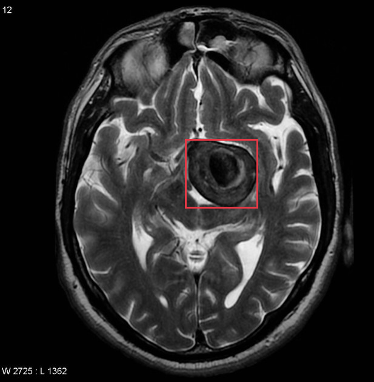

- **Modality / subcategory：** MRI / Axial T2
- **bbox_2d：** `[495, 365, 690, 545]`
- **Lingshu caption：** The red box is located in the left temporal lobe. Within this region there is a ring enhancing lesion with surrounding vasogenic edema. The lesion measures approximately 1.5 cm in diameter. There is no mass effect on the adjacent structures.

### Finding 2: `study_000_mri_image_001_axial_flair_f01`

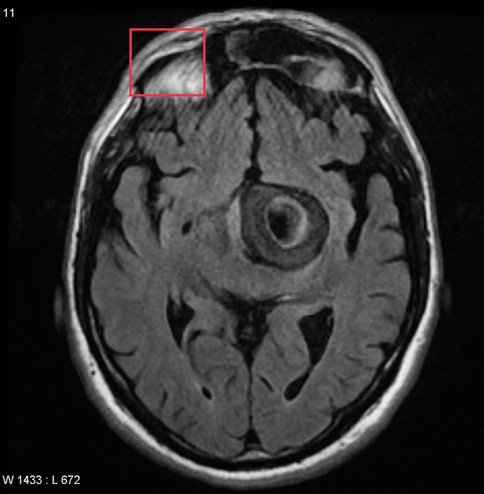

- **Modality / subcategory：** MRI / Axial FLAIR
- **bbox_2d：** `[268, 58, 424, 194]`
- **Lingshu caption：** The right frontal lobe demonstrates a hyperintense signal on this axial flair sequence. The hyperintensity is located just above the Sylvian fissure. There is no evidence of mass effect or midline shift. The left frontal lobe appears unremarkable.

### Finding 3: `study_000_mri_image_001_axial_flair_f02`

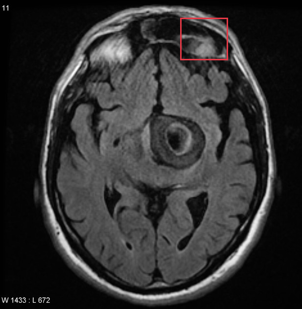

- **Modality / subcategory：** MRI / Axial FLAIR
- **bbox_2d：** `[598, 58, 754, 194]`
- **Lingshu caption：** The left frontal lobe demonstrates a small focus of increased signal intensity on this FLAIR sequence. There is no associated mass effect or contrast enhancement.

### Finding 4: `study_000_mri_image_001_axial_flair_f03`

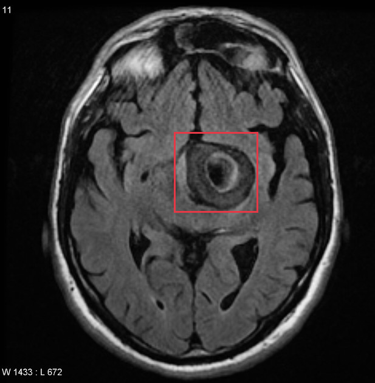

- **Modality / subcategory：** MRI / Axial FLAIR
- **bbox_2d：** `[464, 346, 688, 554]`
- **Lingshu caption：** The axial FLAIR MRI image shows a hyperintense lesion located in the right basal ganglia region. The lesion appears to have a ring-like structure with a central hypointense area, suggesting a possible cystic or necrotic component. Surrounding the lesion, there is evidence of perilesional edema, indicated by the hyperintense signal extending into the adjacent white matter. The lesion&#x27;s borders are well-defined, and there is no significant mass effect observed on the surrounding brain structures. The ventricles appear symmetrical, and there is no midline shift noted.

### Finding 5: `study_000_mri_image_002_axial_gradient_echo_f01`

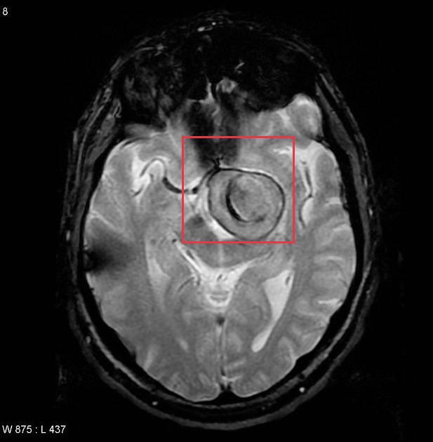

- **Modality / subcategory：** MRI / Axial Gradient Echo
- **bbox_2d：** `[420, 308, 680, 550]`
- **Lingshu caption：** The red box is located over the left temporal lobe. Within this area there is a large heterogeneous mass with areas of T2 hypointensity likely representing hemorrhage. There is surrounding vasogenic edema. The mass effect from this lesion is causing a midline shift to the right.

### Finding 6: `study_000_mri_image_003_mra_f01`

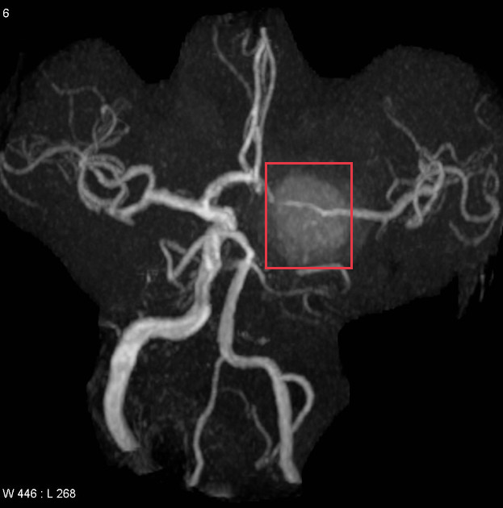

- **Modality / subcategory：** MRI / MRA
- **bbox_2d：** `[527, 320, 700, 530]`
- **Lingshu caption：** The image shows a magnetic resonance angiography (MRA) scan of the brain. Within the red box, there appears to be an area of increased signal intensity, which could potentially indicate an abnormality such as a vascular lesion or malformation. The surrounding vasculature appears relatively normal, with no obvious signs of stenosis or occlusion. However, without additional clinical information, it is difficult to determine the exact nature or significance of the observed finding.

### Finding 7: `study_001_ct_image_000_axial_c_arterial_phase_f01`

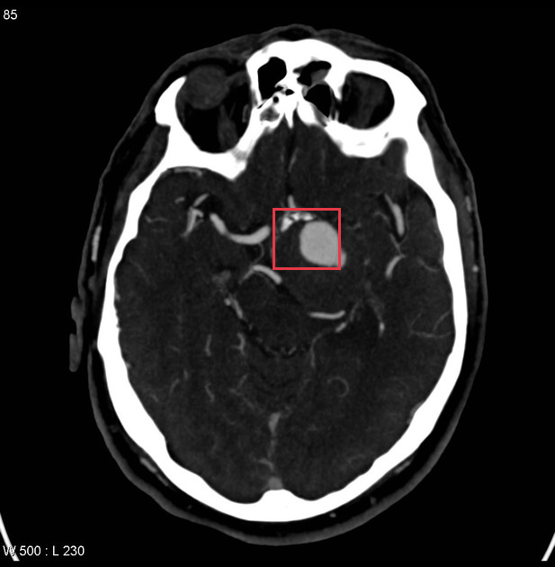

- **Modality / subcategory：** CT / Axial C+ arterial phase
- **bbox_2d：** `[492, 368, 614, 475]`
- **Lingshu caption：** The image shows a hyperdense lesion in the left middle cerebral artery territory, suggestive of an acute ischemic stroke. The lesion appears to be located in the left temporal lobe, with surrounding edema and mass effect. There is also evidence of contrast enhancement, indicating disruption of the blood-brain barrier.

### Finding 8: `study_002_dsa_angiography_image_000_lateral_internal_carotid_artery_f01`

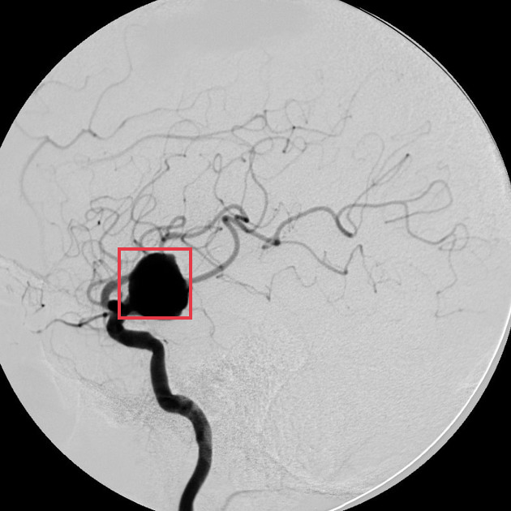

- **Modality / subcategory：** DSA (angiography) / Lateral Internal carotid artery
- **bbox_2d：** `[231, 485, 376, 625]`
- **Lingshu caption：** The image shows a lateral view of the internal carotid artery. Within the boxed region, there is a saccular outpouching consistent with an aneurysm. The aneurysm appears to be located on the anterior communicating artery. The surrounding vasculature is well-visualized, with no apparent signs of occlusion or significant stenosis. The contrast flow through the arteries is smooth, indicating good perfusion. There are no other obvious abnormalities noted in the immediate vicinity of the aneurysm.

### Finding 9: `study_002_dsa_angiography_image_001_frontal_internal_carotid_artery_f01`

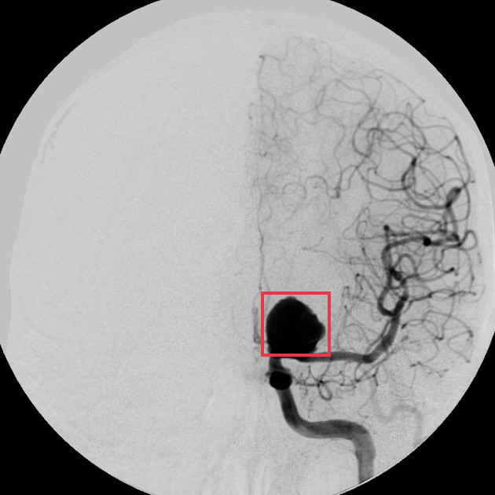

- **Modality / subcategory：** DSA (angiography) / Frontal Internal carotid artery
- **bbox_2d：** `[528, 590, 668, 720]`
- **Lingshu caption：** The image shows a frontal view of the internal carotid artery. Within the boxed region, there is a saccular outpouching consistent with an aneurysm. The aneurysm appears to be located on the anterior cerebral artery (ACA) segment. The surrounding vasculature is well-visualized, with no apparent signs of occlusion or significant stenosis. The aneurysm&#x27;s neck appears narrow, and its sac is rounded. There are no signs of rupture or hemorrhage in the immediate vicinity.

## Directed Cross-image Validation

### Anchor 1: `study_000_mri_image_000_axial_t2_f01`

**Anchor Lingshu caption：** The red box is located in the left temporal lobe. Within this region there is a ring enhancing lesion with surrounding vasogenic edema. The lesion measures approximately 1.5 cm in diameter. There is no mass effect on the adjacent structures.

#### location_00001: STRONG SUPPORT

<table>
<tr><th>Anchor original bbox</th><th>Cross-image grounded target bbox</th><th>Existing target bbox: study_000_mri_image_001_axial_flair_f01</th><th>Existing target bbox: study_000_mri_image_001_axial_flair_f02</th><th>Existing target bbox: study_000_mri_image_001_axial_flair_f03</th></tr>
<tr><td></td><td>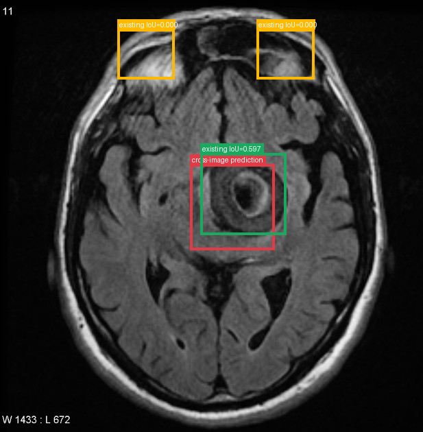</td><td></td><td></td><td></td></tr>
</table>

- **Target：** `study_000_mri_image_001_axial_flair`; MRI; Axial FLAIR
- **Relation：** `bbox_to_bbox` / `strong_support`
- **Returned target bbox：** `[450, 380, 650, 580]`
- **Maximum IoU：** 0.597; threshold=0.5
- **Strong relation IDs：** `[&#x27;strong_location_00001_01&#x27;]`

**IoU matching：**

| Existing target bbox | IoU | Strong match | Lingshu caption |
|---|---:|---|---|
| `study_000_mri_image_001_axial_flair_f01`; `[268, 58, 424, 194]` | 0.000 | no | The right frontal lobe demonstrates a hyperintense signal on this axial flair sequence. The hyperintensity is located just above the Sylvian fissure. There is no evidence of mass effect or midline shift. The left frontal lobe appears unremarkable. |
| `study_000_mri_image_001_axial_flair_f02`; `[598, 58, 754, 194]` | 0.000 | no | The left frontal lobe demonstrates a small focus of increased signal intensity on this FLAIR sequence. There is no associated mass effect or contrast enhancement. |
| `study_000_mri_image_001_axial_flair_f03`; `[464, 346, 688, 554]` | 0.597 | yes | The axial FLAIR MRI image shows a hyperintense lesion located in the right basal ganglia region. The lesion appears to have a ring-like structure with a central hypointense area, suggesting a possible cystic or necrotic component. Surrounding the lesion, there is evidence of perilesional edema, indicated by the hyperintense signal extending into the adjacent white matter. The lesion&#x27;s borders are well-defined, and there is no significant mass effect observed on the surrounding brain structures. The ventricles appear symmetrical, and there is no midline shift noted. |

**Quantification / characterization：**

| Validation | Status | Reason |
|---|---|---|
| Quantification | `insufficient` | The target region lacks explicit measurements, and the source image&#x27;s scale and resolution do not permit reliable comparison of lesion extent. |
| Characterization | `inconsistent` | The source caption describes a lesion in the left temporal lobe, while the target caption describes a lesion in the right basal ganglia region, indicating different anatomical locations. |

#### location_00002: STRONG SUPPORT

<table>
<tr><th>Anchor original bbox</th><th>Cross-image grounded target bbox</th><th>Existing target bbox: study_000_mri_image_002_axial_gradient_echo_f01</th></tr>
<tr><td></td><td>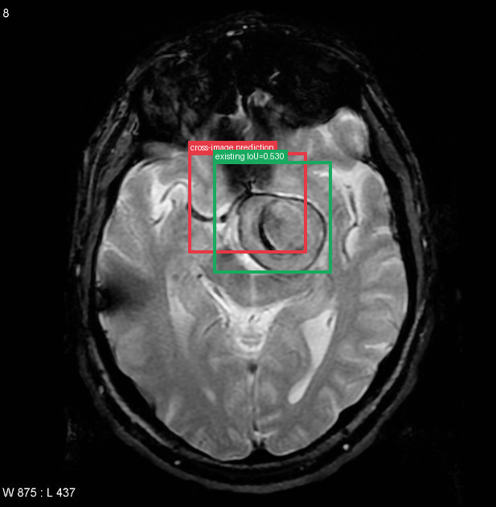</td><td></td></tr>
</table>

- **Target：** `study_000_mri_image_002_axial_gradient_echo`; MRI; Axial Gradient Echo
- **Relation：** `bbox_to_bbox` / `strong_support`
- **Returned target bbox：** `[380, 300, 620, 500]`
- **Maximum IoU：** 0.530; threshold=0.5
- **Strong relation IDs：** `[&#x27;strong_location_00002_01&#x27;]`

**IoU matching：**

| Existing target bbox | IoU | Strong match | Lingshu caption |
|---|---:|---|---|
| `study_000_mri_image_002_axial_gradient_echo_f01`; `[420, 308, 680, 550]` | 0.530 | yes | The red box is located over the left temporal lobe. Within this area there is a large heterogeneous mass with areas of T2 hypointensity likely representing hemorrhage. There is surrounding vasogenic edema. The mass effect from this lesion is causing a midline shift to the right. |

**Quantification / characterization：**

| Validation | Status | Reason |
|---|---|---|
| Quantification | `insufficient` | The target region lacks explicit measurements, and the source image&#x27;s scale and orientation prevent reliable comparison of lesion extent. |
| Characterization | `inconsistent` | The source caption describes a ring enhancing lesion without mass effect, while the target caption describes a heterogeneous mass with hemorrhage and mass effect causing midline shift. |

#### location_00003: NOT SUPPORT

<table>
<tr><th>Anchor original bbox</th><th>Target original image; model returned null</th><th>Existing target bbox: study_000_mri_image_003_mra_f01</th></tr>
<tr><td></td><td></td><td></td></tr>
</table>

- **Target：** `study_000_mri_image_003_mra`; MRI; MRA
- **Relation：** `bbox_to_image` / `not_support`
- **Returned target bbox：** `unknown`
- **Maximum IoU：** n/a; threshold=0.5
- **Strong relation IDs：** `[]`

**IoU matching：**

| Existing target bbox | IoU | Strong match | Lingshu caption |
|---|---:|---|---|
| `study_000_mri_image_003_mra_f01`; `[527, 320, 700, 530]` | n/a | n/a | The image shows a magnetic resonance angiography (MRA) scan of the brain. Within the red box, there appears to be an area of increased signal intensity, which could potentially indicate an abnormality such as a vascular lesion or malformation. The surrounding vasculature appears relatively normal, with no obvious signs of stenosis or occlusion. However, without additional clinical information, it is difficult to determine the exact nature or significance of the observed finding. |

**Quantification / characterization：**

| Validation | Status | Reason |
|---|---|---|
| Quantification / characterization | not applicable | Target region was not found, so no downstream validation was run. |

#### location_00004: PARTIAL SUPPORT

<table>
<tr><th>Anchor original bbox</th><th>Cross-image grounded target bbox</th><th>Existing target bbox: study_001_ct_image_000_axial_c_arterial_phase_f01</th></tr>
<tr><td></td><td>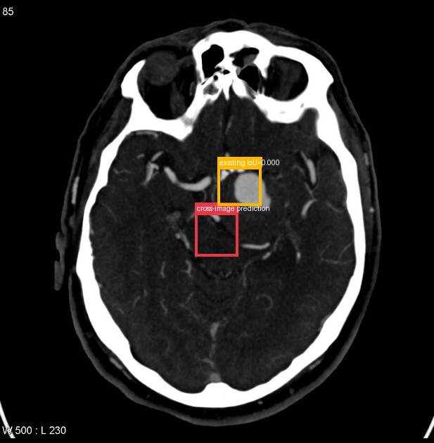</td><td></td></tr>
</table>

- **Target：** `study_001_ct_image_000_axial_c_arterial_phase`; CT; Axial C+ arterial phase
- **Relation：** `bbox_to_image` / `partial_support`
- **Returned target bbox：** `[450, 480, 550, 580]`
- **Maximum IoU：** 0.000; threshold=0.5
- **Strong relation IDs：** `[]`

**IoU matching：**

| Existing target bbox | IoU | Strong match | Lingshu caption |
|---|---:|---|---|
| `study_001_ct_image_000_axial_c_arterial_phase_f01`; `[492, 368, 614, 475]` | 0.000 | no | The image shows a hyperdense lesion in the left middle cerebral artery territory, suggestive of an acute ischemic stroke. The lesion appears to be located in the left temporal lobe, with surrounding edema and mass effect. There is also evidence of contrast enhancement, indicating disruption of the blood-brain barrier. |

**Target Lingshu caption：** unavailable. This is a newly re-grounded bbox and has not passed through Step 2 Lingshu captioning.

**Quantification / characterization：**

| Validation | Status | Reason |
|---|---|---|
| Quantification | `insufficient` | The target region lacks explicit measurements and the scale between the two images cannot be reliably compared. |
| Characterization | `insufficient` | The target Lingshu caption is unknown, so semantic comparison cannot be performed. |

#### location_00005: NOT SUPPORT

<table>
<tr><th>Anchor original bbox</th><th>Target original image; model returned null</th><th>Existing target bbox: study_002_dsa_angiography_image_000_lateral_internal_carotid_artery_f01</th></tr>
<tr><td></td><td>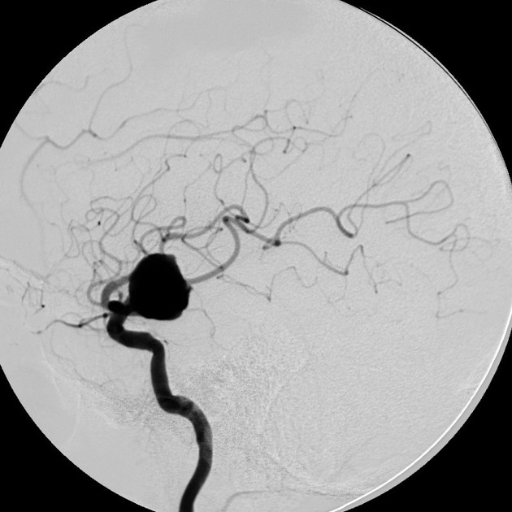</td><td></td></tr>
</table>

- **Target：** `study_002_dsa_angiography_image_000_lateral_internal_carotid_artery`; DSA (angiography); Lateral Internal carotid artery
- **Relation：** `bbox_to_image` / `not_support`
- **Returned target bbox：** `unknown`
- **Maximum IoU：** n/a; threshold=0.5
- **Strong relation IDs：** `[]`

**IoU matching：**

| Existing target bbox | IoU | Strong match | Lingshu caption |
|---|---:|---|---|
| `study_002_dsa_angiography_image_000_lateral_internal_carotid_artery_f01`; `[231, 485, 376, 625]` | n/a | n/a | The image shows a lateral view of the internal carotid artery. Within the boxed region, there is a saccular outpouching consistent with an aneurysm. The aneurysm appears to be located on the anterior communicating artery. The surrounding vasculature is well-visualized, with no apparent signs of occlusion or significant stenosis. The contrast flow through the arteries is smooth, indicating good perfusion. There are no other obvious abnormalities noted in the immediate vicinity of the aneurysm. |

**Quantification / characterization：**

| Validation | Status | Reason |
|---|---|---|
| Quantification / characterization | not applicable | Target region was not found, so no downstream validation was run. |

#### location_00006: NOT SUPPORT

<table>
<tr><th>Anchor original bbox</th><th>Target original image; model returned null</th><th>Existing target bbox: study_002_dsa_angiography_image_001_frontal_internal_carotid_artery_f01</th></tr>
<tr><td></td><td></td><td></td></tr>
</table>

- **Target：** `study_002_dsa_angiography_image_001_frontal_internal_carotid_artery`; DSA (angiography); Frontal Internal carotid artery
- **Relation：** `bbox_to_image` / `not_support`
- **Returned target bbox：** `unknown`
- **Maximum IoU：** n/a; threshold=0.5
- **Strong relation IDs：** `[]`

**IoU matching：**

| Existing target bbox | IoU | Strong match | Lingshu caption |
|---|---:|---|---|
| `study_002_dsa_angiography_image_001_frontal_internal_carotid_artery_f01`; `[528, 590, 668, 720]` | n/a | n/a | The image shows a frontal view of the internal carotid artery. Within the boxed region, there is a saccular outpouching consistent with an aneurysm. The aneurysm appears to be located on the anterior cerebral artery (ACA) segment. The surrounding vasculature is well-visualized, with no apparent signs of occlusion or significant stenosis. The aneurysm&#x27;s neck appears narrow, and its sac is rounded. There are no signs of rupture or hemorrhage in the immediate vicinity. |

**Quantification / characterization：**

| Validation | Status | Reason |
|---|---|---|
| Quantification / characterization | not applicable | Target region was not found, so no downstream validation was run. |

### Anchor 2: `study_000_mri_image_001_axial_flair_f01`

**Anchor Lingshu caption：** The right frontal lobe demonstrates a hyperintense signal on this axial flair sequence. The hyperintensity is located just above the Sylvian fissure. There is no evidence of mass effect or midline shift. The left frontal lobe appears unremarkable.

#### location_00007: PARTIAL SUPPORT

<table>
<tr><th>Anchor original bbox</th><th>Cross-image grounded target bbox</th><th>Existing target bbox: study_000_mri_image_002_axial_gradient_echo_f01</th></tr>
<tr><td></td><td>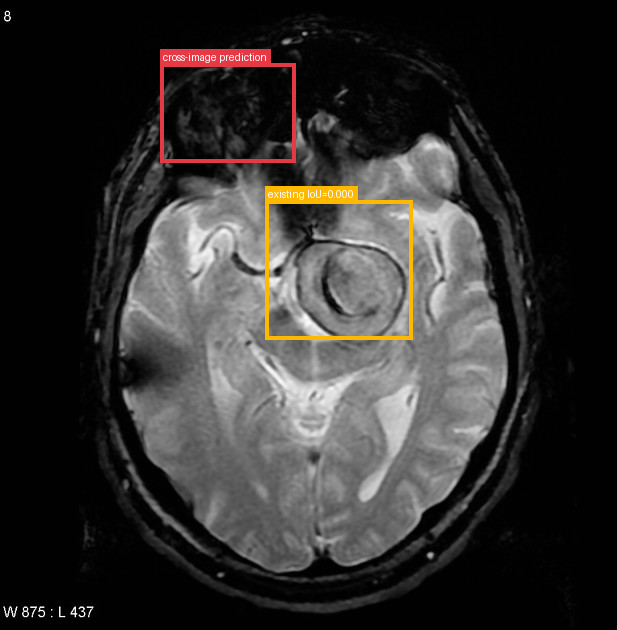</td><td></td></tr>
</table>

- **Target：** `study_000_mri_image_002_axial_gradient_echo`; MRI; Axial Gradient Echo
- **Relation：** `bbox_to_image` / `partial_support`
- **Returned target bbox：** `[260, 100, 480, 260]`
- **Maximum IoU：** 0.000; threshold=0.5
- **Strong relation IDs：** `[]`

**IoU matching：**

| Existing target bbox | IoU | Strong match | Lingshu caption |
|---|---:|---|---|
| `study_000_mri_image_002_axial_gradient_echo_f01`; `[420, 308, 680, 550]` | 0.000 | no | The red box is located over the left temporal lobe. Within this area there is a large heterogeneous mass with areas of T2 hypointensity likely representing hemorrhage. There is surrounding vasogenic edema. The mass effect from this lesion is causing a midline shift to the right. |

**Target Lingshu caption：** unavailable. This is a newly re-grounded bbox and has not passed through Step 2 Lingshu captioning.

**Quantification / characterization：**

| Validation | Status | Reason |
|---|---|---|
| Quantification | `insufficient` | view, scale, or measurements do not permit a reliable comparison |
| Characterization | `insufficient` | the target Lingshu caption is unknown |

#### location_00008: NOT SUPPORT

<table>
<tr><th>Anchor original bbox</th><th>Target original image; model returned null</th><th>Existing target bbox: study_000_mri_image_003_mra_f01</th></tr>
<tr><td></td><td></td><td></td></tr>
</table>

- **Target：** `study_000_mri_image_003_mra`; MRI; MRA
- **Relation：** `bbox_to_image` / `not_support`
- **Returned target bbox：** `unknown`
- **Maximum IoU：** n/a; threshold=0.5
- **Strong relation IDs：** `[]`

**IoU matching：**

| Existing target bbox | IoU | Strong match | Lingshu caption |
|---|---:|---|---|
| `study_000_mri_image_003_mra_f01`; `[527, 320, 700, 530]` | n/a | n/a | The image shows a magnetic resonance angiography (MRA) scan of the brain. Within the red box, there appears to be an area of increased signal intensity, which could potentially indicate an abnormality such as a vascular lesion or malformation. The surrounding vasculature appears relatively normal, with no obvious signs of stenosis or occlusion. However, without additional clinical information, it is difficult to determine the exact nature or significance of the observed finding. |

**Quantification / characterization：**

| Validation | Status | Reason |
|---|---|---|
| Quantification / characterization | not applicable | Target region was not found, so no downstream validation was run. |

#### location_00009: NOT SUPPORT

<table>
<tr><th>Anchor original bbox</th><th>Target original image; model returned null</th><th>Existing target bbox: study_001_ct_image_000_axial_c_arterial_phase_f01</th></tr>
<tr><td></td><td></td><td></td></tr>
</table>

- **Target：** `study_001_ct_image_000_axial_c_arterial_phase`; CT; Axial C+ arterial phase
- **Relation：** `bbox_to_image` / `not_support`
- **Returned target bbox：** `unknown`
- **Maximum IoU：** n/a; threshold=0.5
- **Strong relation IDs：** `[]`

**IoU matching：**

| Existing target bbox | IoU | Strong match | Lingshu caption |
|---|---:|---|---|
| `study_001_ct_image_000_axial_c_arterial_phase_f01`; `[492, 368, 614, 475]` | n/a | n/a | The image shows a hyperdense lesion in the left middle cerebral artery territory, suggestive of an acute ischemic stroke. The lesion appears to be located in the left temporal lobe, with surrounding edema and mass effect. There is also evidence of contrast enhancement, indicating disruption of the blood-brain barrier. |

**Quantification / characterization：**

| Validation | Status | Reason |
|---|---|---|
| Quantification / characterization | not applicable | Target region was not found, so no downstream validation was run. |

#### location_00010: NOT SUPPORT

<table>
<tr><th>Anchor original bbox</th><th>Target original image; model returned null</th><th>Existing target bbox: study_002_dsa_angiography_image_000_lateral_internal_carotid_artery_f01</th></tr>
<tr><td></td><td></td><td></td></tr>
</table>

- **Target：** `study_002_dsa_angiography_image_000_lateral_internal_carotid_artery`; DSA (angiography); Lateral Internal carotid artery
- **Relation：** `bbox_to_image` / `not_support`
- **Returned target bbox：** `unknown`
- **Maximum IoU：** n/a; threshold=0.5
- **Strong relation IDs：** `[]`

**IoU matching：**

| Existing target bbox | IoU | Strong match | Lingshu caption |
|---|---:|---|---|
| `study_002_dsa_angiography_image_000_lateral_internal_carotid_artery_f01`; `[231, 485, 376, 625]` | n/a | n/a | The image shows a lateral view of the internal carotid artery. Within the boxed region, there is a saccular outpouching consistent with an aneurysm. The aneurysm appears to be located on the anterior communicating artery. The surrounding vasculature is well-visualized, with no apparent signs of occlusion or significant stenosis. The contrast flow through the arteries is smooth, indicating good perfusion. There are no other obvious abnormalities noted in the immediate vicinity of the aneurysm. |

**Quantification / characterization：**

| Validation | Status | Reason |
|---|---|---|
| Quantification / characterization | not applicable | Target region was not found, so no downstream validation was run. |

#### location_00011: NOT SUPPORT

<table>
<tr><th>Anchor original bbox</th><th>Target original image; model returned null</th><th>Existing target bbox: study_002_dsa_angiography_image_001_frontal_internal_carotid_artery_f01</th></tr>
<tr><td></td><td></td><td></td></tr>
</table>

- **Target：** `study_002_dsa_angiography_image_001_frontal_internal_carotid_artery`; DSA (angiography); Frontal Internal carotid artery
- **Relation：** `bbox_to_image` / `not_support`
- **Returned target bbox：** `unknown`
- **Maximum IoU：** n/a; threshold=0.5
- **Strong relation IDs：** `[]`

**IoU matching：**

| Existing target bbox | IoU | Strong match | Lingshu caption |
|---|---:|---|---|
| `study_002_dsa_angiography_image_001_frontal_internal_carotid_artery_f01`; `[528, 590, 668, 720]` | n/a | n/a | The image shows a frontal view of the internal carotid artery. Within the boxed region, there is a saccular outpouching consistent with an aneurysm. The aneurysm appears to be located on the anterior cerebral artery (ACA) segment. The surrounding vasculature is well-visualized, with no apparent signs of occlusion or significant stenosis. The aneurysm&#x27;s neck appears narrow, and its sac is rounded. There are no signs of rupture or hemorrhage in the immediate vicinity. |

**Quantification / characterization：**

| Validation | Status | Reason |
|---|---|---|
| Quantification / characterization | not applicable | Target region was not found, so no downstream validation was run. |

### Anchor 3: `study_000_mri_image_001_axial_flair_f02`

**Anchor Lingshu caption：** The left frontal lobe demonstrates a small focus of increased signal intensity on this FLAIR sequence. There is no associated mass effect or contrast enhancement.

#### location_00012: PARTIAL SUPPORT

<table>
<tr><th>Anchor original bbox</th><th>Cross-image grounded target bbox</th><th>Existing target bbox: study_000_mri_image_002_axial_gradient_echo_f01</th></tr>
<tr><td></td><td>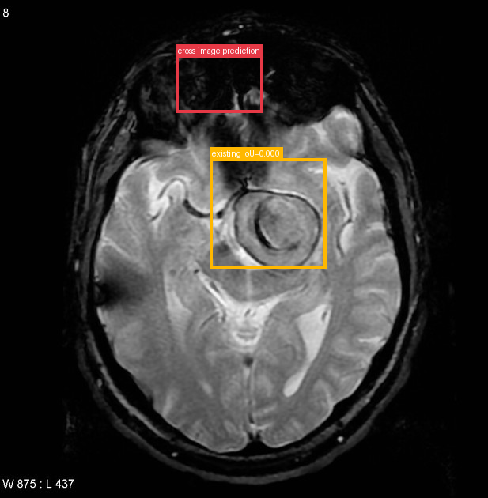</td><td></td></tr>
</table>

- **Target：** `study_000_mri_image_002_axial_gradient_echo`; MRI; Axial Gradient Echo
- **Relation：** `bbox_to_image` / `partial_support`
- **Returned target bbox：** `[360, 112, 540, 228]`
- **Maximum IoU：** 0.000; threshold=0.5
- **Strong relation IDs：** `[]`

**IoU matching：**

| Existing target bbox | IoU | Strong match | Lingshu caption |
|---|---:|---|---|
| `study_000_mri_image_002_axial_gradient_echo_f01`; `[420, 308, 680, 550]` | 0.000 | no | The red box is located over the left temporal lobe. Within this area there is a large heterogeneous mass with areas of T2 hypointensity likely representing hemorrhage. There is surrounding vasogenic edema. The mass effect from this lesion is causing a midline shift to the right. |

**Target Lingshu caption：** unavailable. This is a newly re-grounded bbox and has not passed through Step 2 Lingshu captioning.

**Quantification / characterization：**

| Validation | Status | Reason |
|---|---|---|
| Quantification | `insufficient` | view, scale, or measurements do not permit a reliable comparison |
| Characterization | `insufficient` | Target Lingshu caption is unknown |

#### location_00013: NOT SUPPORT

<table>
<tr><th>Anchor original bbox</th><th>Target original image; model returned null</th><th>Existing target bbox: study_000_mri_image_003_mra_f01</th></tr>
<tr><td></td><td></td><td></td></tr>
</table>

- **Target：** `study_000_mri_image_003_mra`; MRI; MRA
- **Relation：** `bbox_to_image` / `not_support`
- **Returned target bbox：** `unknown`
- **Maximum IoU：** n/a; threshold=0.5
- **Strong relation IDs：** `[]`

**IoU matching：**

| Existing target bbox | IoU | Strong match | Lingshu caption |
|---|---:|---|---|
| `study_000_mri_image_003_mra_f01`; `[527, 320, 700, 530]` | n/a | n/a | The image shows a magnetic resonance angiography (MRA) scan of the brain. Within the red box, there appears to be an area of increased signal intensity, which could potentially indicate an abnormality such as a vascular lesion or malformation. The surrounding vasculature appears relatively normal, with no obvious signs of stenosis or occlusion. However, without additional clinical information, it is difficult to determine the exact nature or significance of the observed finding. |

**Quantification / characterization：**

| Validation | Status | Reason |
|---|---|---|
| Quantification / characterization | not applicable | Target region was not found, so no downstream validation was run. |

#### location_00014: PARTIAL SUPPORT

<table>
<tr><th>Anchor original bbox</th><th>Cross-image grounded target bbox</th><th>Existing target bbox: study_001_ct_image_000_axial_c_arterial_phase_f01</th></tr>
<tr><td></td><td></td><td></td></tr>
</table>

- **Target：** `study_001_ct_image_000_axial_c_arterial_phase`; CT; Axial C+ arterial phase
- **Relation：** `bbox_to_image` / `partial_support`
- **Returned target bbox：** `[447, 474, 573, 592]`
- **Maximum IoU：** 0.005; threshold=0.5
- **Strong relation IDs：** `[]`

**IoU matching：**

| Existing target bbox | IoU | Strong match | Lingshu caption |
|---|---:|---|---|
| `study_001_ct_image_000_axial_c_arterial_phase_f01`; `[492, 368, 614, 475]` | 0.005 | no | The image shows a hyperdense lesion in the left middle cerebral artery territory, suggestive of an acute ischemic stroke. The lesion appears to be located in the left temporal lobe, with surrounding edema and mass effect. There is also evidence of contrast enhancement, indicating disruption of the blood-brain barrier. |

**Target Lingshu caption：** unavailable. This is a newly re-grounded bbox and has not passed through Step 2 Lingshu captioning.

**Quantification / characterization：**

| Validation | Status | Reason |
|---|---|---|
| Quantification | `insufficient` | The source image is an MRI with unknown measurements and the target image is a CT with no stated measurements; scale and view differences prevent reliable comparison. |
| Characterization | `insufficient` | The target Lingshu caption is unknown, so semantic comparison cannot be performed. |

#### location_00015: NOT SUPPORT

<table>
<tr><th>Anchor original bbox</th><th>Target original image; model returned null</th><th>Existing target bbox: study_002_dsa_angiography_image_000_lateral_internal_carotid_artery_f01</th></tr>
<tr><td></td><td></td><td></td></tr>
</table>

- **Target：** `study_002_dsa_angiography_image_000_lateral_internal_carotid_artery`; DSA (angiography); Lateral Internal carotid artery
- **Relation：** `bbox_to_image` / `not_support`
- **Returned target bbox：** `unknown`
- **Maximum IoU：** n/a; threshold=0.5
- **Strong relation IDs：** `[]`

**IoU matching：**

| Existing target bbox | IoU | Strong match | Lingshu caption |
|---|---:|---|---|
| `study_002_dsa_angiography_image_000_lateral_internal_carotid_artery_f01`; `[231, 485, 376, 625]` | n/a | n/a | The image shows a lateral view of the internal carotid artery. Within the boxed region, there is a saccular outpouching consistent with an aneurysm. The aneurysm appears to be located on the anterior communicating artery. The surrounding vasculature is well-visualized, with no apparent signs of occlusion or significant stenosis. The contrast flow through the arteries is smooth, indicating good perfusion. There are no other obvious abnormalities noted in the immediate vicinity of the aneurysm. |

**Quantification / characterization：**

| Validation | Status | Reason |
|---|---|---|
| Quantification / characterization | not applicable | Target region was not found, so no downstream validation was run. |

#### location_00016: NOT SUPPORT

<table>
<tr><th>Anchor original bbox</th><th>Target original image; model returned null</th><th>Existing target bbox: study_002_dsa_angiography_image_001_frontal_internal_carotid_artery_f01</th></tr>
<tr><td></td><td></td><td></td></tr>
</table>

- **Target：** `study_002_dsa_angiography_image_001_frontal_internal_carotid_artery`; DSA (angiography); Frontal Internal carotid artery
- **Relation：** `bbox_to_image` / `not_support`
- **Returned target bbox：** `unknown`
- **Maximum IoU：** n/a; threshold=0.5
- **Strong relation IDs：** `[]`

**IoU matching：**

| Existing target bbox | IoU | Strong match | Lingshu caption |
|---|---:|---|---|
| `study_002_dsa_angiography_image_001_frontal_internal_carotid_artery_f01`; `[528, 590, 668, 720]` | n/a | n/a | The image shows a frontal view of the internal carotid artery. Within the boxed region, there is a saccular outpouching consistent with an aneurysm. The aneurysm appears to be located on the anterior cerebral artery (ACA) segment. The surrounding vasculature is well-visualized, with no apparent signs of occlusion or significant stenosis. The aneurysm&#x27;s neck appears narrow, and its sac is rounded. There are no signs of rupture or hemorrhage in the immediate vicinity. |

**Quantification / characterization：**

| Validation | Status | Reason |
|---|---|---|
| Quantification / characterization | not applicable | Target region was not found, so no downstream validation was run. |

### Anchor 4: `study_000_mri_image_003_mra_f01`

**Anchor Lingshu caption：** The image shows a magnetic resonance angiography (MRA) scan of the brain. Within the red box, there appears to be an area of increased signal intensity, which could potentially indicate an abnormality such as a vascular lesion or malformation. The surrounding vasculature appears relatively normal, with no obvious signs of stenosis or occlusion. However, without additional clinical information, it is difficult to determine the exact nature or significance of the observed finding.

#### location_00026: PARTIAL SUPPORT

<table>
<tr><th>Anchor original bbox</th><th>Cross-image grounded target bbox</th><th>Existing target bbox: study_001_ct_image_000_axial_c_arterial_phase_f01</th></tr>
<tr><td></td><td>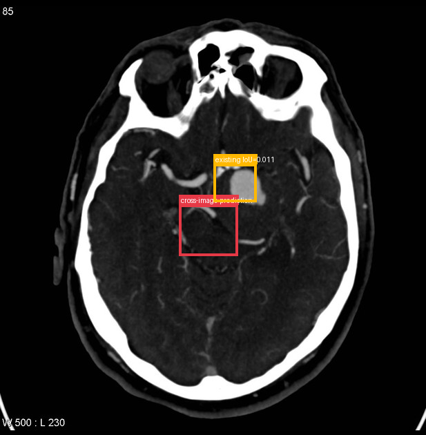</td><td></td></tr>
</table>

- **Target：** `study_001_ct_image_000_axial_c_arterial_phase`; CT; Axial C+ arterial phase
- **Relation：** `bbox_to_image` / `partial_support`
- **Returned target bbox：** `[420, 470, 560, 590]`
- **Maximum IoU：** 0.011; threshold=0.5
- **Strong relation IDs：** `[]`

**IoU matching：**

| Existing target bbox | IoU | Strong match | Lingshu caption |
|---|---:|---|---|
| `study_001_ct_image_000_axial_c_arterial_phase_f01`; `[492, 368, 614, 475]` | 0.011 | no | The image shows a hyperdense lesion in the left middle cerebral artery territory, suggestive of an acute ischemic stroke. The lesion appears to be located in the left temporal lobe, with surrounding edema and mass effect. There is also evidence of contrast enhancement, indicating disruption of the blood-brain barrier. |

**Target Lingshu caption：** unavailable. This is a newly re-grounded bbox and has not passed through Step 2 Lingshu captioning.

**Quantification / characterization：**

| Validation | Status | Reason |
|---|---|---|
| Quantification | `insufficient` | The source image is a 3D MRA scan with no visible measurements, while the target is a 2D CT slice with no stated measurements; scale and view prevent reliable comparison. |
| Characterization | `insufficient` | The target Lingshu caption is unknown, so semantic comparison cannot be performed. |

#### location_00027: STRONG SUPPORT

<table>
<tr><th>Anchor original bbox</th><th>Cross-image grounded target bbox</th><th>Existing target bbox: study_002_dsa_angiography_image_000_lateral_internal_carotid_artery_f01</th></tr>
<tr><td></td><td>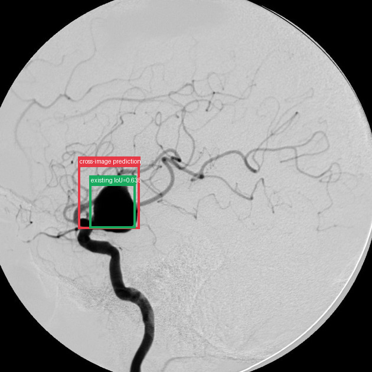</td><td></td></tr>
</table>

- **Target：** `study_002_dsa_angiography_image_000_lateral_internal_carotid_artery`; DSA (angiography); Lateral Internal carotid artery
- **Relation：** `bbox_to_bbox` / `strong_support`
- **Returned target bbox：** `[210, 444, 377, 617]`
- **Maximum IoU：** 0.635; threshold=0.5
- **Strong relation IDs：** `[&#x27;strong_location_00027_01&#x27;]`

**IoU matching：**

| Existing target bbox | IoU | Strong match | Lingshu caption |
|---|---:|---|---|
| `study_002_dsa_angiography_image_000_lateral_internal_carotid_artery_f01`; `[231, 485, 376, 625]` | 0.635 | yes | The image shows a lateral view of the internal carotid artery. Within the boxed region, there is a saccular outpouching consistent with an aneurysm. The aneurysm appears to be located on the anterior communicating artery. The surrounding vasculature is well-visualized, with no apparent signs of occlusion or significant stenosis. The contrast flow through the arteries is smooth, indicating good perfusion. There are no other obvious abnormalities noted in the immediate vicinity of the aneurysm. |

**Quantification / characterization：**

| Validation | Status | Reason |
|---|---|---|
| Quantification | `insufficient` | The source image lacks explicit measurements or scale indicators for the lesion, and the target image&#x27;s bounding box does not provide measurable dimensions. The visual extent cannot be reliably compared without scale reference or stated measurements. |
| Characterization | `consistent` | Both captions describe a vascular abnormality within a boxed region. The source caption suggests an area of increased signal intensity that could indicate a vascular lesion, while the target caption explicitly identifies a saccular outpouching (aneurysm). Both describe the lesion as being within a defined area and note surrounding vasculature as relatively normal or well-visualized without significant obstruction. |

#### location_00028: NOT SUPPORT

<table>
<tr><th>Anchor original bbox</th><th>Target original image; model returned null</th><th>Existing target bbox: study_002_dsa_angiography_image_001_frontal_internal_carotid_artery_f01</th></tr>
<tr><td></td><td></td><td></td></tr>
</table>

- **Target：** `study_002_dsa_angiography_image_001_frontal_internal_carotid_artery`; DSA (angiography); Frontal Internal carotid artery
- **Relation：** `bbox_to_image` / `not_support`
- **Returned target bbox：** `unknown`
- **Maximum IoU：** n/a; threshold=0.5
- **Strong relation IDs：** `[]`

**IoU matching：**

| Existing target bbox | IoU | Strong match | Lingshu caption |
|---|---:|---|---|
| `study_002_dsa_angiography_image_001_frontal_internal_carotid_artery_f01`; `[528, 590, 668, 720]` | n/a | n/a | The image shows a frontal view of the internal carotid artery. Within the boxed region, there is a saccular outpouching consistent with an aneurysm. The aneurysm appears to be located on the anterior cerebral artery (ACA) segment. The surrounding vasculature is well-visualized, with no apparent signs of occlusion or significant stenosis. The aneurysm&#x27;s neck appears narrow, and its sac is rounded. There are no signs of rupture or hemorrhage in the immediate vicinity. |

**Quantification / characterization：**

| Validation | Status | Reason |
|---|---|---|
| Quantification / characterization | not applicable | Target region was not found, so no downstream validation was run. |

### Anchor 5: `study_001_ct_image_000_axial_c_arterial_phase_f01`

**Anchor Lingshu caption：** The image shows a hyperdense lesion in the left middle cerebral artery territory, suggestive of an acute ischemic stroke. The lesion appears to be located in the left temporal lobe, with surrounding edema and mass effect. There is also evidence of contrast enhancement, indicating disruption of the blood-brain barrier.

#### location_00029: PARTIAL SUPPORT

<table>
<tr><th>Anchor original bbox</th><th>Cross-image grounded target bbox</th><th>Existing target bbox: study_002_dsa_angiography_image_000_lateral_internal_carotid_artery_f01</th></tr>
<tr><td></td><td>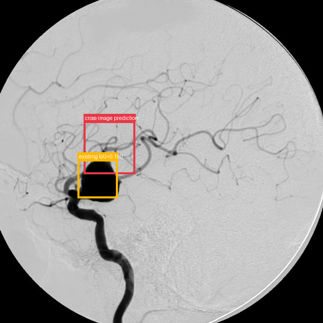</td><td></td></tr>
</table>

- **Target：** `study_002_dsa_angiography_image_000_lateral_internal_carotid_artery`; DSA (angiography); Lateral Internal carotid artery
- **Relation：** `bbox_to_image` / `partial_support`
- **Returned target bbox：** `[260, 375, 420, 540]`
- **Maximum IoU：** 0.160; threshold=0.5
- **Strong relation IDs：** `[]`

**IoU matching：**

| Existing target bbox | IoU | Strong match | Lingshu caption |
|---|---:|---|---|
| `study_002_dsa_angiography_image_000_lateral_internal_carotid_artery_f01`; `[231, 485, 376, 625]` | 0.160 | no | The image shows a lateral view of the internal carotid artery. Within the boxed region, there is a saccular outpouching consistent with an aneurysm. The aneurysm appears to be located on the anterior communicating artery. The surrounding vasculature is well-visualized, with no apparent signs of occlusion or significant stenosis. The contrast flow through the arteries is smooth, indicating good perfusion. There are no other obvious abnormalities noted in the immediate vicinity of the aneurysm. |

**Target Lingshu caption：** unavailable. This is a newly re-grounded bbox and has not passed through Step 2 Lingshu captioning.

**Quantification / characterization：**

| Validation | Status | Reason |
|---|---|---|
| Quantification | `insufficient` | The source image is a non-contrast CT scan with no explicit measurements, and the target image is an angiogram with no stated measurements. The scale and view are different, preventing reliable comparison of lesion extent. |
| Characterization | `insufficient` | The target Lingshu caption is unknown, so semantic comparison using only the two captions cannot be performed. |

#### location_00030: NOT SUPPORT

<table>
<tr><th>Anchor original bbox</th><th>Target original image; model returned null</th><th>Existing target bbox: study_002_dsa_angiography_image_001_frontal_internal_carotid_artery_f01</th></tr>
<tr><td></td><td></td><td></td></tr>
</table>

- **Target：** `study_002_dsa_angiography_image_001_frontal_internal_carotid_artery`; DSA (angiography); Frontal Internal carotid artery
- **Relation：** `bbox_to_image` / `not_support`
- **Returned target bbox：** `unknown`
- **Maximum IoU：** n/a; threshold=0.5
- **Strong relation IDs：** `[]`

**IoU matching：**

| Existing target bbox | IoU | Strong match | Lingshu caption |
|---|---:|---|---|
| `study_002_dsa_angiography_image_001_frontal_internal_carotid_artery_f01`; `[528, 590, 668, 720]` | n/a | n/a | The image shows a frontal view of the internal carotid artery. Within the boxed region, there is a saccular outpouching consistent with an aneurysm. The aneurysm appears to be located on the anterior cerebral artery (ACA) segment. The surrounding vasculature is well-visualized, with no apparent signs of occlusion or significant stenosis. The aneurysm&#x27;s neck appears narrow, and its sac is rounded. There are no signs of rupture or hemorrhage in the immediate vicinity. |

**Quantification / characterization：**

| Validation | Status | Reason |
|---|---|---|
| Quantification / characterization | not applicable | Target region was not found, so no downstream validation was run. |

## Dynamically Skipped Anchors

| Anchor node | Reused strong relations | Skipped target images |
|---|---|---|
| `study_000_mri_image_001_axial_flair_f03` | `[&#x27;strong_location_00001_01&#x27;]` | `[&#x27;study_000_mri_image_002_axial_gradient_echo&#x27;, &#x27;study_000_mri_image_003_mra&#x27;, &#x27;study_001_ct_image_000_axial_c_arterial_phase&#x27;, &#x27;study_002_dsa_angiography_image_000_lateral_internal_carotid_artery&#x27;, &#x27;study_002_dsa_angiography_image_001_frontal_internal_carotid_artery&#x27;]` |
| `study_000_mri_image_002_axial_gradient_echo_f01` | `[&#x27;strong_location_00002_01&#x27;]` | `[&#x27;study_000_mri_image_003_mra&#x27;, &#x27;study_001_ct_image_000_axial_c_arterial_phase&#x27;, &#x27;study_002_dsa_angiography_image_000_lateral_internal_carotid_artery&#x27;, &#x27;study_002_dsa_angiography_image_001_frontal_internal_carotid_artery&#x27;]` |
| `study_002_dsa_angiography_image_000_lateral_internal_carotid_artery_f01` | `[&#x27;strong_location_00027_01&#x27;]` | `[&#x27;study_002_dsa_angiography_image_001_frontal_internal_carotid_artery&#x27;]` |
