# High grade ductal carcinoma in situ: MRI findings

[返回 Step 3 总览](../README_STEP3_VISUALIZATION.md)

- **Case ID：** `high-grade-ductal-carcinoma-in-situ-mri-findings`
- **Case URL：** [https://radiopaedia.org/cases/high-grade-ductal-carcinoma-in-situ-mri-findings?lang=us](https://radiopaedia.org/cases/high-grade-ductal-carcinoma-in-situ-mri-findings?lang=us)
- **验证模型：** Qwen3-VL-8B
- **图像 / Step 2 findings：** 7 / 5
- **定位结果：** strong 1；partial 3；not support 3；parse error 0
- **Strong bbox relations：** 1
- **原始 JSON：** [case_evidence.json](../assets_step3/high-grade-ductal-carcinoma-in-situ-mri-findings/case_evidence.json)
- **定量/定性验证 JSON：** [step_3_validation_case_evidence.json](../assets_step3/high-grade-ductal-carcinoma-in-situ-mri-findings/step_3_validation_case_evidence.json)

**Overlay 图例：** 红框为跨图新定位；绿框为 IoU >= 0.5 的已有 bbox；黄框为未达到阈值的已有 bbox。

## Step 2 Finding Nodes

### Finding 1: `study_001_ultrasound_image_000_missing_f01`

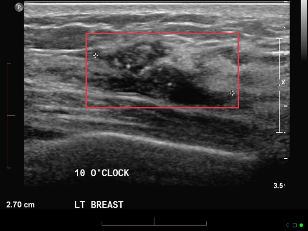

- **Modality / subcategory：** Ultrasound / missing
- **bbox_2d：** `[278, 142, 775, 468]`
- **Lingshu caption：** The left breast ultrasound demonstrates a hypoechoic mass measuring approximately 2.7 cm at the 10 o&#x27;clock position. The mass has irregular borders and appears to be well-circumscribed. There is no evidence of posterior acoustic shadowing or enhancement. Surrounding breast tissue appears heterogeneous without any additional focal lesions noted.
- **中文翻译：** 左乳超声显示 10 点钟方向一个约 2.7 cm 的低回声肿块。肿块边缘不规则，但似乎边界清楚。未见后方声影或后方回声增强。周围乳腺组织回声不均，未见其他局灶性病变。

### Finding 2: `study_001_ultrasound_image_001_missing_f01`

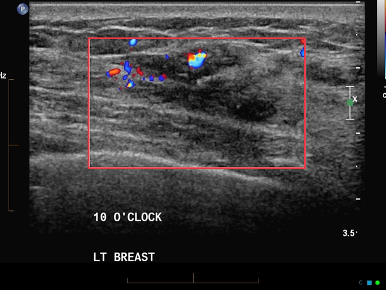

- **Modality / subcategory：** Ultrasound / missing
- **bbox_2d：** `[228, 130, 792, 583]`
- **Lingshu caption：** The left breast ultrasound demonstrates a hypoechoic mass with irregular margins and posterior acoustic shadowing. The mass measures approximately 1.5 cm in diameter. There is increased vascularity within the mass on color Doppler imaging. Surrounding breast tissue appears heterogeneous with scattered fibroglandular densities. No additional suspicious masses or abnormalities are noted in the imaged area.
- **中文翻译：** 左乳超声显示一个边缘不规则并伴后方声影的低回声肿块，直径约 1.5 cm。彩色多普勒显示肿块内血流增多。周围乳腺组织回声不均，可见散在纤维腺体密度。所示区域未见其他可疑肿块或异常。

### Finding 3: `study_002_mri_image_000_3d_mip_colour_coded_enhancement_pattern_t1_c_fat_sat_f01`

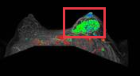

- **Modality / subcategory：** MRI / 3D MIP - colour coded enhancement pattern T1 C+ fat sat
- **bbox_2d：** `[450, 100, 750, 500]`
- **Lingshu caption：** The image shows a 3D MIP (Maximum Intensity Projection) color-coded enhancement pattern on a T1-weighted contrast-enhanced fat-saturated MRI sequence. The boxed region appears to highlight an area of interest that may contain an abnormality. Within this region, there is a distinct area of enhanced signal intensity, suggesting increased vascularity or perfusion. This area is located centrally within the image, and its boundaries are clearly demarcated by the red box. The surrounding tissue exhibits varying degrees of enhancement, indicating different levels of perfusion or vascularization. The overall image provides valuable information about the distribution and intensity of enhancement patterns, which can aid in the assessment of potential abnormalities.
- **中文翻译：** 图像为 T1 加权增强脂肪抑制 MRI 序列的三维最大密度投影彩色编码强化图。框内为可能存在异常的关注区域，其中可见明确的信号强化，提示血管丰富度或灌注增加。该区域位于图像中央，边界由红框清楚标出。周围组织呈不同程度强化，反映灌注或血管化水平不同。整幅图像展示了强化模式的分布和强度，可用于评估潜在异常。

### Finding 4: `study_002_mri_image_001_axial_t1_c_fat_sat_f01`

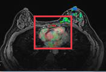

- **Modality / subcategory：** MRI / Axial T1 C+ fat sat
- **bbox_2d：** `[320, 220, 680, 680]`
- **Lingshu caption：** The image shows a breast MRI with a highlighted area in the right breast. The highlighted region appears to have increased signal intensity compared to the surrounding tissue, suggesting a possible lesion or abnormality. The lesion is located in the upper outer quadrant of the right breast. The surrounding tissue shows normal breast parenchyma with no other apparent abnormalities. The contrast enhancement pattern within the highlighted area indicates that it might be a focal area of interest for further evaluation.
- **中文翻译：** 乳腺 MRI 显示右乳高亮区域，其信号强度高于周围组织，提示可能存在病灶或异常。病灶位于右乳外上象限。周围乳腺实质表现正常，未见其他明显异常。该区域的对比强化模式提示其值得进一步评估。

### Finding 5: `study_002_mri_image_002_axial_t1_c_fat_sat_f01`

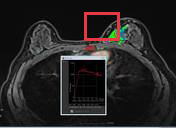

- **Modality / subcategory：** MRI / Axial T1 C+ fat sat
- **bbox_2d：** `[480, 100, 680, 320]`
- **Lingshu caption：** The image shows a breast MRI with a highlighted region in the right breast. The highlighted area appears to have a distinct mass with irregular borders and heterogeneous signal intensity. The mass is located in the upper outer quadrant of the right breast. Surrounding tissues show varying degrees of enhancement, suggesting possible involvement or reaction. The overall morphology and signal characteristics of the mass suggest it could be significant for further evaluation.
- **中文翻译：** 乳腺 MRI 显示右乳高亮区域，其中可见边缘不规则、信号不均的明确肿块，位于右乳外上象限。周围组织呈不同程度强化，提示可能受累或发生反应。该肿块的整体形态及信号特征提示需要进一步评估。

## Directed Cross-image Validation

### Anchor 1: `study_001_ultrasound_image_000_missing_f01`

**Anchor Lingshu caption：** The left breast ultrasound demonstrates a hypoechoic mass measuring approximately 2.7 cm at the 10 o&#x27;clock position. The mass has irregular borders and appears to be well-circumscribed. There is no evidence of posterior acoustic shadowing or enhancement. Surrounding breast tissue appears heterogeneous without any additional focal lesions noted.
**Anchor caption 中文翻译：** 左乳超声显示 10 点钟方向一个约 2.7 cm 的低回声肿块。肿块边缘不规则，但似乎边界清楚。未见后方声影或后方回声增强。周围乳腺组织回声不均，未见其他局灶性病变。

#### location_00001: STRONG SUPPORT

<table>
<tr><th>Anchor original bbox</th><th>Cross-image grounded target bbox</th><th>Existing target bbox: study_001_ultrasound_image_001_missing_f01</th></tr>
<tr><td></td><td>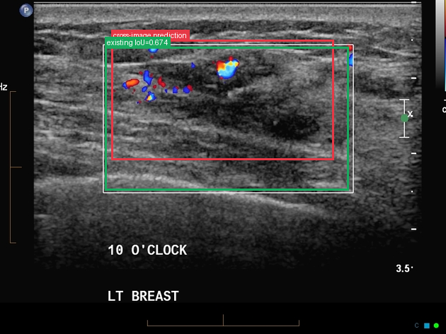</td><td></td></tr>
</table>

- **Target：** `study_001_ultrasound_image_001_missing`; Ultrasound; missing
- **Relation：** `bbox_to_bbox` / `strong_support`
- **Returned target bbox：** `[250, 120, 750, 480]`
- **Maximum IoU：** 0.674; threshold=0.5
- **Strong relation IDs：** `[&#x27;strong_location_00001_01&#x27;]`

**IoU matching：**

| Existing target bbox | IoU | Strong match | Lingshu caption | 中文翻译 |
|---|---:|---|---|---|
| `study_001_ultrasound_image_001_missing_f01`; `[228, 130, 792, 583]` | 0.674 | yes | The left breast ultrasound demonstrates a hypoechoic mass with irregular margins and posterior acoustic shadowing. The mass measures approximately 1.5 cm in diameter. There is increased vascularity within the mass on color Doppler imaging. Surrounding breast tissue appears heterogeneous with scattered fibroglandular densities. No additional suspicious masses or abnormalities are noted in the imaged area. | 左乳超声显示一个边缘不规则并伴后方声影的低回声肿块，直径约 1.5 cm。彩色多普勒显示肿块内血流增多。周围乳腺组织回声不均，可见散在纤维腺体密度。所示区域未见其他可疑肿块或异常。 |

**Quantitative / qualitative validation：**

| Validation pair | Quantitative size / 定量 | Qualitative caption / 定性 |
|---|---|---|
| `strong__strong_location_00001_01` | `inconsistent` | `inconsistent` |

#### location_00002: NOT SUPPORT

<table>
<tr><th>Anchor original bbox</th><th>Target original image; model returned null</th><th>Existing target bbox: study_002_mri_image_000_3d_mip_colour_coded_enhancement_pattern_t1_c_fat_sat_f01</th></tr>
<tr><td></td><td>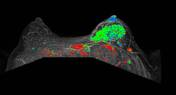</td><td></td></tr>
</table>

- **Target：** `study_002_mri_image_000_3d_mip_colour_coded_enhancement_pattern_t1_c_fat_sat`; MRI; 3D MIP - colour coded enhancement pattern T1 C+ fat sat
- **Relation：** `bbox_to_image` / `not_support`
- **Returned target bbox：** `unknown`
- **Maximum IoU：** n/a; threshold=0.5
- **Strong relation IDs：** `[]`

**IoU matching：**

| Existing target bbox | IoU | Strong match | Lingshu caption | 中文翻译 |
|---|---:|---|---|---|
| `study_002_mri_image_000_3d_mip_colour_coded_enhancement_pattern_t1_c_fat_sat_f01`; `[450, 100, 750, 500]` | n/a | n/a | The image shows a 3D MIP (Maximum Intensity Projection) color-coded enhancement pattern on a T1-weighted contrast-enhanced fat-saturated MRI sequence. The boxed region appears to highlight an area of interest that may contain an abnormality. Within this region, there is a distinct area of enhanced signal intensity, suggesting increased vascularity or perfusion. This area is located centrally within the image, and its boundaries are clearly demarcated by the red box. The surrounding tissue exhibits varying degrees of enhancement, indicating different levels of perfusion or vascularization. The overall image provides valuable information about the distribution and intensity of enhancement patterns, which can aid in the assessment of potential abnormalities. | 图像为 T1 加权增强脂肪抑制 MRI 序列的三维最大密度投影彩色编码强化图。框内为可能存在异常的关注区域，其中可见明确的信号强化，提示血管丰富度或灌注增加。该区域位于图像中央，边界由红框清楚标出。周围组织呈不同程度强化，反映灌注或血管化水平不同。整幅图像展示了强化模式的分布和强度，可用于评估潜在异常。 |

#### location_00003: NOT SUPPORT

<table>
<tr><th>Anchor original bbox</th><th>Target original image; model returned null</th><th>Existing target bbox: study_002_mri_image_001_axial_t1_c_fat_sat_f01</th></tr>
<tr><td></td><td>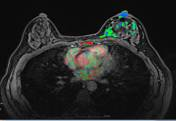</td><td></td></tr>
</table>

- **Target：** `study_002_mri_image_001_axial_t1_c_fat_sat`; MRI; Axial T1 C+ fat sat
- **Relation：** `bbox_to_image` / `not_support`
- **Returned target bbox：** `unknown`
- **Maximum IoU：** n/a; threshold=0.5
- **Strong relation IDs：** `[]`

**IoU matching：**

| Existing target bbox | IoU | Strong match | Lingshu caption | 中文翻译 |
|---|---:|---|---|---|
| `study_002_mri_image_001_axial_t1_c_fat_sat_f01`; `[320, 220, 680, 680]` | n/a | n/a | The image shows a breast MRI with a highlighted area in the right breast. The highlighted region appears to have increased signal intensity compared to the surrounding tissue, suggesting a possible lesion or abnormality. The lesion is located in the upper outer quadrant of the right breast. The surrounding tissue shows normal breast parenchyma with no other apparent abnormalities. The contrast enhancement pattern within the highlighted area indicates that it might be a focal area of interest for further evaluation. | 乳腺 MRI 显示右乳高亮区域，其信号强度高于周围组织，提示可能存在病灶或异常。病灶位于右乳外上象限。周围乳腺实质表现正常，未见其他明显异常。该区域的对比强化模式提示其值得进一步评估。 |

#### location_00004: NOT SUPPORT

<table>
<tr><th>Anchor original bbox</th><th>Target original image; model returned null</th><th>Existing target bbox: study_002_mri_image_002_axial_t1_c_fat_sat_f01</th></tr>
<tr><td></td><td></td><td></td></tr>
</table>

- **Target：** `study_002_mri_image_002_axial_t1_c_fat_sat`; MRI; Axial T1 C+ fat sat
- **Relation：** `bbox_to_image` / `not_support`
- **Returned target bbox：** `unknown`
- **Maximum IoU：** n/a; threshold=0.5
- **Strong relation IDs：** `[]`

**IoU matching：**

| Existing target bbox | IoU | Strong match | Lingshu caption | 中文翻译 |
|---|---:|---|---|---|
| `study_002_mri_image_002_axial_t1_c_fat_sat_f01`; `[480, 100, 680, 320]` | n/a | n/a | The image shows a breast MRI with a highlighted region in the right breast. The highlighted area appears to have a distinct mass with irregular borders and heterogeneous signal intensity. The mass is located in the upper outer quadrant of the right breast. Surrounding tissues show varying degrees of enhancement, suggesting possible involvement or reaction. The overall morphology and signal characteristics of the mass suggest it could be significant for further evaluation. | 乳腺 MRI 显示右乳高亮区域，其中可见边缘不规则、信号不均的明确肿块，位于右乳外上象限。周围组织呈不同程度强化，提示可能受累或发生反应。该肿块的整体形态及信号特征提示需要进一步评估。 |

### Anchor 2: `study_002_mri_image_000_3d_mip_colour_coded_enhancement_pattern_t1_c_fat_sat_f01`

**Anchor Lingshu caption：** The image shows a 3D MIP (Maximum Intensity Projection) color-coded enhancement pattern on a T1-weighted contrast-enhanced fat-saturated MRI sequence. The boxed region appears to highlight an area of interest that may contain an abnormality. Within this region, there is a distinct area of enhanced signal intensity, suggesting increased vascularity or perfusion. This area is located centrally within the image, and its boundaries are clearly demarcated by the red box. The surrounding tissue exhibits varying degrees of enhancement, indicating different levels of perfusion or vascularization. The overall image provides valuable information about the distribution and intensity of enhancement patterns, which can aid in the assessment of potential abnormalities.
**Anchor caption 中文翻译：** 图像为 T1 加权增强脂肪抑制 MRI 序列的三维最大密度投影彩色编码强化图。框内为可能存在异常的关注区域，其中可见明确的信号强化，提示血管丰富度或灌注增加。该区域位于图像中央，边界由红框清楚标出。周围组织呈不同程度强化，反映灌注或血管化水平不同。整幅图像展示了强化模式的分布和强度，可用于评估潜在异常。

#### location_00008: PARTIAL SUPPORT

<table>
<tr><th>Anchor original bbox</th><th>Cross-image grounded target bbox</th><th>Existing target bbox: study_002_mri_image_001_axial_t1_c_fat_sat_f01</th></tr>
<tr><td></td><td>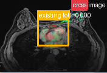</td><td></td></tr>
</table>

- **Target：** `study_002_mri_image_001_axial_t1_c_fat_sat`; MRI; Axial T1 C+ fat sat
- **Relation：** `bbox_to_image` / `partial_support`
- **Returned target bbox：** `[670, 30, 820, 150]`
- **Maximum IoU：** 0.000; threshold=0.5
- **Strong relation IDs：** `[]`

**IoU matching：**

| Existing target bbox | IoU | Strong match | Lingshu caption | 中文翻译 |
|---|---:|---|---|---|
| `study_002_mri_image_001_axial_t1_c_fat_sat_f01`; `[320, 220, 680, 680]` | 0.000 | no | The image shows a breast MRI with a highlighted area in the right breast. The highlighted region appears to have increased signal intensity compared to the surrounding tissue, suggesting a possible lesion or abnormality. The lesion is located in the upper outer quadrant of the right breast. The surrounding tissue shows normal breast parenchyma with no other apparent abnormalities. The contrast enhancement pattern within the highlighted area indicates that it might be a focal area of interest for further evaluation. | 乳腺 MRI 显示右乳高亮区域，其信号强度高于周围组织，提示可能存在病灶或异常。病灶位于右乳外上象限。周围乳腺实质表现正常，未见其他明显异常。该区域的对比强化模式提示其值得进一步评估。 |

**B 图单红框（Lingshu 实际输入）：**

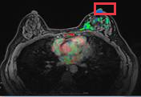

**Re-ground Lingshu caption：** The image shows a breast MRI with a highlighted region in the upper outer quadrant of the right breast. The highlighted area appears to have increased signal intensity compared to the surrounding tissue, suggesting a potential lesion. The lesion is well-circumscribed and appears to be enhancing, which could indicate a solid mass. Surrounding tissues show normal breast parenchyma without any obvious signs of edema or distortion. No other abnormalities are noted in the left breast or axillary regions in this particular slice.
**Re-ground caption 中文翻译：** 乳腺 MRI 显示右乳外上象限高亮区域，其信号高于周围组织，提示可能存在病灶。病灶边界清楚并呈强化，可能为实性肿块。周围乳腺组织表现正常，未见明显水肿或结构扭曲。本层面左乳或腋窝区未见其他异常。

**Quantitative / qualitative validation：**

| Validation pair | Quantitative size / 定量 | Qualitative caption / 定性 |
|---|---|---|
| `partial__location_00008` | `inconsistent` | `inconsistent` |

#### location_00009: PARTIAL SUPPORT

<table>
<tr><th>Anchor original bbox</th><th>Cross-image grounded target bbox</th><th>Existing target bbox: study_002_mri_image_002_axial_t1_c_fat_sat_f01</th></tr>
<tr><td></td><td>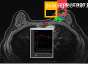</td><td></td></tr>
</table>

- **Target：** `study_002_mri_image_002_axial_t1_c_fat_sat`; MRI; Axial T1 C+ fat sat
- **Relation：** `bbox_to_image` / `partial_support`
- **Returned target bbox：** `[650, 110, 760, 250]`
- **Maximum IoU：** 0.073; threshold=0.5
- **Strong relation IDs：** `[]`

**IoU matching：**

| Existing target bbox | IoU | Strong match | Lingshu caption | 中文翻译 |
|---|---:|---|---|---|
| `study_002_mri_image_002_axial_t1_c_fat_sat_f01`; `[480, 100, 680, 320]` | 0.073 | no | The image shows a breast MRI with a highlighted region in the right breast. The highlighted area appears to have a distinct mass with irregular borders and heterogeneous signal intensity. The mass is located in the upper outer quadrant of the right breast. Surrounding tissues show varying degrees of enhancement, suggesting possible involvement or reaction. The overall morphology and signal characteristics of the mass suggest it could be significant for further evaluation. | 乳腺 MRI 显示右乳高亮区域，其中可见边缘不规则、信号不均的明确肿块，位于右乳外上象限。周围组织呈不同程度强化，提示可能受累或发生反应。该肿块的整体形态及信号特征提示需要进一步评估。 |

**B 图单红框（Lingshu 实际输入）：**

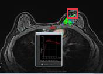

**Re-ground Lingshu caption：** The image shows a breast MRI with a highlighted region in the right breast. The highlighted area appears to have a distinct mass with irregular borders and heterogeneous signal intensity. The mass is located in the upper outer quadrant of the right breast. Surrounding the mass, there is evidence of enhancement, suggesting possible contrast uptake. The adjacent tissue shows some degree of edema or inflammation, indicated by the increased signal intensity in the surrounding parenchyma. No significant lymphadenopathy is noted in the axillary region on this slice.
**Re-ground caption 中文翻译：** 乳腺 MRI 显示右乳高亮区域，其中可见边缘不规则、信号不均的明确肿块，位于右乳外上象限。肿块周围可见强化，提示可能有对比剂摄取。邻近实质信号增高，提示可能存在一定程度的水肿或炎症。本层面腋窝区未见明显淋巴结肿大。

**Quantitative / qualitative validation：**

| Validation pair | Quantitative size / 定量 | Qualitative caption / 定性 |
|---|---|---|
| `partial__location_00009` | `inconsistent` | `inconsistent` |

### Anchor 3: `study_002_mri_image_001_axial_t1_c_fat_sat_f01`

**Anchor Lingshu caption：** The image shows a breast MRI with a highlighted area in the right breast. The highlighted region appears to have increased signal intensity compared to the surrounding tissue, suggesting a possible lesion or abnormality. The lesion is located in the upper outer quadrant of the right breast. The surrounding tissue shows normal breast parenchyma with no other apparent abnormalities. The contrast enhancement pattern within the highlighted area indicates that it might be a focal area of interest for further evaluation.
**Anchor caption 中文翻译：** 乳腺 MRI 显示右乳高亮区域，其信号强度高于周围组织，提示可能存在病灶或异常。病灶位于右乳外上象限。周围乳腺实质表现正常，未见其他明显异常。该区域的对比强化模式提示其值得进一步评估。

#### location_00010: PARTIAL SUPPORT

<table>
<tr><th>Anchor original bbox</th><th>Cross-image grounded target bbox</th><th>Existing target bbox: study_002_mri_image_002_axial_t1_c_fat_sat_f01</th></tr>
<tr><td></td><td>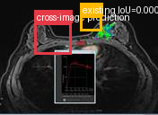</td><td></td></tr>
</table>

- **Target：** `study_002_mri_image_002_axial_t1_c_fat_sat`; MRI; Axial T1 C+ fat sat
- **Relation：** `bbox_to_image` / `partial_support`
- **Returned target bbox：** `[220, 200, 460, 480]`
- **Maximum IoU：** 0.000; threshold=0.5
- **Strong relation IDs：** `[]`

**IoU matching：**

| Existing target bbox | IoU | Strong match | Lingshu caption | 中文翻译 |
|---|---:|---|---|---|
| `study_002_mri_image_002_axial_t1_c_fat_sat_f01`; `[480, 100, 680, 320]` | 0.000 | no | The image shows a breast MRI with a highlighted region in the right breast. The highlighted area appears to have a distinct mass with irregular borders and heterogeneous signal intensity. The mass is located in the upper outer quadrant of the right breast. Surrounding tissues show varying degrees of enhancement, suggesting possible involvement or reaction. The overall morphology and signal characteristics of the mass suggest it could be significant for further evaluation. | 乳腺 MRI 显示右乳高亮区域，其中可见边缘不规则、信号不均的明确肿块，位于右乳外上象限。周围组织呈不同程度强化，提示可能受累或发生反应。该肿块的整体形态及信号特征提示需要进一步评估。 |

**B 图单红框（Lingshu 实际输入）：**

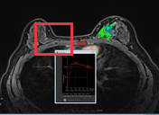

**Re-ground Lingshu caption：** The image shows a breast MRI with a focus on the right breast. Within the red box, there is a region of interest that appears to have a different signal intensity compared to the surrounding tissue. This area is highlighted by green arrows, indicating a potential abnormality. The lesion appears to be well-circumscribed and is located in the upper outer quadrant of the right breast. The surrounding tissue shows normal breast parenchyma with no significant distortion or architectural changes. There is also a small inset image showing a magnified view of the lesion, which helps in better visualization of its characteristics.
**Re-ground caption 中文翻译：** 图像为右乳 MRI。红框内可见较周围组织信号不同的关注区域，绿色箭头指示潜在异常。病灶边界清楚，位于右乳外上象限。周围乳腺实质正常，未见明显扭曲或结构改变。另有小插图显示病灶放大图，有助于观察其特征。

**Quantitative / qualitative validation：**

| Validation pair | Quantitative size / 定量 | Qualitative caption / 定性 |
|---|---|---|
| `partial__location_00010` | `inconsistent` | `consistent` |

## Dynamically Skipped Anchors

| Anchor node | Reused strong relations | Skipped target images |
|---|---|---|
| `study_001_ultrasound_image_001_missing_f01` | `[&#x27;strong_location_00001_01&#x27;]` | `[&#x27;study_002_mri_image_000_3d_mip_colour_coded_enhancement_pattern_t1_c_fat_sat&#x27;, &#x27;study_002_mri_image_001_axial_t1_c_fat_sat&#x27;, &#x27;study_002_mri_image_002_axial_t1_c_fat_sat&#x27;]` |

## Case-level Location Validation Summary / 病例级定位验证总结

- **Strong support：** 1 个 bbox-to-bbox 关系
- **Partial support：** 3 个 bbox-to-image 关系
- **Not support：** 3 个 bbox-to-image 关系

### Strong Support

#### Strong 1: `study_001_ultrasound_image_000_missing_f01` ↔ `study_001_ultrasound_image_001_missing_f01`

- **Relation / query：** `strong_location_00001_01` / `location_00001`
- **IoU：** 0.674（threshold=0.5）

<table>
<tr><th>Anchor bbox</th><th>Cross-image grounded target bbox</th><th>Matched target bbox</th></tr>
<tr><td></td><td></td><td></td></tr>
</table>

- **Anchor Lingshu caption：** The left breast ultrasound demonstrates a hypoechoic mass measuring approximately 2.7 cm at the 10 o&#x27;clock position. The mass has irregular borders and appears to be well-circumscribed. There is no evidence of posterior acoustic shadowing or enhancement. Surrounding breast tissue appears heterogeneous without any additional focal lesions noted.
- **Anchor caption 中文翻译：** 左乳超声显示 10 点钟方向一个约 2.7 cm 的低回声肿块。肿块边缘不规则，但似乎边界清楚。未见后方声影或后方回声增强。周围乳腺组织回声不均，未见其他局灶性病变。
- **Target Lingshu caption：** The left breast ultrasound demonstrates a hypoechoic mass with irregular margins and posterior acoustic shadowing. The mass measures approximately 1.5 cm in diameter. There is increased vascularity within the mass on color Doppler imaging. Surrounding breast tissue appears heterogeneous with scattered fibroglandular densities. No additional suspicious masses or abnormalities are noted in the imaged area.
- **Target caption 中文翻译：** 左乳超声显示一个边缘不规则并伴后方声影的低回声肿块，直径约 1.5 cm。彩色多普勒显示肿块内血流增多。周围乳腺组织回声不均，可见散在纤维腺体密度。所示区域未见其他可疑肿块或异常。
- **Quantitative size validation / 定量大小一致性：** `inconsistent`
- **Qualitative caption validation / 定性语义一致性：** `inconsistent`

### Partial Support

#### Partial 1: `study_002_mri_image_000_3d_mip_colour_coded_enhancement_pattern_t1_c_fat_sat_f01` → `study_002_mri_image_001_axial_t1_c_fat_sat`

- **Query：** `location_00008`
- **Returned target bbox：** `[670, 30, 820, 150]`
- **Maximum IoU：** 0.000（低于 threshold=0.5）

<table>
<tr><th>Anchor bbox</th><th>Cross-image grounding and IoU overlay</th><th>B image with the single re-grounded bbox given to Lingshu</th><th>Closest existing target bbox</th></tr>
<tr><td></td><td></td><td></td><td></td></tr>
</table>

- **A 端原始 Lingshu caption：** The image shows a 3D MIP (Maximum Intensity Projection) color-coded enhancement pattern on a T1-weighted contrast-enhanced fat-saturated MRI sequence. The boxed region appears to highlight an area of interest that may contain an abnormality. Within this region, there is a distinct area of enhanced signal intensity, suggesting increased vascularity or perfusion. This area is located centrally within the image, and its boundaries are clearly demarcated by the red box. The surrounding tissue exhibits varying degrees of enhancement, indicating different levels of perfusion or vascularization. The overall image provides valuable information about the distribution and intensity of enhancement patterns, which can aid in the assessment of potential abnormalities.
- **A 端 caption 中文翻译：** 图像为 T1 加权增强脂肪抑制 MRI 序列的三维最大密度投影彩色编码强化图。框内为可能存在异常的关注区域，其中可见明确的信号强化，提示血管丰富度或灌注增加。该区域位于图像中央，边界由红框清楚标出。周围组织呈不同程度强化，反映灌注或血管化水平不同。整幅图像展示了强化模式的分布和强度，可用于评估潜在异常。
- **B 端 re-ground Lingshu caption：** The image shows a breast MRI with a highlighted region in the upper outer quadrant of the right breast. The highlighted area appears to have increased signal intensity compared to the surrounding tissue, suggesting a potential lesion. The lesion is well-circumscribed and appears to be enhancing, which could indicate a solid mass. Surrounding tissues show normal breast parenchyma without any obvious signs of edema or distortion. No other abnormalities are noted in the left breast or axillary regions in this particular slice.
- **B 端 re-ground caption 中文翻译：** 乳腺 MRI 显示右乳外上象限高亮区域，其信号高于周围组织，提示可能存在病灶。病灶边界清楚并呈强化，可能为实性肿块。周围乳腺组织表现正常，未见明显水肿或结构扭曲。本层面左乳或腋窝区未见其他异常。
- **Quantitative size validation / 定量大小一致性：** `inconsistent`
- **Qualitative caption validation / 定性语义一致性：** `inconsistent`

#### Partial 2: `study_002_mri_image_000_3d_mip_colour_coded_enhancement_pattern_t1_c_fat_sat_f01` → `study_002_mri_image_002_axial_t1_c_fat_sat`

- **Query：** `location_00009`
- **Returned target bbox：** `[650, 110, 760, 250]`
- **Maximum IoU：** 0.073（低于 threshold=0.5）

<table>
<tr><th>Anchor bbox</th><th>Cross-image grounding and IoU overlay</th><th>B image with the single re-grounded bbox given to Lingshu</th><th>Closest existing target bbox</th></tr>
<tr><td></td><td></td><td></td><td></td></tr>
</table>

- **A 端原始 Lingshu caption：** The image shows a 3D MIP (Maximum Intensity Projection) color-coded enhancement pattern on a T1-weighted contrast-enhanced fat-saturated MRI sequence. The boxed region appears to highlight an area of interest that may contain an abnormality. Within this region, there is a distinct area of enhanced signal intensity, suggesting increased vascularity or perfusion. This area is located centrally within the image, and its boundaries are clearly demarcated by the red box. The surrounding tissue exhibits varying degrees of enhancement, indicating different levels of perfusion or vascularization. The overall image provides valuable information about the distribution and intensity of enhancement patterns, which can aid in the assessment of potential abnormalities.
- **A 端 caption 中文翻译：** 图像为 T1 加权增强脂肪抑制 MRI 序列的三维最大密度投影彩色编码强化图。框内为可能存在异常的关注区域，其中可见明确的信号强化，提示血管丰富度或灌注增加。该区域位于图像中央，边界由红框清楚标出。周围组织呈不同程度强化，反映灌注或血管化水平不同。整幅图像展示了强化模式的分布和强度，可用于评估潜在异常。
- **B 端 re-ground Lingshu caption：** The image shows a breast MRI with a highlighted region in the right breast. The highlighted area appears to have a distinct mass with irregular borders and heterogeneous signal intensity. The mass is located in the upper outer quadrant of the right breast. Surrounding the mass, there is evidence of enhancement, suggesting possible contrast uptake. The adjacent tissue shows some degree of edema or inflammation, indicated by the increased signal intensity in the surrounding parenchyma. No significant lymphadenopathy is noted in the axillary region on this slice.
- **B 端 re-ground caption 中文翻译：** 乳腺 MRI 显示右乳高亮区域，其中可见边缘不规则、信号不均的明确肿块，位于右乳外上象限。肿块周围可见强化，提示可能有对比剂摄取。邻近实质信号增高，提示可能存在一定程度的水肿或炎症。本层面腋窝区未见明显淋巴结肿大。
- **Quantitative size validation / 定量大小一致性：** `inconsistent`
- **Qualitative caption validation / 定性语义一致性：** `inconsistent`

#### Partial 3: `study_002_mri_image_001_axial_t1_c_fat_sat_f01` → `study_002_mri_image_002_axial_t1_c_fat_sat`

- **Query：** `location_00010`
- **Returned target bbox：** `[220, 200, 460, 480]`
- **Maximum IoU：** 0.000（低于 threshold=0.5）

<table>
<tr><th>Anchor bbox</th><th>Cross-image grounding and IoU overlay</th><th>B image with the single re-grounded bbox given to Lingshu</th><th>Closest existing target bbox</th></tr>
<tr><td></td><td></td><td></td><td></td></tr>
</table>

- **A 端原始 Lingshu caption：** The image shows a breast MRI with a highlighted area in the right breast. The highlighted region appears to have increased signal intensity compared to the surrounding tissue, suggesting a possible lesion or abnormality. The lesion is located in the upper outer quadrant of the right breast. The surrounding tissue shows normal breast parenchyma with no other apparent abnormalities. The contrast enhancement pattern within the highlighted area indicates that it might be a focal area of interest for further evaluation.
- **A 端 caption 中文翻译：** 乳腺 MRI 显示右乳高亮区域，其信号强度高于周围组织，提示可能存在病灶或异常。病灶位于右乳外上象限。周围乳腺实质表现正常，未见其他明显异常。该区域的对比强化模式提示其值得进一步评估。
- **B 端 re-ground Lingshu caption：** The image shows a breast MRI with a focus on the right breast. Within the red box, there is a region of interest that appears to have a different signal intensity compared to the surrounding tissue. This area is highlighted by green arrows, indicating a potential abnormality. The lesion appears to be well-circumscribed and is located in the upper outer quadrant of the right breast. The surrounding tissue shows normal breast parenchyma with no significant distortion or architectural changes. There is also a small inset image showing a magnified view of the lesion, which helps in better visualization of its characteristics.
- **B 端 re-ground caption 中文翻译：** 图像为右乳 MRI。红框内可见较周围组织信号不同的关注区域，绿色箭头指示潜在异常。病灶边界清楚，位于右乳外上象限。周围乳腺实质正常，未见明显扭曲或结构改变。另有小插图显示病灶放大图，有助于观察其特征。
- **Quantitative size validation / 定量大小一致性：** `inconsistent`
- **Qualitative caption validation / 定性语义一致性：** `consistent`

### Not Support

#### Not support 1: `study_001_ultrasound_image_000_missing_f01` → `study_002_mri_image_000_3d_mip_colour_coded_enhancement_pattern_t1_c_fat_sat`

- **Query：** `location_00002`
- **Result：** 目标图返回 `null`，未定位到对应区域。

<table>
<tr><th>Anchor bbox</th><th>Target original image</th></tr>
<tr><td></td><td></td></tr>
</table>

- **A 端原始 Lingshu caption：** The left breast ultrasound demonstrates a hypoechoic mass measuring approximately 2.7 cm at the 10 o&#x27;clock position. The mass has irregular borders and appears to be well-circumscribed. There is no evidence of posterior acoustic shadowing or enhancement. Surrounding breast tissue appears heterogeneous without any additional focal lesions noted.
- **A 端 caption 中文翻译：** 左乳超声显示 10 点钟方向一个约 2.7 cm 的低回声肿块。肿块边缘不规则，但似乎边界清楚。未见后方声影或后方回声增强。周围乳腺组织回声不均，未见其他局灶性病变。
- **B 端 re-ground caption：** 不适用；目标图返回 `null`，没有生成 re-ground bbox。
- **定量 / 定性验证：** 不适用；仅对 strong-support 和 partial-support pair 执行。

#### Not support 2: `study_001_ultrasound_image_000_missing_f01` → `study_002_mri_image_001_axial_t1_c_fat_sat`

- **Query：** `location_00003`
- **Result：** 目标图返回 `null`，未定位到对应区域。

<table>
<tr><th>Anchor bbox</th><th>Target original image</th></tr>
<tr><td></td><td></td></tr>
</table>

- **A 端原始 Lingshu caption：** The left breast ultrasound demonstrates a hypoechoic mass measuring approximately 2.7 cm at the 10 o&#x27;clock position. The mass has irregular borders and appears to be well-circumscribed. There is no evidence of posterior acoustic shadowing or enhancement. Surrounding breast tissue appears heterogeneous without any additional focal lesions noted.
- **A 端 caption 中文翻译：** 左乳超声显示 10 点钟方向一个约 2.7 cm 的低回声肿块。肿块边缘不规则，但似乎边界清楚。未见后方声影或后方回声增强。周围乳腺组织回声不均，未见其他局灶性病变。
- **B 端 re-ground caption：** 不适用；目标图返回 `null`，没有生成 re-ground bbox。
- **定量 / 定性验证：** 不适用；仅对 strong-support 和 partial-support pair 执行。

#### Not support 3: `study_001_ultrasound_image_000_missing_f01` → `study_002_mri_image_002_axial_t1_c_fat_sat`

- **Query：** `location_00004`
- **Result：** 目标图返回 `null`，未定位到对应区域。

<table>
<tr><th>Anchor bbox</th><th>Target original image</th></tr>
<tr><td></td><td></td></tr>
</table>

- **A 端原始 Lingshu caption：** The left breast ultrasound demonstrates a hypoechoic mass measuring approximately 2.7 cm at the 10 o&#x27;clock position. The mass has irregular borders and appears to be well-circumscribed. There is no evidence of posterior acoustic shadowing or enhancement. Surrounding breast tissue appears heterogeneous without any additional focal lesions noted.
- **A 端 caption 中文翻译：** 左乳超声显示 10 点钟方向一个约 2.7 cm 的低回声肿块。肿块边缘不规则，但似乎边界清楚。未见后方声影或后方回声增强。周围乳腺组织回声不均，未见其他局灶性病变。
- **B 端 re-ground caption：** 不适用；目标图返回 `null`，没有生成 re-ground bbox。
- **定量 / 定性验证：** 不适用；仅对 strong-support 和 partial-support pair 执行。
