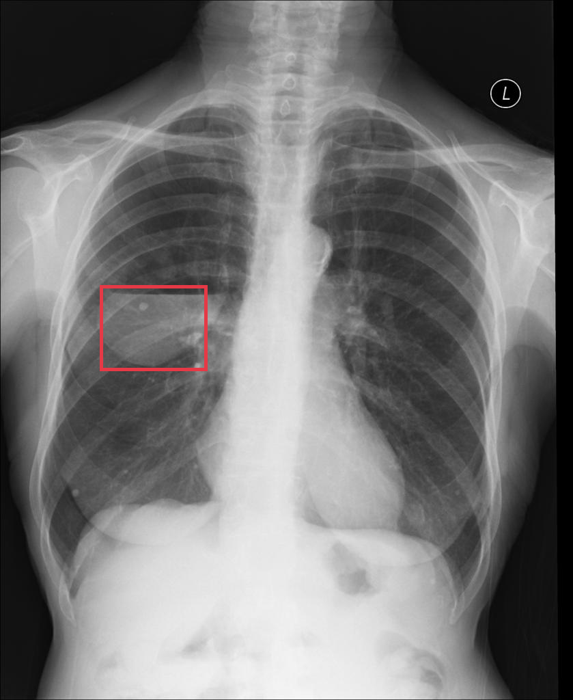
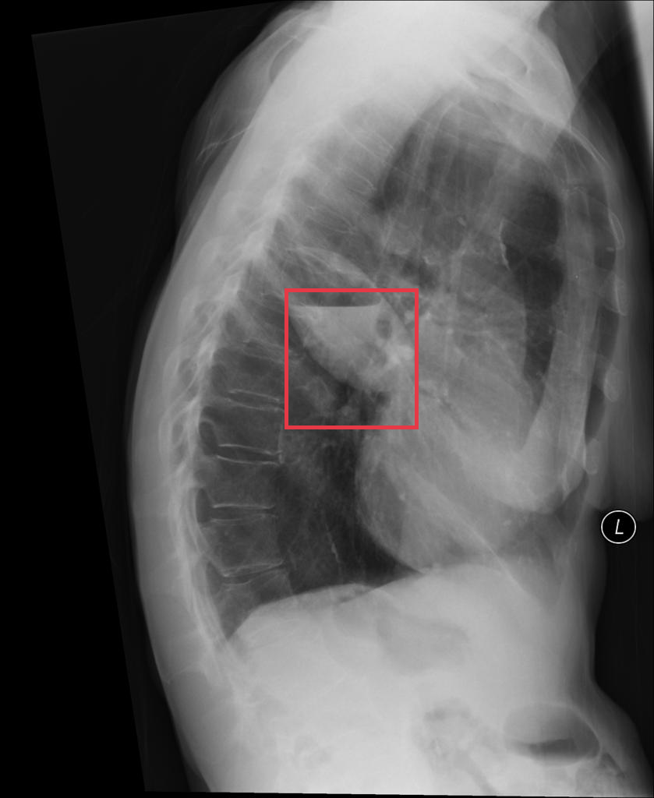
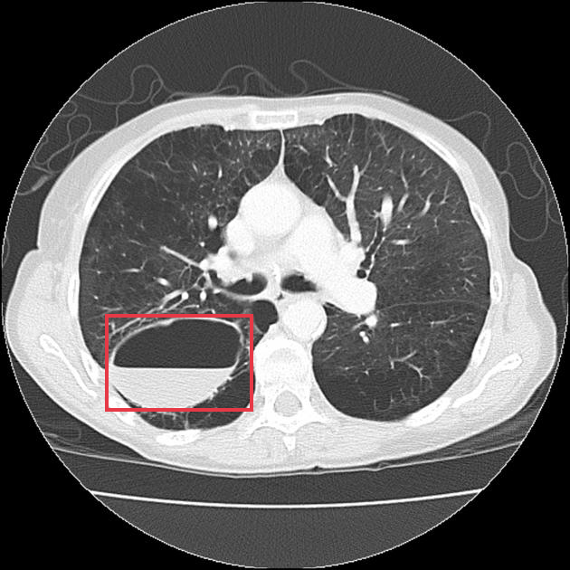
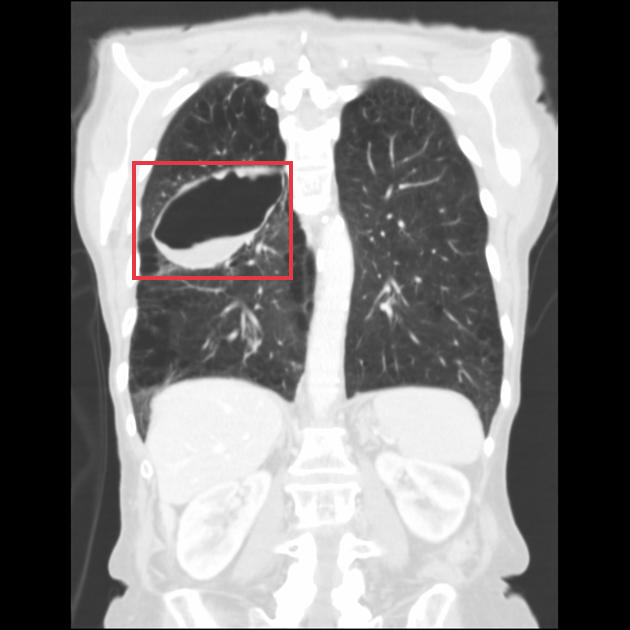
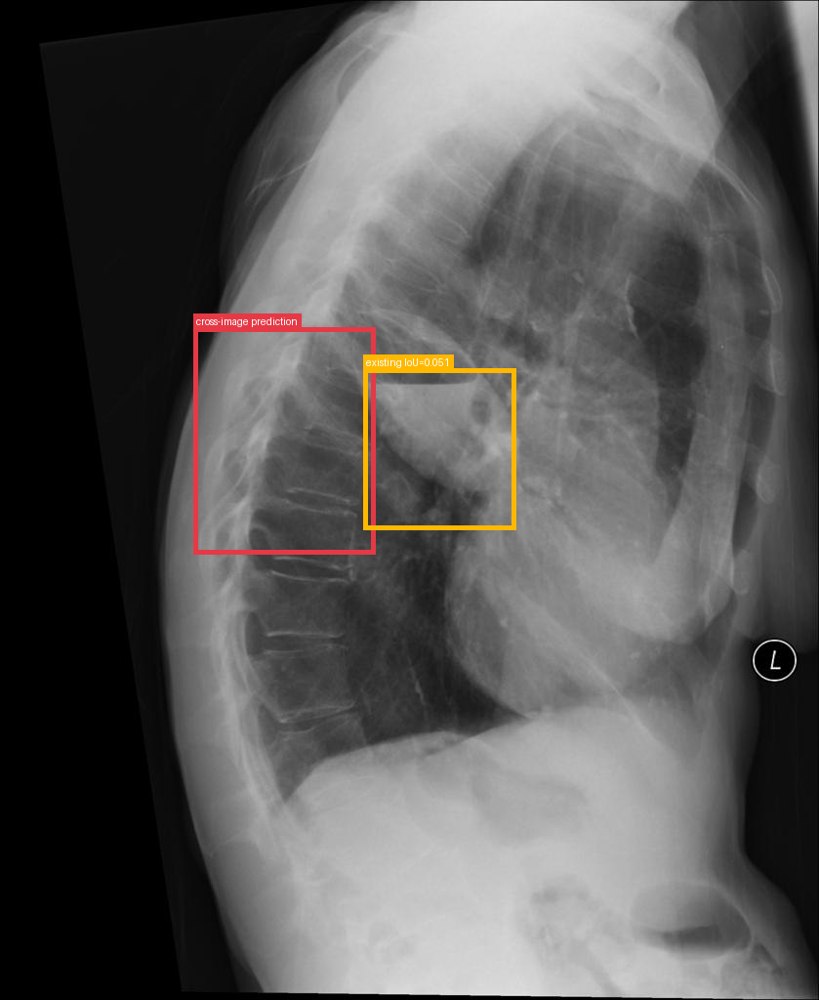
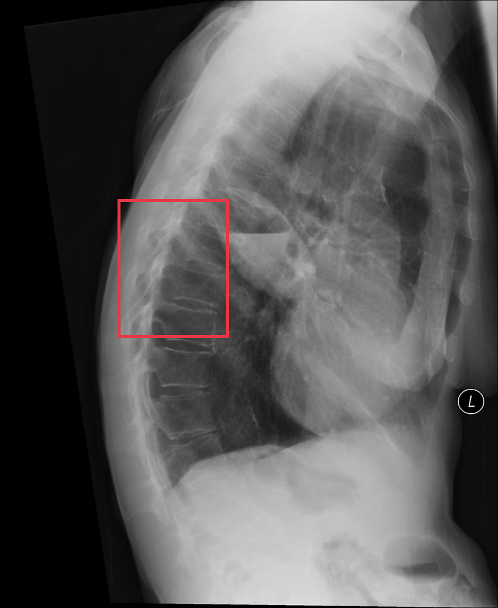
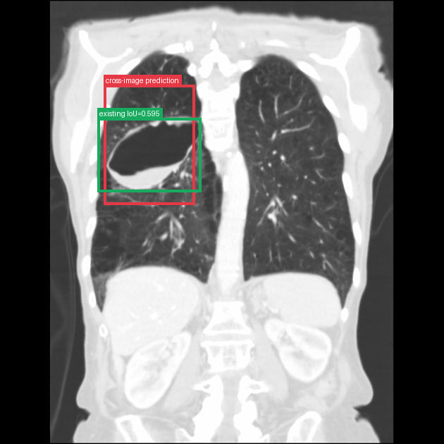
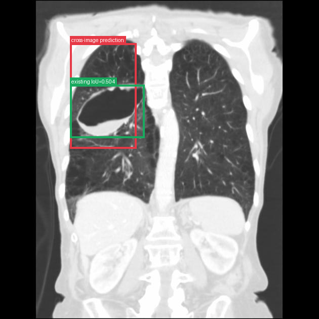

# Infected emphysematous bulla

[返回 Step 3 总览](../README_STEP3_VISUALIZATION.md)

- **Case ID：** `infected-emphysematous-bulla`
- **Case URL：** [https://radiopaedia.org/cases/infected-emphysematous-bulla?lang=us](https://radiopaedia.org/cases/infected-emphysematous-bulla?lang=us)
- **验证模型：** Qwen3-VL-8B
- **图像 / Step 2 findings：** 4 / 4
- **定位结果：** strong 2；partial 1；not support 3；parse error 0
- **Strong bbox relations：** 2
- **原始 JSON：** [case_evidence.json](../assets_step3/infected-emphysematous-bulla/case_evidence.json)
- **定量/定性验证 JSON：** [step_3_validation_case_evidence.json](../assets_step3/infected-emphysematous-bulla/step_3_validation_case_evidence.json)

**Overlay 图例：** 红框为跨图新定位；绿框为 IoU >= 0.5 的已有 bbox；黄框为未达到阈值的已有 bbox。

## Step 2 Finding Nodes

### Finding 1: `study_000_x_ray_image_000_frontal_f01`

- **Modality / subcategory：** X-ray / Frontal
- **bbox_2d：** `[175, 408, 362, 530]`
- **Lingshu caption：** The lungs are hyperinflated. There is a 1.5 cm rounded opacity projecting over the right mid lung zone. No pleural effusion or pneumothorax is seen. The cardiac and mediastinal silhouettes are unremarkable.
- **中文翻译：** 双肺过度充气。右中肺野投影区可见一个 1.5 cm 的圆形致密影。未见胸腔积液或气胸。心影及纵隔轮廓未见异常。

### Finding 2: `study_000_x_ray_image_001_lateral_f01`

- **Modality / subcategory：** X-ray / Lateral
- **bbox_2d：** `[436, 362, 639, 538]`
- **Lingshu caption：** The heart size is enlarged. The aorta is tortuous. There is a calcified lesion overlying the cardiac silhouette. This could represent a calcified lymph node or other calcification.
- **中文翻译：** 心影增大，主动脉迂曲。心影重叠区可见钙化性病灶，可能代表钙化淋巴结或其他钙化。

### Finding 3: `study_001_ct_image_000_axial_lung_window_f01`

- **Modality / subcategory：** CT / Axial lung window
- **bbox_2d：** `[185, 552, 444, 721]`
- **Lingshu caption：** The right lower lobe contains a large cystic structure with thin walls. The remainder of the lungs are clear without focal consolidation, pleural effusion, or pneumothorax. The cardiomediastinal silhouette is normal.
- **中文翻译：** 右下叶可见一个薄壁大囊性结构。其余肺野清晰，未见局灶性实变、胸腔积液或气胸。心纵隔轮廓正常。

### Finding 4: `study_001_ct_image_001_coronal_lung_window_f01`

- **Modality / subcategory：** CT / Coronal lung window
- **bbox_2d：** `[210, 256, 464, 444]`
- **Lingshu caption：** The lungs are hyperinflated. There is a large cavitary lesion in the right upper lobe with thick irregular walls. The remainder of the lungs demonstrate emphysematous changes. No pleural effusions are seen.
- **中文翻译：** 双肺过度充气。右上叶可见一个厚壁、不规则的大空洞性病灶。其余肺组织呈肺气肿改变。未见胸腔积液。

## Directed Cross-image Validation

### Anchor 1: `study_000_x_ray_image_000_frontal_f01`

**Anchor Lingshu caption：** The lungs are hyperinflated. There is a 1.5 cm rounded opacity projecting over the right mid lung zone. No pleural effusion or pneumothorax is seen. The cardiac and mediastinal silhouettes are unremarkable.
**Anchor caption 中文翻译：** 双肺过度充气。右中肺野投影区可见一个 1.5 cm 的圆形致密影。未见胸腔积液或气胸。心影及纵隔轮廓未见异常。

#### location_00001: PARTIAL SUPPORT

<table>
<tr><th>Anchor original bbox</th><th>Cross-image grounded target bbox</th><th>Existing target bbox: study_000_x_ray_image_001_lateral_f01</th></tr>
<tr><td></td><td></td><td></td></tr>
</table>

- **Target：** `study_000_x_ray_image_001_lateral`; X-ray; Lateral
- **Relation：** `bbox_to_image` / `partial_support`
- **Returned target bbox：** `[236, 328, 460, 555]`
- **Maximum IoU：** 0.051; threshold=0.5
- **Strong relation IDs：** `[]`

**IoU matching：**

| Existing target bbox | IoU | Strong match | Lingshu caption | 中文翻译 |
|---|---:|---|---|---|
| `study_000_x_ray_image_001_lateral_f01`; `[436, 362, 639, 538]` | 0.051 | no | The heart size is enlarged. The aorta is tortuous. There is a calcified lesion overlying the cardiac silhouette. This could represent a calcified lymph node or other calcification. | 心影增大，主动脉迂曲。心影重叠区可见钙化性病灶，可能代表钙化淋巴结或其他钙化。 |

**B 图单红框（Lingshu 实际输入）：**

**Re-ground Lingshu caption：** The heart size is enlarged. The aorta is tortuous. There is a large hiatal hernia present. No focal consolidations, pleural effusions, or pneumothorax seen. The visualized osseous structures are unremarkable.
**Re-ground caption 中文翻译：** 心影增大，主动脉迂曲。可见较大的食管裂孔疝。未见局灶性实变、胸腔积液或气胸。所见骨性结构未见异常。

**Quantitative / qualitative validation：**

| Validation pair | Quantitative size / 定量 | Qualitative caption / 定性 |
|---|---|---|
| `partial__location_00001` | `consistent` | `consistent` |

#### location_00002: NOT SUPPORT

<table>
<tr><th>Anchor original bbox</th><th>Target original image; model returned null</th><th>Existing target bbox: study_001_ct_image_000_axial_lung_window_f01</th></tr>
<tr><td></td><td></td><td></td></tr>
</table>

- **Target：** `study_001_ct_image_000_axial_lung_window`; CT; Axial lung window
- **Relation：** `bbox_to_image` / `not_support`
- **Returned target bbox：** `unknown`
- **Maximum IoU：** n/a; threshold=0.5
- **Strong relation IDs：** `[]`

**IoU matching：**

| Existing target bbox | IoU | Strong match | Lingshu caption | 中文翻译 |
|---|---:|---|---|---|
| `study_001_ct_image_000_axial_lung_window_f01`; `[185, 552, 444, 721]` | n/a | n/a | The right lower lobe contains a large cystic structure with thin walls. The remainder of the lungs are clear without focal consolidation, pleural effusion, or pneumothorax. The cardiomediastinal silhouette is normal. | 右下叶可见一个薄壁大囊性结构。其余肺野清晰，未见局灶性实变、胸腔积液或气胸。心纵隔轮廓正常。 |

#### location_00003: NOT SUPPORT

<table>
<tr><th>Anchor original bbox</th><th>Target original image; model returned null</th><th>Existing target bbox: study_001_ct_image_001_coronal_lung_window_f01</th></tr>
<tr><td></td><td></td><td></td></tr>
</table>

- **Target：** `study_001_ct_image_001_coronal_lung_window`; CT; Coronal lung window
- **Relation：** `bbox_to_image` / `not_support`
- **Returned target bbox：** `unknown`
- **Maximum IoU：** n/a; threshold=0.5
- **Strong relation IDs：** `[]`

**IoU matching：**

| Existing target bbox | IoU | Strong match | Lingshu caption | 中文翻译 |
|---|---:|---|---|---|
| `study_001_ct_image_001_coronal_lung_window_f01`; `[210, 256, 464, 444]` | n/a | n/a | The lungs are hyperinflated. There is a large cavitary lesion in the right upper lobe with thick irregular walls. The remainder of the lungs demonstrate emphysematous changes. No pleural effusions are seen. | 双肺过度充气。右上叶可见一个厚壁、不规则的大空洞性病灶。其余肺组织呈肺气肿改变。未见胸腔积液。 |

### Anchor 2: `study_000_x_ray_image_001_lateral_f01`

**Anchor Lingshu caption：** The heart size is enlarged. The aorta is tortuous. There is a calcified lesion overlying the cardiac silhouette. This could represent a calcified lymph node or other calcification.
**Anchor caption 中文翻译：** 心影增大，主动脉迂曲。心影重叠区可见钙化性病灶，可能代表钙化淋巴结或其他钙化。

#### location_00004: NOT SUPPORT

<table>
<tr><th>Anchor original bbox</th><th>Target original image; model returned null</th><th>Existing target bbox: study_001_ct_image_000_axial_lung_window_f01</th></tr>
<tr><td></td><td></td><td></td></tr>
</table>

- **Target：** `study_001_ct_image_000_axial_lung_window`; CT; Axial lung window
- **Relation：** `bbox_to_image` / `not_support`
- **Returned target bbox：** `unknown`
- **Maximum IoU：** n/a; threshold=0.5
- **Strong relation IDs：** `[]`

**IoU matching：**

| Existing target bbox | IoU | Strong match | Lingshu caption | 中文翻译 |
|---|---:|---|---|---|
| `study_001_ct_image_000_axial_lung_window_f01`; `[185, 552, 444, 721]` | n/a | n/a | The right lower lobe contains a large cystic structure with thin walls. The remainder of the lungs are clear without focal consolidation, pleural effusion, or pneumothorax. The cardiomediastinal silhouette is normal. | 右下叶可见一个薄壁大囊性结构。其余肺野清晰，未见局灶性实变、胸腔积液或气胸。心纵隔轮廓正常。 |

#### location_00005: STRONG SUPPORT

<table>
<tr><th>Anchor original bbox</th><th>Cross-image grounded target bbox</th><th>Existing target bbox: study_001_ct_image_001_coronal_lung_window_f01</th></tr>
<tr><td></td><td></td><td></td></tr>
</table>

- **Target：** `study_001_ct_image_001_coronal_lung_window`; CT; Coronal lung window
- **Relation：** `bbox_to_bbox` / `strong_support`
- **Returned target bbox：** `[234, 192, 440, 462]`
- **Maximum IoU：** 0.595; threshold=0.5
- **Strong relation IDs：** `[&#x27;strong_location_00005_01&#x27;]`

**IoU matching：**

| Existing target bbox | IoU | Strong match | Lingshu caption | 中文翻译 |
|---|---:|---|---|---|
| `study_001_ct_image_001_coronal_lung_window_f01`; `[210, 256, 464, 444]` | 0.595 | yes | The lungs are hyperinflated. There is a large cavitary lesion in the right upper lobe with thick irregular walls. The remainder of the lungs demonstrate emphysematous changes. No pleural effusions are seen. | 双肺过度充气。右上叶可见一个厚壁、不规则的大空洞性病灶。其余肺组织呈肺气肿改变。未见胸腔积液。 |

**Quantitative / qualitative validation：**

| Validation pair | Quantitative size / 定量 | Qualitative caption / 定性 |
|---|---|---|
| `strong__strong_location_00005_01` | `inconsistent` | `consistent` |

### Anchor 3: `study_001_ct_image_000_axial_lung_window_f01`

**Anchor Lingshu caption：** The right lower lobe contains a large cystic structure with thin walls. The remainder of the lungs are clear without focal consolidation, pleural effusion, or pneumothorax. The cardiomediastinal silhouette is normal.
**Anchor caption 中文翻译：** 右下叶可见一个薄壁大囊性结构。其余肺野清晰，未见局灶性实变、胸腔积液或气胸。心纵隔轮廓正常。

#### location_00006: STRONG SUPPORT

<table>
<tr><th>Anchor original bbox</th><th>Cross-image grounded target bbox</th><th>Existing target bbox: study_001_ct_image_001_coronal_lung_window_f01</th></tr>
<tr><td></td><td></td><td></td></tr>
</table>

- **Target：** `study_001_ct_image_001_coronal_lung_window`; CT; Coronal lung window
- **Relation：** `bbox_to_bbox` / `strong_support`
- **Returned target bbox：** `[220, 136, 430, 468]`
- **Maximum IoU：** 0.504; threshold=0.5
- **Strong relation IDs：** `[&#x27;strong_location_00006_01&#x27;]`

**IoU matching：**

| Existing target bbox | IoU | Strong match | Lingshu caption | 中文翻译 |
|---|---:|---|---|---|
| `study_001_ct_image_001_coronal_lung_window_f01`; `[210, 256, 464, 444]` | 0.504 | yes | The lungs are hyperinflated. There is a large cavitary lesion in the right upper lobe with thick irregular walls. The remainder of the lungs demonstrate emphysematous changes. No pleural effusions are seen. | 双肺过度充气。右上叶可见一个厚壁、不规则的大空洞性病灶。其余肺组织呈肺气肿改变。未见胸腔积液。 |

**Quantitative / qualitative validation：**

| Validation pair | Quantitative size / 定量 | Qualitative caption / 定性 |
|---|---|---|
| `strong__strong_location_00006_01` | `inconsistent` | `inconsistent` |

## Dynamically Skipped Anchors

None.

## Case-level Location Validation Summary / 病例级定位验证总结

- **Strong support：** 2 个 bbox-to-bbox 关系
- **Partial support：** 1 个 bbox-to-image 关系
- **Not support：** 3 个 bbox-to-image 关系

### Strong Support

#### Strong 1: `study_000_x_ray_image_001_lateral_f01` ↔ `study_001_ct_image_001_coronal_lung_window_f01`

- **Relation / query：** `strong_location_00005_01` / `location_00005`
- **IoU：** 0.595（threshold=0.5）

<table>
<tr><th>Anchor bbox</th><th>Cross-image grounded target bbox</th><th>Matched target bbox</th></tr>
<tr><td></td><td></td><td></td></tr>
</table>

- **Anchor Lingshu caption：** The heart size is enlarged. The aorta is tortuous. There is a calcified lesion overlying the cardiac silhouette. This could represent a calcified lymph node or other calcification.
- **Anchor caption 中文翻译：** 心影增大，主动脉迂曲。心影重叠区可见钙化性病灶，可能代表钙化淋巴结或其他钙化。
- **Target Lingshu caption：** The lungs are hyperinflated. There is a large cavitary lesion in the right upper lobe with thick irregular walls. The remainder of the lungs demonstrate emphysematous changes. No pleural effusions are seen.
- **Target caption 中文翻译：** 双肺过度充气。右上叶可见一个厚壁、不规则的大空洞性病灶。其余肺组织呈肺气肿改变。未见胸腔积液。
- **Quantitative size validation / 定量大小一致性：** `inconsistent`
- **Qualitative caption validation / 定性语义一致性：** `consistent`

#### Strong 2: `study_001_ct_image_000_axial_lung_window_f01` ↔ `study_001_ct_image_001_coronal_lung_window_f01`

- **Relation / query：** `strong_location_00006_01` / `location_00006`
- **IoU：** 0.504（threshold=0.5）

<table>
<tr><th>Anchor bbox</th><th>Cross-image grounded target bbox</th><th>Matched target bbox</th></tr>
<tr><td></td><td></td><td></td></tr>
</table>

- **Anchor Lingshu caption：** The right lower lobe contains a large cystic structure with thin walls. The remainder of the lungs are clear without focal consolidation, pleural effusion, or pneumothorax. The cardiomediastinal silhouette is normal.
- **Anchor caption 中文翻译：** 右下叶可见一个薄壁大囊性结构。其余肺野清晰，未见局灶性实变、胸腔积液或气胸。心纵隔轮廓正常。
- **Target Lingshu caption：** The lungs are hyperinflated. There is a large cavitary lesion in the right upper lobe with thick irregular walls. The remainder of the lungs demonstrate emphysematous changes. No pleural effusions are seen.
- **Target caption 中文翻译：** 双肺过度充气。右上叶可见一个厚壁、不规则的大空洞性病灶。其余肺组织呈肺气肿改变。未见胸腔积液。
- **Quantitative size validation / 定量大小一致性：** `inconsistent`
- **Qualitative caption validation / 定性语义一致性：** `inconsistent`

### Partial Support

#### Partial 1: `study_000_x_ray_image_000_frontal_f01` → `study_000_x_ray_image_001_lateral`

- **Query：** `location_00001`
- **Returned target bbox：** `[236, 328, 460, 555]`
- **Maximum IoU：** 0.051（低于 threshold=0.5）

<table>
<tr><th>Anchor bbox</th><th>Cross-image grounding and IoU overlay</th><th>B image with the single re-grounded bbox given to Lingshu</th><th>Closest existing target bbox</th></tr>
<tr><td></td><td></td><td></td><td></td></tr>
</table>

- **A 端原始 Lingshu caption：** The lungs are hyperinflated. There is a 1.5 cm rounded opacity projecting over the right mid lung zone. No pleural effusion or pneumothorax is seen. The cardiac and mediastinal silhouettes are unremarkable.
- **A 端 caption 中文翻译：** 双肺过度充气。右中肺野投影区可见一个 1.5 cm 的圆形致密影。未见胸腔积液或气胸。心影及纵隔轮廓未见异常。
- **B 端 re-ground Lingshu caption：** The heart size is enlarged. The aorta is tortuous. There is a large hiatal hernia present. No focal consolidations, pleural effusions, or pneumothorax seen. The visualized osseous structures are unremarkable.
- **B 端 re-ground caption 中文翻译：** 心影增大，主动脉迂曲。可见较大的食管裂孔疝。未见局灶性实变、胸腔积液或气胸。所见骨性结构未见异常。
- **Quantitative size validation / 定量大小一致性：** `consistent`
- **Qualitative caption validation / 定性语义一致性：** `consistent`

### Not Support

#### Not support 1: `study_000_x_ray_image_000_frontal_f01` → `study_001_ct_image_000_axial_lung_window`

- **Query：** `location_00002`
- **Result：** 目标图返回 `null`，未定位到对应区域。

<table>
<tr><th>Anchor bbox</th><th>Target original image</th></tr>
<tr><td></td><td></td></tr>
</table>

- **A 端原始 Lingshu caption：** The lungs are hyperinflated. There is a 1.5 cm rounded opacity projecting over the right mid lung zone. No pleural effusion or pneumothorax is seen. The cardiac and mediastinal silhouettes are unremarkable.
- **A 端 caption 中文翻译：** 双肺过度充气。右中肺野投影区可见一个 1.5 cm 的圆形致密影。未见胸腔积液或气胸。心影及纵隔轮廓未见异常。
- **B 端 re-ground caption：** 不适用；目标图返回 `null`，没有生成 re-ground bbox。
- **定量 / 定性验证：** 不适用；仅对 strong-support 和 partial-support pair 执行。

#### Not support 2: `study_000_x_ray_image_000_frontal_f01` → `study_001_ct_image_001_coronal_lung_window`

- **Query：** `location_00003`
- **Result：** 目标图返回 `null`，未定位到对应区域。

<table>
<tr><th>Anchor bbox</th><th>Target original image</th></tr>
<tr><td></td><td></td></tr>
</table>

- **A 端原始 Lingshu caption：** The lungs are hyperinflated. There is a 1.5 cm rounded opacity projecting over the right mid lung zone. No pleural effusion or pneumothorax is seen. The cardiac and mediastinal silhouettes are unremarkable.
- **A 端 caption 中文翻译：** 双肺过度充气。右中肺野投影区可见一个 1.5 cm 的圆形致密影。未见胸腔积液或气胸。心影及纵隔轮廓未见异常。
- **B 端 re-ground caption：** 不适用；目标图返回 `null`，没有生成 re-ground bbox。
- **定量 / 定性验证：** 不适用；仅对 strong-support 和 partial-support pair 执行。

#### Not support 3: `study_000_x_ray_image_001_lateral_f01` → `study_001_ct_image_000_axial_lung_window`

- **Query：** `location_00004`
- **Result：** 目标图返回 `null`，未定位到对应区域。

<table>
<tr><th>Anchor bbox</th><th>Target original image</th></tr>
<tr><td></td><td></td></tr>
</table>

- **A 端原始 Lingshu caption：** The heart size is enlarged. The aorta is tortuous. There is a calcified lesion overlying the cardiac silhouette. This could represent a calcified lymph node or other calcification.
- **A 端 caption 中文翻译：** 心影增大，主动脉迂曲。心影重叠区可见钙化性病灶，可能代表钙化淋巴结或其他钙化。
- **B 端 re-ground caption：** 不适用；目标图返回 `null`，没有生成 re-ground bbox。
- **定量 / 定性验证：** 不适用；仅对 strong-support 和 partial-support pair 执行。
