# Insulinoma

[返回 Step 3 总览](../README_STEP3_VISUALIZATION.md)

- **Case ID：** `insulinoma-3`
- **Case URL：** [https://radiopaedia.org/cases/insulinoma-3?lang=us](https://radiopaedia.org/cases/insulinoma-3?lang=us)
- **验证模型：** Qwen3-VL-8B
- **图像 / Step 2 findings：** 8 / 5
- **定位结果：** strong 0；partial 3；not support 20；parse error 0
- **Strong bbox relations：** 0
- **原始 JSON：** [case_evidence.json](../assets_step3/insulinoma-3/case_evidence.json)
- **定量/定性验证 JSON：** [step_3_validation_case_evidence.json](../assets_step3/insulinoma-3/step_3_validation_case_evidence.json)

**Overlay 图例：** 红框为跨图新定位；绿框为 IoU >= 0.5 的已有 bbox；黄框为未达到阈值的已有 bbox。

## Step 2 Finding Nodes

### Finding 1: `study_000_ct_image_000_axial_non_contrast_f01`

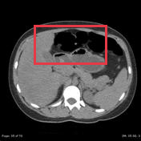

- **Modality / subcategory：** CT / Axial non-contrast
- **bbox_2d：** `[240, 180, 760, 460]`
- **Lingshu caption：** The liver is enlarged and contains multiple hypodense lesions. The largest lesion measures approximately 3.5 cm and is located in segment 4. There is also a smaller lesion measuring approximately 1.5 cm in segment 2.
- **中文翻译：** 肝脏增大，内见多发低密度病灶。最大病灶位于第 4 段，约 3.5 cm；第 2 段另见一个约 1.5 cm 的较小病灶。

### Finding 2: `study_000_ct_image_001_axial_c_arterial_phase_f01`

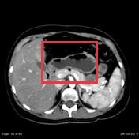

- **Modality / subcategory：** CT / Axial C+ arterial phase
- **bbox_2d：** `[300, 300, 700, 600]`
- **Lingshu caption：** The liver is enlarged and contains multiple hypodense lesions. The largest lesion measures 2.5 cm and is located in segment 4. There is also a smaller lesion measuring 1.3 cm in segment 8. These lesions demonstrate peripheral enhancement on the arterial phase.
- **中文翻译：** 肝脏增大，内见多发低密度病灶。最大病灶位于第 4 段，大小约 2.5 cm；第 8 段另见一个 1.3 cm 的较小病灶。这些病灶在动脉期呈周边强化。

### Finding 3: `study_001_mri_image_000_axial_t2_fat_sat_f01`

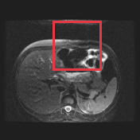

- **Modality / subcategory：** MRI / Axial T2 fat sat
- **bbox_2d：** `[375, 150, 725, 500]`
- **Lingshu caption：** The liver is enlarged and demonstrates diffuse abnormal signal intensity, which is heterogeneous. The spleen is also enlarged. There is a small amount of fluid in the right upper quadrant.
- **中文翻译：** 肝脏增大并呈弥漫性不均匀异常信号。脾脏也增大。右上腹可见少量液体。

### Finding 4: `study_002_dsa_angiography_image_000_splenic_artery_f01`

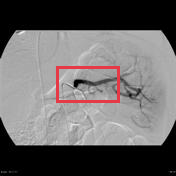

- **Modality / subcategory：** DSA (angiography) / Splenic artery
- **bbox_2d：** `[320, 380, 680, 580]`
- **Lingshu caption：** The splenic artery is visualized on this angiogram. There is a focal area of narrowing followed by dilation in the proximal portion of the splenic artery. The remainder of the splenic artery appears to have normal caliber.
- **中文翻译：** 血管造影显示脾动脉。脾动脉近段可见局灶性狭窄，狭窄后扩张。其余脾动脉管径正常。

### Finding 5: `study_002_dsa_angiography_image_001_hepatic_artery_f01`

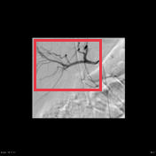

- **Modality / subcategory：** DSA (angiography) / Hepatic artery
- **bbox_2d：** `[220, 250, 650, 580]`
- **Lingshu caption：** The image shows a hepatic artery with a clear branching pattern. Within the boxed region, there appears to be a focal area of irregularity or narrowing along one of the arterial branches. This could potentially represent a stenosis or other vascular abnormality affecting the hepatic arterial supply. The surrounding vasculature appears otherwise unremarkable.
- **中文翻译：** 图像显示分支清楚的肝动脉。框内某一动脉分支局部似有不规则或狭窄，可能代表影响肝动脉供血的狭窄或其他血管异常。其余周围血管未见明显异常。

## Directed Cross-image Validation

### Anchor 1: `study_000_ct_image_000_axial_non_contrast_f01`

**Anchor Lingshu caption：** The liver is enlarged and contains multiple hypodense lesions. The largest lesion measures approximately 3.5 cm and is located in segment 4. There is also a smaller lesion measuring approximately 1.5 cm in segment 2.
**Anchor caption 中文翻译：** 肝脏增大，内见多发低密度病灶。最大病灶位于第 4 段，约 3.5 cm；第 2 段另见一个约 1.5 cm 的较小病灶。

#### location_00001: PARTIAL SUPPORT

<table>
<tr><th>Anchor original bbox</th><th>Cross-image grounded target bbox</th><th>Existing target bbox: study_000_ct_image_001_axial_c_arterial_phase_f01</th></tr>
<tr><td></td><td>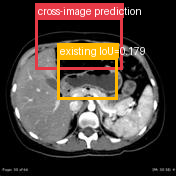</td><td></td></tr>
</table>

- **Target：** `study_000_ct_image_001_axial_c_arterial_phase`; CT; Axial C+ arterial phase
- **Relation：** `bbox_to_image` / `partial_support`
- **Returned target bbox：** `[200, 100, 700, 400]`
- **Maximum IoU：** 0.179; threshold=0.5
- **Strong relation IDs：** `[]`

**IoU matching：**

| Existing target bbox | IoU | Strong match | Lingshu caption | 中文翻译 |
|---|---:|---|---|---|
| `study_000_ct_image_001_axial_c_arterial_phase_f01`; `[300, 300, 700, 600]` | 0.179 | no | The liver is enlarged and contains multiple hypodense lesions. The largest lesion measures 2.5 cm and is located in segment 4. There is also a smaller lesion measuring 1.3 cm in segment 8. These lesions demonstrate peripheral enhancement on the arterial phase. | 肝脏增大，内见多发低密度病灶。最大病灶位于第 4 段，大小约 2.5 cm；第 8 段另见一个 1.3 cm 的较小病灶。这些病灶在动脉期呈周边强化。 |

**B 图单红框（Lingshu 实际输入）：**

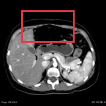

**Re-ground Lingshu caption：** The liver is enlarged and contains multiple hypodense lesions. The largest lesion measures 2.5 cm and is located in segment 4. There is also a smaller lesion measuring 1.3 cm in segment 8. These lesions demonstrate peripheral enhancement on the arterial phase.
**Re-ground caption 中文翻译：** 肝脏增大，内见多发低密度病灶。最大病灶位于第 4 段，大小约 2.5 cm；第 8 段另见一个约 1.3 cm 的较小病灶。这些病灶在动脉期呈周边强化。

**Quantitative / qualitative validation：**

| Validation pair | Quantitative size / 定量 | Qualitative caption / 定性 |
|---|---|---|
| `partial__location_00001` | `consistent` | `consistent` |

#### location_00002: PARTIAL SUPPORT

<table>
<tr><th>Anchor original bbox</th><th>Cross-image grounded target bbox</th><th>Existing target bbox: study_001_mri_image_000_axial_t2_fat_sat_f01</th></tr>
<tr><td></td><td>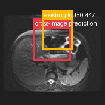</td><td></td></tr>
</table>

- **Target：** `study_001_mri_image_000_axial_t2_fat_sat`; MRI; Axial T2 fat sat
- **Relation：** `bbox_to_image` / `partial_support`
- **Returned target bbox：** `[320, 260, 680, 580]`
- **Maximum IoU：** 0.447; threshold=0.5
- **Strong relation IDs：** `[]`

**IoU matching：**

| Existing target bbox | IoU | Strong match | Lingshu caption | 中文翻译 |
|---|---:|---|---|---|
| `study_001_mri_image_000_axial_t2_fat_sat_f01`; `[375, 150, 725, 500]` | 0.447 | no | The liver is enlarged and demonstrates diffuse abnormal signal intensity, which is heterogeneous. The spleen is also enlarged. There is a small amount of fluid in the right upper quadrant. | 肝脏增大并呈弥漫性不均匀异常信号。脾脏也增大。右上腹可见少量液体。 |

**B 图单红框（Lingshu 实际输入）：**

**Re-ground Lingshu caption：** The image shows a cross-sectional view of the abdomen, with a focus on the pancreas. The pancreas appears to have an irregular shape and heterogeneous signal intensity, suggesting the presence of a lesion or abnormality. The surrounding tissues, including the liver and kidneys, appear normal. The overall image quality is good, allowing for detailed evaluation of the pancreatic region.
**Re-ground caption 中文翻译：** 图像为腹部横断面，重点显示胰腺。胰腺形态不规则、信号不均，提示可能存在病灶或异常。肝脏、双肾等周围组织表现正常。图像质量良好，可对胰腺区域进行详细评估。

**Quantitative / qualitative validation：**

| Validation pair | Quantitative size / 定量 | Qualitative caption / 定性 |
|---|---|---|
| `partial__location_00002` | `inconsistent` | `inconsistent` |

#### location_00003: NOT SUPPORT

<table>
<tr><th>Anchor original bbox</th><th>Target original image; model returned null</th></tr>
<tr><td></td><td>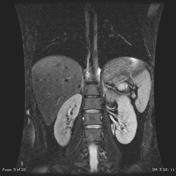</td></tr>
</table>

- **Target：** `study_001_mri_image_001_coronal_t2_fat_sat`; MRI; Coronal T2 fat sat
- **Relation：** `bbox_to_image` / `not_support`
- **Returned target bbox：** `unknown`
- **Maximum IoU：** n/a; threshold=0.5
- **Strong relation IDs：** `[]`

**IoU matching：**

The target image has no existing Step 2 bbox.

#### location_00004: NOT SUPPORT

<table>
<tr><th>Anchor original bbox</th><th>Target original image; model returned null</th><th>Existing target bbox: study_002_dsa_angiography_image_000_splenic_artery_f01</th></tr>
<tr><td></td><td>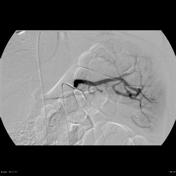</td><td></td></tr>
</table>

- **Target：** `study_002_dsa_angiography_image_000_splenic_artery`; DSA (angiography); Splenic artery
- **Relation：** `bbox_to_image` / `not_support`
- **Returned target bbox：** `unknown`
- **Maximum IoU：** n/a; threshold=0.5
- **Strong relation IDs：** `[]`

**IoU matching：**

| Existing target bbox | IoU | Strong match | Lingshu caption | 中文翻译 |
|---|---:|---|---|---|
| `study_002_dsa_angiography_image_000_splenic_artery_f01`; `[320, 380, 680, 580]` | n/a | n/a | The splenic artery is visualized on this angiogram. There is a focal area of narrowing followed by dilation in the proximal portion of the splenic artery. The remainder of the splenic artery appears to have normal caliber. | 血管造影显示脾动脉。脾动脉近段可见局灶性狭窄，狭窄后扩张。其余脾动脉管径正常。 |

#### location_00005: NOT SUPPORT

<table>
<tr><th>Anchor original bbox</th><th>Target original image; model returned null</th><th>Existing target bbox: study_002_dsa_angiography_image_001_hepatic_artery_f01</th></tr>
<tr><td></td><td></td><td></td></tr>
</table>

- **Target：** `study_002_dsa_angiography_image_001_hepatic_artery`; DSA (angiography); Hepatic artery
- **Relation：** `bbox_to_image` / `not_support`
- **Returned target bbox：** `unknown`
- **Maximum IoU：** n/a; threshold=0.5
- **Strong relation IDs：** `[]`

**IoU matching：**

| Existing target bbox | IoU | Strong match | Lingshu caption | 中文翻译 |
|---|---:|---|---|---|
| `study_002_dsa_angiography_image_001_hepatic_artery_f01`; `[220, 250, 650, 580]` | n/a | n/a | The image shows a hepatic artery with a clear branching pattern. Within the boxed region, there appears to be a focal area of irregularity or narrowing along one of the arterial branches. This could potentially represent a stenosis or other vascular abnormality affecting the hepatic arterial supply. The surrounding vasculature appears otherwise unremarkable. | 图像显示分支清楚的肝动脉。框内某一动脉分支局部似有不规则或狭窄，可能代表影响肝动脉供血的狭窄或其他血管异常。其余周围血管未见明显异常。 |

#### location_00006: NOT SUPPORT

<table>
<tr><th>Anchor original bbox</th><th>Target original image; model returned null</th></tr>
<tr><td></td><td></td></tr>
</table>

- **Target：** `study_002_dsa_angiography_image_002_superior_mesenteric_artery`; DSA (angiography); Superior mesenteric artery
- **Relation：** `bbox_to_image` / `not_support`
- **Returned target bbox：** `unknown`
- **Maximum IoU：** n/a; threshold=0.5
- **Strong relation IDs：** `[]`

**IoU matching：**

The target image has no existing Step 2 bbox.

#### location_00007: NOT SUPPORT

<table>
<tr><th>Anchor original bbox</th><th>Target original image; model returned null</th></tr>
<tr><td></td><td>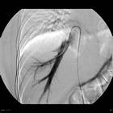</td></tr>
</table>

- **Target：** `study_002_dsa_angiography_image_003_right_hepatic_vein`; DSA (angiography); Right hepatic vein
- **Relation：** `bbox_to_image` / `not_support`
- **Returned target bbox：** `unknown`
- **Maximum IoU：** n/a; threshold=0.5
- **Strong relation IDs：** `[]`

**IoU matching：**

The target image has no existing Step 2 bbox.

### Anchor 2: `study_000_ct_image_001_axial_c_arterial_phase_f01`

**Anchor Lingshu caption：** The liver is enlarged and contains multiple hypodense lesions. The largest lesion measures 2.5 cm and is located in segment 4. There is also a smaller lesion measuring 1.3 cm in segment 8. These lesions demonstrate peripheral enhancement on the arterial phase.
**Anchor caption 中文翻译：** 肝脏增大，内见多发低密度病灶。最大病灶位于第 4 段，大小约 2.5 cm；第 8 段另见一个 1.3 cm 的较小病灶。这些病灶在动脉期呈周边强化。

#### location_00008: PARTIAL SUPPORT

<table>
<tr><th>Anchor original bbox</th><th>Cross-image grounded target bbox</th><th>Existing target bbox: study_001_mri_image_000_axial_t2_fat_sat_f01</th></tr>
<tr><td></td><td>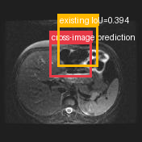</td><td></td></tr>
</table>

- **Target：** `study_001_mri_image_000_axial_t2_fat_sat`; MRI; Axial T2 fat sat
- **Relation：** `bbox_to_image` / `partial_support`
- **Returned target bbox：** `[350, 300, 650, 550]`
- **Maximum IoU：** 0.394; threshold=0.5
- **Strong relation IDs：** `[]`

**IoU matching：**

| Existing target bbox | IoU | Strong match | Lingshu caption | 中文翻译 |
|---|---:|---|---|---|
| `study_001_mri_image_000_axial_t2_fat_sat_f01`; `[375, 150, 725, 500]` | 0.394 | no | The liver is enlarged and demonstrates diffuse abnormal signal intensity, which is heterogeneous. The spleen is also enlarged. There is a small amount of fluid in the right upper quadrant. | 肝脏增大并呈弥漫性不均匀异常信号。脾脏也增大。右上腹可见少量液体。 |

**B 图单红框（Lingshu 实际输入）：**

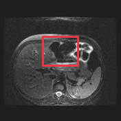

**Re-ground Lingshu caption：** The image shows a cross-sectional view of the abdomen, with a focus on the liver. Within the boxed region, there appears to be an area of increased signal intensity, which could indicate the presence of a lesion or abnormality. The surrounding liver parenchyma appears relatively normal in appearance. No other significant abnormalities are noted in the imaged anatomy.
**Re-ground caption 中文翻译：** 图像为腹部横断面，重点显示肝脏。框内似有信号增高区，可能提示病灶或异常。周围肝实质外观相对正常。所示解剖范围内未见其他明显异常。

**Quantitative / qualitative validation：**

| Validation pair | Quantitative size / 定量 | Qualitative caption / 定性 |
|---|---|---|
| `partial__location_00008` | `consistent` | `consistent` |

#### location_00009: NOT SUPPORT

<table>
<tr><th>Anchor original bbox</th><th>Target original image; model returned null</th></tr>
<tr><td></td><td></td></tr>
</table>

- **Target：** `study_001_mri_image_001_coronal_t2_fat_sat`; MRI; Coronal T2 fat sat
- **Relation：** `bbox_to_image` / `not_support`
- **Returned target bbox：** `unknown`
- **Maximum IoU：** n/a; threshold=0.5
- **Strong relation IDs：** `[]`

**IoU matching：**

The target image has no existing Step 2 bbox.

#### location_00010: NOT SUPPORT

<table>
<tr><th>Anchor original bbox</th><th>Target original image; model returned null</th><th>Existing target bbox: study_002_dsa_angiography_image_000_splenic_artery_f01</th></tr>
<tr><td></td><td></td><td></td></tr>
</table>

- **Target：** `study_002_dsa_angiography_image_000_splenic_artery`; DSA (angiography); Splenic artery
- **Relation：** `bbox_to_image` / `not_support`
- **Returned target bbox：** `unknown`
- **Maximum IoU：** n/a; threshold=0.5
- **Strong relation IDs：** `[]`

**IoU matching：**

| Existing target bbox | IoU | Strong match | Lingshu caption | 中文翻译 |
|---|---:|---|---|---|
| `study_002_dsa_angiography_image_000_splenic_artery_f01`; `[320, 380, 680, 580]` | n/a | n/a | The splenic artery is visualized on this angiogram. There is a focal area of narrowing followed by dilation in the proximal portion of the splenic artery. The remainder of the splenic artery appears to have normal caliber. | 血管造影显示脾动脉。脾动脉近段可见局灶性狭窄，狭窄后扩张。其余脾动脉管径正常。 |

#### location_00011: NOT SUPPORT

<table>
<tr><th>Anchor original bbox</th><th>Target original image; model returned null</th><th>Existing target bbox: study_002_dsa_angiography_image_001_hepatic_artery_f01</th></tr>
<tr><td></td><td></td><td></td></tr>
</table>

- **Target：** `study_002_dsa_angiography_image_001_hepatic_artery`; DSA (angiography); Hepatic artery
- **Relation：** `bbox_to_image` / `not_support`
- **Returned target bbox：** `unknown`
- **Maximum IoU：** n/a; threshold=0.5
- **Strong relation IDs：** `[]`

**IoU matching：**

| Existing target bbox | IoU | Strong match | Lingshu caption | 中文翻译 |
|---|---:|---|---|---|
| `study_002_dsa_angiography_image_001_hepatic_artery_f01`; `[220, 250, 650, 580]` | n/a | n/a | The image shows a hepatic artery with a clear branching pattern. Within the boxed region, there appears to be a focal area of irregularity or narrowing along one of the arterial branches. This could potentially represent a stenosis or other vascular abnormality affecting the hepatic arterial supply. The surrounding vasculature appears otherwise unremarkable. | 图像显示分支清楚的肝动脉。框内某一动脉分支局部似有不规则或狭窄，可能代表影响肝动脉供血的狭窄或其他血管异常。其余周围血管未见明显异常。 |

#### location_00012: NOT SUPPORT

<table>
<tr><th>Anchor original bbox</th><th>Target original image; model returned null</th></tr>
<tr><td></td><td></td></tr>
</table>

- **Target：** `study_002_dsa_angiography_image_002_superior_mesenteric_artery`; DSA (angiography); Superior mesenteric artery
- **Relation：** `bbox_to_image` / `not_support`
- **Returned target bbox：** `unknown`
- **Maximum IoU：** n/a; threshold=0.5
- **Strong relation IDs：** `[]`

**IoU matching：**

The target image has no existing Step 2 bbox.

#### location_00013: NOT SUPPORT

<table>
<tr><th>Anchor original bbox</th><th>Target original image; model returned null</th></tr>
<tr><td></td><td></td></tr>
</table>

- **Target：** `study_002_dsa_angiography_image_003_right_hepatic_vein`; DSA (angiography); Right hepatic vein
- **Relation：** `bbox_to_image` / `not_support`
- **Returned target bbox：** `unknown`
- **Maximum IoU：** n/a; threshold=0.5
- **Strong relation IDs：** `[]`

**IoU matching：**

The target image has no existing Step 2 bbox.

### Anchor 3: `study_001_mri_image_000_axial_t2_fat_sat_f01`

**Anchor Lingshu caption：** The liver is enlarged and demonstrates diffuse abnormal signal intensity, which is heterogeneous. The spleen is also enlarged. There is a small amount of fluid in the right upper quadrant.
**Anchor caption 中文翻译：** 肝脏增大并呈弥漫性不均匀异常信号。脾脏也增大。右上腹可见少量液体。

#### location_00014: NOT SUPPORT

<table>
<tr><th>Anchor original bbox</th><th>Target original image; model returned null</th></tr>
<tr><td></td><td></td></tr>
</table>

- **Target：** `study_001_mri_image_001_coronal_t2_fat_sat`; MRI; Coronal T2 fat sat
- **Relation：** `bbox_to_image` / `not_support`
- **Returned target bbox：** `unknown`
- **Maximum IoU：** n/a; threshold=0.5
- **Strong relation IDs：** `[]`

**IoU matching：**

The target image has no existing Step 2 bbox.

#### location_00015: NOT SUPPORT

<table>
<tr><th>Anchor original bbox</th><th>Target original image; model returned null</th><th>Existing target bbox: study_002_dsa_angiography_image_000_splenic_artery_f01</th></tr>
<tr><td></td><td></td><td></td></tr>
</table>

- **Target：** `study_002_dsa_angiography_image_000_splenic_artery`; DSA (angiography); Splenic artery
- **Relation：** `bbox_to_image` / `not_support`
- **Returned target bbox：** `unknown`
- **Maximum IoU：** n/a; threshold=0.5
- **Strong relation IDs：** `[]`

**IoU matching：**

| Existing target bbox | IoU | Strong match | Lingshu caption | 中文翻译 |
|---|---:|---|---|---|
| `study_002_dsa_angiography_image_000_splenic_artery_f01`; `[320, 380, 680, 580]` | n/a | n/a | The splenic artery is visualized on this angiogram. There is a focal area of narrowing followed by dilation in the proximal portion of the splenic artery. The remainder of the splenic artery appears to have normal caliber. | 血管造影显示脾动脉。脾动脉近段可见局灶性狭窄，狭窄后扩张。其余脾动脉管径正常。 |

#### location_00016: NOT SUPPORT

<table>
<tr><th>Anchor original bbox</th><th>Target original image; model returned null</th><th>Existing target bbox: study_002_dsa_angiography_image_001_hepatic_artery_f01</th></tr>
<tr><td></td><td></td><td></td></tr>
</table>

- **Target：** `study_002_dsa_angiography_image_001_hepatic_artery`; DSA (angiography); Hepatic artery
- **Relation：** `bbox_to_image` / `not_support`
- **Returned target bbox：** `unknown`
- **Maximum IoU：** n/a; threshold=0.5
- **Strong relation IDs：** `[]`

**IoU matching：**

| Existing target bbox | IoU | Strong match | Lingshu caption | 中文翻译 |
|---|---:|---|---|---|
| `study_002_dsa_angiography_image_001_hepatic_artery_f01`; `[220, 250, 650, 580]` | n/a | n/a | The image shows a hepatic artery with a clear branching pattern. Within the boxed region, there appears to be a focal area of irregularity or narrowing along one of the arterial branches. This could potentially represent a stenosis or other vascular abnormality affecting the hepatic arterial supply. The surrounding vasculature appears otherwise unremarkable. | 图像显示分支清楚的肝动脉。框内某一动脉分支局部似有不规则或狭窄，可能代表影响肝动脉供血的狭窄或其他血管异常。其余周围血管未见明显异常。 |

#### location_00017: NOT SUPPORT

<table>
<tr><th>Anchor original bbox</th><th>Target original image; model returned null</th></tr>
<tr><td></td><td></td></tr>
</table>

- **Target：** `study_002_dsa_angiography_image_002_superior_mesenteric_artery`; DSA (angiography); Superior mesenteric artery
- **Relation：** `bbox_to_image` / `not_support`
- **Returned target bbox：** `unknown`
- **Maximum IoU：** n/a; threshold=0.5
- **Strong relation IDs：** `[]`

**IoU matching：**

The target image has no existing Step 2 bbox.

#### location_00018: NOT SUPPORT

<table>
<tr><th>Anchor original bbox</th><th>Target original image; model returned null</th></tr>
<tr><td></td><td></td></tr>
</table>

- **Target：** `study_002_dsa_angiography_image_003_right_hepatic_vein`; DSA (angiography); Right hepatic vein
- **Relation：** `bbox_to_image` / `not_support`
- **Returned target bbox：** `unknown`
- **Maximum IoU：** n/a; threshold=0.5
- **Strong relation IDs：** `[]`

**IoU matching：**

The target image has no existing Step 2 bbox.

### Anchor 4: `study_002_dsa_angiography_image_000_splenic_artery_f01`

**Anchor Lingshu caption：** The splenic artery is visualized on this angiogram. There is a focal area of narrowing followed by dilation in the proximal portion of the splenic artery. The remainder of the splenic artery appears to have normal caliber.
**Anchor caption 中文翻译：** 血管造影显示脾动脉。脾动脉近段可见局灶性狭窄，狭窄后扩张。其余脾动脉管径正常。

#### location_00019: NOT SUPPORT

<table>
<tr><th>Anchor original bbox</th><th>Target original image; model returned null</th><th>Existing target bbox: study_002_dsa_angiography_image_001_hepatic_artery_f01</th></tr>
<tr><td></td><td></td><td></td></tr>
</table>

- **Target：** `study_002_dsa_angiography_image_001_hepatic_artery`; DSA (angiography); Hepatic artery
- **Relation：** `bbox_to_image` / `not_support`
- **Returned target bbox：** `unknown`
- **Maximum IoU：** n/a; threshold=0.5
- **Strong relation IDs：** `[]`

**IoU matching：**

| Existing target bbox | IoU | Strong match | Lingshu caption | 中文翻译 |
|---|---:|---|---|---|
| `study_002_dsa_angiography_image_001_hepatic_artery_f01`; `[220, 250, 650, 580]` | n/a | n/a | The image shows a hepatic artery with a clear branching pattern. Within the boxed region, there appears to be a focal area of irregularity or narrowing along one of the arterial branches. This could potentially represent a stenosis or other vascular abnormality affecting the hepatic arterial supply. The surrounding vasculature appears otherwise unremarkable. | 图像显示分支清楚的肝动脉。框内某一动脉分支局部似有不规则或狭窄，可能代表影响肝动脉供血的狭窄或其他血管异常。其余周围血管未见明显异常。 |

#### location_00020: NOT SUPPORT

<table>
<tr><th>Anchor original bbox</th><th>Target original image; model returned null</th></tr>
<tr><td></td><td></td></tr>
</table>

- **Target：** `study_002_dsa_angiography_image_002_superior_mesenteric_artery`; DSA (angiography); Superior mesenteric artery
- **Relation：** `bbox_to_image` / `not_support`
- **Returned target bbox：** `unknown`
- **Maximum IoU：** n/a; threshold=0.5
- **Strong relation IDs：** `[]`

**IoU matching：**

The target image has no existing Step 2 bbox.

#### location_00021: NOT SUPPORT

<table>
<tr><th>Anchor original bbox</th><th>Target original image; model returned null</th></tr>
<tr><td></td><td></td></tr>
</table>

- **Target：** `study_002_dsa_angiography_image_003_right_hepatic_vein`; DSA (angiography); Right hepatic vein
- **Relation：** `bbox_to_image` / `not_support`
- **Returned target bbox：** `unknown`
- **Maximum IoU：** n/a; threshold=0.5
- **Strong relation IDs：** `[]`

**IoU matching：**

The target image has no existing Step 2 bbox.

### Anchor 5: `study_002_dsa_angiography_image_001_hepatic_artery_f01`

**Anchor Lingshu caption：** The image shows a hepatic artery with a clear branching pattern. Within the boxed region, there appears to be a focal area of irregularity or narrowing along one of the arterial branches. This could potentially represent a stenosis or other vascular abnormality affecting the hepatic arterial supply. The surrounding vasculature appears otherwise unremarkable.
**Anchor caption 中文翻译：** 图像显示分支清楚的肝动脉。框内某一动脉分支局部似有不规则或狭窄，可能代表影响肝动脉供血的狭窄或其他血管异常。其余周围血管未见明显异常。

#### location_00022: NOT SUPPORT

<table>
<tr><th>Anchor original bbox</th><th>Target original image; model returned null</th></tr>
<tr><td></td><td></td></tr>
</table>

- **Target：** `study_002_dsa_angiography_image_002_superior_mesenteric_artery`; DSA (angiography); Superior mesenteric artery
- **Relation：** `bbox_to_image` / `not_support`
- **Returned target bbox：** `unknown`
- **Maximum IoU：** n/a; threshold=0.5
- **Strong relation IDs：** `[]`

**IoU matching：**

The target image has no existing Step 2 bbox.

#### location_00023: NOT SUPPORT

<table>
<tr><th>Anchor original bbox</th><th>Target original image; model returned null</th></tr>
<tr><td></td><td></td></tr>
</table>

- **Target：** `study_002_dsa_angiography_image_003_right_hepatic_vein`; DSA (angiography); Right hepatic vein
- **Relation：** `bbox_to_image` / `not_support`
- **Returned target bbox：** `unknown`
- **Maximum IoU：** n/a; threshold=0.5
- **Strong relation IDs：** `[]`

**IoU matching：**

The target image has no existing Step 2 bbox.

## Dynamically Skipped Anchors

None.

## Case-level Location Validation Summary / 病例级定位验证总结

- **Strong support：** 0 个 bbox-to-bbox 关系
- **Partial support：** 3 个 bbox-to-image 关系
- **Not support：** 20 个 bbox-to-image 关系

### Strong Support

该病例没有 strong-support bbox 对应关系。

### Partial Support

#### Partial 1: `study_000_ct_image_000_axial_non_contrast_f01` → `study_000_ct_image_001_axial_c_arterial_phase`

- **Query：** `location_00001`
- **Returned target bbox：** `[200, 100, 700, 400]`
- **Maximum IoU：** 0.179（低于 threshold=0.5）

<table>
<tr><th>Anchor bbox</th><th>Cross-image grounding and IoU overlay</th><th>B image with the single re-grounded bbox given to Lingshu</th><th>Closest existing target bbox</th></tr>
<tr><td></td><td></td><td></td><td></td></tr>
</table>

- **A 端原始 Lingshu caption：** The liver is enlarged and contains multiple hypodense lesions. The largest lesion measures approximately 3.5 cm and is located in segment 4. There is also a smaller lesion measuring approximately 1.5 cm in segment 2.
- **A 端 caption 中文翻译：** 肝脏增大，内见多发低密度病灶。最大病灶位于第 4 段，约 3.5 cm；第 2 段另见一个约 1.5 cm 的较小病灶。
- **B 端 re-ground Lingshu caption：** The liver is enlarged and contains multiple hypodense lesions. The largest lesion measures 2.5 cm and is located in segment 4. There is also a smaller lesion measuring 1.3 cm in segment 8. These lesions demonstrate peripheral enhancement on the arterial phase.
- **B 端 re-ground caption 中文翻译：** 肝脏增大，内见多发低密度病灶。最大病灶位于第 4 段，大小约 2.5 cm；第 8 段另见一个约 1.3 cm 的较小病灶。这些病灶在动脉期呈周边强化。
- **Quantitative size validation / 定量大小一致性：** `consistent`
- **Qualitative caption validation / 定性语义一致性：** `consistent`

#### Partial 2: `study_000_ct_image_000_axial_non_contrast_f01` → `study_001_mri_image_000_axial_t2_fat_sat`

- **Query：** `location_00002`
- **Returned target bbox：** `[320, 260, 680, 580]`
- **Maximum IoU：** 0.447（低于 threshold=0.5）

<table>
<tr><th>Anchor bbox</th><th>Cross-image grounding and IoU overlay</th><th>B image with the single re-grounded bbox given to Lingshu</th><th>Closest existing target bbox</th></tr>
<tr><td></td><td></td><td></td><td></td></tr>
</table>

- **A 端原始 Lingshu caption：** The liver is enlarged and contains multiple hypodense lesions. The largest lesion measures approximately 3.5 cm and is located in segment 4. There is also a smaller lesion measuring approximately 1.5 cm in segment 2.
- **A 端 caption 中文翻译：** 肝脏增大，内见多发低密度病灶。最大病灶位于第 4 段，约 3.5 cm；第 2 段另见一个约 1.5 cm 的较小病灶。
- **B 端 re-ground Lingshu caption：** The image shows a cross-sectional view of the abdomen, with a focus on the pancreas. The pancreas appears to have an irregular shape and heterogeneous signal intensity, suggesting the presence of a lesion or abnormality. The surrounding tissues, including the liver and kidneys, appear normal. The overall image quality is good, allowing for detailed evaluation of the pancreatic region.
- **B 端 re-ground caption 中文翻译：** 图像为腹部横断面，重点显示胰腺。胰腺形态不规则、信号不均，提示可能存在病灶或异常。肝脏、双肾等周围组织表现正常。图像质量良好，可对胰腺区域进行详细评估。
- **Quantitative size validation / 定量大小一致性：** `inconsistent`
- **Qualitative caption validation / 定性语义一致性：** `inconsistent`

#### Partial 3: `study_000_ct_image_001_axial_c_arterial_phase_f01` → `study_001_mri_image_000_axial_t2_fat_sat`

- **Query：** `location_00008`
- **Returned target bbox：** `[350, 300, 650, 550]`
- **Maximum IoU：** 0.394（低于 threshold=0.5）

<table>
<tr><th>Anchor bbox</th><th>Cross-image grounding and IoU overlay</th><th>B image with the single re-grounded bbox given to Lingshu</th><th>Closest existing target bbox</th></tr>
<tr><td></td><td></td><td></td><td></td></tr>
</table>

- **A 端原始 Lingshu caption：** The liver is enlarged and contains multiple hypodense lesions. The largest lesion measures 2.5 cm and is located in segment 4. There is also a smaller lesion measuring 1.3 cm in segment 8. These lesions demonstrate peripheral enhancement on the arterial phase.
- **A 端 caption 中文翻译：** 肝脏增大，内见多发低密度病灶。最大病灶位于第 4 段，大小约 2.5 cm；第 8 段另见一个 1.3 cm 的较小病灶。这些病灶在动脉期呈周边强化。
- **B 端 re-ground Lingshu caption：** The image shows a cross-sectional view of the abdomen, with a focus on the liver. Within the boxed region, there appears to be an area of increased signal intensity, which could indicate the presence of a lesion or abnormality. The surrounding liver parenchyma appears relatively normal in appearance. No other significant abnormalities are noted in the imaged anatomy.
- **B 端 re-ground caption 中文翻译：** 图像为腹部横断面，重点显示肝脏。框内似有信号增高区，可能提示病灶或异常。周围肝实质外观相对正常。所示解剖范围内未见其他明显异常。
- **Quantitative size validation / 定量大小一致性：** `consistent`
- **Qualitative caption validation / 定性语义一致性：** `consistent`

### Not Support

#### Not support 1: `study_000_ct_image_000_axial_non_contrast_f01` → `study_001_mri_image_001_coronal_t2_fat_sat`

- **Query：** `location_00003`
- **Result：** 目标图返回 `null`，未定位到对应区域。

<table>
<tr><th>Anchor bbox</th><th>Target original image</th></tr>
<tr><td></td><td></td></tr>
</table>

- **A 端原始 Lingshu caption：** The liver is enlarged and contains multiple hypodense lesions. The largest lesion measures approximately 3.5 cm and is located in segment 4. There is also a smaller lesion measuring approximately 1.5 cm in segment 2.
- **A 端 caption 中文翻译：** 肝脏增大，内见多发低密度病灶。最大病灶位于第 4 段，约 3.5 cm；第 2 段另见一个约 1.5 cm 的较小病灶。
- **B 端 re-ground caption：** 不适用；目标图返回 `null`，没有生成 re-ground bbox。
- **定量 / 定性验证：** 不适用；仅对 strong-support 和 partial-support pair 执行。

#### Not support 2: `study_000_ct_image_000_axial_non_contrast_f01` → `study_002_dsa_angiography_image_000_splenic_artery`

- **Query：** `location_00004`
- **Result：** 目标图返回 `null`，未定位到对应区域。

<table>
<tr><th>Anchor bbox</th><th>Target original image</th></tr>
<tr><td></td><td></td></tr>
</table>

- **A 端原始 Lingshu caption：** The liver is enlarged and contains multiple hypodense lesions. The largest lesion measures approximately 3.5 cm and is located in segment 4. There is also a smaller lesion measuring approximately 1.5 cm in segment 2.
- **A 端 caption 中文翻译：** 肝脏增大，内见多发低密度病灶。最大病灶位于第 4 段，约 3.5 cm；第 2 段另见一个约 1.5 cm 的较小病灶。
- **B 端 re-ground caption：** 不适用；目标图返回 `null`，没有生成 re-ground bbox。
- **定量 / 定性验证：** 不适用；仅对 strong-support 和 partial-support pair 执行。

#### Not support 3: `study_000_ct_image_000_axial_non_contrast_f01` → `study_002_dsa_angiography_image_001_hepatic_artery`

- **Query：** `location_00005`
- **Result：** 目标图返回 `null`，未定位到对应区域。

<table>
<tr><th>Anchor bbox</th><th>Target original image</th></tr>
<tr><td></td><td></td></tr>
</table>

- **A 端原始 Lingshu caption：** The liver is enlarged and contains multiple hypodense lesions. The largest lesion measures approximately 3.5 cm and is located in segment 4. There is also a smaller lesion measuring approximately 1.5 cm in segment 2.
- **A 端 caption 中文翻译：** 肝脏增大，内见多发低密度病灶。最大病灶位于第 4 段，约 3.5 cm；第 2 段另见一个约 1.5 cm 的较小病灶。
- **B 端 re-ground caption：** 不适用；目标图返回 `null`，没有生成 re-ground bbox。
- **定量 / 定性验证：** 不适用；仅对 strong-support 和 partial-support pair 执行。

#### Not support 4: `study_000_ct_image_000_axial_non_contrast_f01` → `study_002_dsa_angiography_image_002_superior_mesenteric_artery`

- **Query：** `location_00006`
- **Result：** 目标图返回 `null`，未定位到对应区域。

<table>
<tr><th>Anchor bbox</th><th>Target original image</th></tr>
<tr><td></td><td></td></tr>
</table>

- **A 端原始 Lingshu caption：** The liver is enlarged and contains multiple hypodense lesions. The largest lesion measures approximately 3.5 cm and is located in segment 4. There is also a smaller lesion measuring approximately 1.5 cm in segment 2.
- **A 端 caption 中文翻译：** 肝脏增大，内见多发低密度病灶。最大病灶位于第 4 段，约 3.5 cm；第 2 段另见一个约 1.5 cm 的较小病灶。
- **B 端 re-ground caption：** 不适用；目标图返回 `null`，没有生成 re-ground bbox。
- **定量 / 定性验证：** 不适用；仅对 strong-support 和 partial-support pair 执行。

#### Not support 5: `study_000_ct_image_000_axial_non_contrast_f01` → `study_002_dsa_angiography_image_003_right_hepatic_vein`

- **Query：** `location_00007`
- **Result：** 目标图返回 `null`，未定位到对应区域。

<table>
<tr><th>Anchor bbox</th><th>Target original image</th></tr>
<tr><td></td><td></td></tr>
</table>

- **A 端原始 Lingshu caption：** The liver is enlarged and contains multiple hypodense lesions. The largest lesion measures approximately 3.5 cm and is located in segment 4. There is also a smaller lesion measuring approximately 1.5 cm in segment 2.
- **A 端 caption 中文翻译：** 肝脏增大，内见多发低密度病灶。最大病灶位于第 4 段，约 3.5 cm；第 2 段另见一个约 1.5 cm 的较小病灶。
- **B 端 re-ground caption：** 不适用；目标图返回 `null`，没有生成 re-ground bbox。
- **定量 / 定性验证：** 不适用；仅对 strong-support 和 partial-support pair 执行。

#### Not support 6: `study_000_ct_image_001_axial_c_arterial_phase_f01` → `study_001_mri_image_001_coronal_t2_fat_sat`

- **Query：** `location_00009`
- **Result：** 目标图返回 `null`，未定位到对应区域。

<table>
<tr><th>Anchor bbox</th><th>Target original image</th></tr>
<tr><td></td><td></td></tr>
</table>

- **A 端原始 Lingshu caption：** The liver is enlarged and contains multiple hypodense lesions. The largest lesion measures 2.5 cm and is located in segment 4. There is also a smaller lesion measuring 1.3 cm in segment 8. These lesions demonstrate peripheral enhancement on the arterial phase.
- **A 端 caption 中文翻译：** 肝脏增大，内见多发低密度病灶。最大病灶位于第 4 段，大小约 2.5 cm；第 8 段另见一个 1.3 cm 的较小病灶。这些病灶在动脉期呈周边强化。
- **B 端 re-ground caption：** 不适用；目标图返回 `null`，没有生成 re-ground bbox。
- **定量 / 定性验证：** 不适用；仅对 strong-support 和 partial-support pair 执行。

#### Not support 7: `study_000_ct_image_001_axial_c_arterial_phase_f01` → `study_002_dsa_angiography_image_000_splenic_artery`

- **Query：** `location_00010`
- **Result：** 目标图返回 `null`，未定位到对应区域。

<table>
<tr><th>Anchor bbox</th><th>Target original image</th></tr>
<tr><td></td><td></td></tr>
</table>

- **A 端原始 Lingshu caption：** The liver is enlarged and contains multiple hypodense lesions. The largest lesion measures 2.5 cm and is located in segment 4. There is also a smaller lesion measuring 1.3 cm in segment 8. These lesions demonstrate peripheral enhancement on the arterial phase.
- **A 端 caption 中文翻译：** 肝脏增大，内见多发低密度病灶。最大病灶位于第 4 段，大小约 2.5 cm；第 8 段另见一个 1.3 cm 的较小病灶。这些病灶在动脉期呈周边强化。
- **B 端 re-ground caption：** 不适用；目标图返回 `null`，没有生成 re-ground bbox。
- **定量 / 定性验证：** 不适用；仅对 strong-support 和 partial-support pair 执行。

#### Not support 8: `study_000_ct_image_001_axial_c_arterial_phase_f01` → `study_002_dsa_angiography_image_001_hepatic_artery`

- **Query：** `location_00011`
- **Result：** 目标图返回 `null`，未定位到对应区域。

<table>
<tr><th>Anchor bbox</th><th>Target original image</th></tr>
<tr><td></td><td></td></tr>
</table>

- **A 端原始 Lingshu caption：** The liver is enlarged and contains multiple hypodense lesions. The largest lesion measures 2.5 cm and is located in segment 4. There is also a smaller lesion measuring 1.3 cm in segment 8. These lesions demonstrate peripheral enhancement on the arterial phase.
- **A 端 caption 中文翻译：** 肝脏增大，内见多发低密度病灶。最大病灶位于第 4 段，大小约 2.5 cm；第 8 段另见一个 1.3 cm 的较小病灶。这些病灶在动脉期呈周边强化。
- **B 端 re-ground caption：** 不适用；目标图返回 `null`，没有生成 re-ground bbox。
- **定量 / 定性验证：** 不适用；仅对 strong-support 和 partial-support pair 执行。

#### Not support 9: `study_000_ct_image_001_axial_c_arterial_phase_f01` → `study_002_dsa_angiography_image_002_superior_mesenteric_artery`

- **Query：** `location_00012`
- **Result：** 目标图返回 `null`，未定位到对应区域。

<table>
<tr><th>Anchor bbox</th><th>Target original image</th></tr>
<tr><td></td><td></td></tr>
</table>

- **A 端原始 Lingshu caption：** The liver is enlarged and contains multiple hypodense lesions. The largest lesion measures 2.5 cm and is located in segment 4. There is also a smaller lesion measuring 1.3 cm in segment 8. These lesions demonstrate peripheral enhancement on the arterial phase.
- **A 端 caption 中文翻译：** 肝脏增大，内见多发低密度病灶。最大病灶位于第 4 段，大小约 2.5 cm；第 8 段另见一个 1.3 cm 的较小病灶。这些病灶在动脉期呈周边强化。
- **B 端 re-ground caption：** 不适用；目标图返回 `null`，没有生成 re-ground bbox。
- **定量 / 定性验证：** 不适用；仅对 strong-support 和 partial-support pair 执行。

#### Not support 10: `study_000_ct_image_001_axial_c_arterial_phase_f01` → `study_002_dsa_angiography_image_003_right_hepatic_vein`

- **Query：** `location_00013`
- **Result：** 目标图返回 `null`，未定位到对应区域。

<table>
<tr><th>Anchor bbox</th><th>Target original image</th></tr>
<tr><td></td><td></td></tr>
</table>

- **A 端原始 Lingshu caption：** The liver is enlarged and contains multiple hypodense lesions. The largest lesion measures 2.5 cm and is located in segment 4. There is also a smaller lesion measuring 1.3 cm in segment 8. These lesions demonstrate peripheral enhancement on the arterial phase.
- **A 端 caption 中文翻译：** 肝脏增大，内见多发低密度病灶。最大病灶位于第 4 段，大小约 2.5 cm；第 8 段另见一个 1.3 cm 的较小病灶。这些病灶在动脉期呈周边强化。
- **B 端 re-ground caption：** 不适用；目标图返回 `null`，没有生成 re-ground bbox。
- **定量 / 定性验证：** 不适用；仅对 strong-support 和 partial-support pair 执行。

#### Not support 11: `study_001_mri_image_000_axial_t2_fat_sat_f01` → `study_001_mri_image_001_coronal_t2_fat_sat`

- **Query：** `location_00014`
- **Result：** 目标图返回 `null`，未定位到对应区域。

<table>
<tr><th>Anchor bbox</th><th>Target original image</th></tr>
<tr><td></td><td></td></tr>
</table>

- **A 端原始 Lingshu caption：** The liver is enlarged and demonstrates diffuse abnormal signal intensity, which is heterogeneous. The spleen is also enlarged. There is a small amount of fluid in the right upper quadrant.
- **A 端 caption 中文翻译：** 肝脏增大并呈弥漫性不均匀异常信号。脾脏也增大。右上腹可见少量液体。
- **B 端 re-ground caption：** 不适用；目标图返回 `null`，没有生成 re-ground bbox。
- **定量 / 定性验证：** 不适用；仅对 strong-support 和 partial-support pair 执行。

#### Not support 12: `study_001_mri_image_000_axial_t2_fat_sat_f01` → `study_002_dsa_angiography_image_000_splenic_artery`

- **Query：** `location_00015`
- **Result：** 目标图返回 `null`，未定位到对应区域。

<table>
<tr><th>Anchor bbox</th><th>Target original image</th></tr>
<tr><td></td><td></td></tr>
</table>

- **A 端原始 Lingshu caption：** The liver is enlarged and demonstrates diffuse abnormal signal intensity, which is heterogeneous. The spleen is also enlarged. There is a small amount of fluid in the right upper quadrant.
- **A 端 caption 中文翻译：** 肝脏增大并呈弥漫性不均匀异常信号。脾脏也增大。右上腹可见少量液体。
- **B 端 re-ground caption：** 不适用；目标图返回 `null`，没有生成 re-ground bbox。
- **定量 / 定性验证：** 不适用；仅对 strong-support 和 partial-support pair 执行。

#### Not support 13: `study_001_mri_image_000_axial_t2_fat_sat_f01` → `study_002_dsa_angiography_image_001_hepatic_artery`

- **Query：** `location_00016`
- **Result：** 目标图返回 `null`，未定位到对应区域。

<table>
<tr><th>Anchor bbox</th><th>Target original image</th></tr>
<tr><td></td><td></td></tr>
</table>

- **A 端原始 Lingshu caption：** The liver is enlarged and demonstrates diffuse abnormal signal intensity, which is heterogeneous. The spleen is also enlarged. There is a small amount of fluid in the right upper quadrant.
- **A 端 caption 中文翻译：** 肝脏增大并呈弥漫性不均匀异常信号。脾脏也增大。右上腹可见少量液体。
- **B 端 re-ground caption：** 不适用；目标图返回 `null`，没有生成 re-ground bbox。
- **定量 / 定性验证：** 不适用；仅对 strong-support 和 partial-support pair 执行。

#### Not support 14: `study_001_mri_image_000_axial_t2_fat_sat_f01` → `study_002_dsa_angiography_image_002_superior_mesenteric_artery`

- **Query：** `location_00017`
- **Result：** 目标图返回 `null`，未定位到对应区域。

<table>
<tr><th>Anchor bbox</th><th>Target original image</th></tr>
<tr><td></td><td></td></tr>
</table>

- **A 端原始 Lingshu caption：** The liver is enlarged and demonstrates diffuse abnormal signal intensity, which is heterogeneous. The spleen is also enlarged. There is a small amount of fluid in the right upper quadrant.
- **A 端 caption 中文翻译：** 肝脏增大并呈弥漫性不均匀异常信号。脾脏也增大。右上腹可见少量液体。
- **B 端 re-ground caption：** 不适用；目标图返回 `null`，没有生成 re-ground bbox。
- **定量 / 定性验证：** 不适用；仅对 strong-support 和 partial-support pair 执行。

#### Not support 15: `study_001_mri_image_000_axial_t2_fat_sat_f01` → `study_002_dsa_angiography_image_003_right_hepatic_vein`

- **Query：** `location_00018`
- **Result：** 目标图返回 `null`，未定位到对应区域。

<table>
<tr><th>Anchor bbox</th><th>Target original image</th></tr>
<tr><td></td><td></td></tr>
</table>

- **A 端原始 Lingshu caption：** The liver is enlarged and demonstrates diffuse abnormal signal intensity, which is heterogeneous. The spleen is also enlarged. There is a small amount of fluid in the right upper quadrant.
- **A 端 caption 中文翻译：** 肝脏增大并呈弥漫性不均匀异常信号。脾脏也增大。右上腹可见少量液体。
- **B 端 re-ground caption：** 不适用；目标图返回 `null`，没有生成 re-ground bbox。
- **定量 / 定性验证：** 不适用；仅对 strong-support 和 partial-support pair 执行。

#### Not support 16: `study_002_dsa_angiography_image_000_splenic_artery_f01` → `study_002_dsa_angiography_image_001_hepatic_artery`

- **Query：** `location_00019`
- **Result：** 目标图返回 `null`，未定位到对应区域。

<table>
<tr><th>Anchor bbox</th><th>Target original image</th></tr>
<tr><td></td><td></td></tr>
</table>

- **A 端原始 Lingshu caption：** The splenic artery is visualized on this angiogram. There is a focal area of narrowing followed by dilation in the proximal portion of the splenic artery. The remainder of the splenic artery appears to have normal caliber.
- **A 端 caption 中文翻译：** 血管造影显示脾动脉。脾动脉近段可见局灶性狭窄，狭窄后扩张。其余脾动脉管径正常。
- **B 端 re-ground caption：** 不适用；目标图返回 `null`，没有生成 re-ground bbox。
- **定量 / 定性验证：** 不适用；仅对 strong-support 和 partial-support pair 执行。

#### Not support 17: `study_002_dsa_angiography_image_000_splenic_artery_f01` → `study_002_dsa_angiography_image_002_superior_mesenteric_artery`

- **Query：** `location_00020`
- **Result：** 目标图返回 `null`，未定位到对应区域。

<table>
<tr><th>Anchor bbox</th><th>Target original image</th></tr>
<tr><td></td><td></td></tr>
</table>

- **A 端原始 Lingshu caption：** The splenic artery is visualized on this angiogram. There is a focal area of narrowing followed by dilation in the proximal portion of the splenic artery. The remainder of the splenic artery appears to have normal caliber.
- **A 端 caption 中文翻译：** 血管造影显示脾动脉。脾动脉近段可见局灶性狭窄，狭窄后扩张。其余脾动脉管径正常。
- **B 端 re-ground caption：** 不适用；目标图返回 `null`，没有生成 re-ground bbox。
- **定量 / 定性验证：** 不适用；仅对 strong-support 和 partial-support pair 执行。

#### Not support 18: `study_002_dsa_angiography_image_000_splenic_artery_f01` → `study_002_dsa_angiography_image_003_right_hepatic_vein`

- **Query：** `location_00021`
- **Result：** 目标图返回 `null`，未定位到对应区域。

<table>
<tr><th>Anchor bbox</th><th>Target original image</th></tr>
<tr><td></td><td></td></tr>
</table>

- **A 端原始 Lingshu caption：** The splenic artery is visualized on this angiogram. There is a focal area of narrowing followed by dilation in the proximal portion of the splenic artery. The remainder of the splenic artery appears to have normal caliber.
- **A 端 caption 中文翻译：** 血管造影显示脾动脉。脾动脉近段可见局灶性狭窄，狭窄后扩张。其余脾动脉管径正常。
- **B 端 re-ground caption：** 不适用；目标图返回 `null`，没有生成 re-ground bbox。
- **定量 / 定性验证：** 不适用；仅对 strong-support 和 partial-support pair 执行。

#### Not support 19: `study_002_dsa_angiography_image_001_hepatic_artery_f01` → `study_002_dsa_angiography_image_002_superior_mesenteric_artery`

- **Query：** `location_00022`
- **Result：** 目标图返回 `null`，未定位到对应区域。

<table>
<tr><th>Anchor bbox</th><th>Target original image</th></tr>
<tr><td></td><td></td></tr>
</table>

- **A 端原始 Lingshu caption：** The image shows a hepatic artery with a clear branching pattern. Within the boxed region, there appears to be a focal area of irregularity or narrowing along one of the arterial branches. This could potentially represent a stenosis or other vascular abnormality affecting the hepatic arterial supply. The surrounding vasculature appears otherwise unremarkable.
- **A 端 caption 中文翻译：** 图像显示分支清楚的肝动脉。框内某一动脉分支局部似有不规则或狭窄，可能代表影响肝动脉供血的狭窄或其他血管异常。其余周围血管未见明显异常。
- **B 端 re-ground caption：** 不适用；目标图返回 `null`，没有生成 re-ground bbox。
- **定量 / 定性验证：** 不适用；仅对 strong-support 和 partial-support pair 执行。

#### Not support 20: `study_002_dsa_angiography_image_001_hepatic_artery_f01` → `study_002_dsa_angiography_image_003_right_hepatic_vein`

- **Query：** `location_00023`
- **Result：** 目标图返回 `null`，未定位到对应区域。

<table>
<tr><th>Anchor bbox</th><th>Target original image</th></tr>
<tr><td></td><td></td></tr>
</table>

- **A 端原始 Lingshu caption：** The image shows a hepatic artery with a clear branching pattern. Within the boxed region, there appears to be a focal area of irregularity or narrowing along one of the arterial branches. This could potentially represent a stenosis or other vascular abnormality affecting the hepatic arterial supply. The surrounding vasculature appears otherwise unremarkable.
- **A 端 caption 中文翻译：** 图像显示分支清楚的肝动脉。框内某一动脉分支局部似有不规则或狭窄，可能代表影响肝动脉供血的狭窄或其他血管异常。其余周围血管未见明显异常。
- **B 端 re-ground caption：** 不适用；目标图返回 `null`，没有生成 re-ground bbox。
- **定量 / 定性验证：** 不适用；仅对 strong-support 和 partial-support pair 执行。
