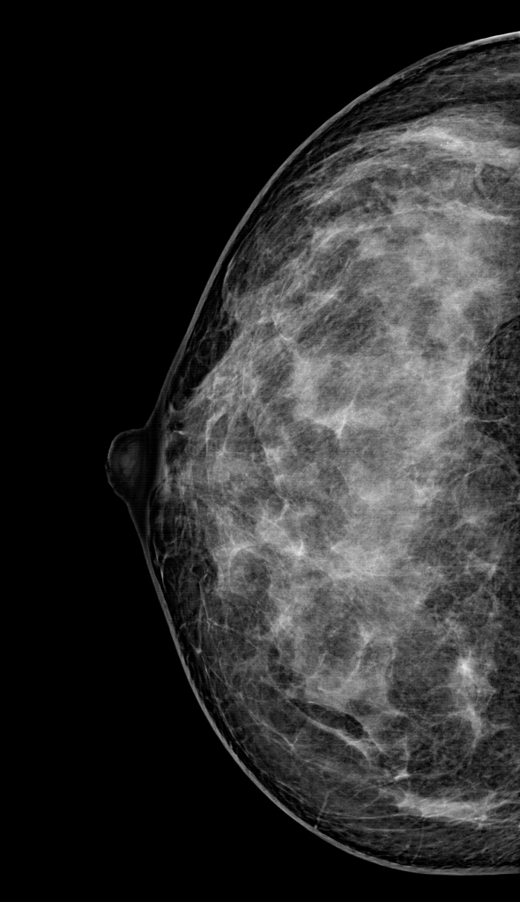
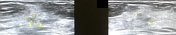
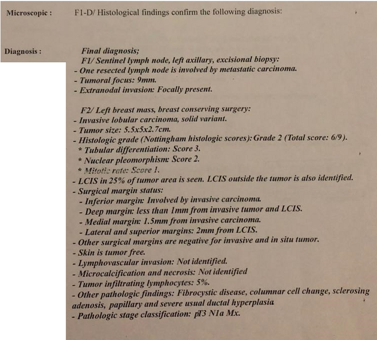

# Invasive lobular carcinoma

[返回 Step 3 总览](../README_STEP3_VISUALIZATION.md)

- **Case ID：** `invasive-lobular-carcinoma-10`
- **Case URL：** [https://radiopaedia.org/cases/invasive-lobular-carcinoma-10?lang=us](https://radiopaedia.org/cases/invasive-lobular-carcinoma-10?lang=us)
- **验证模型：** Qwen3-VL-8B
- **图像 / Step 2 findings：** 7 / 0
- **定位结果：** strong 0；partial 0；not support 0；parse error 0
- **Strong bbox relations：** 0
- **原始 JSON：** [case_evidence.json](../assets_step3/invasive-lobular-carcinoma-10/case_evidence.json)

**Overlay 图例：** 红框为跨图新定位；绿框为 IoU >= 0.5 的已有 bbox；黄框为未达到阈值的已有 bbox。

## Step 2 Finding Nodes

该病例的 Step 1/2 没有产生 bbox finding，因此 Step 3 没有可作为 anchor 的区域。

| Original images |
|---|
|  |
|  |
|  |
|  |
|  |
|  |
|  |
## Directed Cross-image Validation

没有可执行的跨图定位查询。

## Dynamically Skipped Anchors

None.

## Case-level Location Validation Summary / 病例级定位验证总结

- **Strong support：** 0 个 bbox-to-bbox 关系
- **Partial support：** 0 个 bbox-to-image 关系
- **Not support：** 0 个 bbox-to-image 关系

### Strong Support

该病例没有 strong-support bbox 对应关系。

### Partial Support

该病例没有 partial-support 查询。

### Not Support

该病例没有 not-support 查询。
