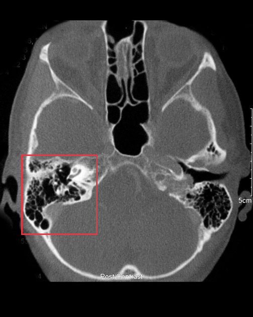
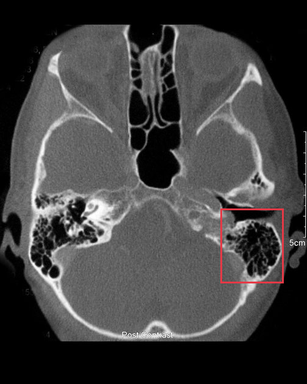
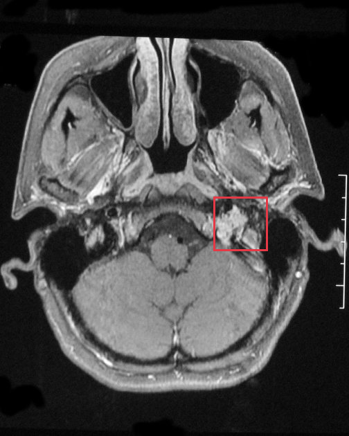
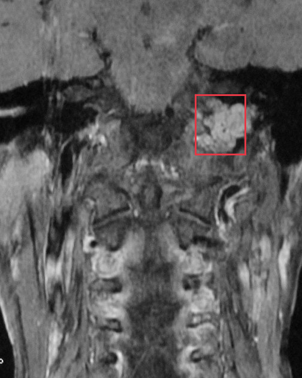
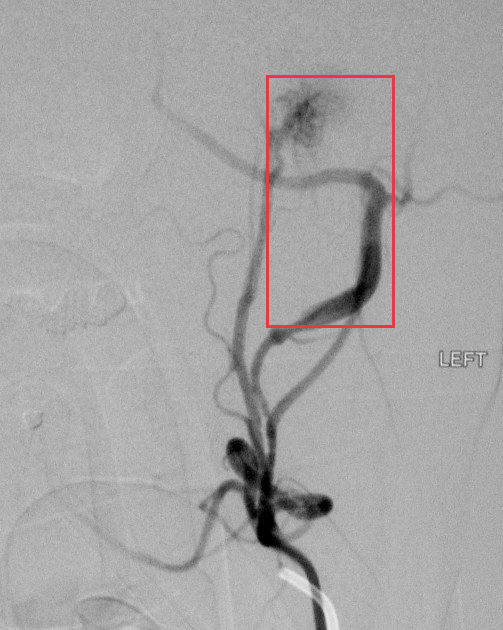
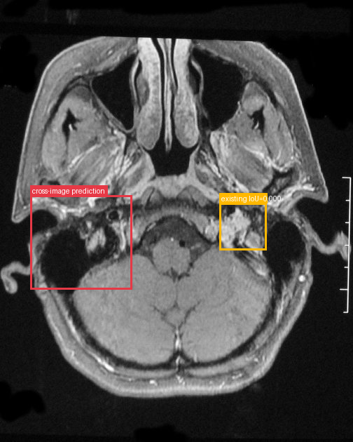
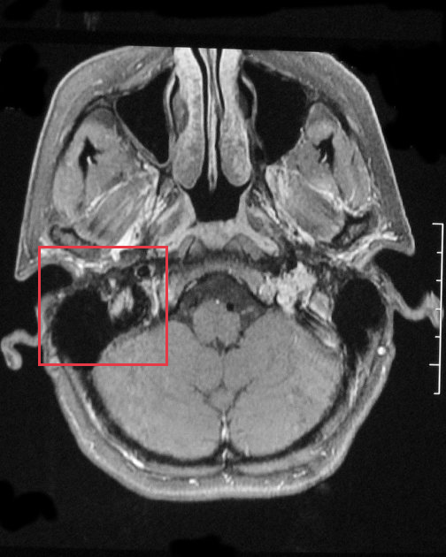
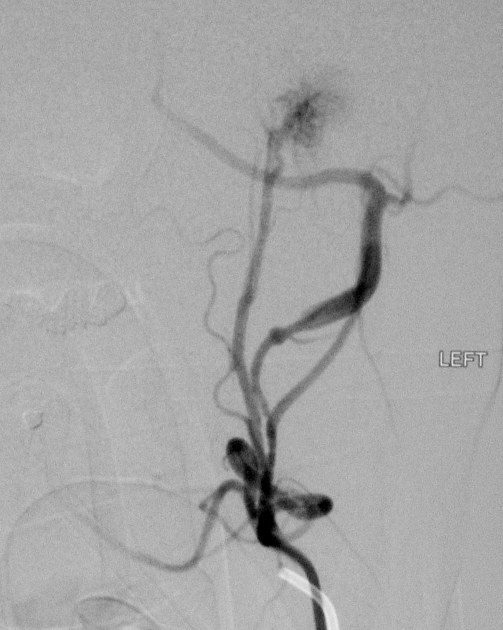
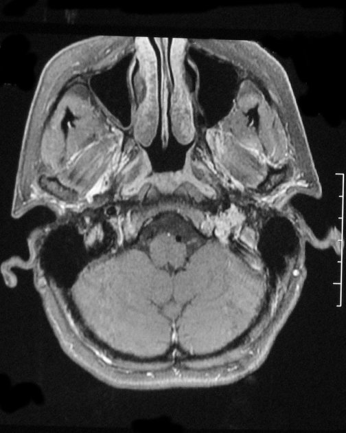

# Jugulotympanic paraganglioma

[返回 Step 3 总览](../README_STEP3_VISUALIZATION.md)

- **Case ID：** `jugulotympanic-paraganglioma-9`
- **Case URL：** [https://radiopaedia.org/cases/jugulotympanic-paraganglioma-9?lang=us](https://radiopaedia.org/cases/jugulotympanic-paraganglioma-9?lang=us)
- **验证模型：** Qwen3-VL-8B
- **图像 / Step 2 findings：** 4 / 5
- **定位结果：** strong 0；partial 1；not support 8；parse error 0
- **Strong bbox relations：** 0
- **原始 JSON：** [case_evidence.json](../assets_step3/jugulotympanic-paraganglioma-9/case_evidence.json)
- **定量/定性验证 JSON：** [step_3_validation_case_evidence.json](../assets_step3/jugulotympanic-paraganglioma-9/step_3_validation_case_evidence.json)

**Overlay 图例：** 红框为跨图新定位；绿框为 IoU >= 0.5 的已有 bbox；黄框为未达到阈值的已有 bbox。

## Step 2 Finding Nodes

### Finding 1: `study_000_ct_image_000_axial_bone_window_f01`

- **Modality / subcategory：** CT / Axial bone window
- **bbox_2d：** `[84, 488, 384, 740]`
- **Lingshu caption：** The right mastoid air cells appear opacified compared to the left side. The right middle ear cavity also appears opacified. There is no definite bony erosion.
- **中文翻译：** 右侧乳突气房较左侧浑浊，右侧中耳腔也呈浑浊。未见明确骨质侵蚀。

### Finding 2: `study_000_ct_image_000_axial_bone_window_f02`

- **Modality / subcategory：** CT / Axial bone window
- **bbox_2d：** `[718, 544, 924, 738]`
- **Lingshu caption：** The left mastoid air cells appear opacified. The left middle ear cavity also appears opacified. There is no definite bony erosion.
- **中文翻译：** 左侧乳突气房浑浊，左侧中耳腔也呈浑浊。未见明确骨质侵蚀。

### Finding 3: `study_001_mri_image_000_axial_t1_c_fat_sat_f01`

- **Modality / subcategory：** MRI / Axial T1 C+ fat sat
- **bbox_2d：** `[612, 452, 767, 575]`
- **Lingshu caption：** The left internal auditory canal demonstrates a small enhancing mass. The right internal auditory canal appears normal. The cerebellum, medulla, and pons appear normal. There is no evidence of hydrocephalus.
- **中文翻译：** 左侧内听道可见小强化肿块，右侧内听道正常。小脑、延髓及脑桥未见异常。未见脑积水。

### Finding 4: `study_001_mri_image_001_coronal_t1_c_f01`

- **Modality / subcategory：** MRI / Coronal T1 C+
- **bbox_2d：** `[645, 250, 815, 410]`
- **Lingshu caption：** The left carotid artery is enlarged and tortuous. There is a large mass centered at the bifurcation of the left carotid artery. The mass is heterogeneous and contains areas of high signal intensity. The mass extends into the left internal carotid artery and external carotid artery. The mass also extends posteriorly to the left vertebral artery.
- **中文翻译：** 左侧颈动脉增粗、迂曲，其分叉处可见较大肿块。肿块信号不均，内含高信号区，并延伸至左侧颈内动脉和颈外动脉，后方还延伸至左侧椎动脉。

### Finding 5: `study_002_dsa_angiography_image_000_lateral_external_carotid_artery_f01`

- **Modality / subcategory：** DSA (angiography) / Lateral External carotid artery
- **bbox_2d：** `[530, 120, 784, 520]`
- **Lingshu caption：** The lateral view of the left external carotid artery shows a complex network of vessels with a prominent area of irregularity and possible vascular malformation or abnormal branching within the boxed region. The vessels appear tortuous and there is a notable concentration of contrast material suggesting increased vascularity or potential arteriovenous shunting. The surrounding vasculature appears less dense, providing a stark contrast to the highlighted area.
- **中文翻译：** 左侧颈外动脉侧位像显示复杂血管网，框内血管明显不规则，可能存在血管畸形或异常分支。血管走行迂曲，对比剂明显聚集，提示血供增多或可能存在动静脉分流。周围血管密度较低，与高亮区域形成鲜明对比。

## Directed Cross-image Validation

### Anchor 1: `study_000_ct_image_000_axial_bone_window_f01`

**Anchor Lingshu caption：** The right mastoid air cells appear opacified compared to the left side. The right middle ear cavity also appears opacified. There is no definite bony erosion.
**Anchor caption 中文翻译：** 右侧乳突气房较左侧浑浊，右侧中耳腔也呈浑浊。未见明确骨质侵蚀。

#### location_00001: PARTIAL SUPPORT

<table>
<tr><th>Anchor original bbox</th><th>Cross-image grounded target bbox</th><th>Existing target bbox: study_001_mri_image_000_axial_t1_c_fat_sat_f01</th></tr>
<tr><td></td><td></td><td></td></tr>
</table>

- **Target：** `study_001_mri_image_000_axial_t1_c_fat_sat`; MRI; Axial T1 C+ fat sat
- **Relation：** `bbox_to_image` / `partial_support`
- **Returned target bbox：** `[87, 442, 375, 656]`
- **Maximum IoU：** 0.000; threshold=0.5
- **Strong relation IDs：** `[]`

**IoU matching：**

| Existing target bbox | IoU | Strong match | Lingshu caption | 中文翻译 |
|---|---:|---|---|---|
| `study_001_mri_image_000_axial_t1_c_fat_sat_f01`; `[612, 452, 767, 575]` | 0.000 | no | The left internal auditory canal demonstrates a small enhancing mass. The right internal auditory canal appears normal. The cerebellum, medulla, and pons appear normal. There is no evidence of hydrocephalus. | 左侧内听道可见小强化肿块，右侧内听道正常。小脑、延髓及脑桥未见异常。未见脑积水。 |

**B 图单红框（Lingshu 实际输入）：**

**Re-ground Lingshu caption：** The right internal auditory canal appears enlarged compared to the left. The right cochlear nerve appears hypoplastic. The right facial nerve appears normal.
**Re-ground caption 中文翻译：** 右侧内听道较左侧增宽。右侧耳蜗神经似发育不良，右侧面神经表现正常。

**Quantitative / qualitative validation：**

| Validation pair | Quantitative size / 定量 | Qualitative caption / 定性 |
|---|---|---|
| `partial__location_00001` | `inconsistent` | `consistent` |

#### location_00002: NOT SUPPORT

<table>
<tr><th>Anchor original bbox</th><th>Target original image; model returned null</th><th>Existing target bbox: study_001_mri_image_001_coronal_t1_c_f01</th></tr>
<tr><td></td><td></td><td></td></tr>
</table>

- **Target：** `study_001_mri_image_001_coronal_t1_c`; MRI; Coronal T1 C+
- **Relation：** `bbox_to_image` / `not_support`
- **Returned target bbox：** `unknown`
- **Maximum IoU：** n/a; threshold=0.5
- **Strong relation IDs：** `[]`

**IoU matching：**

| Existing target bbox | IoU | Strong match | Lingshu caption | 中文翻译 |
|---|---:|---|---|---|
| `study_001_mri_image_001_coronal_t1_c_f01`; `[645, 250, 815, 410]` | n/a | n/a | The left carotid artery is enlarged and tortuous. There is a large mass centered at the bifurcation of the left carotid artery. The mass is heterogeneous and contains areas of high signal intensity. The mass extends into the left internal carotid artery and external carotid artery. The mass also extends posteriorly to the left vertebral artery. | 左侧颈动脉增粗、迂曲，其分叉处可见较大肿块。肿块信号不均，内含高信号区，并延伸至左侧颈内动脉和颈外动脉，后方还延伸至左侧椎动脉。 |

#### location_00003: NOT SUPPORT

<table>
<tr><th>Anchor original bbox</th><th>Target original image; model returned null</th><th>Existing target bbox: study_002_dsa_angiography_image_000_lateral_external_carotid_artery_f01</th></tr>
<tr><td></td><td></td><td></td></tr>
</table>

- **Target：** `study_002_dsa_angiography_image_000_lateral_external_carotid_artery`; DSA (angiography); Lateral External carotid artery
- **Relation：** `bbox_to_image` / `not_support`
- **Returned target bbox：** `unknown`
- **Maximum IoU：** n/a; threshold=0.5
- **Strong relation IDs：** `[]`

**IoU matching：**

| Existing target bbox | IoU | Strong match | Lingshu caption | 中文翻译 |
|---|---:|---|---|---|
| `study_002_dsa_angiography_image_000_lateral_external_carotid_artery_f01`; `[530, 120, 784, 520]` | n/a | n/a | The lateral view of the left external carotid artery shows a complex network of vessels with a prominent area of irregularity and possible vascular malformation or abnormal branching within the boxed region. The vessels appear tortuous and there is a notable concentration of contrast material suggesting increased vascularity or potential arteriovenous shunting. The surrounding vasculature appears less dense, providing a stark contrast to the highlighted area. | 左侧颈外动脉侧位像显示复杂血管网，框内血管明显不规则，可能存在血管畸形或异常分支。血管走行迂曲，对比剂明显聚集，提示血供增多或可能存在动静脉分流。周围血管密度较低，与高亮区域形成鲜明对比。 |

### Anchor 2: `study_000_ct_image_000_axial_bone_window_f02`

**Anchor Lingshu caption：** The left mastoid air cells appear opacified. The left middle ear cavity also appears opacified. There is no definite bony erosion.
**Anchor caption 中文翻译：** 左侧乳突气房浑浊，左侧中耳腔也呈浑浊。未见明确骨质侵蚀。

#### location_00004: NOT SUPPORT

<table>
<tr><th>Anchor original bbox</th><th>Target original image; model returned null</th><th>Existing target bbox: study_001_mri_image_000_axial_t1_c_fat_sat_f01</th></tr>
<tr><td></td><td></td><td></td></tr>
</table>

- **Target：** `study_001_mri_image_000_axial_t1_c_fat_sat`; MRI; Axial T1 C+ fat sat
- **Relation：** `bbox_to_image` / `not_support`
- **Returned target bbox：** `unknown`
- **Maximum IoU：** n/a; threshold=0.5
- **Strong relation IDs：** `[]`

**IoU matching：**

| Existing target bbox | IoU | Strong match | Lingshu caption | 中文翻译 |
|---|---:|---|---|---|
| `study_001_mri_image_000_axial_t1_c_fat_sat_f01`; `[612, 452, 767, 575]` | n/a | n/a | The left internal auditory canal demonstrates a small enhancing mass. The right internal auditory canal appears normal. The cerebellum, medulla, and pons appear normal. There is no evidence of hydrocephalus. | 左侧内听道可见小强化肿块，右侧内听道正常。小脑、延髓及脑桥未见异常。未见脑积水。 |

#### location_00005: NOT SUPPORT

<table>
<tr><th>Anchor original bbox</th><th>Target original image; model returned null</th><th>Existing target bbox: study_001_mri_image_001_coronal_t1_c_f01</th></tr>
<tr><td></td><td></td><td></td></tr>
</table>

- **Target：** `study_001_mri_image_001_coronal_t1_c`; MRI; Coronal T1 C+
- **Relation：** `bbox_to_image` / `not_support`
- **Returned target bbox：** `unknown`
- **Maximum IoU：** n/a; threshold=0.5
- **Strong relation IDs：** `[]`

**IoU matching：**

| Existing target bbox | IoU | Strong match | Lingshu caption | 中文翻译 |
|---|---:|---|---|---|
| `study_001_mri_image_001_coronal_t1_c_f01`; `[645, 250, 815, 410]` | n/a | n/a | The left carotid artery is enlarged and tortuous. There is a large mass centered at the bifurcation of the left carotid artery. The mass is heterogeneous and contains areas of high signal intensity. The mass extends into the left internal carotid artery and external carotid artery. The mass also extends posteriorly to the left vertebral artery. | 左侧颈动脉增粗、迂曲，其分叉处可见较大肿块。肿块信号不均，内含高信号区，并延伸至左侧颈内动脉和颈外动脉，后方还延伸至左侧椎动脉。 |

#### location_00006: NOT SUPPORT

<table>
<tr><th>Anchor original bbox</th><th>Target original image; model returned null</th><th>Existing target bbox: study_002_dsa_angiography_image_000_lateral_external_carotid_artery_f01</th></tr>
<tr><td></td><td></td><td></td></tr>
</table>

- **Target：** `study_002_dsa_angiography_image_000_lateral_external_carotid_artery`; DSA (angiography); Lateral External carotid artery
- **Relation：** `bbox_to_image` / `not_support`
- **Returned target bbox：** `unknown`
- **Maximum IoU：** n/a; threshold=0.5
- **Strong relation IDs：** `[]`

**IoU matching：**

| Existing target bbox | IoU | Strong match | Lingshu caption | 中文翻译 |
|---|---:|---|---|---|
| `study_002_dsa_angiography_image_000_lateral_external_carotid_artery_f01`; `[530, 120, 784, 520]` | n/a | n/a | The lateral view of the left external carotid artery shows a complex network of vessels with a prominent area of irregularity and possible vascular malformation or abnormal branching within the boxed region. The vessels appear tortuous and there is a notable concentration of contrast material suggesting increased vascularity or potential arteriovenous shunting. The surrounding vasculature appears less dense, providing a stark contrast to the highlighted area. | 左侧颈外动脉侧位像显示复杂血管网，框内血管明显不规则，可能存在血管畸形或异常分支。血管走行迂曲，对比剂明显聚集，提示血供增多或可能存在动静脉分流。周围血管密度较低，与高亮区域形成鲜明对比。 |

### Anchor 3: `study_001_mri_image_000_axial_t1_c_fat_sat_f01`

**Anchor Lingshu caption：** The left internal auditory canal demonstrates a small enhancing mass. The right internal auditory canal appears normal. The cerebellum, medulla, and pons appear normal. There is no evidence of hydrocephalus.
**Anchor caption 中文翻译：** 左侧内听道可见小强化肿块，右侧内听道正常。小脑、延髓及脑桥未见异常。未见脑积水。

#### location_00007: NOT SUPPORT

<table>
<tr><th>Anchor original bbox</th><th>Target original image; model returned null</th><th>Existing target bbox: study_001_mri_image_001_coronal_t1_c_f01</th></tr>
<tr><td></td><td></td><td></td></tr>
</table>

- **Target：** `study_001_mri_image_001_coronal_t1_c`; MRI; Coronal T1 C+
- **Relation：** `bbox_to_image` / `not_support`
- **Returned target bbox：** `unknown`
- **Maximum IoU：** n/a; threshold=0.5
- **Strong relation IDs：** `[]`

**IoU matching：**

| Existing target bbox | IoU | Strong match | Lingshu caption | 中文翻译 |
|---|---:|---|---|---|
| `study_001_mri_image_001_coronal_t1_c_f01`; `[645, 250, 815, 410]` | n/a | n/a | The left carotid artery is enlarged and tortuous. There is a large mass centered at the bifurcation of the left carotid artery. The mass is heterogeneous and contains areas of high signal intensity. The mass extends into the left internal carotid artery and external carotid artery. The mass also extends posteriorly to the left vertebral artery. | 左侧颈动脉增粗、迂曲，其分叉处可见较大肿块。肿块信号不均，内含高信号区，并延伸至左侧颈内动脉和颈外动脉，后方还延伸至左侧椎动脉。 |

#### location_00008: NOT SUPPORT

<table>
<tr><th>Anchor original bbox</th><th>Target original image; model returned null</th><th>Existing target bbox: study_002_dsa_angiography_image_000_lateral_external_carotid_artery_f01</th></tr>
<tr><td></td><td></td><td></td></tr>
</table>

- **Target：** `study_002_dsa_angiography_image_000_lateral_external_carotid_artery`; DSA (angiography); Lateral External carotid artery
- **Relation：** `bbox_to_image` / `not_support`
- **Returned target bbox：** `unknown`
- **Maximum IoU：** n/a; threshold=0.5
- **Strong relation IDs：** `[]`

**IoU matching：**

| Existing target bbox | IoU | Strong match | Lingshu caption | 中文翻译 |
|---|---:|---|---|---|
| `study_002_dsa_angiography_image_000_lateral_external_carotid_artery_f01`; `[530, 120, 784, 520]` | n/a | n/a | The lateral view of the left external carotid artery shows a complex network of vessels with a prominent area of irregularity and possible vascular malformation or abnormal branching within the boxed region. The vessels appear tortuous and there is a notable concentration of contrast material suggesting increased vascularity or potential arteriovenous shunting. The surrounding vasculature appears less dense, providing a stark contrast to the highlighted area. | 左侧颈外动脉侧位像显示复杂血管网，框内血管明显不规则，可能存在血管畸形或异常分支。血管走行迂曲，对比剂明显聚集，提示血供增多或可能存在动静脉分流。周围血管密度较低，与高亮区域形成鲜明对比。 |

### Anchor 4: `study_001_mri_image_001_coronal_t1_c_f01`

**Anchor Lingshu caption：** The left carotid artery is enlarged and tortuous. There is a large mass centered at the bifurcation of the left carotid artery. The mass is heterogeneous and contains areas of high signal intensity. The mass extends into the left internal carotid artery and external carotid artery. The mass also extends posteriorly to the left vertebral artery.
**Anchor caption 中文翻译：** 左侧颈动脉增粗、迂曲，其分叉处可见较大肿块。肿块信号不均，内含高信号区，并延伸至左侧颈内动脉和颈外动脉，后方还延伸至左侧椎动脉。

#### location_00009: NOT SUPPORT

<table>
<tr><th>Anchor original bbox</th><th>Target original image; model returned null</th><th>Existing target bbox: study_002_dsa_angiography_image_000_lateral_external_carotid_artery_f01</th></tr>
<tr><td></td><td></td><td></td></tr>
</table>

- **Target：** `study_002_dsa_angiography_image_000_lateral_external_carotid_artery`; DSA (angiography); Lateral External carotid artery
- **Relation：** `bbox_to_image` / `not_support`
- **Returned target bbox：** `unknown`
- **Maximum IoU：** n/a; threshold=0.5
- **Strong relation IDs：** `[]`

**IoU matching：**

| Existing target bbox | IoU | Strong match | Lingshu caption | 中文翻译 |
|---|---:|---|---|---|
| `study_002_dsa_angiography_image_000_lateral_external_carotid_artery_f01`; `[530, 120, 784, 520]` | n/a | n/a | The lateral view of the left external carotid artery shows a complex network of vessels with a prominent area of irregularity and possible vascular malformation or abnormal branching within the boxed region. The vessels appear tortuous and there is a notable concentration of contrast material suggesting increased vascularity or potential arteriovenous shunting. The surrounding vasculature appears less dense, providing a stark contrast to the highlighted area. | 左侧颈外动脉侧位像显示复杂血管网，框内血管明显不规则，可能存在血管畸形或异常分支。血管走行迂曲，对比剂明显聚集，提示血供增多或可能存在动静脉分流。周围血管密度较低，与高亮区域形成鲜明对比。 |

## Dynamically Skipped Anchors

None.

## Case-level Location Validation Summary / 病例级定位验证总结

- **Strong support：** 0 个 bbox-to-bbox 关系
- **Partial support：** 1 个 bbox-to-image 关系
- **Not support：** 8 个 bbox-to-image 关系

### Strong Support

该病例没有 strong-support bbox 对应关系。

### Partial Support

#### Partial 1: `study_000_ct_image_000_axial_bone_window_f01` → `study_001_mri_image_000_axial_t1_c_fat_sat`

- **Query：** `location_00001`
- **Returned target bbox：** `[87, 442, 375, 656]`
- **Maximum IoU：** 0.000（低于 threshold=0.5）

<table>
<tr><th>Anchor bbox</th><th>Cross-image grounding and IoU overlay</th><th>B image with the single re-grounded bbox given to Lingshu</th><th>Closest existing target bbox</th></tr>
<tr><td></td><td></td><td></td><td></td></tr>
</table>

- **A 端原始 Lingshu caption：** The right mastoid air cells appear opacified compared to the left side. The right middle ear cavity also appears opacified. There is no definite bony erosion.
- **A 端 caption 中文翻译：** 右侧乳突气房较左侧浑浊，右侧中耳腔也呈浑浊。未见明确骨质侵蚀。
- **B 端 re-ground Lingshu caption：** The right internal auditory canal appears enlarged compared to the left. The right cochlear nerve appears hypoplastic. The right facial nerve appears normal.
- **B 端 re-ground caption 中文翻译：** 右侧内听道较左侧增宽。右侧耳蜗神经似发育不良，右侧面神经表现正常。
- **Quantitative size validation / 定量大小一致性：** `inconsistent`
- **Qualitative caption validation / 定性语义一致性：** `consistent`

### Not Support

#### Not support 1: `study_000_ct_image_000_axial_bone_window_f01` → `study_001_mri_image_001_coronal_t1_c`

- **Query：** `location_00002`
- **Result：** 目标图返回 `null`，未定位到对应区域。

<table>
<tr><th>Anchor bbox</th><th>Target original image</th></tr>
<tr><td></td><td></td></tr>
</table>

- **A 端原始 Lingshu caption：** The right mastoid air cells appear opacified compared to the left side. The right middle ear cavity also appears opacified. There is no definite bony erosion.
- **A 端 caption 中文翻译：** 右侧乳突气房较左侧浑浊，右侧中耳腔也呈浑浊。未见明确骨质侵蚀。
- **B 端 re-ground caption：** 不适用；目标图返回 `null`，没有生成 re-ground bbox。
- **定量 / 定性验证：** 不适用；仅对 strong-support 和 partial-support pair 执行。

#### Not support 2: `study_000_ct_image_000_axial_bone_window_f01` → `study_002_dsa_angiography_image_000_lateral_external_carotid_artery`

- **Query：** `location_00003`
- **Result：** 目标图返回 `null`，未定位到对应区域。

<table>
<tr><th>Anchor bbox</th><th>Target original image</th></tr>
<tr><td></td><td></td></tr>
</table>

- **A 端原始 Lingshu caption：** The right mastoid air cells appear opacified compared to the left side. The right middle ear cavity also appears opacified. There is no definite bony erosion.
- **A 端 caption 中文翻译：** 右侧乳突气房较左侧浑浊，右侧中耳腔也呈浑浊。未见明确骨质侵蚀。
- **B 端 re-ground caption：** 不适用；目标图返回 `null`，没有生成 re-ground bbox。
- **定量 / 定性验证：** 不适用；仅对 strong-support 和 partial-support pair 执行。

#### Not support 3: `study_000_ct_image_000_axial_bone_window_f02` → `study_001_mri_image_000_axial_t1_c_fat_sat`

- **Query：** `location_00004`
- **Result：** 目标图返回 `null`，未定位到对应区域。

<table>
<tr><th>Anchor bbox</th><th>Target original image</th></tr>
<tr><td></td><td></td></tr>
</table>

- **A 端原始 Lingshu caption：** The left mastoid air cells appear opacified. The left middle ear cavity also appears opacified. There is no definite bony erosion.
- **A 端 caption 中文翻译：** 左侧乳突气房浑浊，左侧中耳腔也呈浑浊。未见明确骨质侵蚀。
- **B 端 re-ground caption：** 不适用；目标图返回 `null`，没有生成 re-ground bbox。
- **定量 / 定性验证：** 不适用；仅对 strong-support 和 partial-support pair 执行。

#### Not support 4: `study_000_ct_image_000_axial_bone_window_f02` → `study_001_mri_image_001_coronal_t1_c`

- **Query：** `location_00005`
- **Result：** 目标图返回 `null`，未定位到对应区域。

<table>
<tr><th>Anchor bbox</th><th>Target original image</th></tr>
<tr><td></td><td></td></tr>
</table>

- **A 端原始 Lingshu caption：** The left mastoid air cells appear opacified. The left middle ear cavity also appears opacified. There is no definite bony erosion.
- **A 端 caption 中文翻译：** 左侧乳突气房浑浊，左侧中耳腔也呈浑浊。未见明确骨质侵蚀。
- **B 端 re-ground caption：** 不适用；目标图返回 `null`，没有生成 re-ground bbox。
- **定量 / 定性验证：** 不适用；仅对 strong-support 和 partial-support pair 执行。

#### Not support 5: `study_000_ct_image_000_axial_bone_window_f02` → `study_002_dsa_angiography_image_000_lateral_external_carotid_artery`

- **Query：** `location_00006`
- **Result：** 目标图返回 `null`，未定位到对应区域。

<table>
<tr><th>Anchor bbox</th><th>Target original image</th></tr>
<tr><td></td><td></td></tr>
</table>

- **A 端原始 Lingshu caption：** The left mastoid air cells appear opacified. The left middle ear cavity also appears opacified. There is no definite bony erosion.
- **A 端 caption 中文翻译：** 左侧乳突气房浑浊，左侧中耳腔也呈浑浊。未见明确骨质侵蚀。
- **B 端 re-ground caption：** 不适用；目标图返回 `null`，没有生成 re-ground bbox。
- **定量 / 定性验证：** 不适用；仅对 strong-support 和 partial-support pair 执行。

#### Not support 6: `study_001_mri_image_000_axial_t1_c_fat_sat_f01` → `study_001_mri_image_001_coronal_t1_c`

- **Query：** `location_00007`
- **Result：** 目标图返回 `null`，未定位到对应区域。

<table>
<tr><th>Anchor bbox</th><th>Target original image</th></tr>
<tr><td></td><td></td></tr>
</table>

- **A 端原始 Lingshu caption：** The left internal auditory canal demonstrates a small enhancing mass. The right internal auditory canal appears normal. The cerebellum, medulla, and pons appear normal. There is no evidence of hydrocephalus.
- **A 端 caption 中文翻译：** 左侧内听道可见小强化肿块，右侧内听道正常。小脑、延髓及脑桥未见异常。未见脑积水。
- **B 端 re-ground caption：** 不适用；目标图返回 `null`，没有生成 re-ground bbox。
- **定量 / 定性验证：** 不适用；仅对 strong-support 和 partial-support pair 执行。

#### Not support 7: `study_001_mri_image_000_axial_t1_c_fat_sat_f01` → `study_002_dsa_angiography_image_000_lateral_external_carotid_artery`

- **Query：** `location_00008`
- **Result：** 目标图返回 `null`，未定位到对应区域。

<table>
<tr><th>Anchor bbox</th><th>Target original image</th></tr>
<tr><td></td><td></td></tr>
</table>

- **A 端原始 Lingshu caption：** The left internal auditory canal demonstrates a small enhancing mass. The right internal auditory canal appears normal. The cerebellum, medulla, and pons appear normal. There is no evidence of hydrocephalus.
- **A 端 caption 中文翻译：** 左侧内听道可见小强化肿块，右侧内听道正常。小脑、延髓及脑桥未见异常。未见脑积水。
- **B 端 re-ground caption：** 不适用；目标图返回 `null`，没有生成 re-ground bbox。
- **定量 / 定性验证：** 不适用；仅对 strong-support 和 partial-support pair 执行。

#### Not support 8: `study_001_mri_image_001_coronal_t1_c_f01` → `study_002_dsa_angiography_image_000_lateral_external_carotid_artery`

- **Query：** `location_00009`
- **Result：** 目标图返回 `null`，未定位到对应区域。

<table>
<tr><th>Anchor bbox</th><th>Target original image</th></tr>
<tr><td></td><td></td></tr>
</table>

- **A 端原始 Lingshu caption：** The left carotid artery is enlarged and tortuous. There is a large mass centered at the bifurcation of the left carotid artery. The mass is heterogeneous and contains areas of high signal intensity. The mass extends into the left internal carotid artery and external carotid artery. The mass also extends posteriorly to the left vertebral artery.
- **A 端 caption 中文翻译：** 左侧颈动脉增粗、迂曲，其分叉处可见较大肿块。肿块信号不均，内含高信号区，并延伸至左侧颈内动脉和颈外动脉，后方还延伸至左侧椎动脉。
- **B 端 re-ground caption：** 不适用；目标图返回 `null`，没有生成 re-ground bbox。
- **定量 / 定性验证：** 不适用；仅对 strong-support 和 partial-support pair 执行。
