# Loculated pneumothorax

[返回 Step 3 总览](../README_STEP3_VISUALIZATION.md)

- **Case ID：** `loculated-pneumothorax`
- **Case URL：** [https://radiopaedia.org/cases/loculated-pneumothorax?lang=us](https://radiopaedia.org/cases/loculated-pneumothorax?lang=us)
- **验证模型：** Qwen3-VL-8B
- **图像 / Step 2 findings：** 4 / 7
- **定位结果：** strong 1；partial 5；not support 4；parse error 0
- **Strong bbox relations：** 1
- **原始 JSON：** [case_evidence.json](../assets_step3/loculated-pneumothorax/case_evidence.json)

**Overlay 图例：** 红框为跨图新定位；绿框为 IoU >= 0.5 的已有 bbox；黄框为未达到阈值的已有 bbox。

## Step 2 Finding Nodes

### Finding 1: `study_000_x_ray_image_000_frontal_f01`

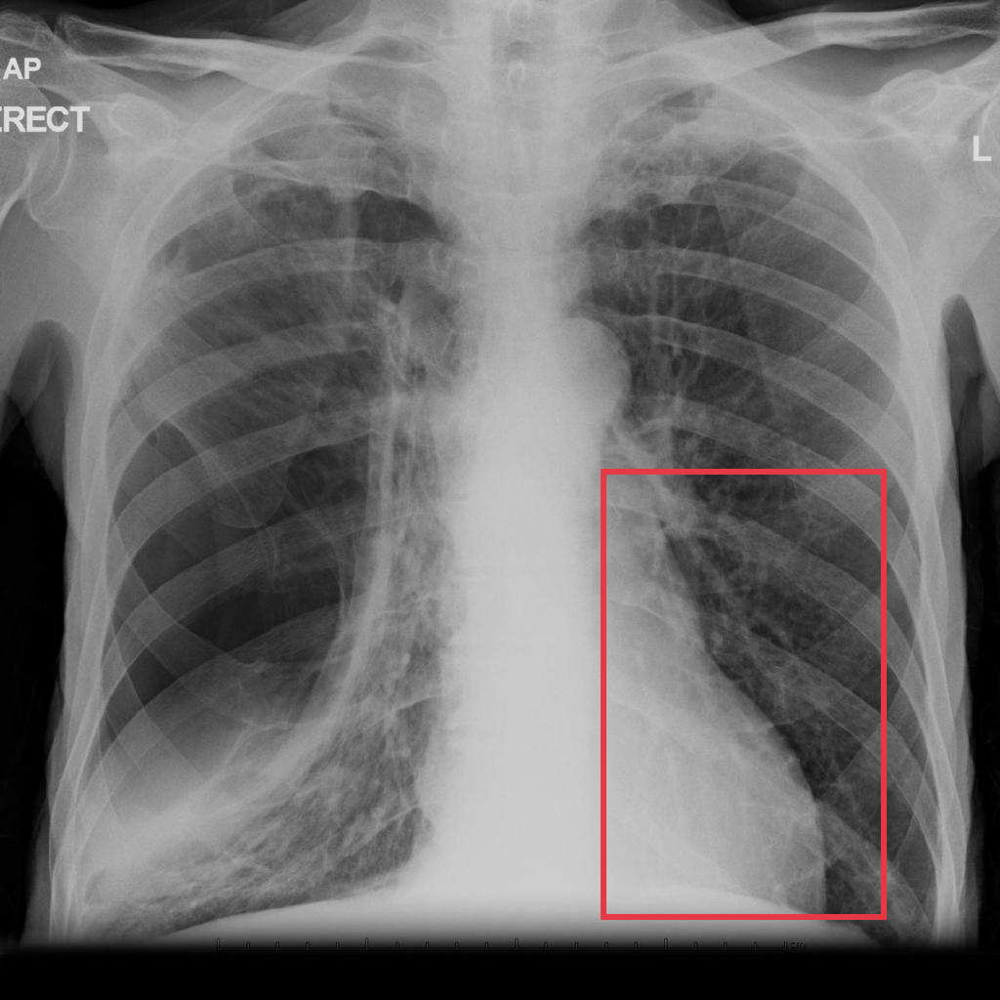

- **Modality / subcategory：** X-ray / Frontal
- **bbox_2d：** `[601, 469, 886, 919]`
- **Lingshu caption：** The lungs are hyperinflated. There is increased opacity in the left lower lung zone. The heart size is normal. The mediastinal contour is normal. There is no pneumothorax. There is no pleural effusion.
- **中文翻译：** 双肺过度充气。左下肺野密度增高。心影大小及纵隔轮廓正常。未见气胸或胸腔积液。

### Finding 2: `study_001_ct_image_000_coronal_lung_window_f01`

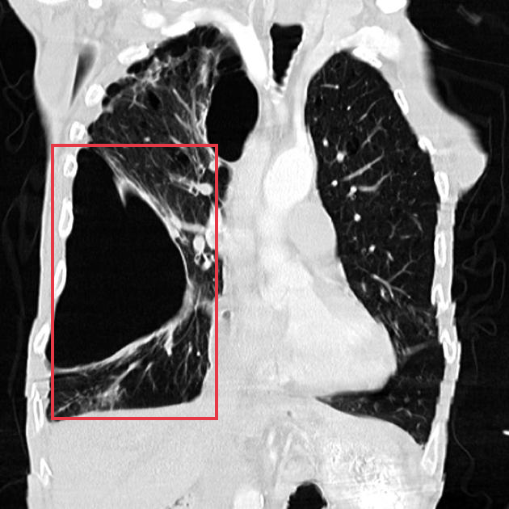

- **Modality / subcategory：** CT / Coronal lung window
- **bbox_2d：** `[101, 284, 427, 825]`
- **Lingshu caption：** The right lower lobe demonstrates a large area of consolidation with air bronchograms. There is also a moderate right pleural effusion. The left lung appears clear.
- **中文翻译：** 右下叶可见大片实变并有空气支气管征，同时伴中量右侧胸腔积液。左肺清晰。

### Finding 3: `study_001_ct_image_000_coronal_lung_window_f02`

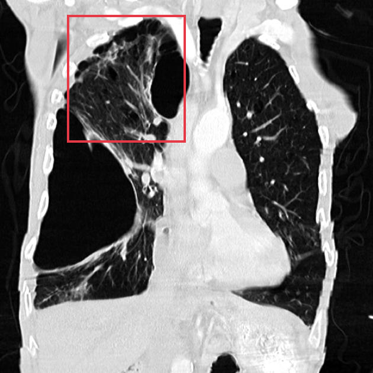

- **Modality / subcategory：** CT / Coronal lung window
- **bbox_2d：** `[180, 40, 498, 382]`
- **Lingshu caption：** The right upper lobe demonstrates a large cavitary lesion with surrounding consolidation. There is also a smaller cavitary lesion in the right lower lobe. The left lung appears clear.
- **中文翻译：** 右上叶可见伴周围实变的大空洞性病灶，右下叶另见较小空洞性病灶。左肺清晰。

### Finding 4: `study_001_ct_image_000_coronal_lung_window_f03`

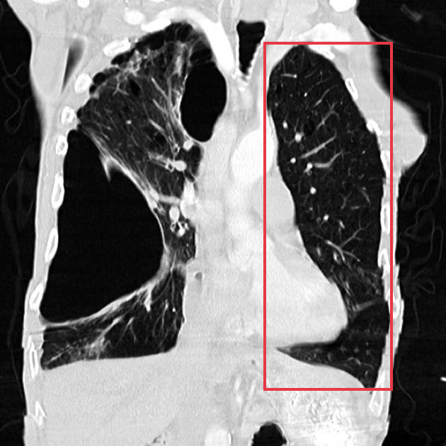

- **Modality / subcategory：** CT / Coronal lung window
- **bbox_2d：** `[591, 95, 880, 875]`
- **Lingshu caption：** The left lung is well inflated with no areas of focal consolidation, pleural effusion, or pneumothorax identified. The pulmonary vasculature is within normal limits. There is no evidence of hilar lymphadenopathy.
- **中文翻译：** 左肺充气良好，未见局灶性实变、胸腔积液或气胸。肺血管分布正常，未见肺门淋巴结肿大。

### Finding 5: `study_001_ct_image_001_axial_lung_window_f01`

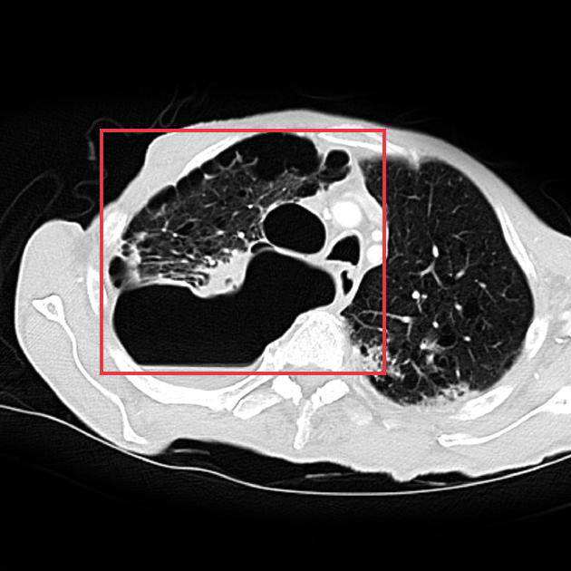

- **Modality / subcategory：** CT / Axial lung window
- **bbox_2d：** `[175, 226, 675, 656]`
- **Lingshu caption：** The right upper lobe demonstrates a large cavitary lesion with surrounding consolidation. There is also a smaller cavitary lesion in the left upper lobe. The remaining lung parenchyma appears relatively clear. No pleural effusions or pneumothorax are identified. The mediastinal structures appear unremarkable.
- **中文翻译：** 右上叶可见伴周围实变的大空洞性病灶，左上叶另见较小空洞性病灶。其余肺实质相对清晰。未见胸腔积液或气胸。纵隔结构未见异常。

### Finding 6: `study_001_ct_image_001_axial_lung_window_f02`

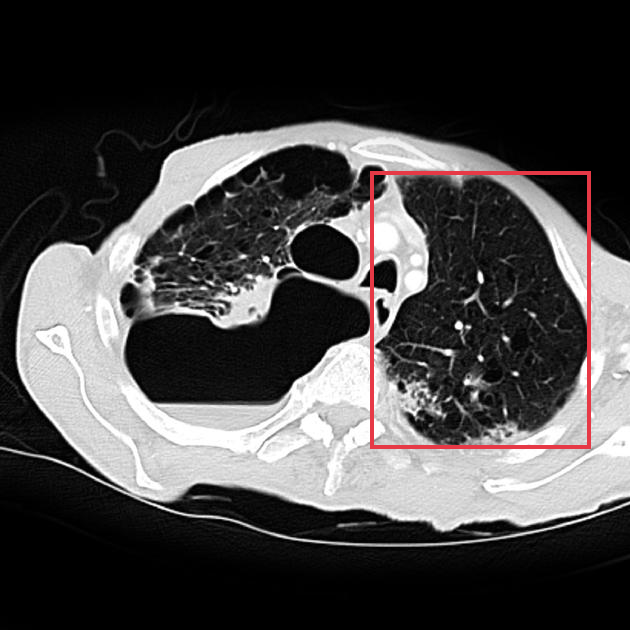

- **Modality / subcategory：** CT / Axial lung window
- **bbox_2d：** `[588, 272, 937, 712]`
- **Lingshu caption：** The lungs are hyperinflated. There is a large right pneumothorax with collapse of the right lung. The left lung appears normal.
- **中文翻译：** 双肺过度充气。可见大量右侧气胸并伴右肺萎陷。左肺表现正常。

### Finding 7: `study_002_x_ray_image_000_frontal_f01`

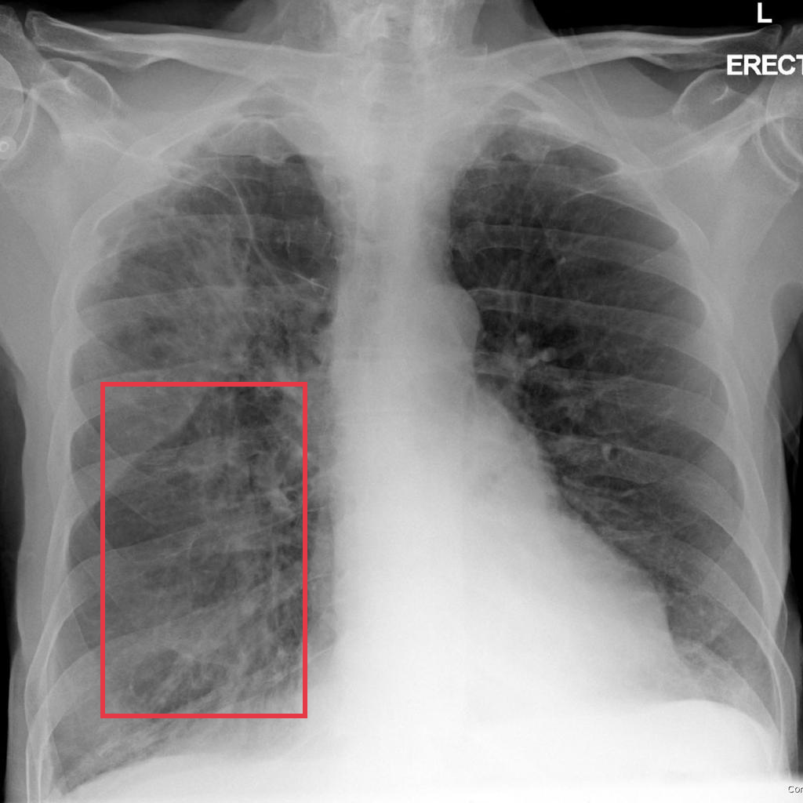

- **Modality / subcategory：** X-ray / Frontal
- **bbox_2d：** `[125, 476, 382, 894]`
- **Lingshu caption：** The lungs are hyperinflated. There is increased opacity in the right lower lung zone. The heart size is normal. The mediastinal contour is normal. There is no pneumothorax. There is no pleural effusion.
- **中文翻译：** 双肺过度充气。右下肺野密度增高。心影大小及纵隔轮廓正常。未见气胸或胸腔积液。

## Directed Cross-image Validation

### Anchor 1: `study_000_x_ray_image_000_frontal_f01`

**Anchor Lingshu caption：** The lungs are hyperinflated. There is increased opacity in the left lower lung zone. The heart size is normal. The mediastinal contour is normal. There is no pneumothorax. There is no pleural effusion.
**Anchor caption 中文翻译：** 双肺过度充气。左下肺野密度增高。心影大小及纵隔轮廓正常。未见气胸或胸腔积液。

#### location_00001: PARTIAL SUPPORT

<table>
<tr><th>Anchor original bbox</th><th>Cross-image grounded target bbox</th><th>Existing target bbox: study_001_ct_image_000_coronal_lung_window_f01</th><th>Existing target bbox: study_001_ct_image_000_coronal_lung_window_f02</th><th>Existing target bbox: study_001_ct_image_000_coronal_lung_window_f03</th></tr>
<tr><td></td><td>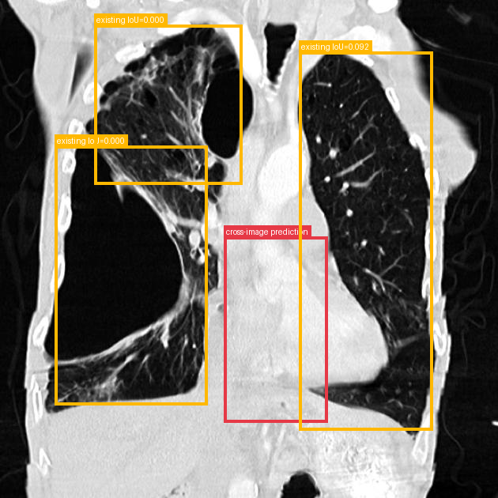</td><td></td><td></td><td></td></tr>
</table>

- **Target：** `study_001_ct_image_000_coronal_lung_window`; CT; Coronal lung window
- **Relation：** `bbox_to_image` / `partial_support`
- **Returned target bbox：** `[450, 475, 660, 850]`
- **Maximum IoU：** 0.092; threshold=0.5
- **Strong relation IDs：** `[]`

**IoU matching：**

| Existing target bbox | IoU | Strong match | Lingshu caption | 中文翻译 |
|---|---:|---|---|---|
| `study_001_ct_image_000_coronal_lung_window_f01`; `[101, 284, 427, 825]` | 0.000 | no | The right lower lobe demonstrates a large area of consolidation with air bronchograms. There is also a moderate right pleural effusion. The left lung appears clear. | 右下叶可见大片实变并有空气支气管征，同时伴中量右侧胸腔积液。左肺清晰。 |
| `study_001_ct_image_000_coronal_lung_window_f02`; `[180, 40, 498, 382]` | 0.000 | no | The right upper lobe demonstrates a large cavitary lesion with surrounding consolidation. There is also a smaller cavitary lesion in the right lower lobe. The left lung appears clear. | 右上叶可见伴周围实变的大空洞性病灶，右下叶另见较小空洞性病灶。左肺清晰。 |
| `study_001_ct_image_000_coronal_lung_window_f03`; `[591, 95, 880, 875]` | 0.092 | no | The left lung is well inflated with no areas of focal consolidation, pleural effusion, or pneumothorax identified. The pulmonary vasculature is within normal limits. There is no evidence of hilar lymphadenopathy. | 左肺充气良好，未见局灶性实变、胸腔积液或气胸。肺血管分布正常，未见肺门淋巴结肿大。 |

**B 图单红框（Lingshu 实际输入）：**

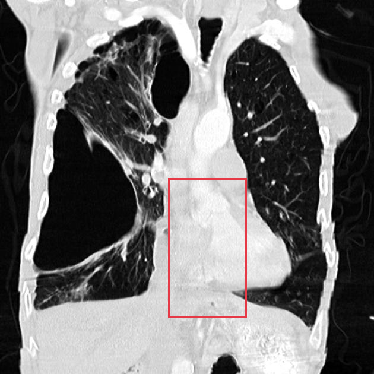

**Re-ground Lingshu caption：** The heart size is normal. The mediastinal contour is normal. There is no pleural effusion. There is no pneumothorax. The lungs are normally inflated without evidence of focal airspace disease.
**Re-ground caption 中文翻译：** 心影大小及纵隔轮廓正常。未见胸腔积液或气胸。双肺充气正常，未见局灶性肺泡性病变。

#### location_00002: NOT SUPPORT

<table>
<tr><th>Anchor original bbox</th><th>Target original image; model returned null</th><th>Existing target bbox: study_001_ct_image_001_axial_lung_window_f01</th><th>Existing target bbox: study_001_ct_image_001_axial_lung_window_f02</th></tr>
<tr><td></td><td></td><td></td><td></td></tr>
</table>

- **Target：** `study_001_ct_image_001_axial_lung_window`; CT; Axial lung window
- **Relation：** `bbox_to_image` / `not_support`
- **Returned target bbox：** `unknown`
- **Maximum IoU：** n/a; threshold=0.5
- **Strong relation IDs：** `[]`

**IoU matching：**

| Existing target bbox | IoU | Strong match | Lingshu caption | 中文翻译 |
|---|---:|---|---|---|
| `study_001_ct_image_001_axial_lung_window_f01`; `[175, 226, 675, 656]` | n/a | n/a | The right upper lobe demonstrates a large cavitary lesion with surrounding consolidation. There is also a smaller cavitary lesion in the left upper lobe. The remaining lung parenchyma appears relatively clear. No pleural effusions or pneumothorax are identified. The mediastinal structures appear unremarkable. | 右上叶可见伴周围实变的大空洞性病灶，左上叶另见较小空洞性病灶。其余肺实质相对清晰。未见胸腔积液或气胸。纵隔结构未见异常。 |
| `study_001_ct_image_001_axial_lung_window_f02`; `[588, 272, 937, 712]` | n/a | n/a | The lungs are hyperinflated. There is a large right pneumothorax with collapse of the right lung. The left lung appears normal. | 双肺过度充气。可见大量右侧气胸并伴右肺萎陷。左肺表现正常。 |

#### location_00003: PARTIAL SUPPORT

<table>
<tr><th>Anchor original bbox</th><th>Cross-image grounded target bbox</th><th>Existing target bbox: study_002_x_ray_image_000_frontal_f01</th></tr>
<tr><td></td><td>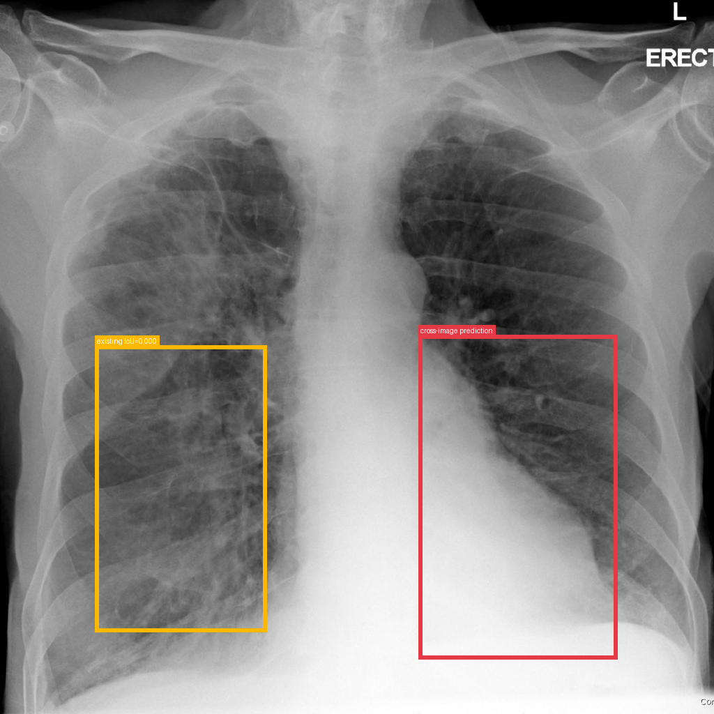</td><td></td></tr>
</table>

- **Target：** `study_002_x_ray_image_000_frontal`; X-ray; Frontal
- **Relation：** `bbox_to_image` / `partial_support`
- **Returned target bbox：** `[586, 469, 866, 924]`
- **Maximum IoU：** 0.000; threshold=0.5
- **Strong relation IDs：** `[]`

**IoU matching：**

| Existing target bbox | IoU | Strong match | Lingshu caption | 中文翻译 |
|---|---:|---|---|---|
| `study_002_x_ray_image_000_frontal_f01`; `[125, 476, 382, 894]` | 0.000 | no | The lungs are hyperinflated. There is increased opacity in the right lower lung zone. The heart size is normal. The mediastinal contour is normal. There is no pneumothorax. There is no pleural effusion. | 双肺过度充气。右下肺野密度增高。心影大小及纵隔轮廓正常。未见气胸或胸腔积液。 |

**B 图单红框（Lingshu 实际输入）：**

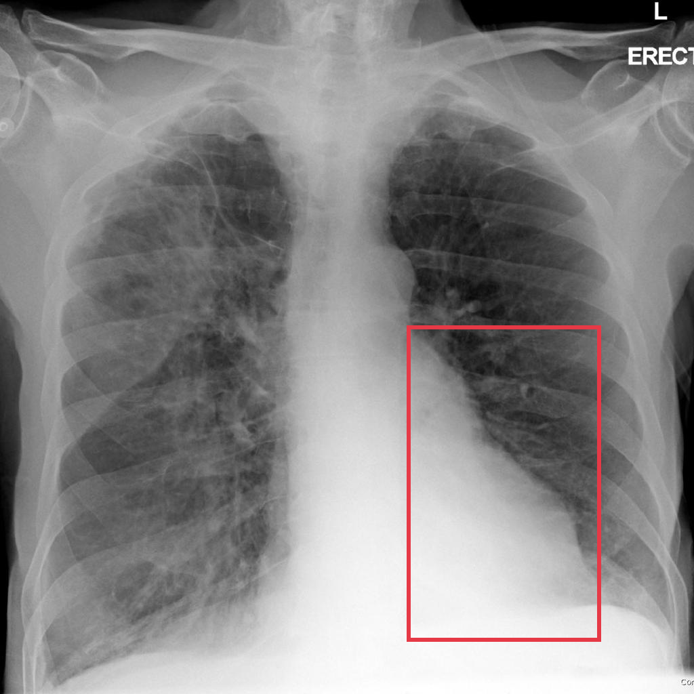

**Re-ground Lingshu caption：** The lungs are hyperinflated. There is increased opacity in the left lower lung zone. The heart size is normal. The hilar and mediastinal contours are unremarkable. No pleural effusion or pneumothorax is seen.
**Re-ground caption 中文翻译：** 双肺过度充气。左下肺野密度增高。心影大小正常，肺门及纵隔轮廓未见异常。未见胸腔积液或气胸。

### Anchor 2: `study_001_ct_image_000_coronal_lung_window_f01`

**Anchor Lingshu caption：** The right lower lobe demonstrates a large area of consolidation with air bronchograms. There is also a moderate right pleural effusion. The left lung appears clear.
**Anchor caption 中文翻译：** 右下叶可见大片实变并有空气支气管征，同时伴中量右侧胸腔积液。左肺清晰。

#### location_00004: PARTIAL SUPPORT

<table>
<tr><th>Anchor original bbox</th><th>Cross-image grounded target bbox</th><th>Existing target bbox: study_001_ct_image_001_axial_lung_window_f01</th><th>Existing target bbox: study_001_ct_image_001_axial_lung_window_f02</th></tr>
<tr><td></td><td>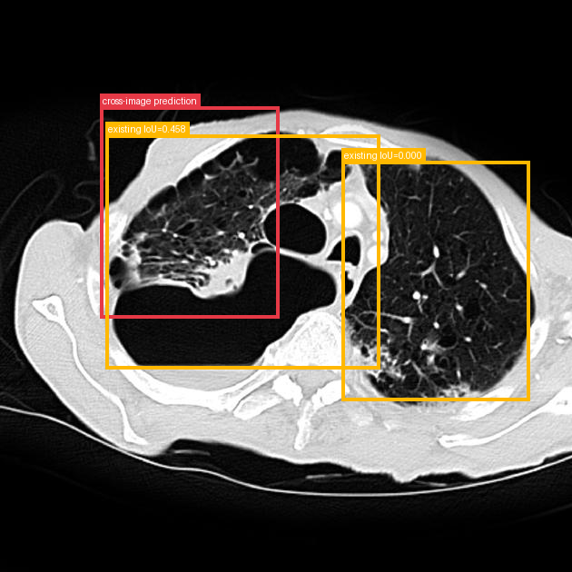</td><td></td><td></td></tr>
</table>

- **Target：** `study_001_ct_image_001_axial_lung_window`; CT; Axial lung window
- **Relation：** `bbox_to_image` / `partial_support`
- **Returned target bbox：** `[175, 187, 490, 558]`
- **Maximum IoU：** 0.458; threshold=0.5
- **Strong relation IDs：** `[]`

**IoU matching：**

| Existing target bbox | IoU | Strong match | Lingshu caption | 中文翻译 |
|---|---:|---|---|---|
| `study_001_ct_image_001_axial_lung_window_f01`; `[175, 226, 675, 656]` | 0.458 | no | The right upper lobe demonstrates a large cavitary lesion with surrounding consolidation. There is also a smaller cavitary lesion in the left upper lobe. The remaining lung parenchyma appears relatively clear. No pleural effusions or pneumothorax are identified. The mediastinal structures appear unremarkable. | 右上叶可见伴周围实变的大空洞性病灶，左上叶另见较小空洞性病灶。其余肺实质相对清晰。未见胸腔积液或气胸。纵隔结构未见异常。 |
| `study_001_ct_image_001_axial_lung_window_f02`; `[588, 272, 937, 712]` | 0.000 | no | The lungs are hyperinflated. There is a large right pneumothorax with collapse of the right lung. The left lung appears normal. | 双肺过度充气。可见大量右侧气胸并伴右肺萎陷。左肺表现正常。 |

**B 图单红框（Lingshu 实际输入）：**

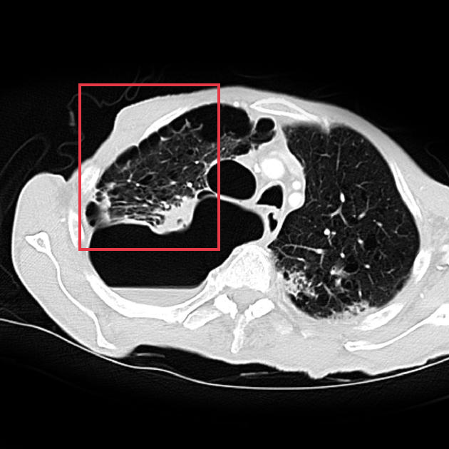

**Re-ground Lingshu caption：** The right upper lobe demonstrates a large cavitary lesion with surrounding consolidation. There is also a smaller cavitary lesion in the left upper lobe. The mediastinum is shifted to the right.
**Re-ground caption 中文翻译：** 右上叶可见伴周围实变的大空洞性病灶，左上叶另见较小空洞性病灶。纵隔向右移位。

#### location_00005: NOT SUPPORT

<table>
<tr><th>Anchor original bbox</th><th>Target original image; model returned null</th><th>Existing target bbox: study_002_x_ray_image_000_frontal_f01</th></tr>
<tr><td></td><td></td><td></td></tr>
</table>

- **Target：** `study_002_x_ray_image_000_frontal`; X-ray; Frontal
- **Relation：** `bbox_to_image` / `not_support`
- **Returned target bbox：** `unknown`
- **Maximum IoU：** n/a; threshold=0.5
- **Strong relation IDs：** `[]`

**IoU matching：**

| Existing target bbox | IoU | Strong match | Lingshu caption | 中文翻译 |
|---|---:|---|---|---|
| `study_002_x_ray_image_000_frontal_f01`; `[125, 476, 382, 894]` | n/a | n/a | The lungs are hyperinflated. There is increased opacity in the right lower lung zone. The heart size is normal. The mediastinal contour is normal. There is no pneumothorax. There is no pleural effusion. | 双肺过度充气。右下肺野密度增高。心影大小及纵隔轮廓正常。未见气胸或胸腔积液。 |

### Anchor 3: `study_001_ct_image_000_coronal_lung_window_f02`

**Anchor Lingshu caption：** The right upper lobe demonstrates a large cavitary lesion with surrounding consolidation. There is also a smaller cavitary lesion in the right lower lobe. The left lung appears clear.
**Anchor caption 中文翻译：** 右上叶可见伴周围实变的大空洞性病灶，右下叶另见较小空洞性病灶。左肺清晰。

#### location_00006: PARTIAL SUPPORT

<table>
<tr><th>Anchor original bbox</th><th>Cross-image grounded target bbox</th><th>Existing target bbox: study_001_ct_image_001_axial_lung_window_f01</th><th>Existing target bbox: study_001_ct_image_001_axial_lung_window_f02</th></tr>
<tr><td></td><td>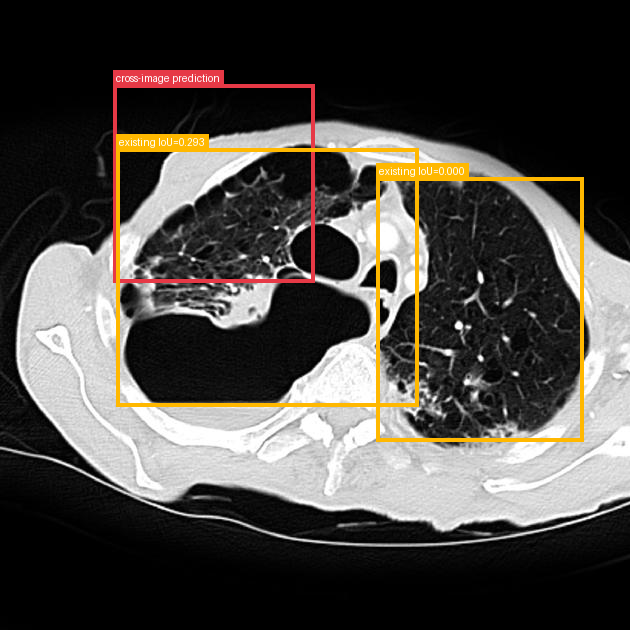</td><td></td><td></td></tr>
</table>

- **Target：** `study_001_ct_image_001_axial_lung_window`; CT; Axial lung window
- **Relation：** `bbox_to_image` / `partial_support`
- **Returned target bbox：** `[180, 134, 500, 450]`
- **Maximum IoU：** 0.293; threshold=0.5
- **Strong relation IDs：** `[]`

**IoU matching：**

| Existing target bbox | IoU | Strong match | Lingshu caption | 中文翻译 |
|---|---:|---|---|---|
| `study_001_ct_image_001_axial_lung_window_f01`; `[175, 226, 675, 656]` | 0.293 | no | The right upper lobe demonstrates a large cavitary lesion with surrounding consolidation. There is also a smaller cavitary lesion in the left upper lobe. The remaining lung parenchyma appears relatively clear. No pleural effusions or pneumothorax are identified. The mediastinal structures appear unremarkable. | 右上叶可见伴周围实变的大空洞性病灶，左上叶另见较小空洞性病灶。其余肺实质相对清晰。未见胸腔积液或气胸。纵隔结构未见异常。 |
| `study_001_ct_image_001_axial_lung_window_f02`; `[588, 272, 937, 712]` | 0.000 | no | The lungs are hyperinflated. There is a large right pneumothorax with collapse of the right lung. The left lung appears normal. | 双肺过度充气。可见大量右侧气胸并伴右肺萎陷。左肺表现正常。 |

**B 图单红框（Lingshu 实际输入）：**

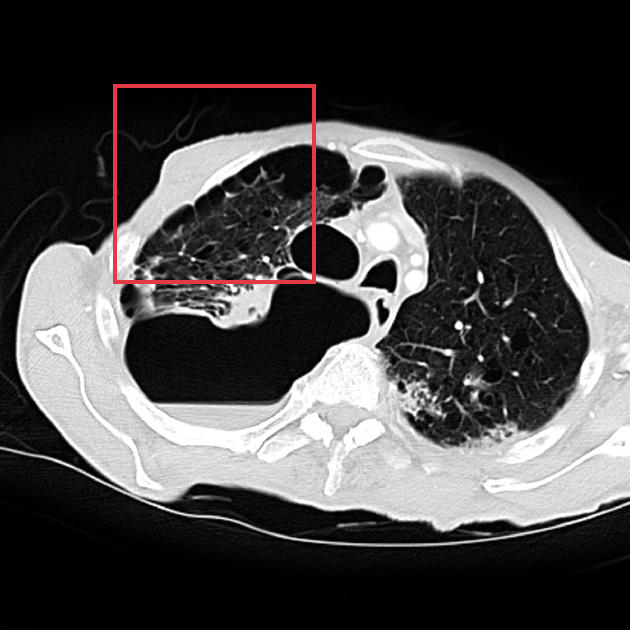

**Re-ground Lingshu caption：** The right upper lobe demonstrates a large cavitary lesion with surrounding consolidation. There is also evidence of bronchiectasis in this region. The left lung appears relatively clear.
**Re-ground caption 中文翻译：** 右上叶可见伴周围实变的大空洞性病灶，该区域另见支气管扩张。左肺相对清晰。

#### location_00007: NOT SUPPORT

<table>
<tr><th>Anchor original bbox</th><th>Target original image; model returned null</th><th>Existing target bbox: study_002_x_ray_image_000_frontal_f01</th></tr>
<tr><td></td><td></td><td></td></tr>
</table>

- **Target：** `study_002_x_ray_image_000_frontal`; X-ray; Frontal
- **Relation：** `bbox_to_image` / `not_support`
- **Returned target bbox：** `unknown`
- **Maximum IoU：** n/a; threshold=0.5
- **Strong relation IDs：** `[]`

**IoU matching：**

| Existing target bbox | IoU | Strong match | Lingshu caption | 中文翻译 |
|---|---:|---|---|---|
| `study_002_x_ray_image_000_frontal_f01`; `[125, 476, 382, 894]` | n/a | n/a | The lungs are hyperinflated. There is increased opacity in the right lower lung zone. The heart size is normal. The mediastinal contour is normal. There is no pneumothorax. There is no pleural effusion. | 双肺过度充气。右下肺野密度增高。心影大小及纵隔轮廓正常。未见气胸或胸腔积液。 |

### Anchor 4: `study_001_ct_image_000_coronal_lung_window_f03`

**Anchor Lingshu caption：** The left lung is well inflated with no areas of focal consolidation, pleural effusion, or pneumothorax identified. The pulmonary vasculature is within normal limits. There is no evidence of hilar lymphadenopathy.
**Anchor caption 中文翻译：** 左肺充气良好，未见局灶性实变、胸腔积液或气胸。肺血管分布正常，未见肺门淋巴结肿大。

#### location_00008: STRONG SUPPORT

<table>
<tr><th>Anchor original bbox</th><th>Cross-image grounded target bbox</th><th>Existing target bbox: study_001_ct_image_001_axial_lung_window_f01</th><th>Existing target bbox: study_001_ct_image_001_axial_lung_window_f02</th></tr>
<tr><td></td><td>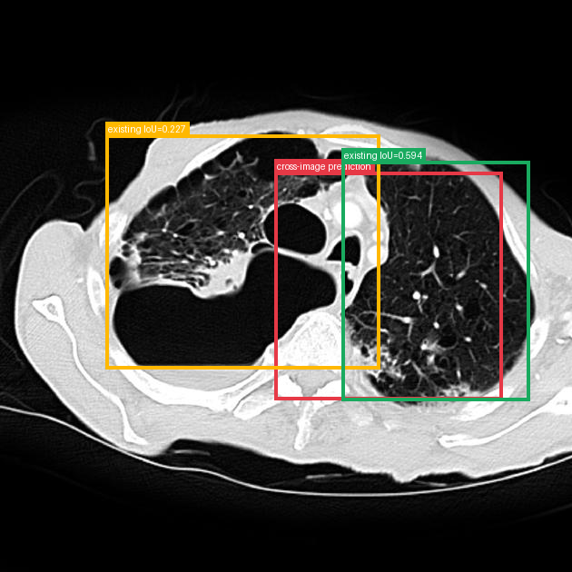</td><td></td><td></td></tr>
</table>

- **Target：** `study_001_ct_image_001_axial_lung_window`; CT; Axial lung window
- **Relation：** `bbox_to_bbox` / `strong_support`
- **Returned target bbox：** `[480, 300, 880, 700]`
- **Maximum IoU：** 0.594; threshold=0.5
- **Strong relation IDs：** `[&#x27;strong_location_00008_01&#x27;]`

**IoU matching：**

| Existing target bbox | IoU | Strong match | Lingshu caption | 中文翻译 |
|---|---:|---|---|---|
| `study_001_ct_image_001_axial_lung_window_f01`; `[175, 226, 675, 656]` | 0.227 | no | The right upper lobe demonstrates a large cavitary lesion with surrounding consolidation. There is also a smaller cavitary lesion in the left upper lobe. The remaining lung parenchyma appears relatively clear. No pleural effusions or pneumothorax are identified. The mediastinal structures appear unremarkable. | 右上叶可见伴周围实变的大空洞性病灶，左上叶另见较小空洞性病灶。其余肺实质相对清晰。未见胸腔积液或气胸。纵隔结构未见异常。 |
| `study_001_ct_image_001_axial_lung_window_f02`; `[588, 272, 937, 712]` | 0.594 | yes | The lungs are hyperinflated. There is a large right pneumothorax with collapse of the right lung. The left lung appears normal. | 双肺过度充气。可见大量右侧气胸并伴右肺萎陷。左肺表现正常。 |

#### location_00009: PARTIAL SUPPORT

<table>
<tr><th>Anchor original bbox</th><th>Cross-image grounded target bbox</th><th>Existing target bbox: study_002_x_ray_image_000_frontal_f01</th></tr>
<tr><td></td><td>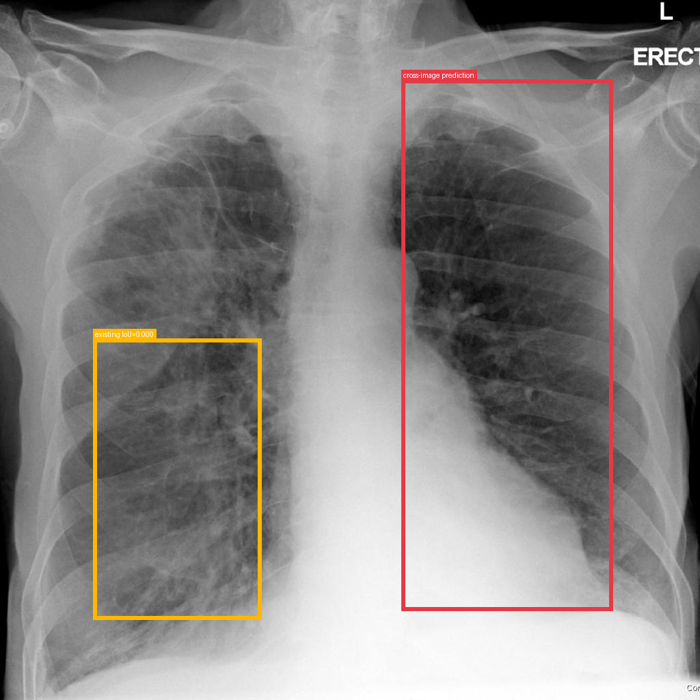</td><td></td></tr>
</table>

- **Target：** `study_002_x_ray_image_000_frontal`; X-ray; Frontal
- **Relation：** `bbox_to_image` / `partial_support`
- **Returned target bbox：** `[574, 114, 876, 874]`
- **Maximum IoU：** 0.000; threshold=0.5
- **Strong relation IDs：** `[]`

**IoU matching：**

| Existing target bbox | IoU | Strong match | Lingshu caption | 中文翻译 |
|---|---:|---|---|---|
| `study_002_x_ray_image_000_frontal_f01`; `[125, 476, 382, 894]` | 0.000 | no | The lungs are hyperinflated. There is increased opacity in the right lower lung zone. The heart size is normal. The mediastinal contour is normal. There is no pneumothorax. There is no pleural effusion. | 双肺过度充气。右下肺野密度增高。心影大小及纵隔轮廓正常。未见气胸或胸腔积液。 |

**B 图单红框（Lingshu 实际输入）：**

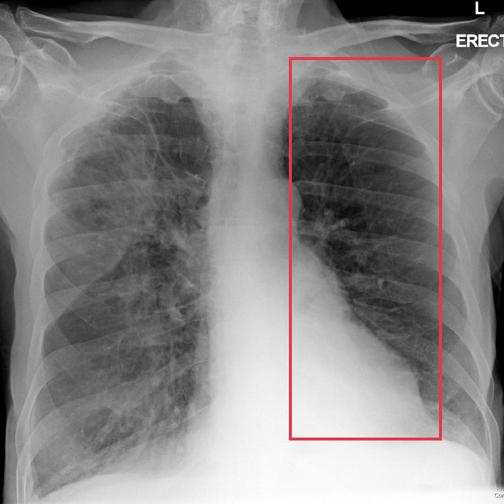

**Re-ground Lingshu caption：** The lungs are hyperinflated. There is increased opacity in the left upper lung zone. The heart size is normal. The hilar and mediastinal contours are unremarkable. No pleural effusion or pneumothorax is seen.
**Re-ground caption 中文翻译：** 双肺过度充气。左上肺野密度增高。心影大小正常，肺门及纵隔轮廓未见异常。未见胸腔积液或气胸。

### Anchor 5: `study_001_ct_image_001_axial_lung_window_f01`

**Anchor Lingshu caption：** The right upper lobe demonstrates a large cavitary lesion with surrounding consolidation. There is also a smaller cavitary lesion in the left upper lobe. The remaining lung parenchyma appears relatively clear. No pleural effusions or pneumothorax are identified. The mediastinal structures appear unremarkable.
**Anchor caption 中文翻译：** 右上叶可见伴周围实变的大空洞性病灶，左上叶另见较小空洞性病灶。其余肺实质相对清晰。未见胸腔积液或气胸。纵隔结构未见异常。

#### location_00010: NOT SUPPORT

<table>
<tr><th>Anchor original bbox</th><th>Target original image; model returned null</th><th>Existing target bbox: study_002_x_ray_image_000_frontal_f01</th></tr>
<tr><td></td><td></td><td></td></tr>
</table>

- **Target：** `study_002_x_ray_image_000_frontal`; X-ray; Frontal
- **Relation：** `bbox_to_image` / `not_support`
- **Returned target bbox：** `unknown`
- **Maximum IoU：** n/a; threshold=0.5
- **Strong relation IDs：** `[]`

**IoU matching：**

| Existing target bbox | IoU | Strong match | Lingshu caption | 中文翻译 |
|---|---:|---|---|---|
| `study_002_x_ray_image_000_frontal_f01`; `[125, 476, 382, 894]` | n/a | n/a | The lungs are hyperinflated. There is increased opacity in the right lower lung zone. The heart size is normal. The mediastinal contour is normal. There is no pneumothorax. There is no pleural effusion. | 双肺过度充气。右下肺野密度增高。心影大小及纵隔轮廓正常。未见气胸或胸腔积液。 |

## Dynamically Skipped Anchors

| Anchor node | Reused strong relations | Skipped target images |
|---|---|---|
| `study_001_ct_image_001_axial_lung_window_f02` | `[&#x27;strong_location_00008_01&#x27;]` | `[&#x27;study_002_x_ray_image_000_frontal&#x27;]` |

## Case-level Location Validation Summary / 病例级定位验证总结

- **Strong support：** 1 个 bbox-to-bbox 关系
- **Partial support：** 5 个 bbox-to-image 关系
- **Not support：** 4 个 bbox-to-image 关系

### Strong Support

#### Strong 1: `study_001_ct_image_000_coronal_lung_window_f03` ↔ `study_001_ct_image_001_axial_lung_window_f02`

- **Relation / query：** `strong_location_00008_01` / `location_00008`
- **IoU：** 0.594（threshold=0.5）

<table>
<tr><th>Anchor bbox</th><th>Cross-image grounded target bbox</th><th>Matched target bbox</th></tr>
<tr><td></td><td></td><td></td></tr>
</table>

- **Anchor Lingshu caption：** The left lung is well inflated with no areas of focal consolidation, pleural effusion, or pneumothorax identified. The pulmonary vasculature is within normal limits. There is no evidence of hilar lymphadenopathy.
- **Anchor caption 中文翻译：** 左肺充气良好，未见局灶性实变、胸腔积液或气胸。肺血管分布正常，未见肺门淋巴结肿大。
- **Target Lingshu caption：** The lungs are hyperinflated. There is a large right pneumothorax with collapse of the right lung. The left lung appears normal.
- **Target caption 中文翻译：** 双肺过度充气。可见大量右侧气胸并伴右肺萎陷。左肺表现正常。

### Partial Support

#### Partial 1: `study_000_x_ray_image_000_frontal_f01` → `study_001_ct_image_000_coronal_lung_window`

- **Query：** `location_00001`
- **Returned target bbox：** `[450, 475, 660, 850]`
- **Maximum IoU：** 0.092（低于 threshold=0.5）

<table>
<tr><th>Anchor bbox</th><th>Cross-image grounding and IoU overlay</th><th>B image with the single re-grounded bbox given to Lingshu</th><th>Closest existing target bbox</th></tr>
<tr><td></td><td></td><td></td><td></td></tr>
</table>

- **A 端原始 Lingshu caption：** The lungs are hyperinflated. There is increased opacity in the left lower lung zone. The heart size is normal. The mediastinal contour is normal. There is no pneumothorax. There is no pleural effusion.
- **A 端 caption 中文翻译：** 双肺过度充气。左下肺野密度增高。心影大小及纵隔轮廓正常。未见气胸或胸腔积液。
- **B 端 re-ground Lingshu caption：** The heart size is normal. The mediastinal contour is normal. There is no pleural effusion. There is no pneumothorax. The lungs are normally inflated without evidence of focal airspace disease.
- **B 端 re-ground caption 中文翻译：** 心影大小及纵隔轮廓正常。未见胸腔积液或气胸。双肺充气正常，未见局灶性肺泡性病变。

#### Partial 2: `study_000_x_ray_image_000_frontal_f01` → `study_002_x_ray_image_000_frontal`

- **Query：** `location_00003`
- **Returned target bbox：** `[586, 469, 866, 924]`
- **Maximum IoU：** 0.000（低于 threshold=0.5）

<table>
<tr><th>Anchor bbox</th><th>Cross-image grounding and IoU overlay</th><th>B image with the single re-grounded bbox given to Lingshu</th><th>Closest existing target bbox</th></tr>
<tr><td></td><td></td><td></td><td></td></tr>
</table>

- **A 端原始 Lingshu caption：** The lungs are hyperinflated. There is increased opacity in the left lower lung zone. The heart size is normal. The mediastinal contour is normal. There is no pneumothorax. There is no pleural effusion.
- **A 端 caption 中文翻译：** 双肺过度充气。左下肺野密度增高。心影大小及纵隔轮廓正常。未见气胸或胸腔积液。
- **B 端 re-ground Lingshu caption：** The lungs are hyperinflated. There is increased opacity in the left lower lung zone. The heart size is normal. The hilar and mediastinal contours are unremarkable. No pleural effusion or pneumothorax is seen.
- **B 端 re-ground caption 中文翻译：** 双肺过度充气。左下肺野密度增高。心影大小正常，肺门及纵隔轮廓未见异常。未见胸腔积液或气胸。

#### Partial 3: `study_001_ct_image_000_coronal_lung_window_f01` → `study_001_ct_image_001_axial_lung_window`

- **Query：** `location_00004`
- **Returned target bbox：** `[175, 187, 490, 558]`
- **Maximum IoU：** 0.458（低于 threshold=0.5）

<table>
<tr><th>Anchor bbox</th><th>Cross-image grounding and IoU overlay</th><th>B image with the single re-grounded bbox given to Lingshu</th><th>Closest existing target bbox</th></tr>
<tr><td></td><td></td><td></td><td></td></tr>
</table>

- **A 端原始 Lingshu caption：** The right lower lobe demonstrates a large area of consolidation with air bronchograms. There is also a moderate right pleural effusion. The left lung appears clear.
- **A 端 caption 中文翻译：** 右下叶可见大片实变并有空气支气管征，同时伴中量右侧胸腔积液。左肺清晰。
- **B 端 re-ground Lingshu caption：** The right upper lobe demonstrates a large cavitary lesion with surrounding consolidation. There is also a smaller cavitary lesion in the left upper lobe. The mediastinum is shifted to the right.
- **B 端 re-ground caption 中文翻译：** 右上叶可见伴周围实变的大空洞性病灶，左上叶另见较小空洞性病灶。纵隔向右移位。

#### Partial 4: `study_001_ct_image_000_coronal_lung_window_f02` → `study_001_ct_image_001_axial_lung_window`

- **Query：** `location_00006`
- **Returned target bbox：** `[180, 134, 500, 450]`
- **Maximum IoU：** 0.293（低于 threshold=0.5）

<table>
<tr><th>Anchor bbox</th><th>Cross-image grounding and IoU overlay</th><th>B image with the single re-grounded bbox given to Lingshu</th><th>Closest existing target bbox</th></tr>
<tr><td></td><td></td><td></td><td></td></tr>
</table>

- **A 端原始 Lingshu caption：** The right upper lobe demonstrates a large cavitary lesion with surrounding consolidation. There is also a smaller cavitary lesion in the right lower lobe. The left lung appears clear.
- **A 端 caption 中文翻译：** 右上叶可见伴周围实变的大空洞性病灶，右下叶另见较小空洞性病灶。左肺清晰。
- **B 端 re-ground Lingshu caption：** The right upper lobe demonstrates a large cavitary lesion with surrounding consolidation. There is also evidence of bronchiectasis in this region. The left lung appears relatively clear.
- **B 端 re-ground caption 中文翻译：** 右上叶可见伴周围实变的大空洞性病灶，该区域另见支气管扩张。左肺相对清晰。

#### Partial 5: `study_001_ct_image_000_coronal_lung_window_f03` → `study_002_x_ray_image_000_frontal`

- **Query：** `location_00009`
- **Returned target bbox：** `[574, 114, 876, 874]`
- **Maximum IoU：** 0.000（低于 threshold=0.5）

<table>
<tr><th>Anchor bbox</th><th>Cross-image grounding and IoU overlay</th><th>B image with the single re-grounded bbox given to Lingshu</th><th>Closest existing target bbox</th></tr>
<tr><td></td><td></td><td></td><td></td></tr>
</table>

- **A 端原始 Lingshu caption：** The left lung is well inflated with no areas of focal consolidation, pleural effusion, or pneumothorax identified. The pulmonary vasculature is within normal limits. There is no evidence of hilar lymphadenopathy.
- **A 端 caption 中文翻译：** 左肺充气良好，未见局灶性实变、胸腔积液或气胸。肺血管分布正常，未见肺门淋巴结肿大。
- **B 端 re-ground Lingshu caption：** The lungs are hyperinflated. There is increased opacity in the left upper lung zone. The heart size is normal. The hilar and mediastinal contours are unremarkable. No pleural effusion or pneumothorax is seen.
- **B 端 re-ground caption 中文翻译：** 双肺过度充气。左上肺野密度增高。心影大小正常，肺门及纵隔轮廓未见异常。未见胸腔积液或气胸。

### Not Support

#### Not support 1: `study_000_x_ray_image_000_frontal_f01` → `study_001_ct_image_001_axial_lung_window`

- **Query：** `location_00002`
- **Result：** 目标图返回 `null`，未定位到对应区域。

<table>
<tr><th>Anchor bbox</th><th>Target original image</th></tr>
<tr><td></td><td></td></tr>
</table>

- **A 端原始 Lingshu caption：** The lungs are hyperinflated. There is increased opacity in the left lower lung zone. The heart size is normal. The mediastinal contour is normal. There is no pneumothorax. There is no pleural effusion.
- **A 端 caption 中文翻译：** 双肺过度充气。左下肺野密度增高。心影大小及纵隔轮廓正常。未见气胸或胸腔积液。
- **B 端 re-ground caption：** 不适用；目标图返回 `null`，没有生成 re-ground bbox。

#### Not support 2: `study_001_ct_image_000_coronal_lung_window_f01` → `study_002_x_ray_image_000_frontal`

- **Query：** `location_00005`
- **Result：** 目标图返回 `null`，未定位到对应区域。

<table>
<tr><th>Anchor bbox</th><th>Target original image</th></tr>
<tr><td></td><td></td></tr>
</table>

- **A 端原始 Lingshu caption：** The right lower lobe demonstrates a large area of consolidation with air bronchograms. There is also a moderate right pleural effusion. The left lung appears clear.
- **A 端 caption 中文翻译：** 右下叶可见大片实变并有空气支气管征，同时伴中量右侧胸腔积液。左肺清晰。
- **B 端 re-ground caption：** 不适用；目标图返回 `null`，没有生成 re-ground bbox。

#### Not support 3: `study_001_ct_image_000_coronal_lung_window_f02` → `study_002_x_ray_image_000_frontal`

- **Query：** `location_00007`
- **Result：** 目标图返回 `null`，未定位到对应区域。

<table>
<tr><th>Anchor bbox</th><th>Target original image</th></tr>
<tr><td></td><td></td></tr>
</table>

- **A 端原始 Lingshu caption：** The right upper lobe demonstrates a large cavitary lesion with surrounding consolidation. There is also a smaller cavitary lesion in the right lower lobe. The left lung appears clear.
- **A 端 caption 中文翻译：** 右上叶可见伴周围实变的大空洞性病灶，右下叶另见较小空洞性病灶。左肺清晰。
- **B 端 re-ground caption：** 不适用；目标图返回 `null`，没有生成 re-ground bbox。

#### Not support 4: `study_001_ct_image_001_axial_lung_window_f01` → `study_002_x_ray_image_000_frontal`

- **Query：** `location_00010`
- **Result：** 目标图返回 `null`，未定位到对应区域。

<table>
<tr><th>Anchor bbox</th><th>Target original image</th></tr>
<tr><td></td><td></td></tr>
</table>

- **A 端原始 Lingshu caption：** The right upper lobe demonstrates a large cavitary lesion with surrounding consolidation. There is also a smaller cavitary lesion in the left upper lobe. The remaining lung parenchyma appears relatively clear. No pleural effusions or pneumothorax are identified. The mediastinal structures appear unremarkable.
- **A 端 caption 中文翻译：** 右上叶可见伴周围实变的大空洞性病灶，左上叶另见较小空洞性病灶。其余肺实质相对清晰。未见胸腔积液或气胸。纵隔结构未见异常。
- **B 端 re-ground caption：** 不适用；目标图返回 `null`，没有生成 re-ground bbox。
