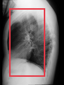
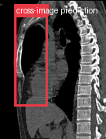
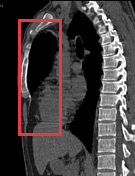
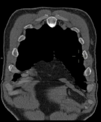

# Morgagni hernia

[返回 Step 3 总览](../README_STEP3_VISUALIZATION.md)

- **Case ID：** `morgagni-hernia-8`
- **Case URL：** [https://radiopaedia.org/cases/morgagni-hernia-8?lang=us](https://radiopaedia.org/cases/morgagni-hernia-8?lang=us)
- **验证模型：** Qwen3-VL-8B
- **图像 / Step 2 findings：** 5 / 1
- **定位结果：** strong 0；partial 1；not support 2；parse error 0
- **Strong bbox relations：** 0
- **原始 JSON：** [case_evidence.json](../assets_step3/morgagni-hernia-8/case_evidence.json)
- **定量/定性验证 JSON：** [step_3_validation_case_evidence.json](../assets_step3/morgagni-hernia-8/step_3_validation_case_evidence.json)

**Overlay 图例：** 红框为跨图新定位；绿框为 IoU >= 0.5 的已有 bbox；黄框为未达到阈值的已有 bbox。

## Step 2 Finding Nodes

### Finding 1: `study_000_x_ray_image_001_lateral_f01`

- **Modality / subcategory：** X-ray / Lateral
- **bbox_2d：** `[150, 100, 700, 900]`
- **Lingshu caption：** The lungs are clear bilaterally. Specifically, no evidence of focal consolidation, pneumothorax, or pleural effusion. Cardiomediastinal silhouette is unremarkable. Visualized osseous structures of the thorax are without acute abnormality.
- **中文翻译：** 双肺清晰，未见局灶性实变、气胸或胸腔积液。心纵隔轮廓未见异常。所见胸廓骨性结构未见急性异常。

## Directed Cross-image Validation

### Anchor 1: `study_000_x_ray_image_001_lateral_f01`

**Anchor Lingshu caption：** The lungs are clear bilaterally. Specifically, no evidence of focal consolidation, pneumothorax, or pleural effusion. Cardiomediastinal silhouette is unremarkable. Visualized osseous structures of the thorax are without acute abnormality.
**Anchor caption 中文翻译：** 双肺清晰，未见局灶性实变、气胸或胸腔积液。心纵隔轮廓未见异常。所见胸廓骨性结构未见急性异常。

#### location_00001: NOT SUPPORT

<table>
<tr><th>Anchor original bbox</th><th>Target original image; model returned null</th></tr>
<tr><td></td><td></td></tr>
</table>

- **Target：** `study_001_ct_image_000_axial_non_contrast`; CT; Axial non-contrast
- **Relation：** `bbox_to_image` / `not_support`
- **Returned target bbox：** `unknown`
- **Maximum IoU：** n/a; threshold=0.5
- **Strong relation IDs：** `[]`

**IoU matching：**

The target image has no existing Step 2 bbox.

#### location_00002: PARTIAL SUPPORT

<table>
<tr><th>Anchor original bbox</th><th>Cross-image grounded target bbox</th></tr>
<tr><td></td><td></td></tr>
</table>

- **Target：** `study_001_ct_image_001_sagittal_non_contrast`; CT; Sagittal non-contrast
- **Relation：** `bbox_to_image` / `partial_support`
- **Returned target bbox：** `[136, 109, 458, 768]`
- **Maximum IoU：** n/a; threshold=0.5
- **Strong relation IDs：** `[]`

**IoU matching：**

The target image has no existing Step 2 bbox.

**B 图单红框（Lingshu 实际输入）：**

**Re-ground Lingshu caption：** The red box is located over the right upper lobe. There is a large mass in this area which appears to be invading the mediastinum. The mass is heterogeneous in appearance.
**Re-ground caption 中文翻译：** 红框位于右上叶。该区域可见较大肿块，似侵犯纵隔，内部表现不均。

**Quantitative / qualitative validation：**

| Validation pair | Quantitative size / 定量 | Qualitative caption / 定性 |
|---|---|---|
| `partial__location_00002` | `inconsistent` | `inconsistent` |

#### location_00003: NOT SUPPORT

<table>
<tr><th>Anchor original bbox</th><th>Target original image; model returned null</th></tr>
<tr><td></td><td></td></tr>
</table>

- **Target：** `study_001_ct_image_002_coronal_non_contrast`; CT; Coronal non-contrast
- **Relation：** `bbox_to_image` / `not_support`
- **Returned target bbox：** `unknown`
- **Maximum IoU：** n/a; threshold=0.5
- **Strong relation IDs：** `[]`

**IoU matching：**

The target image has no existing Step 2 bbox.

## Dynamically Skipped Anchors

None.

## Case-level Location Validation Summary / 病例级定位验证总结

- **Strong support：** 0 个 bbox-to-bbox 关系
- **Partial support：** 1 个 bbox-to-image 关系
- **Not support：** 2 个 bbox-to-image 关系

### Strong Support

该病例没有 strong-support bbox 对应关系。

### Partial Support

#### Partial 1: `study_000_x_ray_image_001_lateral_f01` → `study_001_ct_image_001_sagittal_non_contrast`

- **Query：** `location_00002`
- **Returned target bbox：** `[136, 109, 458, 768]`
- **Maximum IoU：** n/a（低于 threshold=0.5）

<table>
<tr><th>Anchor bbox</th><th>Cross-image grounding and IoU overlay</th><th>B image with the single re-grounded bbox given to Lingshu</th></tr>
<tr><td></td><td></td><td></td></tr>
</table>

- **A 端原始 Lingshu caption：** The lungs are clear bilaterally. Specifically, no evidence of focal consolidation, pneumothorax, or pleural effusion. Cardiomediastinal silhouette is unremarkable. Visualized osseous structures of the thorax are without acute abnormality.
- **A 端 caption 中文翻译：** 双肺清晰，未见局灶性实变、气胸或胸腔积液。心纵隔轮廓未见异常。所见胸廓骨性结构未见急性异常。
- **B 端 re-ground Lingshu caption：** The red box is located over the right upper lobe. There is a large mass in this area which appears to be invading the mediastinum. The mass is heterogeneous in appearance.
- **B 端 re-ground caption 中文翻译：** 红框位于右上叶。该区域可见较大肿块，似侵犯纵隔，内部表现不均。
- **Quantitative size validation / 定量大小一致性：** `inconsistent`
- **Qualitative caption validation / 定性语义一致性：** `inconsistent`

### Not Support

#### Not support 1: `study_000_x_ray_image_001_lateral_f01` → `study_001_ct_image_000_axial_non_contrast`

- **Query：** `location_00001`
- **Result：** 目标图返回 `null`，未定位到对应区域。

<table>
<tr><th>Anchor bbox</th><th>Target original image</th></tr>
<tr><td></td><td></td></tr>
</table>

- **A 端原始 Lingshu caption：** The lungs are clear bilaterally. Specifically, no evidence of focal consolidation, pneumothorax, or pleural effusion. Cardiomediastinal silhouette is unremarkable. Visualized osseous structures of the thorax are without acute abnormality.
- **A 端 caption 中文翻译：** 双肺清晰，未见局灶性实变、气胸或胸腔积液。心纵隔轮廓未见异常。所见胸廓骨性结构未见急性异常。
- **B 端 re-ground caption：** 不适用；目标图返回 `null`，没有生成 re-ground bbox。
- **定量 / 定性验证：** 不适用；仅对 strong-support 和 partial-support pair 执行。

#### Not support 2: `study_000_x_ray_image_001_lateral_f01` → `study_001_ct_image_002_coronal_non_contrast`

- **Query：** `location_00003`
- **Result：** 目标图返回 `null`，未定位到对应区域。

<table>
<tr><th>Anchor bbox</th><th>Target original image</th></tr>
<tr><td></td><td></td></tr>
</table>

- **A 端原始 Lingshu caption：** The lungs are clear bilaterally. Specifically, no evidence of focal consolidation, pneumothorax, or pleural effusion. Cardiomediastinal silhouette is unremarkable. Visualized osseous structures of the thorax are without acute abnormality.
- **A 端 caption 中文翻译：** 双肺清晰，未见局灶性实变、气胸或胸腔积液。心纵隔轮廓未见异常。所见胸廓骨性结构未见急性异常。
- **B 端 re-ground caption：** 不适用；目标图返回 `null`，没有生成 re-ground bbox。
- **定量 / 定性验证：** 不适用；仅对 strong-support 和 partial-support pair 执行。
