# Sclerotic metastases from carcinoma of the prostate

[返回 Step 3 总览](../README_STEP3_VISUALIZATION.md)

- **Case ID：** `sclerotic-metastases-from-carcinoma-of-the-prostate`
- **Case URL：** [https://radiopaedia.org/cases/sclerotic-metastases-from-carcinoma-of-the-prostate?lang=us](https://radiopaedia.org/cases/sclerotic-metastases-from-carcinoma-of-the-prostate?lang=us)
- **验证模型：** Qwen3-VL-8B
- **图像 / Step 2 findings：** 7 / 7
- **定位结果：** strong 3；partial 8；not support 13；parse error 0
- **Strong bbox relations：** 3
- **原始 JSON：** [case_evidence.json](../assets_step3/sclerotic-metastases-from-carcinoma-of-the-prostate/case_evidence.json)

**Overlay 图例：** 红框为跨图新定位；绿框为 IoU >= 0.5 的已有 bbox；黄框为未达到阈值的已有 bbox。

## Step 2 Finding Nodes

### Finding 1: `study_000_mri_image_000_sagittal_t2_f01`

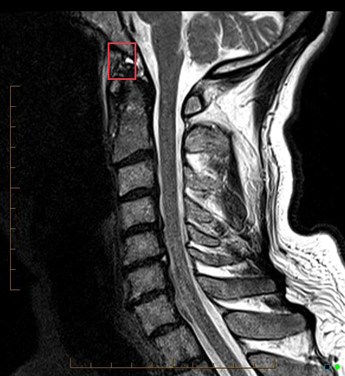

- **Modality / subcategory：** MRI / Sagittal T2
- **bbox_2d：** `[312, 114, 395, 212]`
- **Lingshu caption：** The sagittal T2 weighted MRI shows a hyperintense signal at the level of C1-C2. The spinal cord appears to be compressed at this level. There is also a slight kyphotic deformity at the same level.

### Finding 2: `study_000_mri_image_000_sagittal_t2_f02`

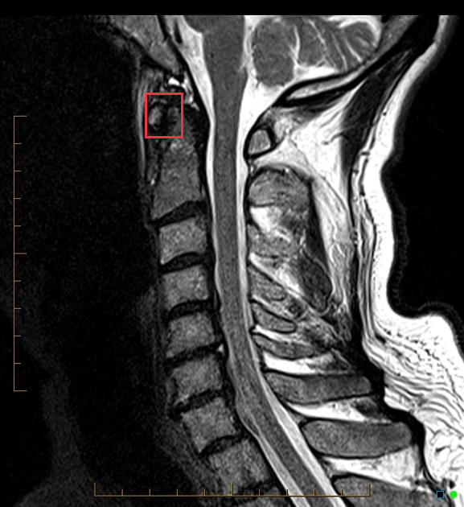

- **Modality / subcategory：** MRI / Sagittal T2
- **bbox_2d：** `[312, 184, 395, 272]`
- **Lingshu caption：** The sagittal T2 weighted MRI shows a hyperintense signal at the C1-C2 level. This could represent edema or inflammation. The spinal cord appears to be intact without any obvious signs of compression or displacement. The vertebral bodies and intervertebral discs appear normal. There is no evidence of fractures or dislocations.

### Finding 3: `study_000_mri_image_000_sagittal_t2_f03`

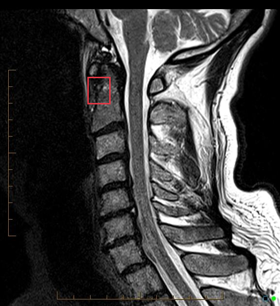

- **Modality / subcategory：** MRI / Sagittal T2
- **bbox_2d：** `[312, 252, 395, 340]`
- **Lingshu caption：** The spinal cord appears to be compressed at the level of C3-C4. The vertebral bodies appear to be intact without any obvious fractures or dislocations. There is no evidence of disc herniation or other abnormalities in the intervertebral discs. The surrounding soft tissues appear to be normal.

### Finding 4: `study_000_mri_image_002_sagittal_stir_f01`

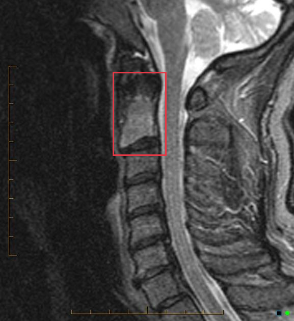

- **Modality / subcategory：** MRI / Sagittal STIR
- **bbox_2d：** `[384, 224, 566, 485]`
- **Lingshu caption：** The sagittal STIR MRI image shows a hyperintense signal in the region of the cervical spine, specifically at the C2-C3 level. The hyperintensity suggests the presence of edema or inflammation. The vertebral bodies appear intact without any obvious fractures or dislocations. The intervertebral discs show normal height and signal intensity. There is no evidence of spinal cord compression or significant stenosis. Surrounding soft tissues do not exhibit any abnormal signal changes.

### Finding 5: `study_001_nuclear_medicine_image_000_oblique_f01`

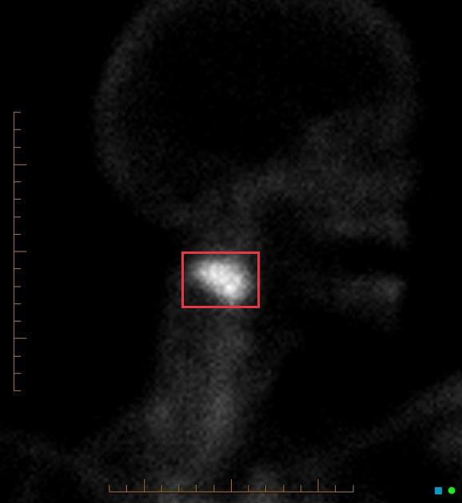

- **Modality / subcategory：** Nuclear medicine / oblique
- **bbox_2d：** `[394, 500, 562, 612]`
- **Lingshu caption：** The image shows a focal area of increased radiotracer uptake in the right parotid gland region. The uptake appears to be localized and distinct from the surrounding tissue. The rest of the image does not show any other significant areas of abnormal radiotracer distribution.

### Finding 6: `study_001_nuclear_medicine_image_001_posterior_view_f01`

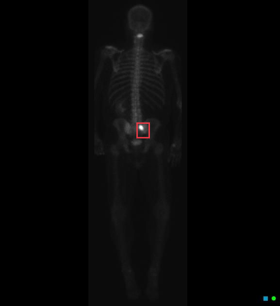

- **Modality / subcategory：** Nuclear medicine / posterior view
- **bbox_2d：** `[488, 400, 534, 452]`
- **Lingshu caption：** The image shows a nuclear medicine scan with a focus on the skeletal system. The boxed region highlights an area in the lower abdomen/pelvic region. Within this region, there is a notable concentration of radiotracer uptake, which appears as a bright spot. This increased uptake suggests a potential abnormality in the bone structure or metabolic activity in that specific area. The rest of the skeletal system, including the spine, ribs, and limbs, appears to have normal distribution of the radiotracer without any other significant areas of increased uptake.

### Finding 7: `study_002_ct_image_001_axial_bone_window_f01`

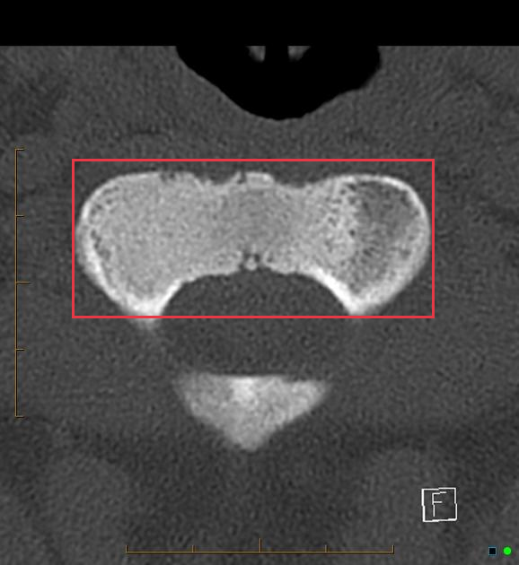

- **Modality / subcategory：** CT / Axial bone window
- **bbox_2d：** `[139, 282, 837, 562]`
- **Lingshu caption：** The axial bone window CT image shows a cross-sectional view of the vertebral body. The boxed region highlights an area of interest on the vertebral body. Within this region, there appears to be a subtle irregularity in the cortical bone, which could suggest a potential lesion or abnormality. The surrounding bone structure seems intact without obvious signs of fracture or significant deformity. The density variations within the boxed area might indicate changes in bone composition or integrity.

## Directed Cross-image Validation

### Anchor 1: `study_000_mri_image_000_sagittal_t2_f01`

**Anchor Lingshu caption：** The sagittal T2 weighted MRI shows a hyperintense signal at the level of C1-C2. The spinal cord appears to be compressed at this level. There is also a slight kyphotic deformity at the same level.

#### location_00001: PARTIAL SUPPORT

<table>
<tr><th>Anchor original bbox</th><th>Cross-image grounded target bbox</th></tr>
<tr><td></td><td>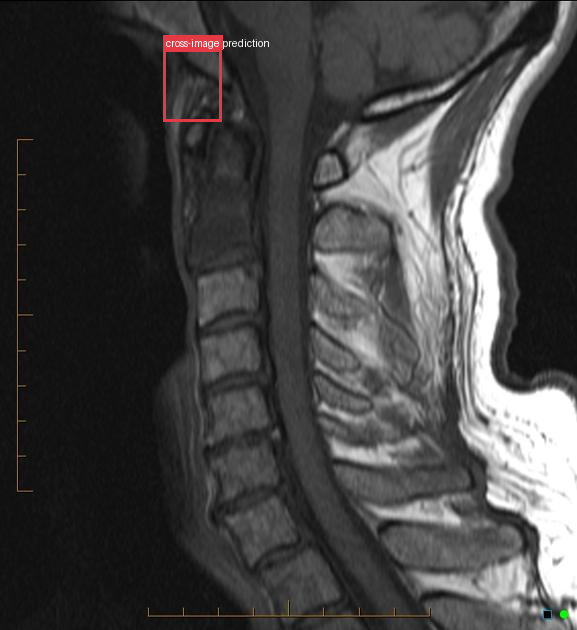</td></tr>
</table>

- **Target：** `study_000_mri_image_001_sagittal_t1`; MRI; Sagittal T1
- **Relation：** `bbox_to_image` / `partial_support`
- **Returned target bbox：** `[284, 79, 386, 194]`
- **Maximum IoU：** n/a; threshold=0.5
- **Strong relation IDs：** `[]`

**IoU matching：**

The target image has no existing Step 2 bbox.

**Target Lingshu caption：** unavailable. This is a newly re-grounded bbox and has not passed through Step 2 Lingshu captioning.

#### location_00002: PARTIAL SUPPORT

<table>
<tr><th>Anchor original bbox</th><th>Cross-image grounded target bbox</th><th>Existing target bbox: study_000_mri_image_002_sagittal_stir_f01</th></tr>
<tr><td></td><td>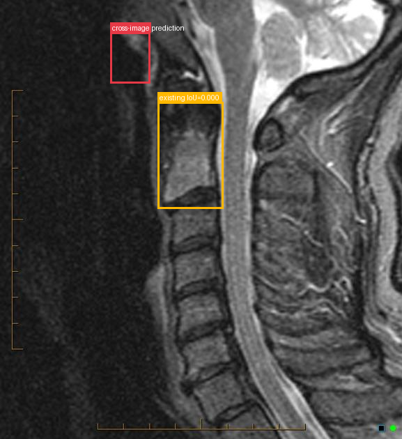</td><td></td></tr>
</table>

- **Target：** `study_000_mri_image_002_sagittal_stir`; MRI; Sagittal STIR
- **Relation：** `bbox_to_image` / `partial_support`
- **Returned target bbox：** `[274, 74, 375, 192]`
- **Maximum IoU：** 0.000; threshold=0.5
- **Strong relation IDs：** `[]`

**IoU matching：**

| Existing target bbox | IoU | Strong match | Lingshu caption |
|---|---:|---|---|
| `study_000_mri_image_002_sagittal_stir_f01`; `[384, 224, 566, 485]` | 0.000 | no | The sagittal STIR MRI image shows a hyperintense signal in the region of the cervical spine, specifically at the C2-C3 level. The hyperintensity suggests the presence of edema or inflammation. The vertebral bodies appear intact without any obvious fractures or dislocations. The intervertebral discs show normal height and signal intensity. There is no evidence of spinal cord compression or significant stenosis. Surrounding soft tissues do not exhibit any abnormal signal changes. |

**Target Lingshu caption：** unavailable. This is a newly re-grounded bbox and has not passed through Step 2 Lingshu captioning.

#### location_00003: PARTIAL SUPPORT

<table>
<tr><th>Anchor original bbox</th><th>Cross-image grounded target bbox</th><th>Existing target bbox: study_001_nuclear_medicine_image_000_oblique_f01</th></tr>
<tr><td></td><td>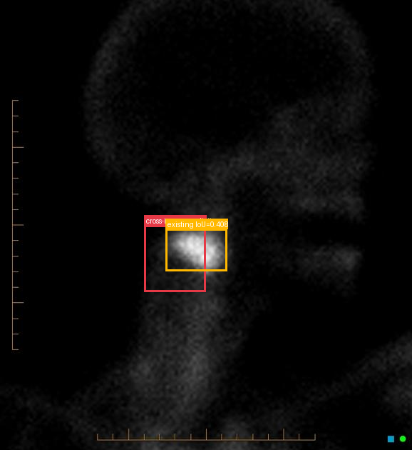</td><td></td></tr>
</table>

- **Target：** `study_001_nuclear_medicine_image_000_oblique`; Nuclear medicine; oblique
- **Relation：** `bbox_to_image` / `partial_support`
- **Returned target bbox：** `[350, 500, 500, 650]`
- **Maximum IoU：** 0.408; threshold=0.5
- **Strong relation IDs：** `[]`

**IoU matching：**

| Existing target bbox | IoU | Strong match | Lingshu caption |
|---|---:|---|---|
| `study_001_nuclear_medicine_image_000_oblique_f01`; `[394, 500, 562, 612]` | 0.408 | no | The image shows a focal area of increased radiotracer uptake in the right parotid gland region. The uptake appears to be localized and distinct from the surrounding tissue. The rest of the image does not show any other significant areas of abnormal radiotracer distribution. |

**Target Lingshu caption：** unavailable. This is a newly re-grounded bbox and has not passed through Step 2 Lingshu captioning.

#### location_00004: NOT SUPPORT

<table>
<tr><th>Anchor original bbox</th><th>Target original image; model returned null</th><th>Existing target bbox: study_001_nuclear_medicine_image_001_posterior_view_f01</th></tr>
<tr><td></td><td>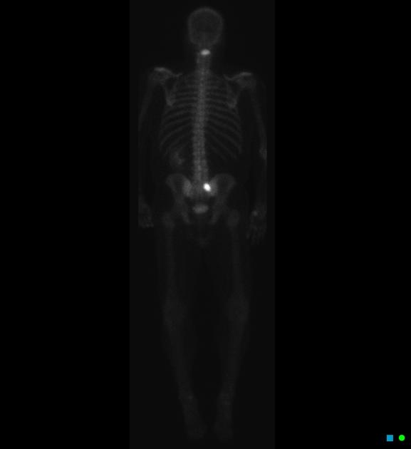</td><td></td></tr>
</table>

- **Target：** `study_001_nuclear_medicine_image_001_posterior_view`; Nuclear medicine; posterior view
- **Relation：** `bbox_to_image` / `not_support`
- **Returned target bbox：** `unknown`
- **Maximum IoU：** n/a; threshold=0.5
- **Strong relation IDs：** `[]`

**IoU matching：**

| Existing target bbox | IoU | Strong match | Lingshu caption |
|---|---:|---|---|
| `study_001_nuclear_medicine_image_001_posterior_view_f01`; `[488, 400, 534, 452]` | n/a | n/a | The image shows a nuclear medicine scan with a focus on the skeletal system. The boxed region highlights an area in the lower abdomen/pelvic region. Within this region, there is a notable concentration of radiotracer uptake, which appears as a bright spot. This increased uptake suggests a potential abnormality in the bone structure or metabolic activity in that specific area. The rest of the skeletal system, including the spine, ribs, and limbs, appears to have normal distribution of the radiotracer without any other significant areas of increased uptake. |

#### location_00005: NOT SUPPORT

<table>
<tr><th>Anchor original bbox</th><th>Target original image; model returned null</th></tr>
<tr><td></td><td>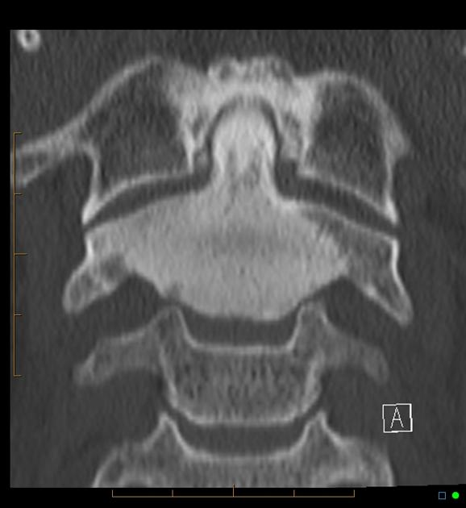</td></tr>
</table>

- **Target：** `study_002_ct_image_000_coronal_bone_window`; CT; Coronal bone window
- **Relation：** `bbox_to_image` / `not_support`
- **Returned target bbox：** `unknown`
- **Maximum IoU：** n/a; threshold=0.5
- **Strong relation IDs：** `[]`

**IoU matching：**

The target image has no existing Step 2 bbox.

#### location_00006: NOT SUPPORT

<table>
<tr><th>Anchor original bbox</th><th>Target original image; model returned null</th><th>Existing target bbox: study_002_ct_image_001_axial_bone_window_f01</th></tr>
<tr><td></td><td>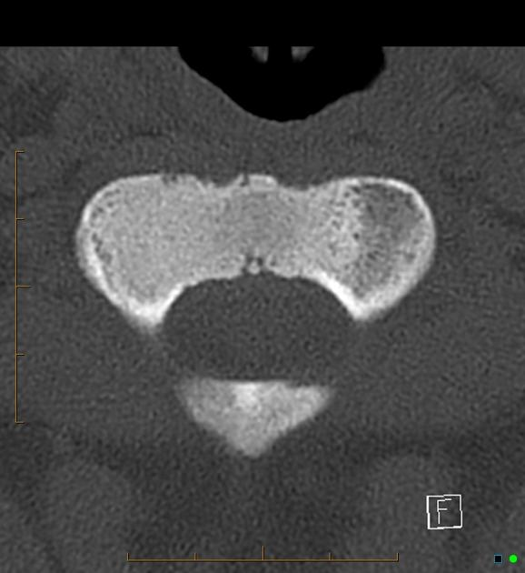</td><td></td></tr>
</table>

- **Target：** `study_002_ct_image_001_axial_bone_window`; CT; Axial bone window
- **Relation：** `bbox_to_image` / `not_support`
- **Returned target bbox：** `unknown`
- **Maximum IoU：** n/a; threshold=0.5
- **Strong relation IDs：** `[]`

**IoU matching：**

| Existing target bbox | IoU | Strong match | Lingshu caption |
|---|---:|---|---|
| `study_002_ct_image_001_axial_bone_window_f01`; `[139, 282, 837, 562]` | n/a | n/a | The axial bone window CT image shows a cross-sectional view of the vertebral body. The boxed region highlights an area of interest on the vertebral body. Within this region, there appears to be a subtle irregularity in the cortical bone, which could suggest a potential lesion or abnormality. The surrounding bone structure seems intact without obvious signs of fracture or significant deformity. The density variations within the boxed area might indicate changes in bone composition or integrity. |

### Anchor 2: `study_000_mri_image_000_sagittal_t2_f02`

**Anchor Lingshu caption：** The sagittal T2 weighted MRI shows a hyperintense signal at the C1-C2 level. This could represent edema or inflammation. The spinal cord appears to be intact without any obvious signs of compression or displacement. The vertebral bodies and intervertebral discs appear normal. There is no evidence of fractures or dislocations.

#### location_00007: PARTIAL SUPPORT

<table>
<tr><th>Anchor original bbox</th><th>Cross-image grounded target bbox</th></tr>
<tr><td></td><td>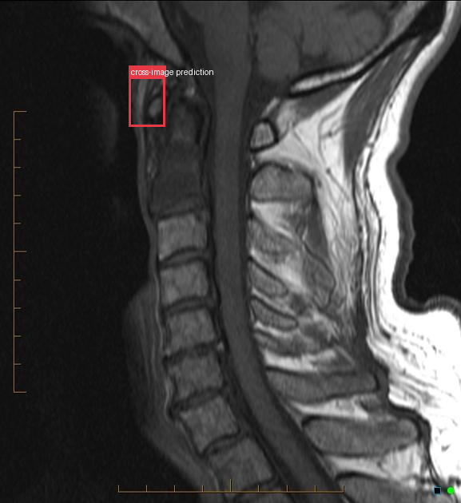</td></tr>
</table>

- **Target：** `study_000_mri_image_001_sagittal_t1`; MRI; Sagittal T1
- **Relation：** `bbox_to_image` / `partial_support`
- **Returned target bbox：** `[280, 153, 360, 253]`
- **Maximum IoU：** n/a; threshold=0.5
- **Strong relation IDs：** `[]`

**IoU matching：**

The target image has no existing Step 2 bbox.

**Target Lingshu caption：** unavailable. This is a newly re-grounded bbox and has not passed through Step 2 Lingshu captioning.

#### location_00008: PARTIAL SUPPORT

<table>
<tr><th>Anchor original bbox</th><th>Cross-image grounded target bbox</th><th>Existing target bbox: study_000_mri_image_002_sagittal_stir_f01</th></tr>
<tr><td></td><td>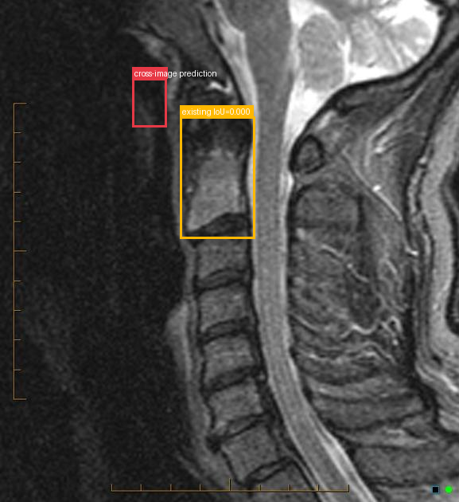</td><td></td></tr>
</table>

- **Target：** `study_000_mri_image_002_sagittal_stir`; MRI; Sagittal STIR
- **Relation：** `bbox_to_image` / `partial_support`
- **Returned target bbox：** `[288, 156, 365, 254]`
- **Maximum IoU：** 0.000; threshold=0.5
- **Strong relation IDs：** `[]`

**IoU matching：**

| Existing target bbox | IoU | Strong match | Lingshu caption |
|---|---:|---|---|
| `study_000_mri_image_002_sagittal_stir_f01`; `[384, 224, 566, 485]` | 0.000 | no | The sagittal STIR MRI image shows a hyperintense signal in the region of the cervical spine, specifically at the C2-C3 level. The hyperintensity suggests the presence of edema or inflammation. The vertebral bodies appear intact without any obvious fractures or dislocations. The intervertebral discs show normal height and signal intensity. There is no evidence of spinal cord compression or significant stenosis. Surrounding soft tissues do not exhibit any abnormal signal changes. |

**Target Lingshu caption：** unavailable. This is a newly re-grounded bbox and has not passed through Step 2 Lingshu captioning.

#### location_00009: STRONG SUPPORT

<table>
<tr><th>Anchor original bbox</th><th>Cross-image grounded target bbox</th><th>Existing target bbox: study_001_nuclear_medicine_image_000_oblique_f01</th></tr>
<tr><td></td><td>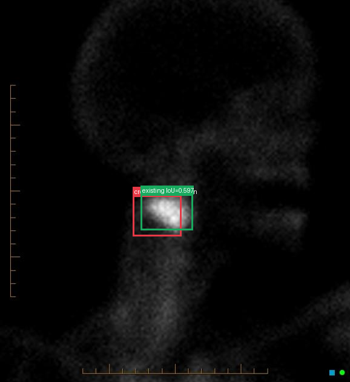</td><td></td></tr>
</table>

- **Target：** `study_001_nuclear_medicine_image_000_oblique`; Nuclear medicine; oblique
- **Relation：** `bbox_to_bbox` / `strong_support`
- **Returned target bbox：** `[380, 512, 520, 620]`
- **Maximum IoU：** 0.597; threshold=0.5
- **Strong relation IDs：** `[&#x27;strong_location_00009_01&#x27;]`

**IoU matching：**

| Existing target bbox | IoU | Strong match | Lingshu caption |
|---|---:|---|---|
| `study_001_nuclear_medicine_image_000_oblique_f01`; `[394, 500, 562, 612]` | 0.597 | yes | The image shows a focal area of increased radiotracer uptake in the right parotid gland region. The uptake appears to be localized and distinct from the surrounding tissue. The rest of the image does not show any other significant areas of abnormal radiotracer distribution. |

#### location_00010: NOT SUPPORT

<table>
<tr><th>Anchor original bbox</th><th>Target original image; model returned null</th><th>Existing target bbox: study_001_nuclear_medicine_image_001_posterior_view_f01</th></tr>
<tr><td></td><td></td><td></td></tr>
</table>

- **Target：** `study_001_nuclear_medicine_image_001_posterior_view`; Nuclear medicine; posterior view
- **Relation：** `bbox_to_image` / `not_support`
- **Returned target bbox：** `unknown`
- **Maximum IoU：** n/a; threshold=0.5
- **Strong relation IDs：** `[]`

**IoU matching：**

| Existing target bbox | IoU | Strong match | Lingshu caption |
|---|---:|---|---|
| `study_001_nuclear_medicine_image_001_posterior_view_f01`; `[488, 400, 534, 452]` | n/a | n/a | The image shows a nuclear medicine scan with a focus on the skeletal system. The boxed region highlights an area in the lower abdomen/pelvic region. Within this region, there is a notable concentration of radiotracer uptake, which appears as a bright spot. This increased uptake suggests a potential abnormality in the bone structure or metabolic activity in that specific area. The rest of the skeletal system, including the spine, ribs, and limbs, appears to have normal distribution of the radiotracer without any other significant areas of increased uptake. |

#### location_00011: NOT SUPPORT

<table>
<tr><th>Anchor original bbox</th><th>Target original image; model returned null</th></tr>
<tr><td></td><td></td></tr>
</table>

- **Target：** `study_002_ct_image_000_coronal_bone_window`; CT; Coronal bone window
- **Relation：** `bbox_to_image` / `not_support`
- **Returned target bbox：** `unknown`
- **Maximum IoU：** n/a; threshold=0.5
- **Strong relation IDs：** `[]`

**IoU matching：**

The target image has no existing Step 2 bbox.

#### location_00012: NOT SUPPORT

<table>
<tr><th>Anchor original bbox</th><th>Target original image; model returned null</th><th>Existing target bbox: study_002_ct_image_001_axial_bone_window_f01</th></tr>
<tr><td></td><td></td><td></td></tr>
</table>

- **Target：** `study_002_ct_image_001_axial_bone_window`; CT; Axial bone window
- **Relation：** `bbox_to_image` / `not_support`
- **Returned target bbox：** `unknown`
- **Maximum IoU：** n/a; threshold=0.5
- **Strong relation IDs：** `[]`

**IoU matching：**

| Existing target bbox | IoU | Strong match | Lingshu caption |
|---|---:|---|---|
| `study_002_ct_image_001_axial_bone_window_f01`; `[139, 282, 837, 562]` | n/a | n/a | The axial bone window CT image shows a cross-sectional view of the vertebral body. The boxed region highlights an area of interest on the vertebral body. Within this region, there appears to be a subtle irregularity in the cortical bone, which could suggest a potential lesion or abnormality. The surrounding bone structure seems intact without obvious signs of fracture or significant deformity. The density variations within the boxed area might indicate changes in bone composition or integrity. |

### Anchor 3: `study_000_mri_image_000_sagittal_t2_f03`

**Anchor Lingshu caption：** The spinal cord appears to be compressed at the level of C3-C4. The vertebral bodies appear to be intact without any obvious fractures or dislocations. There is no evidence of disc herniation or other abnormalities in the intervertebral discs. The surrounding soft tissues appear to be normal.

#### location_00013: PARTIAL SUPPORT

<table>
<tr><th>Anchor original bbox</th><th>Cross-image grounded target bbox</th></tr>
<tr><td></td><td></td></tr>
</table>

- **Target：** `study_000_mri_image_001_sagittal_t1`; MRI; Sagittal T1
- **Relation：** `bbox_to_image` / `partial_support`
- **Returned target bbox：** `[280, 202, 360, 306]`
- **Maximum IoU：** n/a; threshold=0.5
- **Strong relation IDs：** `[]`

**IoU matching：**

The target image has no existing Step 2 bbox.

**Target Lingshu caption：** unavailable. This is a newly re-grounded bbox and has not passed through Step 2 Lingshu captioning.

#### location_00014: PARTIAL SUPPORT

<table>
<tr><th>Anchor original bbox</th><th>Cross-image grounded target bbox</th><th>Existing target bbox: study_000_mri_image_002_sagittal_stir_f01</th></tr>
<tr><td></td><td>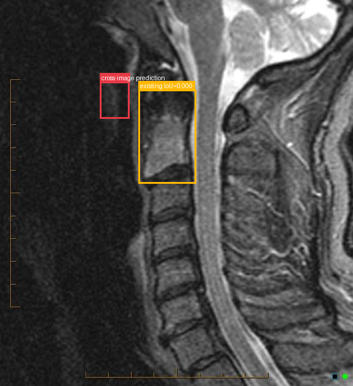</td><td></td></tr>
</table>

- **Target：** `study_000_mri_image_002_sagittal_stir`; MRI; Sagittal STIR
- **Relation：** `bbox_to_image` / `partial_support`
- **Returned target bbox：** `[284, 212, 368, 308]`
- **Maximum IoU：** 0.000; threshold=0.5
- **Strong relation IDs：** `[]`

**IoU matching：**

| Existing target bbox | IoU | Strong match | Lingshu caption |
|---|---:|---|---|
| `study_000_mri_image_002_sagittal_stir_f01`; `[384, 224, 566, 485]` | 0.000 | no | The sagittal STIR MRI image shows a hyperintense signal in the region of the cervical spine, specifically at the C2-C3 level. The hyperintensity suggests the presence of edema or inflammation. The vertebral bodies appear intact without any obvious fractures or dislocations. The intervertebral discs show normal height and signal intensity. There is no evidence of spinal cord compression or significant stenosis. Surrounding soft tissues do not exhibit any abnormal signal changes. |

**Target Lingshu caption：** unavailable. This is a newly re-grounded bbox and has not passed through Step 2 Lingshu captioning.

#### location_00015: STRONG SUPPORT

<table>
<tr><th>Anchor original bbox</th><th>Cross-image grounded target bbox</th><th>Existing target bbox: study_001_nuclear_medicine_image_000_oblique_f01</th></tr>
<tr><td></td><td>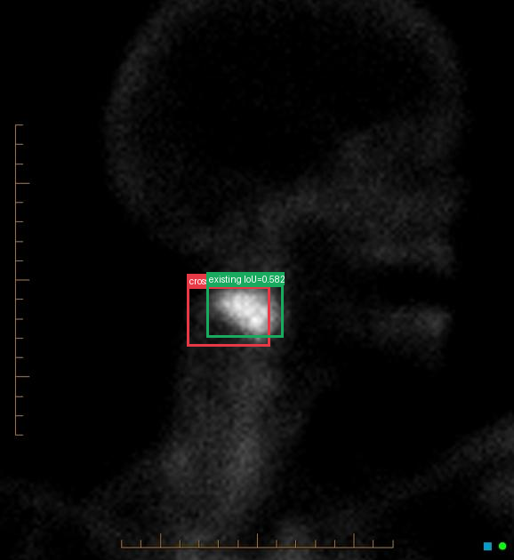</td><td></td></tr>
</table>

- **Target：** `study_001_nuclear_medicine_image_000_oblique`; Nuclear medicine; oblique
- **Relation：** `bbox_to_bbox` / `strong_support`
- **Returned target bbox：** `[364, 512, 526, 620]`
- **Maximum IoU：** 0.582; threshold=0.5
- **Strong relation IDs：** `[&#x27;strong_location_00015_01&#x27;]`

**IoU matching：**

| Existing target bbox | IoU | Strong match | Lingshu caption |
|---|---:|---|---|
| `study_001_nuclear_medicine_image_000_oblique_f01`; `[394, 500, 562, 612]` | 0.582 | yes | The image shows a focal area of increased radiotracer uptake in the right parotid gland region. The uptake appears to be localized and distinct from the surrounding tissue. The rest of the image does not show any other significant areas of abnormal radiotracer distribution. |

#### location_00016: NOT SUPPORT

<table>
<tr><th>Anchor original bbox</th><th>Target original image; model returned null</th><th>Existing target bbox: study_001_nuclear_medicine_image_001_posterior_view_f01</th></tr>
<tr><td></td><td></td><td></td></tr>
</table>

- **Target：** `study_001_nuclear_medicine_image_001_posterior_view`; Nuclear medicine; posterior view
- **Relation：** `bbox_to_image` / `not_support`
- **Returned target bbox：** `unknown`
- **Maximum IoU：** n/a; threshold=0.5
- **Strong relation IDs：** `[]`

**IoU matching：**

| Existing target bbox | IoU | Strong match | Lingshu caption |
|---|---:|---|---|
| `study_001_nuclear_medicine_image_001_posterior_view_f01`; `[488, 400, 534, 452]` | n/a | n/a | The image shows a nuclear medicine scan with a focus on the skeletal system. The boxed region highlights an area in the lower abdomen/pelvic region. Within this region, there is a notable concentration of radiotracer uptake, which appears as a bright spot. This increased uptake suggests a potential abnormality in the bone structure or metabolic activity in that specific area. The rest of the skeletal system, including the spine, ribs, and limbs, appears to have normal distribution of the radiotracer without any other significant areas of increased uptake. |

#### location_00017: NOT SUPPORT

<table>
<tr><th>Anchor original bbox</th><th>Target original image; model returned null</th></tr>
<tr><td></td><td></td></tr>
</table>

- **Target：** `study_002_ct_image_000_coronal_bone_window`; CT; Coronal bone window
- **Relation：** `bbox_to_image` / `not_support`
- **Returned target bbox：** `unknown`
- **Maximum IoU：** n/a; threshold=0.5
- **Strong relation IDs：** `[]`

**IoU matching：**

The target image has no existing Step 2 bbox.

#### location_00018: NOT SUPPORT

<table>
<tr><th>Anchor original bbox</th><th>Target original image; model returned null</th><th>Existing target bbox: study_002_ct_image_001_axial_bone_window_f01</th></tr>
<tr><td></td><td></td><td></td></tr>
</table>

- **Target：** `study_002_ct_image_001_axial_bone_window`; CT; Axial bone window
- **Relation：** `bbox_to_image` / `not_support`
- **Returned target bbox：** `unknown`
- **Maximum IoU：** n/a; threshold=0.5
- **Strong relation IDs：** `[]`

**IoU matching：**

| Existing target bbox | IoU | Strong match | Lingshu caption |
|---|---:|---|---|
| `study_002_ct_image_001_axial_bone_window_f01`; `[139, 282, 837, 562]` | n/a | n/a | The axial bone window CT image shows a cross-sectional view of the vertebral body. The boxed region highlights an area of interest on the vertebral body. Within this region, there appears to be a subtle irregularity in the cortical bone, which could suggest a potential lesion or abnormality. The surrounding bone structure seems intact without obvious signs of fracture or significant deformity. The density variations within the boxed area might indicate changes in bone composition or integrity. |

### Anchor 4: `study_000_mri_image_002_sagittal_stir_f01`

**Anchor Lingshu caption：** The sagittal STIR MRI image shows a hyperintense signal in the region of the cervical spine, specifically at the C2-C3 level. The hyperintensity suggests the presence of edema or inflammation. The vertebral bodies appear intact without any obvious fractures or dislocations. The intervertebral discs show normal height and signal intensity. There is no evidence of spinal cord compression or significant stenosis. Surrounding soft tissues do not exhibit any abnormal signal changes.

#### location_00019: PARTIAL SUPPORT

<table>
<tr><th>Anchor original bbox</th><th>Cross-image grounded target bbox</th><th>Existing target bbox: study_001_nuclear_medicine_image_000_oblique_f01</th></tr>
<tr><td></td><td>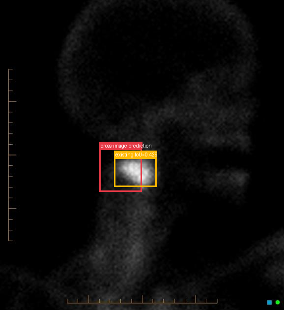</td><td></td></tr>
</table>

- **Target：** `study_001_nuclear_medicine_image_000_oblique`; Nuclear medicine; oblique
- **Relation：** `bbox_to_image` / `partial_support`
- **Returned target bbox：** `[350, 480, 500, 620]`
- **Maximum IoU：** 0.429; threshold=0.5
- **Strong relation IDs：** `[]`

**IoU matching：**

| Existing target bbox | IoU | Strong match | Lingshu caption |
|---|---:|---|---|
| `study_001_nuclear_medicine_image_000_oblique_f01`; `[394, 500, 562, 612]` | 0.429 | no | The image shows a focal area of increased radiotracer uptake in the right parotid gland region. The uptake appears to be localized and distinct from the surrounding tissue. The rest of the image does not show any other significant areas of abnormal radiotracer distribution. |

**Target Lingshu caption：** unavailable. This is a newly re-grounded bbox and has not passed through Step 2 Lingshu captioning.

#### location_00020: NOT SUPPORT

<table>
<tr><th>Anchor original bbox</th><th>Target original image; model returned null</th><th>Existing target bbox: study_001_nuclear_medicine_image_001_posterior_view_f01</th></tr>
<tr><td></td><td></td><td></td></tr>
</table>

- **Target：** `study_001_nuclear_medicine_image_001_posterior_view`; Nuclear medicine; posterior view
- **Relation：** `bbox_to_image` / `not_support`
- **Returned target bbox：** `unknown`
- **Maximum IoU：** n/a; threshold=0.5
- **Strong relation IDs：** `[]`

**IoU matching：**

| Existing target bbox | IoU | Strong match | Lingshu caption |
|---|---:|---|---|
| `study_001_nuclear_medicine_image_001_posterior_view_f01`; `[488, 400, 534, 452]` | n/a | n/a | The image shows a nuclear medicine scan with a focus on the skeletal system. The boxed region highlights an area in the lower abdomen/pelvic region. Within this region, there is a notable concentration of radiotracer uptake, which appears as a bright spot. This increased uptake suggests a potential abnormality in the bone structure or metabolic activity in that specific area. The rest of the skeletal system, including the spine, ribs, and limbs, appears to have normal distribution of the radiotracer without any other significant areas of increased uptake. |

#### location_00021: NOT SUPPORT

<table>
<tr><th>Anchor original bbox</th><th>Target original image; model returned null</th></tr>
<tr><td></td><td></td></tr>
</table>

- **Target：** `study_002_ct_image_000_coronal_bone_window`; CT; Coronal bone window
- **Relation：** `bbox_to_image` / `not_support`
- **Returned target bbox：** `unknown`
- **Maximum IoU：** n/a; threshold=0.5
- **Strong relation IDs：** `[]`

**IoU matching：**

The target image has no existing Step 2 bbox.

#### location_00022: NOT SUPPORT

<table>
<tr><th>Anchor original bbox</th><th>Target original image; model returned null</th><th>Existing target bbox: study_002_ct_image_001_axial_bone_window_f01</th></tr>
<tr><td></td><td></td><td></td></tr>
</table>

- **Target：** `study_002_ct_image_001_axial_bone_window`; CT; Axial bone window
- **Relation：** `bbox_to_image` / `not_support`
- **Returned target bbox：** `unknown`
- **Maximum IoU：** n/a; threshold=0.5
- **Strong relation IDs：** `[]`

**IoU matching：**

| Existing target bbox | IoU | Strong match | Lingshu caption |
|---|---:|---|---|
| `study_002_ct_image_001_axial_bone_window_f01`; `[139, 282, 837, 562]` | n/a | n/a | The axial bone window CT image shows a cross-sectional view of the vertebral body. The boxed region highlights an area of interest on the vertebral body. Within this region, there appears to be a subtle irregularity in the cortical bone, which could suggest a potential lesion or abnormality. The surrounding bone structure seems intact without obvious signs of fracture or significant deformity. The density variations within the boxed area might indicate changes in bone composition or integrity. |

### Anchor 5: `study_001_nuclear_medicine_image_001_posterior_view_f01`

**Anchor Lingshu caption：** The image shows a nuclear medicine scan with a focus on the skeletal system. The boxed region highlights an area in the lower abdomen/pelvic region. Within this region, there is a notable concentration of radiotracer uptake, which appears as a bright spot. This increased uptake suggests a potential abnormality in the bone structure or metabolic activity in that specific area. The rest of the skeletal system, including the spine, ribs, and limbs, appears to have normal distribution of the radiotracer without any other significant areas of increased uptake.

#### location_00026: NOT SUPPORT

<table>
<tr><th>Anchor original bbox</th><th>Target original image; model returned null</th></tr>
<tr><td></td><td></td></tr>
</table>

- **Target：** `study_002_ct_image_000_coronal_bone_window`; CT; Coronal bone window
- **Relation：** `bbox_to_image` / `not_support`
- **Returned target bbox：** `unknown`
- **Maximum IoU：** n/a; threshold=0.5
- **Strong relation IDs：** `[]`

**IoU matching：**

The target image has no existing Step 2 bbox.

#### location_00027: STRONG SUPPORT

<table>
<tr><th>Anchor original bbox</th><th>Cross-image grounded target bbox</th><th>Existing target bbox: study_002_ct_image_001_axial_bone_window_f01</th></tr>
<tr><td></td><td>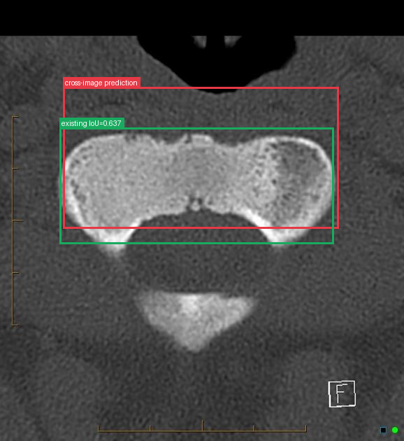</td><td></td></tr>
</table>

- **Target：** `study_002_ct_image_001_axial_bone_window`; CT; Axial bone window
- **Relation：** `bbox_to_bbox` / `strong_support`
- **Returned target bbox：** `[156, 198, 840, 520]`
- **Maximum IoU：** 0.637; threshold=0.5
- **Strong relation IDs：** `[&#x27;strong_location_00027_01&#x27;]`

**IoU matching：**

| Existing target bbox | IoU | Strong match | Lingshu caption |
|---|---:|---|---|
| `study_002_ct_image_001_axial_bone_window_f01`; `[139, 282, 837, 562]` | 0.637 | yes | The axial bone window CT image shows a cross-sectional view of the vertebral body. The boxed region highlights an area of interest on the vertebral body. Within this region, there appears to be a subtle irregularity in the cortical bone, which could suggest a potential lesion or abnormality. The surrounding bone structure seems intact without obvious signs of fracture or significant deformity. The density variations within the boxed area might indicate changes in bone composition or integrity. |

## Dynamically Skipped Anchors

| Anchor node | Reused strong relations | Skipped target images |
|---|---|---|
| `study_001_nuclear_medicine_image_000_oblique_f01` | `[&#x27;strong_location_00009_01&#x27;, &#x27;strong_location_00015_01&#x27;]` | `[&#x27;study_001_nuclear_medicine_image_001_posterior_view&#x27;, &#x27;study_002_ct_image_000_coronal_bone_window&#x27;, &#x27;study_002_ct_image_001_axial_bone_window&#x27;]` |
