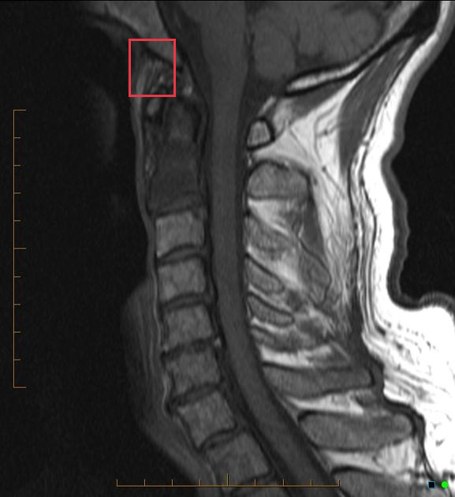
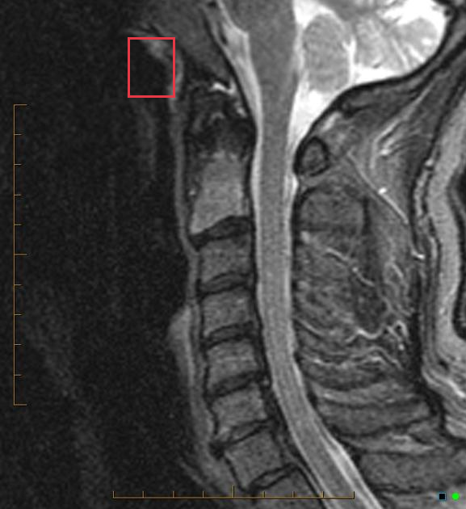
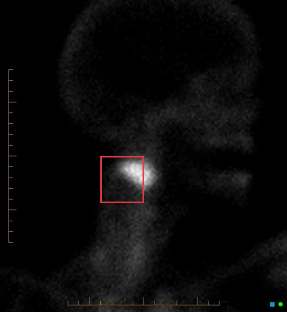
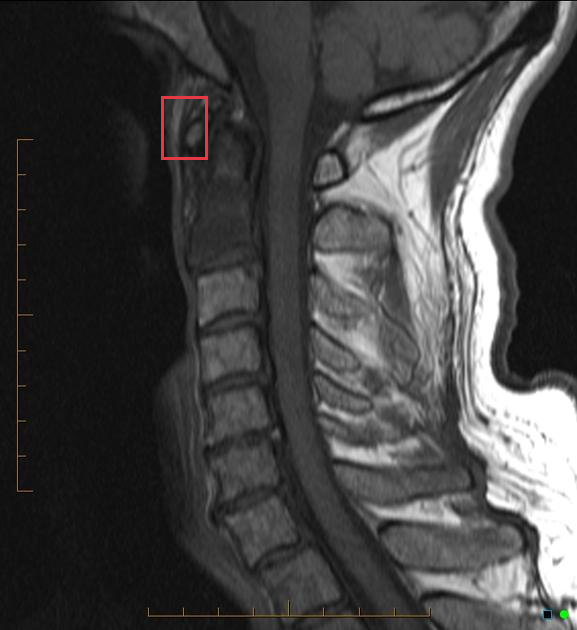
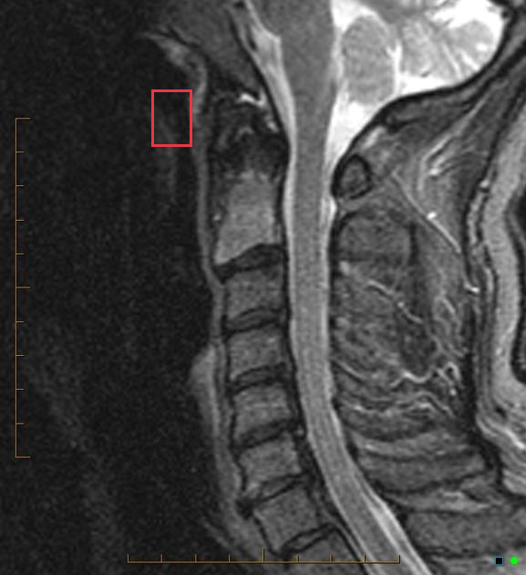
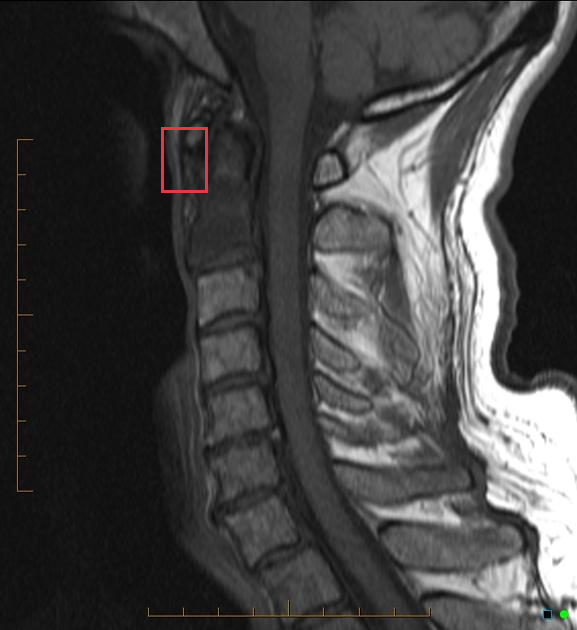
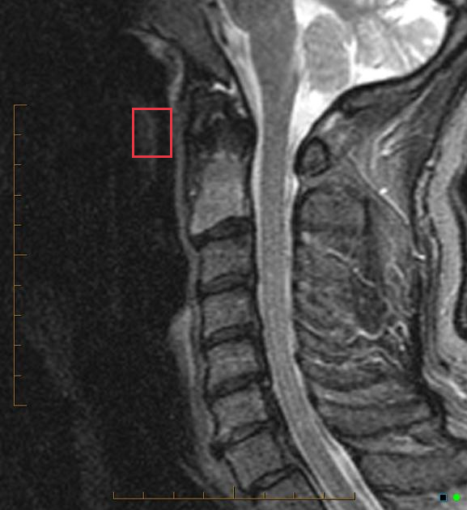
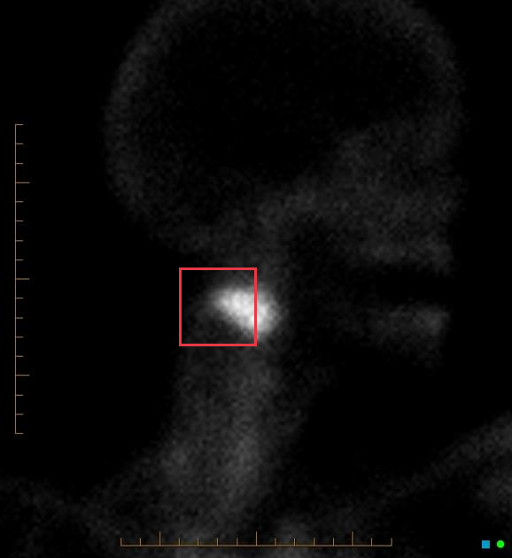

# Sclerotic metastases from carcinoma of the prostate

[返回 Step 3 总览](../README_STEP3_VISUALIZATION.md)

- **Case ID：** `sclerotic-metastases-from-carcinoma-of-the-prostate`
- **Case URL：** [https://radiopaedia.org/cases/sclerotic-metastases-from-carcinoma-of-the-prostate?lang=us](https://radiopaedia.org/cases/sclerotic-metastases-from-carcinoma-of-the-prostate?lang=us)
- **验证模型：** Qwen3-VL-8B
- **图像 / Step 2 findings：** 7 / 7
- **定位结果：** strong 3；partial 8；not support 13；parse error 0
- **Strong bbox relations：** 3
- **原始 JSON：** [case_evidence.json](../assets_step3/sclerotic-metastases-from-carcinoma-of-the-prostate/case_evidence.json)
- **定量/定性验证 JSON：** [step_3_validation_case_evidence.json](../assets_step3/sclerotic-metastases-from-carcinoma-of-the-prostate/step_3_validation_case_evidence.json)

**Overlay 图例：** 红框为跨图新定位；绿框为 IoU >= 0.5 的已有 bbox；黄框为未达到阈值的已有 bbox。

## Step 2 Finding Nodes

### Finding 1: `study_000_mri_image_000_sagittal_t2_f01`

- **Modality / subcategory：** MRI / Sagittal T2
- **bbox_2d：** `[312, 114, 395, 212]`
- **Lingshu caption：** The sagittal T2 weighted MRI shows a hyperintense signal at the level of C1-C2. The spinal cord appears to be compressed at this level. There is also a slight kyphotic deformity at the same level.
- **中文翻译：** 矢状位 T2 加权 MRI 显示 C1-C2 水平高信号，脊髓在该水平似受压，并伴轻度后凸畸形。

### Finding 2: `study_000_mri_image_000_sagittal_t2_f02`

- **Modality / subcategory：** MRI / Sagittal T2
- **bbox_2d：** `[312, 184, 395, 272]`
- **Lingshu caption：** The sagittal T2 weighted MRI shows a hyperintense signal at the C1-C2 level. This could represent edema or inflammation. The spinal cord appears to be intact without any obvious signs of compression or displacement. The vertebral bodies and intervertebral discs appear normal. There is no evidence of fractures or dislocations.
- **中文翻译：** 矢状位 T2 加权 MRI 显示 C1-C2 水平高信号，可能代表水肿或炎症。脊髓看似完整，未见明显受压或移位。椎体和椎间盘表现正常，未见骨折或脱位。

### Finding 3: `study_000_mri_image_000_sagittal_t2_f03`

- **Modality / subcategory：** MRI / Sagittal T2
- **bbox_2d：** `[312, 252, 395, 340]`
- **Lingshu caption：** The spinal cord appears to be compressed at the level of C3-C4. The vertebral bodies appear to be intact without any obvious fractures or dislocations. There is no evidence of disc herniation or other abnormalities in the intervertebral discs. The surrounding soft tissues appear to be normal.
- **中文翻译：** 脊髓在 C3-C4 水平似受压。椎体完整，未见明显骨折或脱位。椎间盘未见突出或其他异常。周围软组织表现正常。

### Finding 4: `study_000_mri_image_002_sagittal_stir_f01`

- **Modality / subcategory：** MRI / Sagittal STIR
- **bbox_2d：** `[384, 224, 566, 485]`
- **Lingshu caption：** The sagittal STIR MRI image shows a hyperintense signal in the region of the cervical spine, specifically at the C2-C3 level. The hyperintensity suggests the presence of edema or inflammation. The vertebral bodies appear intact without any obvious fractures or dislocations. The intervertebral discs show normal height and signal intensity. There is no evidence of spinal cord compression or significant stenosis. Surrounding soft tissues do not exhibit any abnormal signal changes.
- **中文翻译：** 矢状位 STIR MRI 显示颈椎 C2-C3 水平高信号，提示可能存在水肿或炎症。椎体完整，未见明显骨折或脱位。椎间盘高度和信号正常。未见脊髓受压或明显狭窄。周围软组织未见异常信号。

### Finding 5: `study_001_nuclear_medicine_image_000_oblique_f01`

- **Modality / subcategory：** Nuclear medicine / oblique
- **bbox_2d：** `[394, 500, 562, 612]`
- **Lingshu caption：** The image shows a focal area of increased radiotracer uptake in the right parotid gland region. The uptake appears to be localized and distinct from the surrounding tissue. The rest of the image does not show any other significant areas of abnormal radiotracer distribution.
- **中文翻译：** 右侧腮腺区域可见局灶性放射性示踪剂摄取增高，与周围组织界限清楚。图像其余区域未见其他明显异常示踪剂分布。

### Finding 6: `study_001_nuclear_medicine_image_001_posterior_view_f01`

- **Modality / subcategory：** Nuclear medicine / posterior view
- **bbox_2d：** `[488, 400, 534, 452]`
- **Lingshu caption：** The image shows a nuclear medicine scan with a focus on the skeletal system. The boxed region highlights an area in the lower abdomen/pelvic region. Within this region, there is a notable concentration of radiotracer uptake, which appears as a bright spot. This increased uptake suggests a potential abnormality in the bone structure or metabolic activity in that specific area. The rest of the skeletal system, including the spine, ribs, and limbs, appears to have normal distribution of the radiotracer without any other significant areas of increased uptake.
- **中文翻译：** 图像为以骨骼系统为重点的核医学扫描。框内位于下腹部或盆腔，可见明显放射性示踪剂浓聚，表现为亮点。该摄取增高提示该处骨结构或代谢活动可能异常。脊柱、肋骨及四肢等其余骨骼的示踪剂分布正常，未见其他明显摄取增高区。

### Finding 7: `study_002_ct_image_001_axial_bone_window_f01`

- **Modality / subcategory：** CT / Axial bone window
- **bbox_2d：** `[139, 282, 837, 562]`
- **Lingshu caption：** The axial bone window CT image shows a cross-sectional view of the vertebral body. The boxed region highlights an area of interest on the vertebral body. Within this region, there appears to be a subtle irregularity in the cortical bone, which could suggest a potential lesion or abnormality. The surrounding bone structure seems intact without obvious signs of fracture or significant deformity. The density variations within the boxed area might indicate changes in bone composition or integrity.
- **中文翻译：** 轴位骨窗 CT 显示椎体横断面。框内椎体皮质骨似有细微不规则，可能提示潜在病灶或异常。周围骨结构完整，未见明显骨折或显著畸形。框内密度差异可能反映骨成分或完整性改变。

## Directed Cross-image Validation

### Anchor 1: `study_000_mri_image_000_sagittal_t2_f01`

**Anchor Lingshu caption：** The sagittal T2 weighted MRI shows a hyperintense signal at the level of C1-C2. The spinal cord appears to be compressed at this level. There is also a slight kyphotic deformity at the same level.
**Anchor caption 中文翻译：** 矢状位 T2 加权 MRI 显示 C1-C2 水平高信号，脊髓在该水平似受压，并伴轻度后凸畸形。

#### location_00001: PARTIAL SUPPORT

<table>
<tr><th>Anchor original bbox</th><th>Cross-image grounded target bbox</th></tr>
<tr><td></td><td></td></tr>
</table>

- **Target：** `study_000_mri_image_001_sagittal_t1`; MRI; Sagittal T1
- **Relation：** `bbox_to_image` / `partial_support`
- **Returned target bbox：** `[284, 79, 386, 194]`
- **Maximum IoU：** n/a; threshold=0.5
- **Strong relation IDs：** `[]`

**IoU matching：**

The target image has no existing Step 2 bbox.

**B 图单红框（Lingshu 实际输入）：**

**Re-ground Lingshu caption：** The sagittal T1 MRI shows the cervical spine with vertebral bodies and intervertebral discs. The red box highlights the C2-C3 level. Within this region, there appears to be a slight irregularity in the alignment of the vertebrae, possibly indicating a mild subluxation or misalignment. The surrounding soft tissues and spinal cord appear normal without any obvious signs of compression or abnormal signal intensity. The vertebral bodies above and below the highlighted area maintain their normal height and shape, and the intervertebral disc spaces are preserved. No significant degenerative changes or fractures are noted in the visible portion of the cervical spine.
**Re-ground caption 中文翻译：** 矢状位 T1 MRI 显示颈椎椎体和椎间盘。红框标出 C2-C3 水平，其中椎体排列似有轻微不规则，可能提示轻度半脱位或对位不良。周围软组织和脊髓正常，未见明显受压或异常信号。框上、下方椎体高度及形态正常，椎间隙保存。所见颈椎未见明显退变或骨折。

**Quantitative / qualitative validation：**

| Validation pair | Quantitative size / 定量 | Qualitative caption / 定性 |
|---|---|---|
| `partial__location_00001` | `inconsistent` | `inconsistent` |

#### location_00002: PARTIAL SUPPORT

<table>
<tr><th>Anchor original bbox</th><th>Cross-image grounded target bbox</th><th>Existing target bbox: study_000_mri_image_002_sagittal_stir_f01</th></tr>
<tr><td></td><td></td><td></td></tr>
</table>

- **Target：** `study_000_mri_image_002_sagittal_stir`; MRI; Sagittal STIR
- **Relation：** `bbox_to_image` / `partial_support`
- **Returned target bbox：** `[274, 74, 375, 192]`
- **Maximum IoU：** 0.000; threshold=0.5
- **Strong relation IDs：** `[]`

**IoU matching：**

| Existing target bbox | IoU | Strong match | Lingshu caption | 中文翻译 |
|---|---:|---|---|---|
| `study_000_mri_image_002_sagittal_stir_f01`; `[384, 224, 566, 485]` | 0.000 | no | The sagittal STIR MRI image shows a hyperintense signal in the region of the cervical spine, specifically at the C2-C3 level. The hyperintensity suggests the presence of edema or inflammation. The vertebral bodies appear intact without any obvious fractures or dislocations. The intervertebral discs show normal height and signal intensity. There is no evidence of spinal cord compression or significant stenosis. Surrounding soft tissues do not exhibit any abnormal signal changes. | 矢状位 STIR MRI 显示颈椎 C2-C3 水平高信号，提示可能存在水肿或炎症。椎体完整，未见明显骨折或脱位。椎间盘高度和信号正常。未见脊髓受压或明显狭窄。周围软组织未见异常信号。 |

**B 图单红框（Lingshu 实际输入）：**

**Re-ground Lingshu caption：** The sagittal STIR MRI shows a hyperintense signal at the C1-C2 level, which could indicate edema or inflammation. The spinal cord appears to be intact without any obvious signs of compression or displacement. The vertebral bodies and intervertebral discs at this level do not show significant degenerative changes. There is no evidence of acute fracture or dislocation in the cervical spine. The surrounding soft tissues appear normal without any abnormal masses or lesions.
**Re-ground caption 中文翻译：** 矢状位 STIR MRI 显示 C1-C2 水平高信号，可能提示水肿或炎症。脊髓完整，未见明显受压或移位。该水平椎体和椎间盘未见明显退变。颈椎未见急性骨折或脱位，周围软组织正常，未见异常肿块或病灶。

**Quantitative / qualitative validation：**

| Validation pair | Quantitative size / 定量 | Qualitative caption / 定性 |
|---|---|---|
| `partial__location_00002` | `consistent` | `inconsistent` |

#### location_00003: PARTIAL SUPPORT

<table>
<tr><th>Anchor original bbox</th><th>Cross-image grounded target bbox</th><th>Existing target bbox: study_001_nuclear_medicine_image_000_oblique_f01</th></tr>
<tr><td></td><td></td><td></td></tr>
</table>

- **Target：** `study_001_nuclear_medicine_image_000_oblique`; Nuclear medicine; oblique
- **Relation：** `bbox_to_image` / `partial_support`
- **Returned target bbox：** `[350, 500, 500, 650]`
- **Maximum IoU：** 0.408; threshold=0.5
- **Strong relation IDs：** `[]`

**IoU matching：**

| Existing target bbox | IoU | Strong match | Lingshu caption | 中文翻译 |
|---|---:|---|---|---|
| `study_001_nuclear_medicine_image_000_oblique_f01`; `[394, 500, 562, 612]` | 0.408 | no | The image shows a focal area of increased radiotracer uptake in the right parotid gland region. The uptake appears to be localized and distinct from the surrounding tissue. The rest of the image does not show any other significant areas of abnormal radiotracer distribution. | 右侧腮腺区域可见局灶性放射性示踪剂摄取增高，与周围组织界限清楚。图像其余区域未见其他明显异常示踪剂分布。 |

**B 图单红框（Lingshu 实际输入）：**

**Re-ground Lingshu caption：** There is focal increased radiotracer uptake in the right inferior neck.
**Re-ground caption 中文翻译：** 右侧下颈部可见局灶性放射性示踪剂摄取增高。

**Quantitative / qualitative validation：**

| Validation pair | Quantitative size / 定量 | Qualitative caption / 定性 |
|---|---|---|
| `partial__location_00003` | `consistent` | `consistent` |

#### location_00004: NOT SUPPORT

<table>
<tr><th>Anchor original bbox</th><th>Target original image; model returned null</th><th>Existing target bbox: study_001_nuclear_medicine_image_001_posterior_view_f01</th></tr>
<tr><td></td><td></td><td></td></tr>
</table>

- **Target：** `study_001_nuclear_medicine_image_001_posterior_view`; Nuclear medicine; posterior view
- **Relation：** `bbox_to_image` / `not_support`
- **Returned target bbox：** `unknown`
- **Maximum IoU：** n/a; threshold=0.5
- **Strong relation IDs：** `[]`

**IoU matching：**

| Existing target bbox | IoU | Strong match | Lingshu caption | 中文翻译 |
|---|---:|---|---|---|
| `study_001_nuclear_medicine_image_001_posterior_view_f01`; `[488, 400, 534, 452]` | n/a | n/a | The image shows a nuclear medicine scan with a focus on the skeletal system. The boxed region highlights an area in the lower abdomen/pelvic region. Within this region, there is a notable concentration of radiotracer uptake, which appears as a bright spot. This increased uptake suggests a potential abnormality in the bone structure or metabolic activity in that specific area. The rest of the skeletal system, including the spine, ribs, and limbs, appears to have normal distribution of the radiotracer without any other significant areas of increased uptake. | 图像为以骨骼系统为重点的核医学扫描。框内位于下腹部或盆腔，可见明显放射性示踪剂浓聚，表现为亮点。该摄取增高提示该处骨结构或代谢活动可能异常。脊柱、肋骨及四肢等其余骨骼的示踪剂分布正常，未见其他明显摄取增高区。 |

#### location_00005: NOT SUPPORT

<table>
<tr><th>Anchor original bbox</th><th>Target original image; model returned null</th></tr>
<tr><td></td><td></td></tr>
</table>

- **Target：** `study_002_ct_image_000_coronal_bone_window`; CT; Coronal bone window
- **Relation：** `bbox_to_image` / `not_support`
- **Returned target bbox：** `unknown`
- **Maximum IoU：** n/a; threshold=0.5
- **Strong relation IDs：** `[]`

**IoU matching：**

The target image has no existing Step 2 bbox.

#### location_00006: NOT SUPPORT

<table>
<tr><th>Anchor original bbox</th><th>Target original image; model returned null</th><th>Existing target bbox: study_002_ct_image_001_axial_bone_window_f01</th></tr>
<tr><td></td><td></td><td></td></tr>
</table>

- **Target：** `study_002_ct_image_001_axial_bone_window`; CT; Axial bone window
- **Relation：** `bbox_to_image` / `not_support`
- **Returned target bbox：** `unknown`
- **Maximum IoU：** n/a; threshold=0.5
- **Strong relation IDs：** `[]`

**IoU matching：**

| Existing target bbox | IoU | Strong match | Lingshu caption | 中文翻译 |
|---|---:|---|---|---|
| `study_002_ct_image_001_axial_bone_window_f01`; `[139, 282, 837, 562]` | n/a | n/a | The axial bone window CT image shows a cross-sectional view of the vertebral body. The boxed region highlights an area of interest on the vertebral body. Within this region, there appears to be a subtle irregularity in the cortical bone, which could suggest a potential lesion or abnormality. The surrounding bone structure seems intact without obvious signs of fracture or significant deformity. The density variations within the boxed area might indicate changes in bone composition or integrity. | 轴位骨窗 CT 显示椎体横断面。框内椎体皮质骨似有细微不规则，可能提示潜在病灶或异常。周围骨结构完整，未见明显骨折或显著畸形。框内密度差异可能反映骨成分或完整性改变。 |

### Anchor 2: `study_000_mri_image_000_sagittal_t2_f02`

**Anchor Lingshu caption：** The sagittal T2 weighted MRI shows a hyperintense signal at the C1-C2 level. This could represent edema or inflammation. The spinal cord appears to be intact without any obvious signs of compression or displacement. The vertebral bodies and intervertebral discs appear normal. There is no evidence of fractures or dislocations.
**Anchor caption 中文翻译：** 矢状位 T2 加权 MRI 显示 C1-C2 水平高信号，可能代表水肿或炎症。脊髓看似完整，未见明显受压或移位。椎体和椎间盘表现正常，未见骨折或脱位。

#### location_00007: PARTIAL SUPPORT

<table>
<tr><th>Anchor original bbox</th><th>Cross-image grounded target bbox</th></tr>
<tr><td></td><td></td></tr>
</table>

- **Target：** `study_000_mri_image_001_sagittal_t1`; MRI; Sagittal T1
- **Relation：** `bbox_to_image` / `partial_support`
- **Returned target bbox：** `[280, 153, 360, 253]`
- **Maximum IoU：** n/a; threshold=0.5
- **Strong relation IDs：** `[]`

**IoU matching：**

The target image has no existing Step 2 bbox.

**B 图单红框（Lingshu 实际输入）：**

**Re-ground Lingshu caption：** The image shows a sagittal view of the cervical spine. The vertebral bodies appear to be aligned normally. There is no evidence of disc herniation or spinal stenosis. The intervertebral discs appear to be of normal height and signal intensity. The spinal cord appears to be of normal caliber and signal intensity. The prevertebral soft tissues appear to be unremarkable. The red box highlights a region of interest, but there are no obvious abnormalities within this area.
**Re-ground caption 中文翻译：** 图像为颈椎矢状位。椎体排列正常，未见椎间盘突出或椎管狭窄。椎间盘高度和信号正常。脊髓粗细及信号正常。椎前软组织未见异常。红框标出关注区域，但框内未见明显异常。

**Quantitative / qualitative validation：**

| Validation pair | Quantitative size / 定量 | Qualitative caption / 定性 |
|---|---|---|
| `partial__location_00007` | `consistent` | `consistent` |

#### location_00008: PARTIAL SUPPORT

<table>
<tr><th>Anchor original bbox</th><th>Cross-image grounded target bbox</th><th>Existing target bbox: study_000_mri_image_002_sagittal_stir_f01</th></tr>
<tr><td></td><td></td><td></td></tr>
</table>

- **Target：** `study_000_mri_image_002_sagittal_stir`; MRI; Sagittal STIR
- **Relation：** `bbox_to_image` / `partial_support`
- **Returned target bbox：** `[288, 156, 365, 254]`
- **Maximum IoU：** 0.000; threshold=0.5
- **Strong relation IDs：** `[]`

**IoU matching：**

| Existing target bbox | IoU | Strong match | Lingshu caption | 中文翻译 |
|---|---:|---|---|---|
| `study_000_mri_image_002_sagittal_stir_f01`; `[384, 224, 566, 485]` | 0.000 | no | The sagittal STIR MRI image shows a hyperintense signal in the region of the cervical spine, specifically at the C2-C3 level. The hyperintensity suggests the presence of edema or inflammation. The vertebral bodies appear intact without any obvious fractures or dislocations. The intervertebral discs show normal height and signal intensity. There is no evidence of spinal cord compression or significant stenosis. Surrounding soft tissues do not exhibit any abnormal signal changes. | 矢状位 STIR MRI 显示颈椎 C2-C3 水平高信号，提示可能存在水肿或炎症。椎体完整，未见明显骨折或脱位。椎间盘高度和信号正常。未见脊髓受压或明显狭窄。周围软组织未见异常信号。 |

**B 图单红框（Lingshu 实际输入）：**

**Re-ground Lingshu caption：** The image shows a sagittal view of the cervical spine. The vertebral bodies and intervertebral discs are visible. There is a red box highlighting a specific area in the upper cervical region. Within this box, there appears to be a region of altered signal intensity, which could indicate a potential abnormality such as edema, inflammation, or other pathological changes. The surrounding soft tissues and spinal cord also appear to be within normal limits, without any obvious signs of compression or displacement.
**Re-ground caption 中文翻译：** 图像为颈椎矢状位，可见椎体及椎间盘。红框标出上颈椎特定区域，框内似有信号改变，可能提示水肿、炎症或其他病理改变。周围软组织及脊髓也似在正常范围内，未见明显受压或移位。

**Quantitative / qualitative validation：**

| Validation pair | Quantitative size / 定量 | Qualitative caption / 定性 |
|---|---|---|
| `partial__location_00008` | `consistent` | `consistent` |

#### location_00009: STRONG SUPPORT

<table>
<tr><th>Anchor original bbox</th><th>Cross-image grounded target bbox</th><th>Existing target bbox: study_001_nuclear_medicine_image_000_oblique_f01</th></tr>
<tr><td></td><td></td><td></td></tr>
</table>

- **Target：** `study_001_nuclear_medicine_image_000_oblique`; Nuclear medicine; oblique
- **Relation：** `bbox_to_bbox` / `strong_support`
- **Returned target bbox：** `[380, 512, 520, 620]`
- **Maximum IoU：** 0.597; threshold=0.5
- **Strong relation IDs：** `[&#x27;strong_location_00009_01&#x27;]`

**IoU matching：**

| Existing target bbox | IoU | Strong match | Lingshu caption | 中文翻译 |
|---|---:|---|---|---|
| `study_001_nuclear_medicine_image_000_oblique_f01`; `[394, 500, 562, 612]` | 0.597 | yes | The image shows a focal area of increased radiotracer uptake in the right parotid gland region. The uptake appears to be localized and distinct from the surrounding tissue. The rest of the image does not show any other significant areas of abnormal radiotracer distribution. | 右侧腮腺区域可见局灶性放射性示踪剂摄取增高，与周围组织界限清楚。图像其余区域未见其他明显异常示踪剂分布。 |

**Quantitative / qualitative validation：**

| Validation pair | Quantitative size / 定量 | Qualitative caption / 定性 |
|---|---|---|
| `strong__strong_location_00009_01` | `inconsistent` | `inconsistent` |

#### location_00010: NOT SUPPORT

<table>
<tr><th>Anchor original bbox</th><th>Target original image; model returned null</th><th>Existing target bbox: study_001_nuclear_medicine_image_001_posterior_view_f01</th></tr>
<tr><td></td><td></td><td></td></tr>
</table>

- **Target：** `study_001_nuclear_medicine_image_001_posterior_view`; Nuclear medicine; posterior view
- **Relation：** `bbox_to_image` / `not_support`
- **Returned target bbox：** `unknown`
- **Maximum IoU：** n/a; threshold=0.5
- **Strong relation IDs：** `[]`

**IoU matching：**

| Existing target bbox | IoU | Strong match | Lingshu caption | 中文翻译 |
|---|---:|---|---|---|
| `study_001_nuclear_medicine_image_001_posterior_view_f01`; `[488, 400, 534, 452]` | n/a | n/a | The image shows a nuclear medicine scan with a focus on the skeletal system. The boxed region highlights an area in the lower abdomen/pelvic region. Within this region, there is a notable concentration of radiotracer uptake, which appears as a bright spot. This increased uptake suggests a potential abnormality in the bone structure or metabolic activity in that specific area. The rest of the skeletal system, including the spine, ribs, and limbs, appears to have normal distribution of the radiotracer without any other significant areas of increased uptake. | 图像为以骨骼系统为重点的核医学扫描。框内位于下腹部或盆腔，可见明显放射性示踪剂浓聚，表现为亮点。该摄取增高提示该处骨结构或代谢活动可能异常。脊柱、肋骨及四肢等其余骨骼的示踪剂分布正常，未见其他明显摄取增高区。 |

#### location_00011: NOT SUPPORT

<table>
<tr><th>Anchor original bbox</th><th>Target original image; model returned null</th></tr>
<tr><td></td><td></td></tr>
</table>

- **Target：** `study_002_ct_image_000_coronal_bone_window`; CT; Coronal bone window
- **Relation：** `bbox_to_image` / `not_support`
- **Returned target bbox：** `unknown`
- **Maximum IoU：** n/a; threshold=0.5
- **Strong relation IDs：** `[]`

**IoU matching：**

The target image has no existing Step 2 bbox.

#### location_00012: NOT SUPPORT

<table>
<tr><th>Anchor original bbox</th><th>Target original image; model returned null</th><th>Existing target bbox: study_002_ct_image_001_axial_bone_window_f01</th></tr>
<tr><td></td><td></td><td></td></tr>
</table>

- **Target：** `study_002_ct_image_001_axial_bone_window`; CT; Axial bone window
- **Relation：** `bbox_to_image` / `not_support`
- **Returned target bbox：** `unknown`
- **Maximum IoU：** n/a; threshold=0.5
- **Strong relation IDs：** `[]`

**IoU matching：**

| Existing target bbox | IoU | Strong match | Lingshu caption | 中文翻译 |
|---|---:|---|---|---|
| `study_002_ct_image_001_axial_bone_window_f01`; `[139, 282, 837, 562]` | n/a | n/a | The axial bone window CT image shows a cross-sectional view of the vertebral body. The boxed region highlights an area of interest on the vertebral body. Within this region, there appears to be a subtle irregularity in the cortical bone, which could suggest a potential lesion or abnormality. The surrounding bone structure seems intact without obvious signs of fracture or significant deformity. The density variations within the boxed area might indicate changes in bone composition or integrity. | 轴位骨窗 CT 显示椎体横断面。框内椎体皮质骨似有细微不规则，可能提示潜在病灶或异常。周围骨结构完整，未见明显骨折或显著畸形。框内密度差异可能反映骨成分或完整性改变。 |

### Anchor 3: `study_000_mri_image_000_sagittal_t2_f03`

**Anchor Lingshu caption：** The spinal cord appears to be compressed at the level of C3-C4. The vertebral bodies appear to be intact without any obvious fractures or dislocations. There is no evidence of disc herniation or other abnormalities in the intervertebral discs. The surrounding soft tissues appear to be normal.
**Anchor caption 中文翻译：** 脊髓在 C3-C4 水平似受压。椎体完整，未见明显骨折或脱位。椎间盘未见突出或其他异常。周围软组织表现正常。

#### location_00013: PARTIAL SUPPORT

<table>
<tr><th>Anchor original bbox</th><th>Cross-image grounded target bbox</th></tr>
<tr><td></td><td></td></tr>
</table>

- **Target：** `study_000_mri_image_001_sagittal_t1`; MRI; Sagittal T1
- **Relation：** `bbox_to_image` / `partial_support`
- **Returned target bbox：** `[280, 202, 360, 306]`
- **Maximum IoU：** n/a; threshold=0.5
- **Strong relation IDs：** `[]`

**IoU matching：**

The target image has no existing Step 2 bbox.

**B 图单红框（Lingshu 实际输入）：**

**Re-ground Lingshu caption：** The sagittal T1 MRI shows the cervical spine with vertebral bodies and intervertebral discs. The red box highlights a region at the C2-C3 level. Within this area, there appears to be a slight irregularity in the alignment of the vertebrae, possibly indicating a mild subluxation or misalignment. The surrounding soft tissues and spinal cord appear normal without any obvious signs of compression or abnormal signal intensity. The intervertebral disc spaces adjacent to the highlighted region do not show significant degeneration or herniation.
**Re-ground caption 中文翻译：** 矢状位 T1 MRI 显示颈椎椎体和椎间盘。红框标出 C2-C3 水平，该处椎体排列似有轻微不规则，可能提示轻度半脱位或对位不良。周围软组织和脊髓正常，未见明显受压或异常信号。邻近椎间隙未见明显退变或突出。

**Quantitative / qualitative validation：**

| Validation pair | Quantitative size / 定量 | Qualitative caption / 定性 |
|---|---|---|
| `partial__location_00013` | `inconsistent` | `inconsistent` |

#### location_00014: PARTIAL SUPPORT

<table>
<tr><th>Anchor original bbox</th><th>Cross-image grounded target bbox</th><th>Existing target bbox: study_000_mri_image_002_sagittal_stir_f01</th></tr>
<tr><td></td><td></td><td></td></tr>
</table>

- **Target：** `study_000_mri_image_002_sagittal_stir`; MRI; Sagittal STIR
- **Relation：** `bbox_to_image` / `partial_support`
- **Returned target bbox：** `[284, 212, 368, 308]`
- **Maximum IoU：** 0.000; threshold=0.5
- **Strong relation IDs：** `[]`

**IoU matching：**

| Existing target bbox | IoU | Strong match | Lingshu caption | 中文翻译 |
|---|---:|---|---|---|
| `study_000_mri_image_002_sagittal_stir_f01`; `[384, 224, 566, 485]` | 0.000 | no | The sagittal STIR MRI image shows a hyperintense signal in the region of the cervical spine, specifically at the C2-C3 level. The hyperintensity suggests the presence of edema or inflammation. The vertebral bodies appear intact without any obvious fractures or dislocations. The intervertebral discs show normal height and signal intensity. There is no evidence of spinal cord compression or significant stenosis. Surrounding soft tissues do not exhibit any abnormal signal changes. | 矢状位 STIR MRI 显示颈椎 C2-C3 水平高信号，提示可能存在水肿或炎症。椎体完整，未见明显骨折或脱位。椎间盘高度和信号正常。未见脊髓受压或明显狭窄。周围软组织未见异常信号。 |

**B 图单红框（Lingshu 实际输入）：**

**Re-ground Lingshu caption：** The sagittal STIR MRI shows a hyperintense signal at the C2-C3 level, which could indicate edema or inflammation. The spinal cord appears to be intact without any obvious signs of compression or displacement. The vertebral bodies and intervertebral discs at this level do not show significant degenerative changes. There is no evidence of acute fracture or dislocation in the visible cervical spine segments.
**Re-ground caption 中文翻译：** 矢状位 STIR MRI 显示 C2-C3 水平高信号，可能提示水肿或炎症。脊髓完整，未见明显受压或移位。该水平椎体和椎间盘未见明显退变。所见颈椎节段未见急性骨折或脱位。

**Quantitative / qualitative validation：**

| Validation pair | Quantitative size / 定量 | Qualitative caption / 定性 |
|---|---|---|
| `partial__location_00014` | `inconsistent` | `inconsistent` |

#### location_00015: STRONG SUPPORT

<table>
<tr><th>Anchor original bbox</th><th>Cross-image grounded target bbox</th><th>Existing target bbox: study_001_nuclear_medicine_image_000_oblique_f01</th></tr>
<tr><td></td><td></td><td></td></tr>
</table>

- **Target：** `study_001_nuclear_medicine_image_000_oblique`; Nuclear medicine; oblique
- **Relation：** `bbox_to_bbox` / `strong_support`
- **Returned target bbox：** `[364, 512, 526, 620]`
- **Maximum IoU：** 0.582; threshold=0.5
- **Strong relation IDs：** `[&#x27;strong_location_00015_01&#x27;]`

**IoU matching：**

| Existing target bbox | IoU | Strong match | Lingshu caption | 中文翻译 |
|---|---:|---|---|---|
| `study_001_nuclear_medicine_image_000_oblique_f01`; `[394, 500, 562, 612]` | 0.582 | yes | The image shows a focal area of increased radiotracer uptake in the right parotid gland region. The uptake appears to be localized and distinct from the surrounding tissue. The rest of the image does not show any other significant areas of abnormal radiotracer distribution. | 右侧腮腺区域可见局灶性放射性示踪剂摄取增高，与周围组织界限清楚。图像其余区域未见其他明显异常示踪剂分布。 |

**Quantitative / qualitative validation：**

| Validation pair | Quantitative size / 定量 | Qualitative caption / 定性 |
|---|---|---|
| `strong__strong_location_00015_01` | `inconsistent` | `inconsistent` |

#### location_00016: NOT SUPPORT

<table>
<tr><th>Anchor original bbox</th><th>Target original image; model returned null</th><th>Existing target bbox: study_001_nuclear_medicine_image_001_posterior_view_f01</th></tr>
<tr><td></td><td></td><td></td></tr>
</table>

- **Target：** `study_001_nuclear_medicine_image_001_posterior_view`; Nuclear medicine; posterior view
- **Relation：** `bbox_to_image` / `not_support`
- **Returned target bbox：** `unknown`
- **Maximum IoU：** n/a; threshold=0.5
- **Strong relation IDs：** `[]`

**IoU matching：**

| Existing target bbox | IoU | Strong match | Lingshu caption | 中文翻译 |
|---|---:|---|---|---|
| `study_001_nuclear_medicine_image_001_posterior_view_f01`; `[488, 400, 534, 452]` | n/a | n/a | The image shows a nuclear medicine scan with a focus on the skeletal system. The boxed region highlights an area in the lower abdomen/pelvic region. Within this region, there is a notable concentration of radiotracer uptake, which appears as a bright spot. This increased uptake suggests a potential abnormality in the bone structure or metabolic activity in that specific area. The rest of the skeletal system, including the spine, ribs, and limbs, appears to have normal distribution of the radiotracer without any other significant areas of increased uptake. | 图像为以骨骼系统为重点的核医学扫描。框内位于下腹部或盆腔，可见明显放射性示踪剂浓聚，表现为亮点。该摄取增高提示该处骨结构或代谢活动可能异常。脊柱、肋骨及四肢等其余骨骼的示踪剂分布正常，未见其他明显摄取增高区。 |

#### location_00017: NOT SUPPORT

<table>
<tr><th>Anchor original bbox</th><th>Target original image; model returned null</th></tr>
<tr><td></td><td></td></tr>
</table>

- **Target：** `study_002_ct_image_000_coronal_bone_window`; CT; Coronal bone window
- **Relation：** `bbox_to_image` / `not_support`
- **Returned target bbox：** `unknown`
- **Maximum IoU：** n/a; threshold=0.5
- **Strong relation IDs：** `[]`

**IoU matching：**

The target image has no existing Step 2 bbox.

#### location_00018: NOT SUPPORT

<table>
<tr><th>Anchor original bbox</th><th>Target original image; model returned null</th><th>Existing target bbox: study_002_ct_image_001_axial_bone_window_f01</th></tr>
<tr><td></td><td></td><td></td></tr>
</table>

- **Target：** `study_002_ct_image_001_axial_bone_window`; CT; Axial bone window
- **Relation：** `bbox_to_image` / `not_support`
- **Returned target bbox：** `unknown`
- **Maximum IoU：** n/a; threshold=0.5
- **Strong relation IDs：** `[]`

**IoU matching：**

| Existing target bbox | IoU | Strong match | Lingshu caption | 中文翻译 |
|---|---:|---|---|---|
| `study_002_ct_image_001_axial_bone_window_f01`; `[139, 282, 837, 562]` | n/a | n/a | The axial bone window CT image shows a cross-sectional view of the vertebral body. The boxed region highlights an area of interest on the vertebral body. Within this region, there appears to be a subtle irregularity in the cortical bone, which could suggest a potential lesion or abnormality. The surrounding bone structure seems intact without obvious signs of fracture or significant deformity. The density variations within the boxed area might indicate changes in bone composition or integrity. | 轴位骨窗 CT 显示椎体横断面。框内椎体皮质骨似有细微不规则，可能提示潜在病灶或异常。周围骨结构完整，未见明显骨折或显著畸形。框内密度差异可能反映骨成分或完整性改变。 |

### Anchor 4: `study_000_mri_image_002_sagittal_stir_f01`

**Anchor Lingshu caption：** The sagittal STIR MRI image shows a hyperintense signal in the region of the cervical spine, specifically at the C2-C3 level. The hyperintensity suggests the presence of edema or inflammation. The vertebral bodies appear intact without any obvious fractures or dislocations. The intervertebral discs show normal height and signal intensity. There is no evidence of spinal cord compression or significant stenosis. Surrounding soft tissues do not exhibit any abnormal signal changes.
**Anchor caption 中文翻译：** 矢状位 STIR MRI 显示颈椎 C2-C3 水平高信号，提示可能存在水肿或炎症。椎体完整，未见明显骨折或脱位。椎间盘高度和信号正常。未见脊髓受压或明显狭窄。周围软组织未见异常信号。

#### location_00019: PARTIAL SUPPORT

<table>
<tr><th>Anchor original bbox</th><th>Cross-image grounded target bbox</th><th>Existing target bbox: study_001_nuclear_medicine_image_000_oblique_f01</th></tr>
<tr><td></td><td></td><td></td></tr>
</table>

- **Target：** `study_001_nuclear_medicine_image_000_oblique`; Nuclear medicine; oblique
- **Relation：** `bbox_to_image` / `partial_support`
- **Returned target bbox：** `[350, 480, 500, 620]`
- **Maximum IoU：** 0.429; threshold=0.5
- **Strong relation IDs：** `[]`

**IoU matching：**

| Existing target bbox | IoU | Strong match | Lingshu caption | 中文翻译 |
|---|---:|---|---|---|
| `study_001_nuclear_medicine_image_000_oblique_f01`; `[394, 500, 562, 612]` | 0.429 | no | The image shows a focal area of increased radiotracer uptake in the right parotid gland region. The uptake appears to be localized and distinct from the surrounding tissue. The rest of the image does not show any other significant areas of abnormal radiotracer distribution. | 右侧腮腺区域可见局灶性放射性示踪剂摄取增高，与周围组织界限清楚。图像其余区域未见其他明显异常示踪剂分布。 |

**B 图单红框（Lingshu 实际输入）：**

**Re-ground Lingshu caption：** There is increased radiotracer uptake in the right inferior neck.
**Re-ground caption 中文翻译：** 右侧下颈部放射性示踪剂摄取增高。

**Quantitative / qualitative validation：**

| Validation pair | Quantitative size / 定量 | Qualitative caption / 定性 |
|---|---|---|
| `partial__location_00019` | `consistent` | `consistent` |

#### location_00020: NOT SUPPORT

<table>
<tr><th>Anchor original bbox</th><th>Target original image; model returned null</th><th>Existing target bbox: study_001_nuclear_medicine_image_001_posterior_view_f01</th></tr>
<tr><td></td><td></td><td></td></tr>
</table>

- **Target：** `study_001_nuclear_medicine_image_001_posterior_view`; Nuclear medicine; posterior view
- **Relation：** `bbox_to_image` / `not_support`
- **Returned target bbox：** `unknown`
- **Maximum IoU：** n/a; threshold=0.5
- **Strong relation IDs：** `[]`

**IoU matching：**

| Existing target bbox | IoU | Strong match | Lingshu caption | 中文翻译 |
|---|---:|---|---|---|
| `study_001_nuclear_medicine_image_001_posterior_view_f01`; `[488, 400, 534, 452]` | n/a | n/a | The image shows a nuclear medicine scan with a focus on the skeletal system. The boxed region highlights an area in the lower abdomen/pelvic region. Within this region, there is a notable concentration of radiotracer uptake, which appears as a bright spot. This increased uptake suggests a potential abnormality in the bone structure or metabolic activity in that specific area. The rest of the skeletal system, including the spine, ribs, and limbs, appears to have normal distribution of the radiotracer without any other significant areas of increased uptake. | 图像为以骨骼系统为重点的核医学扫描。框内位于下腹部或盆腔，可见明显放射性示踪剂浓聚，表现为亮点。该摄取增高提示该处骨结构或代谢活动可能异常。脊柱、肋骨及四肢等其余骨骼的示踪剂分布正常，未见其他明显摄取增高区。 |

#### location_00021: NOT SUPPORT

<table>
<tr><th>Anchor original bbox</th><th>Target original image; model returned null</th></tr>
<tr><td></td><td></td></tr>
</table>

- **Target：** `study_002_ct_image_000_coronal_bone_window`; CT; Coronal bone window
- **Relation：** `bbox_to_image` / `not_support`
- **Returned target bbox：** `unknown`
- **Maximum IoU：** n/a; threshold=0.5
- **Strong relation IDs：** `[]`

**IoU matching：**

The target image has no existing Step 2 bbox.

#### location_00022: NOT SUPPORT

<table>
<tr><th>Anchor original bbox</th><th>Target original image; model returned null</th><th>Existing target bbox: study_002_ct_image_001_axial_bone_window_f01</th></tr>
<tr><td></td><td></td><td></td></tr>
</table>

- **Target：** `study_002_ct_image_001_axial_bone_window`; CT; Axial bone window
- **Relation：** `bbox_to_image` / `not_support`
- **Returned target bbox：** `unknown`
- **Maximum IoU：** n/a; threshold=0.5
- **Strong relation IDs：** `[]`

**IoU matching：**

| Existing target bbox | IoU | Strong match | Lingshu caption | 中文翻译 |
|---|---:|---|---|---|
| `study_002_ct_image_001_axial_bone_window_f01`; `[139, 282, 837, 562]` | n/a | n/a | The axial bone window CT image shows a cross-sectional view of the vertebral body. The boxed region highlights an area of interest on the vertebral body. Within this region, there appears to be a subtle irregularity in the cortical bone, which could suggest a potential lesion or abnormality. The surrounding bone structure seems intact without obvious signs of fracture or significant deformity. The density variations within the boxed area might indicate changes in bone composition or integrity. | 轴位骨窗 CT 显示椎体横断面。框内椎体皮质骨似有细微不规则，可能提示潜在病灶或异常。周围骨结构完整，未见明显骨折或显著畸形。框内密度差异可能反映骨成分或完整性改变。 |

### Anchor 5: `study_001_nuclear_medicine_image_001_posterior_view_f01`

**Anchor Lingshu caption：** The image shows a nuclear medicine scan with a focus on the skeletal system. The boxed region highlights an area in the lower abdomen/pelvic region. Within this region, there is a notable concentration of radiotracer uptake, which appears as a bright spot. This increased uptake suggests a potential abnormality in the bone structure or metabolic activity in that specific area. The rest of the skeletal system, including the spine, ribs, and limbs, appears to have normal distribution of the radiotracer without any other significant areas of increased uptake.
**Anchor caption 中文翻译：** 图像为以骨骼系统为重点的核医学扫描。框内位于下腹部或盆腔，可见明显放射性示踪剂浓聚，表现为亮点。该摄取增高提示该处骨结构或代谢活动可能异常。脊柱、肋骨及四肢等其余骨骼的示踪剂分布正常，未见其他明显摄取增高区。

#### location_00026: NOT SUPPORT

<table>
<tr><th>Anchor original bbox</th><th>Target original image; model returned null</th></tr>
<tr><td></td><td></td></tr>
</table>

- **Target：** `study_002_ct_image_000_coronal_bone_window`; CT; Coronal bone window
- **Relation：** `bbox_to_image` / `not_support`
- **Returned target bbox：** `unknown`
- **Maximum IoU：** n/a; threshold=0.5
- **Strong relation IDs：** `[]`

**IoU matching：**

The target image has no existing Step 2 bbox.

#### location_00027: STRONG SUPPORT

<table>
<tr><th>Anchor original bbox</th><th>Cross-image grounded target bbox</th><th>Existing target bbox: study_002_ct_image_001_axial_bone_window_f01</th></tr>
<tr><td></td><td></td><td></td></tr>
</table>

- **Target：** `study_002_ct_image_001_axial_bone_window`; CT; Axial bone window
- **Relation：** `bbox_to_bbox` / `strong_support`
- **Returned target bbox：** `[156, 198, 840, 520]`
- **Maximum IoU：** 0.637; threshold=0.5
- **Strong relation IDs：** `[&#x27;strong_location_00027_01&#x27;]`

**IoU matching：**

| Existing target bbox | IoU | Strong match | Lingshu caption | 中文翻译 |
|---|---:|---|---|---|
| `study_002_ct_image_001_axial_bone_window_f01`; `[139, 282, 837, 562]` | 0.637 | yes | The axial bone window CT image shows a cross-sectional view of the vertebral body. The boxed region highlights an area of interest on the vertebral body. Within this region, there appears to be a subtle irregularity in the cortical bone, which could suggest a potential lesion or abnormality. The surrounding bone structure seems intact without obvious signs of fracture or significant deformity. The density variations within the boxed area might indicate changes in bone composition or integrity. | 轴位骨窗 CT 显示椎体横断面。框内椎体皮质骨似有细微不规则，可能提示潜在病灶或异常。周围骨结构完整，未见明显骨折或显著畸形。框内密度差异可能反映骨成分或完整性改变。 |

**Quantitative / qualitative validation：**

| Validation pair | Quantitative size / 定量 | Qualitative caption / 定性 |
|---|---|---|
| `strong__strong_location_00027_01` | `inconsistent` | `consistent` |

## Dynamically Skipped Anchors

| Anchor node | Reused strong relations | Skipped target images |
|---|---|---|
| `study_001_nuclear_medicine_image_000_oblique_f01` | `[&#x27;strong_location_00009_01&#x27;, &#x27;strong_location_00015_01&#x27;]` | `[&#x27;study_001_nuclear_medicine_image_001_posterior_view&#x27;, &#x27;study_002_ct_image_000_coronal_bone_window&#x27;, &#x27;study_002_ct_image_001_axial_bone_window&#x27;]` |

## Case-level Location Validation Summary / 病例级定位验证总结

- **Strong support：** 3 个 bbox-to-bbox 关系
- **Partial support：** 8 个 bbox-to-image 关系
- **Not support：** 13 个 bbox-to-image 关系

### Strong Support

#### Strong 1: `study_000_mri_image_000_sagittal_t2_f02` ↔ `study_001_nuclear_medicine_image_000_oblique_f01`

- **Relation / query：** `strong_location_00009_01` / `location_00009`
- **IoU：** 0.597（threshold=0.5）

<table>
<tr><th>Anchor bbox</th><th>Cross-image grounded target bbox</th><th>Matched target bbox</th></tr>
<tr><td></td><td></td><td></td></tr>
</table>

- **Anchor Lingshu caption：** The sagittal T2 weighted MRI shows a hyperintense signal at the C1-C2 level. This could represent edema or inflammation. The spinal cord appears to be intact without any obvious signs of compression or displacement. The vertebral bodies and intervertebral discs appear normal. There is no evidence of fractures or dislocations.
- **Anchor caption 中文翻译：** 矢状位 T2 加权 MRI 显示 C1-C2 水平高信号，可能代表水肿或炎症。脊髓看似完整，未见明显受压或移位。椎体和椎间盘表现正常，未见骨折或脱位。
- **Target Lingshu caption：** The image shows a focal area of increased radiotracer uptake in the right parotid gland region. The uptake appears to be localized and distinct from the surrounding tissue. The rest of the image does not show any other significant areas of abnormal radiotracer distribution.
- **Target caption 中文翻译：** 右侧腮腺区域可见局灶性放射性示踪剂摄取增高，与周围组织界限清楚。图像其余区域未见其他明显异常示踪剂分布。
- **Quantitative size validation / 定量大小一致性：** `inconsistent`
- **Qualitative caption validation / 定性语义一致性：** `inconsistent`

#### Strong 2: `study_000_mri_image_000_sagittal_t2_f03` ↔ `study_001_nuclear_medicine_image_000_oblique_f01`

- **Relation / query：** `strong_location_00015_01` / `location_00015`
- **IoU：** 0.582（threshold=0.5）

<table>
<tr><th>Anchor bbox</th><th>Cross-image grounded target bbox</th><th>Matched target bbox</th></tr>
<tr><td></td><td></td><td></td></tr>
</table>

- **Anchor Lingshu caption：** The spinal cord appears to be compressed at the level of C3-C4. The vertebral bodies appear to be intact without any obvious fractures or dislocations. There is no evidence of disc herniation or other abnormalities in the intervertebral discs. The surrounding soft tissues appear to be normal.
- **Anchor caption 中文翻译：** 脊髓在 C3-C4 水平似受压。椎体完整，未见明显骨折或脱位。椎间盘未见突出或其他异常。周围软组织表现正常。
- **Target Lingshu caption：** The image shows a focal area of increased radiotracer uptake in the right parotid gland region. The uptake appears to be localized and distinct from the surrounding tissue. The rest of the image does not show any other significant areas of abnormal radiotracer distribution.
- **Target caption 中文翻译：** 右侧腮腺区域可见局灶性放射性示踪剂摄取增高，与周围组织界限清楚。图像其余区域未见其他明显异常示踪剂分布。
- **Quantitative size validation / 定量大小一致性：** `inconsistent`
- **Qualitative caption validation / 定性语义一致性：** `inconsistent`

#### Strong 3: `study_001_nuclear_medicine_image_001_posterior_view_f01` ↔ `study_002_ct_image_001_axial_bone_window_f01`

- **Relation / query：** `strong_location_00027_01` / `location_00027`
- **IoU：** 0.637（threshold=0.5）

<table>
<tr><th>Anchor bbox</th><th>Cross-image grounded target bbox</th><th>Matched target bbox</th></tr>
<tr><td></td><td></td><td></td></tr>
</table>

- **Anchor Lingshu caption：** The image shows a nuclear medicine scan with a focus on the skeletal system. The boxed region highlights an area in the lower abdomen/pelvic region. Within this region, there is a notable concentration of radiotracer uptake, which appears as a bright spot. This increased uptake suggests a potential abnormality in the bone structure or metabolic activity in that specific area. The rest of the skeletal system, including the spine, ribs, and limbs, appears to have normal distribution of the radiotracer without any other significant areas of increased uptake.
- **Anchor caption 中文翻译：** 图像为以骨骼系统为重点的核医学扫描。框内位于下腹部或盆腔，可见明显放射性示踪剂浓聚，表现为亮点。该摄取增高提示该处骨结构或代谢活动可能异常。脊柱、肋骨及四肢等其余骨骼的示踪剂分布正常，未见其他明显摄取增高区。
- **Target Lingshu caption：** The axial bone window CT image shows a cross-sectional view of the vertebral body. The boxed region highlights an area of interest on the vertebral body. Within this region, there appears to be a subtle irregularity in the cortical bone, which could suggest a potential lesion or abnormality. The surrounding bone structure seems intact without obvious signs of fracture or significant deformity. The density variations within the boxed area might indicate changes in bone composition or integrity.
- **Target caption 中文翻译：** 轴位骨窗 CT 显示椎体横断面。框内椎体皮质骨似有细微不规则，可能提示潜在病灶或异常。周围骨结构完整，未见明显骨折或显著畸形。框内密度差异可能反映骨成分或完整性改变。
- **Quantitative size validation / 定量大小一致性：** `inconsistent`
- **Qualitative caption validation / 定性语义一致性：** `consistent`

### Partial Support

#### Partial 1: `study_000_mri_image_000_sagittal_t2_f01` → `study_000_mri_image_001_sagittal_t1`

- **Query：** `location_00001`
- **Returned target bbox：** `[284, 79, 386, 194]`
- **Maximum IoU：** n/a（低于 threshold=0.5）

<table>
<tr><th>Anchor bbox</th><th>Cross-image grounding and IoU overlay</th><th>B image with the single re-grounded bbox given to Lingshu</th></tr>
<tr><td></td><td></td><td></td></tr>
</table>

- **A 端原始 Lingshu caption：** The sagittal T2 weighted MRI shows a hyperintense signal at the level of C1-C2. The spinal cord appears to be compressed at this level. There is also a slight kyphotic deformity at the same level.
- **A 端 caption 中文翻译：** 矢状位 T2 加权 MRI 显示 C1-C2 水平高信号，脊髓在该水平似受压，并伴轻度后凸畸形。
- **B 端 re-ground Lingshu caption：** The sagittal T1 MRI shows the cervical spine with vertebral bodies and intervertebral discs. The red box highlights the C2-C3 level. Within this region, there appears to be a slight irregularity in the alignment of the vertebrae, possibly indicating a mild subluxation or misalignment. The surrounding soft tissues and spinal cord appear normal without any obvious signs of compression or abnormal signal intensity. The vertebral bodies above and below the highlighted area maintain their normal height and shape, and the intervertebral disc spaces are preserved. No significant degenerative changes or fractures are noted in the visible portion of the cervical spine.
- **B 端 re-ground caption 中文翻译：** 矢状位 T1 MRI 显示颈椎椎体和椎间盘。红框标出 C2-C3 水平，其中椎体排列似有轻微不规则，可能提示轻度半脱位或对位不良。周围软组织和脊髓正常，未见明显受压或异常信号。框上、下方椎体高度及形态正常，椎间隙保存。所见颈椎未见明显退变或骨折。
- **Quantitative size validation / 定量大小一致性：** `inconsistent`
- **Qualitative caption validation / 定性语义一致性：** `inconsistent`

#### Partial 2: `study_000_mri_image_000_sagittal_t2_f01` → `study_000_mri_image_002_sagittal_stir`

- **Query：** `location_00002`
- **Returned target bbox：** `[274, 74, 375, 192]`
- **Maximum IoU：** 0.000（低于 threshold=0.5）

<table>
<tr><th>Anchor bbox</th><th>Cross-image grounding and IoU overlay</th><th>B image with the single re-grounded bbox given to Lingshu</th><th>Closest existing target bbox</th></tr>
<tr><td></td><td></td><td></td><td></td></tr>
</table>

- **A 端原始 Lingshu caption：** The sagittal T2 weighted MRI shows a hyperintense signal at the level of C1-C2. The spinal cord appears to be compressed at this level. There is also a slight kyphotic deformity at the same level.
- **A 端 caption 中文翻译：** 矢状位 T2 加权 MRI 显示 C1-C2 水平高信号，脊髓在该水平似受压，并伴轻度后凸畸形。
- **B 端 re-ground Lingshu caption：** The sagittal STIR MRI shows a hyperintense signal at the C1-C2 level, which could indicate edema or inflammation. The spinal cord appears to be intact without any obvious signs of compression or displacement. The vertebral bodies and intervertebral discs at this level do not show significant degenerative changes. There is no evidence of acute fracture or dislocation in the cervical spine. The surrounding soft tissues appear normal without any abnormal masses or lesions.
- **B 端 re-ground caption 中文翻译：** 矢状位 STIR MRI 显示 C1-C2 水平高信号，可能提示水肿或炎症。脊髓完整，未见明显受压或移位。该水平椎体和椎间盘未见明显退变。颈椎未见急性骨折或脱位，周围软组织正常，未见异常肿块或病灶。
- **Quantitative size validation / 定量大小一致性：** `consistent`
- **Qualitative caption validation / 定性语义一致性：** `inconsistent`

#### Partial 3: `study_000_mri_image_000_sagittal_t2_f01` → `study_001_nuclear_medicine_image_000_oblique`

- **Query：** `location_00003`
- **Returned target bbox：** `[350, 500, 500, 650]`
- **Maximum IoU：** 0.408（低于 threshold=0.5）

<table>
<tr><th>Anchor bbox</th><th>Cross-image grounding and IoU overlay</th><th>B image with the single re-grounded bbox given to Lingshu</th><th>Closest existing target bbox</th></tr>
<tr><td></td><td></td><td></td><td></td></tr>
</table>

- **A 端原始 Lingshu caption：** The sagittal T2 weighted MRI shows a hyperintense signal at the level of C1-C2. The spinal cord appears to be compressed at this level. There is also a slight kyphotic deformity at the same level.
- **A 端 caption 中文翻译：** 矢状位 T2 加权 MRI 显示 C1-C2 水平高信号，脊髓在该水平似受压，并伴轻度后凸畸形。
- **B 端 re-ground Lingshu caption：** There is focal increased radiotracer uptake in the right inferior neck.
- **B 端 re-ground caption 中文翻译：** 右侧下颈部可见局灶性放射性示踪剂摄取增高。
- **Quantitative size validation / 定量大小一致性：** `consistent`
- **Qualitative caption validation / 定性语义一致性：** `consistent`

#### Partial 4: `study_000_mri_image_000_sagittal_t2_f02` → `study_000_mri_image_001_sagittal_t1`

- **Query：** `location_00007`
- **Returned target bbox：** `[280, 153, 360, 253]`
- **Maximum IoU：** n/a（低于 threshold=0.5）

<table>
<tr><th>Anchor bbox</th><th>Cross-image grounding and IoU overlay</th><th>B image with the single re-grounded bbox given to Lingshu</th></tr>
<tr><td></td><td></td><td></td></tr>
</table>

- **A 端原始 Lingshu caption：** The sagittal T2 weighted MRI shows a hyperintense signal at the C1-C2 level. This could represent edema or inflammation. The spinal cord appears to be intact without any obvious signs of compression or displacement. The vertebral bodies and intervertebral discs appear normal. There is no evidence of fractures or dislocations.
- **A 端 caption 中文翻译：** 矢状位 T2 加权 MRI 显示 C1-C2 水平高信号，可能代表水肿或炎症。脊髓看似完整，未见明显受压或移位。椎体和椎间盘表现正常，未见骨折或脱位。
- **B 端 re-ground Lingshu caption：** The image shows a sagittal view of the cervical spine. The vertebral bodies appear to be aligned normally. There is no evidence of disc herniation or spinal stenosis. The intervertebral discs appear to be of normal height and signal intensity. The spinal cord appears to be of normal caliber and signal intensity. The prevertebral soft tissues appear to be unremarkable. The red box highlights a region of interest, but there are no obvious abnormalities within this area.
- **B 端 re-ground caption 中文翻译：** 图像为颈椎矢状位。椎体排列正常，未见椎间盘突出或椎管狭窄。椎间盘高度和信号正常。脊髓粗细及信号正常。椎前软组织未见异常。红框标出关注区域，但框内未见明显异常。
- **Quantitative size validation / 定量大小一致性：** `consistent`
- **Qualitative caption validation / 定性语义一致性：** `consistent`

#### Partial 5: `study_000_mri_image_000_sagittal_t2_f02` → `study_000_mri_image_002_sagittal_stir`

- **Query：** `location_00008`
- **Returned target bbox：** `[288, 156, 365, 254]`
- **Maximum IoU：** 0.000（低于 threshold=0.5）

<table>
<tr><th>Anchor bbox</th><th>Cross-image grounding and IoU overlay</th><th>B image with the single re-grounded bbox given to Lingshu</th><th>Closest existing target bbox</th></tr>
<tr><td></td><td></td><td></td><td></td></tr>
</table>

- **A 端原始 Lingshu caption：** The sagittal T2 weighted MRI shows a hyperintense signal at the C1-C2 level. This could represent edema or inflammation. The spinal cord appears to be intact without any obvious signs of compression or displacement. The vertebral bodies and intervertebral discs appear normal. There is no evidence of fractures or dislocations.
- **A 端 caption 中文翻译：** 矢状位 T2 加权 MRI 显示 C1-C2 水平高信号，可能代表水肿或炎症。脊髓看似完整，未见明显受压或移位。椎体和椎间盘表现正常，未见骨折或脱位。
- **B 端 re-ground Lingshu caption：** The image shows a sagittal view of the cervical spine. The vertebral bodies and intervertebral discs are visible. There is a red box highlighting a specific area in the upper cervical region. Within this box, there appears to be a region of altered signal intensity, which could indicate a potential abnormality such as edema, inflammation, or other pathological changes. The surrounding soft tissues and spinal cord also appear to be within normal limits, without any obvious signs of compression or displacement.
- **B 端 re-ground caption 中文翻译：** 图像为颈椎矢状位，可见椎体及椎间盘。红框标出上颈椎特定区域，框内似有信号改变，可能提示水肿、炎症或其他病理改变。周围软组织及脊髓也似在正常范围内，未见明显受压或移位。
- **Quantitative size validation / 定量大小一致性：** `consistent`
- **Qualitative caption validation / 定性语义一致性：** `consistent`

#### Partial 6: `study_000_mri_image_000_sagittal_t2_f03` → `study_000_mri_image_001_sagittal_t1`

- **Query：** `location_00013`
- **Returned target bbox：** `[280, 202, 360, 306]`
- **Maximum IoU：** n/a（低于 threshold=0.5）

<table>
<tr><th>Anchor bbox</th><th>Cross-image grounding and IoU overlay</th><th>B image with the single re-grounded bbox given to Lingshu</th></tr>
<tr><td></td><td></td><td></td></tr>
</table>

- **A 端原始 Lingshu caption：** The spinal cord appears to be compressed at the level of C3-C4. The vertebral bodies appear to be intact without any obvious fractures or dislocations. There is no evidence of disc herniation or other abnormalities in the intervertebral discs. The surrounding soft tissues appear to be normal.
- **A 端 caption 中文翻译：** 脊髓在 C3-C4 水平似受压。椎体完整，未见明显骨折或脱位。椎间盘未见突出或其他异常。周围软组织表现正常。
- **B 端 re-ground Lingshu caption：** The sagittal T1 MRI shows the cervical spine with vertebral bodies and intervertebral discs. The red box highlights a region at the C2-C3 level. Within this area, there appears to be a slight irregularity in the alignment of the vertebrae, possibly indicating a mild subluxation or misalignment. The surrounding soft tissues and spinal cord appear normal without any obvious signs of compression or abnormal signal intensity. The intervertebral disc spaces adjacent to the highlighted region do not show significant degeneration or herniation.
- **B 端 re-ground caption 中文翻译：** 矢状位 T1 MRI 显示颈椎椎体和椎间盘。红框标出 C2-C3 水平，该处椎体排列似有轻微不规则，可能提示轻度半脱位或对位不良。周围软组织和脊髓正常，未见明显受压或异常信号。邻近椎间隙未见明显退变或突出。
- **Quantitative size validation / 定量大小一致性：** `inconsistent`
- **Qualitative caption validation / 定性语义一致性：** `inconsistent`

#### Partial 7: `study_000_mri_image_000_sagittal_t2_f03` → `study_000_mri_image_002_sagittal_stir`

- **Query：** `location_00014`
- **Returned target bbox：** `[284, 212, 368, 308]`
- **Maximum IoU：** 0.000（低于 threshold=0.5）

<table>
<tr><th>Anchor bbox</th><th>Cross-image grounding and IoU overlay</th><th>B image with the single re-grounded bbox given to Lingshu</th><th>Closest existing target bbox</th></tr>
<tr><td></td><td></td><td></td><td></td></tr>
</table>

- **A 端原始 Lingshu caption：** The spinal cord appears to be compressed at the level of C3-C4. The vertebral bodies appear to be intact without any obvious fractures or dislocations. There is no evidence of disc herniation or other abnormalities in the intervertebral discs. The surrounding soft tissues appear to be normal.
- **A 端 caption 中文翻译：** 脊髓在 C3-C4 水平似受压。椎体完整，未见明显骨折或脱位。椎间盘未见突出或其他异常。周围软组织表现正常。
- **B 端 re-ground Lingshu caption：** The sagittal STIR MRI shows a hyperintense signal at the C2-C3 level, which could indicate edema or inflammation. The spinal cord appears to be intact without any obvious signs of compression or displacement. The vertebral bodies and intervertebral discs at this level do not show significant degenerative changes. There is no evidence of acute fracture or dislocation in the visible cervical spine segments.
- **B 端 re-ground caption 中文翻译：** 矢状位 STIR MRI 显示 C2-C3 水平高信号，可能提示水肿或炎症。脊髓完整，未见明显受压或移位。该水平椎体和椎间盘未见明显退变。所见颈椎节段未见急性骨折或脱位。
- **Quantitative size validation / 定量大小一致性：** `inconsistent`
- **Qualitative caption validation / 定性语义一致性：** `inconsistent`

#### Partial 8: `study_000_mri_image_002_sagittal_stir_f01` → `study_001_nuclear_medicine_image_000_oblique`

- **Query：** `location_00019`
- **Returned target bbox：** `[350, 480, 500, 620]`
- **Maximum IoU：** 0.429（低于 threshold=0.5）

<table>
<tr><th>Anchor bbox</th><th>Cross-image grounding and IoU overlay</th><th>B image with the single re-grounded bbox given to Lingshu</th><th>Closest existing target bbox</th></tr>
<tr><td></td><td></td><td></td><td></td></tr>
</table>

- **A 端原始 Lingshu caption：** The sagittal STIR MRI image shows a hyperintense signal in the region of the cervical spine, specifically at the C2-C3 level. The hyperintensity suggests the presence of edema or inflammation. The vertebral bodies appear intact without any obvious fractures or dislocations. The intervertebral discs show normal height and signal intensity. There is no evidence of spinal cord compression or significant stenosis. Surrounding soft tissues do not exhibit any abnormal signal changes.
- **A 端 caption 中文翻译：** 矢状位 STIR MRI 显示颈椎 C2-C3 水平高信号，提示可能存在水肿或炎症。椎体完整，未见明显骨折或脱位。椎间盘高度和信号正常。未见脊髓受压或明显狭窄。周围软组织未见异常信号。
- **B 端 re-ground Lingshu caption：** There is increased radiotracer uptake in the right inferior neck.
- **B 端 re-ground caption 中文翻译：** 右侧下颈部放射性示踪剂摄取增高。
- **Quantitative size validation / 定量大小一致性：** `consistent`
- **Qualitative caption validation / 定性语义一致性：** `consistent`

### Not Support

#### Not support 1: `study_000_mri_image_000_sagittal_t2_f01` → `study_001_nuclear_medicine_image_001_posterior_view`

- **Query：** `location_00004`
- **Result：** 目标图返回 `null`，未定位到对应区域。

<table>
<tr><th>Anchor bbox</th><th>Target original image</th></tr>
<tr><td></td><td></td></tr>
</table>

- **A 端原始 Lingshu caption：** The sagittal T2 weighted MRI shows a hyperintense signal at the level of C1-C2. The spinal cord appears to be compressed at this level. There is also a slight kyphotic deformity at the same level.
- **A 端 caption 中文翻译：** 矢状位 T2 加权 MRI 显示 C1-C2 水平高信号，脊髓在该水平似受压，并伴轻度后凸畸形。
- **B 端 re-ground caption：** 不适用；目标图返回 `null`，没有生成 re-ground bbox。
- **定量 / 定性验证：** 不适用；仅对 strong-support 和 partial-support pair 执行。

#### Not support 2: `study_000_mri_image_000_sagittal_t2_f01` → `study_002_ct_image_000_coronal_bone_window`

- **Query：** `location_00005`
- **Result：** 目标图返回 `null`，未定位到对应区域。

<table>
<tr><th>Anchor bbox</th><th>Target original image</th></tr>
<tr><td></td><td></td></tr>
</table>

- **A 端原始 Lingshu caption：** The sagittal T2 weighted MRI shows a hyperintense signal at the level of C1-C2. The spinal cord appears to be compressed at this level. There is also a slight kyphotic deformity at the same level.
- **A 端 caption 中文翻译：** 矢状位 T2 加权 MRI 显示 C1-C2 水平高信号，脊髓在该水平似受压，并伴轻度后凸畸形。
- **B 端 re-ground caption：** 不适用；目标图返回 `null`，没有生成 re-ground bbox。
- **定量 / 定性验证：** 不适用；仅对 strong-support 和 partial-support pair 执行。

#### Not support 3: `study_000_mri_image_000_sagittal_t2_f01` → `study_002_ct_image_001_axial_bone_window`

- **Query：** `location_00006`
- **Result：** 目标图返回 `null`，未定位到对应区域。

<table>
<tr><th>Anchor bbox</th><th>Target original image</th></tr>
<tr><td></td><td></td></tr>
</table>

- **A 端原始 Lingshu caption：** The sagittal T2 weighted MRI shows a hyperintense signal at the level of C1-C2. The spinal cord appears to be compressed at this level. There is also a slight kyphotic deformity at the same level.
- **A 端 caption 中文翻译：** 矢状位 T2 加权 MRI 显示 C1-C2 水平高信号，脊髓在该水平似受压，并伴轻度后凸畸形。
- **B 端 re-ground caption：** 不适用；目标图返回 `null`，没有生成 re-ground bbox。
- **定量 / 定性验证：** 不适用；仅对 strong-support 和 partial-support pair 执行。

#### Not support 4: `study_000_mri_image_000_sagittal_t2_f02` → `study_001_nuclear_medicine_image_001_posterior_view`

- **Query：** `location_00010`
- **Result：** 目标图返回 `null`，未定位到对应区域。

<table>
<tr><th>Anchor bbox</th><th>Target original image</th></tr>
<tr><td></td><td></td></tr>
</table>

- **A 端原始 Lingshu caption：** The sagittal T2 weighted MRI shows a hyperintense signal at the C1-C2 level. This could represent edema or inflammation. The spinal cord appears to be intact without any obvious signs of compression or displacement. The vertebral bodies and intervertebral discs appear normal. There is no evidence of fractures or dislocations.
- **A 端 caption 中文翻译：** 矢状位 T2 加权 MRI 显示 C1-C2 水平高信号，可能代表水肿或炎症。脊髓看似完整，未见明显受压或移位。椎体和椎间盘表现正常，未见骨折或脱位。
- **B 端 re-ground caption：** 不适用；目标图返回 `null`，没有生成 re-ground bbox。
- **定量 / 定性验证：** 不适用；仅对 strong-support 和 partial-support pair 执行。

#### Not support 5: `study_000_mri_image_000_sagittal_t2_f02` → `study_002_ct_image_000_coronal_bone_window`

- **Query：** `location_00011`
- **Result：** 目标图返回 `null`，未定位到对应区域。

<table>
<tr><th>Anchor bbox</th><th>Target original image</th></tr>
<tr><td></td><td></td></tr>
</table>

- **A 端原始 Lingshu caption：** The sagittal T2 weighted MRI shows a hyperintense signal at the C1-C2 level. This could represent edema or inflammation. The spinal cord appears to be intact without any obvious signs of compression or displacement. The vertebral bodies and intervertebral discs appear normal. There is no evidence of fractures or dislocations.
- **A 端 caption 中文翻译：** 矢状位 T2 加权 MRI 显示 C1-C2 水平高信号，可能代表水肿或炎症。脊髓看似完整，未见明显受压或移位。椎体和椎间盘表现正常，未见骨折或脱位。
- **B 端 re-ground caption：** 不适用；目标图返回 `null`，没有生成 re-ground bbox。
- **定量 / 定性验证：** 不适用；仅对 strong-support 和 partial-support pair 执行。

#### Not support 6: `study_000_mri_image_000_sagittal_t2_f02` → `study_002_ct_image_001_axial_bone_window`

- **Query：** `location_00012`
- **Result：** 目标图返回 `null`，未定位到对应区域。

<table>
<tr><th>Anchor bbox</th><th>Target original image</th></tr>
<tr><td></td><td></td></tr>
</table>

- **A 端原始 Lingshu caption：** The sagittal T2 weighted MRI shows a hyperintense signal at the C1-C2 level. This could represent edema or inflammation. The spinal cord appears to be intact without any obvious signs of compression or displacement. The vertebral bodies and intervertebral discs appear normal. There is no evidence of fractures or dislocations.
- **A 端 caption 中文翻译：** 矢状位 T2 加权 MRI 显示 C1-C2 水平高信号，可能代表水肿或炎症。脊髓看似完整，未见明显受压或移位。椎体和椎间盘表现正常，未见骨折或脱位。
- **B 端 re-ground caption：** 不适用；目标图返回 `null`，没有生成 re-ground bbox。
- **定量 / 定性验证：** 不适用；仅对 strong-support 和 partial-support pair 执行。

#### Not support 7: `study_000_mri_image_000_sagittal_t2_f03` → `study_001_nuclear_medicine_image_001_posterior_view`

- **Query：** `location_00016`
- **Result：** 目标图返回 `null`，未定位到对应区域。

<table>
<tr><th>Anchor bbox</th><th>Target original image</th></tr>
<tr><td></td><td></td></tr>
</table>

- **A 端原始 Lingshu caption：** The spinal cord appears to be compressed at the level of C3-C4. The vertebral bodies appear to be intact without any obvious fractures or dislocations. There is no evidence of disc herniation or other abnormalities in the intervertebral discs. The surrounding soft tissues appear to be normal.
- **A 端 caption 中文翻译：** 脊髓在 C3-C4 水平似受压。椎体完整，未见明显骨折或脱位。椎间盘未见突出或其他异常。周围软组织表现正常。
- **B 端 re-ground caption：** 不适用；目标图返回 `null`，没有生成 re-ground bbox。
- **定量 / 定性验证：** 不适用；仅对 strong-support 和 partial-support pair 执行。

#### Not support 8: `study_000_mri_image_000_sagittal_t2_f03` → `study_002_ct_image_000_coronal_bone_window`

- **Query：** `location_00017`
- **Result：** 目标图返回 `null`，未定位到对应区域。

<table>
<tr><th>Anchor bbox</th><th>Target original image</th></tr>
<tr><td></td><td></td></tr>
</table>

- **A 端原始 Lingshu caption：** The spinal cord appears to be compressed at the level of C3-C4. The vertebral bodies appear to be intact without any obvious fractures or dislocations. There is no evidence of disc herniation or other abnormalities in the intervertebral discs. The surrounding soft tissues appear to be normal.
- **A 端 caption 中文翻译：** 脊髓在 C3-C4 水平似受压。椎体完整，未见明显骨折或脱位。椎间盘未见突出或其他异常。周围软组织表现正常。
- **B 端 re-ground caption：** 不适用；目标图返回 `null`，没有生成 re-ground bbox。
- **定量 / 定性验证：** 不适用；仅对 strong-support 和 partial-support pair 执行。

#### Not support 9: `study_000_mri_image_000_sagittal_t2_f03` → `study_002_ct_image_001_axial_bone_window`

- **Query：** `location_00018`
- **Result：** 目标图返回 `null`，未定位到对应区域。

<table>
<tr><th>Anchor bbox</th><th>Target original image</th></tr>
<tr><td></td><td></td></tr>
</table>

- **A 端原始 Lingshu caption：** The spinal cord appears to be compressed at the level of C3-C4. The vertebral bodies appear to be intact without any obvious fractures or dislocations. There is no evidence of disc herniation or other abnormalities in the intervertebral discs. The surrounding soft tissues appear to be normal.
- **A 端 caption 中文翻译：** 脊髓在 C3-C4 水平似受压。椎体完整，未见明显骨折或脱位。椎间盘未见突出或其他异常。周围软组织表现正常。
- **B 端 re-ground caption：** 不适用；目标图返回 `null`，没有生成 re-ground bbox。
- **定量 / 定性验证：** 不适用；仅对 strong-support 和 partial-support pair 执行。

#### Not support 10: `study_000_mri_image_002_sagittal_stir_f01` → `study_001_nuclear_medicine_image_001_posterior_view`

- **Query：** `location_00020`
- **Result：** 目标图返回 `null`，未定位到对应区域。

<table>
<tr><th>Anchor bbox</th><th>Target original image</th></tr>
<tr><td></td><td></td></tr>
</table>

- **A 端原始 Lingshu caption：** The sagittal STIR MRI image shows a hyperintense signal in the region of the cervical spine, specifically at the C2-C3 level. The hyperintensity suggests the presence of edema or inflammation. The vertebral bodies appear intact without any obvious fractures or dislocations. The intervertebral discs show normal height and signal intensity. There is no evidence of spinal cord compression or significant stenosis. Surrounding soft tissues do not exhibit any abnormal signal changes.
- **A 端 caption 中文翻译：** 矢状位 STIR MRI 显示颈椎 C2-C3 水平高信号，提示可能存在水肿或炎症。椎体完整，未见明显骨折或脱位。椎间盘高度和信号正常。未见脊髓受压或明显狭窄。周围软组织未见异常信号。
- **B 端 re-ground caption：** 不适用；目标图返回 `null`，没有生成 re-ground bbox。
- **定量 / 定性验证：** 不适用；仅对 strong-support 和 partial-support pair 执行。

#### Not support 11: `study_000_mri_image_002_sagittal_stir_f01` → `study_002_ct_image_000_coronal_bone_window`

- **Query：** `location_00021`
- **Result：** 目标图返回 `null`，未定位到对应区域。

<table>
<tr><th>Anchor bbox</th><th>Target original image</th></tr>
<tr><td></td><td></td></tr>
</table>

- **A 端原始 Lingshu caption：** The sagittal STIR MRI image shows a hyperintense signal in the region of the cervical spine, specifically at the C2-C3 level. The hyperintensity suggests the presence of edema or inflammation. The vertebral bodies appear intact without any obvious fractures or dislocations. The intervertebral discs show normal height and signal intensity. There is no evidence of spinal cord compression or significant stenosis. Surrounding soft tissues do not exhibit any abnormal signal changes.
- **A 端 caption 中文翻译：** 矢状位 STIR MRI 显示颈椎 C2-C3 水平高信号，提示可能存在水肿或炎症。椎体完整，未见明显骨折或脱位。椎间盘高度和信号正常。未见脊髓受压或明显狭窄。周围软组织未见异常信号。
- **B 端 re-ground caption：** 不适用；目标图返回 `null`，没有生成 re-ground bbox。
- **定量 / 定性验证：** 不适用；仅对 strong-support 和 partial-support pair 执行。

#### Not support 12: `study_000_mri_image_002_sagittal_stir_f01` → `study_002_ct_image_001_axial_bone_window`

- **Query：** `location_00022`
- **Result：** 目标图返回 `null`，未定位到对应区域。

<table>
<tr><th>Anchor bbox</th><th>Target original image</th></tr>
<tr><td></td><td></td></tr>
</table>

- **A 端原始 Lingshu caption：** The sagittal STIR MRI image shows a hyperintense signal in the region of the cervical spine, specifically at the C2-C3 level. The hyperintensity suggests the presence of edema or inflammation. The vertebral bodies appear intact without any obvious fractures or dislocations. The intervertebral discs show normal height and signal intensity. There is no evidence of spinal cord compression or significant stenosis. Surrounding soft tissues do not exhibit any abnormal signal changes.
- **A 端 caption 中文翻译：** 矢状位 STIR MRI 显示颈椎 C2-C3 水平高信号，提示可能存在水肿或炎症。椎体完整，未见明显骨折或脱位。椎间盘高度和信号正常。未见脊髓受压或明显狭窄。周围软组织未见异常信号。
- **B 端 re-ground caption：** 不适用；目标图返回 `null`，没有生成 re-ground bbox。
- **定量 / 定性验证：** 不适用；仅对 strong-support 和 partial-support pair 执行。

#### Not support 13: `study_001_nuclear_medicine_image_001_posterior_view_f01` → `study_002_ct_image_000_coronal_bone_window`

- **Query：** `location_00026`
- **Result：** 目标图返回 `null`，未定位到对应区域。

<table>
<tr><th>Anchor bbox</th><th>Target original image</th></tr>
<tr><td></td><td></td></tr>
</table>

- **A 端原始 Lingshu caption：** The image shows a nuclear medicine scan with a focus on the skeletal system. The boxed region highlights an area in the lower abdomen/pelvic region. Within this region, there is a notable concentration of radiotracer uptake, which appears as a bright spot. This increased uptake suggests a potential abnormality in the bone structure or metabolic activity in that specific area. The rest of the skeletal system, including the spine, ribs, and limbs, appears to have normal distribution of the radiotracer without any other significant areas of increased uptake.
- **A 端 caption 中文翻译：** 图像为以骨骼系统为重点的核医学扫描。框内位于下腹部或盆腔，可见明显放射性示踪剂浓聚，表现为亮点。该摄取增高提示该处骨结构或代谢活动可能异常。脊柱、肋骨及四肢等其余骨骼的示踪剂分布正常，未见其他明显摄取增高区。
- **B 端 re-ground caption：** 不适用；目标图返回 `null`，没有生成 re-ground bbox。
- **定量 / 定性验证：** 不适用；仅对 strong-support 和 partial-support pair 执行。
