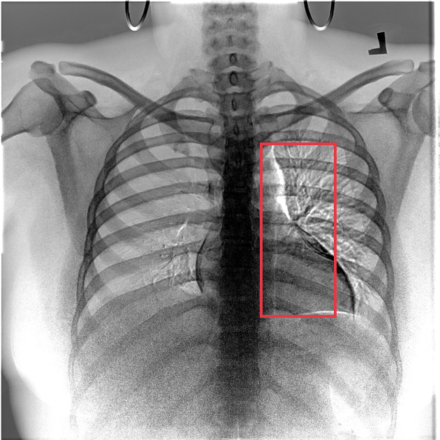
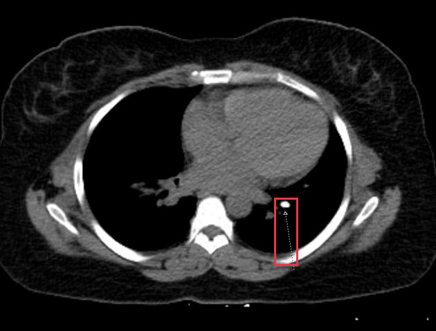

# Sheared Port-a-Cath remnant

[返回 Step 3 总览](../README_STEP3_VISUALIZATION.md)

- **Case ID：** `sheared-port-a-cath-remnant`
- **Case URL：** [https://radiopaedia.org/cases/sheared-port-a-cath-remnant?lang=us](https://radiopaedia.org/cases/sheared-port-a-cath-remnant?lang=us)
- **验证模型：** Qwen3-VL-8B
- **图像 / Step 2 findings：** 5 / 2
- **定位结果：** strong 0；partial 0；not support 1；parse error 0
- **Strong bbox relations：** 0
- **原始 JSON：** [case_evidence.json](../assets_step3/sheared-port-a-cath-remnant/case_evidence.json)

**Overlay 图例：** 红框为跨图新定位；绿框为 IoU >= 0.5 的已有 bbox；黄框为未达到阈值的已有 bbox。

## Step 2 Finding Nodes

### Finding 1: `study_000_x_ray_image_003_frontal_f01`

- **Modality / subcategory：** X-ray / Frontal
- **bbox_2d：** `[592, 324, 765, 721]`
- **Lingshu caption：** The lungs are clear bilaterally. Specifically, no evidence of focal consolidation, pneumothorax, or pleural effusion. Cardiomediastinal silhouette is unremarkable. Visualized osseous structures of the thorax are without acute abnormality.

### Finding 2: `study_001_ct_image_000_axial_non_contrast_f01`

- **Modality / subcategory：** CT / Axial non-contrast
- **bbox_2d：** `[630, 598, 684, 802]`
- **Lingshu caption：** The image shows a well-defined, round, hyperdense lesion located in the left lower lobe of the lung. The lesion appears to be a solitary pulmonary nodule, which could represent a variety of pathologies such as a benign tumor, malignant neoplasm, or granulomatous disease. Further evaluation with additional imaging modalities or biopsy may be necessary to determine the underlying cause.

## Directed Cross-image Validation

### Anchor 1: `study_000_x_ray_image_003_frontal_f01`

**Anchor Lingshu caption：** The lungs are clear bilaterally. Specifically, no evidence of focal consolidation, pneumothorax, or pleural effusion. Cardiomediastinal silhouette is unremarkable. Visualized osseous structures of the thorax are without acute abnormality.

#### location_00001: NOT SUPPORT

<table>
<tr><th>Anchor original bbox</th><th>Target original image; model returned null</th><th>Existing target bbox: study_001_ct_image_000_axial_non_contrast_f01</th></tr>
<tr><td></td><td></td><td></td></tr>
</table>

- **Target：** `study_001_ct_image_000_axial_non_contrast`; CT; Axial non-contrast
- **Relation：** `bbox_to_image` / `not_support`
- **Returned target bbox：** `unknown`
- **Maximum IoU：** n/a; threshold=0.5
- **Strong relation IDs：** `[]`

**IoU matching：**

| Existing target bbox | IoU | Strong match | Lingshu caption |
|---|---:|---|---|
| `study_001_ct_image_000_axial_non_contrast_f01`; `[630, 598, 684, 802]` | n/a | n/a | The image shows a well-defined, round, hyperdense lesion located in the left lower lobe of the lung. The lesion appears to be a solitary pulmonary nodule, which could represent a variety of pathologies such as a benign tumor, malignant neoplasm, or granulomatous disease. Further evaluation with additional imaging modalities or biopsy may be necessary to determine the underlying cause. |

## Dynamically Skipped Anchors

None.
