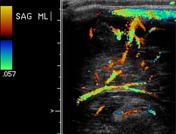
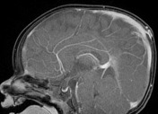

# Sinus pericranii

[返回 Step 3 总览](../README_STEP3_VISUALIZATION.md)

- **Case ID：** `sinus-pericranii-5`
- **Case URL：** [https://radiopaedia.org/cases/sinus-pericranii-5?lang=us](https://radiopaedia.org/cases/sinus-pericranii-5?lang=us)
- **验证模型：** Qwen3-VL-8B
- **图像 / Step 2 findings：** 6 / 0
- **定位结果：** strong 0；partial 0；not support 0；parse error 0
- **Strong bbox relations：** 0
- **原始 JSON：** [case_evidence.json](../assets_step3/sinus-pericranii-5/case_evidence.json)

**Overlay 图例：** 红框为跨图新定位；绿框为 IoU >= 0.5 的已有 bbox；黄框为未达到阈值的已有 bbox。

## Step 2 Finding Nodes

该病例的 Step 1/2 没有产生 bbox finding，因此 Step 3 没有可作为 anchor 的区域。

| Original images |
|---|
|  |
|  |
|  |
|  |
|  |
|  |
## Directed Cross-image Validation

没有可执行的跨图定位查询。

## Dynamically Skipped Anchors

None.
