# Sister Mary Joseph nodule

[返回 Step 3 总览](../README_STEP3_VISUALIZATION.md)

- **Case ID：** `sister-mary-joseph-nodule-7`
- **Case URL：** [https://radiopaedia.org/cases/sister-mary-joseph-nodule-7?lang=us](https://radiopaedia.org/cases/sister-mary-joseph-nodule-7?lang=us)
- **验证模型：** Qwen3-VL-8B
- **图像 / Step 2 findings：** 5 / 7
- **定位结果：** strong 1；partial 3；not support 2；parse error 0
- **Strong bbox relations：** 1
- **原始 JSON：** [case_evidence.json](../assets_step3/sister-mary-joseph-nodule-7/case_evidence.json)
- **定量/定性验证 JSON：** [step_3_validation_case_evidence.json](../assets_step3/sister-mary-joseph-nodule-7/step_3_validation_case_evidence.json)

**Overlay 图例：** 红框为跨图新定位；绿框为 IoU >= 0.5 的已有 bbox；黄框为未达到阈值的已有 bbox。

## Step 2 Finding Nodes

### Finding 1: `study_000_photograph_image_000_enlarging_umbilical_nodule_f01`

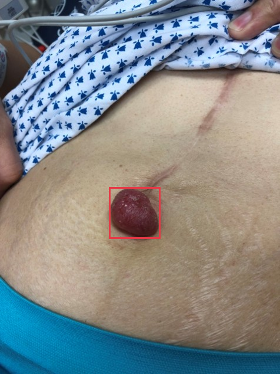

- **Modality / subcategory：** Photograph / enlarging umbilical nodule
- **bbox_2d：** `[389, 501, 572, 638]`
- **Lingshu caption：** The umbilicus contains a 2 cm diameter, smooth, rounded, red nodule. The surrounding skin appears normal.
- **中文翻译：** 脐部可见一个直径约 2 cm、表面光滑、圆形的红色结节。周围皮肤表现正常。

### Finding 2: `study_002_ct_image_000_axial_non_contrast_f01`

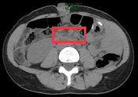

- **Modality / subcategory：** CT / Axial non-contrast
- **bbox_2d：** `[380, 280, 620, 440]`
- **Lingshu caption：** The image shows a cross-sectional view of the abdomen. Within the boxed region, there appears to be an area of increased density or opacity, which could potentially indicate the presence of an abnormality such as a mass, lesion, or other pathological process. The surrounding tissues appear relatively normal in appearance. Further evaluation and correlation with clinical information would be necessary to determine the significance of this finding.
- **中文翻译：** 图像为腹部横断面。框内似有密度或不透亮度增高区，可能提示肿块、病灶或其他病理过程。周围组织外观相对正常。需要进一步评估并结合临床资料判断该征象的意义。

### Finding 3: `study_002_ct_image_000_axial_non_contrast_f02`

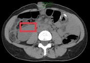

- **Modality / subcategory：** CT / Axial non-contrast
- **bbox_2d：** `[220, 360, 400, 500]`
- **Lingshu caption：** The image shows a large mass in the right upper quadrant of the abdomen. The mass appears to be heterogeneous in density, with areas of both high and low attenuation. There is also evidence of surrounding tissue invasion and possible lymphadenopathy. The mass appears to be displacing adjacent structures, including the liver and kidney.
- **中文翻译：** 右上腹可见较大肿块，密度不均，内含高、低衰减区。另有周围组织受侵及可能的淋巴结肿大。肿块似推移肝脏、肾脏等邻近结构。

### Finding 4: `study_002_ct_image_000_axial_non_contrast_f03`

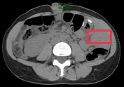

- **Modality / subcategory：** CT / Axial non-contrast
- **bbox_2d：** `[700, 340, 900, 500]`
- **Lingshu caption：** The image shows a large amount of free air in the peritoneal cavity, consistent with pneumoperitoneum. The air appears to be located primarily in the upper abdomen, surrounding the liver and stomach. There is no evidence of bowel perforation or other intra-abdominal pathology. The lungs appear clear, and there is no evidence of pleural effusion or pneumothorax.
- **中文翻译：** 腹腔内可见大量游离气体，符合气腹表现，主要位于上腹部并环绕肝脏和胃。未见肠穿孔或其他腹腔内病变证据。双肺清晰，未见胸腔积液或气胸。

### Finding 5: `study_002_ct_image_001_axial_c_portal_venous_phase_f01`

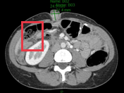

- **Modality / subcategory：** CT / Axial C+ portal venous phase
- **bbox_2d：** `[175, 230, 350, 550]`
- **Lingshu caption：** The image shows a cross-sectional view of the abdomen, with a focus on the right kidney. Within the red box, there appears to be an area of increased density or attenuation compared to the surrounding renal parenchyma. This could potentially represent a mass, lesion, or other abnormality within the right kidney. The size, shape, and precise location of this finding would require further evaluation to determine its significance. Additionally, the surrounding structures, such as the liver, spleen, and bowel, appear unremarkable in this particular slice.
- **中文翻译：** 图像为腹部横断面，重点显示右肾。红框内似有较周围肾实质密度或衰减增高的区域，可能代表右肾肿块、病灶或其他异常。其大小、形态和精确位置需进一步评估才能判断意义。本层面肝、脾和肠管等周围结构未见明显异常。

### Finding 6: `study_002_ct_image_001_axial_c_portal_venous_phase_f02`

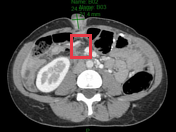

- **Modality / subcategory：** CT / Axial C+ portal venous phase
- **bbox_2d：** `[400, 260, 520, 440]`
- **Lingshu caption：** The image shows a cross-sectional view of the abdomen, with a focus on the right kidney. Within the red box, there appears to be an area of increased density or attenuation compared to the surrounding renal parenchyma. This could potentially represent a lesion or abnormality within the kidney. The overall appearance of the kidney and surrounding structures should be further evaluated to determine the nature and significance of this finding.
- **中文翻译：** 图像为腹部横断面，重点显示右肾。红框内似有较周围肾实质密度或衰减增高的区域，可能代表肾内病灶或异常。应进一步评估肾脏及周围结构的整体表现，以明确该征象的性质和意义。

### Finding 7: `study_002_ct_image_001_axial_c_portal_venous_phase_f03`

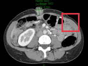

- **Modality / subcategory：** CT / Axial C+ portal venous phase
- **bbox_2d：** `[700, 200, 900, 480]`
- **Lingshu caption：** The image shows a cross-sectional view of the abdomen, with a focus on the liver. Within the boxed region, there appears to be a distinct area of increased density or attenuation compared to the surrounding liver parenchyma. This could potentially represent a focal lesion or abnormality within the liver. The size, shape, and precise location of this finding would require further evaluation to determine its significance. Additionally, the overall appearance of the liver and other abdominal structures should be carefully assessed for any other potential abnormalities or changes.
- **中文翻译：** 图像为腹部横断面，重点显示肝脏。框内可见较周围肝实质密度或衰减明显增高的区域，可能代表肝内局灶性病灶或异常。其大小、形态及精确位置需进一步评估。还应仔细检查肝脏及其他腹部结构有无其他潜在异常或改变。

## Directed Cross-image Validation

### Anchor 1: `study_000_photograph_image_000_enlarging_umbilical_nodule_f01`

**Anchor Lingshu caption：** The umbilicus contains a 2 cm diameter, smooth, rounded, red nodule. The surrounding skin appears normal.
**Anchor caption 中文翻译：** 脐部可见一个直径约 2 cm、表面光滑、圆形的红色结节。周围皮肤表现正常。

#### location_00001: NOT SUPPORT

<table>
<tr><th>Anchor original bbox</th><th>Target original image; model returned null</th></tr>
<tr><td></td><td>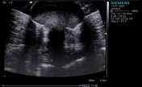</td></tr>
</table>

- **Target：** `study_001_ultrasound_image_000_missing`; Ultrasound; missing
- **Relation：** `bbox_to_image` / `not_support`
- **Returned target bbox：** `unknown`
- **Maximum IoU：** n/a; threshold=0.5
- **Strong relation IDs：** `[]`

**IoU matching：**

The target image has no existing Step 2 bbox.

#### location_00002: NOT SUPPORT

<table>
<tr><th>Anchor original bbox</th><th>Target original image; model returned null</th></tr>
<tr><td></td><td>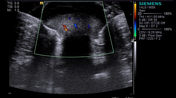</td></tr>
</table>

- **Target：** `study_001_ultrasound_image_001_missing`; Ultrasound; missing
- **Relation：** `bbox_to_image` / `not_support`
- **Returned target bbox：** `unknown`
- **Maximum IoU：** n/a; threshold=0.5
- **Strong relation IDs：** `[]`

**IoU matching：**

The target image has no existing Step 2 bbox.

#### location_00003: STRONG SUPPORT

<table>
<tr><th>Anchor original bbox</th><th>Cross-image grounded target bbox</th><th>Existing target bbox: study_002_ct_image_000_axial_non_contrast_f01</th><th>Existing target bbox: study_002_ct_image_000_axial_non_contrast_f02</th><th>Existing target bbox: study_002_ct_image_000_axial_non_contrast_f03</th></tr>
<tr><td></td><td>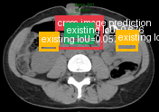</td><td></td><td></td><td></td></tr>
</table>

- **Target：** `study_002_ct_image_000_axial_non_contrast`; CT; Axial non-contrast
- **Relation：** `bbox_to_bbox` / `strong_support`
- **Returned target bbox：** `[350, 250, 650, 450]`
- **Maximum IoU：** 0.676; threshold=0.5
- **Strong relation IDs：** `[&#x27;strong_location_00003_01&#x27;]`

**IoU matching：**

| Existing target bbox | IoU | Strong match | Lingshu caption | 中文翻译 |
|---|---:|---|---|---|
| `study_002_ct_image_000_axial_non_contrast_f01`; `[380, 280, 620, 440]` | 0.676 | yes | The image shows a cross-sectional view of the abdomen. Within the boxed region, there appears to be an area of increased density or opacity, which could potentially indicate the presence of an abnormality such as a mass, lesion, or other pathological process. The surrounding tissues appear relatively normal in appearance. Further evaluation and correlation with clinical information would be necessary to determine the significance of this finding. | 图像为腹部横断面。框内似有密度或不透亮度增高区，可能提示肿块、病灶或其他病理过程。周围组织外观相对正常。需要进一步评估并结合临床资料判断该征象的意义。 |
| `study_002_ct_image_000_axial_non_contrast_f02`; `[220, 360, 400, 500]` | 0.057 | no | The image shows a large mass in the right upper quadrant of the abdomen. The mass appears to be heterogeneous in density, with areas of both high and low attenuation. There is also evidence of surrounding tissue invasion and possible lymphadenopathy. The mass appears to be displacing adjacent structures, including the liver and kidney. | 右上腹可见较大肿块，密度不均，内含高、低衰减区。另有周围组织受侵及可能的淋巴结肿大。肿块似推移肝脏、肾脏等邻近结构。 |
| `study_002_ct_image_000_axial_non_contrast_f03`; `[700, 340, 900, 500]` | 0.000 | no | The image shows a large amount of free air in the peritoneal cavity, consistent with pneumoperitoneum. The air appears to be located primarily in the upper abdomen, surrounding the liver and stomach. There is no evidence of bowel perforation or other intra-abdominal pathology. The lungs appear clear, and there is no evidence of pleural effusion or pneumothorax. | 腹腔内可见大量游离气体，符合气腹表现，主要位于上腹部并环绕肝脏和胃。未见肠穿孔或其他腹腔内病变证据。双肺清晰，未见胸腔积液或气胸。 |

**Quantitative / qualitative validation：**

| Validation pair | Quantitative size / 定量 | Qualitative caption / 定性 |
|---|---|---|
| `strong__strong_location_00003_01` | `consistent` | `consistent` |

#### location_00004: PARTIAL SUPPORT

<table>
<tr><th>Anchor original bbox</th><th>Cross-image grounded target bbox</th><th>Existing target bbox: study_002_ct_image_001_axial_c_portal_venous_phase_f01</th><th>Existing target bbox: study_002_ct_image_001_axial_c_portal_venous_phase_f02</th><th>Existing target bbox: study_002_ct_image_001_axial_c_portal_venous_phase_f03</th></tr>
<tr><td></td><td>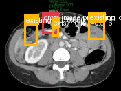</td><td></td><td></td><td></td></tr>
</table>

- **Target：** `study_002_ct_image_001_axial_c_portal_venous_phase`; CT; Axial C+ portal venous phase
- **Relation：** `bbox_to_image` / `partial_support`
- **Returned target bbox：** `[347, 236, 486, 377]`
- **Maximum IoU：** 0.316; threshold=0.5
- **Strong relation IDs：** `[]`

**IoU matching：**

| Existing target bbox | IoU | Strong match | Lingshu caption | 中文翻译 |
|---|---:|---|---|---|
| `study_002_ct_image_001_axial_c_portal_venous_phase_f01`; `[175, 230, 350, 550]` | 0.000 | no | The image shows a cross-sectional view of the abdomen, with a focus on the right kidney. Within the red box, there appears to be an area of increased density or attenuation compared to the surrounding renal parenchyma. This could potentially represent a mass, lesion, or other abnormality within the right kidney. The size, shape, and precise location of this finding would require further evaluation to determine its significance. Additionally, the surrounding structures, such as the liver, spleen, and bowel, appear unremarkable in this particular slice. | 图像为腹部横断面，重点显示右肾。红框内似有较周围肾实质密度或衰减增高的区域，可能代表右肾肿块、病灶或其他异常。其大小、形态和精确位置需进一步评估才能判断意义。本层面肝、脾和肠管等周围结构未见明显异常。 |
| `study_002_ct_image_001_axial_c_portal_venous_phase_f02`; `[400, 260, 520, 440]` | 0.316 | no | The image shows a cross-sectional view of the abdomen, with a focus on the right kidney. Within the red box, there appears to be an area of increased density or attenuation compared to the surrounding renal parenchyma. This could potentially represent a lesion or abnormality within the kidney. The overall appearance of the kidney and surrounding structures should be further evaluated to determine the nature and significance of this finding. | 图像为腹部横断面，重点显示右肾。红框内似有较周围肾实质密度或衰减增高的区域，可能代表肾内病灶或异常。应进一步评估肾脏及周围结构的整体表现，以明确该征象的性质和意义。 |
| `study_002_ct_image_001_axial_c_portal_venous_phase_f03`; `[700, 200, 900, 480]` | 0.000 | no | The image shows a cross-sectional view of the abdomen, with a focus on the liver. Within the boxed region, there appears to be a distinct area of increased density or attenuation compared to the surrounding liver parenchyma. This could potentially represent a focal lesion or abnormality within the liver. The size, shape, and precise location of this finding would require further evaluation to determine its significance. Additionally, the overall appearance of the liver and other abdominal structures should be carefully assessed for any other potential abnormalities or changes. | 图像为腹部横断面，重点显示肝脏。框内可见较周围肝实质密度或衰减明显增高的区域，可能代表肝内局灶性病灶或异常。其大小、形态及精确位置需进一步评估。还应仔细检查肝脏及其他腹部结构有无其他潜在异常或改变。 |

**B 图单红框（Lingshu 实际输入）：**

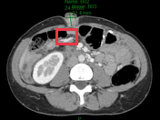

**Re-ground Lingshu caption：** The image shows a cross-sectional view of the abdomen, with a focus on the right kidney. Within the red box, there appears to be a distinct mass or lesion present in the right kidney. The mass has an irregular shape and heterogeneous density, suggesting a potential abnormality. The surrounding renal parenchyma appears relatively normal in appearance. No other significant abnormalities are noted in the imaged region.
**Re-ground caption 中文翻译：** 图像为腹部横断面，重点显示右肾。红框内右肾似有明确肿块或病灶，其形态不规则、密度不均，提示可能存在异常。周围肾实质外观相对正常。所示区域未见其他明显异常。

**Quantitative / qualitative validation：**

| Validation pair | Quantitative size / 定量 | Qualitative caption / 定性 |
|---|---|---|
| `partial__location_00004` | `inconsistent` | `inconsistent` |

### Anchor 2: `study_002_ct_image_000_axial_non_contrast_f02`

**Anchor Lingshu caption：** The image shows a large mass in the right upper quadrant of the abdomen. The mass appears to be heterogeneous in density, with areas of both high and low attenuation. There is also evidence of surrounding tissue invasion and possible lymphadenopathy. The mass appears to be displacing adjacent structures, including the liver and kidney.
**Anchor caption 中文翻译：** 右上腹可见较大肿块，密度不均，内含高、低衰减区。另有周围组织受侵及可能的淋巴结肿大。肿块似推移肝脏、肾脏等邻近结构。

#### location_00006: PARTIAL SUPPORT

<table>
<tr><th>Anchor original bbox</th><th>Cross-image grounded target bbox</th><th>Existing target bbox: study_002_ct_image_001_axial_c_portal_venous_phase_f01</th><th>Existing target bbox: study_002_ct_image_001_axial_c_portal_venous_phase_f02</th><th>Existing target bbox: study_002_ct_image_001_axial_c_portal_venous_phase_f03</th></tr>
<tr><td></td><td>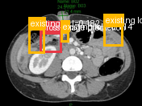</td><td></td><td></td><td></td></tr>
</table>

- **Target：** `study_002_ct_image_001_axial_c_portal_venous_phase`; CT; Axial C+ portal venous phase
- **Relation：** `bbox_to_image` / `partial_support`
- **Returned target bbox：** `[280, 310, 440, 500]`
- **Maximum IoU：** 0.182; threshold=0.5
- **Strong relation IDs：** `[]`

**IoU matching：**

| Existing target bbox | IoU | Strong match | Lingshu caption | 中文翻译 |
|---|---:|---|---|---|
| `study_002_ct_image_001_axial_c_portal_venous_phase_f01`; `[175, 230, 350, 550]` | 0.182 | no | The image shows a cross-sectional view of the abdomen, with a focus on the right kidney. Within the red box, there appears to be an area of increased density or attenuation compared to the surrounding renal parenchyma. This could potentially represent a mass, lesion, or other abnormality within the right kidney. The size, shape, and precise location of this finding would require further evaluation to determine its significance. Additionally, the surrounding structures, such as the liver, spleen, and bowel, appear unremarkable in this particular slice. | 图像为腹部横断面，重点显示右肾。红框内似有较周围肾实质密度或衰减增高的区域，可能代表右肾肿块、病灶或其他异常。其大小、形态和精确位置需进一步评估才能判断意义。本层面肝、脾和肠管等周围结构未见明显异常。 |
| `study_002_ct_image_001_axial_c_portal_venous_phase_f02`; `[400, 260, 520, 440]` | 0.114 | no | The image shows a cross-sectional view of the abdomen, with a focus on the right kidney. Within the red box, there appears to be an area of increased density or attenuation compared to the surrounding renal parenchyma. This could potentially represent a lesion or abnormality within the kidney. The overall appearance of the kidney and surrounding structures should be further evaluated to determine the nature and significance of this finding. | 图像为腹部横断面，重点显示右肾。红框内似有较周围肾实质密度或衰减增高的区域，可能代表肾内病灶或异常。应进一步评估肾脏及周围结构的整体表现，以明确该征象的性质和意义。 |
| `study_002_ct_image_001_axial_c_portal_venous_phase_f03`; `[700, 200, 900, 480]` | 0.000 | no | The image shows a cross-sectional view of the abdomen, with a focus on the liver. Within the boxed region, there appears to be a distinct area of increased density or attenuation compared to the surrounding liver parenchyma. This could potentially represent a focal lesion or abnormality within the liver. The size, shape, and precise location of this finding would require further evaluation to determine its significance. Additionally, the overall appearance of the liver and other abdominal structures should be carefully assessed for any other potential abnormalities or changes. | 图像为腹部横断面，重点显示肝脏。框内可见较周围肝实质密度或衰减明显增高的区域，可能代表肝内局灶性病灶或异常。其大小、形态及精确位置需进一步评估。还应仔细检查肝脏及其他腹部结构有无其他潜在异常或改变。 |

**B 图单红框（Lingshu 实际输入）：**

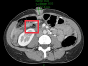

**Re-ground Lingshu caption：** The image shows a cross-sectional view of the abdomen at the level of the kidneys. The red box highlights an area in the right kidney that appears to have a distinct lesion or abnormality. This lesion is characterized by a well-defined border and a different density compared to the surrounding renal parenchyma. The lesion&#x27;s appearance suggests it could be a solid mass, potentially indicative of a neoplastic process. Surrounding structures, including the liver, spleen, and portions of the bowel, appear unremarkable in this slice. The vertebral body and spinal canal are also visible, showing no apparent abnormalities.
**Re-ground caption 中文翻译：** 图像为肾脏水平的腹部横断面。红框标出右肾内一个明确病灶或异常，其边界清楚，密度不同于周围肾实质。外观提示其可能为实性肿块，并可能为肿瘤性过程。肝、脾和部分肠管等周围结构在本层面未见异常。椎体和椎管也可见，未见明显异常。

**Quantitative / qualitative validation：**

| Validation pair | Quantitative size / 定量 | Qualitative caption / 定性 |
|---|---|---|
| `partial__location_00006` | `inconsistent` | `inconsistent` |

### Anchor 3: `study_002_ct_image_000_axial_non_contrast_f03`

**Anchor Lingshu caption：** The image shows a large amount of free air in the peritoneal cavity, consistent with pneumoperitoneum. The air appears to be located primarily in the upper abdomen, surrounding the liver and stomach. There is no evidence of bowel perforation or other intra-abdominal pathology. The lungs appear clear, and there is no evidence of pleural effusion or pneumothorax.
**Anchor caption 中文翻译：** 腹腔内可见大量游离气体，符合气腹表现，主要位于上腹部并环绕肝脏和胃。未见肠穿孔或其他腹腔内病变证据。双肺清晰，未见胸腔积液或气胸。

#### location_00007: PARTIAL SUPPORT

<table>
<tr><th>Anchor original bbox</th><th>Cross-image grounded target bbox</th><th>Existing target bbox: study_002_ct_image_001_axial_c_portal_venous_phase_f01</th><th>Existing target bbox: study_002_ct_image_001_axial_c_portal_venous_phase_f02</th><th>Existing target bbox: study_002_ct_image_001_axial_c_portal_venous_phase_f03</th></tr>
<tr><td></td><td>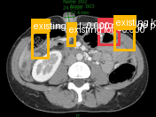</td><td></td><td></td><td></td></tr>
</table>

- **Target：** `study_002_ct_image_001_axial_c_portal_venous_phase`; CT; Axial C+ portal venous phase
- **Relation：** `bbox_to_image` / `partial_support`
- **Returned target bbox：** `[625, 262, 775, 400]`
- **Maximum IoU：** 0.153; threshold=0.5
- **Strong relation IDs：** `[]`

**IoU matching：**

| Existing target bbox | IoU | Strong match | Lingshu caption | 中文翻译 |
|---|---:|---|---|---|
| `study_002_ct_image_001_axial_c_portal_venous_phase_f01`; `[175, 230, 350, 550]` | 0.000 | no | The image shows a cross-sectional view of the abdomen, with a focus on the right kidney. Within the red box, there appears to be an area of increased density or attenuation compared to the surrounding renal parenchyma. This could potentially represent a mass, lesion, or other abnormality within the right kidney. The size, shape, and precise location of this finding would require further evaluation to determine its significance. Additionally, the surrounding structures, such as the liver, spleen, and bowel, appear unremarkable in this particular slice. | 图像为腹部横断面，重点显示右肾。红框内似有较周围肾实质密度或衰减增高的区域，可能代表右肾肿块、病灶或其他异常。其大小、形态和精确位置需进一步评估才能判断意义。本层面肝、脾和肠管等周围结构未见明显异常。 |
| `study_002_ct_image_001_axial_c_portal_venous_phase_f02`; `[400, 260, 520, 440]` | 0.000 | no | The image shows a cross-sectional view of the abdomen, with a focus on the right kidney. Within the red box, there appears to be an area of increased density or attenuation compared to the surrounding renal parenchyma. This could potentially represent a lesion or abnormality within the kidney. The overall appearance of the kidney and surrounding structures should be further evaluated to determine the nature and significance of this finding. | 图像为腹部横断面，重点显示右肾。红框内似有较周围肾实质密度或衰减增高的区域，可能代表肾内病灶或异常。应进一步评估肾脏及周围结构的整体表现，以明确该征象的性质和意义。 |
| `study_002_ct_image_001_axial_c_portal_venous_phase_f03`; `[700, 200, 900, 480]` | 0.153 | no | The image shows a cross-sectional view of the abdomen, with a focus on the liver. Within the boxed region, there appears to be a distinct area of increased density or attenuation compared to the surrounding liver parenchyma. This could potentially represent a focal lesion or abnormality within the liver. The size, shape, and precise location of this finding would require further evaluation to determine its significance. Additionally, the overall appearance of the liver and other abdominal structures should be carefully assessed for any other potential abnormalities or changes. | 图像为腹部横断面，重点显示肝脏。框内可见较周围肝实质密度或衰减明显增高的区域，可能代表肝内局灶性病灶或异常。其大小、形态及精确位置需进一步评估。还应仔细检查肝脏及其他腹部结构有无其他潜在异常或改变。 |

**B 图单红框（Lingshu 实际输入）：**

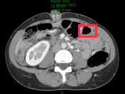

**Re-ground Lingshu caption：** The image shows a cross-sectional view of the abdomen, with a focus on the liver. Within the boxed region, there appears to be a distinct area of increased density or attenuation compared to the surrounding liver parenchyma. This could potentially represent a lesion or abnormality within the liver. The size, shape, and precise location of this finding would require further evaluation by a radiologist to determine its significance.
**Re-ground caption 中文翻译：** 图像为腹部横断面，重点显示肝脏。框内似有较周围肝实质密度或衰减增高的明确区域，可能代表肝内病灶或异常。需由放射科医师进一步评估其大小、形态和精确位置，以确定其意义。

**Quantitative / qualitative validation：**

| Validation pair | Quantitative size / 定量 | Qualitative caption / 定性 |
|---|---|---|
| `partial__location_00007` | `consistent` | `inconsistent` |

## Dynamically Skipped Anchors

| Anchor node | Reused strong relations | Skipped target images |
|---|---|---|
| `study_002_ct_image_000_axial_non_contrast_f01` | `[&#x27;strong_location_00003_01&#x27;]` | `[&#x27;study_002_ct_image_001_axial_c_portal_venous_phase&#x27;]` |

## Case-level Location Validation Summary / 病例级定位验证总结

- **Strong support：** 1 个 bbox-to-bbox 关系
- **Partial support：** 3 个 bbox-to-image 关系
- **Not support：** 2 个 bbox-to-image 关系

### Strong Support

#### Strong 1: `study_000_photograph_image_000_enlarging_umbilical_nodule_f01` ↔ `study_002_ct_image_000_axial_non_contrast_f01`

- **Relation / query：** `strong_location_00003_01` / `location_00003`
- **IoU：** 0.676（threshold=0.5）

<table>
<tr><th>Anchor bbox</th><th>Cross-image grounded target bbox</th><th>Matched target bbox</th></tr>
<tr><td></td><td></td><td></td></tr>
</table>

- **Anchor Lingshu caption：** The umbilicus contains a 2 cm diameter, smooth, rounded, red nodule. The surrounding skin appears normal.
- **Anchor caption 中文翻译：** 脐部可见一个直径约 2 cm、表面光滑、圆形的红色结节。周围皮肤表现正常。
- **Target Lingshu caption：** The image shows a cross-sectional view of the abdomen. Within the boxed region, there appears to be an area of increased density or opacity, which could potentially indicate the presence of an abnormality such as a mass, lesion, or other pathological process. The surrounding tissues appear relatively normal in appearance. Further evaluation and correlation with clinical information would be necessary to determine the significance of this finding.
- **Target caption 中文翻译：** 图像为腹部横断面。框内似有密度或不透亮度增高区，可能提示肿块、病灶或其他病理过程。周围组织外观相对正常。需要进一步评估并结合临床资料判断该征象的意义。
- **Quantitative size validation / 定量大小一致性：** `consistent`
- **Qualitative caption validation / 定性语义一致性：** `consistent`

### Partial Support

#### Partial 1: `study_000_photograph_image_000_enlarging_umbilical_nodule_f01` → `study_002_ct_image_001_axial_c_portal_venous_phase`

- **Query：** `location_00004`
- **Returned target bbox：** `[347, 236, 486, 377]`
- **Maximum IoU：** 0.316（低于 threshold=0.5）

<table>
<tr><th>Anchor bbox</th><th>Cross-image grounding and IoU overlay</th><th>B image with the single re-grounded bbox given to Lingshu</th><th>Closest existing target bbox</th></tr>
<tr><td></td><td></td><td></td><td></td></tr>
</table>

- **A 端原始 Lingshu caption：** The umbilicus contains a 2 cm diameter, smooth, rounded, red nodule. The surrounding skin appears normal.
- **A 端 caption 中文翻译：** 脐部可见一个直径约 2 cm、表面光滑、圆形的红色结节。周围皮肤表现正常。
- **B 端 re-ground Lingshu caption：** The image shows a cross-sectional view of the abdomen, with a focus on the right kidney. Within the red box, there appears to be a distinct mass or lesion present in the right kidney. The mass has an irregular shape and heterogeneous density, suggesting a potential abnormality. The surrounding renal parenchyma appears relatively normal in appearance. No other significant abnormalities are noted in the imaged region.
- **B 端 re-ground caption 中文翻译：** 图像为腹部横断面，重点显示右肾。红框内右肾似有明确肿块或病灶，其形态不规则、密度不均，提示可能存在异常。周围肾实质外观相对正常。所示区域未见其他明显异常。
- **Quantitative size validation / 定量大小一致性：** `inconsistent`
- **Qualitative caption validation / 定性语义一致性：** `inconsistent`

#### Partial 2: `study_002_ct_image_000_axial_non_contrast_f02` → `study_002_ct_image_001_axial_c_portal_venous_phase`

- **Query：** `location_00006`
- **Returned target bbox：** `[280, 310, 440, 500]`
- **Maximum IoU：** 0.182（低于 threshold=0.5）

<table>
<tr><th>Anchor bbox</th><th>Cross-image grounding and IoU overlay</th><th>B image with the single re-grounded bbox given to Lingshu</th><th>Closest existing target bbox</th></tr>
<tr><td></td><td></td><td></td><td></td></tr>
</table>

- **A 端原始 Lingshu caption：** The image shows a large mass in the right upper quadrant of the abdomen. The mass appears to be heterogeneous in density, with areas of both high and low attenuation. There is also evidence of surrounding tissue invasion and possible lymphadenopathy. The mass appears to be displacing adjacent structures, including the liver and kidney.
- **A 端 caption 中文翻译：** 右上腹可见较大肿块，密度不均，内含高、低衰减区。另有周围组织受侵及可能的淋巴结肿大。肿块似推移肝脏、肾脏等邻近结构。
- **B 端 re-ground Lingshu caption：** The image shows a cross-sectional view of the abdomen at the level of the kidneys. The red box highlights an area in the right kidney that appears to have a distinct lesion or abnormality. This lesion is characterized by a well-defined border and a different density compared to the surrounding renal parenchyma. The lesion&#x27;s appearance suggests it could be a solid mass, potentially indicative of a neoplastic process. Surrounding structures, including the liver, spleen, and portions of the bowel, appear unremarkable in this slice. The vertebral body and spinal canal are also visible, showing no apparent abnormalities.
- **B 端 re-ground caption 中文翻译：** 图像为肾脏水平的腹部横断面。红框标出右肾内一个明确病灶或异常，其边界清楚，密度不同于周围肾实质。外观提示其可能为实性肿块，并可能为肿瘤性过程。肝、脾和部分肠管等周围结构在本层面未见异常。椎体和椎管也可见，未见明显异常。
- **Quantitative size validation / 定量大小一致性：** `inconsistent`
- **Qualitative caption validation / 定性语义一致性：** `inconsistent`

#### Partial 3: `study_002_ct_image_000_axial_non_contrast_f03` → `study_002_ct_image_001_axial_c_portal_venous_phase`

- **Query：** `location_00007`
- **Returned target bbox：** `[625, 262, 775, 400]`
- **Maximum IoU：** 0.153（低于 threshold=0.5）

<table>
<tr><th>Anchor bbox</th><th>Cross-image grounding and IoU overlay</th><th>B image with the single re-grounded bbox given to Lingshu</th><th>Closest existing target bbox</th></tr>
<tr><td></td><td></td><td></td><td></td></tr>
</table>

- **A 端原始 Lingshu caption：** The image shows a large amount of free air in the peritoneal cavity, consistent with pneumoperitoneum. The air appears to be located primarily in the upper abdomen, surrounding the liver and stomach. There is no evidence of bowel perforation or other intra-abdominal pathology. The lungs appear clear, and there is no evidence of pleural effusion or pneumothorax.
- **A 端 caption 中文翻译：** 腹腔内可见大量游离气体，符合气腹表现，主要位于上腹部并环绕肝脏和胃。未见肠穿孔或其他腹腔内病变证据。双肺清晰，未见胸腔积液或气胸。
- **B 端 re-ground Lingshu caption：** The image shows a cross-sectional view of the abdomen, with a focus on the liver. Within the boxed region, there appears to be a distinct area of increased density or attenuation compared to the surrounding liver parenchyma. This could potentially represent a lesion or abnormality within the liver. The size, shape, and precise location of this finding would require further evaluation by a radiologist to determine its significance.
- **B 端 re-ground caption 中文翻译：** 图像为腹部横断面，重点显示肝脏。框内似有较周围肝实质密度或衰减增高的明确区域，可能代表肝内病灶或异常。需由放射科医师进一步评估其大小、形态和精确位置，以确定其意义。
- **Quantitative size validation / 定量大小一致性：** `consistent`
- **Qualitative caption validation / 定性语义一致性：** `inconsistent`

### Not Support

#### Not support 1: `study_000_photograph_image_000_enlarging_umbilical_nodule_f01` → `study_001_ultrasound_image_000_missing`

- **Query：** `location_00001`
- **Result：** 目标图返回 `null`，未定位到对应区域。

<table>
<tr><th>Anchor bbox</th><th>Target original image</th></tr>
<tr><td></td><td></td></tr>
</table>

- **A 端原始 Lingshu caption：** The umbilicus contains a 2 cm diameter, smooth, rounded, red nodule. The surrounding skin appears normal.
- **A 端 caption 中文翻译：** 脐部可见一个直径约 2 cm、表面光滑、圆形的红色结节。周围皮肤表现正常。
- **B 端 re-ground caption：** 不适用；目标图返回 `null`，没有生成 re-ground bbox。
- **定量 / 定性验证：** 不适用；仅对 strong-support 和 partial-support pair 执行。

#### Not support 2: `study_000_photograph_image_000_enlarging_umbilical_nodule_f01` → `study_001_ultrasound_image_001_missing`

- **Query：** `location_00002`
- **Result：** 目标图返回 `null`，未定位到对应区域。

<table>
<tr><th>Anchor bbox</th><th>Target original image</th></tr>
<tr><td></td><td></td></tr>
</table>

- **A 端原始 Lingshu caption：** The umbilicus contains a 2 cm diameter, smooth, rounded, red nodule. The surrounding skin appears normal.
- **A 端 caption 中文翻译：** 脐部可见一个直径约 2 cm、表面光滑、圆形的红色结节。周围皮肤表现正常。
- **B 端 re-ground caption：** 不适用；目标图返回 `null`，没有生成 re-ground bbox。
- **定量 / 定性验证：** 不适用；仅对 strong-support 和 partial-support pair 执行。
