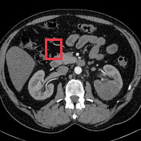
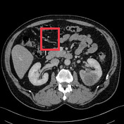
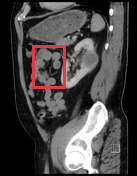
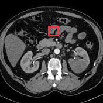
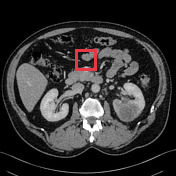
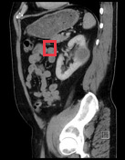

# Upper tract urothelial carcinoma

[返回 Step 3 总览](../README_STEP3_VISUALIZATION.md)

- **Case ID：** `upper-tract-urothelial-carcinoma-1`
- **Case URL：** [https://radiopaedia.org/cases/upper-tract-urothelial-carcinoma-1?lang=us](https://radiopaedia.org/cases/upper-tract-urothelial-carcinoma-1?lang=us)
- **验证模型：** Qwen3-VL-8B
- **图像 / Step 2 findings：** 10 / 9
- **定位结果：** strong 3；partial 6；not support 21；parse error 0
- **Strong bbox relations：** 3
- **原始 JSON：** [case_evidence.json](../assets_step3/upper-tract-urothelial-carcinoma-1/case_evidence.json)
- **定量/定性验证 JSON：** [step_3_validation_case_evidence.json](../assets_step3/upper-tract-urothelial-carcinoma-1/step_3_validation_case_evidence.json)

**Overlay 图例：** 红框为跨图新定位；绿框为 IoU >= 0.5 的已有 bbox；黄框为未达到阈值的已有 bbox。

## Step 2 Finding Nodes

### Finding 1: `study_000_ultrasound_image_000_missing_f01`

- **Modality / subcategory：** Ultrasound / missing
- **bbox_2d：** `[225, 137, 663, 735]`
- **Lingshu caption：** The left kidney is enlarged with multiple cystic structures throughout the parenchyma. The largest cyst measures 1.5 cm. There is no evidence of hydronephrosis. The right kidney is normal in size and appearance.
- **中文翻译：** 左肾增大，肾实质内可见多发囊性结构，最大囊肿约 1.5 cm。未见肾积水。右肾大小及外观正常。

### Finding 2: `study_000_ultrasound_image_001_missing_f01`

- **Modality / subcategory：** Ultrasound / missing
- **bbox_2d：** `[216, 168, 642, 700]`
- **Lingshu caption：** The left kidney demonstrates increased cortical echogenicity compared to the renal sinus. There is no evidence of hydronephrosis. The right kidney appears unremarkable. Color Doppler demonstrates normal flow within the left renal artery and vein.
- **中文翻译：** 左肾皮质回声较肾窦增强。未见肾积水。右肾未见明显异常。彩色多普勒显示左肾动、静脉血流正常。

### Finding 3: `study_001_ct_image_000_axial_non_contrast_f01`

- **Modality / subcategory：** CT / Axial non-contrast
- **bbox_2d：** `[340, 360, 480, 520]`
- **Lingshu caption：** The boxed region contains the right kidney. The kidney appears to have a normal size and shape. There is no evidence of hydronephrosis or focal mass lesions. The renal parenchyma appears homogeneous without any areas of abnormal attenuation. Surrounding structures including the liver, spleen, pancreas, and bowel loops appear unremarkable. No significant lymphadenopathy or free fluid is noted in the abdominal cavity.
- **中文翻译：** 框内为右肾，大小和形态正常。未见肾积水或局灶性肿块。肾实质均匀，未见异常衰减区。肝、脾、胰及肠袢等周围结构未见异常。腹腔内未见明显淋巴结肿大或游离液体。

### Finding 4: `study_001_ct_image_000_axial_non_contrast_f02`

- **Modality / subcategory：** CT / Axial non-contrast
- **bbox_2d：** `[620, 360, 760, 520]`
- **Lingshu caption：** The red box is located in the left upper quadrant of the abdomen. Within this region, there appears to be a mass-like lesion that is hypodense compared to the surrounding tissues. The lesion is well-circumscribed and measures approximately 3 cm in diameter. There is no evidence of invasion into adjacent structures. Surrounding the lesion, the fat planes appear preserved, and there is no significant lymphadenopathy noted in the vicinity. The adjacent bowel loops do not show any signs of obstruction or thickening. The liver, spleen, and kidneys appear unremarkable in this slice.
- **中文翻译：** 红框位于左上腹，其中似有一个较周围组织低密度的肿块样病灶。病灶边界清楚，直径约 3 cm，未见侵犯邻近结构。周围脂肪间隙保存，附近未见明显淋巴结肿大。邻近肠袢未见梗阻或增厚。本层面肝、脾及双肾未见异常。

### Finding 5: `study_001_ct_image_003_sagittal_renal_parenchymal_phase_f01`

- **Modality / subcategory：** CT / Sagittal renal parenchymal phase
- **bbox_2d：** `[320, 200, 580, 500]`
- **Lingshu caption：** The image shows a sagittal view of the abdomen with a focus on the kidneys. The boxed region highlights an area of interest within the left kidney. Within this region, there appears to be a hypodense lesion, which could indicate a potential abnormality such as a cyst or mass. The surrounding renal parenchyma appears relatively normal, with no obvious signs of hydronephrosis or other structural abnormalities. The adjacent structures, including the spine and bowel loops, appear unremarkable. There is no evidence of significant contrast enhancement within the boxed region, suggesting that the lesion may be non-enhancing. Further evaluation with additional imaging modalities or clinical correlation may be necessary for a more definitive assessment.
- **中文翻译：** 图像为腹部矢状位，重点显示肾脏。框内为左肾关注区域，其中似有低密度病灶，可能代表囊肿或肿块等异常。周围肾实质相对正常，未见明显肾积水或其他结构异常。邻近脊柱及肠袢未见异常。框内未见明显对比强化，提示病灶可能不强化。可能需要其他影像检查或临床资料以进一步评估。

### Finding 6: `study_002_pathology_image_000_gross_pathology_f01`

- **Modality / subcategory：** Pathology / Gross pathology
- **bbox_2d：** `[430, 335, 835, 592]`
- **Lingshu caption：** The heart is opened to show the left ventricle and mitral valve. The mitral valve is thickened and has multiple vegetations on the anterior leaflet. The largest vegetation measures 2.5 x 1.5 cm. There is no evidence of perforation.
- **中文翻译：** 心脏被切开，可见左心室和二尖瓣。二尖瓣增厚，前叶可见多个赘生物，最大约 2.5 × 1.5 cm。未见穿孔。

### Finding 7: `study_003_pathology_image_000_10_h_e_f01`

- **Modality / subcategory：** Pathology / 10 H&amp;E
- **bbox_2d：** `[0, 0, 1000, 1000]`
- **Lingshu caption：** The image shows a section of tissue stained with hematoxylin and eosin (H&amp;E). The boxed region appears to contain an area of abnormal cellular architecture. There is a noticeable difference in cell density and organization compared to the surrounding tissue. The cells within the boxed region seem to have irregular shapes and sizes, suggesting possible dysplasia or neoplastic changes. The stroma surrounding this area appears more fibrous and less cellular, indicating a possible reactive process. Additionally, there are areas of increased vascularity and potential necrosis within the boxed region, which could be indicative of aggressive growth patterns. The overall morphology suggests a significant deviation from normal histological structure, warranting further investigation.
- **中文翻译：** 图像为苏木精-伊红染色组织切片。框内似有细胞结构异常，与周围组织相比，细胞密度和排列明显不同。框内细胞形态和大小不规则，提示可能存在异型增生或肿瘤性改变。周围间质纤维成分较多、细胞较少，可能为反应性过程。框内还可见血管增多和可能的坏死，可能提示侵袭性生长模式。整体形态明显偏离正常组织结构，值得进一步检查。

### Finding 8: `study_003_pathology_image_001_100x_h_e_f01`

- **Modality / subcategory：** Pathology / 100x H&amp;E
- **bbox_2d：** `[0, 0, 1000, 1000]`
- **Lingshu caption：** The image shows a histological section stained with hematoxylin and eosin (H&amp;E) at 100x magnification. The tissue appears to be from a glandular organ, likely the pancreas or salivary gland. The boxed region highlights an area with notable features. Within this region, there are clusters of cells with prominent nuclei and a high nuclear-to-cytoplasmic ratio, suggesting cellular proliferation. The surrounding stroma appears fibrotic with some inflammatory infiltrate. There are also areas of necrosis and possible ductal structures. The overall architecture suggests a neoplastic process, with potential invasion into adjacent tissues.
- **中文翻译：** 图像为 100 倍苏木精-伊红染色组织切片。组织似来自腺性器官，可能为胰腺或唾液腺。框内可见成簇细胞，细胞核突出、核质比高，提示细胞增殖。周围间质纤维化并有部分炎细胞浸润，另见坏死区及可能的导管结构。整体结构提示肿瘤性过程，并可能侵犯邻近组织。

### Finding 9: `study_003_pathology_image_002_200_h_e_f01`

- **Modality / subcategory：** Pathology / 200 H&amp;E
- **bbox_2d：** `[0, 0, 1000, 1000]`
- **Lingshu caption：** The image shows a histological section stained with Hematoxylin and Eosin (H&amp;E). The tissue appears to be composed of densely packed cells with varying degrees of pleomorphism. There are numerous mitotic figures indicating high cellular proliferation. The cells exhibit hyperchromatic nuclei and prominent nucleoli, suggesting aggressive behavior. The stroma appears fibrous with areas of necrosis. The boxed region highlights an area with particularly high cellularity and atypical features, including irregular nuclear contours and increased mitotic activity. This region stands out due to its dense clustering of abnormal cells compared to the surrounding tissue.
- **中文翻译：** 图像为苏木精-伊红染色组织切片。组织由密集细胞构成，细胞具有不同程度的多形性。可见大量有丝分裂象，提示细胞高度增殖。细胞核深染、核仁明显，提示侵袭性生物学行为。间质纤维化并有坏死区。框内细胞密度尤其高，异型特征明显，包括核轮廓不规则和有丝分裂活动增加；与周围组织相比，异常细胞聚集更为密集。

## Directed Cross-image Validation

### Anchor 1: `study_000_ultrasound_image_000_missing_f01`

**Anchor Lingshu caption：** The left kidney is enlarged with multiple cystic structures throughout the parenchyma. The largest cyst measures 1.5 cm. There is no evidence of hydronephrosis. The right kidney is normal in size and appearance.
**Anchor caption 中文翻译：** 左肾增大，肾实质内可见多发囊性结构，最大囊肿约 1.5 cm。未见肾积水。右肾大小及外观正常。

#### location_00001: STRONG SUPPORT

<table>
<tr><th>Anchor original bbox</th><th>Cross-image grounded target bbox</th><th>Existing target bbox: study_000_ultrasound_image_001_missing_f01</th></tr>
<tr><td></td><td></td><td></td></tr>
</table>

- **Target：** `study_000_ultrasound_image_001_missing`; Ultrasound; missing
- **Relation：** `bbox_to_bbox` / `strong_support`
- **Returned target bbox：** `[208, 123, 675, 727]`
- **Maximum IoU：** 0.806; threshold=0.5
- **Strong relation IDs：** `[&#x27;strong_location_00001_01&#x27;]`

**IoU matching：**

| Existing target bbox | IoU | Strong match | Lingshu caption | 中文翻译 |
|---|---:|---|---|---|
| `study_000_ultrasound_image_001_missing_f01`; `[216, 168, 642, 700]` | 0.806 | yes | The left kidney demonstrates increased cortical echogenicity compared to the renal sinus. There is no evidence of hydronephrosis. The right kidney appears unremarkable. Color Doppler demonstrates normal flow within the left renal artery and vein. | 左肾皮质回声较肾窦增强。未见肾积水。右肾未见明显异常。彩色多普勒显示左肾动、静脉血流正常。 |

**Quantitative / qualitative validation：**

| Validation pair | Quantitative size / 定量 | Qualitative caption / 定性 |
|---|---|---|
| `strong__strong_location_00001_01` | `consistent` | `consistent` |

#### location_00002: NOT SUPPORT

<table>
<tr><th>Anchor original bbox</th><th>Target original image; model returned null</th><th>Existing target bbox: study_001_ct_image_000_axial_non_contrast_f01</th><th>Existing target bbox: study_001_ct_image_000_axial_non_contrast_f02</th></tr>
<tr><td></td><td></td><td></td><td></td></tr>
</table>

- **Target：** `study_001_ct_image_000_axial_non_contrast`; CT; Axial non-contrast
- **Relation：** `bbox_to_image` / `not_support`
- **Returned target bbox：** `unknown`
- **Maximum IoU：** n/a; threshold=0.5
- **Strong relation IDs：** `[]`

**IoU matching：**

| Existing target bbox | IoU | Strong match | Lingshu caption | 中文翻译 |
|---|---:|---|---|---|
| `study_001_ct_image_000_axial_non_contrast_f01`; `[340, 360, 480, 520]` | n/a | n/a | The boxed region contains the right kidney. The kidney appears to have a normal size and shape. There is no evidence of hydronephrosis or focal mass lesions. The renal parenchyma appears homogeneous without any areas of abnormal attenuation. Surrounding structures including the liver, spleen, pancreas, and bowel loops appear unremarkable. No significant lymphadenopathy or free fluid is noted in the abdominal cavity. | 框内为右肾，大小和形态正常。未见肾积水或局灶性肿块。肾实质均匀，未见异常衰减区。肝、脾、胰及肠袢等周围结构未见异常。腹腔内未见明显淋巴结肿大或游离液体。 |
| `study_001_ct_image_000_axial_non_contrast_f02`; `[620, 360, 760, 520]` | n/a | n/a | The red box is located in the left upper quadrant of the abdomen. Within this region, there appears to be a mass-like lesion that is hypodense compared to the surrounding tissues. The lesion is well-circumscribed and measures approximately 3 cm in diameter. There is no evidence of invasion into adjacent structures. Surrounding the lesion, the fat planes appear preserved, and there is no significant lymphadenopathy noted in the vicinity. The adjacent bowel loops do not show any signs of obstruction or thickening. The liver, spleen, and kidneys appear unremarkable in this slice. | 红框位于左上腹，其中似有一个较周围组织低密度的肿块样病灶。病灶边界清楚，直径约 3 cm，未见侵犯邻近结构。周围脂肪间隙保存，附近未见明显淋巴结肿大。邻近肠袢未见梗阻或增厚。本层面肝、脾及双肾未见异常。 |

#### location_00003: NOT SUPPORT

<table>
<tr><th>Anchor original bbox</th><th>Target original image; model returned null</th></tr>
<tr><td></td><td></td></tr>
</table>

- **Target：** `study_001_ct_image_001_axial_renal_cortical_phase`; CT; Axial renal cortical phase
- **Relation：** `bbox_to_image` / `not_support`
- **Returned target bbox：** `unknown`
- **Maximum IoU：** n/a; threshold=0.5
- **Strong relation IDs：** `[]`

**IoU matching：**

The target image has no existing Step 2 bbox.

#### location_00004: NOT SUPPORT

<table>
<tr><th>Anchor original bbox</th><th>Target original image; model returned null</th></tr>
<tr><td></td><td></td></tr>
</table>

- **Target：** `study_001_ct_image_002_axial_renal_parenchymal_phase`; CT; Axial renal parenchymal phase
- **Relation：** `bbox_to_image` / `not_support`
- **Returned target bbox：** `unknown`
- **Maximum IoU：** n/a; threshold=0.5
- **Strong relation IDs：** `[]`

**IoU matching：**

The target image has no existing Step 2 bbox.

#### location_00005: NOT SUPPORT

<table>
<tr><th>Anchor original bbox</th><th>Target original image; model returned null</th><th>Existing target bbox: study_001_ct_image_003_sagittal_renal_parenchymal_phase_f01</th></tr>
<tr><td></td><td></td><td></td></tr>
</table>

- **Target：** `study_001_ct_image_003_sagittal_renal_parenchymal_phase`; CT; Sagittal renal parenchymal phase
- **Relation：** `bbox_to_image` / `not_support`
- **Returned target bbox：** `unknown`
- **Maximum IoU：** n/a; threshold=0.5
- **Strong relation IDs：** `[]`

**IoU matching：**

| Existing target bbox | IoU | Strong match | Lingshu caption | 中文翻译 |
|---|---:|---|---|---|
| `study_001_ct_image_003_sagittal_renal_parenchymal_phase_f01`; `[320, 200, 580, 500]` | n/a | n/a | The image shows a sagittal view of the abdomen with a focus on the kidneys. The boxed region highlights an area of interest within the left kidney. Within this region, there appears to be a hypodense lesion, which could indicate a potential abnormality such as a cyst or mass. The surrounding renal parenchyma appears relatively normal, with no obvious signs of hydronephrosis or other structural abnormalities. The adjacent structures, including the spine and bowel loops, appear unremarkable. There is no evidence of significant contrast enhancement within the boxed region, suggesting that the lesion may be non-enhancing. Further evaluation with additional imaging modalities or clinical correlation may be necessary for a more definitive assessment. | 图像为腹部矢状位，重点显示肾脏。框内为左肾关注区域，其中似有低密度病灶，可能代表囊肿或肿块等异常。周围肾实质相对正常，未见明显肾积水或其他结构异常。邻近脊柱及肠袢未见异常。框内未见明显对比强化，提示病灶可能不强化。可能需要其他影像检查或临床资料以进一步评估。 |

#### location_00006: STRONG SUPPORT

<table>
<tr><th>Anchor original bbox</th><th>Cross-image grounded target bbox</th><th>Existing target bbox: study_002_pathology_image_000_gross_pathology_f01</th></tr>
<tr><td></td><td></td><td></td></tr>
</table>

- **Target：** `study_002_pathology_image_000_gross_pathology`; Pathology; Gross pathology
- **Relation：** `bbox_to_bbox` / `strong_support`
- **Returned target bbox：** `[433, 330, 838, 598]`
- **Maximum IoU：** 0.943; threshold=0.5
- **Strong relation IDs：** `[&#x27;strong_location_00006_01&#x27;]`

**IoU matching：**

| Existing target bbox | IoU | Strong match | Lingshu caption | 中文翻译 |
|---|---:|---|---|---|
| `study_002_pathology_image_000_gross_pathology_f01`; `[430, 335, 835, 592]` | 0.943 | yes | The heart is opened to show the left ventricle and mitral valve. The mitral valve is thickened and has multiple vegetations on the anterior leaflet. The largest vegetation measures 2.5 x 1.5 cm. There is no evidence of perforation. | 心脏被切开，可见左心室和二尖瓣。二尖瓣增厚，前叶可见多个赘生物，最大约 2.5 × 1.5 cm。未见穿孔。 |

**Quantitative / qualitative validation：**

| Validation pair | Quantitative size / 定量 | Qualitative caption / 定性 |
|---|---|---|
| `strong__strong_location_00006_01` | `inconsistent` | `consistent` |

#### location_00007: NOT SUPPORT

<table>
<tr><th>Anchor original bbox</th><th>Target original image; model returned null</th><th>Existing target bbox: study_003_pathology_image_000_10_h_e_f01</th></tr>
<tr><td></td><td></td><td></td></tr>
</table>

- **Target：** `study_003_pathology_image_000_10_h_e`; Pathology; 10 H&amp;E
- **Relation：** `bbox_to_image` / `not_support`
- **Returned target bbox：** `unknown`
- **Maximum IoU：** n/a; threshold=0.5
- **Strong relation IDs：** `[]`

**IoU matching：**

| Existing target bbox | IoU | Strong match | Lingshu caption | 中文翻译 |
|---|---:|---|---|---|
| `study_003_pathology_image_000_10_h_e_f01`; `[0, 0, 1000, 1000]` | n/a | n/a | The image shows a section of tissue stained with hematoxylin and eosin (H&amp;E). The boxed region appears to contain an area of abnormal cellular architecture. There is a noticeable difference in cell density and organization compared to the surrounding tissue. The cells within the boxed region seem to have irregular shapes and sizes, suggesting possible dysplasia or neoplastic changes. The stroma surrounding this area appears more fibrous and less cellular, indicating a possible reactive process. Additionally, there are areas of increased vascularity and potential necrosis within the boxed region, which could be indicative of aggressive growth patterns. The overall morphology suggests a significant deviation from normal histological structure, warranting further investigation. | 图像为苏木精-伊红染色组织切片。框内似有细胞结构异常，与周围组织相比，细胞密度和排列明显不同。框内细胞形态和大小不规则，提示可能存在异型增生或肿瘤性改变。周围间质纤维成分较多、细胞较少，可能为反应性过程。框内还可见血管增多和可能的坏死，可能提示侵袭性生长模式。整体形态明显偏离正常组织结构，值得进一步检查。 |

#### location_00008: NOT SUPPORT

<table>
<tr><th>Anchor original bbox</th><th>Target original image; model returned null</th><th>Existing target bbox: study_003_pathology_image_001_100x_h_e_f01</th></tr>
<tr><td></td><td></td><td></td></tr>
</table>

- **Target：** `study_003_pathology_image_001_100x_h_e`; Pathology; 100x H&amp;E
- **Relation：** `bbox_to_image` / `not_support`
- **Returned target bbox：** `unknown`
- **Maximum IoU：** n/a; threshold=0.5
- **Strong relation IDs：** `[]`

**IoU matching：**

| Existing target bbox | IoU | Strong match | Lingshu caption | 中文翻译 |
|---|---:|---|---|---|
| `study_003_pathology_image_001_100x_h_e_f01`; `[0, 0, 1000, 1000]` | n/a | n/a | The image shows a histological section stained with hematoxylin and eosin (H&amp;E) at 100x magnification. The tissue appears to be from a glandular organ, likely the pancreas or salivary gland. The boxed region highlights an area with notable features. Within this region, there are clusters of cells with prominent nuclei and a high nuclear-to-cytoplasmic ratio, suggesting cellular proliferation. The surrounding stroma appears fibrotic with some inflammatory infiltrate. There are also areas of necrosis and possible ductal structures. The overall architecture suggests a neoplastic process, with potential invasion into adjacent tissues. | 图像为 100 倍苏木精-伊红染色组织切片。组织似来自腺性器官，可能为胰腺或唾液腺。框内可见成簇细胞，细胞核突出、核质比高，提示细胞增殖。周围间质纤维化并有部分炎细胞浸润，另见坏死区及可能的导管结构。整体结构提示肿瘤性过程，并可能侵犯邻近组织。 |

#### location_00009: NOT SUPPORT

<table>
<tr><th>Anchor original bbox</th><th>Target original image; model returned null</th><th>Existing target bbox: study_003_pathology_image_002_200_h_e_f01</th></tr>
<tr><td></td><td></td><td></td></tr>
</table>

- **Target：** `study_003_pathology_image_002_200_h_e`; Pathology; 200 H&amp;E
- **Relation：** `bbox_to_image` / `not_support`
- **Returned target bbox：** `unknown`
- **Maximum IoU：** n/a; threshold=0.5
- **Strong relation IDs：** `[]`

**IoU matching：**

| Existing target bbox | IoU | Strong match | Lingshu caption | 中文翻译 |
|---|---:|---|---|---|
| `study_003_pathology_image_002_200_h_e_f01`; `[0, 0, 1000, 1000]` | n/a | n/a | The image shows a histological section stained with Hematoxylin and Eosin (H&amp;E). The tissue appears to be composed of densely packed cells with varying degrees of pleomorphism. There are numerous mitotic figures indicating high cellular proliferation. The cells exhibit hyperchromatic nuclei and prominent nucleoli, suggesting aggressive behavior. The stroma appears fibrous with areas of necrosis. The boxed region highlights an area with particularly high cellularity and atypical features, including irregular nuclear contours and increased mitotic activity. This region stands out due to its dense clustering of abnormal cells compared to the surrounding tissue. | 图像为苏木精-伊红染色组织切片。组织由密集细胞构成，细胞具有不同程度的多形性。可见大量有丝分裂象，提示细胞高度增殖。细胞核深染、核仁明显，提示侵袭性生物学行为。间质纤维化并有坏死区。框内细胞密度尤其高，异型特征明显，包括核轮廓不规则和有丝分裂活动增加；与周围组织相比，异常细胞聚集更为密集。 |

### Anchor 2: `study_001_ct_image_000_axial_non_contrast_f01`

**Anchor Lingshu caption：** The boxed region contains the right kidney. The kidney appears to have a normal size and shape. There is no evidence of hydronephrosis or focal mass lesions. The renal parenchyma appears homogeneous without any areas of abnormal attenuation. Surrounding structures including the liver, spleen, pancreas, and bowel loops appear unremarkable. No significant lymphadenopathy or free fluid is noted in the abdominal cavity.
**Anchor caption 中文翻译：** 框内为右肾，大小和形态正常。未见肾积水或局灶性肿块。肾实质均匀，未见异常衰减区。肝、脾、胰及肠袢等周围结构未见异常。腹腔内未见明显淋巴结肿大或游离液体。

#### location_00018: PARTIAL SUPPORT

<table>
<tr><th>Anchor original bbox</th><th>Cross-image grounded target bbox</th></tr>
<tr><td></td><td></td></tr>
</table>

- **Target：** `study_001_ct_image_001_axial_renal_cortical_phase`; CT; Axial renal cortical phase
- **Relation：** `bbox_to_image` / `partial_support`
- **Returned target bbox：** `[320, 275, 440, 425]`
- **Maximum IoU：** n/a; threshold=0.5
- **Strong relation IDs：** `[]`

**IoU matching：**

The target image has no existing Step 2 bbox.

**B 图单红框（Lingshu 实际输入）：**

**Re-ground Lingshu caption：** The boxed region contains a small area of soft tissue density adjacent to the right kidney. The right kidney appears normal in size and shape. There is no evidence of hydronephrosis or focal mass lesion within the kidney. The surrounding retroperitoneal fat planes appear preserved. No other significant abnormalities are noted in the imaged portion of the abdomen.
**Re-ground caption 中文翻译：** 框内可见右肾旁小片软组织密度影。右肾大小和形态正常，肾内未见肾积水或局灶性肿块。周围腹膜后脂肪间隙保存。所示腹部范围内未见其他明显异常。

**Quantitative / qualitative validation：**

| Validation pair | Quantitative size / 定量 | Qualitative caption / 定性 |
|---|---|---|
| `partial__location_00018` | `consistent` | `consistent` |

#### location_00019: PARTIAL SUPPORT

<table>
<tr><th>Anchor original bbox</th><th>Cross-image grounded target bbox</th></tr>
<tr><td></td><td></td></tr>
</table>

- **Target：** `study_001_ct_image_002_axial_renal_parenchymal_phase`; CT; Axial renal parenchymal phase
- **Relation：** `bbox_to_image` / `partial_support`
- **Returned target bbox：** `[325, 224, 481, 404]`
- **Maximum IoU：** n/a; threshold=0.5
- **Strong relation IDs：** `[]`

**IoU matching：**

The target image has no existing Step 2 bbox.

**B 图单红框（Lingshu 实际输入）：**

**Re-ground Lingshu caption：** The red box is located in the right upper quadrant of the abdomen. Within this region, there appears to be a small amount of free fluid adjacent to the liver. The liver itself appears normal in size and attenuation. There is no evidence of intra-abdominal free air. The bowel loops appear unremarkable. The vertebral body and posterior elements appear intact.
**Re-ground caption 中文翻译：** 红框位于右上腹。框内肝旁似有少量游离液体。肝脏大小及密度正常。未见腹腔游离气体，肠袢无明显异常。椎体及后方附件结构完整。

**Quantitative / qualitative validation：**

| Validation pair | Quantitative size / 定量 | Qualitative caption / 定性 |
|---|---|---|
| `partial__location_00019` | `inconsistent` | `consistent` |

#### location_00020: PARTIAL SUPPORT

<table>
<tr><th>Anchor original bbox</th><th>Cross-image grounded target bbox</th><th>Existing target bbox: study_001_ct_image_003_sagittal_renal_parenchymal_phase_f01</th></tr>
<tr><td></td><td></td><td></td></tr>
</table>

- **Target：** `study_001_ct_image_003_sagittal_renal_parenchymal_phase`; CT; Sagittal renal parenchymal phase
- **Relation：** `bbox_to_image` / `partial_support`
- **Returned target bbox：** `[240, 260, 480, 500]`
- **Maximum IoU：** 0.397; threshold=0.5
- **Strong relation IDs：** `[]`

**IoU matching：**

| Existing target bbox | IoU | Strong match | Lingshu caption | 中文翻译 |
|---|---:|---|---|---|
| `study_001_ct_image_003_sagittal_renal_parenchymal_phase_f01`; `[320, 200, 580, 500]` | 0.397 | no | The image shows a sagittal view of the abdomen with a focus on the kidneys. The boxed region highlights an area of interest within the left kidney. Within this region, there appears to be a hypodense lesion, which could indicate a potential abnormality such as a cyst or mass. The surrounding renal parenchyma appears relatively normal, with no obvious signs of hydronephrosis or other structural abnormalities. The adjacent structures, including the spine and bowel loops, appear unremarkable. There is no evidence of significant contrast enhancement within the boxed region, suggesting that the lesion may be non-enhancing. Further evaluation with additional imaging modalities or clinical correlation may be necessary for a more definitive assessment. | 图像为腹部矢状位，重点显示肾脏。框内为左肾关注区域，其中似有低密度病灶，可能代表囊肿或肿块等异常。周围肾实质相对正常，未见明显肾积水或其他结构异常。邻近脊柱及肠袢未见异常。框内未见明显对比强化，提示病灶可能不强化。可能需要其他影像检查或临床资料以进一步评估。 |

**B 图单红框（Lingshu 实际输入）：**

**Re-ground Lingshu caption：** The red box is located in the mid abdomen, overlying the small bowel loops. The small bowel loops appear dilated with air-fluid levels. There is no evidence of free intraperitoneal air.
**Re-ground caption 中文翻译：** 红框位于中腹部并覆盖小肠袢。小肠袢扩张，可见气液平面。未见腹腔游离气体。

**Quantitative / qualitative validation：**

| Validation pair | Quantitative size / 定量 | Qualitative caption / 定性 |
|---|---|---|
| `partial__location_00020` | `inconsistent` | `consistent` |

#### location_00021: STRONG SUPPORT

<table>
<tr><th>Anchor original bbox</th><th>Cross-image grounded target bbox</th><th>Existing target bbox: study_002_pathology_image_000_gross_pathology_f01</th></tr>
<tr><td></td><td></td><td></td></tr>
</table>

- **Target：** `study_002_pathology_image_000_gross_pathology`; Pathology; Gross pathology
- **Relation：** `bbox_to_bbox` / `strong_support`
- **Returned target bbox：** `[429, 328, 832, 608]`
- **Maximum IoU：** 0.910; threshold=0.5
- **Strong relation IDs：** `[&#x27;strong_location_00021_01&#x27;]`

**IoU matching：**

| Existing target bbox | IoU | Strong match | Lingshu caption | 中文翻译 |
|---|---:|---|---|---|
| `study_002_pathology_image_000_gross_pathology_f01`; `[430, 335, 835, 592]` | 0.910 | yes | The heart is opened to show the left ventricle and mitral valve. The mitral valve is thickened and has multiple vegetations on the anterior leaflet. The largest vegetation measures 2.5 x 1.5 cm. There is no evidence of perforation. | 心脏被切开，可见左心室和二尖瓣。二尖瓣增厚，前叶可见多个赘生物，最大约 2.5 × 1.5 cm。未见穿孔。 |

**Quantitative / qualitative validation：**

| Validation pair | Quantitative size / 定量 | Qualitative caption / 定性 |
|---|---|---|
| `strong__strong_location_00021_01` | `inconsistent` | `inconsistent` |

#### location_00022: NOT SUPPORT

<table>
<tr><th>Anchor original bbox</th><th>Target original image; model returned null</th><th>Existing target bbox: study_003_pathology_image_000_10_h_e_f01</th></tr>
<tr><td></td><td></td><td></td></tr>
</table>

- **Target：** `study_003_pathology_image_000_10_h_e`; Pathology; 10 H&amp;E
- **Relation：** `bbox_to_image` / `not_support`
- **Returned target bbox：** `unknown`
- **Maximum IoU：** n/a; threshold=0.5
- **Strong relation IDs：** `[]`

**IoU matching：**

| Existing target bbox | IoU | Strong match | Lingshu caption | 中文翻译 |
|---|---:|---|---|---|
| `study_003_pathology_image_000_10_h_e_f01`; `[0, 0, 1000, 1000]` | n/a | n/a | The image shows a section of tissue stained with hematoxylin and eosin (H&amp;E). The boxed region appears to contain an area of abnormal cellular architecture. There is a noticeable difference in cell density and organization compared to the surrounding tissue. The cells within the boxed region seem to have irregular shapes and sizes, suggesting possible dysplasia or neoplastic changes. The stroma surrounding this area appears more fibrous and less cellular, indicating a possible reactive process. Additionally, there are areas of increased vascularity and potential necrosis within the boxed region, which could be indicative of aggressive growth patterns. The overall morphology suggests a significant deviation from normal histological structure, warranting further investigation. | 图像为苏木精-伊红染色组织切片。框内似有细胞结构异常，与周围组织相比，细胞密度和排列明显不同。框内细胞形态和大小不规则，提示可能存在异型增生或肿瘤性改变。周围间质纤维成分较多、细胞较少，可能为反应性过程。框内还可见血管增多和可能的坏死，可能提示侵袭性生长模式。整体形态明显偏离正常组织结构，值得进一步检查。 |

#### location_00023: NOT SUPPORT

<table>
<tr><th>Anchor original bbox</th><th>Target original image; model returned null</th><th>Existing target bbox: study_003_pathology_image_001_100x_h_e_f01</th></tr>
<tr><td></td><td></td><td></td></tr>
</table>

- **Target：** `study_003_pathology_image_001_100x_h_e`; Pathology; 100x H&amp;E
- **Relation：** `bbox_to_image` / `not_support`
- **Returned target bbox：** `unknown`
- **Maximum IoU：** n/a; threshold=0.5
- **Strong relation IDs：** `[]`

**IoU matching：**

| Existing target bbox | IoU | Strong match | Lingshu caption | 中文翻译 |
|---|---:|---|---|---|
| `study_003_pathology_image_001_100x_h_e_f01`; `[0, 0, 1000, 1000]` | n/a | n/a | The image shows a histological section stained with hematoxylin and eosin (H&amp;E) at 100x magnification. The tissue appears to be from a glandular organ, likely the pancreas or salivary gland. The boxed region highlights an area with notable features. Within this region, there are clusters of cells with prominent nuclei and a high nuclear-to-cytoplasmic ratio, suggesting cellular proliferation. The surrounding stroma appears fibrotic with some inflammatory infiltrate. There are also areas of necrosis and possible ductal structures. The overall architecture suggests a neoplastic process, with potential invasion into adjacent tissues. | 图像为 100 倍苏木精-伊红染色组织切片。组织似来自腺性器官，可能为胰腺或唾液腺。框内可见成簇细胞，细胞核突出、核质比高，提示细胞增殖。周围间质纤维化并有部分炎细胞浸润，另见坏死区及可能的导管结构。整体结构提示肿瘤性过程，并可能侵犯邻近组织。 |

#### location_00024: NOT SUPPORT

<table>
<tr><th>Anchor original bbox</th><th>Target original image; model returned null</th><th>Existing target bbox: study_003_pathology_image_002_200_h_e_f01</th></tr>
<tr><td></td><td></td><td></td></tr>
</table>

- **Target：** `study_003_pathology_image_002_200_h_e`; Pathology; 200 H&amp;E
- **Relation：** `bbox_to_image` / `not_support`
- **Returned target bbox：** `unknown`
- **Maximum IoU：** n/a; threshold=0.5
- **Strong relation IDs：** `[]`

**IoU matching：**

| Existing target bbox | IoU | Strong match | Lingshu caption | 中文翻译 |
|---|---:|---|---|---|
| `study_003_pathology_image_002_200_h_e_f01`; `[0, 0, 1000, 1000]` | n/a | n/a | The image shows a histological section stained with Hematoxylin and Eosin (H&amp;E). The tissue appears to be composed of densely packed cells with varying degrees of pleomorphism. There are numerous mitotic figures indicating high cellular proliferation. The cells exhibit hyperchromatic nuclei and prominent nucleoli, suggesting aggressive behavior. The stroma appears fibrous with areas of necrosis. The boxed region highlights an area with particularly high cellularity and atypical features, including irregular nuclear contours and increased mitotic activity. This region stands out due to its dense clustering of abnormal cells compared to the surrounding tissue. | 图像为苏木精-伊红染色组织切片。组织由密集细胞构成，细胞具有不同程度的多形性。可见大量有丝分裂象，提示细胞高度增殖。细胞核深染、核仁明显，提示侵袭性生物学行为。间质纤维化并有坏死区。框内细胞密度尤其高，异型特征明显，包括核轮廓不规则和有丝分裂活动增加；与周围组织相比，异常细胞聚集更为密集。 |

### Anchor 3: `study_001_ct_image_000_axial_non_contrast_f02`

**Anchor Lingshu caption：** The red box is located in the left upper quadrant of the abdomen. Within this region, there appears to be a mass-like lesion that is hypodense compared to the surrounding tissues. The lesion is well-circumscribed and measures approximately 3 cm in diameter. There is no evidence of invasion into adjacent structures. Surrounding the lesion, the fat planes appear preserved, and there is no significant lymphadenopathy noted in the vicinity. The adjacent bowel loops do not show any signs of obstruction or thickening. The liver, spleen, and kidneys appear unremarkable in this slice.
**Anchor caption 中文翻译：** 红框位于左上腹，其中似有一个较周围组织低密度的肿块样病灶。病灶边界清楚，直径约 3 cm，未见侵犯邻近结构。周围脂肪间隙保存，附近未见明显淋巴结肿大。邻近肠袢未见梗阻或增厚。本层面肝、脾及双肾未见异常。

#### location_00025: PARTIAL SUPPORT

<table>
<tr><th>Anchor original bbox</th><th>Cross-image grounded target bbox</th></tr>
<tr><td></td><td></td></tr>
</table>

- **Target：** `study_001_ct_image_001_axial_renal_cortical_phase`; CT; Axial renal cortical phase
- **Relation：** `bbox_to_image` / `partial_support`
- **Returned target bbox：** `[468, 250, 572, 350]`
- **Maximum IoU：** n/a; threshold=0.5
- **Strong relation IDs：** `[]`

**IoU matching：**

The target image has no existing Step 2 bbox.

**B 图单红框（Lingshu 实际输入）：**

**Re-ground Lingshu caption：** The boxed region contains a small area of soft tissue density adjacent to the superior mesenteric artery. The surrounding structures include the abdominal aorta, inferior vena cava, and portions of the bowel. No obvious signs of mass effect or displacement of adjacent organs are noted. The liver, spleen, and kidneys appear unremarkable in this slice.
**Re-ground caption 中文翻译：** 框内可见肠系膜上动脉旁小片软组织密度影。周围可见腹主动脉、下腔静脉及部分肠管。未见明显占位效应或邻近器官移位。本层面肝、脾及双肾未见异常。

**Quantitative / qualitative validation：**

| Validation pair | Quantitative size / 定量 | Qualitative caption / 定性 |
|---|---|---|
| `partial__location_00025` | `inconsistent` | `consistent` |

#### location_00026: PARTIAL SUPPORT

<table>
<tr><th>Anchor original bbox</th><th>Cross-image grounded target bbox</th></tr>
<tr><td></td><td></td></tr>
</table>

- **Target：** `study_001_ct_image_002_axial_renal_parenchymal_phase`; CT; Axial renal parenchymal phase
- **Relation：** `bbox_to_image` / `partial_support`
- **Returned target bbox：** `[430, 280, 550, 400]`
- **Maximum IoU：** n/a; threshold=0.5
- **Strong relation IDs：** `[]`

**IoU matching：**

The target image has no existing Step 2 bbox.

**B 图单红框（Lingshu 实际输入）：**

**Re-ground Lingshu caption：** The boxed region contains a small area of increased density compared to the surrounding tissue. The area is located in the left upper quadrant of the abdomen, adjacent to the stomach and pancreas. The increased density could indicate the presence of a lesion or abnormality, but further evaluation would be necessary to determine its nature.
**Re-ground caption 中文翻译：** 框内可见较周围组织密度略高的小区域，位于左上腹、邻近胃和胰腺。该密度增高可能提示病灶或异常，但需要进一步评估才能确定其性质。

**Quantitative / qualitative validation：**

| Validation pair | Quantitative size / 定量 | Qualitative caption / 定性 |
|---|---|---|
| `partial__location_00026` | `consistent` | `consistent` |

#### location_00027: PARTIAL SUPPORT

<table>
<tr><th>Anchor original bbox</th><th>Cross-image grounded target bbox</th><th>Existing target bbox: study_001_ct_image_003_sagittal_renal_parenchymal_phase_f01</th></tr>
<tr><td></td><td></td><td></td></tr>
</table>

- **Target：** `study_001_ct_image_003_sagittal_renal_parenchymal_phase`; CT; Sagittal renal parenchymal phase
- **Relation：** `bbox_to_image` / `partial_support`
- **Returned target bbox：** `[350, 250, 450, 350]`
- **Maximum IoU：** 0.125; threshold=0.5
- **Strong relation IDs：** `[]`

**IoU matching：**

| Existing target bbox | IoU | Strong match | Lingshu caption | 中文翻译 |
|---|---:|---|---|---|
| `study_001_ct_image_003_sagittal_renal_parenchymal_phase_f01`; `[320, 200, 580, 500]` | 0.125 | no | The image shows a sagittal view of the abdomen with a focus on the kidneys. The boxed region highlights an area of interest within the left kidney. Within this region, there appears to be a hypodense lesion, which could indicate a potential abnormality such as a cyst or mass. The surrounding renal parenchyma appears relatively normal, with no obvious signs of hydronephrosis or other structural abnormalities. The adjacent structures, including the spine and bowel loops, appear unremarkable. There is no evidence of significant contrast enhancement within the boxed region, suggesting that the lesion may be non-enhancing. Further evaluation with additional imaging modalities or clinical correlation may be necessary for a more definitive assessment. | 图像为腹部矢状位，重点显示肾脏。框内为左肾关注区域，其中似有低密度病灶，可能代表囊肿或肿块等异常。周围肾实质相对正常，未见明显肾积水或其他结构异常。邻近脊柱及肠袢未见异常。框内未见明显对比强化，提示病灶可能不强化。可能需要其他影像检查或临床资料以进一步评估。 |

**B 图单红框（Lingshu 实际输入）：**

**Re-ground Lingshu caption：** The image shows a sagittal view of the abdomen with a focus on the kidneys. The boxed region appears to be located in the right kidney. Within this area, there is a noticeable mass that seems to have different density compared to the surrounding renal parenchyma. The mass is relatively well-defined, suggesting it could be a solid lesion. Surrounding structures such as the renal pelvis and calyces appear normal without any signs of obstruction or dilation. The adjacent bowel loops and other abdominal organs do not show any significant abnormalities. The overall appearance suggests a localized finding within the right kidney that warrants further investigation.
**Re-ground caption 中文翻译：** 图像为腹部矢状位，重点显示肾脏。框内似位于右肾，其中可见密度不同于周围肾实质的明显肿块，边界较清楚，可能为实性病灶。肾盂及肾盏等周围结构正常，未见梗阻或扩张。邻近肠袢和其他腹部器官未见明显异常。整体表现提示右肾局限性征象，值得进一步检查。

**Quantitative / qualitative validation：**

| Validation pair | Quantitative size / 定量 | Qualitative caption / 定性 |
|---|---|---|
| `partial__location_00027` | `inconsistent` | `inconsistent` |

#### location_00028: NOT SUPPORT

<table>
<tr><th>Anchor original bbox</th><th>Target original image; model returned null</th><th>Existing target bbox: study_002_pathology_image_000_gross_pathology_f01</th></tr>
<tr><td></td><td></td><td></td></tr>
</table>

- **Target：** `study_002_pathology_image_000_gross_pathology`; Pathology; Gross pathology
- **Relation：** `bbox_to_image` / `not_support`
- **Returned target bbox：** `unknown`
- **Maximum IoU：** n/a; threshold=0.5
- **Strong relation IDs：** `[]`

**IoU matching：**

| Existing target bbox | IoU | Strong match | Lingshu caption | 中文翻译 |
|---|---:|---|---|---|
| `study_002_pathology_image_000_gross_pathology_f01`; `[430, 335, 835, 592]` | n/a | n/a | The heart is opened to show the left ventricle and mitral valve. The mitral valve is thickened and has multiple vegetations on the anterior leaflet. The largest vegetation measures 2.5 x 1.5 cm. There is no evidence of perforation. | 心脏被切开，可见左心室和二尖瓣。二尖瓣增厚，前叶可见多个赘生物，最大约 2.5 × 1.5 cm。未见穿孔。 |

#### location_00029: NOT SUPPORT

<table>
<tr><th>Anchor original bbox</th><th>Target original image; model returned null</th><th>Existing target bbox: study_003_pathology_image_000_10_h_e_f01</th></tr>
<tr><td></td><td></td><td></td></tr>
</table>

- **Target：** `study_003_pathology_image_000_10_h_e`; Pathology; 10 H&amp;E
- **Relation：** `bbox_to_image` / `not_support`
- **Returned target bbox：** `unknown`
- **Maximum IoU：** n/a; threshold=0.5
- **Strong relation IDs：** `[]`

**IoU matching：**

| Existing target bbox | IoU | Strong match | Lingshu caption | 中文翻译 |
|---|---:|---|---|---|
| `study_003_pathology_image_000_10_h_e_f01`; `[0, 0, 1000, 1000]` | n/a | n/a | The image shows a section of tissue stained with hematoxylin and eosin (H&amp;E). The boxed region appears to contain an area of abnormal cellular architecture. There is a noticeable difference in cell density and organization compared to the surrounding tissue. The cells within the boxed region seem to have irregular shapes and sizes, suggesting possible dysplasia or neoplastic changes. The stroma surrounding this area appears more fibrous and less cellular, indicating a possible reactive process. Additionally, there are areas of increased vascularity and potential necrosis within the boxed region, which could be indicative of aggressive growth patterns. The overall morphology suggests a significant deviation from normal histological structure, warranting further investigation. | 图像为苏木精-伊红染色组织切片。框内似有细胞结构异常，与周围组织相比，细胞密度和排列明显不同。框内细胞形态和大小不规则，提示可能存在异型增生或肿瘤性改变。周围间质纤维成分较多、细胞较少，可能为反应性过程。框内还可见血管增多和可能的坏死，可能提示侵袭性生长模式。整体形态明显偏离正常组织结构，值得进一步检查。 |

#### location_00030: NOT SUPPORT

<table>
<tr><th>Anchor original bbox</th><th>Target original image; model returned null</th><th>Existing target bbox: study_003_pathology_image_001_100x_h_e_f01</th></tr>
<tr><td></td><td></td><td></td></tr>
</table>

- **Target：** `study_003_pathology_image_001_100x_h_e`; Pathology; 100x H&amp;E
- **Relation：** `bbox_to_image` / `not_support`
- **Returned target bbox：** `unknown`
- **Maximum IoU：** n/a; threshold=0.5
- **Strong relation IDs：** `[]`

**IoU matching：**

| Existing target bbox | IoU | Strong match | Lingshu caption | 中文翻译 |
|---|---:|---|---|---|
| `study_003_pathology_image_001_100x_h_e_f01`; `[0, 0, 1000, 1000]` | n/a | n/a | The image shows a histological section stained with hematoxylin and eosin (H&amp;E) at 100x magnification. The tissue appears to be from a glandular organ, likely the pancreas or salivary gland. The boxed region highlights an area with notable features. Within this region, there are clusters of cells with prominent nuclei and a high nuclear-to-cytoplasmic ratio, suggesting cellular proliferation. The surrounding stroma appears fibrotic with some inflammatory infiltrate. There are also areas of necrosis and possible ductal structures. The overall architecture suggests a neoplastic process, with potential invasion into adjacent tissues. | 图像为 100 倍苏木精-伊红染色组织切片。组织似来自腺性器官，可能为胰腺或唾液腺。框内可见成簇细胞，细胞核突出、核质比高，提示细胞增殖。周围间质纤维化并有部分炎细胞浸润，另见坏死区及可能的导管结构。整体结构提示肿瘤性过程，并可能侵犯邻近组织。 |

#### location_00031: NOT SUPPORT

<table>
<tr><th>Anchor original bbox</th><th>Target original image; model returned null</th><th>Existing target bbox: study_003_pathology_image_002_200_h_e_f01</th></tr>
<tr><td></td><td></td><td></td></tr>
</table>

- **Target：** `study_003_pathology_image_002_200_h_e`; Pathology; 200 H&amp;E
- **Relation：** `bbox_to_image` / `not_support`
- **Returned target bbox：** `unknown`
- **Maximum IoU：** n/a; threshold=0.5
- **Strong relation IDs：** `[]`

**IoU matching：**

| Existing target bbox | IoU | Strong match | Lingshu caption | 中文翻译 |
|---|---:|---|---|---|
| `study_003_pathology_image_002_200_h_e_f01`; `[0, 0, 1000, 1000]` | n/a | n/a | The image shows a histological section stained with Hematoxylin and Eosin (H&amp;E). The tissue appears to be composed of densely packed cells with varying degrees of pleomorphism. There are numerous mitotic figures indicating high cellular proliferation. The cells exhibit hyperchromatic nuclei and prominent nucleoli, suggesting aggressive behavior. The stroma appears fibrous with areas of necrosis. The boxed region highlights an area with particularly high cellularity and atypical features, including irregular nuclear contours and increased mitotic activity. This region stands out due to its dense clustering of abnormal cells compared to the surrounding tissue. | 图像为苏木精-伊红染色组织切片。组织由密集细胞构成，细胞具有不同程度的多形性。可见大量有丝分裂象，提示细胞高度增殖。细胞核深染、核仁明显，提示侵袭性生物学行为。间质纤维化并有坏死区。框内细胞密度尤其高，异型特征明显，包括核轮廓不规则和有丝分裂活动增加；与周围组织相比，异常细胞聚集更为密集。 |

### Anchor 4: `study_001_ct_image_003_sagittal_renal_parenchymal_phase_f01`

**Anchor Lingshu caption：** The image shows a sagittal view of the abdomen with a focus on the kidneys. The boxed region highlights an area of interest within the left kidney. Within this region, there appears to be a hypodense lesion, which could indicate a potential abnormality such as a cyst or mass. The surrounding renal parenchyma appears relatively normal, with no obvious signs of hydronephrosis or other structural abnormalities. The adjacent structures, including the spine and bowel loops, appear unremarkable. There is no evidence of significant contrast enhancement within the boxed region, suggesting that the lesion may be non-enhancing. Further evaluation with additional imaging modalities or clinical correlation may be necessary for a more definitive assessment.
**Anchor caption 中文翻译：** 图像为腹部矢状位，重点显示肾脏。框内为左肾关注区域，其中似有低密度病灶，可能代表囊肿或肿块等异常。周围肾实质相对正常，未见明显肾积水或其他结构异常。邻近脊柱及肠袢未见异常。框内未见明显对比强化，提示病灶可能不强化。可能需要其他影像检查或临床资料以进一步评估。

#### location_00032: NOT SUPPORT

<table>
<tr><th>Anchor original bbox</th><th>Target original image; model returned null</th><th>Existing target bbox: study_002_pathology_image_000_gross_pathology_f01</th></tr>
<tr><td></td><td></td><td></td></tr>
</table>

- **Target：** `study_002_pathology_image_000_gross_pathology`; Pathology; Gross pathology
- **Relation：** `bbox_to_image` / `not_support`
- **Returned target bbox：** `unknown`
- **Maximum IoU：** n/a; threshold=0.5
- **Strong relation IDs：** `[]`

**IoU matching：**

| Existing target bbox | IoU | Strong match | Lingshu caption | 中文翻译 |
|---|---:|---|---|---|
| `study_002_pathology_image_000_gross_pathology_f01`; `[430, 335, 835, 592]` | n/a | n/a | The heart is opened to show the left ventricle and mitral valve. The mitral valve is thickened and has multiple vegetations on the anterior leaflet. The largest vegetation measures 2.5 x 1.5 cm. There is no evidence of perforation. | 心脏被切开，可见左心室和二尖瓣。二尖瓣增厚，前叶可见多个赘生物，最大约 2.5 × 1.5 cm。未见穿孔。 |

#### location_00033: NOT SUPPORT

<table>
<tr><th>Anchor original bbox</th><th>Target original image; model returned null</th><th>Existing target bbox: study_003_pathology_image_000_10_h_e_f01</th></tr>
<tr><td></td><td></td><td></td></tr>
</table>

- **Target：** `study_003_pathology_image_000_10_h_e`; Pathology; 10 H&amp;E
- **Relation：** `bbox_to_image` / `not_support`
- **Returned target bbox：** `unknown`
- **Maximum IoU：** n/a; threshold=0.5
- **Strong relation IDs：** `[]`

**IoU matching：**

| Existing target bbox | IoU | Strong match | Lingshu caption | 中文翻译 |
|---|---:|---|---|---|
| `study_003_pathology_image_000_10_h_e_f01`; `[0, 0, 1000, 1000]` | n/a | n/a | The image shows a section of tissue stained with hematoxylin and eosin (H&amp;E). The boxed region appears to contain an area of abnormal cellular architecture. There is a noticeable difference in cell density and organization compared to the surrounding tissue. The cells within the boxed region seem to have irregular shapes and sizes, suggesting possible dysplasia or neoplastic changes. The stroma surrounding this area appears more fibrous and less cellular, indicating a possible reactive process. Additionally, there are areas of increased vascularity and potential necrosis within the boxed region, which could be indicative of aggressive growth patterns. The overall morphology suggests a significant deviation from normal histological structure, warranting further investigation. | 图像为苏木精-伊红染色组织切片。框内似有细胞结构异常，与周围组织相比，细胞密度和排列明显不同。框内细胞形态和大小不规则，提示可能存在异型增生或肿瘤性改变。周围间质纤维成分较多、细胞较少，可能为反应性过程。框内还可见血管增多和可能的坏死，可能提示侵袭性生长模式。整体形态明显偏离正常组织结构，值得进一步检查。 |

#### location_00034: NOT SUPPORT

<table>
<tr><th>Anchor original bbox</th><th>Target original image; model returned null</th><th>Existing target bbox: study_003_pathology_image_001_100x_h_e_f01</th></tr>
<tr><td></td><td></td><td></td></tr>
</table>

- **Target：** `study_003_pathology_image_001_100x_h_e`; Pathology; 100x H&amp;E
- **Relation：** `bbox_to_image` / `not_support`
- **Returned target bbox：** `unknown`
- **Maximum IoU：** n/a; threshold=0.5
- **Strong relation IDs：** `[]`

**IoU matching：**

| Existing target bbox | IoU | Strong match | Lingshu caption | 中文翻译 |
|---|---:|---|---|---|
| `study_003_pathology_image_001_100x_h_e_f01`; `[0, 0, 1000, 1000]` | n/a | n/a | The image shows a histological section stained with hematoxylin and eosin (H&amp;E) at 100x magnification. The tissue appears to be from a glandular organ, likely the pancreas or salivary gland. The boxed region highlights an area with notable features. Within this region, there are clusters of cells with prominent nuclei and a high nuclear-to-cytoplasmic ratio, suggesting cellular proliferation. The surrounding stroma appears fibrotic with some inflammatory infiltrate. There are also areas of necrosis and possible ductal structures. The overall architecture suggests a neoplastic process, with potential invasion into adjacent tissues. | 图像为 100 倍苏木精-伊红染色组织切片。组织似来自腺性器官，可能为胰腺或唾液腺。框内可见成簇细胞，细胞核突出、核质比高，提示细胞增殖。周围间质纤维化并有部分炎细胞浸润，另见坏死区及可能的导管结构。整体结构提示肿瘤性过程，并可能侵犯邻近组织。 |

#### location_00035: NOT SUPPORT

<table>
<tr><th>Anchor original bbox</th><th>Target original image; model returned null</th><th>Existing target bbox: study_003_pathology_image_002_200_h_e_f01</th></tr>
<tr><td></td><td></td><td></td></tr>
</table>

- **Target：** `study_003_pathology_image_002_200_h_e`; Pathology; 200 H&amp;E
- **Relation：** `bbox_to_image` / `not_support`
- **Returned target bbox：** `unknown`
- **Maximum IoU：** n/a; threshold=0.5
- **Strong relation IDs：** `[]`

**IoU matching：**

| Existing target bbox | IoU | Strong match | Lingshu caption | 中文翻译 |
|---|---:|---|---|---|
| `study_003_pathology_image_002_200_h_e_f01`; `[0, 0, 1000, 1000]` | n/a | n/a | The image shows a histological section stained with Hematoxylin and Eosin (H&amp;E). The tissue appears to be composed of densely packed cells with varying degrees of pleomorphism. There are numerous mitotic figures indicating high cellular proliferation. The cells exhibit hyperchromatic nuclei and prominent nucleoli, suggesting aggressive behavior. The stroma appears fibrous with areas of necrosis. The boxed region highlights an area with particularly high cellularity and atypical features, including irregular nuclear contours and increased mitotic activity. This region stands out due to its dense clustering of abnormal cells compared to the surrounding tissue. | 图像为苏木精-伊红染色组织切片。组织由密集细胞构成，细胞具有不同程度的多形性。可见大量有丝分裂象，提示细胞高度增殖。细胞核深染、核仁明显，提示侵袭性生物学行为。间质纤维化并有坏死区。框内细胞密度尤其高，异型特征明显，包括核轮廓不规则和有丝分裂活动增加；与周围组织相比，异常细胞聚集更为密集。 |

### Anchor 5: `study_003_pathology_image_000_10_h_e_f01`

**Anchor Lingshu caption：** The image shows a section of tissue stained with hematoxylin and eosin (H&amp;E). The boxed region appears to contain an area of abnormal cellular architecture. There is a noticeable difference in cell density and organization compared to the surrounding tissue. The cells within the boxed region seem to have irregular shapes and sizes, suggesting possible dysplasia or neoplastic changes. The stroma surrounding this area appears more fibrous and less cellular, indicating a possible reactive process. Additionally, there are areas of increased vascularity and potential necrosis within the boxed region, which could be indicative of aggressive growth patterns. The overall morphology suggests a significant deviation from normal histological structure, warranting further investigation.
**Anchor caption 中文翻译：** 图像为苏木精-伊红染色组织切片。框内似有细胞结构异常，与周围组织相比，细胞密度和排列明显不同。框内细胞形态和大小不规则，提示可能存在异型增生或肿瘤性改变。周围间质纤维成分较多、细胞较少，可能为反应性过程。框内还可见血管增多和可能的坏死，可能提示侵袭性生长模式。整体形态明显偏离正常组织结构，值得进一步检查。

#### location_00039: NOT SUPPORT

<table>
<tr><th>Anchor original bbox</th><th>Target original image; model returned null</th><th>Existing target bbox: study_003_pathology_image_001_100x_h_e_f01</th></tr>
<tr><td></td><td></td><td></td></tr>
</table>

- **Target：** `study_003_pathology_image_001_100x_h_e`; Pathology; 100x H&amp;E
- **Relation：** `bbox_to_image` / `not_support`
- **Returned target bbox：** `unknown`
- **Maximum IoU：** n/a; threshold=0.5
- **Strong relation IDs：** `[]`

**IoU matching：**

| Existing target bbox | IoU | Strong match | Lingshu caption | 中文翻译 |
|---|---:|---|---|---|
| `study_003_pathology_image_001_100x_h_e_f01`; `[0, 0, 1000, 1000]` | n/a | n/a | The image shows a histological section stained with hematoxylin and eosin (H&amp;E) at 100x magnification. The tissue appears to be from a glandular organ, likely the pancreas or salivary gland. The boxed region highlights an area with notable features. Within this region, there are clusters of cells with prominent nuclei and a high nuclear-to-cytoplasmic ratio, suggesting cellular proliferation. The surrounding stroma appears fibrotic with some inflammatory infiltrate. There are also areas of necrosis and possible ductal structures. The overall architecture suggests a neoplastic process, with potential invasion into adjacent tissues. | 图像为 100 倍苏木精-伊红染色组织切片。组织似来自腺性器官，可能为胰腺或唾液腺。框内可见成簇细胞，细胞核突出、核质比高，提示细胞增殖。周围间质纤维化并有部分炎细胞浸润，另见坏死区及可能的导管结构。整体结构提示肿瘤性过程，并可能侵犯邻近组织。 |

#### location_00040: NOT SUPPORT

<table>
<tr><th>Anchor original bbox</th><th>Target original image; model returned null</th><th>Existing target bbox: study_003_pathology_image_002_200_h_e_f01</th></tr>
<tr><td></td><td></td><td></td></tr>
</table>

- **Target：** `study_003_pathology_image_002_200_h_e`; Pathology; 200 H&amp;E
- **Relation：** `bbox_to_image` / `not_support`
- **Returned target bbox：** `unknown`
- **Maximum IoU：** n/a; threshold=0.5
- **Strong relation IDs：** `[]`

**IoU matching：**

| Existing target bbox | IoU | Strong match | Lingshu caption | 中文翻译 |
|---|---:|---|---|---|
| `study_003_pathology_image_002_200_h_e_f01`; `[0, 0, 1000, 1000]` | n/a | n/a | The image shows a histological section stained with Hematoxylin and Eosin (H&amp;E). The tissue appears to be composed of densely packed cells with varying degrees of pleomorphism. There are numerous mitotic figures indicating high cellular proliferation. The cells exhibit hyperchromatic nuclei and prominent nucleoli, suggesting aggressive behavior. The stroma appears fibrous with areas of necrosis. The boxed region highlights an area with particularly high cellularity and atypical features, including irregular nuclear contours and increased mitotic activity. This region stands out due to its dense clustering of abnormal cells compared to the surrounding tissue. | 图像为苏木精-伊红染色组织切片。组织由密集细胞构成，细胞具有不同程度的多形性。可见大量有丝分裂象，提示细胞高度增殖。细胞核深染、核仁明显，提示侵袭性生物学行为。间质纤维化并有坏死区。框内细胞密度尤其高，异型特征明显，包括核轮廓不规则和有丝分裂活动增加；与周围组织相比，异常细胞聚集更为密集。 |

### Anchor 6: `study_003_pathology_image_001_100x_h_e_f01`

**Anchor Lingshu caption：** The image shows a histological section stained with hematoxylin and eosin (H&amp;E) at 100x magnification. The tissue appears to be from a glandular organ, likely the pancreas or salivary gland. The boxed region highlights an area with notable features. Within this region, there are clusters of cells with prominent nuclei and a high nuclear-to-cytoplasmic ratio, suggesting cellular proliferation. The surrounding stroma appears fibrotic with some inflammatory infiltrate. There are also areas of necrosis and possible ductal structures. The overall architecture suggests a neoplastic process, with potential invasion into adjacent tissues.
**Anchor caption 中文翻译：** 图像为 100 倍苏木精-伊红染色组织切片。组织似来自腺性器官，可能为胰腺或唾液腺。框内可见成簇细胞，细胞核突出、核质比高，提示细胞增殖。周围间质纤维化并有部分炎细胞浸润，另见坏死区及可能的导管结构。整体结构提示肿瘤性过程，并可能侵犯邻近组织。

#### location_00041: NOT SUPPORT

<table>
<tr><th>Anchor original bbox</th><th>Target original image; model returned null</th><th>Existing target bbox: study_003_pathology_image_002_200_h_e_f01</th></tr>
<tr><td></td><td></td><td></td></tr>
</table>

- **Target：** `study_003_pathology_image_002_200_h_e`; Pathology; 200 H&amp;E
- **Relation：** `bbox_to_image` / `not_support`
- **Returned target bbox：** `unknown`
- **Maximum IoU：** n/a; threshold=0.5
- **Strong relation IDs：** `[]`

**IoU matching：**

| Existing target bbox | IoU | Strong match | Lingshu caption | 中文翻译 |
|---|---:|---|---|---|
| `study_003_pathology_image_002_200_h_e_f01`; `[0, 0, 1000, 1000]` | n/a | n/a | The image shows a histological section stained with Hematoxylin and Eosin (H&amp;E). The tissue appears to be composed of densely packed cells with varying degrees of pleomorphism. There are numerous mitotic figures indicating high cellular proliferation. The cells exhibit hyperchromatic nuclei and prominent nucleoli, suggesting aggressive behavior. The stroma appears fibrous with areas of necrosis. The boxed region highlights an area with particularly high cellularity and atypical features, including irregular nuclear contours and increased mitotic activity. This region stands out due to its dense clustering of abnormal cells compared to the surrounding tissue. | 图像为苏木精-伊红染色组织切片。组织由密集细胞构成，细胞具有不同程度的多形性。可见大量有丝分裂象，提示细胞高度增殖。细胞核深染、核仁明显，提示侵袭性生物学行为。间质纤维化并有坏死区。框内细胞密度尤其高，异型特征明显，包括核轮廓不规则和有丝分裂活动增加；与周围组织相比，异常细胞聚集更为密集。 |

## Dynamically Skipped Anchors

| Anchor node | Reused strong relations | Skipped target images |
|---|---|---|
| `study_000_ultrasound_image_001_missing_f01` | `[&#x27;strong_location_00001_01&#x27;]` | `[&#x27;study_001_ct_image_000_axial_non_contrast&#x27;, &#x27;study_001_ct_image_001_axial_renal_cortical_phase&#x27;, &#x27;study_001_ct_image_002_axial_renal_parenchymal_phase&#x27;, &#x27;study_001_ct_image_003_sagittal_renal_parenchymal_phase&#x27;, &#x27;study_002_pathology_image_000_gross_pathology&#x27;, &#x27;study_003_pathology_image_000_10_h_e&#x27;, &#x27;study_003_pathology_image_001_100x_h_e&#x27;, &#x27;study_003_pathology_image_002_200_h_e&#x27;]` |
| `study_002_pathology_image_000_gross_pathology_f01` | `[&#x27;strong_location_00006_01&#x27;, &#x27;strong_location_00021_01&#x27;]` | `[&#x27;study_003_pathology_image_000_10_h_e&#x27;, &#x27;study_003_pathology_image_001_100x_h_e&#x27;, &#x27;study_003_pathology_image_002_200_h_e&#x27;]` |

## Case-level Location Validation Summary / 病例级定位验证总结

- **Strong support：** 3 个 bbox-to-bbox 关系
- **Partial support：** 6 个 bbox-to-image 关系
- **Not support：** 21 个 bbox-to-image 关系

### Strong Support

#### Strong 1: `study_000_ultrasound_image_000_missing_f01` ↔ `study_000_ultrasound_image_001_missing_f01`

- **Relation / query：** `strong_location_00001_01` / `location_00001`
- **IoU：** 0.806（threshold=0.5）

<table>
<tr><th>Anchor bbox</th><th>Cross-image grounded target bbox</th><th>Matched target bbox</th></tr>
<tr><td></td><td></td><td></td></tr>
</table>

- **Anchor Lingshu caption：** The left kidney is enlarged with multiple cystic structures throughout the parenchyma. The largest cyst measures 1.5 cm. There is no evidence of hydronephrosis. The right kidney is normal in size and appearance.
- **Anchor caption 中文翻译：** 左肾增大，肾实质内可见多发囊性结构，最大囊肿约 1.5 cm。未见肾积水。右肾大小及外观正常。
- **Target Lingshu caption：** The left kidney demonstrates increased cortical echogenicity compared to the renal sinus. There is no evidence of hydronephrosis. The right kidney appears unremarkable. Color Doppler demonstrates normal flow within the left renal artery and vein.
- **Target caption 中文翻译：** 左肾皮质回声较肾窦增强。未见肾积水。右肾未见明显异常。彩色多普勒显示左肾动、静脉血流正常。
- **Quantitative size validation / 定量大小一致性：** `consistent`
- **Qualitative caption validation / 定性语义一致性：** `consistent`

#### Strong 2: `study_000_ultrasound_image_000_missing_f01` ↔ `study_002_pathology_image_000_gross_pathology_f01`

- **Relation / query：** `strong_location_00006_01` / `location_00006`
- **IoU：** 0.943（threshold=0.5）

<table>
<tr><th>Anchor bbox</th><th>Cross-image grounded target bbox</th><th>Matched target bbox</th></tr>
<tr><td></td><td></td><td></td></tr>
</table>

- **Anchor Lingshu caption：** The left kidney is enlarged with multiple cystic structures throughout the parenchyma. The largest cyst measures 1.5 cm. There is no evidence of hydronephrosis. The right kidney is normal in size and appearance.
- **Anchor caption 中文翻译：** 左肾增大，肾实质内可见多发囊性结构，最大囊肿约 1.5 cm。未见肾积水。右肾大小及外观正常。
- **Target Lingshu caption：** The heart is opened to show the left ventricle and mitral valve. The mitral valve is thickened and has multiple vegetations on the anterior leaflet. The largest vegetation measures 2.5 x 1.5 cm. There is no evidence of perforation.
- **Target caption 中文翻译：** 心脏被切开，可见左心室和二尖瓣。二尖瓣增厚，前叶可见多个赘生物，最大约 2.5 × 1.5 cm。未见穿孔。
- **Quantitative size validation / 定量大小一致性：** `inconsistent`
- **Qualitative caption validation / 定性语义一致性：** `consistent`

#### Strong 3: `study_001_ct_image_000_axial_non_contrast_f01` ↔ `study_002_pathology_image_000_gross_pathology_f01`

- **Relation / query：** `strong_location_00021_01` / `location_00021`
- **IoU：** 0.910（threshold=0.5）

<table>
<tr><th>Anchor bbox</th><th>Cross-image grounded target bbox</th><th>Matched target bbox</th></tr>
<tr><td></td><td></td><td></td></tr>
</table>

- **Anchor Lingshu caption：** The boxed region contains the right kidney. The kidney appears to have a normal size and shape. There is no evidence of hydronephrosis or focal mass lesions. The renal parenchyma appears homogeneous without any areas of abnormal attenuation. Surrounding structures including the liver, spleen, pancreas, and bowel loops appear unremarkable. No significant lymphadenopathy or free fluid is noted in the abdominal cavity.
- **Anchor caption 中文翻译：** 框内为右肾，大小和形态正常。未见肾积水或局灶性肿块。肾实质均匀，未见异常衰减区。肝、脾、胰及肠袢等周围结构未见异常。腹腔内未见明显淋巴结肿大或游离液体。
- **Target Lingshu caption：** The heart is opened to show the left ventricle and mitral valve. The mitral valve is thickened and has multiple vegetations on the anterior leaflet. The largest vegetation measures 2.5 x 1.5 cm. There is no evidence of perforation.
- **Target caption 中文翻译：** 心脏被切开，可见左心室和二尖瓣。二尖瓣增厚，前叶可见多个赘生物，最大约 2.5 × 1.5 cm。未见穿孔。
- **Quantitative size validation / 定量大小一致性：** `inconsistent`
- **Qualitative caption validation / 定性语义一致性：** `inconsistent`

### Partial Support

#### Partial 1: `study_001_ct_image_000_axial_non_contrast_f01` → `study_001_ct_image_001_axial_renal_cortical_phase`

- **Query：** `location_00018`
- **Returned target bbox：** `[320, 275, 440, 425]`
- **Maximum IoU：** n/a（低于 threshold=0.5）

<table>
<tr><th>Anchor bbox</th><th>Cross-image grounding and IoU overlay</th><th>B image with the single re-grounded bbox given to Lingshu</th></tr>
<tr><td></td><td></td><td></td></tr>
</table>

- **A 端原始 Lingshu caption：** The boxed region contains the right kidney. The kidney appears to have a normal size and shape. There is no evidence of hydronephrosis or focal mass lesions. The renal parenchyma appears homogeneous without any areas of abnormal attenuation. Surrounding structures including the liver, spleen, pancreas, and bowel loops appear unremarkable. No significant lymphadenopathy or free fluid is noted in the abdominal cavity.
- **A 端 caption 中文翻译：** 框内为右肾，大小和形态正常。未见肾积水或局灶性肿块。肾实质均匀，未见异常衰减区。肝、脾、胰及肠袢等周围结构未见异常。腹腔内未见明显淋巴结肿大或游离液体。
- **B 端 re-ground Lingshu caption：** The boxed region contains a small area of soft tissue density adjacent to the right kidney. The right kidney appears normal in size and shape. There is no evidence of hydronephrosis or focal mass lesion within the kidney. The surrounding retroperitoneal fat planes appear preserved. No other significant abnormalities are noted in the imaged portion of the abdomen.
- **B 端 re-ground caption 中文翻译：** 框内可见右肾旁小片软组织密度影。右肾大小和形态正常，肾内未见肾积水或局灶性肿块。周围腹膜后脂肪间隙保存。所示腹部范围内未见其他明显异常。
- **Quantitative size validation / 定量大小一致性：** `consistent`
- **Qualitative caption validation / 定性语义一致性：** `consistent`

#### Partial 2: `study_001_ct_image_000_axial_non_contrast_f01` → `study_001_ct_image_002_axial_renal_parenchymal_phase`

- **Query：** `location_00019`
- **Returned target bbox：** `[325, 224, 481, 404]`
- **Maximum IoU：** n/a（低于 threshold=0.5）

<table>
<tr><th>Anchor bbox</th><th>Cross-image grounding and IoU overlay</th><th>B image with the single re-grounded bbox given to Lingshu</th></tr>
<tr><td></td><td></td><td></td></tr>
</table>

- **A 端原始 Lingshu caption：** The boxed region contains the right kidney. The kidney appears to have a normal size and shape. There is no evidence of hydronephrosis or focal mass lesions. The renal parenchyma appears homogeneous without any areas of abnormal attenuation. Surrounding structures including the liver, spleen, pancreas, and bowel loops appear unremarkable. No significant lymphadenopathy or free fluid is noted in the abdominal cavity.
- **A 端 caption 中文翻译：** 框内为右肾，大小和形态正常。未见肾积水或局灶性肿块。肾实质均匀，未见异常衰减区。肝、脾、胰及肠袢等周围结构未见异常。腹腔内未见明显淋巴结肿大或游离液体。
- **B 端 re-ground Lingshu caption：** The red box is located in the right upper quadrant of the abdomen. Within this region, there appears to be a small amount of free fluid adjacent to the liver. The liver itself appears normal in size and attenuation. There is no evidence of intra-abdominal free air. The bowel loops appear unremarkable. The vertebral body and posterior elements appear intact.
- **B 端 re-ground caption 中文翻译：** 红框位于右上腹。框内肝旁似有少量游离液体。肝脏大小及密度正常。未见腹腔游离气体，肠袢无明显异常。椎体及后方附件结构完整。
- **Quantitative size validation / 定量大小一致性：** `inconsistent`
- **Qualitative caption validation / 定性语义一致性：** `consistent`

#### Partial 3: `study_001_ct_image_000_axial_non_contrast_f01` → `study_001_ct_image_003_sagittal_renal_parenchymal_phase`

- **Query：** `location_00020`
- **Returned target bbox：** `[240, 260, 480, 500]`
- **Maximum IoU：** 0.397（低于 threshold=0.5）

<table>
<tr><th>Anchor bbox</th><th>Cross-image grounding and IoU overlay</th><th>B image with the single re-grounded bbox given to Lingshu</th><th>Closest existing target bbox</th></tr>
<tr><td></td><td></td><td></td><td></td></tr>
</table>

- **A 端原始 Lingshu caption：** The boxed region contains the right kidney. The kidney appears to have a normal size and shape. There is no evidence of hydronephrosis or focal mass lesions. The renal parenchyma appears homogeneous without any areas of abnormal attenuation. Surrounding structures including the liver, spleen, pancreas, and bowel loops appear unremarkable. No significant lymphadenopathy or free fluid is noted in the abdominal cavity.
- **A 端 caption 中文翻译：** 框内为右肾，大小和形态正常。未见肾积水或局灶性肿块。肾实质均匀，未见异常衰减区。肝、脾、胰及肠袢等周围结构未见异常。腹腔内未见明显淋巴结肿大或游离液体。
- **B 端 re-ground Lingshu caption：** The red box is located in the mid abdomen, overlying the small bowel loops. The small bowel loops appear dilated with air-fluid levels. There is no evidence of free intraperitoneal air.
- **B 端 re-ground caption 中文翻译：** 红框位于中腹部并覆盖小肠袢。小肠袢扩张，可见气液平面。未见腹腔游离气体。
- **Quantitative size validation / 定量大小一致性：** `inconsistent`
- **Qualitative caption validation / 定性语义一致性：** `consistent`

#### Partial 4: `study_001_ct_image_000_axial_non_contrast_f02` → `study_001_ct_image_001_axial_renal_cortical_phase`

- **Query：** `location_00025`
- **Returned target bbox：** `[468, 250, 572, 350]`
- **Maximum IoU：** n/a（低于 threshold=0.5）

<table>
<tr><th>Anchor bbox</th><th>Cross-image grounding and IoU overlay</th><th>B image with the single re-grounded bbox given to Lingshu</th></tr>
<tr><td></td><td></td><td></td></tr>
</table>

- **A 端原始 Lingshu caption：** The red box is located in the left upper quadrant of the abdomen. Within this region, there appears to be a mass-like lesion that is hypodense compared to the surrounding tissues. The lesion is well-circumscribed and measures approximately 3 cm in diameter. There is no evidence of invasion into adjacent structures. Surrounding the lesion, the fat planes appear preserved, and there is no significant lymphadenopathy noted in the vicinity. The adjacent bowel loops do not show any signs of obstruction or thickening. The liver, spleen, and kidneys appear unremarkable in this slice.
- **A 端 caption 中文翻译：** 红框位于左上腹，其中似有一个较周围组织低密度的肿块样病灶。病灶边界清楚，直径约 3 cm，未见侵犯邻近结构。周围脂肪间隙保存，附近未见明显淋巴结肿大。邻近肠袢未见梗阻或增厚。本层面肝、脾及双肾未见异常。
- **B 端 re-ground Lingshu caption：** The boxed region contains a small area of soft tissue density adjacent to the superior mesenteric artery. The surrounding structures include the abdominal aorta, inferior vena cava, and portions of the bowel. No obvious signs of mass effect or displacement of adjacent organs are noted. The liver, spleen, and kidneys appear unremarkable in this slice.
- **B 端 re-ground caption 中文翻译：** 框内可见肠系膜上动脉旁小片软组织密度影。周围可见腹主动脉、下腔静脉及部分肠管。未见明显占位效应或邻近器官移位。本层面肝、脾及双肾未见异常。
- **Quantitative size validation / 定量大小一致性：** `inconsistent`
- **Qualitative caption validation / 定性语义一致性：** `consistent`

#### Partial 5: `study_001_ct_image_000_axial_non_contrast_f02` → `study_001_ct_image_002_axial_renal_parenchymal_phase`

- **Query：** `location_00026`
- **Returned target bbox：** `[430, 280, 550, 400]`
- **Maximum IoU：** n/a（低于 threshold=0.5）

<table>
<tr><th>Anchor bbox</th><th>Cross-image grounding and IoU overlay</th><th>B image with the single re-grounded bbox given to Lingshu</th></tr>
<tr><td></td><td></td><td></td></tr>
</table>

- **A 端原始 Lingshu caption：** The red box is located in the left upper quadrant of the abdomen. Within this region, there appears to be a mass-like lesion that is hypodense compared to the surrounding tissues. The lesion is well-circumscribed and measures approximately 3 cm in diameter. There is no evidence of invasion into adjacent structures. Surrounding the lesion, the fat planes appear preserved, and there is no significant lymphadenopathy noted in the vicinity. The adjacent bowel loops do not show any signs of obstruction or thickening. The liver, spleen, and kidneys appear unremarkable in this slice.
- **A 端 caption 中文翻译：** 红框位于左上腹，其中似有一个较周围组织低密度的肿块样病灶。病灶边界清楚，直径约 3 cm，未见侵犯邻近结构。周围脂肪间隙保存，附近未见明显淋巴结肿大。邻近肠袢未见梗阻或增厚。本层面肝、脾及双肾未见异常。
- **B 端 re-ground Lingshu caption：** The boxed region contains a small area of increased density compared to the surrounding tissue. The area is located in the left upper quadrant of the abdomen, adjacent to the stomach and pancreas. The increased density could indicate the presence of a lesion or abnormality, but further evaluation would be necessary to determine its nature.
- **B 端 re-ground caption 中文翻译：** 框内可见较周围组织密度略高的小区域，位于左上腹、邻近胃和胰腺。该密度增高可能提示病灶或异常，但需要进一步评估才能确定其性质。
- **Quantitative size validation / 定量大小一致性：** `consistent`
- **Qualitative caption validation / 定性语义一致性：** `consistent`

#### Partial 6: `study_001_ct_image_000_axial_non_contrast_f02` → `study_001_ct_image_003_sagittal_renal_parenchymal_phase`

- **Query：** `location_00027`
- **Returned target bbox：** `[350, 250, 450, 350]`
- **Maximum IoU：** 0.125（低于 threshold=0.5）

<table>
<tr><th>Anchor bbox</th><th>Cross-image grounding and IoU overlay</th><th>B image with the single re-grounded bbox given to Lingshu</th><th>Closest existing target bbox</th></tr>
<tr><td></td><td></td><td></td><td></td></tr>
</table>

- **A 端原始 Lingshu caption：** The red box is located in the left upper quadrant of the abdomen. Within this region, there appears to be a mass-like lesion that is hypodense compared to the surrounding tissues. The lesion is well-circumscribed and measures approximately 3 cm in diameter. There is no evidence of invasion into adjacent structures. Surrounding the lesion, the fat planes appear preserved, and there is no significant lymphadenopathy noted in the vicinity. The adjacent bowel loops do not show any signs of obstruction or thickening. The liver, spleen, and kidneys appear unremarkable in this slice.
- **A 端 caption 中文翻译：** 红框位于左上腹，其中似有一个较周围组织低密度的肿块样病灶。病灶边界清楚，直径约 3 cm，未见侵犯邻近结构。周围脂肪间隙保存，附近未见明显淋巴结肿大。邻近肠袢未见梗阻或增厚。本层面肝、脾及双肾未见异常。
- **B 端 re-ground Lingshu caption：** The image shows a sagittal view of the abdomen with a focus on the kidneys. The boxed region appears to be located in the right kidney. Within this area, there is a noticeable mass that seems to have different density compared to the surrounding renal parenchyma. The mass is relatively well-defined, suggesting it could be a solid lesion. Surrounding structures such as the renal pelvis and calyces appear normal without any signs of obstruction or dilation. The adjacent bowel loops and other abdominal organs do not show any significant abnormalities. The overall appearance suggests a localized finding within the right kidney that warrants further investigation.
- **B 端 re-ground caption 中文翻译：** 图像为腹部矢状位，重点显示肾脏。框内似位于右肾，其中可见密度不同于周围肾实质的明显肿块，边界较清楚，可能为实性病灶。肾盂及肾盏等周围结构正常，未见梗阻或扩张。邻近肠袢和其他腹部器官未见明显异常。整体表现提示右肾局限性征象，值得进一步检查。
- **Quantitative size validation / 定量大小一致性：** `inconsistent`
- **Qualitative caption validation / 定性语义一致性：** `inconsistent`

### Not Support

#### Not support 1: `study_000_ultrasound_image_000_missing_f01` → `study_001_ct_image_000_axial_non_contrast`

- **Query：** `location_00002`
- **Result：** 目标图返回 `null`，未定位到对应区域。

<table>
<tr><th>Anchor bbox</th><th>Target original image</th></tr>
<tr><td></td><td></td></tr>
</table>

- **A 端原始 Lingshu caption：** The left kidney is enlarged with multiple cystic structures throughout the parenchyma. The largest cyst measures 1.5 cm. There is no evidence of hydronephrosis. The right kidney is normal in size and appearance.
- **A 端 caption 中文翻译：** 左肾增大，肾实质内可见多发囊性结构，最大囊肿约 1.5 cm。未见肾积水。右肾大小及外观正常。
- **B 端 re-ground caption：** 不适用；目标图返回 `null`，没有生成 re-ground bbox。
- **定量 / 定性验证：** 不适用；仅对 strong-support 和 partial-support pair 执行。

#### Not support 2: `study_000_ultrasound_image_000_missing_f01` → `study_001_ct_image_001_axial_renal_cortical_phase`

- **Query：** `location_00003`
- **Result：** 目标图返回 `null`，未定位到对应区域。

<table>
<tr><th>Anchor bbox</th><th>Target original image</th></tr>
<tr><td></td><td></td></tr>
</table>

- **A 端原始 Lingshu caption：** The left kidney is enlarged with multiple cystic structures throughout the parenchyma. The largest cyst measures 1.5 cm. There is no evidence of hydronephrosis. The right kidney is normal in size and appearance.
- **A 端 caption 中文翻译：** 左肾增大，肾实质内可见多发囊性结构，最大囊肿约 1.5 cm。未见肾积水。右肾大小及外观正常。
- **B 端 re-ground caption：** 不适用；目标图返回 `null`，没有生成 re-ground bbox。
- **定量 / 定性验证：** 不适用；仅对 strong-support 和 partial-support pair 执行。

#### Not support 3: `study_000_ultrasound_image_000_missing_f01` → `study_001_ct_image_002_axial_renal_parenchymal_phase`

- **Query：** `location_00004`
- **Result：** 目标图返回 `null`，未定位到对应区域。

<table>
<tr><th>Anchor bbox</th><th>Target original image</th></tr>
<tr><td></td><td></td></tr>
</table>

- **A 端原始 Lingshu caption：** The left kidney is enlarged with multiple cystic structures throughout the parenchyma. The largest cyst measures 1.5 cm. There is no evidence of hydronephrosis. The right kidney is normal in size and appearance.
- **A 端 caption 中文翻译：** 左肾增大，肾实质内可见多发囊性结构，最大囊肿约 1.5 cm。未见肾积水。右肾大小及外观正常。
- **B 端 re-ground caption：** 不适用；目标图返回 `null`，没有生成 re-ground bbox。
- **定量 / 定性验证：** 不适用；仅对 strong-support 和 partial-support pair 执行。

#### Not support 4: `study_000_ultrasound_image_000_missing_f01` → `study_001_ct_image_003_sagittal_renal_parenchymal_phase`

- **Query：** `location_00005`
- **Result：** 目标图返回 `null`，未定位到对应区域。

<table>
<tr><th>Anchor bbox</th><th>Target original image</th></tr>
<tr><td></td><td></td></tr>
</table>

- **A 端原始 Lingshu caption：** The left kidney is enlarged with multiple cystic structures throughout the parenchyma. The largest cyst measures 1.5 cm. There is no evidence of hydronephrosis. The right kidney is normal in size and appearance.
- **A 端 caption 中文翻译：** 左肾增大，肾实质内可见多发囊性结构，最大囊肿约 1.5 cm。未见肾积水。右肾大小及外观正常。
- **B 端 re-ground caption：** 不适用；目标图返回 `null`，没有生成 re-ground bbox。
- **定量 / 定性验证：** 不适用；仅对 strong-support 和 partial-support pair 执行。

#### Not support 5: `study_000_ultrasound_image_000_missing_f01` → `study_003_pathology_image_000_10_h_e`

- **Query：** `location_00007`
- **Result：** 目标图返回 `null`，未定位到对应区域。

<table>
<tr><th>Anchor bbox</th><th>Target original image</th></tr>
<tr><td></td><td></td></tr>
</table>

- **A 端原始 Lingshu caption：** The left kidney is enlarged with multiple cystic structures throughout the parenchyma. The largest cyst measures 1.5 cm. There is no evidence of hydronephrosis. The right kidney is normal in size and appearance.
- **A 端 caption 中文翻译：** 左肾增大，肾实质内可见多发囊性结构，最大囊肿约 1.5 cm。未见肾积水。右肾大小及外观正常。
- **B 端 re-ground caption：** 不适用；目标图返回 `null`，没有生成 re-ground bbox。
- **定量 / 定性验证：** 不适用；仅对 strong-support 和 partial-support pair 执行。

#### Not support 6: `study_000_ultrasound_image_000_missing_f01` → `study_003_pathology_image_001_100x_h_e`

- **Query：** `location_00008`
- **Result：** 目标图返回 `null`，未定位到对应区域。

<table>
<tr><th>Anchor bbox</th><th>Target original image</th></tr>
<tr><td></td><td></td></tr>
</table>

- **A 端原始 Lingshu caption：** The left kidney is enlarged with multiple cystic structures throughout the parenchyma. The largest cyst measures 1.5 cm. There is no evidence of hydronephrosis. The right kidney is normal in size and appearance.
- **A 端 caption 中文翻译：** 左肾增大，肾实质内可见多发囊性结构，最大囊肿约 1.5 cm。未见肾积水。右肾大小及外观正常。
- **B 端 re-ground caption：** 不适用；目标图返回 `null`，没有生成 re-ground bbox。
- **定量 / 定性验证：** 不适用；仅对 strong-support 和 partial-support pair 执行。

#### Not support 7: `study_000_ultrasound_image_000_missing_f01` → `study_003_pathology_image_002_200_h_e`

- **Query：** `location_00009`
- **Result：** 目标图返回 `null`，未定位到对应区域。

<table>
<tr><th>Anchor bbox</th><th>Target original image</th></tr>
<tr><td></td><td></td></tr>
</table>

- **A 端原始 Lingshu caption：** The left kidney is enlarged with multiple cystic structures throughout the parenchyma. The largest cyst measures 1.5 cm. There is no evidence of hydronephrosis. The right kidney is normal in size and appearance.
- **A 端 caption 中文翻译：** 左肾增大，肾实质内可见多发囊性结构，最大囊肿约 1.5 cm。未见肾积水。右肾大小及外观正常。
- **B 端 re-ground caption：** 不适用；目标图返回 `null`，没有生成 re-ground bbox。
- **定量 / 定性验证：** 不适用；仅对 strong-support 和 partial-support pair 执行。

#### Not support 8: `study_001_ct_image_000_axial_non_contrast_f01` → `study_003_pathology_image_000_10_h_e`

- **Query：** `location_00022`
- **Result：** 目标图返回 `null`，未定位到对应区域。

<table>
<tr><th>Anchor bbox</th><th>Target original image</th></tr>
<tr><td></td><td></td></tr>
</table>

- **A 端原始 Lingshu caption：** The boxed region contains the right kidney. The kidney appears to have a normal size and shape. There is no evidence of hydronephrosis or focal mass lesions. The renal parenchyma appears homogeneous without any areas of abnormal attenuation. Surrounding structures including the liver, spleen, pancreas, and bowel loops appear unremarkable. No significant lymphadenopathy or free fluid is noted in the abdominal cavity.
- **A 端 caption 中文翻译：** 框内为右肾，大小和形态正常。未见肾积水或局灶性肿块。肾实质均匀，未见异常衰减区。肝、脾、胰及肠袢等周围结构未见异常。腹腔内未见明显淋巴结肿大或游离液体。
- **B 端 re-ground caption：** 不适用；目标图返回 `null`，没有生成 re-ground bbox。
- **定量 / 定性验证：** 不适用；仅对 strong-support 和 partial-support pair 执行。

#### Not support 9: `study_001_ct_image_000_axial_non_contrast_f01` → `study_003_pathology_image_001_100x_h_e`

- **Query：** `location_00023`
- **Result：** 目标图返回 `null`，未定位到对应区域。

<table>
<tr><th>Anchor bbox</th><th>Target original image</th></tr>
<tr><td></td><td></td></tr>
</table>

- **A 端原始 Lingshu caption：** The boxed region contains the right kidney. The kidney appears to have a normal size and shape. There is no evidence of hydronephrosis or focal mass lesions. The renal parenchyma appears homogeneous without any areas of abnormal attenuation. Surrounding structures including the liver, spleen, pancreas, and bowel loops appear unremarkable. No significant lymphadenopathy or free fluid is noted in the abdominal cavity.
- **A 端 caption 中文翻译：** 框内为右肾，大小和形态正常。未见肾积水或局灶性肿块。肾实质均匀，未见异常衰减区。肝、脾、胰及肠袢等周围结构未见异常。腹腔内未见明显淋巴结肿大或游离液体。
- **B 端 re-ground caption：** 不适用；目标图返回 `null`，没有生成 re-ground bbox。
- **定量 / 定性验证：** 不适用；仅对 strong-support 和 partial-support pair 执行。

#### Not support 10: `study_001_ct_image_000_axial_non_contrast_f01` → `study_003_pathology_image_002_200_h_e`

- **Query：** `location_00024`
- **Result：** 目标图返回 `null`，未定位到对应区域。

<table>
<tr><th>Anchor bbox</th><th>Target original image</th></tr>
<tr><td></td><td></td></tr>
</table>

- **A 端原始 Lingshu caption：** The boxed region contains the right kidney. The kidney appears to have a normal size and shape. There is no evidence of hydronephrosis or focal mass lesions. The renal parenchyma appears homogeneous without any areas of abnormal attenuation. Surrounding structures including the liver, spleen, pancreas, and bowel loops appear unremarkable. No significant lymphadenopathy or free fluid is noted in the abdominal cavity.
- **A 端 caption 中文翻译：** 框内为右肾，大小和形态正常。未见肾积水或局灶性肿块。肾实质均匀，未见异常衰减区。肝、脾、胰及肠袢等周围结构未见异常。腹腔内未见明显淋巴结肿大或游离液体。
- **B 端 re-ground caption：** 不适用；目标图返回 `null`，没有生成 re-ground bbox。
- **定量 / 定性验证：** 不适用；仅对 strong-support 和 partial-support pair 执行。

#### Not support 11: `study_001_ct_image_000_axial_non_contrast_f02` → `study_002_pathology_image_000_gross_pathology`

- **Query：** `location_00028`
- **Result：** 目标图返回 `null`，未定位到对应区域。

<table>
<tr><th>Anchor bbox</th><th>Target original image</th></tr>
<tr><td></td><td></td></tr>
</table>

- **A 端原始 Lingshu caption：** The red box is located in the left upper quadrant of the abdomen. Within this region, there appears to be a mass-like lesion that is hypodense compared to the surrounding tissues. The lesion is well-circumscribed and measures approximately 3 cm in diameter. There is no evidence of invasion into adjacent structures. Surrounding the lesion, the fat planes appear preserved, and there is no significant lymphadenopathy noted in the vicinity. The adjacent bowel loops do not show any signs of obstruction or thickening. The liver, spleen, and kidneys appear unremarkable in this slice.
- **A 端 caption 中文翻译：** 红框位于左上腹，其中似有一个较周围组织低密度的肿块样病灶。病灶边界清楚，直径约 3 cm，未见侵犯邻近结构。周围脂肪间隙保存，附近未见明显淋巴结肿大。邻近肠袢未见梗阻或增厚。本层面肝、脾及双肾未见异常。
- **B 端 re-ground caption：** 不适用；目标图返回 `null`，没有生成 re-ground bbox。
- **定量 / 定性验证：** 不适用；仅对 strong-support 和 partial-support pair 执行。

#### Not support 12: `study_001_ct_image_000_axial_non_contrast_f02` → `study_003_pathology_image_000_10_h_e`

- **Query：** `location_00029`
- **Result：** 目标图返回 `null`，未定位到对应区域。

<table>
<tr><th>Anchor bbox</th><th>Target original image</th></tr>
<tr><td></td><td></td></tr>
</table>

- **A 端原始 Lingshu caption：** The red box is located in the left upper quadrant of the abdomen. Within this region, there appears to be a mass-like lesion that is hypodense compared to the surrounding tissues. The lesion is well-circumscribed and measures approximately 3 cm in diameter. There is no evidence of invasion into adjacent structures. Surrounding the lesion, the fat planes appear preserved, and there is no significant lymphadenopathy noted in the vicinity. The adjacent bowel loops do not show any signs of obstruction or thickening. The liver, spleen, and kidneys appear unremarkable in this slice.
- **A 端 caption 中文翻译：** 红框位于左上腹，其中似有一个较周围组织低密度的肿块样病灶。病灶边界清楚，直径约 3 cm，未见侵犯邻近结构。周围脂肪间隙保存，附近未见明显淋巴结肿大。邻近肠袢未见梗阻或增厚。本层面肝、脾及双肾未见异常。
- **B 端 re-ground caption：** 不适用；目标图返回 `null`，没有生成 re-ground bbox。
- **定量 / 定性验证：** 不适用；仅对 strong-support 和 partial-support pair 执行。

#### Not support 13: `study_001_ct_image_000_axial_non_contrast_f02` → `study_003_pathology_image_001_100x_h_e`

- **Query：** `location_00030`
- **Result：** 目标图返回 `null`，未定位到对应区域。

<table>
<tr><th>Anchor bbox</th><th>Target original image</th></tr>
<tr><td></td><td></td></tr>
</table>

- **A 端原始 Lingshu caption：** The red box is located in the left upper quadrant of the abdomen. Within this region, there appears to be a mass-like lesion that is hypodense compared to the surrounding tissues. The lesion is well-circumscribed and measures approximately 3 cm in diameter. There is no evidence of invasion into adjacent structures. Surrounding the lesion, the fat planes appear preserved, and there is no significant lymphadenopathy noted in the vicinity. The adjacent bowel loops do not show any signs of obstruction or thickening. The liver, spleen, and kidneys appear unremarkable in this slice.
- **A 端 caption 中文翻译：** 红框位于左上腹，其中似有一个较周围组织低密度的肿块样病灶。病灶边界清楚，直径约 3 cm，未见侵犯邻近结构。周围脂肪间隙保存，附近未见明显淋巴结肿大。邻近肠袢未见梗阻或增厚。本层面肝、脾及双肾未见异常。
- **B 端 re-ground caption：** 不适用；目标图返回 `null`，没有生成 re-ground bbox。
- **定量 / 定性验证：** 不适用；仅对 strong-support 和 partial-support pair 执行。

#### Not support 14: `study_001_ct_image_000_axial_non_contrast_f02` → `study_003_pathology_image_002_200_h_e`

- **Query：** `location_00031`
- **Result：** 目标图返回 `null`，未定位到对应区域。

<table>
<tr><th>Anchor bbox</th><th>Target original image</th></tr>
<tr><td></td><td></td></tr>
</table>

- **A 端原始 Lingshu caption：** The red box is located in the left upper quadrant of the abdomen. Within this region, there appears to be a mass-like lesion that is hypodense compared to the surrounding tissues. The lesion is well-circumscribed and measures approximately 3 cm in diameter. There is no evidence of invasion into adjacent structures. Surrounding the lesion, the fat planes appear preserved, and there is no significant lymphadenopathy noted in the vicinity. The adjacent bowel loops do not show any signs of obstruction or thickening. The liver, spleen, and kidneys appear unremarkable in this slice.
- **A 端 caption 中文翻译：** 红框位于左上腹，其中似有一个较周围组织低密度的肿块样病灶。病灶边界清楚，直径约 3 cm，未见侵犯邻近结构。周围脂肪间隙保存，附近未见明显淋巴结肿大。邻近肠袢未见梗阻或增厚。本层面肝、脾及双肾未见异常。
- **B 端 re-ground caption：** 不适用；目标图返回 `null`，没有生成 re-ground bbox。
- **定量 / 定性验证：** 不适用；仅对 strong-support 和 partial-support pair 执行。

#### Not support 15: `study_001_ct_image_003_sagittal_renal_parenchymal_phase_f01` → `study_002_pathology_image_000_gross_pathology`

- **Query：** `location_00032`
- **Result：** 目标图返回 `null`，未定位到对应区域。

<table>
<tr><th>Anchor bbox</th><th>Target original image</th></tr>
<tr><td></td><td></td></tr>
</table>

- **A 端原始 Lingshu caption：** The image shows a sagittal view of the abdomen with a focus on the kidneys. The boxed region highlights an area of interest within the left kidney. Within this region, there appears to be a hypodense lesion, which could indicate a potential abnormality such as a cyst or mass. The surrounding renal parenchyma appears relatively normal, with no obvious signs of hydronephrosis or other structural abnormalities. The adjacent structures, including the spine and bowel loops, appear unremarkable. There is no evidence of significant contrast enhancement within the boxed region, suggesting that the lesion may be non-enhancing. Further evaluation with additional imaging modalities or clinical correlation may be necessary for a more definitive assessment.
- **A 端 caption 中文翻译：** 图像为腹部矢状位，重点显示肾脏。框内为左肾关注区域，其中似有低密度病灶，可能代表囊肿或肿块等异常。周围肾实质相对正常，未见明显肾积水或其他结构异常。邻近脊柱及肠袢未见异常。框内未见明显对比强化，提示病灶可能不强化。可能需要其他影像检查或临床资料以进一步评估。
- **B 端 re-ground caption：** 不适用；目标图返回 `null`，没有生成 re-ground bbox。
- **定量 / 定性验证：** 不适用；仅对 strong-support 和 partial-support pair 执行。

#### Not support 16: `study_001_ct_image_003_sagittal_renal_parenchymal_phase_f01` → `study_003_pathology_image_000_10_h_e`

- **Query：** `location_00033`
- **Result：** 目标图返回 `null`，未定位到对应区域。

<table>
<tr><th>Anchor bbox</th><th>Target original image</th></tr>
<tr><td></td><td></td></tr>
</table>

- **A 端原始 Lingshu caption：** The image shows a sagittal view of the abdomen with a focus on the kidneys. The boxed region highlights an area of interest within the left kidney. Within this region, there appears to be a hypodense lesion, which could indicate a potential abnormality such as a cyst or mass. The surrounding renal parenchyma appears relatively normal, with no obvious signs of hydronephrosis or other structural abnormalities. The adjacent structures, including the spine and bowel loops, appear unremarkable. There is no evidence of significant contrast enhancement within the boxed region, suggesting that the lesion may be non-enhancing. Further evaluation with additional imaging modalities or clinical correlation may be necessary for a more definitive assessment.
- **A 端 caption 中文翻译：** 图像为腹部矢状位，重点显示肾脏。框内为左肾关注区域，其中似有低密度病灶，可能代表囊肿或肿块等异常。周围肾实质相对正常，未见明显肾积水或其他结构异常。邻近脊柱及肠袢未见异常。框内未见明显对比强化，提示病灶可能不强化。可能需要其他影像检查或临床资料以进一步评估。
- **B 端 re-ground caption：** 不适用；目标图返回 `null`，没有生成 re-ground bbox。
- **定量 / 定性验证：** 不适用；仅对 strong-support 和 partial-support pair 执行。

#### Not support 17: `study_001_ct_image_003_sagittal_renal_parenchymal_phase_f01` → `study_003_pathology_image_001_100x_h_e`

- **Query：** `location_00034`
- **Result：** 目标图返回 `null`，未定位到对应区域。

<table>
<tr><th>Anchor bbox</th><th>Target original image</th></tr>
<tr><td></td><td></td></tr>
</table>

- **A 端原始 Lingshu caption：** The image shows a sagittal view of the abdomen with a focus on the kidneys. The boxed region highlights an area of interest within the left kidney. Within this region, there appears to be a hypodense lesion, which could indicate a potential abnormality such as a cyst or mass. The surrounding renal parenchyma appears relatively normal, with no obvious signs of hydronephrosis or other structural abnormalities. The adjacent structures, including the spine and bowel loops, appear unremarkable. There is no evidence of significant contrast enhancement within the boxed region, suggesting that the lesion may be non-enhancing. Further evaluation with additional imaging modalities or clinical correlation may be necessary for a more definitive assessment.
- **A 端 caption 中文翻译：** 图像为腹部矢状位，重点显示肾脏。框内为左肾关注区域，其中似有低密度病灶，可能代表囊肿或肿块等异常。周围肾实质相对正常，未见明显肾积水或其他结构异常。邻近脊柱及肠袢未见异常。框内未见明显对比强化，提示病灶可能不强化。可能需要其他影像检查或临床资料以进一步评估。
- **B 端 re-ground caption：** 不适用；目标图返回 `null`，没有生成 re-ground bbox。
- **定量 / 定性验证：** 不适用；仅对 strong-support 和 partial-support pair 执行。

#### Not support 18: `study_001_ct_image_003_sagittal_renal_parenchymal_phase_f01` → `study_003_pathology_image_002_200_h_e`

- **Query：** `location_00035`
- **Result：** 目标图返回 `null`，未定位到对应区域。

<table>
<tr><th>Anchor bbox</th><th>Target original image</th></tr>
<tr><td></td><td></td></tr>
</table>

- **A 端原始 Lingshu caption：** The image shows a sagittal view of the abdomen with a focus on the kidneys. The boxed region highlights an area of interest within the left kidney. Within this region, there appears to be a hypodense lesion, which could indicate a potential abnormality such as a cyst or mass. The surrounding renal parenchyma appears relatively normal, with no obvious signs of hydronephrosis or other structural abnormalities. The adjacent structures, including the spine and bowel loops, appear unremarkable. There is no evidence of significant contrast enhancement within the boxed region, suggesting that the lesion may be non-enhancing. Further evaluation with additional imaging modalities or clinical correlation may be necessary for a more definitive assessment.
- **A 端 caption 中文翻译：** 图像为腹部矢状位，重点显示肾脏。框内为左肾关注区域，其中似有低密度病灶，可能代表囊肿或肿块等异常。周围肾实质相对正常，未见明显肾积水或其他结构异常。邻近脊柱及肠袢未见异常。框内未见明显对比强化，提示病灶可能不强化。可能需要其他影像检查或临床资料以进一步评估。
- **B 端 re-ground caption：** 不适用；目标图返回 `null`，没有生成 re-ground bbox。
- **定量 / 定性验证：** 不适用；仅对 strong-support 和 partial-support pair 执行。

#### Not support 19: `study_003_pathology_image_000_10_h_e_f01` → `study_003_pathology_image_001_100x_h_e`

- **Query：** `location_00039`
- **Result：** 目标图返回 `null`，未定位到对应区域。

<table>
<tr><th>Anchor bbox</th><th>Target original image</th></tr>
<tr><td></td><td></td></tr>
</table>

- **A 端原始 Lingshu caption：** The image shows a section of tissue stained with hematoxylin and eosin (H&amp;E). The boxed region appears to contain an area of abnormal cellular architecture. There is a noticeable difference in cell density and organization compared to the surrounding tissue. The cells within the boxed region seem to have irregular shapes and sizes, suggesting possible dysplasia or neoplastic changes. The stroma surrounding this area appears more fibrous and less cellular, indicating a possible reactive process. Additionally, there are areas of increased vascularity and potential necrosis within the boxed region, which could be indicative of aggressive growth patterns. The overall morphology suggests a significant deviation from normal histological structure, warranting further investigation.
- **A 端 caption 中文翻译：** 图像为苏木精-伊红染色组织切片。框内似有细胞结构异常，与周围组织相比，细胞密度和排列明显不同。框内细胞形态和大小不规则，提示可能存在异型增生或肿瘤性改变。周围间质纤维成分较多、细胞较少，可能为反应性过程。框内还可见血管增多和可能的坏死，可能提示侵袭性生长模式。整体形态明显偏离正常组织结构，值得进一步检查。
- **B 端 re-ground caption：** 不适用；目标图返回 `null`，没有生成 re-ground bbox。
- **定量 / 定性验证：** 不适用；仅对 strong-support 和 partial-support pair 执行。

#### Not support 20: `study_003_pathology_image_000_10_h_e_f01` → `study_003_pathology_image_002_200_h_e`

- **Query：** `location_00040`
- **Result：** 目标图返回 `null`，未定位到对应区域。

<table>
<tr><th>Anchor bbox</th><th>Target original image</th></tr>
<tr><td></td><td></td></tr>
</table>

- **A 端原始 Lingshu caption：** The image shows a section of tissue stained with hematoxylin and eosin (H&amp;E). The boxed region appears to contain an area of abnormal cellular architecture. There is a noticeable difference in cell density and organization compared to the surrounding tissue. The cells within the boxed region seem to have irregular shapes and sizes, suggesting possible dysplasia or neoplastic changes. The stroma surrounding this area appears more fibrous and less cellular, indicating a possible reactive process. Additionally, there are areas of increased vascularity and potential necrosis within the boxed region, which could be indicative of aggressive growth patterns. The overall morphology suggests a significant deviation from normal histological structure, warranting further investigation.
- **A 端 caption 中文翻译：** 图像为苏木精-伊红染色组织切片。框内似有细胞结构异常，与周围组织相比，细胞密度和排列明显不同。框内细胞形态和大小不规则，提示可能存在异型增生或肿瘤性改变。周围间质纤维成分较多、细胞较少，可能为反应性过程。框内还可见血管增多和可能的坏死，可能提示侵袭性生长模式。整体形态明显偏离正常组织结构，值得进一步检查。
- **B 端 re-ground caption：** 不适用；目标图返回 `null`，没有生成 re-ground bbox。
- **定量 / 定性验证：** 不适用；仅对 strong-support 和 partial-support pair 执行。

#### Not support 21: `study_003_pathology_image_001_100x_h_e_f01` → `study_003_pathology_image_002_200_h_e`

- **Query：** `location_00041`
- **Result：** 目标图返回 `null`，未定位到对应区域。

<table>
<tr><th>Anchor bbox</th><th>Target original image</th></tr>
<tr><td></td><td></td></tr>
</table>

- **A 端原始 Lingshu caption：** The image shows a histological section stained with hematoxylin and eosin (H&amp;E) at 100x magnification. The tissue appears to be from a glandular organ, likely the pancreas or salivary gland. The boxed region highlights an area with notable features. Within this region, there are clusters of cells with prominent nuclei and a high nuclear-to-cytoplasmic ratio, suggesting cellular proliferation. The surrounding stroma appears fibrotic with some inflammatory infiltrate. There are also areas of necrosis and possible ductal structures. The overall architecture suggests a neoplastic process, with potential invasion into adjacent tissues.
- **A 端 caption 中文翻译：** 图像为 100 倍苏木精-伊红染色组织切片。组织似来自腺性器官，可能为胰腺或唾液腺。框内可见成簇细胞，细胞核突出、核质比高，提示细胞增殖。周围间质纤维化并有部分炎细胞浸润，另见坏死区及可能的导管结构。整体结构提示肿瘤性过程，并可能侵犯邻近组织。
- **B 端 re-ground caption：** 不适用；目标图返回 `null`，没有生成 re-ground bbox。
- **定量 / 定性验证：** 不适用；仅对 strong-support 和 partial-support pair 执行。
