# Upper tract urothelial carcinoma

[返回 Step 3 总览](../README_STEP3_VISUALIZATION.md)

- **Case ID：** `upper-tract-urothelial-carcinoma-1`
- **Case URL：** [https://radiopaedia.org/cases/upper-tract-urothelial-carcinoma-1?lang=us](https://radiopaedia.org/cases/upper-tract-urothelial-carcinoma-1?lang=us)
- **验证模型：** Qwen3-VL-8B
- **图像 / Step 2 findings：** 10 / 9
- **定位结果：** strong 3；partial 6；not support 21；parse error 0
- **Strong bbox relations：** 3
- **原始 JSON：** [case_evidence.json](../assets_step3/upper-tract-urothelial-carcinoma-1/case_evidence.json)

**Overlay 图例：** 红框为跨图新定位；绿框为 IoU >= 0.5 的已有 bbox；黄框为未达到阈值的已有 bbox。

## Step 2 Finding Nodes

### Finding 1: `study_000_ultrasound_image_000_missing_f01`

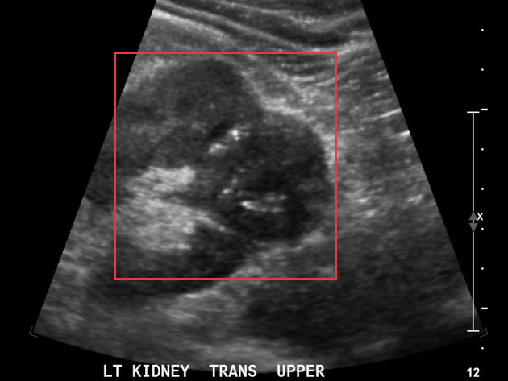

- **Modality / subcategory：** Ultrasound / missing
- **bbox_2d：** `[225, 137, 663, 735]`
- **Lingshu caption：** The left kidney is enlarged with multiple cystic structures throughout the parenchyma. The largest cyst measures 1.5 cm. There is no evidence of hydronephrosis. The right kidney is normal in size and appearance.

### Finding 2: `study_000_ultrasound_image_001_missing_f01`

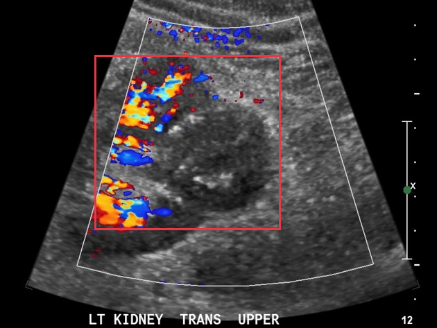

- **Modality / subcategory：** Ultrasound / missing
- **bbox_2d：** `[216, 168, 642, 700]`
- **Lingshu caption：** The left kidney demonstrates increased cortical echogenicity compared to the renal sinus. There is no evidence of hydronephrosis. The right kidney appears unremarkable. Color Doppler demonstrates normal flow within the left renal artery and vein.

### Finding 3: `study_001_ct_image_000_axial_non_contrast_f01`

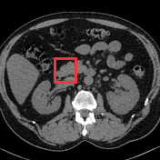

- **Modality / subcategory：** CT / Axial non-contrast
- **bbox_2d：** `[340, 360, 480, 520]`
- **Lingshu caption：** The boxed region contains the right kidney. The kidney appears to have a normal size and shape. There is no evidence of hydronephrosis or focal mass lesions. The renal parenchyma appears homogeneous without any areas of abnormal attenuation. Surrounding structures including the liver, spleen, pancreas, and bowel loops appear unremarkable. No significant lymphadenopathy or free fluid is noted in the abdominal cavity.

### Finding 4: `study_001_ct_image_000_axial_non_contrast_f02`

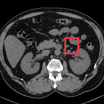

- **Modality / subcategory：** CT / Axial non-contrast
- **bbox_2d：** `[620, 360, 760, 520]`
- **Lingshu caption：** The red box is located in the left upper quadrant of the abdomen. Within this region, there appears to be a mass-like lesion that is hypodense compared to the surrounding tissues. The lesion is well-circumscribed and measures approximately 3 cm in diameter. There is no evidence of invasion into adjacent structures. Surrounding the lesion, the fat planes appear preserved, and there is no significant lymphadenopathy noted in the vicinity. The adjacent bowel loops do not show any signs of obstruction or thickening. The liver, spleen, and kidneys appear unremarkable in this slice.

### Finding 5: `study_001_ct_image_003_sagittal_renal_parenchymal_phase_f01`

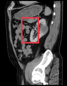

- **Modality / subcategory：** CT / Sagittal renal parenchymal phase
- **bbox_2d：** `[320, 200, 580, 500]`
- **Lingshu caption：** The image shows a sagittal view of the abdomen with a focus on the kidneys. The boxed region highlights an area of interest within the left kidney. Within this region, there appears to be a hypodense lesion, which could indicate a potential abnormality such as a cyst or mass. The surrounding renal parenchyma appears relatively normal, with no obvious signs of hydronephrosis or other structural abnormalities. The adjacent structures, including the spine and bowel loops, appear unremarkable. There is no evidence of significant contrast enhancement within the boxed region, suggesting that the lesion may be non-enhancing. Further evaluation with additional imaging modalities or clinical correlation may be necessary for a more definitive assessment.

### Finding 6: `study_002_pathology_image_000_gross_pathology_f01`

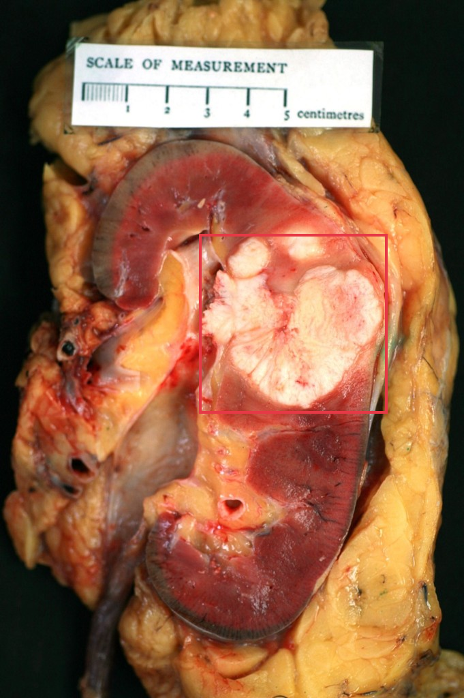

- **Modality / subcategory：** Pathology / Gross pathology
- **bbox_2d：** `[430, 335, 835, 592]`
- **Lingshu caption：** The heart is opened to show the left ventricle and mitral valve. The mitral valve is thickened and has multiple vegetations on the anterior leaflet. The largest vegetation measures 2.5 x 1.5 cm. There is no evidence of perforation.

### Finding 7: `study_003_pathology_image_000_10_h_e_f01`

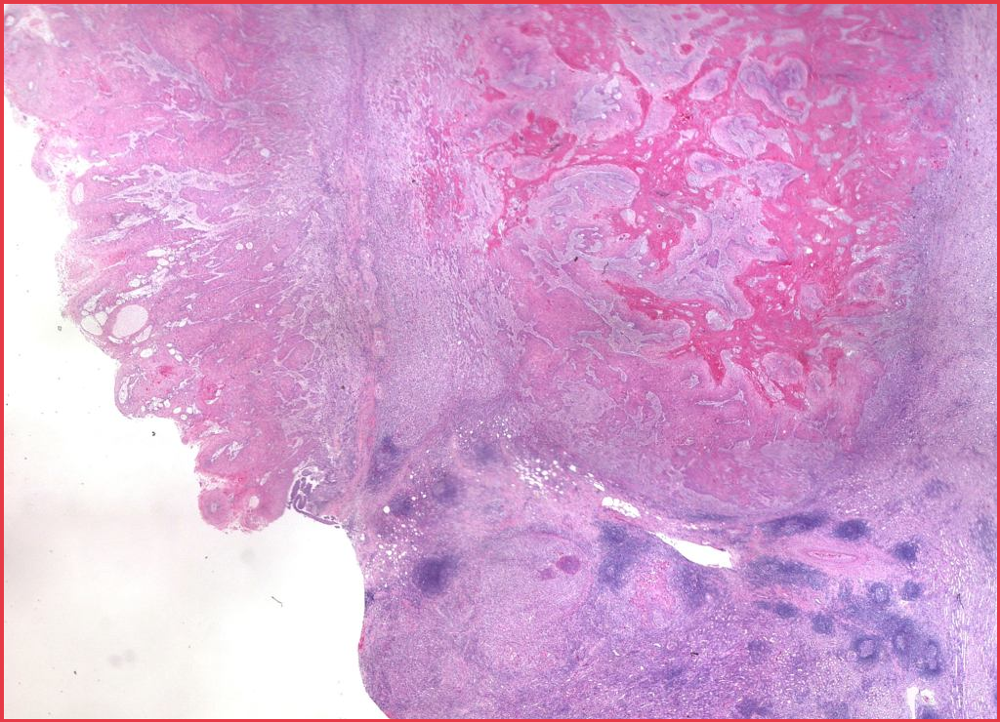

- **Modality / subcategory：** Pathology / 10 H&amp;E
- **bbox_2d：** `[0, 0, 1000, 1000]`
- **Lingshu caption：** The image shows a section of tissue stained with hematoxylin and eosin (H&amp;E). The boxed region appears to contain an area of abnormal cellular architecture. There is a noticeable difference in cell density and organization compared to the surrounding tissue. The cells within the boxed region seem to have irregular shapes and sizes, suggesting possible dysplasia or neoplastic changes. The stroma surrounding this area appears more fibrous and less cellular, indicating a possible reactive process. Additionally, there are areas of increased vascularity and potential necrosis within the boxed region, which could be indicative of aggressive growth patterns. The overall morphology suggests a significant deviation from normal histological structure, warranting further investigation.

### Finding 8: `study_003_pathology_image_001_100x_h_e_f01`

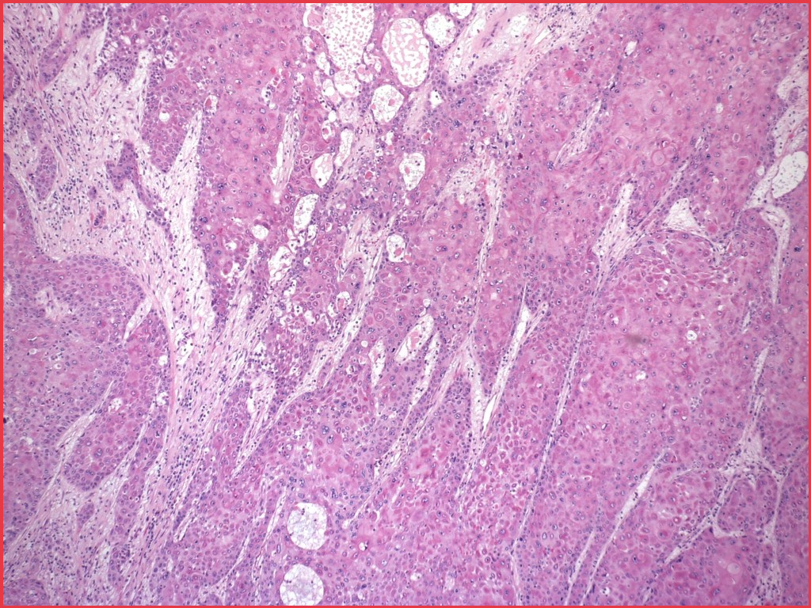

- **Modality / subcategory：** Pathology / 100x H&amp;E
- **bbox_2d：** `[0, 0, 1000, 1000]`
- **Lingshu caption：** The image shows a histological section stained with hematoxylin and eosin (H&amp;E) at 100x magnification. The tissue appears to be from a glandular organ, likely the pancreas or salivary gland. The boxed region highlights an area with notable features. Within this region, there are clusters of cells with prominent nuclei and a high nuclear-to-cytoplasmic ratio, suggesting cellular proliferation. The surrounding stroma appears fibrotic with some inflammatory infiltrate. There are also areas of necrosis and possible ductal structures. The overall architecture suggests a neoplastic process, with potential invasion into adjacent tissues.

### Finding 9: `study_003_pathology_image_002_200_h_e_f01`

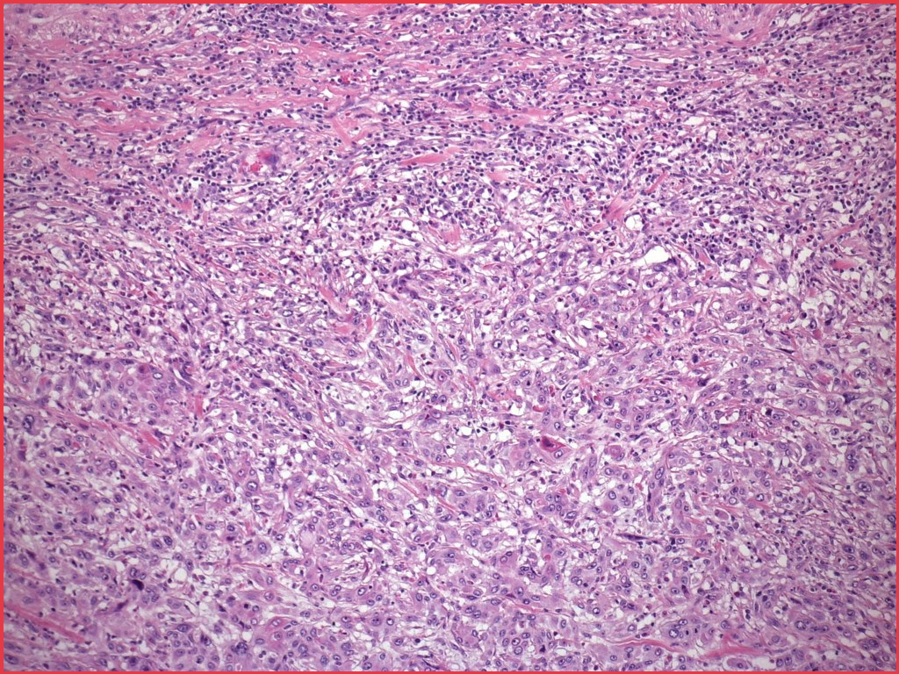

- **Modality / subcategory：** Pathology / 200 H&amp;E
- **bbox_2d：** `[0, 0, 1000, 1000]`
- **Lingshu caption：** The image shows a histological section stained with Hematoxylin and Eosin (H&amp;E). The tissue appears to be composed of densely packed cells with varying degrees of pleomorphism. There are numerous mitotic figures indicating high cellular proliferation. The cells exhibit hyperchromatic nuclei and prominent nucleoli, suggesting aggressive behavior. The stroma appears fibrous with areas of necrosis. The boxed region highlights an area with particularly high cellularity and atypical features, including irregular nuclear contours and increased mitotic activity. This region stands out due to its dense clustering of abnormal cells compared to the surrounding tissue.

## Directed Cross-image Validation

### Anchor 1: `study_000_ultrasound_image_000_missing_f01`

**Anchor Lingshu caption：** The left kidney is enlarged with multiple cystic structures throughout the parenchyma. The largest cyst measures 1.5 cm. There is no evidence of hydronephrosis. The right kidney is normal in size and appearance.

#### location_00001: STRONG SUPPORT

<table>
<tr><th>Anchor original bbox</th><th>Cross-image grounded target bbox</th><th>Existing target bbox: study_000_ultrasound_image_001_missing_f01</th></tr>
<tr><td></td><td>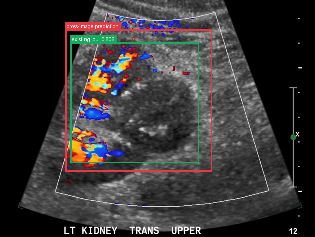</td><td></td></tr>
</table>

- **Target：** `study_000_ultrasound_image_001_missing`; Ultrasound; missing
- **Relation：** `bbox_to_bbox` / `strong_support`
- **Returned target bbox：** `[208, 123, 675, 727]`
- **Maximum IoU：** 0.806; threshold=0.5
- **Strong relation IDs：** `[&#x27;strong_location_00001_01&#x27;]`

**IoU matching：**

| Existing target bbox | IoU | Strong match | Lingshu caption |
|---|---:|---|---|
| `study_000_ultrasound_image_001_missing_f01`; `[216, 168, 642, 700]` | 0.806 | yes | The left kidney demonstrates increased cortical echogenicity compared to the renal sinus. There is no evidence of hydronephrosis. The right kidney appears unremarkable. Color Doppler demonstrates normal flow within the left renal artery and vein. |

#### location_00002: NOT SUPPORT

<table>
<tr><th>Anchor original bbox</th><th>Target original image; model returned null</th><th>Existing target bbox: study_001_ct_image_000_axial_non_contrast_f01</th><th>Existing target bbox: study_001_ct_image_000_axial_non_contrast_f02</th></tr>
<tr><td></td><td></td><td></td><td></td></tr>
</table>

- **Target：** `study_001_ct_image_000_axial_non_contrast`; CT; Axial non-contrast
- **Relation：** `bbox_to_image` / `not_support`
- **Returned target bbox：** `unknown`
- **Maximum IoU：** n/a; threshold=0.5
- **Strong relation IDs：** `[]`

**IoU matching：**

| Existing target bbox | IoU | Strong match | Lingshu caption |
|---|---:|---|---|
| `study_001_ct_image_000_axial_non_contrast_f01`; `[340, 360, 480, 520]` | n/a | n/a | The boxed region contains the right kidney. The kidney appears to have a normal size and shape. There is no evidence of hydronephrosis or focal mass lesions. The renal parenchyma appears homogeneous without any areas of abnormal attenuation. Surrounding structures including the liver, spleen, pancreas, and bowel loops appear unremarkable. No significant lymphadenopathy or free fluid is noted in the abdominal cavity. |
| `study_001_ct_image_000_axial_non_contrast_f02`; `[620, 360, 760, 520]` | n/a | n/a | The red box is located in the left upper quadrant of the abdomen. Within this region, there appears to be a mass-like lesion that is hypodense compared to the surrounding tissues. The lesion is well-circumscribed and measures approximately 3 cm in diameter. There is no evidence of invasion into adjacent structures. Surrounding the lesion, the fat planes appear preserved, and there is no significant lymphadenopathy noted in the vicinity. The adjacent bowel loops do not show any signs of obstruction or thickening. The liver, spleen, and kidneys appear unremarkable in this slice. |

#### location_00003: NOT SUPPORT

<table>
<tr><th>Anchor original bbox</th><th>Target original image; model returned null</th></tr>
<tr><td></td><td></td></tr>
</table>

- **Target：** `study_001_ct_image_001_axial_renal_cortical_phase`; CT; Axial renal cortical phase
- **Relation：** `bbox_to_image` / `not_support`
- **Returned target bbox：** `unknown`
- **Maximum IoU：** n/a; threshold=0.5
- **Strong relation IDs：** `[]`

**IoU matching：**

The target image has no existing Step 2 bbox.

#### location_00004: NOT SUPPORT

<table>
<tr><th>Anchor original bbox</th><th>Target original image; model returned null</th></tr>
<tr><td></td><td>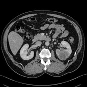</td></tr>
</table>

- **Target：** `study_001_ct_image_002_axial_renal_parenchymal_phase`; CT; Axial renal parenchymal phase
- **Relation：** `bbox_to_image` / `not_support`
- **Returned target bbox：** `unknown`
- **Maximum IoU：** n/a; threshold=0.5
- **Strong relation IDs：** `[]`

**IoU matching：**

The target image has no existing Step 2 bbox.

#### location_00005: NOT SUPPORT

<table>
<tr><th>Anchor original bbox</th><th>Target original image; model returned null</th><th>Existing target bbox: study_001_ct_image_003_sagittal_renal_parenchymal_phase_f01</th></tr>
<tr><td></td><td>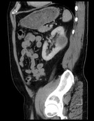</td><td></td></tr>
</table>

- **Target：** `study_001_ct_image_003_sagittal_renal_parenchymal_phase`; CT; Sagittal renal parenchymal phase
- **Relation：** `bbox_to_image` / `not_support`
- **Returned target bbox：** `unknown`
- **Maximum IoU：** n/a; threshold=0.5
- **Strong relation IDs：** `[]`

**IoU matching：**

| Existing target bbox | IoU | Strong match | Lingshu caption |
|---|---:|---|---|
| `study_001_ct_image_003_sagittal_renal_parenchymal_phase_f01`; `[320, 200, 580, 500]` | n/a | n/a | The image shows a sagittal view of the abdomen with a focus on the kidneys. The boxed region highlights an area of interest within the left kidney. Within this region, there appears to be a hypodense lesion, which could indicate a potential abnormality such as a cyst or mass. The surrounding renal parenchyma appears relatively normal, with no obvious signs of hydronephrosis or other structural abnormalities. The adjacent structures, including the spine and bowel loops, appear unremarkable. There is no evidence of significant contrast enhancement within the boxed region, suggesting that the lesion may be non-enhancing. Further evaluation with additional imaging modalities or clinical correlation may be necessary for a more definitive assessment. |

#### location_00006: STRONG SUPPORT

<table>
<tr><th>Anchor original bbox</th><th>Cross-image grounded target bbox</th><th>Existing target bbox: study_002_pathology_image_000_gross_pathology_f01</th></tr>
<tr><td></td><td></td><td></td></tr>
</table>

- **Target：** `study_002_pathology_image_000_gross_pathology`; Pathology; Gross pathology
- **Relation：** `bbox_to_bbox` / `strong_support`
- **Returned target bbox：** `[433, 330, 838, 598]`
- **Maximum IoU：** 0.943; threshold=0.5
- **Strong relation IDs：** `[&#x27;strong_location_00006_01&#x27;]`

**IoU matching：**

| Existing target bbox | IoU | Strong match | Lingshu caption |
|---|---:|---|---|
| `study_002_pathology_image_000_gross_pathology_f01`; `[430, 335, 835, 592]` | 0.943 | yes | The heart is opened to show the left ventricle and mitral valve. The mitral valve is thickened and has multiple vegetations on the anterior leaflet. The largest vegetation measures 2.5 x 1.5 cm. There is no evidence of perforation. |

#### location_00007: NOT SUPPORT

<table>
<tr><th>Anchor original bbox</th><th>Target original image; model returned null</th><th>Existing target bbox: study_003_pathology_image_000_10_h_e_f01</th></tr>
<tr><td></td><td>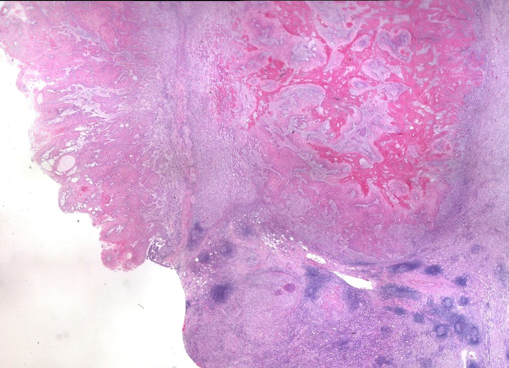</td><td></td></tr>
</table>

- **Target：** `study_003_pathology_image_000_10_h_e`; Pathology; 10 H&amp;E
- **Relation：** `bbox_to_image` / `not_support`
- **Returned target bbox：** `unknown`
- **Maximum IoU：** n/a; threshold=0.5
- **Strong relation IDs：** `[]`

**IoU matching：**

| Existing target bbox | IoU | Strong match | Lingshu caption |
|---|---:|---|---|
| `study_003_pathology_image_000_10_h_e_f01`; `[0, 0, 1000, 1000]` | n/a | n/a | The image shows a section of tissue stained with hematoxylin and eosin (H&amp;E). The boxed region appears to contain an area of abnormal cellular architecture. There is a noticeable difference in cell density and organization compared to the surrounding tissue. The cells within the boxed region seem to have irregular shapes and sizes, suggesting possible dysplasia or neoplastic changes. The stroma surrounding this area appears more fibrous and less cellular, indicating a possible reactive process. Additionally, there are areas of increased vascularity and potential necrosis within the boxed region, which could be indicative of aggressive growth patterns. The overall morphology suggests a significant deviation from normal histological structure, warranting further investigation. |

#### location_00008: NOT SUPPORT

<table>
<tr><th>Anchor original bbox</th><th>Target original image; model returned null</th><th>Existing target bbox: study_003_pathology_image_001_100x_h_e_f01</th></tr>
<tr><td></td><td></td><td></td></tr>
</table>

- **Target：** `study_003_pathology_image_001_100x_h_e`; Pathology; 100x H&amp;E
- **Relation：** `bbox_to_image` / `not_support`
- **Returned target bbox：** `unknown`
- **Maximum IoU：** n/a; threshold=0.5
- **Strong relation IDs：** `[]`

**IoU matching：**

| Existing target bbox | IoU | Strong match | Lingshu caption |
|---|---:|---|---|
| `study_003_pathology_image_001_100x_h_e_f01`; `[0, 0, 1000, 1000]` | n/a | n/a | The image shows a histological section stained with hematoxylin and eosin (H&amp;E) at 100x magnification. The tissue appears to be from a glandular organ, likely the pancreas or salivary gland. The boxed region highlights an area with notable features. Within this region, there are clusters of cells with prominent nuclei and a high nuclear-to-cytoplasmic ratio, suggesting cellular proliferation. The surrounding stroma appears fibrotic with some inflammatory infiltrate. There are also areas of necrosis and possible ductal structures. The overall architecture suggests a neoplastic process, with potential invasion into adjacent tissues. |

#### location_00009: NOT SUPPORT

<table>
<tr><th>Anchor original bbox</th><th>Target original image; model returned null</th><th>Existing target bbox: study_003_pathology_image_002_200_h_e_f01</th></tr>
<tr><td></td><td></td><td></td></tr>
</table>

- **Target：** `study_003_pathology_image_002_200_h_e`; Pathology; 200 H&amp;E
- **Relation：** `bbox_to_image` / `not_support`
- **Returned target bbox：** `unknown`
- **Maximum IoU：** n/a; threshold=0.5
- **Strong relation IDs：** `[]`

**IoU matching：**

| Existing target bbox | IoU | Strong match | Lingshu caption |
|---|---:|---|---|
| `study_003_pathology_image_002_200_h_e_f01`; `[0, 0, 1000, 1000]` | n/a | n/a | The image shows a histological section stained with Hematoxylin and Eosin (H&amp;E). The tissue appears to be composed of densely packed cells with varying degrees of pleomorphism. There are numerous mitotic figures indicating high cellular proliferation. The cells exhibit hyperchromatic nuclei and prominent nucleoli, suggesting aggressive behavior. The stroma appears fibrous with areas of necrosis. The boxed region highlights an area with particularly high cellularity and atypical features, including irregular nuclear contours and increased mitotic activity. This region stands out due to its dense clustering of abnormal cells compared to the surrounding tissue. |

### Anchor 2: `study_001_ct_image_000_axial_non_contrast_f01`

**Anchor Lingshu caption：** The boxed region contains the right kidney. The kidney appears to have a normal size and shape. There is no evidence of hydronephrosis or focal mass lesions. The renal parenchyma appears homogeneous without any areas of abnormal attenuation. Surrounding structures including the liver, spleen, pancreas, and bowel loops appear unremarkable. No significant lymphadenopathy or free fluid is noted in the abdominal cavity.

#### location_00018: PARTIAL SUPPORT

<table>
<tr><th>Anchor original bbox</th><th>Cross-image grounded target bbox</th></tr>
<tr><td></td><td>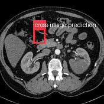</td></tr>
</table>

- **Target：** `study_001_ct_image_001_axial_renal_cortical_phase`; CT; Axial renal cortical phase
- **Relation：** `bbox_to_image` / `partial_support`
- **Returned target bbox：** `[320, 275, 440, 425]`
- **Maximum IoU：** n/a; threshold=0.5
- **Strong relation IDs：** `[]`

**IoU matching：**

The target image has no existing Step 2 bbox.

**Target Lingshu caption：** unavailable. This is a newly re-grounded bbox and has not passed through Step 2 Lingshu captioning.

#### location_00019: PARTIAL SUPPORT

<table>
<tr><th>Anchor original bbox</th><th>Cross-image grounded target bbox</th></tr>
<tr><td></td><td>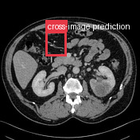</td></tr>
</table>

- **Target：** `study_001_ct_image_002_axial_renal_parenchymal_phase`; CT; Axial renal parenchymal phase
- **Relation：** `bbox_to_image` / `partial_support`
- **Returned target bbox：** `[325, 224, 481, 404]`
- **Maximum IoU：** n/a; threshold=0.5
- **Strong relation IDs：** `[]`

**IoU matching：**

The target image has no existing Step 2 bbox.

**Target Lingshu caption：** unavailable. This is a newly re-grounded bbox and has not passed through Step 2 Lingshu captioning.

#### location_00020: PARTIAL SUPPORT

<table>
<tr><th>Anchor original bbox</th><th>Cross-image grounded target bbox</th><th>Existing target bbox: study_001_ct_image_003_sagittal_renal_parenchymal_phase_f01</th></tr>
<tr><td></td><td>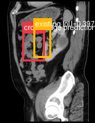</td><td></td></tr>
</table>

- **Target：** `study_001_ct_image_003_sagittal_renal_parenchymal_phase`; CT; Sagittal renal parenchymal phase
- **Relation：** `bbox_to_image` / `partial_support`
- **Returned target bbox：** `[240, 260, 480, 500]`
- **Maximum IoU：** 0.397; threshold=0.5
- **Strong relation IDs：** `[]`

**IoU matching：**

| Existing target bbox | IoU | Strong match | Lingshu caption |
|---|---:|---|---|
| `study_001_ct_image_003_sagittal_renal_parenchymal_phase_f01`; `[320, 200, 580, 500]` | 0.397 | no | The image shows a sagittal view of the abdomen with a focus on the kidneys. The boxed region highlights an area of interest within the left kidney. Within this region, there appears to be a hypodense lesion, which could indicate a potential abnormality such as a cyst or mass. The surrounding renal parenchyma appears relatively normal, with no obvious signs of hydronephrosis or other structural abnormalities. The adjacent structures, including the spine and bowel loops, appear unremarkable. There is no evidence of significant contrast enhancement within the boxed region, suggesting that the lesion may be non-enhancing. Further evaluation with additional imaging modalities or clinical correlation may be necessary for a more definitive assessment. |

**Target Lingshu caption：** unavailable. This is a newly re-grounded bbox and has not passed through Step 2 Lingshu captioning.

#### location_00021: STRONG SUPPORT

<table>
<tr><th>Anchor original bbox</th><th>Cross-image grounded target bbox</th><th>Existing target bbox: study_002_pathology_image_000_gross_pathology_f01</th></tr>
<tr><td></td><td></td><td></td></tr>
</table>

- **Target：** `study_002_pathology_image_000_gross_pathology`; Pathology; Gross pathology
- **Relation：** `bbox_to_bbox` / `strong_support`
- **Returned target bbox：** `[429, 328, 832, 608]`
- **Maximum IoU：** 0.910; threshold=0.5
- **Strong relation IDs：** `[&#x27;strong_location_00021_01&#x27;]`

**IoU matching：**

| Existing target bbox | IoU | Strong match | Lingshu caption |
|---|---:|---|---|
| `study_002_pathology_image_000_gross_pathology_f01`; `[430, 335, 835, 592]` | 0.910 | yes | The heart is opened to show the left ventricle and mitral valve. The mitral valve is thickened and has multiple vegetations on the anterior leaflet. The largest vegetation measures 2.5 x 1.5 cm. There is no evidence of perforation. |

#### location_00022: NOT SUPPORT

<table>
<tr><th>Anchor original bbox</th><th>Target original image; model returned null</th><th>Existing target bbox: study_003_pathology_image_000_10_h_e_f01</th></tr>
<tr><td></td><td></td><td></td></tr>
</table>

- **Target：** `study_003_pathology_image_000_10_h_e`; Pathology; 10 H&amp;E
- **Relation：** `bbox_to_image` / `not_support`
- **Returned target bbox：** `unknown`
- **Maximum IoU：** n/a; threshold=0.5
- **Strong relation IDs：** `[]`

**IoU matching：**

| Existing target bbox | IoU | Strong match | Lingshu caption |
|---|---:|---|---|
| `study_003_pathology_image_000_10_h_e_f01`; `[0, 0, 1000, 1000]` | n/a | n/a | The image shows a section of tissue stained with hematoxylin and eosin (H&amp;E). The boxed region appears to contain an area of abnormal cellular architecture. There is a noticeable difference in cell density and organization compared to the surrounding tissue. The cells within the boxed region seem to have irregular shapes and sizes, suggesting possible dysplasia or neoplastic changes. The stroma surrounding this area appears more fibrous and less cellular, indicating a possible reactive process. Additionally, there are areas of increased vascularity and potential necrosis within the boxed region, which could be indicative of aggressive growth patterns. The overall morphology suggests a significant deviation from normal histological structure, warranting further investigation. |

#### location_00023: NOT SUPPORT

<table>
<tr><th>Anchor original bbox</th><th>Target original image; model returned null</th><th>Existing target bbox: study_003_pathology_image_001_100x_h_e_f01</th></tr>
<tr><td></td><td></td><td></td></tr>
</table>

- **Target：** `study_003_pathology_image_001_100x_h_e`; Pathology; 100x H&amp;E
- **Relation：** `bbox_to_image` / `not_support`
- **Returned target bbox：** `unknown`
- **Maximum IoU：** n/a; threshold=0.5
- **Strong relation IDs：** `[]`

**IoU matching：**

| Existing target bbox | IoU | Strong match | Lingshu caption |
|---|---:|---|---|
| `study_003_pathology_image_001_100x_h_e_f01`; `[0, 0, 1000, 1000]` | n/a | n/a | The image shows a histological section stained with hematoxylin and eosin (H&amp;E) at 100x magnification. The tissue appears to be from a glandular organ, likely the pancreas or salivary gland. The boxed region highlights an area with notable features. Within this region, there are clusters of cells with prominent nuclei and a high nuclear-to-cytoplasmic ratio, suggesting cellular proliferation. The surrounding stroma appears fibrotic with some inflammatory infiltrate. There are also areas of necrosis and possible ductal structures. The overall architecture suggests a neoplastic process, with potential invasion into adjacent tissues. |

#### location_00024: NOT SUPPORT

<table>
<tr><th>Anchor original bbox</th><th>Target original image; model returned null</th><th>Existing target bbox: study_003_pathology_image_002_200_h_e_f01</th></tr>
<tr><td></td><td></td><td></td></tr>
</table>

- **Target：** `study_003_pathology_image_002_200_h_e`; Pathology; 200 H&amp;E
- **Relation：** `bbox_to_image` / `not_support`
- **Returned target bbox：** `unknown`
- **Maximum IoU：** n/a; threshold=0.5
- **Strong relation IDs：** `[]`

**IoU matching：**

| Existing target bbox | IoU | Strong match | Lingshu caption |
|---|---:|---|---|
| `study_003_pathology_image_002_200_h_e_f01`; `[0, 0, 1000, 1000]` | n/a | n/a | The image shows a histological section stained with Hematoxylin and Eosin (H&amp;E). The tissue appears to be composed of densely packed cells with varying degrees of pleomorphism. There are numerous mitotic figures indicating high cellular proliferation. The cells exhibit hyperchromatic nuclei and prominent nucleoli, suggesting aggressive behavior. The stroma appears fibrous with areas of necrosis. The boxed region highlights an area with particularly high cellularity and atypical features, including irregular nuclear contours and increased mitotic activity. This region stands out due to its dense clustering of abnormal cells compared to the surrounding tissue. |

### Anchor 3: `study_001_ct_image_000_axial_non_contrast_f02`

**Anchor Lingshu caption：** The red box is located in the left upper quadrant of the abdomen. Within this region, there appears to be a mass-like lesion that is hypodense compared to the surrounding tissues. The lesion is well-circumscribed and measures approximately 3 cm in diameter. There is no evidence of invasion into adjacent structures. Surrounding the lesion, the fat planes appear preserved, and there is no significant lymphadenopathy noted in the vicinity. The adjacent bowel loops do not show any signs of obstruction or thickening. The liver, spleen, and kidneys appear unremarkable in this slice.

#### location_00025: PARTIAL SUPPORT

<table>
<tr><th>Anchor original bbox</th><th>Cross-image grounded target bbox</th></tr>
<tr><td></td><td>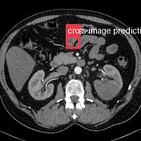</td></tr>
</table>

- **Target：** `study_001_ct_image_001_axial_renal_cortical_phase`; CT; Axial renal cortical phase
- **Relation：** `bbox_to_image` / `partial_support`
- **Returned target bbox：** `[468, 250, 572, 350]`
- **Maximum IoU：** n/a; threshold=0.5
- **Strong relation IDs：** `[]`

**IoU matching：**

The target image has no existing Step 2 bbox.

**Target Lingshu caption：** unavailable. This is a newly re-grounded bbox and has not passed through Step 2 Lingshu captioning.

#### location_00026: PARTIAL SUPPORT

<table>
<tr><th>Anchor original bbox</th><th>Cross-image grounded target bbox</th></tr>
<tr><td></td><td>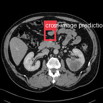</td></tr>
</table>

- **Target：** `study_001_ct_image_002_axial_renal_parenchymal_phase`; CT; Axial renal parenchymal phase
- **Relation：** `bbox_to_image` / `partial_support`
- **Returned target bbox：** `[430, 280, 550, 400]`
- **Maximum IoU：** n/a; threshold=0.5
- **Strong relation IDs：** `[]`

**IoU matching：**

The target image has no existing Step 2 bbox.

**Target Lingshu caption：** unavailable. This is a newly re-grounded bbox and has not passed through Step 2 Lingshu captioning.

#### location_00027: PARTIAL SUPPORT

<table>
<tr><th>Anchor original bbox</th><th>Cross-image grounded target bbox</th><th>Existing target bbox: study_001_ct_image_003_sagittal_renal_parenchymal_phase_f01</th></tr>
<tr><td></td><td>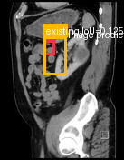</td><td></td></tr>
</table>

- **Target：** `study_001_ct_image_003_sagittal_renal_parenchymal_phase`; CT; Sagittal renal parenchymal phase
- **Relation：** `bbox_to_image` / `partial_support`
- **Returned target bbox：** `[350, 250, 450, 350]`
- **Maximum IoU：** 0.125; threshold=0.5
- **Strong relation IDs：** `[]`

**IoU matching：**

| Existing target bbox | IoU | Strong match | Lingshu caption |
|---|---:|---|---|
| `study_001_ct_image_003_sagittal_renal_parenchymal_phase_f01`; `[320, 200, 580, 500]` | 0.125 | no | The image shows a sagittal view of the abdomen with a focus on the kidneys. The boxed region highlights an area of interest within the left kidney. Within this region, there appears to be a hypodense lesion, which could indicate a potential abnormality such as a cyst or mass. The surrounding renal parenchyma appears relatively normal, with no obvious signs of hydronephrosis or other structural abnormalities. The adjacent structures, including the spine and bowel loops, appear unremarkable. There is no evidence of significant contrast enhancement within the boxed region, suggesting that the lesion may be non-enhancing. Further evaluation with additional imaging modalities or clinical correlation may be necessary for a more definitive assessment. |

**Target Lingshu caption：** unavailable. This is a newly re-grounded bbox and has not passed through Step 2 Lingshu captioning.

#### location_00028: NOT SUPPORT

<table>
<tr><th>Anchor original bbox</th><th>Target original image; model returned null</th><th>Existing target bbox: study_002_pathology_image_000_gross_pathology_f01</th></tr>
<tr><td></td><td></td><td></td></tr>
</table>

- **Target：** `study_002_pathology_image_000_gross_pathology`; Pathology; Gross pathology
- **Relation：** `bbox_to_image` / `not_support`
- **Returned target bbox：** `unknown`
- **Maximum IoU：** n/a; threshold=0.5
- **Strong relation IDs：** `[]`

**IoU matching：**

| Existing target bbox | IoU | Strong match | Lingshu caption |
|---|---:|---|---|
| `study_002_pathology_image_000_gross_pathology_f01`; `[430, 335, 835, 592]` | n/a | n/a | The heart is opened to show the left ventricle and mitral valve. The mitral valve is thickened and has multiple vegetations on the anterior leaflet. The largest vegetation measures 2.5 x 1.5 cm. There is no evidence of perforation. |

#### location_00029: NOT SUPPORT

<table>
<tr><th>Anchor original bbox</th><th>Target original image; model returned null</th><th>Existing target bbox: study_003_pathology_image_000_10_h_e_f01</th></tr>
<tr><td></td><td></td><td></td></tr>
</table>

- **Target：** `study_003_pathology_image_000_10_h_e`; Pathology; 10 H&amp;E
- **Relation：** `bbox_to_image` / `not_support`
- **Returned target bbox：** `unknown`
- **Maximum IoU：** n/a; threshold=0.5
- **Strong relation IDs：** `[]`

**IoU matching：**

| Existing target bbox | IoU | Strong match | Lingshu caption |
|---|---:|---|---|
| `study_003_pathology_image_000_10_h_e_f01`; `[0, 0, 1000, 1000]` | n/a | n/a | The image shows a section of tissue stained with hematoxylin and eosin (H&amp;E). The boxed region appears to contain an area of abnormal cellular architecture. There is a noticeable difference in cell density and organization compared to the surrounding tissue. The cells within the boxed region seem to have irregular shapes and sizes, suggesting possible dysplasia or neoplastic changes. The stroma surrounding this area appears more fibrous and less cellular, indicating a possible reactive process. Additionally, there are areas of increased vascularity and potential necrosis within the boxed region, which could be indicative of aggressive growth patterns. The overall morphology suggests a significant deviation from normal histological structure, warranting further investigation. |

#### location_00030: NOT SUPPORT

<table>
<tr><th>Anchor original bbox</th><th>Target original image; model returned null</th><th>Existing target bbox: study_003_pathology_image_001_100x_h_e_f01</th></tr>
<tr><td></td><td></td><td></td></tr>
</table>

- **Target：** `study_003_pathology_image_001_100x_h_e`; Pathology; 100x H&amp;E
- **Relation：** `bbox_to_image` / `not_support`
- **Returned target bbox：** `unknown`
- **Maximum IoU：** n/a; threshold=0.5
- **Strong relation IDs：** `[]`

**IoU matching：**

| Existing target bbox | IoU | Strong match | Lingshu caption |
|---|---:|---|---|
| `study_003_pathology_image_001_100x_h_e_f01`; `[0, 0, 1000, 1000]` | n/a | n/a | The image shows a histological section stained with hematoxylin and eosin (H&amp;E) at 100x magnification. The tissue appears to be from a glandular organ, likely the pancreas or salivary gland. The boxed region highlights an area with notable features. Within this region, there are clusters of cells with prominent nuclei and a high nuclear-to-cytoplasmic ratio, suggesting cellular proliferation. The surrounding stroma appears fibrotic with some inflammatory infiltrate. There are also areas of necrosis and possible ductal structures. The overall architecture suggests a neoplastic process, with potential invasion into adjacent tissues. |

#### location_00031: NOT SUPPORT

<table>
<tr><th>Anchor original bbox</th><th>Target original image; model returned null</th><th>Existing target bbox: study_003_pathology_image_002_200_h_e_f01</th></tr>
<tr><td></td><td></td><td></td></tr>
</table>

- **Target：** `study_003_pathology_image_002_200_h_e`; Pathology; 200 H&amp;E
- **Relation：** `bbox_to_image` / `not_support`
- **Returned target bbox：** `unknown`
- **Maximum IoU：** n/a; threshold=0.5
- **Strong relation IDs：** `[]`

**IoU matching：**

| Existing target bbox | IoU | Strong match | Lingshu caption |
|---|---:|---|---|
| `study_003_pathology_image_002_200_h_e_f01`; `[0, 0, 1000, 1000]` | n/a | n/a | The image shows a histological section stained with Hematoxylin and Eosin (H&amp;E). The tissue appears to be composed of densely packed cells with varying degrees of pleomorphism. There are numerous mitotic figures indicating high cellular proliferation. The cells exhibit hyperchromatic nuclei and prominent nucleoli, suggesting aggressive behavior. The stroma appears fibrous with areas of necrosis. The boxed region highlights an area with particularly high cellularity and atypical features, including irregular nuclear contours and increased mitotic activity. This region stands out due to its dense clustering of abnormal cells compared to the surrounding tissue. |

### Anchor 4: `study_001_ct_image_003_sagittal_renal_parenchymal_phase_f01`

**Anchor Lingshu caption：** The image shows a sagittal view of the abdomen with a focus on the kidneys. The boxed region highlights an area of interest within the left kidney. Within this region, there appears to be a hypodense lesion, which could indicate a potential abnormality such as a cyst or mass. The surrounding renal parenchyma appears relatively normal, with no obvious signs of hydronephrosis or other structural abnormalities. The adjacent structures, including the spine and bowel loops, appear unremarkable. There is no evidence of significant contrast enhancement within the boxed region, suggesting that the lesion may be non-enhancing. Further evaluation with additional imaging modalities or clinical correlation may be necessary for a more definitive assessment.

#### location_00032: NOT SUPPORT

<table>
<tr><th>Anchor original bbox</th><th>Target original image; model returned null</th><th>Existing target bbox: study_002_pathology_image_000_gross_pathology_f01</th></tr>
<tr><td></td><td></td><td></td></tr>
</table>

- **Target：** `study_002_pathology_image_000_gross_pathology`; Pathology; Gross pathology
- **Relation：** `bbox_to_image` / `not_support`
- **Returned target bbox：** `unknown`
- **Maximum IoU：** n/a; threshold=0.5
- **Strong relation IDs：** `[]`

**IoU matching：**

| Existing target bbox | IoU | Strong match | Lingshu caption |
|---|---:|---|---|
| `study_002_pathology_image_000_gross_pathology_f01`; `[430, 335, 835, 592]` | n/a | n/a | The heart is opened to show the left ventricle and mitral valve. The mitral valve is thickened and has multiple vegetations on the anterior leaflet. The largest vegetation measures 2.5 x 1.5 cm. There is no evidence of perforation. |

#### location_00033: NOT SUPPORT

<table>
<tr><th>Anchor original bbox</th><th>Target original image; model returned null</th><th>Existing target bbox: study_003_pathology_image_000_10_h_e_f01</th></tr>
<tr><td></td><td></td><td></td></tr>
</table>

- **Target：** `study_003_pathology_image_000_10_h_e`; Pathology; 10 H&amp;E
- **Relation：** `bbox_to_image` / `not_support`
- **Returned target bbox：** `unknown`
- **Maximum IoU：** n/a; threshold=0.5
- **Strong relation IDs：** `[]`

**IoU matching：**

| Existing target bbox | IoU | Strong match | Lingshu caption |
|---|---:|---|---|
| `study_003_pathology_image_000_10_h_e_f01`; `[0, 0, 1000, 1000]` | n/a | n/a | The image shows a section of tissue stained with hematoxylin and eosin (H&amp;E). The boxed region appears to contain an area of abnormal cellular architecture. There is a noticeable difference in cell density and organization compared to the surrounding tissue. The cells within the boxed region seem to have irregular shapes and sizes, suggesting possible dysplasia or neoplastic changes. The stroma surrounding this area appears more fibrous and less cellular, indicating a possible reactive process. Additionally, there are areas of increased vascularity and potential necrosis within the boxed region, which could be indicative of aggressive growth patterns. The overall morphology suggests a significant deviation from normal histological structure, warranting further investigation. |

#### location_00034: NOT SUPPORT

<table>
<tr><th>Anchor original bbox</th><th>Target original image; model returned null</th><th>Existing target bbox: study_003_pathology_image_001_100x_h_e_f01</th></tr>
<tr><td></td><td></td><td></td></tr>
</table>

- **Target：** `study_003_pathology_image_001_100x_h_e`; Pathology; 100x H&amp;E
- **Relation：** `bbox_to_image` / `not_support`
- **Returned target bbox：** `unknown`
- **Maximum IoU：** n/a; threshold=0.5
- **Strong relation IDs：** `[]`

**IoU matching：**

| Existing target bbox | IoU | Strong match | Lingshu caption |
|---|---:|---|---|
| `study_003_pathology_image_001_100x_h_e_f01`; `[0, 0, 1000, 1000]` | n/a | n/a | The image shows a histological section stained with hematoxylin and eosin (H&amp;E) at 100x magnification. The tissue appears to be from a glandular organ, likely the pancreas or salivary gland. The boxed region highlights an area with notable features. Within this region, there are clusters of cells with prominent nuclei and a high nuclear-to-cytoplasmic ratio, suggesting cellular proliferation. The surrounding stroma appears fibrotic with some inflammatory infiltrate. There are also areas of necrosis and possible ductal structures. The overall architecture suggests a neoplastic process, with potential invasion into adjacent tissues. |

#### location_00035: NOT SUPPORT

<table>
<tr><th>Anchor original bbox</th><th>Target original image; model returned null</th><th>Existing target bbox: study_003_pathology_image_002_200_h_e_f01</th></tr>
<tr><td></td><td></td><td></td></tr>
</table>

- **Target：** `study_003_pathology_image_002_200_h_e`; Pathology; 200 H&amp;E
- **Relation：** `bbox_to_image` / `not_support`
- **Returned target bbox：** `unknown`
- **Maximum IoU：** n/a; threshold=0.5
- **Strong relation IDs：** `[]`

**IoU matching：**

| Existing target bbox | IoU | Strong match | Lingshu caption |
|---|---:|---|---|
| `study_003_pathology_image_002_200_h_e_f01`; `[0, 0, 1000, 1000]` | n/a | n/a | The image shows a histological section stained with Hematoxylin and Eosin (H&amp;E). The tissue appears to be composed of densely packed cells with varying degrees of pleomorphism. There are numerous mitotic figures indicating high cellular proliferation. The cells exhibit hyperchromatic nuclei and prominent nucleoli, suggesting aggressive behavior. The stroma appears fibrous with areas of necrosis. The boxed region highlights an area with particularly high cellularity and atypical features, including irregular nuclear contours and increased mitotic activity. This region stands out due to its dense clustering of abnormal cells compared to the surrounding tissue. |

### Anchor 5: `study_003_pathology_image_000_10_h_e_f01`

**Anchor Lingshu caption：** The image shows a section of tissue stained with hematoxylin and eosin (H&amp;E). The boxed region appears to contain an area of abnormal cellular architecture. There is a noticeable difference in cell density and organization compared to the surrounding tissue. The cells within the boxed region seem to have irregular shapes and sizes, suggesting possible dysplasia or neoplastic changes. The stroma surrounding this area appears more fibrous and less cellular, indicating a possible reactive process. Additionally, there are areas of increased vascularity and potential necrosis within the boxed region, which could be indicative of aggressive growth patterns. The overall morphology suggests a significant deviation from normal histological structure, warranting further investigation.

#### location_00039: NOT SUPPORT

<table>
<tr><th>Anchor original bbox</th><th>Target original image; model returned null</th><th>Existing target bbox: study_003_pathology_image_001_100x_h_e_f01</th></tr>
<tr><td></td><td></td><td></td></tr>
</table>

- **Target：** `study_003_pathology_image_001_100x_h_e`; Pathology; 100x H&amp;E
- **Relation：** `bbox_to_image` / `not_support`
- **Returned target bbox：** `unknown`
- **Maximum IoU：** n/a; threshold=0.5
- **Strong relation IDs：** `[]`

**IoU matching：**

| Existing target bbox | IoU | Strong match | Lingshu caption |
|---|---:|---|---|
| `study_003_pathology_image_001_100x_h_e_f01`; `[0, 0, 1000, 1000]` | n/a | n/a | The image shows a histological section stained with hematoxylin and eosin (H&amp;E) at 100x magnification. The tissue appears to be from a glandular organ, likely the pancreas or salivary gland. The boxed region highlights an area with notable features. Within this region, there are clusters of cells with prominent nuclei and a high nuclear-to-cytoplasmic ratio, suggesting cellular proliferation. The surrounding stroma appears fibrotic with some inflammatory infiltrate. There are also areas of necrosis and possible ductal structures. The overall architecture suggests a neoplastic process, with potential invasion into adjacent tissues. |

#### location_00040: NOT SUPPORT

<table>
<tr><th>Anchor original bbox</th><th>Target original image; model returned null</th><th>Existing target bbox: study_003_pathology_image_002_200_h_e_f01</th></tr>
<tr><td></td><td></td><td></td></tr>
</table>

- **Target：** `study_003_pathology_image_002_200_h_e`; Pathology; 200 H&amp;E
- **Relation：** `bbox_to_image` / `not_support`
- **Returned target bbox：** `unknown`
- **Maximum IoU：** n/a; threshold=0.5
- **Strong relation IDs：** `[]`

**IoU matching：**

| Existing target bbox | IoU | Strong match | Lingshu caption |
|---|---:|---|---|
| `study_003_pathology_image_002_200_h_e_f01`; `[0, 0, 1000, 1000]` | n/a | n/a | The image shows a histological section stained with Hematoxylin and Eosin (H&amp;E). The tissue appears to be composed of densely packed cells with varying degrees of pleomorphism. There are numerous mitotic figures indicating high cellular proliferation. The cells exhibit hyperchromatic nuclei and prominent nucleoli, suggesting aggressive behavior. The stroma appears fibrous with areas of necrosis. The boxed region highlights an area with particularly high cellularity and atypical features, including irregular nuclear contours and increased mitotic activity. This region stands out due to its dense clustering of abnormal cells compared to the surrounding tissue. |

### Anchor 6: `study_003_pathology_image_001_100x_h_e_f01`

**Anchor Lingshu caption：** The image shows a histological section stained with hematoxylin and eosin (H&amp;E) at 100x magnification. The tissue appears to be from a glandular organ, likely the pancreas or salivary gland. The boxed region highlights an area with notable features. Within this region, there are clusters of cells with prominent nuclei and a high nuclear-to-cytoplasmic ratio, suggesting cellular proliferation. The surrounding stroma appears fibrotic with some inflammatory infiltrate. There are also areas of necrosis and possible ductal structures. The overall architecture suggests a neoplastic process, with potential invasion into adjacent tissues.

#### location_00041: NOT SUPPORT

<table>
<tr><th>Anchor original bbox</th><th>Target original image; model returned null</th><th>Existing target bbox: study_003_pathology_image_002_200_h_e_f01</th></tr>
<tr><td></td><td></td><td></td></tr>
</table>

- **Target：** `study_003_pathology_image_002_200_h_e`; Pathology; 200 H&amp;E
- **Relation：** `bbox_to_image` / `not_support`
- **Returned target bbox：** `unknown`
- **Maximum IoU：** n/a; threshold=0.5
- **Strong relation IDs：** `[]`

**IoU matching：**

| Existing target bbox | IoU | Strong match | Lingshu caption |
|---|---:|---|---|
| `study_003_pathology_image_002_200_h_e_f01`; `[0, 0, 1000, 1000]` | n/a | n/a | The image shows a histological section stained with Hematoxylin and Eosin (H&amp;E). The tissue appears to be composed of densely packed cells with varying degrees of pleomorphism. There are numerous mitotic figures indicating high cellular proliferation. The cells exhibit hyperchromatic nuclei and prominent nucleoli, suggesting aggressive behavior. The stroma appears fibrous with areas of necrosis. The boxed region highlights an area with particularly high cellularity and atypical features, including irregular nuclear contours and increased mitotic activity. This region stands out due to its dense clustering of abnormal cells compared to the surrounding tissue. |

## Dynamically Skipped Anchors

| Anchor node | Reused strong relations | Skipped target images |
|---|---|---|
| `study_000_ultrasound_image_001_missing_f01` | `[&#x27;strong_location_00001_01&#x27;]` | `[&#x27;study_001_ct_image_000_axial_non_contrast&#x27;, &#x27;study_001_ct_image_001_axial_renal_cortical_phase&#x27;, &#x27;study_001_ct_image_002_axial_renal_parenchymal_phase&#x27;, &#x27;study_001_ct_image_003_sagittal_renal_parenchymal_phase&#x27;, &#x27;study_002_pathology_image_000_gross_pathology&#x27;, &#x27;study_003_pathology_image_000_10_h_e&#x27;, &#x27;study_003_pathology_image_001_100x_h_e&#x27;, &#x27;study_003_pathology_image_002_200_h_e&#x27;]` |
| `study_002_pathology_image_000_gross_pathology_f01` | `[&#x27;strong_location_00006_01&#x27;, &#x27;strong_location_00021_01&#x27;]` | `[&#x27;study_003_pathology_image_000_10_h_e&#x27;, &#x27;study_003_pathology_image_001_100x_h_e&#x27;, &#x27;study_003_pathology_image_002_200_h_e&#x27;]` |
