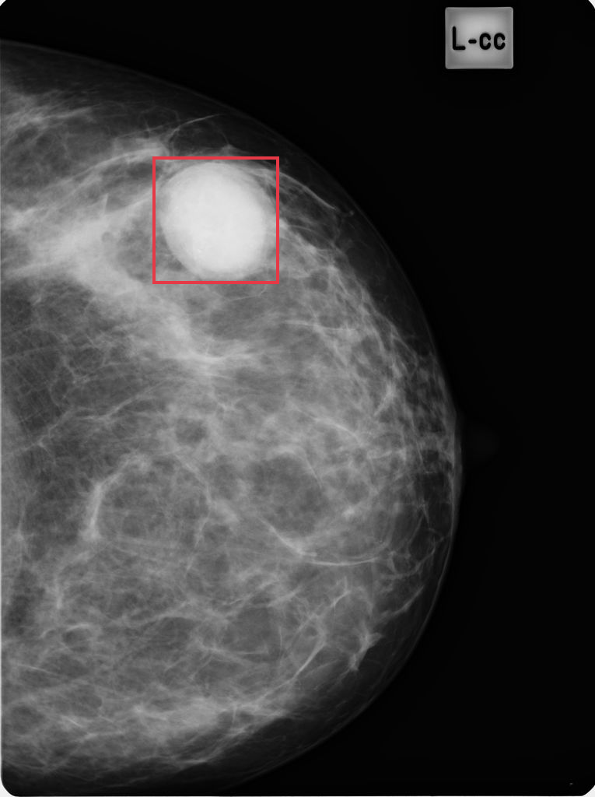
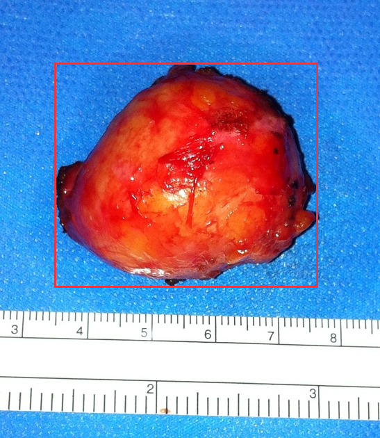
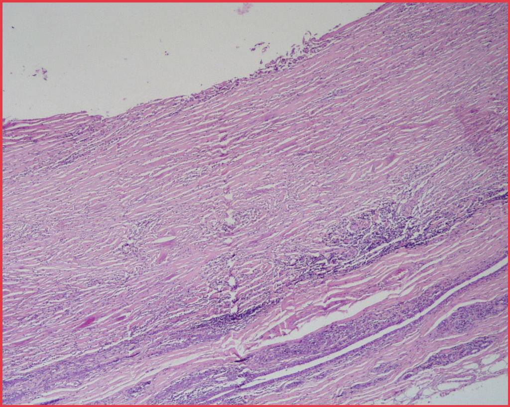
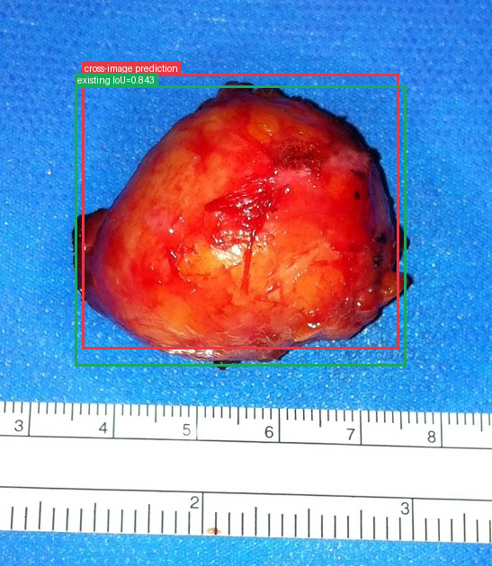

# Wall echo shadow sign (breast)

[返回 Step 3 总览](../README_STEP3_VISUALIZATION.md)

- **Case ID：** `wall-echo-shadow-sign-breast`
- **Case URL：** [https://radiopaedia.org/cases/wall-echo-shadow-sign-breast?lang=us](https://radiopaedia.org/cases/wall-echo-shadow-sign-breast?lang=us)
- **验证模型：** Qwen3-VL-8B
- **图像 / Step 2 findings：** 5 / 3
- **定位结果：** strong 1；partial 0；not support 1；parse error 0
- **Strong bbox relations：** 1
- **原始 JSON：** [case_evidence.json](../assets_step3/wall-echo-shadow-sign-breast/case_evidence.json)

**Overlay 图例：** 红框为跨图新定位；绿框为 IoU >= 0.5 的已有 bbox；黄框为未达到阈值的已有 bbox。

## Step 2 Finding Nodes

### Finding 1: `study_001_mammography_image_000_cc_f01`

- **Modality / subcategory：** Mammography / CC
- **bbox_2d：** `[257, 197, 469, 356]`
- **Lingshu caption：** The mammogram shows a well-defined, round mass located in the upper outer quadrant of the left breast. The mass appears to have smooth margins and is relatively homogeneous in density. Surrounding breast tissue exhibits typical fibroglandular densities without any additional suspicious lesions or architectural distortions noted in this view.

### Finding 2: `study_002_pathology_image_000_gross_pathology_f01`

- **Modality / subcategory：** Pathology / Gross pathology
- **bbox_2d：** `[144, 144, 837, 656]`
- **Lingshu caption：** The image shows a gross pathology specimen, likely a resected tumor or mass. The specimen appears to be a well-circumscribed, reddish-orange mass with a smooth, glistening surface. The mass is approximately 5-6 cm in diameter, as indicated by the scale bar. Within the boxed region, there appears to be a distinct area of discoloration or irregularity on the surface of the mass, which may represent an area of necrosis, hemorrhage, or other pathological change. However, without additional clinical information or microscopic examination, the specific nature of this finding cannot be determined.

### Finding 3: `study_002_pathology_image_001_h_e_f01`

- **Modality / subcategory：** Pathology / H&amp;E
- **bbox_2d：** `[0, 0, 1000, 1000]`
- **Lingshu caption：** The image shows a histological section stained with hematoxylin and eosin (H&amp;E). The tissue appears to be composed of densely packed cells with varying degrees of staining intensity. The boxed region highlights an area with a distinct pattern of cellular arrangement and staining characteristics compared to the surrounding tissue. This region exhibits a more pronounced presence of inflammatory cells, possibly lymphocytes, which are densely clustered together. The surrounding tissue shows a more uniform distribution of cells with less prominent inflammatory infiltrate. The overall architecture suggests a possible pathological process involving inflammation or immune response.

## Directed Cross-image Validation

### Anchor 1: `study_001_mammography_image_000_cc_f01`

**Anchor Lingshu caption：** The mammogram shows a well-defined, round mass located in the upper outer quadrant of the left breast. The mass appears to have smooth margins and is relatively homogeneous in density. Surrounding breast tissue exhibits typical fibroglandular densities without any additional suspicious lesions or architectural distortions noted in this view.

#### location_00001: STRONG SUPPORT

<table>
<tr><th>Anchor original bbox</th><th>Cross-image grounded target bbox</th><th>Existing target bbox: study_002_pathology_image_000_gross_pathology_f01</th></tr>
<tr><td></td><td></td><td></td></tr>
</table>

- **Target：** `study_002_pathology_image_000_gross_pathology`; Pathology; Gross pathology
- **Relation：** `bbox_to_bbox` / `strong_support`
- **Returned target bbox：** `[168, 131, 812, 618]`
- **Maximum IoU：** 0.843; threshold=0.5
- **Strong relation IDs：** `[&#x27;strong_location_00001_01&#x27;]`

**IoU matching：**

| Existing target bbox | IoU | Strong match | Lingshu caption |
|---|---:|---|---|
| `study_002_pathology_image_000_gross_pathology_f01`; `[144, 144, 837, 656]` | 0.843 | yes | The image shows a gross pathology specimen, likely a resected tumor or mass. The specimen appears to be a well-circumscribed, reddish-orange mass with a smooth, glistening surface. The mass is approximately 5-6 cm in diameter, as indicated by the scale bar. Within the boxed region, there appears to be a distinct area of discoloration or irregularity on the surface of the mass, which may represent an area of necrosis, hemorrhage, or other pathological change. However, without additional clinical information or microscopic examination, the specific nature of this finding cannot be determined. |

#### location_00002: NOT SUPPORT

<table>
<tr><th>Anchor original bbox</th><th>Target original image; model returned null</th><th>Existing target bbox: study_002_pathology_image_001_h_e_f01</th></tr>
<tr><td></td><td></td><td></td></tr>
</table>

- **Target：** `study_002_pathology_image_001_h_e`; Pathology; H&amp;E
- **Relation：** `bbox_to_image` / `not_support`
- **Returned target bbox：** `unknown`
- **Maximum IoU：** n/a; threshold=0.5
- **Strong relation IDs：** `[]`

**IoU matching：**

| Existing target bbox | IoU | Strong match | Lingshu caption |
|---|---:|---|---|
| `study_002_pathology_image_001_h_e_f01`; `[0, 0, 1000, 1000]` | n/a | n/a | The image shows a histological section stained with hematoxylin and eosin (H&amp;E). The tissue appears to be composed of densely packed cells with varying degrees of staining intensity. The boxed region highlights an area with a distinct pattern of cellular arrangement and staining characteristics compared to the surrounding tissue. This region exhibits a more pronounced presence of inflammatory cells, possibly lymphocytes, which are densely clustered together. The surrounding tissue shows a more uniform distribution of cells with less prominent inflammatory infiltrate. The overall architecture suggests a possible pathological process involving inflammation or immune response. |

## Dynamically Skipped Anchors

| Anchor node | Reused strong relations | Skipped target images |
|---|---|---|
| `study_002_pathology_image_000_gross_pathology_f01` | `[&#x27;strong_location_00001_01&#x27;]` | `[&#x27;study_002_pathology_image_001_h_e&#x27;]` |

## Case-level Location Validation Summary / 病例级定位验证总结

- **Strong support：** 1 个 bbox-to-bbox 关系
- **Partial support：** 0 个 bbox-to-image 关系
- **Not support：** 1 个 bbox-to-image 关系

### Strong Support

#### Strong 1: `study_001_mammography_image_000_cc_f01` ↔ `study_002_pathology_image_000_gross_pathology_f01`

- **Relation / query：** `strong_location_00001_01` / `location_00001`
- **IoU：** 0.843（threshold=0.5）

<table>
<tr><th>Anchor bbox</th><th>Cross-image grounded target bbox</th><th>Matched target bbox</th></tr>
<tr><td></td><td></td><td></td></tr>
</table>

- **Anchor Lingshu caption：** The mammogram shows a well-defined, round mass located in the upper outer quadrant of the left breast. The mass appears to have smooth margins and is relatively homogeneous in density. Surrounding breast tissue exhibits typical fibroglandular densities without any additional suspicious lesions or architectural distortions noted in this view.
- **Target Lingshu caption：** The image shows a gross pathology specimen, likely a resected tumor or mass. The specimen appears to be a well-circumscribed, reddish-orange mass with a smooth, glistening surface. The mass is approximately 5-6 cm in diameter, as indicated by the scale bar. Within the boxed region, there appears to be a distinct area of discoloration or irregularity on the surface of the mass, which may represent an area of necrosis, hemorrhage, or other pathological change. However, without additional clinical information or microscopic examination, the specific nature of this finding cannot be determined.

### Partial Support

该病例没有 partial-support 查询。

### Not Support

#### Not support 1: `study_001_mammography_image_000_cc_f01` → `study_002_pathology_image_001_h_e`

- **Query：** `location_00002`
- **Result：** 目标图返回 `null`，未定位到对应区域。

<table>
<tr><th>Anchor bbox</th><th>Target original image</th></tr>
<tr><td></td><td></td></tr>
</table>
